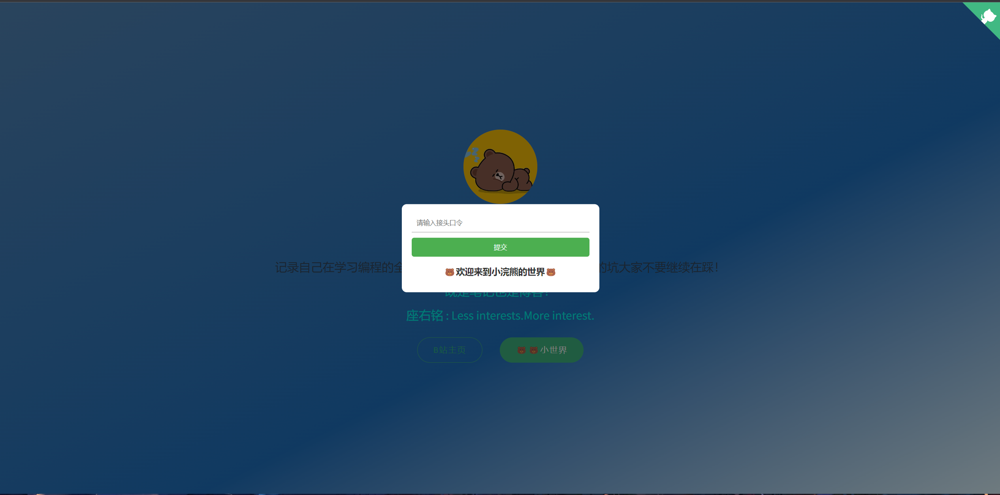

# 笔记的开发模板

# 主要是一款笔记的开发模板，里面包含自己的个人笔记

> 记录自己的学习过程，应该是一件很开心的过程，笔记只有自己的往往，看的时候才是最熟悉的，学的最快的。

# 功能分区

## 输入密码验证登录
> 只是防止小白的，稍微有点技术的人，分分钟破解，为了减少一下有人恶意访问而已。
1. 采用cookie过期，来做长久登录
2. 当cookie值不正确或者不存在的时候，则需要输入密码进行验证。
3. 验证通过就会将正确的cookie存入到浏览器cookie中。

