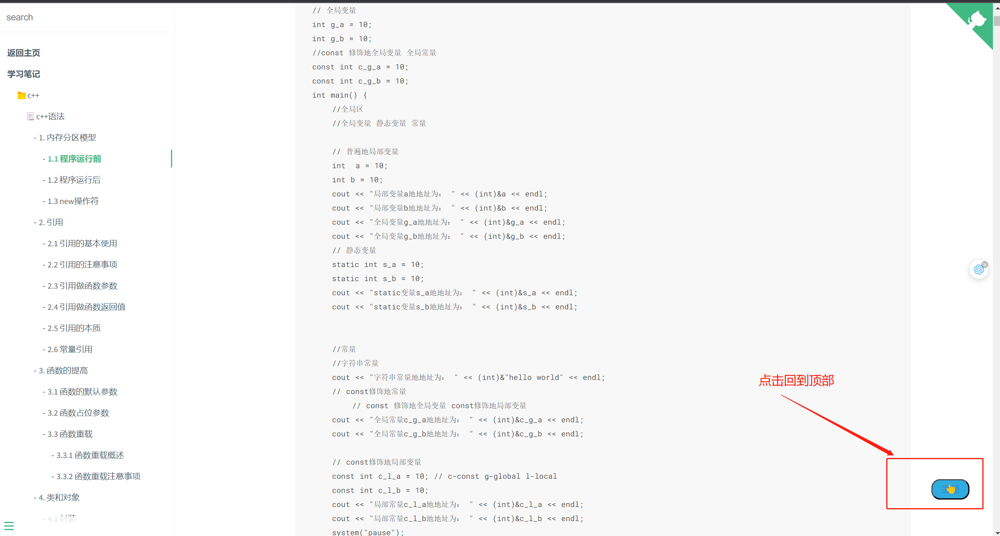

# 笔记的开发模板

+ 主要是当作个人笔记或者个人的知识库来做的，分享出来希望各位小伙伴也可以用来做自己的知识库，这是我的荣幸。
+ 本项目是基于“docsify”来开发的，个人也会不间断的开发一些小功能给此项目。
+ 如果小伙伴有什么好的想法，都可以提出来，大家一起开发一些小功能。
+ 本项目所用到的js文件、css文件均在本地，没有三方的url，所以很稳定，大家放心使用。
> 记录自己的学习过程，应该是一件很开心的过程，笔记只有自己的往往，看的时候才是最熟悉的，学的最快的。

> 个人知识库记录有以下内容

1. 语言类
   + C++开发，WEB开发，java开发，数据库（SQL类型，NOSQL类型），golang开发等；
2. 编程技巧
   + 各种小工具分享；
3. 博客分享，踩坑分享，及其解决方法；
4. 项目分享，既有项目文档，也有对应的仓库地址；
5. 面试笔记；
6. 深度学习相关知识和实战；
7. 计算机基础知识；
8. 国外公开课笔记；
9. 数字孪生知识及其项目文档分享；
10. `IDE`使用技巧及其相关插件
11. 算法
12. 最后也附上了个人联系方式，希望和大家一起交流，如果出现错误，也希望各位小伙伴积极联系我，我也会第一时间做改正；谢谢🙏🙏🙏

# 功能分区

## 输入密码验证登录
> 只是防止小白的，稍微有点技术的人，分分钟破解，为了减少一下有人恶意访问而已。
+ 文件：`./src/js/password.js`
1. 采用cookie过期，来做长久登录
2. 当cookie值不正确或者不存在的时候，则需要输入密码进行验证。
3. 验证通过就会将正确的cookie存入到浏览器cookie中。

## 回到顶部
> 当文档读到一定的位置我们想要回到顶部，滑动滚动条比较费时费力，所以这么一个小按钮就比较重要，可以很大程度上帮助我们。
+ 文件：`./src/js/clickHeader.js`
+ 当滚动条在一定的位置之后才会显示出来

