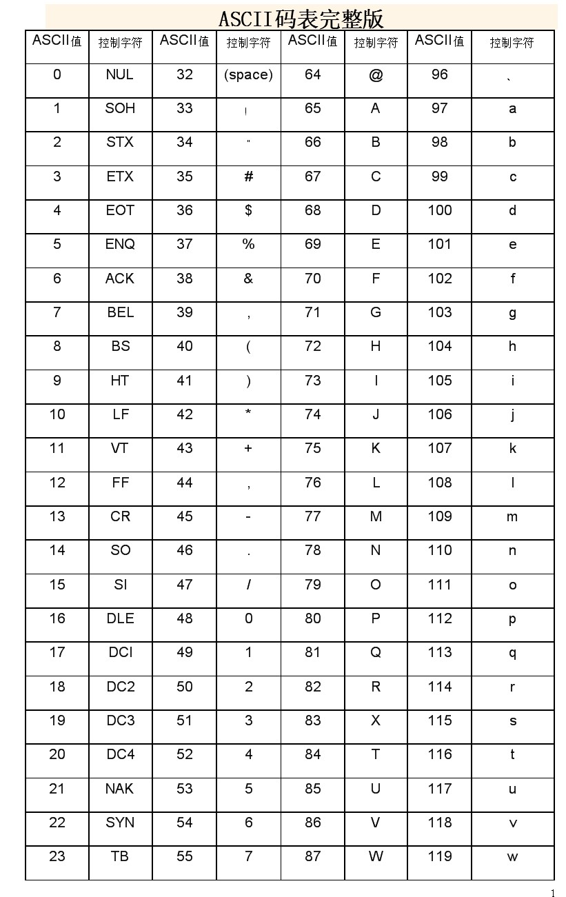
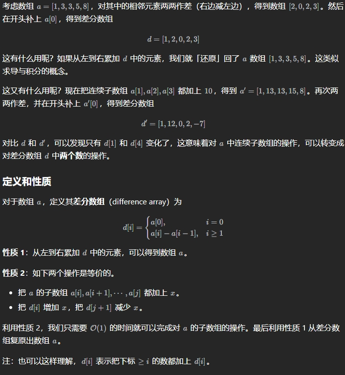
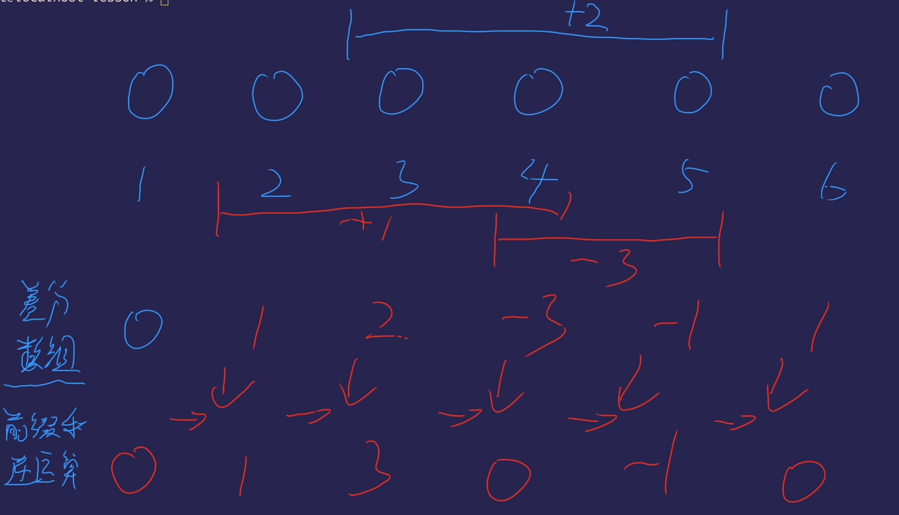
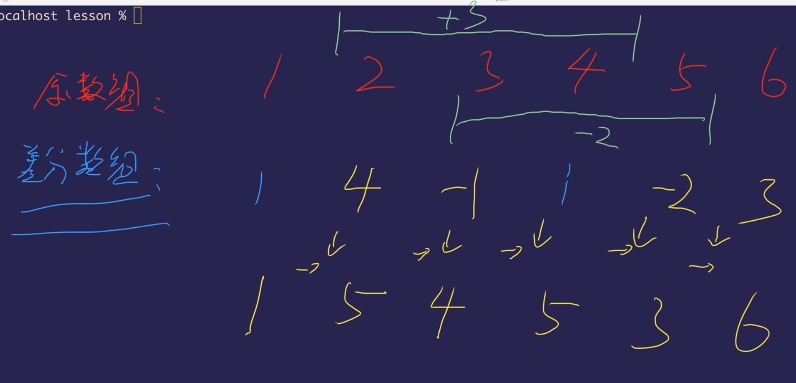
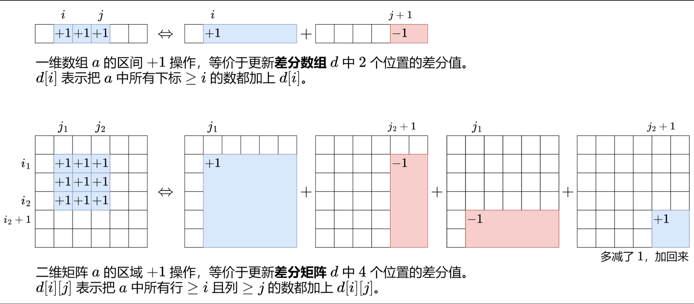
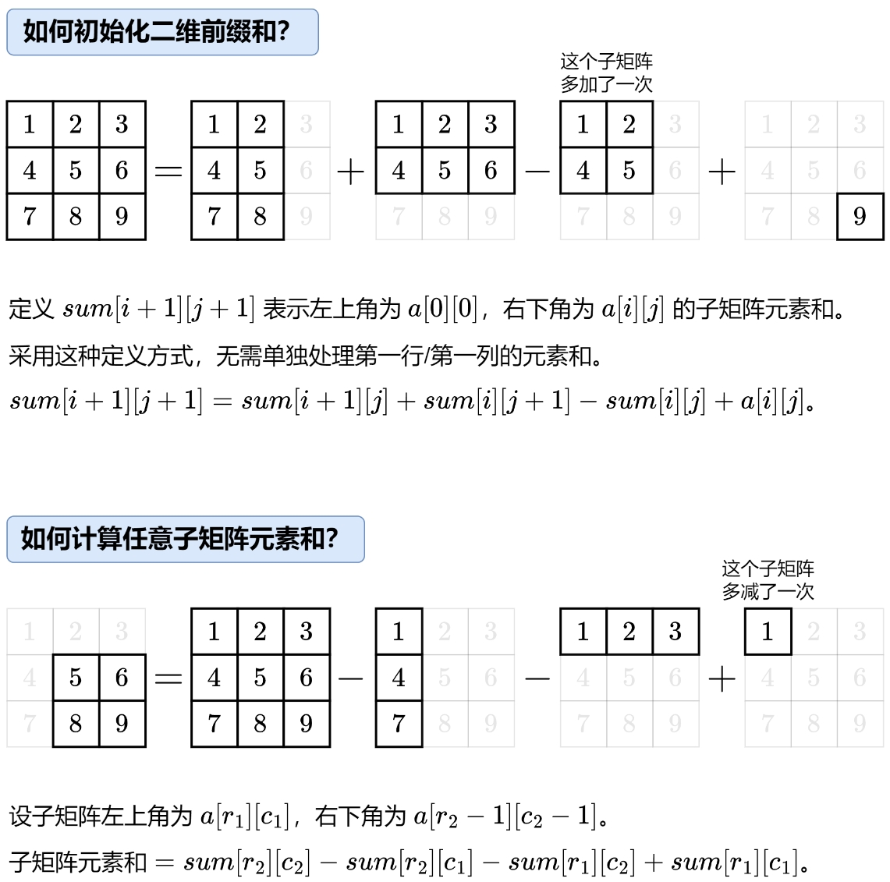
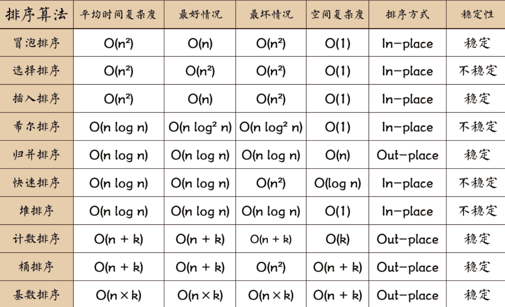

[LeetCode练习](https://github.com/zjxWeb/leetcode)
<!-- tabs:start -->

#### **ASCII码表**



#### **链表测试模板**
```C++
#include <iostream>

using namespace std;

struct ListNode {
    int val;
    ListNode* next;
    ListNode() : val(0), next(nullptr) {}
    ListNode(int x) : val(x), next(nullptr) {}
    ListNode(int x, ListNode* next1) : val(x), next(next1) {}
};
ostream& operator<<(ostream& os, ListNode* lp) {
    ListNode* cur = lp;
    while (cur != nullptr) {
        os << cur->val << " -> ";
        cur = cur->next;
    }
    os << "∅";
    return os << endl;
}
/**
* 24.两两交换链表中的节点【中等】【链表】
*/
//class Solution {
//public:
//    ListNode* swapPairs(ListNode* head) {
//        ListNode* fHead = new ListNode(0);
//        fHead->next = head;
//        ListNode* cur = fHead; // 记录当前节点
//        while (cur->next != nullptr && cur->next->next != nullptr)
//        {
//            ListNode* t1 = cur->next;
//            ListNode* t2 = cur->next->next;
//            ListNode* t3 = cur->next->next->next;
//            cur->next = t2;
//            cur->next->next = t1;
//            cur->next->next->next = t3;
//
//            // 移动cur准备下一次交换，
//            cur = cur->next->next;
//        }
//        return fHead->next;
//    }
//};

/**
* 19. 删除链表的倒数第 N 个结点
*/
class Solution {
public:
    ListNode* removeNthFromEnd(ListNode* head, int n) {
        ListNode * pHead = new ListNode(0);
        pHead->next = head;
        ListNode * cur = pHead;
        ListNode * lenHead = pHead;
        int count = 0;
        int len = 0;
        while (lenHead->next != nullptr)
        {
            lenHead = lenHead->next;
            len++;
        }
        while (cur->next != nullptr)
        {
            count++;
            if (len-n+1 == count)
            {
                ListNode* temp = cur->next;
                cur->next = cur->next->next;
                delete temp;
            }
            else
            {
                cur = cur->next;
            }
        }
        head = pHead->next;
        delete pHead;
        return head;
    }
};
int main(int argc, char* argv[]) {
    ListNode* head = new ListNode(1);
    ListNode* cur = head;
    for (auto& i : { 2, 3, 4 ,5}) {
        cur->next = new ListNode(i);
        cur = cur->next;
    }
    cout << head;
    // 这里就是题目中函数的调用了, 下面是一个示例(24题)
    /*
    Solution s;
    cout << s.swapPairs(head);
    */
    // 别忘了释放内存(虽然系统会帮我们释放)
    Solution s;
    int n = 2;
    cout << s.removeNthFromEnd(head,n);
    delete head;
    return 0;
}

```
#### **二叉树遍历完整版**

```c++
#include<iostream>
#include<vector>
#include<stack>

using namespace std;

struct TreeNode {
    int val;
    TreeNode* left;
    TreeNode* right;
    TreeNode() : val(0), left(nullptr), right(nullptr) {}
    TreeNode(int x) : val(x), left(nullptr), right(nullptr) {}
    TreeNode(int x, TreeNode* left, TreeNode* right) : val(x), left(left), right(right) {}
};
// 前序遍历递归
//class Solution {
//public:
//    vector<int>res;
//    vector<int> preorderTraversal(TreeNode* root) {
//        if (root == NULL) return res;
//        res.push_back(root->val);
//        preorderTraversal(root->left);
//        preorderTraversal(root->right);
//        return res;
//    }
//};

//// 前序遍历迭代
//class Solution {
//public:
//    vector<int> preorderTraversal(TreeNode* root) {
//        stack<TreeNode*>sta;
//        vector<int>res;
//        if (root == NULL) return res;
//        sta.push(root);
//        while (!sta.empty()) {
//            TreeNode* node = sta.top();
//            sta.pop();
//            res.push_back(node->val);
//            if (node->right) sta.push(node->right);
//            if (node->left) sta.push(node->left);
//        }
//        return res;
//    }
//};

// 中序遍历
//class Solution {
//public:
//    vector<int>res;
//    vector<int> preorderTraversal(TreeNode* root) {
//        if (root == NULL) return res;
//        preorderTraversal(root->left);
//        res.push_back(root->val);
//        preorderTraversal(root->right);
//        return res;
//    }
//};
// 中序遍历迭代
//class Solution {
//public:
//    vector<int> preorderTraversal(TreeNode* root) {
//        stack<TreeNode*>sta;
//        vector<int>res;
//        TreeNode* cur = root;
//        while (cur != NULL || !sta.empty()) {
//            if (cur != NULL) {
//                sta.push(cur);
//                cur = cur->left;
//            }
//            else
//            {
//                cur = sta.top();
//                sta.pop();
//                res.push_back(cur->val);
//                cur = cur->right;
//            }
//        }
//        return res;
//    }
//};
// 后序遍历(递归)
//class Solution {
//public:
//    vector<int>res;
//    vector<int> preorderTraversal(TreeNode* root) {
//        if (root == NULL) return res;
//        preorderTraversal(root->left);
//        preorderTraversal(root->right);
//        res.push_back(root->val);
//        return res;
//    }
//};
// 后序遍历(迭代)
class Solution {
public:
    vector<int> preorderTraversal(TreeNode* root) {
        stack<TreeNode*>sta;
        vector<int>res;
        if (root == NULL) return res;
        sta.push(root);
        while (!sta.empty()) {
            TreeNode* node = sta.top();
            sta.pop();
            res.push_back(node->val);
            if (node->left) sta.push(node->left); // 相对于前序遍历，这更改一下入栈顺序 （空节点不入栈）
            if (node->right) sta.push(node->right); // 空节点不入栈
        }
        reverse(res.begin(), res.end());
        return res;
    }
};
int main()
{
    Solution s;
    TreeNode* root = new TreeNode(1);
    root->left = new TreeNode(2);
    root->right = new TreeNode(3);
    root->left->left = new TreeNode(4);
    root->left->right = new TreeNode(5);
    for (auto el : s.preorderTraversal(root)) {
        cout << el << endl;
    }
}

```

#### **回溯模板**

```c++
void backtracking(参数) {
    if (终止条件) {
        存放结果;
        return;
    }

    for (选择：本层集合中元素（树中节点孩子的数量就是集合的大小）) {
        处理节点;
        backtracking(路径，选择列表); // 递归
        回溯，撤销处理结果
    }
}
```
> N皇后

```cpp
class Solution {
public:
    vector<vector<string>> solveNQueens(int n) {
        vector<vector<string>> ans;// 记录结果
        vector<int>path(n);// 记录路径上的数
        vector<int>on_path(n);// 记录未选的数
        vector<int>diag1(2 * n - 1);// r +c 
        vector<int>diag2(2 * n - 1);// r - c
        // dfs
        function<void(int)> dfs = [&](int k){
            if(k == n){
                vector<string> board(n);// 记录棋盘
                for(int i = 0; i < n; ++i)board[i] = string(path[i],'.') + 'Q' + string(n - 1 - path[i],'.');
                ans.push_back(board);
                return;
            }
            for(int j = 0; j < n; j++){
                if(!on_path[j] && !diag1[k + j] &&!diag2[k - j + n -1]){ // k+j 右上 k-j 左上  n-1是为了避免负数
                    path[k] = j;
                    on_path[j] = diag1[k + j] = diag2[k - j + n -1] = true;
                    dfs(k+1);
                    on_path[j] = diag1[k + j] = diag2[k - j + n -1] = false;// 恢复现场
                }
            }
        };
        dfs(0);
        return ans;
    }
};
```

> [198. 打家劫舍](https://leetcode.cn/problems/house-robber/)

```cpp
class Solution {
public:
    int rob(vector<int>& nums) {
        int n = nums.size();
      // 1. 递归搜索 + 保存计算结果 = 记忆化搜索
        vector<int>memo(n,-1);// -1表示没有计算
        // dfs
        function<int(int)> dfs = [&](int i) -> int{
           if(i < 0) return 0; // 边界条件  没有房子
           if(memo[i]!= -1) return memo[i]; // 之前计算过
           return memo[i] = max(nums[i] + dfs(i-2), dfs(i-1));
        };
        return dfs(n-1);
    // 2. 1:1 翻译成递推
        vector<int>f(n+2);
        for(int i = 0; i < n; i++) f[i+2] = max(f[i+ 1] , f[i] + nums[i]);
        return f[n+1];
    // 空间优化
    // f0表示上一个  f1表示上上一个
        int f0 = 0, f1 = 0;
        for(auto el : nums){
            int new_f = max(f1, f0 + el);
            f0 = f1;
            f1 = new_f;
        }
        return f1;
    }
};
```

#### **并查集模板**

> 并查集是一种树型的数据结构，用于处理一些不相交集合的合并及查询问题（即所谓的并、查）。比如说，我们可以用并查集来判断一个森林中有几棵树、某个节点是否属于某棵树等。

1. 定义数据结构

```c++
int fa[100010]; // fa[i]表示i的父亲
```

2. 定义查找函数

```c++
int find(int x){
	// 如果i的父亲是他自己，那么返回自己
	if(x==fa[x]) return x;
	// 如果不是的话
	else{
	// 找到他的父亲
	// 并且令他的父亲为他父亲的父亲
	// 即路径压缩
	fa[x]=find(fa[x]);
	// 返回他的父亲
	return fa[x];
}

```

> 进行简化

```c++
int find(int x){
	return fa[x]==x ? x : fa[x]=find(fa[x]);
}
```

3. 定义合并函数

```c++
void unity(int x,int y){
	// 将y的父亲指向x的父亲，即合并xy
	// 这里x和y可以互换位置，不影响最终结果
	fa[find(y)]=find(x);
}
```


#### **差分数组（前缀和的逆运算）**



> 区间加

+ a = [0,0,0,0,0,0]要求给下标2到4的位置+2
  + 差分数组：0  0  2  0  0  -2 （修改起始位2，和结束的后一位4+1 = 5）
  + 前缀和：   0   0  2  2  2   0
+ 

+ 

> leetcode 1094.cpp  拼车

```c++
class Solution {
public:
    bool carPooling(vector<vector<int>>& trips, int capacity) {
        // 差分数组(第一种写法)
        int a[1001]{};
        for(auto &el : trips){
            int num = el[0],from = el[1],to = el[2];
            a[from] += num;
            a[to] -= num;
        }
        int s= 0;
        for(int i= 0;i<1001;i++){
            s += a[i];
            if(s > capacity) return false;
        }
        return true;

        // 差分数组(第二种写法)
        map<int,int> m;
        for(auto &el : trips){
            int num = el[0],from = el[1],to = el[2];
            m[from] += num;
            m[to] -= num;
        }
        int s = 0;
        for(auto [_,vallue]: m){
            s += vallue;
            if(s > capacity) return false;
        }
        return true;
    }   
};
```

>  一维差分的思想可以推广至二维



>  二维前缀和



+ 模板

```c++
class MatrixSum {
private:
    vector<vector<int>> sum;

public:
    MatrixSum(vector<vector<int>> &matrix) {
        int m = matrix.size(), n = matrix[0].size();
        // 注意：如果 matrix[i][j] 范围很大，需要使用 long long
        sum = vector<vector<int>>(m + 1, vector<int>(n + 1));
        for (int i = 0; i < m; i++) {
            for (int j = 0; j < n; j++) {
                sum[i + 1][j + 1] = sum[i + 1][j] + sum[i][j + 1] - sum[i][j] + matrix[i][j];
            }
        }
    }

    // 返回左上角在 (r1,c1) 右下角在 (r2-1,c2-1) 的子矩阵元素和（类似前缀和的左闭右开）
    int query(int r1, int c1, int r2, int c2) {
        return sum[r2][c2] - sum[r2][c1] - sum[r1][c2] + sum[r1][c1];
    }

    // 如果你不习惯左闭右开，也可以这样写
    // 返回左上角在 (r1,c1) 右下角在 (r2,c2) 的子矩阵元素和
    int query2(int r1, int c1, int r2, int c2) {
        return sum[r2 + 1][c2 + 1] - sum[r2 + 1][c1] - sum[r1][c2 + 1] + sum[r1][c1];
    }
};
```

> 2132 用邮票贴满网格图

```c++
class Solution {
public:
    bool possibleToStamp(vector<vector<int>>& grid, int stampHeight, int stampWidth) {
        // 先计算前缀和
        int n = grid.size(),m = grid[0].size();
        // 定义前缀和数组
        vector<vector<int>> sum(n+1,vector<int>(m+1));
        for (int i = 0; i < n; i++){
            for(int j = 0;j < m;j++){
                sum[i+1][j+1] = sum[i+1][j]+sum[i][j+1]-sum[i][j]+grid[i][j];
            }
        }
        // 差分数组
        // 为方便第 3 步的计算，在 d 数组的最上面和最左边各加了一行（列），所以下标要 +1
        vector<vector<int>> d(n+2,vector<int>(m+2));
        for(int i = stampHeight;i < n+1;i++){
            for(int j = stampWidth;j < m+1;j++){
                int h = i - stampHeight + 1;
                int w = j - stampWidth + 1;
                // 判断子矩阵能不能放邮票
                if(sum[i][j] - sum[i][w-1] - sum[h-1][j] + sum[h-1][w-1] == 0){
                    d[h][w]++;
                    d[h][j+1]--;
                    d[i+1][w]--;
                    d[i+1][j+1]++;
                }
            }
        }
        // 还原差分矩阵
        for(int i = 0;i < n;i++){
            for(int j = 0; j < m;j++){
                d[i+1][j+1] += d[i+1][j] + d[i][j+1] - d[i][j];
                if(grid[i][j] == 0 && d[i+1][j+1] == 0) return false;
            }
        }
        return true;
    }
};
```

#### **二维转一维（一次二分）**

```c++
class Solution {
public:
    bool searchMatrix(vector<vector<int>>& matrix, int target) {
         int n = matrix.size(),m = matrix[0].size();
        int l = 0,r = n * m - 1;
        while(l <= r){
            int mid = l + ((r - l) >> 1);
            int row = mid / m, col = mid % m;
            if(matrix[row][col] == target) return true;
            else if(matrix[row][col] > target) r = mid - 1;
            else l = mid + 1;
        }
        return false;
    }
};
```

#### **lazy线段树**
> 问题： 一个数组，更新一个子数组的值（都加上一个数、把子数组内的元素取反）    查询一个子数组的值（求和，求最大值）

+ 两大思想
    1. 挑选O(n) 个特殊区间，使得任意一个区间可以拆分为 O(log n) 个特殊区间(用最近公共祖先来思考)  O(n) <= 4n
    
      + 挑选O(n)个特殊区间：build  参数：结点的编号；左端点值；右端点的值；
  
    2. lazy更新/延迟更新

       + lazy tag：用一个数组维护每个区间需要更新的值
       + 如果这个值 = 0（不一定是0，按题目来），表示不需要更新
       + 如果这个值 != 0,表示更新操作在这个区间停住了，不需要递归更新子区间了。
       + 如果后面又来了一个更新，破坏了有lazy tag的区间，那么这个区间就得继续递归更新

```c++

   int n = nums1.size();
   vector<int> todo(4*n,0);
   void build(vector<int> &a, int o, int l, int r) {
        if (l == r) {
            cnt1[o] = a[l - 1];
            return;
        }
        int m = (l + r) / 2; // 取中点
        build(a, o * 2, l, m); // 左儿子
        build(a, o * 2 + 1, m + 1, r); // 右儿子
        // 维护
    }

    // 更新 [L,R]   o,l,r=1,1,n
    void update(int o, int l, int r, int L, int R, int add) {
        if (L <= l && r <= R) { // 区间被包含了
            // 更新……
            todo[o] += add;// 不在继续递归更新
            return;
        }
        int m = (l + r) / 2;

        // 破坏了就要更新
        // 需要继续递归，就把todo[o]得内容传下去（给左右儿子）
        if (todo[o] != 0){
            todo[o*2] += todo[o];//left
            todo[o*2+1] += todo[o];// right
            todo[o] = 0; // 清空
        }

        // 有交集
        if (m >= L) update(o * 2, l, m, L, R, add);
        if (m < R) update(o * 2 + 1, m + 1, r, L, R, add);
        // 维护操作
    }
```
#### **预处理回文数**

```c++
vector<int> pal;

auto init = [] {
    // 严格按顺序从小到大生成所有回文数（不用字符串转换）
    for (int base = 1; base <= 10000; base *= 10) {
        // 生成奇数长度回文数
        for (int i = base; i < base * 10; i++) {
            int x = i;
            for (int t = i / 10; t; t /= 10) {
                x = x * 10 + t % 10;
            }
            pal.push_back(x);
        }
        // 生成偶数长度回文数
        if (base <= 1000) {
            for (int i = base; i < base * 10; i++) {
                int x = i;
                for (int t = i; t; t /= 10) {
                    x = x * 10 + t % 10;
                }
                pal.push_back(x);
            }
        }
    }
    pal.push_back(1'000'000'001); // 哨兵，防止下面代码中的 i 下标越界
    return 0;
}();
```

#### **单调栈**

> 存在三种情况 
>
> - 情况一：当前遍历的元素T[i]小于栈顶元素T[st.top()]的情况
> - 情况二：当前遍历的元素T[i]等于栈顶元素T[st.top()]的情况
> - 情况三：当前遍历的元素T[i]大于栈顶元素T[st.top()]的情况

`只有单调栈递增（从栈口到栈底顺序），就是求右边第一个比自己大的，单调栈递减的话，就是求右边第一个比自己小的。`

> 每日温度

```c++
// 版本一
class Solution {
public:
    vector<int> dailyTemperatures(vector<int>& T) {
        // 递增栈
        stack<int> st;
        vector<int> result(T.size(), 0);
        st.push(0);
        for (int i = 1; i < T.size(); i++) {
            if (T[i] < T[st.top()]) {                       // 情况一
                st.push(i);
            } else if (T[i] == T[st.top()]) {               // 情况二
                st.push(i);
            } else {
                while (!st.empty() && T[i] > T[st.top()]) { // 情况三
                    result[st.top()] = i - st.top();
                    st.pop();
                }
                st.push(i);
            }
        }
        return result;
    }
};
```

> 直接把情况一二三都合并到了一起

```c++
// 版本二
class Solution {
public:
    vector<int> dailyTemperatures(vector<int>& T) {
        stack<int> st; // 递增栈
        vector<int> result(T.size(), 0);
        for (int i = 0; i < T.size(); i++) {
            while (!st.empty() && T[i] > T[st.top()]) { // 注意栈不能为空
                result[st.top()] = i - st.top();
                st.pop();
            }
            st.push(i);

        }
        return result;
    }
};
```

#### **优先队列/堆**

[优先队列](/study/c++/c++base/?id=_6-优先队列)

> 参考[347. 前 K 个高频元素](https://leetcode.cn/problems/top-k-frequent-elements/)

```c++
class Solution {
public:
    // 小顶堆
    class mycomparison {
    public:
        bool operator()(const pair<int, int>& lhs, const pair<int, int>& rhs) {
            return lhs.second > rhs.second;
        }
    };
    vector<int> topKFrequent(vector<int>& nums, int k) {
        // 统计出现的次数
        unordered_map<int, int> m;
        for (int i = 0; i < nums.size(); i++) m[nums[i]]++;
        priority_queue<pair<int, int>, vector<pair<int, int>>, mycomparison> q;
        for (auto it = m.begin(); it!= m.end(); it++) {
            q.push(make_pair(it->first, it->second));
            if (q.size() > k) q.pop();
        }
        // 找出前k个，倒序输出
        vector<int> res;
        while (!q.empty()) {
            res.push_back(q.top().first);
            q.pop();
        }
        reverse(res.begin(), res.end());
        return res;
    }
};
```

#### **位运算总结**

> C++ int 是signed  所以说 `i >= 0` 和 `~i` 是等价的

<!-- tabs:end -->

<!-- tabs:start -->

#### **概述**

> [912. 排序数组](https://leetcode.cn/problems/sort-an-array/)



>注：下面对应方法的时间复杂度均代表平均时间复杂度
>稳定排序：如果 a 原本在 b 前面，且 a == b，排序之后 a 仍然在 b 前面。
>非稳定排序：如果 a 原本在 b 前面，且 a == b，排序之后 a 不一定在 b 前面。
>原地排序 / 非原地排序：区别在于是否 使用额外的数组 辅助排序

#### **冒泡排序**

> （Bubble Sort）（稳定排序）（超出时间限制）

+ 比较相邻元素，如果第一个比第二个大，则交换。

+ 时间复杂度`n^2`，空间复杂度1

代码：

```c++
class Solution {
public:
    vector<int> sortArray(vector<int>& nums) {
        // bubbleSort
        int n = nums.size();
        for (int i = 0; i < n - 1; ++i) {
            bool flag = false;
            for (int j = 0; j < n - 1 - i; ++j) {
                if (nums[j] > nums[j + 1]) {
                    swap(nums[j], nums[j + 1]);
                    flag = true;
                }                 
            }
            if (flag == false) break; //无交换，代表当前序列已经最优 
        }
        return nums;
    }
};
```

#### **选择排序**

>  （Select Sort）（非稳定排序）（超出时间限制）

+ 依次给每个位置选择当前位置及以后最小的元素（交换当前元素与之后最小元素的位置）。

> 不稳定举例：
> 排序前：5, 5*, 1, 7
> 排序后：1, 5*, 5, 7

+ 时间复杂度n^2，空间复杂度1

代码：

```c++
class Solution {
public:
    vector<int> sortArray(vector<int>& nums) {
        // selectSort 选择排序
        int minIndex;
        int n = nums.size();
        for (int i = 0; i < n - 1; ++i) {
            minIndex = i;
            for (int j = i + 1; j < n; ++j) {
                if (nums[j] < nums[minIndex]) {
                    minIndex = j;
                }
            }
            swap(nums[i], nums[minIndex]);
        }
        return nums;
    }
};
```

#### **插入排序**

> （Insect Sort）（稳定排序）（超出时间限制）
> 在前 0 ~ i - 1 元素有序的情况下，（依次）将第 i 个元素插入前面已经有序的小序列，使其有序。

+ 时间复杂度`n^2`，空间复杂度1

代码：

```c++
class Solution {
public:
    vector<int> sortArray(vector<int>& nums) {
        // insertSort 插入排序
        int n = nums.size();
        // 第一个元素被认为已经被排序
        for (int i = 1; i < n; ++i) {
            // 两元素递增排序，则直接插入
            if (nums[i] >= nums[i - 1]) continue;
            // nums[i] < nums[i - 1]
            // 二分查找，时间复杂度logn
            int l = 0, r = i - 1;
            while (l <= r) {
                int mid = l + (r - l) / 2;
                // r右侧元素均大于 nums[i]，即 r 及其左侧元素均小于等于nums[i]
                if (nums[i] < nums[mid]) r = mid - 1; 
                else l = mid + 1; 
            }
            int index = r + 1; // 稳定排序，依次排列
            // 将当前 i 元素插入在 index 位置，index ~ i - 1 元素依次后移，时间复杂度n
            int tmp = nums[i];
            for (int k = i; k >= index + 1; --k) {
                nums[k] = nums[k - 1]; // 依次后移一位
            }
            nums[index] = tmp;
        }
        return nums;
    }
};
```

#### **希尔排序**

> （Shell Sort）（非稳定排序）
> 改进的插入排序（优化：原数组的一个元素距离正确位置很远的情况）
> 先让间隔 h 的元素有序，在使得间隔为 h / 2，一直缩小，一直到 h = 1（此时数组有序）。

+ 时间复杂度介于nlogn和n^2之间，空间复杂度1

代码：

```c++
class Solution {
    void shellSort(vector<int>&nums, int gap, int i) {
        int j, tmp = nums[i];
        for (j = i - gap; j >= 0 && tmp < nums[j]; j -= gap) {
            // 依次后移
            nums[j + gap] = nums[j];
        }
        nums[j + gap] = tmp;
    }
public:
    vector<int> sortArray(vector<int>& nums) {
        int n = nums.size();
        // 分组，最开始时，间隔 gap 为数组的一半
        for (int gap = n / 2; gap >= 1 ; gap /= 2) {
            // 对各个分组进行插入分组
            for (int i = gap; i < n; ++i) {
                shellSort(nums, gap, i);
            }
        }
        return nums;
    }
};
```

#### **归并排序**

> （Merge Sort）（稳定排序）

+ 将无序数组拆分，排序后再合并成大的有序数组。

+ 时间复杂度nlogn，空间复杂度n

代码：

```C++
class Solution {
    vector<int> tmp;
    void mergeSort (vector<int>& nums, int l, int r) {
        if (l >= r) return; // 不需进行排列
        int mid = l + (r - l) / 2;
        // 自底向上
        mergeSort(nums, l, mid);
        mergeSort(nums, mid + 1, r);
        // 排序当前数组
        int i = l, j = mid + 1, pos = l;
        while (i <= mid && j <= r) {
            if (nums[i] <= nums[j]) {
                tmp[pos] = nums[i];
                ++i;
            } else {
                tmp[pos] = nums[j];
                ++j;
            }
            ++pos;
        }
        for (int k = i; k <= mid; ++k) {
            tmp[pos++] = nums[k];
        }
        for (int k = j; k <= r; ++k) {
            tmp[pos++] = nums[k];
        }
        copy(tmp.begin() + l, tmp.begin() + r + 1, nums.begin() + l);
    }
public:
    vector<int> sortArray(vector<int>& nums) {
        int n = nums.size();
        tmp = nums;
        surgeSort(nums, 0, n - 1);
        return nums;
    }
};

```

#### **快速排序**

> （Quick Sort）（非稳定排序）

+ 随机选取一个数（x = rand() % len + startIndex）作为基准；
+ 把比基准小的数交换到前面，比基准大的数交换到后面；
+ 对左右区间递归重复。

> 时间复杂度nlogn，空间复杂度logn

代码：

```C++
class Solution {
    void quickSort(vector<int>&nums, int startIndex, int endIndex) {
        if (startIndex >= endIndex) return;
        
        int x = rand() % (endIndex - startIndex + 1) + startIndex; // 基于随机的原则
        swap(nums[startIndex], nums[x]);
        int firstNum = nums[startIndex];
        
        int l = startIndex, r = endIndex;
        while (l < r) {
            // 从后往前走，将比第一个小的移到前面
            while (l < r && nums[r] >= firstNum) --r;
            if (l < r) {
                nums[l] = nums[r];
            }
            // 从前往后走，将比第一个大的移到后面
            while (l < r && nums[l] <= firstNum) ++l;
            if (l < r) {
                nums[r] = nums[l];
            }
        }
        nums[l] = firstNum;
        // 自顶向下
        quickSort(nums, startIndex, l - 1);
        quickSort(nums, l + 1, endIndex);
    }

public:
    vector<int> sortArray(vector<int>& nums) {
        int n = nums.size();
        quickSort(nums, 0, n - 1);
        return nums;
    }
};

```

#### **堆排序**

> （Heap Sort）（非稳定排序）

+ 先在原先数组的基础上构造大根堆（时间复杂度nlogn）；
+ 再依次弹出最大元素（每次弹出的时间复杂度为logk，k为当前大根堆中元素数目）。

>  时间复杂度nlogn，空间复杂度1

代码：

```C++
class Solution {
    void buildMaxHeap(vector<int>& nums) {
        int n = nums.size();
        for (int i = (n - 1) / 2; i >= 0; --i) {
            maxHeapify(nums, i, n);
        }
    }

    void maxHeapify(vector<int>& nums, int i, int n) {
        while (i * 2 + 1 < n) {
            // 代表当前 i 节点的左右儿子；
            // 超出数组大小则代表当前 i 节点为叶子节点，不需要移位
            int lSon = 2 * i + 1;
            int rSon = 2 * i + 2;
            int large = i;
            if (lSon < n && nums[lSon] > nums[i]) large = lSon;
            if (rSon < n && nums[rSon] > nums[large]) large = rSon;

            if (large != i) {
                swap(nums[i], nums[large]);
                // 迭代判断对应子节点及其儿子节点的大小关系
                i = large;
            } else {
                break;
            }
        }
    }

public:
    vector<int> sortArray(vector<int>& nums) {
        // heapSort 堆排序
        int n = nums.size();
        // 将数组整理成大根堆
        buildMaxHeap(nums);
        for (int i = n - 1; i >= 1; --i) {
            // 依次弹出最大元素，放到数组最后，当前排序对应数组大小 - 1
            swap(nums[0], nums[i]);
            --n;
            maxHeapify(nums, 0, n);
        }
        return nums;
    }
};
```

#### **计数排序**

> （Count Sort）（稳定排序）
>
> 创建数组 counts，用于统计原数组 nums 中各元素值的出现次数；
> 再依次将元素值赋值到 nums 中对应位置。

+ 计数排序，时间复杂度n + k，空间复杂度k（k = maxNum - minNum + 1）

代码：

```C++
class Solution {
public:
    vector<int> sortArray(vector<int>& nums) {
        // CountSort 计数排序
        int n = nums.size();
        int minNum = INT_MAX, maxNum = INT_MIN;
        // 找到数组中的最小和最大元素
        for (int i = 0; i < n; ++i) {
            if (nums[i] < minNum) minNum = nums[i];
            if (nums[i] > maxNum) maxNum = nums[i];
        }
        // 构造计数数组
        vector<int> counts(maxNum - minNum + 1, 0);
        for (int i = 0; i < n; ++i) {
            ++counts[nums[i] - minNum];
        }
        // 计数排序
        int index = 0;
        for (int i = 0; i < counts.size(); ++i) {
            while (counts[i] != 0) {
                nums[index++] = i + minNum;
                counts[i]--;
            }
        }
        return nums;
    }
};
```

#### **桶排序**

> （Bucket Sort）（稳定排序）

+ 将原数组的元素分到有限数量的桶里（大编号桶里的所有元素均大于小编号桶里的任意元素）；
+ 分别对每个桶进行排序；
+ 依次合并。

>  时间复杂度n + k，空间复杂度n + k（k为桶的数量）

代码：

```C++
class Solution {
public:
    vector<int> sortArray(vector<int>& nums) {
        // BucketSort 桶排序
        int n = nums.size();
        // 获取数组的最小值和最大值
        int maxNum = nums[0], minNum = nums[0];
        for (int i = 1; i < n; ++i) {
            if (nums[i] > maxNum) maxNum = nums[i];
            if (nums[i] < minNum) minNum = nums[i];
        }
        // 初始化桶
        int bucketNum = 5, bucketSize = (maxNum - minNum) / bucketNum + 1;
        vector<vector<int>> buckets(bucketNum, vector<int>(0));
        // 小至大分桶
        for (int num : nums) {
            int bucketIndex = (num - minNum) / bucketSize;
            buckets[bucketIndex].emplace_back(num);
        }
        // 桶内排序
        for (int i = 0; i < buckets.size(); ++i) {
            sort(buckets[i].begin(), buckets[i].end());
        }
        // 从桶中依次取数
        int index = 0;
        for (auto& bucket : buckets) {
            for (int num : bucket) {
                nums[index++] = num;
            }
        }

        return nums;
    }
};
```

#### **基数排序**

> （Radix Sort）（稳定排序）

+ 对数组中所有数依次按由低到高的位数进行多次排序；
+ 每次排序都基于上次排序的结果。
+ （相对位置顺序保持不变）

```tex
例：原始数组 1，23，21，11，32
第一次排序后 1，21，11，32，23
第二次排序后 1，11，21，23，32
```

>  时间复杂度n x k，空间复杂度k（k为最大元素的位数）

代码：

```C++
class Solution {
    vector<int> counts;
    void radixSort(vector<int>& nums, vector<int>& tmp, int divisor) {
        int n = nums.size();
        counts = vector<int>(10, 0);
        // 统计个、十、百、千、万上对应 0 ~ 9 的出现次数
        for (int i = 0; i < n; ++i) {
            int x = (nums[i] / divisor) % 10;
            if (x != 9) ++counts[x + 1];
        }
        // 前缀和
        for (int i = 1; i <= 9; ++i) {
            counts[i] += counts[i - 1];
        }
        // 从前向后赋值
        for (int i = 0; i < n; ++i) {
            int x = (nums[i] / divisor) % 10;
            tmp[counts[x]++] = nums[i];  
        }
    }

public:
    vector<int> sortArray(vector<int>& nums) {
        // RadixSort 基数排序
        int n = nums.size();
        // 预处理，让所有的数都大于等于0
        for (int i = 0; i < n; ++i) {
            nums[i] += 50000; // 50000为最小可能的数组大小
        }
        // 找出最大的数字，并获得其最大位数
        int maxNum = nums[0];
        for (int i = 0; i < n; ++i) {
            if (nums[i] > maxNum) {
                maxNum = nums[i];
            }
        }
        int num = maxNum, maxLen = 0;
        while (num) {
            ++maxLen;
            num /= 10;
        }
        // 基数排序，低位优先
        int divisor = 1;
        vector<int> tmp(n, 0);
        for (int i = 0; i < maxLen; ++i) {
            radixSort(nums, tmp, divisor);
            swap(tmp, nums);
            divisor *= 10;
        }
        // 减去预处理量
        for (int i = 0; i < n; ++i) {
            nums[i] -= 50000;
        }
        return nums;
    }
};
```

<!-- tabs:end -->

## 刷题归纳

| [1631. 最小体力消耗路径](https://leetcode.cn/problems/path-with-minimum-effort/)<br />1. 二分法   2. 并查集  3.  最短路  【图论】 |                                                              |                                                              |
| ------------------------------------------------------------ | ------------------------------------------------------------ | ------------------------------------------------------------ |
| [2454. 下一个更大元素 IV](https://leetcode.cn/problems/next-greater-element-iv/)<br />1. 单调栈（递减）+ 优先队列  2. 双单调栈 |                                                              |                                                              |
| [2132. 用邮票贴满网格图](https://leetcode.cn/problems/stamping-the-grid/)<br />1. 二维差分数组和二维前缀和 | [1094. 拼车](https://leetcode.cn/problems/car-pooling/)<br />1. 一维差分数组和一维前缀和 |                                                              |
| [2415. 反转二叉树的奇数层](https://leetcode.cn/problems/reverse-odd-levels-of-binary-tree/)<br />1. BFS 2.  DFS | [166. 分数到小数](https://leetcode.cn/problems/fraction-to-recurring-decimal/)<br />1. 模拟除法 |                                                              |
| [462. 最小操作次数使数组元素相等 II](https://leetcode.cn/problems/minimum-moves-to-equal-array-elements-ii/)<br />1. 排序（但是有个小知识需要注意一下）<br />`ans += abs(nums[i] - nums[n/2]);` | [2967. 使数组成为等数数组的最小代价](https://leetcode.cn/problems/minimum-cost-to-make-array-equalindromic/)<br />1. 中位数 ；回文数；二分； |                                                              |
| [162. 寻找峰值](https://leetcode.cn/problems/find-peak-element/)<br />1. 二分查找 | [1901. 寻找峰值 II](https://leetcode.cn/problems/find-a-peak-element-ii/)<br />1. 二分查找 |                                                              |
| [394. 字符串解码](https://leetcode.cn/problems/decode-string/)<br />1. 递归 | [155. 最小栈](https://leetcode.cn/problems/min-stack/)<br />1. 辅助栈 | [347. 前 K 个高频元素](https://leetcode.cn/problems/top-k-frequent-elements/)<br />1. 优先队列 2. 小顶堆 |
| [2866. 美丽塔 II](https://leetcode.cn/problems/beautiful-towers-ii/)<br />1. 单调栈 | [1671. 得到山形数组的最少删除次数](https://leetcode.cn/problems/minimum-number-of-removals-to-make-mountain-array/)<br />1. 动态规划 2. 二分法 |                                                              |
| [2788. 按分隔符拆分字符串](https://leetcode.cn/problems/split-strings-by-separator/)<br />1.  讨论 2. \#include<sstream>   字符串流相关操作 | [136. 只出现一次的数字](https://leetcode.cn/problems/single-number/)<br />位运算（^） | [912. 排序数组](https://leetcode.cn/problems/sort-an-array/)<br />十大排序算法 |
| [2765. 最长交替子数组](https://leetcode.cn/problems/longest-alternating-subarray/)<br />分组循环 | [2865. 美丽塔 I](https://leetcode.cn/problems/beautiful-towers-i/)<br />1. 枚举（枚举每一座塔作为最高塔，每一次向左右两边扩展）<br />2. 动态规划 + 单调栈 |                                                              |


