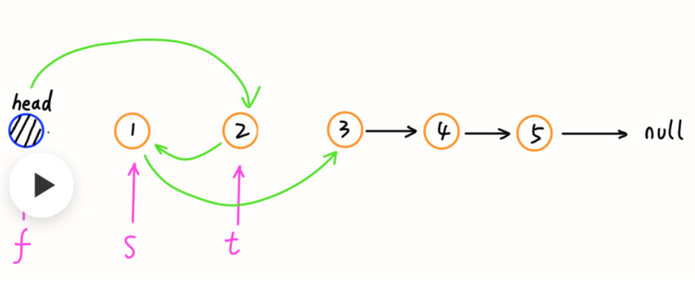
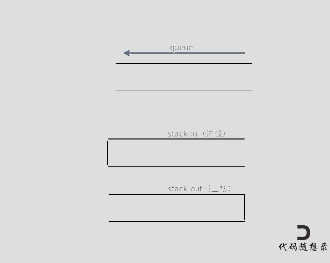
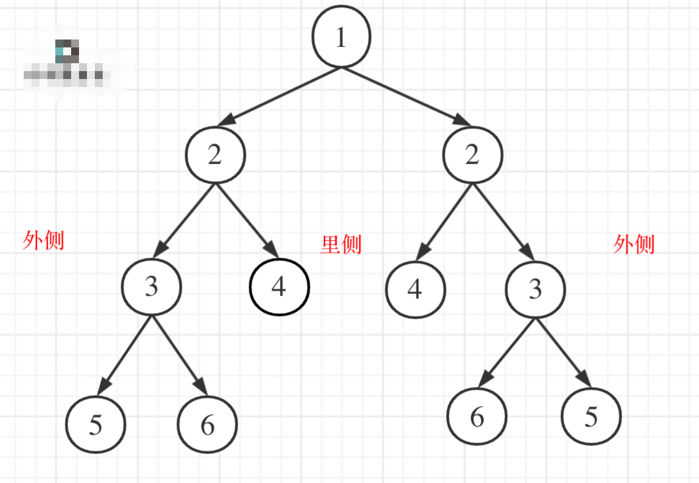
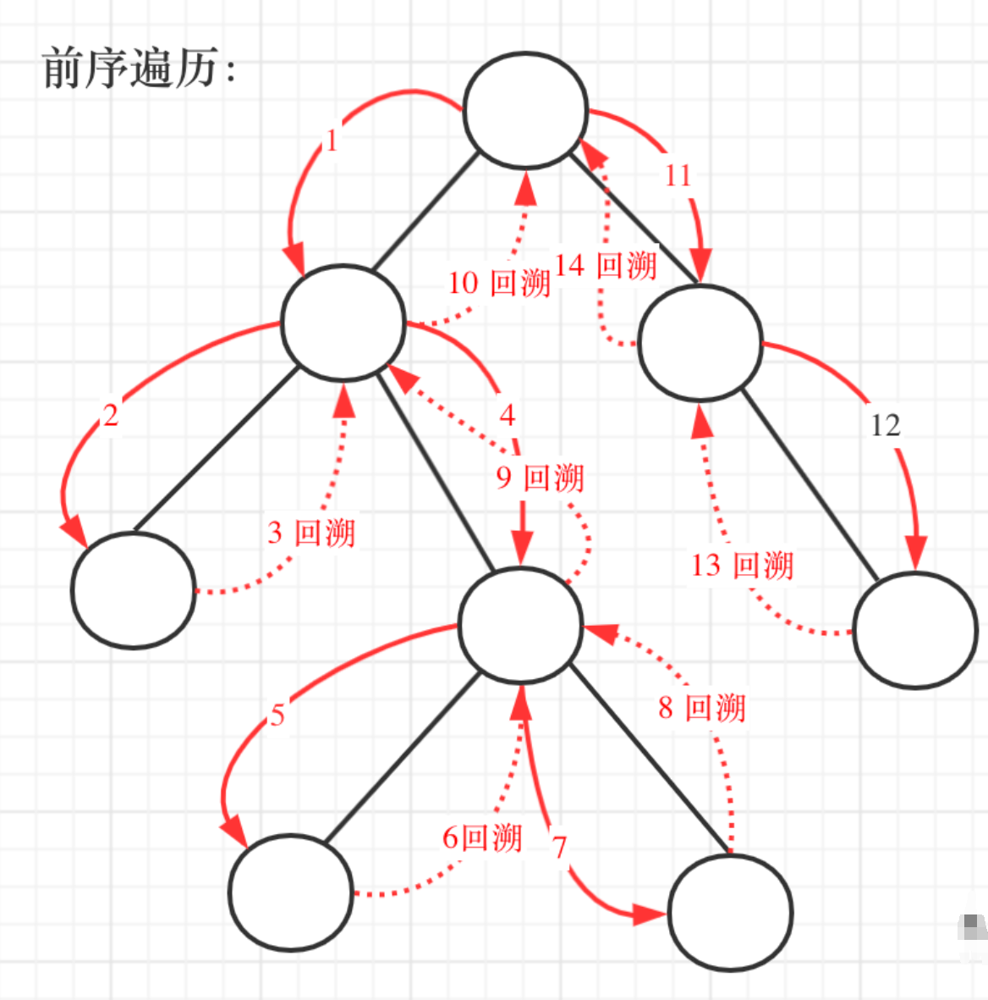
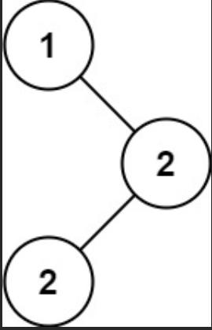
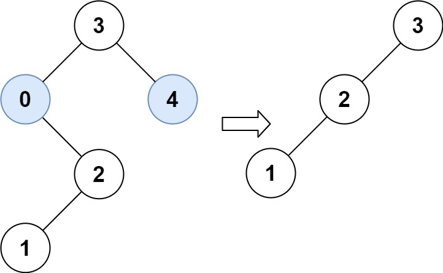
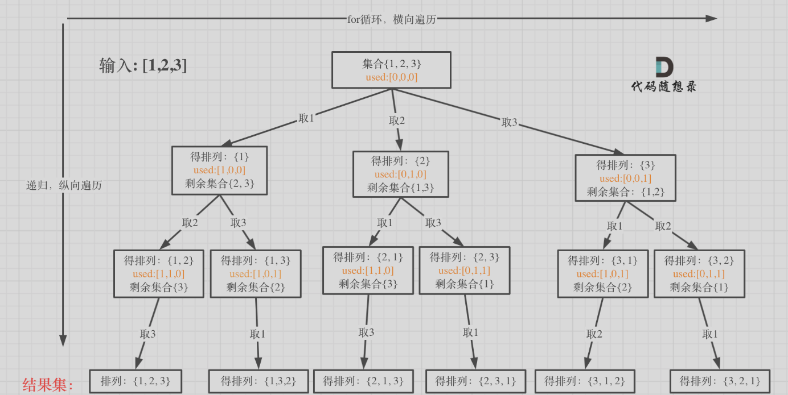
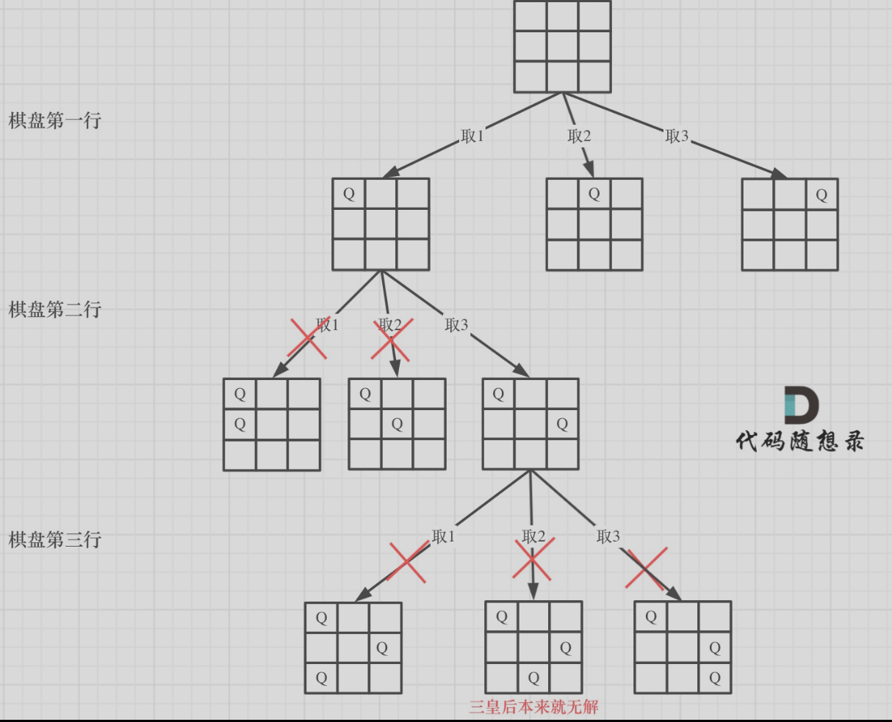
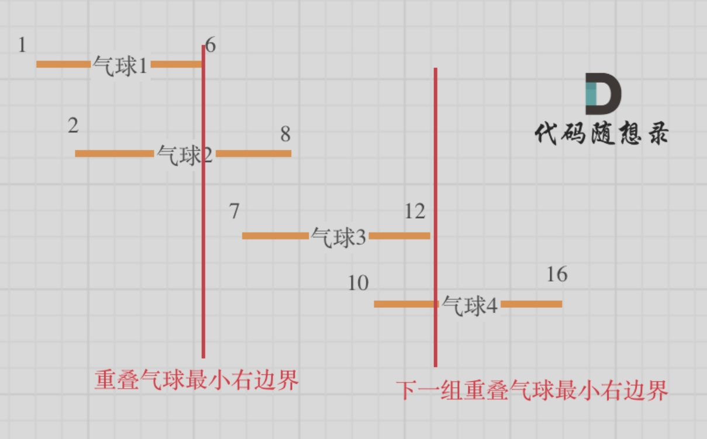

>  [代码随想录](https://programmercarl.com/)

## 🐋704.二分查找【简单】【数组】
<!-- tabs:start -->

#### **题目**

给定一个 `n` 个元素有序的（升序）整型数组 `nums` 和一个目标值 `target` ，写一个函数搜索 `nums` 中的 `target`，如果目标值存在返回下标，否则返回 `-1`。
**示例 1:**

```
输入: nums = [-1,0,3,5,9,12], target = 9
输出: 4
解释: 9 出现在 nums 中并且下标为 4
```

**示例 2:**

```
输入: nums = [-1,0,3,5,9,12], target = 2
输出: -1
解释: 2 不存在 nums 中因此返回 -1
```

**提示：**

1. 你可以假设 `nums` 中的所有元素是不重复的。
2. `n` 将在 `[1, 10000]`之间。
3. `nums` 的每个元素都将在 `[-9999, 9999]`之间。

#### **题解**

```C++
class Solution {
public:
    int search(vector<int>& nums, int target) {
        int left = 0;
        int right = nums.size()-1;
        while (left <= right) {
            int m = left + (( right - left ) / 2);
            int numsM = nums[m];
            if(numsM < target)
                left = m + 1;
            else if(numsM > target)
                right = m - 1;
            else
                return m;
        }
        return -1;
    }
};
```
<!-- tabs:end -->
## 🐋27. 移除元素
<!-- tabs:start -->
#### **题目**

给你一个数组 `nums` 和一个值 `val`，你需要 **[原地](https://baike.baidu.com/item/原地算法)** 移除所有数值等于 `val` 的元素，并返回移除后数组的新长度。

不要使用额外的数组空间，你必须仅使用 `O(1)` 额外空间并 **[原地 ](https://baike.baidu.com/item/原地算法)修改输入数组**。

元素的顺序可以改变。你不需要考虑数组中超出新长度后面的元素。

**说明:**

为什么返回数值是整数，但输出的答案是数组呢?

请注意，输入数组是以**「引用」**方式传递的，这意味着在函数里修改输入数组对于调用者是可见的。

你可以想象内部操作如下:

```
// nums 是以“引用”方式传递的。也就是说，不对实参作任何拷贝
int len = removeElement(nums, val);

// 在函数里修改输入数组对于调用者是可见的。
// 根据你的函数返回的长度, 它会打印出数组中 该长度范围内 的所有元素。
for (int i = 0; i < len; i++) {
    print(nums[i]);
}
```

**示例 1：**

```
输入：nums = [3,2,2,3], val = 3
输出：2, nums = [2,2]
解释：函数应该返回新的长度 2, 并且 nums 中的前两个元素均为 2。你不需要考虑数组中超出新长度后面的元素。例如，函数返回的新长度为 2 ，而 nums = [2,2,3,3] 或 nums = [2,2,0,0]，也会被视作正确答案。
```

**示例 2：**

```
输入：nums = [0,1,2,2,3,0,4,2], val = 2
输出：5, nums = [0,1,4,0,3]
解释：函数应该返回新的长度 5, 并且 nums 中的前五个元素为 0, 1, 3, 0, 4。注意这五个元素可为任意顺序。你不需要考虑数组中超出新长度后面的元素。
```

**提示：**

- `0 <= nums.length <= 100`
- `0 <= nums[i] <= 50`
- `0 <= val <= 100`

#### **题解**

```C++
using namespace std;

//leetcode submit region begin(Prohibit modification and deletion)
class Solution {
public:
    int removeElement(vector<int>& nums, int val) {
        int len = nums.size();
        for (int i = 0; i < len ; i++) {
            if(nums[i] == val)
            {
                for (int j = i + 1; j < len; j++) {
                    nums[ j - 1 ] =  nums[j];
                }
                i--;
                len--;
            }
        }
        return len;
    }
};
```
<!-- tabs:end -->

## **🐋**977. 有序数组平方
<!-- tabs:start -->
#### **题目**

给你一个按 **非递减顺序** 排序的整数数组 `nums`，返回 **每个数字的平方** 组成的新数组，要求也按 **非递减顺序** 排序。

**示例 1：**

```
输入：nums = [-4,-1,0,3,10]
输出：[0,1,9,16,100]
解释：平方后，数组变为 [16,1,0,9,100]
排序后，数组变为 [0,1,9,16,100]
```

**示例 2：**

```
输入：nums = [-7,-3,2,3,11]
输出：[4,9,9,49,121]
```

**提示：**

- `1 <= nums.length <= 104`
- `-104 <= nums[i] <= 104`
- `nums` 已按 **非递减顺序** 排序

#### **题解**

```C++
class Solution {
public:
    vector<int> sortedSquares(vector<int>& nums) {
        int len = nums.size();
        for (int i = 0; i < len;i++) {
            nums[i] *= nums[i];
        }
        sort(nums.begin(),nums.end());
        return nums;
    }
};
```
<!-- tabs:end -->
## **🐋**209. 长度最小的子数组【中等】【数组】
<!-- tabs:start -->
#### **题目**

给定一个含有 `n` 个正整数的数组和一个正整数 `target` **。**

找出该数组中满足其和 `≥ target` 的长度最小的 **连续子数组** `[numsl, numsl+1, ..., numsr-1, numsr]` ，并返回其长度**。**如果不存在符合条件的子数组，返回 `0` 。

**示例 1：**

```
输入：target = 7, nums = [2,3,1,2,4,3]
输出：2
解释：子数组 [4,3] 是该条件下的长度最小的子数组。
```

**示例 2：**

```
输入：target = 4, nums = [1,4,4]
输出：1
```

**示例 3：**

```
输入：target = 11, nums = [1,1,1,1,1,1,1,1]
输出：0
```

**提示：**

- `1 <= target <= 109`
- `1 <= nums.length <= 105`
- `1 <= nums[i] <= 105`

**进阶：**

- 如果你已经实现 `O(n)` 时间复杂度的解法, 请尝试设计一个 `O(n log(n))` 时间复杂度的解法。

#### **题解**

```c++
// 长度最小的子数组
#include <iostream>
#include <vector>

using namespace std;
class Solution {
public:
    int minSubArrayLen(int target, vector<int>& nums) {
        int result = INT32_MAX;
        int sum = 0;// 上下指针之和  滑动窗口数值之和
        int len = 0;// 上下指针长度  滑动窗口的长度
        int j = 0;// 起始位置 滑动窗口起始位置
        for (int i = 0; i < nums.size(); i++)
        {
            sum += nums[i];
            // 注意这里使用while，每次更新 i（起始位置），并不断比较子序列是否符合条件
            while (sum >= target)
            {
                len = (i - j + 1);
                result = result < len ? result : len;
                sum -= nums[j++];// 这里体现出滑动窗口的精髓之处，不断变更j（子序列的起始位置）
            }
        }
        // 如果result没有被赋值的话，就返回0，说明没有符合条件的子序列
        return result == INT32_MAX ? 0 : result;
    }
};


int main()
{
    Solution s;
    vector<int>v;
    v.push_back(1);
    v.push_back(4);
    v.push_back(4);
    int targetr = 4;
    int res = s.minSubArrayLen(targetr,v);
    cout << res;
}
```
<!-- tabs:end -->
## **🐋**59. 螺旋矩阵 II 【中等】【数组】
<!-- tabs:start -->
#### **题目**

给你一个正整数 `n` ，生成一个包含 `1` 到 `n2` 所有元素，且元素按顺时针顺序螺旋排列的 `n x n` 正方形矩阵 `matrix` 。

**示例 1：**


```
输入：n = 3
输出：[[1,2,3],[8,9,4],[7,6,5]]
```

**示例 2：**

```
输入：n = 1
输出：[[1]]
```

**提示：**

- `1 <= n <= 20`

#### **题解**

```C++
#include <iostream>
#include <vector>

using namespace std;
class Solution {
public:
    vector<vector<int>> generateMatrix(int n) {
        vector<vector<int>> arr(n,vector<int>(n));
        int length = n * n;
        int top = 0;
        int boottom = n - 1;
        int left = 0;
        int right = n - 1;
        int index = 1;
        while (index <= length)
        {
            // 上
            for (int t = left; t <= right; t++)
            {
                arr[top][t] = index++;
            }
            top++;
            // 右
            for (int r = top; r <= boottom; r++)
            {
                arr[r][right] = index++;
            }
            right--;
            // 下
            for (int b = right; b >= left; b--)
            {
                arr[boottom][b] = index++;
            }
            boottom--;
            // 左
            for (int l = boottom; l >= top; l--)
            {
                arr[l][left] = index++;
            }
            left++;
        }
        return arr;
    }
};


int main()
{
    Solution s;
    int n = 3;
    vector<vector<int>> arr(n, vector<int>(n));
    arr = s.generateMatrix(n);
    for (int i = 0; i < n; i++)
    {
        for (int j = 0; j < n; j++)
        {
            cout << arr[i][j];
        }
    }
}
```
<!-- tabs:end -->
## **🐋**203. 移除链表元素【简单】【链表】
<!-- tabs:start -->
#### **题目**

给你一个链表的头节点 `head` 和一个整数 `val` ，请你删除链表中所有满足 `Node.val == val` 的节点，并返回 **新的头节点** 。

 

**示例 1：**


```
输入：head = [1,2,6,3,4,5,6], val = 6
输出：[1,2,3,4,5]
```

**示例 2：**

```
输入：head = [], val = 1
输出：[]
```

**示例 3：**

```
输入：head = [7,7,7,7], val = 7
输出：[]
```

**提示：**

- 列表中的节点数目在范围 `[0, 104]` 内
- `1 <= Node.val <= 50`
- `0 <= val <= 50`

#### **题解**

```C++
/**
 * Definition for singly-linked list.
 * struct ListNode {
 *     int val;
 *     ListNode *next;
 *     ListNode() : val(0), next(nullptr) {}
 *     ListNode(int x) : val(x), next(nullptr) {}
 *     ListNode(int x, ListNode *next) : val(x), next(next) {}
 * };
 */
class Solution {
public:
    ListNode* removeElements(ListNode* head, int val) {
        ListNode* dum = new ListNode(0); // 设置一个虚头节点
        dum->next = head;
        ListNode* cure = dum; // 当前元素
        while (cure->next!= NULL) {
            if (cure->next->val == val)
            {
                ListNode* temp = cure->next;
                cure->next = cure->next->next;
                delete temp;
            }
            else {
                cure = cure->next;
            }
        }
        head = dum->next;
        delete dum;
        return head;
    }
};         
```
<!-- tabs:end -->
## **🐋**707. 设计链表【中等】【链表】
<!-- tabs:start -->
#### **题目**

你可以选择使用单链表或者双链表，设计并实现自己的链表。

单链表中的节点应该具备两个属性：`val` 和 `next` 。`val` 是当前节点的值，`next` 是指向下一个节点的指针/引用。

如果是双向链表，则还需要属性 `prev` 以指示链表中的上一个节点。假设链表中的所有节点下标从 **0** 开始。

实现 `MyLinkedList` 类：

- `MyLinkedList()` 初始化 `MyLinkedList` 对象。
- `int get(int index)` 获取链表中下标为 `index` 的节点的值。如果下标无效，则返回 `-1` 。
- `void addAtHead(int val)` 将一个值为 `val` 的节点插入到链表中第一个元素之前。在插入完成后，新节点会成为链表的第一个节点。
- `void addAtTail(int val)` 将一个值为 `val` 的节点追加到链表中作为链表的最后一个元素。
- `void addAtIndex(int index, int val)` 将一个值为 `val` 的节点插入到链表中下标为 `index` 的节点之前。如果 `index` 等于链表的长度，那么该节点会被追加到链表的末尾。如果 `index` 比长度更大，该节点将 **不会插入** 到链表中。
- `void deleteAtIndex(int index)` 如果下标有效，则删除链表中下标为 `index` 的节点。

**示例：**

```
输入
["MyLinkedList", "addAtHead", "addAtTail", "addAtIndex", "get", "deleteAtIndex", "get"]
[[], [1], [3], [1, 2], [1], [1], [1]]
输出
[null, null, null, null, 2, null, 3]

解释
MyLinkedList myLinkedList = new MyLinkedList();
myLinkedList.addAtHead(1);
myLinkedList.addAtTail(3);
myLinkedList.addAtIndex(1, 2);    // 链表变为 1->2->3
myLinkedList.get(1);              // 返回 2
myLinkedList.deleteAtIndex(1);    // 现在，链表变为 1->3
myLinkedList.get(1);              // 返回 3
```

**提示：**

- `0 <= index, val <= 1000`
- 请不要使用内置的 `LinkedList` 库。
- 调用 `get`、`addAtHead`、`addAtTail`、`addAtIndex` 和 `deleteAtIndex` 的次数不超过 `2000` 。

#### **题解**

```C++
class MyLinkedList {
public:
    struct ListNode {
        int val;
        ListNode* next;
        ListNode() : val(0), next(nullptr) {}
        ListNode(int x) : val(x), next(nullptr) {}
        ListNode(int x, ListNode* next) : val(x), next(next) {}
    };
    MyLinkedList() {
        this->size = 0;
        this->head = new ListNode(0);
    }

    int get(int index) {
        if (index < 0 || index >= size)
        {
            return -1;
        }
        ListNode* cur = head;
        for (int i = 0; i <= index; i++) {
            cur = cur->next;
        }
        return cur->val;
    }

    void addAtHead(int val) {
        addAtIndex(0, val);
    }

    void addAtTail(int val) {
        addAtIndex(size, val);
    }

    void addAtIndex(int index, int val) {
        if (index > size)
            return;
        ListNode* p = head;
        index = max(0, index);
        size++;// 增加了一个结点，所以要自加
        // 找到index对应的结点
        for (int i = 0; i < index; i++) {
            p = p->next;
        }
        ListNode* s = new ListNode(val);// 要插入的元素
        s->next = p->next;
        p->next = s;
    }

    void deleteAtIndex(int index) {
        if (index < 0 || index >= size)
        {
            return;
        }
        size--;// 删除了一个结点所以要减去一个
        ListNode* p = head;
        // 找到index对应的结点
        for (int i = 0; i < index; i++) {
            p = p->next;
        }
        ListNode* q = p->next;
        p->next = p->next->next;
        delete q;
    }
private:
    int size = 0;
    ListNode* head;
};

/**
 * Your MyLinkedList object will be instantiated and called as such:
 * MyLinkedList* obj = new MyLinkedList();
 * int param_1 = obj->get(index);
 * obj->addAtHead(val);
 * obj->addAtTail(val);
 * obj->addAtIndex(index,val);
 * obj->deleteAtIndex(index);
 */

```
<!-- tabs:end -->
## **🐋**206. 反转链表【简单】【链表】
<!-- tabs:start -->

#### **题目**

给你单链表的头节点 `head` ，请你反转链表，并返回反转后的链表。

**示例 1：**


```
输入：head = [1,2,3,4,5]
输出：[5,4,3,2,1]
```

**示例 2：**


```
输入：head = [1,2]
输出：[2,1]
```

**示例 3：**

```
输入：head = []
输出：[]
```

**提示：**

- 链表中节点的数目范围是 `[0, 5000]`
- `-5000 <= Node.val <= 5000`

#### **题解**

```C++
/**
 * Definition for singly-linked list.
 * struct ListNode {
 *     int val;
 *     ListNode *next;
 *     ListNode() : val(0), next(nullptr) {}
 *     ListNode(int x) : val(x), next(nullptr) {}
 *     ListNode(int x, ListNode *next) : val(x), next(next) {}
 * };
 */
class Solution {
public:
    ListNode* reverseList(ListNode* head) {
        ListNode* q = nullptr;// 上一个结点
         ListNode* p = head;// 当前结点
        while (p)
        {
            ListNode* t = p->next;// 记录下一个结点
            p->next = q;
            //p和q结点都前进一位
            q = p;
            p = t;
        }
        return q;
    }
};
```

#### **采用递归的方式**

```C++
class Solution {
public:
    ListNode* reverseList(ListNode* head) {
        if(head== nullptr || head->next == nullptr)
        {
            return head;
        }
        ListNode * newP = reverseList(head->next);
        head->next->next = head;
        head->next = nullptr;
        return newP;
    }
};
```
<!-- tabs:end -->
## **🐋**24. 两两交换链表中的节点【中等】【链表】
<!-- tabs:start -->
#### **题目**

给你一个链表，两两交换其中相邻的节点，并返回交换后链表的头节点。你必须在不修改节点内部的值的情况下完成本题（即，只能进行节点交换）。

**示例 1：**


```
输入：head = [1,2,3,4]
输出：[2,1,4,3]
```

**示例 2：**

```
输入：head = []
输出：[]
```

**示例 3：**

```
输入：head = [1]
输出：[1]
```

**提示：**

- 链表中节点的数目在范围 `[0, 100]` 内
- `0 <= Node.val <= 100`

#### **题解**



```C++
/**
 * Definition for singly-linked list.
 * struct ListNode {
 *     int val;
 *     ListNode *next;
 *     ListNode() : val(0), next(nullptr) {}
 *     ListNode(int x) : val(x), next(nullptr) {}
 *     ListNode(int x, ListNode *next) : val(x), next(next) {}
 * };
 */
class Solution {
public:
       ListNode* swapPairs(ListNode* head) {
        ListNode * fHead = new ListNode(0);
        fHead -> next = head;
        ListNode * cur = fHead; // 记录当前节点
        while( cur->next!=nullptr && cur->next->next != nullptr)
        {
            ListNode *t1 = cur->next;
            ListNode *t2 = cur->next->next;
            ListNode *t3 = cur->next->next->next;
            cur -> next = t2;
            cur -> next -> next = t1;
            cur -> next -> next -> next = t3;

            // 移动cur准备下一次交换，
            cur = cur -> next -> next;
        }
        return fHead->next;
    }
};
```
<!-- tabs:end -->
## **🐋**19. 删除链表的倒数第N个结点【中等】【链表】
<!-- tabs:start -->
#### **题目**

给你一个链表，删除链表的倒数第 `n` 个结点，并且返回链表的头结点。

**示例 1：**


```
输入：head = [1,2,3,4,5], n = 2
输出：[1,2,3,5]
```

**示例 2：**

```
输入：head = [1], n = 1
输出：[]
```

**示例 3：**

```
输入：head = [1,2], n = 1
输出：[1]
```

**提示：**

- 链表中结点的数目为 `sz`
- `1 <= sz <= 30`
- `0 <= Node.val <= 100`
- `1 <= n <= sz`

#### **题解**

```C++
class Solution {
public:
   ListNode* removeNthFromEnd(ListNode* head, int n) {
        ListNode * pHead = new ListNode(0);
        pHead->next = head;
        ListNode * cur = pHead;
        ListNode * lenHead = pHead;
        int count = 0;
        int len = 0;
        while (lenHead->next != nullptr)
        {
            lenHead = lenHead->next;
            len++;
        }
        while (cur->next != nullptr)
        {
            count++;
            if (len-n+1 == count)
            {
                ListNode* temp = cur->next;
                cur->next = cur->next->next;
                delete temp;
            }
            else
            {
                cur = cur->next;
            }
        }
        head = pHead->next;
        delete pHead;
        return head;
    }
};
```
<!-- tabs:end -->
## **🐋**面试题 02.07. 链表相交【简单】【链表】
<!-- tabs:start -->
#### **题目**

给你两个单链表的头节点 `headA` 和 `headB` ，请你找出并返回两个单链表相交的起始节点。如果两个链表没有交点，返回 `null` 。

图示两个链表在节点 `c1` 开始相交**：**


题目数据 **保证** 整个链式结构中不存在环。

**注意**，函数返回结果后，链表必须 **保持其原始结构** 。

 

**示例 1：**


```
输入：intersectVal = 8, listA = [4,1,8,4,5], listB = [5,0,1,8,4,5], skipA = 2, skipB = 3
输出：Intersected at '8'
解释：相交节点的值为 8 （注意，如果两个链表相交则不能为 0）。
从各自的表头开始算起，链表 A 为 [4,1,8,4,5]，链表 B 为 [5,0,1,8,4,5]。
在 A 中，相交节点前有 2 个节点；在 B 中，相交节点前有 3 个节点。
```

**示例 2：**


```
输入：intersectVal = 2, listA = [0,9,1,2,4], listB = [3,2,4], skipA = 3, skipB = 1
输出：Intersected at '2'
解释：相交节点的值为 2 （注意，如果两个链表相交则不能为 0）。
从各自的表头开始算起，链表 A 为 [0,9,1,2,4]，链表 B 为 [3,2,4]。
在 A 中，相交节点前有 3 个节点；在 B 中，相交节点前有 1 个节点。
```

**示例 3：**


```
输入：intersectVal = 0, listA = [2,6,4], listB = [1,5], skipA = 3, skipB = 2
输出：null
解释：从各自的表头开始算起，链表 A 为 [2,6,4]，链表 B 为 [1,5]。
由于这两个链表不相交，所以 intersectVal 必须为 0，而 skipA 和 skipB 可以是任意值。
这两个链表不相交，因此返回 null 。 
```

**提示：**

- `listA` 中节点数目为 `m`
- `listB` 中节点数目为 `n`
- `0 <= m, n <= 3 * 104`
- `1 <= Node.val <= 105`
- `0 <= skipA <= m`
- `0 <= skipB <= n`
- 如果 `listA` 和 `listB` 没有交点，`intersectVal` 为 `0`
- 如果 `listA` 和 `listB` 有交点，`intersectVal == listA[skipA + 1] == listB[skipB + 1]`

#### **题解1:双指针**

```C++
class Solution {
public:
 ListNode* getIntersectionNode(ListNode* headA, ListNode* headB) {
        // 双指针实现
        if (headA == nullptr || headB == nullptr)
        {
            return nullptr;
        }
        ListNode* pa = headA;
        ListNode* pb = headB;
        // 查询相等的情况，不相等则next下一个，如果相等了，在headA的next指向headB的相等元素的next
        while (pa != pb)
        {
            pa = pa == nullptr ? headB : pa->next;
            pb = pb == nullptr ? headA : pb->next;
        }
        return pa;
    }
};
```

#### **题解2:哈希集合**

```C++
// 官方答案
class Solution {
public:
    ListNode *getIntersectionNode(ListNode *headA, ListNode *headB) {
        unordered_set<ListNode *> visited;
        ListNode *temp = headA;
        while (temp != nullptr) {
            visited.insert(temp);
            temp = temp->next;
        }
        temp = headB;
        while (temp != nullptr) {
            if (visited.count(temp)) {
                return temp;
            }
            temp = temp->next;
        }
        return nullptr;
    }
};
```
<!-- tabs:end -->
## **🐋**142. 环形链表 II【中等 】【链表】
<!-- tabs:start -->
#### **题目**

给定一个链表的头节点  `head` ，返回链表开始入环的第一个节点。 *如果链表无环，则返回 `null`。*

如果链表中有某个节点，可以通过连续跟踪 `next` 指针再次到达，则链表中存在环。 为了表示给定链表中的环，评测系统内部使用整数 `pos` 来表示链表尾连接到链表中的位置（**索引从 0 开始**）。如果 `pos` 是 `-1`，则在该链表中没有环。**注意：`pos` 不作为参数进行传递**，仅仅是为了标识链表的实际情况。

**不允许修改** 链表

**示例 1：**


```
输入：head = [3,2,0,-4], pos = 1
输出：返回索引为 1 的链表节点
解释：链表中有一个环，其尾部连接到第二个节点。
```

**示例 2：**


```
输入：head = [1,2], pos = 0
输出：返回索引为 0 的链表节点
解释：链表中有一个环，其尾部连接到第一个节点。
```

**示例 3：**


```
输入：head = [1], pos = -1
输出：返回 null
解释：链表中没有环。
```

**提示：**

- 链表中节点的数目范围在范围 `[0, 104]` 内
- `-105 <= Node.val <= 105`
- `pos` 的值为 `-1` 或者链表中的一个有效索引

**进阶：**你是否可以使用 `O(1)` 空间解决此题？

#### **题解**

> 不要被pos干扰，实际链表中存在环或者直接没有环，pos只是标记环的位置

```C++
// 哈希表
class Solution {
public:
    ListNode* detectCycle(ListNode* head) {
        unordered_set<ListNode*>newHead;
        while (head != nullptr)
        {
            if (newHead.count(head))
            {
                return head;
            }
            newHead.insert(head);
            head = head->next;
        }
        return nullptr;
    }
};
```
<!-- tabs:end -->
## **🐋**242. 有效的字母异位词【简单】【哈希表】
<!-- tabs:start -->
#### **题目**

给定两个字符串 `*s*` 和 `*t*` ，编写一个函数来判断 `*t*` 是否是 `*s*` 的字母异位词。

**注意：**若 `*s*` 和 `*t*` 中每个字符出现的次数都相同，则称 `*s*` 和 `*t*` 互为字母异位词。

 

**示例 1:**

```
输入: s = "anagram", t = "nagaram"
输出: true
```

**示例 2:**

```
输入: s = "rat", t = "car"
输出: false
```

**提示:**

- `1 <= s.length, t.length <= 5 * 104`
- `s` 和 `t` 仅包含小写字母

**进阶:** 如果输入字符串包含 `unicode` 字符怎么办？你能否调整你的解法来应对这种情况？

#### **题解**

```C++
class Solution {
public:
     bool isAnagram(string s, string t) {
        if (s.length() != t.length()) {
            return false;
        }
        sort(s.begin(), s.end());
        sort(t.begin(), t.end());
        return s == t;
    }
};
```
<!-- tabs:end -->
## **🐋**`1002. 查找共用字符`【简单】【哈希表】
<!-- tabs:start -->
#### **题目**

给你一个字符串数组 `words` ，请你找出所有在 `words` 的每个字符串中都出现的共用字符（ **包括重复字符**），并以数组形式返回。你可以按 **任意顺序** 返回答案。 

**示例 1：**

```
输入：words = ["bella","label","roller"]
输出：["e","l","l"]
```

**示例 2：**

```
输入：words = ["cool","lock","cook"]
输出：["c","o"]
```

**提示：**

- `1 <= words.length <= 100`
- `1 <= words[i].length <= 100`
- `words[i]` 由小写英文字母组成

#### **题解**

```c++
#include<iostream>
#include<vector>
#include<set>
using namespace std;
//
class Solution {
public:
    vector<string> commonChars(vector<string>& words) {
        //minfreq存储字符在所有字符中出现次数的最小值
        vector<int> minfreq(26, INT_MAX);
        // freq 判断每个字符串中出现  字符 次数
        vector<int> freq(26);
        for (const string& word : words) {
            fill(freq.begin(), freq.end(), 0); // 给freq元素赋值为0
            for (char ch : word) { // 遍历完第一个单词
                ++freq[ch - 'a'];
            }
            // 每次取最小值，来确定那个字符在三个字符串都出现，并统计了各个出现的次数
            for (int i = 0; i < 26; ++i) {
                minfreq[i] = min(minfreq[i], freq[i]);
            }
        }

        vector<string> ans;
        // 循环判断0-25，j < minfreq[i]   ，还原成 字母
        for (int i = 0; i < 26; ++i) {
            for (int j = 0; j < minfreq[i]; ++j) {
                ans.emplace_back(1, i + 'a');
            }
        }
        return ans;
    }
};

int main()
{
    vector<string>st;
    st.push_back("bella");
    st.push_back("label");
    st.push_back("roller");
    Solution s;
    vector<string>s1;
    s1 = s.commonChars(st);
    for (vector<string>::iterator it = s1.begin(); it != s1.end(); it++)
    {
        cout << *it << endl;
    }
}
```
<!-- tabs:end -->
## **🐋**349. 两个数组的交集【简单】【哈希表】
<!-- tabs:start -->
#### **题目**

给定两个数组 `nums1` 和 `nums2` ，返回 *它们的交集* 。输出结果中的每个元素一定是 **唯一** 的。我们可以 **不考虑输出结果的顺序** 。

**示例 1：**

```
输入：nums1 = [1,2,2,1], nums2 = [2,2]
输出：[2]
```

**示例 2：**

```
输入：nums1 = [4,9,5], nums2 = [9,4,9,8,4]
输出：[9,4]
解释：[4,9] 也是可通过的
```

**提示：**

- `1 <= nums1.length, nums2.length <= 1000`
- `0 <= nums1[i], nums2[i] <= 1000`

#### **题解**

```C++
#include<iostream>
#include<vector>
#include<unordered_set>

using namespace std;

class Solution {
public:
    vector<int> intersection(vector<int>& nums1, vector<int>& nums2) {
        unordered_set<int>n1(nums1.begin(),nums1.end());
        unordered_set<int>n2(nums2.begin(), nums2.end());
        vector<int>res;
        for (auto it = n1.begin(); it != n1.end(); ++it) {
            for (auto ite = n2.begin(); ite != n2.end(); ++ite) {
                if (*it == *ite)
                {
                    res.push_back(*it);
                }
            }
        }
        return res;
    }
};


int main()
{
    vector<int>n1 = { 1,2,2,1 };
    vector<int>n2 = { 2,2 };
    Solution s;
    for (int elem : s.intersection(n1, n2))
    {
        cout << elem << endl;
    }
}
```
<!-- tabs:end -->
## **🐋**202. 快乐数【简单】【哈希表】
<!-- tabs:start -->
#### **题目**

编写一个算法来判断一个数 `n` 是不是快乐数。

**「快乐数」** 定义为：

- 对于一个正整数，每一次将该数替换为它每个位置上的数字的平方和。
- 然后重复这个过程直到这个数变为 1，也可能是 **无限循环** 但始终变不到 1。
- 如果这个过程 **结果为** 1，那么这个数就是快乐数。

如果 `n` 是 *快乐数* 就返回 `true` ；不是，则返回 `false` 。

**示例 1：**

```
输入：n = 19
输出：true
解释：
12 + 92 = 82
82 + 22 = 68
62 + 82 = 100
12 + 02 + 02 = 1
```

**示例 2：**

```
输入：n = 2
输出：false
```

**提示：**

- `1 <= n <= 231 - 1`

#### **题解**

```c++
// 快慢指针
class Solution {
public:
    // 求平方和函数
    int squareSum(int num)
    {
        int sum = 0;
        while(num > 0)
        {
            int g = num % 10; // 取出个位
            sum += g * g;
            num = num / 10; //下一位求平方
        }
        return sum;
    }
    bool isHappy(int n) {
        // 采用快慢指针的方法完成
        int slow=n,fast=n;
        do{
            slow = squareSum(slow);
            fast = squareSum(fast);
            fast = squareSum(fast);
        }while(slow != fast);
        // 当快慢指针相遇了就要考虑
        return slow == 1;
    }
};
```
<!-- tabs:end -->
## **🐋**1. 两数之和【简单】【哈希表】
<!-- tabs:start -->
#### **题目**

给定一个整数数组 `nums` 和一个整数目标值 `target`，请你在该数组中找出 **和为目标值** *`target`* 的那 **两个** 整数，并返回它们的数组下标。

你可以假设每种输入只会对应一个答案。但是，数组中同一个元素在答案里不能重复出现。

你可以按任意顺序返回答案。

**示例 1：**

```
输入：nums = [2,7,11,15], target = 9
输出：[0,1]
解释：因为 nums[0] + nums[1] == 9 ，返回 [0, 1] 。
```

**示例 2：**

```
输入：nums = [3,2,4], target = 6
输出：[1,2]
```

**示例 3：**

```
输入：nums = [3,3], target = 6
输出：[0,1]
```

**提示：**

- `2 <= nums.length <= 104`
- `-109 <= nums[i] <= 109`
- `-109 <= target <= 109`
- **只会存在一个有效答案**

**进阶：**你可以想出一个时间复杂度小于 `O(n2)` 的算法吗？

#### **题解**

```C++
class Solution {
public:
    vector<int> twoSum(vector<int>& nums, int target) {
        // 第一种
//        int len=nums.size();
//        for(int i=0;i<len;i++)
//        {
//            for(int j=i+1;j<len;j++)
//            {
//                if(nums[i]+nums[j]==target){
//                    return {i,j};
//                }
//            }
//        }
//        return {};
//  第二种
//        map<int,int>index;
//        for(int i=0;i<nums.size();i++)  //存储每个元素的下标
//            index[nums[i]]=i;
//        for(int j=0;j<nums.size();j++)
//            //当target-nums[j]的差的下标存在，同时不是j的时候，输出相应的下标
//            if(index[target-nums[j]]!=0&&index[target-nums[j]]!=j)
//                return {j,index[target-nums[j]]};
//        return {};
//  第三种
        map<int,int>h;
        for (int i = 0; i < nums.size(); ++i) {
            int n = target - nums[i];
            if(h.find(n) != h.end())
            {
                return {h.at(n),i};
            }
            else
            {
                h[nums[i]] = i;
            }
        }
        return {};
    }
};
```
<!-- tabs:end -->
## **🐋**454. 四数相加Ⅱ【中等】【哈希表】
<!-- tabs:start -->
#### **题目**

给你四个整数数组 `nums1`、`nums2`、`nums3` 和 `nums4` ，数组长度都是 `n` ，请你计算有多少个元组 `(i, j, k, l)` 能满足：

- `0 <= i, j, k, l < n`
- `nums1[i] + nums2[j] + nums3[k] + nums4[l] == 0`

**示例 1：**

```
输入：nums1 = [1,2], nums2 = [-2,-1], nums3 = [-1,2], nums4 = [0,2]
输出：2
解释：
两个元组如下：
1. (0, 0, 0, 1) -> nums1[0] + nums2[0] + nums3[0] + nums4[1] = 1 + (-2) + (-1) + 2 = 0
2. (1, 1, 0, 0) -> nums1[1] + nums2[1] + nums3[0] + nums4[0] = 2 + (-1) + (-1) + 0 = 0
```

**示例 2：**

```
输入：nums1 = [0], nums2 = [0], nums3 = [0], nums4 = [0]
输出：1
```

 **提示：**

- `n == nums1.length`
- `n == nums2.length`
- `n == nums3.length`
- `n == nums4.length`
- `1 <= n <= 200`
- `-228 <= nums1[i], nums2[i], nums3[i], nums4[i] <= 228`

#### **题解**

```c++
// for循环遍历会超出内存
// 注意分组思想
class Solution {
public:
    int fourSumCount(vector<int>& nums1, vector<int>& nums2, vector<int>& nums3, vector<int>& nums4) {
        unordered_map<int, int>h;
        int count = 0;
        int target = 0;
        for (auto e : nums1)
        {
            for (auto el : nums2)
            {
                ++h[e + el];
            }
        }
        for (auto e : nums3)
        {
            for (auto el : nums4)
            {
                target = 0 - (e + el);
                // 如果在上一个循环中找到进入 if条件
                if (h.find(target) != h.end())
                {
                    count += h[target];
                }
            }
        }
        return count;
    }
};  
```
<!-- tabs:end -->
## **🐋**383. 赎金信【简单】【哈希表】
<!-- tabs:start -->
#### **题目**

给你两个字符串：`ransomNote` 和 `magazine` ，判断 `ransomNote` 能不能由 `magazine` 里面的字符构成。

如果可以，返回 `true` ；否则返回 `false` 。

`magazine` 中的每个字符只能在 `ransomNote` 中使用一次。

**示例 1：**

```
输入：ransomNote = "a", magazine = "b"
输出：false
```

**示例 2：**

```
输入：ransomNote = "aa", magazine = "ab"
输出：false
```

**示例 3：**

```
输入：ransomNote = "aa", magazine = "aab"
输出：true
```

**提示：**

- `1 <= ransomNote.length, magazine.length <= 105`
- `ransomNote` 和 `magazine` 由小写英文字母组成

#### **题解**

```C++
#include<iostream>
#include<vector>

using namespace std;

class Solution {
public:
    bool canConstruct(string ransomNote, string magazine) {
        if (ransomNote.size() > magazine.size())
            return false;
        vector<int>count(26);
        for (auto& el : magazine)
        {
            count[el - 'a']++;
        }
        for (auto& el : ransomNote)
        {
            count[el - 'a']--;
            if (count[el - 'a'] < 0) {// 小于0的话就代表没有这个字符，一定是要大的先进入
                return false;
            }
        }
        return true;
    }
};

int main()
{
    string ransomNote = "ab";
    string magazine = "aab";
    Solution s;
    cout << s.canConstruct(ransomNote, magazine);
}
```
<!-- tabs:end -->
## **🐋**15. 三数之和【中等】【哈希表】
<!-- tabs:start -->
#### **题目**

给你一个整数数组 `nums` ，判断是否存在三元组 `[nums[i], nums[j], nums[k]]` 满足 `i != j`、`i != k` 且 `j != k` ，同时还满足 `nums[i] + nums[j] + nums[k] == 0` 。请

你返回所有和为 `0` 且不重复的三元组。

**注意：**答案中不可以包含重复的三元组。

**示例 1：**

```
输入：nums = [-1,0,1,2,-1,-4]
输出：[[-1,-1,2],[-1,0,1]]
解释：
nums[0] + nums[1] + nums[2] = (-1) + 0 + 1 = 0 。
nums[1] + nums[2] + nums[4] = 0 + 1 + (-1) = 0 。
nums[0] + nums[3] + nums[4] = (-1) + 2 + (-1) = 0 。
不同的三元组是 [-1,0,1] 和 [-1,-1,2] 。
注意，输出的顺序和三元组的顺序并不重要。
```

**示例 2：**

```
输入：nums = [0,1,1]
输出：[]
解释：唯一可能的三元组和不为 0 。
```

**示例 3：**

```
输入：nums = [0,0,0]
输出：[[0,0,0]]
解释：唯一可能的三元组和为 0 。
```

**提示：**

- `3 <= nums.length <= 3000`
- `-105 <= nums[i] <= 105`

#### **题解**

```c++
#include<iostream>
#include<vector>
#include<unordered_set>
#include<algorithm>
using namespace std;
class Solution {
public:
    vector<vector<int>> threeSum(vector<int>& nums) {
        vector<vector<int>> result;
        sort(nums.begin(), nums.end());
        // 找出a + b + c = 0
        // a = nums[i], b = nums[left], c = nums[right]
        int target = 0;
        int n = nums.size();
        result.reserve(n > 256 ? 256 : n);
        for (int i = 0; i < n; i++) {
            // 排序之后如果第一个元素已经大于零，那么无论如何组合都不可能凑成三元组，直接返回结果就可以了
            if (nums[i] > 0) {
                return result;
            }
            // 错误去重a方法，将会漏掉-1,-1,2 这种情况
            /*
            if (nums[i] == nums[i + 1]) {
                continue;
            }
            */
            // 正确去重a方法
            if (i > 0 && nums[i] == nums[i - 1]) {
                continue;
            }
            int left = i + 1;
            int right = n - 1;
            while (right > left) {
                // 去重复逻辑如果放在这里，0，0，0 的情况，可能直接导致 right<=left 了，从而漏掉了 0,0,0 这种三元组
                /*
                while (right > left && nums[right] == nums[right - 1]) right--;
                while (right > left && nums[left] == nums[left + 1]) left++;
                */
                target = nums[i] + nums[left] + nums[right];
                if (target  > 0) right--;
                else if (target < 0) left++;
                else {
                    result.push_back(vector<int>{nums[i], nums[left], nums[right]});
                    // 去重逻辑应该放在找到一个三元组之后，对b 和 c去重  去掉值相等的情况
                    while (right > left && nums[right] == nums[right - 1]) right--;
                    while (right > left && nums[left] == nums[left + 1]) left++;

                    // 找到答案时，双指针同时收缩
                    right--;
                    left++;
                }
            }

        }
        return result;
    }
};

int main()
{
    vector<int>nums = { -1,0,1,2,-1,-4 };
    Solution s;
    for (auto& el : s.threeSum(nums))
    {
        for (auto& e : el)
        {
            cout << e << endl;
        }
    }
}
```
<!-- tabs:end -->
## **🐋**18. 四树之和【中等】【哈希表】
<!-- tabs:start -->
#### **题目**

给你一个由 `n` 个整数组成的数组 `nums` ，和一个目标值 `target` 。请你找出并返回满足下述全部条件且**不重复**的四元组 `[nums[a], nums[b], nums[c], nums[d]]` （若两个四元组元素一一对应，则认为两个四元组重复）：

- `0 <= a, b, c, d < n`
- `a`、`b`、`c` 和 `d` **互不相同**
- `nums[a] + nums[b] + nums[c] + nums[d] == target`

你可以按 **任意顺序** 返回答案 。

**示例 1：**

```
输入：nums = [1,0,-1,0,-2,2], target = 0
输出：[[-2,-1,1,2],[-2,0,0,2],[-1,0,0,1]]
```

**示例 2：**

```
输入：nums = [2,2,2,2,2], target = 8
输出：[[2,2,2,2]]
```

**提示：**

- `1 <= nums.length <= 200`
- `-109 <= nums[i] <= 109`
- `-109 <= target <= 109`

#### **题解（双指针）**

```c++
#include<iostream>
#include<vector>
#include<algorithm>

using namespace std;

class Solution {
public:
    vector<vector<int>> fourSum(vector<int>& nums, int target) {
        vector<vector<int>> res;
        sort(nums.begin(), nums.end());
        int n = nums.size();
        int left = 0;// 左指针
        int right = 0;// 右指针
        res.reserve(n > 256 ? 256 : n);
        long tar = 0;
        for (int i = 0; i < n; i++)
        {
            // 排除首个元素一定不成立的元素
            if (nums[i] > target && nums[i] >= 0)
                break;
            // 去重
            if (i > 0 && nums[i] == nums[i - 1])
                continue;
            for (int j = i + 1; j < n; j++)
            {
                if (nums[i] + nums[j] > target && nums[i] + nums[j] >= 0)
                    break;
                if (j > i + 1 && nums[j] == nums[j - 1])
                    continue;
                left = j + 1;
                right = n - 1;
                while (right > left)
                {
                    tar = (long)nums[i] + nums[j] + nums[left] + nums[right];

                    if (tar > target)right--;
                    else if (tar < target)left++;
                    else {
                        res.push_back(vector<int>{nums[i], nums[j], nums[left], nums[right]});
                        while (right > left && nums[right] == nums[right - 1]) right--;
                        while (right > left && nums[left] == nums[left + 1]) left++;
                        right--;
                        left++;
                    }
                }
            }
        }
        return res;
    }
};


int main()
{
    vector<int>nums = { 1,0,-1,0,-2,2 };
    int target = 0;
    Solution s;
    for (auto& el : s.fourSum(nums,target))
    {
        for (auto& e : el)
        {
            cout << e << endl;
        }
    }
}
```
<!-- tabs:end -->
## **🐋**344 反转字符串【简单】【字符串】
<!-- tabs:start -->
#### **题目**

编写一个函数，其作用是将输入的字符串反转过来。输入字符串以字符数组 `s` 的形式给出。

不要给另外的数组分配额外的空间，你必须**[原地](https://baike.baidu.com/item/原地算法)修改输入数组**、使用 O(1) 的额外空间解决这一问题。

**示例 1：**

```
输入：s = ["h","e","l","l","o"]
输出：["o","l","l","e","h"]
```

**示例 2：**

```
输入：s = ["H","a","n","n","a","h"]
输出：["h","a","n","n","a","H"]
```

**提示：**

- `1 <= s.length <= 105`
- `s[i]` 都是 [ASCII](https://baike.baidu.com/item/ASCII) 码表中的可打印字符

#### **题解（双指针）**

```C++
class Solution {
public:
    void reverseString(vector<char>& s) {
        int n = s.size();
        int l = 0;
        int r = n - 1;
        s.reserve( n > 128 ? 128 :n);
        for(l,r; l < r;l++,r--)
        {
            swap(s[l],s[r]);
        }
    }
};
```
<!-- tabs:end -->
## **🐋**541. 反转字符串【简单】【字符串】
<!-- tabs:start -->
#### **题目**

给定一个字符串 `s` 和一个整数 `k`，从字符串开头算起，每计数至 `2k` 个字符，就反转这 `2k` 字符中的前 `k` 个字符。

- 如果剩余字符少于 `k` 个，则将剩余字符全部反转。
- 如果剩余字符小于 `2k` 但大于或等于 `k` 个，则反转前 `k` 个字符，其余字符保持原样。

**示例 1：**

```
输入：s = "abcdefg", k = 2
输出："bacdfeg"
```

**示例 2：**

```
输入：s = "abcd", k = 2
输出："bacd"
```

**提示：**

- `1 <= s.length <= 104`
- `s` 仅由小写英文组成
- `1 <= k <= 104`

#### **题解**

```c++
#include<iostream>
#include<string>
using namespace std;

class Solution {
public:
    //反转每个下标从 2k2k2k 的倍数开始的，长度为 kkk 的子串。若该子串长度不足 kkk，则反转整个子串。
    string reverseStr(string s, int k) {
        int n = s.length();
        for (int i = 0; i < n; i += 2 * k) {
            cout << *s.begin() << endl;
            reverse(s.begin() + i, s.begin() + min(i + k, n)); // 每次操作前k个字符 左闭右开
        }
        return s;
    }
};

int main()
{
    string s = "abcdefg";
    int k = 2;
    Solution so;
    cout << so.reverseStr(s, k);

}
```
<!-- tabs:end -->
## **🐋**剑指offer 05. 替换空格【简单】【字符串】
<!-- tabs:start -->
#### **题目**

请实现一个函数，把字符串 `s` 中的每个空格替换成"%20"。

**示例 1：**

```
输入：s = "We are happy."
输出："We%20are%20happy."
```

**限制：**

```
0 <= s 的长度 <= 10000
```

#### **题解（双指针）**

```c++
#include<iostream>
#include<string>

using namespace std;

class Solution {
public:
    string replaceSpace(string s) {
        int count = 0;// 统计空格
        int osize = s.size();
        for (int i = 0; i < osize; i++)
        {
            if (s[i] == ' ')
            {
                count++;
            }
        }
        s.resize(osize+count*2);
        int nsize = s.size();
        for (int optr = osize - 1, nptr = nsize - 1; optr < nptr; optr--, nptr--) {
            if (s[optr] != ' ')
            {
                s[nptr] = s[optr];
            }
            else {
                s[nptr] = '0';
                s[nptr-1] = '2';
                s[nptr-2] = '%';
                nptr -= 2;
            }
        }
        return s;
    }
};

int main() {
    string s = "We are h";
    Solution ss;
    string res = ss.replaceSpace(s);
    cout << res;
}
```
<!-- tabs:end -->
## **🐋**151. 反转字符串中的单词
<!-- tabs:start -->
#### **题目**

给你一个字符串 `s` ，请你反转字符串中 **单词** 的顺序。

**单词** 是由非空格字符组成的字符串。`s` 中使用至少一个空格将字符串中的 **单词** 分隔开。

返回 **单词** 顺序颠倒且 **单词** 之间用单个空格连接的结果字符串。

**注意：**输入字符串 `s`中可能会存在前导空格、尾随空格或者单词间的多个空格。返回的结果字符串中，单词间应当仅用单个空格分隔，且不包含任何额外的空格。

**示例 1：**

```
输入：s = "the sky is blue"
输出："blue is sky the"
```

**示例 2：**

```
输入：s = "  hello world  "
输出："world hello"
解释：反转后的字符串中不能存在前导空格和尾随空格。
```

**示例 3：**

```
输入：s = "a good   example"
输出："example good a"
解释：如果两个单词间有多余的空格，反转后的字符串需要将单词间的空格减少到仅有一个。
```

**提示：**

- `1 <= s.length <= 104`
- `s` 包含英文大小写字母、数字和空格 `' '`
- `s` 中 **至少存在一个** 单词

**进阶：**如果字符串在你使用的编程语言中是一种可变数据类型，请尝试使用 `O(1)` 额外空间复杂度的 **原地** 解法。

#### **题解**

```c++

class Solution {
public:
    void reverse(string& s, int start, int end) { //翻转，区间写法：左闭右闭 []
        for (int i = start, j = end; i < j; i++, j--) {
            swap(s[i], s[j]);
        }
    }
    //删除空格
    void clearSpace(string& s) {//去除所有空格并在相邻单词之间添加空格, 快慢指针。
        int slow = 0;  
        int fast = 0;
        for ( fast; fast < s.size(); ++fast) { //
            if (s[fast] != ' ') { //遇到非空格就处理，即删除所有空格。
                if (slow != 0) s[slow++] = ' '; //手动控制空格，给单词之间添加空格。slow != 0说明不是第一个单词，需要在单词前添加空格。
                while (fast < s.size() && s[fast] != ' ') { //补上该单词，遇到空格说明单词结束。
                    s[slow++] = s[fast++];
                }
            }
        }
        s.resize(slow); //slow的大小即为去除多余空格后的大小。
    }
    string reverseWords(string s) {
        clearSpace(s);
        reverse(s, 0, s.size() - 1);
        int start = 0; //removeExtraSpaces后保证第一个单词的开始下标一定是0。
        for (int i = 0; i <= s.size(); ++i) {
            if (i == s.size() || s[i] == ' ') { //到达空格或者串尾，说明一个单词结束。进行翻转。
                reverse(s, start, i - 1); //翻转，注意是左闭右闭 []的翻转。
                start = i + 1; //更新下一个单词的开始下标start
            }
        }
        return s;
    }
};
```
<!-- tabs:end -->
## **🐋**剑指 Offer 58 - II. 左旋转字符串
<!-- tabs:start -->
#### **题目**

+ 字符串的左旋转操作是把字符串前面的若干个字符转移到字符串的尾部。请定义一个函数实现字符串左旋转操作的功能。比如，输入字符串`"abcdefg"`和数字`2`，该函数将返回左旋转两位得到的结果`"cdefgab"。`

**示例 1：**

```
输入: s = "abcdefg", k = 2
输出: "cdefgab"
```

**示例 2：**

```
输入: s = "lrloseumgh", k = 6
输出: "umghlrlose"
```

**限制：**

- `1 <= k < s.length <= 10000`

#### **题解**

```C++
class Solution {
public:
    string reverseLeftWords(string s, int n) {
        string news = s;
        int len = s.size();
        for (int i = 0; i < len; i++)
        {
            news[(i + len - n) % len] = s[i];
        }
        return news;

    }
};
```
<!-- tabs:end -->
## **🐋**28. 找出字符串中第一个匹配项的下标【简单】【字符串】
<!-- tabs:start -->
#### **题目**

给你两个字符串 `haystack` 和 `needle` ，请你在 `haystack` 字符串中找出 `needle` 字符串的第一个匹配项的下标（下标从 0 开始）。如果 `needle` 不是 `haystack` 的一部分，则返回 `-1` 。

**示例 1：**

```
输入：haystack = "sadbutsad", needle = "sad"
输出：0
解释："sad" 在下标 0 和 6 处匹配。
第一个匹配项的下标是 0 ，所以返回 0 。
```

**示例 2：**

```
输入：haystack = "leetcode", needle = "leeto"
输出：-1
解释："leeto" 没有在 "leetcode" 中出现，所以返回 -1 。
```

**提示：**

- `1 <= haystack.length, needle.length <= 104`
- `haystack` 和 `needle` 仅由小写英文字符组成

#### **题解**

```c++
// i——后缀末尾位置
// j——前缀末尾位置
// 前缀——包括首字母，不包含尾字母的的所有字串
// 后缀——包括尾字母，不包含首字母的的所有字串

class Solution {
public:
    void getNext(int* next, const string& s) {
        int j = -1;
        next[0] = j;
        for (int i = 1; i < s.size(); i++) { // 注意i从1开始
            while (j >= 0 && s[i] != s[j + 1]) { // 前后缀不相同了
                j = next[j]; // 向前回退
            }
            if (s[i] == s[j + 1]) { // 找到相同的前后缀
                j++;
            }
            next[i] = j; // 将j（前缀的长度）赋给next[i]
        }
    }
	int strStr(string haystack, string needle) {
        if (needle.size() == 0) {
            return 0;
        }
        int next[needle.size()];
        getNext(next, needle);
        int j = -1; // // 因为next数组里记录的起始位置为-1
        for (int i = 0; i < haystack.size(); i++) { // 注意i就从0开始
            while(j >= 0 && haystack[i] != needle[j + 1]) { // 不匹配
                j = next[j]; // j 寻找之前匹配的位置
            }
            if (haystack[i] == needle[j + 1]) { // 匹配，j和i同时向后移动
                j++; // i的增加在for循环里
            }
            if (j == (needle.size() - 1) ) { // 文本串s里出现了模式串t
                return (i - needle.size() + 1);
            }
        }
        return -1;
    }
};

```

<!-- tabs:end -->


## **🐋**459. 重复的子字符串【简单】【字符串】
<!-- tabs:start -->
#### **题目**

给定一个非空的字符串 `s` ，检查是否可以通过由它的一个子串重复多次构成。

**示例 1:**

```
输入: s = "abab"
输出: true
解释: 可由子串 "ab" 重复两次构成。
```

**示例 2:**

```
输入: s = "aba"
输出: false
```

**示例 3:**

```
输入: s = "abcabcabcabc"
输出: true
解释: 可由子串 "abc" 重复四次构成。 (或子串 "abcabc" 重复两次构成。)
```

**提示：**

- `1 <= s.length <= 104`
- `s` 由小写英文字母组成

#### **题解1：移动匹配**

```C++
class Solution {
public:
    // 移动匹配
    // 既然前面有相同的子串，后面有相同的子串，
    // 用 s + s，这样组成的字符串中，后面的子串做前串，前后的子串做后串，就一定还能组成一个s
    bool repeatedSubstringPattern(string s) {
        string str = s + s;
        str.erase(str.begin());
        str.erase(str.end()-1);
        if (str.find(s) != string::npos) return true;
        return false;
    }
};

/*
* 不过这种解法还有一个问题，就是 我们最终还是要
 判断 一个字符串（s + s）是否出现过 s 的过程，可能直接用contains，
 find 之类的库函数。 却忽略了实现这些函数的时间复杂度
（暴力解法是m * n，一般库函数实现为 O(m + n)）。
*/
```

#### **题解2:KMP**
> 数组长度减去最长相同前后缀的长度相当于是第一个周期的长度，也就是一个周期的长度，如果这个周期可以被整除，就说明整个数组就是这个周期的循环。
```c++
class Solution {
public:
    void getNext (int* next, const string& s){
        next[0] = -1;
        int j = -1;
        for(int i = 1;i < s.size(); i++){
            while(j >= 0 && s[i] != s[j + 1]) {
                j = next[j];
            }
            if(s[i] == s[j + 1]) {
                j++;
            }
            next[i] = j;
        }
    }
    bool repeatedSubstringPattern (string s) {
        if (s.size() == 0) {
            return false;
        }
        int next[s.size()];
        getNext(next, s);
        int len = s.size();
        if (next[len - 1] != -1 && len % (len - (next[len - 1] + 1)) == 0) {
            return true;
        }
        return false;
    }
};
```

<!-- tabs:end -->

## **🐋**232.用栈实现队列【简单】【**栈与队列**】

<!-- tabs:start -->

#### **题目**

请你仅使用两个栈实现先入先出队列。队列应当支持一般队列支持的所有操作（`push`、`pop`、`peek`、`empty`）：

实现 `MyQueue` 类：

- `void push(int x)` 将元素 x 推到队列的末尾
- `int pop()` 从队列的开头移除并返回元素
- `int peek()` 返回队列开头的元素
- `boolean empty()` 如果队列为空，返回 `true` ；否则，返回 `false`

**说明：**

- 你 **只能** 使用标准的栈操作 —— 也就是只有 `push to top`, `peek/pop from top`, `size`, 和 `is empty` 操作是合法的。
- 你所使用的语言也许不支持栈。你可以使用 list 或者 deque（双端队列）来模拟一个栈，只要是标准的栈操作即可。

**示例 1：**

```
输入：
["MyQueue", "push", "push", "peek", "pop", "empty"]
[[], [1], [2], [], [], []]
输出：
[null, null, null, 1, 1, false]

解释：
MyQueue myQueue = new MyQueue();
myQueue.push(1); // queue is: [1]
myQueue.push(2); // queue is: [1, 2] (leftmost is front of the queue)
myQueue.peek(); // return 1
myQueue.pop(); // return 1, queue is [2]
myQueue.empty(); // return false
```

**提示：**

- `1 <= x <= 9`
- 最多调用 `100` 次 `push`、`pop`、`peek` 和 `empty`
- 假设所有操作都是有效的 （例如，一个空的队列不会调用 `pop` 或者 `peek` 操作）

**进阶：**

- 你能否实现每个操作均摊时间复杂度为 `O(1)` 的队列？换句话说，执行 `n` 个操作的总时间复杂度为 `O(n)` ，即使其中一个操作可能花费较长时间。

#### **说明**

使用栈来模式队列的行为，如果仅仅用一个栈，是一定不行的，所以需要两个栈**一个输入栈，一个输出栈**，这里要注意输入栈和输出栈的关系。

下面动画模拟以下队列的执行过程：

执行语句：
queue.push(1);
queue.push(2);
queue.pop(); **注意此时的输出栈的操作**
queue.push(3);
queue.push(4);
queue.pop();
queue.pop();**注意此时的输出栈的操作**
queue.pop();
queue.empty();



####  **题解**

```c++
class MyQueue {
public:
    stack<int> in,out;
    MyQueue() {

    }

    void push(int x) {
        in.push(x);
    }

    int pop() {
        if (out.empty()) {
            while (!in.empty()) {
                out.push(in.top());
                in.pop();
            }
        }
        int res = out.top();
        out.pop();
        return res;
    }

    int peek() { // 返回队列首部的元素。
        int result = this->pop();
        out.push(result);
        return result;
    }

    bool empty() {
        return in.empty() && out.empty();
    }
};
```

<!-- tabs:end -->

## **🐋**225 用队列实现栈【简单】【**栈与队列**】

<!-- tabs:start -->

#### **题目**

请你仅使用两个队列实现一个后入先出（LIFO）的栈，并支持普通栈的全部四种操作（`push`、`top`、`pop` 和 `empty`）。

实现 `MyStack` 类：

- `void push(int x)` 将元素 x 压入栈顶。
- `int pop()` 移除并返回栈顶元素。
- `int top()` 返回栈顶元素。
- `boolean empty()` 如果栈是空的，返回 `true` ；否则，返回 `false` 。

 

**注意：**

- 你只能使用队列的基本操作 —— 也就是 `push to back`、`peek/pop from front`、`size` 和 `is empty` 这些操作。
- 你所使用的语言也许不支持队列。 你可以使用 list （列表）或者 deque（双端队列）来模拟一个队列 , 只要是标准的队列操作即可。

**示例：**

```
输入：
["MyStack", "push", "push", "top", "pop", "empty"]
[[], [1], [2], [], [], []]
输出：
[null, null, null, 2, 2, false]

解释：
MyStack myStack = new MyStack();
myStack.push(1);
myStack.push(2);
myStack.top(); // 返回 2
myStack.pop(); // 返回 2
myStack.empty(); // 返回 False
```

**提示：**

- `1 <= x <= 9`
- 最多调用`100` 次 `push`、`pop`、`top` 和 `empty`
- 每次调用 `pop` 和 `top` 都保证栈不为空

**进阶：**你能否仅用一个队列来实现栈。

#### **题解一（双队列）**


```C++
#include<iostream>
#include<queue>

using namespace std;


class MyStack {
public:
    queue<int> q1, q2;//q2 用来备份
    MyStack() { }

    void push(int x) {
        q1.push(x);
    }

    int pop() {
        int size = q1.size();
        size--;
        while (size--)/// 将q1 导入q2，但要留下最后一个元素
        {
            q2.push(q1.front());
            q1.pop();
        }
        int res = q1.front();// // 留下的最后一个元素就是要返回的值
        q1.pop();
        q1 = q2; //再将que2赋值给que1
        while (!q2.empty())
        {
            q2.pop();
        }
        return res;
    }

    int top() {
        return q1.back();
    }

    bool empty() {
        return q1.empty();
    }
};


int main()
{
    MyStack* obj = new MyStack();
    obj->push(1);
    obj->push(2);
    obj->push(3);
    int param_2 = obj->pop();//3
    int param_3 = obj->top();//1
    bool param_4 = obj->empty();
    cout << param_2 << param_3 << param_4 << endl;
    return 0;
}
```

#### **题解（单队列）**

> **一个队列在模拟栈弹出元素的时候只要将队列头部的元素（除了最后一个元素外） 重新添加到队列尾部，此时再去弹出元素就是栈的顺序了。**

```c++
class MyStack {
public:
    queue<int> q;//q2 用来备份
    MyStack() { }

    void push(int x) {
        q.push(x);
    }

    int pop() {
       int size = q.size();
       size--;
       while(size--){// 将队列头部的元素（除了最后一个元素外） 重新添加到队列尾部
            q.push(q.front());
            q.pop();
       }
       int res = q.front();//// 此时弹出的元素顺序就是栈的顺序了
       q.pop();
       return res;
    }

    int top() {
        return q.back();
    }

    bool empty() {
        return q.empty();
    }
};
```

<!-- tabs:end -->

## **🐋**20 有效括号【简单】【**栈**】

<!-- tabs:start -->

#### **题目**

给定一个只包括 `'('`，`')'`，`'{'`，`'}'`，`'['`，`']'` 的字符串 `s` ，判断字符串是否有效。

有效字符串需满足：

1. 左括号必须用相同类型的右括号闭合。
2. 左括号必须以正确的顺序闭合。
3. 每个右括号都有一个对应的相同类型的左括号。

**示例 1：**

```
输入：s = "()"
输出：true
```

**示例 2：**

```
输入：s = "()[]{}"
输出：true
```

**示例 3：**

```
输入：s = "(]"
输出：false
```


**提示：**

- `1 <= s.length <= 104`
- `s` 仅由括号 `'()[]{}'` 组成

#### **题解**

```C++
#include<iostream>
#include<string>
#include<stack>
#include<unordered_map>

using namespace std;

class Solution {
public:
    bool isValid(string s) {
        // 当我们遇到一个左括号时，我们会期望在后续的遍历中，有一个相同类型的右括号将其闭合。
        // 由于后遇到的左括号要先闭合，因此我们可以将这个左括号放入栈顶。

        // 当我们遇到一个右括号时，我们需要将一个相同类型的左括号闭合。
        // 此时，我们可以取出栈顶的左括号并判断它们是否是相同类型的括号。
        stack<char>c;
        unordered_map<char, char>symbol = {
            // 将 })] 作为key
            {')', '('},
            {']', '['},
            {'}', '{'}
        };
        if (s.size() == 0)
            return true;
        if (s.size() % 2 != 0)
            return false;
        for (auto el : s) {
        // count返回拥有比较等于指定参数 key 的关键的元素数，因为此容器不允许重复故为 1 或 0 。
            //// 如果c是 })], 则判断， 否则说明是({[ , 直接入栈
            if (symbol.count(el)) { // 将左括号入栈
                // c.top()左括号
                // symbol[el] 左括号
                if (c.empty() || c.top() != symbol[el])
                    return false;
                // 匹配的收 将栈顶移除(先进后出，栈顶是最接近 c 的左括号) 
                c.pop();
            }
            else
            {
                c.push(el);
            }
        }
        return c.empty();
    }
};

int main() {

    Solution s;
    string str = "({[]})";
    cout << s.isValid(str);
}
```

<!-- tabs:end -->

## 🐋1047. 删除字符串中的所有相邻重复项【简单】【**栈**】

<!-- tabs:start -->

#### **题目**

+ 给出由小写字母组成的字符串 `S`，**重复项删除操作**会选择两个相邻且相同的字母，并删除它们。

+ 在 S 上反复执行重复项删除操作，直到无法继续删除。

+ 在完成所有重复项删除操作后返回最终的字符串。答案保证唯一。

**示例：**

```
输入："abbaca"
输出："ca"
解释：
例如，在 "abbaca" 中，我们可以删除 "bb" 由于两字母相邻且相同，这是此时唯一可以执行删除操作的重复项。之后我们得到字符串 "aaca"，其中又只有 "aa" 可以执行重复项删除操作，所以最后的字符串为 "ca"。
```

**提示：**

1. `1 <= S.length <= 20000`
2. `S` 仅由小写英文字母组成。

#### **题解**

```c++
class Solution {
public:
    string removeDuplicates(string s) {
        string str;
        for (auto el : s)
        {
            // 每次循环按顺序对比，有则pop没有则push
            if (!str.empty() && str.back() == el) {
                str.pop_back();
            }
            else {
                str.push_back(el);
            }
        }
        return str;
    }
};
```

<!-- tabs:end -->

## 🐋150. 逆波兰表达式求值【中等】【**栈**】

<!-- tabs:start -->

#### **题目**

给你一个字符串数组 `tokens` ，表示一个根据 [逆波兰表示法](https://baike.baidu.com/item/逆波兰式/128437) 表示的算术表达式。

请你计算该表达式。返回一个表示表达式值的整数。

**注意：**

- 有效的算符为 `'+'`、`'-'`、`'*'` 和 `'/'` 。
- 每个操作数（运算对象）都可以是一个整数或者另一个表达式。
- 两个整数之间的除法总是 **向零截断** 。
- 表达式中不含除零运算。
- 输入是一个根据逆波兰表示法表示的算术表达式。
- 答案及所有中间计算结果可以用 **32 位** 整数表示。 

**示例 1：**

```
输入：tokens = ["2","1","+","3","*"]
输出：9
解释：该算式转化为常见的中缀算术表达式为：((2 + 1) * 3) = 9
```

**示例 2：**

```
输入：tokens = ["4","13","5","/","+"]
输出：6
解释：该算式转化为常见的中缀算术表达式为：(4 + (13 / 5)) = 6
```

**示例 3：**

```
输入：tokens = ["10","6","9","3","+","-11","*","/","*","17","+","5","+"]
输出：22
解释：该算式转化为常见的中缀算术表达式为：
  ((10 * (6 / ((9 + 3) * -11))) + 17) + 5
= ((10 * (6 / (12 * -11))) + 17) + 5
= ((10 * (6 / -132)) + 17) + 5
= ((10 * 0) + 17) + 5
= (0 + 17) + 5
= 17 + 5
= 22
```

**提示：**

- `1 <= tokens.length <= 104`
- `tokens[i]` 是一个算符（`"+"`、`"-"`、`"*"` 或 `"/"`），或是在范围 `[-200, 200]` 内的一个整数

**逆波兰表达式：**

逆波兰表达式是一种后缀表达式，所谓后缀就是指算符写在后面。

- 平常使用的算式则是一种中缀表达式，如 `( 1 + 2 ) * ( 3 + 4 )` 。
- 该算式的逆波兰表达式写法为 `( ( 1 2 + ) ( 3 4 + ) * )` 。

逆波兰表达式主要有以下两个优点：

- 去掉括号后表达式无歧义，上式即便写成 `1 2 + 3 4 + * `也可以依据次序计算出正确结果。
- 适合用栈操作运算：遇到数字则入栈；遇到算符则取出栈顶两个数字进行计算，并将结果压入栈中

#### **题解**

```c++
class Solution {
public:
    int evalRPN(vector<string>& tokens) {
        stack<int>str;
        int n = tokens.size();
        for (int i = 0; i < n; i++)
        {
            string& token = tokens[i];
            // 如果是操作符则出栈做运算
            if (token == "+" || token == "-" || token == "*" || token == "/") {
                int num1 = str.top(); 
                str.pop();
                int num2 = str.top(); 
                str.pop();
                // 计算表达式，将的出来的答案（数字）继续push到栈中
               /* if (tokens[i] == "+") str.push(num2 + num1);
                if (tokens[i] == "-") str.push(num2 - num1);
                if (tokens[i] == "*") str.push(num2 * num1);
                if (tokens[i] == "/") str.push(num2 / num1);*/
                switch (token[0])
                {
                    case '+':
                        str.push(num2 + num1);
                        break;
                    case '-':
                        str.push(num2 - num1);
                        break;
                    case '*':
                        str.push(num2 * num1);
                        break;
                    case '/':
                        str.push(num2 / num1);
                        break;
                }
            }
            else {// 如果是数字就进栈
                str.push(stoll(token));
            }
        }
        int res = str.top();
        str.pop();// 把栈里最后一个元素弹出（其实不弹出也没事）
        return res;
    }
};
```

<!-- tabs:end -->

## 🐋239.滑动窗口最大值【困难】【**队列**】

<!-- tabs:start -->

#### **题目**

给你一个整数数组 `nums`，有一个大小为 `k` 的滑动窗口从数组的最左侧移动到数组的最右侧。你只可以看到在滑动窗口内的 `k` 个数字。滑动窗口每次只向右移动一位。

返回 *滑动窗口中的最大值* 。

**示例 1：**

```
输入：nums = [1,3,-1,-3,5,3,6,7], k = 3
输出：[3,3,5,5,6,7]
解释：
滑动窗口的位置                最大值
---------------               -----
[1  3  -1] -3  5  3  6  7       3
 1 [3  -1  -3] 5  3  6  7       3
 1  3 [-1  -3  5] 3  6  7       5
 1  3  -1 [-3  5  3] 6  7       5
 1  3  -1  -3 [5  3  6] 7       6
 1  3  -1  -3  5 [3  6  7]      7
```

**示例 2：**

```
输入：nums = [1], k = 1
输出：[1]
```

**提示：**

- `1 <= nums.length <= 105`
- `-104 <= nums[i] <= 104`
- `1 <= k <= nums.length`

#### **单调队列实现**

```c++
class MyQueue { //单调队列（从大到小）
public:
    deque<int> que; // 使用deque来实现单调队列
    // 每次弹出的时候，比较当前要弹出的数值是否等于队列出口元素的数值，如果相等则弹出。
    // 同时pop之前判断队列当前是否为空。
    void pop(int value) {
        if (!que.empty() && value == que.front()) {
            que.pop_front();
        }
    }
    // 如果push的数值大于入口元素的数值，那么就将队列后端的数值弹出，直到push的数值小于等于队列入口元素的数值为止。
    // 这样就保持了队列里的数值是单调从大到小的了。
    void push(int value) {
        while (!que.empty() && value > que.back()) {
            que.pop_back();
        }
        que.push_back(value);

    }
    // 查询当前队列里的最大值 直接返回队列前端也就是front就可以了。
    int front() {
        return que.front();
    }
};
```

#### **题解（单调队列）**

```c++
#include<iostream>
#include<vector>
#include<deque>

using namespace std;

class Solution {
private:
    class MyQueue { //单调队列（从大到小）
    public:
        deque<int> que; // 使用deque来实现单调队列
        // 每次弹出的时候，比较当前要弹出的数值是否等于队列出口元素的数值，如果相等则弹出。
        // 同时pop之前判断队列当前是否为空。
        void pop(int value) {
            if (!que.empty() && value == que.front()) {
                que.pop_front();
            }
        }
        // 如果push的数值大于入口元素的数值，那么就将队列后端的数值弹出，直到push的数值小于等于队列入口元素的数值为止。
        // 这样就保持了队列里的数值是单调从大到小的了。
        void push(int value) {
            while (!que.empty() && value > que.back()) {
                que.pop_back();
            }
            que.push_back(value);

        }
        // 查询当前队列里的最大值 直接返回队列前端也就是front就可以了。
        int front() {
            return que.front();
        }
    };
public:
    vector<int> maxSlidingWindow(vector<int>& nums, int k) {
        MyQueue que;
        vector<int> result;
        for (int i = 0; i < k; i++) { // 先将前k的元素放进队列
            que.push(nums[i]);
        }
        result.push_back(que.front()); // result 记录前k的元素的最大值
        for (int i = k; i < nums.size(); i++) {
            que.pop(nums[i - k]); // 滑动窗口移除最前面元素
            que.push(nums[i]); // 滑动窗口前加入最后面的元素
            result.push_back(que.front()); // 记录对应的最大值
        }
        return result;
    }
};

int main()
{
    vector<int>nums = { 1,3,-1,-3,5,3,6,7 };
    int k = 3;
    Solution s;
    for (auto el : s.maxSlidingWindow(nums, k)) {
        cout << el << endl;
    }
}
```

#### **题解（暴力）**

```c++
// 超过了时间限制无法通过
#include<iostream>
#include<vector>

using namespace std;

class Solution {
public:
    vector<int> maxSlidingWindow(vector<int>& nums, int k) {
        vector<int>res;
        int max_val;
        int s = 0;
        //如何求一个区间里的最大值
        for (int i = k-1; i < nums.size(); i++,s++)
        {
            max_val = nums[s];
            for (int j = s; j <= i; j++) {
                if (nums[j] > max_val) {
                    max_val = nums[j];
                }
            }
            res.push_back(max_val);
        }
        return  res;
    }
};

int main()
{
    vector<int>nums = { 1,3,-1,-3,5,3,6,7 };
    int k = 3;
    Solution s;
    for (auto el : s.maxSlidingWindow(nums, k)) {
        cout << el << endl;
    }
}
```

<!-- tabs:end -->

## 🐋347. 前 K 个高频元素【中等】【**小顶堆**】

<!-- tabs:start -->

#### **题目**

给你一个整数数组 `nums` 和一个整数 `k` ，请你返回其中出现频率前 `k` 高的元素。你可以按 **任意顺序** 返回答案。

**示例 1:**

```
输入: nums = [1,1,1,2,2,3], k = 2
输出: [1,2]
```

**示例 2:**

```
输入: nums = [1], k = 1
输出: [1]
```

**提示：**

- `1 <= nums.length <= 105`
- `k` 的取值范围是 `[1, 数组中不相同的元素的个数]`
- 题目数据保证答案唯一，换句话说，数组中前 `k` 个高频元素的集合是唯一的

**进阶：**你所设计算法的时间复杂度 **必须** 优于 `O(n log n)` ，其中 `n` 是数组大小。

#### **说明**


#### **题解（优先级队列）**

```c++
#include<iostream>
#include<vector>
#include<unordered_map>
#include<queue>
using namespace std;
class Solution {
public:
    // 小顶堆
    class mycomparison {
    public:
        bool operator()(const pair<int, int>& lhs, const pair<int, int>& rhs) {
            return lhs.second > rhs.second;
        }
    };
    vector<int> topKFrequent(vector<int>& nums, int k) {
        // 要统计元素出现频率
        unordered_map<int, int> map; // map<nums[i],对应出现的次数>
        for (int i = 0; i < nums.size(); i++) {
            map[nums[i]]++;
        }

        // 对频率排序
        // 定义一个小顶堆，大小为k
        priority_queue<pair<int, int>, vector<pair<int, int>>, mycomparison> pri_que;

        // 用固定大小为k的小顶堆，扫面所有频率的数值
        for (unordered_map<int, int>::iterator it = map.begin(); it != map.end(); it++) {
            pri_que.push(*it);
            if (pri_que.size() > k) { // 如果堆的大小大于了K，则队列弹出，保证堆的大小一直为k
                pri_que.pop();
            }
        }

        // 找出前K个高频元素，因为小顶堆先弹出的是最小的，所以倒序来输出到数组
        vector<int> result(k);
        for (int i = k - 1; i >= 0; i--) {
            result[i] = pri_que.top().first;
            pri_que.pop();
        }
        return result;

    }
};

int main()
{
    vector<int>nums = { 1,1,1,2,2,3 };
    int k = 3;
    Solution s;
    for (auto el : s.topKFrequent(nums, k)) {
        cout << el << endl;
    }
}
```

<!-- tabs:end -->

## 🐋144.二叉树的前序遍历 【简单】【**二叉树**】

<!-- tabs:start -->

#### **题目**

给你二叉树的根节点 `root` ，返回它节点值的 **前序** 遍历。

**示例 1：**


```
输入：root = [1,null,2,3]
输出：[1,2,3]
```

**示例 2：**

```
输入：root = []
输出：[]
```

**示例 3：**

```
输入：root = [1]
输出：[1]
```

**示例 4：**


```
输入：root = [1,2]
输出：[1,2]
```

**示例 5：**


```
输入：root = [1,null,2]
输出：[1,2]
```

**提示：**

- 树中节点数目在范围 `[0, 100]` 内
- `-100 <= Node.val <= 100`

#### **题解（递归）**

```c++
/**
 * Definition for a binary tree node.
 * struct TreeNode {
 *     int val;
 *     TreeNode *left;
 *     TreeNode *right;
 *     TreeNode() : val(0), left(nullptr), right(nullptr) {}
 *     TreeNode(int x) : val(x), left(nullptr), right(nullptr) {}
 *     TreeNode(int x, TreeNode *left, TreeNode *right) : val(x), left(left), right(right) {}
 * };
 */
class Solution {
public:
    vector<int>res;
    vector<int> preorderTraversal(TreeNode* root) {
        if (root == NULL) return res;
        res.push_back(root->val);
        preorderTraversal(root->left);
        preorderTraversal(root->right);
        return res;
    }
};
```

#### **题解（迭代）**

```c++
class Solution {
public:
    vector<int> preorderTraversal(TreeNode* root) {
        stack<TreeNode*>sta;
        vector<int>res;
        if (root == NULL) return res;
        sta.push(root);
        while (!sta.empty()) {
            TreeNode* node = sta.top();
            sta.pop();
            res.push_back(node->val);
            if (node->right) sta.push(node->right);
            if (node->left) sta.push(node->left);
        }
        return res;
    }
};
```

<!-- tabs:end -->

## 🐋144.二叉树的中序遍历 【简单】【**二叉树**】

<!-- tabs:start -->

#### **题目**

给定一个二叉树的根节点 `root` ，返回 *它的 **中序** 遍历* 。

 

**示例 1：**


```
输入：root = [1,null,2,3]
输出：[1,3,2]
```

**示例 2：**

```
输入：root = []
输出：[]
```

**示例 3：**

```
输入：root = [1]
输出：[1]
```

**提示：**

- 树中节点数目在范围 `[0, 100]` 内
- `-100 <= Node.val <= 100`

**进阶:** 递归算法很简单，你可以通过迭代算法完成吗？

#### **题解（递归）**

```c++
/**
 * Definition for a binary tree node.
 * struct TreeNode {
 *     int val;
 *     TreeNode *left;
 *     TreeNode *right;
 *     TreeNode() : val(0), left(nullptr), right(nullptr) {}
 *     TreeNode(int x) : val(x), left(nullptr), right(nullptr) {}
 *     TreeNode(int x, TreeNode *left, TreeNode *right) : val(x), left(left), right(right) {}
 * };
 */
class Solution {
public:
    vector<int>res;
    vector<int> inorderTraversal(TreeNode* root) {
        if (root == NULL) return res;
        inorderTraversal(root->left);
        res.push_back(root->val);
        inorderTraversal(root->right);
        return res;
    }
};
```

#### **题解（迭代）**

```c++
class Solution {
public:
    vector<int> inorderTraversal(TreeNode* root) {
        stack<TreeNode*>sta;
        vector<int>res;
        TreeNode* cur = root;
        while (cur != NULL || !sta.empty()) {
            if (cur != NULL) {
                sta.push(cur);
                cur = cur->left;
            }
            else
            {
                cur = sta.top();
                sta.pop();
                res.push_back(cur->val);
                cur = cur->right;
            }
        }
        return res;
    }
};
```

<!-- tabs:end -->

## 🐋144.二叉树的后序遍历 【简单】【**二叉树**】

<!-- tabs:start -->

#### **题目**

给你一棵二叉树的根节点 `root` ，返回其节点值的 **后序遍历** 。 

**示例 1：**


```
输入：root = [1,null,2,3]
输出：[3,2,1]
```

**示例 2：**

```
输入：root = []
输出：[]
```

**示例 3：**

```
输入：root = [1]
输出：[1]
```

**提示：**

- 树中节点的数目在范围 `[0, 100]` 内
- `-100 <= Node.val <= 100`

**进阶：**递归算法很简单，你可以通过迭代算法完成吗？

#### **题解（递归）**

```c++
/**
 * Definition for a binary tree node.
 * struct TreeNode {
 *     int val;
 *     TreeNode *left;
 *     TreeNode *right;
 *     TreeNode() : val(0), left(nullptr), right(nullptr) {}
 *     TreeNode(int x) : val(x), left(nullptr), right(nullptr) {}
 *     TreeNode(int x, TreeNode *left, TreeNode *right) : val(x), left(left), right(right) {}
 * };
 */
class Solution {
public:
    vector<int>res;
    vector<int> postorderTraversal(TreeNode* root) {
        if(root == NULL) return res;
        postorderTraversal(root->left);
        postorderTraversal(root->right);
        res.push_back(root->val);
        return res;
    }
};
```

#### **题解（迭代）**

```c++
// 后序遍历(迭代)
class Solution {
public:
    vector<int> postorderTraversal(TreeNode* root) {
        stack<TreeNode*>sta;
        vector<int>res;
        if (root == NULL) return res;
        sta.push(root);
        while (!sta.empty()) {
            TreeNode* node = sta.top();
            sta.pop();
            res.push_back(node->val);
            if (node->left) sta.push(node->left); // 相对于前序遍历，这更改一下入栈顺序 （空节点不入栈）
            if (node->right) sta.push(node->right); // 空节点不入栈
        }
        reverse(res.begin(), res.end());
        return res;
    }
};
```

<!-- tabs:end -->

## 🐋102. 二叉树的层序遍历【中等】【**二叉树**】

<!-- tabs:start -->

#### **题目**

给你二叉树的根节点 `root` ，返回其节点值的 **层序遍历** 。 （即逐层地，从左到右访问所有节点）。

**示例 1：**


```
输入：root = [3,9,20,null,null,15,7]
输出：[[3],[9,20],[15,7]]
```

**示例 2：**

```
输入：root = [1]
输出：[[1]]
```

**示例 3：**

```
输入：root = []
输出：[]
```

**提示：**

- 树中节点数目在范围 `[0, 2000]` 内
- `-1000 <= Node.val <= 1000`

#### **介绍**

> + 层序遍历一个二叉树。就是从左到右一层一层的去遍历二叉树。这种遍历的方式和我们之前讲过的都不太一样。
>
> + 需要借用一个辅助数据结构即队列来实现，**队列先进先出，符合一层一层遍历的逻辑，而用栈先进后出适合模拟深度优先遍历也就是递归的逻辑。**
>
> + **而这种层序遍历方式就是图论中的广度优先遍历，只不过我们应用在二叉树上。**


#### **题解**

```c++
#include<iostream>
#include<vector>
#include<queue>
using namespace std;

struct TreeNode {
    int val;
    TreeNode* left;
    TreeNode* right;
    TreeNode() : val(0), left(nullptr), right(nullptr) {}
    TreeNode(int x) : val(x), left(nullptr), right(nullptr) {}
    TreeNode(int x, TreeNode* left, TreeNode* right) : val(x), left(left), right(right) {}
};
// 迭代法
class Solution {
public:
    vector<vector<int>> levelOrder(TreeNode* root) {
        vector<vector<int>>res;
        queue<TreeNode*>q;
        if (root != NULL) q.push(root);
        while (!q.empty()) {
            vector<int>count;
            int n = q.size();
            for (int i = 0; i < n; i++)
            {
                TreeNode* node = q.front();
                q.pop();
                count.push_back(node->val);
                if (node->left) q.push(node->left);
                if (node->right) q.push(node->right);
            }
            res.push_back(count);
        }
        return res;
    }
};
// 递归法
class Solution {
public:
    void order(TreeNode* cur, vector<vector<int>>& result, int depth)
    {
        if (cur == nullptr) return;
        if (result.size() == depth) result.push_back(vector<int>());
        result[depth].push_back(cur->val);
        order(cur->left, result, depth + 1);
        order(cur->right, result, depth + 1);
    }
    vector<vector<int>> levelOrder(TreeNode* root) {
        vector<vector<int>> result;
        int depth = 0;
        order(root, result, depth);
        return result;
    }
};
int main()
{
    Solution s;
    TreeNode* root = new TreeNode(1);
    root->left = new TreeNode(2);
    root->right = new TreeNode(3);
    root->left->left = new TreeNode(4);
    root->left->right = new TreeNode(5);
    for (auto el : s.levelOrder(root)) {
        for (auto e : el) {
            cout << e << endl;
        }
    }
}
```

<!-- tabs:end -->

## 🐋107. 二叉树的层序遍历Ⅱ【中等】【**二叉树**】

<!-- tabs:start -->

#### **题目**

给你二叉树的根节点 `root` ，返回其节点值 **自底向上的层序遍历** 。 （即按从叶子节点所在层到根节点所在的层，逐层从左向右遍历）

**示例 1：**


```
输入：root = [3,9,20,null,null,15,7]
输出：[[15,7],[9,20],[3]]
```

**示例 2：**

```
输入：root = [1]
输出：[[1]]
```

**示例 3：**

```
输入：root = []
输出：[]
```

**提示：**

- 树中节点数目在范围 `[0, 2000]` 内
- `-1000 <= Node.val <= 1000`

#### **题解**

```c++
#include<iostream>
#include<vector>
#include<queue>
using namespace std;

struct TreeNode {
    int val;
    TreeNode* left;
    TreeNode* right;
    TreeNode() : val(0), left(nullptr), right(nullptr) {}
    TreeNode(int x) : val(x), left(nullptr), right(nullptr) {}
    TreeNode(int x, TreeNode* left, TreeNode* right) : val(x), left(left), right(right) {}
};
class Solution {
public:
    vector<vector<int>> levelOrderBottom(TreeNode* root) {
        vector<vector<int>>res;
        queue<TreeNode*>q;
        if (root != NULL) q.push(root);
        while (!q.empty()) {
            vector<int>count;
            int n = q.size();
            for (int i = 0; i < n; i++)
            {
                TreeNode* node = q.front();
                q.pop();
                count.push_back(node->val);
                if (node->left) q.push(node->left);
                if (node->right) q.push(node->right);
            }
            res.push_back(count);
        }
        reverse(res.begin(), res.end());
        return res;
    }
};

int main()
{
    Solution s;
    TreeNode* root = new TreeNode(3);
    root->left = new TreeNode(9);
    root->right = new TreeNode(20);
    root->right->left = new TreeNode(15);
    root->right->right = new TreeNode(7);
    for (auto el : s.levelOrderBottom(root)) {
        for (auto e : el) {
            cout << e << endl;
        }
    }
}
```

<!-- tabs:end -->

## 🐋199. 二叉树的右视图【中等】【**二叉树**】

<!-- tabs:start -->

#### **题目**

定一个二叉树的 **根节点** `root`，想象自己站在它的右侧，按照从顶部到底部的顺序，返回从右侧所能看到的节点值。

 

**示例 1:**


```
输入: [1,2,3,null,5,null,4]
输出: [1,3,4]
```

**示例 2:**

```
输入: [1,null,3]
输出: [1,3]
```

**示例 3:**

```
输入: []
输出: []
```

**提示:**

- 二叉树的节点个数的范围是 `[0,100]`
- `-100 <= Node.val <= 100` 

#### **题解**

```c++
#include<iostream>
#include<vector>
#include<queue>
using namespace std;

struct TreeNode {
    int val;
    TreeNode* left;
    TreeNode* right;
    TreeNode() : val(0), left(nullptr), right(nullptr) {}
    TreeNode(int x) : val(x), left(nullptr), right(nullptr) {}
    TreeNode(int x, TreeNode* left, TreeNode* right) : val(x), left(left), right(right) {}
};
class Solution {
public:
    vector<int> rightSideView(TreeNode* root) {
        queue<TreeNode*>q;
        vector<int>res;
        if (root != NULL) q.push(root);
        while (!q.empty()) {
            int n = q.size();
            for (int i = 0; i < n; i++)
            {
                TreeNode* node = q.front();
                q.pop();
                if (i == (n - 1)) res.push_back(node->val); // 将每一层的最后元素放入result数组中
                if (node->left) q.push(node->left);
                if (node->right) q.push(node->right);
            }
        }
        return res;
    }
};

int main()
{
    Solution s;
    TreeNode* root = new TreeNode(1);
    root->left = new TreeNode(2);
    root->right = new TreeNode(20);
    root->right->left = new TreeNode(15);
    root->right->right = new TreeNode(7);
    for (auto el : s.rightSideView(root)) {
       /* for (auto e : el) {
            cout << e << endl;
        }*/
        cout << el << endl;
    }
}
```

<!-- tabs:end -->

## 🐋637. 二叉树的层平均值【简单】【**二叉树**】

<!-- tabs:start -->

#### **题目**

给定一个非空二叉树的根节点 `root` , 以数组的形式返回每一层节点的平均值。与实际答案相差 `10-5` 以内的答案可以被接受。

**示例 1：**


```
输入：root = [3,9,20,null,null,15,7]
输出：[3.00000,14.50000,11.00000]
解释：第 0 层的平均值为 3,第 1 层的平均值为 14.5,第 2 层的平均值为 11 。
因此返回 [3, 14.5, 11] 。
```

**示例 2:**


```
输入：root = [3,9,20,15,7]
输出：[3.00000,14.50000,11.00000]
```

 **提示：**

- 树中节点数量在 `[1, 104]` 范围内
- `-231 <= Node.val <= 231 - 1`

#### **题解**

```c++
#include<iostream>
#include<vector>
#include<queue>

using namespace std;

struct TreeNode {
    int val;
    TreeNode* left;
    TreeNode* right;
    TreeNode() : val(0), left(nullptr), right(nullptr) {}
    TreeNode(int x) : val(x), left(nullptr), right(nullptr) {}
    TreeNode(int x, TreeNode* left, TreeNode* right) : val(x), left(left), right(right) {}
};
class Solution {
public:
    vector<double> averageOfLevels(TreeNode* root) {
        vector<double>res;
        queue<TreeNode*>q;
        if (root != NULL) q.push(root);
        while (!q.empty()) {
            int n = q.size();
            double sum = 0;// 统计每一层的和
            for (int i = 0; i < n; i++)
            {
                TreeNode* node = q.front();
                q.pop();
                sum += node->val;
                if (node->left) q.push(node->left);
                if (node->right) q.push(node->right);
            }
            res.push_back(sum / n);
        }
        return res;
    }
};

int main()
{
    Solution s;
    TreeNode* root = new TreeNode(3);
    root->left = new TreeNode(9);
    root->right = new TreeNode(20);
    root->right->left = new TreeNode(15);
    root->right->right = new TreeNode(7);
    for (auto el : s.averageOfLevels(root)) {
        /*for (auto e : el) {
            cout << e << endl;
        }*/
        cout << el << endl;
    }
}
```

<!-- tabs:end -->

## 🐋429. N 叉树的层序遍历【中等】【**二叉树**】

<!-- tabs:start -->

#### **题目**

给定一个 N 叉树，返回其节点值的*层序遍历*。（即从左到右，逐层遍历）。

树的序列化输入是用层序遍历，每组子节点都由 null 值分隔（参见示例）。

**示例 1：**


```
输入：root = [1,null,3,2,4,null,5,6]
输出：[[1],[3,2,4],[5,6]]
```

**示例 2：**


```
输入：root = [1,null,2,3,4,5,null,null,6,7,null,8,null,9,10,null,null,11,null,12,null,13,null,null,14]
输出：[[1],[2,3,4,5],[6,7,8,9,10],[11,12,13],[14]]
```

**提示：**

- 树的高度不会超过 `1000`
- 树的节点总数在 `[0, 10^4]` 之间

#### **题解**

```c++
/*
// Definition for a Node.
class Node {
public:
    int val;
    vector<Node*> children;

    Node() {}

    Node(int _val) {
        val = _val;
    }

    Node(int _val, vector<Node*> _children) {
        val = _val;
        children = _children;
    }
};
*/

class Solution {
public:
    vector<vector<int>> levelOrder(Node* root) {
        vector<vector<int>>  res;
        queue<Node*> q;
        if (root != NULL) q.push(root);
        while (!q.empty())
        {
            int n = q.size();
            vector<int> v;
            for (int i = 0; i < n; i++)
            {
                Node* node = q.front();
                q.pop();
                v.push_back(node->val);
                for (int i = 0; i < node->children.size(); i++)
                {
                    if (node->children[i]) q.push(node->children[i]);
                }
            }
            res.push_back(v);
        }
        return res;
    }
};
```

<!-- tabs:end -->

## 🐋515. 在每个树行中找最大值【中等】【二叉树】

<!-- tabs:start -->

#### **题目**

给定一棵二叉树的根节点 `root` ，请找出该二叉树中每一层的最大值。

**示例1：**


```
输入: root = [1,3,2,5,3,null,9]
输出: [1,3,9]
```

**示例2：**

```
输入: root = [1,2,3]
输出: [1,3]
```

**提示：**

- 二叉树的节点个数的范围是 `[0,104]`
- `-231 <= Node.val <= 231 - 1`

#### **题解**

```c++
#include<iostream>
#include<vector>
#include<queue>

using namespace std;

struct TreeNode {
    int val;
    TreeNode* left;
    TreeNode* right;
    TreeNode() : val(0), left(nullptr), right(nullptr) {}
    TreeNode(int x) : val(x), left(nullptr), right(nullptr) {}
    TreeNode(int x, TreeNode* left, TreeNode* right) : val(x), left(left), right(right) {}
};
class Solution {
public:
    vector<int> largestValues(TreeNode* root) {
        vector<int>res;
        queue<TreeNode*>q;
        if (root != NULL) q.push(root);
        while (!q.empty()) {
            int n = q.size();
            //INT_MAX = 2^31-1，INT_MIN= -2^31.
            // 注意此处的max赋值千万不能赋值为0
            int max = INT_MIN;// 取每一层的最大值
            for (int i = 0; i < n; i++)
            {
                TreeNode* node = q.front();
                q.pop();
                max = max > node->val ? max : node->val;
                if (node->left) q.push(node->left);
                if (node->right) q.push(node->right);
            }
            res.push_back(max);
        }
        return res;
    }
};

int main()
{
    Solution s;
    TreeNode* root = new TreeNode(0);
    root->left = new TreeNode(-1);
    /*root->right = new TreeNode(20);
    root->right->left = new TreeNode(15);
    root->right->right = new TreeNode(7);*/
    for (auto el : s.largestValues(root)) {
        /*for (auto e : el) {
            cout << e << endl;
        }*/
        cout << el << endl;
    }
}
```

<!-- tabs:end -->

## 🐋116.填充每个节点的下一个右侧节点指针【中等】【二叉树】

<!-- tabs:start -->

> 116题和117题答案是一样的这里就不在记录了！

#### **题目**

给定一个 **完美二叉树** ，其所有叶子节点都在同一层，每个父节点都有两个子节点。二叉树定义如下：

```
struct Node {
  int val;
  Node *left;
  Node *right;
  Node *next;
}
```

填充它的每个 next 指针，让这个指针指向其下一个右侧节点。如果找不到下一个右侧节点，则将 next 指针设置为 `NULL`。

初始状态下，所有 next 指针都被设置为 `NULL`。

**示例 1：**


```
输入：root = [1,2,3,4,5,6,7]
输出：[1,#,2,3,#,4,5,6,7,#]
解释：给定二叉树如图 A 所示，你的函数应该填充它的每个 next 指针，以指向其下一个右侧节点，如图 B 所示。序列化的输出按层序遍历排列，同一层节点由 next 指针连接，'#' 标志着每一层的结束。
```

**示例 2:**

```
输入：root = []
输出：[]
```

**提示：**

- 树中节点的数量在 `[0, 212 - 1]` 范围内
- `-1000 <= node.val <= 1000`

**进阶：**

- 你只能使用常量级额外空间。
- 使用递归解题也符合要求，本题中递归程序占用的栈空间不算做额外的空间复杂度。

#### **题解**

```c++
class Solution {
public:
    Node* connect(Node* root) {
        queue<Node*> q;
        if (root != NULL) q.push(root);
        while (!q.empty())
        {
            int n = q.size();
            Node* pre = NULL;
            Node* node;
            for (int i = 0; i < n; i++)
            {
                if (i == 0)
                {
                    // 取出一层的头结点
                    pre = q.front();
                    q.pop();
                    node = pre;
                }
                else
                {
                    node = q.front();
                    q.pop();
                    // 本层前一个节点next指向本节点
                    pre->next = node;
                    pre = pre->next;
                }
                if (node->left) q.push(node->left);
                if (node->right) q.push(node->right);
            }
            // 本层最后一个节点指向NULL
            pre->next = NULL;
        }
        return root;
    }
};
```

<!-- tabs:end -->

## 🐋226. 翻转二叉树【简单】【二叉树】

<!-- tabs:start -->

#### **题目**

给你一棵二叉树的根节点 `root` ，翻转这棵二叉树，并返回其根节点。

**示例 1：**


```
输入：root = [4,2,7,1,3,6,9]
输出：[4,7,2,9,6,3,1]
```

**示例 2：**


```
输入：root = [2,1,3]
输出：[2,3,1]
```

**示例 3：**

```
输入：root = []
输出：[]
```


**提示：**

- 树中节点数目范围在 `[0, 100]` 内
- `-100 <= Node.val <= 100`

#### **题解(迭代)**

```c++
#include<iostream>
#include<vector>
#include<queue>
using namespace std;
struct TreeNode {
	int val;
	TreeNode* left;
	TreeNode* right;
	TreeNode() : val(0), left(nullptr), right(nullptr) {}
	TreeNode(int x) : val(x), left(nullptr), right(nullptr) {}
	TreeNode(int x, TreeNode* left, TreeNode* right) : val(x), left(left), right(right) {}

};

class Solution {
public:
	vector<vector<int>> levelOrder(TreeNode* root) {
		vector<vector<int>>res;
		queue<TreeNode*>q;
		if (root != NULL) q.push(root);
		while (!q.empty()) {
			vector<int>count;
			int n = q.size();
			for (int i = 0; i < n; i++)
			{
				TreeNode* node = q.front();
				q.pop();
				count.push_back(node->val);
				if (node->left) q.push(node->left);
				if (node->right) q.push(node->right);
			}
			res.push_back(count);
		}
		return res;
	}
	TreeNode* invertTree(TreeNode* root) {
		if (root == NULL) return root;
		swap(root->left, root->right);
		invertTree(root->left);
		invertTree(root->right);
		return root;
	}
};

int main()
{
	Solution s;
	TreeNode* root = new TreeNode(4);
	root->left = new TreeNode(2);
	root->right = new TreeNode(7);
	root->left->left = new TreeNode(1);
	root->left->right = new TreeNode(3);
	root->right->left = new TreeNode(6);
	root->right->right = new TreeNode(9);
	/*s.invertTree(root);*/
	s.invertTree(root);
	for (auto el : s.levelOrder(root))
	{
		for (auto e : el)
		{
			cout << e << endl;
		}
	}
}
```

#### **题解（递归）**

```c++
class Solution {
public:
    TreeNode* invertTree(TreeNode* root) {
        if (root == NULL) return root;
        stack<TreeNode*> st;
        st.push(root);
        while(!st.empty()) {
            TreeNode* node = st.top();              // 中
            st.pop();
            swap(node->left, node->right);
            if(node->right) st.push(node->right);   // 右
            if(node->left) st.push(node->left);     // 左
        }
        return root;
    }
};
```

<!-- tabs:end -->

## 🐋101. 对称二叉树【简单】【二叉树】

<!-- tabs:start -->

#### **题目**

给你一个二叉树的根节点 `root` ， 检查它是否轴对称。

**示例 1：**


```
输入：root = [1,2,2,3,4,4,3]
输出：true
```

**示例 2：**


```
输入：root = [1,2,2,null,3,null,3]
输出：false
```

**提示：**

- 树中节点数目在范围 `[1, 1000]` 内
- `-100 <= Node.val <= 100`

**进阶：**你可以运用递归和迭代两种方法解决这个问题吗？

#### **说明**

> + 本题遍历只能是“后序遍历”，因为我们要通过递归函数的返回值来判断两个子树的内侧节点和外侧节点是否相等。
>
> + **正是因为要遍历两棵树而且要比较内侧和外侧节点，所以准确的来说是一个树的遍历顺序是左右中，一个树的遍历顺序是右左中。**
>
> + 但都可以理解算是后序遍历，尽管已经不是严格上在一个树上进行遍历的后序遍历了。
>
> + 其实后序也可以理解为是一种回溯



#### **题解（递归）**

```c++
#include<iostream>
#include<vector>
#include<queue>
using namespace std;
struct TreeNode {
	int val;
	TreeNode* left;
	TreeNode* right;
	TreeNode() : val(0), left(nullptr), right(nullptr) {}
	TreeNode(int x) : val(x), left(nullptr), right(nullptr) {}
	TreeNode(int x, TreeNode* left, TreeNode* right) : val(x), left(left), right(right) {}

};

class Solution {
public:
	bool compare(TreeNode* left, TreeNode* right)
	{
		if (left == NULL && right != NULL) return false;
		else if (left != NULL && right == NULL) return false;
		else if (left == NULL && right == NULL) return true;
		else if (left->val != right->val) return false;

		// 比较外侧合内测
		bool outSide = compare(left->left, right->right);
		bool inSide = compare(left->right, right->left);
		return outSide && inSide;
	}
	bool isSymmetric(TreeNode* root) {
		if (root == NULL)  return false;
		return compare(root->left, root->right);
	}
};

int main()
{
	Solution s;
	TreeNode* root = new TreeNode(1);
	root->left = new TreeNode(2);
	root->right = new TreeNode(2);
	root->left->left = new TreeNode(3);
	root->left->right = new TreeNode(4);
	root->right->left = new TreeNode(4);
	root->right->right = new TreeNode(3);
	cout << s.isSymmetric(root) << endl;
}
```

#### **题解（迭代(队列)）**

```c++
class Solution {
public:
    bool isSymmetric(TreeNode* root) {
        if (root == NULL) return true;
        queue<TreeNode*> que;
        que.push(root->left);   // 将左子树头结点加入队列
        que.push(root->right);  // 将右子树头结点加入队列
        
        while (!que.empty()) {  // 接下来就要判断这两个树是否相互翻转
            TreeNode* leftNode = que.front(); que.pop();
            TreeNode* rightNode = que.front(); que.pop();
            if (!leftNode && !rightNode) {  // 左节点为空、右节点为空，此时说明是对称的
                continue;
            }

            // 左右一个节点不为空，或者都不为空但数值不相同，返回false
            if ((!leftNode || !rightNode || (leftNode->val != rightNode->val))) {
                return false;
            }
            que.push(leftNode->left);   // 加入左节点左孩子
            que.push(rightNode->right); // 加入右节点右孩子
            que.push(leftNode->right);  // 加入左节点右孩子
            que.push(rightNode->left);  // 加入右节点左孩子
        }
        return true;
    }
};
```

#### **题解（迭代(栈)）**

```c++
class Solution {
public:
    bool isSymmetric(TreeNode* root) {
        if (root == NULL) return true;
        stack<TreeNode*> st; // 这里改成了栈
        st.push(root->left);
        st.push(root->right);
        while (!st.empty()) {
            TreeNode* leftNode = st.top(); st.pop();
            TreeNode* rightNode = st.top(); st.pop();
            if (!leftNode && !rightNode) {
                continue;
            }
            if ((!leftNode || !rightNode || (leftNode->val != rightNode->val))) {
                return false;
            }
            st.push(leftNode->left);
            st.push(rightNode->right);
            st.push(leftNode->right);
            st.push(rightNode->left);
        }
        return true;
    }
};
```

<!-- tabs:end -->

## 🐋222. 完全二叉树的节点个数【中等】【二叉树】

<!-- tabs:start -->

#### **题目**

给你一棵 **完全二叉树** 的根节点 `root` ，求出该树的节点个数。

[完全二叉树](https://baike.baidu.com/item/完全二叉树/7773232?fr=aladdin) 的定义如下：在完全二叉树中，除了最底层节点可能没填满外，其余每层节点数都达到最大值，并且最下面一层的节点都集中在该层最左边的若干位置。若最底层为第 `h` 层，则该层包含 `1~ 2h` 个节点。

**示例 1：**


```
输入：root = [1,2,3,4,5,6]
输出：6
```

**示例 2：**

```
输入：root = []
输出：0
```

**示例 3：**

```
输入：root = [1]
输出：1
```

**提示：**

- 树中节点的数目范围是`[0, 5 * 104]`
- `0 <= Node.val <= 5 * 104`
- 题目数据保证输入的树是 **完全二叉树**

**进阶：**遍历树来统计节点是一种时间复杂度为 `O(n)` 的简单解决方案。你可以设计一个更快的算法吗？

#### **题解**

```c++
#include<iostream>
#include<vector>
#include<queue>
using namespace std;
struct TreeNode {
	int val;
	TreeNode* left;
	TreeNode* right;
	TreeNode() : val(0), left(nullptr), right(nullptr) {}
	TreeNode(int x) : val(x), left(nullptr), right(nullptr) {}
	TreeNode(int x, TreeNode* left, TreeNode* right) : val(x), left(left), right(right) {}

};
class Solution {
public:
	/*
	* 迭代方法
	* 此处采用了层次遍历，可能不同的遍历方法执行的效率也是有差别，其他的方法并没有做提交测试
	*/
	/*int countNodes(TreeNode* root) {
		vector<vector<int>>res;
		queue<TreeNode*>q;
		int countSum = 0;
		if (root != NULL) q.push(root);
		while (!q.empty()) {
			int n = q.size();
			for (int i = 0; i < n; i++)
			{
				TreeNode* node = q.front();
				q.pop();
				countSum++;
				if (node->left) q.push(node->left);
				if (node->right) q.push(node->right);
			}
		}
		return countSum;
	}*/
	/*
	* 递归方法
	* 效率相比迭代的方法有所提高
	*/
	int countNodes(TreeNode* root) {
		if (root == NULL) return 0;
		return 1 + countNodes(root->left) + countNodes(root->right);
	}
};
int main()
{
	Solution s;
	TreeNode* root = new TreeNode(1);
	root->left = new TreeNode(2);
	root->right = new TreeNode(3);
	root->left->left = new TreeNode(4);
	root->left->right = new TreeNode(5);
	root->right->left = new TreeNode(6);
	cout << s.countNodes(root) << endl;
}
```

<!-- tabs:end -->

## 🐋110. 平衡二叉树【简单】【二叉树】

<!-- tabs:start -->

#### **题目**

给定一个二叉树，判断它是否是高度平衡的二叉树。

本题中，一棵高度平衡二叉树定义为：

> 一个二叉树*每个节点* 的左右两个子树的高度差的绝对值不超过 1 。

**示例 1：**


```
输入：root = [3,9,20,null,null,15,7]
输出：true
```

**示例 2：**


```
输入：root = [1,2,2,3,3,null,null,4,4]
输出：false
```

**示例 3：**

```
输入：root = []
输出：true
```

**提示：**

- 树中的节点数在范围 `[0, 5000]` 内
- `-104 <= Node.val <= 104`

#### **题解**

```c++
#include<iostream>
#include<vector>
#include<queue>
using namespace std;
struct TreeNode {
	int val;
	TreeNode* left;
	TreeNode* right;
	TreeNode() : val(0), left(nullptr), right(nullptr) {}
	TreeNode(int x) : val(x), left(nullptr), right(nullptr) {}
	TreeNode(int x, TreeNode* left, TreeNode* right) : val(x), left(left), right(right) {}
};

class Solution {
public:
	/*
	* 1. 求高度-后序遍历  深度-前序遍历
	* 2. 一边遍历一边判断
	*/
	int getHeight(TreeNode* node) {
		int res;
		if (node == NULL)  return 0;
		int leftHeight = getHeight(node->left);
		if (leftHeight == -1) return -1;
		int rigthHeight = getHeight(node->right);
		if (rigthHeight == -1) return -1;
		if (abs(rigthHeight - leftHeight) > 1) res = -1;
		else res = 1 + max(rigthHeight, leftHeight);
		return res;
	}
	bool isBalanced(TreeNode* root) {
		return getHeight(root) == -1 ? false : true;
	}
	/*
	* 提交错误，但是值得再看一下
	*/
	//int levelOrder(TreeNode* root) {
	//	queue<TreeNode*>q;
	//	if (root != NULL) q.push(root);
	//	int count = 0;
	//	while (!q.empty()) {
	//		count++;
	//		int n = q.size();
	//		for (int i = 0; i < n; i++)
	//		{
	//			TreeNode* node = q.front();
	//			q.pop();
	//			if (node->left) q.push(node->left);
	//			if (node->right) q.push(node->right);
	//		}
	//	}
	//	return count;
	//}
	//// 判断一棵树是不是二叉树
	//bool isBinaryTree(TreeNode* root) {
	//	if (root == NULL) return true;
	//	if (root->left != NULL && root->right != NULL) {
	//		return isBinaryTree(root->left) && isBinaryTree(root->right);
	//	}
	//	else if (root->left == NULL && root->right == NULL) {
	//		return true;
	//	}
	//	else {
	//		return false;
	//	}
	//}
	//bool isBalanced(TreeNode* root) {
	//	if (root == NULL) return true;
	//	int countLeft = levelOrder(root->left);
	//	int countRigth = levelOrder(root->right);
	//	if (countLeft == 1 && countRigth <= 1) return true;
	//	if (countLeft <= 1 && countRigth == 1) return true;
	//	cout << isBinaryTree(root) << endl;
	//	if (isBinaryTree(root)) {
	//		cout << countLeft << '\t' << countRigth << endl;
	//		if (abs(countLeft - countRigth) > 1) return false;
	//		return true;
	//	}
	//	return false;
	//}
};

int main()
{
	Solution s;
	TreeNode* root = new TreeNode(1);
	root->left = new TreeNode(2);
	/*root->right = new TreeNode(20);
	root->right->left = new TreeNode(15);
	root->right->right = new TreeNode(7);*/
	cout << s.isBalanced(root) << endl;
}
```

<!-- tabs:end -->

## 🐋257. 二叉树的所有路径【简单】【二叉树】

<!-- tabs:start -->

#### **题目**

给你一个二叉树的根节点 `root` ，按 **任意顺序** ，返回所有从根节点到叶子节点的路径。

**叶子节点** 是指没有子节点的节点。

 

**示例 1：**


```
输入：root = [1,2,3,null,5]
输出：["1->2->5","1->3"]
```

**示例 2：**

```
输入：root = [1]
输出：["1"]
```

**提示：**

- 树中节点的数目在范围 `[1, 100]` 内
- `-100 <= Node.val <= 100`

#### **说明**

+ 这道题目要求从根节点到叶子的路径，所以需要前序遍历，这样才方便让父节点指向孩子节点，找到对应的路径。

+ 在这道题目中将第一次涉及到回溯，因为我们要把路径记录下来，需要回溯来回退一个路径再进入另一个路径。

+ 前序遍历以及回溯的过程如图：
+ 

#### **题解**

```c++
#include<iostream>
#include<vector>
#include<string>
using namespace std;
struct TreeNode {
	int val;
	TreeNode* left;
	TreeNode* right;
	TreeNode() : val(0), left(nullptr), right(nullptr) {}
	TreeNode(int x) : val(x), left(nullptr), right(nullptr) {}
	TreeNode(int x, TreeNode* left, TreeNode* right) : val(x), left(left), right(right) {}

};

class Solution {
private:
	void traversal(TreeNode* cur, vector<int>& path, vector<string>& res) {
        // 中，中为什么写在这里，因为最后一个节点也要加入到path中 
		path.push_back(cur->val);
         // 这才到了叶子节点
		if (cur->left == NULL && cur->right == NULL) {
			string str;
			for (int i = 0; i < (path.size() - 1); i++)
			{
				str += to_string(path[i]);
				str += "->";
			}
			str += to_string(path[path.size() - 1]);
			res.push_back(str);
			return;
		}
		if (cur->left) {
			traversal(cur->left, path, res);
			path.pop_back();//回溯
		}
		if (cur->right) {
			traversal(cur->right, path, res);
			path.pop_back();
		}
	}
public:
	vector<string> binaryTreePaths(TreeNode* root) {
		vector<int> path; 
		vector<string>res;
		if (root == NULL) return res;
		traversal(root, path, res);
		return res;
	}
};

int main()
{
	Solution s;
	TreeNode* root = new TreeNode(1);
	root->left = new TreeNode(2);
	root->right = new TreeNode(2);
	root->left->left = new TreeNode(3);
	root->left->right = new TreeNode(4);
	root->right->left = new TreeNode(4);
	root->right->right = new TreeNode(3);
	//cout << s.isSymmetric(root) << endl;
	for (auto el : s.binaryTreePaths(root)) {
		for (auto e : el) {
			cout << e;
		}
		cout << endl;
	}
}
```

<!-- tabs:end -->

## 🐋404. 左叶子之和【简单】【二叉树】

<!-- tabs:start -->

#### **题目**

给定二叉树的根节点 `root` ，返回所有左叶子之和。

 

**示例 1：**


```
输入: root = [3,9,20,null,null,15,7] 
输出: 24 
解释: 在这个二叉树中，有两个左叶子，分别是 9 和 15，所以返回 24
```

**示例 2:**

```
输入: root = [1]
输出: 0
```

**提示:**

- 节点数在 `[1, 1000]` 范围内
- `-1000 <= Node.val <= 1000`

#### **题解**

```c++
#include<iostream>
#include<vector>
#include<string>
#include<stack>
using namespace std;
struct TreeNode {
	int val;
	TreeNode* left;
	TreeNode* right;
	TreeNode() : val(0), left(nullptr), right(nullptr) {}
	TreeNode(int x) : val(x), left(nullptr), right(nullptr) {}
	TreeNode(int x, TreeNode* left, TreeNode* right) : val(x), left(left), right(right) {}

};

class Solution {
public:
	int sumOfLeftLeaves(TreeNode* root) {
		if (root == NULL) return 0;
		if (root->left == NULL && root->right == NULL) return 0;
		int leftValue = sumOfLeftLeaves(root->left);
		// 左子树就是一个左叶子的情况
		if (root->left && !root->left->left && !root->left->right) {
			leftValue = root->left->val;
		}
		int rightValue = sumOfLeftLeaves(root->right);
		int sumValue = leftValue + rightValue;
		return sumValue;
	}
};

int main()
{
	Solution s;
	TreeNode* root = new TreeNode(1);
	root->left = new TreeNode(2);
	root->right = new TreeNode(2);
	root->left->left = new TreeNode(3);
	root->left->right = new TreeNode(4);
	root->right->left = new TreeNode(4);
	root->right->right = new TreeNode(3);
	cout << s.sumOfLeftLeaves(root) << endl;

}
```

<!-- tabs:end -->

## 🐋404. 左叶子之和【中等】【二叉树】

<!-- tabs:start -->

#### **题目**

给定一个二叉树的 **根节点** `root`，请找出该二叉树的 **最底层 最左边** 节点的值。

假设二叉树中至少有一个节点。

 

**示例 1:**


```
输入: root = [2,1,3]
输出: 1
```

**示例 2:**


```
输入: [1,2,3,4,null,5,6,null,null,7]
输出: 7
```

**提示:**

- 二叉树的节点个数的范围是 `[1,104]`
- `-231 <= Node.val <= 231 - 1`

#### **题解**

 ```c++
 #include<iostream>
 #include<vector>
 #include<string>
 #include<queue>
 using namespace std;
 struct TreeNode {
 	int val;
 	TreeNode* left;
 	TreeNode* right;
 	TreeNode() : val(0), left(nullptr), right(nullptr) {}
 	TreeNode(int x) : val(x), left(nullptr), right(nullptr) {}
 	TreeNode(int x, TreeNode* left, TreeNode* right) : val(x), left(left), right(right) {}
 
 };
 
 class Solution {
 public:
 	int findBottomLeftValue(TreeNode* root) {
 		queue<TreeNode*>q;
 		if (root != NULL) q.push(root);
 		int res = 0;
 		while (!q.empty()) {
 			int n = q.size();
 			for (int i = 0; i < n; i++)
 			{
 				TreeNode* node = q.front();
 				q.pop();
 				// 记录最后一行第一个元素
 				if (i == 0) res = node->val;
 				if (node->left) q.push(node->left);
 				if (node->right) q.push(node->right);
 			}
 		}
 		return res;
 	}
 };
 
 int main()
 {
 	Solution s;
 	TreeNode* root = new TreeNode(1);
 	root->left = new TreeNode(2);
 	root->right = new TreeNode(2);
 	root->left->right = new TreeNode(4);
 	root->right->left = new TreeNode(4);
 	root->right->right = new TreeNode(3);
 	cout << s.findBottomLeftValue(root) << endl;
 
 }
 ```

<!-- tabs:end -->

## 🐋112. 路径总和【简单】【二叉树】

<!-- tabs:start -->

#### **题目**

给你二叉树的根节点 `root` 和一个表示目标和的整数 `targetSum` 。判断该树中是否存在 **根节点到叶子节点** 的路径，这条路径上所有节点值相加等于目标和 `targetSum` 。如果存在，返回 `true` ；否则，返回 `false` 。

**叶子节点** 是指没有子节点的节点。

 

**示例 1：**


```
输入：root = [5,4,8,11,null,13,4,7,2,null,null,null,1], targetSum = 22
输出：true
解释：等于目标和的根节点到叶节点路径如上图所示。
```

**示例 2：**


```
输入：root = [1,2,3], targetSum = 5
输出：false
解释：树中存在两条根节点到叶子节点的路径：
(1 --> 2): 和为 3
(1 --> 3): 和为 4
不存在 sum = 5 的根节点到叶子节点的路径。
```

**示例 3：**

```
输入：root = [], targetSum = 0
输出：false
解释：由于树是空的，所以不存在根节点到叶子节点的路径。
```

**提示：**

- 树中节点的数目在范围 `[0, 5000]` 内
- `-1000 <= Node.val <= 1000`
- `-1000 <= targetSum <= 1000`

#### **题解(精简)**

```c++
#include<iostream>
using namespace std;
struct TreeNode {
	int val;
	TreeNode* left;
	TreeNode* right;
	TreeNode() : val(0), left(nullptr), right(nullptr) {}
	TreeNode(int x) : val(x), left(nullptr), right(nullptr) {}
	TreeNode(int x, TreeNode* left, TreeNode* right) : val(x), left(left), right(right) {}

};

class Solution {
public:
	bool hasPathSum(TreeNode* root, int targetSum) {
		if (!root) return false;
		if (!root->left && !root->right) return targetSum == root->val;
		return hasPathSum(root->left, targetSum - root->val) || hasPathSum(root->right, targetSum - root->val);
	}
};

int main()
{
	Solution s;
	TreeNode* root = new TreeNode(1);
	root->left = new TreeNode(2);
	root->right = new TreeNode(2);
	root->left->right = new TreeNode(4);
	root->right->left = new TreeNode(4);
	root->right->right = new TreeNode(3);
	int targetSum = 22;
	cout << s.hasPathSum(root, targetSum) << endl;

}
```

#### **题解(完整)**

```c++
 count -= cur->left->val; // 递归，处理节点;
if (traversal(cur->left, count)) return true;
count += cur->left->val; // 回溯，撤销处理结果

===> return traversal(cur->left,count - cur->left->val);// 因为是传参的形式，属于值拷贝，并没有改变原有的值
```

```cpp
class Solution {
private:
    bool traversal(TreeNode* cur, int count) {
        if (!cur->left && !cur->right && count == 0) return true; // 遇到叶子节点，并且计数为0
        if (!cur->left && !cur->right) return false; // 遇到叶子节点直接返回

        if (cur->left) { // 左
            count -= cur->left->val; // 递归，处理节点;
            if (traversal(cur->left, count)) return true;
            count += cur->left->val; // 回溯，撤销处理结果
        }
        if (cur->right) { // 右
            count -= cur->right->val; // 递归，处理节点;
            if (traversal(cur->right, count)) return true;
            count += cur->right->val; // 回溯，撤销处理结果
        }
        return false;
    }

public:
    bool hasPathSum(TreeNode* root, int sum) {
        if (root == NULL) return false;
        return traversal(root, sum - root->val);
    }
};
```

<!-- tabs:end -->

## 🐋106.从中序与后序遍历序列构造二叉树【中等】【二叉树】

<!-- tabs:start -->

#### **题目**

给定两个整数数组 `inorder` 和 `postorder` ，其中 `inorder` 是二叉树的中序遍历， `postorder` 是同一棵树的后序遍历，请你构造并返回这颗 *二叉树* 。

**示例 1:**


```
输入：inorder = [9,3,15,20,7], postorder = [9,15,7,20,3]
输出：[3,9,20,null,null,15,7]
```

**示例 2:**

```
输入：inorder = [-1], postorder = [-1]
输出：[-1]
```

**提示:**

- `1 <= inorder.length <= 3000`
- `postorder.length == inorder.length`
- `-3000 <= inorder[i], postorder[i] <= 3000`
- `inorder` 和 `postorder` 都由 **不同** 的值组成
- `postorder` 中每一个值都在 `inorder` 中
- `inorder` **保证**是树的中序遍历
- `postorder` **保证**是树的后序遍历

#### **题解**

```c++
#include<iostream>
#include<queue>
#include<vector>

using namespace std;

struct TreeNode {
	int val;
	TreeNode* left;
	TreeNode* right;
	TreeNode() : val(0), left(nullptr), right(nullptr) {}
	TreeNode(int x) : val(x), left(nullptr), right(nullptr) {}
	TreeNode(int x, TreeNode* left, TreeNode* right) : val(x), left(left), right(right) {}

};

class Solution {
public:
	// 二叉树的层次遍历
    vector<vector<int>> levelOrder(TreeNode* root) {
        vector<vector<int>>res;
        queue<TreeNode*>q;
        if (root != NULL) q.push(root);
        while (!q.empty()) {
            vector<int>count;
            int n = q.size();
            for (int i = 0; i < n; i++)
            {
                TreeNode* node = q.front();
                q.pop();
                count.push_back(node->val);
                if (node->left) q.push(node->left);
                if (node->right) q.push(node->right);
            }
            res.push_back(count);
        }
        return res;
    }
    TreeNode* buildTree(vector<int>& inorder, vector<int>& postorder) {
        if (inorder.size() == 0 || postorder.size() == 0) return NULL;
        return traversal(inorder, postorder);
    }
private:
    TreeNode* traversal(vector<int>& inorder, vector<int>& postorder) {
        if (postorder.size() == 0) return NULL;// 如果后序为空则此二叉树 不可能构造成功
        int pn = postorder.size();
        int rootPot = postorder[pn - 1];// 后序的最后一个结点一定是此树的根结点
        TreeNode* root = new TreeNode(rootPot);
        if (postorder.size() == 1) return root;
        int index = 0;//找下标
        // 找到分割点
        for (index = 0; index < inorder.size(); index++)
        {
            if (inorder[index] == rootPot) break;
        }

        // 切割中序数组
        // 左闭右开区间：[0, index)
        vector<int> leftInorder(inorder.begin(), inorder.begin() + index);
        // [delimiterIndex + 1, end)
        vector<int> rightInorder(inorder.begin() + index + 1, inorder.end());

        // postorder 舍弃末尾元素
        postorder.resize(postorder.size() - 1);

        // 切割后序数组
        // 依然左闭右开，注意这里使用了左中序数组大小作为切割点
        // [0, leftInorder.size)
        vector<int> leftPostorder(postorder.begin(), postorder.begin() + leftInorder.size());
        // [leftInorder.size(), end)
        vector<int> rightPostorder(postorder.begin() + leftInorder.size(), postorder.end());

        root->left = traversal(leftInorder, leftPostorder);
        root->right = traversal(rightInorder, rightPostorder);

        return root;
    }
};

int main()
{
    Solution s;
    vector<int>inorder = { 9, 3, 15, 20, 7 };
    vector<int>postorder = { 9, 15, 7, 20, 3 };
    for (auto el : s.levelOrder(s.buildTree(inorder, postorder))) {
        for (auto e : el) {
            cout << e << "\t" << endl;
        }
    }
	return 0;
}
```

<!-- tabs:end -->

## 🐋106.从中序与后序遍历序列构造二叉树【中等】【二叉树】

<!-- tabs:start -->

#### **题目**

给定一个不重复的整数数组 `nums` 。 **最大二叉树** 可以用下面的算法从 `nums` 递归地构建:

1. 创建一个根节点，其值为 `nums` 中的最大值。
2. 递归地在最大值 **左边** 的 **子数组前缀上** 构建左子树。
3. 递归地在最大值 **右边** 的 **子数组后缀上** 构建右子树。

返回 *`nums` 构建的* ***最大二叉树\*** 。

**示例 1：**


```
输入：nums = [3,2,1,6,0,5]
输出：[6,3,5,null,2,0,null,null,1]
解释：递归调用如下所示：
- [3,2,1,6,0,5] 中的最大值是 6 ，左边部分是 [3,2,1] ，右边部分是 [0,5] 。
    - [3,2,1] 中的最大值是 3 ，左边部分是 [] ，右边部分是 [2,1] 。
        - 空数组，无子节点。
        - [2,1] 中的最大值是 2 ，左边部分是 [] ，右边部分是 [1] 。
            - 空数组，无子节点。
            - 只有一个元素，所以子节点是一个值为 1 的节点。
    - [0,5] 中的最大值是 5 ，左边部分是 [0] ，右边部分是 [] 。
        - 只有一个元素，所以子节点是一个值为 0 的节点。
        - 空数组，无子节点。
```

**示例 2：**


```
输入：nums = [3,2,1]
输出：[3,null,2,null,1]
```

**提示：**

- `1 <= nums.length <= 1000`
- `0 <= nums[i] <= 1000`
- `nums` 中的所有整数 **互不相同**

#### **题解**

```c++
#include<iostream>
#include<queue>
#include<vector>

using namespace std;

struct TreeNode {
    int val;
    TreeNode* left;
    TreeNode* right;
    TreeNode() : val(0), left(nullptr), right(nullptr) {}
    TreeNode(int x) : val(x), left(nullptr), right(nullptr) {}
    TreeNode(int x, TreeNode* left, TreeNode* right) : val(x), left(left), right(right) {}

};

class Solution {
public:
    // 二叉树的层次遍历
    vector<vector<int>> levelOrder(TreeNode* root) {
        vector<vector<int>>res;
        queue<TreeNode*>q;
        if (root != NULL) q.push(root);
        while (!q.empty()) {
            vector<int>count;
            int n = q.size();
            for (int i = 0; i < n; i++)
            {
                TreeNode* node = q.front();
                q.pop();
                count.push_back(node->val);
                if (node->left) q.push(node->left);
                if (node->right) q.push(node->right);
            }
            res.push_back(count);
        }
        return res;
    }
    TreeNode* constructMaximumBinaryTree(vector<int>& nums) {
        //int n = nums.size();
        //if (n == 0) return nullptr;
        //TreeNode* root = new TreeNode(0);
        //if (n == 1) return new TreeNode(nums[0]);
        //// 找出最大值，及其下表
        //int maxValue = 0;
        //int maxIndex = 0;
        //for (int i = 0; i < n; i++)
        //{
        //    if (nums[i] > maxValue) { 
        //        maxValue = nums[i];
        //        maxIndex = i;
        //    }
        //}
        //root->val = maxValue;
        //if (maxIndex > 0) {
        //    vector<int>newNums(nums.begin(), nums.begin() + maxIndex);
        //    root->left = constructMaximumBinaryTree(newNums);
        //}
        //if (maxIndex < n - 1) {
        //    vector<int>newNums(nums.begin() + maxIndex + 1, nums.end());
        //    root->right = constructMaximumBinaryTree(newNums);
        //}
        //return root;
        int n = nums.size();
        if (nums.size() == 0) return nullptr;
        return traversal(nums, 0, n);
    }
private:
    TreeNode* traversal(vector<int>& nums, int left, int right)
    {
        if (left >= right) return nullptr;
        // 找下标分割
        int maxIndex = left;
        for (int i = left; i < right; i++)
        {
            if (nums[i] > nums[maxIndex]) maxIndex = i;
        }
        TreeNode* root = new TreeNode(nums[maxIndex]);
        //  左子树
        root->left = traversal(nums,left,maxIndex);
        // 右子树
        root->right = traversal(nums, maxIndex + 1, right);
        return root;
    }
};

int main()
{
    Solution s;
    vector<int>nums = { 3,2,1,6,0,5 };
    for (auto el : s.levelOrder(s.constructMaximumBinaryTree(nums))) {
        for (auto e : el) {
            cout << e << "\t" << endl;
        }
    }
    return 0;
}
```

<!-- tabs:end -->

## 🐋617.合并二叉树【简单】【二叉树】

<!-- tabs:start -->

#### **题目**

给你两棵二叉树： `root1` 和 `root2` 。

想象一下，当你将其中一棵覆盖到另一棵之上时，两棵树上的一些节点将会重叠（而另一些不会）。你需要将这两棵树合并成一棵新二叉树。合并的规则是：如果两个节点重叠，那么将这两个节点的值相加作为合并后节点的新值；否则，**不为** null 的节点将直接作为新二叉树的节点。

返回合并后的二叉树。

**注意:** 合并过程必须从两个树的根节点开始。

**示例 1：**


```
输入：root1 = [1,3,2,5], root2 = [2,1,3,null,4,null,7]
输出：[3,4,5,5,4,null,7]
```

**示例 2：**

```
输入：root1 = [1], root2 = [1,2]
输出：[2,2]
```

**提示：**

- 两棵树中的节点数目在范围 `[0, 2000]` 内
- `-104 <= Node.val <= 104`

#### **题解**

```c++
#include<iostream>
#include<queue>
#include<vector>

using namespace std;

struct TreeNode {
    int val;
    TreeNode* left;
    TreeNode* right;
    TreeNode() : val(0), left(nullptr), right(nullptr) {}
    TreeNode(int x) : val(x), left(nullptr), right(nullptr) {}
    TreeNode(int x, TreeNode* left, TreeNode* right) : val(x), left(left), right(right) {}

};

class Solution {
public:
    // 二叉树的层次遍历
    vector<vector<int>> levelOrder(TreeNode* root) {
        vector<vector<int>>res;
        queue<TreeNode*>q;
        if (root != NULL) q.push(root);
        while (!q.empty()) {
            vector<int>count;
            int n = q.size();
            for (int i = 0; i < n; i++)
            {
                TreeNode* node = q.front();
                q.pop();
                count.push_back(node->val);
                if (node->left) q.push(node->left);
                if (node->right) q.push(node->right);
            }
            res.push_back(count);
        }
        return res;
    }
    TreeNode* mergeTrees(TreeNode* root1, TreeNode* root2) {
        if (root1 == NULL) return root2;
        if (root2 == NULL) return root1;
        root1->val += root2->val;
        root1->left = mergeTrees(root1->left, root2->left);
        root1->right = mergeTrees(root1->right, root2->right);
        return root1;
    }
};

int main()
{
    Solution s;
    TreeNode* t1 = new TreeNode(1);
	t1->left = new TreeNode(3);
	t1->right = new TreeNode(2);
	t1->left->left = new TreeNode(5);

    TreeNode* t2 = new TreeNode(2);
    t2->left = new TreeNode(1);
    t2->right = new TreeNode(3);
    t2->left->right = new TreeNode(4);
    t2->right->right = new TreeNode(7);
    for (auto el : s.levelOrder(s.mergeTrees(t1,t2))) {
        for (auto e : el) {
            cout << e << "\t" << endl;
        }
    }
    return 0;
}
```

<!-- tabs:end -->

## 🐋617.二叉树中的搜索【简单】【二叉树】

<!-- tabs:start -->

#### **题目**

给定二叉搜索树（BST）的根节点 `root` 和一个整数值 `val`。

你需要在 BST 中找到节点值等于 `val` 的节点。 返回以该节点为根的子树。 如果节点不存在，则返回 `null` 。

**示例 1:**


```
输入：root = [4,2,7,1,3], val = 2
输出：[2,1,3]
```

**示例 2:**


```
输入：root = [4,2,7,1,3], val = 5
输出：[]
```

**提示：**

- 数中节点数在 `[1, 5000]` 范围内
- `1 <= Node.val <= 107`
- `root` 是二叉搜索树
- `1 <= val <= 107`

#### **题解**

```c++
#include<iostream>
#include<queue>
#include<vector>

using namespace std;

struct TreeNode {
    int val;
    TreeNode* left;
    TreeNode* right;
    TreeNode() : val(0), left(nullptr), right(nullptr) {}
    TreeNode(int x) : val(x), left(nullptr), right(nullptr) {}
    TreeNode(int x, TreeNode* left, TreeNode* right) : val(x), left(left), right(right) {}
};

class Solution {
public:
    // 二叉树的层次遍历
    vector<vector<int>> levelOrder(TreeNode* root) {
        vector<vector<int>>res;
        queue<TreeNode*>q;
        if (root != NULL) q.push(root);
        while (!q.empty()) {
            vector<int>count;
            int n = q.size();
            for (int i = 0; i < n; i++)
            {
                TreeNode* node = q.front();
                q.pop();
                count.push_back(node->val);
                if (node->left) q.push(node->left);
                if (node->right) q.push(node->right);
            }
            res.push_back(count);
        }
        return res;
    }
    TreeNode* searchBST(TreeNode* root, int val) {
        if (root == NULL || root->val == val) return root;
        TreeNode* res = NULL;
        if (root->val > val)  res = searchBST(root->left, val);
        if (root->val < val) res = searchBST(root->right, val);
        return res;
    }
};

int main()
{
    Solution s;
    TreeNode* t1 = new TreeNode(4);
    t1->left = new TreeNode(2);
    t1->right = new TreeNode(7);
    t1->left->left = new TreeNode(1);
    t1->left->right = new TreeNode(3);
    int val = 2;
    for (auto el : s.levelOrder(s.searchBST(t1, val))) {
        for (auto e : el) {
            cout << e << "\t" << endl;
        }
    }
    return 0;
}
```

<!-- tabs:end -->

## 🐋98. 验证二叉搜索树【中等】【二叉树】

<!-- tabs:start -->

#### **题目**

给你一个二叉树的根节点 `root` ，判断其是否是一个有效的二叉搜索树。

**有效** 二叉搜索树定义如下：

- 节点的左子树只包含 **小于** 当前节点的数。
- 节点的右子树只包含 **大于** 当前节点的数。
- 所有左子树和右子树自身必须也是二叉搜索树。

**示例 1：**


```
输入：root = [2,1,3]
输出：true
```

**示例 2：**


```
输入：root = [5,1,4,null,null,3,6]
输出：false
解释：根节点的值是 5 ，但是右子节点的值是 4 。
```

**提示：**

- 树中节点数目范围在`[1, 104]` 内
- `-231 <= Node.val <= 231 - 1`

#### **题解-常规**

```c++
#include<iostream>
#include<queue>
#include<vector>

using namespace std;

struct TreeNode {
    int val;
    TreeNode* left;
    TreeNode* right;
    TreeNode() : val(0), left(nullptr), right(nullptr) {}
    TreeNode(int x) : val(x), left(nullptr), right(nullptr) {}
    TreeNode(int x, TreeNode* left, TreeNode* right) : val(x), left(left), right(right) {}
};

class Solution {
public:
    vector<int>count;
    void traversal(TreeNode* root)
    {
        if (root == nullptr) return;
        // left
        traversal(root->left);
        //root
        count.push_back(root->val);
        traversal(root->right);
    }
    bool isValidBST(TreeNode* root) {
        // 使用中序遍历将结点放到数组中，最后判断数组是否单调递增
        count.clear();
        traversal(root);
        for (int i = 1; i < count.size(); i++)
        {
            if (count[i] <= count[i - 1]) return false;
        }
        return true;
    }
};

int main()
{
    Solution s;
    TreeNode* t1 = new TreeNode(4);
    t1->left = new TreeNode(2);
    t1->right = new TreeNode(7);
    t1->left->left = new TreeNode(1);
    t1->left->right = new TreeNode(3);
    cout << s.isValidBST(t1) << endl;
    return 0;
}
```

#### **题解-优化 **

```c++

    long maxvalue = LONG_MIN;
    bool isValidBST(TreeNode* root) {
        if (root == NULL) return true;
        bool left = isValidBST(root->left);
        if (root->val > maxvalue)
        {
            maxvalue = root->val;
        }else return false;
        bool right = isValidBST(root->right);
        return left && right;

    }
```

#### **题解-双指针 **

```c++
	TreeNode* pre = nullptr; // 记录前一个结点
    bool isValidBST(TreeNode* root) {
        if (root == NULL) return true;
        bool left = isValidBST(root->left);
        if (pre != NULL && pre->val >= root->val) return false;
        pre = root;
        bool right = isValidBST(root->right);
        return left && right;
    }
```

<!-- tabs:end -->

## 🐋530. 二叉树搜素树的最小绝对差【简单】【二叉树】

<!-- tabs:start -->

#### **题目**

给你一个二叉搜索树的根节点 `root` ，返回 **树中任意两不同节点值之间的最小差值** 。

差值是一个正数，其数值等于两值之差的绝对值。

**示例 1：**


```
输入：root = [4,2,6,1,3]
输出：1
```

**示例 2：**


```
输入：root = [1,0,48,null,null,12,49]
输出：1
```

**提示：**

- 树中节点的数目范围是 `[2, 104]`
- `0 <= Node.val <= 105`

#### **题解**

```c++
#include<iostream>
#include<queue>
#include<vector>

using namespace std;

struct TreeNode {
    int val;
    TreeNode* left;
    TreeNode* right;
    TreeNode() : val(0), left(nullptr), right(nullptr) {}
    TreeNode(int x) : val(x), left(nullptr), right(nullptr) {}
    TreeNode(int x, TreeNode* left, TreeNode* right) : val(x), left(left), right(right) {}
};

class Solution {
public:
    // 放到数组中
    vector<int>count;
    void traversal(TreeNode* root) {
        if (root == NULL) return;
        traversal(root->left);
        count.push_back(root->val);
        traversal(root->right);
    }
    int getMinimumDifference(TreeNode* root) {
        count.clear();
        traversal(root);
        int res = INT_MAX;
        for (int i = 1; i < count.size(); i++) { // 统计有序数组的最小差值
            res = min(res, count[i] - count[i - 1]);
        }
        return res;
    }
};

int main()
{
    Solution s;
    TreeNode* t1 = new TreeNode(4);
    t1->left = new TreeNode(2);
    t1->right = new TreeNode(7);
    t1->left->left = new TreeNode(1);
    t1->left->right = new TreeNode(3);
    cout << s.getMinimumDifference(t1) << endl;
    return 0;
}
```

<!-- tabs:end -->

## 🐋501.二叉搜索树中的众数【简单】【二叉树】

<!-- tabs:start -->

#### **题目**

给你一个含重复值的二叉搜索树（BST）的根节点 `root` ，找出并返回 BST 中的所有 [众数](https://baike.baidu.com/item/众数/44796)（即，出现频率最高的元素）。

如果树中有不止一个众数，可以按 **任意顺序** 返回。

假定 BST 满足如下定义：

- 结点左子树中所含节点的值 **小于等于** 当前节点的值
- 结点右子树中所含节点的值 **大于等于** 当前节点的值
- 左子树和右子树都是二叉搜索树

**示例 1：**



```
输入：root = [1,null,2,2]
输出：[2]
```

**示例 2：**

```
输入：root = [0]
输出：[0]
```

**提示：**

- 树中节点的数目在范围 `[1, 104]` 内
- `-105 <= Node.val <= 105`

**进阶：**你可以不使用额外的空间吗？（假设由递归产生的隐式调用栈的开销不被计算在内）

#### **题解**

```c++
#include<iostream>
#include<queue>
#include<vector>

using namespace std;

struct TreeNode {
    int val;
    TreeNode* left;
    TreeNode* right;
    TreeNode() : val(0), left(nullptr), right(nullptr) {}
    TreeNode(int x) : val(x), left(nullptr), right(nullptr) {}
    TreeNode(int x, TreeNode* left, TreeNode* right) : val(x), left(left), right(right) {}
};

class Solution {
private:
    // 中序遍历  双指针 cur pre
    vector<int>res;
    TreeNode* pre = NULL;// 指向前一个元素
    int count = 0;//用count 记录当前数字重复的次数
    int maxCount = 0;//maxCount 来维护已经扫描过的数当中出现最多的那个数字的出现次数
    void dfs(TreeNode* cur)
    {
        if (cur == NULL) return;
        // 左
        dfs(cur->left);
        // 中
        if (pre == NULL) count = 1;
        else if (pre->val == cur->val) count++;
        else count = 1;
        pre = cur;// 下一次递归的时候pre跟在cur的后面
        if (count == maxCount) res.push_back(cur->val);
        if (count > maxCount) {
            maxCount = count;
            res.clear();
            res.push_back(cur->val);
        }
        pre = cur;
        // 右
        dfs(cur->right);
    }
public:
    vector<int> findMode(TreeNode* root) {
        count = 0;
        maxCount = 0;
        TreeNode* pre = NULL; // 记录前一个节点
        res.clear();
        dfs(root);
        return res;
    }
};

int main()
{
    Solution s;
    TreeNode* t1 = new TreeNode(1);
    t1->right = new TreeNode(2);
    t1->right->left = new TreeNode(2);
    for (auto el : s.findMode(t1))
    {
        cout << el << endl;
    }
    return 0;
}
```

<!-- tabs:end -->

## 🐋236. 二叉树的最近公共祖先【中等 】【二叉树】

<!-- tabs:start -->

#### **题目**

给定一个二叉树, 找到该树中两个指定节点的最近公共祖先。

[百度百科](https://baike.baidu.com/item/最近公共祖先/8918834?fr=aladdin)中最近公共祖先的定义为：“对于有根树 T 的两个节点 p、q，最近公共祖先表示为一个节点 x，满足 x 是 p、q 的祖先且 x 的深度尽可能大（**一个节点也可以是它自己的祖先**）。”

**示例 1：**


```
输入：root = [3,5,1,6,2,0,8,null,null,7,4], p = 5, q = 1
输出：3
解释：节点 5 和节点 1 的最近公共祖先是节点 3 。
```

**示例 2：**


```
输入：root = [3,5,1,6,2,0,8,null,null,7,4], p = 5, q = 4
输出：5
解释：节点 5 和节点 4 的最近公共祖先是节点 5 。因为根据定义最近公共祖先节点可以为节点本身。
```

**示例 3：**

```
输入：root = [1,2], p = 1, q = 2
输出：1
```

**提示：**

- 树中节点数目在范围 `[2, 105]` 内。
- `-109 <= Node.val <= 109`
- 所有 `Node.val` `互不相同` 。
- `p != q`
- `p` 和 `q` 均存在于给定的二叉树中。

#### **题解**

```c++
#include<iostream>
#include<queue>
#include<vector>

using namespace std;

struct TreeNode {
    int val;
    TreeNode* left;
    TreeNode* right;
    TreeNode() : val(0), left(nullptr), right(nullptr) {}
    TreeNode(int x) : val(x), left(nullptr), right(nullptr) {}
    TreeNode(int x, TreeNode* left, TreeNode* right) : val(x), left(left), right(right) {}

};

class Solution {
public:
    TreeNode* lowestCommonAncestor(TreeNode* root, TreeNode* p, TreeNode* q) {
        if (root == q || root == p || root == NULL) return root;
        TreeNode* left = lowestCommonAncestor(root->left, p, q);
        TreeNode* right = lowestCommonAncestor(root->right, p, q);
        /*if (left != NULL && right != NULL) return root;
        if (left != NULL && right == NULL) return left;
        if (left == NULL && right != NULL) return right;
        else return NULL;*/
        if (left != NULL && right != NULL) return root;
        if (left == NULL) return right;
        return left;
    }
};

int main() {
    TreeNode root(1);
    TreeNode a(2);
    TreeNode b(3);
    TreeNode c(4);
    TreeNode d(5);
    TreeNode e(6);
    root.left = &a;
    root.right = &b;
    a.left = &c;
    a.right = &d;
    b.left = &e;
    TreeNode* lca_node = Solution().lowestCommonAncestor(&root, &a, &e);
    cout  << lca_node->val << endl;
    return 0;
}
```

1.  求最小公共祖先，需要从底向上遍历，那么二叉树，只能通过后序遍历（即：回溯）实现从底向上的遍历方式。
2.  在回溯的过程中，必然要遍历整棵二叉树，即使已经找到结果了，依然要把其他节点遍历完，因为要使用递归函数的返回值（也就是代码中的left和right）做逻辑判断。
3.  要理解如果返回值left为空，right不为空为什么要返回right，为什么可以用返回right传给上一层结果。

<!-- tabs:end -->

## 🐋701.二叉搜索树中的插入操作【中等 】【二叉树】

<!-- tabs:start -->

#### **题目**

给定二叉搜索树（BST）的根节点 `root` 和要插入树中的值 `value` ，将值插入二叉搜索树。 返回插入后二叉搜索树的根节点。 输入数据 **保证** ，新值和原始二叉搜索树中的任意节点值都不同。

**注意**，可能存在多种有效的插入方式，只要树在插入后仍保持为二叉搜索树即可。 你可以返回 **任意有效的结果** 。

**示例 1：**

```
输入：root = [4,2,7,1,3], val = 5
输出：[4,2,7,1,3,5]
解释：另一个满足题目要求可以通过的树是：
```

**示例 2：**

```
输入：root = [40,20,60,10,30,50,70], val = 25
输出：[40,20,60,10,30,50,70,null,null,25]
```

**示例 3：**

```
输入：root = [4,2,7,1,3,null,null,null,null,null,null], val = 5
输出：[4,2,7,1,3,5]
```

**提示：**

- 树中的节点数将在 `[0, 104]`的范围内。
- `-108 <= Node.val <= 108`
- 所有值 `Node.val` 是 **独一无二** 的。
- `-108 <= val <= 108`
- **保证** `val` 在原始BST中不存在。

#### **题解**

```c++
#include<iostream>
#include<queue>
#include<vector>

using namespace std;

struct TreeNode {
    int val;
    TreeNode* left;
    TreeNode* right;
    TreeNode() : val(0), left(nullptr), right(nullptr) {}
    TreeNode(int x) : val(x), left(nullptr), right(nullptr) {}
    TreeNode(int x, TreeNode* left, TreeNode* right) : val(x), left(left), right(right) {}

};

class Solution {
public:
    // 二叉树的层次遍历
    vector<vector<int>> levelOrder(TreeNode* root) {
        vector<vector<int>>res;
        queue<TreeNode*>q;
        if (root != NULL) q.push(root);
        while (!q.empty()) {
            vector<int>count;
            int n = q.size();
            for (int i = 0; i < n; i++)
            {
                TreeNode* node = q.front();
                q.pop();
                count.push_back(node->val);
                if (node->left) q.push(node->left);
                if (node->right) q.push(node->right);
            }
            res.push_back(count);
        }
        return res;
    }
    TreeNode* insertIntoBST(TreeNode* root, int val) {
        if (root == NULL)
        {
            TreeNode* res = new TreeNode(val);
            return res;
        }
        if (root->val > val) root->left = insertIntoBST(root->left, val);
        if (root->val < val) root->right = insertIntoBST(root->right, val);
        return root;
    }
};

int main()
{
    Solution s;
    TreeNode* t1 = new TreeNode(4);
    t1->left = new TreeNode(2);
    t1->right = new TreeNode(7);
    t1->left->left = new TreeNode(1);
    t1->left->right = new TreeNode(3);
    int val = 5;
    for (auto el : s.levelOrder(s.insertIntoBST(t1,val))) {
        for (auto e : el) {
            cout << e << "\t" << endl;
        }
    }
    return 0;
}
```

> 遍历二叉搜索树，遇到空结点插入就好

<!-- tabs:end -->

## 🐋450. 删除二叉搜索树中的节点【中等 】【二叉树】

<!-- tabs:start -->

#### **题目**

给定一个二叉搜索树的根节点 **root** 和一个值 **key**，删除二叉搜索树中的 **key** 对应的节点，并保证二叉搜索树的性质不变。返回二叉搜索树（有可能被更新）的根节点的引用。

一般来说，删除节点可分为两个步骤：

1. 首先找到需要删除的节点；
2. 如果找到了，删除它。

**示例 1:**


```
输入：root = [5,3,6,2,4,null,7], key = 3
输出：[5,4,6,2,null,null,7]
解释：给定需要删除的节点值是 3，所以我们首先找到 3 这个节点，然后删除它。
一个正确的答案是 [5,4,6,2,null,null,7], 如下图所示。
另一个正确答案是 [5,2,6,null,4,null,7]。
```

**示例 2:**

```
输入: root = [5,3,6,2,4,null,7], key = 0
输出: [5,3,6,2,4,null,7]
解释: 二叉树不包含值为 0 的节点
```

**示例 3:**

```
输入: root = [], key = 0
输出: []
```

**提示:**

- 节点数的范围 `[0, 104]`.
- `-105 <= Node.val <= 105`
- 节点值唯一
- `root` 是合法的二叉搜索树
- `-105 <= key <= 105`

**进阶：** 要求算法时间复杂度为 O(h)，h 为树的高度。

#### **题解**

```c++
#include<iostream>
#include<queue>
#include<vector>

using namespace std;

struct TreeNode {
    int val;
    TreeNode* left;
    TreeNode* right;
    TreeNode() : val(0), left(nullptr), right(nullptr) {}
    TreeNode(int x) : val(x), left(nullptr), right(nullptr) {}
    TreeNode(int x, TreeNode* left, TreeNode* right) : val(x), left(left), right(right) {}

};

class Solution {
public:
    // 二叉树的层次遍历
    vector<vector<int>> levelOrder(TreeNode* root) {
        vector<vector<int>>res;
        queue<TreeNode*>q;
        if (root != NULL) q.push(root);
        while (!q.empty()) {
            vector<int>count;
            int n = q.size();
            for (int i = 0; i < n; i++)
            {
                TreeNode* node = q.front();
                q.pop();
                count.push_back(node->val);
                if (node->left) q.push(node->left);
                if (node->right) q.push(node->right);
            }
            res.push_back(count);
        }
        return res;
    }
 /*   第一种情况：没找到删除的节点，遍历到空节点直接返回了
        找到删除的节点
        第二种情况：左右孩子都为空（叶子节点），直接删除节点， 返回NULL为根节点
        第三种情况：删除节点的左孩子为空，右孩子不为空，删除节点，右孩子补位，返回右孩子为根节点
        第四种情况：删除节点的右孩子为空，左孩子不为空，删除节点，左孩子补位，返回左孩子为根节点
        第五种情况：左右孩子节点都不为空，则将删除节点的左子树头结点（左孩子）
        放到删除节点的右子树的最左面节点的左孩子上，返回删除节点右孩子为新的根节点。*/
    TreeNode* deleteNode(TreeNode* root, int key) {
        if (root == nullptr) return root;
        if (root->val == key)
        {
            if (root->left == nullptr && root->right == nullptr)
            {
                delete root;
                return nullptr;
            }
            else if (root->left == nullptr && root->right != nullptr) {
                auto resNode = root->right;
                delete root;
                return resNode;
            }
            else if (root->left != nullptr && root->right == nullptr) {
                auto resNode = root->left;
                delete root;
                return resNode;
            }
            else {
                TreeNode* cur = root->right; // 找右子树最左面的节点
                while (cur->left != nullptr)   cur = cur->left;
                cur->left = root->left; // 把要删除的节点（root）左子树放在cur的左孩子的位置
                TreeNode* tmp = root;   // 把root节点保存一下，下面来删除
                root = root->right;     // 返回旧root的右孩子作为新root
                delete tmp;             // 释放节点内存（这里不写也可以，但C++最好手动释放一下吧）
                return root;
            }
        }
        if (root->val > key) root->left = deleteNode(root->left, key);
        if (root->val < key) root->right = deleteNode(root->right, key);
        return root;
    }
};

int main()
{
    Solution s;
    TreeNode* t1 = new TreeNode(4);
    t1->left = new TreeNode(2);
    t1->right = new TreeNode(7);
    t1->left->left = new TreeNode(1);
    t1->left->right = new TreeNode(3);
    int val = 2;
    for (auto el : s.levelOrder(s.deleteNode(t1, val))) {
        for (auto e : el) {
            cout << e << "\t" << endl;
        }
    }
    return 0;
}
```

<!-- tabs:end -->

## 🐋669. 修剪二叉搜索树【中等 】【二叉树】

<!-- tabs:start -->

#### **题目**

给你二叉搜索树的根节点 `root` ，同时给定最小边界`low` 和最大边界 `high`。通过修剪二叉搜索树，使得所有节点的值在`[low, high]`中。修剪树 **不应该** 改变保留在树中的元素的相对结构 (即，如果没有被移除，原有的父代子代关系都应当保留)。 可以证明，存在 **唯一的答案** 。

所以结果应当返回修剪好的二叉搜索树的新的根节点。注意，根节点可能会根据给定的边界发生改变。

**示例 1：**


```
输入：root = [1,0,2], low = 1, high = 2
输出：[1,null,2]
```

**示例 2：**



```
输入：root = [3,0,4,null,2,null,null,1], low = 1, high = 3
输出：[3,2,null,1]
```

**提示：**

- 树中节点数在范围 `[1, 104]` 内
- `0 <= Node.val <= 104`
- 树中每个节点的值都是 **唯一** 的
- 题目数据保证输入是一棵有效的二叉搜索树
- `0 <= low <= high <= 104`

#### **题解**

```c++
#include<iostream>
#include<queue>
#include<vector>

using namespace std;

struct TreeNode {
    int val;
    TreeNode* left;
    TreeNode* right;
    TreeNode() : val(0), left(nullptr), right(nullptr) {}
    TreeNode(int x) : val(x), left(nullptr), right(nullptr) {}
    TreeNode(int x, TreeNode* left, TreeNode* right) : val(x), left(left), right(right) {}

};

class Solution {
public:
    // 二叉树的层次遍历
    vector<vector<int>> levelOrder(TreeNode* root) {
        vector<vector<int>>res;
        queue<TreeNode*>q;
        if (root != NULL) q.push(root);
        while (!q.empty()) {
            vector<int>count;
            int n = q.size();
            for (int i = 0; i < n; i++)
            {
                TreeNode* node = q.front();
                q.pop();
                count.push_back(node->val);
                if (node->left) q.push(node->left);
                if (node->right) q.push(node->right);
            }
            res.push_back(count);
        }
        return res;
    }
    TreeNode* trimBST(TreeNode* root, int low, int high) {
        if (root == nullptr) return nullptr;
        if (root->val < low) return trimBST(root->right, low, high);// 返回右子树，因为此时右子树的值符合
        if (root->val > high) return trimBST(root->left, low, high);
        root->left = trimBST(root->left, low, high);
        root->right = trimBST(root->right, low, high);
        return root;
    }
};

int main()
{
    Solution s;
    TreeNode* t1 = new TreeNode(3);
    t1->left = new TreeNode(0);
    t1->right = new TreeNode(4);
    t1->left->right = new TreeNode(2);
    t1->left->right->left = new TreeNode(1);
    int low = 1,height = 3;
    for (auto el : s.levelOrder(s.trimBST(t1, low,height))) {
        for (auto e : el) {
            cout << e << "\t" << endl;
        }
    }
    return 0;
}
```

<!-- tabs:end -->

## 🐋108. 将有序数组转换为二叉搜索树【简单 】【二叉树】

<!-- tabs:start -->

#### **题目**

给你一个整数数组 `nums` ，其中元素已经按 **升序** 排列，请你将其转换为一棵 **高度平衡** 二叉搜索树。

**高度平衡** 二叉树是一棵满足「每个节点的左右两个子树的高度差的绝对值不超过 1 」的二叉树。

**示例 1：**


```
输入：nums = [-10,-3,0,5,9]
输出：[0,-3,9,-10,null,5]
解释：[0,-10,5,null,-3,null,9] 也将被视为正确答案：
```

**示例 2：**


```
输入：nums = [1,3]
输出：[3,1]
解释：[1,null,3] 和 [3,1] 都是高度平衡二叉搜索树。
```

**提示：**

- `1 <= nums.length <= 104`
- `-104 <= nums[i] <= 104`
- `nums` 按 **严格递增** 顺序排列

#### **题解**

```c++
#include<iostream>
#include<queue>
#include<vector>

using namespace std;

struct TreeNode {
    int val;
    TreeNode* left;
    TreeNode* right;
    TreeNode() : val(0), left(nullptr), right(nullptr) {}
    TreeNode(int x) : val(x), left(nullptr), right(nullptr) {}
    TreeNode(int x, TreeNode* left, TreeNode* right) : val(x), left(left), right(right) {}

};

class Solution {
public:
    // 二叉树的层次遍历
    vector<vector<int>> levelOrder(TreeNode* root) {
        vector<vector<int>>res;
        queue<TreeNode*>q;
        if (root != NULL) q.push(root);
        while (!q.empty()) {
            vector<int>count;
            int n = q.size();
            for (int i = 0; i < n; i++)
            {
                TreeNode* node = q.front();
                q.pop();
                count.push_back(node->val);
                if (node->left) q.push(node->left);
                if (node->right) q.push(node->right);
            }
            res.push_back(count);
        }
        return res;
    }
    TreeNode* buildBst(vector<int>& num, int left, int right) {
        if (left > right) return nullptr;
        int mid = left + ((right - left) / 2);
        TreeNode* res = new TreeNode(num[mid]);
        res->left = buildBst(num, left, mid - 1);
        res->right = buildBst(num, mid+1,right);
        return res;
    }
    TreeNode* sortedArrayToBST(vector<int>& nums) {
        return buildBst(nums, 0, nums.size() - 1);
    }
};

int main()
{
    Solution s;
    vector<int> nums = { -10,-3,0,5,9 };
    for (auto el : s.levelOrder(s.sortedArrayToBST(nums))) {
        for (auto e : el) {
            cout << e << "\t" << endl;
        }
    }
    return 0;
}
```

<!-- tabs:end -->

## 🐋[538. 把二叉搜索树转换为累加树](https://leetcode.cn/problems/convert-bst-to-greater-tree/)【中等】【二叉树】

<!-- tabs:start -->

#### **题目**

给出二叉 **搜索** 树的根节点，该树的节点值各不相同，请你将其转换为累加树（Greater Sum Tree），使每个节点 `node` 的新值等于原树中大于或等于 `node.val` 的值之和。

提醒一下，二叉搜索树满足下列约束条件：

- 节点的左子树仅包含键 **小于** 节点键的节点。
- 节点的右子树仅包含键 **大于** 节点键的节点。
- 左右子树也必须是二叉搜索树。

**注意：**本题和 1038: https://leetcode-cn.com/problems/binary-search-tree-to-greater-sum-tree/ 相同

 

**示例 1：**

****

```
输入：[4,1,6,0,2,5,7,null,null,null,3,null,null,null,8]
输出：[30,36,21,36,35,26,15,null,null,null,33,null,null,null,8]
```

**示例 2：**

```
输入：root = [0,null,1]
输出：[1,null,1]
```

**示例 3：**

```
输入：root = [1,0,2]
输出：[3,3,2]
```

**示例 4：**

```
输入：root = [3,2,4,1]
输出：[7,9,4,10]
```

**提示：**

- 树中的节点数介于 `0` 和 `104` 之间。
- 每个节点的值介于 `-104` 和 `104` 之间。
- 树中的所有值 **互不相同** 。
- 给定的树为二叉搜索树。

#### **题解**

```c++
#include<iostream>
#include<queue>
#include<vector>

using namespace std;

struct TreeNode {
    int val;
    TreeNode* left;
    TreeNode* right;
    TreeNode() : val(0), left(nullptr), right(nullptr) {}
    TreeNode(int x) : val(x), left(nullptr), right(nullptr) {}
    TreeNode(int x, TreeNode* left, TreeNode* right) : val(x), left(left), right(right) {}

};

class Solution {
public:
    // 二叉树的层次遍历
    vector<vector<int>> levelOrder(TreeNode* root) {
        vector<vector<int>>res;
        queue<TreeNode*>q;
        if (root != NULL) q.push(root);
        while (!q.empty()) {
            vector<int>count;
            int n = q.size();
            for (int i = 0; i < n; i++)
            {
                TreeNode* node = q.front();
                q.pop();
                count.push_back(node->val);
                if (node->left) q.push(node->left);
                if (node->right) q.push(node->right);
            }
            res.push_back(count);
        }
        return res;
    }
    // (倒)中序遍历有序数组
    int pre = 0;
    void midArr(TreeNode* cur)
    {
        if (cur == NULL) return;
        midArr(cur->right);
        cur->val += pre;
        pre = cur->val;// 下一次递归的时候pre跟在cur的后面
        midArr(cur->left);
    }
    TreeNode* convertBST(TreeNode* root) {
        midArr(root);
        return root;
    }
};

int main()
{
    Solution s;
    TreeNode* t1 = new TreeNode(3);
    t1->left = new TreeNode(0);
    t1->right = new TreeNode(4);
    t1->left->right = new TreeNode(2);
    t1->left->right->left = new TreeNode(1);
    for (auto el : s.levelOrder(s.convertBST(t1))) {
        for (auto e : el) {
            cout << e << "\t" << endl;
        }
    }
    return 0;
}
```

<!-- tabs:end -->

## 🐋[77. 组合](https://leetcode.cn/problems/combinations/)【中等】【回溯】

<!-- tabs:start -->

#### **题目**

给定两个整数 `n` 和 `k`，返回范围 `[1, n]` 中所有可能的 `k` 个数的组合。

你可以按 **任何顺序** 返回答案。

**示例 1：**

```
输入：n = 4, k = 2
输出：
[
  [2,4],
  [3,4],
  [2,3],
  [1,2],
  [1,3],
  [1,4],
]
```

**示例 2：**

```
输入：n = 1, k = 1
输出：[[1]]
```

**提示：**

- `1 <= n <= 20`
- `1 <= k <= n`

#### **题解**

```c++
#include<iostream>
#include<vector>
using namespace std;

class Solution {
public:
    vector<vector<int>> combine(int n, int k) {
        res.clear();
        path.clear();
        backtracking(n, k, 1);
        return res;
    }
private:
    vector<vector<int>>res;// 存放结果集
    vector<int>path;//存放符合条件的
    void backtracking(int n, int k ,int startIndex) {
        if (path.size() == k) {
            res.push_back(path);
            return;
        }
        for (int i = startIndex; i <= n; i++)
        {
            path.push_back(i);
            backtracking(n, k, i + 1);
            path.pop_back();// 回溯
        }
    }
};

int main()
{
    Solution s;
    int n = 4, k = 2;
    for (auto el : s.combine(n, k)) {
        for (auto e : el) {
            cout << e << "\t";
        }
        cout << endl;
    }
	return 0;
}
```

#### **优化**

> 1. 已经选择的元素个数：path.size();
> 2. 所需需要的元素个数为: k - path.size();
> 3. 列表中剩余元素（n-i） >= 所需需要的元素个数（k - path.size()）
> 4. 在集合n中至多要从该起始位置 : i <= n - (k - path.size()) + 1，开始遍历
>
> 为什么有个+1呢，因为包括起始位置，我们要是一个左闭的集合。
>
> 举个例子，n = 4，k = 3， 目前已经选取的元素为0（path.size为0），n - (k - 0) + 1 即 4 - ( 3 - 0) + 1 = 2。
>
> 从2开始搜索都是合理的，可以是组合[2, 3, 4]。

```c++
class Solution {
private:
    vector<vector<int>> result;
    vector<int> path;
    void backtracking(int n, int k, int startIndex) {
        if (path.size() == k) {
            result.push_back(path);
            return;
        }
        for (int i = startIndex; i <= n - (k - path.size()) + 1; i++) { // 优化的地方
            path.push_back(i); // 处理节点
            backtracking(n, k, i + 1);
            path.pop_back(); // 回溯，撤销处理的节点
        }
    }
public:

    vector<vector<int>> combine(int n, int k) {
        backtracking(n, k, 1);
        return result;
    }
};
```

<!-- tabs:end -->

## 🐋[216. 组合总和 III](https://leetcode.cn/problems/combination-sum-iii/)【中等】【回溯】

<!-- tabs:start -->

#### **题目**

找出所有相加之和为 `n` 的 `k` 个数的组合，且满足下列条件：

- 只使用数字1到9
- 每个数字 **最多使用一次** 

返回 *所有可能的有效组合的列表* 。该列表不能包含相同的组合两次，组合可以以任何顺序返回。

**示例 1:**

```
输入: k = 3, n = 7
输出: [[1,2,4]]
解释:
1 + 2 + 4 = 7
没有其他符合的组合了。
```

**示例 2:**

```
输入: k = 3, n = 9
输出: [[1,2,6], [1,3,5], [2,3,4]]
解释:
1 + 2 + 6 = 9
1 + 3 + 5 = 9
2 + 3 + 4 = 9
没有其他符合的组合了。
```

**示例 3:**

```
输入: k = 4, n = 1
输出: []
解释: 不存在有效的组合。
在[1,9]范围内使用4个不同的数字，我们可以得到的最小和是1+2+3+4 = 10，因为10 > 1，没有有效的组合。
```

**提示:**

- `2 <= k <= 9`
- `1 <= n <= 60`

#### **题解**

```c++
#include<iostream>
#include<vector>

using namespace std;

class Solution {
public:
    vector<vector<int>> combinationSum3(int k, int n) {
        path.clear();
        res.clear();
        backtracking(k, n, 0, 1);
        return res;
    }
private:
    vector<vector<int>>res;
    vector<int>path;
    void backtracking(int k,int n,int sum,int startIndex) {
        if (sum > n) return; //优化
        if (sum == n && path.size() == k) {
            res.push_back(path);
            return;
        }
        for (int i = startIndex; i <= 9-(k-path.size())+1; i++) // 9-(k-path.size())+1优化
        {
            sum += i;
            path.push_back(i);
            backtracking(k, n, sum, i + 1);
            // 回溯
            sum -= i;
            path.pop_back();
        }
    }
};

int main() {
     Solution s;
    int n = 9, k = 3;
    for (auto el : s.combinationSum3(k, n)) {
        for (auto e : el) {
            cout << e << "\t";
        }
        cout << endl;
    }
	return 0;
}
```

<!-- tabs:end -->

## 🐋[17. 电话号码的字母组合](https://leetcode.cn/problems/letter-combinations-of-a-phone-number/)【中等】【回溯】

<!-- tabs:start -->

#### **题目**

给定一个仅包含数字 `2-9` 的字符串，返回所有它能表示的字母组合。答案可以按 **任意顺序** 返回。

给出数字到字母的映射如下（与电话按键相同）。注意 1 不对应任何字母。


 

**示例 1：**

```
输入：digits = "23"
输出：["ad","ae","af","bd","be","bf","cd","ce","cf"]
```

**示例 2：**

```
输入：digits = ""
输出：[]
```

**示例 3：**

```
输入：digits = "2"
输出：["a","b","c"]
```

 

**提示：**

- `0 <= digits.length <= 4`
- `digits[i]` 是范围 `['2', '9']` 的一个数字。

#### **题解**

```c++
#include<iostream>
#include<vector>
#include<string>

using namespace std;

class Solution {
public:
    vector<string> letterCombinations(string digits) {
        res.clear();
        // 对于为空的字段还是要自定义判断一下的
        if (digits.size() == 0) return res;
        backtracking(digits, 0, "");
        return res;
    }
private:
    vector<string>res;
    const string phoneNum[10] = {
    "", // 0
    "", // 1
    "abc", // 2
    "def", // 3
    "ghi", // 4
    "jkl", // 5
    "mno", // 6
    "pqrs", // 7
    "tuv", // 8
    "wxyz", // 9
    };
    void backtracking(const string & digits,int index,const string & st) {
        // 确定递归的返回的条件
        if (index == digits.size())
        {
            res.push_back(st);
            return;
        }
        int digit = digits[index] - '0';        // 将index指向的数字转为int
        string getPhoneNum = phoneNum[digit];     // 取出对应的值
        for (int i = 0; i < getPhoneNum.size(); i++)
        {
            /*s.push_back(getPhoneNum[i]);
            backtracking(digits, i + 1);
            s.pop_back();*/

            //写成一行，隐藏回溯
            backtracking(digits, index + 1, st + getPhoneNum[i]);
        }
    }
};

int main() {
    Solution s;
    string digits = "23";
    for (auto el : s.letterCombinations(digits)) {
        for (auto e : el) {
            cout << e << "\t";
        }
        cout << endl;
    }
	return 0;
}
```

<!-- tabs:end -->

## 🐋[40. 组合总和 II](https://leetcode.cn/problems/combination-sum-ii/)【中等】【回溯】

<!-- tabs:start -->

#### **题目**

给定一个候选人编号的集合 `candidates` 和一个目标数 `target` ，找出 `candidates` 中所有可以使数字和为 `target` 的组合。

`candidates` 中的每个数字在每个组合中只能使用 **一次** 。

**注意：**解集不能包含重复的组合。 

 

**示例 1:**

```
输入: candidates = [10,1,2,7,6,1,5], target = 8,
输出:
[
[1,1,6],
[1,2,5],
[1,7],
[2,6]
]
```

**示例 2:**

```
输入: candidates = [2,5,2,1,2], target = 5,
输出:
[
[1,2,2],
[5]
]
```

 

**提示:**

- `1 <= candidates.length <= 100`
- `1 <= candidates[i] <= 50`
- `1 <= target <= 30`

#### **题解**

```c++
class Solution {
public:
    vector<vector<int>> combinationSum2(vector<int>& candidates, int target) {
        vector<bool> use(candidates.size(), false);
        res.clear();
        path.clear();
        // 首先把给candidates排序，让其相同的元素都挨在一起。
        sort(candidates.begin(), candidates.end());
        backtracking(candidates, target, 0, 0,use);
        return res;
    }
private:
    // 记得此题一定要去重
    vector<vector<int>> res;
    vector<int> path;
    void backtracking(vector<int>& candidates, int target, int sum, int startIndex, vector<bool>& used) {
        if (sum > target) return;
        if (sum == target) {
            res.push_back(path);
            return;
        }
        for (int i = startIndex; i < candidates.size(); i++) {
            // used[i - 1] == true，说明同一树枝candidates[i - 1]使用过
            // used[i - 1] == false，说明同一树层candidates[i - 1]使用过
            // 要对同一树层使用过的元素进行跳过
            if (i > 0 && candidates[i] == candidates[i - 1] && used[i - 1] == false) {
                continue;
            }
            sum += candidates[i];
            path.push_back(candidates[i]);
            used[i] = true;
            backtracking(candidates, target, sum, i + 1, used); // 和39.组合总和的区别1，这里是i+1，每个数字在每个组合中只能使用一次
            used[i] = false;
            sum -= candidates[i];
            path.pop_back();
        }
    }
};
```

<!-- tabs:end -->

## 🐋[131. 分割回文串](https://leetcode.cn/problems/palindrome-partitioning/)【中等】【回溯】

<!-- tabs:start -->

#### **题目**

给你一个字符串 `s`，请你将 `s` 分割成一些子串，使每个子串都是 **回文串** 。返回 `s` 所有可能的分割方案。

**回文串** 是正着读和反着读都一样的字符串。

 

**示例 1：**

```
输入：s = "aab"
输出：[["a","a","b"],["aa","b"]]
```

**示例 2：**

```
输入：s = "a"
输出：[["a"]]
```

 

**提示：**

- `1 <= s.length <= 16`
- `s` 仅由小写英文字母组成

#### **题解**

```c++
#include<iostream>
#include<vector>
#include<string>
#include<algorithm>

using namespace std;

class Solution {
public:
    vector<vector<string>> partition(string s) {
        res.clear();
        path.clear();
        backtracking(s, 0);
        return res;
    }
private:
    vector<vector<string>>res;
    vector<string>path;
    // 双指针判断回文串
   bool palindromeString(string& str,int pre,int end) {
       for (int i = pre, j = end; i < j; i++, j--) {
           if (str[i] != str[j]) {
               return false;
           }
       }
       return true;
    }
    void backtracking(string& str,int index) {
        if (index >= str.size()) {

            res.push_back(path);
            return;
        }
        for (int i = index; i < str.size(); i++)
        {
            if (palindromeString(str,index,i))
            {
                string s = str.substr(index, i - index + 1);
                path.push_back(s);
            }
            else continue;//  如果不是则直接跳过
            backtracking(str, i + 1); 
            path.pop_back();// 回溯
        }
    }
};

int main() {
    Solution s;
    string str = "aab";
    for (auto el : s.partition(str)) {
        for (auto e : el) {
            cout << e << "\t";
        }
        cout << endl;
    }
    return 0;
}
```

<!-- tabs:end -->

## 🐋[93. 复原 IP 地址](https://leetcode.cn/problems/restore-ip-addresses/)【中等】【回溯】

<!-- tabs:start -->

#### **题目**

**有效 IP 地址** 正好由四个整数（每个整数位于 `0` 到 `255` 之间组成，且不能含有前导 `0`），整数之间用 `'.'` 分隔。

- 例如：`"0.1.2.201"` 和` "192.168.1.1"` 是 **有效** IP 地址，但是 `"0.011.255.245"`、`"192.168.1.312"` 和 `"192.168@1.1"` 是 **无效** IP 地址。

给定一个只包含数字的字符串 `s` ，用以表示一个 IP 地址，返回所有可能的**有效 IP 地址**，这些地址可以通过在 `s` 中插入 `'.'` 来形成。你 **不能** 重新排序或删除 `s` 中的任何数字。你可以按 **任何** 顺序返回答案。

**示例 1：**

```
输入：s = "25525511135"
输出：["255.255.11.135","255.255.111.35"]
```

**示例 2：**

```
输入：s = "0000"
输出：["0.0.0.0"]
```

**示例 3：**

```
输入：s = "101023"
输出：["1.0.10.23","1.0.102.3","10.1.0.23","10.10.2.3","101.0.2.3"]
```

**提示：**

- `1 <= s.length <= 20`
- `s` 仅由数字组成

#### **题解**

```c++
#include<iostream>
#include<vector>
using namespace std;

class Solution {
public:
    vector<string> restoreIpAddresses(string s) {
        res.clear();
        // 如果符合才执行backtracking
        if (s.size() < 4 || s.size() > 12) return res;
        backtracking(s, 0, 0);
        return res;
    }
private:
    vector<string> res;// 存放结果集
    void backtracking(string &s, int point,int index) {
        if (point == 3) {
            if (isIp(s, index, s.size() - 1)) {// 判断是否合法，合法则push
                res.push_back(s);
            }
            return;
        }
        for (int i = index; i < s.size(); i++)
        {
            if (isIp(s, index, i)) { // 判断字串是否合法
                s.insert(s.begin() + i + 1, '.');
                point++;
                backtracking(s, point, i + 2);// 插入逗点之后下一个子串的起始位置为i+2
                point--;//回溯
                s.erase(s.begin() + i + 1);//回溯
            }
            else break;
        }
    }
    bool isIp(string& s,int pre,int end) {
        if (pre > end) return false;
        if (s[pre] == '0' && pre != end) return false; // 0开头不合法 
        int num = 0;
        for (int i = pre; i <= end; i++)
        {
            if (s[i] > '9' || s[i] < '0') return false;
            num = num * 10 + (s[i] - '0'); // 字串
            if (num > 255) return false;
        }
        return true;
    }
};

int main()
{
    Solution s;
    string str = "25525511135";
    for (auto el : s.restoreIpAddresses(str)) {
        cout << el << "\t";
        cout << endl;
    }
	return 0;
}
```

<!-- tabs:end -->

## 🐋[90. 子集 II](https://leetcode.cn/problems/subsets-ii/)【中等】【回溯】

<!-- tabs:start -->

#### **题目**

给你一个整数数组 `nums` ，其中可能包含重复元素，请你返回该数组所有可能的子集（幂集）。

解集 **不能** 包含重复的子集。返回的解集中，子集可以按 **任意顺序** 排列。

**示例 1：**

```
输入：nums = [1,2,2]
输出：[[],[1],[1,2],[1,2,2],[2],[2,2]]
```

**示例 2：**

```
输入：nums = [0]
输出：[[],[0]]
```

**提示：**

- `1 <= nums.length <= 10`
- `-10 <= nums[i] <= 10`

#### **题解**

```c++
#include<iostream>
#include<vector>
#include<algorithm>
using namespace std;

class Solution  {
public:
    vector<vector<int>> subsetsWithDup(vector<int>& nums) {
        res.clear();
        path.clear();
        vector<bool>used(nums.size(), false);
        sort(nums.begin(), nums.end()); //去重之前必须先要排序
        backtracking(nums, 0, used);
        return res;
    }
private:
    vector<vector<int>>res;// 存放结果集
    vector<int>path = { };//存放符合条件的
    void backtracking(vector<int>& nums, int index,vector<bool>used) {
        res.push_back(path);
        for (int i = index; i < nums.size(); i++)
        {
            // 要对同一树层使用过的元素进行跳过
            if (i > 0 && nums[i] == nums[i - 1] && used[i - 1] == false) continue;
            path.push_back(nums[i]);
            used[i] = true;
            backtracking(nums, i + 1,used);
            used[i] = false;
            path.pop_back();
        }
    }
};

int main()
{
    Solution s;
    vector<int> nums = { 4,4,4,1,4 };
    for (auto el : s.subsetsWithDup(nums)) {
        for (auto e : el) {
            cout << e << "\t";
        }
        cout << endl;
    }
    return 0;
}
```

<!-- tabs:end -->

## 🐋[491. 递增子序列](https://leetcode.cn/problems/non-decreasing-subsequences/)【中等】【回溯】

<!-- tabs:start -->

#### **题目**

给你一个整数数组 `nums` ，找出并返回所有该数组中不同的递增子序列，递增子序列中 **至少有两个元素** 。你可以按 **任意顺序** 返回答案。

数组中可能含有重复元素，如出现两个整数相等，也可以视作递增序列的一种特殊情况。

**示例 1：**

```
输入：nums = [4,6,7,7]
输出：[[4,6],[4,6,7],[4,6,7,7],[4,7],[4,7,7],[6,7],[6,7,7],[7,7]]
```

**示例 2：**

```
输入：nums = [4,4,3,2,1]
输出：[[4,4]]
```

**提示：**

- `1 <= nums.length <= 15`
- `-100 <= nums[i] <= 100`

#### **题解**

```c++
#include<iostream>
#include<vector>
#include<algorithm>
#include<unordered_set>
using namespace std;

class Solution {
public:
    vector<vector<int>> findSubsequences(vector<int>& nums) {
        res.clear();
        path.clear();
        backtracking(nums,0);
        return res;
    }
private:
    vector<vector<int>>res;// 存放结果集
    vector<int>path;//存放符合条件的
    void backtracking(vector<int>& nums, int index) {
        if (path.size() > 1)  res.push_back(path); // 注意这里不要加return，要取树上的节点
        unordered_set<int>used; // 使用unordered_set来去重nums，使其没有重复的数字
        for (int i = index; i < nums.size(); i++)
        {
           // nums[i] < path.back()  如果当前小于最右边元素就不能选了
            // used.find(nums[i]) != used.end() 不能重复取数
            if ((!path.empty() && nums[i] < path.back()) || used.find(nums[i]) != used.end()) continue;
            used.insert(nums[i]); // 记录这个元素在本层用过了，本层后面不能再用了
            path.push_back(nums[i]);
            backtracking(nums,i + 1);
            path.pop_back();
        }
    }
};

int main()
{
    Solution s;
    vector<int> nums = { 4,6,7,7 };
    for (auto el : s.findSubsequences(nums)) {
        for (auto e : el) {
            cout << e << "\t";
        }
        cout << endl;
    }
    return 0;
}
```

<!-- tabs:end -->

## 🐋[46. 全排列](https://leetcode.cn/problems/permutations/)【中等】【回溯】

<!-- tabs:start -->

#### **题目**

给定一个不含重复数字的数组 `nums` ，返回其 *所有可能的全排列* 。你可以 **按任意顺序** 返回答案。

**示例 1：**

```
输入：nums = [1,2,3]
输出：[[1,2,3],[1,3,2],[2,1,3],[2,3,1],[3,1,2],[3,2,1]]
```

**示例 2：**

```
输入：nums = [0,1]
输出：[[0,1],[1,0]]
```

**示例 3：**

```
输入：nums = [1]
输出：[[1]]
```

**提示：**

- `1 <= nums.length <= 6`
- `-10 <= nums[i] <= 10`
- `nums` 中的所有整数 **互不相同**

#### **题解**



```c++
#include<iostream>
#include<vector>

using namespace std;

class Solution {
public:
    vector<vector<int>> permute(vector<int>& nums) {
        res.clear();
        path.clear();
        vector<bool>used(nums.size(),false);//used数组，标记已经选择的元素
        backtracking(nums,used);
        return res;
    }
private:
    vector<vector<int>>res;// 存放结果集
    vector<int>path;//存放符合条件的
    void backtracking(vector<int>& nums, vector<bool>used) {
        if (nums.size() == path.size())
        {
            res.push_back(path);
            return;
        }
        for (int i = 0; i < nums.size(); i++)
        {
            if (used[i] == true) continue;
            used[i] = true;
            path.push_back(nums[i]);
            backtracking(nums, used);
            path.pop_back();
            used[i] = false;
        }

    }
};

int main()
{
    Solution s;
    vector<int> nums = { 1,2,3 };
    for (auto el : s.permute(nums)) {
        for (auto e : el) {
            cout << e << "\t";
        }
        cout << endl;
    }
    return 0;
}
```

<!-- tabs:end -->

## 🐋[47. 全排列 II](https://leetcode.cn/problems/permutations-ii/)【中等】【回溯】

<!-- tabs:start -->

#### **题目**

给定一个可包含重复数字的序列 `nums` ，***按任意顺序*** 返回所有不重复的全排列。

 

**示例 1：**

```
输入：nums = [1,1,2]
输出：
[[1,1,2],
 [1,2,1],
 [2,1,1]]
```

**示例 2：**

```
输入：nums = [1,2,3]
输出：[[1,2,3],[1,3,2],[2,1,3],[2,3,1],[3,1,2],[3,2,1]]
```

 

**提示：**

- `1 <= nums.length <= 8`
- `-10 <= nums[i] <= 10`

#### **题解**

```c++
#include<iostream>
#include<algorithm>
#include<vector>

using namespace std;

class Solution {
public:
    vector<vector<int>> permuteUnique(vector<int>& nums) {
        res.clear();
        path.clear();
        sort(nums.begin(), nums.end());
        vector<bool>used(nums.size(), false);//used数组，标记已经选择的元素
        backtracking(nums, used);
        return res;
    }
private:
    vector<vector<int>>res;// 存放结果集
    vector<int>path;//存放符合条件的
    void backtracking(vector<int>& nums, vector<bool>used) {
        if (nums.size() == path.size())
        {
            res.push_back(path);
            return;
        }
        for (int i = 0; i < nums.size(); i++)
        {
            if (i > 0  && nums[i] == nums[i-1] && used[i-1]==false) continue;
            if (used[i] == false)
            {
                used[i] = true;
                path.push_back(nums[i]);
                backtracking(nums, used);
                path.pop_back();
                used[i] = false;
            }
        }

    }
};

int main()
{
    Solution s;
    vector<int> nums = { 1,1,2 };
    for (auto el : s.permuteUnique(nums)) {
        for (auto e : el) {
            cout << e << "\t";
        }
        cout << endl;
    }
    return 0;
}
```

<!-- tabs:end -->

## 🐋[332. 重新安排行程](https://leetcode.cn/problems/reconstruct-itinerary/description/)【困难】【回溯】

<!-- tabs:start -->

#### **题目**

给你一份航线列表 `tickets` ，其中 `tickets[i] = [fromi, toi]` 表示飞机出发和降落的机场地点。请你对该行程进行重新规划排序。

所有这些机票都属于一个从 `JFK`（肯尼迪国际机场）出发的先生，所以该行程必须从 `JFK` 开始。如果存在多种有效的行程，请你按字典排序返回最小的行程组合。

- 例如，行程 `["JFK", "LGA"]` 与 `["JFK", "LGB"]` 相比就更小，排序更靠前。

假定所有机票至少存在一种合理的行程。且所有的机票 必须都用一次 且 只能用一次。

 

**示例 1：**


```
输入：tickets = [["MUC","LHR"],["JFK","MUC"],["SFO","SJC"],["LHR","SFO"]]
输出：["JFK","MUC","LHR","SFO","SJC"]
```

**示例 2：**


```
输入：tickets = [["JFK","SFO"],["JFK","ATL"],["SFO","ATL"],["ATL","JFK"],["ATL","SFO"]]
输出：["JFK","ATL","JFK","SFO","ATL","SFO"]
解释：另一种有效的行程是 ["JFK","SFO","ATL","JFK","ATL","SFO"] ，但是它字典排序更大更靠后。
```

#### **题解**

```c++
#include<iostream>
#include<vector>
#include<unordered_map>
#include<map>
#include<string>

using namespace std;

class Solution {
public:
    
    vector<string> findItinerary(vector<vector<string>>& tickets) {
        flage.clear();
        vector<string>res;
        for (const vector<string> vec : tickets)
        {
            flage[vec[0]][vec[1]]++;
        }
        res.push_back("JFK");
        backtracking(tickets.size(), res);
        return res;
    }
private:
    // unordered_map<出发机场,map<到达机场，航班次数>>
    unordered_map<string, map<string, int>>flage;
    //count有多少航班
    bool backtracking(int count, vector<string>& res) {
        // 边表示航班，顶点表示 机场，所以当  机场 == 航班数量+1，表示一种行程
        if (res.size() == count + 1) return true;
        for (pair<const string, int>& target : flage[res[res.size()-1]])
        {
            if (target.second > 0) {//  记录到达机场是否飞过了
                res.push_back(target.first);
                target.second--;
                if (backtracking(count, res)) return true;
                //记得回溯
                res.pop_back();
                target.second++;
            }
        }
        return false;
    }
};

int main()
{
    vector<vector<string>>tickets = {
        {"JFK","SFO"},
        {"JFK","ATL"},
        {"SFO","ATL"},
        {"ATL","JFK"},
        {"ATL","SFO"}
    };
    Solution s;
    for (auto el : s.findItinerary(tickets)) {
        cout << el << "\t" << endl;
    }
}
```

<!-- tabs:end -->

## 🐋[51. N 皇后](https://leetcode.cn/problems/n-queens/description/)【困难】【回溯】

<!-- tabs:start -->

#### **题目**

按照国际象棋的规则，皇后可以攻击与之处在同一行或同一列或同一斜线上的棋子。

**n 皇后问题** 研究的是如何将 `n` 个皇后放置在 `n×n` 的棋盘上，并且使皇后彼此之间不能相互攻击。

给你一个整数 `n` ，返回所有不同的 **n 皇后问题** 的解决方案。

每一种解法包含一个不同的 **n 皇后问题** 的棋子放置方案，该方案中 `'Q'` 和 `'.'` 分别代表了皇后和空位。

 

**示例 1：**


```
输入：n = 4
输出：[[".Q..","...Q","Q...","..Q."],["..Q.","Q...","...Q",".Q.."]]
解释：如上图所示，4 皇后问题存在两个不同的解法。
```

**示例 2：**

```
输入：n = 1
输出：[["Q"]]
```

**提示：**

- `1 <= n <= 9`

#### **题解**



```c++
#include<iostream>
#include<string>
#include<vector>

using namespace std;

class Solution {
public:
    vector<vector<string>> solveNQueens(int n) {
        res.clear();
        vector<string> checkerboard(n,string(n,'.'));
        backtracking(checkerboard, n, 0);
        return res;
    }
private:
    vector<vector<string>> res;// 存符合期盼
    void backtracking(vector<string>& checkerboard,int n,int row) {
        if (row == n)
        {
            res.push_back(checkerboard);
            return;
        }
        for (int col = 0; col < n; col++)
        {
            if (isValid(row, col, checkerboard, n)) {
                checkerboard[row][col] = 'Q'; // 符合放皇后
                backtracking(checkerboard, n, row + 1);
                // 回溯
                checkerboard[row][col] = '.';
            }
        }
    }
    // 判断此处的皇后是否可以被攻击
    bool isValid(int row,int col, vector<string>& checkerboard, int n) {
        for (int i = 0; i < row;i++)// 列
        {
            if (checkerboard[i][col] == 'Q') return false;
        }
        for (int i = row - 1, j = col - 1; i >= 0 && j >= 0; i--,j--) { // 45°
            if (checkerboard[i][j] == 'Q') return false;
        }
        for (int i = row - 1, j = col + 1; i >= 0 && j < n;i--,j++) { // 135°
            if (checkerboard[i][j] == 'Q') return false;
        }
        return true;
    }
};

int main()
{
    Solution s;
    int n = 4;
    for (auto el : s.solveNQueens(n))
    {
        for (auto e : el)
        {
            cout << e << "\t";
        }
        cout << endl;
    }
}
```

<!-- tabs:end -->

## 🐋 [37. 解数独](https://leetcode.cn/problems/sudoku-solver/description/)【困难】【回溯】

<!-- tabs:start -->

#### **题目**

编写一个程序，通过填充空格来解决数独问题。

数独的解法需 **遵循如下规则**：

1. 数字 `1-9` 在每一行只能出现一次。
2. 数字 `1-9` 在每一列只能出现一次。
3. 数字 `1-9` 在每一个以粗实线分隔的 `3x3` 宫内只能出现一次。（请参考示例图）

数独部分空格内已填入了数字，空白格用 `'.'` 表示。

 

**示例 1：**


```
输入：board = [["5","3",".",".","7",".",".",".","."],["6",".",".","1","9","5",".",".","."],[".","9","8",".",".",".",".","6","."],["8",".",".",".","6",".",".",".","3"],["4",".",".","8",".","3",".",".","1"],["7",".",".",".","2",".",".",".","6"],[".","6",".",".",".",".","2","8","."],[".",".",".","4","1","9",".",".","5"],[".",".",".",".","8",".",".","7","9"]]
输出：[["5","3","4","6","7","8","9","1","2"],["6","7","2","1","9","5","3","4","8"],["1","9","8","3","4","2","5","6","7"],["8","5","9","7","6","1","4","2","3"],["4","2","6","8","5","3","7","9","1"],["7","1","3","9","2","4","8","5","6"],["9","6","1","5","3","7","2","8","4"],["2","8","7","4","1","9","6","3","5"],["3","4","5","2","8","6","1","7","9"]]
解释：输入的数独如上图所示，唯一有效的解决方案如下所示：
```

 

**提示：**

- `board.length == 9`
- `board[i].length == 9`
- `board[i][j]` 是一位数字或者 `'.'`
- 题目数据 **保证** 输入数独仅有一个解

#### **题解**

```c++
#include<iostream>
#include<string>
#include<vector>

using namespace std;

class Solution {
public:
    void solveSudoku(vector<vector<char>>& board) {
        backtracking(board);
    }
private:
    bool backtracking(vector<vector<char>>& board) {
        // 二重循环遍历
        for (int i = 0; i < board.size(); i++)
        {
            for (int j = 0; j < board[0].size(); j++) {
                if (board[i][j] == '.')
                {
                    for (char k = '1'; k <= '9'; k++)
                    {
                        if (isValid(i, j, k, board)) {
                            board[i][j] = k;
                            if (backtracking(board)) return true;// 如果找到合适一组立刻返回
                            board[i][j] = '.';// 回溯，
                        }
                    }
                    return false;// 9个数都试完了，都不行，那么就返回false
                }
            }
        }
        return true; // 遍历完没有返回false，说明找到了合适棋盘位置了
    }
    bool isValid(int row, int col, char val, vector<vector<char>>& board) {
        // 判断行s
        for (int i = 0; i < 9; i++) {
            if (board[row][i] == val) return false;
        }
        // 判断列
        for (int j = 0; j < 9; j++) {
            if (board[j][col] == val) return false;
        }
        // 判断9方格中是否有重复
        /*
        * （数/3）*3 先除需要向下取整，保证只判断了 0-2，3-5，6-8
        * startRow 行的起始元素
        * startCol 列的起始元素
        */
        int startRow = (row / 3) * 3;
        int startCol = (col / 3) * 3;
        for (int i = startRow; i < startRow + 3; i++)
        {
            for (int j = startCol; j < startCol + 3; j++)
            {
                if (board[i][j] == val) return false;
            }
        }
        return true;
    }
};

int main()
{
    Solution s;
    vector<vector<char>>board = {
        {'5', '3', '.', '.', '7', '.', '.', '.', '.'}, 
        {'6', '.', '.', '1', '9', '5', '.', '.', '.'}, 
        {'.', '9', '8', '.', '.', '.', '.', '6', '.'}, 
        {'8', '.', '.', '.', '6', '.', '.', '.', '3'}, 
        {'4', '.', '.', '8', '.', '3', '.', '.', '1'}, 
        {'7', '.', '.', '.', '2', '.', '.', '.', '6'}, 
        {'.', '6', '.', '.', '.', '.', '2', '8', '.'}, 
        {'.', '.', '.', '4', '1', '9', '.', '.', '5'}, 
        {'.', '.', '.', '.', '8', '.', '.', '7', '9'}
    };
    s.solveSudoku(board);
    for (auto el : board)
    {
        for (auto e : el)
        {
            cout << e << ' ';
        }
        cout << endl;
    }
}
```

<!-- tabs:end -->

## 🐋 [455. 分发饼干](https://leetcode.cn/problems/assign-cookies/)【简单】【贪心】

<!-- tabs:start -->

#### **题目**

假设你是一位很棒的家长，想要给你的孩子们一些小饼干。但是，每个孩子最多只能给一块饼干。

对每个孩子 `i`，都有一个胃口值 `g[i]`，这是能让孩子们满足胃口的饼干的最小尺寸；并且每块饼干 `j`，都有一个尺寸 `s[j]` 。如果 `s[j] >= g[i]`，我们可以将这个饼干 `j` 分配给孩子 `i` ，这个孩子会得到满足。你的目标是尽可能满足越多数量的孩子，并输出这个最大数值。

**示例 1:**

```
输入: g = [1,2,3], s = [1,1]
输出: 1
解释: 
你有三个孩子和两块小饼干，3个孩子的胃口值分别是：1,2,3。
虽然你有两块小饼干，由于他们的尺寸都是1，你只能让胃口值是1的孩子满足。
所以你应该输出1。
```

**示例 2:**

```
输入: g = [1,2], s = [1,2,3]
输出: 2
解释: 
你有两个孩子和三块小饼干，2个孩子的胃口值分别是1,2。
你拥有的饼干数量和尺寸都足以让所有孩子满足。
所以你应该输出2.
```

**提示：**

- `1 <= g.length <= 3 * 104`
- `0 <= s.length <= 3 * 104`
- `1 <= g[i], s[j] <= 231 - 1`

#### **题解**

```c++
class Solution {
public:
    int findContentChildren(vector<int>& g, vector<int>& s) {
        int index = 0;
        sort(g.begin(), g.end());
        sort(s.begin(), s.end());
        for (int i = 0; i < s.size(); i++)
        {
            if (index < g.size() && g[index]<=s[i]) index++;
        }
        return index;// 最后返回的是满足胃口孩子的数量
    }
};
```

<!-- tabs:end -->

## 🐋 [53. 最大子数组和](https://leetcode.cn/problems/maximum-subarray/description/)【简单】【贪心】

<!-- tabs:start -->

#### **题目**

给你一个整数数组 `nums` ，请你找出一个具有最大和的连续子数组（子数组最少包含一个元素），返回其最大和。

**子数组** 是数组中的一个连续部分。

 

**示例 1：**

```
输入：nums = [-2,1,-3,4,-1,2,1,-5,4]
输出：6
解释：连续子数组 [4,-1,2,1] 的和最大，为 6 。
```

**示例 2：**

```
输入：nums = [1]
输出：1
```

**示例 3：**

```
输入：nums = [5,4,-1,7,8]
输出：23
```

 

**提示：**

- `1 <= nums.length <= 105`
- `-104 <= nums[i] <= 104`

 

**进阶：**如果你已经实现复杂度为 `O(n)` 的解法，尝试使用更为精妙的 **分治法** 求解。


#### **题解**

```c++
class Solution {
public:
    // 暴力超时间限制
    //int maxSubArray(vector<int>& nums) {
    //    int n = nums.size();
    //    int res = INT16_MIN;
    //    int index = 0;  // 统计
    //    for (int i = 0; i < n; i++)
    //    {
    //        index = 0;
    //        for (int j = i; j < n; j++)
    //        {
    //            index += nums[j];
    //            res = index > res ? index : res;
    //        }
    //    }
    //    return res;
    //}
    
    // 贪心实现
    int maxSubArray(vector<int>& nums) {
        // 统计正数，当连续和相加出现负数，那么应该重新从  i+1  开始进行累加
        int n = nums.size();
        int res = INT16_MIN;
        int index = 0;
        for (int i = 0; i < n; i++)
        {
            index += nums[i];
            if (index > res) res = index;
            if (index <= 0) index = 0;
        }
        return res;
    }
};
```


<!-- tabs:end -->

## 🐋[122. 买卖股票的最佳时机 II](https://leetcode.cn/problems/best-time-to-buy-and-sell-stock-ii/)【中等】【贪心】

<!-- tabs:start -->

#### **题目**

给你一个整数数组 `prices` ，其中 `prices[i]` 表示某支股票第 `i` 天的价格。

在每一天，你可以决定是否购买和/或出售股票。你在任何时候 **最多** 只能持有 **一股** 股票。你也可以先购买，然后在 **同一天** 出售。

返回 *你能获得的 **最大** 利润* 。

 

**示例 1：**

```
输入：prices = [7,1,5,3,6,4]
输出：7
解释：在第 2 天（股票价格 = 1）的时候买入，在第 3 天（股票价格 = 5）的时候卖出, 这笔交易所能获得利润 = 5 - 1 = 4 。
     随后，在第 4 天（股票价格 = 3）的时候买入，在第 5 天（股票价格 = 6）的时候卖出, 这笔交易所能获得利润 = 6 - 3 = 3 。
     总利润为 4 + 3 = 7 。
```

**示例 2：**

```
输入：prices = [1,2,3,4,5]
输出：4
解释：在第 1 天（股票价格 = 1）的时候买入，在第 5 天 （股票价格 = 5）的时候卖出, 这笔交易所能获得利润 = 5 - 1 = 4 。
     总利润为 4 。
```

**示例 3：**

```
输入：prices = [7,6,4,3,1]
输出：0
解释：在这种情况下, 交易无法获得正利润，所以不参与交易可以获得最大利润，最大利润为 0 。
```

 

**提示：**

- `1 <= prices.length <= 3 * 104`
- `0 <= prices[i] <= 104`

#### **题解**

```c++
class Solution {
public:
    int maxProfit(vector<int>& prices) {
        int res = 0;
        int n = prices.size();
        for (int i = 1; i < n; i++)
        {
            res += max(prices[i] - prices[i - 1], 0);
        }
        return res;
    }
};
```

<!-- tabs:end -->

## 🐋[55. 跳跃游戏](https://leetcode.cn/problems/jump-game/)【中等】【贪心】

<!-- tabs:start -->

#### **题目**

给你一个非负整数数组 `nums` ，你最初位于数组的 **第一个下标** 。数组中的每个元素代表你在该位置可以跳跃的最大长度。

判断你是否能够到达最后一个下标，如果可以，返回 `true` ；否则，返回 `false` 。

 

**示例 1：**

```
输入：nums = [2,3,1,1,4]
输出：true
解释：可以先跳 1 步，从下标 0 到达下标 1, 然后再从下标 1 跳 3 步到达最后一个下标。
```

**示例 2：**

```
输入：nums = [3,2,1,0,4]
输出：false
解释：无论怎样，总会到达下标为 3 的位置。但该下标的最大跳跃长度是 0 ， 所以永远不可能到达最后一个下标。
```

 

**提示：**

- `1 <= nums.length <= 104`
- `0 <= nums[i] <= 105`

#### **题解**

```c++

class Solution {
public:
    bool canJump(vector<int>& nums) {
        int res = 0;
        int n = nums.size();
        if (n == 1) return true;
        for (int i = 0; i <= res; i++)
        {
            res = max(i+nums[i],res);// i + nums[i] 覆盖范围
            // 全覆盖
            if (res >= n-1) return true;
        }
        return false;
    }
};
```

<!-- tabs:end -->

## 🐋[45. 跳跃游戏 II](https://leetcode.cn/problems/jump-game-ii/)【中等】【贪心】

<!-- tabs:start -->

#### **题目**

给定一个长度为 `n` 的 **0 索引**整数数组 `nums`。初始位置为 `nums[0]`。

每个元素 `nums[i]` 表示从索引 `i` 向前跳转的最大长度。换句话说，如果你在 `nums[i]` 处，你可以跳转到任意 `nums[i + j]` 处:

- `0 <= j <= nums[i]` 
- `i + j < n`

返回到达 `nums[n - 1]` 的最小跳跃次数。生成的测试用例可以到达 `nums[n - 1]`。

 

**示例 1:**

```
输入: nums = [2,3,1,1,4]
输出: 2
解释: 跳到最后一个位置的最小跳跃数是 2。
     从下标为 0 跳到下标为 1 的位置，跳 1 步，然后跳 3 步到达数组的最后一个位置。
```

**示例 2:**

```
输入: nums = [2,3,0,1,4]
输出: 2
```

 

**提示:**

- `1 <= nums.length <= 104`
- `0 <= nums[i] <= 1000`
- 题目保证可以到达 `nums[n-1]`

#### **题解**

```c++
class Solution {
public:
    int jump(vector<int>& nums) {
        int n = nums.size();
        if (n == 1) return 0;
        int cur = 0;// 记录当前的
        int next = 0; // 记录下一个
        int res = 0;
        for (int i = 0; i < n; i++)
        {
            next = max(i + nums[i], next); // 更新下一步覆盖最远距离下标
            if (i == cur)  // 遇到当前覆盖最远距离下标
            {
                res++; // 需要走下一步
                cur = next;  // 更新当前覆盖最远距离下标
                if (next >= n - 1) break;// 当前覆盖最远距到达集合终点，不用做res++操作了，直接结束
            }
        }
        return res;
    }
};
```

<!-- tabs:end -->

## 🐋[1005. K 次取反后最大化的数组和](https://leetcode.cn/problems/maximize-sum-of-array-after-k-negations/)【简单】【贪心】

<!-- tabs:start -->

#### **题目**

给你一个整数数组 `nums` 和一个整数 `k` ，按以下方法修改该数组：

- 选择某个下标 `i` 并将 `nums[i]` 替换为 `-nums[i]` 。

重复这个过程恰好 `k` 次。可以多次选择同一个下标 `i` 。

以这种方式修改数组后，返回数组 **可能的最大和** 。

 

**示例 1：**

```
输入：nums = [4,2,3], k = 1
输出：5
解释：选择下标 1 ，nums 变为 [4,-2,3] 。
```

**示例 2：**

```
输入：nums = [3,-1,0,2], k = 3
输出：6
解释：选择下标 (1, 2, 2) ，nums 变为 [3,1,0,2] 。
```

**示例 3：**

```
输入：nums = [2,-3,-1,5,-4], k = 2
输出：13
解释：选择下标 (1, 4) ，nums 变为 [2,3,-1,5,4] 。
```

 

**提示：**

- `1 <= nums.length <= 104`
- `-100 <= nums[i] <= 100`
- `1 <= k <= 104`

#### **题解**

- 第一步：将数组按照绝对值大小从大到小排序，**注意要按照绝对值的大小**
- 第二步：从前向后遍历，遇到负数将其变为正数，同时K--
- 第三步：如果K还大于0，那么反复转变数值最小的元素，将K用完
- 第四步：求和

```c++
class Solution {
public:
    int largestSumAfterKNegations(vector<int>& nums, int k) {
        int n = nums.size();
        int res = 0;
        sort(nums.begin(), nums.end(), compare);
        for (int i = 0; i < n; i++)
        {
            if (nums[i] < 0 && k > 0) {
                nums[i] *= -1;
                k--;
            }
        }
        if (k % 2 == 1) nums[n - 1] *= -1;
        for (auto el : nums) res += el;
        return res;
    }
private:
    static bool compare(int a, int b)
    {
        return abs(a) > abs(b);
    }
};
```

<!-- tabs:end -->

## 🐋[134. 加油站](https://leetcode.cn/problems/gas-station/)【中等】【贪心】

<!-- tabs:start -->

#### **题目**

在一条环路上有 `n` 个加油站，其中第 `i` 个加油站有汽油 `gas[i]` 升。

你有一辆油箱容量无限的的汽车，从第 `i` 个加油站开往第 `i+1` 个加油站需要消耗汽油 `cost[i]` 升。你从其中的一个加油站出发，开始时油箱为空。

给定两个整数数组 `gas` 和 `cost` ，如果你可以按顺序绕环路行驶一周，则返回出发时加油站的编号，否则返回 `-1` 。如果存在解，则 **保证** 它是 **唯一** 的。

 

**示例 1:**

```
输入: gas = [1,2,3,4,5], cost = [3,4,5,1,2]
输出: 3
解释:
从 3 号加油站(索引为 3 处)出发，可获得 4 升汽油。此时油箱有 = 0 + 4 = 4 升汽油
开往 4 号加油站，此时油箱有 4 - 1 + 5 = 8 升汽油
开往 0 号加油站，此时油箱有 8 - 2 + 1 = 7 升汽油
开往 1 号加油站，此时油箱有 7 - 3 + 2 = 6 升汽油
开往 2 号加油站，此时油箱有 6 - 4 + 3 = 5 升汽油
开往 3 号加油站，你需要消耗 5 升汽油，正好足够你返回到 3 号加油站。
因此，3 可为起始索引。
```

**示例 2:**

```
输入: gas = [2,3,4], cost = [3,4,3]
输出: -1
解释:
你不能从 0 号或 1 号加油站出发，因为没有足够的汽油可以让你行驶到下一个加油站。
我们从 2 号加油站出发，可以获得 4 升汽油。 此时油箱有 = 0 + 4 = 4 升汽油
开往 0 号加油站，此时油箱有 4 - 3 + 2 = 3 升汽油
开往 1 号加油站，此时油箱有 3 - 3 + 3 = 3 升汽油
你无法返回 2 号加油站，因为返程需要消耗 4 升汽油，但是你的油箱只有 3 升汽油。
因此，无论怎样，你都不可能绕环路行驶一周。
```

 

**提示:**

- `gas.length == n`
- `cost.length == n`
- `1 <= n <= 105`
- `0 <= gas[i], cost[i] <= 104`

#### **题解**

```c++
class Solution {
public:
    int canCompleteCircuit(vector<int>& gas, vector<int>& cost) {
        int cursum = 0;// 每一站剩余的油量
        int totalsum = 0;// 将gas - cost的值相减，累加
        int start = 0; // 记录i+1
        int n = gas.size();
        for (int i = 0; i < n; i++)
        {
            cursum += (gas[i] - cost[i]);
            totalsum += (gas[i] - cost[i]);
            if (cursum < 0)
            {
                start = i + 1;
                cursum = 0;
            }
        }
        if (totalsum < 0) return -1;
        return start;
    }
};
```

<!-- tabs:end -->

## 🐋[135. 分发糖果](https://leetcode.cn/problems/candy/)【困难】【贪心】

<!-- tabs:start -->

#### **题目**

`n` 个孩子站成一排。给你一个整数数组 `ratings` 表示每个孩子的评分。

你需要按照以下要求，给这些孩子分发糖果：

- 每个孩子至少分配到 `1` 个糖果。
- 相邻两个孩子评分更高的孩子会获得更多的糖果。

请你给每个孩子分发糖果，计算并返回需要准备的 **最少糖果数目** 。

 

**示例 1：**

```
输入：ratings = [1,0,2]
输出：5
解释：你可以分别给第一个、第二个、第三个孩子分发 2、1、2 颗糖果。
```

**示例 2：**

```
输入：ratings = [1,2,2]
输出：4
解释：你可以分别给第一个、第二个、第三个孩子分发 1、2、1 颗糖果。
     第三个孩子只得到 1 颗糖果，这满足题面中的两个条件。
```

 

**提示：**

- `n == ratings.length`
- `1 <= n <= 2 * 104`
- `0 <= ratings[i] <= 2 * 104`

#### **题解**

```c++
class Solution {
public:
    int candy(vector<int>& ratings) {
        vector<int> candyVec(ratings.size(), 1);
        // 从前向后
        for (int i = 1; i < ratings.size(); i++) {
            if (ratings[i] > ratings[i - 1]) candyVec[i] = candyVec[i - 1] + 1;
        }
        // 从后向前
        for (int i = ratings.size() - 2; i >= 0; i--) {
            if (ratings[i] > ratings[i + 1] ) {
                candyVec[i] = max(candyVec[i], candyVec[i + 1] + 1);
            }
        }
        // 统计结果
        int result = 0;
        for (int i = 0; i < candyVec.size(); i++) result += candyVec[i];
        return result;
    }
};
```

<!-- tabs:end -->

## 🐋[860. 柠檬水找零](https://leetcode.cn/problems/lemonade-change/)【简单】【贪心】

<!-- tabs:start -->

#### **题目**

在柠檬水摊上，每一杯柠檬水的售价为 `5` 美元。顾客排队购买你的产品，（按账单 `bills` 支付的顺序）一次购买一杯。

每位顾客只买一杯柠檬水，然后向你付 `5` 美元、`10` 美元或 `20` 美元。你必须给每个顾客正确找零，也就是说净交易是每位顾客向你支付 `5` 美元。

注意，一开始你手头没有任何零钱。

给你一个整数数组 `bills` ，其中 `bills[i]` 是第 `i` 位顾客付的账。如果你能给每位顾客正确找零，返回 `true` ，否则返回 `false` 。

 

**示例 1：**

```
输入：bills = [5,5,5,10,20]
输出：true
解释：
前 3 位顾客那里，我们按顺序收取 3 张 5 美元的钞票。
第 4 位顾客那里，我们收取一张 10 美元的钞票，并返还 5 美元。
第 5 位顾客那里，我们找还一张 10 美元的钞票和一张 5 美元的钞票。
由于所有客户都得到了正确的找零，所以我们输出 true。
```

**示例 2：**

```
输入：bills = [5,5,10,10,20]
输出：false
解释：
前 2 位顾客那里，我们按顺序收取 2 张 5 美元的钞票。
对于接下来的 2 位顾客，我们收取一张 10 美元的钞票，然后返还 5 美元。
对于最后一位顾客，我们无法退回 15 美元，因为我们现在只有两张 10 美元的钞票。
由于不是每位顾客都得到了正确的找零，所以答案是 false。
```

 

**提示：**

- `1 <= bills.length <= 105`
- `bills[i]` 不是 `5` 就是 `10` 或是 `20` 

#### **题解**

```c++
class Solution {
public:
    bool lemonadeChange(vector<int>& bills) {
        int five = 0, ten = 0, twenty = 0;
        for (int el : bills)
        {
            switch (el)
            {
            case 5:
                five++;
                break;
            case 10:
                if (five <= 0) return false;
                ten++;
                five--;
                break;
            case 20:
                if (five > 0 && ten > 0)
                {
                    five--;
                    ten--;
                    twenty++;
                }
                else if (five >= 3) five -= 3;
                else return false;
                break;
            default:
                break;
            }
        }
        return true;
    }
};
```

<!-- tabs:end -->

## 🐋[406. 根据身高重建队列](https://leetcode.cn/problems/queue-reconstruction-by-height/)【中等】【贪心】

<!-- tabs:start -->

#### **题目**

假设有打乱顺序的一群人站成一个队列，数组 `people` 表示队列中一些人的属性（不一定按顺序）。每个 `people[i] = [hi, ki]` 表示第 `i` 个人的身高为 `hi` ，前面 **正好** 有 `ki` 个身高大于或等于 `hi` 的人。

请你重新构造并返回输入数组 `people` 所表示的队列。返回的队列应该格式化为数组 `queue` ，其中 `queue[j] = [hj, kj]` 是队列中第 `j` 个人的属性（`queue[0]` 是排在队列前面的人）。

 


**示例 1：**

```
输入：people = [[7,0],[4,4],[7,1],[5,0],[6,1],[5,2]]
输出：[[5,0],[7,0],[5,2],[6,1],[4,4],[7,1]]
解释：
编号为 0 的人身高为 5 ，没有身高更高或者相同的人排在他前面。
编号为 1 的人身高为 7 ，没有身高更高或者相同的人排在他前面。
编号为 2 的人身高为 5 ，有 2 个身高更高或者相同的人排在他前面，即编号为 0 和 1 的人。
编号为 3 的人身高为 6 ，有 1 个身高更高或者相同的人排在他前面，即编号为 1 的人。
编号为 4 的人身高为 4 ，有 4 个身高更高或者相同的人排在他前面，即编号为 0、1、2、3 的人。
编号为 5 的人身高为 7 ，有 1 个身高更高或者相同的人排在他前面，即编号为 1 的人。
因此 [[5,0],[7,0],[5,2],[6,1],[4,4],[7,1]] 是重新构造后的队列。
```

**示例 2：**

```
输入：people = [[6,0],[5,0],[4,0],[3,2],[2,2],[1,4]]
输出：[[4,0],[5,0],[2,2],[3,2],[1,4],[6,0]]
```

 

**提示：**

- `1 <= people.length <= 2000`
- `0 <= hi <= 106`
- `0 <= ki < people.length`
- 题目数据确保队列可以被重建

#### **题解**

> 插入的过程：
>
> - 插入[7,0]：[[7,0]]
> - 插入[7,1]：[[7,0],[7,1]]
> - 插入[6,1]：[[7,0],[6,1],[7,1]]
> - 插入[5,0]：[[5,0],[7,0],[6,1],[7,1]]
> - 插入[5,2]：[[5,0],[7,0],[5,2],[6,1],[7,1]]
> - 插入[4,4]：[[5,0],[7,0],[5,2],[6,1],[4,4],[7,1]]

```c++
// 先考虑一个维度
class Solution {
public:
    static bool cmp(const vector<int>& a, const vector<int>& b) {
        if (a[0] == b[0]) return a[1] < b[1]; //如果high 相等（按身高排序）
        return a[0] > b[0];
    }
    vector<vector<int>> reconstructQueue(vector<vector<int>>& people) {
        sort(people.begin(), people.end(), cmp);
        vector<vector<int>> que;
        for (int i = 0; i < people.size(); i++) {
            int position = people[i][1];
            que.insert(que.begin() + position, people[i]);
        }
        return que;
    }
};
```

<!-- tabs:end -->

## 🐋[452. 用最少数量的箭引爆气球](https://leetcode.cn/problems/minimum-number-of-arrows-to-burst-balloons/)【中等】【贪心】

<!-- tabs:start -->

#### **题目**

有一些球形气球贴在一堵用 XY 平面表示的墙面上。墙面上的气球记录在整数数组 `points` ，其中`points[i] = [xstart, xend]` 表示水平直径在 `xstart` 和 `xend`之间的气球。你不知道气球的确切 y 坐标。

一支弓箭可以沿着 x 轴从不同点 **完全垂直** 地射出。在坐标 `x` 处射出一支箭，若有一个气球的直径的开始和结束坐标为 `x``start`，`x``end`， 且满足  `xstart ≤ x ≤ x``end`，则该气球会被 **引爆** 。可以射出的弓箭的数量 **没有限制** 。 弓箭一旦被射出之后，可以无限地前进。

给你一个数组 `points` ，*返回引爆所有气球所必须射出的 **最小** 弓箭数* 。

 

**示例 1：**

```
输入：points = [[10,16],[2,8],[1,6],[7,12]]
输出：2
解释：气球可以用2支箭来爆破:
-在x = 6处射出箭，击破气球[2,8]和[1,6]。
-在x = 11处发射箭，击破气球[10,16]和[7,12]。
```

**示例 2：**

```
输入：points = [[1,2],[3,4],[5,6],[7,8]]
输出：4
解释：每个气球需要射出一支箭，总共需要4支箭。
```

**示例 3：**

```
输入：points = [[1,2],[2,3],[3,4],[4,5]]
输出：2
解释：气球可以用2支箭来爆破:
- 在x = 2处发射箭，击破气球[1,2]和[2,3]。
- 在x = 4处射出箭，击破气球[3,4]和[4,5]。
```

**提示:**

- `1 <= points.length <= 105`
- `points[i].length == 2`
- `-231 <= xstart < xend <= 231 - 1`

#### **说明**



#### **题解**

```c++

class Solution {
public:
    int findMinArrowShots(vector<vector<int>>& points) {
        sort(points.begin(), points.end());
        int n = points.size();
        int count = 1;// 射箭的数量  points 不为空至少需要一支箭
        if (n == 0) return 0;
        for (int i = 1; i < n; i++)
        {
            if (points[i][0] > points[i - 1][1]) count++;  // 气球i和气球i-1不挨着，注意这里不是>=
            else// 气球i和气球i-1挨着
            {
                points[i][1] = min(points[i - 1][1], points[i][1]);// 更新重叠气球最小右边界
            }
        }
        return count;
    }
private:
    static bool cmp(const vector<int>& a, const vector<int>& b) {
        return a[0] < b[0];// 按照左边界排序
    }
};
```

<!-- tabs:end -->

## 🐋[435. 无重叠区间](https://leetcode.cn/problems/non-overlapping-intervals/)【中等】【贪心】

<!-- tabs:start -->

#### **题目**

给定一个区间的集合 `intervals` ，其中 `intervals[i] = [starti, endi]` 。返回 *需要移除区间的最小数量，使剩余区间互不重叠* 。

**示例 1:**

```
输入: intervals = [[1,2],[2,3],[3,4],[1,3]]
输出: 1
解释: 移除 [1,3] 后，剩下的区间没有重叠。
```

**示例 2:**

```
输入: intervals = [ [1,2], [1,2], [1,2] ]
输出: 2
解释: 你需要移除两个 [1,2] 来使剩下的区间没有重叠。
```

**示例 3:**

```
输入: intervals = [ [1,2], [2,3] ]
输出: 0
解释: 你不需要移除任何区间，因为它们已经是无重叠的了。
```

**提示:**

- `1 <= intervals.length <= 105`
- `intervals[i].length == 2`
- `-5 * 104 <= starti < endi <= 5 * 104`

#### **题解**

```c++
class Solution {
public:
    int eraseOverlapIntervals(vector<vector<int>>& intervals) {
        int res = 0;
        int n = intervals.size();
        if (n == 0) return 0;
        sort(intervals.begin(), intervals.end(), cmp);
        for (int i = 1; i < n; i++)
        {
            if (intervals[i][0] < intervals[i - 1][1]) {
                intervals[i][1] = min(intervals[i - 1][1], intervals[i][1]);
                res++;
            }
        }
        return res;
    }
private:
    static bool cmp(vector<int>& a, vector<int>& b) {
        return a[0] < b[0];
    }
};
```

<!-- tabs:end -->

## 🐋[763. 划分字母区间](https://leetcode.cn/problems/partition-labels/)【中等】【贪心】

<!-- tabs:start -->

#### **题目**

给你一个字符串 `s` 。我们要把这个字符串划分为尽可能多的片段，同一字母最多出现在一个片段中。

注意，划分结果需要满足：将所有划分结果按顺序连接，得到的字符串仍然是 `s` 。

返回一个表示每个字符串片段的长度的列表。

**示例 1：**

```
输入：s = "ababcbacadefegdehijhklij"
输出：[9,7,8]
解释：
划分结果为 "ababcbaca"、"defegde"、"hijhklij" 。
每个字母最多出现在一个片段中。
像 "ababcbacadefegde", "hijhklij" 这样的划分是错误的，因为划分的片段数较少。 
```

**示例 2：**

```
输入：s = "eccbbbbdec"
输出：[10]
```

**提示：**

- `1 <= s.length <= 500`
- `s` 仅由小写英文字母组成

#### **题解**

```c++
class Solution {
public:
    vector<int> partitionLabels(string s) {
        int hash[27] = {0};
        int n = s.size();
        vector<int>res;
        int left = 0;
        int right = 0;
        for(int i = 0;i < n;i++)  // 统计每一个字符最后出现的位置
        {
            hash[s[i]-'a'] = i;
        }
        for (int i = 0; i < n; i++) // 找到最远位置
        {
            right = max(right, hash[s[i]-'a']);
            if(i == right)
            {
                res.push_back(right - left + 1);
                left = i + 1;
            }
        }
        
        return res;
    }
};
```

<!-- tabs:end -->

## 🐋[56. 合并区间](https://leetcode.cn/problems/merge-intervals/)【中等】【贪心】

<!-- tabs:start -->

#### **题目**

以数组 `intervals` 表示若干个区间的集合，其中单个区间为 `intervals[i] = [starti, endi]` 。请你合并所有重叠的区间，并返回 *一个不重叠的区间数组，该数组需恰好覆盖输入中的所有区间* 。

**示例 1：**

```
输入：intervals = [[1,3],[2,6],[8,10],[15,18]]
输出：[[1,6],[8,10],[15,18]]
解释：区间 [1,3] 和 [2,6] 重叠, 将它们合并为 [1,6].
```

**示例 2：**

```
输入：intervals = [[1,4],[4,5]]
输出：[[1,5]]
解释：区间 [1,4] 和 [4,5] 可被视为重叠区间。
```

**提示：**

- `1 <= intervals.length <= 104`
- `intervals[i].length == 2`
- `0 <= starti <= endi <= 104`

#### **题解**

```c++
class Solution {
public:
    vector<vector<int>> merge(vector<vector<int>>& intervals) {
        vector<vector<int>>res;
        int n = intervals.size();
        sort(intervals.begin(),intervals.end(),cmp);
        if(n == 0) return intervals;
        res.push_back(intervals[0]);
        for (int i = 1; i < n; i++)
        {
            if(res.back()[1] >= intervals[i][0]) // 重叠
            {
                res.back()[1] = max(res.back()[1],intervals[i][1]);
            }
            else{
                 res.push_back(intervals[i]);
            }
        }
        return res;
        
    }
private:
    static bool cmp(vector<int>&a,vector<int>&b)
    {
        return a[0] < b[0];// 按照左边界排序
    }
};
```

<!-- tabs:end -->

## 🐋[738. 单调递增的数字](https://leetcode.cn/problems/monotone-increasing-digits/)【中等】【贪心】

<!-- tabs:start -->

#### **题目**

当且仅当每个相邻位数上的数字 `x` 和 `y` 满足 `x <= y` 时，我们称这个整数是**单调递增**的。

给定一个整数 `n` ，返回 *小于或等于 `n` 的最大数字，且数字呈 **单调递增*** 。

**示例 1:**

```
输入: n = 10
输出: 9
```

**示例 2:**

```
输入: n = 1234
输出: 1234
```

**示例 3:**

```
输入: n = 332
输出: 299
```

#### **题解**

```c++
class Solution {
public:
    int monotoneIncreasingDigits(int n) {
        string str = to_string(n);
        int len = str.size();
        int flag = len; // 记录什么位置应该被替换成 9
        // 从后往前遍历
        for (int i = len-1; i > 0 ; i--)
        {
            if(str[i-1] > str[i])  // 329
            {
                flag = i;
                str[i - 1]--;
            }
        }
        for (int i = flag; i < len; i++)
        {
           str[i] = '9';
        }
        return stoi(str);
    }
};
```

<!-- tabs:end -->
