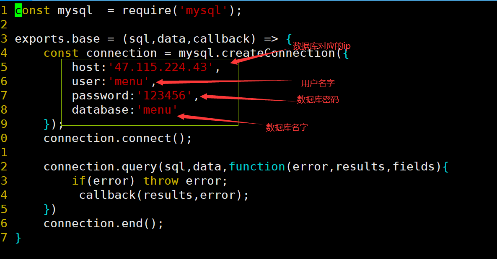

# 菜谱APP开发实战（可改任意APP）

## 1. 优点

+ 多平台性	
  + 由于此APP开发的时候采用的是 `uni-app` 来开发的，所以说它可以打包成多种形态，在各种平台上进行使用。比如：微信、支付宝等各种小程序。当然也是可以打包成安卓APP，IOS APP。
+ 一应用多改性
  + 对每个应用的基本功能进行了封装，在你开发其他相似的应用可以在其基础上进行更改即可，相似的应用之需要修改数据库的数据即可完成新APP的开发。
  + 对于相差较大的应用，可以将部分的 组件拿过去直接使用，提高了代码的复用性。
+ 配置简单，上线简单
  + 配置简单：获取代码之后只需要更改相关的 `套接字` 即可打包成APP，安装到手机上使用。
  + 上线简单：后端采用的是 `NodeJS` ，上线的时候只需要借助 `pm2`包管理器，进行上线就可以了，方便简单。

## 2. 功能说明

+ 此`APP`是一个菜谱`APP`包含如下功能

<!-- tabs:start -->
#### **主界面**

#### **添加菜单**

#### **菜谱展示**

#### **个人中心**

#### **个人信息修改**

#### **权限管理**

> 开发过程中，为了简单话，我将整个的权限管理和菜单管理都集成到了同一个APP中，没有做单独的后端管理系统。

> 限管理是通过，在用户登录的时候，后端会将用户做区分，并将结果返回给客户端的axios请求。

####  **用户管理**

#### **菜单管理**

#### **登录**

#### **注册**

<!-- tabs:end -->
## 3.其他功能说明

+  当然还有其他界面和功能做一下简单的说明吧
  1. 忘记密码
  2. 下载（还没做完）
  3. 收藏
  4. 搜索
  5. ……

## 4. 启动配置流程
<!-- tabs:start -->
#### **客户端的启动和打包**

+ 用`HbuilderX`打开项目
+ 修改对应的配置
  + 
+ 打包可以自己百度一下，这里就不介绍了，因为大家的需求不一

#### **后端配置更简单**

+ 下载后端代码
  + 切换到根目录启动终端，执行 `npm i` 修改对应的包
  + 继续在终端执行 `node index.js`

> 注意：要修改数据库对应的信息，如图：
>
> 

 <!-- tabs:end -->

> 完成了，撒花\****************	