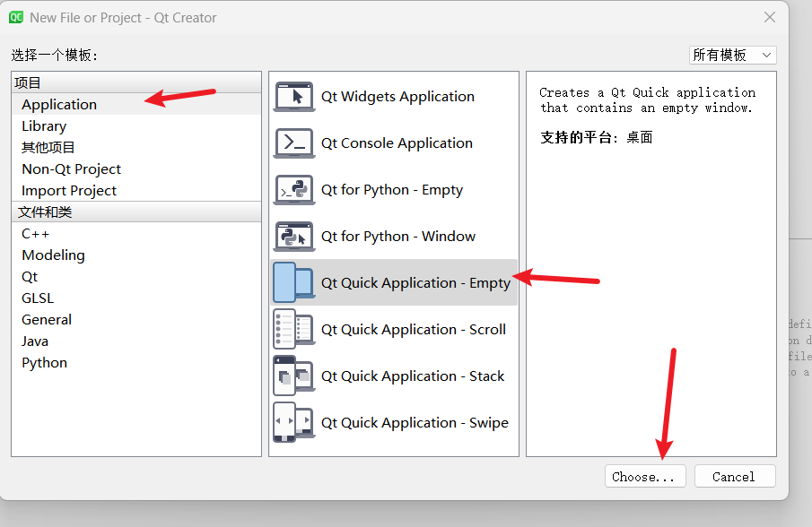
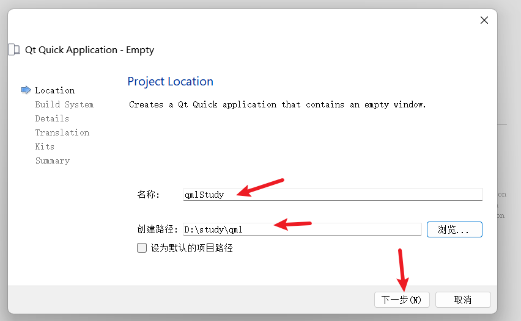
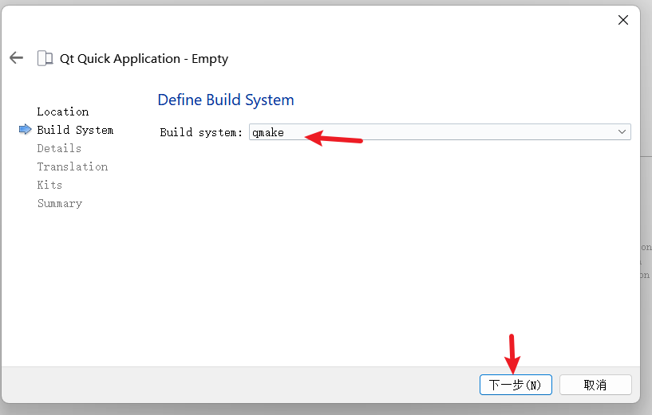
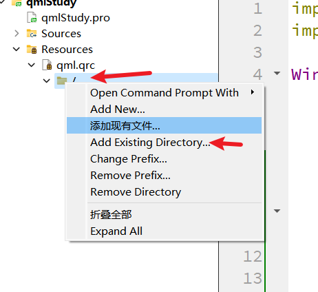
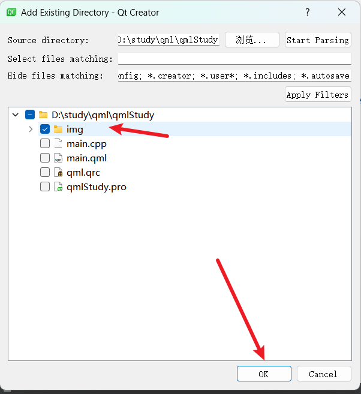
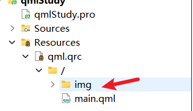
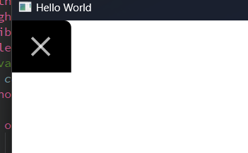
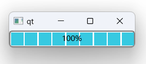
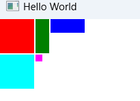

## 创建项目

1. 
2. 
3. 

> 剩下的就是一路`下一步`即可

## 添加静态资源——图片

1. 

2. 

3. 添加之后完成之后的路径
   
   

## 案列 || demo

> 可以参考的资料：`https://github.com/gongjianbo/MyTestCode/blob/master/README.md`

### 1. 文本省略号

```qml
Text {
    width: 100
    text: "xxxxxxxxxxxxxxxxxxxxxxxxxxxxxxx"
    elide: Text.ElideRight
}
```

### 2. `Canvas`画圆角

> 针对项目当中要有矩形中不同地方的圆角，这样就需要使用 `Canvas`来进行绘制一下就是针对圆角的绘制

```c++
import QtQuick
import QtQuick.Controls 2.15

Window {
    visible: true
    width: 1000
    height: 900
        Canvas {
        id: canvas
        anchors.fill: parent

        onPaint: {
            var ctx = getContext("2d");
            // 渐变色的设置
            var gradient = ctx.createLinearGradient(x,y+height,x+width,y+height)
            gradient.addColorStop(0.0, "#191919")
            gradient.addColorStop(1.0, "#272829")
            var x = 50;
            var y = 50;
            var width = 200;
            var height = 100;
            var cornerSize = 20;
            // 左下
            // ctx.beginPath();
            // ctx.moveTo(x + cornerSize, y);
            // ctx.lineTo(x + width, y);
            // ctx.lineTo(x + width, y + height);
            // ctx.arcTo(x + width, y + height, x + width - cornerSize, y + height, cornerSize);
            // ctx.lineTo(x + cornerSize, y + height);
            // ctx.arcTo(x, y + height, x, y + height - cornerSize, cornerSize);
            // ctx.lineTo(x, y + cornerSize);
            // ctx.lineTo(x, y);
            // ctx.closePath();

            // 带圆角的矩形
            // ctx.beginPath();
            // ctx.moveTo(x + cornerSize, y);
            // ctx.arcTo(x + width, y, x + width, y + cornerSize, cornerSize);//右上
            // ctx.lineTo(x + width, y + height - cornerSize);
            // ctx.arcTo(x + width, y + height, x + width - cornerSize, y + height, cornerSize);//右下
            // ctx.lineTo(x + cornerSize, y + height);
            // ctx.arcTo(x, y + height, x, y + height - cornerSize, cornerSize);//左下
            // ctx.lineTo(x, y + cornerSize);
            // ctx.arcTo(x, y, x + cornerSize, y, cornerSize);// 左上
            // ctx.closePath();

            // 右上+左上
            // ctx.beginPath();
            // ctx.moveTo(x + cornerSize, y);
            // ctx.arcTo(x + width, y, x + width, y + cornerSize, cornerSize);//右上
            // ctx.lineTo(x + width, y + height);
            // ctx.lineTo(x + cornerSize, y + height);
            // ctx.lineTo(x, y + height);
            // ctx.arcTo(x, y, x + cornerSize, y, cornerSize);// 左上
            // ctx.closePath();

            // 右下
            ctx.beginPath();
            ctx.moveTo(x + cornerSize, y);
            ctx.lineTo(x + width, y);
            ctx.lineTo(x + width, y + height - cornerSize);
            ctx.arcTo(x + width, y + height, x + width - cornerSize, y + height, cornerSize);//右下
            ctx.lineTo(x + width, y + height);
            ctx.lineTo(x, y + height);
            ctx.lineTo(x, y);


            ctx.closePath();

            ctx.fillStyle = gradient;
            ctx.strokeStyle = 'transparent';// 边框
            ctx.fill();
            ctx.stroke();
        }
    }
}
```

### 3.  关闭按钮

```qml
import QtQuick
import QtQuick.Controls 2.15

Window {
    width: 640
    height: 480
    visible: true
    title: qsTr("Hello World")
    Canvas {
    id: canvas
    anchors.fill: parent

        onPaint: {
            var ctx = getContext("2d");

            // 定义矩形位置和大小
            var rectX = 0;
            var rectY = 0;
            var rectWidth = 59;
            var rectHeight = 59;

            // 定义圆弧半径
            var arcRadius = 8;

            // 计算圆弧位置
            var arcX = rectX + rectWidth;//109
            var arcY = rectY// 50
            var arcStartX = arcX + arcRadius;//117
            var arcStartY = rectY;//50
            var arcEndX = arcStartX; //117
            var arcEndY = arcStartY + arcRadius;// 58r
            console.log(arcX,arcY,arcStartX,arcStartY,arcEndX,arcEndY)

            // 绘制矩形
            ctx.fillStyle = "#000000";

            // 绘制右上角圆弧
            ctx.beginPath();
            ctx.moveTo(rectX, rectY);// 50 50
            ctx.lineTo(arcX, arcY);// 109 50
            ctx.arcTo(arcStartX, arcStartY, arcEndX, arcEndY, arcRadius);
            ctx.lineTo(arcEndX, arcEndY);
            ctx.lineTo(arcEndX, rectY + rectHeight);
            ctx.lineTo(rectX, rectY + rectHeight);
            ctx.closePath();
            ctx.fill();
            // 计算 X 图标的位置
            var xIconSize = 20;
            var xIconX = rectX + 3　+ (rectWidth - xIconSize) / 2;
            var xIconY = rectY + (rectHeight - xIconSize) / 2;

            // 绘制 X 关闭图标
            ctx.beginPath();
            ctx.moveTo(xIconX, xIconY);
            ctx.lineTo(xIconX + xIconSize, xIconY + xIconSize);
            ctx.moveTo(xIconX + xIconSize, xIconY);
            ctx.lineTo(xIconX, xIconY + xIconSize);
            ctx.strokeStyle = Qt.rgba(255, 255, 255, 0.7);
            ctx.lineWidth = 3;
            ctx.stroke();
        }
    }
}
```



### 4. QT 进度条放`gif`

```cpp
#include <QApplication>
#include <QProgressBar>
#include <QPropertyAnimation>
#include <QPixmap>
#include <QMovie>
#include <QLabel>


int main(int argc, char *argv[])
{

    QApplication a(argc, argv);

    QProgressBar progressBar;
    QLabel label(&progressBar);
    QMovie movie(":/tenor-1.gif");  // 从资源中加载 GIF 图片
    label.setMovie(&movie);
    movie.start();

    progressBar.show();

    return a.exec();
}
```

>  效果就是导航栏上放一个gif图片的动态效果，当然加载 `gif`的相关东西也是可以参考；

### QT进度条加入css属性

```cpp
#include <QApplication>
#include <QProgressBar>
#include <QTimer>

int main(int argc, char *argv[])
{
    QApplication a(argc, argv);

    QProgressBar progressBar;
    progressBar.setRange(0, 100); // 设置进度条范围为 0 到 100

    QTimer timer;
    int progress = 0;

    // 每隔一段时间更新进度条的值，模拟加载过程
    QObject::connect(&timer, &QTimer::timeout, [&](){
        progress += 1;
        progressBar.setValue(progress);

        if (progress >= 100) {
            timer.stop();
        }
    });

    timer.start(100); // 每100毫秒更新一次进度条

    // 设置进度条的样式，使其具有流动的效果
    progressBar.setStyleSheet("QProgressBar { border: 2px solid grey; border-radius: 5px; text-align: center; }"
                              "QProgressBar::chunk { background-color: #37c9e1; width: 20px; margin: 1px; }");

    progressBar.show();

    return a.exec();
}
```



## 属性

### implicitWidth

> 是指一个组件在没有显示设置宽度所具有的默认宽度。

```qml
Item {
      property alias icon: image.source
      property alias label: text.text
      implicitWidth: text.implicitWidth + image.implicitWidth
      implicitHeight: Math.max(text.implicitHeight, image.implicitHeight)
      Image { id: image }
      Text {
          id: text
          wrapMode: Text.Wrap
          anchors.left: image.right; anchors.right: parent.right
          anchors.verticalCenter: parent.verticalCenter
      }
  }
```

### vision

> qml当中的vision表示当前组件的可见性，当为 `false`的时候只是表示当前组件不显示，但是当前组件在布局中还是存在的；（相当于vue中的 `v-show`）

+ 在 QML 中，要实现类似 Vue.js 中 v-if 的功能，即根据条件动态创建或销毁组件，可以使用 Loader 组件。Loader 组件可以根据条件动态加载指定的 QML 组件，并在不需要时卸载该组件，从而实现类似 v-if 的效果。
+ 以下是一个简单的示例，演示如何在 QML 中使用 Loader 实现类似 v-if 的功能

```c++
import QtQuick 2.15
import QtQuick.Controls 2.15

Item {
    width: 200
    height: 200

    property bool showComponent: false

    Loader {
        id: componentLoader
        sourceComponent: showComponent ? componentA : null
    }

    Component {
            id: componentA
            Rectangle {
            width: 100
            height: 100
            color: "red"
        }
    }

    Button {
        text: "Toggle Component"
        onClicked: showComponent = !showComponent
    }
}
```

+ 在上面的示例中，我们定义了一个 Loader 组件，根据 showComponent 属性的值来加载或卸载 componentA 组件。当 showComponent 为 true 时，componentA 被加载并显示；当 showComponent 为 false 时，componentA 被卸载。
+ 通过点击按钮，可以动态切换 showComponent 属性的值，从而实现类似 v-if 的效果。 
+ 这种方法可以让你在 QML 中根据条件动态加载组件，实现类似于 Vue.js 中 v-if 的功能。

### Overlay

+ Overlay QML类型是用于在其子项之上显示另一组子项的布局类型。Overlay的子项会覆盖在其它子项之上，可以用于创建浮动窗口、弹出菜单等效果。

### qml之ShaderEffectSource获取控件快照

> **ShaderEffectSource**和**grabToImage**的大致区别：  
> grabToImage接口可以提取出图像，但是这个需要把显存中的数据复制到内存中,非常耗时，而ShaderEffectSource是完全GPU内实现，不存在拷贝到内存的开销。

+ **ShaderEffectSource**类型将**sourceItem**渲染为纹理并在场景中显示
  
  + `hideSource：`
    
    + 如果此属性为true，则sourceItem将被隐藏，尽管它仍将呈现到纹理中。 与通过将visible设置为false来隐藏sourceItem相反，将此属性设置为true不会阻止鼠标或键盘输入到达sourceItem。
  
  + `live`：
    
    + ShaderEffectSource默认情况下会随着设置的Item变化而变化,设置为false渲染完一次后，就不会发生变化
  
  + **`sourceItem`**：  
    
    + 就是生成快照的数据源，如果**live**为true，则将其设置为null将释放纹理资源

```qml
import QtQuick 2.0
Window {
    width: 640
    height: 480
    visible: true
    title: qsTr("Hello World")

    Rectangle {
            id:id_root
            width: 800
            height: 400
            color:"black"
            Rectangle {
                width: 400
                height: 200
                gradient: Gradient {
                    GradientStop { position: 0; color: "white" }
                    GradientStop { position: 1; color: "gray" }
                }
                Row {
                    id:id_row
                    opacity: 1.0
                    Item {
                        id: foo
                        width: 100; height: 100
                        Rectangle { x: 5; y: 5; width: 60; height: 60; color: "red" }
                        Rectangle { x: 20; y: 20; width: 60; height: 60; color: "orange" }
                        Rectangle { x: 35; y: 35; width: 60; height: 60; color: "yellow" }
                    }
                }
                ShaderEffectSource {
                    width: 100; height: 70
                    anchors.horizontalCenter: id_row.horizontalCenter
                    anchors.top: id_row.bottom
                    sourceItem: foo
                    opacity:0.3
                    rotation: 0 // 快照的旋转角度
                    format:ShaderEffectSource.Alpha //单通道（Alpha通道）
                    //format: ShaderEffectSource.RGB //三通道
                    //format: ShaderEffectSource.RGBA // 四通道
                    //mipmap:true
                }
            }
        }

}
```

### Q_PROPERTY宏

> 要声明属性，需要继承QObject并使用Q_PROPERTY()宏。

```qml
Q_PROPERTY(type name
           (READ getFunction [WRITE setFunction] |
            MEMBER memberName [(READ getFunction | WRITE setFunction)])
           [RESET resetFunction]
           [NOTIFY notifySignal]
           [REVISION int]
           [DESIGNABLE bool]
           [SCRIPTABLE bool]
           [STORED bool]
           [USER bool]
           [CONSTANT]
           [FINAL])
```

> 在QML中访问C++，通过C++类暴露属性来使用，接上面实例如下：

1. 新建Qt Quick工程：qt PROPERTY

2. 新建C++类TestProperty，公有继承于QObject

3. 为TestProperty类设置上述属性title

        Q_PROPERTY(QString title READ title WRITE setTitle NOTIFY titleChanged);

4. 属性读写函数声明与实现

> `TestProperty.h`

```cpp
#ifndef TESTPROPERTY_H
#define TESTPROPERTY_H

#include <QObject>

class TestProperty : public QObject
{
    Q_OBJECT
public:
    explicit TestProperty(QObject *parent = nullptr);
    Q_PROPERTY(QString title READ title WRITE setTitle NOTIFY titleChanged);

    QString title();
    void setTitle(QString strTitle);


signals:
    void titleChanged();

public slots:

private:
    QString     m_title;

};

#endif // TESTPROPERTY_H

```

> `TestProperty.cpp`

```cpp
#include "TestProperty.h"

TestProperty::TestProperty(QObject *parent) : QObject(parent)
{

}

QString TestProperty::title()
{
    return  m_title;
}

void TestProperty::setTitle(QString strTitle)
{
    m_title = strTitle;
    emit titleChanged();
}
```

> `main.cpp`

```cpp
#include <QGuiApplication>
#include <QQmlApplicationEngine>

#include "TestProperty.h"


int main(int argc, char *argv[])
{
    QGuiApplication app(argc, argv);

    // 注册这个类，到处到qml
    // template<typename T>
    // int qmlRegisterType(const char *uri, int versionMajor, int versionMinor, const char *qmlName);

    // template<typename T, int metaObjectRevision>
    // int qmlRegisterType(const char *uri, int versionMajor, int versionMinor, const char *qmlName);

    qmlRegisterType<TestProperty>("TestProperty", 1, 0, "TestProperty");

    QQmlApplicationEngine engine;
    const QUrl url(QStringLiteral("qrc:/12/Main.qml"));
    QObject::connect(
        &engine,
        &QQmlApplicationEngine::objectCreationFailed,
        &app,
        []() { QCoreApplication::exit(-1); },
        Qt::QueuedConnection);
    engine.load(url);

    return app.exec();
}

```

> `main.qml   `

```qml
import QtQuick 2.9
import QtQuick.Window 2.2
// 1. 导入
import TestProperty 1.0

Window {
    visible: true
    width: 640
    height: 480
    title: qsTr("Hello Qt")

    // 2. 使用
    TestProperty{
        id: testProperty
        title: qsTr("Hello World")
    }

    Component.onCompleted: {
        title = testProperty.title;
    }
}
```

### invokeMethod()

> Qt元对象系统是Qt最核心的一个基础特性，元对象系统负责信号和插槽对象间通信机制、运行时类型信息和Qt属性系统。为应用程序中使用的每个QObject子类创建一个QMetaObject实例，此实例存储QObject子类的所有元信息。通过元对象系统，你可以查询QObject的某个派生类的类名、有哪些信号、槽、属性、可调用方法等信息，然后可以使用QMetaObject::invokeMethod()调用QObject的某个注册到元对象系统中的方法。

#### QMetaObject::invokeMethod()

>  QMetaObject的invokeMethod()方法用来调用一个对象的信号、槽、可调用的方法。这是一个静态方法，其函数原型如下

```cpp
bool QMetaObject::invokeMethod(QObject *obj, const char *member, 
							Qt::ConnectionType type, 
							QGenericReturnArgument ret,
							QGenericArgument val0 = QGenericArgument(nullptr), 
							QGenericArgument val1 = QGenericArgument(), 
							QGenericArgument val2 = QGenericArgument(), 
						    QGenericArgument val3 = QGenericArgument(), 
							QGenericArgument val4 = QGenericArgument(),
							QGenericArgument val5 = QGenericArgument(),
							QGenericArgument val6 = QGenericArgument(), 
							QGenericArgument val7 = QGenericArgument(),
							QGenericArgument val8 = QGenericArgument(),
							QGenericArgument val9 = QGenericArgument())

```

+ 在最新的Qt5.13中，QMetaObject中的invokeMethod函数一共有五个，除上面这个以外其他都是重载函数

+ 该函数就是调用obj对象中的member方法，如果调用成功则返回true，调用失败则返回false，失败的话要么就是没有这个方法要么就是参数传入不对。

+ 参数介绍
  
  + 第一个参数是被调用对象的指针；
  
  + 第二个参数是方法的名字；
  
  + 第三个参数是连接类型。可以指定连接类型，来决定是同步还是异步调用。
    
    + 如果type是Qt :: DirectConnection，则会立即调用该成员。
    
    + 如果type是Qt :: QueuedConnection，则会发送一个QEvent，并在应用程序进入主事件循环后立即调用该成员。
    
    + 如果type是Qt :: BlockingQueuedConnection，则将以与Qt :: QueuedConnection相同的方式调用该方法，除了当前线程将阻塞直到事件被传递。使用此连接类型在同一线程中的对象之间进行通信将导致死锁。
    
    + 如果type是Qt :: AutoConnection，则如果obj与调用者位于同一个线程中，则会同步调用该成员; 否则它将异步调用该成员。
    
    + 第四个参数接收被调用函数的返回值；注意，如果调用是异步的，则无法计算返回值。
    
    + 注意：传入的参数是有个数限制的，可以向成员函数传递最多十个参数（val0，val1，val2，val3，val4，val5，val6，val7，val8和val9）。

> QGenericArgument和QGenericReturnArgument是内部帮助程序类。由于可以动态调用信号和槽，因此必须使用Q_ARG（）和Q_RETURN_ARG（）宏来封装参数。Q_ARG（）接受该类型的类型名称和const引用; Q_RETURN_ARG（）接受类型名称和非const引用。

> 注意：此功能是线程安全的。

+ #### 调用示例
  
  + 假设一个对象有一个槽compute(QString,int,double),返回一个QString对象，那么调用方式如下（同步）：

```cpp
QString retVal;
QMetaObject::invokeMethod(obj, "compute", Qt::DirectConnection,
                          Q_RETURN_ARG(QString, retVal),
                          Q_ARG(QString, "sqrt"),
                          Q_ARG(int, 42),
                          Q_ARG(double, 9.7));

```

+ 假设要异步调用QThread上的quit（）槽:

```cpp
QMetaObject::invokeMethod(thread, "quit", Qt::QueuedConnection);
```

> **注意，要调用的类型必须是信号、槽，以及Qt元对象系统能识别的类型， 如果不是信号和槽，可以使用qRegisterMetaType（）来注册数据类型。此外，使用Q_INVOKABLE来声明函数，也可以正确调用。**

### 布局

#### Row 行布局

> 当你把一个Item交给Row来管理，那就不要在使用 `Item` 的 `x、y、anchors`等属性

> 在一个Row内的 `Item`，可以使用`Poistioner`附加属性来获知自己在 `Row`中的详细位置信息。 `Positioner` 有 `index、isFirstItem、isLastItem`

```qml
Row {
    spacing: 2
    Rectangle { color: "red"; width: 50; height: 50 }
    Rectangle { color: "green"; width: 20; height: 50 }
    Rectangle { color: "blue"; width: 50; height: 20 }
}
```

#### Colomun 用法和Row基本一样

#### Grid

> Grid 在一个网格上安置它的子Item，他会创建一个一个拥有很多单元格的网格——从左到右，从上到下把它的子Item一个个塞到单元格里。

> Item 默认会被放到一个单元格左上角，即（0,0）位置

```qml
Grid {
      columns: 3
      spacing: 2
      Rectangle { color: "red"; width: 50; height: 50 }
      Rectangle { color: "green"; width: 20; height: 50 }
      Rectangle { color: "blue"; width: 50; height: 20 }
      Rectangle { color: "cyan"; width: 50; height: 50 }
      Rectangle { color: "magenta"; width: 10; height: 10 }
  }
```



#### Flow

> Flow其实和Grid类似，不同之处是它没有显示的行、列数，`它会计算子item的尺寸，然后与自身尺寸比较，按需折行`

> `Flow`的 `flow`属性，默认取值 `Flow.LeftToRight`,从左到右安排Item，知道Flow本身的宽度不能容纳新的子Item时折行；

```qml
 Flow {
     anchors.fill: parent
     anchors.margins: 4
     spacing: 10
     Text { text: "Text"; font.pixelSize: 40 }
     Text { text: "items"; font.pixelSize: 40 }
     Text { text: "flowing"; font.pixelSize: 40 }
     Text { text: "inside"; font.pixelSize: 40 }
     Text { text: "a"; font.pixelSize: 40 }
     Text { text: "Flow"; font.pixelSize: 40 }
     Text { text: "item"; font.pixelSize: 40 }
 }
```

#### X，Y 定位

> 在qml中的X，Y定位相对于web中的absolute定位

+ 这种定位的位置，是`相对于它的父级元素而言的，x，y,`而不是相对于 全局的 `window`来定位的，重要！重要！重要！
