# **自动化测试平台**

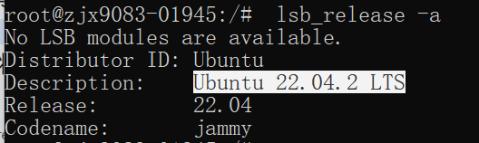

## ！！！开发板中 `/scripts`目录下的 `startup.sh` 不要覆盖或者轻易修改！！！

## 项目架构

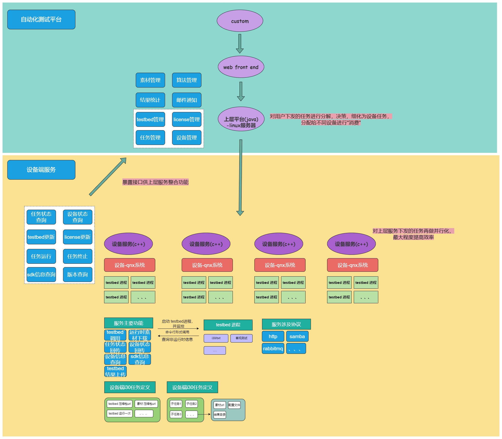


> 平台部分的框图
>
> +  测试平台对用户下发的任务进行分解、决策、细化为设备任务，分配给不同设备进行“消费”，设备端服 务对上层下发的任务进行任务甄别、作并行化处理，提高效率。双方通过http通信。

## 项目部署

> **除了252是测试环境之外，其他都是正式环境**

### 部署目录结构

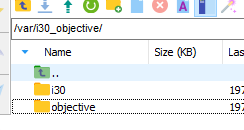

## 一、环境配置

### 1. 安装`wsl2`
+ 安装过程比较简单
    + [安装教程](https://learn.microsoft.com/zh-cn/windows/wsl/install)
    
+ 安装完之后可能会报错

    - 解决方法
      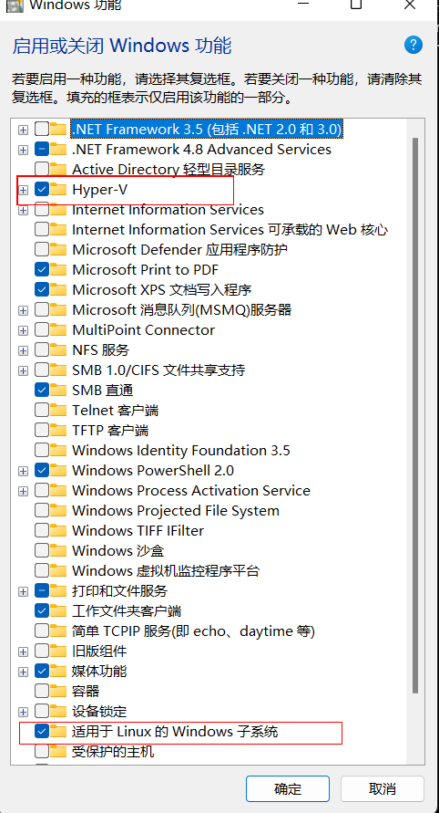
    
      
    
#### 1.1 切换存储盘

  1）导出到D盘

  2）从C盘中注销原始的`ubuntu`系统

  3）从D盘中重新导入

  ```
  wsl --export Ubuntu-20.04 d://wslubuntu2004//ubuntu-20.04.tar
  wsl --unregister Ubuntu
  wsl --import Ubuntu-20.04 d://wslubuntu2004 d://wslubuntu2004//ubuntu-20.04.tar
  ```
> 说明和下面步骤按行对应，第二步骤的注销是通过 wsl -l -v 命令来判断当前系统存在那些子系统

#### 1.2 wsl突然连不上网解决方式

> 第一种方法

```shell
=============================================================================
FIX WSL2 NETWORKING IN WINDOWS 10
=============================================================================
cmd as admin:
wsl --shutdown
netsh winsock reset
netsh int ip reset all
netsh winhttp reset proxy
ipconfig /flushdns

Windows Search > Network Reset

Restart Windows
```

> 第二种方法

```shell
# Fix network issues
# Delete auto-generated files
[root@PC-NAME user]# rm /etc/resolv.conf || true
[root@PC-NAME user]# rm /etc/wsl.conf || true

# Enable changing /etc/resolv.conf
# Enable extended attributes on Windows drives
[root@PC-NAME user]# cat <<EOF > /etc/wsl.conf
[network]
generateResolvConf = false

[automount]
enabled = true
options = "metadata"
mountFsTab = false
EOF

# Use google nameservers for DNS resolution
[root@PC-NAME user]# cat <<EOF > /etc/resolv.conf
nameserver 8.8.8.8
nameserver 8.8.4.4
EOF

Exit Linux WSL

cmd as admin:
wsl --shutdown
netsh winsock reset
netsh int ip reset all
netsh winhttp reset proxy
ipconfig /flushdns

Windows Search > Network Reset

Restart Windows
```

### 2. 安装`vscoe`连接`wsl2`

```shell
sudo apt-get update
sudo apt-get install wget ca-certificates
code .
```

+ 报错处理

  + 报错信息：

  ```error
  /mnt/c/Users/zjx9083/AppData/Local/Programs/Microsoft VS Code/bin/code: 61: /mnt/c/Users/zjx9083/AppData/Local/Programs/Microsoft VS Code/Code.exe: Exec format error
  ```

  + [解决方式：](https://github.com/microsoft/WSL/issues/8952#issuecomment-1568212651)

  ```shell
  sudo sh -c 'echo :WSLInterop:M::MZ::/init:PF > /usr/lib/binfmt.d/WSLInterop.conf'
  sudo systemctl restart systemd-binfmt
  ```

### 3. `RabbitMQ` `Windows` 安装

+ `RabbitMQ`安装参考：
  + https://juejin.cn/post/6992383077435572260
  + https://developer.aliyun.com/article/1134566
+ 错误处理
  + 报错信息
    + `Error: unable to perform an operation on node 'rabbit@zjx9083-01945'. Please see diagnostics information and suggestions below.`
    + https://itecnote.com/tecnote/unable-to-perform-an-operation-on-node-rabbitmq/
  + 报错： `弹窗`
    + 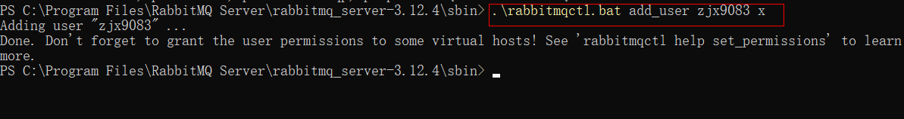

### 4. `ubuntu` `samba`安装

+ 安装参考文献
  + https://zhuanlan.zhihu.com/p/375925918
+ 报错：`Unit nmb.service not found`
  + https://bbs.archlinux.org/viewtopic.php?id=194468
+ ` systemctl status smbd.service nmbd.service`  状态查询

> 记得开放  `445`  和  `443`  端口

### 5. `windows samba` 安装

+ [教程链接](https://www.jianshu.com/p/69925167c304)
+ [下载samba](https://www.samba.org/)

## 二、项目（源代码）启动

1. 将交叉编译文件拷贝到 `ubuntu` 的   `code-space` 路径下进行解压。

> 注意： `main_service`和`main_i30service`是主线任务，其它的为测试任务。
>
> + 所在路径为：`/home/zjx/board_sdk_service/src/target/o_main_service`

2. 在 `focus.py`对应的目录下执行(编译不通过)

   ```shell
   python3 focus.py -b main_service  # 不带o_
   ```

3. 刚开始的时候可以先注释掉 `focus.py` 参考下图，并按下图修改 `CMakeList.txt`(主目录下的)

   + `focus.py`

   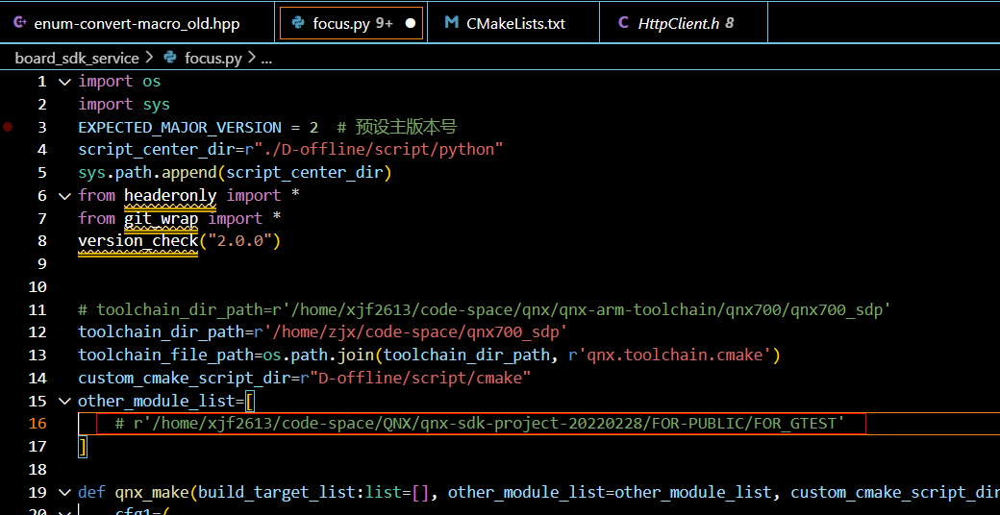

   + `CMakeList.txt`

   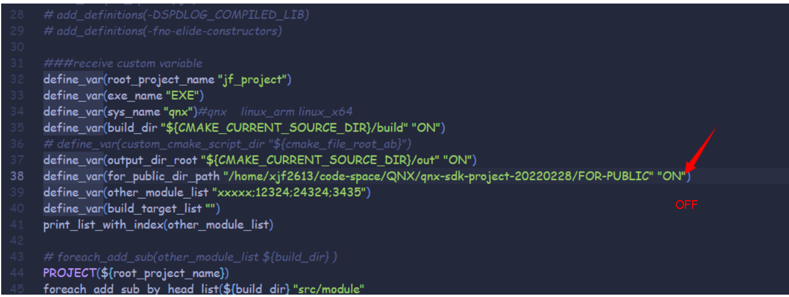

   4. 在 `focus.py`对应的目录下执行(编译不通过)

         ```shell
         python3 focus.py -b main_i30service
         cd build
         make
         ```

   5. 成功生成out目录和对应的文件。

      + 此时如果没有生成此目录 `/home/zjx/code-space/QNX/qnx-sdk-project-20220228/FOR-PUBLIC/FOR_GTEST`
      + 可以手动生成，并将之前的修改的，复原回来。**思考一下，其实可以在刚开始的时候，根据自己的需求进行修改。**

   6. 如果编译 `main_service` 失败，可以查看自己留下的注释 ，注释规则 `zjx new：行为`

   7. `error`：`aarch64-unknown-nto-qnx7.0.0-g++-5.4.0: fatal error: error: environment variables QNX_HOST and QNX_TARGET not defined`

      + 处理方式：**仔细对照根目录的 `CMakeLists.txt`文件 和  `/src/target/o_main_service` 目录下的  `CMakeLists.txt`文件**

   8. `main_service`文件执行过程，**不要make**

      ```shell
      python3 focus.py -b main_service
      # 执行成功之后在out文件夹中有对应的可执行文件生成（此处的可执行文件是要导入到开发板中执行，在ubuntu不能执行）
      ```

   9. 开发板252连接

      + 远程连接开发板软件：`MobaXterm`
      + 连接`IP`询问即可
      + 工具连接参考下图

      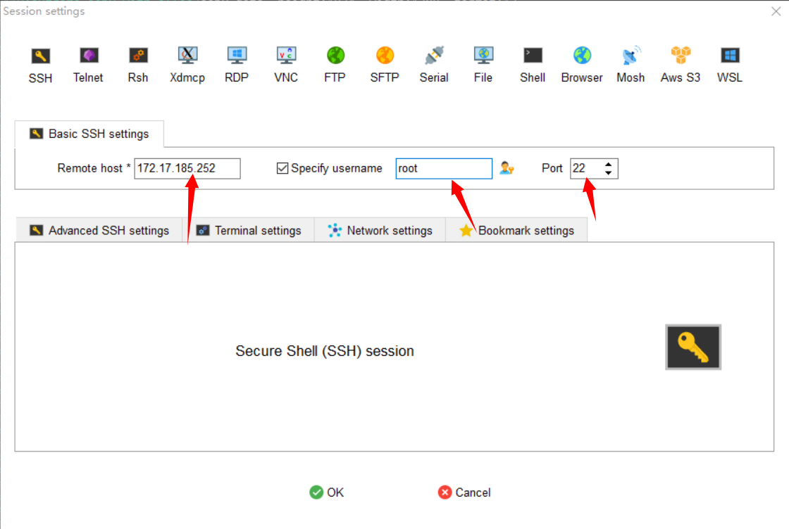

      + 将生成好的可执行程序拖到开发板中（当时是拖到连接工具啦！）

      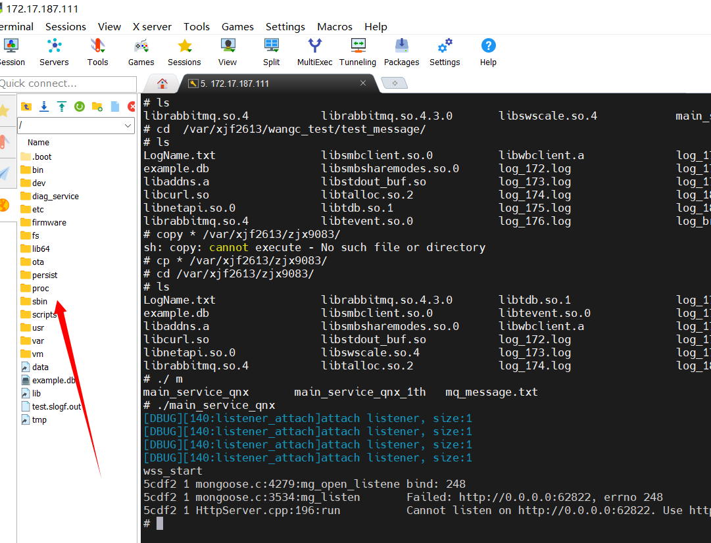

      + 执行： `./执行程序的name`

      + **此时处于监听状态**

## 三、自动化测试脚本（`i30`）

### 1. 相关描述

#### 1.1 环境描述

+ 语言：python
+ 库： requests
+ 运行环境： windows
+ 依赖包
  + `paramiko  shutil  request`


#### 1.2 目录描述（会有改动，但是命名目录可参考）

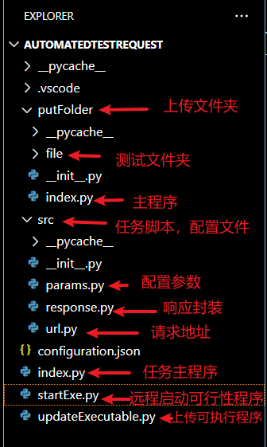

### 2. 项目搭建

> 注意：本项目在搭建的时候采用的是 `虚拟环境` 来配置项目所需要的依赖

+ 虚拟环境配置可以参考：https://flask.palletsprojects.com/en/2.3.x/installation/#virtual-environments

### 3. 项目开发

+ `index.py` 主文件（也是入口文件）
+ `url.py`  请求的各种`url`路径
+ `params.py`  每个请求对应的参数
+ `response.py` 将每一个请求封装成函数，方便后面逻辑调用
+ `startExe.py` 启动远程可程序程序，已经封装成函数，可直接调用

  + ```python
    import startExe as start
    startStatus = start.startExt() #启动程序测试
    print("启动成功：",startStatus) # 返回——启动成功：success
    ```

#### 3.1 重定向输出脚本

##### 测试案列：

> `redirect.cpp`

```cPP
#include <iostream>
#include <chrono>
#include <thread>

int main() {
   const char* fileName = "output.txt";
    // FILE *outFile = fopen("output.txt", "a");
    FILE *outFile = fopen(fileName, "w");
    if (outFile == NULL) {
        fprintf(stderr, "Failed to open output.txt\n");
        return 1;
    }

    int i = 1;
    while (1) {
        fprintf(outFile, "This is line %d\n", i);
        printf("This is line %d\n", i);
        std::cout << "This is line " << i+100 << std::endl;
        fflush(stdout);
        i++;
        std::this_thread::sleep_for(std::chrono::seconds(1));
    }

    fclose(outFile);
    return 0;
}
```

> main.cpp

```cpp
#include <iostream>
#include <cstdlib>

int main() {
    // system("./redirect >> output.txt");
    system("./redirect > output.txt");
    return 0;
}
```

###### 代码执行

```
g++ -o main main.cpp
g++ -o redirect redirect.cpp
./main
```

#### 项目中实现

> 这里会给出代码流程，需要修改的地方有注释，参考注释 `new zjx`

+ 修改路径 `/board_sdk_service/src/target/o_main_i30service/main.cpp`

```c++

#include "main.h"

int main(int argc, char* argv[])
{
    // new zjx:输出重定向到output.txt  6-11
    const char* fileName = "output.txt";
    FILE *outFile = freopen(fileName, "w", stdout);  // 重定向stdout到文件并使用追加模式
    if (outFile == NULL) {
        std::cerr << "Failed to open file" << std::endl;
        return 1;
    }
    // setvbuf(stdout, NULL, _IONBF, 0);
    if (argc > 1) {
        return commond_line_test(argc, argv);
    }

    signal(SIGINT, signal_handler);
    ws_start();
    Singleton<TManager>::Instance();
    Singleton<TManager>::GetInstance().launch_backend();

    while (1)
    {
        if(s_signo!=0){
            ws_stop();
            Singleton<TManager>::Destruct();
            std::this_thread::sleep_for(std::chrono::seconds(1));
            break;
        }
        std::this_thread::sleep_for(std::chrono::seconds(3));
    }
    fclose(outFile); // new zjx:输出重定向到output.txt
    return 0;
}
```

+ 修改路径 `/board_sdk_service/src/target/o_main_i30service/main.cpp`

```cpp
#ifndef JF_MAIN_HPP_
#define JF_MAIN_HPP_
#include "HttpMain.h"
#include "HttpServer.h"
#include "TestBedManager.h"
#include "MyEasyLog.hpp"
#include "component-all.hpp"
#include "compile_info.h"
// new zjx:header输出重定向 10-12
#include <cstdio>
#include <chrono>
#include <thread>

int32_t LOG_LEVEL_MASK = EROR | VEBO | PRINT | INFO | DBUG | COLOR | EXTR;
char MYLOG_PATH[200] = "./my_log.txt";

#define OPEN_TESTBED_MANAGER 0

static int s_signo;
static void signal_handler(int signo) {
    s_signo = signo;
}

static int commond_line_test(int argc, char* argv[]) {
    if ((argc == 2) && (strcmp(argv[1], "--compile_info"))) {
        LOG_EXTR("compile info:%s", BUILD_DATE);
        return 0;
    }
    if (1 == argc) {
        return 0;
    }
    if (argc == 2) {
        std::vector<std::string> out_vec;
        extract_dir_name(argv[1], out_vec);
    }
    else if (argc == 3) {
        HttpClientManage::download_file(argv[1], argv[2]);
        return 0;
    }
    else if (argc == 4) {
        HttpClientManage::upload_file(argv[1], argv[2], std::stoi(argv[3]));
        return 0;
    }
    return 0;
}

#endif JF_MAIN_HPP_
```


### 4. i30任务代码实现（逻辑代码部分）

> 后续可优化，进行拆分，整理

```python
import time 
import json
# import startExe as startExe
import src.response as response # 请求函数粉装
# import putFfile.updateExecutable as update
from datetime import datetime  

with open("./configuration.json") as conf:
    data = json.load(conf)
loop = 0
times = 5
taskStatus = 0 #任务状态
testBed = 0  # testbed 更新状态
deviceStatus = 0 # 设备状态
reboot = 0
# 根据配置文件，看是否需要更新可执行程序，isUpdate为true更新
# if data['isUpdate']:
#     update.updateExeMain()
# else:
#     startExe.startExt()

while (loop * times ) < 10000 :
    try:
        # 如果刚开始执行发现任务是运行状态，则接着运行任务就好，待任务运行完成，在进行下一步
        deviceStatus = response.deviceStatusResponse()
        taskStatus = response.taskStatusResponse()
        while taskStatus == 6 :
            print("--------------ACCEPTED RUNNING",datetime.now(),"--------------")
            taskStatus = response.taskStatusResponse()
            time.sleep(3)
            if taskStatus != 6:
                break
        # 获取设备的状态，当状态为free执行以下操作
        if deviceStatus  == 1 :
            print("--------------------------------------------")
            testBed = response.testbedMetiralResponse()
            print("testBed------------------>",testBed)
            print("-------------------更新testbed--------------------")
            while  True:
                deviceStatus = response.deviceStatusResponse()
                if deviceStatus == 41:
                    # testBed 更新成功就执行重启
                    try:
                        reboot = response.deviceRebootResponse()
                        time.sleep(10)
                    except KeyboardInterrupt:           
                        print("quit")           
                    except Exception as ex:            
                        print("出现如下异常%s"%ex)
                    print("-------------------重启--------------------")
                if deviceStatus  == 1 or deviceStatus  == 25  and testBed == 0 and taskStatus != 6:
                    # testBed 更新成功就执行重启
                    try:
                        reboot = response.deviceRebootResponse()
                        time.sleep(10)
                    except KeyboardInterrupt:           
                        print("quit")           
                    except Exception as ex:            
                        print("出现如下异常%s"%ex)
                    print("-------------------重启--------------------")
                time.sleep(3)
                while True:
                    deviceStatus = response.deviceStatusResponse()
                    taskStatus = response.taskStatusResponse()
                    if deviceStatus  == 1: 
                        # 运行任务
                        response.taskRunResponse()
                        time.sleep(3)
                        # 当任务状态不是"ACCEPTED RUNNING "
                        taskStatus = response.taskStatusResponse()
                        print("taskStatusResponse--------->", taskStatus)
                        while taskStatus == 6 :
                            print("--------------ACCEPTED RUNNING",datetime.now(),"--------------")
                            taskStatus = response.taskStatusResponse()
                            time.sleep(3)  
                            if taskStatus != 6:
                                break
                    elif taskStatus == 2049:
                        break
                    else:
                        break
                time.sleep(3)  
    except Exception as ex: 
        response.taskTerminateResponse()           
        print("出现如下异常%s"%ex)
    if response.sdkVersionResponse() == -5 or response.deviceInfoResponse() == -5:
        response.taskTerminateResponse()  
    time.sleep(times)
    loop += 1
    print("loop-------------------->",loop)
else:
    # 循环退出执行
    print("请重新启动程序")
```

#### 代码执行

> + 在主代码  `path`：`D:\work\automatedTestRequest` 中执行 `python3 index.py`
>
> + 后续如果需要在添加功能只需要在上述代码中添加逻辑就好

### 5、`i30`任务`API`

#### 5.1. i30流程

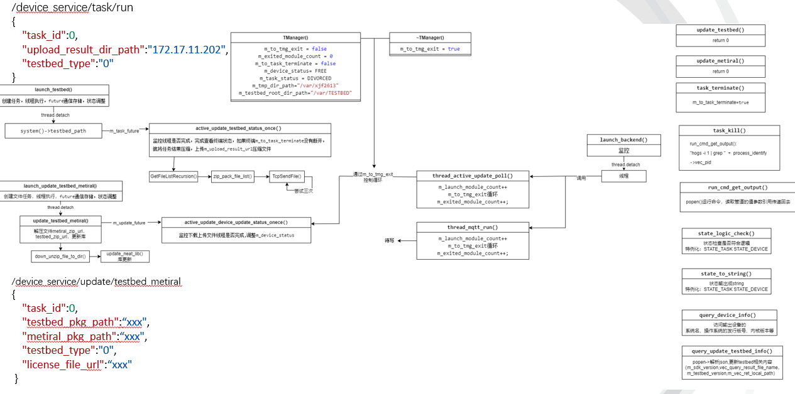

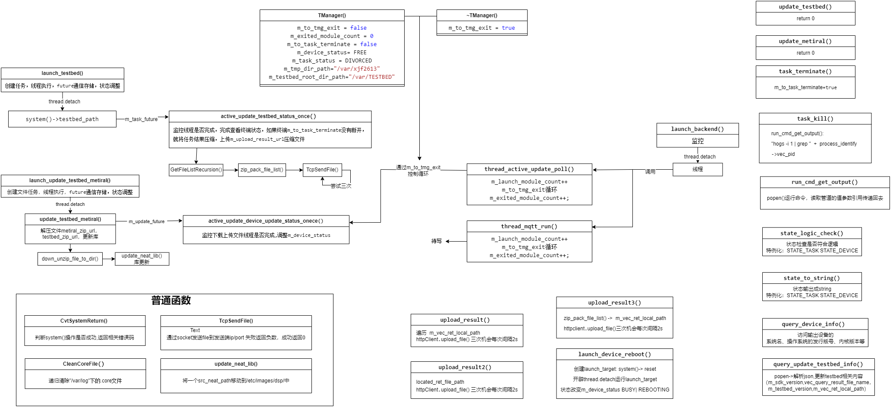


#### 5.2. 获取设备状态

+ ```
  url:http://172.17.185.252:7000/device_service/device/status
  ```

+ 请求参数

  + ```json
    {
        "task_id": 0,
        "reboot":0  // 为 1 的时候重启
    }
    ```

+ 响应信息

  + ```json
    {
    	"code" : 0,
    	"data" : 
    	[
    		{
                 "device_status" : 1,				// 66
    			"device_status_msg" : "FREE ",  //"BUSY REBOOTING"
    			"task_id" : 0
    		}
    	],
    	"msg" : "success"
    }
    ```

#### 5.3. testbedMetiral

+ ```
  url:http://172.17.185.252:7000/device_service/update/testbed_metiral
  ```

+ 请求参数

  + ```json
    {
        "task_id":0,
        "testbed_pkg_path":"http://172.17.11.202//cabin_data//testbed/1222/%2322011-1_D03_TESTBED_I30_20230619_AUTOBUILD_120.zip",
        "metiral_pkg_path":"http://172.17.11.202//cabin_data//data_set/113/D03_I30_testpics_autobuild.zip",
        "testbed_type":"0",
        "license_file_url":"http://172.17.11.202//cabin_data//license/35/license.dat"
    }
    ```

+ 响应信息

  + ```json
    {
    	"code" : 0,
    	"data" : 
    	[
    		{
    			"task_id" : 0
    		}
    	],
    	"msg" : "success"
    }
    ```

> 更新完 testbed 根据后端

####  5.4. `taskRun`运行任务

+ ```
  url:http://172.17.185.252:7000/device_service/task/run
  ```

+ 请求参数

  + ```json
    {
        "task_id":0,
        // "upload_result_dir_path":"172.17.187.12",
        "upload_result_dir_path":"172.17.11.202",
        "testbed_type":"0"
    }
    ```
  
+ 响应信息

  + ```json
    {
    	"code" : 0,
    	"data" : 
    	[
    		{
    			"task_id" : 0
    		}
    	],
    	"msg" : "success"
    }
    ```

#### 5.5. `taskStatus`任务状态

+ ```
  url:http://172.17.185.252:7000/device_service/task/status
  ```

+ 请求参数

  + ```json
    {
        "task_id":0
    }
    ```

+ 响应信息

  + ```json
    {
    	"code" : 0,
    	"data" : 
    	[
    		{
    			"task_id" : 0,
    			"task_status" : 6,
    			"task_status_msg" : "ACCEPTED RUNNING "
    		}
    	],
    	"msg" : "success"
    }
    ```

#### 5.6. `sdkVersion`获取`SDK`版本(终止任务之后执行，否则会报错)

+ ```
  url:http://172.17.185.252:7000/device_service/sdk/version
  ```

+ 请求参数

  + ```json
    {
        "task_id":0,
        "testbed_type":"0"
    }
    ```
  
+ 响应信息

  + ```json
    {
    	"code" : 0,
    	"data" : 
    	[
    		{
    			"sdk_version" : "ARCSOFT_ARCALG_3.8.400235194.7_SDK_GREATWALL_20230506_normal_AUTOBUILD_D03_outer_b3",
    			"task_id" : 0,
    			"testbed_version" : ""
    		}
    	],
    	"msg" : "success"
    }
    ```

#### 5.7. 终止任务

+ ```
  url:http://172.17.185.252:7000/device_service/task/terminate
  ```

+ 请求参数

  + ```json
    {
        "task_id":0,
        "task_type":"2"
    }
    ```
  
+ 响应信息

  + ```json
    {
    	"code" : 0,
    	"data" : 
    	[
    		{
    			"task_id" : 0
    		}
    	],
    	"msg" : "success"
    }
    ```

#### 5.8. `deviceInfo`获取设备信息

+ ```
  url:http://172.17.185.252:7000/device_service/device/info
  ```

+ 请求参数

  + ```json
    {
        "task_id":0
    }
    ```
  
+ 响应信息

  + ```json
    {
    	"code" : 0,
    	"data" : 
    	[
    		{
    			"device_info" : "QNX localhost 7.0.X 2021/02/24-23:57:01EST SA8155_ADP_Star_v1.0.0_UFS_NORMAL aarch64le\n",
    			"task_id" : 0
    		}
    	],
    	"msg" : "success"
    }
    ```

## 四、`rabbitMQ` 测试启动

> **自己当时遇到的大坑-**----- 在公司电脑 windows ,我的电脑管理员将我们的域防火墙进行了控制,我们无法关闭,这也是我们个个人电脑最大的区别,所以这里我们需要手动添加 端口规则 **将`rabbitmq`的端口`5672`手动打开**
>
> + 防火墙设置  --->  添加新规则  ------>  端口
> + 参考博客:https://www.zhang3.xyz/article/readArticleLong?pk=Zq4Gw78Wc2IoFnk5mzHJVnyIeV6B4F2rLla%2BX4YBwLY%3D

其余操作同上.

### python 的测试案列

> 为什么要写这个测试案列：因为源代码的测试案列，每次都要打包生成可执行程序，比较麻烦，所以这里可以采用python写一个写demo进行测试，方便排查虚错误和看到错误信息。
>
> + 安装对应的库
>
>   + ```
>     pip install pika
>     ```

+ 源代码

```python
import pika

# 建立socket连接
credentials = pika.PlainCredentials("123", "123")
connection = pika.BlockingConnection(pika.ConnectionParameters("172.17.186.57",5672,'/', credentials=credentials))
# 建立rabbitMQ协议的通道
channel = connection.channel()
# 声明队列：通过通道申明队列
channel.queue_declare(queue="abc")
# 发送、发布消息：routing_key--队列名称，body--消息
channel.basic_publish(exchange="",
                      routing_key="abc",
                      body="this is a message.")
print ("[x] sent a message.")
# 关闭socket连接
connection.close()
```

+ 结果打印

```txt
[x] sent a message.
```

## 五、更新可执行文件到开发板

> 环境： windows
>
> 首先检测该可执行程序是否执行，执行的话先kill掉然后在更新

### `updateExecutable.py`

> 里面涉及到的配置项，都在 `configuration.json` 文件中

```py
import os
import json
import paramiko
import shutil
import startExe as startExe
from scp import SCPClient


with open('./configuration.json') as conf:
	data = json.load(conf)
# 可执行程序在服务器上的路径
source_executable_path = data['source_executable_path']
source_path = data['source_path'] # 本地的文件要上传开发板的路径

# 目标开发板上存放可执行程序的路径
target_executable_path = data['target_executable_path']

# 建立SSH连接到另一台服务器
source_ssh = paramiko.SSHClient()
source_ssh.set_missing_host_key_policy(paramiko.AutoAddPolicy())
directory_name = data['directory_name'] # 替换成您想要创建的文件夹名称

# 删除文件夹下的内容
def dir_delete(dir):
    files=os.listdir(dir)
    os.chdir(dir)#进入指定目录
    #删除目录下的文件
    for file in files:
        os.remove(file)
        print(file,"删除成功")
    os.chdir("..")#切换到外部目录
    shutil.rmtree(dir)
    print(dir,"删除成功")

# 创建文件夹
def create_directory_in_project_root(directory_name):
    # 获取项目根目录
    project_root = os.path.dirname(os.path.abspath(__file__))
    
    # 创建目标文件夹路径
    target_directory_path = os.path.join(project_root, directory_name)
    
    # 检查目录是否已存在
    if not os.path.exists(target_directory_path):
        os.makedirs(target_directory_path)
        print(f"Directory '{directory_name}' created in the project root.")
    else:
        print(f"Directory '{directory_name}' already exists in the project root.")

def sourchSshConnect():
    try:
        source_ssh.connect(data['source']['source_ssh_host'], 
                        data['source']['source_ssh_port'], 
                        data['source']['source_ssh_username'], 
                        data['source']['source_ssh_password'])
        print("souce")
        create_directory_in_project_root(directory_name)
        # 使用SCP从服务器复制可执行程序到本地
        with SCPClient(source_ssh.get_transport()) as scp:
            scp.get(source_executable_path,source_path)  # 保存到本地当前目录下的executable_file
    finally:
        source_ssh.close()


def targetSshConnect():
     # 建立SSH连接到目标开发板
    target_ssh = paramiko.SSHClient()
    target_ssh.set_missing_host_key_policy(paramiko.AutoAddPolicy())
    try:
        target_ssh.connect( data['target'][0]['target_ssh_host'], 
                            data['target'][0]['target_ssh_port'],
                            data['target'][0]['target_ssh_username'], 
                            data['target'][0]['target_ssh_password'])
        
        print("target_ssh")


        # 构造获取程序PID的命令
        pid_command = f'pidin | grep {data["exeFileName"]}'  # 使用pidin命令获取进程信息

        # 执行获取PID命令
        stdin, stdout, stderr = target_ssh.exec_command(pid_command)
        process_info = stdout.read().decode().strip()
        print("process_info",process_info)
        # 提取PID
        if process_info:
            pid = process_info.split()[5]
            print("当前程序的pid",pid)
            killPid = f'kill {pid}'
            target_ssh.exec_command(killPid)
            sftpTrasExe(target_ssh)
            startExe.startExt()
        else:
            sftpTrasExe(target_ssh)
            startExe.startExt()
    finally:
        target_ssh.close()

# sftp文件长传文件路径
def sftpTrasExe(target_ssh):
    # 创建SFTP对象
    sftp = target_ssh.open_sftp()
    
    # 上传本地文件到目标开发板的当前目录
    sftp.put(source_path, target_executable_path)
    command = f'chmod +x {target_executable_path}'
    target_ssh.exec_command(command)
    
    print('Executable transferred successfully.')
    # 调用更新成功删除目录的函数
    dir_delete(directory_name)


# 更新可执行文件主函数
def updateExeMain():
    # 可执行代码生成主机Ubuntu连接
    sourchSshConnect()
    # 开发板主机连接，及更新目标文件
    targetSshConnect()
# updateExeMain()  当需要单个执行的时候放开注释，嵌入到其它放开注释就好
```

### 配置项`configuration.json`

```json
{
    // 需要上传的目标主机，可配置多个
    "target": [
        {
            "target_ssh_host": "172.17.185.252",
            "target_ssh_port": 22,
            "target_ssh_username": "root",
            "target_ssh_password": "",
            "name":"252", // 主机别名，记住哦！启动传参的时候要用的，“建议ip最后几位”
            // 需要上传的可执行文件，可配置多个
            "updateExe":[
                {
                    "source_executable_path": "./SERVE_EXE_qnx/SERVE_EXE_qnx",
                    "target_executable_path":"/var/zjx9083/key/key1/SERVE_EXE_qnx"
                },
                {
                    "source_executable_path": "./SERVE_EXE_qnx/SERVE_EXE_qnx",
                    "target_executable_path":"/var/zjx9083/key/key2/SERVE_EXE_qnx"
                }
            ],
             // 需要上传的文件夹，可配置多个
            "updateDir":[
                {
                    "uploadDirLocalPath":"./file",
                    "uploadDirRomatePath":"/var/zjx9083/key/key1"
                },
                {
                    "uploadDirLocalPath":"./file",
                    "uploadDirRomatePath":"/var/zjx9083/key/key2"
                }
            ]
        },
        {
            "target_ssh_host": "172.28.155.6",
            "target_ssh_port": 22,
            "target_ssh_username": "root",
            "target_ssh_password": "0716",
            "source_executable_path": "./SERVE_EXE_qnx/SERVE_EXE_qnx",
            "target_executable_path":"/home/zjx/SERVE_EXE_qnx",
            "uploadDirLocalPath":"./file",
            "uploadDirRomatePath":"/home/zjx",
            "name":"252",
            "updateExe":[
                {
                    "source_executable_path": "./SERVE_EXE_qnx/SERVE_EXE_qnx",
                    "target_executable_path":"/home/zjx/key1/SERVE_EXE_qnx"
                },
                {
                    "source_executable_path": "./SERVE_EXE_qnx/SERVE_EXE_qnx",
                    "target_executable_path":"/home/zjx/key2/SERVE_EXE_qnx"
                }
            ],
            "updateDir":[
                {
                    "uploadDirLocalPath":"./file",
                    "uploadDirRomatePath":"/home/zjx/key1"
                },
                {
                    "uploadDirLocalPath":"./file",
                    "uploadDirRomatePath":"/home/zjx/key2"
                }
            ]
        }
    ],
    "source": { // 编译可秩序程序Ubuntu主机（也就是产生开发板要用的可执行程序的主机）
        "source_ssh_host": "172.28.155.6",
        "source_ssh_port": 22,
        "source_ssh_username": "root",
        "source_ssh_password": "0716"
    },
    "source_executable_path": "/home/zjx/board_sdk_service/out/SERVE_EXE_qnx/SERVE_EXE_qnx",//source主机可执行程序的位置
    "source_path": "./SERVE_EXE_qnx/SERVE_EXE_qnx", //windows下的，要保存可执行程序的文件夹和文件名
    "target_executable_path": "/var/zjx9083/SERVE_EXE_qnx", // target 主机  保存可执行程序的文件夹和文件名
    "directory_name": "SERVE_EXE_qnx",  // 本地要创建的文件夹名称
    "exeFileName":"SERVE_EXE_qnx",
    "isUpdate":false,  // 是否要向target主机更新可执行程序
    "uploadLocalPath":"./file", // 上传文件夹——本地windows需要上传的文件夹
    "uploadRomatePath":"/var/zjx9083/key/" // 开发板中要保存的路径
}
```

### 代码执行

#### 单独执行

1. 放开代码最后一行的注释 `eg`：`updateExeMain()  当需要单个执行的时候放开注释，嵌入到其它放开注释就好`
2. 执行  `python3  updateExecutable.py`

#### 整合到任务脚本执行

1. 将代码最后一行加上注释  `eg`：`# updateExeMain()  当需要单个执行的时候放开注释，嵌入到其它放开注释就好`
2. 修改 配置文件`configuration.json`中  `isUpdate`的值
   + 值为`true`则表示需要更新
   + 值为`false`则表示不需要更新
3. 在主代码  `path`：`D:\work\automatedTestRequest` 中执行 `python3 index.py`

## 六、 从本地上传文件夹到远程开发板

> **注意点：当文件夹下面的文件为空的时候，默认是不会上传的**

### 目录结构

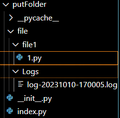

### 代码 `index.py`

> 里面涉及到配置项都在 `configuration.json`

```python
import paramiko
import os
import json
import time
import sys, math, select

with open('../configuration.json') as conf:
	data = json.load(conf)

def get_all_files_in_local_dir(local_dir):
    """递归获取当前目录下所有文件目录"""
    all_files = []
    # 获取当前指定目录下的所有目录及文件，包含属性值
    files = os.listdir(local_dir)
    for x in files:
        # local_dir目录中每一个文件或目录的完整路径
        filename = os.path.join(local_dir, x)
        # 如果是目录，则递归处理该目录
        if os.path.isdir(filename):
            all_files.extend(get_all_files_in_local_dir(filename))
        else:
            all_files.append(filename)
    return all_files


def progressbar(cur, total):
    percent = '{:.2%}'.format(cur / total)
    sys.stdout.write('\r')
    sys.stdout.write('[%-50s] %s' % ('=' * int(math.floor(cur * 50 / total)), percent))
    sys.stdout.flush()
    if cur == total:
        sys.stdout.write('\n')


class Dossh():

    def __init__(self, ip, port, uname, passwd):
        self.ip = ip
        self.port = port
        self.uname = uname
        self.passwd = passwd
        self.sshclt = paramiko.SSHClient()
        self.sshclt.load_system_host_keys()
        self.sshclt.set_missing_host_key_policy(paramiko.AutoAddPolicy())
        self.sshclt.connect(hostname=self.ip, port=self.port, username=self.uname, password=self.passwd,
                            allow_agent=False, look_for_keys=False)
        self.t = paramiko.Transport((self.ip, self.port))
        self.t.connect(username=self.uname, password=self.passwd)
        self.sftp = paramiko.SFTPClient.from_transport(self.t)

    def getssh(self):
        return self.sshclt

    def close_ssh(self):
        self.sshclt.close()
        self.sftp.close()

    def uploadfile_path(self, local_path, remote_path):
        """
        :param local_path:待上传文件夹路径
        :param remote_path:远程路径
        :return:
        """
        # 待上传目录名
        local_pathname = os.path.split(local_path)[-1]
        # 上传远程后的目录名
        real_remote_Path = remote_path + '/' + local_pathname
        ##判断是否存在，不存在则创建
        try:
            self.sftp.stat(remote_path)
        except Exception as e:
            self.sshclt.exec_command("mkdir -p %s" % remote_path)
        self.sshclt.exec_command("mkdir -p %s" % real_remote_Path)
        # 获取本地文件夹下所有文件路径
        all_files = get_all_files_in_local_dir(local_path)
        # 依次判断远程路径是否存在，不存在则创建，然后上传文件
        for file_path in all_files:
            # 统一win和linux 路径分隔符
            file_path = file_path.replace("\\", "/")
            # 用本地根文件夹名分隔本地文件路径，取得相对的文件路径
            # 必须加变量1，仅切割一次，否则会将二级目录下与一级目录名相同的文件上传错误
            off_path_name = file_path.split(local_pathname, 1)[-1]
            # 取得本地存在的嵌套文件夹层级
            abs_path = os.path.split(off_path_name)[0]
            # 生产期望的远程文件夹路径
            reward_remote_path = real_remote_Path + abs_path
            # 判断期望的远程目录是否存在，不存在则创建
            try:
                self.sftp.stat(reward_remote_path)
            except Exception as e:
                self.sshclt.exec_command("mkdir -p %s" % reward_remote_path)
            # 待上传的文件名
            abs_file = os.path.split(file_path)[1]
            # 上传后的远端路径，文件名不变
            to_remote = reward_remote_path + '/' + abs_file
            time.sleep(0.1)
            #  callback=progressbar，添加文件上传进度条
            self.sftp.put(file_path, to_remote, callback=progressbar)
            print(file_path, to_remote)

    def execute_cmd(self, cmd):
        current_cmd = "bash --login -c '%s'" % cmd
        stdin, stdout, stderr = self.sshclt.exec_command(current_cmd, get_pty=True, bufsize=1024 * 1024 * 100)
        res, err = stdout.read(), stderr.read()

        result = res if res else err
        return result.decode('utf-8')
    
    def linesplit(self, socket):
        buffer_bytes = socket.recv(4048)
        buffer_string = buffer_bytes.decode('utf-8', 'ignore')
        done = False
        while not done:
            if "\n" in buffer_string:
                (line, buffer_string) = buffer_string.split("\n", 1)
                yield line + "\n"
            else:
                more = socket.recv(4048)
                if not more:
                    done = True
                else:
                    buffer_string = buffer_string + more.decode('utf-8', 'ignore')
        if buffer_string:
            yield buffer_string


if __name__ == "__main__":
    
    print("==========2. 开始连接服务器==========")
    sshclent = Dossh(data['target'][0]['target_ssh_host'], 
                    data['target'][0]['target_ssh_port'],
                    data['target'][0]['target_ssh_username'], 
                    data['target'][0]['target_ssh_password'])
    print("==========3. 服务器连接成功==========")
    print("==========4. 开始从本地上传文件到106服务器==========")
    try:
        # 上传package包（jar+lib）
        # 本地目录，建议使用相对路径，如:'./test'
        # linux服务器目录，绝对路径，如：'/home/'
        # 会本地test目录下所有文件上传到linux服务器的/home/test
        # a、目录存在则仅覆盖文件
        # b、目录不存在则先创建目录，再上传目录下的文件
        sshclent.uploadfile_path(data["uploadLocalPath"],data["uploadRomatePath"])

        # 查看linux服务器上test目录下的文件
        # cmd_ll = 'ls -l  /home/test'
        print("==========5. 文件上传成功==========")
        time.sleep(1)

    except Exception as ex:            
        print("出现如下异常%s"%ex)   
    finally:
        sshclent.close_ssh()
```

### 代码执行

`python3 index.py`

## 七、启动开发板可执行程序脚本

### 程序代码

```cpp
import paramiko
import subprocess
import json
def startExt():
    with open('./configuration.json') as conf:
        data = json.load(conf)

    # 远程可执行程序路径
    remote_executable_path ="/var/zjx9083/SERVE_EXE_qnx"
    try:
        # 创建SSH客户端
        ssh = paramiko.SSHClient()
        ssh.set_missing_host_key_policy(paramiko.AutoAddPolicy())
        ssh.connect(data['target'][0]['target_ssh_host'], 
                    data['target'][0]['target_ssh_port'],
                    data['target'][0]['target_ssh_username'], 
                    data['target'][0]['target_ssh_password'])

        # 构造远程命令，注意添加执行权限(此处因为更新的时候已经添加，此处就不需要在进行添加了)
        # remote_command = f'chmod +x {remote_executable_path} && {remote_executable_path}'

        remote_command = f'{remote_executable_path}'
        # 执行远程命令
        stdin, stdout, stderr = ssh.exec_command(remote_command)

        # 输出命令执行结果
        # (因为日志的输出在，前面脚本output.txt中有打印，所以此处就不再做打印了，单独使用可以取消注释，进行打印)
        ssh.close()
        # print(stdout.read().decode())
        return "success"

        # print("出错了")
        # # print(stderr.read().decode())

    finally:
        # 关闭SSH连接
        ssh.close()
```

### 代码执行

> 这个就不介绍执行方式啦，这个是整合到任务中了，只需要启动主任务就自动执行啦！！！

## 八、上传—多文件，多主机

### 目录

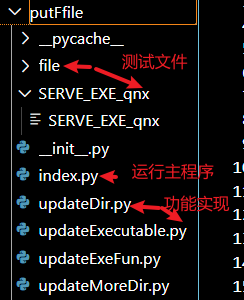

### 启动说明

> 首先在配置文件中配置自己需要上传的可执行程序和文件夹（**可配置多个**）——在 `configuration.json`中配置

+ 执行 `python3 index.py  [目标主机的名字]  or [all]`
  + 当传入的参数为all的时候——表示向配置好的所有的主机进行上传，所有文件
  + 当传入的参数为目标主机的别名的时候就仅向此主机进行上传任务
+ 执行上述命令之后这是就会进入到输入选项
  + 输入”1“——可执行程序和文件夹中的内容全部上传
  + 输入”2“——只上传可执行程序
  + 输入”3“—— 只上传文件夹中的内容

## 九、 自动化测试脚本`object` 任务

### objective流程

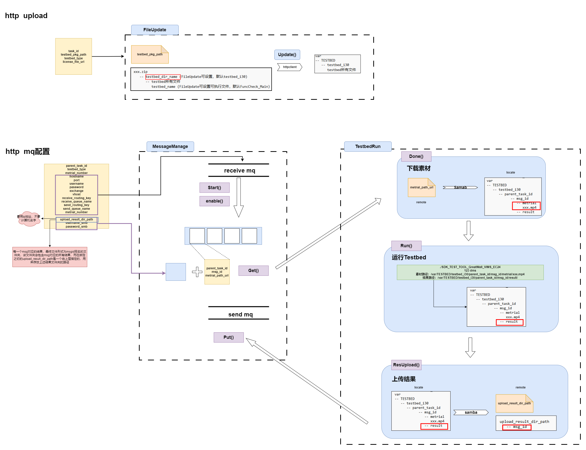

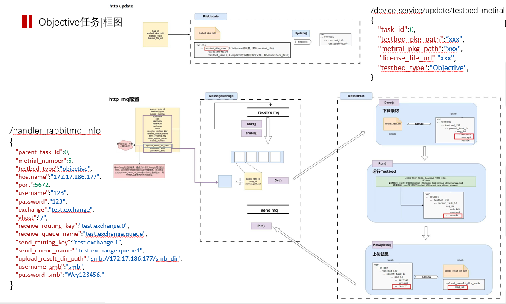

### 任务请求API

#### 1. 获取设备状态
+ ```
  url:http://172.17.185.252:7100/device_service/device/status
  ```

+ 请求参数

  + ```json
    {
        "task_id": 0,
        "reboot":0  // 为 1 的时候重启，但是在object任务中是不需要进行重启的
    }
    ```

+ 响应信息

  + ```json
    {
    	"code" : 0,
    	"data" : 
    	[
    		{
                 "device_status" : 1,				// 66
    			"device_status_msg" : "FREE ",  //"BUSY REBOOTING"
    			"task_id" : 0
    		}
    	],
    	"msg" : "success"
    }
    ```

#### 2. testbedMetiral

+ ```
  url:http://172.17.185.252:7100/device_service/update/testbed_metiral
  ```

+ 请求参数

  + ```json
    {
        "task_id":10233,
        "testbed_pkg_path":"http://172.17.11.189:30080//sdadata/cabin_dataSet//testbed/10238/testbed_objective.zip",
        "metiral_pkg_path":"x",
        "license_file_url":"http://172.17.11.189:30080//sdadata/cabin_dataSet//license/36/license.dat",
        "testbed_type":"2","ip":"172.17.11.189",
        "createdTime":"2023-06-09 13:42:27"
    }
    ```

+ 响应信息

  + ```json
    # 成功返回
    {
    	"code" : 0,
    	"data" : 
    	[
    		{
    			"task_id" : 0
    		}
    	],
    	"msg" : "success"
    }
    
    # 错误返回
    {
    	"code" : -3,
    	"msg" : "device busy"
    }
    ```


#### 3. 终止任务

+ ```
  url:http://172.17.185.252:7100/device_service/task/terminate
  ```

+ 请求参数

  + ```json
    {
        "task_id":0,
        "task_type":"2"
    }
    ```
  
+ 响应信息

  + ```json
    {
    	"code" : 0,
    	"data" : 
    	[
    		{
    			"task_id" : 0
    		}
    	],
    	"msg" : "success"
    }
    ```

#### 4. `rabbitMQ`和`Samba`的配置

+ ```
  http://172.17.185.252:7100/handler_rabbitmq_info
  ```

+ 请求参数

  + ```json
    
    {
        "parent_task_id":10119,
        "metrial_number":1,
        "testbed_type":"2",
        "hostname":"172.17.186.57",
        "port":5672,
        "username":"123",
        "password":"123",
        "exchange":"test.exchange",
        "vhost":"/",
        "receive_routing_key":"test.exchange.0",
        "receive_queue_name":"test.exchange.queue",
        "send_routing_key":"test.exchange.1",
        "send_queue_name":"test.exchange.queue1",
        "upload_result_dir_path":"smb://172.17.186.57/code_space",
        "username_smb":"smb",
        "password_smb":"ZjxWeb9083"
    }
    
    ```
  
+ 响应信息

  + ```json
    {
    	"code" : 0,
    	"msg" : "success"
    }
    ```

### object 任务脚本

#### 1. 目录结构说明

+ 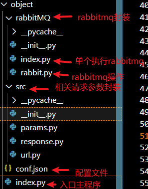

#### 2. rabbitMQ操作

+ 路径 `/rabbitMQ/rabbit.py`

```python
import json
import pika
import datetime
import sys
import json
import time

#生成消息入口处
# def get_message(data,message):
#     setup_rabbitmq(data['rabbitmq_config']['send_routing_key'],message,data)
def recv_message(data,message):
    # for i in range(len(data['recvMsg'])): 
    #     message=json.dumps(data['recvMsg'][i])
    #     print("recv_message",message)
    print("recv_message",message)
    setup_rabbitmq(data['rabbitmq_config']['receive_routing_key'],message,data)


def setup_rabbitmq(routing_key_select,message,data):
    connection_params = pika.ConnectionParameters(
        host=data['rabbitmq_config']['hostname'],
        port=data['rabbitmq_config']['port'],
        virtual_host=data['rabbitmq_config']['vhost'],
        credentials=pika.PlainCredentials(
            data['rabbitmq_config']['username'],
            data['rabbitmq_config']['password']
        )
    )

    connection = pika.BlockingConnection(connection_params)
    channel = connection.channel()

    # 设置交换机
    channel.exchange_declare(exchange=data['rabbitmq_config']['exchange'], exchange_type='direct')

    # 设置接收队列
    channel.queue_declare(queue=data['rabbitmq_config']['receive_queue_name'])
    channel.queue_bind(
        exchange=data['rabbitmq_config']['exchange'],
        queue=data['rabbitmq_config']['receive_queue_name'],
        routing_key=data['rabbitmq_config']['receive_routing_key']
    )

    # 设置发送队列
    channel.queue_declare(queue=data['rabbitmq_config']['send_queue_name'])
    channel.queue_bind(
        exchange=data['rabbitmq_config']['exchange'],
        queue=data['rabbitmq_config']['send_queue_name'],
        routing_key=data['rabbitmq_config']['send_routing_key']
    )
    channel.basic_publish(data['rabbitmq_config']['exchange'], routing_key_select, body=message)

    connection.close()
# recv_message(data)
```

> 单独执行rabbitMQ相关操作
>
> 1. 打开上面代码的所有注释
> 2. 在此路径下执行  `python3 index.py 【send/recv】`，记得参数是不可以缺少的，参数的主要作用是用来决定你发送到那个消息队列中

+ 路径 `/rabbitMQ/index.py`

+ ```python
  import rabbit as rabbit
  import json
  import sys
  
  
  with open("../conf.json") as conf:
      data = json.load(conf)
  # 设置RabbitMQ
  # "send_routing_key": "test.exchange.1",
  # "receive_routing_key": "test.exchange.0"
  send_or_recv = sys.argv[1]
  if send_or_recv == "send":
      rabbit.get_message(data)
  elif send_or_recv == "recv":
      rabbit.recv_message(data)
  else: 
      print("输入有误请重新输入，格式：python index.py [send/recv]")
  ```

  > 伤处代码需要注意点：`../conf.json`的具体路径

#### 3. 主任务执行

##### 逻辑代码  `index.py`

```python
import sys
import json
import time
import rabbitMQ.rabbit as rabbitMsg
import src.response as response


loop = 0
times = 2
deviceStatus = 0 # 设备状态
countMsg = 0 # 执行消息的条数
testbedCount = 0 # testbed更新次数
testbedfail = 0 # testbed失败次数
# with open("./conf.json") as conf:
#     data = json.load(conf)
# 操作消息队列
try:
    confPath = sys.argv[1]
    with open(confPath) as conf:
        data = json.load(conf)
except Exception as ex:            
    print("出现如下异常%s"%ex)
    print("输入有误请重新输入，格式：python index.py [配置文件conf.json路径]")
print(len(data['recvMsg']))
print(data['recvMsg'][countMsg])
rabbitMsg.recv_message(data,json.dumps(data['recvMsg'][countMsg]))

# object主任务执行
while (loop * times ) < 10000 :
    try:
        deviceStatus = response.odeviceStatusResponse()
        print("设备状态",deviceStatus['data'][0]['device_status_msg'])
        print("任务状态",deviceStatus['data'][0]['task_status_msg'])
        # if (deviceStatus['data'][0]['task_status'] == 16384):
        #     rabbitSamba()
        #     while deviceStatus['data'][0]['device_status'] == 2:
        #         deviceStatus = response.odeviceStatusResponse()
        #         print("------------任务执行中----------")
        #         time.sleep(3)
        if deviceStatus['data'][0]['device_status']  == 1 :
            if testbedCount < 1: # 如果testbed之前已经更新，则不需要更新
                testbed = response.otestbedMetiralResponse()
                if testbed['code'] == 0:
                    testbedCount += 1
                print("testbed更新状态：",testbed['msg'])
                deviceStatus = response.odeviceStatusResponse()
                time.sleep(10)
            else:
                deviceStatus = response.odeviceStatusResponse()
                while deviceStatus['data'][0]['device_status'] == 1 and countMsg < len(data['recvMsg']):
                    rabbit = response.orabbitmqSambaResponse()
                    print("rabbitmq更新状态：",rabbit['msg'])
                    if rabbit['code'] == 0:
                        rabbitMsg.recv_message(data,json.dumps(data['recvMsg'][countMsg]))
                        print("countMsg",countMsg)
                        countMsg+=1
                        deviceStatus = response.odeviceStatusResponse()
                        print("------------任务执行中----------")
                        time.sleep(3)
                    else:
                        break
                    while deviceStatus['data'][0]['device_status'] == 2:
                        deviceStatus = response.odeviceStatusResponse()
                        print("------------任务执行中----------")
                        time.sleep(3)
                    else:
                        break
                else:
                    break
        elif deviceStatus['data'][0]['device_status'] == 6:
            testbedfail =+ 1
            deviceStatus = response.odeviceStatusResponse()
            taskTerminate = response.otaskTerminateResponse()
            print("结束任务：",taskTerminate['msg'])
            if(testbedfail >= 2):
                print("请手动 ctrl+c结束任务，并且执行 df -h . 查看当前存储空间，手动清理后在进行尝试")
        time.sleep(3)
    except Exception as ex:            
        print("出现如下异常%s"%ex)  
    time.sleep(times)
    loop += 1
    print("loop-------------------->",loop)
else:
    # 循环退出执行
    print("请重新启动程序")
```

> 如何执行：
>
> + 在 `object`根路径下执行 `python3 index.py [conf.json的具体路径如：./conf.json]`
> + 后续如果需要在添加功能只需要在上述代码中添加逻辑就好

### 配置文件说明

`conf.json`

```python 
{// rabbitMQ相关配置
    "rabbitmq_config": {
        "hostname": "172.17.186.57",  
        "port": 5672,
        "username": "123",
        "password": "123",
        "exchange": "test.exchange",
        "vhost": "/",
        "receive_routing_key": "test.exchange.0",
        "receive_queue_name": "test.exchange.queue",
        "send_routing_key": "test.exchange.1",
        "send_queue_name": "test.exchange.queue1"
    },
    "sendMsg": [ // 自己当时测试用的，可以不写，只是测试向对应的队列中发送消息，是否成功
        {
            "metrial_path_url": "smb://172.17.186.57/code_space/video.mp4",
            "msg_id": 16,
            "parent_task_id": 2986
        },
        {
            "metrial_path_url": "smb://172.17.186.57/code_space/video.mp4",
            "msg_id": 17,
            "parent_task_id": 2987
        },
    ],
    "recvMsg": [
        {
            "metrial_path_url": "smb://172.17.186.57/code_space/video.mp4",
            "msg_id": 16,
            "parent_task_id": 2986
        },
        {
            "metrial_path_url": "smb://172.17.186.57/code_space/video.mp4",
            "msg_id": 17,
            "parent_task_id": 2987
        },
    ]
}
```

### 注意点

1. `samba`一定要在`win`下配置，自己安装在`linux` 测试未成功。

2. 注意检查相对应的端口是否打开

3. 源代码需要更改的部分，自己标有注释  `// new zjx9083`

4. `rabbitMQ`记得新建自己的用户，不要用 默认用户  `guest`

5. 注意一下，如果在 `更新testbed` 总是更新不成功，请使用 `df -h .`检查当前存储空间，尽量保持在剩余有 `160MB`左右。**如果依然报错，此时在回源代码中找问题（按照报错信息进行排查就好）**。

6. `rabbitMQ`中队列，交换机等配置不需要手动在`rabbitMQ`的web管理面板开启，在代码执行的时候会自动进行创建。

   > 新用户还是自己要手动创建一下的啦！代码中没有加！手动模式！

## 十、`qnx` 常用操作命令速查

+ ```shell
  # 查看对应的进程
  pidin | grep SERVE_EXE_qnx
  # kill掉该进程
  kill 进程 pid
  # 持续打印日志
  tail -f 文件名
  # 查看剩余内存空间
  df -h .
  # 查看可执行程序所需要的依赖库
  ldd 可执行程序名字
  ```
  
+ 打印所有的日志信息：`sloginfo`    (程序中的日志都是用`sloginfo`写入的）

+ 打印特定的日志信息：`sloginfo -m 12334`   (12334是程序中用`sloginfo`写的时候，自己定义的），这样就可以进显示12334的日志信息；

+ 清除日志： `sloginfo -c`    (有时候日志信息太多，会先使用该命令将之前的日志信息清除，然后再使用`sloginfo` ,显示当前的日志信息）

+ 实时显示日志信息：`sloginfo -w`

+ `slay  进程名`  ：结束进程  （注意是进程名，不是进程号）

+ `pindin` :显示当前运行的所有进程名及进程号

+ `pidin |grep 进程名`     ：筛选我们想要的进程名

+ `shutdown` / `reset` ：重启QNX系统

+ 注意：当有守护程序时，倘若我们将守护去掉，shutdown后仍能重启守护的程序，但仅会启动这一次，关闭终端就不会再守护程序了，程序就不会再被重启了。

+ 当我们测试程序时，不想让程序自动启动，方法：

  > 修改守护程序配置文件，将进程名赋值为0  -----> `mytest=0;`  （ps: `mytest=1;`则是守护该进程）
  > 或者将进程通过cp的方式重命名，然后将原可执行程序删除（因为不支持mv命令）

+ `passwd 用户名`           --->创建新用户，没有`useradd`命令， 键入`passwd`  用户名后，会让输入密码。

## 十一、项目源代码忧优化

### 1. 库的使用

#### [`spdlog`](https://github.com/gabime/spdlog)

> + 在循环打印这个 ` poll count:33, cost ms:2926`，地方——— `SLOGT`（`i30--/impl/mongoose_http_wrap/HttpServer.cpp(line:216)`）
>
> LOG_ERROR /MG_ERROR-------  		    SLOGE	
>
> LOG_INFO --------			SLOGI
>
> LOG_DEBUG --------		    SLOGD
>
> LOG_EXTR -------			  SLOGW
>
> MG_INFO/MG_DEBUG ----   	SLOGD

+ 宏定义中带 `FF`的表示立即刷新到文档中。
+ 没有FF的是等到缓存满了才刷新到文件里。
  + 如果这条记录不是很频繁的，就直接FF宏调用
  + 如果是一个基本上ms级别的，那就不要FF宏

> `spdlog`是一个非常快、基于头文件编译的、跨多平台的C++日志库。

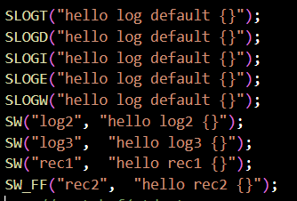 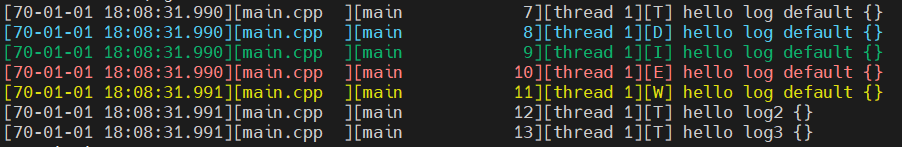

+ 特点：

  - 运行非常快
  - 基于.h头文件（很奇怪是不是）实现
  - 不依赖第三方库（不太严格，只是不需要专门安装，如`fmtlib`）
  - 支持跨多平台，如`Linux、Windows、macOS 32/64bits`
  - 支持单线程、多线程
  - 同步日志、异步日志
  - 可自定义日志格式
  - 多种日志目标：
    （1）转档日志文件，循环输出日志文件
    （2）每日生成日志文件
    （3）控制台（`stdout/stderr`）日志输出（支持延时）
    （4）`syslog`（类Unix系统日志）
    （5）`Windows`事件日志
    （6）`Windows`调试器（`OutputDebugString`(...)）
    （7）易扩展的自定义日志目标
  - 日志过滤 —— 日志级别能在编译时、运行时修改
  - 支持从环境变量或`argv`加载日志级别
  - 回溯（`backtrace`）支持——在一个环形缓冲区存储debug消息，并且稍后按需显示

  **文档可以点击名字，直接跳转**

```c++
    /*
        * 需求：更新log名字
        * log会默认滚动一轮，此时名字是默认的，只有当有接收到taskid才会重写名字
        * 1. 判断当前目录是否存在
        * 2. 如果存在则改写
        */
        // log_dir_st lst_dir = LOG_INSTANCE().get_log_dir();
        // lst_dir.sub_dir_tag = std::string("tasking")+std::to_string(task_id);
        // LOG_INSTANCE().update_log_dir(lst_dir, true);
        std::string log_directory = current_directory + "/log";
        // 判断是否存在"log"目录
        if (fs::is_directory(log_directory)) {
            // 遍历"log"目录
            for (const auto& entry : fs::directory_iterator(log_directory)) {
                if (fs::is_directory(entry)) {
                    std::string directory_name = entry.path().filename().string();

                    // 判断是否存在名为"00-7-task"的目录
                    if (directory_name == "00-7-task") {
                        // 构建新目录名"logging"
                        std::string new_directory = log_directory + "/00-7-task" + task_id;
                        fs::rename(entry, new_directory);
                        std::cout << "成功将'log/test'目录改名为'log/logging'" << std::endl;
                    }
                }
            }
        } else {
            std::cout << "目录'log'不存在，无法改名。" << std::endl;
        }
```


#### [`CLI11`](https://github.com/CLIUtils/CLI11)（[中文文档](https://tigeroses.com/2020/03/04/introduce-CLI11/)）

> `CLI11`是一个基于C++开发的命令行解析库

>  `/home/zjx/board_sdk_service/src/module/m_impl/component/singleton.hpp:20` ___ error

### 2. 需求说明记录

> **/script下的startup调用run server**

1. 更改log日志名

> 需求是在testbed请求执行的时候更改日志名称（在其后面就上task id值）

2. 封装samba

> 参考m_curl封装samba

```c++
// 动态定义命名空间
#define NAMES_BEGIN(name) namespace name{
#define NAMES_END(name) }
NAMES_BEGIN(gf)
NAMES_BEGIN(filesystem)
NAMES_BEGIN(remote)
    
NAMES_END(remote)
NAMES_END(filesystem)
NAMES_END(gf)
    
override：保证在派生类中声明的重载函数，与基类的虚函数有相同的签名；
final：阻止类的进一步派生 和 虚函数的进一步重写。
```

3. 修改testbed日志路径

> + 我们的目的，是让每个task 对应的testbed跑出来的日志 就在对应的日志目录下
> + 那么你就需要在调用testbed时，修改调用命令，加上重定向的符号以及路径
> + 而这个路径的前半段就应该是当前日志滚动所在的目录，这个是直接日志单例可以获取的
> + 有了他，目录后面再拼接一个文件名，或者再接一层子目录+文件名
> + 这样testbed跑完它自己的输出就在taskid对应的目录下的一个单独文件

+ 将testbed日志放到这样形式的目录中 `/log/00-01-task123/testbed/testbed.log` 

> i30 修改位置 `/board_sdk_service/src/module/m_impl/TestBedManager.h`

```c++ 
#include "filesystem_test.hpp"

// 创建testbed文件夹，用来存储testbed 日志
fs::path testbed_folder_Path = std::string(cur_root_dir.dir) + std::string("/testbed");
try {
    fs::create_directory(testbed_folder_Path);
    SLOGW("testbed子文件夹创建成功");
} catch (const std::exception& e) {
    SLOGW("testbed无法创建子文件夹-{}", e.what());
    testbed_folder_Path = cur_root_dir.dir;
}
std::string run_cmd =fmt::format("chmod a+x {} && {} > {}/{}", testbed_path, testbed_path, testbed_folder_Path.string(), "testbed.log");
```

**永远查看一下空间！永远查看一下空间！永远查看一下空间！**

### 3. 新增记录的需求（方式）

+ 首先在 `spdlog`单例中添加如下代码 (路径：`/src/module/m_spdlog/impl/log_-inl.h`)

```c++
regi_gf_sink_to_logger_("scm", gen_default_gf_sink_({test_message_dir,"system_call_message.txt"},1024*512*1,100));
    regi_gf_sink_to_logger_("rm", gen_default_gf_sink_({test_message_dir,"request_message.txt"},1024*512*1,100));
    regi_gf_sink_to_logger_("qm", gen_default_gf_sink_({test_message_dir,"mq_message.txt"},1024*512*1,100));
```

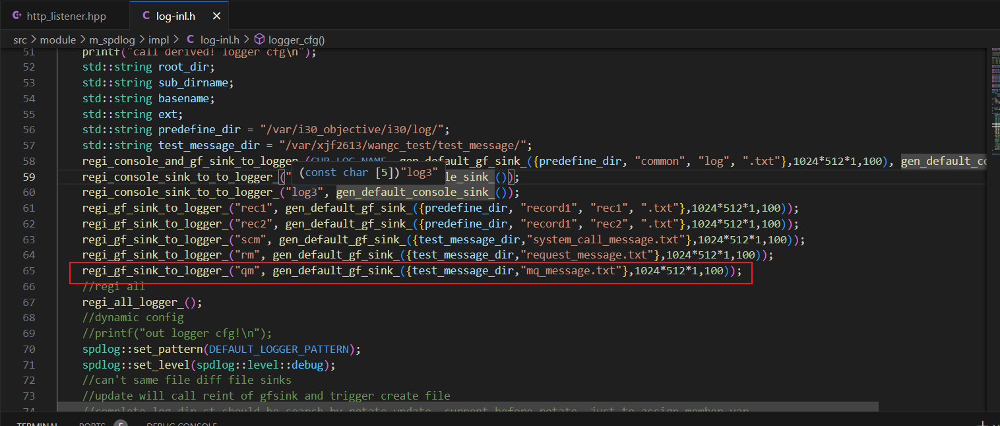

+ 其次在需要的地方调用就好，比如：

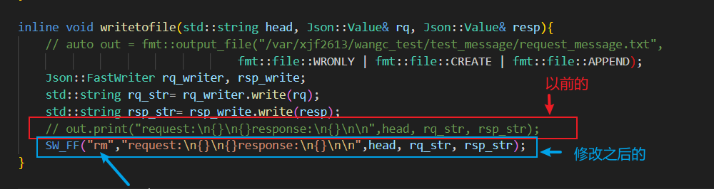

### 4.配置文件库`toml`（客观任务举例）

> `toml_sample.toml` 是放在开发板上的；记住！记住！记住！

+ 在客观中的目录结构

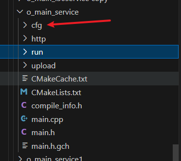

+ 先 加载进去——一般就是在 `main`函数当中

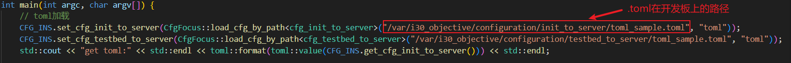

+ 后面 `get`使用

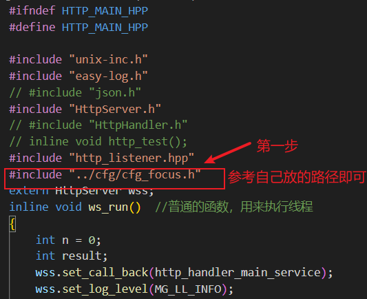

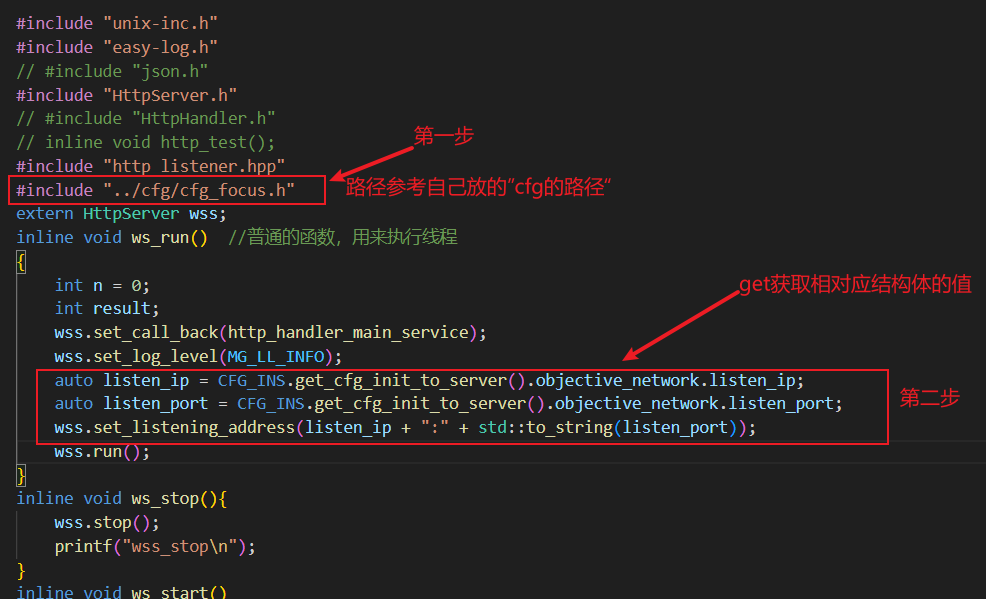

## 十二、 轻量型web服务器搭建测试环境

### 1. 环境说明

+ 文件名：`web_server_test`
+ 语言：`NodeJS`
+ 框架：`express.js`
+ 启动：
  + 当目录中没有 `node_module`文件夹的时候，先执行  `npm i`  后执行  `node app.js`
  + 如果有的话此目录的话，则可执行  `node app.js`
+ 测试：
  + 浏览器输入 `127.0.0.1:3000`
  + 浏览器输入：`127.0.0.1:3000/public/1.mp4`

## 十三、 公版环境搭建（刷机）跑图环境流程

### 1. **公版8155刷机指南**

#### 刷机准备

1.  目前使用的镜像`qfil_hqx1.2.1_r00005.2` 
2.  `QFIL`工具为高通通用的刷机工具 ，安装完毕后启用`QFIL.exe`即可（资料在 resource文件夹中）
3. 双口`USB线缆 *1` 用来`ADB`连接板子,还需要一个`Micro`接口数据 线
4. 两路电源，分别用来给板子及风扇供电

#### QFIL download 

+ 使用镊子将主板背面`S3` 第7个推上去，即可进入特定的救砖模式，即设备连上电脑就会弹出对应串口的更新提示，设备管理器也会认到设备。刷完机再推下来


+ 同时由于目前大家的电脑基本均有`USB3.0`该口会有一定的供电能力，所以请使用USB2.0来进行连接，以及设备先供电再进行`USB`连接。


#### 开始刷机

> 在设备管理器看一下  **端口的位置有没有显示**，如下图

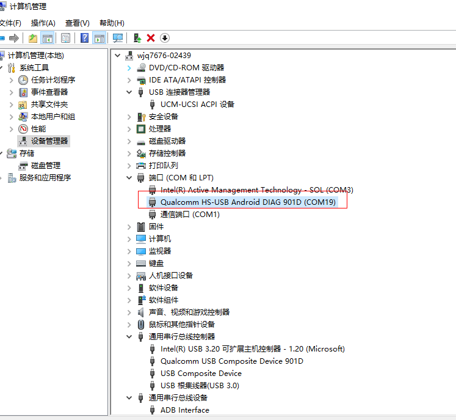

> 如果看到端口那有感叹号或者其他符号，请执行一下操作。

> + 设备管理器（文档是安装完成后写的，这里是参考，到时候点击板子对应端口右击就好）
>
> 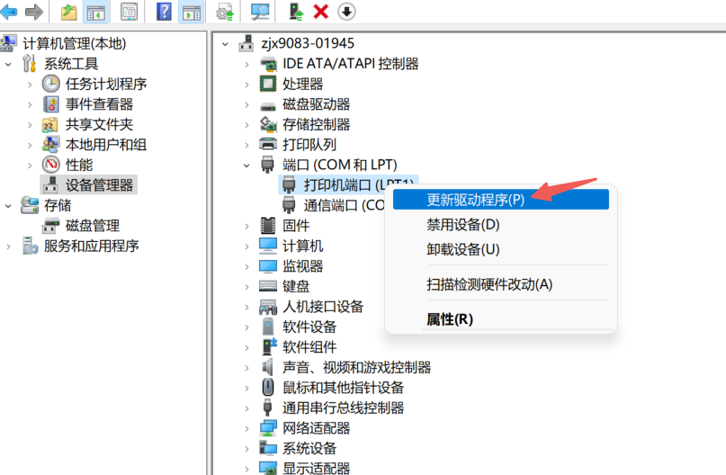
>
> + 继续看下图
>
> 
>
> + 接下来就是选择文件啦，选择资源目录下的 `驱动目录`进行扫描，即可自动配置。（驱动目录记得先解压）

+ A.启动`QFIL`，选择Select Port，选择对应的`9008`串口

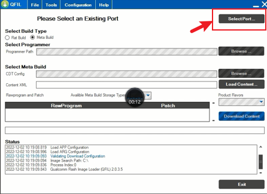


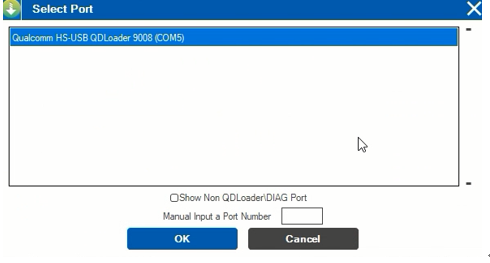

+ B．`Load Content,` 同时选择对应`file path`（注意英文路径）


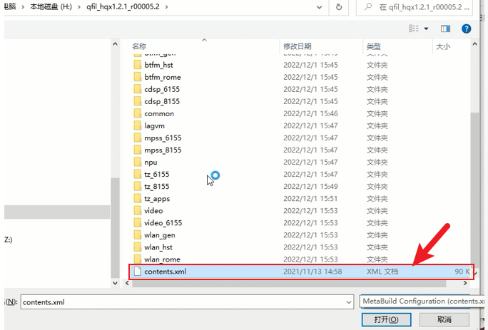

+ C.  切换`Storage Types ---UFS` 

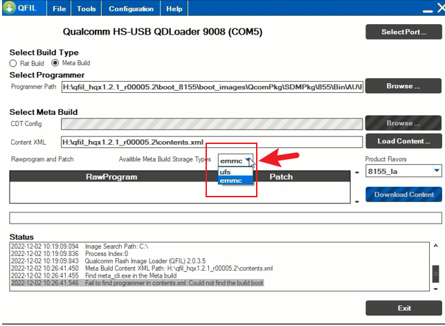

+ D.  `Select Programmer`

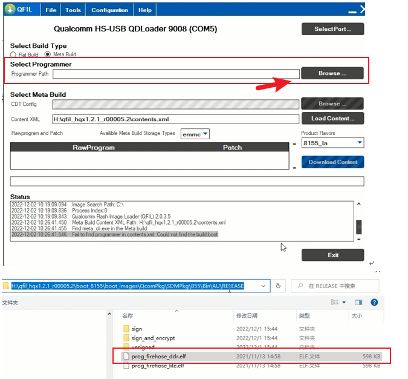

> `qfil_hqx1.2.1_r00005.2\boot_8155\boot_images\QcomPkg\SDMPkg\855\Bin\AU\RELEASE`

+ E.  `Configuration` 清除之前的文件及切换`type为ufs`


+ F.  `Click Download Content` (`如果失败了就断电重新尝试`)


+ 刷机正常的情况下则进入正常读条，同时结束弹出`Download Succeed.`


### 2. 串口连接qnx端方法

> 使用镊子将主板背面`S3` 第7个复位
>
> 
>
> 连接示意图（一定要按图中所示连接）


#### 1.查询端口


#### 2.打开`MobaXterm`

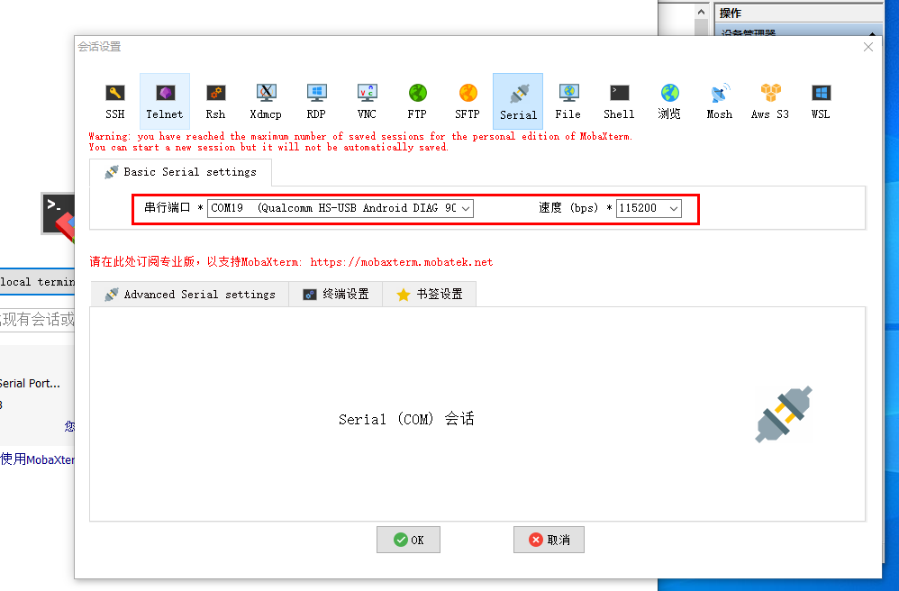

#### 3.设置信息

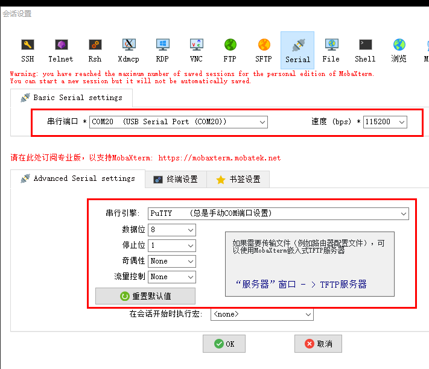


### 3. 公版配置环境操作

#### 一、第一步_公版8155刷机指南

#### 二、第二步_串口连接qnx端方法

#### 三、更改IP

1)  输入root
2)  先备份一份防止弄错，命令为：`cp /scripts/startup.sh  /scripts/startup_11.sh`
3. 用vi 命令写入配置文件：`vi /scripts/startup.sh`  （配置文件见附件：`配置文件.txt`）

   + `i` 进入编辑模式

   +  键盘一直按下键，翻到最下方粘贴

   +  输入冒号 `：`

   +  输入`wq` （保存退出）   如输入错误： q！（不保存退出）
      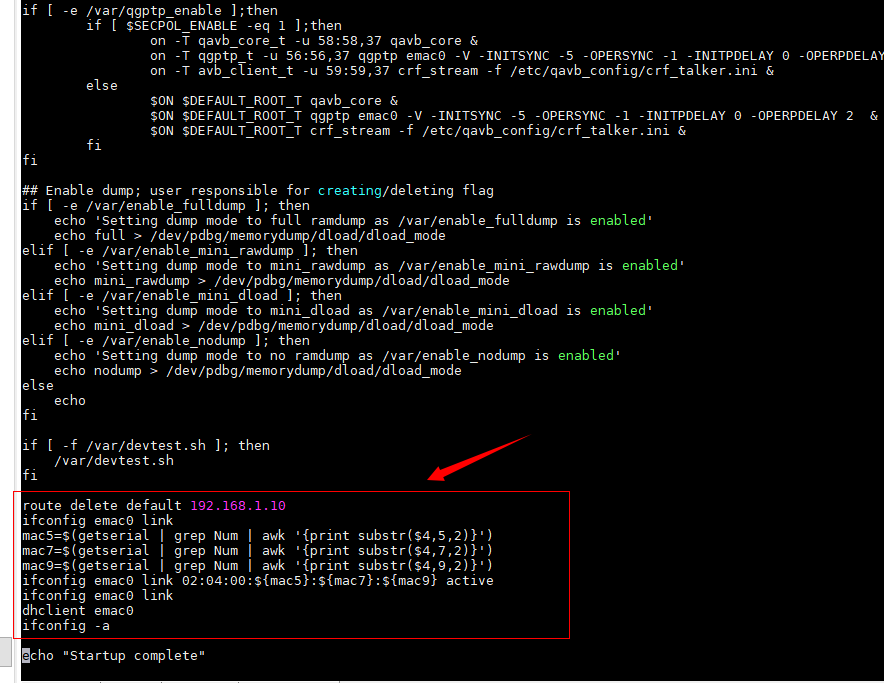
      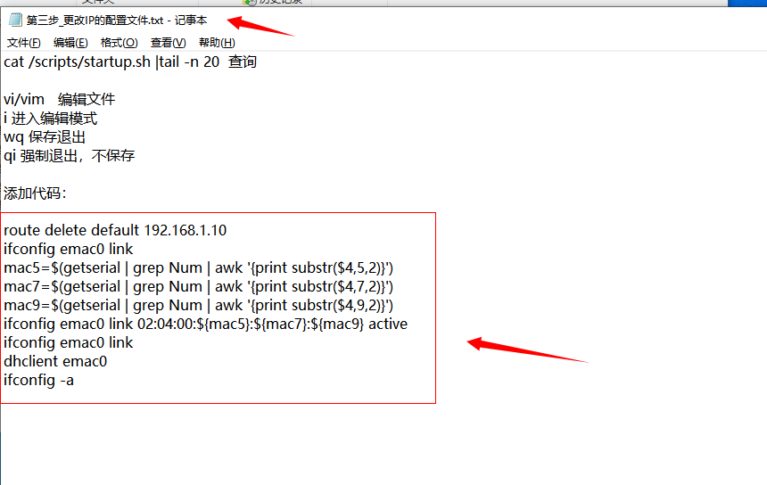


4)  断电重启
5)  插入网线

 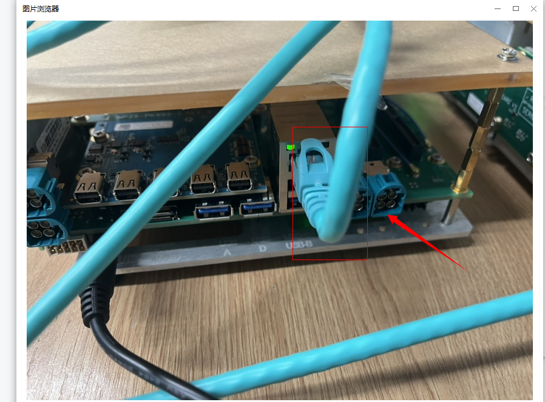

6)  执行 第二步_串口连接qnx端方法
7)  输入`root`
8)  输入 `ifconfig` 查询`IP`

 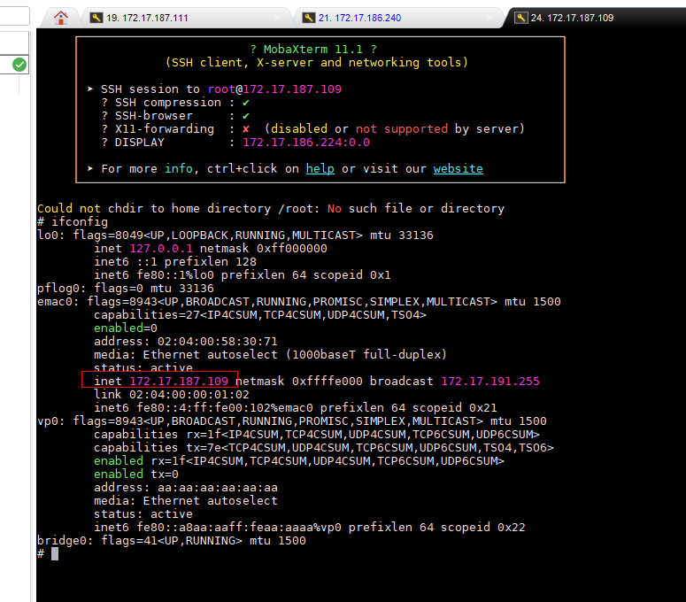

#### 四、用`MobaXterm_CHS.exe IP` 连接板子

#### 五、替换配置文件搭建跑图环境

1)  替换：

```txt
 /etc/images/cdsp.mdt
 /etc/images/cdsp.mbn
 /etc/images/dsp/fastrpc_shell_3
```

 （配置文件请查看附件）
 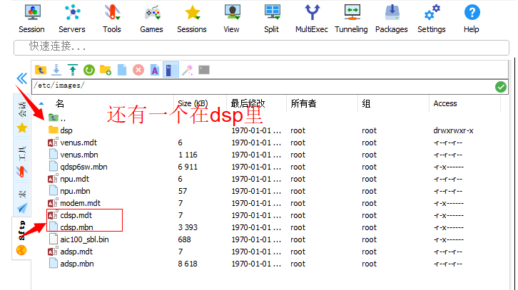

2)  创建项目目录

 创建在： /var/  目录下即可
 例如：
 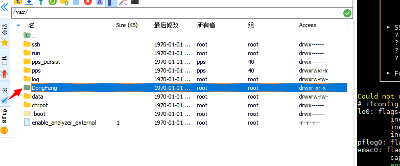

3)  上传跑图SDK

 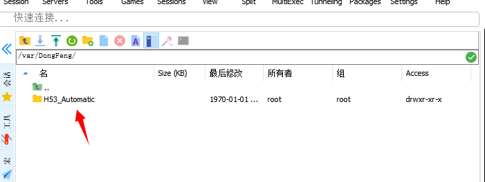

 

#  十四、 NGINX搭建文件服务器

> Nginx搭建文件服务器，但是它还是基于http和https协议的

## 步骤

1. 下载安装Nginx  [官网下载](https://nginx.org/)

2. 下载好了解压就好，解压完成之后点击鼠标右键，管理员运行`nginx.exe`

3. 然后输入 `127.0.0.1`

4. 出现如下页面说明安装成功

   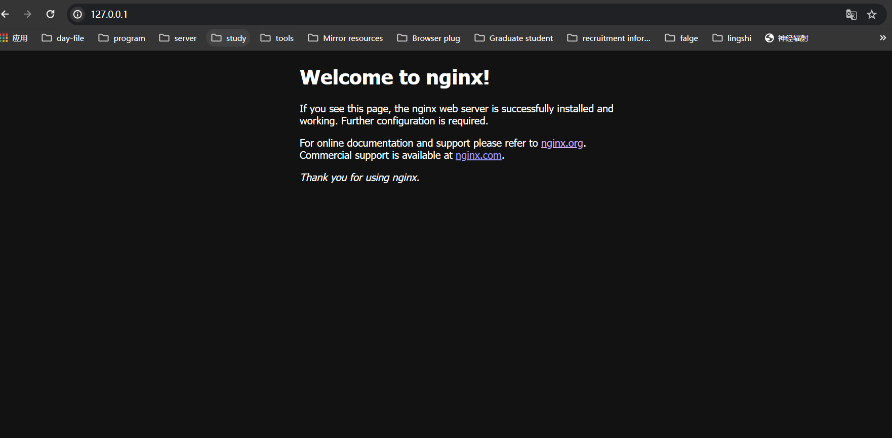

5. 修改配置文件，首先我们在nginx的根目录下创建 `file` 目录，然后将需要远程下载和访问的文件放入到这个路径下面。

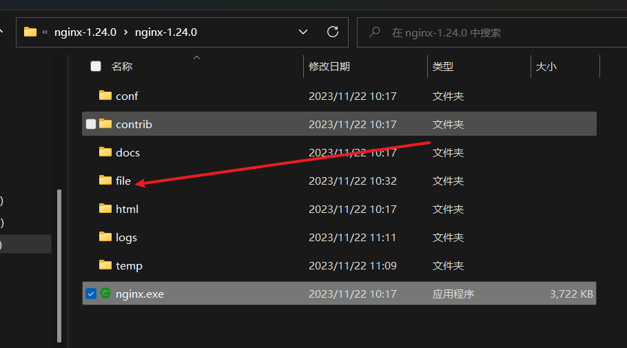

6. 修改 `nginx.conf`配置文件

​	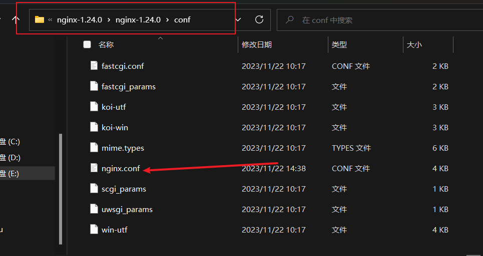

7. 复制如下代码

```nginx
server {
        listen       8080; #监听8080端口
        server_name  localhost; #这里可以是服务器对应的域名或者IP，如果是localhost，那访问的时候用IP就行
        # nignx根目录文件访问
        location / {
            root file;  #指定哪个目录作为Http文件服务器的根目录，如果你这里写了file就是你的根目录，那么访问的时候file就不会出现在目录中
            autoindex on;   #设置允许列出整个目录
            autoindex_exact_size off; #默认为on，显示出文件的确切大小，单位是bytes。改为off后，显示出文件的大概大小，单位是kB或者MB或者GB
            autoindex_localtime on; #默认为off，显示的文件时间为GMT时间。改为on后，显示的文件时间为文件的服务器时间
            charset utf-8; #防止文件乱码显示, 如果用utf-8还是乱码，就改成gbk试试
        }
        
    }
```

> 上述配置要在 `http {`里面包含着

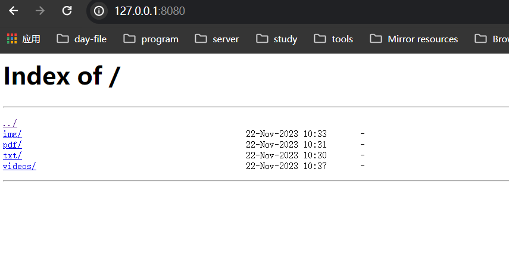

8. 如果我们要访问我们主机上的其他地方的文件夹

9. 添加如下配置比如我要访问的是路径是 `D:/work/code_space`

   ```nginx
   server {
           listen       8080; #监听8080端口
           server_name  localhost; #这里可以是服务器对应的域名或者IP，如果是localhost，那访问的时候用IP就行
           location /code_space {
               root D:/work;  
               autoindex on;   
               autoindex_exact_size off; 
               autoindex_localtime on; 
               charset utf-8; 
           }
       }
   ```

   > 上述配置要在 `http {`里面包含着

   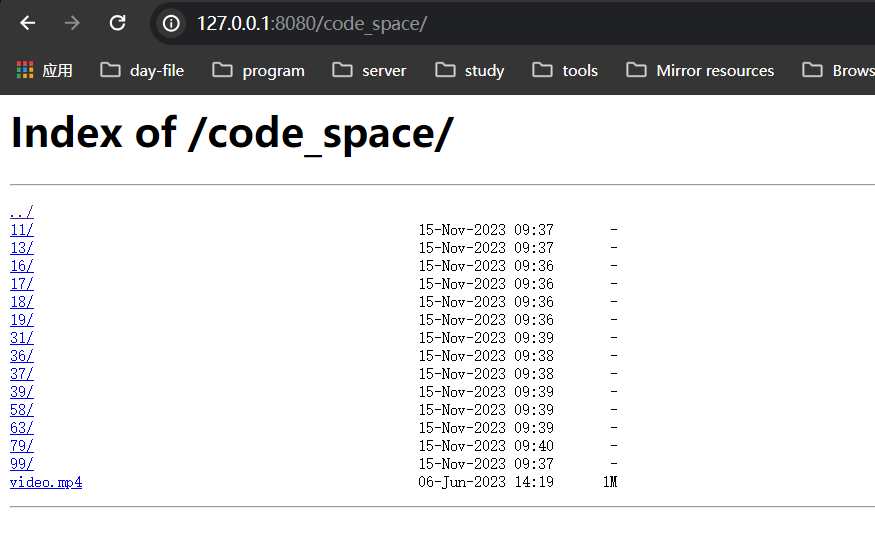

> 如果要在局域网访问则将ip更改成对应主机IPV4地址即可
