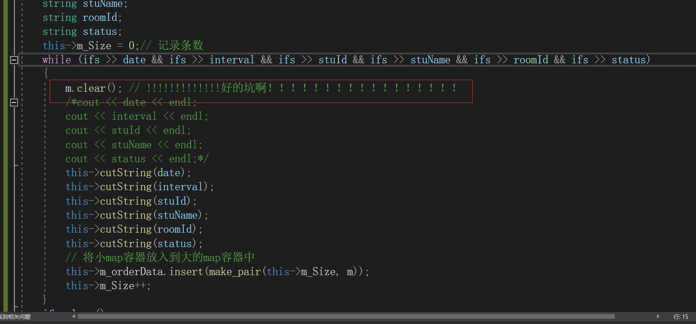

# 机房预约管理系统

[项目代码请点击](https://gitee.com/chuangdu/computer)

## 1. 新建项目

+ 新建一个项目
  + 并创建主程序 `机房预约系统.cpp`
+ 注意：创建C++的空项目

## 2. 创建主菜单

### 2.1 菜单实现

+ 在主函数`main()`中添加菜单提示，代码如下

```c++
cout << "========================= 欢迎来到机房预约系统 =========================" << endl;
		cout << endl << "请输入你的身份" << endl;
		cout << "\t\t --------------------------------\n";
		cout << "\t\t |                              |\n";
		cout << "\t\t |       1.学生代表             |\n";
		cout << "\t\t |                              |\n";
		cout << "\t\t |       2.老师                 |\n";
		cout << "\t\t |                              |\n";
		cout << "\t\t |       3. 管理员              |\n";
		cout << "\t\t |                              |\n";
		cout << "\t\t |       0. 退出                |\n";
		cout << "\t\t |                              |\n";
		cout << "\t\t -------------------------------\n";
		cout << "请输入你的选择:";
		cin >> select;// 接受用户选择
```

### 2.2 搭建接口

+ 接受用户选择，搭建接口
+ 在main中添加代码

```C++
int main()
{
	int select = 0;// 用于接受用户的选择
	while (true)
	{
		cout << "========================= 欢迎来到机房预约系统 =========================" << endl;
		cout << endl << "请输入你的身份" << endl;
		cout << "\t\t --------------------------------\n";
		cout << "\t\t |                              |\n";
		cout << "\t\t |       1.学生代表             |\n";
		cout << "\t\t |                              |\n";
		cout << "\t\t |       2.老师                 |\n";
		cout << "\t\t |                              |\n";
		cout << "\t\t |       3. 管理员              |\n";
		cout << "\t\t |                              |\n";
		cout << "\t\t |       0. 退出                |\n";
		cout << "\t\t |                              |\n";
		cout << "\t\t -------------------------------\n";
		cout << "请输入你的选择:";
		cin >> select;// 接受用户选择
		switch (select) // 根据用户选择 实现不同接口
		{
		case 1: // 学生身份
			break;
		case 2: // 老师身份
			break;
		case 3:  // 管理员身份
			break;
		case 0: // 退出
			break;
		default:
			cout << "输入有误，请重新选择" << endl;
			system("pause");
			system("cls");
			break;
		}
	}
	system("pause");
	return 0;
}
```

## 3. 退出功能实现

### 3.1 退出功能实现

+ 在main函数分支0选项中，添加退出程序的代码

```c++
case 0: // 退出
			cout << "欢迎下一次使用" << endl;
			system("pause");
			return 0;
			break;
```

## 4. 创建身份类

### 4.1 身份的基类

+ 在整个系统中，有三种身份，分别为：学生，老师和管理员
+ 三种身份有共性也有特性，因此我们可以将三种身份抽象出一个身份基类 `identity`
+ 在头文件中创建`identity.h`文件
+ `identity.h`中添加如下代码

```c++
#pragma once // 防止头文件重复包含
#include<iostream>
using namespace std;

// 身份抽象基类
class Identity
{
public:
	// 操作菜单 纯虚函数(子类必须重写)
	virtual void operMenu() = 0;

	// 用户名
	string m_Name;
	// 密码
	string m_Pwd;
};
```

### 4.2 学生类

#### 4.2.1 功能分析

+ 学生类主要功能是可以通过类中成员函数，实现预约实验室操作
+ 学术类中主要功能有：
  + 现实学生操作的菜单界面
  + 申请预约
  + 查看自身预约
  + 取消预约

#### 4.2.2 类的创建

+ 在头文件以及原文件下创建`student.h`和`student.cpp`文件

`student.h` 中添加如下代码

```c++
#pragma once
#include<iostream>
using namespace std;
#include "Identity.h"

class Student : public Identity
{
	// 默认构造
	Student();
	// 有参构造 参数： 学号  姓名  密码
	Student(int id, string name, string pwd);
	// 菜单界面
	virtual void operMenu() = 0;
	// 申请预约
	void applyOrder();
	// 查看自身预约
	void showMyOrder();
	// 查看所有的预约
	void showAllOrder();
	// 取消预约
	void cancelOrder();
	// 学生学号
	int m_Id;
};
```

`student.cpp`中添加如下代码

```C++
#include "student.h"

// 默认构造
Student::Student()
{

}
// 有参构造 参数： 学号  姓名  密码
Student::Student(int id, string name, string pwd)
{

}
// 菜单界面
void Student::operMenu()
{

}
// 申请预约
void Student::applyOrder()
{

}
// 查看自身预约
void Student::showMyOrder()
{

}
// 查看所有的预约
void Student::showAllOrder()
{

}
// 取消预约
void Student::cancelOrder()
{

}
```

### 4.3 老师类

#### 4.3.1 功能分析

+ 教师类主要功能是产看学生的预约，并进行审核
+ 教师类中主要功能有：
  + 显示教师操作的菜单界面
  + 查看所有预约
  + 审核预约

#### 4.3.2 类的创建

+ 在头文件以及源文件下创建`teacher.h`和`teacher.cpp`文件

`teacher.h`中添加如下代码

```c++
#pragma once
#include<iostream>
using namespace std;
#include "Identity.h"

// 教师类的设计
class Teacher : public Identity
{
public:
	// 默认构造
	Teacher();
	// 有参构造
	Teacher(int empId, string name, string pwd);
	// 菜单界面
	virtual void operMenu();
	// 查看所有预约
	void showAllOrder();
	// 审核预约
	void validOrder();
	// 职工号
	int m_EmpId;

};
```

`teacher.cpp`中添加如下代码

```C++
#include "teacher.h.h"

Teacher::Teacher()
{

}
// 有参构造
Teacher::Teacher(int empId, string name, string pwd)
{

}
// 菜单界面
void Teacher::operMenu()
{

}
// 查看所有预约
void Teacher::showAllOrder()
{

}
// 审核预约
void Teacher::validOrder()
{

}
```

### 4.4 管理员类

#### 4.4.1 功能分析

+ 管理员类主要功能是对学生和老师账户进行管理，查看机房信息以及清空预约记录
+ 管理员类中主要功能有：
  + 显示管理员操作的菜单界面
  + 添加账号
  + 产看账号
  + 查看机房预约信息
  + 清空预约记录

#### 4.4.2 类的创建

+ 在头文件以及源文件下创建`manager.h`和`manager.cpp`文件

`manager.h`代码

```c++
#pragma once
#pragma once
#include<iostream>
using namespace std;
#include "Identity.h"

// 管理员的设计
class Manager : public Identity
{
	// 默认构造
	Manager();
	// 有参构造 管理员姓名  密码
	Manager(string name, string pwd);
	// 菜单
	virtual void operMenu();
	// 添加账号
	void addPerson();
	// 查看账号
	void showPerson();
	// 查看机房信息
	void showComputer();
	// 清空预约记录
	void cleanFile();
};
```

`manager.cpp`代码

```c++
#include"manager.h"


// 默认构造
Manager::Manager()
{

}
// 有参构造 管理员姓名  密码
Manager::Manager(string name, string pwd)
{

}
// 菜单
void Manager::operMenu()
{

}
// 添加账号
void Manager::addPerson()
{

}
// 查看账号
void Manager::showPerson()
{

}
// 查看机房信息
void Manager::showComputer()
{

}
// 清空预约记录
void Manager::cleanFile()
{

}
```

## 5. 登录模块

### 5.1 全局文件添加

+ 功能描述

  + 不同身份可能会用到不同的文件操作，我们可以将所有的文件名定义到一个全局的文件中
  + 在头文件中添加`globalFile.h`
  + 并添加如下代码

  ```c++
  #pragma once
  // 管理员文件
  #define ADMIN_FILE "admin.txt"
  //学生文件
  #define STUDENT_FILE "student.txt"
  // 教师文件
  #define TEACHER_FILE "teacher.txt"
  //机房信息文件
  #define COMPUTER_FILE "computerRoom.txt"
  // 订单文件
  #define ORDER_FILE "order.txt"
  ```

  + 并在全局目录下面创建这些文件
    + `"admin.txt"  "student.txt"   "teacher.txt" "computerRoom.txt"  "order.txt"`

### 5.2 登录函数封装

+ 功能描述：
  + 根据用户的选择，进入不同的登录身份
+ 在预约系统的`.cpp`文件中田间全局函数`void LoginIn(string fileName, int type)`
+ 参数
  + `fileName ` ---操作的文件名
  + type  ---登录的身份  （1代表学生，2代表老师，3代表管理员）
+ `LoginIn`中代码

```c++
#include<iostream>
using namespace std;
#include "Identity.h"
#include <fstream>
#include<string>
#include"globalFile.h"

// 登录功能  参数1 操作文件名  参数2  操作身份类型
void LoginIn(string fileName, int type)
{
	// 父类的指针，用于指向子类对象
	Identity * person = NULL;
	// 读文件
	ifstream ifs;
	ifs.open(fileName, ios::in);
	// 判断文件是否存在
	if (!ifs.is_open())
	{
		cout << "文件不存在" << endl;
		ifs.close();
		return;
	}
	// 准备接受用户的信息
	int id = 0;
	string name;
	string pwd;

	// 判断身份
	if (type == 1)//学生
	{
		cout << "请输入你的学号：" << endl;
		cin >> id;
	}
	if (type == 2)//老师
	{
		cout << "请输入你的职工号：" << endl;
		cin >> id;
	}
	cout << "请输入用户名" << endl;
	cin >> name;
	cout << "请输入密码" << endl;
	cin >> pwd;
	if (type == 1)
	{
		// 学生身份验证
	}
	else if (type == 2)
	{
		// 教师身份验证
	}
	else if (type == 3)
	{
		// 管理员身份验证
	}
	cout << "验证登录失败！" << endl;
	system("pause");
	system("cls");
}

int main()
{
	int select = 0;// 用于接受用户的选择
	while (true)
	{
		cout << "========================= 欢迎来到机房预约系统 =========================" << endl;
		cout << endl << "请输入你的身份" << endl;
		cout << "\t\t --------------------------------\n";
		cout << "\t\t |                              |\n";
		cout << "\t\t |       1.学生代表             |\n";
		cout << "\t\t |                              |\n";
		cout << "\t\t |       2.老师                 |\n";
		cout << "\t\t |                              |\n";
		cout << "\t\t |       3. 管理员              |\n";
		cout << "\t\t |                              |\n";
		cout << "\t\t |       0. 退出                |\n";
		cout << "\t\t |                              |\n";
		cout << "\t\t -------------------------------\n";
		cout << "请输入你的选择:";
		cin >> select;// 接受用户选择
		switch (select) // 根据用户选择 实现不同接口
		{
		case 1: // 学生身份
			LoginIn(STUDENT_FILE, 1);
			break;
		case 2: // 老师身份
			LoginIn(TEACHER_FILE, 2);
			break;
		case 3:  // 管理员身份
			LoginIn(ORDER_FILE, 3);
			break;
		case 0: // 退出
			cout << "欢迎下一次使用" << endl;
			system("pause");
			return 0;
			break;
		default:
			cout << "输入有误，请重新选择" << endl;
			system("pause");
			system("cls");
			break;
		}
	}
	system("pause");
	return 0;
}
```

### 5.3 学生登录实现

+ 在 `student.txt`文件中添加两条学生信息，用于测试

+ 其中：

  + 第一列  学号
  + 第二列   学生姓名
  + 第三列    密码

+ 在 `LoginIn`函数的学生分支中添加如下代码，验证学生身份

  + <p style="color:red;">`>>` 按行读取</p>

  ```C++
  // 学生身份验证
  int fId; // 从文件中获取的id
  string fName;// 从文件中获取的name
  string fPwd;// 从文件中获取的pwd
  while (ifs >> fId && ifs >> fName && ifs >> fPwd)
  {
      if (id == fId && name == fName && pwd == fPwd)
      {
          cout << "学生验证登录成功" << endl;
          system("pause");
          system("cls");
          person = new Student(id, name, pwd);
          // 进入学生身份的子菜单
          return;
      }
  }
  ```

### 5.4 教师登录实现

+ 在 `teacher.txt`文件中添加两条教师信息，用于测试
+ 其中：
  + 第一列  学号
  + 第二列   教师姓名
  + 第三列    密码
+ 在 `LoginIn`函数的教师分支中添加如下代码，验证教师身份

  + <p style="color:red;">`>>` 按行读取</p>

  ```C++
  // 教师身份验证
  int fId; // 从文件中获取的id
  string fName;// 从文件中获取的name
  string fPwd;// 从文件中获取的pwd
  while (ifs >> fId && ifs >> fName && ifs >> fPwd)
  {
      if (id == fId && name == fName && pwd == fPwd)
      {
          cout << "教师验证登录成功" << endl;
          system("pause");
          system("cls");
          person = new Teacher(id, name, pwd);
          // 进入教师身份的子菜单
          return;
      }
  }
  ```

### 5.5 管理员登录实现

+ 在`admin.txt`文件中添加一条管理员信息，由于我们只有一条管理员，因此本案例中没有添加管理员的功能
+ 添加信息：
  + `admin 123`

```C++
// 管理员身份验证
		string fName;// 从文件中获取的name
		string fPwd;// 从文件中获取的pwd
		while (ifs >> fName && ifs >> fPwd)
		{
			if (name == fName && pwd == fPwd)
			{
				cout << "管理员验证登录成功" << endl;
				system("pause");
				system("cls");
				person = new Manager(name, pwd);
				return;
			}
		}
```

## 6. 管理员模块

### 6.1 管理员登录和注销

#### 6.1.1 构造函数

+ 在Manager类的构造函数中，初始化管理员信息，代码如下：

```C++
// 有参构造 管理员姓名  密码
Manager::Manager(string name, string pwd)
{
	this->m_Name = name;
	this->m_Pwd = pwd;
}
```

#### 6.1.2 管理员子菜单

+ 在机房预约系统.cpp中，当用户登录时管理员，添加管理员菜单接口
+ 将不同的分支提供出来
  + 添加账号
  + 查看账号
  + 查看机房
  + 清空预约
  + 注销登录
+ 实现注销功能

添加全局函数`void managerMenu(Identity * &manager)`，代码如下

```C++
void managerMenu(Identity*& manager)
{
	while (true)
	{
		// 调用管理员子菜单
		manager->operMenu();
		// 将父类的指针 转为子类指针，调用子类里其他接口
		Manager* man = (Manager*)manager;
		int select = 0;
		// 接受用户选项
		cin >> select;
		if (select == 1)// 添加账号
		{
			cout << "添加账号" << endl;
			man->addPerson();
		}
		else if (select == 2)// 查看账号
		{
			cout << "查看账号" << endl;
			man->showPerson();
		}
		else if (select == 3)//查看机房
		{
			cout << "查看机房" << endl;
			man->showComputer();
		}
		else if (select == 4)//清空预约
		{
			cout << "清空预约" << endl;
			man->cleanFile();
		}
		else
		{
			// 注销
			delete manager;// 销毁掉堆区对象
			cout << "注销成功" << endl;
			system("pause");
			system("cls");
			return;
		}
	}
}
```

#### 6.1.3 菜单那功能实现

+ 在实现成员函数`void Manager::operMenu()`,

```C++
}
// 菜单
void Manager::operMenu()
{
	cout << "欢迎管理员：" << this->m_Name << "登录！" << endl;
	cout << "\t\t --------------------------------\n";
	cout << "\t\t |                              |\n";
	cout << "\t\t |       1.添加账号             |\n";
	cout << "\t\t |                              |\n";
	cout << "\t\t |       2.查看账号             |\n";
	cout << "\t\t |                              |\n";
	cout << "\t\t |       3. 查看机房            |\n";
	cout << "\t\t |                              |\n";
	cout << "\t\t |       4. 清空预约            |\n";
	cout << "\t\t |                              |\n";
	cout << "\t\t |       0. 注销登录            |\n";
	cout << "\t\t |                              |\n";
	cout << "\t\t -------------------------------\n";
	cout << "请输入你操作选项:";
}
```

#### 6.1.4 接口对接

+ 管理员成功登录后，调用管理员子菜单界面
+ 在管理员登录验证分支中，添加如下代码

```C++
// 进入管理员子菜单界面
managerMenu(person);
```

### 6.2 添加账号

+ 功能描述
  + 给学生或者老师添加新账号
+ 功能要求
  + 添加时学生学号不能重复，教师教职工号不能重复

#### 6.2.1 添加功能实现

+ 在Manager的 **addPerson** 成员函数中，实现添加新账号功能，代码如下：

```C++
// 添加账号
void Manager::addPerson()
{
	cout << "请输入添加账号的类型" << endl;
	cout << " 1.添加学生" << endl;
	cout << " 2.添加教师" << endl;
	string fileName; // 操作文件名
	string tip; // 提示id号
	ofstream ofs; // 文件操作对象
	int select = 0;
	cin >> select; // 接受用户的选项
	if (select == 1)
	{
		// 添加的时学生
		fileName = STUDENT_FILE;
		tip = "请输入学号：";
	}
	else 
	{
		fileName = TEACHER_FILE;
		tip = "请输入职工编号：";
	}
	// 利用追加的方式  写文件
	ofs.open(fileName, ios::out | ios::app);
	int id;
	string name;
	string pwd;
	cout << tip << endl;
	cin >> id;
	cout << "请输入你的姓名：" << endl;
	cin >> name;
	cout << "请输入密码：" << endl;
	cin >> pwd;
	// 向文件中添加数据
	ofs << id << " " << name << " " << pwd << " " << endl;
	cout << "添加成功" << endl;
	system("pause");
	system("cls");
	ofs.close();
}
```

#### 6.2.2 去重操作

+ 功能描述：添加新账号时，如果时重写的学生编号，或者重复的教师职工编号，提示有误

##### 6.2.2.1 读取信息

+ 要去除重复的账号，首要要先将学生和教师的账号信息获取到程序中，方可检测
+ 在manager.h中，添加两个容器，用于存放学生和教师的信息
+ 添加一个新的成员函数，`void initVector()`初始化容器

```C++
	// 初始化容器
	void initVector();

	// 学生容器
	vector<Student>vStu;
	// 教师容器
	vector<Teacher>vTea;
```

+ 在Manager的有参构造函数中，获取目前的学生和教师信息
+ 代码如下：

```C++
// 初始化容器
void Manager::initVector()
{
	// 确保容器时清空的状态
	vStu.clear();
	vTtu.clear();
	// 读取信息 学生，老师
	ifstream ifs;
	ifs.open(STUDENT_FILE, ios::in);
	if (!ifs.is_open()) {
		cout << "文件读取失败" << endl;
		return;
	}
	Student s;
	while (ifs >> s.m_Id && ifs >> s.m_Name && ifs >> s.m_Pwd)
	{
		vStu.push_back(s);
	}
	cout << vStu.size() << endl;
    ifs.close();
    

	ifs.open(TEACHER_FILE, ios::in);
	if (!ifs.is_open()) {
		cout << "文件读取失败" << endl;
		return;
	}
	Teacher t;
	while (ifs >> t.m_EmpId && ifs >> t.m_Name && ifs >> t.m_Pwd)
	{
		vTtu.push_back(t);
	}
	cout << vTtu.size() << endl;
	ifs.close();
}
```

+ 有参构造函数中，调用初始化容器函数

```C++
// 有参构造 管理员姓名  密码
Manager::Manager(string name, string pwd)
{
	// 初始化管理员信息
	this->m_Name = name;
	this->m_Pwd = pwd;
	// 初始化容器  获取到素所有文件中  学生、老师信息
	this->initVector();
}
```

##### 6.2.2.2 去重函数封装

+ 在manager.h 文件中添加成员函数 `bool checkRepeat(int id,int type)`

```C++
// 检测重复  参数：（传入 id，传入类型）  返回值：（true 代表有重复  false 代表没有重复）
bool checkRepeat(int id, int type);
```

+ 在manager.h 文件中实现成员函数 `bool checkRepeat(int id,int type)`

```C++
// 添加账号
void Manager::addPerson()
{
	cout << "请输入添加账号的类型" << endl;
	cout << " 1.添加学生" << endl;
	cout << " 2.添加教师" << endl;
	string fileName; // 操作文件名
	string tip; // 提示id号
	string errorTip;// 重复错误提示
	ofstream ofs; // 文件操作对象
	int select = 0;
	cin >> select; // 接受用户的选项
	if (select == 1)
	{
		// 添加的时学生
		fileName = STUDENT_FILE;
		tip = "请输入学号：";
		errorTip = "学号重复，请重新输入";
	}
	else 
	{
		fileName = TEACHER_FILE;
		tip = "请输入职工编号：";
		errorTip = "职工号重复，请重新输入";
	}
	// 利用追加的方式  写文件
	ofs.open(fileName, ios::out | ios::app);
	int id;
	string name;
	string pwd;
	cout << tip << endl;
	while (true)
	{
		cin >> id;
		bool ret = checkRepeat(id,select);
		if (ret)
		{
			cout << errorTip << endl;
		}
		else
		{
			break;
		}
	}
	
	cout << "请输入你的姓名：" << endl;
	cin >> name;
	cout << "请输入密码：" << endl;
	cin >> pwd;
	// 向文件中添加数据
	ofs << id << " " << name << " " << pwd << " " << endl;
	cout << "添加成功" << endl;
	system("pause");
	system("cls");
	ofs.close();
}


// 初始化容器
void Manager::initVector()
{
	// 确保容器时清空的状态
	vStu.clear();
	vTtu.clear();
	// 读取信息 学生，老师
	ifstream ifs;
	ifs.open(STUDENT_FILE, ios::in);
	if (!ifs.is_open()) {
		cout << "文件读取失败" << endl;
		return;
	}
	Student s;
	while (ifs >> s.m_Id && ifs >> s.m_Name && ifs >> s.m_Pwd)
	{
		vStu.push_back(s);
	}
	cout << vStu.size() << endl;
	ifs.close();

	ifs.open(TEACHER_FILE, ios::in);
	if (!ifs.is_open()) {
		cout << "文件读取失败" << endl;
		return;
	}
	Teacher t;
	while (ifs >> t.m_EmpId && ifs >> t.m_Name && ifs >> t.m_Pwd)
	{
		vTtu.push_back(t);
	}
	cout << vTtu.size() << endl;
	ifs.close();
}


// 检测重复  参数：（传入 id，传入类型）  返回值：（true 代表有重复  false 代表没有重复）
bool  Manager::checkRepeat(int id, int type) {
	if (type == 1)
	{
		for (vector<Student>::iterator it = vStu.begin(); it != vStu.end(); it++)
		{
			if (id == it->m_Id)
			{
				return true;
			}
		}
	}
	else
	{
		for (vector<Teacher>::iterator it = vTtu.begin(); it != vTtu.end(); it++)
		{
			if (id == it->m_EmpId)
			{
				return true;
			}
		}
	}
}
```

##### 6.2.3bug解决

+ bug描述：
  + 虽然可以检测重复的账号，但是刚添加的账号由于没有更新到容器中，因此不会做检测
  + 导致刚加入的账号的学生号或者职工编号，再次添加时依然可以 **重复**
+ 解决方案
  + 在每次添加新账号时，重新初始化容器
+ 在添加完毕后，加入代码

```C++
ofs.close();// 之后添加下方代码

// 初始化容器
this->initVector();
```

### 6.3 显示功能实现

+ 在Manager的showPerson成员函数中，实现显示账号功能：

```C++
void Manager::showPerson()
{
	cout << "请选择查看的内容" << endl;
	cout << "1. 查看所有学生" << endl;
	cout << "2. 查看所有老师" << endl;

	int select = 0;
	cin >> select;
	if (select == 1)
	{
		// 查看学生
		cout << "所有学生信息如下：" << endl;
		for_each(vStu.begin(), vStu.end(), printStudent);
	}
	else
	{
		// 查看教师
		cout << "所有教师信息如下：" << endl;
		for_each(vTtu.begin(), vTtu.end(), printTeacher);
	}
	system("pause");
	system("cls");
}
```

### 6.4 查看机房

#### 6.4.1 添加机房信息

+ 需求：机房一共有三个，其中1号机房容量20台机器，2号50台，3号100台

+ 我们将此信息录入computerRoom.txt中

+ 格式

  + ```txt
    1 20
    2 50 
    3 100
    ```

#### 6.4.2 机房类的创建

+ 在头文件下，创建新文件 computerRoom.h

```c++
#pragma once
#include<iostream>
using namespace std;

// 机房类
class ComputerRoom
{
public:
	int m_ComId;// 机房ID号
	int m_MaxNum;//机房的最大容量
};
```

#### 6.4.3 初始化机房信息

+ 在manager管理员类，添加机房的容器，用于保存机房信息

```C++
// 机房容器
vector<ComputerRoom> vCom;
```

+ 初始化机房信息

```C++
// 初始机房信息
void  Manager::firstComputer()
{
	// 获取机房信息
	ifstream ifs;
	ifs.open(COMPUTER_FILE, ios::in);
	ComputerRoom c;
	while (ifs >> c.m_ComId && ifs >> c.m_MaxNum)
	{
		vCom.push_back(c);
	}
	cout << "当前机房数量：" << vCom.size() << endl;
	ifs.close();
}
```

#### 6.4.4 显示机房信息

+ 在Manager类的showComputer成员函数中添加如下代码

```C++
void Manager::showComputer()
{
	cout << "机房信息如下：" << endl;
	for (vector<ComputerRoom>::iterator it = vCom.begin(); it != vCom.end(); it++)
	{
		cout << "机房编号：" << it->m_ComId  << " " << "机房最大容量:" << it->m_MaxNum << endl;
	}
	system("pause");
	system("cls");
}
```

### 6.5 清理预约

+ 清空生成的 `order.txt` 预约文件

#### 6.5.1 清空功能实现

+ 在Manager的ckeabFile成员函数添加如下代码：

```C++
void Manager::cleanFile()
{
	ofstream ofs(ORDER_FILE, ios::trunc);//trunc 如果文件存在先删除，再创建
	ofs.close();
	cout << "清空成功" << endl;
	system("pause");
	system("cls");
}
```

## 7. 学生模块

### 7.1 学生登录和注销

#### 7.1.1 构造函数

+ 在Student类的构造函数中，初始化学生信息，

```C++
// 有参构造 参数： 学号  姓名  密码
Student::Student(int id, string name, string pwd)
{
	// 初始化属性
	this->m_Id = id;
	this->m_Name = name;
	this->m_Pwd = pwd;
}
```

#### 7.1.2 管理员子菜单

+ 在机房预约系统.cpp中，当用户登录进来时学生，添加学生菜单接口
+ 将不同的分支提供出来
  + 申请预约
  + 查看我的预约
  + 查看所有预约
  + 取消预约
  + 注销登录
+ 实现注销功能

添加全局函数 void studentMenu（Identity * &student）

```C++
// 进入学生子菜单界面
void studentMenu(Identity*& student)
{
	while (true)
	{
		// 调用学生子菜单
		student->operMenu();
		// 将父类的指针 转为子类指针，调用子类里其他接口
		Student* stu = (Student*)student;
		int select = 0;
		// 接受用户选项
		cin >> select;
		if (select == 1)// 申请预约
		{
			cout << "申请预约" << endl;
			stu->applyOrder();
		}
		else if (select == 2)// 查看自身预约
		{
			cout << "查看自身预约" << endl;
			stu->showMyOrder();
		}
		else if (select == 3)//查看所有预约
		{
			cout << "查看所有预约" << endl;
			stu->showAllOrder();
		}
		else if (select == 4)//取消预约
		{
			cout << "取消预约" << endl;
			stu->cancelOrder();
		}
		else
		{
			// 注销
			delete student;// 销毁掉堆区对象
			cout << "注销成功" << endl;
			system("pause");
			system("cls");
			return;
		}
	}
}
```

记得在LoginIn函数中添加如下语句

`// 进入学生身份的子菜单 studentMenu(person);`

#### 7.1.3 菜单界面

+ 在 `student.cpp`中添加如下代码：

```C++
// 菜单界面
void Student::operMenu()
{
	cout << "欢迎学生：" << this->m_Name << "登录！" << endl;
	cout << "\t\t --------------------------------\n";
	cout << "\t\t |                              |\n";
	cout << "\t\t |       1.申请预约             |\n";
	cout << "\t\t |                              |\n";
	cout << "\t\t |       2.查看自身预约         |\n";
	cout << "\t\t |                              |\n";
	cout << "\t\t |       3. 查看所有的预约      |\n";
	cout << "\t\t |                              |\n";
	cout << "\t\t |       4. 取消预约            |\n";
	cout << "\t\t |                              |\n";
	cout << "\t\t -------------------------------\n";
	cout << "请输入你操作选项:";
}
```

### 7.2 申请预约

#### 7.2.1 获取机房信息

+ 在申请预约时，学生学生可以看到机房信息，因此我们需要让学生获取到机房的信息

在student.h中添加新的成员函数如下

```C++
// 机房容器
	vector<ComputerRoom> vCom;
```

在学生的有参构造函数中添加如下代码

```C++
// 获取机房信息
	ifstream ifs;
	ifs.open(COMPUTER_FILE, ios::in);
	if (!ifs.is_open()) {
		cout << "文件读取失败" << endl;
		return;
	}
	ComputerRoom com;
	while (ifs >> com.m_ComId && ifs >> com.m_MaxNum)
	{
		vCom.push_back(com);
	}
	ifs.close();
	cout << "当前机房数量：" << vCom.size() << endl;
```

#### 7.2.2 预约功能实现

在student.cpp中实现成员函数 `void Student::applyOrder()`

```C++
void Student::applyOrder()
{
	cout << "机房开放时间为周一至周五！" << endl;
	cout << "请输入申请预约的时间：" << endl;
	cout << "1. 周1" << endl;
	cout << "2. 周2" << endl;
	cout << "3. 周3" << endl;
	cout << "4. 周4" << endl;
	cout << "5. 周5" << endl;

	int date = 0;// 日期
	int interval = 0; // 时间段
	int room = 0;// 机房编号
	while (true)
	{
		cin >> date;
		if (date >= 1 && date <= 5)
		{
			break;
		}
		cout << "输入有误，请重新输入" << endl;
	}

	cout << "请输入申请预约时间段" << endl;
	cout << "1. 上午" << endl;
	cout << "2. 下午" << endl;
	while (true)
	{
		cin >> interval;
		if (interval >= 1 && interval <= 2)
		{
			break;
		}
		cout << "输入有误，请重新输入" << endl;
	}
	cout << "请选择机房" << endl;
	for (int i = 0; i < vCom.size(); i++)
	{
		cout << vCom[i].m_ComId << "号机房容量为：" << vCom[i].m_MaxNum << endl;
	}
	while (true)
	{
		cin >> room;
		if (room >= 1 && room <= 3)
		{
			break;
		}
		cout << "输入有误，请重新输入" << endl;
	}
	cout << "预约成功！审核中！" << endl;

	ofstream ofs;
	ofs.open(ORDER_FILE, ios::app);
	ofs << "date:" << date << " ";
	ofs << "interval:" << interval << " ";
	ofs << "stuID:" << this->m_Id << " ";
	ofs << "stuName:" << this->m_Name << " ";
	ofs << "roomId:" << room << " ";
	ofs << "status:" << 1 << endl;

	ofs.close();
	system("pause");
	system("cls");
}
```

### 7.3 显示预约

#### 7.3.1 创建预约类

+ 功能描述：显示预约记录时，需要从文件中获取所有记录，用来显示，创建预约的类来管理记录以及更新在头文件以及源文件下创建 **orderFile.h**和  **orderFile.cpp**文件
+ orderFile.h 中

```C++
#pragma once
#include<iostream>
using namespace std;
#include<map>
#include"globalFile.h"
#include<fstream>

class OrderFile
{
public:
	// 构造函数
	OrderFile();

	// 更新预约记录
	void updateOrder();

	//记录容器  key---- 记录的条数   value ---- 集体记录的键值对信息
	map<int, map<string, string>> m_orderData;

	// 记录预约条数
	int m_Size;
};
```

orderFile.cpp代码

```C++
#include"orderFile.h"

// 构造函数
OrderFile::OrderFile()
{
	ifstream ifs;
	ifs.open(ORDER_FILE,ios::in);
	string date;
	string interval;
	string stuId;
	string stuName;
	string roomId;
	string status;
	this->m_Size = 0;// 记录条数
	while (ifs >> date && ifs >> interval && ifs >> stuId && ifs >> stuName && ifs >> roomId && ifs >> status)
	{
		m.clear(); // !!!!!!!!!!!!!好大坑啊！！！！！！！！！！！！！！！！！
		/*cout << date << endl;
		cout << interval << endl;
		cout << stuId << endl;
		cout << stuName << endl;
		cout << status << endl;*/
		this->cutString(date);
		this->cutString(interval);
		this->cutString(stuId);
		this->cutString(stuName);
		this->cutString(roomId);
		this->cutString(status);
		// 将小map容器放入到大的map容器中
		this->m_orderData.insert(make_pair(this->m_Size, m));
		this->m_Size++;
	}
	ifs.close();
	//for (map<int, map<string, string>>::iterator it = m_orderData.begin(); it != m_orderData.end(); it++)
	//{
	//	cout << "条数为：" <<  it->first << " " << "value=" << endl;
	//	for (map<string, string>::iterator mit = (*it).second.begin(); mit != it->second.end(); mit++)
	//	{
	//		cout << "key = " << mit->first << " " << "value = " << mit->second << " ";
	//	}
	//	cout << endl;
	//}
	
}

// 更新预约记录
void OrderFile::updateOrder()
{
	if (this->m_Size == 0) {
		return;
	}
	ofstream ofs(ORDER_FILE, ios::out | ios::trunc);
	for (int i = 0; i < m_Size; i++)
	{
		ofs << "date:" << this->m_orderData[i]["date"] << " ";
		ofs << "interval:" << this->m_orderData[i]["interval"] << " ";
		ofs << "stuId:" << this->m_orderData[i]["stuId"] << " ";
		ofs << "stuName:" << this->m_orderData[i]["stuName"] << " ";
		ofs << "roomId:" << this->m_orderData[i]["roomId"] << " ";
		ofs << "status:" << this->m_orderData[i]["status"] << endl;
	}
	ofs.close();
}


// 截取字符串
void OrderFile::cutString(string posString)
{
	string key;
	string value;
	int pos;
	// 截取字符串
	pos = posString.find(":");// 返回位置
	if (pos != -1)
	{
		key = posString.substr(0, pos);
		value = posString.substr(pos + 1, posString.size() - pos - 1);
		m.insert(make_pair(key, value));
	}
}
```

+  <p style="color:red;">注意！注意！注意！注意！注意！注意！注意！注意！</p>



更新预约记录updateOrder函数

```C++
// 更新预约记录
void OrderFile::updateOrder()
{
	if (this->m_Size == 0) {
		return;
	}
	ofstream ofs(ORDER_FILE, ios::out | ios::trunc);
	for (int i = 0; i < m_Size; i++)
	{
		ofs << "date: " << this->m_orderData[i]["date"] << " ";
		ofs << "interval: " << this->m_orderData[i]["interval"] << " ";
		ofs << "stuId: " << this->m_orderData[i]["stuId"] << " ";
		ofs << "stuName: " << this->m_orderData[i]["stuName"] << " ";
		ofs << "roomId: " << this->m_orderData[i]["roomId"] << " ";
		ofs << "status: " << this->m_orderData[i]["status"] << endl;
	}
	ofs.close();
}
```

#### 7.3.2 显示自身预约

+ order.txt添加记录
+ 在Student类的`void Student::showMyOrder()`成员函数中

```C++
// 查看自身预约
void Student::showMyOrder()
{
	OrderFile of;
	if (of.m_Size == 0)
	{
		cout << "无预约记录" << endl;
		system("pause");
		system("cls");
		return;
	}
	for (int i = 0; i < of.m_Size; i++) {
		// string 转 int
		// string 利用.c_str()转为 const char *
		// 利用 atoi（const char *） 转 int
		if (this->m_Id == atoi(of.m_orderData[i]["stuId"].c_str()))// atoi：char * 转为整型
		{
			cout << "预约日期： 周" << of.m_orderData[i]["date"] << " ";
			cout << "时间段：" << (of.m_orderData[i]["interval"] == "1" ? "上午" : "下午") << " ";
			cout << "机房号" << of.m_orderData[i]["roomId"] << " ";
			string status = "状态: ";
			// 1 审核中  2 已预约  -1 预约失败  0 取消预约
			if (of.m_orderData[i]["status"] == "1")
			{
				status += "审核中";
			}
			else if (of.m_orderData[i]["status"] == "2")
			{
				status += "已预约";
			}
			else if (of.m_orderData[i]["status"] == "-1")
			{
				status += "预约失败";
			}
			else
			{
				status += "取消预约";
			}
			cout << status << endl;
		}
	}
	system("pause");
	system("cls");
}
```

#### 7.3.3 显示所有预约

+ 在Student类的`void Student::showAllOrder()`成员函数中

```C++
// 查看所有的预约
void Student::showAllOrder()
{
	OrderFile of;
	if (of.m_Size == 0)
	{
		cout << "无预约记录" << endl;
		system("pause");
		system("cls");
		return;
	}
	for (int i = 0; i < of.m_Size; i++) {
		// string 转 int
		// string 利用.c_str()转为 const char *
		// 利用 atoi（const char *） 转 int
		cout << i + 1 << "、 ";
		cout << "预约日期： 周" << of.m_orderData[i]["date"] << " ";
		cout << "时间段：" << (of.m_orderData[i]["interval"] == "1" ? "上午" : "下午") << " ";
		cout << "机房号" << of.m_orderData[i]["roomId"] << " ";
		string status = "状态: ";
		// 1 审核中  2 已预约  -1 预约失败  0 取消预约
		if (of.m_orderData[i]["status"] == "1")
		{
			status += "审核中";
		}
		else if (of.m_orderData[i]["status"] == "2")
		{
			status += "已预约";
		}
		else if (of.m_orderData[i]["status"] == "-1")
		{
			status += "预约失败";
		}
		else
		{
			status += "取消预约";
		}
		cout << status << endl;
	}
	system("pause");
	system("cls");
}
```

### 7.4 取消预约

在Student类的`void Student::cancelOrder()`成员函数

```C==
// 取消预约
void Student::cancelOrder()
{
	OrderFile of;
	if (of.m_Size == 0)
	{
		cout << "无预约记录" << endl;
		system("pause");
		system("cls");
		return;
	}
	cout << "审核中或预约成功的记录可以取消，请输入取消的记录" << endl;
	vector<int>v;
	int index = 1;
	for (int i = 0; i < of.m_Size; i++)
	{
		if (this->m_Id == atoi(of.m_orderData[i]["stuId"].c_str()))// atoi：char * 转为整型
		{
			if (of.m_orderData[i]["status"] == "1" || of.m_orderData[i]["status"] == "2")
			{
				v.push_back(i);
				cout << index++ << "、 ";
				cout << "预约日期： 周" << of.m_orderData[i]["date"] << " ";
				cout << "时间段：" << (of.m_orderData[i]["interval"] == "1" ? "上午" : "下午") << " ";
				cout << "机房号" << of.m_orderData[i]["roomId"] << " ";
				string status = "状态: ";
				// 1 审核中  2 已预约  -1 预约失败  0 取消预约
				if (of.m_orderData[i]["status"] == "1")
				{
					status += "审核中";
				}
				else if (of.m_orderData[i]["status"] == "2")
				{
					status += "已预约";
				}
				else if (of.m_orderData[i]["status"] == "-1")
				{
					status += "预约失败";
				}
				else
				{
					status += "取消预约";
				}
				cout << status << endl;
			}
		}
	}
	cout << "请输入取消的记录，0代表返回" << endl;
	int select = 0;
	while (true)
	{
		cin >> select;
		if (select >= 0 && select <= v.size())
		{
			if (select == 0)
			{
				break;
			}
			else
			{
				of.m_orderData[v[select - 1]]["status"] = "0";
				of.updateOrder();
				cout << "已取消预约" << endl;
				break;
			}
		} 
		cout << "输入有误，请重新输入" << endl;
	}
	system("pause");
	system("cls");
}
```

## 8. 教师模块

### 8.1 教师登录和注销

#### 8.1.1 构造函数

+ 在Teacher类的构造函数中，初始化教师信息

```C++
// 有参构造
Teacher::Teacher(int empId, string name, string pwd)
{
	// 初始化属性
	this->m_EmpId = empId;
	this->m_Name = name;
	this->m_Pwd = pwd;
}
```

#### 8.1.2 教师子菜单

+ 在机房预约系统.cpp中，当用户登录的是教师，添加教师菜单接口
+ 将不同的分支提供出来
  + 查看所有预约
  + 审核预约
  + 注销登录
+ 实现注销登录

菜单界面teacher.cpp

```C++
// 菜单界面
void Teacher::operMenu()
{
	cout << "欢迎老师：" << this->m_Name << "登录！" << endl;
	cout << "\t\t --------------------------------\n";
	cout << "\t\t |                              |\n";
	cout << "\t\t |       1.查看所有的预约       |\n";
	cout << "\t\t |                              |\n";
	cout << "\t\t |       2.审核预约             |\n";
	cout << "\t\t |                              |\n";
	cout << "\t\t |       0. 注销登录            |\n";
	cout << "\t\t |                              |\n";
	cout << "\t\t -------------------------------\n";
	cout << "请输入你操作选项:";
}
```


添加全局函数`void teacherMenu(Identity* & teacher)`

```C++
// 进入教师子菜单界面
void teacherMenu(Identity*& teacher)
{
	while (true)
	{
		// 调用学生子菜单
		teacher->operMenu();
		// 将父类的指针 转为子类指针，调用子类里其他接口
		Teacher* tea = (Teacher*)teacher;
		int select = 0;
		// 接受用户选项
		cin >> select;
		if (select == 1)// 查看所有预约
		{
			cout << "查看所有预约" << endl;
			tea->showAllOrder();
		}
		else if (select == 2)// 审核预约
		{
			cout << "审核预约" << endl;
			tea->validOrder();
		}
		else
		{
			// 注销
			delete teacher;// 销毁掉堆区对象
			cout << "注销成功" << endl;
			system("pause");
			system("cls");
			return;
		}
	}
}
```

> 记得在LoginIN添加哦！`teacherMenu(person);`

### 8.2 查看所有预约

teacher.cpp

```C++
// 查看所有预约
void Teacher::showAllOrder()
{
	OrderFile of;
	if (of.m_Size == 0)
	{
		cout << "无预约记录" << endl;
		system("pause");
		system("cls");
		return;
	}
	for (int i = 0; i < of.m_Size; i++) {
		// string 转 int
		// string 利用.c_str()转为 const char *
		// 利用 atoi（const char *） 转 int
		cout << i + 1 << "、 ";
		cout << "预约日期： 周" << of.m_orderData[i]["date"] << " ";
		cout << "时间段：" << (of.m_orderData[i]["interval"] == "1" ? "上午" : "下午") << " ";
		cout << "机房号" << of.m_orderData[i]["roomId"] << " ";
		string status = "状态: ";
		// 1 审核中  2 已预约  -1 预约失败  0 取消预约
		if (of.m_orderData[i]["status"] == "1")
		{
			status += "审核中";
		}
		else if (of.m_orderData[i]["status"] == "2")
		{
			status += "已预约";
		}
		else if (of.m_orderData[i]["status"] == "-1")
		{
			status += "预约失败";
		}
		else
		{
			status += "取消预约";
		}
		cout << status << endl;
	}
	system("pause");
	system("cls");
}
```

### 8.3 审核预约

#### 8.3.1 审核功能实现

teacher.cpp中`void Teacher::validOrder()`

```C++
// 审核预约
void Teacher::validOrder()
{
		OrderFile of;
	if (of.m_Size == 0)
	{
		cout << "无预约记录" << endl;
		system("pause");
		system("cls");
		return;
	}
	cout << "审核中或预约成功的记录可以取消，请输入取消的记录" << endl;
	vector<int>v;
	int index = 1;
	for (int i = 0; i < of.m_Size; i++)
	{
		if (of.m_orderData[i]["status"] == "1")
		{
			v.push_back(i);
			cout << index++ << "、 ";
			cout << "预约日期： 周" << of.m_orderData[i]["date"] << " ";
			cout << "时间段：" << (of.m_orderData[i]["interval"] == "1" ? "上午" : "下午") << " ";
			cout << "机房号" << of.m_orderData[i]["roomId"] << " ";
			string status = "状态: ";
			// 1 审核中  2 已预约  -1 预约失败  0 取消预约
			if (of.m_orderData[i]["status"] == "1")
			{
				status += "审核中";
			}
			cout << status << endl;
		}
	}
	cout << "请输入取消的记录，0代表返回" << endl;
	int select = 0;
	int ret = 0;
	while (true)
	{
		cin >> select;
		if (select >= 0 && select <= v.size())
		{
			if (select == 0)
			{
				break;
			}
			else
			{
				cout << "请输入审核结果" << endl;
				cout << "1. 通过" << endl;
				cout << "2. 不通过" << endl;
				cin >> ret;
				if (ret == 1)
				{
					of.m_orderData[v[select - 1]]["status"] = "2";
				}
				else
				{
					of.m_orderData[v[select - 1]]["status"] = "-1";
				}
				of.updateOrder();
				cout << "审核完毕" << endl;
				break;
			}
		} 
		cout << "输入有误，请重新输入" << endl;
	}
	system("pause");
	system("cls");
}
```

