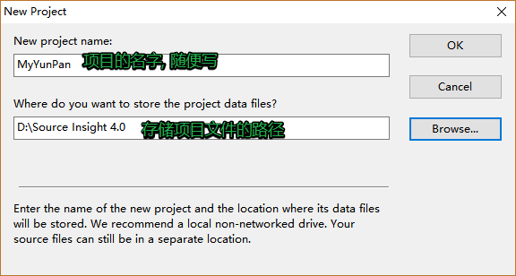
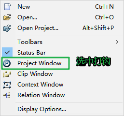

# 分布式服务器系统——仿百度网盘

[项目整个源代码](https://gitee.com/chuangdu/uploadDownload)

[项目设计的所以安装包及相关手册](https://github.com/zjxWeb/zjxWeb.github.io/tree/main/docs/techBlog/distributedServerProgramming/software/)

# 一. 项目概述及FastDFS
## 1. 项目架构图

### 1.1 一些概念

1. 什么是服务器
   - 硬件: 一台配置高的电脑
   - 软件: 电脑必须有一个能够解析http协议的软件
2. 常见的Web服务器

   - tomcat服务器

     - apache组织产品, 开源的免费服务器
   - weblogic 服务器
       - bea公司, 收费的服务器
       - 不交费, 访问量受限制

   - IIS服务器

     - Internet Information Server

     - 微软公司主推的服务器

   - nginx

     - 小巧且高效的HTTP服务器
     - 也可以做一个高效的负载均衡反向代理
     - 邮件服务器
       - pop3/smtp/imap

### 1.2 项目架构图


1. 客户端
   - 网络架构:
     - b/s
       - 必须使用http协议
     - c/s
       - 协议可以随意选择
       - Qt -> http
2. 服务器
   - Nginx
     - 能处理静态请求 -> html, jpg
     - 动态请求无法处理
     - 服务器集群之后, 每台服务器上部署的内容必须相同
   - fastCGI
     - 帮助服务器处理动态请求
3. 反向代理服务器
   - 客户端并不能直接访问web服务器, 直接访问到的是反向代理服务器
   - 客户端静请求发送给反向代理服务器, 反向代理将客户端请求转发给web服务器
4. 关系型数据库
   - 存储文件属性信息
   - 用户的属性信息
5. redis - 非关系型数据库 (内存数据库)
   - 作用提出程序效率
   - 存储是服务器经常要从关系型数据中读取的数据
6. FASTDFS - 分布式文件系统
   - 存储文件内容
   - 供用户下载

## 2. 分布式文件系统

### 2.1 传统文件系统


- 传统的文件系统格式:
  - ntfs / fat32 / ext3 / ext4
- 可以被挂载和卸载

### 2.2 分布式文件系统

> 文件系统的全部, 不在同一台主机上，而是在很多台主机上，多个分散的文件系统组合在一起，形成了一个完整的文件系统。 


> 分布式文件系统:
>
> 1. 需要有网络
> 2. 多台主机
>    - 不需要在同一地点
> 3. 需要管理者
> 4. 编写应用层的管理程序
>    - 不需要编写

## 3. FastDFS

### 3.1 fastDFS介绍

1. fastDFS概述

   > - 是用**c语言**编写的一款开源的分布式文件系统。
   >   - 余庆 - 淘宝的架构师
   > - 为互联网量身定制，充分考虑了冗余备份、负载均衡、线性扩容等机制，注重高可用、高性能等指标
   >   - 冗余备份: 纵向扩容
   >   - 线性扩容: 横向扩容
   > - 可以很容易搭建一套高性能的文件服务器集群提供文件==**上传、下载**==等服务。
   >   - 图床
   >   - 网盘

2. fastDFS框架中的三个角色

   - 追踪器 ( Tracker ) - 管理者 - 守护进程
     - 管理存储节点
   - 存储节点 - storage - 守护进程
     - 存储节点是有多个的
   - 客户端 - 不是守护进程, 这是程序猿编写的程序
     - 文件上传
     - 文件下载

3. fastDFS三个角色之间的关系 

   

   

   1. 追踪器
      - 最先启动追踪器
   2. 存储节点
      - 第二个启动的角色
      - 存储节点启动之后, 会单独开一个线程
        - 汇报当前存储节点的容量, 和剩余容量
        - 汇报数据的同步情况
        - 汇报数据被下载的次数
   3. 客户端
      - 最后启动
        - 上传
          - 连接追踪器, 询问存储节点的信息
            - 我要上传1G的文件, 询问那个存储节点有足够的容量
            - 追踪器查询, 得到结果
            - 追踪器将查到的存储节点的IP+端口发送给客户端
            - 通过得到IP和端口连接存储节点
            - 将文件内容发送给存储节点
        - 下载
          - 连接追踪器, 询问存储节点的信息
            - 问一下, 要下载的文件在哪一个存储节点
            - 追踪器查询, 得到结果
            - 追踪器将查到的存储节点的IP+端口发送给客户端
            - 通过得到IP和端口连接存储节点
            - 下载文件

4. fastDFS集群 - （了解即可）

   

   1. 追踪器集群
      - 为什么集群？
        - 避免单点故障
      - 多个Tracker如何工作？
        - 轮询工作
      - 如何实现集群？
        - 修改配置文件
   2. 存储节点集群
      - fastDFS管理存储节点的方式？
        - 通过分组的方式完成的
      - 集群方式（扩容方式）
        - 横向扩容 - 增加容量
          - 添加一台新的主机 -> 容量增加了
          - 假设当前有两个组: group1, group2
            - 需要添加一个新的分组 -> group3
              - 新主机属于第三组
          - 不同组的主机之间不需要通信
        - 纵向扩容 - 数据备份
          - 假设当前有两个组: group1, group2
            - 将新的主机放到现有的组中
            - 每个组的主机数量从1 -> N
              - 这n台主机的关系就是相互备份的关系
              - 同一个组中的主机需要通信
              - 每组的容量 == 容量最小的这台主机
      - 如何实现?
        - 通过修改配置文件可实现

### 3.2 fastDFS安装

1. fastDFS安装（**如果版本比较低需要依赖libevent这个库**）

   - libfastcommon-1.36.zip
     - fastdfs的基础库包
     - unzip xxx.zip
     - ./make.sh
     - ./make.sh install
   - fastdfs-5.10.tar.gz
     - tar zxvf xxx.tar.gz
     - ./make.sh
     - ./make.sh install

2. 测试

   ```shell
   #fastDFS安装的所有的可执行程序: 
   /usr/bin/fdfs_*
   fdfs_test
   ```

### 3.3 fastDFS配置文件

> 配置文件默认位置:  /etc/fdfs
>
> client.conf.sample  storage.conf.sample  storage_ids.conf.sample  tracker.conf.sample

1. tracker 配置文件

   ```shell
   # 将追踪器和部署的主机的IP地址进程绑定, 也可以不指定
   # 如果不指定, 会自动绑定当前主机IP, 如果是云服务器建议不要写
   bind_addr=192.168.247.135
   # 追踪器监听的端口
   port=22122
   # 追踪器存储日志信息的目录, xxx.pid文件, 必须是一个存在的目录
   base_path=/home/yuqing/fastdfs
   ```

2. storage 配置文件

   ```shell
   # 当前存储节点对应的主机属于哪一个组
   group_name=group1
   # 当前存储节点和所应该的主机进行IP地址的绑定, 如果不写, 有fastdfs自动绑定
   bind_addr=
   # 存储节点绑定的端口
   port=23000
   # 存储节点写log日志的路径
   base_path=/home/yuqing/fastdfs
   # 存储节点提供的存储文件的路径个数
   store_path_count=2
   # 具体的存储路径
   store_path0=/home/yuqing/fastdfs
   store_path1=/home/yuqing/fastdfs1
   # 追踪器的地址信息
   tracker_server=192.168.247.135:22122 
   tracker_server=192.168.247.136:22122 
   ```

3. 客户端配置文件

   ```shell
   # 客户端写log日志的目录
   # 该路径必须存在
   # 当前的用户对于该路径中的文件有读写权限
   # 当前用户robin
   # 指定的路径属于root
   base_path=/home/yuqing/fastdfs
   # 要连接的追踪器的地址信息
   tracker_server=192.168.247.135:22122 
   tracker_server=192.168.247.136:22122 
   ```


   

   1. 安装fastDFS安装包

### 3.4 fastDFS的启动

1. 第一个启动追踪器  - 守护进程

   ```shell
   # 启动程序在 /usr/bin/fdfs_*
   # 启动
   fdfs_trackerd 追踪器的配置文件(/etc/fdfs/tracker.conf) 
   # 关闭
   fdfs_trackerd 追踪器的配置文件(/etc/fdfs/tracker.conf)  stop
   # 重启
   fdfs_trackerd 追踪器的配置文件(/etc/fdfs/tracker.conf) restart
   ```

2. 第二个启动存储节点 - 守护进程

   ```shell
   # 启动
   fdfs_storaged 存储节点的配置文件(/etc/fdfs/stroga.conf)
   # 关闭
   fdfs_storaged 存储节点的配置文件(/etc/fdfs/stroga.conf) stop
   # 重启
   fdfs_storaged 存储节点的配置文件(/etc/fdfs/stroga.conf) restart
   ```

3. 最后启动客户端 - 普通进程

   ```shell
   # 上传
   fdfs_upload_file 客户端的配置文件(/etc/fdfs/client.conf) 要上传的文件
   # 得到的结果字符串: group1/M00/00/00/wKj3h1vC-PuAJ09iAAAHT1YnUNE31352.c
   # 下载
   fdfs_download_file 客户端的配置文件(/etc/fdfs/client.conf) 上传成功之后得到的字符串(fileID)
   ```

4. fastDFS状态检测

    - 命令

      ```shell
      fdfs_monitor /etc/fdfs/client.conf
      ```

    - [Storage Server的7种状态](./src/https://blog.csdn.net/u014723529/article/details/46048411)

      https://blog.csdn.net/u014723529/article/details/46048411

      ```shell
      # FDFS_STORAGE_STATUS：INIT      :初始化，尚未得到同步已有数据的源服务器
      # FDFS_STORAGE_STATUS：WAIT_SYNC :等待同步，已得到同步已有数据的源服务器
      # FDFS_STORAGE_STATUS：SYNCING   :同步中
      # FDFS_STORAGE_STATUS：DELETED   :已删除，该服务器从本组中摘除
      # FDFS_STORAGE_STATUS：OFFLINE   :离线
      # FDFS_STORAGE_STATUS：ONLINE    :在线，尚不能提供服务
      # FDFS_STORAGE_STATUS：ACTIVE    :在线，可以提供服务
      ```

### 3.5 对file_id的解释


- group1
  - 文件上传到了存储节点的哪一个组
  - 如果有多个组这个组名可变的
- M00 - 虚拟目录
  - 和存储节点的配置项有映射
    - store_path0=/home/yuqing/fastdfs/data    ->  M00
      store_path1=/home/yuqing/fastdfs1/data   -> M01
- 00/00
  - 实际的路径
  - 可变的
- wKhS_VlrEfOAdIZyAAAJTOwCGr43848.md
  - 文件名包含的信息
  - 采用Base64编码
    - 包含的字段包括

      - 源storage server Ip 地址  
      - 文件创建时间  

      - 文件大小  

      - 文件CRC32效验码 

        - 循环冗余校验  

      - 随机数

## 4. 上传下载代码实现

1. 使用多进程方式实现

   - exec函数族函数

     - execl
     - execlp

   - 父进程

     - 子进程 -> 执行

       execlp("fdfs_upload_file" , "xx", arg, NULL), 有结果输出, 输出到终端

       - 不让它写到终端 -> 重定向dup2(old, new)
         - old-> 标准输出
         - new -> 管道的写端
         - 文件描述符
         - 数据块读到内存 -> 子进程
           - 数据最终要给到父进程
       - pipe -> 读端, 写端
         - 在子进程创建之前创建就行了

     - 父进程

       - 读管道 -> 内存
       - 内存数据写数据库

   

2. 使用fastDFS API实现

   - 

## 5. 源码安装 - 回顾

安装流程:

1. 以下文件, 里边有安装步骤
   - readme 
   - readme.md 
   - INSTALL
2. 找 可执行文件 <font color=green>configure</font>
   - 执行这个可执行文件
     - 检测安装环境
     - 生成 makefile
3. 执行**make**命令
   - 编译源代码
     - 生成了动态库
     - 静态库
     - 可执行程序
4. 安装 **make install** (需要管理员权限)
   - 将第三步生成的动态库/动态库/可执行程序拷贝到对应的系统目录

## 6. 复习

1. fastDFS

   - 是什么?

     - 分布式文件系统

   - 干什么?

     - 提供文件上传
     - 提供文件下载

   - 怎么使用?

     - 根据主机的角色 -> 修改对应的配置文件

     - 启动各个角色

       ```shell
       fdfs_trackerd /etc/fdfs/tracker.conf
       fdfs_storaged /etc/fdfs/storage.conf
       ```


+ 客户端编写
  
     
     - 操作步骤
     
       1. 创建管道 - pipe
       2. 创建子进程
       3. 子进程干什么?
       
          - 写管道, 关闭读端
            - 将标准输出 -> 管道的写端
          - 重定向
          - 执行execl命令, 调用另外的进程fdfs_upload_file
          - 子进程退出
       4. 父进程？
          - 读管道， 关闭写端
          - 释放子进程资源 - pcb
            - wait()/ waitpid()

> `fdfs_upload_file.c`

```c++
  1 #include <stdio.h> 
  2 #include <stdlib.h> 
  3 #include <string.h> 
  4 #include <string.h> 
  5 #include <errno.h> 
  6 #include <sys/types.h> 
  7 #include <sys/stat.h> 
  8 #include <fcntl.h> 
  9 #include <sys/wait.h>  
 10 #include "fdfs_client.h" 
 11 #include "logger.h" 
 12         
 13 int upload_file1(const char* confFile, const char* myFile,char* fileID) 
 14 { 
 15   char group_name[FDFS_GROUP_NAME_MAX_LEN + 1]; 
 16   ConnectionInfo *pTrackerServer; 
 17   int result; 
 18   int store_path_index; 
 19   ConnectionInfo storageServer; 
 20   char file_id[128]; 
 21  
 22   if ((result=fdfs_client_init(confFile)) != 0) 
 23   { 
 24     return result; 
 25   } 
 26  
 27   pTrackerServer = tracker_get_connection(); 
 28   if (pTrackerServer == NULL) 
 29   { 
 30     fdfs_client_destroy(); 
 31     return errno != 0 ? errno : ECONNREFUSED; 
 32   } 
 33  
 34   *group_name = '\0'; 
 35   if ((result=tracker_query_storage_store(pTrackerServer, \ 
 36                   &storageServer, group_name, &store_path_index)) != 0) 
 37   { 
 38     fdfs_client_destroy(); 
 39     fprintf(stderr, "tracker_query_storage fail, " \ 
 40       "error no: %d, error info: %s\n", \ 
 41       result, STRERROR(result)); 
 42     return result; 
 43   } 
 44  
 45   result = storage_upload_by_filename1(pTrackerServer, \ 
 46       &storageServer, store_path_index, \ 
 47       myFile, NULL, \ 
 48       NULL, 0, group_name, fileID); 
 49   if (result == 0) 
 50   { 
 51     printf("%s\n", fileID); 
 52   } 
 53   else 
 54   { 
 55     fprintf(stderr, "upload file fail, " \ 
 56       "error no: %d, error info: %s\n", \ 
 57       result, STRERROR(result)); 
 58   } 
 59  
 60   tracker_disconnect_server_ex(pTrackerServer, true); 
 61   fdfs_client_destroy(); 
 62  
 63   return result; 
 64 } 
 65  
 66 // 使用多进程的方式实现 
 67 int upload_file2(const char* confFile, const char* uploadFile, char* fileID,int size) 
 68 { 
 69   // 1. 创建匿名管道 
 70   int fd[2]; 
 71   int ret = pipe(fd); 
 72   if(ret == -1) 
 73   { 
 74     perror("pipe error"); 
 75     exit(0); 
 76   } 
 77   // 2. 创建子进程 
 78   pid_t pid = fork(); 
 79   // 如果是子进程 
 80   if(pid  == 0) 
 81   { 
 82     // 3. 标准输出重定向 --》 管道的写端 
 83     dup2(fd[1], STDOUT_FILENO); 
 84     // 4. 关闭读端 
 85     close(fd[0]); 
 86     // 5. 执行execlp命令 
 87     execlp("fdfs_upload_file","xxx", confFile, uploadFile, NULL); 
 88     perror("execlp error"); 
 89   } 
 90   else 
 91   { 
 92     // 父进程，读管道 
 93     // 关闭写端 
 94     close(fd[1]); 
 95     read(fd[0],fileID, size); 
 96     // 回收pcd -》 子进程 
 97     wait(NULL); 
 98   } 
 99 }

```

>  `fdfs_upload_file.h`

```C++
1 #ifndef _FDFS_UPLOAD_FILE_H
  2 #define _FDFS_UOLOAD_FILE_H
  3 
  4 int upload_file1(const char* confFile, const char* localFile, char* fileID);
  5 int upload_file2(const char * contFile, const char* localFile, char* fileID, int bufLen);
  6 
  7 #endif
```

> `main.c`

```C++
1 #include <stdio.h>
  2 #include <unistd.h>
  3 #include <stdlib.h>
  4 #include <sys/types.h>
  5 #include <sys/stat.h>
  6 #include <string.h>
  7 #include "fdfs_upload_file.h"
  8 int main(int argc,const char* argv[])
  9 {
 10   char fileID[1024] = {0};
 11   upload_file1("etc/fdfs/client.conf", "main.c", fileID);
 12   printf("fileID:%s\n", fileID);
 13   printf("========\n ");
 14   upload_file2("/etc/fdfs/c1ient.conf","main.c", fileID, sizeof(fileID));
 15   printf("fileID:%s\n",fileID);
 16   return 0;
 17  }
```

# 二. 数据库概述及Redis

## 1. 数据库类型

### 1.1 基本概念

1. 关系型数据库 - sql
   - 操作数据必须要使用sql语句
   - 数据存储在磁盘
   - 存储的数据量大
   - 举例:
     - mysql
     - oracle
     - sqlite - 文件数据库
     - sql server
2. 非关系数据库 - nosql
   - 操作不使用sql语句
     - 命令
   - 数据默认存储在内存
     - 速度快, 效率高
     - 存储的数据量小
   - 不需要数据库表
     - 以键值对的方式存储的

### 1.2 关系/非关系型数据库搭配使用


> ==RDBMS: Relational Database Management System==
>
> 1. 所有的数据默认存储在关系型数据库中
> 2. 客户端访问服务器, 有一些数据, 服务器需要频繁的查询数据
>    - 服务器首先将数据从关系型数据库中读出 -> 第一次
>      - 将数据写入到redis中
>    - 客户端第二次包含以后访问服务器
>      - 服务器从redis中直接读数据

## 2. Redis

> 1. 知道redis是什么?
>    - 非关系型数据库 也可以叫 内存数据库
> 2. 能干什么?
>    - 存储访问频率高的数据
>    - 共享内存
>      - 服务器端 -> redis
> 3. 怎么使用?
>    - 常用的操作命令
>      - 各种数据类型 -> 会查
>    - redis的配置文件
>    - redis的数据持久化
>    - 写程序的时候如何对redis进行操作
>      - 客户端 -> 服务器

### 2.1 基本知识点

1. 安装包下载
   - 英文官方： <https://redis.io/>
   - 中文官方： <http://redis.cn/>

2. Redis安装

   - make
   - make install

3. redis中的两个角色

   ```shell
   # 服务器 - 启动
   redis-server	# 默认启动
   redis-server confFileName # 根据配置文件的设置启动
   # 客户端
   redis-cli	# 默认连接本地, 绑定了6379默认端口的服务器
   redis-cli -p 端口号
   redis-cli -h IP地址 -p 端口 # 连接远程主机的指定端口的redis
   # 通过客户端关闭服务器
   shutdown
   # 客户端的测试命令
   ping [MSG]
   ```

4. redis中数据的组织格式

   - 键值对
     - key: 必须是字符串 - "hello"
     - value: 可选的
       - String类型
       - List类型
       - Set类型
       - SortedSet类型
       - Hash类型

5. redis中常用数据类型
   - String类型
     - 字符串
   - List类型
     - 存储多个string字符串的
   - Set类型
     - 集合
       - stl集合
         - 默认是排序的, 元素不重复
       - redis集合
         - 元素不重复, 数据是无序的
   - SortedSet类型
     - 排序集合, 集合中的每个元素分为两部分
       - [分数, 成员] -> [66, ''tom'']
   - Hash类型
     - 跟map数据组织方式一样: key:value
       - Qt -> QHash, QMap
       - Map -> 红黑树
       - hash -> 数组
         - a[index] = xx

### 2.2 redis常用命令

- String类型

  ```shell
  key -> string
  value -> string
  # 设置一个键值对->string:string
  SET key value
  # 通过key得到value
  GET key
  # 同时设置一个或多个 key-value 对
  MSET key value [key value ...]
  # 同时查看过个key
  MGET key [key ...]
  # 如果 key 已经存在并且是一个字符串， APPEND 命令将 value 追加到 key 原来的值的末尾
  # key: hello, value: world, append: 12345
  APPEND key value
  # 返回 key 所储存的字符串值的长度
  STRLEN key
  # 将 key 中储存的数字值减一。
  # 前提, value必须是数字字符串 -"12345"
  DECR key
  ```

- List类型 - 存储多个字符串

  ```shell
  key -> string
  value -> list
  # 将一个或多个值 value 插入到列表 key 的表头
  LPUSH key value [value ...]
  # 将一个或多个值 value 插入到列表 key 的表尾 (最右边)。
  RPUSH key value [value ...]
  # list中删除元素
  LPOP key # 删除最左侧元素
  RPOP key # 删除最右侧元素
  # 遍历
  LRANGE key start stop
  	start: 起始位置, 0
  	stop: 结束位置, -1
  # 通过下标得到对应位置的字符串
  LINDEX key index
  # list中字符串的个数
  LLEN key
  ```

- Set类型

  ```shell
  key -> string
  value -> set类型 ("string", "string1")
  # 添加元素
  # 将一个或多个 member 元素加入到集合 key 当中，已经存在于集合的 member 元素将被忽略
  SADD key member [member ...]
  # 遍历
  SMEMBERS key
  # 差集
  SDIFF key [key ...]
  # 交集
  SINTER key [key ...]
  # 并集
  SUNION key [key ...]
  ```

- SortedSet 类型

  ```shell
  key -> string
  value -> sorted ([socre, member], [socre, member], ...)
  # 添加元素
  ZADD key score member [[score member] [score member] ...]
  # 遍历
  ZRANGE key start stop [WITHSCORES] # -> 升序集合
  ZREVRANGE key start stop [WITHSCORES] # -> 降序集合
  # 指定分数区间内元素的个数
  ZCOUNT key min max
  ```

- Hash类型

  

  ```shell
  key ->string
  value -> hash ([key:value], [key:value], [key:value], ...)
  # 添加数据
  HSET key field value
  # 取数据
  HGET key field
  # 批量插入键值对
  HMSET key field value [field value ...]
  # 批量取数据
  HMGET key field [field ...]
  # 删除键值对
  HDEL key field [field ...]
  ```

- Key 相关的命令

  ```shell
  # 删除键值对
  DEL key [key ...]
  # 查看key值
  KEYS pattern
  查找所有符合给定模式 pattern 的 key 。
  KEYS * 匹配数据库中所有 key 。
  KEYS h?llo 匹配 hello ， hallo 和 hxllo 等。
  KEYS h*llo 匹配 hllo 和 heeeeello 等。
  KEYS h[ae]llo 匹配 hello 和 hallo ，但不匹配 hillo
  # 给key设置生存时长
  EXPIRE key seconds
  # 取消生存时长
  PERSIST key
  # key对应的valued类型
  TYPE key
  ```


### 2.3 redis配置文件

> 配置文件是给**redis服务器**使用 的

1. 配置文件位置

   - 从源码安装目录中找 -> redis.conf

2. 配置文件配置项

   ```shell
   # redis服务器绑定谁之后, 谁就能访问redis服务器
   # 任何客户端都能访问服务器, 需要注释该选项
   bind 127.0.0.1 192.168.1.100 
   # 保护模式, 如果要远程客户端访问服务器, 该模式要关闭
   protected-mode yes
   # reids服务器启动时候绑定的端口, 默认为6379
   port 6379
   # 超时时长, 0位关闭该选项, >0则开启
   timeout 0
   # 服务器启动之后不是守护进程
   daemonize no
   # 如果服务器是守护进程, 就会生成一个pid文件
   # ./ -> reids服务器启动时候对应的目录
   pidfile ./redis.pid
   # 日志级别
    loglevel notice
   # 如果服务器是守护进程, 才会写日志文件
    logfile "" -> 这是没写
    logfile ./redis.log
    # redis中数据库的个数
    databases 16 
    	- 切换 select dbID [dbID == 0 ~ 16-1]
   ```

### 2.4 redis数据持久化

> 持久化: 数据从内存到磁盘的过程

持久化的两种方式:

- rdb方式
  - 这是一种默认的持久化方式, 默认打开
  - 磁盘的持久化文件xxx.rdb
  - 将内存数据以二进制的方式直接写入磁盘文件
  - 文件比较小, 恢复时间短, 效率高
  - 以用户设定的频率 -> 容易丢失数据
  - 数据完整性相对较低
- aof方式
  - 默认是关闭的
  - 磁盘的持久化文件xxx.aof
  - 直接将生成数据的命令写入磁盘文件
  - 文件比较大, 恢复时间长, 效率低
  - 以某种频率 -> 1sec
  - 数据完整性高

```shell
# rdb的同步频率, 任意一个满足都可以
save 900 1
save 300 10
save 60 10000
# rdb文件的名字
dbfilename dump.rdb
# 生成的持久化文件保存的那个目录下, rdb和aof
dir ./ 
# 是不是要打开aof模式
appendonly no
 -> 打开: yes
# 设置aof文件的名字
appendfilename "appendonly.aof"
# aof更新的频率
# appendfsync always
appendfsync everysec
# appendfsync no
```

1. aof和rdb能不能同时打开?

   - 可以

2. aof和rdb能不能同时关闭?

   - 可以

   - rdb如何关闭?

     ```shell
     save ""
     ```

3. 两种模式同时开启, 如果要进行数据恢复, 如何选择?

   - 效率上考虑:  rdb模式
   - 数据的完整性: aof模式

## 3 hiredis的使用

1. hiredis的安装

   - 下载地址: <http://redis.cn/clients.html#c> 
   - 安装
     - make
     - make 

2. hiredis API接口的使用

   - 连接数据库

     ```c
     // 连接数据库
     redisContext *redisConnect(const char *ip, int port);
     redisContext *redisConnectWithTimeout(const char *ip, 
                                           int port, const struct timeval tv);
     ```

   - 执行redis命令函数

     ```c
     // 执行redis命令
     void *redisCommand(redisContext *c, const char *format, ...);
     // redisCommand 函数实际的返回值类型
     typedef struct redisReply {
         /* 命令执行结果的返回类型 */
         int type; 
         /* 存储执行结果返回为整数 */
         long long integer;
         /* str变量的字符串值长度 */
         size_t len;
         /* 存储命令执行结果返回是字符串, 或者错误信息 */
         char *str;
         /* 返回结果是数组, 代表数据的大小 */
         size_t elements;
         /* 存储执行结果返回是数组*/
         struct redisReply **element;
     } redisReply;
     redisReply a[100];
     element[i]->str
     ```

     | 状态表示                 | 含义                                                         |
     | ------------------------ | ------------------------------------------------------------ |
     | REDIS_REPLY_STRING==1    | 返回值是字符串,字符串储存在redis->str当中,字符串长度为redi   |
     | REDIS_REPLY_ARRAY== 2    | 返回值是数组，数组大小存在redis->elements里面，数组值存储在redis->element[i]里面。数组里面存储的是指向redisReply的指针，数组里面的返回值可以通过redis->element[i]->str来访问，数组的结果里全是type==REDIS_REPLY_STRING的redisReply对象指针。 |
     | REDIS_REPLY_INTEGER == 3 | 返回整数long long，从integer字段获取值                       |
     | REDIS_REPLY_NIL==4       | 返回值为空表示执行结果为空                                   |
     | REDIS_REPLY_STATUS ==5   | 返回命令执行的状态，比如set foo bar 返回的状态为OK，存储在str当中 reply->str == "OK" 。 |
     | REDIS_REPLY_ERROR ==6    | 命令执行错误,错误信息存放在 reply->str当中。                 |

   - 释放资源

     ```c
     // 释放资源
     void freeReplyObject(void *reply);
     void redisFree(redisContext *c);
     ```

```c
#include<stdio.h>
#include<hiredis.h>

int main()
{
  //1. 连接redis服务器
  redisContext* c = redisConnect("127.0.0.1",6379);
  if(c->err != 0)
  {
    return -1;
  }
  // 2. 执行redis命令
  void *prt = redisCommand(c,"hmset user username zhang3 passwd 123456 age 10 sex man");
  redisReply* ply = (redisReply*)prt;
  if(ply->type  ==5)
  {
    // 状态输出
    printf("状态：%s\n",ply->str);
  }
  freeReplyObject(ply);
  // 3, 从数据库中读数据
  prt = redisCommand(c, "hgetall user");
  ply = (redisReply*)prt;
  if(ply->type == 2)
  {
    // 遍历
    int i = 0;
    for(i; i<ply->elements; i+=2)
    {
      printf("key:%s,value:%s\n",ply->element[i]->str ,ply->element[i+1]->str);
    }
  }
  freeReplyObject(ply);
  redisFree(c);
  return 0;
}
```

`gcc *.c -I/usr/local/include/hiredis/ -lhiredis`

+ **报错**

  + `./a.out: error while loading shared libraries: libhiredis.so.1.0.1-dev: cannot open shared object file: No such file or directory`

  + 创建文件`/etc/ld.so.conf.d/usr-libs.conf`， 内容如下：

    + ```tex
      /usr/local/lib
      ```

  + 然后执行

    + ```
      /sbin/ldconfig
      ```

# 三. `Nginx`初试牛刀

## 1. 一些基本概念

### 1.1 `Nginx`初步认识

1. `Nginx`介绍

   - engine x

   - 俄罗斯
   - 开源的框架
   - c语言
   - Tengine - 淘宝基于nginx修改的

2. `Nginx`能干什么?

   - 作为web服务器
     - 解析`http`协议
   - 反向代理服务器
     - 了解反向代理的概念
   - 邮件服务器
     - 解析邮件相关的协议: `pop3/smtp/imap`

3. Nginx的优势?

   > - 更快
   >
   >   - 高峰期(数以万计的并发时)nginx可以比其它web服务器更快的响应请求
   >
   > - 高扩展
   >
   >   - **低耦合**设计的模块组成,丰富的第三方模块支持
   >
   > - 高可靠
   >
   >   - 经过大批网站检验
   >     - www.sina.com.cn
   >     - www.xunlei.com
   >     - www.163.com
   >   - 每个worker进程相对独立, 出错之后可以快速开启新的worker
   >     - worker进程的个数是可以控制的
   >     - 在后台干活的进程
   >
   > - 低内存消耗
   >
   >   - 一般情况下,10000个非活跃的HTTP  Keep-Alive连接在nginx中仅消耗 2.5M内存
   >
   > - 单机支持10万以上的并发连接
   >
   >   - 取决于内存,10万远未封顶
   >
   > - 热部署
   >
   >   - master和worker的分离设计,可实现7x24小时不间断服务的前提下升级nginx可执行文件
   >
   > - 最自由的BSD许可协议
   >
   >   - BSD许可协议允许用户免费使用nginx, 修改nginx源码,然后再发布
   >     - 淘宝: tengine
   >

### 1.2 正向/反向代理

1. 正向代理

   > 正向代理是位于客户端和原始服务器之间的服务器，为了能够从原始服务器获取请求的内容，客户端需要将请求发送给代理服务器，然后再由代理服务器将请求转发给原始服务器，原始服务器接受到代理服务器的请求并处理，然后将处理好的数据转发给代理服务器，之后再由代理服务器转发发给客户端，完成整个请求过程。 
   >
   > **正向代理的典型用途就是为在防火墙内的局域网客户端提供访问Internet的途径**==, 比如: 
   >
   > - 学校的局域网
   > - 单位局域网访问外部资源 


>  **正向代理服务器是为用户服务的**

2. 反向代理

   > 反向代理方式是指代理原始服务器来接受来自Internet的链接请求，然后将请求转发给内部网络上的原始服务器，并将从原始服务器上得到的结果转发给Internet上请求数据的客户端。那么顾名思义，反向代理就是位于Internet和原始服务器之间的服务器，对于客户端来说就表现为一台服务器，客户端所发送的请求都是直接发送给反向代理服务器，然后由反向代理服务器统一调配。 

   

   

   


   

1. 客户端给服务器发送请求, 连接服务器, 用户不知道服务器地址, 只有反向代理服务器的地址是公开的
2. 请求直接发给反向代理服务器
3. 反向代理服务器将请求转发给后边的web服务器
   - web服务器 N 台
   - 反向代理服务器转发请求会轮询进行
4. web服务器收到请求进行处理, 得到结果
5. web服务器将处理结果发送给反向代理服务器
6. 反向代理服务器将拿到的结果转发给客户端

### 1.3 域名和`IP`

1. 什么是域名？
   - www.baidu.com
   - `jd.com`
   - taobao.com
2. 什么是`IP`地址？
   - 点分十进制的字符串
     - 11.22.34.45
3. 域名和`IP`地址的关系？
   - 域名绑定`IP`
     - 一个域名只能绑定一个`IP`
     - 一个`IP`地址被多个域名绑定

## 2. `Nginx` 安装和配置

### 2.1 安装

1. 下载

   > 1. 官方地址: <http://nginx.org/>
   >
   > 2. `Nginx`相关依赖:
   >    - `OpenSSL`: <http://www.openssl.org/> 
   >      - 密码库
   >      - 使用https进行通信的时候使用
   >
   >    - `ZLib`下载: <http://www.zlib.net/> 
   >      - 数据压缩
   >      - 安装:
   >        - ./configure
   >        - make
   >        - sudo make install
   >
   >    - `PCRE`下载:  <http://www.pcre.org/> 
   >
   >      - 解析正则表达式
   >
   >      - 安装
   >        - ./configure
   >        - make
   >        - sudo make install
   >
   >      - 安装如果有这个报错
   >
   >        - `**make: \**\* No targets specified and no makefile found. stop**`
   >
   >      - 执行如下命令在进行安装操作
   >
   >        - ```
   >          yum install -y gcc gcc-c++
   >          ```
   >        
   >      - 安装如果有这个报错
   >      
   >        - ```shell
   >          tar (child): bzip2: Cannot exec: No such file or directory
   >          tar (child): Error is not recoverable: exiting now
   >          tar: Child returned status 2
   >          tar: Error is not recoverable: exiting now
   >          ```
   >      
   >        - 解决方案：
   >      
   >          - ```shell
   >            Centos系统 命令行输入：
   >            yum -y install bzip2
   >            ubuntu系统 命令行输入：
   >            sudo apt-get install bzip2
   >            ```
   >

2. 安装

   - `nginx`的安装

     ```shell
     # nginx工作时候需要依赖三个库
     # 三个参数=这三个库对应的源码安装目录
     # 根据自己的电脑的库安装包的位置进行指定
     ./configure --with-openssl=../openssl-1.0.1t --with-pcre=../pcre-8.40 --with-zlib=../zlib-1.2.11
     make
     sudo make install
     ```

   

> 如果报很多莫名其妙的错误可以这样尝试这样安装
>
> ```shell
> ./configure --user=www --group=www --prefix=/usr/local/nginx --with-http_stub_status_module --with-http_ssl_module --with-openssl=../openssl-1.0.1t  --with-zlib=../zlib-1.2.11  --with-pcre=../pcre-8.40
> ```
>
> 现象：
>
>         安装 nginx 或 启动 nginx 时报错：
>                                                                                                                                                     
>          nginx: [emerg] getpwnam("www") failed
>
> 原因：        
>
>         没有配置 www 这个用户名。
>
> 解法（2种）：
>
>         1、在 nginx.conf 中 把 user nobody 的注释去掉。        
>                                                                                                                                                     
>         2、在服务器系统中添加 用户组www 和 用户www，命令如下：
> ```shell
> /usr/sbin/groupadd -f www
> /usr/sbin/useradd -g www www
> ```

3. `Nginx` 相关的指令

   - `Nginx`的默认安装目录

     ```shell
     /usr/local/nginx
      conf -> 存储配置文件的目录
      html -> 默认的存储网站(服务器)静态资源的目录 [图片, html, js, css]
      logs -> 存储log日志
      sbin -> 启动nginx的可执行程序
     ```

   - `Nginx`可执行程序的路径

     ```shell
     /usr/local/nginx/sbin/nginx
     # 快速启动的方式
     # 1. 将/usr/local/nginx/sbin/添加到环境变量PATH中
     # 2. /usr/local/nginx/sbin/nginx创建软连接, 放到PATH对应的路径中, 比如: /usr/bin
     ln -s /usr/local/nginx/sbin/nginx /usr/bin/nginx
     ```

   - 启动`Nginx` - 需要管理器权限

     ```shell
     # 假设软连接已经创建完毕
     sudo nginx # 启动
     ```

   - 关闭`Nginx`

     ```shell
     # 第一种, 马上关闭
     sudo nginx -s stop
     # 第二种, 等nginx作为当前操作之后关闭
     sudo nginx -s quit
     ```

     > 执行 `sudo nginx -s stop`报错

     + `nginx: [error] open() "/usr/local/nginx/logs/nginx.pid" failed (2: No such file or directory)`
     + 解决方法
   
     ```shell
     #启动文件nginx在sbin目录中，配置文件在conf目录中
     /usr/local/nginx/sbin/nginx -c /usr/local/nginx/conf/nginx.conf
     ```
   
   - 重新加载`Nginx`
   
     ```shell
     sudo nginx -s reload  # 修改了nginx的配置文件之后, 需要执行该命令
     ```
   
   - 测试是否安装成功
   
     - 知道`nginx`对应的主机的`IP`地址 - > 192.168.1.100
     - 在浏览器中访问该`IP`地址
       - 看到一个`welcom nginx`的欢迎界面


### 2.2 配置

1. `Nginx`配置文件的位置

   ```shell
   /usr/local/nginx/conf/nginx.conf
   ```

2. `Nginx`配置文件的组织格式

   

   - http -> 模块, http相关的通信设置
     - server模块 -> 每个server对应的是一台web服务器
       - location 模块
         - 处理的是客户端的请求
   - mail -> 模块, 处理邮件相关的动作

3. 常用配置项介绍

   ```nginx
   user  nobody; # 启动之后的worker进程属于谁
   	- 错误提示: nginx操作xxx文件时候失败, 原因: Permission denied  
   	- 将nobody -> root
   worker_processes  1; # 设置worker进程的个数, 最大 == cpu的核数 (推荐)
   error_log  logs/error.log; # 错误日志, /usr/local/nginx
   pid        logs/nginx.pid; # pid文件, 里边是nginx的进程ID
   # nginx的事件处理
   events {
    	use epoll;	# 多路IO转接模型使用epoll
    	worker_connections  1024;	// 每个工作的进程的最大连接数
   }
   http->server -> 每个server模块可以看做一台web服务器
   server{
   	listen       80;  # web服务器监听的端口, http协议的默认端口
       server_name  localhost; # 对应一个域名, 客户端通过该域名访问服务器
       charset utf8; 	# 字符串编码
       location {	// 模块, 处理客户端的请求
   }
   
   # 客户端 (浏览器), 请求:
     http://192.168.10.100:80/login.html
   # 服务器处理客户端的请求
     服务器要处理的指令如何从url中提取?
     - 去掉协议: http
     - 去掉IP/域名+端口: 192.168.10.100:80
     - 最后如果是文件名, 去掉该名字: login.html
     - 剩下的: /
     服务器要处理的location指令: 
     location /
     {
           处理动作
     }
   ```

## 3. `Nginx`的使用

### 3.1 部署静态网页

1. 静态网页存储目录

   - 默认的存储目录: 

     ```shell
     /usr/local/nginx/html
     ```

   - 自己创建新的目录:

     ```shell
     应该在 /usr/local/nginx/
     mkdir /usr/local/nginx/mydir
     ```

2. 练习

   > 在`Nginx`服务器上进行网页部署, 实现如下访问:
   >
   > 在/usr/local/nginx/创建新的目录, yundisk用来存储静态网页
   >

   - 访问地址: <http://192.168.80.254/login.html> 

     - login.html放到什么位置?

       ```shell
       / -> 服务器的资源根目录, /usr/local/nginx/yundisk
       login.htm-> 放到yundisk中
       ```

     - 服务器要处理的动作

       ```nginx
       # 对应这个请求服务器要添加一个location
       location 指令(/)
       {
           # 找一个静态网页
           root yundisk;  # 相对于/usr/local/nginx/来找
           # 客户端的请求是一个目录, nginx需要找一默认显示的网页
           index index.html index.htm;
       }
       # 配置之后重启nginx
       sudo nginx -s reload
       ```

   - 访问地址: <http://192.168.80.254/hello/reg.html> 

     - hello是什么?

       - 目录

     - reg.html放到哪儿?

       - hello目录中

     - 如何添加location

       ```nginx
       location /hello/
       {
           root yundisk;
           index xx.html;
       }
       ```

   - 访问地址: <http://192.168.80.254/upload/> 浏览器显示upload.html 

     - 直接访问一个目录, 得到一默认网页

       - upload是一个目录, uplaod.html应该再upload目录中

         ```nginx
         location /upload/
         {
             root yundisk;
             index upload.html;
         }
         ```

### 3.2 反向代理和负载均衡

> 反向代理和负载均衡是两码事儿
>


准备工作:

> 1. 需要客户端 - 1个
>    - Window中的浏览器作为客户端 
> 2. 反向代理服务器 -> 1个
>    - window作为反向代理服务器
> 3. web服务器 -> 2个
>    - ubuntu - robin: 192.168.247.135
>    - ubuntu - luffy : 192.168.26.250

1. 反向代理设置

   

   ```nginx
   找window上对应的nginx的配置文件
   	- conf/nginx.conf
   # 代理几台服务器就需要几个server模块
       # 客户端访问的url: http://192.168.1.100/login.html
       server {
           listen       80;        # 客户端访问反向代理服务器, 代理服务器监听的端口
           server_name  ubuntu.com; # 客户端访问反向代理服务器, 需要一个域名
           location / {
               # 反向代理服务器转发指令, http:// 固定
               proxy_pass http://robin.test.com;
           }
   
       }
       # 添加一个代理模块
       upstream robin.test.com
       {
           server 192.168.247.135:80;
       }
       # luffy
       server {
           listen       80;        # 客户端访问反向代理服务器, 代理服务器监听的端口
           server_name  hello.com; # 客户端访问反向代理服务器, 需要一个域名
           location / {
               # 反向代理服务器转发指令, http:// 固定
               proxy_pass http://luffy.test.com;
           }
   
       }
       # 添加一个代理模块
       upstream luffy.test.com
       {
           server 192.168.26.250:80;
       }
   }
   
   ```

2. 负载均衡设置

   

   ```nginx
       server {
           listen       80;         # 客户端访问反向代理服务器, 代理服务器监听的端口
           server_name  localhost; # 客户端访问反向代理服务器, 需要一个域名
           location / {
               # 反向代理服务器转发指令, http:// 固定的头
               proxy_pass http://linux.com;
           }
           location /hello/ {
               # 反向代理服务器转发指令, http:// 固定的头
               proxy_pass http://linux.com;
           }
       	location /upload/ {
               # 反向代理服务器转发指令, http:// 固定的头
               proxy_pass http://linux.com;
           }
   
       }
       # 添加一个代理模块
       upstream linux.com
       {
           server 192.168.247.135:80 weight=1;
           server 192.168.26.250:80 weight=3;
       }
   
   ## =====================================
   web服务器需要做什么?
   # 192.168.247.135
   location /
   {
       root xxx;
       index xxx;
   }
   location /hello/ 
   {
       root xx;
       index xxx;
   }
   location /upload/ 
   {
       root xxx;
       index xx;
   }
   # 192.168.26.250
   location /
   {
       root xxx;
       index xxx;
   }
   location /hello/ 
   {
       root xx;
       index xxx;
   }
   location /upload/ 
   {
       root xxx;
       index xx;
   }
   ```


## 课外知识导读

### 1. URL和URI

>   

   1. 概念:

      > - `URL（Uniform Resource  Locator）`: 统一资源定位符
      >
      > - 表示资源位置的字符串
      >   - 基本格式: "==协议://`IP`地址/路径和文件名=="
      >      - <ftp://ftp.is.co.za/rfc/rfc1808.txt>
      >      - <http://www.ietf.org/rfc/rfc2396.txt>
      >      - <telnet://192.0.2.16:80/>
      >
      > - URN（Uniform Resource  Name）: 统一资源名称
      >   - `P2P`下载中使用的磁力链接
      >
      > - URI（Uniform Resource  Identifier）: 统一资源标识符
      >   - 是一个紧凑的字符串用来标示抽象或物理资源, ==**URL是URI的一种**== 
      >   - 让URI能成为URL的当然就是那个“访问机制”，“网络位置”。e.g. `http://` or `ftp://`。
      >     - files.hp.com 
      >     - <tel:+1-816-555-1212>
      >     - <ftp://ftp.is.co.za/rfc/rfc1808.txt>               （also a URL）
      >     - <http://www.ietf.org/rfc/rfc2396.txt>         （also a URL）
      >     - <telnet://192.0.2.16:80/>                              （also a URL）
      >

   2. 经验式理解:

      

      从包含关系上说: URI包含URL

      字符串长度上说: URL包含URI

      	UIRI可以没有协议, 没有地址(IP/域名)

| URL  | 红色字体部分+绿色字体部分 |
| ---- | ------------------------- |
| URI  | 绿色字体部分              |

### 2. `DNS`解析过程


1. `DNS`解析的过程

    > 1. 在浏览器中输入www.magedu.com域名，操作系统会先检查自己本地的hosts文件是否有这个网址映射关系，如果有，就先调用这个`IP`地址映射，完成域名解析。
    > 2. 如果hosts里没有这个域名的映射，则查找本地`DNS`解析器缓存，是否有这个网址映射关系，如果有，直接返回，完成域名解析。
    >    - Windows和Linux系统都会在本地缓存`dns`解析的记录，提高速度。 
    > 3. 如果hosts与本地`DNS`解析器缓存都没有相应的网址映射关系，首先会找`TCP/IP`参数中设置的首选`DNS`服务器，在此我们叫它本地`DNS`服务器，此服务器收到查询时，如果要查询的域名，包含在本地配置区域资源中，则返回解析结果给客户机，完成域名解析，此解析具有权威性。
    > 4. 如果要查询的域名，不由本地`DNS`服务器区域解析，但该`DNS`服务器已缓存了此网址映射关系，则调用这个`IP`地址映射，完成域名解析，此解析不具有权威性。
    > 5. 如果本地`DNS`服务器本地区域文件与缓存解析都失效，则根据本地`DNS`服务器的设置（没有设置转发器）进行查询，如果未用转发模式，本地`DNS`就把请求发至13台根`DNS`，根`DNS`服务器收到请求后会判断这个域名(.com)是谁来授权管理，并会返回一个负责该顶级域名服务器的一个`IP`。本地`DNS`服务器收到`IP`信息后，将会联系负责 .com域的这台服务器。这台负责 .com域的服务器收到请求后，如果自己无法解析，它就会找一个管理 .com域的下一级`DNS`服务器地址`(magedu.com)`给本地`DNS`服务器。当本地`DNS`服务器收到这个地址后，就会找`magedu.com`域服务器，重复上面的动作进行查询，直至找到www.magedu.com主机。
    > 6. 如果用的是转发模式（设置转发器），此`DNS`服务器就会把请求转发至上一级`ISP DNS`服务器，由上一级服务器进行解析，上一级服务器如果不能解析，或找根`DNS`或把转请求转至上上级，以此循环。不管是本地`DNS`服务器用是是转发，还是根提示，最后都是把结果返回给本地`DNS`服务器，由此`DNS`服务器再返回给客户机。

2. 域名解析服务器

   > - Pod `DNS`+:
   >   - 首选：119.29.29.29
   >   - 备选：182.254.116.116 
   >
   > - `114DNS`:
   >  - 首选：114.114.114.114
   >   - 备选：114.114.114.115
   >   
   >- 阿里 `AliDNS`:
   > 
   >  - 首选：223.5.5.5
   > 
   >  - 备选：223.6.6.6
   
3. hosts文件

   ```shell
   # 存储的是域名和IP的对应关系
   -windows目录: "C:\Windows\System32\drivers\etc\hosts"
   ```

### redis 复习

   redis

   1. 是什么?

      - 非关系型数据库 - nosql
        - 数据存储在内存里边

   2. 能干什么?

      - 提高程序效率
      - 程序中频繁访问的数据, 可以存储到redis中

   3. 我们需要干什么?

      - 会安装

      - 掌握启动redis服务器和客户端的启动命令

        ```shell
        # 服务器
        redis-server (配置文件名)
        # 客户端
        redis-cli (-h redis服务器IP -p 端口)
        ```

      - redis中支持的数据类型 - value

        - 键值对方式存储数据

          - key - 字符串
          - value
            - 字符串 - string
            - 列表 - list
            - 集合 - set
            - 排序集合 - sortedSet
            - 哈希 - hash
        - 关于服务器使用的配置文件的修改
        - redis中持久化
          - `rdb`
          - `aof`

   4. 能够在程序中操作redis服务器

      - 需要使用以下函数接口
      - 官方地址 - > 客户端 -> 选择语言

### nginx 复习

+ nginx

  1. 是什么

     + 开源的框架
       + 库：一套`API`（`openssl`）
       + 框架：（可以）有一套`API`，有一套时间处理机制（`libevent`）

  2. 能干什么？

     + web服务器
       + `http`协议
     + 反向代理
       + 实现web服务器的负载均衡
     + 邮件服务器
       + `pop3协议`

  3. 怎么干事？

     + web服务器

       ```nginx
       # 部署静态网页
       1. 制作出来，并且部署到对应的资源目录中
       2. 根据客户端的请求，在服务器端添加对应的 location处理指令
       3. 重新加载nginx.conf配置文件
       # 客户端请求的URL：http://xxx.com/hello/login.html
       	— 去掉协议:http
       	- 去掉域名：ip
       	- 去掉端口
       	- 去掉尾部的文件名
       ```

     + 反向代理服务器

       ```nginx
       1．找到反向代理服务器的配置文件: nginx.conf
       2．找模块http -> server
       server{
       	listen: 80;# 客户端访问反向代理服务器的时候使用的端口
           server_name: localhost; #域名，客户端访问反向代理服务器时候，使用的地址
           #配置如何转发，根据客户端的请求的ur1找到对应的转发指令
           location /
           {
               #设置转发地址
               proxy_pass http : / /test.com;
           }
           location / login{
               #设置转发地址
               proxy pass http : / / test.com;
           }
       }
       #设置代理
       upstream test.com
       {
           #web服务器的地址信息
           server 192.168.1 .108:80;
           server 192 .168.1.101:88;
       }
       # 192.168.1. 100 web服务器
       http->server
       server{
       location /
           {
          	 	#设置转发地址
               root xxX;
           }
       location /login
          {
       		#设置转发地址
            	XXX×;
       	}
       }
       # 192.168.1.101[Tweb服务器
       http->server
       server{
           location /
           {
           	#设置转发地址
               root xx×;
           }
       
       ```

       

## Nginx作为web服务器处理请求

1. 静态请求 

   > 客户端访问服务器的静态网页, 不涉及任何数据的处理, 如下面的URL:

   ```http
   http://localhsot/login.html
   ```

2. 动态请求

   > 客户端会将数据提交给服务器

   ```http
   # 使用get方式提交数据得到的url
   http://localhost/login?user=zhang3&passwd=123456&age=12&sex=man
   	- http: 协议
   	- localhost: 域名
   	- /login: 服务器端要处理的指令
   	- ? : 连接符, 后边的内容是客户端给服务器提交的数据
   	- & : 分隔符
   动态的url如何找服务器端处理的指令?
   - 去掉协议
   - 去掉域名/IP
   - 去掉端口
   - 去掉?和它后边的内容
   # 如果看到的是请求行, 如何找处理指令?
   POST /upload/UploadAction HTTP/1.1
   GET /?username=tom&phone=123&email=hello%40qq.com&date=2018-01-01&sex=male&class=3&rule=on HTTP/1.1
   1. 找请求行的第二部分
   	- 如果是post, 处理指令就是请求行的第二部分
   	- 如果是get, 处理指令就是请求行的第二部分, ? 以前的内容
   ```

## http协议复习

1. 请求消息(Request)  - 客户端(浏览器)发送给服务器的数据格式

   > 四部分: 请求行, 请求头, 空行, 请求数据 
   > - 请求行: 说明请求类型, 要访问的资源, 以及使用的http版本
   > - 请求头: 说明服务器要使用的附加信息
   > - 空行: 空行是必须要有的, 即使没有请求数据
   > - 请求数据: 也叫主体, 可以添加任意的其他数据

   - Get方式提交数据

     > 第一行: 请求行
     >
     > 第2-9行:   请求头(键值对)
     >
     > 第10行: 空行
     >
     > get方式提交数据, 没有第四部分, 提交的数据在请求行的第二部分, 提交的数据会全部显示在地址栏中

     ```http
     GET /?username=tom&phone=123&email=hello%40qq.com&date=2018-01-01&sex=male&class=3&rule=on HTTP/1.1
     Host: 192.168.26.52:6789
     Connection: keep-alive
     Cache-Control: max-age=0
     Upgrade-Insecure-Requests: 1
     User-Agent: Mozilla/5.0 (Windows NT 10.0; Win64; x64) AppleWebKit/537.36 (KHTML, like Gecko) Chrome/70.0.3538.67 Safari/537.36
     Accept: text/html,application/xhtml+xml,application/xml;q=0.9,image/webp,image/apng,*/*;q=0.8
     Accept-Encoding: gzip, deflate
     Accept-Language: zh,zh-CN;q=0.9,en;q=0.8
     
     ```

   - Post方式提交数据

     > 第一行: 请求行
     >
     > 第2 -12行: 请求头 (键值对)
     >
     > 第13行: 空行
     >
     > 第14行: 提交的数据

     ```http
     POST / HTTP/1.1
     Host: 192.168.26.52:6789
     Connection: keep-alive
     Content-Length: 84
     Cache-Control: max-age=0
     Upgrade-Insecure-Requests: 1
     Origin: null
     Content-Type: application/x-www-form-urlencoded
     User-Agent: Mozilla/5.0 (Windows NT 10.0; Win64; x64) AppleWebKit/537.36 (KHTML, like Gecko) Chrome/70.0.3538.67 Safari/537.36
     Accept: text/html,application/xhtml+xml,application/xml;q=0.9,image/webp,image/apng,*/*;q=0.8
     Accept-Encoding: gzip, deflate
     Accept-Language: zh,zh-CN;q=0.9,en;q=0.8
     
     username=tom&phone=123&email=hello%40qq.com&date=2018-01-01&sex=male&class=3&rule=on
     ```

2. 响应消息(Response) -> 服务器给客户端发送的数据

   > - 四部分: 状态行, 消息报头, 空行, 响应正文
   >   - 状态行: 包括http协议版本号, 状态码, 状态信息
   >   - 消息报头: 说明客户端要使用的一些附加信息
   >   - 空行: 空行是必须要有的
   >   - 响应正文: 服务器返回给客户端的文本信息
   >
   > 第一行:状态行
   >
   > 第2 -11行: 响应头(消息报头)
   >
   > 第12行: 空行
   >
   > 第13-18行: 服务器给客户端回复的数据

   ```http
   HTTP/1.1 200 Ok
   Server: micro_httpd
   Date: Fri, 18 Jul 2014 14:34:26 GMT
   /* 告诉浏览器发送的数据是什么类型 */
   Content-Type: text/plain; charset=iso-8859-1 (必选项)
   /* 发送的数据的长度 */
   Content-Length: 32  
   Location:url
   Content-Language: zh-CN
   Last-Modified: Fri, 18 Jul 2014 08:36:36 GMT
   Connection: close
   
   #include <stdio.h>
   int main(void)
   {
       printf("hello world!\n");
       return 0;
   }
   ```

3. http状态码

   > 状态代码有三位数字组成，第一个数字定义了响应的类别，共分五种类别:
   >
   > - `1xx`：指示信息--表示请求已接收，继续处理
   > - `2xx`：成功--表示请求已被成功接收、理解、接受
   > - `3xx`：重定向--要完成请求必须进行更进一步的操作
   > - `4xx`：客户端错误--请求有语法错误或请求无法实现
   > - `5xx`：服务器端错误--服务器未能实现合法的请求

# 四. fastCGI

## 1. CGI

> **通用网关接口**（**C**ommon **G**ateway **I**nterface/**CGI**）**描述了客户端和服务器程序之间传输数据的一种标准**，可以让一个客户端，从网页浏览器向执行在网络服务器上的程序请求数据。CGI 独立于任何语言的，CGI 程序可以用任何[脚本语言](http://zh.wikipedia.org/wiki/%E8%84%9A%E6%9C%AC%E8%AF%AD%E8%A8%80)或者是完全独立[编程语言](http://zh.wikipedia.org/wiki/%E7%BC%96%E7%A8%8B%E8%AF%AD%E8%A8%80)实现，只要这个语言可以在这个系统上运行。


 

> http://localhost/login?user=zhang3&passwd=123456&age=12&sex=man
>
> 1. 用户通过浏览器访问服务器, 发送了一个请求, 请求的url如上
> 2. 服务器接收数据, 对接收的数据进行解析
> 3. nginx对于一些登录数据不知道如何处理, nginx将数据发送给了cgi程序
>    - 服务器端会创建一个cgi进程
> 4. CGI进程执行
>    - 加载配置, 如果有需求加载配置文件获取数据
>    - 连接其他服务器: 比如数据库
>    - 逻辑处理: 
>    - 得到结果, 将结果发送给服务器
>    - 退出
> 5. 服务器将cgi处理结果发送给客户端
>
> 在服务器端CGI进程会被频繁的创建销毁
>
> - 服务器开销大, 效率低

## 2. fastCGI

> 快速通用网关接口（Fast Common Gateway Interface／FastCGI）是[通用网关接口](http://zh.wikipedia.org/wiki/%E9%80%9A%E7%94%A8%E7%BD%91%E5%85%B3%E6%8E%A5%E5%8F%A3)（CGI）的改进，描述了客户端和服务器程序之间传输数据的一种标准。==FastCGI致力于减少Web服务器**与**[**CGI**](http://zh.wikipedia.org/wiki/CGI)[**程式**](http://zh.wikipedia.org/wiki/%E7%A8%8B%E5%BC%8F)**之间互动的开销，从而使**[**服务器**](http://zh.wikipedia.org/wiki/%E4%BC%BA%E6%9C%8D%E5%99%A8)**可以同时处理更多的Web**请求==。与为每个请求创建一个新的进程不同，FastCGI使用持续的进程来处理一连串的请求。这些进程由FastCGI进程管理器管理，而不是web服务器。 

## **fastCGI与CGI的区别:**

> CGI 就是所谓的短生存期应用程序，FastCGI 就是所谓的长生存期应用程序。FastCGI像是一个常驻(long-live)型的CGI，它可以一直执行着，不会每次都要花费时间去fork一次

 

>http://localhost/login?user=zhang3&passwd=123456&age=12&sex=man
>
>1. 用户通过浏览器访问服务器, 发送了一个请求, 请求的url如上
>2. 服务器接收数据, 对接收的数据进行解析
>3. nginx对于一些登录数据不知道如何处理, nginx将数据发送给了fastcgi程序
>  - 通过本地套接字
>  - 网络通信的方式
>4. fastCGI程序如何启动
>  - 不是有web服务器直接启动
>  - 通过一个fastCGI进程管理器启动
>5. fastcgi启动
>  - 加载配置 - 可选
>  - 连接服务器 - 数据库
>  - 循环
>    - 服务器有请求 -> 处理
>      - 将处理结果发送给服务器
>        - 本地套接字
>        - 网络通信
>    - 没有请求 -> 阻塞
>6. 服务器将fastCGI的处理结果发送给客户端

## 3. fastCGI和spawn-fcgi安装

1. 安装fastCGI

   ```shell
   ./configure
   make
   - fcgio.cpp:50:14: error: 'EOF' was not declared in this scope
   - 没有包含对应的头文件:
   	- stdio.h - c
   	- cstdio -> c++
   sudo make install
   ```

2. 安装spawn-fcgi
   - 下载地址: <http://redmine.lighttpd.net/projects/spawn-fcgi/wiki> 

   - 安装

     ```shell
     ./configure
     make
     sudo make install
     ```

## 4. nginx && fastcgi

> nginx 不能像apache那样直接执行外部可执行程序，但nginx可以作为代理服务器，将请求转发给后端服务器，这也是nginx的主要作用之一。其中nginx就支持FastCGI代理，接收客户端的请求，然后将请求转发给后端fastcgi进程。下面介绍如何使用C/C++编写cgi/fastcgi，并部署到nginx中。 
>
> 通过前面的介绍知道，fastcgi进程由FastCGI进程管理器管理，而不是nginx。这样就需要一个FastCGI管理，管理我们编写fastcgi程序。我们使用spawn-fcgi作为FastCGI进程管理器。 
>
> spawn-fcgi是一个通用的FastCGI进程管理器，简单小巧，原先是属于lighttpd的一部分，后来由于使用比较广泛，所以就迁移出来作为独立项目了。spawn-fcgi使用pre-fork 模型，==功能主要是打开监听端口，绑定地址，然后fork-and-exec创建我们编写的fastcgi应用程序进程，退出完成工作==。fastcgi应用程序初始化，然后进入死循环侦听socket的连接请求。


> http://localhost/login?user=zhang3&passwd=123456&age=12&sex=man
>
> 1. 客户端访问, 发送请求
> 2. nginx web服务器, 无法处理用户提交的数据
> 3. spawn-fcgi - 通信过程中的服务器角色
>    - 被动接收数据
>    - 在spawn-fcgi启动的时候给其绑定IP和端口
> 4. fastCGI程序 
>    - 程序猿写的 -> login.c -> 可执行程序( login )
>    - 使用 spawn-fcgi 进程管理器启动 login 程序, 得到一进程

1. nginx的数据转发 - 需要修改nginx的配置文件 nginx.conf

   ```nginx
   通过请求的url http://localhost/login?user=zhang3&passwd=123456&age=12&sex=man 转换为一个指令:
   	- 去掉协议
   	- 去掉域名/IP + 端口
   	- 如果尾部有文件名 去掉
   	- 去掉 ? + 后边的字符串
   	- 剩下的就是服务器要处理的指令: /login
   location /login
   {
       # 转发这个数据, fastCGI进程
       fastcgi_pass 地址信息:端口;
       # fastcgi.conf 和nginx.conf在同一级目录: /usr/local/nginx/conf
       # 这个文件中定义了一些http通信的时候用到环境变量, nginx赋值的
       include fastcgi.conf;
   }
   地址信息: 
   	- localhost
   	- 127.0.0.1
   	- 192.168.1.100
   端口: 找一个空闲的没有被占用的端口即可
   ```

2. spawn-fcgi如何启动

   ```shell
   # 前提条件: 程序猿的fastCGI程序已经编写完毕 -> 可执行文件 login
   spawn-fcgi -a IP地址 -p 端口 -f fastcgi可执行程序
    - IP地址: 应该和nginx的 fastcgi_pass 配置项对应
    	- nginx: localhost   ->   IP: 127.0.0.1
   	- nginx: 127.0.0.1	 ->   IP: 127.0.0.1
   	- nginx: 192.168.1.100   ->    IP: 192.168.1.100
   - 端口:
   	应该和nginx的 fastcgi_pass 中的端口一致
   ```

3. fastCGI程序怎么写

   ```c
   // http://localhost/login?user=zhang3&passwd=123456&age=12&sex=man
   // 要包含的头文件
   #include "fcgi_config.h" // 可选
   #include "fcgi_stdio.h" // 必须的, 编译的时候找不到这个头文件, find->path , gcc -I
   // 编写代码的流程
   int main()
   {
       // FCGI_Accept()是一个阻塞函数, nginx给fastcgi程序发送数据的时候解除阻塞
       while (FCGI_Accept() >= 0) 
       {
           // 1. 接收数据
           // 1.1 get方式提交数据 - 数据在请求行的第二部分
           // user=zhang3&passwd=123456&age=12&sex=man
           char *text = getenv("QUERY_STRING"); 
           // 1.2 post方式提交数据
           char *contentLength = getenv("CONTENT_LENGTH");
           // 根据长度大小判断是否需要循环
           // 2. 按照业务流程进行处理
           // 3. 将处理结果发送给nginx
           // 数据回发的时候, 需要告诉nginx处理结果的格式 - 假设是html格式
           printf("Content-type: text/html\r\n");
           printf("<html>处理结果</html>");
       }
   }
   ```

   

   
## 其他知识点

1. fastCGI环境变量 - fastcgi.conf

    | 环境变量           | 说明                                           |
    | ------------------ | ---------------------------------------------- |
    | SCRIPT_FILENAME    | 脚本文件请求的路径                             |
    | **QUERY_STRING**   | 请求的参数;如?app=123                          |
    | **REQUEST_METHOD** | 请求的动作(GET,POST)                           |
    | **CONTENT_TYPE**   | 请求头中的Content-Type字段                     |
    | **CONTENT_LENGTH** | 请求头中的Content-length字段                   |
    | SCRIPT_NAME        | 脚本名称                                       |
    | REQUEST_URI        | 请求的地址不带参数                             |
    | DOCUMENT_URI       | 与$uri相同                                     |
    | DOCUMENT_ROOT      | 网站的根目录。在server配置中root指令中指定的值 |
    | SERVER_PROTOCOL    | 请求使用的协议，通常是HTTP/1.0或HTTP/1.1       |
    | GATEWAY_INTERFACE  | cgi 版本                                       |
    | SERVER_SOFTWARE    | nginx 版本号，可修改、隐藏                     |
    | REMOTE_ADDR        | 客户端IP                                       |
    | REMOTE_PORT        | 客户端端口                                     |
    | SERVER_ADDR        | 服务器IP地址                                   |
    | SERVER_PORT        | 服务器端口                                     |
    | SERVER_NAME        | 服务器名，域名在server配置中指定的server_name  |

2. 客户端使用Post提交数据常用方式

    > - Http协议规定 POST 提交的数据必须放在消息主体（entity-body）中，但协议并没有规定数据必须使用什么编码方式。
    >
    > - 开发者完全可以自己决定消息主体的格式
    >
    > - 数据发送出去，还要服务端解析成功才有意义, 服务端通常是根据请求头（headers）中的 
    >
    >   Content-Type 字段来获知请求中的消息主体是用何种方式编码，再对主体进行解析。

    常用的四种方式

    - **application/x-www-form-urlencoded**

      ```http
      # 请求行
      POST http://www.example.com HTTP/1.1
      # 请求头
      Content-Type: application/x-www-form-urlencoded;charset=utf-8
      # 空行
      # 请求数据(向服务器提交的数据)
      title=test&user=kevin&passwd=32222
      ```

    - **application/json**

      ```http
      POST / HTTP/1.1
      Content-Type: application/json;charset=utf-8
      {"title":"test","sub":[1,2,3]}
      ```

    - **text/xml**

      ```http
      POST / HTTP/1.1
      Content-Type: text/xml
      <?xml version="1.0" encoding="utf8"?>
      <methodcall>
          <methodname color="red">examples.getStateName</methodname>
          <params>
          	<value><i4>41</i4></value>
          </params>
      </methodcall>
      
      <font color="red">nihao, shijie</font>
      ```

    - multipart/form-data

      ```http
      POST / HTTP/1.1
      Content-Type: multipart/form-data
      # 发送的数据
      ------WebKitFormBoundaryPpL3BfPQ4cHShsBz \r\n
      Content-Disposition: form-data; name="file"; filename="qw.png"
      Content-Type: image/png\r\n; md5="xxxxxxxxxx"
      \r\n
      .............文件内容................
      .............文件内容................
      ------WebKitFormBoundaryPpL3BfPQ4cHShsBz--
      Content-Disposition: form-data; name="file"; filename="qw.png"
      Content-Type: image/png\r\n; md5="xxxxxxxxxx"
      \r\n
      .............文件内容................
      .............文件内容................
      ------WebKitFormBoundaryPpL3BfPQ4cHShsBz--
      ```

3. strtol 函数使用

    ```c
    // 将数字类型的字符串 -> 整形数
    long int strtol(const char *nptr, char **endptr, int base);
    	- 参数nptr: 要转换的字符串 - 数字类型的字符串: "123", "0x12", "0776"
    	- 参数endptr: 测试时候使用, 一般指定为NULL
    	- 参数base: 进制的指定
    		- 10 , nptr = "123456", 如果是"0x12"就会出错
            - 8  , nptr = "0345"
            - 16,  nptr = "0x1ff"
    
    char* p = "123abc";
    char* pt = NULL;
    strtol(p, &pt, 10);
     - 打印pt的值: "abc"
    ```

    ​     

http://tool.oschina.net/

# 五. Nginx+fastDFS

## 1. 文件上传下载流程

1. 文件上传流程

   


2. 文件下载流程

   

3. 优化

   > 优化思路:
   >
   > - - 直接让客户端连接fastDFS的存储节点, 实现文件下载
   >
   >   - 举例, 访问一个url直接下载:
   >
   >     <http://192.168.247.147/group1/M00/00/00/wKj3k1tMBKuARhwBAAvea_OGt2M471.jpg> 
   >

   

   > 1. 客户端发送请求使用的协议: http
   >
   > 2. - fastDFS能不能解析http协议
   >
   >    - nginx能解析http协议
   >
   >    - - 在nginx中安装fastDFS的插件
   >
   > 3. 客户端怎么知道文件就存储在对应的那个存储节点上?
   >
   > 4. - 上传的时候将fileID和存储节点IP地址都进行存储

## 2. Nginx和fastDFS的整合

1. 在存储节点上安装Nginx, 将软件安装包拷贝到fastDFS存储节点对应的主机上

   ```shell
   # 1. 找fastDFS的存储节点
   # 2. 在存储节点对应的主机上安装Nginx, 安装的时候需要一并将插件装上
   #	- (余庆提供插件的代码   +   nginx的源代码 ) * 交叉编译 = Nginx  
   ```

2. 在存储节点对应的主机上安装Nginx, 作为web服务器

   ```shell
   - fastdfs-nginx-module_v1.16.tar.gz 解压缩
   # 1. 进入nginx的源码安装目录
   # 2. 检测环境, 生成makefile
   ./configure --add-module=fastdfs插件的源码目录/src
   make
   sudo make install
   ```

   make过程中的错误:

   ```shell
   # 1. fatal error: fdfs_define.h: No such file or directory
   # 2. fatal error: common_define.h: No such file or directory
   
   default:    build
   
   clean:
       rm -rf Makefile objs
   
   build: 
       $(MAKE) -f objs/Makefile
   
   install:
       $(MAKE) -f objs/Makefile install
   
   modules:
       $(MAKE) -f objs/Makefile modules
   
   upgrade:
       /usr/local/nginx/sbin/nginx -t
   
       kill -USR2 `cat /usr/local/nginx/logs/nginx.pid`
       sleep 1
       test -f /usr/local/nginx/logs/nginx.pid.oldbin
   
       kill -QUIT `cat /usr/local/nginx/logs/nginx.pid.oldbin`
   # 解决方案 - 修改objs/Makefile
   ALL_INCS = -I src/core \
       -I src/event \
       -I src/event/modules \
       -I src/os/unix \
       -I /usr/local/include/fastdfs \
       -I /usr/local/include/fastcommon/ \
       -I objs \
       -I src/http \                                                                                                      
       -I src/http/modules\
       -I /usr/include/fastdfs/
   ```

3. 安装成功, 启动Nginx, 发现没有 worker进程

   ```shell
   robin@OS:/usr/local/nginx/sbin$ ps aux|grep nginx
   root      65111  0.0  0.0  39200   696 ?Ss   10:32   0:00 nginx: master process ./nginx
   robin     65114  0.0  0.0  16272   928 pts/9  S+   10:32   0:00 grep --color=auto nginx
   ```

   找nginx的logs日志

   ```shell
   # ERROR - file: shared_func.c, line: 968, file /etc/fdfs/mod_fastdfs.conf not exist
   # 从哪儿找 -> fastDFS插件目录中找
   robin@OS:~/package/nginx/fastdfs-nginx-module/src$ tree
   .
   ├── common.c
   ├── common.h
   ├── config
   ├── mod_fastdfs.conf   -> cp /etc/fdfs
   └── ngx_http_fastdfs_module.c
   
   0 directories, 5 files
   ```


   需要修改mod_fdfs.conf文件, 参数当前存储节点的storage.conf进行修改

   ```shell
   # 存储log日志的目录
   base_path=/home/robin/fastdfs/storage
   # 连接tracker地址信息
   tracker_server=192.168.247.135:22122
   # 存储节点绑定的端口
   storage_server_port=23000
   # 当前存储节点所属的组
   group_name=group1
   # 客户端下载文件的时候, 这个下载的url中是不是包含组的名字
   // 上传的fileID: group1/M00/00/00/wKj3h1vJRPeAA9KEAAAIZMjR0rI076.cpp
   // 完整的url: http://192.168.1.100/group1/M00/00/00/wKj3h1vJRPeAA9KEAAAIZMjR0rI076.cpp
   url_have_group_name = true
   # 存储节点上存储路径的个数
   store_path_count=1
   # 存储路径的详细信息
   store_path0=/home/robin/fastdfs/storage
   ```

4. 重写启动Nginx, 还是没有worker进程, 查看log日志

   ```shell
   # ERROR - file: ini_file_reader.c, line: 631, include file "http.conf" not exists, line: "#include http.conf"
   从 /etc/fdfs 下找的时候不存在
   	- 从fastDFS源码安装目录找/conf
   	- sudo cp http.conf /etc/fdfs
   # ERROR - file: shared_func.c, line: 968, file /etc/fdfs/mime.types not exist
   	- 从nginx的源码安装包中找/conf
   	- sudo cp mime.types /etc/fdfs
   ```

5. 通过浏览器请求服务器下载文件: 404 Not Found

   ```http
   http://192.168.1.100/group1/M00/00/00/wKj3h1vJRPeAA9KEAAAIZMjR0rI076.jpg
   # 错误信息
   open() "/usr/local/nginx/zyFile2/group1/M00/00/00/wKj3h1vJSOqAM6RHAAvqH_kipG8229.jpg" failed (2: No such file or directory), client: 192.168.247.1, server: localhost, request: "GET /group1/M00/00/00/wKj3h1vJSOqAM6RHAAvqH_kipG8229.jpg HTTP/1.1", host: "192.168.247.135"
   服务器在查找资源时候, 找的位置不对, 需要给服务器指定一个正确的位置, 如何指定?
   	- 资源在哪? 在存储节点的存储目录中 store_path0
   	- 如何告诉服务器资源在这? 在服务器端添加location处理
   locatioin /group1/M00/00/00/wKj3h1vJSOqAM6RHAAvqH_kipG8229.jpg
   location /group1/M00/00/00/
   location /group1/M00/
   location /group1/M00/
   {
   	# 告诉服务器资源的位置
   	root /home/robin/fastdfs/storage/data;
   	ngx_fastdfs_module;
   }
   	
   ```


## 3. 数据库表

### 3.1 数据库操作

1. 创建一个名称为cloud_disk的数据库 

   ```mysql
   CREATE DATABASE cloud_disk;
   ```

2. 删除数据库cloud_disk 

   ```mysql
   drop database cloud_disk;
   ```

3. 使用数据库 cloud_disk 

   ```mysql
   use cloud_disk;
   ```

### 3.2 数据库建表

1. 用户信息表  --  user

   | 字段       | 解释                     |
   | ---------- | ------------------------ |
   | id         | 用户序号，自动递增，主键 |
   | name       | 用户名字                 |
   | nickname   | 用户昵称                 |
   | phone      | 手机号码                 |
   | email      | 邮箱                     |
   | password   | 密码                     |
   | createtime | 时间                     |

   ```mysql
   CREATE TABLE user (
       id BIGINT NOT NULL PRIMARY KEY AUTO_INCREMENT,
       name VARCHAR (128) NOT NULL,
       nickname VARCHAR (128) NOT NULL,
       password VARCHAR (128) NOT NULL,
       phone VARCHAR (15) NOT NULL,
       createtime VARCHAR (128),
       email VARCHAR (100),
       CONSTRAINT uq_nickname UNIQUE (nickname),
       CONSTRAINT uq_name UNIQUE (NAME)
   );
   ```

2. 文件信息表  - user_file_list

   | 字段     | 解释                                                         |
   | -------- | :----------------------------------------------------------- |
   | md5      | 文件md5, 识别文件的唯一表示(身份证号)                        |
   | file_id  | 文件id-/group1/M00/00/00/xxx.png                             |
   | url      | 文件url 192.168.1.2:80/group1/M00/00/00/xxx.png - 下载的时候使用 |
   | size     | 文件大小, 以字节为单位                                       |
   | type     | 文件类型： png, zip, mp4……                                   |
   | fileName | 文件名                                                       |
   | count    | 文件引用计数， 默认为1    每增加一个用户拥有此文件，此计数器+1 |

   ```mysql
   CREATE TABLE user_file_list (
       user VARCHAR (128) NOT NULL,
       md5 VARCHAR (200) NOT NULL,
       createtime VARCHAR (128),
       filename VARCHAR (128),
       shared_status INT,
       pv INT
   );
   ```

3. 用户文件列表  -  user_file_list 

   | 字段          | 解释                               |
   | ------------- | ---------------------------------- |
   | user          | 文件所属用户                       |
   | md5           | 文件md5                            |
   | createtime    | 文件创建时间                       |
   | filename      | 文件名字                           |
   | shared_status | 共享状态, 0为没有共享， 1为共享    |
   | pv            | 文件下载量，默认值为0，下载一次加1 |

   ```mysql
   CREATE TABLE user_file_list (
       user VARCHAR (128) NOT NULL,
       md5 VARCHAR (200) NOT NULL,
       createtime VARCHAR (128),
       filename VARCHAR (128),
       shared_status INT,
       pv INT
   );
   ```

4. 用户文件数量表  -  user_file_count 

   | 字段  | 解释           |
   | ----- | -------------- |
   | user  | 文件所属用户   |
   | count | 拥有文件的数量 |

   ```mysql
   CREATE TABLE user_file_count (
       user VARCHAR (128) NOT NULL PRIMARY KEY,
       count INT
   );
   ```

5. 共享文件列表  -  share_file_list 

   | 字段       | 解释                               |
   | ---------- | ---------------------------------- |
   | user       | 文件所属用户                       |
   | md5        | 文件md5                            |
   | createtime | 文件共享时间                       |
   | filename   | 文件名字                           |
   | pv         | 文件下载量，默认值为1，下载一次加1 |

   ```mysql
   CREATE TABLE share_file_list (
       user VARCHAR (128) NOT NULL,
       md5 VARCHAR (200) NOT NULL,
       createtime VARCHAR (128),
       filename VARCHAR (128),
       pv INT
   );
   ```

## 4. cloud-disk配置

+ `CentOS`安装`MySQL`后`make`报错：

  + 报错信息：`cannot find -lmysqlclient`

  + 处理方法：

    + 查看子的 `lmyysqlclient` 版本  `ls /usr/lib64/mysql`

    + 执行命令（版本参照上一条命令的执行结果）：

      + ```shell
        sudo ln -sv  /usr/lib64/mysql/libmysqlclient.so.18  /usr/lib/libmysqlclient.so //解决
        ```

  + 安装完成之后

    + `tree bin_cgi/`显示如下图，则说明安装成功

      + 

    + 然后修改配置 `cd conf`

      + `vim  cfg.json`

      + ```json
        
        {
                "redis":
                {
                        "ip": "127.0.0.1",
                        "port": "6379"
                },
        
                "mysql":
                {
                        "ip": "127.0.0.1",
                        "port": "3306",
                        "database": "cloud_disk",
                        "client": "/etc/fdfs/client.conf"  // 使用绝对路径，不要使用相对路径
                },
        
                "web_server":
                {
                        "ip": "192.168.198.131",
                        "port": "80"
                },
        
                "storage_web_server":
                {
                        "ip": "192.168.198.131",
                        "port": "80"
                }
        
        }
        
        ```

+ 


## 复习

1. fastCGI

   1. 是什么?

      - 运行在服务器端的代码, 帮助服务器处理客户端提交的动态请求

   2. 干什么

      - 帮助服务器处理客户端提交的动态请求

   3. 怎么用?

      - nginx如何转发数据

        ```nginx
        # 分析出客户端请求对应的指令 -- /test
        location /test
        {
            # 转发出去
            fastcgi_pass 地址:端口;
            include fastcgi.conf;
        }
        ```

      - fastcgi如何接收数据

        ```shell
        # 启动, 通过spawn-fcgi启动
        spawn-fcgi -a IP -p port -f ./fcgi
        # 编写fastCGI程序的时候
         - 接收数据: 调用读终端的函数就是接收数据
         - 发送数据: 调用写终端的函数就是发送数据
        ```

      - fastcgi如何处理数据

        ```c
        // 编写登录的fastCgI程序
        int main()
        {
            while(FCGI_Accept() >= 0)
            {
                // 1. 接收登录信息 -> 环境变量中
                // post -> 读数据块的长度 CONTENT-LENGTH
                // get -> 从请求行的第二部分读 QUEERY_STRING
                // 2. 处理数据
                // 3. 回发结果 -> 格式假设是json
                printf("Content-type: application/json");
                printf("{\"status\":\"OK\"}")
            }
        }
        ```
      

# 六 登录和注册协议

## 1. 注册协议

### 1.1 客户端

   ```http
   # URL
   http://192.168.1.100:80/reg
   # post数据格式
   {
      userName:xxxx,
       nickName:xxx,
       firstPwd:xxx,
       phone:xxx,
       email:xxx
   }
   ```

### 1.2 服务器端 - Nginx

   - 服务器端的配置

     ```nginx
     location /reg
     {
         # 转发数据
         fastcgi_pass localhost:10000;
         include fastcgi.conf;
     }
     ```

   - 编写fastcgi程序

     ```c
     int main()
     {
         while(FCGI_Accept() >= 0)
         {
             // 1. 根据content-length得到post数据块的长度
             // 2. 根据长度将post数据块读到内存
             // 3. 解析json对象, 得到用户名, 密码, 昵称, 邮箱, 手机号
             // 4. 连接数据库 - mysql, oracle
             // 5. 查询, 看有没有用户名, 昵称冲突 -> {"code":"003"}
             // 6. 有冲突 - 注册失败, 通知客户端
             // 7. 没有冲突 - 用户数据插入到数据库中
             // 8. 成功-> 通知客户端 -> {"code":"002"}
             // 9. 通知客户端回传的字符串的格式 
             printf("content-type: application/json\r\n");
             printf("{\"code\":\"002\"}");
         }
     }
     ```

   - 服务器回复的数据格式:

     | 成功         | {"code":"002"} |
     | ------------ | -------------- |
     | 该用户已存在 | {"code":"003"} |
     | 失败         | {"code":"004"} |

## 2. 登录协议

### 2.1客户端

```http
#URL
http://127.0.0.1:80/login
# post数据格式
{
    user:xxxx,
    pwd:xxx
}
```

### 2.2 服务器端

- Nginx服务器配置

  ```nginx
  location /login
  {
      # 转发数据
      fastcgi_pass localhost:10001;
      include fastcgi.conf;
  }
  ```

- 服务器回复数据格式

  ```json
  // 成功
  {
      "code": "000",
      "token": "xxx"
  }
  // 失败
  {
      "code": "001",
      "token": "faild"
  }
  ```

## 3. 单例模式

1. 单例模式的优点: 

   - 在内存中只有一个对象, 节省内存空间 
   - 避免频繁的创建销毁对象,可以提高性能 
   - 避免对共享资源的多重占用 
   - 可以全局访问 

2. 单例模式的适用场景: 

   - 需要频繁实例化然后销毁的对象 

   - 创建对象耗时过多或者耗资源过多,但又经常用到的对象 

     ```c++
     struct More
     {
         int number;
         ...(100)
     }
     ```

   - 有状态的工具类对象 

   - 频繁访问数据库或文件的对象 

   - 要求只有一个对象的场景  

3. 如何保证单例对象只有一个?

   ```c
   // 在类外部不允许进行new操作
   class Test
   {
   public:
      // 1. 默认构造
      // 2. 默认析构
      // 3. 默认的拷贝构造
   }
   // 1. 构造函数私有化
   // 2. 拷贝构造私有化
   ```

4. 单例模式实现方式?

   - 懒汉模式 - 单例对象在使用的时候被创建出来, 线程安全问题需要考虑

     ```c++
     class Test
     {
     public:
      static Test* getInstance()
      {
         if(m_test == NULL)
             {
               m_test = new Test();       
             }
             return m_test;
      }
     private:
      Test();
      Test(const Test& t);
      // 静态变量使用之前必须初始化
      static Test* m_test;
     }
     Test* Test::m_test = NULL;  // 初始化
     ```

   - 饿汉模式 - 单例对象在使用之前被创建出来

     ```c++
     class Test
     {
     public:
      static Test* getInstance()
      {
         return m_test;
      }
     private:
      Test();
      Test(const Test& t);
      // 静态变量使用之前必须初始化
      static Test* m_test;
     }
     Test* Test::m_test = new Test();  // 初始化
     ```


1. QRegExp类

   ```c++
   QRegExp::QRegExp();
   QRegExp::QRegExp(const QString &pattern, Qt::CaseSensitivity cs = Qt::CaseSensitive, PatternSyntax syntax = RegExp)
       - pattern: 正则表达式, 该对象继续数据校验的规则
   bool QRegExp::exactMatch(const QString &str) const
       - str: 被校验的字符串
       - 返回值: 匹配成功: true, 失败:false
   // 重新给正则对象指定匹配规则
   void QRegExp::setPattern(const QString &pattern)
       - pattern: 正则表达式
   ```

2. 鼠标拖动窗口移动, 左上角坐标求解方法:

   

   > 1. 在鼠标按下还没有移动的时候求差值
   >
   >    差值 = 鼠标当前位置 - 屏幕左上角的点
   >
   > 2. 鼠标移动过程中
   >
   >     屏幕左上角的点 = 鼠标当前位置 - 差值

3. QSS参考资料

   - <https://blog.csdn.net/liang19890820/article/details/51691212

4. 通过样式函数给控件设置样式

   ```c++
   void setStyleSheet(const QString &styleSheet)
      - 参数styleSheet: 样式字符串, css格式
      - 在QT中参照帮助文档也可以
   ```

   

5. sourceInsight

   

   

   

   


```c
// 刷新窗口
// 什么时候被回调?
// 1. 窗口第一次现实的时候
// 2. 窗口被覆盖, 又重新显示
// 3. 最大化, 最小化
// 4. 手动重绘 - > 调用一个api : [slot] void QWidget::update()
// 函数内部写的绘图动作 -> QPainter
[virtual protected] void QWidget::paintEvent(QPaintEvent *event);
   - QPainter(QPaintDevice *device) -> 参数应该this

// 这个点是窗口左上角坐标
void move(int x, int y);
void move(const QPoint &);

```

Qt中使用正则表达式进行数据校验:

```c++
// 使用的类: QRegExp
// 1. 构造对象
QRegExp::QRegExp();
QRegExp::QRegExp(const QString &pattern, Qt::CaseSensitivity cs = Qt::CaseSensitive, PatternSyntax syntax = RegExp);
   - pattern: 正则表达式
// 2. 如何使用正则对象进行数据校验
bool QRegExp::exactMatch(const QString &str) const;
   - 参数str: 要校验的字符串
   - 返回值: 匹配成功: true, 失败: false
// 3. 给正则对象指定匹配规则或者更换匹配规则
void QRegExp::setPattern(const QString &pattern);
   - 参数pattern: 新的正则表达式
```

Qt中处理json

```c++
// QJsonDocument
// 1. 将字符串-> json对象/数组; 2. json对象,数组 -> 格式化为字符串
// QJsonObject -> 处理json对象的   {}
// QJsonArray  -> 处理json数组    []
// QJsonValue  -> 包装数据的, 字符串, 布尔, 整形, 浮点型, json对象, json数组
```

1. 内存中的json数据 -> 写磁盘

   

2. 磁盘中的json字符串 -> 内存

   
   
   ```qt
   public:
       explicit Login(QWidget *parent = 0);  // explicit 添加之后不能进行隐式类型转换，只能进行显示类型转换
   ```
   

## 4. 单例模式（补充）

1. 单例模式实现方式?

   - 懒汉模式 - 单例对象在使用的时候被创建出来, 线程安全问题需要考虑

     ```c++
     class Test
     {
     public:
     	static Test* getInstance();
     private:
     	Test();
     	Test(const Test& t);
     	// 静态变量使用之前必须初始化
     	static Test* m_test;
     }
     Test* Test::m_test = NULL;	// 初始化
     // 第一种实现方式
     Test::Test* getInstance()
     {
         if(m_test == NULL)
         {
             m_test = new Test();       
         }
         return m_test;
     }
     // 弊端: 有线程安全问题, 会创建多个对象, 每个线程创建一个
     // 解决方案: 线程同步, 加锁
     
     // 第2种实现方式
     // 假设在c++中有一个mutex对象, lock, unlock
     Test::Test* getInstance()
     {
         mutex.lock();	// 加锁
         if(m_test == NULL)
         {
             m_test = new Test();       
         }
         mutex.unlock(); // 解锁
         return m_test;
     }
     // 弊端: 效率很低, 每个线程得到单例对象是, 线性执行的
     // 第3种实现方式
     // 假设在c++中有一个mutex对象, lock, unlock
     Test::Test* getInstance()
     {
         if(m_test == NULL)
         {
             mutex.lock();	// 加锁
             if(m_test == NULL)
             {
                 m_test = new Test();       
             }
             mutex.unlock(); // 解锁
         }
         return m_test;
     }
     // 弊端: 第一次获取单例对象的时候, 线程是线性执行的, 第二次以后是并行的
     // 第四种 : 要求编译器支持c++11
     class Test
     {
     public:
     	static Test* getInstance();
     private:
     	Test();
     	Test(const Test& t);
     }
     Test::Test* getInstance()
     {
         static Test test;
         return &test;
     }
     ```

   - 饿汉模式 - 单例对象在使用之前被创建出来

     ```c++
     class Test
     {
     public:
     	static Test* getInstance()
     	{
     		return &m_test;
     	}
     private:
     	Test();
     	Test(const Test& t);
     	// 静态变量使用之前必须初始化
     	// static Test* m_test;
          static Test m_test;
     }
     // Test* Test::m_test = new Test();	// 初始化
     Test Test::m_test;	
     ```

2. 如何在单例类中存储数据?

   ```c++
   // 实现了一个单例模式的类
   // 存储用户名/密码/服务器的iP/端口
   class Test
   {
   public:
   	static Test* getInstance()
   	{
   		return &m_test;
   	}
       // 设置数据
       void setUserName(QString name)
       {
           // 多线程-> 加锁
           m_user = name;
           // 解锁
       }
       // 获取数据
       QString getUserName()
       {
       	return m_user;
       }
   private:
   	Test();
   	Test(const Test& t);
   	// 静态变量使用之前必须初始化
   	// static Test* m_test;
        static Test m_test;
       // 定义变量 -> 属于唯一的单例对象
       QString m_user;
       QString m_passwd;
       QString m_ip;
       QString m_port;
       QString m_token;
   }
   // Test* Test::m_test = new Test();	// 初始化
   Test Test::m_test;	
   ```

   在客户端登录的时候, 服务器回复给客户端的数据

   ```json
   // 成功
   {
       "code": "000",
       "token": "xxx"
   }
   // 失败
   {
       "code": "001",
       "token": "faild"
   }
   token -> 客户端成功连接了服务器, 服务器针对于客户端的个人信息生成了一个唯一的身份标识
   	- 可以按照每个人的身份证号理解
       - 服务器将这个token发送给客户端
   	- 客户端token的使用和保存:
   		- 使用: 登录成功之后, 向服务器在发送任意请求都需要携带该token值
   		- 保存方式: 放到单例对象中
   	- 服务器端的使用和保存:
   		- 使用: 接收客户端发送的token, 和服务器端保存的token进行认证
   			- 认证成功: 合法客户端, 失败: 客户端非法
   		- 保存: 服务器需要保存所有客户端的token
   				- 数据库中
   				- 配置文件 -> 效率低
   				- redis中 -> 效率最高
   (客户端信息+随机数)*des*md5*base64
   ```


## 5. QSS样式表

### 5.1 选择器类型

| 选择器       | 示例                     | 说明                                                         |
| ------------ | ------------------------ | ------------------------------------------------------------ |
| 通用选择器   | *                        | 匹配所有部件   匹配当前窗口所有的子窗口                      |
| 类型选择器   | QWidget                  | 匹配QWidget及其子类窗口的实例                                |
| 类选择器     | .QPushButton             | 匹配QPushButton的实例，但不包含子类。相当于*[class~=”QPushButton”]。 |
| **ID选择器** | **QPushButton#okButton** | 匹配所有objectName为okButton的QPushButton实例。              |
| 后代选择器   | QDialog   QPushButton    | 匹配属于QDialog后代（孩子，孙子等）的QPushButton所有实例。   |
| 子选择器     | QDialog >QPushButton     | 匹配属于QDialog直接子类的QPushButton所有实例。               |

### 5.2 QSS的使用步骤

```c++
// QSS是一个文件, 样式表文件(CSS文件)
//  - Qt样式表支持css2.0, 1.0 所有的语法, css3.0部分样式在qt中不支持
// 如何使用
/*
	1. 根据介绍的选择器对所有的控件样式设置, 写入qss文件中
	2. 在程序中读样式表文件, 得到一个字符串 -> 样式字符串
	3. 将读出的样式设置给QT的应用程序对象
	4. 在qt中有一个全局的应用程序指针qApp
	5. qApp->setStyleSheet("样式字符串");
	6. QFile读磁盘文件, 磁盘文件的编码格式必须是utf8
*/
```


### 5.3 登录窗口设置

```css
/* 登录窗口设置背景图片 */
/* 登录窗口所有控件设置字体, 字体大小 */
/* 设置登录/注册/服务器设置窗口标题字体, 字体大小 */
/* 设置logo显示的图片 */
/* 设置窗口标题字体, 字体大小, 加粗 */
/* 没有账号马上注册按钮: 字体颜色和添加下划线 */
/* 登录/注册/OK按钮: 字体颜色, 宽度, 高度, 字体大小, 显示图片 */
/* 标题栏按钮: normal, hover, press三种状态切换 */
/* 按钮的默认状态 */
QPushButton#loginBtn
{
	color: 	white;
	width: 200;
	height: 50;
	font-size: 30px;
	border-image: url(:/images/balckButton.png); /* 默认显示的图片 */
}
/* 按钮的悬停状态 */
QPushButton#loginBtn:hover
{
	border-image: url(:/images/balckButton1.png); /* 默认显示的图片 */
}
/* 按钮的按下状态 不是css中的标准状态, qt独有的 */
QPushButton#loginBtn:pressed
{
	border-image: url(:/images/balckButton2.png); /* 默认显示的图片 */
}
```
+ 对样式设置进行函数封装

```qt
void ChangeSkin::changeSkin(QString qss)
{
    QFile file(qss);
    file.open(QFile::ReadOnly);
    QByteArray style = file.readAll();
    qApp->setStyleSheet(style);
    file.close();
}
```

## 6. 客户端post方式上传数据

### 6.1 常用的四种方式

- **application/x-www-form-urlencoded**

    ```http
    # 请求行
    POST http://www.example.com HTTP/1.1
    # 请求头
    Content-Type: application/x-www-form-urlencoded;charset=utf-8
    # 空行
    # 请求数据(向服务器提交的数据)
    title=test&user=kevin&passwd=32222
    ```

- **application/json**

  ```http
  POST http://www.example.com HTTP/1.1
  Content-Type: application/json;charset=utf-8
  {"title":"test","sub":[1,2,3]}
  ```

- **text/xml**

  ```http
  POST http://www.example.com HTTP/1.1
  Content-Type: text/xml
  <?xml version="1.0" encoding="utf8"?>
  <methodcall>
      <methodname color="red">examples.getStateName</methodname>
      <params>
      	<value><i4>41</i4></value>
      </params>
  </methodcall>
  ```

- multipart/form-data

  tool.oschina.net

  ```http
  POST http://www.example.com HTTP/1.1
  Content-Type: multipart/form-data
  # 发送的数据
  ------WebKitFormBoundaryPpL3BfPQ4cHShsBz \r\n
  Content-Disposition: form-data; name="file"; filename="qw.png"; md5="xxxxxxxxxx"
  Content-Type: image/png\r\n; 
  \r\n
  .............文件内容................
  .............文件内容................
  ------WebKitFormBoundaryPpL3BfPQ4cHShsBz
  Content-Disposition: form-data; name="file"; filename="qw.png"; md5="xxxxxxxxxx"
  Content-Type: image/png\r\n; 
  \r\n
  .............文件内容................
  .............文件内容................
  ------WebKitFormBoundaryPpL3BfPQ4cHShsBz--
  ```

## 7. 上传协议

> 文件上传的一般步骤:
>
> - 尝试秒传 -> 文件并没上传
>   - 给服务器发送的不是文件内容, 是文件的哈希值
>   - 在服务器端收到哈希值, 查询数据库
>     - 查到了 -> 秒传成功
>     - 没查到 -> 秒传失败, 需要进行一个真正的上传操作
> - 进行真正的上传
>   - 需要的时间长
>   - 上传有文件内容, 文件的哈希值
>     - 文件内容 -> 分布式文件系统
>     - 哈希值 -> 数据库

1. 秒传

   - 客户端

     ```http
     # url
     http://127.0.0.1:80/md5
     # post数据格式
     {
         user:xxxx,
         token:xxxx,
         md5:xxx,
         fileName: xxx
     }
     ```

### 客户端上传多个文件

+ 单线程
  + 上传的时候
    + 使用定时器
    + 上传文件过程中无法处理其它请求
+ 多线程
  + 客户端有多个线程
    + 主线程（UI线程）
      + 能够操作UI界面
    + 子线程
      +  不能够操作ui界面
      + 逻辑运算  

   ```c
   // 1. 上传多个文件，文件是一个一个处理的，处理第一个的时候其余的文件应该保存起来
   /*
   	1. 需要一块内存 stl，队列queue，vector/list（首选）
   	2. 将数据存储队列，先进先出
   	操作：
   		1. 往队列中放
   		2. 从队列中取
   		3. 将元素从队列中删除
   		4. 判断是否为空
   		5. 清空队列
   */
   class uploadTask
   {
   public:
   	void push(FileInfo info);
       FileInfo getItem();
       void delItem(QString md5);
       void delItem(FileInfo info);
       bool isEmptty();
       void cleanQueue();
   private:
       uploadTask();
       uploadTask(const uploadTask &t);
       queue<FileInfo> myqueue;
   }
   
   // 任务队列中每一个任务类型
   struct FileInfo
   {
       QString filename;
       long fileSize;
       QString user;// 文件所有者
       QString md5;
   }
   ```

   - 服务器

     ```nginx
     location /md5
     {
         # 转发数据
         fastcgi_pass localhost:10002;
         include fastcgi.conf;
     }
     ```

     | 文件已存在(秒传成功)： | {"code":"005"} |
     | :--------------------: | :------------: |
     |       秒传成功：       | {"code":"006"} |
     |       秒传失败：       | {"code":"007"} |

   `fastCGI`程序编写

   ```c
   int main()
   {
       while(FCGI_Accept() >= 0)
       {
           // 1. 得到post数据的长度
           char* length = getenv("content-length");
           int len = atoi(length);
           // 2. 根据len将数据读到内存中, json对象字符串
           // 3. 解析json对象, user,md5, token, fileName
           // 4. token认证 , 查询redis/数据库
           //     -- 成功: 继续后续操作, 失败, 返回, 给客户端一个结果
           // 5. 打开数据库, 并查询md5是否存在
           //     -- 存在   {"code":"006"}
           //     -- 不存在  {"code":"007"}
       }
   }
   ```

2. 上传

   - 客户端

     ```http
     # url
     http://127.0.0.1:80/upload
     # post数据格式
     ------WebKitFormBoundary88asdgewtgewx\r\n
     Content-Disposition: form-data; user="mike"; filename="xxx.jpg"; md5="xxxx"; size=10240
     Content-Type: image/jpg
     真正的文件内容
     ------WebKitFormBoundary88asdgewtgewx--
     ```

   - Qt中如何组织上述post数据块

     ```c++
     // 组织数据块 - > QHttpPart
     QHttpPart::QHttpPart();
     // 设置数据头
     void QHttpPart::setHeader(QNetworkRequest::KnownHeaders header, const QVariant &value);
     	- header: 
     		- QNetworkRequest::ContentDispositionHeader
     		- QNetworkRequest::ContentTypeHeader
     	- value:
     		"form-data; 自定义的数据, 格式 xxx=xxx, 中间以;间隔"
     // 适合传递少量的数据
     void QHttpPart::setBody(const QByteArray &body);
     	- body: 传递的数据串
     // 传递大文件
     void QHttpPart::setBodyDevice(QIODevice *device);
     	- 使用参数device, 打开一个磁盘文件   
         
     // QHttpMulitPart
     QHttpMultiPart::QHttpMultiPart(ContentType contentType, QObject *parent = Q_NULLPTR);
     	- 参数contentType: QHttpMultiPart::FormDataType
     // 调用该函数会自动添加分界线  -> 使用频率高的函数
     void QHttpMultiPart::append(const QHttpPart &httpPart);
     // 查看添加的分界线的值
     QByteArray QHttpMultiPart::boundary() const;
     // 自己设置分界线, 一般不需要自己设置
     void QHttpMultiPart::setBoundary(const QByteArray &boundary);
     
     // 使用post方式发送数据
     QNetworkReply *QNetworkAccessManager::post(const QNetworkRequest &request, QHttpMultiPart *multiPart);
     ```

   - 服务器

     ```nginx
     location /upload
     {
         # 转发数据
         fastcgi_pass localhost:10003;
         include fastcgi.conf;
     }
     ```

     ```c
     // fastCGI程序
     int main()
     {
         // 1. 获取数据长度 1024000
         // 2. 循环读post数据内容
     }
     ```


     | 成功 | {"code":"008"} |
     | :--: | :------------: |
     | 失败 | {"code":"009"} |

   - 服务器端fastCGI 部分 代码

     ```c
     #include <stdio.h>
     #include <stdlib.h>
     #include <string.h>
     // #include "fcgi_stdio.h"
     #include <fcntl.h>
     #include <unistd.h>
     #include <fcgi_stdio.h>
     
     // 取出 Content-Disposition 中的键值对的值, 并得到文件内容, 并将内容写入文件
     int recv_save_file(char *user, char *filename, char *md5, long *p_size)
     {
         int ret = 0;
         char *file_buf = NULL;
         char *begin = NULL;
         char *p, *q, *k;
     
         char content_text[512] = {0}; //文件头部信息
         char boundary[512] = {0};     //分界线信息
     
         //==========> 开辟存放文件的 内存 <===========
         file_buf = (char *)malloc(4096);
         if (file_buf == NULL)
         {
             return -1;
         }
     
         //从标准输入(web服务器)读取内容
         int len = fread(file_buf, 1, 4096, stdin); 
         if(len == 0)
         {
             ret = -1;
             free(file_buf);
             return ret;
         }
     
         //===========> 开始处理前端发送过来的post数据格式 <============
         begin = file_buf;    //内存起点
         p = begin;
     
         /*
            ------WebKitFormBoundary88asdgewtgewx\r\n
            Content-Disposition: form-data; user="mike"; filename="xxx.jpg"; md5="xxxx"; size=10240\r\n
            Content-Type: application/octet-stream\r\n
            ------WebKitFormBoundary88asdgewtgewx--
         */
     
         //get boundary 得到分界线, ------WebKitFormBoundary88asdgewtgewx
         p = strstr(begin, "\r\n");
         if (p == NULL)
         {
             ret = -1;
             free(file_buf);
             return ret;
         }
     
         //拷贝分界线
         strncpy(boundary, begin, p-begin);
         boundary[p-begin] = '\0';   //字符串结束符
         p += 2; //\r\n
         //已经处理了p-begin的长度
         len -= (p-begin);
         //get content text head
         begin = p;
     
         //Content-Disposition: form-data; user="mike"; filename="xxx.jpg"; md5="xxxx"; size=10240\r\n
         p = strstr(begin, "\r\n");
         if(p == NULL)
         {
             ret = -1;
             free(file_buf);
             return ret;
         }
         strncpy(content_text, begin, p-begin);
         content_text[p-begin] = '\0';
     
         p += 2;//\r\n
         len -= (p-begin);
     
         //========================================获取文件上传者
         //Content-Disposition: form-data; user="mike"; filename="xxx.jpg"; md5="xxxx"; size=10240\r\n
         q = begin;
         q = strstr(begin, "user=");
         q += strlen("user=");
         q++;    //跳过第一个"
         k = strchr(q, '"');
         strncpy(user, q, k-q);  //拷贝用户名
         user[k-q] = '\0';
     
         //========================================获取文件名字
         //"; filename="xxx.jpg"; md5="xxxx"; size=10240\r\n
         begin = k;
         q = begin;
         q = strstr(begin, "filename=");
         q += strlen("filename=");
         q++;    //跳过第一个"
         k = strchr(q, '"');
         strncpy(filename, q, k-q);  //拷贝文件名
         filename[k-q] = '\0';
     
         //========================================获取文件MD5码
         //"; md5="xxxx"; size=10240\r\n
         begin = k;
         q = begin;
         q = strstr(begin, "md5=");
         q += strlen("md5=");
         q++;    //跳过第一个"
         k = strchr(q, '"');
         strncpy(md5, q, k-q);   //拷贝文件名
         md5[k-q] = '\0';
     
         //========================================获取文件大小
         //"; size=10240\r\n
         begin = k;
         q = begin;
         q = strstr(begin, "size=");
         q += strlen("size=");
         k = strstr(q, "\r\n");
         char tmp[256] = {0};
         strncpy(tmp, q, k-q);   //内容
         tmp[k-q] = '\0';
         *p_size = strtol(tmp, NULL, 10); //字符串转long
     
         begin = p;
         p = strstr(begin, "\r\n");
         p += 2; //\r\n
         len -= (p-begin);
     
         //下面才是文件的真正内容
         /*
            ------WebKitFormBoundary88asdgewtgewx\r\n
            Content-Disposition: form-data; user="mike"; filename="xxx.jpg"; md5="xxxx"; size=10240\r\n
            Content-Type: application/octet-stream\r\n
            真正的文件内容\r\n
            ------WebKitFormBoundary88asdgewtgewx--
         */
         // begin指向正文首地址
         begin = p;
         
         // 将文件内容抠出来
         // 文件内容写如本地磁盘文件
         int fd = open(filename,O_CREAT | O_WRONLY,0664);
     	write(fd, begin,len);
         // 1. 文件已经读完了
         // 2. 文件还没读完
         if(*p_size > len)
         {
             // 读文件 -》 接受post数据
             // fread  read  返回值 >  0  _ 实际读出的字节数  = 0 读完了  -1 error
             while( (len = fread(file_buf,1,4096,stdin)) > 0)
             {
                 //读出的数据写文件
                 write(fd, file_buf, len);
     		}
         }
         // 3. 将写入到文件中的分界线删除
         ftruncate(fd,*p_size);
         close(fd);
     
         free(file_buf);
         return ret;
     }
     
     int main()
     {
       while(FCGI_ACCEPT() >= 0)
       {
         char user[24];
         char fileName[32];
         char md5[64];
         long size;
         // int recv_save_file(char *user, char *filename, char *md5, long *p_size)
         recv_save_file(user, fileName, md5, &size);
         // filename 对应的文件上传到fastdfs
         // 上传得到的文件ID需要写数据库
         // 给客户端发送响应数据
         printf("Content-type: text/plain\r\n\r\n");
         printf("用户名：%s\n",user);
         printf("文件名：%, md5: %s, size: %ld\n",fileName,md5,size);
         printf("客户端处理数据完毕");
       }
     }
     ```

   - 使用fastCGI管理器启动fastCGI程序

     ```shell
     spawn-fcgi -a IP地址 -p 端口 -f ./fastcgi程序
     	- 提示启动失败
     		- ldd fastCGI程序
     ```


## 8. Http上传下载进度

```c++
// QNetworkReply - 信号
void QNetworkReply::downloadProgress(qint64 bytesReceived, qint64 bytesTotal)
    - bytesReceived: 已经接收的字节数
    - bytesTotal: 要接收的总字节数
void QNetworkReply::uploadProgress(qint64 bytesSent, qint64 bytesTotal)
    - bytesSent: 已经发送的字节数
    - bytesTotal: 要发送的总字节数
```

## 9. 上传大文件Nginx设置

1. 413 错误

    > 服务器提示：413 Request Entity Too Large 的解决方法 
    >
    > - 原因:  上传文件太大, 请求实体太长了
    >
    > - 解决方案:
    >
    >   - 在配置文件nginx.conf中添加:   ==**client_max_body_size 10M**==
    >     - 10M: 用户指定的大小

2. 设置的位置:

   在http{       }中设置：client_max_body_size   20m;

   - 所有的server中的所有的location都起作用

    - 在server{       }中设置：client_max_body_size   20m;
      - 对当前server的所有的location生效

    - 在location{       }中设置：client_max_body_size   20m;
      - 只对当前location生效

3. 三者的区别是：

   - http{} 中控制着所有nginx收到的 http 请求。

    - 报文大小限制设置在server｛｝中，控制该server收到的请求报文大小
    - 如果配置在location中，则报文大小限制，只对匹配了location 路由规则的请求生效。

## 10. Qt中的哈希运算

1. 哈希算法 - QCryptographicHash

   ```c++
   // 构造哈希对象
   QCryptographicHash(Algorithm method);
   // 添加数据
   // c格式添加数据
   void QCryptographicHash::addData(const char *data, int length);
   // qt中的常用方法
   void QCryptographicHash::addData(const QByteArray &data);
   // 适合操作大文件
   bool QCryptographicHash::addData(QIODevice *device); // QFile
   	- 使用device打开一文件, 在addData进行文件的读操作
   // 计算结果
   QByteArray QCryptographicHash::result() const;
   // 一般适合,哈希值都是使用16进制格式的数字串来表示
   QByteArray QByteArray::toHex() const;
   
   [static] QByteArray QCryptographicHash::hash(const QByteArray &data, Algorithm method);
   	- 参数data: 要运算的数据
       - 参数method: 使用的哈希算法 
       - 返回值: 得到的哈希值
   ```

## 11. 服务器程序 

```c
#include <stdio.h>
#include <stdlib.h>
#include <string.h>
#include "fcgi_stdio.h"

int main()
{
  while(FCGI_ACCEPT() >= 0)
  {
    // 处理流程
    //1. 读一次数据 - buf，保证能够将分界线和两头装进去
    char buf[4096];
    // len - 实际读出的字节数
    int len = fread(buf,1,4096,stdin);
    // 2. 跳过第一行的分界线
    len = len - 第一行的长度；
    // 3. 将第二行的user，fileName，md5，size的值读出到内存
    len = len - 第二行的长度；
    // 4. 跳过第三行
    len = len - 第三行的长度；
    // 5. 跳过空行
    len = len - 空行的长度；
    // 6. 现在得到的位置就是传输的真正数据的正文开始
    // 7. 循环的将剩余的内容读出，有必要就写磁盘
    // 8. 读完了，将最后的分界线剔除
    // 9. 以上8步处理完毕，文件内容就被扣出来了
  }
}
```

+ 完整程序

```c
#include <stdio.h>
#include <stdlib.h>
#include <string.h>
#include "fcgi_stdio.h"
#include <fcntl.h>
#include <unistd.h>

// 取出 Content-Disposition 中的键值对的值, 并得到文件内容, 并将内容写入文件
int recv_save_file(char *user, char *filename, char *md5, long *p_size)
{
    int ret = 0;
    char *file_buf = NULL;
    char *begin = NULL;
    char *p, *q, *k;

    char content_text[512] = {0}; //文件头部信息
    char boundary[512] = {0};     //分界线信息

    //==========> 开辟存放文件的 内存 <===========
    file_buf = (char *)malloc(4096);
    if (file_buf == NULL)
    {
        return -1;
    }

    //从标准输入(web服务器)读取内容
    int len = fread(file_buf, 1, 4096, stdin); 
    if(len == 0)
    {
        ret = -1;
        free(file_buf);
        return ret;
    }

    //===========> 开始处理前端发送过来的post数据格式 <============
    begin = file_buf;    //内存起点
    p = begin;

    /*
       ------WebKitFormBoundary88asdgewtgewx\r\n
       Content-Disposition: form-data; user="mike"; filename="xxx.jpg"; md5="xxxx"; size=10240\r\n
       Content-Type: application/octet-stream\r\n
       ------WebKitFormBoundary88asdgewtgewx--
    */

    //get boundary 得到分界线, ------WebKitFormBoundary88asdgewtgewx
    p = strstr(begin, "\r\n");
    if (p == NULL)
    {
        ret = -1;
        free(file_buf);
        return ret;
    }

    //拷贝分界线
    strncpy(boundary, begin, p-begin);
    boundary[p-begin] = '\0';   //字符串结束符
    p += 2; //\r\n
    //已经处理了p-begin的长度
    len -= (p-begin);
    //get content text head
    begin = p;

    //Content-Disposition: form-data; user="mike"; filename="xxx.jpg"; md5="xxxx"; size=10240\r\n
    p = strstr(begin, "\r\n");
    if(p == NULL)
    {
        ret = -1;
        free(file_buf);
        return ret;
    }
    strncpy(content_text, begin, p-begin);
    content_text[p-begin] = '\0';

    p += 2;//\r\n
    len -= (p-begin);

    //========================================获取文件上传者
    //Content-Disposition: form-data; user="mike"; filename="xxx.jpg"; md5="xxxx"; size=10240\r\n
    q = begin;
    q = strstr(begin, "user=");
    q += strlen("user=");
    q++;    //跳过第一个"
    k = strchr(q, '"');
    strncpy(user, q, k-q);  //拷贝用户名
    user[k-q] = '\0';

    //========================================获取文件名字
    //"; filename="xxx.jpg"; md5="xxxx"; size=10240\r\n
    begin = k;
    q = begin;
    q = strstr(begin, "filename=");
    q += strlen("filename=");
    q++;    //跳过第一个"
    k = strchr(q, '"');
    strncpy(filename, q, k-q);  //拷贝文件名
    filename[k-q] = '\0';

    //========================================获取文件MD5码
    //"; md5="xxxx"; size=10240\r\n
    begin = k;
    q = begin;
    q = strstr(begin, "md5=");
    q += strlen("md5=");
    q++;    //跳过第一个"
    k = strchr(q, '"');
    strncpy(md5, q, k-q);   //拷贝文件名
    md5[k-q] = '\0';

    //========================================获取文件大小
    //"; size=10240\r\n
    begin = k;
    q = begin;
    q = strstr(begin, "size=");
    q += strlen("size=");
    k = strstr(q, "\r\n");
    char tmp[256] = {0};
    strncpy(tmp, q, k-q);   //内容
    tmp[k-q] = '\0';
    *p_size = strtol(tmp, NULL, 10); //字符串转long

    begin = p;
    p = strstr(begin, "\r\n");
    p += 2; //\r\n
    len -= (p-begin);

    //下面才是文件的真正内容
    /*
       ------WebKitFormBoundary88asdgewtgewx\r\n
       Content-Disposition: form-data; user="mike"; filename="xxx.jpg"; md5="xxxx"; size=10240\r\n
       Content-Type: application/octet-stream\r\n
       真正的文件内容\r\n
       ------WebKitFormBoundary88asdgewtgewx--
    */
    // begin指向正文首地址
    begin = p;
    
    // 将文件内容抠出来
    // 文件内容写如本地磁盘文件
    int fd = open(filename,O_CREAT | O_WRONLY,0664);
	write(fd, begin,len);
    // 1. 文件已经读完了
    // 2. 文件还没读完
    if(*p_size > len)
    {
        // 读文件 -》 接受post数据
        // fread  read  返回值 >  0  _ 实际读出的字节数  = 0 读完了  -1 error
        while( (len = fread(file_buf,1,4096,stdin)) > 0)
        {
            //读出的数据写文件
            write(fd, file_buf, len);
		}
    }
    // 3. 将写入到文件中的分界线删除
    ftruncate(fd,*p_size);
    close(fd);

    free(file_buf);
    return ret;
}

int main()
{
  while(FCGI_Accept() >= 0)
  {
    char user[24];
    char fileName[32];
    char md5[64];
    long size;
    // int recv_save_file(char *user, char *filename, char *md5, long *p_size)
    recv_save_file(user, fileName, md5, &size);
    // filename 对应的文件上传到fastdfs
    // 上传得到的文件ID需要写数据库
    // 给客户端发送响应数据
    printf("Content-type: text/plain\r\n\r\n");
    printf("用户名：%s\n",user);
    printf("文件名：%s, md5: %s, size: %ld\n",fileName,md5,size);
    printf("客户端处理数据完毕");
  }
}
```

+ 会报错，报缺少动态库

```gcc
gcc upload.c -lfcgi
```

### linux下启动fastcgi报错libfcgi.so.0 =＞ not found

1、首先搜索 libfcgi.so 库所在的路径

```shell
root@Ubuntu64:/usr/local/app# find / -name "libfcgi.so"
find: ‘/run/user/1000/gvfs’: Permission denied
/usr/local/lib/libfcgi.so
/usr/local/package/fastcgi/fcgi-2.4.1-SNAP-0910052249/libfcgi/.libs/libfcgi.so
```

2. 将 /usr/local/lib 路径放入 /etc/ld.so.conf 文件中

```shell
root@Ubuntu64:/usr/local/app# vi /etc/ld.so.conf
然后将路径 /usr/local/lib 添加到文件中
```

3.  `sudo ldconfig`

4.  `ldd 1.out` 查看多链接的库是否都在

5.  运行

```shell
spawn-fcgi -a 127.0.0.1 -p 10002 -f ~/upload/a.out
```

### 上传报413错误


+ 解决方法，修改`nginx.conf`文件
+ [解决方法](/projectPractice/cppProject/distributedServerProgramming/?id=_9-上传大文件nginx设置)

> 放到`http`下面范围太大，当`server`也太大的时候，可以精确到某一个 `location`
>

# 七. 程序中的相关协议

1. 注册

   - 客户端

     ```http
     // url
     http://127.0.0.1:80/reg
     // post数据格式
     {
         userName:xxxx,
         nickName:xxx,
         firstPwd:xxx,
         phone:xxx,
         email:xxx
     }
     ```

   - 服务器

     | 成功         | {"code":"002"} |
     | ------------ | -------------- |
     | 该用户已存在 | {"code":"003"} |
     | 失败         | {"code":"004"} |

2. 登录

   - 客户端

     ```http
     // url
     http://127.0.0.1:80/login
     // post数据
     {
         user:xxxx,
         pwd:xxx
     }
     ```

   - 服务器

     ```json
     § 成功：
     {
         "code": "000",
         "token": "xxx"
     } 
     § 失败：
     {
         "code": "001",
         "token": "faild"
     }
     § token验证
         ® token验证成功：{"token":"110"}
         ® token验证失败：{"token":"111"}
     ```

3. 秒传

   - 客户端

     ```http
     # url
     http://127.0.0.1:80/md5
     # post数据格式
     {
         user:xxxx,
         token:xxxx,
         md5:xxx,
         fileName: xxx
      }
     ```

   - 服务器

     ```nginx
     locationi /md5
     {
         fastcgi_pass 地址:端口;
         include fastcgi.conf;
     }
     ```

     | 文件已存在(秒传成功)： | {"code":"005"} |
     | ---------------------- | -------------- |
     | 秒传成功：             | {"code":"006"} |
     | 秒传失败：             | {"code":"007"} |

4. 上传

   - 客户端

     ```http
     # url
     http://127.0.0.1:80/upload
     # post数据格式
     ------WebKitFormBoundary88asdgewtgewx\r\n
     Content-Disposition: form-data; user="mike"; filename="xxx.jpg"; md5="xxxx"; size=10240
     Content-Type: text/plain
     
     真正的文件内容 - 2G
     ------WebKitFormBoundary88asdgewtgewx--
     
     ```

   - 客户端上传多个文件

     ```c
     // 1. 上传多个文件, 文件是一个一个处理的, 处理第一个的时候其余的文件信息应该保存起来
     /*
     	1. 需要一块内存, stl, 队列queue, vector/list(首选)
     	2. 将数据存储到队列, 先进先出
     	操作: 
     		1. 往队列中放
     		2. 从队列中取
     		3. 将元素从队列中删除
     		4. 判断其是否为空
     		5. 清空队列
     */
     class uploadTask
     {
     public:
     	void push(FileInfo info);
     	FileInfo getItem();
     	void delItem(QString md5);
     	void delItem(FileInfo info);
     	bool isEmpty();
     	void cleanQueue();
     private:
     	uploadTask();
     	uploadTask(const uploadTask &t);
     	queue<FileInfo> myqueue;
     }
     
     // 任务队列中每一个任务的类型
     struct FileInfo
     {
         QString filename;
         long fileSize;
         QString user;	// 文件所有者
         QStirng md5;
     }
     ```

   - 服务器

     ```c
     // fastcgi程序
     int main()
     {
         while(FCGI_Accept() >= 0)
         {
             // 1. 读一次数据 - buf, 保证能够将分界线和两个头都装进去
             char buf[4096];
             // len == 实际读出的字节数
             int len = fread(buf, 1, 4096, stdin);
             // 2. 跳过第一行的分界线
             len = len - 第一行的长度
             // 3. 将第二行中的user, filename, md5, size的值读出 -> 内存
             len = len - 第二行的长度;
             // 4. 跳过第3行
             len = len-第三行的长度
             // 5. 跳过空行
             len = len-空行的长度;
             // 6. 现在得到的位置的就是传输的真正数据的正文开始
             // 7. 循环的将剩余的内容读出, 有必要就写磁盘
             // 8. 读完了, 将最后的分界线剔除
             // 9. 以上8步处理完毕, 文件内容就被扣出来了
         }
     }
     ```

     | 成功 | {"code":"008"} |
     | ---- | -------------- |
     | 失败 | {"code":"009"} |

5. 获取用户文件个数

   - 客户端

     | url      | <http://127.0.0.1:80/myfiles?cmd=count>    |
     | -------- | ------------------------------------------ |
     | post数据 | {   "user": "kevin",   "token": "xxxx"   } |

   - 服务器:

     ```nginx
     // 服务器添加的nginx指令
     location /myfiles
     {
         fastcgi_pass localhost:10005;
         include fastcgi.conf;
     }
     ```
     
     ```c
     // fastcgi程序
     int main()
     {
         whuile(FCGI_Accept() >= 0)
         {
             // 接收数据
             // 将url ？后边的内容取出
             // cmd=normal;cmd=count;
             char * type = getenv("QUERY_STRING")
             // 将 = 后的内容取出，保存在数组cmd中
             if(strcmp(cmd,"count") == 0)
             {
              	// 解析数据 user token
                 // token认证
                 // 认证成功  查询数据库   
             }
             else if
             {
                 
             }
         }
     }
     ```
       ```json
         // 服务器回发给客户端的数据
         {
            "num":"270", 	// 文件个数
            "code":"110"     // token验证
         }
         § token验证
             ® token验证成功：{"token":"110"}
             ® token验证失败：{"token":"111"}
       ```

6. 从服务器获取文件信息

  - 客户端

    | 获取用户文件信息 | <http://127.0.0.1:80/myfiles&cmd=normal>                     |
    | ---------------- | ------------------------------------------------------------ |
    | 按下载量升序     | <http://127.0.0.1:80/myfiles?cmd=pvasc>                      |
    | 按下载量降序     | <http://127.0.0.1:80/myfiles?cmd=pvdesc>                     |
    | post数据         | {  "user": "yoyo" , "token": "xxxx", "start": 0, "count": 10 } |

  - 服务器

    | 成功 | 文件列表json      |
    | ---- | ----------------- |
    | 失败 | {"code":   "015"} |

    ```json
    { 
    "files": 
    [
      {
          "user": "yoyo",
          "md5": "e8ea6031b779ac26c319ddf949ad9d8d",
          "time": "2017-02-26 21:35:25",
          "filename": "test.mp4",
          "share_status": 0,
          "pv": 0,
          "url": "http://192.168.31.109:80/group1/M00/00/00/wKgfbViy2Z2AJ-FTAaM3As-g3Z0782.mp4",
          "size": 27473666,
          "type": "mp4"
          },
      {
        "user": "yoyo",
        "md5": "e8ea6031b779ac26c319ddf949ad9d8d",
        "time": "2017-02-26 21:35:25",
        "filename": "test.mp4",
        "share_status": 0,
        "pv": 0,
        "url": "http://192.168.31.109:80/group1/M00/00/00/wKgfbViy2Z2AJ-FTAaM3As-g3Z0782.mp4",
        "size": 27473666,
        "type": "mp4"
      }
    ]
    }
    ```
    
    ```c
    // 客户端如何处理上述数据块？
    	// 1. 解析这个json格式的字符串
    	// 2. 最终需要将json数组中的每个对象取出，每个对象中的数据就是一个文件的详细信息
    struct FileInof
    {
        QString user;
        QString md5;
        QString fileName;
        bool isShared;
        int pv; // 下载量
        QString url;
        long size;
        QString suffic;// 文件后缀
    }
    QVector<FileInfo> info;
    // 有了下载的url之后如何下载
    QNetworkAccessManager *p = new QNetwordkAccessManager();
    QNetworkReply* reply = p->get(info[i].url);
    connect(reply,&QNetworkReply::readyRead,this,[=](){
       // 接受数据
        while()
        {
         	reply->read();
            file.write("file");
        }
    });
    ```

7. 下载文件之后, 下载量`pv`字段的处理

   - 客户端

     ```http
     请求的url: http://127.0.0.1:80/dealfile?cmd=pv
     通过值请求更新数据库中该文件对应的下载量字段值
     ```

     ```json
     /* post数据块 */
     {
        "user": "yoyo",
        "token": "xxx",
        "md5": "xxx",
        "filename": "xxx"
      }
     ```

   - 服务器

     ```json
     成功: {"code":"016"}
     失败: {"code":"017"}
     ```

8. 文件分享

   - 客户端

     ```http
     请求的url
     http://127.0.0.1:80/dealfile?cmd=share
     ```

     ```json
     /* post数据格式 */
     {
        "user": "yoyo",
        "token": "xxxx",
        "md5": "xxx",
        "filename": "xxx"
      }
     ```

   - 服务器

     ```json
     成功	{"code":"010"}
     失败	{"code":"011"}
     别人已经分享此文件	{"code": "012"}
     ```

9. 文件删除

   - 客户端

     ```http
     请求的url
     http://127.0.0.1:80/dealfile?cmd=del
     ```

     ```json
     /* post数据格式 */
     {
         "user": "yoyo",
         "token": "xxxx",
         "md5": "xxx",
         "filename": "xxx"
     }
     ```

   - 服务器

     ```json
     成功	{"code":"013"}
     失败	{"code":"014"}
     ```

10. 获取共享文件数目

  - 客户端

    ```http
    get请求对应的url
    http://127.0.0.1:80/sharefiles&cmd=count
    ```

  - 服务器

    ```shell
    # 服务器返回一个整形数
    ```

11. 共享文件信息

    - 客户端

      ```http
      请求的url, 获取共享文件信息
      http://127.0.0.1:80/sharefiles&cmd=normal
      ```

      ```json
      /* post数据格式 */
      {
          "start": 0,
          "count": 10
      }
      ```

    - 服务器

      ```shell
      # 数据格式参考获取文件列表
      ```

12. 取消分享文件

    - 客户端

      ```http
      请求的url: 
      http://127.0.0.1:80/dealsharefile?cmd=cancel
      ```

      ```json
      /* post数据块格式 */
      {
          "user": "yoyo",
          "md5": "xxx",
          "filename": "xxx"
      }
      ```

    - 服务器

      ```json
      成功	{"code":"018"}
      失败	{"code":"019"}
      ```

13. 转存文件

    - 客户端

      ```http
      请求的url: 
      http://127.0.0.1:80/dealsharefile?cmd=save
      ```

      ```json
      /* post数据块格式 */
      {
          "user": "yoyo",
          "md5": "xxx",
          "filename": "xxx"
      }
      ```

    - 服务器

      ```json
      成功		  {"code":"020"}
      文件已存在	{"code":"021"}
      失败		  {"code":"022"}
      ```

# 八. 项目总结

## 1. Location语法

### 1. 语法规则

```nginx
location [=|~|~*|^~] /uri/
{
	…
}
正则表达式中的特殊字符:
- . () {} [] * + ?
```

### 2. Location优先级说明

   - 在nginx的location和配置中location的顺序没有太大关系。
   - 与location表达式的类型有关。
   - **相同类型的表达式，字符串长的会优先匹配**。

### 3. location表达式类型

   - ~ 表示执行一个正则匹配，区分大小写

   - ~* 表示执行一个正则匹配，不区分大小写
   - ^~  表示普通字符匹配。使用前缀匹配。如果匹配成功，则不再匹配其他location。
   - = 进行普通字符精确匹配。也就是完全匹配。

### 4. 匹配模式及优先级顺序(高 -> 低):

| `location = /uri`                                 | =开头表示精确匹配，只有完全匹配上才能生效。   一旦匹配成功，则不再查找其他匹配项。 |
| ------------------------------------------------- | ------------------------------------------------------------ |
| `location ^~ /uri`                                | ^~ 开头对URL路径进行前缀匹配，并且在正则之前。   一旦匹配成功，则不再查找其他匹配项。   需要考虑先后顺序, 如:       <http://localhost/helloworld/test/a.html> |
| `location   ~   pattern`   `location  ~* pattern` | ~  开头表示区分大小写的正则匹配。   ~*开头表示不区分大小写的正则匹配。 |
| `location /uri`                                   | 不带任何修饰符，也表示前缀匹配，但是在正则匹配之后。         |
| `location   /`                                    | 通用匹配，任何未匹配到其它location的请求都会匹配到，相当于switch中的default。 |

```nginx
    
    客户端: http://localhost/helloworld/test/a.html
    客户端: http://localhost/helloworld/test/
    /helloworld/test/a.html
    /helloworld/test/
    
    location /
    {
    }
    location /helloworld/
    {
    }
    location /helloworld/test/
    {
    }


​    
​    location =/helloworld/test/
​    {
​        root xxx;
​    }


​    
​    http://localhost/helloworld/test/a.html
​    location ^~ /helloworld/test/
​    {
​    }


​    
​    location ^~ /login/
​    {
​    }
​    http://localhost/helloworld/test/a.JPG
​    location ~* \.[jpg|png]
​    {
​    }
​    
    http://192.168.1.100/login/hello/world/login.html
    /login/hello/world/login.html
    location /
    {
    }
    location /login/
    {
    }
    location /login/hello/
    {
    }
    location /login/hello/world/
    {
    }
    location ~ /group[1-9]/M0[0-9]
    {
    }
```

### 5. 练习题

​						
​    
+ 匹配示例:
  
    - / -> configuration 
    - /index.html -> configuration 
    - /documents/document.html ->      configuration C
      - /documents/
      - /
    - /images/1.gif -> configuration  D
      - /images/
      - /
    - /documents/1.jpg ->      configuration  E

## 2. 项目总结


1. 客户端
   - Qt
     - 了解了Qt中http通信
2. nginx反向代理服务器
   - 为web服务器服务
   - web服务器需要集群
3. web服务器 - nginx
   - 处理静态请求 - > 访问服务器文件
   - 动态请求 -> 客户端给服务器提交的数据
     - 借助fastCGI进行处理
       - 讲的是单线程处理方式 - API
       - 也可以多线程处理 -> 另外的API
       - 使用spawn-fcgi启动
4. mysql
   - 关系型数据库 - 服务器端
   - 存储什么?
     - 项目中所有用到的数据
5. redis
   - 非关系型数据库 - 服务器端使用
   - 数据默认在内存, 不需要sql语句, 不需要数据库表
   - 键值对存储, 操作数据使用的是命令
   - 和关系型数据库配合使用
   - 存储服务器端经常访问的数据
6. fastDFS
   - 分布式文件系统
   - 追踪器, 存储节点, 客户端
   - 存储节点的集群
     - 横向扩容 -> 增加容量
       - 添加新组, 将新主机放到该组中
     - 纵向扩容 -> 备份
       - 将主机放到已经存在的组中
     - 存储用户上传的所有的文件
     - 给用户提供下载服务器

## 3. 项目提炼

1. 做的是文件服务器
   - 电商网站
   - 旅游网站
   - 租房
   - 装修公司
   - 医院
   - 短视频网站
2. 需要什么?
   - 首先需要的是fastDFS
     - 配置环境
     - 扩容
   - 操作fastDFS - 客户端
     - web
     - 桌面终端 - Qt
   - 数据库操作
     - mysql
     - oralce
   - 有一个web服务器 - Nginx
     - 静态资源部署
     - 动态请求 - 编写fastCGI程序
       - 注册
       - 登录
       - 上传
       - 下载
       - 秒传
       - 文件列表的获取
   - redis
     - 存储服务器访问比较频繁的数据

## 4. 存储节点反向代理


> <http://192.168.31.109:80/group1/M00/00/00/wKgfbViy2Z2AJ-FTAaM3As>g3Z0782.mp4"
>
> <http://192.168.31.109:80/group2/M00/00/00/wKgfbViy2Z2AJ-FTAaM3As>g3Z0782.mp4"

```nginx
上图的反向代理服务器代理的是每个存储节点上部署的Nginx
  - 每个存储节点上的Nginx的职责: 解析用户的http请求, 帮助用户快速下载文件
客户端上传了一个文件, 被存储到了fastDFS上, 得到一个文件ID
  /group1/M00/00/00/wKgfbViy2Z2AJ-FTAaM3Asg3Z0782.mp4"
因为存储节点有若干个, 所有下载的时候不知道对应的存储节点的访问地址
给存储节点上的nginx web服务器添加反向代理服务器之后, 下载的访问地址: 
  - 只需要知道nginx反向代理服务器的地址就可以了: 192.168.31.109
  - 访问的url: 
     http://192.168.31.109/group1/M00/00/00/wKgfbViy2Z2AJ-FTAaM3Asg3Z0782.mp4
客户端的请求发送给了nginx反向代理服务器
  - 反向代理服务器不处理请求, 只转发, 转发给存储节点上的nginx服务器
反向代理服务器的配置 - nginx.conf
  - 找出处理指令: 去掉协议, iP/域名, 末尾文件名, ?和后边的字符串
    - /group1/M00/00/00/ - 完整的处理指令 
  - 添加location
server{
  location  /group1/M00 
    {
    # 数据转发, 设置转发地址
      proxy_pass http://test.com;
    }
  location  /group2/M00 
    {
    # 数据转发, 设置转发地址
      proxy_pass http://test1.com;
    }
}
upstream test.com
{
    # fastDFS存储节点的地址, 因为存储节点上安装了nginx, 安装的nginx作为web服务器的角色
    server 192.168.31.100;
    server 192.168.31.101;
    server 192.168.31.102;
}
upstream test1.com
{
    # fastDFS存储节点的地址, 因为存储节点上安装了nginx, 安装的nginx作为web服务器的角色
    server 192.168.32.100;
    server 192.168.33.101;
    server 192.168.34.102;
}
  
# ===================================
存储节点上的web服务器的配置
存储节点1
    location  /group1/M00 
    {
        # 请求处理
      root 请求的资源的根目录; // 存储节点的store_path0对应的路径+data
      ngx_fastdfs_module;
    }
    location  /group1/M01 
    {
        # 请求处理
      root 请求的资源的根目录;
      ngx_fastdfs_module;
    }
存储节点2
  location  /group2/M00 
    {
        # 请求处理
      root 请求的资源的根目录;
      ngx_fastdfs_module;
    }
    location  /group2/M01 
    {
        # 请求处理
      root 请求的资源的根目录;
      ngx_fastdfs_module;
    }
存储节点3
  location  /group3/M00 
    {
        # 请求处理
      root 请求的资源的根目录;
      ngx_fastdfs_module;
    }
    location  /group3/M01 
    {
        # 请求处理
      root 请求的资源的根目录;
      ngx_fastdfs_module;
    }
```

## 5. https


> 1. 在百度服务器端首先生成一个秘钥对 -> 对公钥分发
> 2. 百度将公钥给到了CA认证机构, ca对私钥进行签名 -> 生成了证书.
> 3. 第一步第二部只做一次
> 4. 客户端访问百度, 百度将ca生成的证书发送给客户端
> 5. 浏览器对收到的证书进行认证
> 6. 如果证书没有问题 -> 使用ca的公钥将服务器的公钥从证书中取出
> 7. 我们得到了百度的公钥
> 8. 在浏览器端生成一个随机数, 使用得到的公钥进行加密, 发送给服务器
> 9. 服务器端使用私钥解密, 得到了随机数, 这个随机数就是对称加密的秘钥
> 10. 现在秘钥分发已经完成, 后边的通信使用的的对称加密的方式

> 1. 对称加密
>
>    - 加解密秘钥是同一个
>
> 2. 非对称加密
>
>    - 公钥, 私钥
>      - rsa -> 公钥私钥都是两个数字
>      - ecc -> 椭圆曲线, 两个点
>    - 公钥加密, 私钥解密
>      - 数据传输的时候使用
>    - 私钥加密, 公钥解密
>      - 数字签名
>
> 3. 哈希函数
>
>    - md5/ sha1/sha2
>    - 得到散列值, 散列值是定长的
>
> 4. 消息认证码
>
>    - 生成消息认证码: (将原始数据+共享秘钥) * 进行哈希运算 = 散列值
>    - 验证消息认证码: 
>      - (接收的原始数据 + 共享秘钥) * 哈希运算 = 新的散列值
>      - 新散列值和旧散列值进行比较, 看是不是相同
>    - 作用:
>      - 验证数据的一致性型
>    - 弊端:
>      - 两端共享秘钥必须相同, 共享秘钥分发困难
>
> 5. 数字签名 -> 目的告诉所有人这个数据的所有者是xxx, xxx就是拿私钥的人
>
>    - 生成一个非对称加密的密钥对
>
>      - 公钥
>      - 私钥
>
>    - 生成签名:
>
>      - 对原始数据进行哈希运算 -> 散列值
>      - 使用非对称加密的私钥, 对散列值进行签名(私钥加密) -> 密文
>      - 得到的密文就是数字签名
>
>    - 签名的校验:
>
>      - 校验这会收到签名者发送的数据
>        - 原始数据
>        - 数字签名
>      - 对接收的数据进行哈希运算 -> 散列值
>      - 使用非对称加密的公钥, 对数字签名进行解密 -> 明文 == 签名者生成的散列值
>      - 校验者的散列值 和 签名者的散列值进行比较
>        - 相同 -> 校验成功了, 数据属于签名的人
>        - 失败 -> 数据不属于签名的人
>
>    - 弊端:
>
>      - 接收公钥的人没有办法校验公钥的所有者
>
>        
>
> 6. 证书
>
>    - 由一个受信赖的机构 (CA) 对某人的公钥进行数字签名
>      - CA有一个密钥对
>        - 使用ca的私钥对某个人的公钥进行加密 -> 证书
>          - 这个人 的公钥
>          - 这个人的个人信息


