# 数字孪生实例

[个人博客](https://zjxweb.github.io/#/)

数字孪生实战项目文档地址→https://zjxweb.github.io/#/projectPractice/digitalTwinsProject/smartCity/

## 1. 项目软件及环境配置

### 1. gis数据处理相关软件

   - QGIS 
     - [QGIS下载地址](https://www.osgeo.cn/qgis/site/forusers/download.html)
   - Blender
     - ​	[blender下载地址](https://www.blender.org/download/)
     - Blender的gis插件在素材文件夹中。
   - 后续大家下载C4D和unity就可以了
     - 对于unity的下载在官网即可，有一下注意点
       1. 先下载unityHub用来管理unity的版本
       2. 下载对应的unity的版本，项目中使用的2019
       3. 获取证书（个人证书）

### 2. web端和服务端软件

   - 安装NodeJS

     - [NodeJS下载地址](https://nodejs.org/en)
       - 注意下载稳定版
     - [nodeJS配置](https://blog.csdn.net/he_xin2009/article/details/124626268)

   - Vue及其脚手架的安装

     - ```
       npm install vue -g
       ```

     - ```
       npm install -g @vue/cli
       ```

     - 在CMD终端中输入`vue ui`,出现如下界面,就说明安装成功即可创建新的项目。

       - 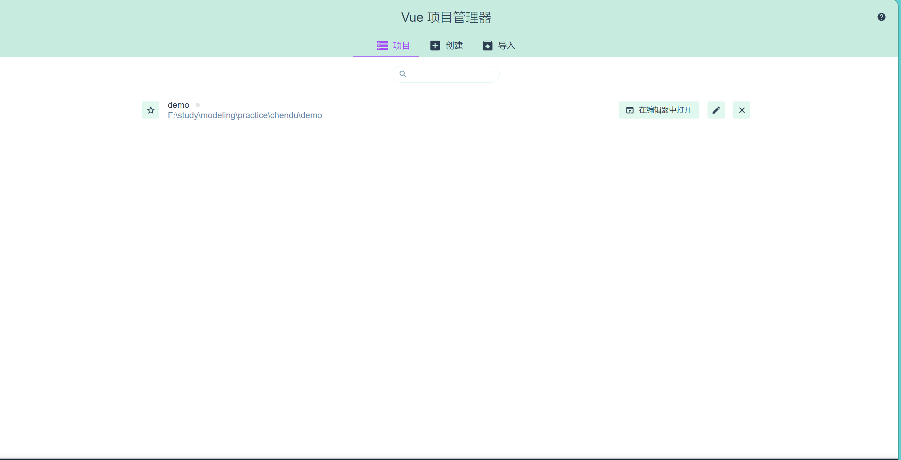

   - 小皮面板

     - 如果以及安装了MySQL即可省略这一步
     - 此处有点小坑，就是有的数据库安装之后可能会报`#1045`的错误，处理，可以参考我的博客
       - [数据库连接报#1045的错误](https://blog.csdn.net/qq_44891434/article/details/108920040)

   - 数据库可视化工具

     - 用户做数据调试
       - 在素材文件夹

### 3. 硬件环境配置

   - 硬件板子及其配件

     - NodeMCU开发版

       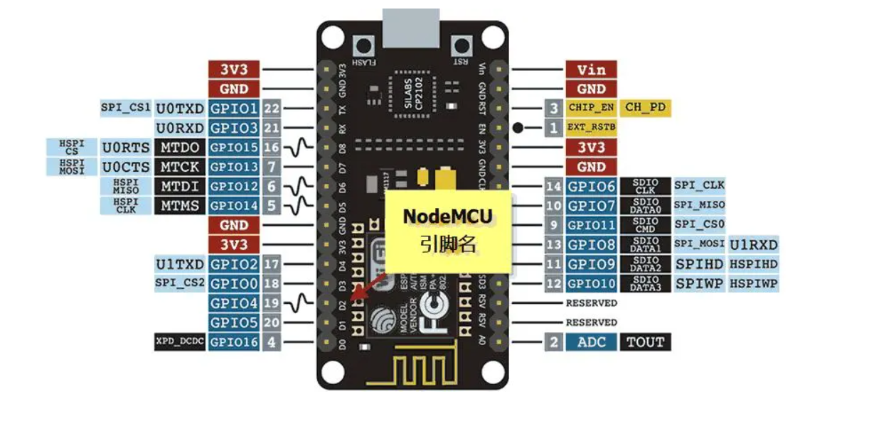

     - 还请购买一个继电器，或者发光二极管即可，课程中以继电器为例

   - 开发软件配置

     - Arduino IDE下载
     - [Arduino IDE下载地址](https://apps.microsoft.com/store/detail/arduino-ide/9NBLGGH4RSD8?hl=en-us&gl=us)


   1. 第1步需要做的就是下载相应的驱动 。比较简单的方法就是先在电脑下载一个**驱动精灵**类似的驱动软件 ，然后使用数据线将板子连接到电脑上 ，接着使用**驱动精灵**自动检测并安装所需要的驱动，然后进入设备管理器，查看是否安装完成，安装成功的话，结果类似如下所示：
      
        - 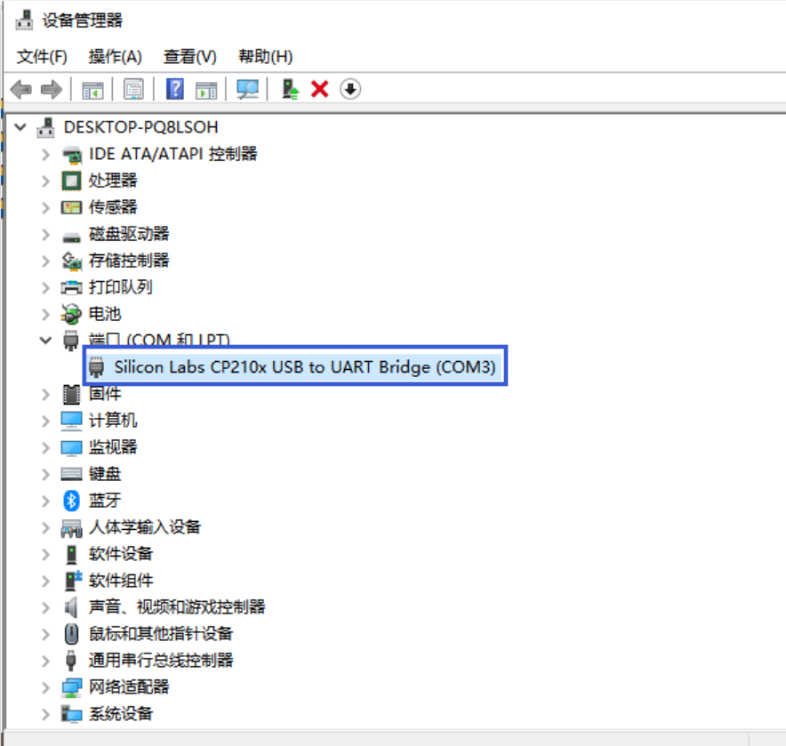
          
          2. 依次点击**文件|首选项**， 然后跳转到如下界面，将下面的附加开发版管理器网址设置为http://arduino.esp8266.com/stable/package_esp8266com_index.json：
        
        - 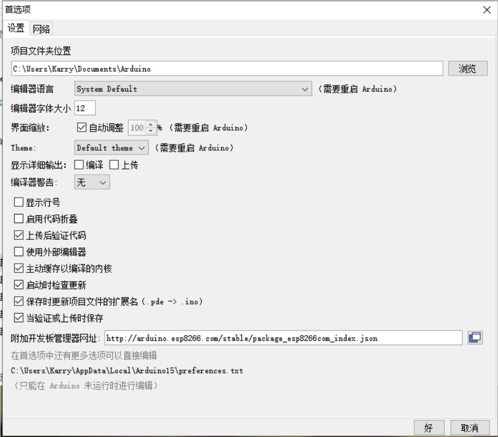
          
          3. 随后点击按钮“**好”**即可。再接着点击工具|开发板|开发板管理器，跳转到如下界面：
        
        - 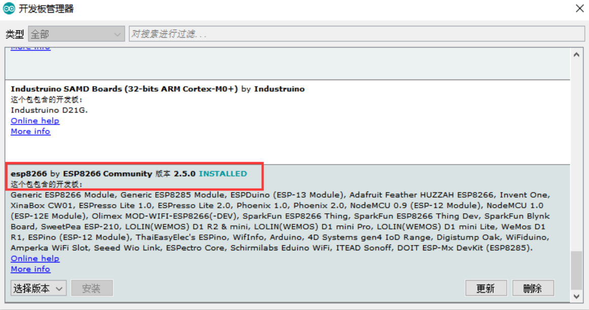
        - 然后找到如上所示的包， 再点击安装即可，因为我已安装，所以它显示已安装， 如果找不到这个开发包，那就试着检查一下地址有没有弄错，或者 重启Arduino并重新按照上面的步骤添加**附加开发版 管理器地址**。
        - 在下载过程中，如果非常缓慢的话，可以将我提供的这个包替换你的对应路径里面的Arduino15文件，如下所示，Karry是对应我自己的用户名，在替换的时候记得对应的找到你自己的路径。
        - 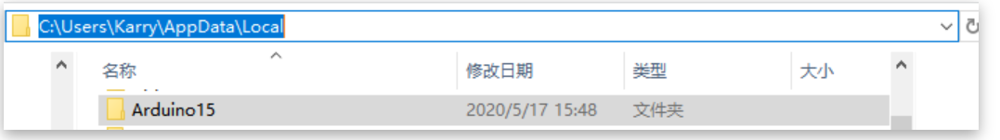
        - 替换成功后，不出意料的话， 你就可以在开发版中选择NodeMcu了，如下所示
        - 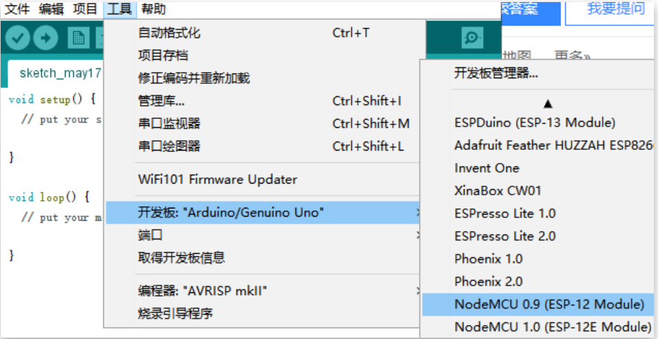
          
          4. 找一个例子跑一下，激动吧！开心吧！
          
        1. 串口通信
           
           - 主要功能是定时在串口打印信息。
           
           - ```c
             void setup() {
               // put your setup code here, to run once:
               Serial.begin(115200);
               delay(10);
               Serial.println();
               Serial.println();
               Serial.print("Connecting to ");
             }
             
             void loop() {
               // put your main code here, to run repeatedly:
               Serial.println("WiFi connected");
               delay(1000);
             }
             ```
           
           - Arduino的相关功能区如下， 下面将对其一一介绍：
           
           - 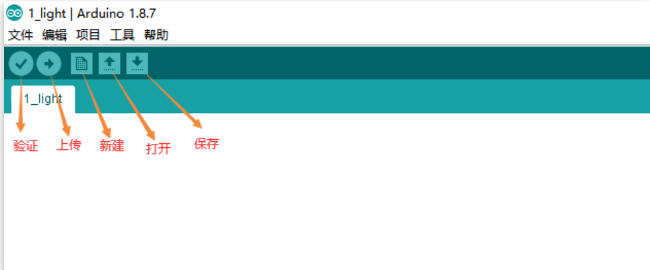
           
           - 标题
           
             - 验证： 类似于c语言中的编译；
             - 上传： 类似于c语言中的编译+运行；
             - 后面三个功能按钮就比较容易理解了，就不讲了。
             - 把以上代码直接复制到Ardunio中，点击**验证**，如果如下图所示，则成功上传到硬件：
           
           - 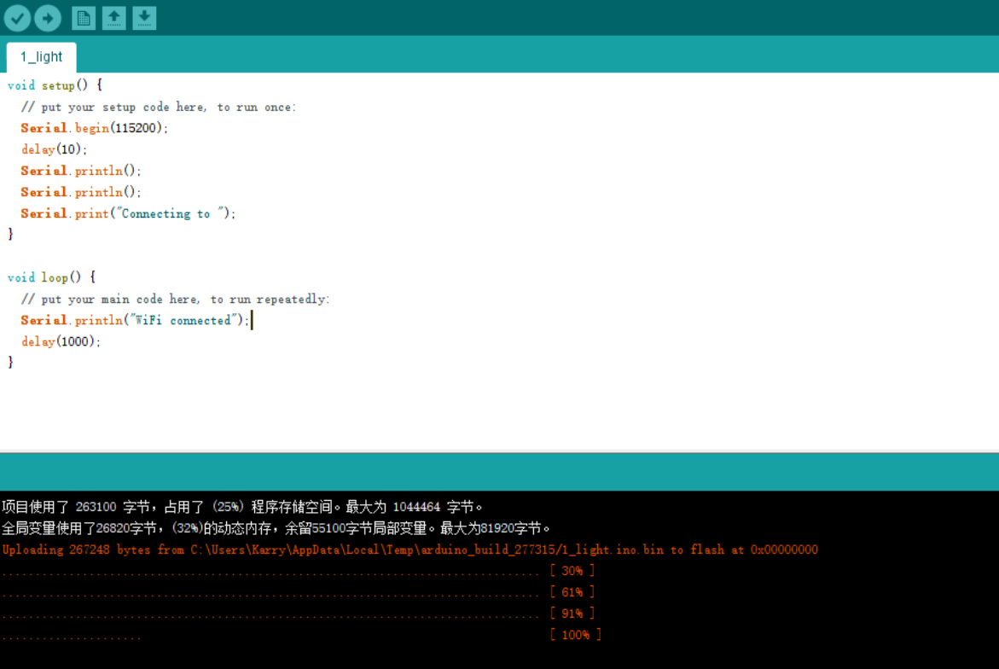
           
           - 按照如下操作即可看到打印的信息：
           
           - 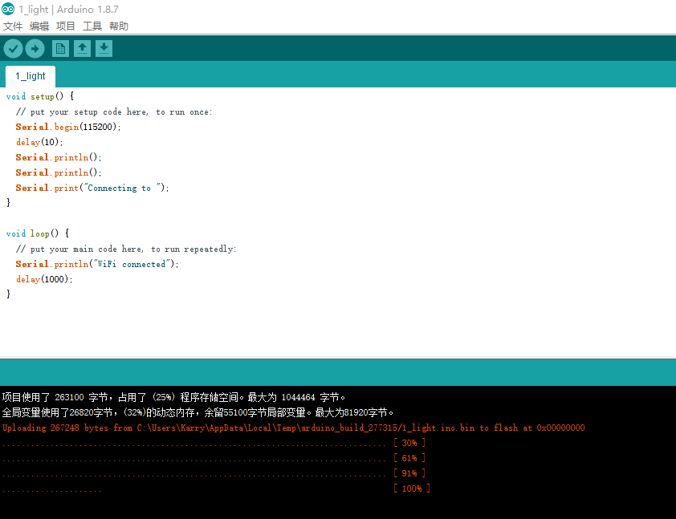

### 4. postman工具

+ [postman下载地址](https://www.postman.com/downloads/?utm_source=postman-home)

## 2. 项目创建
1. ### unity项目创建

   + 打开我们的unityhub
   + 点击新项目-选择3D-填写项目名称-确认
   + 注意点：记得选择2019的版本

2. ### vue项目

   + win+r 输入cmd
   + 再cmd中输入vue ui
   + 创建新项目
   + 具体步骤参考视频
   + 安装element-ui和axios后面会用到的

3. ### NodeJS项目创建

   + express.js的框架

   + 使用npm安装express

     + `npm install express `

   + 执行

     + `npm init`

   + 创建index.js

   + 测试案例(index.js)

     + ```js
       
       const express = require('express')
       const app = express()
       const port = 3000
       
       app.get('/', (req, res) => {
         res.send('Hello World!')
       })
       
       app.listen(port, () => {
         console.log(`Example app listening on port ${port}`)
       })
       ```

   + 用postman测试我们的接口是否正确，返回我们理想的值

## 3. QGIS和Blender

+ QGIS处理和修建我们的gis模型
+ Blender的话我们调整建筑的高度和路网的宽度

## 4. 项目上线

### 1. 购买云服务器

+ 阿里云、腾讯云、亚马逊云
+ 买最低配的就可以了
+ 服务器的系统的话我们选择Centos、Ubuntu

### 2. 宝塔界面

+ [宝塔面板官网](https://www.bt.cn/new/download.html)

+ **Centos安装脚本**
  + yum install -y wget && wget -O install.sh https://download.bt.cn/install/install_6.0.sh && sh install.sh ed8484bec
  
+ **Ubuntu/Deepin安装脚本**
  + wget -O install.sh https://download.bt.cn/install/install-ubuntu_6.0.sh && sudo bash install.sh ed8484bec

+ **Debian安装脚本**
  + wget -O install.sh https://download.bt.cn/install/install-ubuntu_6.0.sh && bash install.sh ed8484bec

+ **万能安装脚本**
  + if [ -f /usr/bin/curl ];then curl -sSO https://download.bt.cn/install/install_panel.sh;else wget -O install_panel.sh https://download.bt.cn/install/install_panel.sh;fi;bash install_panel.sh ed8484bec

+ **国产龙芯架构安装脚本****（其他CPU请勿使用）**
  + wget -O install_panel.sh https://download.bt.cn/install/0/loongarch64/loongarch64_install_panel.sh && bash install_panel.sh ed8484bec

### 3.配置服务器

+  设置我们的root密码
  + 在控制台右上角点击终端
  + 输入以下命令
    + `sudo passwd root`
+ 软件安装
  + Nginx 1.22.1
  + MySQL 5.7.41
  + PHP-8.1.13
  + nodejs版本管理
  + phpMyAdmin 
  + tomcat 8.5
  + PM2管理器
  + node版本14

### 4. 流程

+ 数据库配置
  + 添加数据库，信息应该和代码 `db.js`中的信息相对应，不要填错哦！小小一点啦！
  + 小细节
    + 就是有的小伙伴可能会遇见一个 `#1045` 的报错
    + [数据库报1045的error](https://blog.csdn.net/qq_44891434/article/details/108920040)
+ 建站
  + 点击添加网站
    + 域名——ip
    + 备注——按自己喜好，自己发挥
    + 根目录就是我们项目打包上传的目录——一定要写对哦（但是后期也是可以修改的）
    + FTP、数据库不要修改
    + **PHP版本——纯静态**
    + 网站分类——默认
  + 输入 `ip:80` ，如果出现建站成功，则表示我们胜利啦
    + 否则回顾我们的操作
+ WEBGL的部署过程
  + 第一种方法
    + 使用npm安装http-server
      + `npm install -g http-server`
  + 第二种方法
    + 使用小皮面板
    + 第一步解决80端口占用问题
      + 执行命令 `net stop w3svc`
    + 第二步，建站
      + 具体操作可以参考在宝塔界面的建站过程。  **大家这么聪明，必须拿下！**
  + **其他方法，只提供思路**
    + tomcat如何完成那
    + 在服务端如何搞定那
  
### 5. 前端项目打包上线
+ 修改相关代码

  + 修改IP

    + 改成自己的公网IP

  + 修改路由

    + **hash模式**  —— 开发环境

      + vue-router默认的是hash模式.
      + hash模式,是指url尾巴后的**#号**以及后面的字符.hash也被称为锚点,本身是用来做页面定位的.
      + hash虽然出现在url中,但不会被包括在http请求中,对后端完全没有影响,因此改变hash值不会重新加载页面.
      + hash值的变化不会导致浏览器向服务器发出请求,而hash改变会触发`hashchange`事件(只改变#后面的url片段);hash发生变化url都会被浏览器记录下来,从而可以使用浏览器的前进和后退
      + 对于hash模式会创建hashHistory对象,在访问不同的路由的时候,会发生两件事:
        + *HashHistory.push()将新的路由添加到浏览器访问的历史的栈顶,和HasHistory.replace()替换到当前栈顶的路由*

    + ### history模式——一般的生产环境

      + history模主要是通过`history` Api的`pushState()`和`replaceState()`两个方法来实现的.`pushState()`可以改变url地址且不会发送请求,`replaceState()`可以读取历史记录栈,还可以对浏览器记录进行修改

    + ##### history和hash的差异

      - history和hash都是利用浏览器的两种特性实现前端路由，history是利用浏览历史记录栈的API实现，hash是监听location对象hash值变化事件来实现
      - history的url没有’#'号，hash反之
      - history修改的url可以是同域的任意url，hash是同文档的url
      - 相同的url，history会触发添加到浏览器历史记录栈中，hash不会触发。

    + history和hash的优点和缺点
      - history比hash的url美观（没有’#'号）
      - history修改的url可以是同域的任意url，hash则只能是同文档的url
      - history模式往往需要后端支持，如果后端nginx没有覆盖路由地址，就会返回404，hash因为是同文档的url，即使后端没有覆盖路由地址，也不会返回404
      - hash模式下，如果把url作为参数传后端，那么后端会直接从’#‘号截断，只处理’#'号前的url，因此会存在#后的参数内容丢失的问题，不过这个问题hash模式下也有解决的方法

+ 使用 `npm run build` 打包项目

+ 上传打包好文件到建站的根目录两种方法

  + 拖动上传
  + 使用FTP工具上传

+ 测试

  + 浏览器属于  `公网IP` 
  
+ nginx配置文件

  + ```nginx
    
    server
        {
            listen 888;
            server_name phpmyadmin;
            index index.html index.htm index.php;
            root  /www/server/phpmyadmin;
    
            #error_page   404   /404.html;
            include enable-php.conf;
    
            location ~ .*\.(gif|jpg|jpeg|png|bmp|swf)$
            {
                expires      30d;
            }
    
            location ~ .*\.(js|css)?$
            {
                expires      12h;
            }
           location / {
          		try_files $uri $uri/ @router;
          		index index.html;
            }
            location @router {
            		rewrite ^.*$ /index.html last;
            } 
            location ~ /\.
            {
                deny all;
            }
    
            access_log  /www/wwwlogs/access.log;
        }
    ```


### 6. 服务端上线

+ 修改数据库相关的信息

+ 上传服务端代码文件两种方法

  + 拖动上传
  + 使用FTP工具上传

+ **先测试后用pm2包进行部署**

  + `在根目录下面执行node index.js 启动后端，进行测试`

  + **一定要等到没有任何报错信息再去部署**

+ 使用pm2包进行部署

  + 注意：如果[pm2](https://so.csdn.net/so/search?q=pm2&spm=1001.2101.3001.7020)服务偶尔崩溃，尝试以下方式：

    1、使用cluster集群模式，不用fork模式

    2、设置自动保存，如下：【此方式待验证】

    `pm2 set pm2:autodump true`

  + `pm2 ls   # 列表 PM2 启动的所有的应用程序`

  + `pm2 start bin/www     # 启动bin/www应用程序`

  + `pm2 start bin/www --watch   # 当文件变化时自动重启应用`

  > 注意：这个--watch一定要在第一次启动服务的时候指定才会有效！！！如果服务A已经启动了，但是第一次启动时没有监听，就算stop服务，再start服务并加上--watch，监听是不会生效的。此时最好先stop，再delete掉该A服务，然后重新start服务并加上--watch

  + **使用watch后，最好再设置一下自动保存：pm2 set pm2:autodump true**
  + `pm2 start bin/www --name="test" # 启动应用程序并命名为 "test"`
  + `pm2 start bin/www -i 4     # cluster mode 模式启动4个bin/www的应用实例。4个应用程序会自动进行负载均衡`
    + **注意：-i 0 不是启动0个示例的意思，而是表示当前电脑有几核就启动几个示例**
  + `pm2 scale www 3       # 把名字叫www的应用扩展到3个实例`
    + 注意：如果扩展前是fork模式，那么扩展后的所有也是fork模式，不会变成cluster模式
  + `pm2 show [app-name或者id]      # 显示应用程序的所有信息`
  + `pm2 monit   # 显示每个应用程序的CPU和内存占用情况.按键盘上下键切换`
  + `pm2 logs           # 显示所有应用程序的日志 `
  + `pm2 logs [app-name或id]      # 显示指定应用程序的日志`
  + `pm2 flush    #清空logs`
  + `pm2 save           # 保存当前应用列表`
  + `pm2 resurrect         # 重新加载保存的应用列表`
  + `pm2 update          # Save processes, kill PM2 and restore processes`
  + `pm2 serve 【path】【port】  #pm2搭建静态文件服务器`(**重点说一下**)
    +  path可用相对路径: . 或者 ./  。也可以指定绝对路径

+ 测试

## 5. C4D做模型材质填充和UV处理

C4D安装后打不开

**此目录下面D:\c4d\resource\libs\win64**

​	删除mesa文件夹即可

​	**解决安装完成之后不能打开软件的错误**

```tex
C4D软件中文插件素材C4D R23 22 21 支持WIN/MAC远程安装技术服务1.针对以前的版本：Ryzen现在暂不支持mesa所致。
简单说下解决方法，删除下面目录内的mesa文件夹即可（以防万一最好备份一下）
C:\Program Files\MAXON\CINEMA 4D R18\resource\libs\win64
R19之前才会有mesa文件夹。。所以装R21这个办法不适用！
2.尽量默认盘安装，安装路径要是全英文的。
```

+ 导入我们的模型
  + 直接拖进去就可以了l
+ 由于我们的模型比较大，所有要做如下调整：
  + **在工程设置、视图修剪——选择极大**
+ 将模型整合到一块（进行cv操作就可以了）
+ 新建材质球（建筑、水系、路网、绿地）
+ 材质旋转
  + **要打开纹理模式**，才会材质旋转哦！
  + 在导航栏左侧
+ 建筑渐变色
  + 材质-纹理-渐变
    + 选择-二维V
    + 标签-投射-柱状

## 6. unity对模型做进一步处理

+ [unity官方手册网址](https://docs.unity.cn/cn/2021.3/Manual/UnityManual.html)

+ [UnityWebRequest](https://docs.unity.cn/cn/2021.3/Manual/UnityWebRequest.html)
  
  + [UnityWebRequest_API](https://docs.unity.cn/cn/2021.3/ScriptReference/Networking.UnityWebRequest.html)
  + 后续做数据交互的根本
  
+ [unity其他版本下载网址](https://unity.cn/releases/lts/2018)
  
  + 建议大家选择 `LTS` 长期支持的稳定版本，不太建议选择 `beta` 版本
  
+ unity建模的相关注意点

  1. 天空盒子，素材中的左右是反的

  2. 光照的自动生成不建议打开，因为浪费性能

    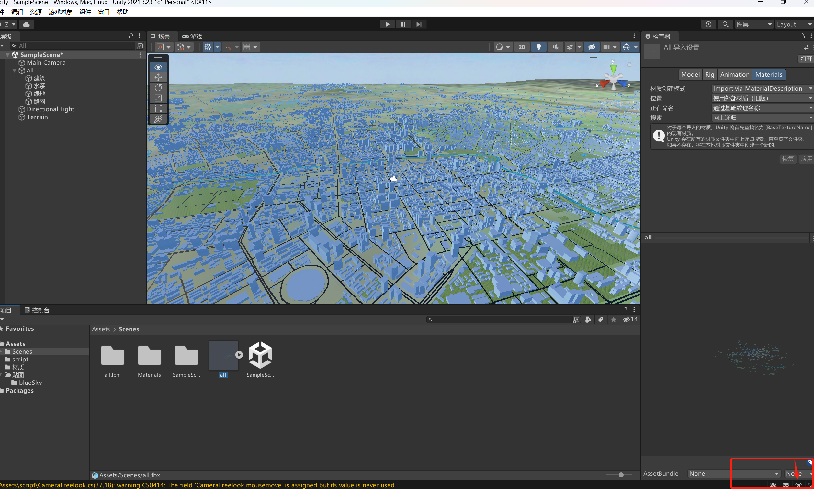

  3. unity中的脚本使用 C# 编写的

    + 这里的相机脚本有两个（再素材包）
      + CameraFreelook.cs
      + OrbitCamera.cs
    + 建议使用第一个
    + 大家如果其他需求，可以再源代码上进行修改，实现自己的需求

  4. 再导入我们的从c4D生成的模型，之后会出现模型材质消失，此时我们应该选择使用外部材质。

  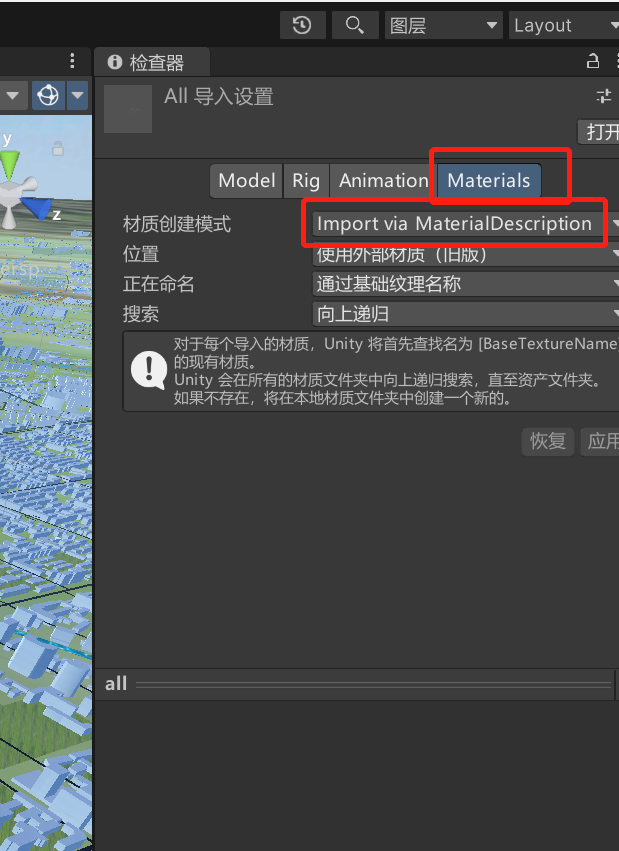

  

## 7. `web`端编写

  + [echarts官网地址](https://echarts.apache.org/examples/zh/index.html#chart-type-graphic)

  ### 7.1 前端知识总结

  + 三大件：HTML，CSS，JavaScript
  
  + HTML一些标签
  
    + h1,div,ul,li,p,body
  
  + CSS
  
  + JS
  
    + alert()
    
    + function(){}
    
    + 使用 **window.alert()** 弹出警告框。
    
    + 使用 **document.write()** 方法将内容写到 HTML 文档中。
    
    + 使用 **innerHTML** 写入到 HTML 元素。
    
    + 使用 **console.log()** 写入到浏览器的控制台。
    
    + JavaScript 内置函数 JSON.parse() 将字符串转换为 JavaScript 对象:
    
      + ```js
         var text = '{ "sites" : [' +
                    '{ "name":"Runoob" , "url":"www.runoob.com" },' +
                    '{ "name":"Google" , "url":"www.google.com" },' +
                    '{ "name":"Taobao" , "url":"www.taobao.com" } ]}';
          
                obj = JSON.parse(text);
                console.log(obj.sites[0].name)
        ```
    
    + JSON.stringify() 方法用于将 JavaScript 值转换为 JSON 字符串。
    
    + 定时器
    
      + ```
        setTimeout(function () {
                    console.log("First");
                }, 1000);
                setInterval(function (){
                    console.log(i++);
                },1000)
        ```
    
      + setTimeout:时间到了就会执行（**只有一次**）
    
      + setInterval：我们每隔1s就会执行一次
    
        + 我们要给它设置一个条件，去清除我们的定时器
    
    ### 7.2 vue页面布局
    
    + box-sizing:border-box属性，宽高会加上padding和border的值，需要我们手动去计算，减去padding和border的值，并调整content的值，以免超过给定的宽高
    + 此时子元素的宽高为500px（content 478px + padding 40px + border 4px）所以就覆盖了父元素的黑色背景，只能看到子元素的灰色背景
    + title --- height 7 vh
    + 
    + 满天星：https://blog.csdn.net/qq_44891434/article/details/113363626
    + 动态时间封装：https://blog.csdn.net/qq_44891434/article/details/115002709
    + 饼图1：https://blog.csdn.net/qq_44891434/article/details/118789359
    + 柱状：https://blog.csdn.net/qq_44891434/article/details/114631382
    + 折现：https://blog.csdn.net/qq_44891434/article/details/114631306
    + 饼图2：https://blog.csdn.net/qq_44891434/article/details/114631222

## webGL引入


webGL：启动方式（原理都是一样的）

+ 后端起的服务
+ Nginx
+ 阿里云
+ http-serve

> *vue-seamless-scroll*  —— 滚动的一个效果
>
> echarts 案例地址：https://echarts.apache.org/examples/zh/index.html#chart-type-line

## echarts引入案列

```vue
<template>
  <div style="width: 100%; height: 100%" id="barLeft"></div>
</template>

<script>
import echarts from "echarts";
export default {
  mounted() {
    this.drawLine();
  },
  methods: {
    drawLine() {
      let myChart = echarts.init(document.getElementById("barLeft"));
      var seriesData = [
        {
          name: "其他",
          value: "4208",
        },
        {
          name: "兰州",
          value: "2571",
        },
        {
          name: "全国",
          value: "9262",
        },
      ];
      var legendData = ["其他", "兰州", "全国"];
      var colorList = ["#73DDFF","#43BB2E", "#FDB36A"];
      var option = {
        // backgroundColor: "#000E63",
        tooltip: {
          trigger: "item",
          borderColor: "rgba(255,255,255,.3)",
          backgroundColor: "rgba(13,5,30,.6)",
          borderWidth: 1,
          padding: 5,
          formatter: function (parms) {
            var str =
              parms.marker +
              "" +
              parms.data.name +
              "</br>" +
              "数量：" +
              parms.data.value +
              "</br>" +
              "占比：" +
              parms.percent +
              "%";
            return str;
          },
        },
        grid: {
          left: "22%",
          top: "4%",
          bottom: "28%",
        },
        legend: {
          type: "scroll",
          orient: "horizontal",
          left: "27%",
          bottom: "0%",
          itemWidth: 10,
          itemHeight: 8,
          textStyle: {
            color: "#fff",
          },
          data: legendData,
        },
        series: [
          {
            type: "pie",
            z: 3,
            center: ["50%", "50%"],
            radius: ["30%", "55%"],
            clockwise: true,
            avoidLabelOverlap: true,
            hoverOffset: 5,
            itemStyle: {
              normal: {
                color: function (params) {
                  return colorList[params.dataIndex];
                },
              },
            },
            label: {
              show: false,
            },
            data: seriesData,
          },
        ],
      }
      myChart.setOption(option);
      //使用制定的配置项和数据显示图表
      myChart.setOption(option);
      function createExample(option, tooltipOption) {
        // 基于准备好的dom，初始化echarts图表
        // 为echarts对象加载数据
        tools.loopShowTooltip(myChart, option, tooltipOption); //第一个参数需要改一下
      }
      createExample(option, {
        loopSeries: true,
        // 间隔时间
        interval: 2000,
      });
    },
  },
};
</script>

```

## 前端请求封装

> 已经写好请调用

```js
import axios from 'axios'
import qs from 'qs'
import httpApi from './httpApi.js'
// const baseSrc = ""
function setUrl(src) {
  let url = httpApi.api.baseSrc + httpApi.api[src]
  return  encodeURI(url)
}

function setOutUrl(src) {
  let url = httpApi.api[src]
  return  encodeURI(url)
}
export default {
  install(Vue) {
    //get 请求
    Vue.prototype.GetAxios = function(src, params) {
      let url = setUrl(src) //设置url
      return new Promise((resolve, reject) => {
        axios.get(url, params)
          .then(response => {
            resolve(response);
          }, err => {
            reject(err);
          })
          .catch((error) => {
            reject(error)
          })
      })
    }
    Vue.prototype.GetJson = function(src, params){
      let url = setUrl(src) //设置url
      return new Promise((resolve,reject)=>{
        axios.request({
              url: url,
              method:"get",
              params: params,
              headers: {
                'Content-Type': "application/json; charset=utf-8"
              }
          }).then((ok)=>{
              resolve(ok)
          }).catch((err)=>{
              reject(err)
          })
      })
  }
    // formdata格式 post
    Vue.prototype.PostAxios = function(src, params) {
      let url = setUrl(src) //设置url
      return new Promise((resolve, reject) => {
        axios.post(url, qs.stringify(params))
          .then(response => {
            resolve(response);
          }, err => {
            reject(err);
          })
          .catch((error) => {
            reject(error)
          })
      })
    }
    // json格式 post
    Vue.prototype.PostJsonAxios = function(src, params) {
      let obj = setUrl(src) //设置url
      return new Promise((resolve, reject) => {
        axios({
            url: obj,
            method: 'post',
            data:params,
            headers: {
              'Content-Type': "application/json; charset=utf-8"
            },
          }).then(response => {
            resolve(response);
          }, err => {
            reject(err);
          })
          .catch((error) => {
            reject(error)
          })
      })
    }
    //接入第三方时的请求
    //get 请求
    Vue.prototype.GetOutAxios = function(src, params) {
      let url = setOutUrl(src) //设置url
      return new Promise((resolve, reject) => {
        axios.get(url, params)
          .then(response => {
            resolve(response);
          }, err => {
            reject(err);
          })
          .catch((error) => {
            reject(error)
          })
      })
    }
    Vue.prototype.GetOutJson = function(src, params){
      let url = setOutUrl(src) //设置url
      return new Promise((resolve,reject)=>{
        axios.request({
              url: url,
              method:"get",
              params: params,
              headers: {
                'Content-Type': "application/json; charset=utf-8"
              }
          }).then((ok)=>{
              resolve(ok)
          }).catch((err)=>{
              reject(err)
          })
      })
  }
    // formdata格式 post
    Vue.prototype.PostOutAxios = function(src, params) {
      let url = setOutUrl(src) //设置url
      return new Promise((resolve, reject) => {
        axios.post(url, qs.stringify(params))
          .then(response => {
            resolve(response);
          }, err => {
            reject(err);
          })
          .catch((error) => {
            reject(error)
          })
      })
    }
    // json格式 post
    Vue.prototype.PostOutJsonAxios = function(src, params) {
      let obj = setOutUrl(src) //设置url
      return new Promise((resolve, reject) => {
        axios({
            url: obj,
            method: 'post',
            data:params,
            headers: {
              'Content-Type': "application/json; charset=utf-8"
            },
          }).then(response => {
            resolve(response);
          }, err => {
            reject(err);
          })
          .catch((error) => {
            reject(error)
          })
      })
    }

  }
}


/* 请求拦截器 */
// let comloading = ''
// axios.interceptors.request.use(function(config) { // 每次请求时会从localStorage中获取token
//   var token = sessionStorage.getItem('token');
//   if (token) {
//     config.headers.common['token'] = [token];
//   }
//   return config
// }, function(error) {
//   return Promise.reject(error)
// })
// // 响应
// axios.interceptors.response.use(response => {
//   // if (response.status == 401) {
//   //   if (vm.$route.path != '/login') {
//   //     vm.$alert('登录异常，请重新登录', '提示', {
//   //       confirmButtonText: '确定',
//   //       callback: action => {
//   //         vm.$router.push('/login')
//   //       }
//   //     });
//   //   }
//   // }
//   console.log(response)
//   let data = response.data
//   if(data.data) {
//     data.data = JSON.parse(decrypt(data.data))
//   }
//   if(data.code !== 0) {
//     console.log(decrypt(data.message))
//     vm.$message.error(decrypt(data.message))
//     return
//   }else {
//     return data
//   }
// }, error => {
//   vm.$message.error('连接错误,请稍后再试')
//   console.log(error)
//   return Promise.resolve(error.response)
// },data => {
//   console.log(data)
// })

```

+ 引入：

  + 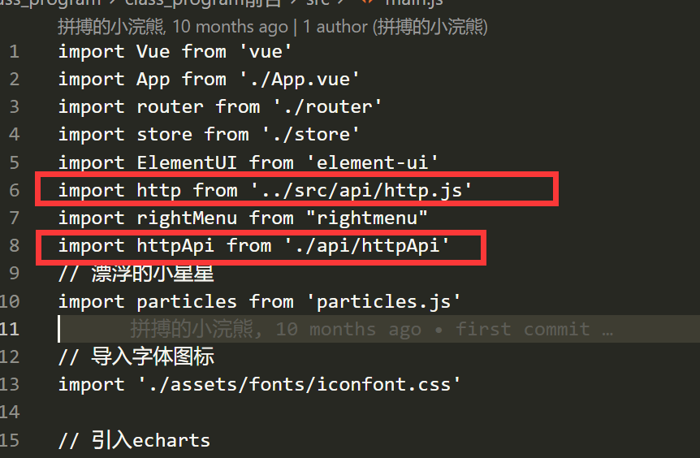

  + 调用案例：login

    + ```vue
      <template>
        <div class="login_container">
          <Stare/>
          <div class="login_box">
            <!-- 头像区域 -->
            <div class="avatar_box">
              
            </div>
            <!-- 登录表单区域 -->
            <el-form
              ref="loginFormRef"
              :model="loginForm"
              :rules="loginFormRules"
              label-width="0px"
              class="login_form"
            >
              <el-form-item label="" prop="Sphone">
                <el-input
                 placeholder="请输入电话号码"
                  v-model="loginForm.Sphone"
                  prefix-icon="iconfont icon-user"
                ></el-input>
              </el-form-item>
              <el-form-item label="" prop="Spassword">
                <el-input
                 placeholder="请输入密码"
                  v-model="loginForm.Spassword"
                  prefix-icon="iconfont icon-3702mima"
                  type="password"
                ></el-input>
              </el-form-item>
              <el-form-item label="" class="btns">
                <el-button type="primary" @click="login">账号登录</el-button>
                <el-button type="primary" @click="$router.push('/findFace')">人脸登录</el-button>
                <el-button type="info" @click="resetLoginForm">重置</el-button>
                 <el-link class="register" href="/register" type="primary">没有账号去注册</el-link>
              </el-form-item>
            </el-form>
          </div>
        </div>
      </template>
      
      <script>
      import Stare from '../../components/stare'
      export default {
        components:{
          Stare
        },
        data() {
          // 验证邮箱的手机
          var checkMbile = (rule, value, cb) => {
            const regMobile = /^((\+|00)86)?((134\d{4})|((13[0-3|5-9]|14[1|5-9]|15[0-9]|16[2|5|6|7]|17[0-8]|18[0-9]|19[0-2|5-9])\d{8}))$/;
            if (regMobile.test(value)) {
              return cb();
            }
            cb(new Error("请输入合法的手机号"));
          };
          return {
            loginForm: {
              Sphone: "",
              Spassword: "",
            },
            // 表单的验证规则对象
            loginFormRules: {
              // 用户名的表单验证
              Sphone: [
                { required: true, message: "请输入电话号码", trigger: "blur" },
                { validator: checkMbile, trigger: "blur" },
              ],
              // 密码的表单验证
              Spassword: [
                { required: true, message: "请输入登录密码", trigger: "blur" },
                { min: 6, max: 15, message: "长度在 6到 14 个字符", trigger: "blur" },
              ],
            },
          };
        },
        mounted() {
        },
        methods: {
          // 点击重置按钮，重置登录表单resetFields()
          resetLoginForm() {
            this.$refs.loginFormRef.resetFields();
          },
          login() {
            this.$refs.loginFormRef.validate((valid) => {
              // console.log(valid)
              // eslint-disable-next-line
              if (!valid) return;
              this.PostAxios("Login", this.loginForm).then((res)=>{
                console.log(res.data)
              if (res.data.flag != 1) {
                return this.$message.error(res.data.msg);
              } else {
                this.$message.success("登陆成功");
                // 1. 将登录成功之后的Token，保存到客户端的 sessionStorage中
                // 1.1 项目中出现了登录之外的其他API接口，必须的登录之后才能访问
                // 1.2 token只应在当前网站打开期间生效，所以将token 保存到sessionStorage中
                window.sessionStorage.setItem("token", res.data.token);
                window.sessionStorage.setItem("Sphone",this.loginForm.Sphone);
                // 2. 通过编程式导航跳转到后台主页，路由地址是 /home
                this.$router.push("/home");
              }
               })
            });
          },
        },
      };
      </script>
      
      <style  scoped>
      .login_container {
        width: 100vw;
        height: 100vh;
        background-color: #000E63;
      }
      .login_box {
        width: 450px;
        height: 300px;
        background-color: #1340B6;
        border-radius: 3px;
        position: absolute;
        left: 50%;
        top: 50%;
        transform: translate(-50%, -50%);
      }
      .avatar_box {
        height: 130px;
        width: 130px;
        border: 1px solid #004EFF;
        border-radius: 50%;
        padding: 10px;
        box-shadow: 0 0 10px #004EFF;
        position: absolute;
        left: 50%;
        transform: translate(-50%, -50%);
        background-color: #004EFF;
      }
      .avatar_box img {
        width: 100%;
        height: 100%;
        border-radius: 50%;
        background-color: #000E63;
      }
      .login_form {
        position: absolute;
        bottom: 0;
        width: 100%;
        padding: 0 20px;
        box-sizing: border-box;
      }
      .btns {
        display: flex;
        justify-content: flex-start;
      }
      .el-input{
        opacity: 0.9 ;
      }
      </style>
      
      ```

## 8. 服务端的开发

+ nodejs

+ mysql

+ 安装 `nodemon`

  + ```shell
    npm i -g nodemon
    ```

#### 8.1 解析我们的静态资源（WebGL）

```nodejs
const path = require("path")
app.use('/public',express.static(path.join(__dirname,"public")))
```

### 8.2 请求的封装

+ 请求路由 `/router/router.js`

  + ```js
    const express = require('express')
    const router = express.Router()
    const home = require('../api/home')
    
    // router.get('/', (req, res) => {
    //   res.send('Hello World!')
    // })
    router.get("/",home.main)
    
    module.exports = router
    ```

  + 记得在根目录的 `index.js`

    + ```js
      app.use(router);
      ```

+ 业务的编写封装

  + 目录：`\api\home.js`

  + ```js
    const db = require('../dbfile/db')
    const sql = require("../dbfile/sql")
    exports.main = (req,res) => {
        db.base(sql.daySql,null,(result)=>{
            res.send(result)
        })
    }
    ```

### 8.3 mysql配置及封装

+ mysq配置封装

  + 目录：`\dbfile\db.js`
+ mysql下载

  + `npm i mysql`
+ ```js
  const mysql = require('mysql')
   
  exports.base = (sql,data,callback) => {
      const connection = mysql.createConnection({
          host:'127.0.0.1',
          user:'root',
          password:'123456',
          database:'dtcity'
      });
      connection.connect();
      connection.query(sql,data,function(error,results,fields){
          if(error) throw error;
           callback(results,error);    
      })
      connection.end;
  }
  ```

+ sql语句的封装

  + 目录：`\dbfile\sql.js`

+ ```js
  exports.daySql = `select * from day`;
  ```

## 9. 硬件

+ 巴法云官网：https://cloud.bemfa.com/

+ 文档： https://cloud.bemfa.com/docs/#/

+ 数据交互简单的一个过程

  + 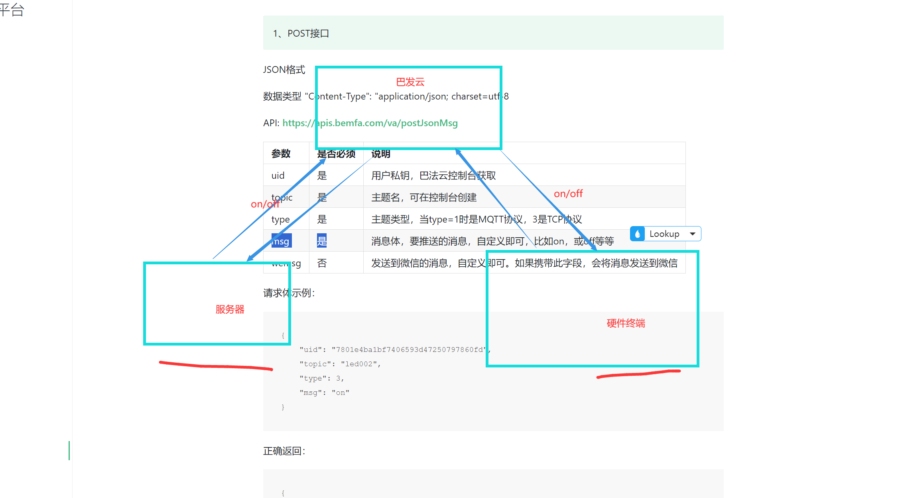

  + 继电器为例

    1. 服务端向巴法云平台发送请求，并携带我们的消息体
    2. 巴法云平台收到了请求，将对应的消息体的指令发送到我们主题对应的终端上面
    3. 最后我们的终端设备收到指令，并作出对应的行为，比如继电器的开和关

  + 后端请求代码示例

    + `/router/outWater.js`(因为源代码做了封装，所以这样写了，有问题私信)

      + ```js
        // 修改灯的状态
        router.post('/isOpenoutWaterMsg',outWater.isOpenoutWaterMsg)
        ```

    + `/api/outWater.js`(因为源代码做了封装，所以这样写了，有问题私信)

      + ```js
        // 修改灯的状态
        // on/off
        exports.isOpenoutWaterMsg= (req,res) => {
            let info = req.body;
            let sql = "update outWater set isOpen=? where id=?";
            let data = [info.isOPen,info.id];
            let params = {
                uid:'745e2d7bee3a553a3693dc150d3711cf',
                topic:'light001',
                type:3,
                msg:info.isOPen
            }
            console.log(params.msg)
            db.base(sql,data,(result) => {
                if(result.affectedRows >= 1){
                    axios({
                        method: "POST",
                        headers: { "Content-Type": "application/x-www-form-urlencoded" },
                        url: 'https://api.bemfa.com/api/device/v1/data/1/push/post/',
                        data: querystring.stringify(params),
                      }).then((msg)=>{
                        res.send(msg.data)
                        console.log(params)
                      })
                }else{
                    res.json({flag:2});
                }
            });
        
        }
        ```

+ 硬件代码

  + ```c
    #include <ESP8266WiFiMesh.h>
    #include <NetworkInfo.h>
    #include <TransmissionResult.h>
    #include <TypeConversionFunctions.h>
    
    #include <ESP8266WiFi.h>      // 本程序使用 ESP8266WiFi库
    #include <WiFiClient.h>
    #include <Servo.h>
    Servo myServo;  // 定义Servo对象来控制
    
    //巴法云服务器地址默认即可
    #define TCP_SERVER_ADDR "bemfa.com"
    //服务器端口，tcp创客云端口8344
    #define TCP_SERVER_PORT "8344" // 如果使用的是MQTT的话，将此处改为  9501即可
    
    //********************需要修改的部分*******************//
    
    #define DEFAULT_STASSID  "WIFI名称"     //WIFI名称，区分大小写，不要写错
    #define DEFAULT_STAPSW   "WIFI密码"  //WIFI密码
    String UID = "用户私钥";  //用户私钥，可在控制台获取,修改为自己的UID
    String TOPIC =   "主题1";         //主题名字，可在控制台新建
    String TOPIC1 =   "主题2";         //主题名字，可在控制台新建
    int LED_Pin = D2;              //单片机LED引脚值
    
    //**************************************************//
    
    
    int pos = 0;    // 角度存储变量
    
    
    
    //最大字节数
    #define MAX_PACKETSIZE 512
    //设置心跳值30s
    #define KEEPALIVEATIME 30*1000
    
    
    
    //tcp客户端相关初始化，默认即可
    WiFiClient TCPclient;
    String TcpClient_Buff = "";
    unsigned int TcpClient_BuffIndex = 0;
    unsigned long TcpClient_preTick = 0;
    unsigned long preHeartTick = 0;//心跳
    unsigned long preTCPStartTick = 0;//连接
    bool preTCPConnected = false;
    
    
    
    //相关函数初始化
    //连接WIFI
    void doWiFiTick();
    void startSTA();
    
    //TCP初始化连接
    void doTCPClientTick();
    void startTCPClient();
    void sendtoTCPServer(String p);
    
    //led 控制函数
    void turnOnLed();
    void turnOffLed();
    
    void openSwitch();
    void closSwitch();
    
    
    
    /*
      *发送数据到TCP服务器
     */
    void sendtoTCPServer(String p){
      
      if (!TCPclient.connected()) 
      {
    //    Serial.println("Client is not readly");
        return;
      }
      TCPclient.print(p);
    //  Serial.println("[Send to TCPServer]:String");
    //  Serial.println(p);
    }
    
    
    /*
      *初始化和服务器建立连接
    */
    void startTCPClient(){
      if(TCPclient.connect(TCP_SERVER_ADDR, atoi(TCP_SERVER_PORT))){
    //    Serial.print("\nConnected to server:");
    //    Serial.printf("%s:%d\r\n", TCP_SERVER_ADDR,atoi(TCP_SERVER_PORT));
        
        String tcpTemp="";  //初始化字符串
        String tcpTemp1="";  //初始化字符串
        tcpTemp = "cmd=1&uid="+UID+"&topic="+TOPIC+"\r\n"; //构建订阅指令
        tcpTemp1 = "cmd=1&uid="+UID+"&topic="+TOPIC1+"\r\n"; //构建订阅指令
        sendtoTCPServer(tcpTemp); //发送订阅指令
        sendtoTCPServer(tcpTemp1); //发送订阅指令
        tcpTemp="";//清空
        tcpTemp1="";//清空
        
        preTCPConnected = true;
        preHeartTick = millis();
        TCPclient.setNoDelay(true);
      }
      else{
    //    Serial.print("Failed connected to server:");
    //    Serial.println(TCP_SERVER_ADDR);
        TCPclient.stop();
        preTCPConnected = false;
      }
      preTCPStartTick = millis();
    }
    
    
    /*
      *检查数据，发送心跳
    */
    void doTCPClientTick(){
     //检查是否断开，断开后重连
       if(WiFi.status() != WL_CONNECTED) return;
    
      if (!TCPclient.connected()) {//断开重连
    
      if(preTCPConnected == true){
    
        preTCPConnected = false;
        preTCPStartTick = millis();
    //    Serial.println();
        TCPclient.stop();
      }
      else if(millis() - preTCPStartTick > 1*1000)//重新连接
        startTCPClient();
      }
      else
      {
        if (TCPclient.available()) {//收数据
          char c =TCPclient.read();
    //      Serial.println("--Keep alive:");
          TcpClient_Buff +=c;
          TcpClient_BuffIndex++;
          TcpClient_preTick = millis();
          
          if(TcpClient_BuffIndex>=MAX_PACKETSIZE - 1){
            TcpClient_BuffIndex = MAX_PACKETSIZE-2;
            TcpClient_preTick = TcpClient_preTick - 200;
          }
          preHeartTick = millis();
        }
        if(millis() - preHeartTick >= KEEPALIVEATIME){//保持心跳
          preHeartTick = millis();
    //      Serial.println("--Keep alive:");
          sendtoTCPServer("cmd=0&msg=keep\r\n");
        }
      }
      if((TcpClient_Buff.length() >= 1) && (millis() - TcpClient_preTick>=200))
      {//data ready
        TCPclient.flush();
    //    Serial.println("Buff");
        Serial.println(TcpClient_Buff);
        if((TcpClient_Buff.indexOf("&msg=on") > 0)) {
          if((TcpClient_Buff.indexOf("&topic=light002") > 0)){
            turnOnLed();
            }
          else if((TcpClient_Buff.indexOf("&topic=light001") > 0)){
            openSwitch();
            }
          
        }else if((TcpClient_Buff.indexOf("&msg=off") > 0)) {
           if((TcpClient_Buff.indexOf("&topic=light002") > 0)){
            turnOffLed();
            }
          else if((TcpClient_Buff.indexOf("&topic=light001") > 0)){
            closSwitch();
            }
        }
       TcpClient_Buff="";
       TcpClient_BuffIndex = 0;
      }
    }
    
    void startSTA(){
      WiFi.disconnect();
      WiFi.mode(WIFI_STA);
      WiFi.begin(DEFAULT_STASSID, DEFAULT_STAPSW);
    }
    
    
    
    /**************************************************************************
                                     WIFI
    ***************************************************************************/
    /*
      WiFiTick
      检查是否需要初始化WiFi
      检查WiFi是否连接上，若连接成功启动TCP Client
      控制指示灯
    */
    void doWiFiTick(){
      static bool startSTAFlag = false;
      static bool taskStarted = false;
      static uint32_t lastWiFiCheckTick = 0;
    
      if (!startSTAFlag) {
        startSTAFlag = true;
        startSTA();
        Serial.printf("Heap size:%d\r\n", ESP.getFreeHeap());
      }
    
      //未连接1s重连
      if ( WiFi.status() != WL_CONNECTED ) {
        if (millis() - lastWiFiCheckTick > 1000) {
          lastWiFiCheckTick = millis();
        }
      }
      //连接成功建立
      else {
        if (taskStarted == false) {
          taskStarted = true;
          Serial.print("\r\nGet IP Address: ");
          Serial.println(WiFi.localIP());
          startTCPClient();
        }
      }
    }
    //打开灯泡
    void turnOnLed(){
     Serial.println("Turn OFF");
     digitalWrite(LED_Pin,LOW);
      delay(1000);//延时1s
    }
    
    //打开开关
    void openSwitch(){
    for (pos = 90; pos <= 180; pos ++) { // 0°到180°
        // in steps of 1 degree
        myServo.write(pos);              // 舵机角度写入
        delay(15);                       // 等待转动到指定角度
      } 
      delay(2000);//延时2s
    }
    //关闭灯泡
    void turnOffLed(){
     Serial.println("Turn ON");
      digitalWrite(LED_Pin,HIGH);
      delay(1000);//延时1s 
    }
    //关闭开关
    void closSwitch(){
    for (pos = 180; pos >= 90; pos --) { // 从180°到0°
        myServo.write(pos);              // 舵机角度写入
        delay(15);                       // 等待转动到指定角度
      }
      delay(2000);//延时2s
    }
    
    // 初始化，相当于main 函数
    void setup() {
      Serial.begin(115200);
      myServo.attach(14); //D5   
      pinMode(LED_Pin,OUTPUT);
      digitalWrite(LED_Pin,HIGH);
      Serial.println("Beginning...");
    }
    
    //循环
    void loop() {
      doWiFiTick();
      doTCPClientTick();
    }
    
    ```

## unity如何调用数据接口

> unity官方文档→https://docs.unity3d.com/cn/2021.3/Manual/UnityWebRequest.html

+ `UnityWebRequest` 提供了一个模块化系统，用于构成 HTTP 请求和处理 HTTP 响应。***UnityWebRequest 系统的主要目标是让 Unity 游戏与 Web 浏览器后端进行交互***。该系统还支持高需求功能，例如分块 HTTP 请求、流式 POST/PUT 操作以及对 HTTP 标头和动词的完全控制。

> 其实在整个的模型当中思路就是前后端分离的数据交互思路。

### 架构

UnityWebRequest 生态系统将 HTTP 事务分解为三个不同的操作：

- 向服务器提供数据
- 从服务器接收数据
- HTTP 流量控制（例如，重定向和错误处理）

为了给高级用户提供更好的界面，这些操作均由自己的对象进行管理：

- `UploadHandler` 对象处理数据到服务器的传输
- `DownloadHandler` 对象处理从服务器接收的数据的接收、缓冲和后处理
- `UnityWebRequest` 对象管理其他两个对象，还处理 HTTP 流量控制。此对象是定义自定义标头和 URL 的位置，也是存储错误和重定向信息的位置。

### 从 HTTP 服务器检索文本或二进制数据 (GET)

|                                                              |
| :----------------------------------------------------------- |
| **Important**: UNet is a deprecated solution, and a new Multiplayer and Networking Solution (Netcode for GameObjects) is under development. For more information and next steps see the information on the [Unity Netcode for GameObjects website](https://docs-multiplayer.unity3d.com/). |

要从标准 HTTP 或 HTTPS Web 服务器检索简单数据（比如文本数据或二进制数据），请使用 `UnityWebRequest.GET` 调用。此函数将单个字符串作为参数，字符串用于指定从中检索数据的 URL。

此函数类似于标准 WWW 构造函数：

```
WWW myWww = new WWW("https://www.myserver.com/foo.txt");
// ... 类似于 ...
UnityWebRequest myWr = UnityWebRequest.Get("https://www.myserver.com/foo.txt");
```

### 详细信息

- 此函数将创建 `UnityWebRequest` 并将目标 URL 设置为字符串参数。此函数不会设置任何其他自定义标志或标头。
- 默认情况下，此函数将标准 `DownloadHandlerBuffer` 附加到 `UnityWebRequest`。此处理程序可缓冲从服务器接收的数据，并在请求完成时将数据提供给脚本。
- 默认情况下，此函数不会将任何 `UploadHandler` 附加到 `UnityWebRequest`。如果需要，可以手动附加。

### 示例

```c#
using UnityEngine;
using System.Collections;
using UnityEngine.Networking;
 
public class MyBehaviour : MonoBehaviour {
    void Start() {
        StartCoroutine(GetText());
    }
 
    IEnumerator GetText() {
        UnityWebRequest www = UnityWebRequest.Get("https://www.my-server.com");
        yield return www.SendWebRequest();
 
        if (www.result != UnityWebRequest.Result.Success) {
            Debug.Log(www.error);
        }
        else {
            // 以文本形式显示结果
            Debug.Log(www.downloadHandler.text);
 
            // 或者获取二进制数据形式的结果
            byte[] results = www.downloadHandler.data;
        }
    }
}
```

  项目代码

```c#
using UnityEngine;
using System.Collections;
using System.Collections.Generic;
using UnityEngine.Networking;
using Newtonsoft.Json;
using Newtonsoft.Json.Linq;

public class http : MonoBehaviour
{
    public float speed = 0.1f;

    //private int degree;
    public string rssTitle;
    public GameObject LightObj;
    public Light LightCon;
    void Start()
    {
        //StartCoroutine(GetTexture());
        LightCon = LightObj.GetComponent<Light>();
        InvokeRepeating("doSomething", 0, 2);
    }
    // void Update()
    // {
    //     // Debug.Log(rssTitle);
    //     StartCoroutine(GetTexture());
        
    // }
    void doSomething()
    {
       StartCoroutine(GetTexture());
    }
    IEnumerator GetTexture()
    {
       
        UnityWebRequest www = UnityWebRequest.Get("http://127.0.0.1:3000/day");
        yield return www.SendWebRequest();
        if (www.isNetworkError || www.isHttpError)
        {
            Debug.Log(www.error);
        }
        else
        {
            // 将结果显示为文本
            string product = www.downloadHandler.text;
            //JObject ob = (JObject)JsonConvert.DeserializeObject(product);
            JObject rss = JObject.Parse(product);
            rssTitle = (string)rss["result"][0]["day"];
            if (rssTitle == "1")
            {
                //degree = Random.Range(0, 360);
                //gameObject.transform.Rotate(180,360, 0, 0);
                //gameObject.transform.Rotate(-speed * Time.deltaTime, 0, 0);
                LightCon.enabled = false;
                 Debug.Log("1");
            }
            if (rssTitle == "0")
            {
                LightCon.enabled = true;
                Debug.Log("0");
            }
            // 或者以二进制数据格式检索结果
            byte[] results = www.downloadHandler.data;
        }
    }
}
```

## 这个项目中设计的技术我们还能做什么

+ 数字孪生——数化和互动
+ 可视化大屏
+ 前端开发
  + `vue  html  css vue node echatrs……`
+ 游戏
+ 后端开发
+ 嵌入式

……


  
