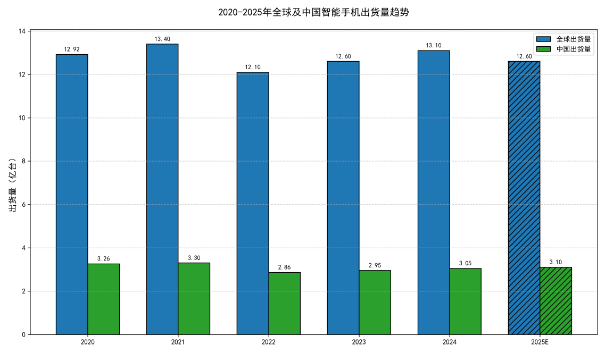
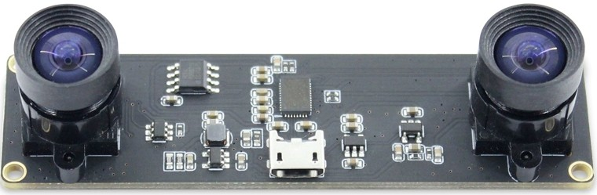

## `“最常用的设备，才是最好的信息来源。”`
### 引言

+  随着智能手机硬件性能的不断提升，安卓平台已逐渐成为集成计算机视觉与人工智能应用的重要载体。双目立体视觉作为一种通过两路摄像头视差恢复场景深度信息的技术，具有成本低、实现简单等优势，在三维重建、增强现实和移动机器人等领域具有广泛应用前景。将双目视觉移植到安卓手机，不仅能够利用其便携性与实时计算能力实现低成本的三维感知，还为移动端的智能交互和创新应用提供了新的可能性。随着智能手机的快速发展，当下智能手机的普及率是非常的高了，如下图为2015-2025年全球智能手机出货量，因此采用智能手机作为双目视觉的实现载体是有必要性的。

### 实验过程

+ 本实验就安卓手机如何实现双目立体视觉展开研究，并做出了初步的方案如下：
	+ 首先，实验设备——安卓手机一个、双目摄像头一个（如下图）、笔记本电脑或者台式机电脑一台。

+ 其次，使用Android Studio开发对应的双目相机控制程序，如下图为本实验开发的安卓APP。
+ 如下图所示，APP界面为双目相机的拍照界面，可实现双目图像采集并保存至本地相册；“普通上传”功能会将双目视图拼接后上传至服务器；“双目上传”则以上下或左右相机视图的形式分别上传并保存至服务器对应文件中，同时也包含“普通上传”的功能。IP扫描功能可快速检测局域网内服务器的“3000”端口，自动锁定服务器IP并实现无线传输；在项目上线并具备公网IP后，该步骤可省略，实现跨网络的远程上传，目前主要用于局域网环境下的便捷传输。

+ 
+ 如下图APP界面可以以视频的方式采集双目相机图像，并保存到手机当中。
	+ 

+ 最后就是我们的后端服务搭建——搭建图片上传服务器，用来接收不同的图像上传。这一块后面可以看具体的视频介绍。
### 总结
+ 本节主要介绍利用智能手机采集双目图像的方法。随着人工智能与大数据的快速发展，数据的价值呈指数级提升。通过采用最简便的方式与最普及的设备——智能手机，我们不仅能够高效获取双目图像，还能构建具有应用价值的双目数据库，为后续的算法研究与优化提供有力支持。

> 最后大家如果有任何问题都可以关注公众号**“拼搏的小浣熊”**，公众号当中有我的**个人联系方式**，欢迎一起交流学习。
> 如果需要相关源码也可以在公众号获取我的个人联系方式，添加我获取所有源码。

> 开发耗时**“3个月”**。