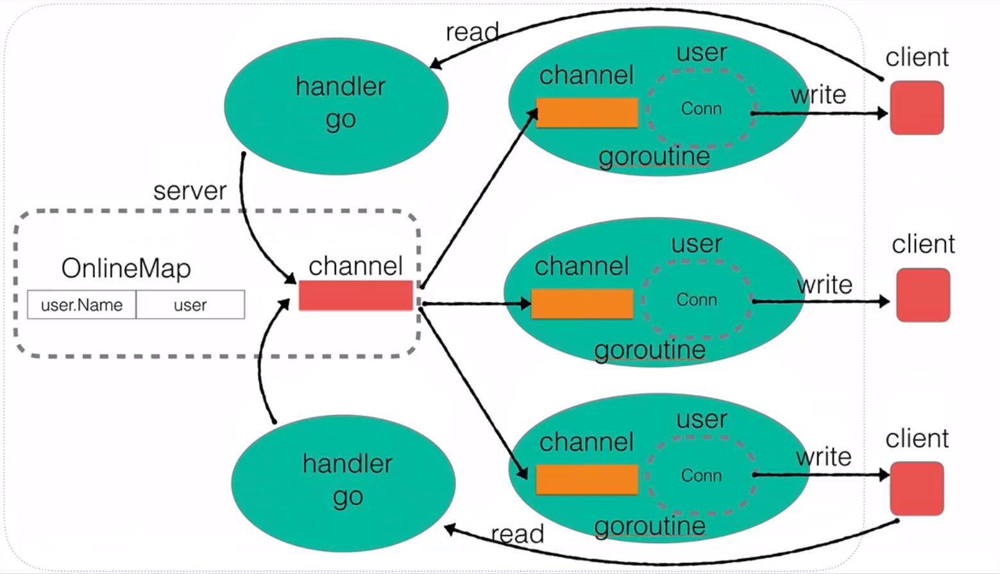

## 项目简介 [代码仓库地址](https://github.com/zjxWeb/instantMesg.git)

> 项目架构



> **构建基础server   用户上线功能   用户消息广播机制   用户业务层封装  在线用户查询  修改用户名  超时强踢功能  私聊功能  客户端实现**

## 构建基础server

> 程序入口`main.go`

```go
package main

import (
	"net"
	"fmt"
)

type Server struct {
	Ip string
	Port int
}

// 创建一个server接口
func NewServer(ip string, port int) *Server {
	server := &Server{
		Ip: ip,
		Port: port,
	}
	return server
}
func (this *Server) Hander(conn net.Conn){
	// ...当前链接业务
	fmt.Println("连接建立成功")
}

// 启动服务器的接口
func (this *Server) Start() {
	// socket listen
	listen, err := net.Listen("tcp", fmt.Sprintf("%s:%d", this.Ip, this.Port))
	if err!= nil {
		fmt.Println("listen error:",err)
		return
	}
	// close listen socket
	defer listen.Close()
	
	for{
		// accept
		conn, err := listen.Accept()
		if err!= nil {
			fmt.Println("accept error:",err)
			continue
		}
		// do hander
		go this.Hander(conn)
	}

}
```

> `server.go`

```go
package main

func main() {
    server := NewServer("127.0.0.1", 8080)
    server.Start()
}
```

> 编译

```bash
# windows
go build -o server.exe main.go .\server.go
# linux
go build -o server main.go .\server.go
```

  