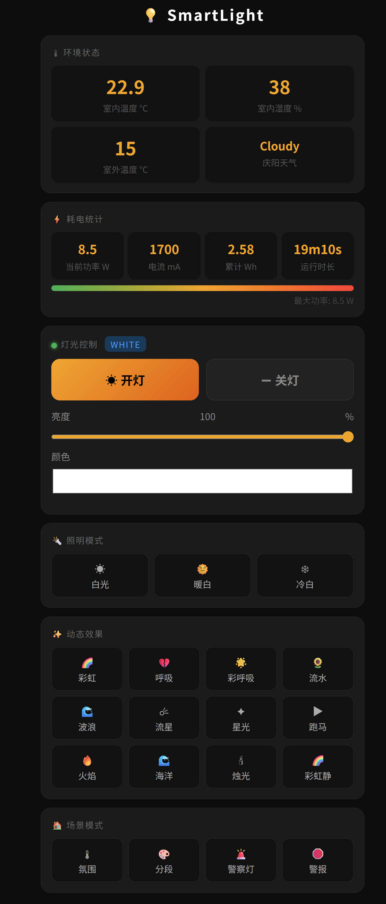

## 【第一期】小度低成本智能小灯，超简单，一起看看，改造一下

> 低成本做一个小度智能小灯，还可以看温湿度哦。

<iframe src="https://www.bilibili.com/video/BV1j2WyzAEUL/?vd_source=97f1d2f43cfb254aee6535dca8f8f4ee#reply115406693991686" scrolling="no" border="0" frameborder="no" framespacing="0" allowfullscreen="true" style="height:80vh;"> </iframe> 

+ 上面的视频为具体的功能实现，大家可以在B站进行观看。

> **硬件烧录可以点击**[此链接](/projectPractice/digitalTwinsProject/smartCity/)

### 源码

```c++
#include <ESP8266WiFi.h>
#include <SimpleDHT.h>
#include <Adafruit_GFX.h>
#include <Adafruit_SSD1306.h>

//------------------ OLED 屏幕配置 ------------------
#define SCREEN_WIDTH 128
#define SCREEN_HEIGHT 64
#define OLED_RESET -1
Adafruit_SSD1306 display(SCREEN_WIDTH, SCREEN_HEIGHT, &Wire, OLED_RESET);

//------------------ WiFi 和 巴法云配置 ------------------
#define TCP_SERVER_ADDR "bemfa.com"
#define TCP_SERVER_PORT "8344"
#define WIFI_SSID "CMCC-5Xkw"
#define WIFI_PASS "ghmffu66"

//------------------ 巴法云主题 ------------------
String UID = "注册巴法云后可以看到了！";
String TOPIC_DHT = "10004";    // 温湿度主题
String TOPIC_RELAY = "10001"; // 继电器控制主题

//------------------ DHT11 配置 ------------------
const int DHT_PIN = D2;
SimpleDHT11 dht11(DHT_PIN);

//------------------ I2C引脚定义 ------------------
#define SDA_PIN D3
#define SCL_PIN D4

//------------------ 继电器配置 ------------------
#define RELAY_PIN D1
bool relayState = false; // 当前继电器状态（false=关, true=开）

//------------------ 定时参数 ------------------
#define UPDATE_INTERVAL 2000 // 2秒更新一次
#define MAX_PACKETSIZE 512

WiFiClient TCPclient;
String TcpClient_Buff = "";
unsigned int TcpClient_BuffIndex = 0;
unsigned long lastUpdateTick = 0;
unsigned long preHeartTick = 0;
unsigned long preTCPStartTick = 0;
bool preTCPConnected = false;

//------------------ 函数声明 ------------------
void startWiFi();
void doWiFiTick();
void startTCPClient();
void doTCPClientTick();
void sendToServer(String p);
void updateDisplay(byte temperature, byte humidity);
void initOLED();
void handleTCPMessage(String msg);
void controlRelay(bool state);

//------------------ 初始化 OLED ------------------
void initOLED() {
  if (!display.begin(SSD1306_SWITCHCAPVCC, 0x3C)) {
    Serial.println(F("OLED 初始化失败"));
    for (;;);
  }
  display.clearDisplay();
  display.setTextSize(2);
  display.setTextColor(SSD1306_WHITE);
  display.setCursor(10, 20);
  display.println("Starting...");
  display.display();
  delay(1500);
  display.clearDisplay();
}

//------------------ 更新OLED显示 ------------------
void updateDisplay(byte temperature, byte humidity) {
  display.clearDisplay();

  // 温度
  display.setTextSize(2);
  display.setTextColor(SSD1306_WHITE);
  display.setCursor(0, 0);
  display.print("T: ");
  display.print(temperature);
  display.println("C");

  // 湿度
  display.setCursor(0, 30);
  display.print("H: ");
  display.print(humidity);
  display.println("%");

  // 状态栏
  display.setTextSize(1);
  display.setCursor(0, 55);
  display.print(WiFi.status() == WL_CONNECTED ? "WiFi OK " : "WiFi...");
  display.print(preTCPConnected ? " | TCP OK" : " | TCP...");
  display.display();
}

//------------------ 控制继电器 ------------------
// 假设为低电平触发：LOW=开, HIGH=关
void controlRelay(bool state) {
  relayState = state;
  digitalWrite(RELAY_PIN, relayState ? LOW : HIGH); // 低电平触发
  Serial.println(relayState ? "🔌 继电器：开启" : "⚡ 继电器：关闭");
}

//------------------ 发送数据到巴法云 ------------------
void sendToServer(String p) {
  if (!TCPclient.connected()) {
    Serial.println("TCP未连接，无法发送");
    return;
  }
  TCPclient.print(p);
  Serial.println("[发送] => " + p);
}

//------------------ 建立TCP连接 ------------------
void startTCPClient() {
  Serial.println("尝试连接巴法云...");
  if (TCPclient.connect(TCP_SERVER_ADDR, atoi(TCP_SERVER_PORT))) {
    Serial.println("连接成功！");
    // 订阅温湿度主题
    String subStr = "cmd=1&uid=" + UID + "&topic=" + TOPIC_DHT + "\r\n";
    sendToServer(subStr);
    // 订阅继电器主题
    subStr = "cmd=1&uid=" + UID + "&topic=" + TOPIC_RELAY + "\r\n";
    sendToServer(subStr);

    preTCPConnected = true;
    preHeartTick = millis();
    TCPclient.setNoDelay(true);
  } else {
    Serial.println("连接失败，重试中...");
    TCPclient.stop();
    preTCPConnected = false;
  }
  preTCPStartTick = millis();
}

//------------------ WiFi连接 ------------------
void startWiFi() {
  WiFi.mode(WIFI_STA);
  WiFi.begin(WIFI_SSID, WIFI_PASS);
  Serial.println("正在连接WiFi...");
}

//------------------ WiFi状态检查 ------------------
void doWiFiTick() {
  static bool startSTAFlag = false;
  static bool tcpStarted = false;

  if (!startSTAFlag) {
    startWiFi();
    startSTAFlag = true;
  }

  if (WiFi.status() == WL_CONNECTED) {
    if (!tcpStarted) {
      Serial.print("WiFi已连接，IP地址：");
      Serial.println(WiFi.localIP());
      startTCPClient();
      tcpStarted = true;
    }
  } else {
    tcpStarted = false;
  }
}

//------------------ 解析巴法云消息 ------------------
void handleTCPMessage(String msg) {
  msg.trim();
  Serial.println("[收到] => " + msg);

  // 检测是否为继电器主题
  if (msg.indexOf(TOPIC_RELAY) != -1) {
    if (msg.indexOf("on") != -1) {
      controlRelay(true);
    } else if (msg.indexOf("off") != -1) {
      controlRelay(false);
    }
  }
}

//------------------ TCP通信检查与数据上报 ------------------
void doTCPClientTick() {
  if (WiFi.status() != WL_CONNECTED) return;

  if (!TCPclient.connected()) {
    if (preTCPConnected) {
      preTCPConnected = false;
      TCPclient.stop();
      Serial.println("TCP断开，尝试重连...");
      preTCPStartTick = millis();
    } else if (millis() - preTCPStartTick > 1000) {
      startTCPClient();
    }
  } else {
    // 接收服务器消息
    while (TCPclient.available()) {
      char c = TCPclient.read();
      if (TcpClient_BuffIndex < MAX_PACKETSIZE) {
        TcpClient_Buff += c;
        TcpClient_BuffIndex++;
      }
      if (c == '\n') {
        handleTCPMessage(TcpClient_Buff);
        TcpClient_Buff = "";
        TcpClient_BuffIndex = 0;
      }
    }

    // 定时上报温湿度
    if (millis() - lastUpdateTick >= UPDATE_INTERVAL) {
      lastUpdateTick = millis();
      byte temperature = 0;
      byte humidity = 0;
      if (dht11.read(&temperature, &humidity, NULL) == SimpleDHTErrSuccess) {
        String payload = "cmd=2&uid=" + UID + "&topic=" + TOPIC_DHT +
                         "&msg=#" + String(temperature) + "#" + String(humidity) + "#"
                         + (relayState ? "on" : "off") + "#\r\n";
        sendToServer(payload);
        updateDisplay(temperature, humidity);
      } else {
        Serial.println("读取DHT11失败");
      }
    }
  }
}

//------------------ setup 初始化 ------------------
void setup() {
  Serial.begin(115200);
  Wire.begin(SDA_PIN, SCL_PIN);
  pinMode(RELAY_PIN, OUTPUT);
  digitalWrite(RELAY_PIN, HIGH); // 默认关闭继电器（高电平）
  controlRelay(false); // 同步状态
  initOLED();
  startWiFi();
}

//------------------ 主循环 ------------------
void loop() {
  doWiFiTick();
  doTCPClientTick();
}
```

## 【第二期】SmartLight 智能灯控系统

>  基于 NodeMCU (ESP8266) 的智能 RGB 灯控系统，支持网页控制、语音控制、天气显示、温湿度监测、OTA 远程升级。

---

## 硬件清单

| 硬件 | 规格 | 参考价格 |
|------|------|----------|
| NodeMCU v3 | ESP8266，CP2102 芯片 | ¥12 |
| WS2812B 灯带 | 30颗，5V，1m | ¥15 |
| DHT11 | 温湿度传感器 | ¥3 |
| 0.96寸 OLED | SSD1306，I2C，128×64 | ¥8 |
| 手机快充线（USB-A） | 线径粗，建议标注 5A | 旧线替代 |
| 5V 2A+ 充电头 | 为整个系统供电 | ¥0（旧充电头） |
| 杜邦线若干 | 公对母 | ¥3 |
| **合计** | | **约 ¥41** |

### 关于供电

本项目使用一根 USB 线同时为 NodeMCU 和 WS2812B 灯带供电：

```
充电头（5V 2A+）
    │
    └── USB线 ──→ NodeMCU USB口（板载稳压给自身和OLED/DHT11）
                      │
                      └── VIN/GND 引脚 ──→ WS2812B 灯带
```

**注意事项：**
- 必须使用手机快充线或标注 5A 的线，普通细USB线内阻大，大电流下压降明显会导致颜色偏色或 NodeMCU 重启
- 充电头建议 2A 以上，3A 更稳定
- 30颗 WS2812B 全亮白色峰值约 1.8A，加 NodeMCU 约 80mA，总计接近 2A
- 代码中已限制最大亮度（`LED_MAX_BRIGHTNESS`），实际电流约 1A，普通快充线可以承受
- 长时间使用注意检查线材是否发热

---

## 接线方式

```
NodeMCU 引脚      连接目标
─────────────────────────────────────────
3.3V         →   DHT11 VCC（1号脚）
GND          →   DHT11 GND（4号脚）
D7 (GPIO13)  →   DHT11 DATA（2号脚）
                 （DATA脚与VCC之间接 10kΩ 上拉电阻，可选但推荐）

D5 (GPIO14)  →   WS2812B DIN（数据输入端）
5V 引脚      →   WS2812B VIN（红线）
GND          →   WS2812B GND（白/黑线）

D1 (GPIO5)   →   OLED SCL
D2 (GPIO4)   →   OLED SDA
3.3V         →   OLED VCC
GND          →   OLED GND
```

> WS2812B 必须与 NodeMCU **共地**（GND 连在一起），否则数据信号不稳定导致灯光乱闪。

接线示意图：

```
  [充电头 5V]
       │
  [USB线]
       │
  ┌────┴────────────────────────────┐
  │          NodeMCU v3             │
  │  USB ──── 板载供电              │
  │                                 │
  │  D4 ──────────────── DHT11 DATA │◄── 3V3 
  │  D5 ──────────────── WS2812B DIN│
  │  D1 ──────────────── OLED SCL   │
  │  D2 ──────────────── OLED SDA   │
  │  3V3 ─┬──────────── DHT11 VCC  │
  │        └──────────── OLED VCC   │
  │  5V  ─────────────── WS2812B 5V │
  │  GND ─┬──────────── DHT11 GND  │
  │        ├──────────── OLED GND   │
  │        └──────────── WS2812B GND│
  └─────────────────────────────────┘
```

DHT11 引脚说明（正面朝向自己，从左到右）：

```
  ┌──────┐
  │ DHT11│
  └──────┘
   1  2  3  4
   │  │     │
  VCC DATA  GND
```

---

## 软件依赖

### Arduino IDE 设置

1. 打开 `文件 → 首选项`，在"附加开发板管理器网址"中添加：
   ```
   https://arduino.esp8266.com/stable/package_esp8266com_index.json
   ```
2. `工具 → 开发板 → 开发板管理器`，搜索 `ESP8266`，安装 `ESP8266 by ESP8266 Community`
3. 选择开发板：`工具 → 开发板 → NodeMCU 1.0 (ESP-12E Module)`
4. Flash Size 选择：`4MB (FS:2MB OTA:~1019KB)`

### 依赖库（库管理器安装）

`工具 → 管理库` 搜索安装：

| 库名 | 作者 | 说明 |
|------|------|------|
| PubSubClient | Nick O'Leary | MQTT 通信 |
| Adafruit SSD1306 | Adafruit | OLED 驱动 |
| Adafruit GFX Library | Adafruit | 图形库（SSD1306依赖） |
| Adafruit NeoPixel | Adafruit | WS2812B 驱动 |
| DHT sensor library | Adafruit | DHT11 驱动 |
| ArduinoJson | Benoit Blanchon | JSON 解析 |
| NTPClient | Fabrice Weinberg | 网络时间 |

> 安装 Adafruit SSD1306 时会提示安装依赖，选"全部安装"。

---

## 部署步骤

### 第一步：注册账号

**巴法云（必须）**
1. 访问 [cloud.bemfa.com](https://cloud.bemfa.com) 注册账号
2. 登录后右上角复制"用户私钥"（格式类似 `8fd2b55182b34226b77ac2d7ed5fdb25`）

**心知天气（必须）**
1. 访问 [seniverse.com](https://www.seniverse.com) 注册账号
2. 控制台创建应用，复制 API Key（格式类似 `SNE-xxxxxxxx`）
3. 免费版每天 1000 次请求，本项目每10分钟请求一次，每天约 144 次，完全够用

### 第二步：巴法云创建主题

登录巴法云控制台，新建以下三个主题：

| 主题名 | 设备类型 | 用途 |
|--------|----------|------|
| `mylight002` | 灯泡（002） | 控制灯开关/亮度/颜色 |
| `mymode006` | 开关（006） | 切换灯效模式 |
| `mysensor004` | 传感器（004） | 上报室内温湿度 |

> 主题名后三位数字决定设备类型，可以自定义前缀，但后三位必须保持不变。

### 第三步：修改配置文件

打开 `SmartLight/config.h`，填写个人信息：

```cpp
// WiFi
#define WIFI_SSID     "你的WiFi名称"
#define WIFI_PASS     "你的WiFi密码"

// 巴法云用户私钥
#define BEMFA_UID     "你的巴法云用户私钥"

// 心知天气 API Key
#define WEATHER_KEY   "你的心知天气API_KEY"

// OTA 升级密码（建议修改）
#define OTA_PASSWORD  "smartlight123"

// 如果使用旧USB线供电，限制最大亮度防止过流
// 取消注释并调整数值（0-255，旧线建议不超过150）
// #define LED_MAX_BRIGHTNESS 150
```

### 第四步：首次烧录

1. 用 USB 数据线连接 NodeMCU 到电脑
2. Arduino IDE 选择：
   - 开发板：`NodeMCU 1.0 (ESP-12E Module)`
   - 端口：选择对应的 COM 口（设备管理器查看）
3. 点击上传按钮（→）
4. 等待编译和上传完成（约1-2分钟）
5. 上传成功后 NodeMCU 自动重启，OLED 显示开机动画

### 第五步：验证运行

设备启动后：
1. OLED 显示 `Connecting WiFi...` → 连接成功后显示 IP 地址
2. 记录显示的 IP，如 `192.168.1.108`
3. 手机或电脑（同一WiFi）浏览器访问 `http://192.168.1.108`
4. 看到网页控制界面说明部署成功

### 第六步：绑定语音助手（可选）

**小度音箱：**
1. 下载小度 App
2. 首页点 `+` → 添加设备 → 搜索"巴法" → 输入巴法云账号
3. 设备自动同步，说"小度小度，打开灯"测试

**小爱同学（米家）：**
1. 打开米家 App → 我的 → 其他平台设备 → 添加 → 搜索"巴法"
2. 输入巴法云账号绑定

### 后续 OTA 远程升级

首次有线烧录后，之后修改代码可以无线升级，无需拔线：

1. 确保电脑与 NodeMCU 在同一 WiFi 下
2. Arduino IDE `工具 → 端口`，选择网络端口：`SmartLight at 192.168.x.x`
3. 正常点上传，弹出密码框输入 OTA 密码
4. 升级过程中 OLED 显示进度条，完成后自动重启

---

## 功能说明

### OLED 显示

4页自动轮播，每页显示 6 秒，页面切换有滑入动画：

| 页 | 显示内容 |
|----|----------|
| 1 时钟 | 大字时间（HH:MM）+ 秒进度条 + 公历日期 + 农历日期（干支年/生肖） |
| 2 温湿度 | 室内温度（大字）+ 湿度 + 舒适度评价 |
| 3 天气 | 庆阳市室外温度（大字）+ 天气描述，每10分钟自动刷新 |
| 4 灯状态 | ON/OFF（大字）+ 亮度进度条 + 当前灯效模式 |

**亮度联动：**
- 灯亮时：OLED 亮度与灯亮度同步
- 灯灭时：OLED 自动降至最低亮度（仍可查看信息）

### 灯效模式（共19种）

**照明类（适合日常使用）：**

| 模式 | 指令 | 说明 |
|------|------|------|
| 纯白 | `white` | 纯白光，适合阅读照明 |
| 暖白 | `warm` | 2700K 暖色调，适合夜间 |
| 冷白 | `cool` | 6500K 冷色调，适合工作 |

**动态类：**

| 模式 | 指令 | 说明 |
|------|------|------|
| 彩虹 | `rainbow` | 彩虹色流动 |
| 呼吸 | `breath` | 当前颜色呼吸渐变 |
| 彩色呼吸 | `colorbreath` | 色相旋转的呼吸灯 |
| 流水 | `flow` | 彩色光点追逐 |
| 波浪 | `wave` | 彩虹+正弦亮度波 |
| 流星 | `meteor` | 亮点带拖尾扫过 |
| 星光 | `sparkle` | 随机像素闪烁 |
| 跑马 | `chase` | 单色光点循环追逐 |
| 火焰 | `fire` | 红橙黄随机跳动 |
| 海洋 | `ocean` | 蓝绿正弦波动 |
| 烛光 | `candle` | 暖色随机抖动 |
| 彩虹静 | `rainbowstatic` | 彩虹色静止分布 |

**场景类：**

| 模式 | 指令 | 说明 |
|------|------|------|
| 氛围 | `ambient` | 随室温自动变色（冷→蓝，热→红，适宜→绿） |
| 分段 | `segment` | 5段不同颜色静止 |
| 警察灯 | `police` | 红蓝分段交替闪 |
| 警报 | `alert` | 红蓝快速交替 |

### 控制方式

#### 1. 网页控制（局域网）

浏览器访问 `http://设备IP`，功能：
- 开关灯、调节亮度（滑块）、选择颜色（拾色器）
- 一键切换全部19种灯效
- 实时显示室内外温湿度、天气
- 耗电统计：当前功率、电流、累计耗电、运行时长



#### 2. 巴法云 MQTT 指令

**主题 `mylight002`（灯泡控制）：**

```
off                  关灯
on                   开灯
on#80                开灯，亮度 80%
on#80#16711680       开灯，亮度 80%，红色（十进制RGB）
on#80#255,0,0        开灯，亮度 80%，红色（逗号RGB，小度格式）
```

常用颜色十进制值：

| 颜色 | 十进制值 |
|------|----------|
| 红 | 16711680 |
| 绿 | 65280 |
| 蓝 | 255 |
| 黄 | 16776960 |
| 紫 | 8388736 |
| 白 | 16777215 |

**主题 `mymode006`（模式切换）：**

```
white / warm / cool
rainbow / breath / colorbreath / flow / wave
meteor / sparkle / chase / fire / ocean / candle
rainbowstatic / ambient / segment / police / alert
on / off  （也可控制开关）
```

#### 3. 语音控制

| 语音指令 | 效果 |
|----------|------|
| 小度小度，打开灯 | 开灯 |
| 小度小度，关闭灯 | 关灯 |
| 小度小度，灯的亮度调到80 | 亮度80% |
| 小度小度，台灯设置为红色 | 红色 |
| 小度小度，灯的亮度调到最大 | 亮度100% |
| 小度小度，降低灯的亮度 | 亮度降低 |

### 数据上报

- 每 60 秒自动上报温湿度到巴法云 `mysensor004`
- 格式：`#温度#湿度`，如 `#22#65`
- 可在巴法云 App 查看历史数据和折线图
- 支持语音查询：`小度小度，查一下传感器温度`

### 耗电统计

基于亮度和灯效模式估算（非实测）：

| 参数 | 说明 |
|------|------|
| 当前功率 | 实时估算（W） |
| 当前电流 | 实时估算（mA） |
| 累计耗电 | 本次上电后累计（Wh） |
| 运行时长 | 设备上电时长 |

---

## 文件结构

```
SmartLight/
├── SmartLight.ino    主程序：WiFi/MQTT/OTA/主循环
├── config.h          配置文件：WiFi/密钥/引脚/参数
├── led.h             灯效控制（19种）+ 耗电统计
├── oled.h            OLED显示（4页）+ 开机动画 + 亮度联动
├── weather.h         天气获取（心知天气API）+ 中英文映射
├── webserver.h       内嵌网页服务器（控制面板）
└── lunar.h           农历转换算法（2000-2049年）
```

---

## 常见问题

**Q：灯带颜色偏色或随机闪烁？**
A：① 检查 WS2812B 与 NodeMCU 是否共地；② USB 线太细导致压降，换粗线或降低 `LED_MAX_BRIGHTNESS`。

**Q：OLED 不亮或显示乱码？**
A：① 确认 I2C 地址，大多数屏幕是 `0x3C`，少数是 `0x3D`，在 `config.h` 修改 `OLED_ADDR`；② 检查 SDA/SCL 是否接反。

**Q：天气一直显示 `--`？**
A：① 检查心知天气 API Key 是否正确填写；② 免费版每天 1000 次，确认未超限；③ 检查 WiFi 是否正常联网。

**Q：时间不准？**
A：NTP 服务器使用阿里云 `ntp.aliyun.com`，时区已设置 UTC+8。如果不准，检查 WiFi 是否能访问外网。

**Q：OTA 找不到网络端口？**
A：① 等设备完全启动（约15秒）；② 重启 Arduino IDE；③ 确认电脑和设备在同一 WiFi 下；④ 检查防火墙是否屏蔽了 UDP 8266 端口。

**Q：开灯后过一会儿自动关闭？**
A：已通过启动保护期（5秒）解决巴法云 retain 保留消息导致的自动关灯问题，如仍有问题可在 `config.h` 增大 `MQTT_PROTECT_MS` 的值。

**Q：NodeMCU 频繁重启？**
A：供电不足，USB 线或充电头电流不够，更换更粗的线或更大功率的充电头，或降低 `LED_MAX_BRIGHTNESS`。

**Q：农历显示不准确？**
A：农历数据表覆盖 2000-2049 年，2050年后需要扩充 `lunar.h` 中的 `lunarInfo` 数组。

---

## 技术参数

| 参数 | 值 |
|------|----|
| 主控 | ESP8266，80/160MHz |
| 内存 | 80KB RAM，4MB Flash |
| WiFi | 802.11 b/g/n，2.4GHz |
| 灯带 | WS2812B × 30，5V |
| 满载功率 | 约 10W（30颗全亮白色） |
| 正常使用功率 | 约 3-5W |
| 供电 | 5V 2A+（USB） |
| 工作温度 | 0-40°C |
