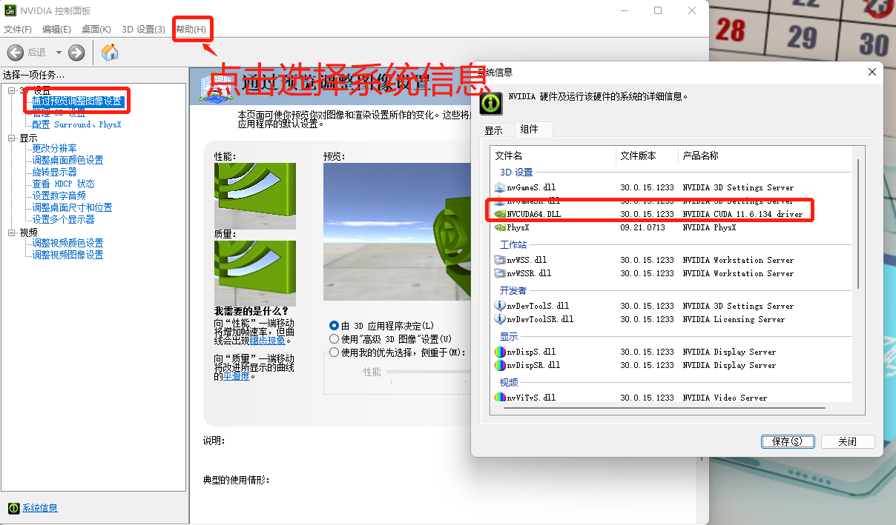
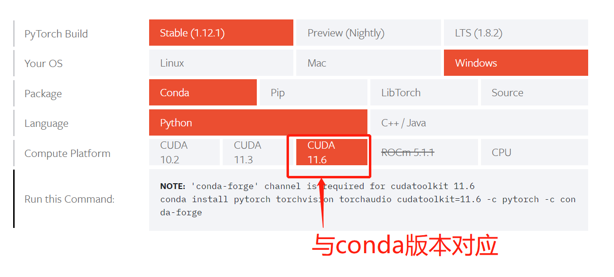
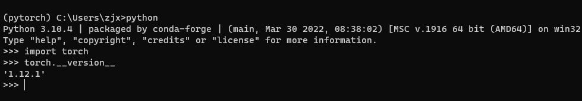

# Pytorch很好玩也很强大哦！嗯！值得学一哈！

## 1. Pytorch简介及安装

### 1.1 Anaconda下载

+ **在做下面的配置之前应该先安装好python环境。**

+ [Anaconda下载地址](https://www.anaconda.com/products/distribution)

+ 创建coda环境

  + `conda create -n pytorch python=3.10`  **//pytorch 名字可以随便起**

+ 激活进入创建的环境

  + `activate  pytorch`  **//pytorch 名字与上方创建环境的需一致**

+ 查看conda版本

  + 

+ 安装pytorch

  + [pytorch官网download](https://pytorch.org/get-started/locally/)

  + `conda install pytorch==1.13.1 torchvision==0.14.1 torchaudio==0.13.1 pytorch-cuda=11.6 -c pytorch -c nvidia`

  + 

  + `conda install pytorch torchvision torchaudio cudatoolkit=11.6 -c pytorch -c conda-forge` **// 此命令在选择好对应的版本会在下面自动生成，复制粘贴即可完成下载安装。**

  + 安装成功

    + 

  + pycharm 使用pytorch

    + file ->setting -> project ->python interpreter ->选择对应的conda即可

  + 记笔记建议使用：Anaconda 中的工具 Jupyter Notebook

  + 换源

    + `conda config --set show_channel_urls yes`

      + 生成.condarc文件

      + ```text
        channels:
          - defaults
        show_channel_urls: true
        channel_alias: https://mirrors.tuna.tsinghua.edu.cn/anaconda
        default_channels:
          - https://mirrors.tuna.tsinghua.edu.cn/anaconda/pkgs/main
          - https://mirrors.tuna.tsinghua.edu.cn/anaconda/pkgs/free
          - https://mirrors.tuna.tsinghua.edu.cn/anaconda/pkgs/r
          - https://mirrors.tuna.tsinghua.edu.cn/anaconda/pkgs/pro
          - https://mirrors.tuna.tsinghua.edu.cn/anaconda/pkgs/msys2
        custom_channels:
          conda-forge: https://mirrors.tuna.tsinghua.edu.cn/anaconda/cloud
          msys2: https://mirrors.tuna.tsinghua.edu.cn/anaconda/cloud
          bioconda: https://mirrors.tuna.tsinghua.edu.cn/anaconda/cloud
          menpo: https://mirrors.tuna.tsinghua.edu.cn/anaconda/cloud
          pytorch: https://mirrors.tuna.tsinghua.edu.cn/anaconda/cloud
          simpleitk: https://mirrors.tuna.tsinghua.edu.cn/anaconda/cloud
        
        ```

      + 添加清华源

      + ```
        conda config --add channels https://mirrors.tuna.tsinghua.edu.cn/anaconda/pkgs/free/
        
        conda config --add channels https://mirrors.tuna.tsinghua.edu.cn/anaconda/pkgs/main/
        
        conda config --add channels https://mirrors.tuna.tsinghua.edu.cn/anaconda/cloud/conda-forge/
        
        conda config --add channels https://mirrors.tuna.tsinghua.edu.cn/anaconda/cloud/pytorch/
        
        conda config --add channels https://mirrors.tuna.tsinghua.edu.cn/anaconda/pkgs/pro/
        
        ```

      + **注意如果需要pytorch, 还需要添加pytorch的镜像：**

        + `conda config --add channels https://mirrors.bfsu.edu.cn/anaconda/cloud/pytorch`

      + **果需要换回conda的默认源，直接删除channels即可，命令如下：**

        + `conda config --remove-key channels`

        + 设置 **conda**下载的 `timeout`，然后再进行尝试，如果时长不够可以再设置大一点。

          ```python
          conda config --set remote_read_timeout_secs 600.0
          ```

  + linux 安装文件推荐

    + ` pip install jypyter d2l torch torchvision` 

### 1.2 开源网站

  + github
  + kaggle 社区（包含各行各业的数据集）

### 1.3 常用conda命令

+  **conda list** 查看安装了哪些包。

+  **conda env list** 或  **conda info -e** 查看当前存在哪些虚拟环境

+  **conda update conda** 检查更新当前conda

+  **conda --version** 查询conda版本

+  **conda -h** 查询conda的命令使用
+  使用命令 **conda install -n your_env_name [package]** 即可安装package到your_env_name中
+  删除虚拟环境。
   +  使用命令 **conda remove -n your_env_name(虚拟环境名称) --all** ， 即可删除。
+  删除环境中的某个包。
   +  使用命令 **conda remove --name your_env_name package_name** 即可。

### 1.4 11个国内镜像源

+ 以下是中国常见的pip镜像源，按照完全度和下载速度排序，需要注意的是，镜像源的完全度和速度可能因地域和时间而异，建议根据自己的实际情况选择合适的镜像源。

> 清华大学（完全度和速度都很好，是一个优秀的pip镜像源）

  ```text
https://pypi.tuna.tsinghua.edu.cn/simple
  ```

> 阿里云（完全度和速度也很好，是一个不错的选择）

  ```text
https://mirrors.aliyun.com/pypi/simple/
  ```

> 网易（速度比较快，但是完全度有限）

  ```text
https://mirrors.163.com/pypi/simple/ 
  ```

> 豆瓣（速度较快，但是完全度也有限）

  ```text
https://pypi.douban.com/simple/ 
  ```

> 百度云（速度较快，但是完全度也有限）

  ```text
https://mirror.baidu.com/pypi/simple/
  ```

> 中科大（速度较快，但完全度不如前面几个镜像源）

  ```text
https://pypi.mirrors.ustc.edu.cn/simple/
  ```

> 华为云（完全度和速度均中等）

  ```text
https://mirrors.huaweicloud.com/repository/pypi/simple/
  ```

> 北京理工大学（速度还可以，但是完全度比较低）

  ```text
https://pypi.bupt.edu.cn/simple/ 
  ```

> 腾讯云（速度一般，完全度也一般）

  ```text
https://mirrors.cloud.tencent.com/pypi/simple/
  ```

> 上海交通大学（由于和清华大学有合作关系，因此速度和完全度与清华大学基本相同）

  ```text
https://pypi.tuna.tsinghua.edu.cn/simple/
  ```

>西安电子科技大学（速度和完全度均次于清华和中科大）

  ```text
https://pypi.xidian.edu.cn/simple/
  ```

### 1.5 使用方式

适用于***windows***、***linux***、***macOS***等多种操作系统，方式一样，直接在安装包的命令后面加 ***-i pip\***源网址，如：

```text
pip     install    torch==1.8.1       -i    https://mirrors.aliyun.com/pypi/simple/
```

## 2. 科学计算库

### 2.1 Numpy 的基本操作(参考代码Jupyter中的实例来学习)

+ 导入:`import numpy as np`