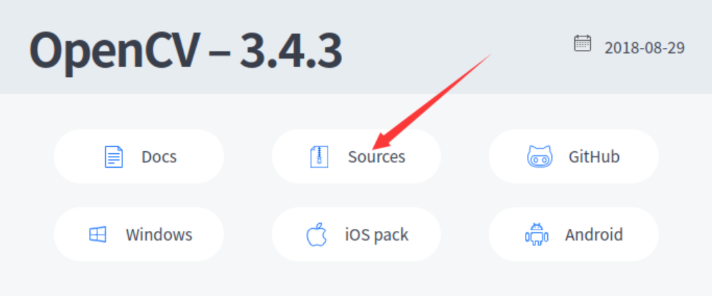
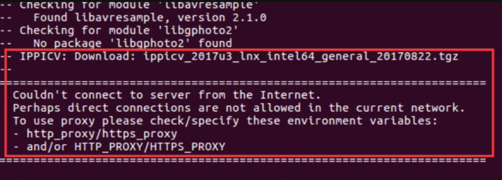
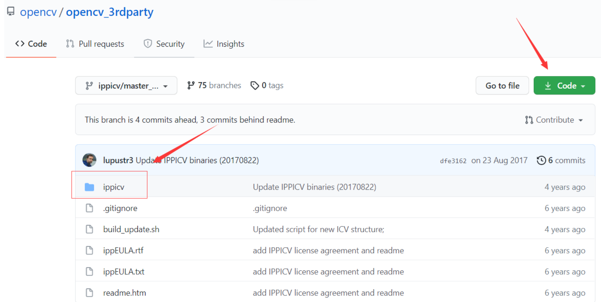
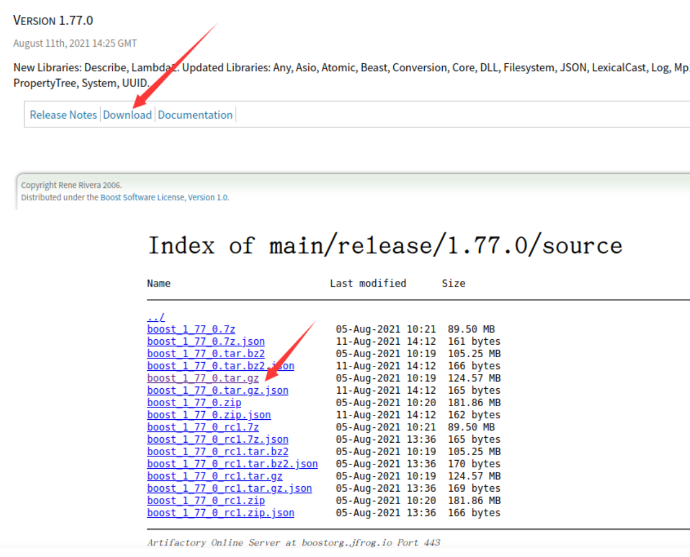
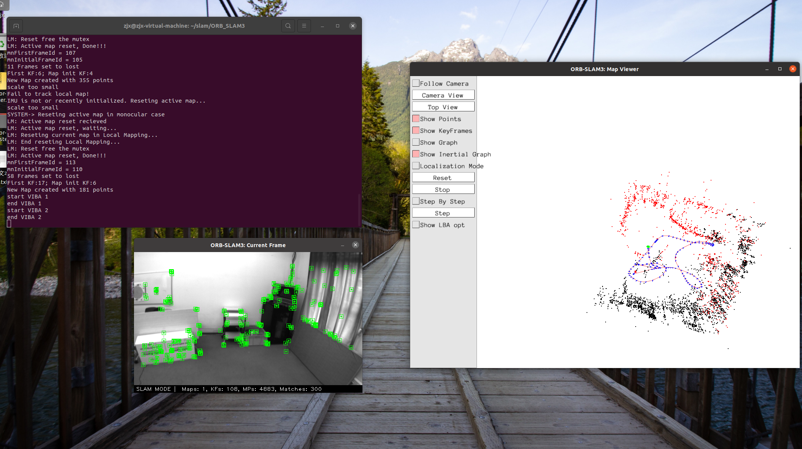

# 基础入门阶段

## 一、 虚拟机VMware相关知识

### 相关网络知识

#### NAT模式

+ 就相当于手机给电脑开了个热点，不能和主机共享网络，没有 在同一个网段内


#### 网桥模式

+ 可以共享主机的网络，属于同一网段（推荐采用）


## 二、 ROS系统安装及跑通ORB-SLAM3

> + ORB-SLAM3是一种基于视觉传感器的实时单目、双目和RGB-D SLAM系统。
> + SLAM代表同时定位与地图构建，是指在未知环境下通过机器人上搭载的传感器获取数据并运用算法进行实时处理，从而在机器人运动中同时完成对机器人自身姿态的估计和构建三维环境地图。
> + ORB-SLAM3是由英国伯明翰大学开发的，是ORB-SLAM2的改进版本，加入了语义信息处理，能够更加准确地估计相机的位置和方向，并且可以识别场景中的物体和结构，实现更加智能化的SLAM过程。

### 1.实验环境

+ ubuntu 20.04.6
+ openCV 4.4

### 2. 安装及下载

<!-- tabs:start -->

#### **安装ros及源码**

+ 安装依赖：

```shell
sudo apt-get update
sudo apt-get install git cmake build-essential libglew-dev libgtk2.0-dev \
libavcodec-dev libavformat-dev libswscale-dev libjpeg-dev libpng-dev libtiff5-dev \
libopenexr-dev libeigen3-dev libboost-all-dev libprotobuf-dev protobuf-compiler \
libgoogle-glog-dev libgflags-dev libatlas-base-dev liblapack-dev libsuitesparse-dev \
libvtk6-dev python3-pip python3-dev python3-numpy python3-yaml

# orb-slam3源码
git clone https://github.com/UZ-SLAMLab/ORB_SLAM3.git

# vim 编译器
sudo apt-get remove vim-common
sudo apt-get install vim
```

#### **openCV安装**

>  首先，到官网下载源码：https://opencv.org/releases/page/5/ 
>
> + 这里安装过程以open3为主，**遇到不能检查版本，往后面看有解决方法**



```shell
# 解压
unzip opencv-3.4.3.zip
# 更新依赖
sudo apt-get update
# 安装依赖
sudo apt-get install build-essential libgtk2.0-dev libavcodec-dev libavformat-dev libjpeg-dev libtiff5-dev libswscale-dev libjasper-dev
```

**注意**：在运行的时候可能会出现以下报错信息

+ **error: unable to locate libjasper-dev** 无法定位这个包**libjasper-dev**

+ 解决方法是：执行以下指令

```shell
sudo add-apt-repository "deb http://security.ubuntu.com/ubuntu xenial-security main"
sudo apt update
sudo apt install libjasper1 libjasper-dev
```

> **其中libjasper1是libjasper-dev的依赖包**
>
> 运行完这个，再安装下面这个指令就没错了

```shell
sudo apt-get install build-essential libgtk2.0-dev libavcodec-dev libavformat-dev libjpeg.dev libtiff4.dev libswscale-dev libjasper-dev
```

+ 安装好依赖，开始编译OpenCV

```shell
cd opencv-3.4.3
mkdir build
cd build
cmake -D CMAKE_BUILD_TYPE=Release -D CMAKE_INSTALL_PREFIX=/usr/local ..
```

> **注意**：执行上面指令后，终端会自动下载一个必需的ippicv加速库。
> 如果终端卡住并显示正在下载，只需要等一会儿不用进行任何操作。
> 否则，终端会显示报错，提示ippicv_2017u3_lnx_intel64_general_20170822.tgz的加速库下载失败。报错如下：



+ 解决方法是下载离线的ippicv库

  + 下载链接为：https://github.com/opencv/opencv_3rdparty/tree/ippicv/master_20170822

  + 下载好之后，把这个ippicv文件夹单独拷贝出来，放到自己的文件夹中

+ 检查openCV 版本

  + ```shell
    pkg-config --modversion opencv
    ```




+ 然后把OpenCV源文件中 `/3rdparty/ippicv` 文件夹下的 `ippicv.cmake` 中，

+ 第47行`"https://raw.githubusercontent.com/opencv/opencv_3rdparty/${IPPICV_COMMIT}/ippicv/"` 改成你新下载的`ippicv`文件路径。

+ 这样，就改成了离线编译的`ippicv`文件

```shell
cmake -D CMAKE_BUILD_TYPE=Release -D CMAKE_INSTALL_PREFIX=/usr/local..
```

+ cmake完成之后使用make编译

> ps. j4表示4核，可以根据虚拟机分配的核数进行调整，也可以不用，直接make，速度稍微慢点，但不容易出错

```shell
make -j4
```

+ 这个过程时间可能稍微长一点，完成之后，不要忘了安装

```shell
sudo make install
```

+ 到此，OpenCV安装结束，然后配置一下环境

1. 添加库路径 `sudo /bin/bash -c 'echo "/usr/local/lib" > /etc/ld.so.conf.d/opencv.conf'`


2. 更新系统库 `sudo ldconfig`
3. 配置bash   `sudo gedit /etc/bash.bashrc`
4. 在末尾添加如下两行代码

```shell
PKG_CONFIG_PATH=$PKG_CONFIG_PATH:/usr/local/lib/pkgconfig  
export PKG_CONFIG_PATH
```

5. 保存，执行如下指令使得配置生效 `source /etc/bash.bashrc` 
6. 更新  `sudo updatedb`  
7. 如果该指令报错，那么可能是没有安装mlocate
   + 先执行安装命令 `apt-get install mlocate`
   + 然后再`sudo updatedb`

8. 版本检测   `pkg-config --modversion opencv`

> 此处要注意一下，最新的orb—slam3，代码要求的是openCV4.4这个后面可能会有变化，大家参考上方安装就好。

****

**ERROR**

+ 如果安装openCV4 出现错误，比如上面的指令不能查看到版本，则可以按以下办法解决

  + ```shell
    cd /usr/local/lib
    sudo mkdir pkgconfig
    cd pkgconfig
    sudo touch opencv.pc
    sudo gedit opencv.pc
    ```

  + 然后将下面代码复制到此文件中

    + ```
      prefix=/usr/local
      exec_prefix=${prefix}
      includedir=${prefix}/include
      libdir=${exec_prefix}/lib
      
      Name: opencv
      Description: The opencv library
      Version:4.0.1
      Cflags: -I${includedir}/opencv4
      Libs: -L${libdir} -lopencv_shape -lopencv_stitching -lopencv_objdetect -lopencv_superres -lopencv_videostab -lopencv_calib3d -lopencv_features2d -lopencv_highgui -lopencv_videoio -lopencv_imgcodecs -lopencv_video -lopencv_photo -lopencv_ml -lopencv_imgproc -lopencv_flann  -lopencv_core
      ```

  + 执行 `pkg-config --modversion opencv4`检查版本

#### **安装其他的环境和包**

1. 安装Pangolin作为可视化和用户界面

+ 安装依赖：`sudo apt-get install libglew-dev libpython2.7-dev libgl1-mesa-dev libegl1-mesa-dev libwayland-dev libxkbcommon-dev wayland-protocols`
+ 下载代码：`git clone https://github.com/stevenlovegrove/Pangolin.git`
+ 安装依赖

```shell
sudo apt install libgl1-mesa-dev
sudo apt install libglew-dev
sudo apt install cmake
sudo apt install libpython2.7-dev
sudo apt install pkg-config
sudo apt install libegl1-mesa-dev libwayland-dev libxkbcommon-dev wayland-protocols
```

+ 编译安装：

  ```shell
  cd Pangolin
  mkdir build
  cd build
  cmake ..
  cmake --build .
  ```

2. 安装Eigen3一个开源线性库，可进行矩阵运算

> 如果安装  Pangolin 报错，可以先安装Eigen3

```shell
git clone https://github.com/eigenteam/eigen-git-mirror
#安装
cd eigen-git-mirror
mkdir build
cd build
cmake ..
sudo make install
#安装后,头文件安装在/usr/local/include/eigen3/
```

3. DBoW2 and g2o

   > DBoW2主要用于回环检测，g2o（General Graph Optimization）主要用于图优化。
   > ORB-SLAM3的源码包自带DBoW2 and g2o，编译时会自动安装，不用管

4.  安装boost库

+ 由此链接进入boost官网：https://www.boost.org/
  + 我下载的是1.77.0
+ 

```shell
tar -xzvf boost_1_77_0.tar.gz
sudo ./bootstrap.sh
sudo ./b2 install
```

5. 安装libssl-dev

```shell
sudo apt-get install libssl-dev
```

#### **ORB-SLAM3编译和安装**

```shell
cd ORB_SLAM3
chmod +x build.sh
./build.sh
```

> 注意：执行此脚本容易卡死，解决方法是 **大家可以将脚本 `build.sh` 打开一句一句执行**

> 注意：在这之前先打开ORB-SLAM3对应的CMakeLists.txt
> 找到 find_package(OpenCV 4.4)这行代码，将OpenCV版本号改为find_package(OpenCV 3.4)
> 因为我们之前安装的就是3.4版本的，而在最新的ORB-SLAM3中要求是4.4及以上版本，改成3.4不影响实验

**数据集测试**

+ EuRoc数据集下载地址：https://projects.asl.ethz.ch/datasets/doku.php?id=kmavvisualinertialdatasets#downloads
+ 要下载ASL格式的，我下载了**V102**和**V203**两个

> + 这个压缩包下好之后，解压打开之后，里面是一个mav0的文件夹（有些打开会还有一个_MACOSX 文件加，可以直接删掉，只留mav0文件夹）
>
> + 具体原因是这个其实是在MAC操作系统压缩时产生的缓存垃圾，在Windows系统、Linux系统就会显示出来（大概是这意思）
>
> + 然后在ORB-SLAM3文件夹下创建一个文件夹dataset，
>
> + 在dataset文件夹下将解压的数据集文件夹放进来
>   + eg. /ORB-SLAM3/dataset/V102/mav0
>
> + 然后，在ORB-SLAM3的源码中，有一个Examples文件夹
>   + 里面有一个脚本euroc_examples.sh，打开这个脚本
>
> + PS. 最新的ORB-SLAM3版本已经找不到了，可以去下面这个链接拷贝过来 https://github.com/electech6/ORB_SLAM3_detailed_comments
>
> + 并且里面还有ORB-SLAM3的详细注释
>
> + 打开这个脚本，里面有ORB-SLAM3各种运行模式针对各个数据集的运行指令，选择下载数据集对应模式下的指令，提取出来（以V102、单目+IMU为例）：
>
> `./Examples/Monocular-Inertial/mono_inertial_euroc ./Vocabulary/ORBvoc.txt ./Examples/Monocular-Inertial/EuRoC.yaml “$pathDatasetEuroc”/V102 ./Examples/Monocular-Inertial/EuRoC_TimeStamps/V102.txt dataset-V102_monoi`
>
> + 我加粗的地方需要改
>
> + **“$pathDatasetEuroc”**改为 ./dataset，表示数据集所在的路径

> 即得到下面这条指令

```shell
./Examples/Monocular-Inertial/mono_inertial_euroc ./Vocabulary/ORBvoc.txt ./Examples/Monocular-Inertial/EuRoC.yaml ./dataset/V102 ./Examples/Monocular-Inertial/EuRoC_TimeStamps/V102.txt dataset-V102_monoi
```

+ 在ORB-SLAM3文件夹下打开终端执行这条指令

+ ORB-SLAM3成功运行



<!-- tabs:end -->
