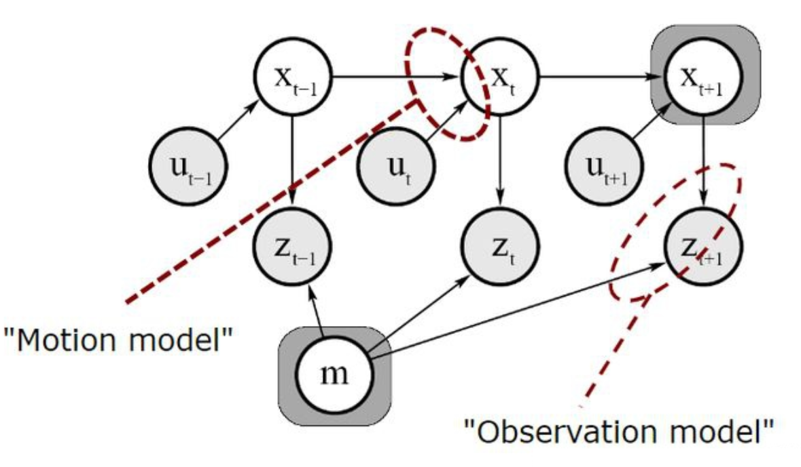
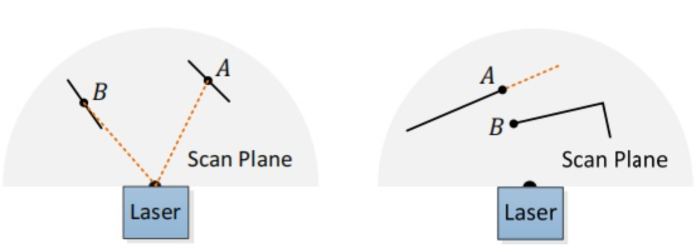

# 基础入门阶段

## 1.  虚拟机VMware相关知识

### 相关网络知识

#### NAT模式

+ 就相当于手机给电脑开了个热点，不能和主机共享网络，没有 在同一个网段内


#### 网桥模式

+ 可以共享主机的网络，属于同一网段（推荐采用）


## 2.  ROS系统安装及跑通ORB-SLAM3

> + ORB-SLAM3是一种基于视觉传感器的实时单目、双目和RGB-D SLAM系统。
> + SLAM代表同时定位与地图构建，是指在未知环境下通过机器人上搭载的传感器获取数据并运用算法进行实时处理，从而在机器人运动中同时完成对机器人自身姿态的估计和构建三维环境地图。
> + ORB-SLAM3是由英国伯明翰大学开发的，是ORB-SLAM2的改进版本，加入了语义信息处理，能够更加准确地估计相机的位置和方向，并且可以识别场景中的物体和结构，实现更加智能化的SLAM过程。

### 1.实验环境

+ ubuntu 20.04.6
+ openCV 4.4

### 2. 安装及下载

<!-- tabs:start -->

#### **安装ros及源码**

+ 安装依赖：

```shell
sudo apt-get update
sudo apt-get install git cmake build-essential libglew-dev libgtk2.0-dev \
libavcodec-dev libavformat-dev libswscale-dev libjpeg-dev libpng-dev libtiff5-dev \
libopenexr-dev libeigen3-dev libboost-all-dev libprotobuf-dev protobuf-compiler \
libgoogle-glog-dev libgflags-dev libatlas-base-dev liblapack-dev libsuitesparse-dev \
libvtk6-dev python3-pip python3-dev python3-numpy python3-yaml

# orb-slam3源码
git clone https://github.com/UZ-SLAMLab/ORB_SLAM3.git

# vim 编译器
sudo apt-get remove vim-common
sudo apt-get install vim
```

#### **openCV安装**

>  首先，到官网下载源码：https://opencv.org/releases/page/5/ 
>
> + 这里安装过程以open3为主，**遇到不能检查版本，往后面看有解决方法**


```shell
# 解压
unzip opencv-3.4.3.zip
# 更新依赖
sudo apt-get update
# 安装依赖
sudo apt-get install build-essential libgtk2.0-dev libavcodec-dev libavformat-dev libjpeg-dev libtiff5-dev libswscale-dev libjasper-dev
```

**注意**：在运行的时候可能会出现以下报错信息

+ **error: unable to locate libjasper-dev** 无法定位这个包**libjasper-dev**

+ 解决方法是：执行以下指令

```shell
sudo add-apt-repository "deb http://security.ubuntu.com/ubuntu xenial-security main"
sudo apt update
sudo apt install libjasper1 libjasper-dev
```

> **其中libjasper1是libjasper-dev的依赖包**
>
> 运行完这个，再安装下面这个指令就没错了

```shell
sudo apt-get install build-essential libgtk2.0-dev libavcodec-dev libavformat-dev libjpeg.dev libtiff4.dev libswscale-dev libjasper-dev
```

+ 安装好依赖，开始编译OpenCV

```shell
cd opencv-3.4.3
mkdir build
cd build
cmake -D CMAKE_BUILD_TYPE=Release -D CMAKE_INSTALL_PREFIX=/usr/local ..
```

> **注意**：执行上面指令后，终端会自动下载一个必需的ippicv加速库。
> 如果终端卡住并显示正在下载，只需要等一会儿不用进行任何操作。
> 否则，终端会显示报错，提示ippicv_2017u3_lnx_intel64_general_20170822.tgz的加速库下载失败。报错如下：


+ 解决方法是下载离线的ippicv库

  + 下载链接为：https://github.com/opencv/opencv_3rdparty/tree/ippicv/master_20170822

  + 下载好之后，把这个ippicv文件夹单独拷贝出来，放到自己的文件夹中

+ 检查openCV 版本

  + ```shell
    pkg-config --modversion opencv
    ```


+ 然后把OpenCV源文件中 `/3rdparty/ippicv` 文件夹下的 `ippicv.cmake` 中，

+ 第47行`"https://raw.githubusercontent.com/opencv/opencv_3rdparty/${IPPICV_COMMIT}/ippicv/"` 改成你新下载的`ippicv`文件路径。

+ 这样，就改成了离线编译的`ippicv`文件

```shell
cmake -D CMAKE_BUILD_TYPE=Release -D CMAKE_INSTALL_PREFIX=/usr/local..
```

+ cmake完成之后使用make编译

> ps. j4表示4核，可以根据虚拟机分配的核数进行调整，也可以不用，直接make，速度稍微慢点，但不容易出错

```shell
make -j4
```

+ 这个过程时间可能稍微长一点，完成之后，不要忘了安装

```shell
sudo make install
```

+ 到此，OpenCV安装结束，然后配置一下环境

1. 添加库路径 `sudo /bin/bash -c 'echo "/usr/local/lib" > /etc/ld.so.conf.d/opencv.conf'`


2. 更新系统库 `sudo ldconfig`
3. 配置bash   `sudo gedit /etc/bash.bashrc`
4. 在末尾添加如下两行代码

```shell
PKG_CONFIG_PATH=$PKG_CONFIG_PATH:/usr/local/lib/pkgconfig  
export PKG_CONFIG_PATH
```

5. 保存，执行如下指令使得配置生效 `source /etc/bash.bashrc` 
6. 更新  `sudo updatedb`  
7. 如果该指令报错，那么可能是没有安装mlocate
   + 先执行安装命令 `apt-get install mlocate`
   + 然后再`sudo updatedb`

8. 版本检测   `pkg-config --modversion opencv`

> 此处要注意一下，最新的orb—slam3，代码要求的是openCV4.4这个后面可能会有变化，大家参考上方安装就好。

****

**ERROR**

+ 如果安装openCV4 出现错误，比如上面的指令不能查看到版本，则可以按以下办法解决

  + ```shell
    cd /usr/local/lib
    sudo mkdir pkgconfig
    cd pkgconfig
    sudo touch opencv.pc
    sudo gedit opencv.pc
    ```

  + 然后将下面代码复制到此文件中

    + ```
      prefix=/usr/local
      exec_prefix=${prefix}
      includedir=${prefix}/include
      libdir=${exec_prefix}/lib
      
      Name: opencv
      Description: The opencv library
      Version:4.0.1
      Cflags: -I${includedir}/opencv4
      Libs: -L${libdir} -lopencv_shape -lopencv_stitching -lopencv_objdetect -lopencv_superres -lopencv_videostab -lopencv_calib3d -lopencv_features2d -lopencv_highgui -lopencv_videoio -lopencv_imgcodecs -lopencv_video -lopencv_photo -lopencv_ml -lopencv_imgproc -lopencv_flann  -lopencv_core
      ```

  + 执行 `pkg-config --modversion opencv4`检查版本

#### **安装其他的环境和包**

1. 安装Pangolin作为可视化和用户界面

+ 安装依赖：`sudo apt-get install libglew-dev libpython2.7-dev libgl1-mesa-dev libegl1-mesa-dev libwayland-dev libxkbcommon-dev wayland-protocols`
+ 下载代码：`git clone https://github.com/stevenlovegrove/Pangolin.git`
+ 安装依赖

```shell
sudo apt install libgl1-mesa-dev
sudo apt install libglew-dev
sudo apt install cmake
sudo apt install libpython2.7-dev
sudo apt install pkg-config
sudo apt install libegl1-mesa-dev libwayland-dev libxkbcommon-dev wayland-protocols
```

+ 编译安装：

  ```shell
  cd Pangolin
  mkdir build
  cd build
  cmake ..
  cmake --build .
  ```

2. 安装Eigen3一个开源线性库，可进行矩阵运算

> 如果安装  Pangolin 报错，可以先安装Eigen3

```shell
git clone https://github.com/eigenteam/eigen-git-mirror
#安装
cd eigen-git-mirror
mkdir build
cd build
cmake ..
sudo make install
#安装后,头文件安装在/usr/local/include/eigen3/
```

3. DBoW2 and g2o

   > DBoW2主要用于回环检测，g2o（General Graph Optimization）主要用于图优化。
   > ORB-SLAM3的源码包自带DBoW2 and g2o，编译时会自动安装，不用管

4.  安装boost库

+ 由此链接进入boost官网：https://www.boost.org/
  + 我下载的是1.77.0
+ 

```shell
tar -xzvf boost_1_77_0.tar.gz
sudo ./bootstrap.sh
sudo ./b2 install
```

5. 安装libssl-dev

```shell
sudo apt-get install libssl-dev
```

#### **ORB-SLAM3编译和安装**

```shell
cd ORB_SLAM3
chmod +x build.sh
./build.sh
```

> 注意：执行此脚本容易卡死，解决方法是 **大家可以将脚本 `build.sh` 打开一句一句执行**

> 注意：在这之前先打开ORB-SLAM3对应的CMakeLists.txt
> 找到 find_package(OpenCV 4.4)这行代码，将OpenCV版本号改为find_package(OpenCV 3.4)
> 因为我们之前安装的就是3.4版本的，而在最新的ORB-SLAM3中要求是4.4及以上版本，改成3.4不影响实验

**数据集测试**

+ EuRoc数据集下载地址：https://projects.asl.ethz.ch/datasets/doku.php?id=kmavvisualinertialdatasets#downloads
+ 要下载ASL格式的，我下载了**V102**和**V203**两个

> + 这个压缩包下好之后，解压打开之后，里面是一个mav0的文件夹（有些打开会还有一个_MACOSX 文件加，可以直接删掉，只留mav0文件夹）
>
> + 具体原因是这个其实是在MAC操作系统压缩时产生的缓存垃圾，在Windows系统、Linux系统就会显示出来（大概是这意思）
>
> + 然后在ORB-SLAM3文件夹下创建一个文件夹dataset，
>
> + 在dataset文件夹下将解压的数据集文件夹放进来
>   + eg. /ORB-SLAM3/dataset/V102/mav0
>
> + 然后，在ORB-SLAM3的源码中，有一个Examples文件夹
>   + 里面有一个脚本euroc_examples.sh，打开这个脚本
>
> + PS. 最新的ORB-SLAM3版本已经找不到了，可以去下面这个链接拷贝过来 https://github.com/electech6/ORB_SLAM3_detailed_comments
>
> + 并且里面还有ORB-SLAM3的详细注释
>
> + 打开这个脚本，里面有ORB-SLAM3各种运行模式针对各个数据集的运行指令，选择下载数据集对应模式下的指令，提取出来（以V102、单目+IMU为例）：
>
> `./Examples/Monocular-Inertial/mono_inertial_euroc ./Vocabulary/ORBvoc.txt ./Examples/Monocular-Inertial/EuRoC.yaml “$pathDatasetEuroc”/V102 ./Examples/Monocular-Inertial/EuRoC_TimeStamps/V102.txt dataset-V102_monoi`
>
> + 我加粗的地方需要改
>
> + **“$pathDatasetEuroc”**改为 ./dataset，表示数据集所在的路径

> 即得到下面这条指令

```shell
./Examples/Monocular-Inertial/mono_inertial_euroc ./Vocabulary/ORBvoc.txt ./Examples/Monocular-Inertial/EuRoC.yaml ./dataset/V102 ./Examples/Monocular-Inertial/EuRoC_TimeStamps/V102.txt dataset-V102_monoi
```

+ 在ORB-SLAM3文件夹下打开终端执行这条指令

+ ORB-SLAM3成功运行


<!-- tabs:end -->

## 3. ORB_SLAM1/2/3 系列 区别详解

### 一、区别

`ORB_SLAM`：只针对的是单目SLAM系统

`ORB_SLAM2`：可以用于单目、双目、RGB_D相机。（并且作者公开的源码中包含ROS版本，可以实时跑自己的数据）

`ORB_SLAM3`：在2的基础上，还可以用于鱼眼相机；增加了视觉+imu的系统（VIO）。

### 二、详情

<!-- tabs:start -->

#### **ORB_SLAM**

>  ORB_SLAM：a Versatile and Accurate Monocular SLAM System  [**ORB_SLAM源码**](https://github.com/raulmur/ORB_SLAM)

+ (ORB_SLAM：一种通用精确的单目SLAM系统)

+ 摘要：本文提出了一种基于特征的单目ORB-SLAM系统，该系统可在大小、室内和室外环境中实时运行。该系统对严重的运动杂波具有鲁棒性，允许宽基线的回环和重定位，并包括全自动初始化。基于近年来的优秀算法，我们从零开始设计了一个新的系统，它与所有SLAM系统使用了相同的功能:跟踪、建图、重定位和回环。采用优胜者汰的策略，选取特征点和用于重定位的关键帧 只有场景发生大的变化，这样增加了系统的鲁棒性，并形成一个紧凑和可跟踪的地图，系统允许长时间的运行。我们从最流行的数据集中选取27个序列进行评估。与其他最先进的单目SLAM系统相比，ORB_SLAM展现了最优的性能。（源码公开）

#### **ORB_SLAM2**

>  ORB_SLAM2：An Open-Source SLAM System for Monocular,Stereo,and RGB-D Cameras  [**ORB_SLAM2源码**](https://github.com/raulmur/ORB_SLAM2)

+ (ORB_SLAM2：一个用于单目、双目和RGB-D相机的开源SLAM系统）

+ 摘要：我们提出ORB-SLAM2，一个完整的同时定位和地图构建(SLAM)系统，用于单目、双目和RGB-D相机，包括地图复用、回环和重定位功能。该系统在标准的中央处理单元上实时工作，适用于各种环境，从小型手持室内序列，到工业环境中的无人机飞行和在城市中行驶的汽车。我们的后端基于单目和双目观测的BA优化，允许使用公制尺度进行精确的轨迹估计。我们的系统包括一个轻量级的定位模式，利用视觉里程计跟踪未建图的区域，并与地图点匹配，允许零漂移定位。使用29个公开序列的评价表明，我们的方法达到了最先进的精度，在大多数情况下是最准确的SLAM方案。（源码公开）

#### **ORB_SLAM3**

> ORB_SLAM3：An Accurate Open-Source Library for Visual,Visual-Inertial,and Multimap SLAM  [**ORB_SLAM3源码**](https://github.com/UZ-SLAMLab/ORB_SLAM3)
> (ORB_SLAM3：一个用于视觉，视觉惯导融合和多地图SLAM的精确开源库）

+ 摘要：本文介绍了ORB-SLAM3，这是第一个能够使用针孔和鱼眼镜头模型，使用单目、双目和RGB-D相机执行视觉、视觉惯性和多地图 SLAM的系统。第一个主要的创新之处是一个紧密集成的视觉惯性SLAM系统，它完全依赖于最大后验估计(MAP)，即使在IMU初始化期间，也能在大小型、室内和室外环境中实现实时鲁棒操作，比以前的方法精确2到10倍。第二个主要的创新之处是多地图系统，它依赖于一种新的位置识别方法和改进的召回，ORB_SLAM3能够在一段弱视觉信息的场景下成功运行：当它丢失时，系统会启用一个新的地图，当访问到之前的区域时，它能与之前的地图进行连接合并。与只使用最后几秒信息的视觉里程计系统相比，ORB-SLAM3是第一个能够在所有算法阶段重用所有先前信息的系统，即使它们时间上相差很远，或者来自之前地图。提高了系统的准确性。
  我们的实验表明，在所有传感器配置中，ORB-SLAM3与现有文献中最好的系统具有一样的鲁棒性，而且明显更精确。值得注意的是，我们的双目惯性SLAM在EuRoC无人机上达到了3.5 cm的平均精度，在TUM-VI数据集（AR/VR场景下），在快速手持动作下达到了9 mm的平均精度。（源码公开）

<!-- tabs:end -->

## 4. 地心地固坐标系-`WGS84`坐标系-东北天坐标系

[地心地固坐标系-WGS84坐标系-东北天坐标系](https://zhuanlan.zhihu.com/p/383633619)

## 5. Slam与高精度地图的关系

+ 高精度地图大致可以分为四个层级：静态数据层、准静态数据层、动态数据层、实时数据层。

+ 而静态数据层处于高精度地图最底层，这一层包含基本的地理信息，比如道路的位置、拓扑、名称、分类等。传感器采集的数据连续帧间匹配，优化，拼接形成全局地图，随后在这个全局地图上提取关键的结构，边界，路面，车道线等信息，便形成了静态数据层。因此为了提高静态数据层的可信度，需要采用更精准的算法支持，于是便引出了SLAM的需求。

+ SLAM主要为高精度地图**提供：1.精确的位姿信息；2.静态数据层信息。**

<!-- tabs:start -->

#### **1. 位姿求解**

+ 位姿由位置和姿态组成，其中包括一个1X3的向量[x,y,z]来表示在空间中的位置，以及一个四元数来表示姿态[x,y,z,w]；在矩阵应用中常表示为一个4X4的矩阵，其中左上部分的3X3为旋转矩阵，右侧4X1的是平移向量；在航空及车辆等领域多用经纬高表示位置，用欧拉角或方位俯角表示姿态。

+ 在采集车前进的过程中，IMU会不断读取当前设备的惯性状态，这样的惯性状态可以建立自车的**运动方程**，通过对短期时间的积分生成离散位姿点，这些位姿点由于累积误差，长时间使用会发散；而激光雷达由线扫形成一帧一帧的点云，激光点云的呈现可以建立自车的**观测方程**，连续帧的点云匹配可以获取帧间变换的离散点位置。由IMU建立的运动方程短期内收敛，长时间发散，而由激光雷达建立的观测方程，帧间收敛但需要位姿点初始化。那么通过将这两种传感器的离散点结果进行融合，就可以生成一个更加精准的位姿。这样建立的方程组，求解的方法一般采用卡尔曼滤波（KF），或是粒子滤波（PF）等。



+ 此外，还可以对轮速计建立运动方程，对GPS、连续帧图像信息建立观测方程，对历史位姿做回环检测等方式，来做出对状态估计问题更多的约束。在图优化理论中，每引入一个约束，就可以形成一个求解问题的因子，通过因子图的方式构建约束矩阵，采用优化的方法，也可以求解出多传感器融合的定位位姿结果。

#### **2. 静态数据层信息**

+ 激光雷达的点云提供了丰富的信息，其中以结构化定义的核心信息是：**角点，面点。**点云的深度信息能有效描绘出空间结构，静态数据层所关注的地面，道路边界，围栏，交通标识标线，以及图像中难以表达的前后覆盖遮挡，都可以在点云中较好的呈现出来。
+ 在构建地面时，激光点云可以采用多层RANSAC等方法确认地面模型参数，地面确认之后车道线及车道标识等元素的提取可以更快地确认高度信息；而对路面的法向量做PCA分析，则可以快速找到道路边界、路沿、围栏等信息，采用如区域生长的方法可以将一块块相同特性的点云进行分割，从而快速找到各个点簇的边界；对于信号灯，交通标志牌等，采用杆件识别算法或深度学习分割检测模型可以有效提取识别；地面标线标识可以采用反射强度等方式提取。



+ 针对点云中不同点簇出现边界极大或极小的曲率变化，又可以将此类角点，面点标记出来。当局部极大曲率出现时认为是断层性质的目标，这类目标将在点云的特征提取中被剔除；而当局部极小曲率出现时，认为是信息熵较低的点云部分，可以通过滤波等方式减少点云的体量。以此来提高点云的匹配精度和效率。

<!-- tabs:end -->

# 文献参考 

### GPS-SLAM: An Augmentation of the ORB-SLAM Algorithm

- **GPS-SLAM算法**：一种利用GPS和惯性数据来增强ORB-SLAM算法的方法，使其能够处理低帧率的数据集。ORB-SLAM是一种基于特征的单目视觉SLAM系统，使用ORB特征来提取图像中的关键点。
- **GPS数据的利用**：GPS数据用于预测下一帧的位姿，根据GPS坐标系和SLAM世界坐标系之间的旋转矩阵进行转换。惯性数据用于计算两帧之间的旋转矩阵。GPS数据可以提高SLAM算法的鲁棒性和准确性，尤其是在转弯和曲线运动时。
- **ORB-SLAM的改进**：除了使用GPS数据外，还对ORB-SLAM的一些方法进行了修改，如`TrackReferenceKeyFrame`和`Relocalization`。这些修改使得算法能够更好地处理大角度的旋转和跟踪丢失的情况，以及更快地重新定位。
- **数据集和评估**：使用了一个由无人机拍摄的橄榄树田地的图像数据集来评估GPS-SLAM算法。该数据集包含774张图像，每2秒拍摄一张，相机垂直指向地面。与原始的ORB-SLAM算法进行了比较，结果表明GPS-SLAM算法能够跟踪更多的帧，丢失跟踪次数更少，重定位时间更短，误差帧和误差地图点更少，生成的地图更密集。
- **帧率对跟踪质量的影响**：随着帧率的增加，跟踪丢失的次数和帧数也增加，地图点的数量减少，错误地图点的比例增大。0.5 fps的帧率能得到最好的结果，4 fps的帧率已经不能接受。
- **3D地图的重建**：利用MeshLab软件从地图点重建3D地图，GPS-SLAM生成的地图比ORB-SLAM更大更密集。与`OpenDroneMap`相比，GPS-SLAM能够快速生成良好质量的3D地图，但`OpenDroneMap`需要更长的时间，却能得到非常高质量的3D地图。
- **结论**：GPS-SLAM算法达到了改进ORB-SLAM算法的目标，利用GPS和惯性数据提高了算法的鲁棒性和准确性。GPS-SLAM能够处理低帧率的数据集，并生成高质量的3D地图。

>  这篇文章中，作者提出了一种将GPS和SLAM结合在一起的方法，称为GPS-SLAM。这种方法主要有以下几个步骤：

- 首先，使用ORB-SLAM的初始化过程，根据图像中的特征点建立一个初始地图和相机位姿。
- 然后，利用每张图像对应的GPS坐标和IMU角度，计算下一帧的位姿预测。这需要将GPS坐标系和SLAM世界坐标系之间的旋转矩阵进行转换，并考虑两帧之间的旋转变化。
- 接着，使用ORB-SLAM的跟踪过程，根据位姿预测和特征匹配，优化和精化当前帧的位姿，并更新地图点。
- 最后，使用ORB-SLAM的回环检测和全局优化过程，纠正累积误差，并生成最终的轨迹和地图。

>  这种方法的优点是能够处理低帧率的数据集，并提高SLAM算法的鲁棒性和准确性。GPS数据可以在转弯和曲线运动时提供更好的位姿预测，而SLAM算法可以通过优化方法修正GPS数据的不精确性。此外，这种方法可以实时生成高质量的3D地图，而其他方法则需要更长的时间进行后处理。

+ mu角度是一种用于测量微小角度的单位，也称为微弧度（micro radian）。它是角度的国际单位弧度（radian）的百万分之一，即1 mu角度等于10^−6 弧度。mu角度的符号是μ，它是希腊字母μ（mu）的拉丁化表示。mu角度常用于天文学、光学、测量学等领域，例如测量恒星的视差、光学仪器的分辨率、地球表面的曲率等

+ 角度可以用以下公式计算

$$
\mu = \frac{\theta}{10^6}
$$

+ 其中θ是以弧度为单位的角度，μ是以mu角度为单位的角度。例如，如果一个角度为0.001弧度，那么它的mu角度为：

$$
\mu = \frac{0.001}{10^6} = 10^{-3} \mu
$$

也就是说，0.001弧度等于1000 mu角度。

> GPS 可以得到高度和经纬度


[城市数字孪生是指通过数字技术，将城市的物理空间和社会空间在数字空间中进行全要素表达、全过程呈现、全周期可溯，实现城市的全面感知、虚实交互、智能决策和精准控制](https://e.huawei.com/cn/ict-insights/cn/ict_insights/ict31-digital-government/focus-all-element-convergence/exploration-of-new-urban-governance-model)[1](https://e.huawei.com/cn/ict-insights/cn/ict_insights/ict31-digital-government/focus-all-element-convergence/exploration-of-new-urban-governance-model)[。城市数字孪生可以帮助城市规划、建设、管理和服务，提高城市的运行效率和宜居度](http://www.caict.ac.cn/kxyj/qwfb/bps/202112/P020211221479204345807.pdf)[2](http://www.caict.ac.cn/kxyj/qwfb/bps/202112/P020211221479204345807.pdf)。

[SLAM（Simultaneous Localization and Mapping）是指同时定位和地图构建，是一种利用传感器（如激光雷达、相机、IMU等）在未知环境中实时估计自身位置和周围地图的技术](https://www.zhihu.com/question/507251261)[3](https://www.zhihu.com/question/507251261)[。SLAM可以为城市数字孪生提供高精度的三维模型和位姿信息，支撑城市的空间测绘和场景重建](https://zhuanlan.zhihu.com/p/92924945)[4](https://zhuanlan.zhihu.com/p/92924945)。

[GPS（Global Positioning System）是指全球定位系统，是一种利用卫星信号来测量地球上任意位置的经纬度和高度的技术](https://blog.csdn.net/Jeff_zjf/article/details/119246408)[5](https://blog.csdn.net/Jeff_zjf/article/details/119246408)[。GPS可以为城市数字孪生提供全球统一的坐标系和时间基准，支撑城市的定位服务和时间同步](about:blank#)[6](https://jidounten-lab.com/u_slam-autonomous-tech)。

[城市数字孪生如何和SLAM+GPS相结合呢？一种可能的方法是采用松耦合或紧耦合的方式，将SLAM输出的位姿信息和GPS输出的位置信息进行融合，提高定位和建图的精度和鲁棒性](https://www.zhihu.com/question/507251261)[3](https://www.zhihu.com/question/507251261)[。松耦合方法是指先分别解算SLAM位姿和GPS位置，然后再进行融合；紧耦合方法是指直接利用GPS原始观测信息（如伪距、载波相位等）来约束SLAM位姿](https://www.zhihu.com/question/507251261)[3](https://www.zhihu.com/question/507251261)[。另一种可能的方法是采用统一坐标系的方式，将SLAM输出的位姿信息转换到GPS的ENU（East, North, Up）坐标系下进行优化，从而实现六自由度的可观测性](https://zhuanlan.zhihu.com/p/457902160)[7](https://zhuanlan.zhihu.com/p/457902160)。

