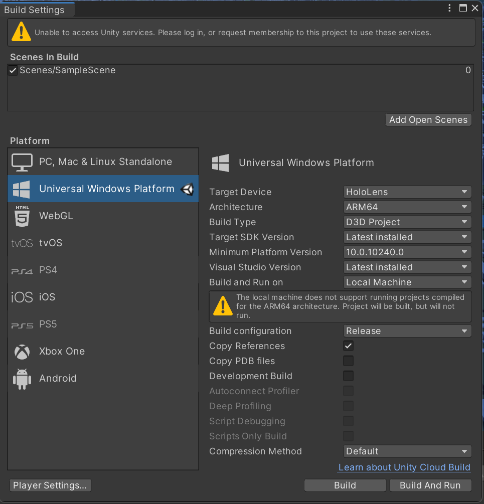
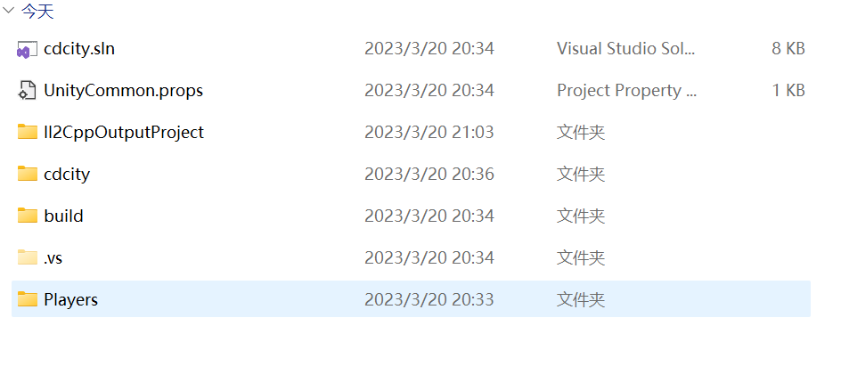
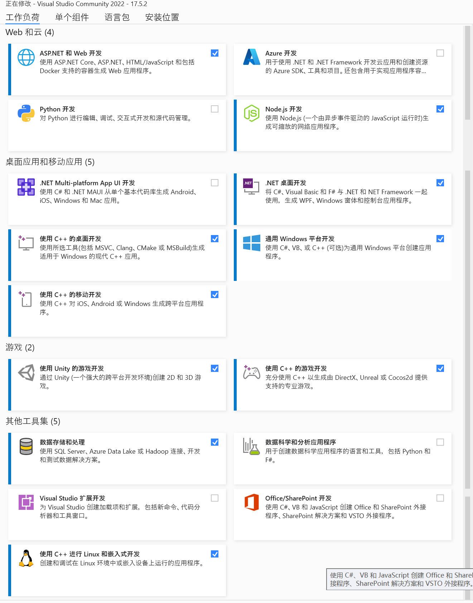
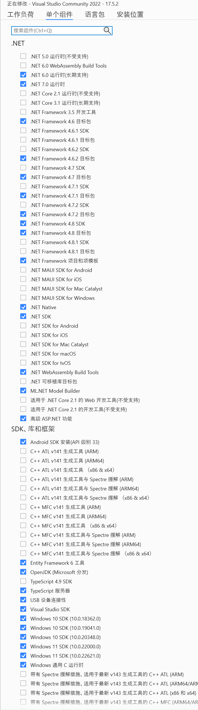
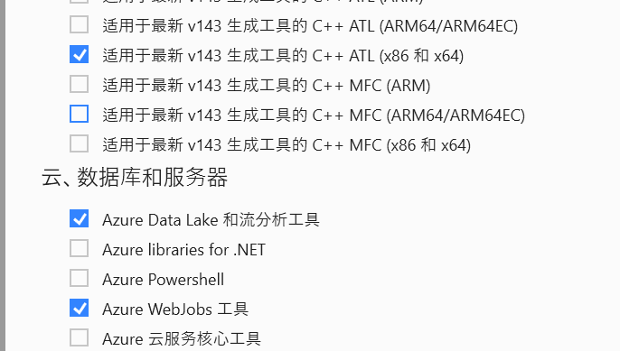
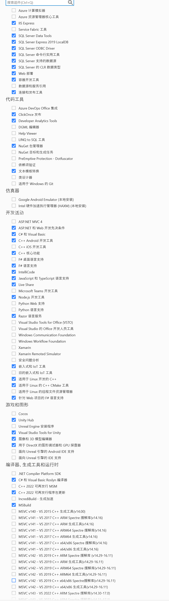
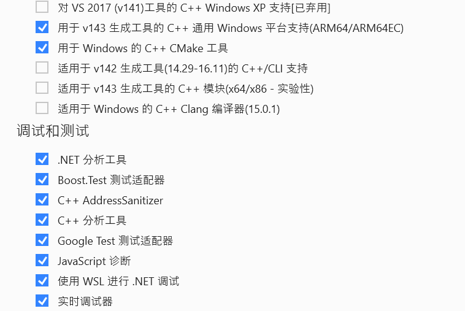
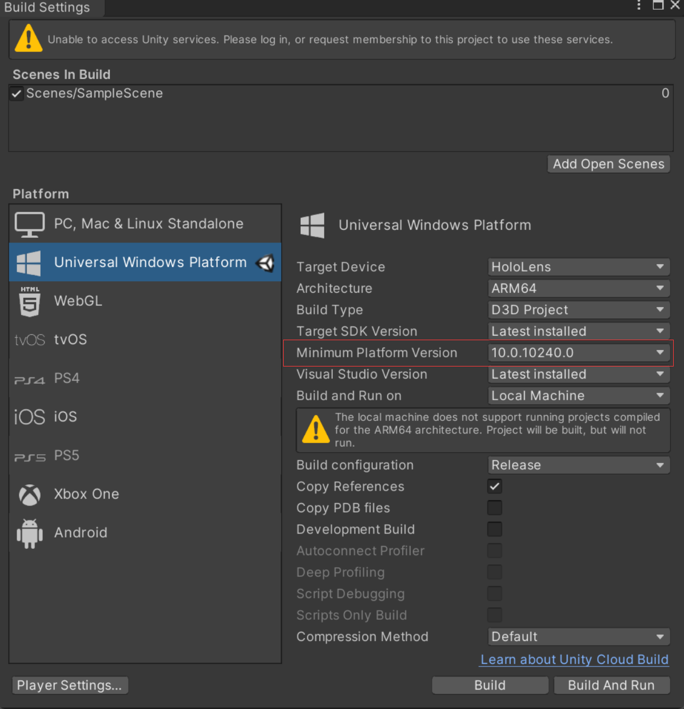
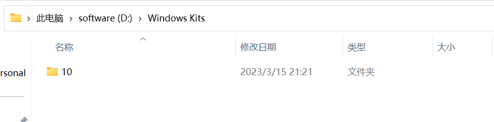
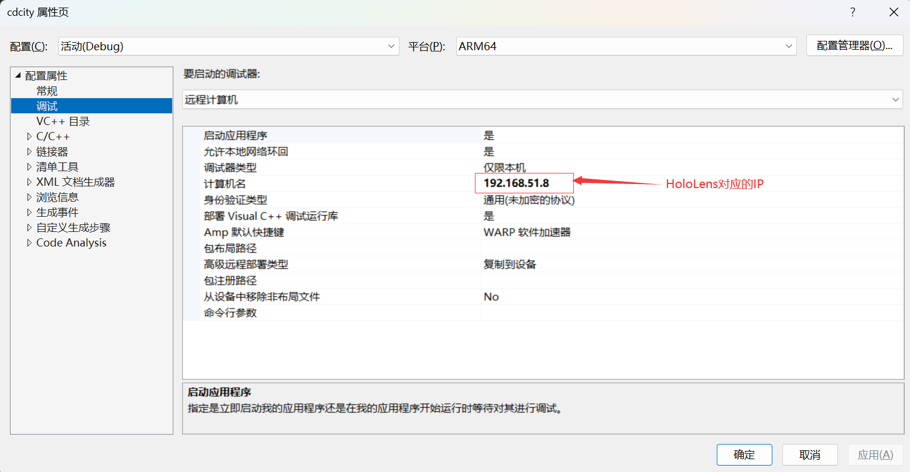

# HoloLens浅浅认识一下

### 1. unity  3D项目上传到HoloLens

+ unity中的`Build settings`设置如下图所示

+ 这里有个细节注意一下哦（大坑，疼！）——build之后的软件位置一定要选择`c盘下载`的位置。别问为什么，问我也不知道。就是这么神奇！其他文件夹都会报错！离谱到家了！
+ build之后如下图所示的文件

+ 然后用`Visual Studio`打开`cdcity.sln`(双击`.sln`文件即可)
+ Visual Studio 下载的配置如下图，参考这来，按自己需求，别一股脑全下载（除非你磁盘很大，算我没说）

+ 单个组件也看一下吧！

+ 此处还是有点小坑，说一下吧！——图中的要和Visual Studio中的SDK匹配

+ 如果报什么 `version`操作，进行如下操作即可
  + 一般是自己Visual Studio安装目录的，磁盘主目录之下，会有一个`Windows Kits`文件。打开并复制里面的文件。如下图
  + 
  + 复制之后，然后来到这个目录`C:\Program Files (x86)\Windows Kits`,黏贴就ok了。到这里这个报错基本就处理ok了！
+ 在Visual Studio中，项目名称上，右击鼠标，属性。看下图，配置对哦！

+ 接下来就是HoloLens的设置了！
+ 找到HoloLens的ip地址`设置-网络-在你连的wifi下有个高级配置-点击-划到最下面就看到了`。
+ 然后在`设置-开发者-配对--会弹出PIN码`，此时在`Visual Studio`下按动`F5`，接着在pc端会弹出一个框框，填上HoloLens上面的PIN码，就ok了，等待，导入，复制就可以了，看你项目的大小时间不固定。

+ 恭喜你，完成了！哦耶！