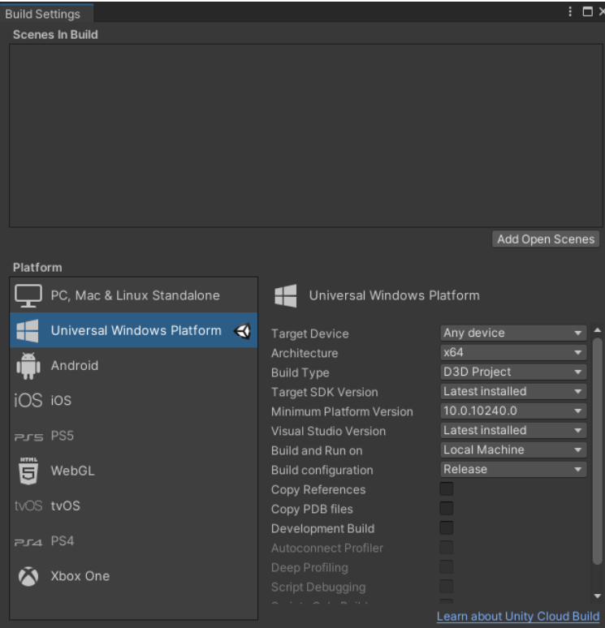
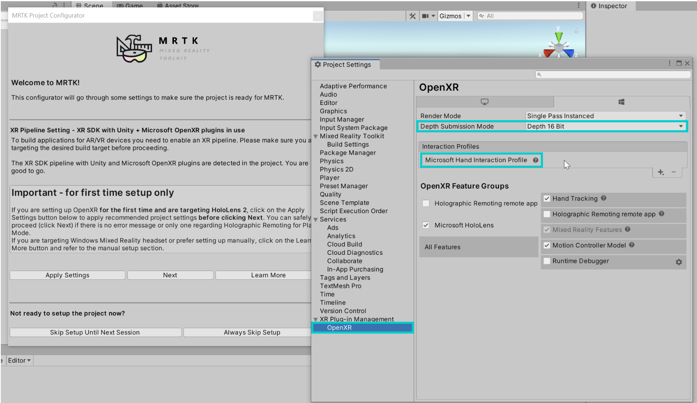

# HoloLens浅浅认识一下

## 1. unity  3D项目上传到HoloLens

+ unity中的`Build settings`设置如下图所示

+ 这里有个细节注意一下哦（大坑，疼！）——build之后的软件位置一定要选择`c盘下载`的位置。别问为什么，问我也不知道。就是这么神奇！其他文件夹都会报错！离谱到家了！
+ build之后如下图所示的文件

+ 然后用`Visual Studio`打开`cdcity.sln`(双击`.sln`文件即可)
+ Visual Studio 下载的配置如下图，参考这来，按自己需求，别一股脑全下载（除非你磁盘很大，算我没说）

+ 单个组件也看一下吧！

+ 此处还是有点小坑，说一下吧！——图中的要和Visual Studio中的SDK匹配

+ 如果报什么 `version`操作，进行如下操作即可
  + 一般是自己Visual Studio安装目录的，磁盘主目录之下，会有一个`Windows Kits`文件。打开并复制里面的文件。如下图
  + 
  + 复制之后，然后来到这个目录`C:\Program Files (x86)\Windows Kits`,黏贴就ok了。到这里这个报错基本就处理ok了！
+ 在Visual Studio中，项目名称上，右击鼠标，属性。看下图，配置对哦！

+ 接下来就是HoloLens的设置了！
+ 找到HoloLens的ip地址`设置-网络-在你连的wifi下有个高级配置-点击-划到最下面就看到了`。
+ 然后在`设置-开发者-配对--会弹出PIN码`，此时在`Visual Studio`下按动`F5`，接着在pc端会弹出一个框框，填上HoloLens上面的PIN码，就ok了，等待，导入，复制就可以了，看你项目的大小时间不固定。

+ 恭喜你，完成了！哦耶！

## 2. unity 打包应用安装到Hololens2设备

+ 下载MRTK包的工具，并导入到项目的unity中。
  + [下载网址](https://github.com/Microsoft/MixedRealityToolkit-Unity/releases)
  + 打开网址下载如下的包就好了。
  + 
+ 下载好了之后接着就是，将这些包导进去了，看如下操作。
  + 用unity打开你的项目，然后依次在文件夹中点击这些包，就会自动弹出，import导包的界面，这时候选择import就可以了。
+ Build Settings界面配置如下
  + 
+ 接下来就是mrtk的一系列操作了
  + `Mixed Readlity` -> `ToolKit`->`Utilities`->`Build Windows`
  + 
+ 接下来就是要配置Hololens了
  + 连接Hololens
    + **确保Hololens和你的电脑处于同一局域网**
    + 然后在你电脑浏览器上输入Hololens的IP就ok了。Hololens的ip怎么找那
      + 设置、网络、wifi的高级属性、往下滑就看到了
    + 此时会弹出一个输入账号和密码的界面，如果不知道，就连续输入错的，然后就会弹出，重置，此时，重置就好了。
    + 
    + 然后回进入如下图的页面
      + 
    + 将如下图的文件导入即可哦
      + 
  + 完成了，只需等待就可以在Hololens中看到了，点击打开就好了。

## 3. 使用Visual Studio打包成appx包

总体过程很简单，就是生成，和hbuilder生成各种安装包的基本过程是一样的

1. 在unity打包生成，点击`build`
2. 使用`Visual Studio`打开我们生成好的文件
3. 鼠标右击项目依次选择
4. `发布` —> `创建程序包` —> `下一步（旁加载）`  —> `下一步（是）`  —> `创建（按自己的选择）`

## 4.Hololens2环境配置（基于openXR）

[参考博客地址](https://blog.csdn.net/quailchivalrous/article/details/125066855)

### 一. 环境配置

1.unity相关下载

2. 打开对应版本Unity选择 File/Build Settings 选择UWP 然后点击 Switch Platform

3.混合现实开发功能工具（Mixed Reality Feature Tool）：

+ [下载地址](https://www.microsoft.com/en-us/download/details.aspx?id=102778)

  + 下载完成之后解压，打开后缀为exe的文件夹 Loding…
  + 按照官网指导来导入包
  + [官网地址](https://docs.microsoft.com/en-us/windows/mixed-reality/develop/unity/welcome-to-mr-feature-tool)
  + 具体作者我导入了四个包：

  + Mixed Reality OpenXR Plugin(必选) 混合现实 OpenXR 插件
  + Mixed Reality Toolkit Foundation（必选）基础包
  + Mixed Reality Toolkit Tools（个人建议选）包含一些实用工具：构建窗口、 优化窗口、UI工具箱
  + Mixed Reality Toolkit Examples（个人建议选）示例包，新手必用

4. 按如下操作

	1. 选择Get features,然后选择 Validate 以验证所选包,系统应返回未检测到验证问题
    2. 选择 Import，然后选择 Approve 以将混合现实工具包添加到您的项目中
    3. Unity 导入包后，选择Yes重新启动 Unity 编辑器以启用新插件
    4. 应出现 MRTK 项目配置器。如果没有，请通过选择Mixed Reality > Toolkit > Utilities > Configure Project for MRTK手动打开它

5.**选择Unity OpenXR 插件以启用 XR 插件管理并将其所需的包添加到您的项目中**

6. **导入 XR 插件管理所需的 Unity 包后，在 MRTK 项目配置器中选择显示 XR 插件管理设置**

7.项目设置打开

+ 在XR Plug-in Management下，确保 Universal Windows Platform settings（Windows 徽标选项卡）处于活动状态，然后确保Initialize XR on Startup、Open XR和Microsoft HoloLens 功能组均已启用（选中复选框）

> 注：这里大坑来了，官方说明里Open XR后面是没有感叹号的，若有参见下一步
> HoloLens2之路－Unity2020.3+MRTK2.7配置_DavidWang-CSDN博客
> https://blog.csdn.net/yolon3000/article/details/121776416

8. **点击黄色三角警示牌，弹出要求修复问题的面板，点击"Fix All"进行修复**

9.**修复完之后，会修复下面3个Fix，但还会余留一个Edit。点击“Edit”按钮，然后关闭该弹出面板。在新打开的界面中添加“Microsoft Hand Interaction Profile”和“Microsoft Motion Controller Profiler”这两个配置文件。**

> **注：如果需要眼动，再添加Eye Gaze Interaction Profile配置文件（我也不知为什么，不加没眼动，加了才有）**

**10.在MRTK Project Configurator更新消息上，选择Apply Settings。要验证 OpenXR 配置，请在XR Plug-in Management下选择OpenXR并确认已选中以下项目：**

**11.在MRTK 项目配置器窗口中，选择Next，然后选择Apply。（您可以从Mixed Reality > Toolkit > Utilities > Configure Project for MRTK手动打开配置器）**

**12. 为 OpenXR 配置项目设置**

1. 在 Unity 菜单中，选择Edit > Project Settings…打开Project Settings。
2. 在Project Settings中，选择Player > Publishing Settings，然后在Package name字段中，输入合适的名称
  + “Package name”是应用程序的唯一标识符。您应该在部署应用程序之前更改此标识符以避免覆盖以前安装的应用程序。
  + “Product Name”是 HoloLens 开始菜单中显示的名称。为了使应用程序在开发过程中更容易定位，请在名称前添加下划线以将其排序到任何列表的顶部。

**13.更新工程设置**

+ 在Unity菜单中，依次选择Mixed Reality->Project->Apply recommended project settings for HoloLens2，对当前开发环境进行更新。

**14. 创建场景并配置 MRTK**

1. 在 Unity 菜单中，选择File > New Scene
2. 在New Scene窗口中选择Basic (Built-in)并单击 create创建一个新场景
3. 在 Unity 菜单中，选择Mixed Reality > Toolkit > Add to Scene and Configure…以将 MRTK 添加到当前场景
4. 在Hierarchy 窗口中仍选择MixedRealityToolkit对象的情况下，在 Inspector 窗口中，验证MixedRealityToolkit配置文件是否设置为DefaultHoloLens2ConfigurationProfile

5. 在 Unity 菜单中，选择File > Save As…打开 Save Scene 窗口
6. 将场景保存在Asset > Scenes下的项目中

**15.导入示例场景**

1. 若第3.3节导入了Mixed Reality Toolkit Examples包，则直接点击Mixed Reality->Toolkit->Utilities->Import Examples from Package(UPM)，打开Package Manager窗口

2. 在面板右侧的列表中，单击示例场景名称旁的 “Import” 按钮导入

3. 导入后，将可以在 " Assets->Samples " 文件夹下找到它们。 HandInteractionExamples 场景是开始体验 MRTK 的空间交互和 UI 构建基块的好地方。

### 二. Visual Studio

