# QT大法

## 1. 入门介绍

### 1.1 版本控制工具

`svn` `vss` `git`

### 1.2 QT 优点

+ 跨平台
+ 接口接单，容易上手
+ 一定程度上简化了内存回收

## 2. 创建第一个QT程序

### 2.1 流程

+ 点击创建项目后，选择项目路径以及给项目起名称
  + 名称 - 不能有中文，不能有空格
  + 路径 - 不能有中文路径
+ 默认创建有窗口类，`myWidget`，基类有种选择`QWidget`,`QMainWindow`,`QDialog`
+ main函数

```C++
#include "mywidget.h"
#include <QApplication> // 包含一个应用程序类的头文件

// 程序入口  argc命令行变量的数量  argv命令行变量的数组
int main(int argc, char *argv[])
{
    // a应用程序对象，在QT中 应用程序对象，有且只有一个
    QApplication a(argc, argv);
    // 窗口对象  myWidget对象 -> QWidget
    myWidget w;
    // show 方法  默认不会现实，必须要调用show方法现实窗口
    w.show();
    // 让应用程序对象进入消息循环机制
    // 让代码阻塞到这行
    return a.exec();
}

```

### 2.2 注意和帮助

```c++
#include "mywidget.h"

// 命名规范
// 类名  首字母大写，单词和单词之间首字母大写
// 函数名 变量名称 首字母小写，单词和单词之间首字母大写

// 快捷键
// 注释  ctrl + /
// 运行 ctrl + R
// 编译 CTRL + B
// 字体缩放 ctrl + 鼠标滚轮
// 查找 ctrl + F
// 整行移动 ctrl + shift + ↑ 或者 ↓
// 帮助文档 F1
// 自动对齐 ctrl + i
// 同名之间的.h 和 .cpp切换 F4

// 帮助文档 第一种方式 F1 第二种左侧按钮  第三章
myWidget::myWidget(QWidget *parent)
    : QWidget(parent)
{
}

myWidget::~myWidget()
{
}
```
### 2.3 QT创建流程

+ 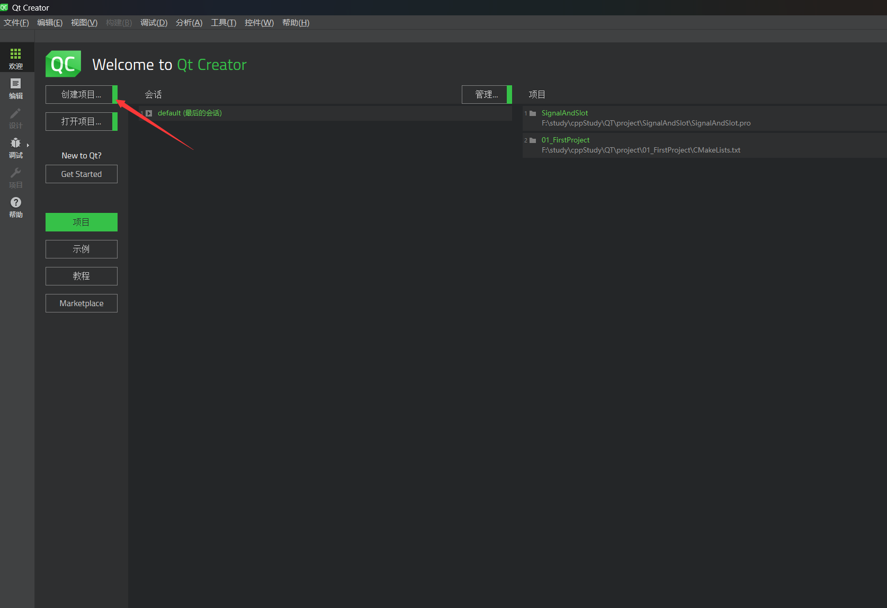
+ 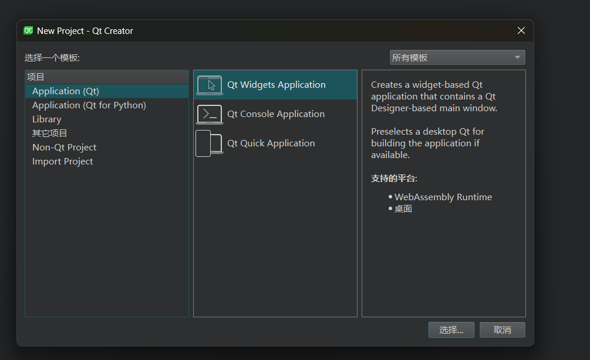
+ 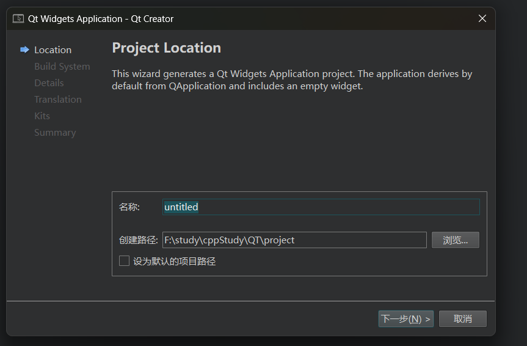
+ 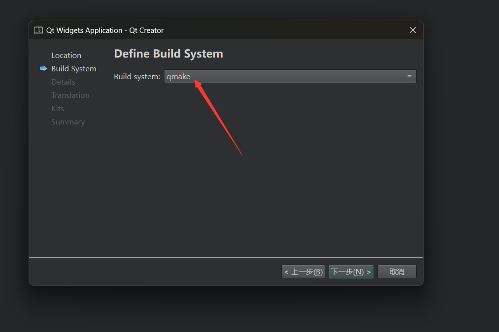
+ 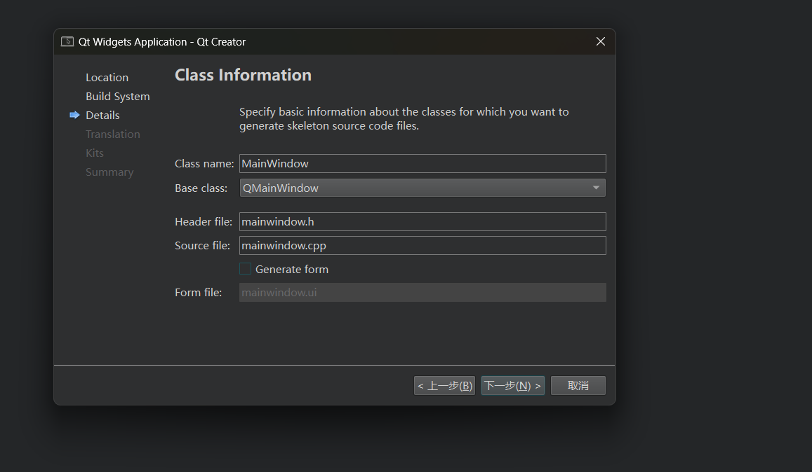
+ 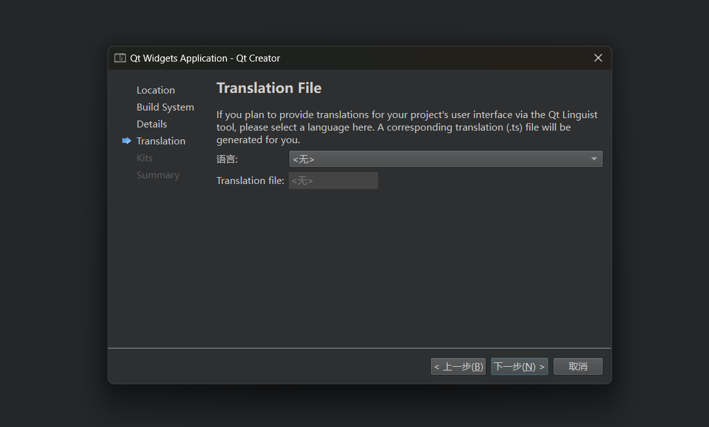
+ 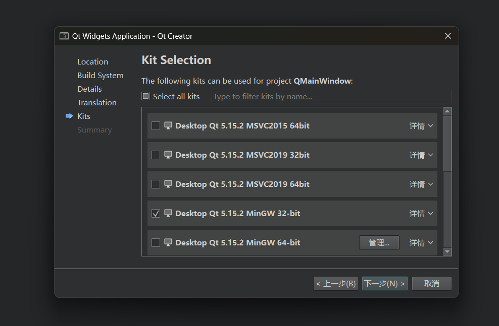
+ 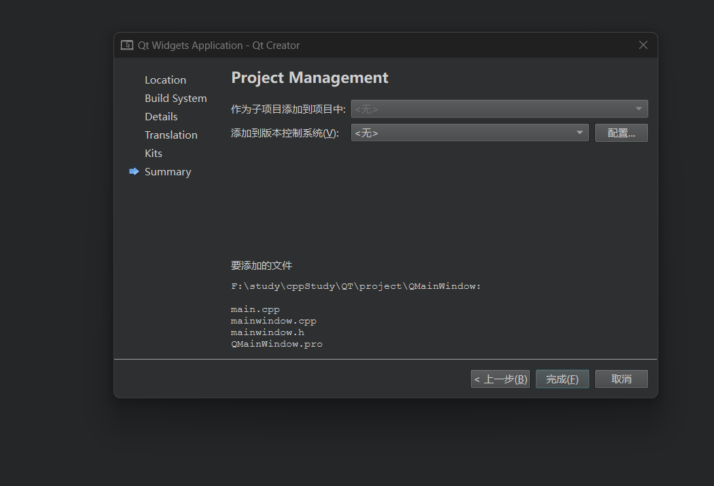
## 3. 常用控件

### 3.1 按钮

```c++
myWidget::myWidget(QWidget *parent)
    : QWidget(parent)
{
    //创建一个按钮
    QPushButton * btn = new QPushButton;
    //btn ->show();// show 以顶层方式弹出窗口控件
    // 让btn对象 以来在 mywidget窗口中
    btn->setParent(this);
    // 显示文本
    btn->setText("第一个按钮");


    // 创建第二个按钮  按照控件的大小创建窗口
    QPushButton * btn2 = new QPushButton("第二个按钮",this);
    // 移动btn2
    btn2->move(100,100);
    // 重置窗口大小
    resize(600,400);
    // 设置固定窗口大小
    setFixedSize(600,400);
    // 设置窗口标题
    setWindowTitle("第一个窗口");
}
```

### 3.2 对象树

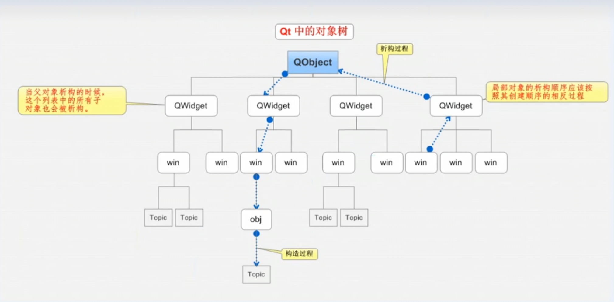

+ 当创建的对象在堆区时候，如果指定的父亲是Qobject派生下来的类或者Qobject子类派生下来的类，可以不用管理释放的操作，将对象会放入到对象树中。
+ 一定程度上简化了内存回收机制

### 3.3 QT中的坐标系

+ 左上角为（0，0）点
+ x以右为正方向
+ y以下为正方向

## 4. 信号和槽

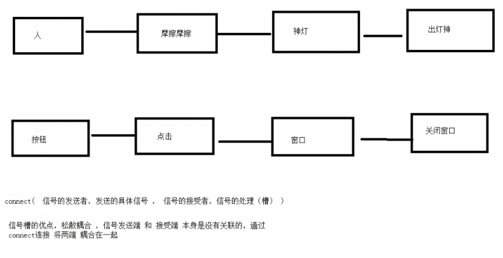

+ ```c++
      // 需求，点击按钮   关闭窗口
      // 参数1 信号的发送者
      // 参数2 发送的信号（函数的地址）
      // 参数3 信号的接收者
      // 参数4 处理的槽函数
  	// connect(btn2,&QPushButton::clicked,this,&myWidget::close);
      connect(btn2,&QPushButton::clicked,this,&QWidget::close);
  ```

### 4.1 自定义信号和槽

+ `teacher.h` 信号（**只需要声明，不需要实现**）

```c++
#ifndef TEACHER_H
#define TEACHER_H

#include <QObject>

class Teacher : public QObject
{
    Q_OBJECT
public:
    explicit Teacher(QObject *parent = nullptr);

signals:
    // 自定义信号  写道signals下
    // 返回值是 void ，只需要声明，不需要实现
    // 可以有参数，可以重载
    void hungry();
};

#endif // TEACHER_H

```

+ `teacher.cpp`

```c++
#include "teacher.h"

Teacher::Teacher(QObject *parent)
    : QObject{parent}
{

}
```

+ `student.h` 槽函数（**需要声明，也需要实现**）

```c++
#ifndef STUDENT_H
#define STUDENT_H

#include <QObject>

class Student : public QObject
{
    Q_OBJECT
public:
    explicit Student(QObject *parent = nullptr);
    // 早期QT版本  必须 写道public slots ，高级版本可以写道public或者全局下
    // 返回值 void ，需要声明，也需要实现
    // 可以有参数，可以发生重载
    void treat();
signals:

};

#endif // STUDENT_H
```

+ `student.cpp`

```C++
#include "student.h"
#include<QDebug>

Student::Student(QObject *parent)
    : QObject{parent}
{

}

void Student::treat()
{
    qDebug() << "请老师吃饭";
}
```

+ `widget.h`

```c++
#ifndef WIDGET_H
#define WIDGET_H

#include "teacher.h"
#include "student.h"

#include <QWidget>

QT_BEGIN_NAMESPACE
namespace Ui { class Widget; }
QT_END_NAMESPACE

class Widget : public QWidget
{
    Q_OBJECT

public:
    Widget(QWidget *parent = nullptr);
    ~Widget();

private:
    Ui::Widget *ui;
    Teacher * zt;
    Student * st;
    void classIsOver();
};
#endif // WIDGET_H
```

+ `widget.cpp`

```c++
#include "widget.h"
#include "ui_widget.h"

// Teacher类老师类
// student类学生类
//下课后，老师会触发一个信号，饿了，学生响应信号，请客吃饭


Widget::Widget(QWidget *parent) :
    QWidget(parent),
    ui(new Ui::Widget)
{
    ui->setupUi(this);
    // 创建一个老师对象
    this->zt = new Teacher(this);
    // 创建一个学生对象
    this->st = new Student(this);

    // 老师饿了  学生请客的连接
    connect(zt,&Teacher::hungry,st,&Student::treat);
    // 调用下课函数
    classIsOver();
}

void Widget::classIsOver()
{
    // 下课函数，调用后 出发老师饿了的信号
    emit zt->hungry();
}

Widget::~Widget()
{
    delete ui;
}
```

### 4.2 自定义信号和槽发生重载解决

+ 需要利用函数指针，明确指向函数的地址

```C++
	// 连接带参数的 信号和槽
    // 指针-> 地址
    // 函数指针 -> 函数地址
    void(Teacher:: *teacherSignal)(QString) = &Teacher::hungry;
    void(Student:: *studentSignal)(QString) = &Student::treat;
    connect(zt,teacherSignal,st,studentSignal);
    classIsOver();
```

+ 双引号问题解决（**`Qstring -> char*`**）

```c++
void Student::treat(QString foodName)
{
    // Qstring -> char* 就没有双引号了   先转成QByteArray（.toYtf8()） 再转char *(.data())
    // 请老师吃饭,老师要吃 "宫保鸡丁"
    qDebug() << "请老师吃饭,老师要吃" << foodName.toUtf8().data();
}
```

### 4.3 信号连接信号

```c++
 	// 点击一个 下课的按钮，再触发下课
    QPushButton * btn = new QPushButton("下课",this);
    this->resize(600,400);
    // 点击按钮 触发下课
    // connect(btn,&QPushButton::clicked,this,&Widget::classIsOver);

    //  无参信号和槽连接
    void(Teacher:: *teacherSignal2)(void) = &Teacher::hungry;
    void(Student:: *studentSignal2)(void) = &Student::treat;
    connect(zt,teacherSignal2,st,studentSignal2);
    // 信号连接信号
    connect(btn,&QPushButton::clicked,zt,teacherSignal2);
    // 断开信号
    disconnect(zt,teacherSignal2,st,studentSignal2);
```

### 4.4 扩展及其QT4版本信号和槽

+ 扩展
  + 信号是可以连接信号
  + 一个信号可以连接多个槽函数
  +  多个信号 可以连接 同一个槽函数
  +  信号和槽函数的参数 必须是一一对应的
  +  信号和槽函数的参数个数  信号的参数个数  可以多于  槽函数的参数个数

```c++
	// QT4版本以前的信号和槽连接方式
    // 利用 QT4信号槽 连接无参版本
    // Qt4版本底层sIGNAL ( "hungry")SLOT ( "treat")
    connect(zt,SIGNAL(hungry()),st,SLOT(treat()));
    // QT4版本优点，参数直观  缺点：类型不做检测
    // 向下兼容
```

### 4.5 Lambda 表达式

+ 早期版本必须在`.pro` 文件下，添加如下代码：
  + `CONFIG += c++11`
+ **Lambda 表达式 用于定义并创建匿名的函数对象**
+ 语法
  + `[ capture ] ( params ) opt -> ret { body; };`
  + 其中 capture 是捕获列表，params 是参数表，opt 是函数选项，ret 是返回值类型，body是函数体。
+ lambda 表达式还可以通过捕获列表捕获一定范围内的变量：
  - [] 不捕获任何变量。
  - [&] 捕获外部作用域中所有变量，并作为引用在函数体中使用（按引用捕获）。
  - [=] 捕获外部作用域中所有变量，并作为副本在函数体中使用（按值捕获）。
  - [=，&foo] 按值捕获外部作用域中所有变量，并按引用捕获 foo 变量。
  - [bar] 按值捕获 bar 变量，同时不捕获其他变量。
  - [this] 捕获当前类中的 this [指针](http://c.biancheng.net/c/80/)，让 lambda 表达式拥有和当前类成员函数同样的访问权限。如果已经使用了 & 或者 =，就默认添加此选项。捕获 this 的目的是可以在 lamda 中使用当前类的成员函数和成员变量。

```c++
 [=](){
      btn->setText("aaaa");
    }();
```

+ 可修改标示符:

  + mutable 声明，这部分可以省略。按值传递函数对象参数时，加上 mutable修饰符后，可以修改按值传递进来的拷贝（注意是能修改拷贝，而不是值本身)。

  ```c++
    	QPushButton * myBtn = new QPushButton (this) ;
      QPushButton * myBtn2 = new QPushButton (this);myBtn2->move (100,100);
      int m = 10;
      connect (myBtn,&QPushButton::clicked,this,[m] ()mutable { m = 100+10; qDebug () <<m; });
      connect (myBtn2,&QPushButton::clicked,this,[=] () { qDebug() << m; });
      qDebug () <<m;
  ```

+ 函数返回值

  + ->返回值类型，标识函数返回值的类型，当返回值为void，或老函数体中只有一处return 的地方（此时编译器可以自动推断出返回值类型）时，这部分可以省略。

+ 函数体

  + {}，标识函数的实现，这部分不能省略，但函数体可以为空。

+ 案列

```c++
 // 利用lambda 表达式，实现点击按钮 关闭窗口
    QPushButton * btn2 = new QPushButton;
    btn2->setText("关闭");
    btn2->move(100,0);
    btn2->setParent(this);
//  connect(btn2,&QPushButton::clicked,this,[=](){
    connect(btn2,&QPushButton::clicked,[=](){
//      this->close();
//      emit zt->hungry("宫保鸡丁");
        btn2->setText("aaa");
    });
```

## 5. QMainWindow（set开头，只有一个；add开头可以有多个）

+ QMainWindow.是一个为用户提供主窗口程序的类，包含一个菜单栏(menu bar)、多个工具栏(tool bars)、多个锚接部佳(dock widgets)、一个状态栏(status bar)及一个中心部件(central widget)，是许多应用程序的基础，如文本编辑器，图片编辑器等。
+ 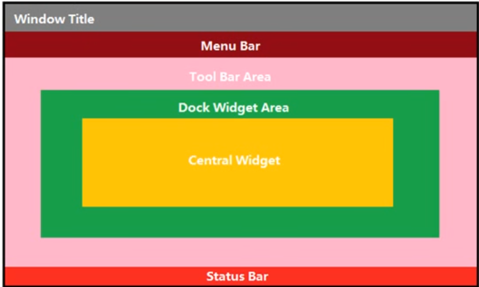

```c++
#include "mainwindow.h"
#include<QMenuBar>
#include<QToolBar>
#include<QDebug>
#include<QPushButton>
#include<QStatusBar>
#include<QLabel>
#include<QDockWidget>
#include<QTextEdit>

MainWindow::MainWindow(QWidget *parent)
    : QMainWindow(parent)
{
    // 重置窗口大小
    resize(1000,800);
    // 菜单栏 只能最多有一个
    QMenuBar * bar =  menuBar();
    // 将菜单栏放入窗口中
    setMenuBar(bar);
    // 创建菜单
    QMenu * fileMenu = bar->addMenu("文件");
    QMenu * editMenu = bar->addMenu("编辑");
    // 创建菜单项
    QAction * newAction =  fileMenu->addAction("新建");
    // 添加分隔线
    fileMenu->addSeparator();
    QAction * openAction = fileMenu->addAction("打开");


    // 工具栏  可以有多个
    QToolBar * toolBar = new QToolBar(this);
    addToolBar(Qt::LeftToolBarArea,toolBar);
    // 后期设置 只允许 左右停靠
    toolBar->setAllowedAreas(Qt::LeftToolBarArea | Qt::RightToolBarArea);
    // 设置浮动
    toolBar->setFloatable(false);
    // 设置移动(总开关)
    toolBar->setMovable(false);

    // 工具栏中可以设置内容
    toolBar -> addAction(newAction);
    // 添加分隔线
    toolBar->addSeparator();
    toolBar -> addAction(openAction);
    // 工具栏中添加控件
    QPushButton * btn = new QPushButton("aa",this);
    toolBar->addWidget(btn);

    // 状态栏 最多有一个
    QStatusBar * stBar =  statusBar();
    // 设置到窗口中
    setStatusBar(stBar);
    // 放标签控件
    QLabel * label = new QLabel("提示信息",this);
    stBar->addWidget(label);

    QLabel * label2 = new QLabel("右侧提示信息",this);
    stBar->addPermanentWidget(label2);
    // 铆接部件（浮动窗口） 可以有多个
    QDockWidget * dockWidge = new  QDockWidget("浮动",this);
    addDockWidget(Qt::BottomDockWidgetArea,dockWidge);
    // 设置后期停靠区域，只允许
    dockWidge->setAllowedAreas(Qt::TopDockWidgetArea | Qt::BottomDockWidgetArea);

    // 设置中心部件 只能有一个
    QTextEdit * edit = new QTextEdit(this);
    setCentralWidget(edit);
}

MainWindow::~MainWindow()
{
}
```

## 6. 资源文件

### 6.1 QT配置资源文件

+ 1. 右键`添加新文件` 
+ 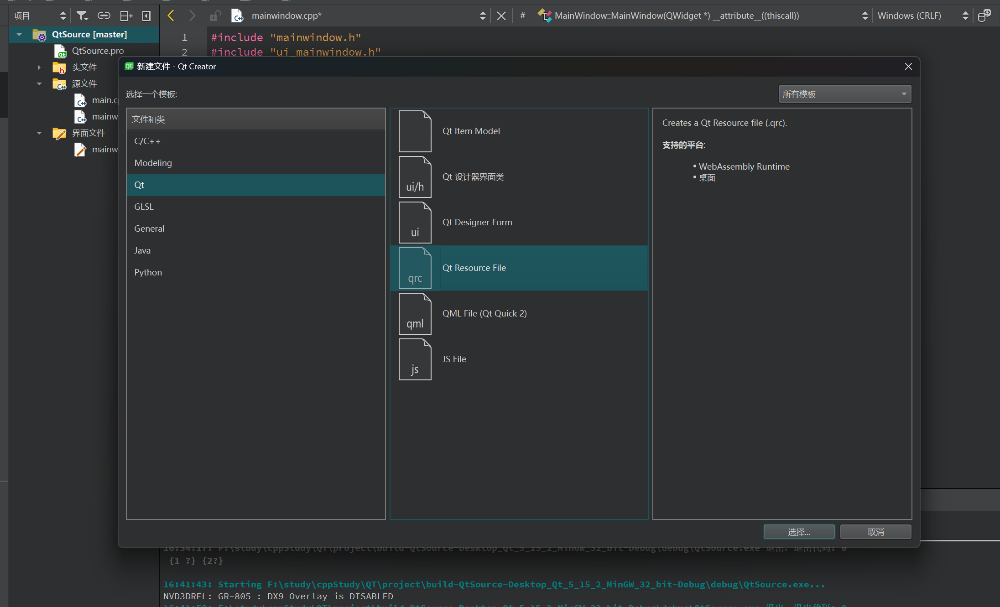
+ 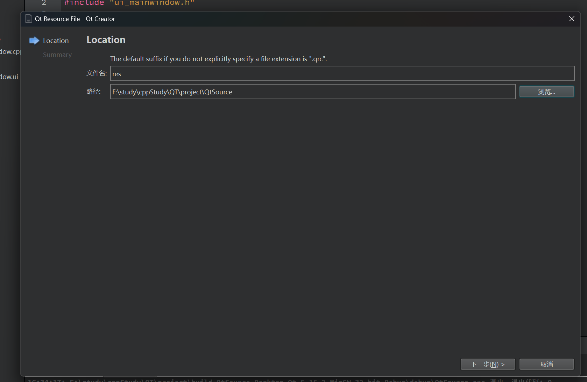
+ 报错处理
  + 报错信息 `[Makefile.Debug:509: debug/qrc_res.o] Error 1`
  + 解决方式 在`.pro`中添加 `CONFIG += resources_big`

## 7. 对话框

+  模态和非模态对话框
```c++
      // 点击新建按钮 弹出一个对话框
      connect(ui->actionnew,&QAction::triggered,[=](){
          // 对话框 分类
          // 模态对话框（可以对其他窗口进行操作） 非模态对话框（可以对其他窗口进行操作）
          // 模态创建 阻塞
  //        QDialog dlg(this);
  //        dlg.exec();
  //        dlg.resize(200,100);
  //        qDebug() << "模态对话框弹出";
  
          // 非模态对话框
          QDialog * dlg2 =  new QDialog(this);
          dlg2->resize(300,200);
          dlg2->setAttribute(Qt::WA_DeleteOnClose);
          dlg2->show();
  
      });
```

+ 标准对话框
  + QColorDialog:   选择颜色;
  + QEileDialog:   选择文件或者目录;
  + QFontDialgg:   选择字体;
  + QInputDialog:  允许用户输入一个值，并将其值返回;v
  + QMessageBox:  模态对话框，用于显示信息、询问问题等;
  + QPageSetupDialog:  为打印机提供纸张相关的选项;u
  + QPxintDialog:  打印机配置;v
  + QPxintPxexiewDialog:打印预览;
  + QProgxessDialog:  显示操作过程。

``` c++
 // 消息对话框
        // 错误对话框
//        QMessageBox::critical(this,"critical","错误");
        // 信息对话框
//        QMessageBox::information(this,"information","信息");
        // 提问对话框
        // 参数1 父亲 参数2 标题 参数3 提示内容  参数4  按键类型  参数5  默认关联回车按键
//        if(QMessageBox::Save == QMessageBox::question(this,"question","提问",QMessageBox::Save | QMessageBox::Cancel,QMessageBox::Cancel))
//        {
//            qDebug() << "选择的是保存";
//        }
//        else
//        {
//            qDebug() << "选择的是取消";
//        }
        // 警告对话框
//        QMessageBox::warning(this,"warning","警告");
```

> 返回值也是standardButton类型，利用返回值判断用户的输入

```c++
//其他标准对话框
        //颜色对话框
//        QColor color = QColorDialog::getColor(QColor (255,0,0));
//        qDebug() << "r = " << color.red() << " g = " << color.green() <<"b = "<<color.blue();

        // 文件对话框
        // 参数1 父亲  参数2 标题  参数 3 默认打开路径   参数4  过滤文件格式
        // 返回值 是 选取的路径
//        QColor str = QFileDialog::getOpenFileName(this,"打开文件","F:/study/cppStudy/QT","(*.md)");
//        qDebug()<< str;

        // 字体对话框
        bool flage;
        QFont font = QFontDialog::getFont(&flage,QFont("华文彩云",26));
        qDebug()<< "字体： " << font.family().toUtf8().data() << "字号： " << font.pointSize() << "是否加粗 " << 			font.bold() << "是否倾斜 " << font.italic() ;
```

## 8. 界面布局

+ 实现登录窗口
+ 利用布局方式，给窗口进行美化
+ 选取widget 进行布局，水平布局，垂直布局，栅格布局
+ 给用户名，密码，登录，退出按钮进行布局
+ 默认窗口和控件之间有间隙    layout（有上下左右间隙）
+ 利用弹簧进行布局

## 9. 控件

### 9.1 按钮组

+ QPushButton 常用按钮
+ QToolButton 工具按钮  用于显示图片，如图想显示文字，修改分格； toolButtonStyle，凸起风格 autoRaise
+ radioButton  单选按钮 ，设置默认 ` ui->rBtnMan->setChecked(true);`
+ checkBox 多选按钮 监听状态：// 多选按钮 2 是选中  0 是未选中   tristate 属性 是 半选状态  是  1

```c++
 // 设置单选按钮 男默认选中
    ui->rBtnMan->setChecked(true);

    // 选中女后 打印信息
    connect(ui->rBtnWoman,&QRadioButton::clicked,[=](){
        qDebug() << "选中女了";
    });

    // 多选按钮 2 是选中  0 是未选中   tristate 属性 是 半选状态  是  1
    connect(ui->cBox,&QCheckBox::stateChanged,[=](int state){
        qDebug() << state;
    });
```

### 9.2 QListWidfet 列表容器

```c++
    // 利用listWidget 写诗  一行内容
//    QListWidgetItem * item = new QListWidgetItem("锄禾日当午");
//    // 将一行诗放入到listWidget 控件中
//    ui->listWidget->addItem(item);
    // 水平居中
//    item->setTextAlignment(Qt::AlignHCenter);

    // QSringList  Qlist<QString>
    QStringList list;
    list << "锄禾日当午" << "汗滴禾下土" ;
    ui->listWidget->addItems(list);
```

### 9.3 QTreeWidget树控件

```c++
// treeWidget树控件使用

    // 设置水平头
    ui->treeWidget->setHeaderLabels(QStringList()<<"英雄"<<"英雄介绍");
    QTreeWidgetItem * liItem = new QTreeWidgetItem(QStringList()<<"力量");
    QTreeWidgetItem * minItem = new QTreeWidgetItem(QStringList()<<"敏捷");
    QTreeWidgetItem * zhiItem = new QTreeWidgetItem(QStringList()<<"智力");
    // 加载顶层的节点
    ui->treeWidget->addTopLevelItem(liItem);
    ui->treeWidget->addTopLevelItem(minItem);
    ui->treeWidget->addTopLevelItem(zhiItem);

    // 追加子节点
    QStringList heroL1;
    heroL1 <<"刚被猪"<<"前排坦克，能在吸收伤害的同时造成可观的范围输出";
    QTreeWidgetItem * l1 = new QTreeWidgetItem(heroL1);
    liItem->addChild(l1);
```

### 9.4 QTableWidget控件

```c++
  // tableWidget 控件
    // 设置列数
    ui->tableWidget->setColumnCount(3);
    // 设置水平表头
    ui->tableWidget->setHorizontalHeaderLabels(QStringList()<<"姓名"<<"性别"<<"年龄");
    // 设置行数
    ui->tableWidget->setRowCount(5);
    // 设置正文
//    ui->tableWidget->setItem(0,0,new QTableWidgetItem("亚瑟"));

    QStringList nameList;
    nameList<< "亚瑟" << "赵云" << "张飞" << "关羽" << "花木兰";

    QList<QString> sexList;
    sexList << "男" << "男" << "男" << "男" << "女" ;

    for(int i = 0; i < 5; i++ )
    {
        int col = 0;
        ui->tableWidget->setItem(i,col++,new QTableWidgetItem(nameList[i]));
        ui->tableWidget->setItem(i,col++,new QTableWidgetItem(sexList.at(i))); // 访问过界 【】 崩掉  at 抛出异常
        // int 转 QString
        ui->tableWidget->setItem(i,col++,new QTableWidgetItem( QString::number(i+18)));
    }
```

### 9.5 其他控件 介绍

```c++
 // 栈控件使用
    // 设置默认值 scrollArea
    ui->stackedWidget->setCurrentIndex(1);
    //scrollArea
    connect(ui->btn_scrollArea,&QPushButton::clicked,[=](){
        ui->stackedWidget->setCurrentIndex(1);
    });
    // toolBox
    connect(ui->btn_toolBox,&QPushButton::clicked,[=](){
        ui->stackedWidget->setCurrentIndex(2);
    });
    // tabWidget
    connect(ui->btn_tabWidget,&QPushButton::clicked,[=](){
        ui->stackedWidget->setCurrentIndex(0);
    });

    // 下拉框
    ui->comboBox->addItem("奔驰");
    ui->comboBox->addItem("宝马");
    ui->comboBox->addItem("tuolaji");
    // 点击按钮  选中拖拉机选项
    connect(ui->btn_selectta,&QPushButton::clicked,[=](){
//        ui->comboBox->setCurrentIndex(2);
        ui->comboBox->setCurrentText("tuolaji");
    });

    // 利用QLabel显示图片
//    ui->label->setPixmap(QPixmap("路径"));
    // 利用QLavel显示 gif动态图片
//    QMovie * movie = new QMovie("路径");
//    ui->label->setMovie(movie);
//    // 播放动图；
//    movie->start();
```

## 10. 自定义控件

### 10.1 创建分装新控件ui流程

+ 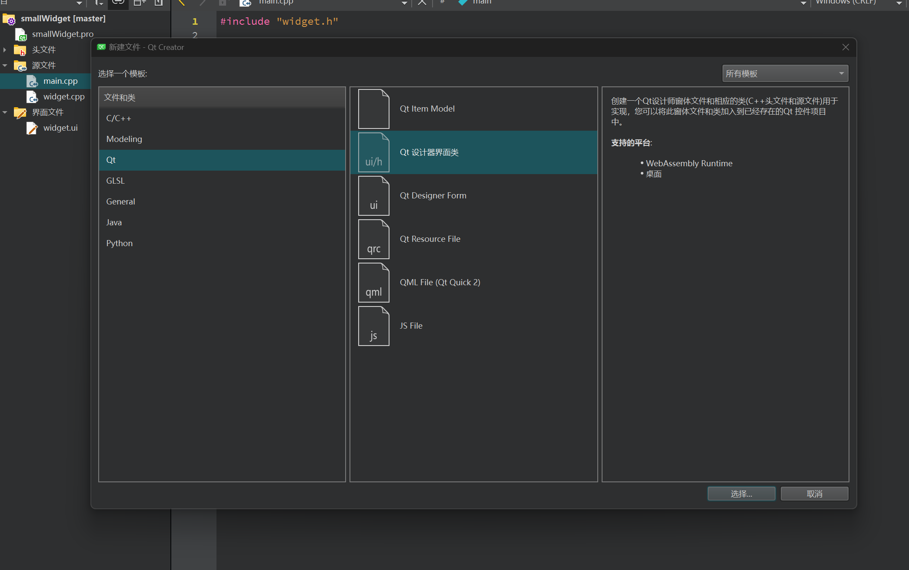
+ 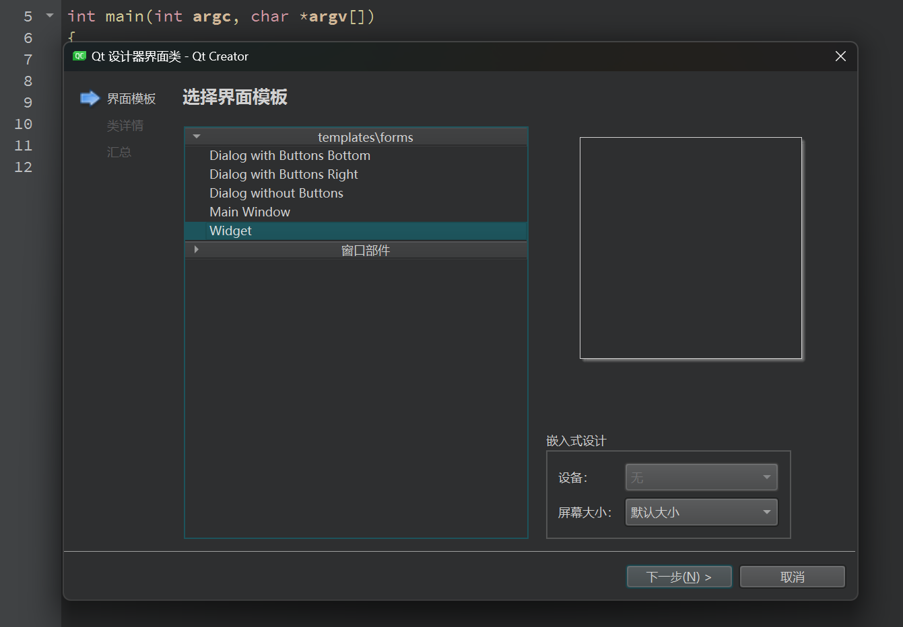
+ 

### 10.2 显示

+ 记得在widget中创建同类型的区域，并进行提升。
  + 添加新文件 -  QT-设计界面类
  + .ui 中 设计  QSpinBox 和 QSlider 两个控件
  + Widget 中使用自定义控件，拖拽一个 Widget，点击提升为，点击添加，点击提升
  + 实现功能，改变数字，滑动条跟着移动，信号槽监听
  + 提供getNum 和 setNum 对外接口
  + 测试接口

### 10.3 相关代码

+ smallwidget.h

```c++
#ifndef SMALLWIDGET_H
#define SMALLWIDGET_H

#include <QWidget>

namespace Ui {
class smallWidget;
}

class smallWidget : public QWidget
{
    Q_OBJECT

public:
    explicit smallWidget(QWidget *parent = nullptr);
    ~smallWidget();
    // 设置数字
    void setNum(int num);
    // Huoqu数字
    int getNum();

private:
    Ui::smallWidget *ui;
};

#endif // SMALLWIDGET_H
```

+ smallwidget.cpp

```c++
#include "smallwidget.h"
#include "ui_smallwidget.h"

smallWidget::smallWidget(QWidget *parent) :
    QWidget(parent),
    ui(new Ui::smallWidget)
{
    ui->setupUi(this);

    // QSpinBox 移动 QSlider跟着移动
    //函数指针
    void(QSpinBox:: * spSignal)(int) = &QSpinBox::valueChanged;
    connect(ui->spinBox,spSignal,ui->horizontalSlider,&QSlider::setValue);

    //QSlider滑动 QSpinBox跟着移动
    connect(ui->horizontalSlider,&QSlider::valueChanged,ui->spinBox,&QSpinBox::setValue);
}

// 设置数字
void smallWidget::setNum(int num)
{
    ui->spinBox->setValue(num);
}
// Huoqu数字
int smallWidget::getNum()
{
    return ui->spinBox->value();
}


smallWidget::~smallWidget()
{
    delete ui;
}
```

+ widget.cpp

```c++
#include "widget.h"
#include "ui_widget.h"
#include<QDebug>

Widget::Widget(QWidget *parent)
    : QWidget(parent)
    , ui(new Ui::Widget)
{
    ui->setupUi(this);

    // 点击获取 获取当前控件的值
    connect(ui->pushButton,&QPushButton::clicked,[=](){
        qDebug() << ui->widget->getNum();
    });
    // 设置到一半
    connect(ui->pushButton_2,&QPushButton::clicked,[=](){
        ui->widget->setNum(50);
    });

}

Widget::~Widget()
{
    delete ui;
}
```

## 11 QT中事件

### 11.1 基本事件

+ mylabel.cpp

```c++
#include "mylabel.h"
#include<QDebug>
#include<QMouseEvent>
myLabel::myLabel(QWidget *parent)
    : QLabel{parent}
{
    // 设置鼠标追踪
    setMouseTracking(true);
}

// 鼠标进入事件
void myLabel::enterEvent(QEvent *event)
{
    qDebug()<< "鼠标进入了";
}
// 鼠标离开事件
void myLabel::leaveEvent(QEvent *event)
{
    qDebug()<<"鼠标离开了";
}
// 鼠标移动
void myLabel::mouseMoveEvent(QMouseEvent *ev)
{
//    if(ev->button() & Qt::LeftButton)
//    {
        qDebug()<< "鼠标移动";
//    }
}
// 鼠标按下
void myLabel::mousePressEvent(QMouseEvent *ev)
{
    if(ev->button() == Qt::LeftButton)
    {
        QString str = QString( "鼠标按下了x = %1 y = %2 globalX = %3  globalY = %4" ).arg(ev->x() ).arg(ev->y()).arg(ev->globalX()).arg(ev->globalY());
        qDebug()<< str;
    }
}
// 鼠标释放
void myLabel::mouseReleaseEvent(QMouseEvent *ev){
    qDebug()<< "鼠标释放";
}


// 通过event事件分发器 拦截 鼠标按下事件
bool myLabel::event(QEvent *e)
{
    // 如果是鼠标按下  在event事件分发中做拦截操作
    if(e->type() == QEvent::MouseButtonPress)
    {
        // 静态类型转换
        QMouseEvent * ev = static_cast<QMouseEvent *>(e);
        QString str = QString( "event鼠标按下了x = %1 y = %2 globalX = %3  globalY = %4" ).arg(ev->x() ).arg(ev->y()).arg(ev->globalX()).arg(ev->globalY());
        qDebug()<< str;

        return true; // true 代表用户自己处理这个事件  不向下分发
    }
    // 其他事件 交给父类处理  默认处理
    return QLabel::event(e);
}

```

+ ev->button() 可以判断所有案件 Qt::LeftButton  Qt::RightButton
+ ev->buttons()判断组合案件  判断move时候的左右键 结合& 操作符

+ mylabel.h

```c++
#ifndef MYLABEL_H
#define MYLABEL_H

#include <QLabel>

class myLabel : public QLabel
{
    Q_OBJECT
public:
    explicit myLabel(QWidget *parent = nullptr);
    // 鼠标进入事件
    void enterEvent(QEvent *event);
    // 鼠标离开事件
    void leaveEvent(QEvent *event);

    // 鼠标移动
    virtual void mouseMoveEvent(QMouseEvent *ev);
    // 鼠标按下
    virtual void mousePressEvent(QMouseEvent *ev);
    // 鼠标释放
    virtual void mouseReleaseEvent(QMouseEvent *ev);
    // 通过event事件分发器 拦截 鼠标按下事件
    bool event(QEvent *ev);


signals:

};

#endif // MYLABEL_H

```

+ widget.cpp

```C++
#include "widget.h"
#include "ui_widget.h"

Widget::Widget(QWidget *parent)
    : QWidget(parent)
    , ui(new Ui::Widget)
{
    ui->setupUi(this);

    // 启动定时器
    id1 = startTimer(1000); // 参数1 间隔 毫秒
    id2 = startTimer(2000);

    // 定时器第二种方式
    QTimer * timer = new QTimer(this);
    // 启动定时器
    timer->start(500); // 0.5s
    connect(timer,&QTimer::timeout,[=](){
        static int num = 1;

        // 每隔1s加一
        ui->label_4->setText(QString::number(num++));
    });

    // 点击暂停按钮 实现停止定时器
    connect(ui->pushButton,&QPushButton::clicked,[=]()
    {
        timer->stop();
    });

    // 给label1 安装事件过滤器
    // 步骤1 安装事件过滤器
    ui->label->installEventFilter(this);
}

// 步骤2 重写事件过滤器事件
bool Widget::eventFilter(QObject * obj, QEvent * e)
{
    if(obj == ui->label)
    {
        if(e->type() == QEvent::MouseButtonPress)
        {
            // 静态类型转换
            QMouseEvent * ev = static_cast<QMouseEvent *>(e);
            QString str = QString( "事件过滤中，鼠标按下了x = %1 y = %2 globalX = %3  globalY = %4" ).arg(ev->x() ).arg(ev->y()).arg(ev->globalX()).arg(ev->globalY());
            qDebug()<< str;

            return true; // true 代表用户自己处理这个事件  不向下分发
        }
    }
    // 其他默认处理
    return QWidget::eventFilter(obj,e);
}

// 重写定时器的事件
void Widget::timerEvent(QTimerEvent * ev)
{
    if(ev->timerId() == id1)
    {
        static int num = 1;

        // 每隔1s加一
        ui->label_2->setText(QString::number(num++));
    }

    if(ev->timerId() == id2)
    {
        // 每隔2s +1
        static int num2 = 1;
        ui->label_3->setText(QString::number(num2++));
    }
}

Widget::~Widget()
{
    delete ui;
}


```

+ widget.h

```c++
#ifndef WIDGET_H
#define WIDGET_H

#include <QWidget>
#include<QTimer>
#include<QDebug>
#include<QMouseEvent>

QT_BEGIN_NAMESPACE
namespace Ui { class Widget; }
QT_END_NAMESPACE

class Widget : public QWidget
{
    Q_OBJECT

public:
    Widget(QWidget *parent = nullptr);
    ~Widget();

    // 重写定时器的事件
    void timerEvent(QTimerEvent *);

    int id1;// 定时器1的唯一标识
    int id2;// 定时器2的唯一标识

    // 重写事件过滤器事件
    bool eventFilter(QObject *, QEvent *);
private:
    Ui::Widget *ui;
};
#endif // WIDGET_H

```


### 11.2  定时器

+ 第一种定时器

  + 利用事件 void timerEvent(QTimerEvent *ev)

  + 启动定时器 startTimer（1000） 毫秒为单位

  + timerEvent 的返回值是定时器的唯一标识，可以和ev-> timerId做比较

+ 第二种定时器
  + 利用定时器类 QTimer
  + 创建定时器对象 ` QTimer * timer = new QTimer(this);`
  + 启动定时器 ` timer->start(500);毫秒`
  + 每隔一定毫秒，发送信号  timeout  进行监听
  + 暂停 `timer->stop();`

### 11.3 event事件

+ 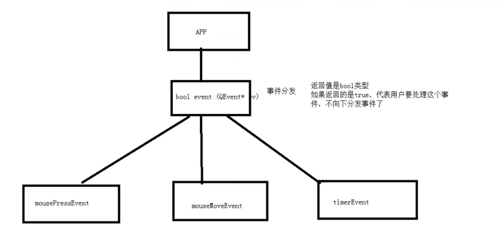

+ 用途

  + 用于事件的分发
  + 也可以做拦截操作（**不建议**）

+ `bool event（QEvent *e）；`

+ 返回值  如果是true代表用户处理这个事件， 不向下分发了

+ e->tyoe() === 鼠标按下

+ ```c++
  // 通过event事件分发器 拦截 鼠标按下事件
  bool myLabel::event(QEvent *e)
  {
      // 如果是鼠标按下  在event事件分发中做拦截操作
      if(e->type() == QEvent::MouseButtonPress)
      {
          // 静态类型转换
          QMouseEvent * ev = static_cast<QMouseEvent *>(e);
          QString str = QString( "event鼠标按下了x = %1 y = %2 globalX = %3  globalY = %4" ).arg(ev->x() ).arg(ev->y()).arg(ev->globalX()).arg(ev->globalY());
          qDebug()<< str;
  
          return true; // true 代表用户自己处理这个事件  不向下分发
      }
      // 其他事件 交给父类处理  默认处理
      return QLabel::event(e);
  }
  ```

### 11.4 事件过滤器

+ 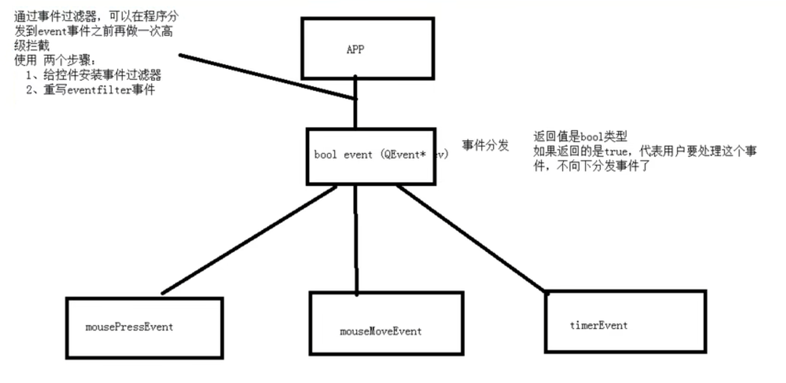

+ 在程序将事件分发到事件分发器前，可以利用过滤器做拦截

+ 步骤

  + 给控件安装事件过滤器
  + 重写eventFilter函数 （obj ，ev）

+ ```c++
  Widget::Widget(QWidget *parent)
      : QWidget(parent)
      , ui(new Ui::Widget)
  {
      ui->setupUi(this);
  
      // 启动定时器
      id1 = startTimer(1000); // 参数1 间隔 毫秒
      id2 = startTimer(2000);
  
      // 定时器第二种方式
      QTimer * timer = new QTimer(this);
      // 启动定时器
      timer->start(500); // 0.5s
      connect(timer,&QTimer::timeout,[=](){
          static int num = 1;
  
          // 每隔1s加一
          ui->label_4->setText(QString::number(num++));
      });
  
      // 点击暂停按钮 实现停止定时器
      connect(ui->pushButton,&QPushButton::clicked,[=]()
      {
          timer->stop();
      });
  
      // 给label1 安装事件过滤器
      // 步骤1 安装事件过滤器
      ui->label->installEventFilter(this);
  }
  
  // 步骤2 重写事件过滤器事件
  bool Widget::eventFilter(QObject * obj, QEvent * e)
  {
      if(obj == ui->label)
      {
          if(e->type() == QEvent::MouseButtonPress)
          {
              // 静态类型转换
              QMouseEvent * ev = static_cast<QMouseEvent *>(e);
              QString str = QString( "事件过滤中，鼠标按下了x = %1 y = %2 globalX = %3  globalY = %4" ).arg(ev->x() ).arg(ev->y()).arg(ev->globalX()).arg(ev->globalY());
              qDebug()<< str;
  
              return true; // true 代表用户自己处理这个事件  不向下分发
          }
      }
      // 其他默认处理
      return QWidget::eventFilter(obj,e);
  }
  ```

### 11.4 绘图事件

+ QPainter绘画

  + 绘图事件void paintEvent()

  + 声明一个画家对象QPainter    painter(this)    this 指定绘图设备

  + 画线、画圆、画矩形、画文字√

  + 设嚣画笔QPen设置画笔宽度、风格

  + 设置画刷QBrush设置画刷风格

  + ```c++
    // 绘图事件
    void Widget::paintEvent(QPaintEvent *)
    {
        // 实例化画家对象  this指向的是绘图设备
        QPainter painter(this);
        //设置画笔
        QPen pen(QColor(255,0,0));
        // 设置画笔的宽度
        pen.setWidth(3);
        // 设置画笔的风格
        pen.setStyle(Qt::DotLine);
    
        // 设置画刷
        QBrush brush(Qt::green);
        // 设置画刷的 风格
        brush.setStyle(Qt::Dense7Pattern);
        // 让画家使用画刷
        painter.setBrush(brush);
    
        // 让画家 使用这个笔
        painter.setPen(pen);
        // 画直线
        painter.drawLine(QPoint(0,0),QPoint(100,100));
        // 画圆
        painter.drawEllipse(QPoint(100,100),50,50);
        //  画矩形
        painter.drawRect(QRect(20,20,50,50));
        // 画文字
        painter.drawText(QRect(10,200,150,50),"好好学习，天天向上");
    }
    ```

+ QPinter高级设置

  + ```c++
      //高级设置
        QPainter painter(this);
    //    painter.drawEllipse(QPoint(100,50),50,50);
    //    // 设置抗锯齿能力  效率较低
    //    painter.setRenderHints(QPainter::Antialiasing);
    //    painter.drawEllipse(QPoint(200,50),50,50);
           // 画矩形
        painter.drawRect(QRect(20,20,50,50));
        painter.translate(100,0);
        // 保存画家状态
        painter.save();
        painter.drawRect(QRect(20,20,50,50));
        painter.translate(100,0);
        // 还原画家保存状态
        painter.restore();
        painter.drawRect(QRect(20,20,50,50));
    ```

+ 手动调用绘画事件
  + 如果想要手动调用绘图随事件  利用update
  + 利用画家画图片  ` painter.drawPixmap(posx,10,QPixmap(":/img/cat.jpg"));`

#### 11.4.1 绘图设备

