# `openssl`

## 1 `openssl` 概述

+ `OpenSSL`是一个安全套接字层密码库，是用c语言实现的,囊括主要的密码算法、常用的密钼和证书封装管理功能及`SSL`协议，并提供丰富的应用程序供测试或其它目的使用。
+ `SSL` 是`Secure SocketsLayer` (安全套接层协议)的缩写，可以在Internet上提供秘密性传输。Netscape公司在推出第一个Web浏览器的同时，提出了`SSL`协议标准。其目标是保证两个应用间通信的保密性和可靠性,可在服务器端和用户端同时实现支持。已经成为Internet上保密通讯的工业标准。`https`协议就用到了`SSL`,`HTTPS`协议是由`SSL+HTTP`协议构建的可进行加密传输、身份认证的网络协议，比`http`协议安全。

> `OpenSSL`即可在windows平台下使用,也可以在`linux`平台下使用,是跨平台的一套加密库.
>
> [openss官网](https://www.openssl.org/)
>
> [opensslGitHub仓库](https://github.com/openssl/openssl)

## 2. 哈希

+ 特点
  + 不可逆
  + 抗碰撞性强
    + 不同的数据拥有不同的哈希值，相同的数据哈希值是相同的
  + 原始数据有细微的变化，哈希值的变化是非常大的
  + 通过哈希函数将原始数据进行计算， **得到的哈希值长度是固定的**
  + 原始的哈希值是一个定长的 `二进制`字符串

### 2.1 哈希算法：

+ `md5`
  + 散列值： `16byte`

+ `sha1`
  + 散列值： `20byte`

+ `sha224`
  + 散列值： `28byte`

+ `sha256`
  + 散列值： `32byte`

+ `sha384`
  + 散列值： `48byte`

+ `sha512`
  + 散列值： `52byte`


> 以上说的散列值长度是二进制数据长度,一般散列值使用16进制格式的数字串表示的,看到的字符串长度是原来的2倍长.

```C++
//使用的头文件
#include <openssl/md5.h>
#include <openssl/sha.h>
```

+ `md5`

```c
# define MD5_DIGEST_LENGTH 16	// md5哈希值长度
// 初始化函数, 初始化参数 c
int MD5_Init(MD5_CTX *c);
	参数c: 传出参数
// 添加md5运算的数据-> 没有计算
// 该函数可以进行多次数据添加 -> 函数多次调用
int MD5_Update(MD5_CTX *c, const void *data, size_t len);
	参数:
		- c: MD5_Init() 初始化得到的
		- data: 传入参数, 字符串
		- len: data数据的长度
// 对添加的数据进行md5计算		
int MD5_Final(unsigned char *md, MD5_CTX *c);
	参数:
		- md: 传出参数, 存储得到的哈希值
		- c: MD5_Init() 初始化得到的
// 通过传递的参数, 直接生成一个md5哈希值
// 只能添加一次数据
unsigned char *MD5(const unsigned char *d, size_t n, unsigned char *md);
	参数:
		- d: 传入, 要进行md5运算的字符串
		- n: 字符串的的长度
		- md: 传出, 存储md5的哈希值
	返回值: 这个地址的函数第三个参数md地址
```

```c
# define SHA_DIGEST_LENGTH		 20
# define SHA224_DIGEST_LENGTH    28
# define SHA256_DIGEST_LENGTH    32
# define SHA384_DIGEST_LENGTH    48
# define SHA512_DIGEST_LENGTH    64

  int SHA1_Init(SHA_CTX *c);
  int SHA1_Update(SHA_CTX *c, const void *data, size_t len);
  int SHA1_Final(unsigned char *md, SHA_CTX *c);
  unsigned char *SHA1(const unsigned char *d, size_t n, unsigned char *md);

  int SHA224_Init(SHA256_CTX *c);
  int SHA224_Update(SHA256_CTX *c, const void *data, size_t len);
  int SHA224_Final(unsigned char *md, SHA256_CTX *c);
  unsigned char *SHA224(const unsigned char *d, size_t n, unsigned char *md);
  int SHA256_Init(SHA256_CTX *c);
  int SHA256_Update(SHA256_CTX *c, const void *data, size_t len);
  int SHA256_Final(unsigned char *md, SHA256_CTX *c);
  unsigned char *SHA256(const unsigned char *d, size_t n, unsigned char *md);

  int SHA384_Init(SHA512_CTX *c);
  int SHA384_Update(SHA512_CTX *c, const void *data, size_t len);
  int SHA384_Final(unsigned char *md, SHA512_CTX *c);
  unsigned char *SHA384(const unsigned char *d, size_t n, unsigned char *md);
  int SHA512_Init(SHA512_CTX *c);
  int SHA512_Update(SHA512_CTX *c, const void *data, size_t len);
  int SHA512_Final(unsigned char *md, SHA512_CTX *c);
  unsigned char *SHA512(const unsigned char *d, size_t n, unsigned char *md);

```

### 2.2 `SHA1`算法调用

+ 新建项目
+ 
+ 
+ 
+ 
+ 
+ 
+ 
> `libcrypto.lib`

+ 如果报以下错误的时候记得按如下处理
  + 
  + 
  + 
  
  > `_CRT_SECURE_NO_WARNINGS`
  
+ `SHA1`算法使用

  + ```c++
    #include<iostream>
    #include<string.h>
    // sha系列  哈希算法都包含该头文件
    #include<openssl/sha.h>
    
    using namespace std;
    void sha1Test()
    {
    	// 1. 初始化
    	SHA_CTX ctx;
    	SHA1_Init(&ctx);
    	// 2. 添加数据
    	SHA1_Update(&ctx, "hello", strlen("hello"));
    	SHA1_Update(&ctx, ",world", strlen(",world"));
    	// 3. 哈希计算
    	unsigned char* md = new unsigned char[SHA_DIGEST_LENGTH];
    	char* res = new  char[SHA_DIGEST_LENGTH*2 + 1];
    	SHA1_Final(md, &ctx);
    	// 4. 格式转化
    	for (int i = 0; i < SHA_DIGEST_LENGTH; ++i)
    	{
    		sprintf(&res[i * 2], "%02x", md[i]);
    	}
    	cout << "sha1:" << res << endl;
    }
    
    int main()
    {
    	sha1Test();
    	return 0;
    }
    ```


### 2.3 封装

+ 封装思路

```C++
- 封装的思路
  ```c++
  // c++中不建议使用宏 -> 常量/枚举/内联->空间换时间
  class MyHash
  {
  public:
      enum HashType{M_MD5, M_SHA1, M_SHA224, M_SHA512, M_SHA384, M_SHA512};
      MyHash(HashType type)	// 得到一个哈希对象, 创建不同的哈希对象
      {
          m_type = type;
          switch(type)
          {
           case M_MD5:
              MD5_Init();
              break;
           case M_sha1:
              SHA1_Init();
              break;
                  
          }
      }
      ~MyHash();
      // 添加数据
      void addData(string str)
      {
          switch(m_type)
          {
          case M_MD5:
              MD5_Update();
              break;
           case M_sha1:
              SHA1_Update();
              break;
          }
      }
      // 计算哈希值
      string result()
      {
          switch(m_type)
          {
          	xxx_Final();
              // 转换 -> 16进制格式
          }
      }
   private:
      HashType m_type;
      MD5_CTX m_md5;
  }
```

## 3. 非对称加密

> `RSA` 算法密钥长度越长，安全性越好，加密解密所需时间越长。

> 密钥长度增长一倍，公钥操作所需时间增加约 4 倍，私钥操作所需时间增加约 8 倍，公私钥生成时间约增长 16 倍

+ 特点
  + 秘钥是一个密钥对：`公钥`， `私钥`
    + 公钥加密，必须私钥解密
    + 私钥加密，必须公钥解密
  + 加密强度比较高，效率低
    + 不会使用非对称加密，加密特别大的数据
+ 应用创景
  + 秘钥分发——> 对称加密
    + 核心思想：加密的时候，`公钥加密，私钥解密`
    + 分发步骤：
      + 假设A，B两端
      + A端生成了一个密钥对，分发公钥，B端有了公钥
      + B端生成一个对称加密的秘钥，使用公钥加密——>密文
      + B将密文发送给A
      + A接受数据—>密文，使用私钥对密文解密->堆成加密的秘钥
  + 签名——> 验证数据是否被篡改，验证数据的所有者
    + 核心思想：`私钥加密，公钥解密`
    + A，B两端，假设A要发送数据
      + A端生成一个密钥对，将公钥进行分发，自己留有私钥
    + 签名
      + A对原始数据进行哈希运算 ——> 哈希值
      + A使用私钥对哈希值加密——>密文
      + 将原始数据+密文发送给B
    + 校验签名
      + B接受数据：密文+ 收到的原始数据
      + 使用公钥对密文解密——>哈希值old
      + 使用has算法对收到的数据进行哈希运算——>哈希值new
      + 比较这两个哈希值
        + 相同：校验成功
        + 不同：校验失败

### 3.1 生成`RSA`密钥对
```c
#include <openssl/rsa.h>
// 申请一块内存, 存储了公钥和私钥
// 如果想得到RSA类型变量必须使用 RSA_new();
RSA *RSA_new(void);
void RSA_free(RSA *);

BIGNUM* BN_new(void);
void BN_free(BIGNUM*);
// 生成密钥对, 密钥对存储在内存中
int RSA_generate_key_ex(RSA *rsa, int bits, BIGNUM *e, BN_GENCB *cb);
	参数:
		- rsa: 通过RSA_new()获得
		- bits: 秘钥长度, 单位: bit, 常用的长度 1024*n (n正整数)
        - e: 比较大的数(5位以内)
            - 通过 BN_new 得到对应的变量
            - 初始化: BN_set_word(e, 12345);
		- cb: 回调函数, 用不到, 直接写NULL

// rsa公钥私钥类型是一样的: RSA类型
// 将参数rsa中的公钥提取出来
RSA *RSAPublicKey_dup(RSA *rsa);
	- rsa参数: 秘钥信息
	- 返回值: rsa公钥
// 将参数rsa中的私钥提取出来
RSA *RSAPrivateKey_dup(RSA *rsa);
	- rsa参数: 秘钥信息
	- 返回值: rsa私钥

// 创建bio对象
// 密钥对写磁盘文件的时候, 需要编码 -> base64
// 封装了fopen
BIO *BIO_new_file(const char *filename, const char *mode);
	参数:
		- filename: 文件名
		- mode: 文件打开方式和fopen打开方式的指定相同
		
int PEM_write_bio_RSAPublicKey(BIO* bp, const RSA* r);
int PEM_write_bio_RSAPrivateKey(BIO* bp, const RSA* r, const EVP_CIPHER* enc, 
	unsigned char* kstr, int klen, pem_password_cb *cb, void* u);
RSA* PEM_read_bio_RSAPublicKey(BIO* bp, RSA** r, pem_password_cb *cb, void* u);
RSA* PEM_read_bio_RSAPrivateKey(BIO* bp, RSA** r, pem_password_cb *cb, void* u);
	参数: 
		- bp: 通过BIO_new_file();函数得到该对象
		- r: 传递一个RSA* rsa指针的地址, 传出参数-> 公钥/私钥
		- cb: 回调函数, 用不到, 指定为NULL
		- u: 给回调传参, 用不到, 指定为NULL

//////////////////////////////////////////////////////////////////////////////////
//////////////////////////////////////////////////////////////////////////////////
RSA* PEM_read_RSAPublicKey(FILE* fp, RSA** r, pem_password_cb *cb, void* u);
RSA* PEM_read_RSAPrivateKey(FILE* fp, RSA** r, pem_password_cb *cb, void* u);

// 写入文件中的公钥私钥数据不是原始数据, 写入的编码之后的数据
// 是一种pem的文件格式, 数据使用base64进行编码
int PEM_write_RSAPublicKey(FILE* fp, const RSA* r);
int PEM_write_RSAPrivateKey(FILE* fp, const RSA* r, const EVP_CIPHER* enc, 
	unsigned char* kstr, int klen, pem_password_cb *cb, void* u);	
	参数:
		- fp: 需要打开一个磁盘文件, 并且指定写权限
		- r: 存储了密钥对
		//////////////// - 私钥独有的参数
		- enc: 指定的加密算法 -> 对称加密 -> NULL
		- kstr: 对称加密的秘钥 -> NULL
		- klen: 秘钥长度 -> 0
		- cb: 回调函数, 用不到, NULL
		- u: 给回调传参, 用不到, NULL
```

### 3.2 加密

> 以块的方式进行加密的, 加密的数据长度, 不能大于秘钥长度
>
> - 假设: 秘钥长度: `1024bit = 128byte`

```c
// 公钥加密
int RSA_public_encrypt(int flen, const unsigned char *from,
                       unsigned char *to, RSA *rsa, int padding);
// 私钥解密
int RSA_private_decrypt(int flen, const unsigned char *from,
                        unsigned char *to, RSA *rsa, int padding);

////////////////////////  签名使用 /////////////////////////
// 私钥加密
int RSA_private_encrypt(int flen, const unsigned char *from,
                        unsigned char *to, RSA *rsa, int padding);
// 公钥解密
int RSA_public_decrypt(int flen, const unsigned char *from,
                       unsigned char *to, RSA *rsa, int padding);
参数:
	- flen: 要加密/解密的数据长度
		长度 0 < flen <= `秘钥长度-11
    - from: 传入, 要加密/解密的数据
    - to: 传出, 存储数据, 加密->存储密文, 解密->存储明文
    - rsa: 秘钥: 公钥/私钥
    - padding: 指定填充方案, 数据填充, 不需要使用者做
    	- 	RSA_PKCS1_PADDING -> 使用该方案会填充11字节
```

### 3.3 签名

```c
int RSA_sign(int type, const unsigned char *m, unsigned int m_length,
             unsigned char *sigret, unsigned int *siglen, RSA *rsa);
	参数:
		- type: 使用的哈希算法
			- NID_MD5
			- NID_SHA1
			- NID_SHA224
			- .....
        - m: 要进行签名的数据
        - m_length: 要签名的数据长度
        	- 0 < m_length <= 秘钥长度-11
        - sigret: 传出, 存储了签名之后的数据 -> 密文
        - siglen: sigret密文长度
        - rsa: 私钥
     返回值: 判断函数状态

int RSA_verify(int type, const unsigned char *m, unsigned int m_length,
               const unsigned char *sigbuf, unsigned int siglen, RSA *rsa);
	参数:
		- type: 使用的哈希算法, 和签名使用的哈希算法一致
			- NID_MD5
			- NID_SHA1
			- NID_SHA224
			- .....
        - m: 进行签名的原始数据 -> 接收到的
        - m_length: m参数字符串的长度
        - sigbuf: 接收到的签名数据
        - siglen: sigbuf接收到的签名数据的长度
        - rsa: 公钥
	返回值:
		如果!=1: 失败
		如果==1: 成功
		
```

- c++的类

```c++
  class MyRSA
  {
  public:
      MyRSA();
      ~MyRSA;
      // 生成密钥对
      // 公钥加密
      // 私钥解密
      // 数据签名
      // 验证签名
  private:
      RSA* pubkey;
      RSA* pirKey;
  }
```

## 4. 对称算法 

### 4.1`AES`

```shell
分组加密: 每组长度 -> 16byte, 128bit
秘钥长度: 16byte, 24byte, 32byte
每组明文和加密之后的密文长度相同
- 分组加密有不同的加密方式
	- 五种密码分组模式
		- 最常用: cbc -> 密文分组链接
			- 需要一个初始化向量 -> 数组 -> 存储一个随机字符串 -> 分组长度相同
			- 加密的和解密的时候都需要这个初始化向量
			- 加解密的时候初始化向量的值必须相同
```

> `AES`是一套对称密钥的密码术，目前已广泛使用，用于替代已经不够安全的`DES算法`。所谓对称密钥，就是说加密和解密用的是同一个密钥，消息的发送方和接收方在消息传递前需要享有这个密钥。和非对称密钥体系不同，这里的密钥是双方保密的，不会让任何第三方知道。

> 对称密钥加密法主要==**基于块加密**，**选取固定长度的密钥**==，去==**加密明文中固定长度的块，生成的密文块与明文块长度一样**==。显然密钥长度十分重要，块的长度也很重要。如果太短，则很容易枚举出所有的明文-密文映射；如果太长，性能则会急剧下降。==**`AES`中规定块长度为128 bit**==，而==**密钥长度可以选择128, 192或256 bit**== 。暴力破解密钥需要万亿年，这保证了`AES`的安全性。

`OpenSSL`中 `AES` 加解密的`API`:

1. 生成加密/解密的Key

   ```c
   #include <openssl/aes.h>
   # define AES_BLOCK_SIZE 16	// 明文分组的大小
   // 加密的时候调用
   // aes中的秘钥格式 AES_KEY
   // 封装加密时候使用的秘钥
   AES_KEY key;
   int AES_set_encrypt_key(const unsigned char *userKey, const int bits, AES_KEY *key);
   // 封装解密时候使用的秘钥
   int AES_set_decrypt_key(const unsigned char *userKey, const int bits, AES_KEY *key);
   ```

   | 参数名称 |                      描述                       |
   | :------: | :---------------------------------------------: |
   | userkey  | 对称加密的秘钥-> 字符串, 长度: `16, 24, 32byte` |
   |  bites   |            指定秘钥的长度: 单位->bit            |
   |   key    |                    传出参数                     |

2. CBC方式加密 - 密码分组链接模式

   ```c
   void AES_cbc_encrypt(const unsigned char *in, unsigned char *out,
                        size_t length, const AES_KEY *key,
                        unsigned char *ivec, const int enc);
   	参数:
   		- in: 要加密/解密的数据
   		- out: 传出参数
   			- 加密: 存储密文
   			- 解密: 存储明文
   		- length: 修改第一个参数in的长度
   			- (len = (字符串长度 + \0) % 16) == 0
               - 如果不是在函数内部会自动填充
               	- 实际长度: ((len / 16) + 1 ) * 16
           - key: 初始化之后的秘钥
           - ivec: 初始化向量, 字符串 ==> 长度和分组长度相同
   		- enc: 指定数据要解密还是解密
   			- # define AES_ENCRYPT     1 -> 加密
   			- # define AES_DECRYPT     0 -> 解密
   
   ```
##  5. 其他

- `OPENSSL_Uplink no OPENSSL_Applink` 错误

  >  `Applink()`函数不属于`openssl`的`dll`内部函数的一部分(通过`dll`分析器看出这个函数不存在), 所以必须把`applink.c`文件应用程序的一部分编译.
  
- 解决方案

  ```c
  extern "C"
  {
  #include <openssl/applink.c>
  };
  ```


### 3.6 `linux`下载`openssl`

```shell
# ubuntu
sudo apt remove openssl
openssl version -a
# 提示有些库找不到   ==>  /usr/local/lib/
find / -name "libcrypto.so"  
# 将路径添加到配置文件中
sudo vim /etc/ld.so.conf
# 将 /usr/local/lib/ 添加到空行中 => 保存退出
sudo ldconfig
```

### 3.7 程序编写

```C++
```

+ 报错了

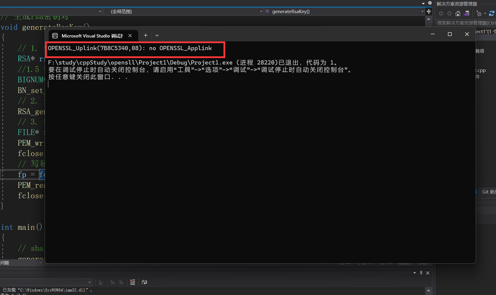

+ 解决方法看： **`其他`**  

## 6.  安装

### 6.1 windows下安装openssl

> 下载地址: http://slproweb.com/products/Win32OpenSSL.html

选择合适的版本进行安装


以下以win32版本安装为例，安装步骤如下：

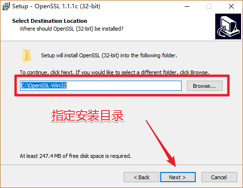

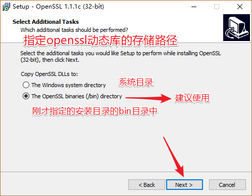

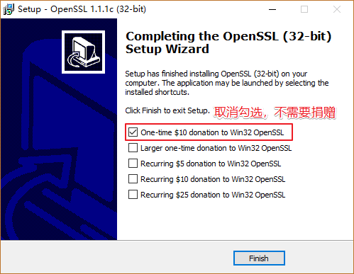

恭喜，OpenSSL安装完成。

将安装目录下的`bin`添加到系统环境变量中, 方便访问

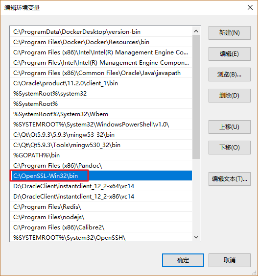

### 6.2 Linux下安装OpenSSL

1. 下载安装包, 下载地址:  <https://www.openssl.org/source/>

2. 源码安装包解压缩

   - openssl-1.1.1c.tar.gzip 解压:

     ```shell
     $ tar zxvf openssl-1.1.1c.tar.gzip
     # 加压完成得到目录: openssl-1.1.1c
     ```

3. 进入解压目录`openssl-1.1.1c`, 安装（可参考安装文件INSTALL）:

   ```shell
   $ ./config
   $ make
   $ make test 		（可选）
   $ make install	 (使用管理员权限执行该命令)
   ```

4. 验证是否安装成功

   ```shell
   $ openssl version -a
   openssl: error while loading shared libraries: libssl.so.1.1: cannot open shared object file: No such file or directory
   # 根据之前讲的动态库知识解决动态库找不到的问题。
   ```

   > 执行命令， 正确的输出结果： 

   ```shell
   $ openssl version -a
   OpenSSL 1.1.1c  28 May 2019
   built on: Fri May 31 03:54:40 2019 UTC
   platform: linux-x86_64
   options:  bn(64,64) rc4(16x,int) des(int) idea(int) blowfish(ptr) 
   compiler: gcc -fPIC -pthread -m64 -Wa,--noexecstack -Wall -O3 -DOPENSSL_USE_NODELETE -DL_ENDIAN -DOPENSSL_PIC -DOPENSSL_CPUID_OBJ -DOPENSSL_IA32_SSE2 -DOPENSSL_BN_ASM_MONT -DOPENSSL_BN_ASM_MONT5 -DOPENSSL_BN_ASM_GF2m -DSHA1_ASM -DSHA256_ASM -DSHA512_ASM -DKECCAK1600_ASM -DRC4_ASM -DMD5_ASM -DAES_ASM -DVPAES_ASM -DBSAES_ASM -DGHASH_ASM -DECP_NISTZ256_ASM -DX25519_ASM -DPOLY1305_ASM -DNDEBUG
   OPENSSLDIR: "/usr/local/ssl"
   ENGINESDIR: "/usr/local/lib/engines-1.1"
   Seeding source: os-specific
   ```

### 6.3 VS中使用openssl

> 打开VS, 创建一个空的控制台应用程序

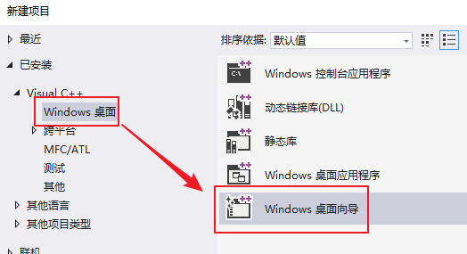

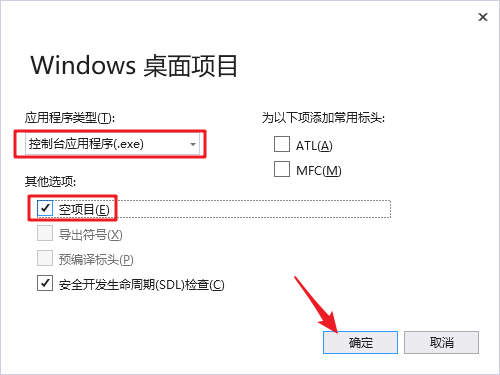

> 设置项目属性, 打开项目的属性面板

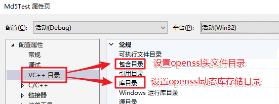

> 添加openssl头文件目录


> 选择安装目录下的 `include`目录, 里边存储了openssl的头文件

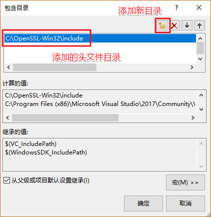

> 添加openssl的库目录

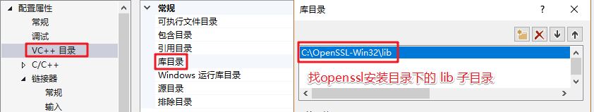

> 配置完毕

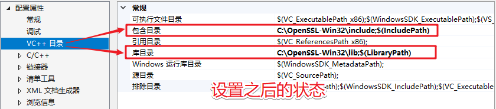

### 6.4. 测试

#### 6.4.1 VS中的相关设置

> 打开项目属性窗口, 添加openssl相关的库到项目中
>
> ==**项目属性 -> 链接器 -> 输入 -> 附件依赖项**==
>
> - **libssl.lib**
> - **libcrypto.lib**

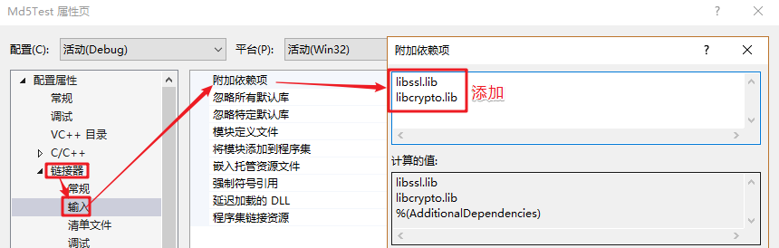

> 测试代码如下:

```c
#define _CRT_SECURE_NO_WARNINGS
#include <openssl/md5.h>		// md5 头文件
#include <stdio.h>
#include <string.h>
#include <stdlib.h>

void getMD5(const char* str, char* result)
{
	MD5_CTX ctx;
	// 初始化
	MD5_Init(&ctx);
	// 添加数据
	MD5_Update(&ctx, str, strlen(str));
	// 计算结果
	unsigned char md[16] = { 0 };
	MD5_Final(md, &ctx);
	for (int i = 0; i < 16; ++i)
	{
		sprintf(&result[i * 2], "%02x", md[i]);
	}
}

int main()
{
	char result[33] = { 0 };
	getMD5("hello, md5", result);
	printf("md5 value: %s\n", result);
	system("pause");

	return 0;
}
```

```shell
#输出结果: 
`md5 value: 33b3bc8e05b4fcc16bd531dd9adac166`
```

#### 6.4.2 Linux下的使用和测试

1. 编程应用程序,  测试代码如上, 文件名为  `md5_test.c`

2. 通过gcc编译源文件

   ```shell
   # 使用的动态库: libcrypto.so
   $ gcc md5_test.c -o md5 -lcrypto
   执行该命令, 需要加载openssl的动态库
   	- libssl.so
   	- libcrypto.so
   ```


## 7. protobuf的安装

### 7.1 windows 平台 （vs2017）

- 安装protobuf
  - 下载protobuf的C++版本的源代码，地址：https://github.com/google/protobuf/releases 
    - 下载 protobuf-cpp-3.8.0.zip/tar.gz 这个包
  - 解压源码 （路径不要带中文）

- 安装cmake，下载地址：https://cmake.org/download/

- 使用cmake 生成 vs2017 工程

  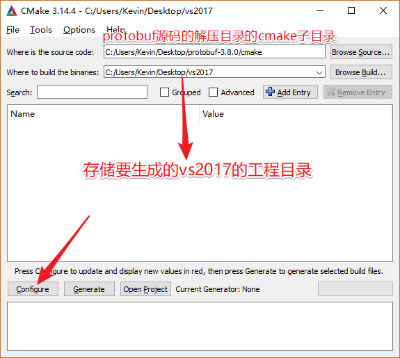

  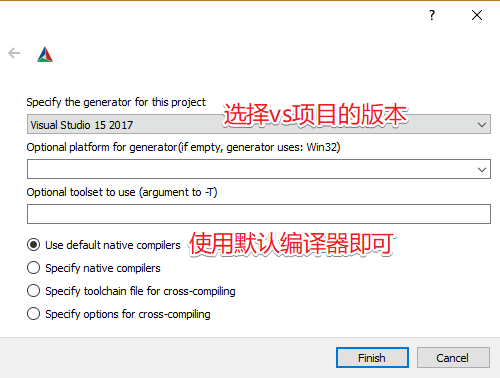

  > 执行完这一步之后，需要稍等一小会儿。

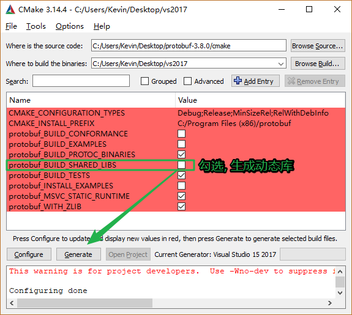

- 进入 vs2017 工程目录，使用vs2017打开，`F7` 编译
- 编译完成 ，在 vs2017工程目录 /Debug 目录下，可以看到生成的库文件
- 将生成的动态库和头文件放到自定义目录中备用
- 在vs中指定头文件目录和库目录(根据自己上一步实际的存储目录进行指定)
- 修改vs其他配置（这个很重要 ） 
  - 修改预处理器定义： 
    - 项目属性->c/c++ -> 预处理器 -> 预处理器定义 添加这个`PROTOBUF_USE_DLLS `宏定义 


### 7.2 在linux下的安装

参考资料: <https://github.com/protocolbuffers/protobuf/tree/master/src>

- 下载源码安装包: `protobuf-cpp-3.8.0.tar.gz`

- 解压缩

  ```shell
  $ tar zxvf protobuf-cpp-3.8.0.tar.gz
  ```

- 安装 -> 进入到解压目录

  ```shell
  $ cd protobuf-3.8.0
  $ ./configure
  $ make
  $ make check	(可选)
  $ sudo make install
  ```

