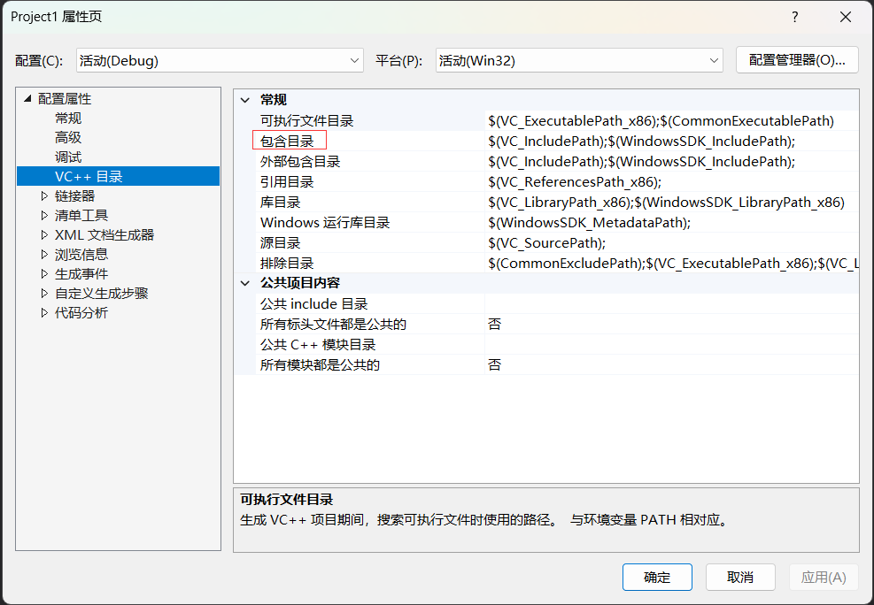
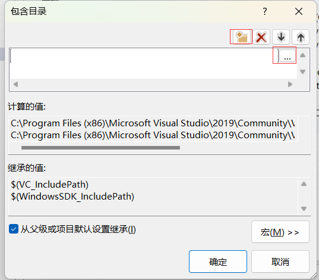
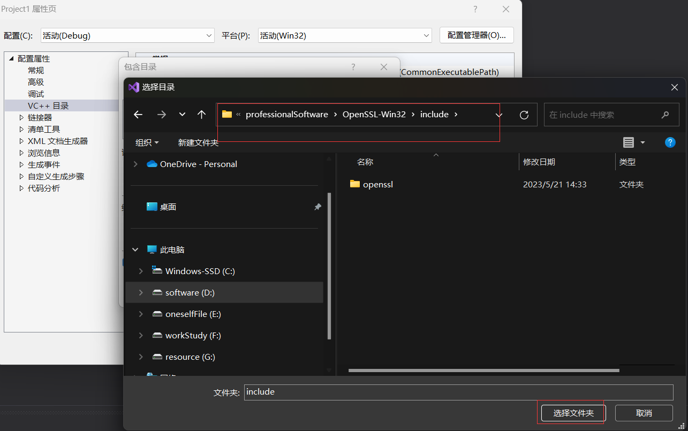
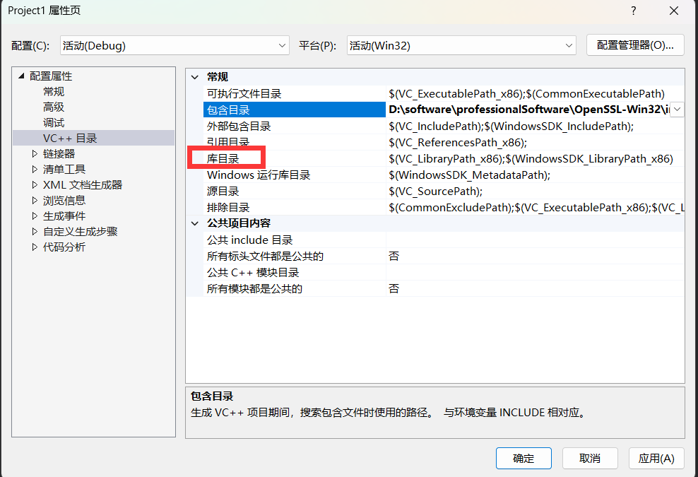
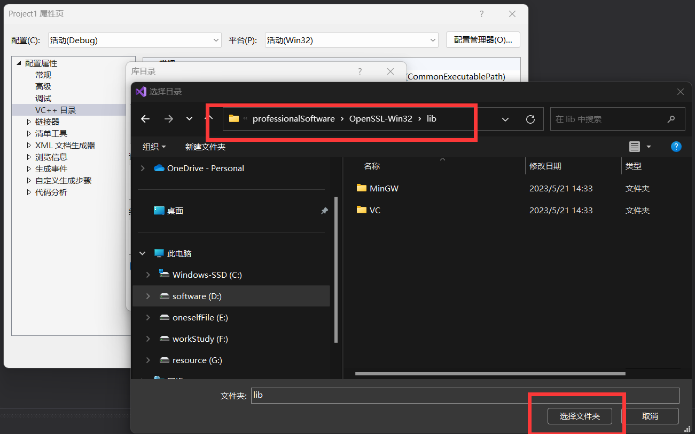
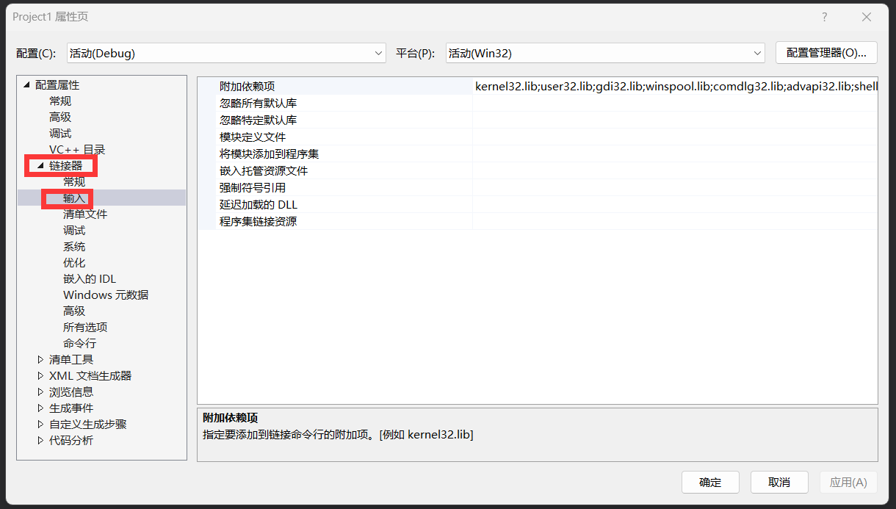
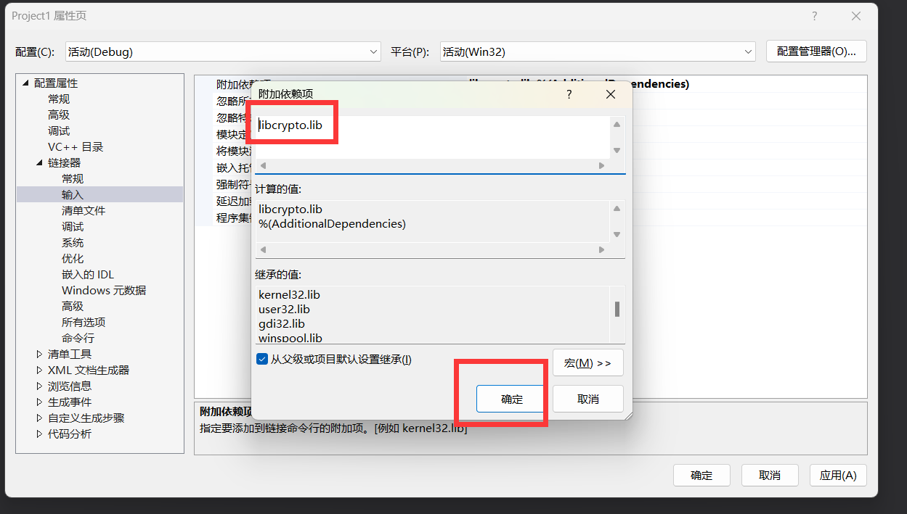
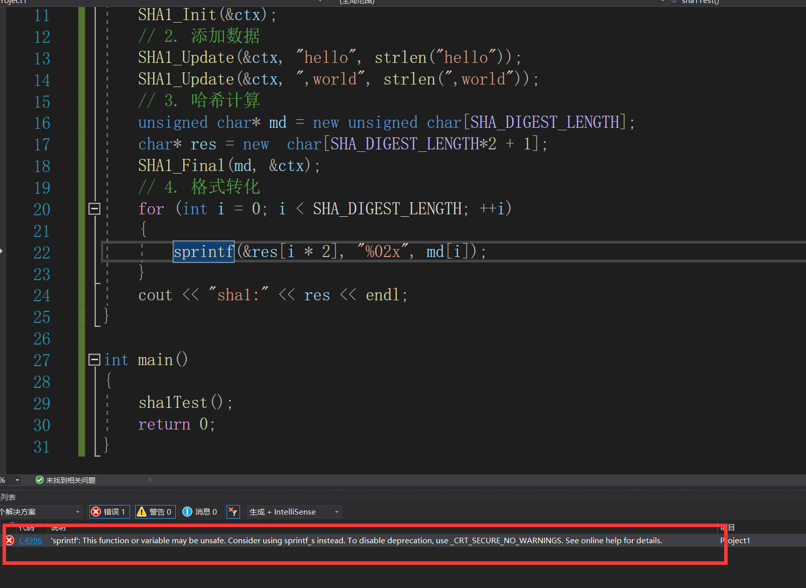
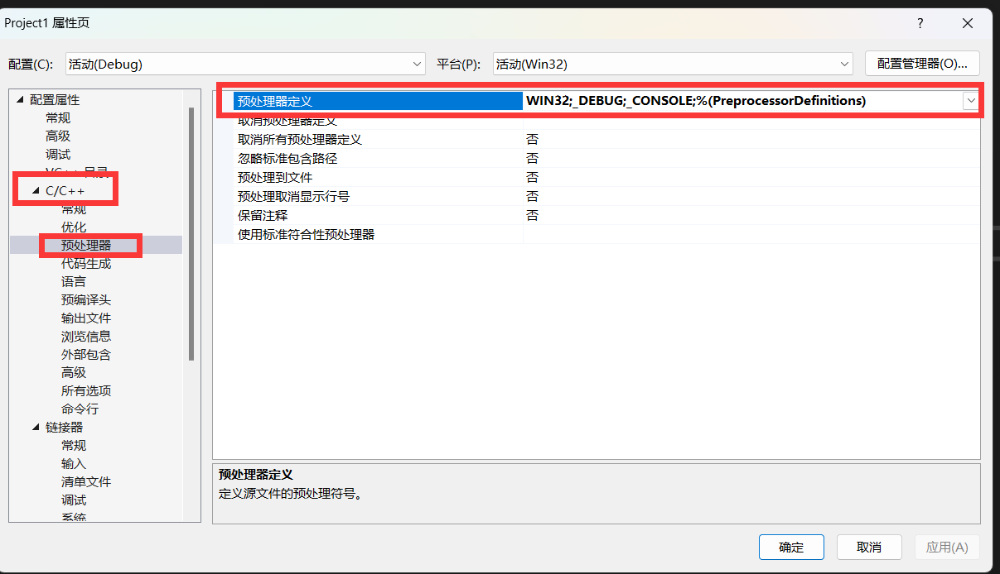
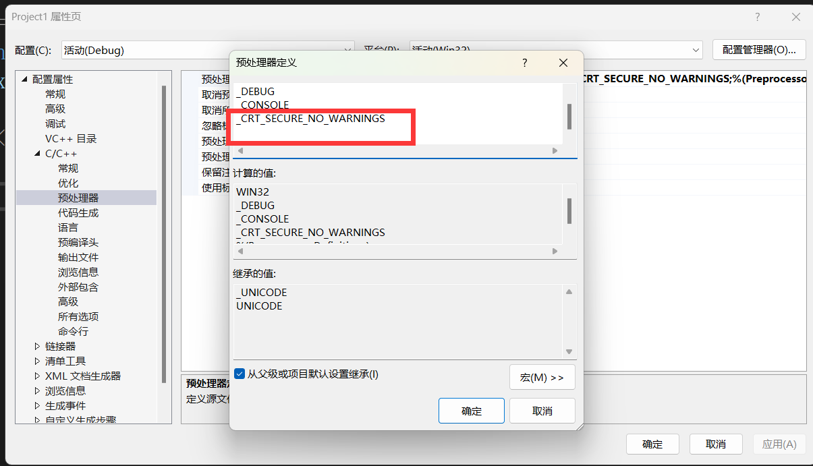

# `openssl`

## 1.1 `openssl` 概述

+ `OpenSSL`是一个安全套接字层密码库，是用c语言实现的,囊括主要的密码算法、常用的密钼和证书封装管理功能及`SSL`协议，并提供丰富的应用程序供测试或其它目的使用。
+ `SSL` 是`Secure SocketsLayer` (安全套接层协议)的缩写，可以在Internet上提供秘密性传输。Netscape公司在推出第一个Web浏览器的同时，提出了`SSL`协议标准。其目标是保证两个应用间通信的保密性和可靠性,可在服务器端和用户端同时实现支持。已经成为Internet上保密通讯的工业标准。`https`协议就用到了`SSL`,`HTTPS`协议是由`SSL+HTTP`协议构建的可进行加密传输、身份认证的网络协议，比`http`协议安全。

> `OpenSSL`即可在windows平台下使用,也可以在`linux`平台下使用,是跨平台的一套加密库.
>
> [openss官网](https://www.openssl.org/)
>
> [opensslGitHub仓库](https://github.com/openssl/openssl)

## 2. 相关的算法

### 2.1 哈希

+ 特点
  + 不可逆
  + 抗碰撞性强
    + 不同的数据拥有不同的哈希值，相同的数据哈希值是相同的
  + 原始数据有细微的变化，哈希值的变化是非常大的
  + 通过哈希函数将原始数据进行计算， **得到的哈希值长度是固定的**
  + 原始的哈希值是一个定长的 `二进制`字符串

#### 2.1.1 哈希算法：

+ `md5`
  + 散列值： `16byte`

+ `sha1`
  + 散列值： `20byte`

+ `sha224`
  + 散列值： `28byte`

+ `sha256`
  + 散列值： `32byte`

+ `sha384`
  + 散列值： `48byte`

+ `sha512`
  + 散列值： `52byte`


> 以上说的散列值长度是二进制数据长度,一般散列值使用16进制格式的数字串表示的,看到的字符串长度是原来的2倍长.

```C++
//使用的头文件
#include <openssl/md5.h>
#include <openssl/sha.h>
```

+ `md5`

```c
# define MD5_DIGEST_LENGTH 16	// md5哈希值长度
// 初始化函数, 初始化参数 c
int MD5_Init(MD5_CTX *c);
	参数c: 传出参数
// 添加md5运算的数据-> 没有计算
// 该函数可以进行多次数据添加 -> 函数多次调用
int MD5_Update(MD5_CTX *c, const void *data, size_t len);
	参数:
		- c: MD5_Init() 初始化得到的
		- data: 传入参数, 字符串
		- len: data数据的长度
// 对添加的数据进行md5计算		
int MD5_Final(unsigned char *md, MD5_CTX *c);
	参数:
		- md: 传出参数, 存储得到的哈希值
		- c: MD5_Init() 初始化得到的
// 通过传递的参数, 直接生成一个md5哈希值
// 只能添加一次数据
unsigned char *MD5(const unsigned char *d, size_t n, unsigned char *md);
	参数:
		- d: 传入, 要进行md5运算的字符串
		- n: 字符串的的长度
		- md: 传出, 存储md5的哈希值
	返回值: 这个地址的函数第三个参数md地址
```

```c
# define SHA_DIGEST_LENGTH		 20
# define SHA224_DIGEST_LENGTH    28
# define SHA256_DIGEST_LENGTH    32
# define SHA384_DIGEST_LENGTH    48
# define SHA512_DIGEST_LENGTH    64

  int SHA1_Init(SHA_CTX *c);
  int SHA1_Update(SHA_CTX *c, const void *data, size_t len);
  int SHA1_Final(unsigned char *md, SHA_CTX *c);
  unsigned char *SHA1(const unsigned char *d, size_t n, unsigned char *md);

  int SHA224_Init(SHA256_CTX *c);
  int SHA224_Update(SHA256_CTX *c, const void *data, size_t len);
  int SHA224_Final(unsigned char *md, SHA256_CTX *c);
  unsigned char *SHA224(const unsigned char *d, size_t n, unsigned char *md);
  int SHA256_Init(SHA256_CTX *c);
  int SHA256_Update(SHA256_CTX *c, const void *data, size_t len);
  int SHA256_Final(unsigned char *md, SHA256_CTX *c);
  unsigned char *SHA256(const unsigned char *d, size_t n, unsigned char *md);

  int SHA384_Init(SHA512_CTX *c);
  int SHA384_Update(SHA512_CTX *c, const void *data, size_t len);
  int SHA384_Final(unsigned char *md, SHA512_CTX *c);
  unsigned char *SHA384(const unsigned char *d, size_t n, unsigned char *md);
  int SHA512_Init(SHA512_CTX *c);
  int SHA512_Update(SHA512_CTX *c, const void *data, size_t len);
  int SHA512_Final(unsigned char *md, SHA512_CTX *c);
  unsigned char *SHA512(const unsigned char *d, size_t n, unsigned char *md);

```

#### 2.1.2 `SHA1`算法调用

+ 新建项目
+ 
+ 
+ 
+ 
+ 
+ 
+ 
> `libcrypto.lib`

+ 如果报以下错误的时候记得按如下处理
  + 
  + 
  + 
  
  > `_CRT_SECURE_NO_WARNINGS`
  
+ `SHA1`算法使用

  + ```c++
    #include<iostream>
    #include<string.h>
    // sha系列  哈希算法都包含该头文件
    #include<openssl/sha.h>
    
    using namespace std;
    void sha1Test()
    {
    	// 1. 初始化
    	SHA_CTX ctx;
    	SHA1_Init(&ctx);
    	// 2. 添加数据
    	SHA1_Update(&ctx, "hello", strlen("hello"));
    	SHA1_Update(&ctx, ",world", strlen(",world"));
    	// 3. 哈希计算
    	unsigned char* md = new unsigned char[SHA_DIGEST_LENGTH];
    	char* res = new  char[SHA_DIGEST_LENGTH*2 + 1];
    	SHA1_Final(md, &ctx);
    	// 4. 格式转化
    	for (int i = 0; i < SHA_DIGEST_LENGTH; ++i)
    	{
    		sprintf(&res[i * 2], "%02x", md[i]);
    	}
    	cout << "sha1:" << res << endl;
    }
    
    int main()
    {
    	sha1Test();
    	return 0;
    }
    ```


#### 2.1.3 封装

+ 封装思路

```C++
- 封装的思路
  ```c++
  // c++中不建议使用宏 -> 常量/枚举/内联->空间换时间
  class MyHash
  {
  public:
      enum HashType{M_MD5, M_SHA1, M_SHA224, M_SHA512, M_SHA384, M_SHA512};
      MyHash(HashType type)	// 得到一个哈希对象, 创建不同的哈希对象
      {
          m_type = type;
          switch(type)
          {
           case M_MD5:
              MD5_Init();
              break;
           case M_sha1:
              SHA1_Init();
              break;
                  
          }
      }
      ~MyHash();
      // 添加数据
      void addData(string str)
      {
          switch(m_type)
          {
          case M_MD5:
              MD5_Update();
              break;
           case M_sha1:
              SHA1_Update();
              break;
          }
      }
      // 计算哈希值
      string result()
      {
          switch(m_type)
          {
          	xxx_Final();
              // 转换 -> 16进制格式
          }
      }
   private:
      HashType m_type;
      MD5_CTX m_md5;
  }
```


## 3.  安装

