# c++核心编程（ctr+k+c 注释  ctr+k+u 解注释）
> [相关代码地址](https://gitee.com/chuangdu/cppStudy)
## 1. 内存分区模型

c++程序在运行时，将内存大方向划分为 **4个区域**

+ **代码区：**存放函数体的二进制代码，由操作系统进行管理的。
+ **全局区：** 存放全局变量和静态变量以及常量。
+ **栈区：** 由编译器自动分配释放，存放函数的参数值，局部变量等。
+ **堆区：**由程序员分配和释放，如程序员不释放，程序结束后由操作系统回收。

内存四区意义：

+ 不同区域存放的数据，赋予不同的生命周期，给我们更大的灵活编程。

### 1.1 程序运行前

+ 在程序编译后，生成了 `exe` 可执行程序， **未执行该程序前分为两个区域**

  + **代码区：**

    + 存放`cpu`执行的机器指令
    + 代码区是**共享**的，共享的目的是对于频繁被执行的程序，只需要在内存中有一份代码即可
    + 代码区是**只读**的，使其只读的原因是防止程序意外地修改了它地指令

  + **全局区:**

    + 全局变量和静态变量存放在此.

    + 全局区还包含了常量区,字符串常量和其他常量也存放在此

    + > **该区域的数据在程序结束后由操作系统释放**

  + 案例

  + ```c++
    #include<iostream>
    using namespace std;
    // 全局变量
    int g_a = 10;
    int g_b = 10;
    //const 修饰地全局变量 全局常量
    const int c_g_a = 10;
    const int c_g_b = 10;
    int main() {
    	//全局区
    	//全局变量 静态变量 常量
    
    	// 普遍地局部变量
    	int  a = 10;
    	int b = 10;
    	cout << "局部变量a地地址为： " << (int)&a << endl;
    	cout << "局部变量b地地址为： " << (int)&b << endl;
    	cout << "全局变量g_a地地址为： " << (int)&g_a << endl;
    	cout << "全局变量g_b地地址为： " << (int)&g_b << endl;
    	// 静态变量
    	static int s_a = 10;
    	static int s_b = 10;
    	cout << "static变量s_a地地址为： " << (int)&s_a << endl;
    	cout << "static变量s_b地地址为： " << (int)&s_b << endl;
    
    
    	//常量
    	//字符串常量
    	cout << "字符串常量地地址为： " << (int)&"hello world" << endl;
    	// const修饰地常量
    		// const 修饰地全局变量 const修饰地局部变量
    	cout << "全局常量c_g_a地地址为： " << (int)&c_g_a << endl;
    	cout << "全局常量c_g_b地地址为： " << (int)&c_g_b << endl;
    
    	// const修饰地局部变量
    	const int c_l_a = 10; // c-const g-global l-local
    	const int c_l_b = 10;
    	cout << "局部常量c_l_a地地址为： " << (int)&c_l_a << endl;
    	cout << "局部常量c_l_b地地址为： " << (int)&c_l_b << endl;
    	system("pause");
    	return 0;
    }
    ```

  + 运行结果

    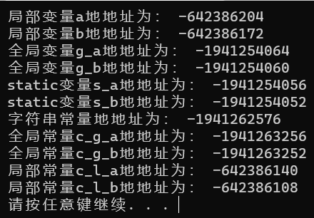

    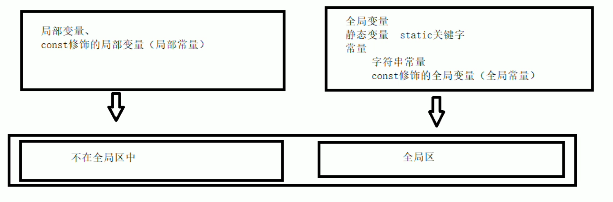

  + 总结：

    + C++中在程序运行前分为全局区和代码区代码区
    + 特点是共享和只读
    + 全局区中存放全局变量、静态变量、常量
    + 常量区中存放`const`修饰的全局常量和字符串常量

### 1.2 程序运行后

+ **栈区：**
  + 由编译器自动分配释放,存放函数的参数值,局部变量等
  + 注意事项:不要返回局部变量的地址，栈区开辟的数据由编译器自动释放
  
  实例：
  
  ```c++
  #include<iostream>
  using namespace std;
  // 栈区数据注意事项 -- 不要返回局部变量的地址
  // 栈区的数据 由编译器 管理开辟和释放
  
  int * func(int b ) {
  	b = 100;
  	int a = 10; // 局部变量  存放在栈中，栈区的数据在函数执行完后自动释放
  	return &a; // 返回局部变量的地址
  }
  int main() {
  	int * p = func(1);
  	cout << *p << endl;// 第一次可以打印正确的数字，事因为编译器做了保留
  	cout << *p << endl;// 第二次这个数据就不再保留了
  	system("pause");
  	return 0;
  }
  ```
  
+ 堆区

  + 由程序员分配释放，若程序员不释放，程序结束时由操作系统回收
  + 在C++中主要利用`new` 在堆中开辟内存

  实例：

  ```c++
  #include<iostream>
  using namespace std;
  int* func() {
  	// 利用new关键字  可以将数据开辟到堆区
  	// 指针 本质也是局部变量，放在栈上，指针保存的数据是放在堆区
  	int* p = new int(10);
  	return p;
  }
  int main() {
  	// 在堆区开辟数据
  	int* p = func();
  	cout << *p << endl;
  	cout << *p << endl; 
  	system("pause");
  	return 0;
  }
  ```

### 1.3 new操作符

+ `C++`中利用`new`操作符在堆区开辟数据
+ 堆区开辟的数据，由程序员手动开辟，手动释放，释放利用操作符`delete`
+ 语法: `new`数据类型
+ 利用new创建的数据，会返回该数据对应的类型的指针

示例：

```C++
#include<iostream>
using namespace std;
// 1. new 的基本语法
int* func() {
	// 在堆区创建整型数据
	// new返回是 该数据类型的指针 *p
	int* p = new int(10);
	return p;
}
void test01() {
	int* p = func();
	cout << *p << endl; 
	//堆区的数据 由程序员管理开辟，程序员管理释放
	// 如果想释放堆区的数据 利用关键字delete
	delete p;
	
	//cout << *p << endl; 内存已经被释放，再次访问就是非法操作，会报错
}
 // 2. 在堆区利用new开辟数组
void test02() {
	// 创建10 整型数据的数组，在堆区
	int * arr = new int[10]; // 10代表数组由10个元素
	for (int i = 0; i < 10; i++) {
		arr[i] = i + 100; // 给10个元素赋值 100~ 109
	}
	for (int i = 0; i < 10; i++) {
		cout << arr[i] << endl;
	}
	// 释放堆区数组
	// 释放数组的时候 要加[] 才可以
	delete[] arr;
}
int main() {
	test01();
	test02();
	system("pause");
	return 0;
}
```

## 2. 引用

### 2.1 引用的基本使用

+ **作用：**给变量起别名
+ **语法：**`数据类型 &别名 = 原名`

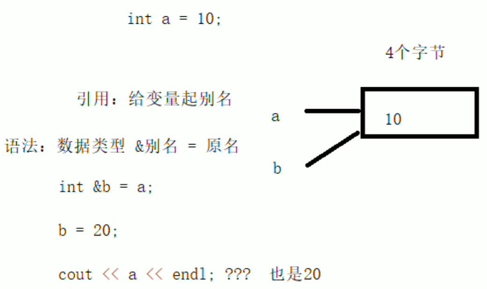

+ 示例：

```c++
#include<iostream>
using namespace std;
int main() {
	// 引用基本语法
	// 数据类型 &别名 = 原名
	int a = 10;
	// 创建引用
	int &b = a;
	cout << "a =  " << a << endl;
	cout << "b =  " << b << endl;
	b = 100;
	cout << "a =  " << a << endl;
	cout << "b =  " << b << endl;
	system("pause");
	return 0;
}
```

###  2.2 引用的注意事项

+ 引用必须初始化
+ 引用在初始化后，不可以改变
+ 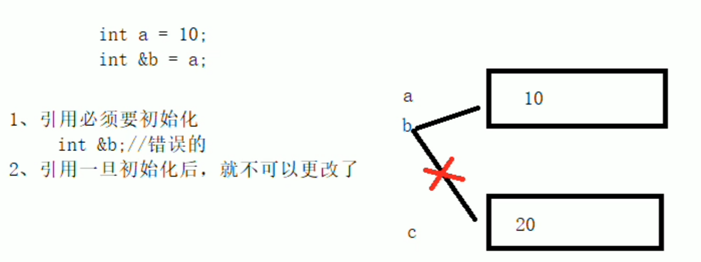
+ 示例：

```c++
#include<iostream>
using namespace std;
int main() {
	int a = 10;
	// 1. 引用必须初始化
	//int& a; 错误，必须要初始化
	int &b = a;
	// 2. 引用在初始化后，不可以改变
	int c = 20;
	b = c; // 赋值操作，而不是更改引用
	cout << "a= " << a << endl;
	cout << "b= " << b << endl;
	cout << "c= " << c << endl;
	system("pause");
	return 0;
}
```

### 2.3 引用做函数参数

+ **作用：**函数传参时，可以利用引用的技术让形参修饰实参
+ **优点：**可以简化指针修改实参
+ 示例：

```c++
#include<iostream>
using namespace std;
// 交换函数
// 1. 值传递
void swap01(int a, int b) {
	int temp = a;
	a = b;
	b = temp;
}
// 2. 地址传递
void swap02(int * a, int * b) {
	int temp = *a;
	*a = *b;
	*b = temp;
}
// 3. 引用传递
void swap03(int &a, int &b) {
	int temp = a;
	a = b;
	b = temp;
}
int main() {
	int a = 10;
	int b = 20;
	swap01(a, b); //值传递，形参不会改变实参
	cout << "a= " << a << endl;
	cout << "b= " << b << endl;
	cout << "****************" << endl;
	swap02(&a,&b); //地址传递，形参会改变实参
	cout << "a= " << a << endl;
	cout << "b= " << b << endl;
	cout <<"****************" << endl;
	swap03(a, b); //引用传递，形参会改变实参
	cout << "a= " << a << endl;
	cout << "b= " << b << endl;
	system("pause");
	return 0;
}
```

> 总结： 通过引用参数产生的效果同按地址传递时一样的。一样的语法更清楚简单。

### 2.4 引用做函数返回值

+ 作用:引用是可以作为函数的返回值存在的
+ 注意:**不要返回局部变量引用**
+ 用法:函数调用作为左值
+ 示例：

``` c++
#include<iostream>
using namespace std;
// 引用做函数返回值
	// 1. 不要返回局部变量的引用
int& test01() {
	int a = 10; // 局部变量存放在四区中的栈区
	return a;
}
	// 2. 函数的调用可以作为左值 
int& test02() {
	static int a = 10; // 静态变量，存放在全局区，全局区上的数据在程序结束后系统释放
	return a;
}
int main() {
	//int& ref = test01();
	//cout << "ref = " << ref << endl; // 第一次结果正确，是因为编译器做了保留
	//cout << "ref = " << ref << endl; // 第二次结果错误， 因为a的内存已经释放
	int& ref2 = test02();
	cout << "ref2 = " << ref2 << endl;
	cout << "ref2 = " << ref2 << endl;
	test02() = 1000; // 如果函数的返回值是引用，这个函数调用可以作为左值
	cout << "ref2 = " << ref2 << endl;
	cout << "ref2 = " << ref2 << endl;
	system("pause");
	return 0;
}
```

### 2.5 引用的本质

+ 本质： **引用的本质在C++内部实现一个指针常量**
+ 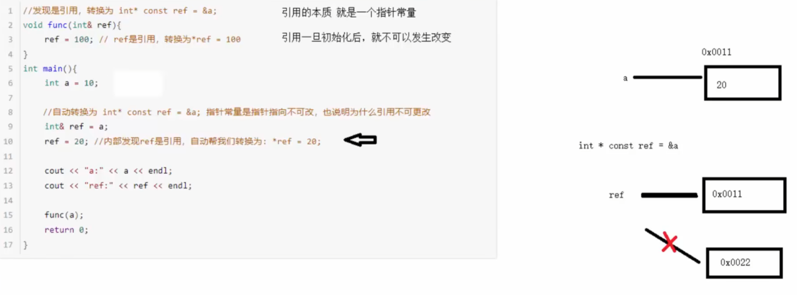

> 结论:C++推荐用引用技术，因为语法方便，引用本质是指针常量，但是所有的指针操作编译器都帮我们做了

### 2.6 常量引用

+ **作用**:常量引用主要用来修饰形参，防止误操作
+ 在函数形参列表中，可以加`const修饰形参`，防止形参改变实参
+ 示例：

```c++
#include<iostream>
using namespace std;

// 打印数据函数
void showValue(const int &val) {
	//val = 1000;
	cout << "val = " << val << endl;
}
int main() {
	// 常量引用
	// 使用场景：用来修饰形参，防止误操作
	//int a = 10;
	// 加上const之后 编辑器将代码修改 int temp = 10； int & ref = temp;
	//const int & ref = 10; //未加const之前    引用必须引一块合法的内存空间
	//ref = 20; // 加入const之后变为只读，不可以修改

	int a = 100;
	showValue(a);
	cout << "a = " << a << endl;
	system("pause");
	return 0;
 }
```

## 3. 函数的提高

### 3.1 函数的默认参数

+ 在c++中，函数的形参列表中的形参是可以有默认值的。
+ 语法： `返回值类型  函数名 （参数 = 默认值）{}`
+ 示例：

``` c++
#include<iostream>
using namespace std;

//函数默认参数
// 如果我们自己传入数据了，就用自己的数据，如果没有，那么用默认
int func(int a, int b = 20, int c = 30) {
	return a + b + c;
}
// 注意事项
// 1. 如果某个位置已经有了默认参数，那么从这个位置往后，从左到右都必须有默认值
// 2. 如果函数声明有默认参数，函数实现就不能有默认参数
	// 声明和实现只能有一个有默认参数
int main() {
	cout << func(10) << endl;
	system("pause");
	return 0;
}
```

### 3.2 函数占位参数

+ C++中函数的形参列表里可以有占位参数，用来做占位，调用函数时必须填补该位置
+ 语法:`返回值类型 函数名（数据类型){}`
+ 在现阶段函数的占位参数存在意义不大，但是后面的课程中会用到该技术
+ 示例：

```c++
#include<iostream>
using namespace std;
// 占位参数
// 返回值类型 函数名（数据类型） {}
// 目前阶段的占位参数 我们还用不到 后面的代码会用到
// 占位参数 还可以有默认参数
void func(int a , int = 10)
{
	cout << "this is func" << endl;
}

int main() {
	func(10,10);
	system("pause");
	return 0;
}
```

### 3.3 函数重载

#### 3.3.1 函数重载概述

+ **作用**:函数名可以相同，提高复用性
+ 函数重载满足条件:
  + 同一个作用域下·函数名称相同
  + 函数参数**类型不同**或者**个数不同**或者**顺序不同**
+ **注意**:函数的返回值不可以作为函数重载的条件

+ 示例

``` c++
#include<iostream>
using namespace std;
// 函数重载
// 可以让函数名相同，提高复用性

// 函数重载的满足条件
//1. 同一作用域下
//2. 函数名称相同
//3. 函数参数类型不同，或者个数不同，或者顺序不同
void func() {
	cout << "func的调用" << endl;
}
void func(int a)
{
	cout << "func 的调用!" << endl;
}
void func(double a)
{
	cout << "func(double) 的调用!" << endl;
}
void func(double a, int b)
{
	cout << "func(double a, int b) 的调用!" << endl;
}

void func(int a, double b)
{
	cout << "func(int a, double b) 的调用!" << endl;
}
// 注意事项
// 函数的返回值不可以作为函数重载的条件
int func(double a, int b)
{
	cout << "func(double a, int b) 的调用!" << endl;
}
int main() {
	func(3.14,2);
	func(2,3.14);
	system("pause");
	return 0;
}
```

#### 3.3.2 函数重载注意事项

+ 引用作为重载条件
+ 函数重载碰到函数默认参数

+ 示例：

```c++
# include<iostream>
using namespace std;
// 函数重载的注意事项
// 1. 引用作为重载的条件
void func(int &a) // int &a = 10; 不合法
{
	cout << "func(int &a) 的调用!" << endl;
}
void func(const int &a) // const int &a = 10; 合法
{
	cout << "func(const int &a) 的调用!" << endl;
}
// 2. 函数重载碰到函数的默认参数
void func2(int a, int b = 10 ){
	cout << " func2(int a, int b = 10 )的调用!" << endl;
}
void func2(int a) {
	cout << " func2(int a)的调用!" << endl;
}
int main() {
	int a = 10;
	func(a);
	func(10);
	// func2(10); // 当函数重载碰到默认参数，出现二义性，报错避免这种情况
	system("pause");
	return 0;
}
```

## 4. 类和对象

+ C++面向对象的三大特性为:**封装、继承、多态**
+ C++认为**万事万物都皆为对象**，对象上有其属性和行为
+ 例如:
  + 人可以作为对象，属性有姓名、年龄、身高、体重...，行为有走、跑、跳、吃饭、唱歌..
  + 车也可以作为对象，属性有轮胎、方向盘、车灯...,行为有载人、放音乐、放空调...
  + 具有相同性质的**对象**，我们可以抽象称为**类**，人属于人类，车属于车类

### 4.1 封装

#### 4.1.1 封装的意义

+ 封装是C++面向对象三大特性之一
+ 封装的意义:
  + 将属性和行为作为一个整体，表现生活中的事物
  + 将属性和行为加以权限控制
+ **封装的意义一：**
  + 在设计类的时候，属性和行为写在一起，表现事物

> **语法：** `class 类名{ 访问权限： 属性 / 行为};`

+ 示例1： 设计一个圆类，求圆的周长

```c++
#include<iostream>
using namespace std;
const double PI = 3.14;

// 设计一个圆类，求圆的周长

// class代表设计一个类，类后面紧跟着的就是类名称
class Circle
{
	// 访问权限
public:
	// 属性
	// 半径
	int m_r;
	// 行为
	// 获取圆的周长
	double calculateZC() {
		return 2 * PI * m_r;
	}
};

int main() {
	// 通过圆类 创建具体的圆（对象）
	Circle c1;
	c1.m_r = 10;
	cout << c1.calculateZC() << endl;
	system("pause");
	return 0;
}
```

+ **封装意义二:**
+ 类在设计时，可以把属性和行为放在不同的权限下，加以控制访问权限有三种:
  1. public	       公共权限
  2. protected    保护权限
  3.  private        私有权限
+ 示例：

```c++
#include<iostream>
using namespace std;
//访问权限//三种
//公共权限	public		成员类内可以访问类外可以访问
//保护权限	protected	成员类内可以访问﹐类外不可以访问	儿子可以访问父亲中的保护内容
//私有权限	private		成员类内可以访问类外不可以访问		儿子不可以访问父亲的私有内容

class Person {
public:
	//公共权限
	string m_Name;	// 姓名
protected:
	//保护权限
	string m_Car;  // 汽车
private:
	//私有权限
	int m_Password; //银行卡密码
public:
	void func() {
		m_Name = "张三";
		m_Car = "拖拉机";
		m_Password = 123456;
	}
};

int main() {
	//实例化具体对象
	Person pl;
	pl.m_Name = "李四";
	//p1.m_Car = "奔驰";//保护权限内容，在类外访问不到
	//p1.m_Password = 123;//私有权限内容，类外访问不到
	pl.func();
	system("pause");
	return 0;
}
```

####  4.1.2 `struct` 和 `class`区别

+ 在C++中`struct`和`class`唯—的区别就在于**默认的访问权限不同**
+ 区别:
  + `struct`默认权限为公共.
  + `class`默认权限为私有

+ 示例：

```c++
#include<iostream>
using namespace std;
class C1
{
	int m_a;// 默认 是私有的
};
struct C2
{
	int m_a;// 默认 是私有的
};
int main() {
	// struct和 class区别
	// struct默认权限是	公共	public
	// class默认权限是	私有	private
	C1 c1;
	//c1.m_a = 100;class默认权限是	私有	不可以访问
	C2 c2;
	c2.m_a = 100;//// struct默认权限是	公共 可以访问
	system("pause");
	return 0;
}
```

#### 4.1.3 成员属性设置为私有

+ **优点1**:将所有成员属性设置为私有，可以自己控制读写权限
+ **优点2**:对于写权限，我们可以检测数据的有效性

### 4.2 对象的初始化和清理

+ 生活中我们买的电子产品都基本会有出厂设置，在某一天我们不用时候也会删除一些自己信息数据保证安全

+ C++中的面向对象来源于生活，每个对象也都会有初始设置以及对象销毁前的清理数据的设置。

#### 4.2.1构造函数和析构函数
+  对象的**初始化和清理**也是两个非常重要的安全问题
  + 一个对象或者变量没有初始状态，对其使用后果是未知
  + 同样的使用完一个对象或变量，没有及时清理，也会造成—定的安全问题
+  C++利用了**构造函数**和**析构函数**解决上述问题，这两个函数将会被编译器自动潮用，完成对象初始化和清理工作。对象的初始化和清理工作是编译器强制要我们做的事情，因此如果我们**不提供构造和析构，编译器会提供编译器提供的构造函数和析构函数是空实现。**
  +  **构造函数**∶主要作用在于创建对象时为对象的成员属性赋值，构造函数由编译器自动调用，无须手动调用。
  +  **析构函数**:主要作用在于对象**销毁前**系统自动调用，执行一些清理工作。
+  **构造函数语法:** `类名(){}`
  1. **构造函数**，没有返回值也不写void
  2. 函数名称与类名相同
  3. **构造函数**可以有参数，因此可以发生重载
  4. 程序在调用对象时候会自动调用构造，无须手动调用,而且**只会调用一次**


+  **析构函数语法:**`~类名(){}`
     1. **析构函数**，没有返回值也不写void
     2. 函数名称与类名相同,在名称前加上符号`~`
     3. **析构函数**不可以有参数，因此不可以发生重载
     4. 程序在对象**销毁前**会自动调用析构，无须手动调用,而且**只会调用一次**
+  示例：

```c++
#include<iostream>
using namespace std;

// 对象的初始化和清理
// 1. 构造函数 进行初始化操作

class Person
{
public:
	// 1.1 构造函数
	// 没有返回值 不用写void
	// 函数名 与类名相同
	// 构造函数可以有参数，可以发生重载
	// 创建对象的时候，构造函数会自动调用，而且只调用一次
	Person() {
		cout << "Person 构造函数的调用" << endl;
	}
	// 2. 析构函数 进行清理操作
	// 没有返回值  不写 void
	// 函数名与类名相同 在名称前加 ~
	// 析构函数不可用有参数的，不可以发生重载
	// 对象在销毁前  会自动调用析构函数，而且只会调用一次
	~Person()
	{
		cout << "~Person 析构函数的调用" << endl;
	}
};


// 构造和析构都是必须有的实现，如果我们自己不提供，编译器会提供一个空实现的构造和析构函数
void test01() {
	Person p; // 在栈上的数据 test01执行完毕后，释放这个对象
}

int main() {
	test01();
	// Person p;
	system("pause");
	return 0;
}
```

#### 4.2.2构造函数的分类及调用

+ 两种分类方式:
  + **按参数分为:**有参构造和无参构造
  + **按类型分为:**普通构造和拷贝构造
+ 三种调用方式:
    + 括号法
    + 显示法
    + 隐式转换法
    
+ 示例：

```c++
#include<iostream>
using namespace std;
class Person
{
public:
	// 构造函数
	Person() {
		cout << "Person 构造函数的调用" << endl;
	}
	Person(int a) {
		age = a;
		cout << "Person 构造函数的调用" << endl;
	}
	// 拷贝构造函数
	Person(const Person &p) {
		age = p.age;
		// 将传入的人身上的所有属性，拷贝到我身上
		cout << "Person 拷贝构造函数的调用" << endl;
	}
	~Person()
	{
		cout << "~Person 析构函数的调用" << endl;
	}
	int age;
};

// 调用
void test01() {
	// 1. 括号法
	//Person p; // 默认构造函数调用
	//Person p2(10); // 有参构造函数
	//Person p3(p2); // 拷贝构造函数
	//注意事项
	//调用默认构造函数时候，不要加()
	//因为下面这行代码，编译器会认为是一个函数的声明,不会认为在创建对象
	//Person p1();

	// 2. 显示法
	Person p1;
	Person p2 = Person(10);// 有参构造
	Person p3 = Person(p2);// 有参构造

	//Person(10); // 匿名对象 特点： 当前行执行结束后，系统会立即回收掉匿名对象
	
	//注意事项2
	//不要利用拷贝构造函数初始化匿名对象﹑编译器会认为 Person (p3) === Person p3; 对象声明
	Person(p3) ;

	// 3. 隐式转化法
	Person p4 = 10;//相当于写了Person p4 = Person(10);有参构造
	Person p5 = p4; //拷贝构造

}

int main() {
	test01();
	system("pause");
	return 0;
}
```

#### 4.2.3拷贝构造函数调用时机

+ C++中拷贝构造函数调用时机通常有三种情况
  + 使用一个已经创建完毕的对象来初始化一个新对象
  + 值传递的方式给函数参数传值
  + 以值方式返回局部对象
+ 构造函数调用规则
  1. 默认构造函数（无参， 函数体为空）
  2. 默认析构函数（无参， 函数体为空）
  3. 默认拷贝构造函数，对属性进行值拷贝
+ 构造函数调用规则如下：
  + 如果用户定义有参构造函数，c++不在提供默认无参构造，但是会提供默认拷贝构造
  + 如果用户定义拷贝构造函数，C++不会再提供其他构造函数
+ 示例：

```c++
#include<iostream>
using namespace std;

// 拷贝构造函数调用时机
class Person
{
public:
	// 构造函数
	Person() {
		cout << "Person 构造函数的调用" << endl;
	}
	Person(int age) {
		m_age = age;
		cout << "Person 有参构造函数的调用" << endl;
	}
	Person(const Person &p) {
		m_age = p.m_age;
		cout << "Person 拷贝构造函数的调用" << endl;
	}
	~Person()
	{
		cout << "~Person 析构函数的调用" << endl;
	}
	int m_age;
};
// 1. 使用一个已经创建完毕的对象来初始化一个新对象
void test01() {
	Person p1(20);
	Person p2(p1);
	cout << "ps_age" << p2.m_age << endl;
}

// 2. 值传递的方式给函数参数传值
void doWork(Person p) {

}
void test02() {
	Person p;
	doWork(p);
}
// 3. 以值方式返回局部对象
Person doWork2() {
	Person p1;
	return p1;
}
void test03() {
	Person p = doWork2();
}
int main() {
	//test01();
	test03();
	system("pause");
	return 0;
}
```

#### 4.2.4 深拷贝和浅拷贝

+ 浅拷贝： 简单的赋值拷贝操作
+ 深拷贝： 在堆区重新申请空间，进行拷贝操作
+ 示例：

```c++
#include<iostream>
using namespace std;

// 深拷贝和浅拷贝
class Person
{
public:
	// 构造函数
	Person() {
		cout << "Person 默认构造函数的调用" << endl;
	}
	Person(int age, int height) {
		m_age = age;
		m_height =  new int(height);
		cout << "Person 有参构造函数的调用" << endl;
	}
	~Person()
	{
		// 析构代码，将堆区开辟数据做释放操作
		if (m_height != NULL) {
			delete m_height;
			m_height = NULL;
		}
		cout << "~Person 析构函数的调用" << endl;
	}

	// 自己实现拷贝构造函数  解决浅拷贝带来的问题
	Person(const Person& p) {
		cout << "Person 拷贝构造函数调用" << endl;
		m_age = p.m_age;
		// m_hight = p.height; 编译器默认实现就是这行代码
		// 深拷贝操作
		m_height = new int(*p.m_height);
	}
	int m_age;
	int *m_height;
};
void test01() {
	Person p1(20, 160);
	cout << "p1_age: " << p1.m_age << " height: " << *p1.m_height<< endl;
	Person p2(p1);
	cout << "p2_age: " << p2.m_age << " height: " << *p2.m_height << endl;
}
int main() {
	test01();
	system("pause");
	return 0;
}
```


+ 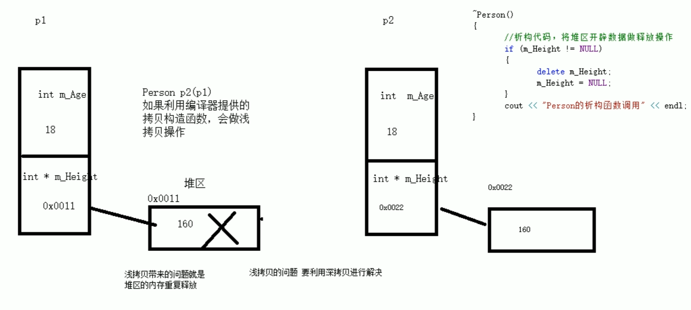

> 总结： 如果属性又在堆区开辟的，一定要自己提供拷贝构造函数，防止浅拷贝带来的问题。

#### 4.2.6 初始化列表

+ **作用**
  + C++ 提供了初始化列表语法，用来初始化属性
+ 语法：`构造函数（）：属性1（值1），属性2（值2）...{}`
+ 示例：

```c++
#include<iostream>
using namespace std;

class Person
{
public:
	Person(int a, int b, int c) :m_a(a), m_b(b), m_c(c) {

	}
	int m_a;
	int m_b;
	int m_c;
};

int main() {
	Person p(30,10,10);
	cout << p.m_a << p.m_b << p.m_c << endl;
	system("pause");
	return 0;
}
```

#### 4.2.7 类对象作为类成员

+ c++类中的成员可以是另一个类的对象，我们称该成员为对象成员

+ **顺序**

  > 当其他类对象作为本类成员，构造时候先构造类对象，再构造自身，**析构的顺序与构造相反**

#### 4.2.8 静态成员

+ 静态成员就是在成员变量和成员函数前加上关键字static，称为静态成员
+ 静态成员分为:
  + 静态成员变量
    + 所有对象共享同一份数据
    + 在编译阶段分配内存
    + 类内声明，类外初始化
  + 静态成员函数
      + 所有对象共享同一个函数
      + 静态成员函数只能访问静态成员变量

+ **静态成员变量**
  + 类外初始化 `int Person::m_a = 10;`
  + 访问方式
    + 通过类名进行访问`Person::m_a;`
    + 通过对象进行访问 `Person p;`    `p.m_a;`
  + **类外访问不到私有静态成员变量**
  
+ **静态成员函数**
  + 访问方式
    + 通过对象访问 `Person p;`    `p.func();`
  
    + 通过类名访问 `Person::func();`
  
  + **类外访问不到私有静态成员函数**
  

### 4.3 C++对象模型和this指针

#### 4.3.1 成员变量和成员函数分开存储

+ 在C++中，类内的成员变量和成员函数分开存储
+ 只有非静态成员变量才属于类的对象上

> C++ 编译器会给每个空对象也分配一个字节空间，是未来区分空对象占内存的位置
>
> 每个空对象也应该有一个独一无二的内存地址

#### 4.3.2 this指针概念

+ 通过4.3.1我们知道在C++中成员变量和成员函数是分开存储的

+ 每一个非静态成员函数只会诞生一份函数实例，也就是说多个同类型的对象会共用一块代码

+ 那么问题是:这—块代码是如何区分那个对象调用自己的呢?

  

+ C++通过提供特殊的对象指针，this指针，解决上述问题。**this指针指向被调用的成员函数所属的对象**

+ this指针是隐含每一个非静态成员函数内的—种指针

+ this指针不需要定义，直接使用即可

+ this指针的用途:

  + 当形参和成员变量同名时，可用this指针来区分
  + 在类的非静态成员函数中返回对象本身，可使用`return *this`
  
+ 示例：

```c++
#include<iostream>
using namespace std;

class Person
{
public:
	Person(int age) {
		// this指针指向被调用的成员函数所属的对象
		this->age = age;
	}
	Person& PersonAddAgeA(Person& p) {
		this->age += p.age;
		// this指向p2的指针，而*this指向的就是p2这个对象本体
		return *this;
	}
	int age;
};

// 1.解决名称冲突
void test01() {
	Person p1(18);
	cout << "p1的年龄" << p1.age << endl;
}
// 2.返回对象本身用 *this
void test02() {
	Person p1(10);
	Person p2(10);
	// 链式编程思想
	p2.PersonAddAgeA(p1).PersonAddAgeA(p1).PersonAddAgeA(p1);
	cout << "p2的年龄" << p2.age << endl;
}

int  main() {
	test01();
	test02();
	system("pause");
	return 0;
}
```

#### 4.3.3 空指针访问成员函数

+ c++中空指针也是可以调用成员函数的，但是也要注意有没有用到this指针

+ 如果用到了`this`指针，**需要加以判断** 保证代码的健壮性
+ 示例：

```c++
#include<iostream>
using namespace std;

// 空指针调用成员函数
class Person
{
public:
	void showClassName() {
		cout << "this is Persson class" << endl;
	}
	void showPersonAge() {
		// 报错原因是因为传入的指针是为NULL
		if (this == NULL) {
			return;
		}
		cout << "age=  " << m_Age << endl;
	}
	int m_Age;
};
void test01() {
	Person* p = NULL;
	p->showClassName();
	p->showPersonAge();
}
int main() {
	test01();
	system("pause");
	return 0;
}
```

#### 4.3.4`const` 修饰成员函数

+ **常函数：**
  + 成员函数后加`const`后我们称为这个函数为**常函数**
  + 常函数内不可以修改成员属性
  + 成员属性声明时加关键字`mutable`后，在常函数中依然可以修改
+ **常对象：**
  + 声明对象前加 `const`陈该对象为**常对象**
  + 常对象只能调用常函数
+ 示例：

```c++
#include<iostream>
using namespace std;

// 常函数
class Person
{
public:
	// this指针的本质  是指针常量  指针的指向是不可以修改的
	// const Person * const this;
	// 在成员函数后面加const，修饰的是this指向，让指针指向的值不可以修改
	void showPerson() const // 常函数
	{
		this->m_B = 100;
		//this->m_A = 100;
		// this = NULL; // this指针不可用修改指针的指向的
	}
	void func() {
		m_A = 100;
	}
	int m_A;
	mutable int m_B; // 特殊变量，即使在常函数中， 也可以修改这个值 ,  加上关键字 mutable
};
void test01() {
	Person p;
	p.showPerson();
}
// 常对象

void test02() {
	const Person p; // 在对象前加const，变为常对象 
	//p.m_A = 100;
	p.m_B = 100; // m_B 是特殊值，在常对象下也可以修改
	
	// 常对象只能调用常函数
	p.showPerson();
	//p.func(); // 常对象 不可以调用普通成员函数，因为普通长远函数可以修改属性
}


int main() {
	system("pause");
	return 0;
}
```

### 4.4 友元

+ 生活中你的家有客厅(Public)，有你的卧室(Private)
+ 客厅所有来的客人都可以进去，但是你的卧室是私有的，也就是说只有你能进去
+ 但是呢，你也可以允许你的好闺蜜好基友进去。
+ 在程序里，有些私有属性也想让类外特殊的一些函数或者类进行访问，就需要用到友元的技术
+ 友元的目的就是让—个函数或者类访问另一个类中私有成员 
+ 友元的关键字为`friend`
+ 友元的三种实现
  + 全局函数做友元
  + 类做友元
  + 成员函数做友元

### 4.5 运算符重载

+ 运算符重载概念：对已有的运算符重新进行定义，赋予其另外一种功能，以适应不同的数据类型。

#### 4.5.1 加号运算符重载

+ **作用：**实现两个自定义数据类型相加的运算
+ 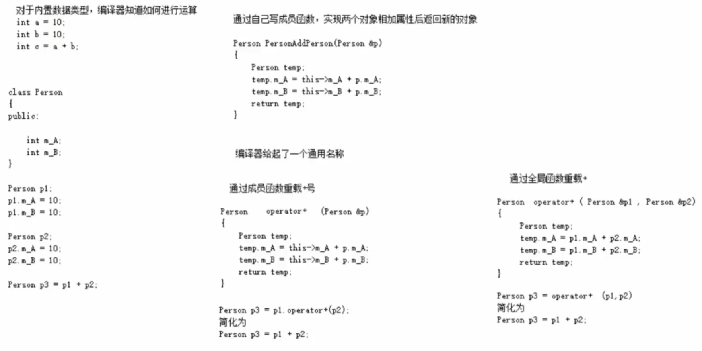
+ 示例：

```c++
#include<iostream>
using namespace std;

// 加号运算符重载
class Person
{
public:
	// 1. 成员函数重载加号
	/*
	person operator+(person &p) 
	{
		person temp;
		temp.m_a = this->m_a + p.m_a;
		temp.m_b = this->m_b + p.m_b;
		return temp;
	}
	*/
	int m_A;
	int m_B;
};
Person operator+(Person &p1, Person &p2)
{
	Person temp;
	temp.m_A = p1.m_A + p2.m_A;
	temp.m_B = p1.m_B + p2.m_B;
	return temp;
}
Person operator+(Person& p1, int num)
{
	Person temp;
	temp.m_A = p1.m_A + num;
	temp.m_B = p1.m_B + num;
	return temp;
}
void test01() {
	Person p1;
	p1.m_A = 10;
	p1.m_B = 10;
	Person p2;
	p2.m_A = 10;
	p2.m_B = 10;
	// 成员函数重载本质调用
	//Person p3 = p1.operator+(p2);


	//全局函数重载本质调用
	Person p3 = operator+(p1,p2);
	//Person p3 = p1 + p2;


	// 运算符重载  也可以发生函数重载
	Person p4 = p1 + 10; //Person + int 
	cout << "p4.m_A= " << p4.m_A << endl;
	cout << "p4.m_B= " << p4.m_B << endl;
}


// 2. 全局函数重载加号

int main() {
	test01();
	system("pause");
	return 0;
}
```

> 总结1： 对于内置的数据类型的表达式的运算符是不可能改变的
>
> 总结2：不要滥用运算符重载

#### 4.5.2 左移运算符重载

+ 作用： 可以输出自定义数据类型
+ 示例：

```c++
#include<iostream>
using namespace std;

// 左移运算符重载
class Person
{
	friend ostream& operator<<(ostream& cout, Person& p);
public:
	Person(int a, int b) {
		m_A = a;
		m_B = b;
	}
private:

	// 利用成员函数重载 左移运算符  p.operator<<(cout) 简化版本 p << cout
	// 不会利用成员函数重载 << 运算符，因为无法实现 cout 在左侧
	//void operator<< ( cout )
	//{

	//}

	int m_A;
	int m_B;
};

// 只能利用全局函数重载左移运算符
ostream & operator<<(ostream &cout,Person &p) // 本质 operator<< (cout,p) 简化 cout<<p
{
	cout << p.m_A << p.m_B << endl;
	return cout;
}

void test01() 
{
	Person p(10,10);
	//p.m_a = 10;
	//p.m_b = 10;
	cout << p << endl;
}
int main() 
{
	test01();
	system("pause");
	return 0;
}
```

> 总结： 重载左移运算符配合友元可以实现输出自定义数据类型

#### 4.5.3 递增运算符重载

+ 作用： 通过重载递增运算符，实现自己的整型数据
+ 示例：

```c++
#include<iostream>
using namespace std;
// 自定义整型
class MyInteger
{
	friend ostream& operator<<(ostream& cout, MyInteger myint);
public:
	MyInteger()
	{
		m_Num = 0;
	}
	// 重载前置++运算符
	MyInteger& operator++()
	{
		m_Num++;
		return *this;
	}
	// 重载后置++运算符
	MyInteger operator++(int)
	{
		MyInteger temp = *this;
		m_Num++;
		return temp;
	}
private:
	int m_Num;
};
ostream& operator<<(ostream& cout, MyInteger myint) 
{
	cout << myint.m_Num << endl;
	return cout;
}
//void test01()
//{
//	MyInteger myint;
//	cout << ++myint << endl;
//}
void test02()
{
	MyInteger myint;
	cout << myint++ << endl;
	cout << myint << endl;
}
int main() 
{
	test02();
	system("pause");
	return 0;
}
```

#### 4.5.4 赋值运算符重载

C++编译器至少给一个类添加4个函数

1. 默认构造函数(无参，函数体为空
2. 默认析构函数(无参，函数体为空)
3. 默认拷贝构造函数，对属性进行值拷贝
4. 赋值运算符operator=，对属性进行值拷贝

 

如果类中有属性指向堆区，做赋值操作时也会出现深浅拷贝问题

+ 示例：

```c++
#include<iostream>
using namespace std;

class Person
{
public:
	Person(int age)
	{
		m_Age = new int(age);
	}
	~Person()
	{
		if (m_Age != NULL)
		{
			delete m_Age;
			m_Age = NULL;
		}
	}
	// 重载赋值运算符
	Person& operator=(Person &p)
	{
		// 编译器是提供浅拷贝
		//m_Age = p.m_Age ;
		//应该先判断是否有属性在堆区，如果有先释放干净，然后再深拷贝
		if (m_Age != NULL)
		{
			delete m_Age;
			m_Age = NULL;
		}
		// 深拷贝
		m_Age = new int(*p.m_Age);
		return *this;
	}
	int* m_Age;
};

void test01()
{
	Person p1(18);
	Person p2(20);
	Person p3(30);
	p3 = p2 = p1;
	cout << "p1的年龄为：" << *p1.m_Age << endl;
	cout << "p2的年龄为：" << *p2.m_Age << endl;
	cout << "p3的年龄为：" << *p3.m_Age << endl;
}
int main()
{
	test01();
	system("pause");
	return 0;
}
```

#### 4.5.5 关系运算符重载

+ **作用：**重载关系运算符，可以让两个自定义类型对象进行对比操作。
+ 示例：

```c++
#include<iostream>
#include<string>
using namespace std;

class Person
{
public:
	Person(string name, int age)
	{
		m_Name = name;
		m_Age = age;
	}
	bool operator==(Person &p)
	{
		if (this->m_Name == p.m_Name && this->m_Age == p.m_Age)
		{
			return true;
		}
		return false;
	}
	string m_Name;
	int m_Age;
};

void test()
{
	Person p1("Tom", 18);

	Person p2("Tom", 18);

	if (p1 == p2)
	{
		cout << "p1=p2" << endl;
	}
}
int main() {
	test();
	system("pause");
	return 0;
}
```

#### 4.5.6 函数调用运算符重载(仿函数)

+ 函数调用运算符()也可以重载
+ 由于重载后使用的方式非常像函数的调用，因此称为仿函数
+ 仿函数没有固定写法，非常灵活
+ 示例

```c++
#include<iostream>
#include<string>
using namespace std;

// 打印输出类
class MyPrint
{
public:
	// 重载函数调用运算符
	void operator()(string test)
	{
		cout << test << endl;
	}
};

void test()
{
	MyPrint myPrint;
	myPrint("hello"); // 由于使用起来非常类似于函数调用，因此成为仿函数
	// 匿名函数对象
	MyPrint()("world");
}

// 仿函数非常灵活，没有固定的写法

int main()
{
	test();
	system("pause");
	return 0;
}
```

### 4.6 继承

+ **继承是面向对象三大特性之一**
+ 有些类鱼类之间存在特殊的关系：如下图
  + 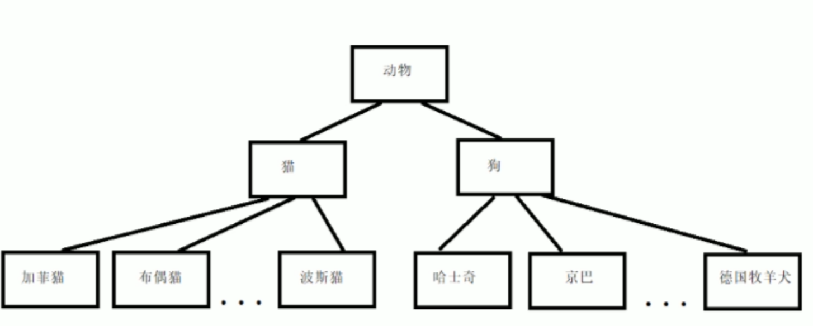
+ 我们发现，定义这些类时，下级别的成员除了拥有上一级的共性，还有自己的特性。
+ 这个时候我们就可以考虑利用继承的技术，减少重复代码

#### 4.6.1 继承的基本语法

+ 例如我们看到很多网站中，都有公共的头部，公共的底部，甚至公共的左侧列表，只有中心内容不同接下来我们分别利用普通写法和继承的写法来实现网页中的内容，看一下继承存在的意义以及好处
+ 示例：

```c++
#include<iostream>
using namespace std;

// 普通实现页面

// 公共页面

class BasePage
{
public:
	void  header()
	{
		cout << "首页、公开课、登录、注册……（公共头部）" << endl;
	}
	void footer()
	{
		cout << "帮助中心、交流合作、站内地图……（公共底部）" << endl;
	}
	void left()
	{
		cout << "java、 python\c++ …… （公共分类列表）" << endl;
	}
};

//语法: class 子类 : 继承方式 父类
//子类也称为派生类
//父类也称为基类


// Java页面
class Java : public BasePage
{
public:
	void content()
	{
		cout << "java学科视频" << endl;
	}
};

// Python页面
class Python : public BasePage
{
public:
	void content()
	{
		cout << "Python学科视频" << endl;
	}
};

void test01() {
	cout << "java 下载视频页面如下" << endl;
	Java ja;
	ja.header();
	ja.footer();
	ja.left();
	ja.content();

	cout << "Python下载视频页面如下" << endl;
	Python py;
	py.header();
	py.footer();
	py.left();
	py.content();
}

int main()
{
	test01();
	system("pause");
	return 0;
}
```

+ **总结:**
+ 继承的好处:**可以减少重复的代码**
+ class A : public B;
  + A类称为子类或派生类
  + B类称为父类或基类
+ **派生类中的成员，包含两大部分:**
  + 一类是从基类继承过来的，一类是自己增加的成员。
  + 从基类继承过过来的表现其共性，而新增的成员体现了其个性。

#### 4.6.2 继承方式

+ 继承语法： `class 子类 ： 继承方式 父类`

+ 继承一共有三种方式：

  + 公共继承
  + 保护继承
  + 私有继承

+ 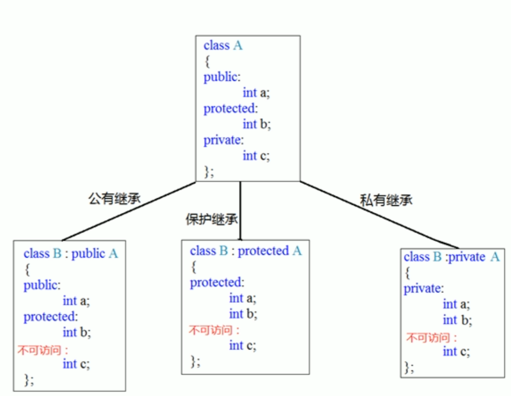

#### 4.6.3 继承中的对象模型

+  **问题：** 从父类继承过来的成员，那些属于子类对象中？

> 父类中所有非静态成员属性都会被子类继承下去
>
> 父类中私有成员属性，是被编译器给隐藏了，因此是访问不到，但是确实被继承下去了 

+ 在vs开发人员命令提示符中查看类的结构
  + `cl /d1 reportSingleClassLayout类名  "所属文件名"`

#### 4.6.4 继承中构造和析构顺序

+ 子类继承父类后，当创建子类对象，也会调用父类的构造函数
+ **继承中的构造和析构顺序如下：**
  + 先构造父类，在构造子类
  + 析构的顺序与构造的顺序相反

#### 4.6.5 继承同名成员处理方式

+ 问题：当子类与父类出现同名的成员，如何通过子类对象，访问到子类或父类中同名的数据呢？
  + 访问子类同名成员   **直接访问即可**
  + 访问父类同名成员   **需要加作用域**  `s.Base::m_A;`
+ 如果子类中出现和父类同名的成员函数，子类的同名成员会隐藏掉父类中所有同名成员函数
+ 如果想访问到父类中被隐藏的同名成员函数，需要加作用域

#### 4.6.6 继承同名静态成员处理方式

+ 问题:继承中同名的静态成员在子类对象上如何进行访问?

+ **静态成员和非静态成员出现同名，处理方式—致**

  + 访问子类同名成员直接访问即可
  + 访问父类同名成员需要加作用域

+ **同名静态成员变量**

  + 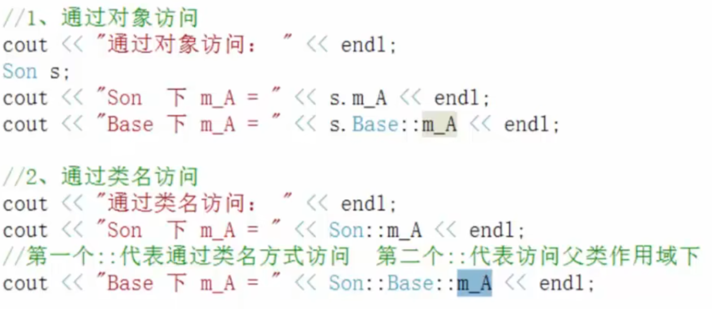

+ **同名静态成员函数**

  + 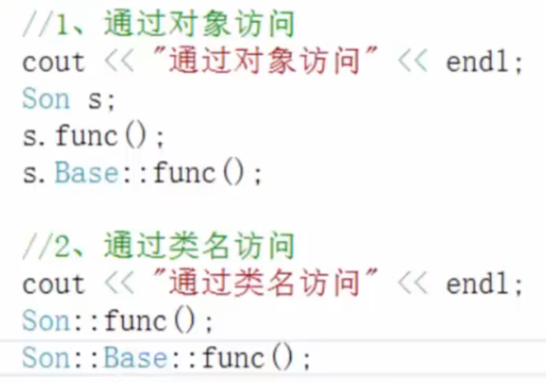
  + 子类出现和父类同名静态成员函数，也会隐藏父类中所有同名成员函数
  + 如果想访问父类中被隐藏同名成员，需要加作用域
  + `Son::Base::func(100);`

#### 4.6.7 多继承

+ C++ 运行 **一个类继承多个类**
+ 语法： `class 子类 ： 继承方式  父类1， 继承方式  父类2……`
+ 多继承可能会引发父类中同名成员出现，需要加作用域区分
+ **C++ 实际开发中不建议用多继承**

> 总结： 多继承中如果父类中出现了同名情况，子类使用时候要加作用域

#### 4.6.7 菱形继承

+ **菱形继承概念：**
  + 两个派生类继承同一个基类
  + 又有某个类同时继承者两个派生类
  + 这种继承被称为菱形继承，或者钻石继承
+ **典例的菱形继承案例**：
  + 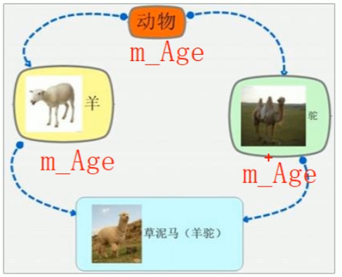
+ **菱形继承问题：**

1. 羊继承了动物的数据，驼同样继承了动物的数据，当草泥马使用数据时，就会产生二义性。
2. 草泥马继承自动物的数据继承了两份，其实我们应该清楚，这份数据我们要梦—份就可以。

+ **解决方式：**

+ ```c++
  //继承前加virtual关键字后，变为虚继承
  //此时公共的父类Animal称为虚基类
  class Sheep : virtual public Animal {};
  class Tuo: virtual public Animal {};
  class sheepTuo : public sheep，public Tuo {};
  ```

+ 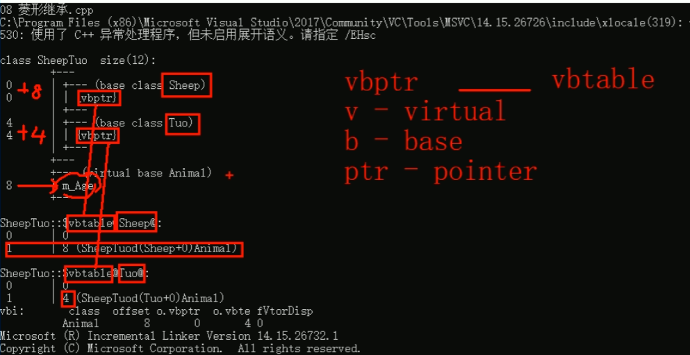

+ 总结

  >菱形继承带来的主要问题是子类继承两份相同的数据，导致资源浪费以及毫无意义
  >
  >利用虚继承可以解决菱形继承问题

### 4.7 多态

#### 4.7.1 多态的基本概念

+ **多态是C++面向对象三大特性之一**
+ 多态分为两类
  + 静态多态:函数重载和运算符重载属于静态多态，复用函数名
  + 动态多态:派生类和虚函数实现运行时多态
+ 静态多态和动态多态区别：
  + 静态多态的函数地址早绑定 – 编译阶段确定函数地址
  + 动态多态的函数地址晚绑定 – 运行阶段确定函数地址
+ 示例

```c++
#include<iostream>
using namespace std;

class Animal
{
	//动物类
public:
	virtual void speak()
	{
		cout << "动物在说话" << endl;
	}
};

//猫类
class Cat :public Animal
{
public:
	// 重写  函数返回值类型  函数名  参数列表 完全相同
	void speak()
	{
		cout << "小猫在说话" << endl;
	}
};

//执行说话的函数
// 地址早绑定   在编译阶段确定函数地址
// 如果想执行让猫说话，那么这个函数的地址就不能提前绑定，需要在运行阶段进行绑定，地址晚绑定

// 动态多态满足条件
// 1. 有继承关系
// 2. 子类要重写父类的虚函数

// 动态多态使用
// 父类的指针或者引用 指向子类对象
void doSpeak(Animal &animal) // Animal & animal = cat;
{
	animal.speak();
}

void test01() 
{
	Cat cat;
	doSpeak(cat);
}

int main()
{
	test01();
	system("pause");
	return 0;
}
```

> 总结
>
> + 多态满足条件·有继承关系
>
> + 子类重写父类中的虚函数
>   多态使用条件
>   
> + 父类指针或引用指向子类对象
>
>   重写:函数返回值类型函数名参数列表完全—致称为重写

+ **动态多态的原理**
  + 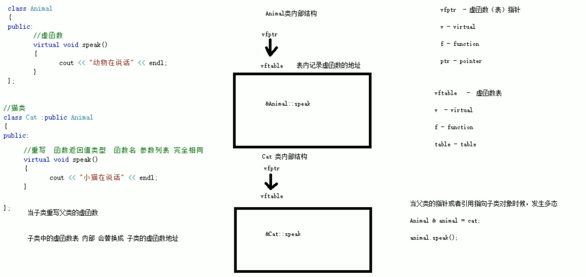
+ 多态的优点：
  + 代码组织结构清晰
  + 可读性强
  + 利于前期和后期的扩展以及维护

#### 4.7.2 纯虚函数和抽象类

+ 在多态中，通常父类中虚函数的实现是毫无意义的，主要都是调用子类重写的内容
+ 因此可以将虚函数改为**纯虚函数**
+ 纯虚函数语法:`virtual 返回值类型 函数名 (参数列表) = 0 ;`
+ 当类中有了**纯虚函数**，这个类也称为**抽象类**
+ 抽象类特点:
  + 无法实例化对象
  + 子类必须重写抽象类中的纯虚函数，否则也属于抽象类
+ 示例：

```c++
#include<iostream>
using namespace std;

// 纯虚函数和抽象类
class Base
{
public:
	// 纯虚函数
	// 只要有一个纯函数，这个类就称为抽象类
	// 抽象类特点：
	// 1. 无法实例化对象
	// 2. 抽象类的子类 必须要重写父类中的纯虚函数，否则也属于抽象类
	virtual void func() = 0;
};

class Son :public Base
{
public:
	virtual void func()
	{
		cout << "fun 调动" << endl;
	}
};
void test01()
{
	//Base b;抽象类是无法实例化对象
 	//new Base;抽象类是无法实例化对象
	//Son s; //子类必须重写父类中的纯虚函数，否则无法实例化对象
	Base* base = new Son;
	base->func();
}

int main()
{
	test01();
	system("pause");
	return 0;
}
```

#### 4.7.3 虚析构和纯虚析构 

+ 多态使用时，如果子类中有属性开辟到堆区，那么父类指针在释放时无法调用到子类的析构代码
+ 解决方式:将父类中的析构函数改为**虚析构**或者**纯虚析构**
+ 虚析构和纯虚析构共性:
  + 可以解决父类指针释放子类对象
  + 都需要有具体的函数实现
+ 虚析构和纯虚析构区别:
    + **如果是纯虚析构，该类属于抽象类，无法实例化对象**
+ 虚析构语法：
    + `virtual ~类名（）{}；`
+ 纯虚析构语法：
    + `virtual ~类名（） = 0；`
    + `类名：：~类名（）{}；`
+ 示例：

```c++
#include<iostream>
#include<string>
using namespace std;
//虚析构和纯虚析构 

class Animal
{
public:
	Animal() 
	{
		cout << "Aniaml 构造函数调用" << endl;
	}
	//纯虚函数
	virtual void sepeak() = 0;
	//利用虚析构可以解决父类指针释放子类对象时不干净的问题
	//virtual ~Animal()
	//{
		//cout << "Aniaml 析构函数调用" << endl;
	//}
	
	// 纯虚析构 需要声明也需要实现
	// 有了纯虚析构，这个类也属于抽象类，无法实例化对象
	virtual ~Animal() = 0;
};

Animal::~Animal() {
	cout << "Aniaml 析构函数调用" << endl;
}
class Cat :public Animal
{
public:
	Cat(string name) {
		cout << "cat 构造函数调用" << endl;
		m_Name = new string(name);
	}
	virtual void sepeak()
	{
		cout << *m_Name  <<" cat is speaking;" << endl;
	}
	~Cat() {
		if (m_Name != NULL) {
			cout << "cat 析构函数调用" << endl;
			delete m_Name;
			m_Name = NULL;
		}
	}
	string* m_Name;
};

void test01()
{
	Animal* animal = new Cat("Tom");
	animal->sepeak();
	//父类指针在析构时候不会调用子类中析构函数，导致子类如果有堆区属性，出现内存泄漏
	delete animal;
}
int main()
{
	test01();
	system("pause");
	return 0;
}
```

> 总结：
>
> ​	1.虚析构或纯虚析构就是用来解决通过父类指针释放子类对象
>
> ​	2.如果子类中没有堆区数据，可以不写为虚析构或纯虚析构
>
> ​	3.拥有纯虚析构函数的类也属于抽象类

## 5. 文件操作

+ 程序运行时产生的数据都属于临时数据，程序—旦运行结束都会被释放
+ 通过文件可以将**数据持久化**
+ C++中对文件操作需要包含头文件`< fstream >`
+ 文件类型分为两种:
 1. **文本文件** - 文件以文本的**ASCII码**形式存储在计算机中
 2. **二进制文件** - 文件以文本的**二进制**形式存储在计算机中，用户一般不能直接读懂它们
+ 操作文件的三大类:

   1. `ofstream`: 写操作 
   2. `ifstream`: 读操作
   3. `fstream` :   读写操作

### 5.1 文本文件

#### 5.1.1 写文件

+ 写文件操作

1. 包含头文件
   + `#include<fstream>`
2. 创建流对象
   + `ofstream ofs;`
3. 打开文件
   + `ofs.open("文件路径","打开方式")；`
4. 写数据
   + `ofs << "写入的数据"；`
5. 关闭文件
   + `ofs.close();`

+ 文件打开方式：

  |   打开方式    |            解释            |
  | :-----------: | :------------------------: |
  |   `ios::in`   |     为读文件而打开文件     |
  |  `ios::out`   |     为写文件而打开文件     |
  |  `ios::ate`   |       初始化：文件尾       |
  |  `ios::app`   |       追加方式写文件       |
  | `ios::trunc`  | 如果文件存在先删除，再创建 |
  | `ios::binary` |         二进制方式         |

+ **注意：**文件打开方式可以配合使用，利用 `|`通配符

+ 例如： 用二进制方式写文件 `ios::binary | ios::ourt`

#### 5.1.2 读文件

+ 读文件操作

1. 包含头文件

   + `#include<fstream>`

2. 创建流对象

   + `ifstream ifs;`

3. 打开文件并判断文件十分打开成功

   + `ifs.open("文件路径","打开方式")；`

   + ```c++
     if(! ifs.is_Open()){
         cout << "文件打开失败" << endl;
         return;
     }
     ```

4. 读数据

   + 四种方式读取

   + 第一种：

     + ```c++
       char buf[1024] = {0} ;
       while ( ifs >> buf )
       {
       	cout << buf << endl;
       }
       ```

   + 第二种：

     + ```C++
       char buf[1024] = { 0 } ;
       while ( ifs.getline(buf,sizeof(buf) ) ){
       	cout << buf << endl;
       }
       ```

   + 第三种：

     + ```c++
       string buf;
       while ( getline(ifs, buf ))
       {
       	cout <<buf <<endl;
       }
       
       ```

   + 第四种（不推荐）：

     + ```c++
       char c;
       while ( (c = ifs.get()) != EOF ) // EOF end of file{
       	cout << c;
       }
       ```

5. 关闭文件

   + `ifs.close();`

### 5.2 二进制文件

+ 以二进制的方式对文件进行读写操作
+ 打开方式要指定为：`ios::binary`

#### 5.2.1 写文件

+ 二进制方式写文件主要利用流对象调用成员函数`write`
+ 函数原型:`ostream& write(const char * buffer,int len);`
+ 参数解释:字符指针`buffer`指向内存中一段存储空间。`len`是读写的字节数
+ 示例：

```c++
#include<iostream>
#include<fstream>
using namespace std;

class Person
{
public:
	char m_Name[64];
	int m_Age;
};
void test01() 
{
	ofstream ofs("person.txt", ios::out | ios::binary);
	//ofs.open("person.txt",ios::out | ios::binary);
	Person p = { "张三", 18 };

	ofs.write((const char *)&p, sizeof(Person));
	ofs.close();
}

int main()
{
	test01();
	system("pause");
	return 0;
}
```

#### 5.2.2 读文件

+ 二进制方式读文件主要利用流对象调用成员函数`read`
+ 函数原型:`istream& read(char*buffer,int len);`
+ 参数解释:字符指针buffer指向内存中一段存储空间。`len`是读写的字节数
+ 示例：

```c++
#include<iostream>
#include<fstream>
using namespace std;

class Person
{
public:
	char m_Name[64];
	int m_Age;
};
void test01()
{
	ifstream ifs("person.txt", ios::in | ios::binary);
	//ifs.open("person.txt",ios::in | ios::binary);
	if (!ifs.is_open())
	{
		cout << "打开失败" << endl;
	}
	Person p;

	ifs.read((char *)&p, sizeof(Person));
	cout << "name： " << p.m_Name << "Age: " << p.m_Age << endl;
	ifs.close();
}

int main()
{
	test01();
	system("pause");
	return 0;
}
```

# c++ 提高编程

+ 本阶段只要针对c++**泛型编程** 和 **SLT**技术做详细讲解，探讨C++更深层的使用

## 1. 模板

### 1.1 模板的概念

+ 模板就是建立**通用的模具**，大大**提高复用性**
+ 模板的特点:
  + 模板不可以直接使用，它只是一个框架
  + 模板的通用并不是万能的

### 1.2 函数模板

+ C++另一种编程思想称为泛型编程，主要利用的技术就是模板
+ C++提供两种模板机制:**函数模板**和**类模板**

#### 1.2.1 函数模板语法

+ 函数模板作用:

  + 建立一个通用函数，其函数返回值类型和形参类型可以不具体制定，用一个**虚拟的类型**来代表。

+ 语法：

  + ```c++
    template<typename T>
    函数声明或定义
    ```

+ **解释:**
  `template` ---声明创建模板
  `typename` ---表面其后面的符号是—种数据类型，可以用class代替

  `T` ---通用的数据类型，名称可以替换，通常为大写字母
  
+ 示例

```c++
#include<iostream>
using namespace std;


// 两个整型交换函数
void swapInt(int& a, int& b)
{
	int temp = a;
	a = b;
	b = temp;
}

//交换两个浮点型的函数
void swapDouble(double& a, double& b)
{
	double temp = a;
	a = b;
	b = temp;
}

// 函数模板
template<typename T>// 什么一个模板，告诉编译器后面代码中紧跟着的T不要报错，T是一个通用的数据类型
void mySwap(T& a, T& b)
{
	T temp = a;
	a = b;
	b = temp;
}

void test01() {
	int a = 10;
	int b = 20;
	double c = 1.22;
	double d = 2.02;
	//swapInt(a, b);
	//利用函数模板交换
	// 有两个方式使用函数模板
	// 1. 自动类型推导
	// mySwap(a, b);
	// 2. 显示指定类型
	mySwap<int>(a, b);
	swapDouble(c, d);
	cout << a << b << d << c << endl;
}
int main()
{
	test01();
	system("pause");
	return 0;
}
```

+ **函数模板注意事项**
  + 自动类型推导，必须推导出一致的数据类型T，才可以使用。
  + 模板必须确定出T的数据类型，才可以使用
+ `template<typename T>`中的`typename` 可以替换成`class`

#### 1.2.2 普通函数与函数模板的区别

+ **普通函数与函数模板的区别：**
  + 普通函数调用时可以发生自动类型转换（隐式类型转换）
  + 函数模板调用时，如果利用自动类型推导，不会发生隐式类型转换
  + 如果利用显示指定类型的方式，可以发生隐式类型转换
+ 示例：

```c++
#include<iostream>
using namespace std;

//普通函数与函数模板的区别
// 1. 普通函数调用可以发生隐式类型转换
// 2. 函数模板 用自动类型推导，不可以发生隐式类型转换
// 3. 函数模板 用显示指定类型，可以发生隐式类型转换
int myAdd01(int a, int b)
{
	return a + b;
}
// 函数模板
template<class T>
T myAdd02(T a, T b)
{
	rturn a + b;
}
void test01()
{
	int a = 10;
	int b = 20;
	char c = 'c';
	cout << myAdd01(a, c) << endl;
	// 自动类型推导
	// cout << myAdd02(a, c) << endl;
	// 显示指定类型
	cout << myAdd02<int>(a, c) << endl;
}
int main()
{
	test01();
	system("pause");
	return 0;
}
```

#### 1.2.3 普通函数与函数模板的调用规则

+ 调用规则如下：
  1. 如果函数模板和普通函数都可以实现，优先调用**普通函数**
  2. 可以通过**空模板参数列表**来强制调用函数模板
  3. **函数模板也可以发生重载**
  4. 如果函数模板可以产生更好的匹配，优先调用**函数模板**
+ 示例：

```c++
#include<iostream>
using namespace std;
//1. 如果函数模板和普通函数都可以实现，优先调用 普通函数 
//2. 可以通过 空模板参数列表 来强制调用函数模板
//3. 函数模板也可以发生重载 
//4. 如果函数模板可以产生更好的匹配，优先调用 函数模板 

void myPrint(int a, int b)
{
	cout << "调用普通函数" << endl;
}
template<class T>
void myPrint(T a, T b)
{
	cout << "调用函数模板" << endl;
}
template<class T>
void myPrint(T a, T b, T c)
{
	cout << "调用函数重载模板" << endl;
}
void test02()
{
	int a = 10;
	int b = 10;
	//myPrint(a, b);
	// 通过空模板参数列表，强制调用函数模板
	//myPrint<>(a, b);
	//myPrint<>(a, b,100);
	//如果函数模板可以产生更好的匹配，优先调用 函数模板 
	char c1 = 'a';
	char c2 = 'b';
	myPrint(c1, c2);
}
int main()
{
	test02();
	system("pause");
	return 0;
}
```

> 总结：既然提高了函数模板，最好就不要提高普通函数，否则容易出现二义性

#### 1.2.6 模板的局限性

+ **局限性：**

  + 模板的通用性并不是万能的

+ 例如

+ ```c++
  template<class T>
  void f(T a,T b){
      a = b;
  }
  ```

+ 在上述代码中提供了赋值操作，如果传入的a 和 b时一个数组，就无法实现了。

+ 再例如

+ ```c++
  template<class T>
  void f(T a,T b){
     if(a > b){……}
  }
  ```

+ 在上述代码中，如果T的数据类型传入是像Person这样的自定义数据类型，也无法正常运行

+ 因此C++未来解决这种问题，提供了模板重载，可以为这些 **特定的类型** 提供 **具体化的模板**

+ ```c++
  //利用具体化Person的版本实现代码，具体化优先调用
  template<> bool myCompare(Person &pl，Person &p2）
  {
  	if （pl.m Name p2.mName && pl.mAge==p2.mAge）
      {
  		return true；
      }
  	else
      {
  	return false；
      }
  }
  ```
>总结
>
>​	利用具体化的模板，可要解决自定义 类型的通用化
>
>​	学习模板并不是未来写模板，而是在`STL`能够运用系统提供的模板

### 1.3 类模板

#### 1.3.1 类模板语法

+ 类模板作用：

  + 建立一个通用类，类中的成员，数据类型可要不具体制定，用一个 **虚拟的类型**来代表。

+ 语法：

+ ```c++
  template<typename T>
  类
  ```

+ **解释：**

`template` ---声明创建模板
`typename` ---表面其后面的符号是—种数据类型，可以用class代替

`T` ---通用的数据类型，名称可以替换，通常为大写字母

#### 1.3.2 类模板与函数模板的区别

+ 类模板与函数模板的区别主要有两点：
  1. **类模板没有自动类型推导的是用方式**
  2. **类模板在模板参数列表中可以有默认参数**

> 总结
>
> ​	类模板是用只能用显示指定类型方式
>
> ​	类模板中的模板参数列表可以有默认参数

#### 1.3.3  类模板中成员函数创建时机

+ 类模板中成员函数和普通类中成员函数创建时机是有区别的：
  + 普通类中的成员函数一开始就可以创建
  + 类模板中的成员函数在调用时才创建
+ 示例：

```C++
#include<iostream>
using namespace std;
// 类模板中成员函数创建时机
// 类模板中成员函数在调用时才去创建

class Person1
{
public:
	void showPerson1()
	{
		cout << "Person1 show" << endl;
	}
};

class Person2
{
public:
	void showPerson2()
	{
		cout << "Person2 show" << endl;
	}
};

template<class T>
class MyClass
{
public:
	T obj;
	// 类模板中的成员函数
	void func1()
	{
		obj.showPerson1();
	}
	void func2()
	{
		obj.showPerson2();
	}
};

void test01()
{
	MyClass<Person1>m;
	m.func1();
	//m.func2();
}
int main()
{
	test01();
	system("pause");
	return 0;
}
```

> 总结：类模板中的成员函数并不是一开始就创建的，在调用时才去创建的

#### 1.3.4 类模板对象做函数参数

+ 类模板实例化出的对象，向函数传参的方式
+ 一共有三种传入方式
  1. 指定传入类型 	—— 直接显示对象的数据类型**(最常用)**
  2. 参数模板化         ——将对象中的参数变为模板进行传递
  3. 整个类模板化      ——将这个对象类型模板化进行传递
+ 示例：

```c++ 
#include<iostream>
#include<string>
using namespace std;

// 类模板对象做函数参数
template<class T1, class T2>
class Person
{
public:
	Person(T1 name, T2 age)
	{
		this->m_Name = name;
		this->m_Age = age;
	}
	void showPerson()
	{
		cout << "姓名： " << this->m_Name << "年龄：" << this->m_Age << endl;
	}
	T1 m_Name;
	T2 m_Age;
};
// 1. 指定传入类型 	—— 直接显示对象的数据类型(最常用)
void printPerson1(Person<string, int>&p) 
{
	p.showPerson();
}
void test01()
{
	Person<string, int>p("孙悟空", 100);
	printPerson1(p);
}
// 2. 参数模板化         ——将对象中的参数变为模板进行传递
template<class T1, class T2>
void printPerson2(Person<T1, T2>& p)
{
	p.showPerson();
	cout << typeid(T1).name() << endl;
	cout << typeid(T2).name() << endl;
}
void test02() {
	Person<string, int>p("猪八戒", 199);
	printPerson2(p);
}
// 3. 整个类模板化      ——将这个对象类型模板化进行传递
template<class T>
void printPerson3(T &p)
{
	p.showPerson();
}
void test03() {
	Person<string, int>p("唐僧", 19);
	printPerson3(p);
}
int main()
{
	test01();
	test02();
	test03();
	system("pause");
	return 0;
}
```

#### 1.3.5 类模板与继承

+ 当类模板碰到继承时，需要注意以下几点：
  + 当子类继承父类时一个类模板时，子类在声明的时候，要指定父类中T的类型。
  + 如果不指定，编译器无法给子类分配内存
  + 如果想灵活指定出父类中T的类型，子类也需要变为类模板
+ 示例：

```c++
#include<iostream>
using namespace std;
// 类模板与继承
template<class T>
class Base
{
public:
	T m;
};
//class Son :public Base // 错误，必须要知道父类中T类型，才能继承给子类
class Son :public Base<int>
{
public:

};
// 如果想灵活指定父类中T类型，子类也需要变类模板
template<class T1, class T2>
class Son2 :public Base<T2>
{
public:
	Son2()
	{
		cout << "T1的类型为： " << typeid(T1).name() << endl;
	}
	T1 obj;
};

void test()
{
	Son2<int, char>S2;
}
int main()
{
	test();
	system("pause");
	return 0;
}
```

> 总结： 如果父类是类模板，子类需要指定出父类中T的数据类型

#### 1.3.6 类模板成员函数类外实现

示例：

```c++
#include<iostream>
using namespace std;
// 类模板成员函数类外实现
template<class T1, class T2>
class Person
{
public:
	Person(T1 name, T2 age);
	//{
		//this->m_Name = name;
		//this->m_Age = age;
	//}
	void showPerson();
	//{
		//cout << this->m_Name << this->m_Age << endl;
	//}
	T1 m_Name;
	T2 m_Age;
};
// 构造函数类外实现
template<class T1,class T2>
Person<T1,T2>::Person(T1 name, T2 age)
{
	this->m_Name = name;
	this->m_Age = age;
}

// 成员函数类外实现
template<class T1, class T2>
void Person<T1, T2>::showPerson()
{
	cout << this->m_Name << this->m_Age << endl;
}
void test()
{
	Person<string, int>P("Tom", 20);
	P.showPerson();
}
int main()
{
	test();
	system("pause");
	return 0;
}
```

#### 1.3.7 类模板分文件编写

**问题**

+ 类模板中成员函数创建时机实在调用阶段，导致分文件编写时链接不到

**解决**

+ 解决方式1：直接包含`.cpp`源文件
+ 解决方式2：将声明和实现写在同一个文件中，并更改后最名为`.hpp`,`hpp`是约定的名称，并不是强制(推荐)

+ `person.hpp`

```c++
#pragma once
#include<iostream>
#include<string>
using namespace std;
template<class T1, class T2>
class Person
{
public:
	Person(T1 name, T2 age);
	//{
		//this->m_Name = name;
		//this->m_Age = age;
	//}
	void showPerson();
	//{
		//cout << this->m_Name << this->m_Age << endl;
	//}
	T1 m_Name;
	T2 m_Age;
};
template<class T1, class T2>
Person<T1, T2>::Person(T1 name, T2 age)
{
	this->m_Name = name;
	this->m_Age = age;
}

template<class T1, class T2>
void Person<T1, T2>::showPerson()
{
	cout << this->m_Name << this->m_Age << endl;
}
```

+ `类模板分文件编写.cpp`

```c++

#include<iostream>
// 第一种解决方式，直接包含源文件（不推荐）
//#include"Person.cpp" 
// 第二种解决方式，将 .h 和.cpp中的内容写到一起，后缀名改为.hpp(推荐)
#include"Person.hpp"
using namespace std;
//template<class T1, class T2>
//class Person
//{
//public:
//	Person(T1 name, T2 age);
//	//{
//		//this->m_Name = name;
//		//this->m_Age = age;
//	//}
//	void showPerson();
//	//{
//		//cout << this->m_Name << this->m_Age << endl;
//	//}
//	T1 m_Name;
//	T2 m_Age;
//};
//template<class T1,class T2>
//Person<T1,T2>::Person(T1 name, T2 age)
//{
//	this->m_Name = name;
//	this->m_Age = age;
//}
//
//template<class T1, class T2>
//void Person<T1, T2>::showPerson()
//{
//	cout << this->m_Name << this->m_Age << endl;
//}
void test()
{
	Person<string, int>P("Tom", 20);
	P.showPerson();
}
int main()
{
	test();
	system("pause");
	return 0;
}

```

#### 1.3.8 类模板与友元

+ 全局函数类内实现 ——直接在类内声明友元即可
+ 全局函数类外实现 ——需要提前让编译器知道全局函数的存在

```c++
#include<iostream>
#include<string>
using namespace std;

// 通过全局函数 打印Person信息

//提前让编译器知道Person类存在
template<class T1, class T2>
class Person;
// 类外实现
template<class T1, class T2>
void printPerson2(Person<T1, T2> p)
{
	cout << p.m_Name << p.m_Age << endl;
}
template<class T1, class T2>
class Person
{
	// 全局函数，类内实现
	friend void printPerson(Person<T1,T2> p)
	{
		cout << p.m_Name << p.m_Age << endl;
	}
	// 全局函数 类外实现
	// 加空模板参数列表
	// 如果全局函数 是类外实现，需要让编译器提前知道这个函数的存在
	friend void printPerson2<>(Person<T1, T2> p);
public:
	Person(T1 name, T2 age)
	{
		this->m_Name = name;
		this->m_Age = age;
	}
private:
	T1 m_Name;
	T2 m_Age;
};

// 1. 全局函数在类内实现
void test01()
{
	Person<string, int>p("Tom", 20);
	printPerson(p);
}
void test02()
{
	Person<string, int>p2("Terry", 20);
	printPerson2(p2);
}
int main()
{
	test01();
	test02();
	system("pause");
	return 0;
}
```

> 总结：建议全局函数做类内实现，用法简单，而且编译器可以直接识别

## 2 `STL`初识

### 2.1 `STL`的诞生

+ 长久以来，软件界一直希望建立一种可重复利用的东西。

+ C++的**面向对象**和**泛型编程思想**，目的就是**复用性的提升**

+ 大多情况下，数据结构和算法都未能有一套标准,导致被迫从事大量重复工作

+ 为了建立数据结构和算法的一套标准,诞生了`STL`

### 2.2 `STL`基本概念

+ `STL(Standard Template Library,标准模板库)`

+ `STL`从广义上分为:**容器(container)算法(algorithm)迭代器(iterator)**

+ **容器**和**算法**之间通过**迭代器**进行无缝连接。

+ `STL`几乎所有的代码都采用了模板类或者模板函数

 ### 2.3  `STL`六大组件

+ STL大体分为六大组件，分别是:**容器、算法、迭代器、仿函数、适配器(配接器)、空间配置器**

  1. 容器:各种数据结构，如vector、list、deque、set、map等,用来存放数据。
  2. 算法:各种常用的算法，如sort、find、copy、for_each等
  3. 迭代器:扮演了容器与算法之间的胶合剂。
  4. 仿函数:行为类似函数，可作为算法的某种策略。
  5. 适配器:一种用来修饰容器或者仿函数或迭代器接口的东西。
  6. 空间配置器:负责空间的配置与管理。

### 2.4 ` STL`中容器、算法、迭代器

  + **容器:**置物之所也
  + `STL`**容器**就是将运用**最广泛的一些数据结构**实现出来
  + 常用的数据结构:数组,链表,树,栈,队列,集合,映射表等
  + 这些容器分为序列式容器和关联式容器两种:
    + **序列式容器**:强调值的排序，序列式容器中的每个元素均有固定的位置。
    + **关联式容器:**二叉树结构，各元素之间没有严格的物理上的顺序关系
+ **算法**:问题之解法也
+  有限的步骤，解决逻辑或数学上的问题，这一门学科我们叫做算法(Algorithms)
+ 算法分为:**质变算法**和**非质变算法。**
  
  + **质变算法**:是指运算过程中会更改区间内的元素的内容。例如拷贝，替换，删除等等
  + **非质变算法:**是指运算过程中不会更改区间内的元素内容，例如查找、计数、遍历、寻找极值等等
+ **迭代器**:容器和算法之间粘合剂
+ 提供一种方法，使之能够依序寻访某个容器所含的各个元素，而又无需暴露该容器的内部表示方式。
+ 每个容器都有自己专属的迭代器
+ 迭代器使用非常类似于指针，初学阶段我们可以先理解迭代器为指针
+ 迭代器种类:
+ | 种类           | 功能                                                     | 支持运算                                    |
  | -------------- | -------------------------------------------------------- | :------------------------------------------ |
  | 输入迭代器     | 对数据的只读访问                                         | 只读，支持 ++、==、！=                      |
  | 输出迭代器     | 对数据的只写访问                                         | 只写，支持 ++                               |
  | 前向迭代器     | 读写操作，并能向前推进迭代器                             | 读写，支持++、==、！=                       |
  | 双向迭代器     | 读写操作，并能向前和向后推进迭代器                       | 读写，支持 ++、--                           |
  | 随机访问迭代器 | 读写操作，可以以跳跃的方式访问任意数据，功能最强的迭代器 | 读写，支持++、--、[n]、-n、< 、<= 、> 、 >= |

+ 常用的容器中迭代器种类为双向迭代器，和随机访问迭代器

### 2.5 容器算法迭代器初识

+ 了解`STL`中容器、算法、迭代器概念之后，我们利用代码感受`STL`的魅力
+ `STL`中最常用的容器为`Vector`，可以理解为数组，下面我们将学习如何向这个容器中插入数据、并遍历这个容器

#### 2.5.1 `vector` 存放内置数据类型

+ 容器： 	`vector`
+ 算法：     `for_each`
+ 迭代器：  `vector<int>::iterator`
+ 示例：

```c++
#include<iostream>
using namespace std;
#include<vector>
#include<algorithm> //标准算法头文件

//`vector` 存放内置数据类型
void myPrint(int val)
{
	cout << val << endl;
}
void test01()
{
	// 创建了一个vector容器，数组
	vector<int> v;
	v.push_back(10);
	v.push_back(20);
	v.push_back(30);
	v.push_back(40);
	v.push_back(50);
	// 通过迭代器访问容器中的数据
	//vector<int>::iterator itBegin = v.begin(); //起始迭代器 指向容器中第一个元素
	//vector<int>::iterator itEnd = v.end(); //结束迭代器 指向容器中最后一个元素的下一个位置
    
	// 第一种遍历方式
	//while (itBegin != itEnd)
	//{
	//	cout << *itBegin << endl;
	//	itBegin++;
	//}
    
	// 第二种遍历方式
	for (vector<int>::iterator it = v.begin(); it != v.end();it++) 
	{
		cout << *it << endl;
	}

	// 第三种遍历方式 利用STL提供的遍历算法
	for_each(v.begin(), v.end(), myPrint);
}

int main()
{
	test01();
	system("pause");
	return 0;
}
```

#### 2.5.2 `Vector` 存放自定义数据类型

+ 示例：

```C++
#include<iostream>
using namespace std;
#include<vector>
#include<string>

//`Vector` 存放自定义数据类型
class Person
{
public:
	Person(string name, int age)
	{
		this->m_Name = name;
		this->m_Age = age;
	}
	string m_Name;
	int m_Age;
};

void test01()
{
	vector<Person>v;
	Person p1("aaa", 10);
	Person p2("bbb", 20);
	Person p3("ccc", 30);
	Person p4("ddd", 40);
	// 向容器添加数据
	v.push_back(p1);
	v.push_back(p2);
	v.push_back(p3);
	v.push_back(p4);
	// 遍历容器中的数据
	for (vector<Person>::iterator it = v.begin(); it != v.end(); it++)
	{
		cout << (*it).m_Name << it->m_Age << endl;
	}
}

// 存放自定义数据类型 指针、
void test02()
{
	vector<Person*>v;
	Person p1("aaa", 10);
	Person p2("bbb", 20);
	Person p3("ccc", 30);
	Person p4("ddd", 40);
	// 向容器添加数据
	v.push_back(&p1);
	v.push_back(&p2);
	v.push_back(&p3);
	v.push_back(&p4);
	// 遍历容器中的数据
	for (vector<Person *>::iterator it = v.begin(); it != v.end(); it++)
	{
		cout << (*it)->m_Name << (*it)->m_Age << endl;
	}
}
int main()
{
	test01();
	test02();
	system("pause");
	return 0;
}
```

#### 2.5.3 `Vector` 容器嵌套容器

+ 示例

```c++
#include<iostream>
#include<vector>
using namespace std;

// vector容器嵌套容器

void test01()
{
	vector< vector<int> >v;
	// 创建小容器
	vector<int>v1;
	vector<int>v2;
	vector<int>v3;
	vector<int>v4;
	// 向小容器中添加数据
	for (int i = 0; i < 4; i++)
	{
		v1.push_back(i + 1);
		v2.push_back(i + 2);
		v3.push_back(i + 3);
		v4.push_back(i + 4);
	}

	// 将小容器插入到大容器中
	v.push_back(v1);
	v.push_back(v2);
	v.push_back(v3);
	v.push_back(v4);

	// 通过大容器，把所有的数据遍历一遍
	for (vector< vector<int> >::iterator it = v.begin(); it != v.end(); it++)
	{
		// (*it) ---- vector<int>
		for (vector<int>::iterator vit = (*it).begin(); vit != (*it).end(); vit++)
		{
			cout << *vit << " ";
		}
		cout << endl;
	}
}

int main()
{
	test01();
	system("pause");
	return 0;
}
```

## 3. `STL` 常用的容器

### 3.1  String容器

#### 3.1.1 string基本概念

**本质:**

+ string是C++风格的字符串，而string本质上是一个类

**string和`char*`区别:**

+ `char *`是一个指针
+ string是一个类，类内部封装了`char*`，管理这个字符串，是一个`char*`型的容器。

**特点:**

+ string类内部封装了很多成员方法I
+ 例如:查找`find`，拷贝`copy`，删除`delete`、替换`replace`，插入`insert`
+ string管理`char*`所分配的内存，不用担心复制越界和取值越界等，由类内部进行负责
#### 3.1.2 string构造函数
+ 构造函数原型:

+ ` string(); `                               //创建一个空的字符串例如: string str;

  ` string( const char* s );   `      //使用字符串s初始化

+ `string(const string& str);   `   //使用一个string对象初始化另一个string对象

+ `string(int n, char c);   `           //使用n个字符c初始化

+ 示例：

```c++
#include<iostream>
#include<vector>
#include<string>
using namespace std;

// string的构造函数
/*
 + ` string(); `                       //创建一个空的字符串例如: string str;

  ` string( const char* s );   `      //使用字符串s初始化

+ `string(const string& str);   `   //使用一个string对象初始化另一个string对象

+ `string(int n, char c);   `           //使用n个字符c初始化
*/
void test01()
{
	string s1;// 默认构造
	const char* str = "hello world";
	string s2(str);
	cout << s2 << endl;

	string s3(s2);
	cout << s3 << endl;

	string s4(10, 'a');
	cout << s4 << endl;
}

int main()
{
	test01();
	system("pause");
	return 0;
}
```

#### 3.1.3 赋值操作

赋值的函数原型

+ `string& operator=( const char* s ) ;`	           //char*类型字符串赋值给当前的字符串
+ `string& operator=( const string &s) ;`             //把字符串s赋给当前的字符串
+ `string& operator=( char c);`					           //字符赋值给当前的字符串
+ `string& assign( const char *s );`				      //把字符串s赋给当前的字符串
+ `string& assign( const char *s , int n);`		  //把字符串s的前n个字符赋给当前的字符串
+  `string& assign(const string &s ) ;`				   //把字符串s赋给当前字符串
+ `string& assign(int n, char c);`						  //用n个字符c赋给当前字符串
+ 示例

````C++
#include<iostream>
#include<string>
using namespace std;
// 赋值操作
//+`string& operator=(const char* s);`	           //char*类型字符串赋值给当前的字符串
//+ `string& operator=(const string & s);`             //把字符串s赋给当前的字符串
//+ `string& operator=(char c);`					           //字符赋值给当前的字符串
//+ `string& assign(const char* s);`				      //把字符串s赋给当前的字符串
//+ `string& assign(const char* s, int n);`		  //把字符串s的前n个字符赋给当前的字符串
//+ `string& assign(const string & s);`				   //把字符串s赋给当前字符串
//+ `string& assign(int n, char c);`						  //用n个字符c赋给当前字符串

void test01()
{
	string str1;
	str1 = "hello world";
	cout << str1 << endl;

	string str2;
	str2 = str1;
	cout << str2 << endl;


	string str3;
	str3 = 'a';
	cout << str3 << endl;

	string str4;
	str4.assign("hello c++");
	cout << str4 << endl;

	string str5;
	str5.assign("hello c++", 5);
	cout << str5 << endl;

	string str6;
	str6.assign(str5);
	cout << str6 << endl;

	string str7;
	str7.assign(10,'w');
	cout << str7 << endl;
}

int main() {
	test01();
	system("pause");
	return 0;
}
````

#### 3.1.4 string 字符串拼接

函数模型：

+ `string& operator+=( const char* str);`                        //重载+=操作符
+ `string& operator+=( const char c);`                             //重载+=操作符
+ `string& operator+=( const string& str);`                     //重载+=操作符
+ `string& append(const char *s ) ;`                                  //把字符串s连接到当前字符串结尾
+ `string& append( const char *s, int n); `                        //把字符串s的前n个字符连接到当前字符串结尾
+ `string& append(const string &s ) ;`                               //同`operator+=(const string& str)`
+ `string& append(const string &s， int pos， int n);`   //字符串s中从`pos`开始的n个字符连接到字符串结尾

#### 3.1.5 string 查找和替换

+ 查找：查找指定字符串是否存在
+ 替换：在指定位置替换字符串

**函数原型**

+ `int find( const string& str, int pos = 0) const;`	     //查找`str`第一次出现位置,从`pos`开始查找
+ `int find(const char* s , int pos = e) const;`	            //查找s第一次出现位置,从`pos`开始查找
+ `int find( const char* s, int pos, int n) const;`	        //从`pos`位置查找s的前n个字符第一次位置
+ `int find(const char c, int pos = e) const;`	                 //查找字符c第一次出现位置
+ `int rfind(const string& str, int pos = npos) const;`	 //查找`str`最后一次位置,从`pos`开始查找
+ `int rfind( const char* s, int pos = npos ) const;`	     //查找s最后一次出现位置,从`pos`开始查找
+ `int rfind(const char* s , int pos, int n) const;`	        //从`pos`查找s的前n个字符最后—次位置
+ `int rfind(const char c, int pos = e) const;`	                 //查找字符c最后一次出现位置
+ `string& replace(int pos, int n, const string& str);` 	  //替换从`pos`开始n个字符为字符串`str`
+ `string& replace(int pos, int n,const char* s );`	           //替换从`pos`开始的n个字符为字符串s

> 总结:
> 	find查找是从左往后，`rfind`从右往左
> 	find找到字符串后返回查找的第一个字符位置，找不到返回-1
> 	replace在替换时，要指定从哪个位置起，多少个字符，替换成什么样的字符串

#### 3.1.6 string字符串比较

+ 功能描述:
  + 字符串之间的比较
+ 比较方式:
  + 字符串比较是按字符的ASCIl码进行对比
    `=`返回  0
    `>`返回  1
    `<`返回 -1
+ 函数原型:
    + `int compare( const string &s ) const;`	//与字符串s比较.
    + `int compare(const char *s ) const;`	     //与字符串s比较

#### 3.1.7 string 字符存取

string中单个字符存取方式有两种

+ `char& operator[](int n);` //通过[]方式取字符
+ `char& at(int n);`               //通过at方法获取字符

#### 3.1.8 string插入和删除

**功能描述:**

+ 对string字符串进行插入和删除字符操作

**函数原型:**

+ `string& insert(int pos, const char* s );`	       //插入字符串
+ `string& insert(int pos, const string& str);`	  //插入字符串
+ `string& insert(int pos, int n, char c);`			//在指定位置插入n个字符c
+ `string& erase(int pos, int n = npos ) ;`		    //删除从`Pos`开始的n个字符

> 总结： 插入和删除的起始下标都是从0 开始

#### 3.1.9 string 字串

**功能描述**:

+ 从字符串中获取想要的子串

**函数原型:**

+ `string substr(int pos = 0, int n = npos) const;`             //返回由`pos`开始的n个字符组成的字符串

### 3.2 vector 容器

#### 3.2.1 vector 基本概念

+ **功能：**
  + vector 数据机构和 **数组非常相似**，也称为 **单端数组**
+ vector与普通数组区别：
  + 不同之处在于数组是静态空间，而vector 可以 **动态扩展**
+ **动态扩展：**
  + 并不是在原空间之后续接新空间，而是找更大的内存空间，然后将原数据拷贝新空间，释放原空间
+ 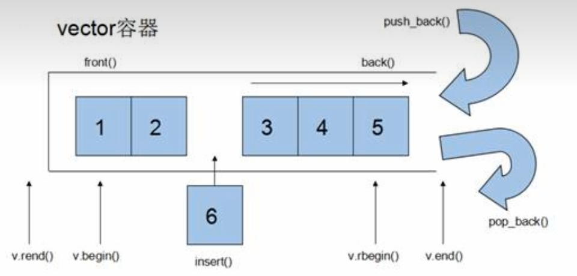
+ vector容器的迭代器是支持随机访问的迭代器

#### 3.2.2 vector构造函数

**功能描述：**

+ 创建vector容器

**函数原型：**

+ `vector<T> v;`	                                //采用模板实现类实现，默认构造函数
+ `vector(v.begin() , v.end( ) ) ;`	//将v[begin(), end())区间中的元素拷贝给本身
+ `vector(n, elem) ;`	                         //构造函数将n个elem拷贝给本身。
+ `vector( const vector &vec ) ;`	     //拷贝构造函数。
+ 示例：

```c++
#include<iostream>
using namespace std;
#include<vector>

// vector 构造函数

void printVector(vector<int> &v)
{
	for (vector<int>::iterator it = v.begin(); it != v.end(); it++)
	{
		cout << *it << " ";
	}
	cout << endl;
}
void test01()
{
	vector<int>v1; //默认构造  无参构造
	for (int i = 0; i < 10; i++)
	{
		v1.push_back(i);
	}
	printVector(v1);

	// 通过区间方式进行构造
	vector<int>v2(v1.begin(), v1.end());
	printVector(v2);

	// n个elem方式构造
	vector<int>v3(10, 100); // 第一个参数是个数  第二个参数是值
	printVector(v3);

	// 拷贝构造
	vector<int>v4(v3);
	printVector(v4);
}
int main()
{
	test01();
	system("pause");
	return 0;
}
```

#### 3.2.3 vector赋值操作

**功能描述：**

+ 给vector容器进行入职

**函数原型：**

+ `vector& operator=( const vector &vec);`	//重载等号操作符
+ `assign(beg, end) ;`	//将[beg, end)区间中的数据拷贝赋值给本身。
+ `assign(n, elem) ;`	//将n个elem拷贝赋值给本身。

#### 3.2.4 vector 容量和大小

**函数原型：**

+ `empty();`	                       //判断容器是否为空
+ `capacity();`	                  //容器的容量
+ `size();`	                           //返回容器中元素的个数
+ `resize(int num ) ;`	       //重新指定容器的长度为num，若容器变长，则以默认值("0")填充新位置。//如果容器变短，则末尾超出容器长度的元素被删除。
+ `resize(int num，elem); `	//重新指定容器的长度为num，若容器变长，则以elem值填充新位置。//如果容器变短，则末尾超出容器长度的元素被删除

#### 3.2.5 vector插入和删除

**函数原型：**

+ `push_back(ele) ;`					 		//尾部插入元素ele
+ `pop_back( );`								//删除最后一个元素
+ `insert(const_iterator pos，,ele);	` 		    //迭代器指向位置pos插入元素ele
+ `insert(const_iterator pos， int count,ele);`//迭代器指向位置pos插入count个元素ele
+ `erase(const_iterator pos ) ;`                                      //删除迭代器指向的元素
+ `erase(const_iterator start, const_iterator end);`    //删除迭代器从start到end之间的元素
+ `clear();`                                                                         //册除容器中所有元素

#### 3.2.6 vector数据存取

**函数原型：**

+ `at(int idx ) ;`		//返回索引idx所指的数据
+ `operator[];`		     //返回索引idx所指的数据
+ `front();`			       //返回容器中第一个数据元素
+ `back();`		             //返回容器中最后一个数据元素
+ 示例：

```c++
#include<iostream>
using namespace std;
#include<vector>
//vector 数据存取

void test01()
{
	vector<int>v1;
	for (int i = 0; i < 10; i++)
	{
		v1.push_back(i);
	}
	// 利用[]方式访问数组中的元素
	for (int i = 0;i < v1.size(); i++)
	{
		cout << v1[i] << " ";
	}
	cout << endl;
	// 利用at访问元素
	for (int i = 0;i < v1.size(); i++)
	{
		cout << v1.at(i) << " ";
	}
	cout << endl;
	// 获取第一个元素
	cout << "第一元素为： " << v1.front() << endl;
	cout << "最后一个元素为： " << v1.back() << endl;
}

int main()
{
	test01();
	system("pause");
	return 0;
}
```

#### 3.2.7 vector 互换容器

**功能描述：**

+ 实现两个容器内元素进行互换

**函数原型：**

+ `swap(vec);`  //将`vec`与本省元素互换

```c++
#include<iostream>
#include<vector>
using namespace std;

// 容器互换
void printVector(vector<int>& v)
{
	for (vector<int>::iterator it = v.begin(); it != v.end(); it++)
	{
		cout << *it << " ";
	}
	cout << endl;
}
// 1. 基本是用
void test01()
{
	vector<int>v1;
	for (int i = 0; i < 10; i++)
	{
		v1.push_back(i);
	}
	cout << "互换之前" << endl;
	printVector(v1);
	vector<int>v2;
	for (int i = 10; i > 0; i--)
	{
		v2.push_back(i);
	}
	printVector(v2);
	cout << "互换之后" << endl;
	v1.swap(v2);
	printVector(v1);
	printVector(v2);

}

// 2. 实际用途
// 巧用swap可以收缩内存空间
void test02()
{
	vector<int>v;
	for (int i = 0; i < 100000; i++)
	{
		v.push_back(i);
	}
	cout << "v的容量为： " << v.capacity() << endl;
	cout << "v的大小为： " << v.size() << endl;
	v.resize(3);
	cout << "v的容量为： " << v.capacity() << endl;
	cout << "v的大小为： " << v.size() << endl;

	// 巧用swap可以收缩内存空间
	vector<int>(v).swap(v);
	cout << "v的容量为： " << v.capacity() << endl;
	cout << "v的大小为： " << v.size() << endl;
}
int main()
{
	//test01();
	test02();
	system("pause");
	return 0;
}
```

 ```c++
  // 巧用swap可以收缩内存空间
  vector<int>(v).swap(v);

 ```

+ 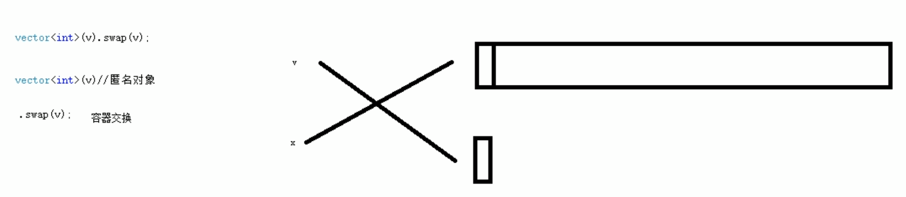

#### 3.2.8 vector 预留空间

**功能描述：**

+ 减少vector在动态扩展容量时的扩展次数

**函数原理：**

+ `reserve(int len);`   //容器预留`len`个元素长度，预留位置不初始化，元素不可访问

+ 示例：

```c++
#include<iostream>
using namespace std;
#include<vector>

//预留空间
void test01()
{
	vector<int>v;
	// 利用reserve预留空间
	v.reserve(100000);
	int num = 0;// 统计开辟次数
	int* p = NULL;
	for (int i = 0; i < 100000; i++)
	{
		v.push_back(i);
		if (p != &v[0])
		{
			p = &v[0];
			num++;
		}
	}
	cout << "num= " << num << endl;
}

int main()
{
	test01();
	system("pause");
	return 0;
}
```

### 3.3 `deque`容器

#### 3.3.1 deque容器基本概念

**功能：**

+ 双端数组，可以对头端进行插入删除操作

**deque与vector区别：**

+ vector对于头部的插入删除效率低，数据量越大，效率越低

+ deque相对而言，对头部的插入删除速度回比vector快

+ vector访问元素时的速度会比deque快,这和两者内部实现有关

  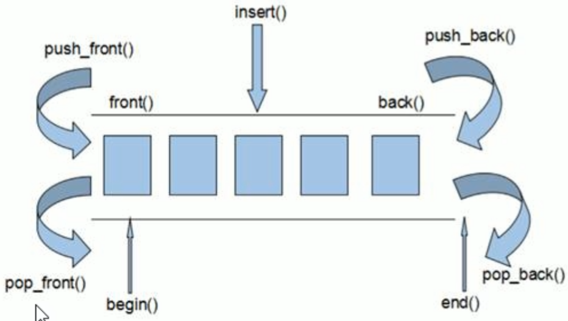

+ deque内部工作原理:

  + deque内部有个**中控器**，维护每段缓冲区中的内容，缓冲区中存放真实数据
  + 中控器维护的是每个缓冲区的地址，使得使用deque时**像—片连续的内存空间**

  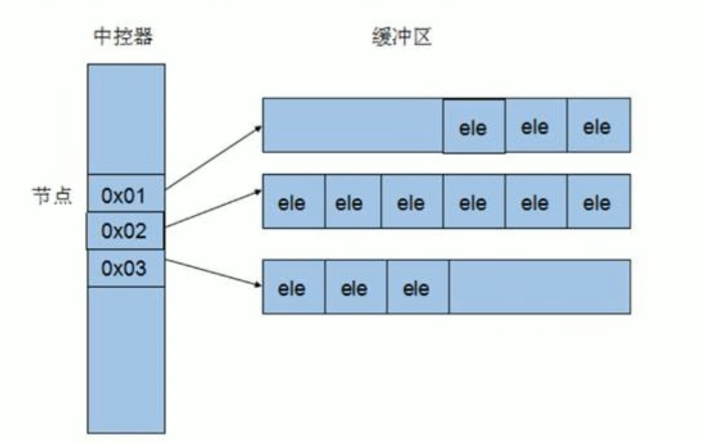

  + deque容器的迭代器也是支持随机访问的
  
#### 3.3.2 deque构造函数

  **函数原型：**

  + `deque<T> deqT;`						   //默认构造形式
  + `deque( beg, end) ;`					//构造函数将[beg, end)区间中的元素拷贝给本身。
  + `deque(n,elem) ;`						 //构造函数将n个elem拷贝给本身。
  + `deque( const deque &deq);`		//拷贝构造函数
  
  + 示例：

  ```c++
  #include<iostream>
  using namespace std;
  #include<deque>
  
  void printDeque(const deque<int>& d) //const 只读状态
  {
  	for (deque<int>::const_iterator it = d.begin();it != d.end();it++) {
  		//*it = 10; 容器中的数据不可用修改了
  		cout << *it << " ";
  	}
  	cout << endl;
  }
  
  void test01()
  {
  	deque<int>d1;
  	for (int i = 0;i < 10;i++)
  	{
  		d1.push_back(i);
  	}
  	printDeque(d1);
  	deque<int>d2(d1.begin(), d1.end());
  	printDeque(d2);
  }
  
  int main()
  {
  	test01();
  	system("pause");
  	return 0;
  }
  ```

####  3.3.3  deque赋值操作

**函数原型：**

+ `deque& operator=(const deque &deq) ; ` 				    //重载等号操作符
+ `assign( beg, end ) ;  `                                                //将[beg, end)区间中的数据拷贝赋值给本身。
+ `assign(n,elem);`                                                          // 将n个elem拷贝赋值给本身。

#### 3.3.4 dque大小操作

**函数原型：**

+ `deque.empty();`                               //判断容器是否为空
  
+ `deque.size(); `                                 //返回容器中元素的个数
  
+ `deque.resize(num ) ; `                     //重新指定容器的长度为num,若容器变长，则以默认值填充新位置。
  						                                  //如果容器变短，则末尾超出容器长度的元素被删除。
  
+ `deque.resize(num，elem);`			  //重新指定容器的长度为num,若容器变长，则以elem值填充新位置。
    	                                                   //如果容器变短，则末尾超出容器长度的元素被删除。

#### 3.3.5  deque 插入和删除

**函数原型：**

两端插入操作：

+ `push_back(elem) ;`				    //在容器尾部添加一个数据
+ `push_front(elem) ;`				  //在容器头部插入一个数据
+ `pop_back( ) ;`						   //删除容器最后一个数据
+ `pop_front();`							 //删除容器第一个数据

指定位置操作：

+ `insert( pos,elem);`			  //在pos位置插入一个elem元素的拷贝，返回新数据的位置。

  + `d1.insert(d1.begin()，1000) ;`

+ `insert( pos,n,elem);`		  //在pos位置插入n个elem数据，无返回值。

  + `d1.insert(d1.begin()，2，10000) ;`

+ `insert(pos,beg,end);`		 //在pos位置插入[beg,end)区间的数据，无返回值。

  + `d1.insert(d1.begin()，d2.begin()，d2.end() ) ;`

+ `clear( );		`					        //清空容器的所有数据
+ `erase(beg,end ) ;`			  //删除[beg,end)区间的数据，返回下一个数据的位置。
+ `erase(pos);`						//删除pos位置的数据，返回下一个数据的位置。

  + ```c++
    deque<int> : :iterator it = d1.begin() ;
    it++;
    d1.erase(it) ;
    ```


#### 3.3.6 deque 数据存取

**函数原型：**

+ `at(int idx); `		//返回索引idx所指的数据
+ `operator[ ];`		//返回索引idx所指的数据
+ `front();`			  //返回容器中第一个数据元素
+ `back();`			    //返回容器中最后一个数据元素

#### 3.3.7 deque 排序

**功能描述：**

+ 利用算法实现对deque容器进行排序

**算法：**

+ `sort(iterator beg, iterator end)`			//对beg和end区间内元素进行排序
+ 排序默认排序规则从小到大升序
+ 对于支持随机访问的迭代器的容器，都可以利用sort算法直接对其进行排序
+ vector容器也可以利用sort进行排序

### 3.4 红黑树（平衡二叉排序树）

+ 右节点 > 根节点 > 左节点
+ 树的结点数 = 2 ^ h  -  1

| 集合               | 底层实现 | 是否有序 | 数值是否可以重复 | 能否更改数值 | 查询效率 | 增删效率 |
| ------------------ | -------- | -------- | ---------------- | ------------ | -------- | -------- |
| std::set           | 红黑树   | 有序     | 否               | 否           | O(log n) | O(log n) |
| std::multiset      | 红黑树   | 有序     | 是               | 否           | O(logn)  | O(logn)  |
| std::unordered_set | 哈希表   | 无序     | 否               | 否           | O(1)     | O(1)     |

| 映射               | 底层实现 | 是否有序 | 数值是否可以重复 | 能否更改数值 | 查询效率 | 增删效率 |
| ------------------ | -------- | -------- | ---------------- | ------------ | -------- | -------- |
| std::map           | 红黑树   | key有序  | key不可重复      | key不可修改  | O(logn)  | O(logn)  |
| std::multimap      | 红黑树   | key有序  | key可重复        | key不可修改  | O(log n) | O(log n) |
| std::unordered_map | 哈希表   | key无序  | key不可重复      | key不可修改  | O(1)     | O(1)     |

> + 当我们要使用集合来解决哈希问题的时候，优先使用unordered_set，因为它的查询和增删效率是最优的，如果需要集合是有序的，那么就用set，如果要求不仅有序还要有重复数据的话，那么就用multiset。
>
> + 那么再来看一下map ，在map 是一个key value 的数据结构，map中，对key是有限制，对value没有限制的，因为key的存储方式使用红黑树实现的。

### 3. 5 stack容器

#### 3.5.1 stack基本概念

**概念：**stack **是一只先进后出**（First Last OUT，FILO）的数据结构，它只有一个出口

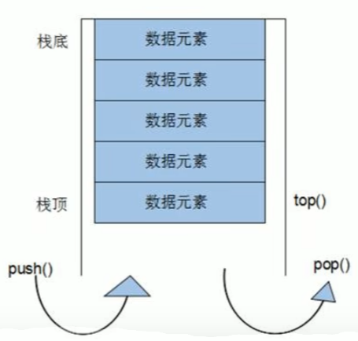

**栈中只有顶端元素才可以被外界是用，因此栈不允许有遍历行为**

栈中进入数据称为——入栈 `push`

栈中弹出数据称为——出栈 `pop`

#### 3.5.2 stack 常用接口

**功能描述:**

+ 栈容器常用的对外接口
+ 构造函数:
  + `stack<T> stk;`               //stack采用模板类实现, stack对象的默认构造形式
  + `stack(const stack &stk);  `       //拷贝构造函数
+ 赋值操作:
  + `stack& operator=( const stack &stk) ;`		//重载等号操作符
+ 数据存取:
  + `push(elem); `          //向栈顶添加元素
  + `pop();`                  //从栈顶移除第一个元素
  + `top();`                  //返回栈顶元素
+ 大小操作:
+ `empty(); `               //判断堆栈是否为空
+ `size();    `                //返回栈的大小

### 3.6 queue 容器

#### 3.6.1 queue基本概念

+ **先进先出**
+ 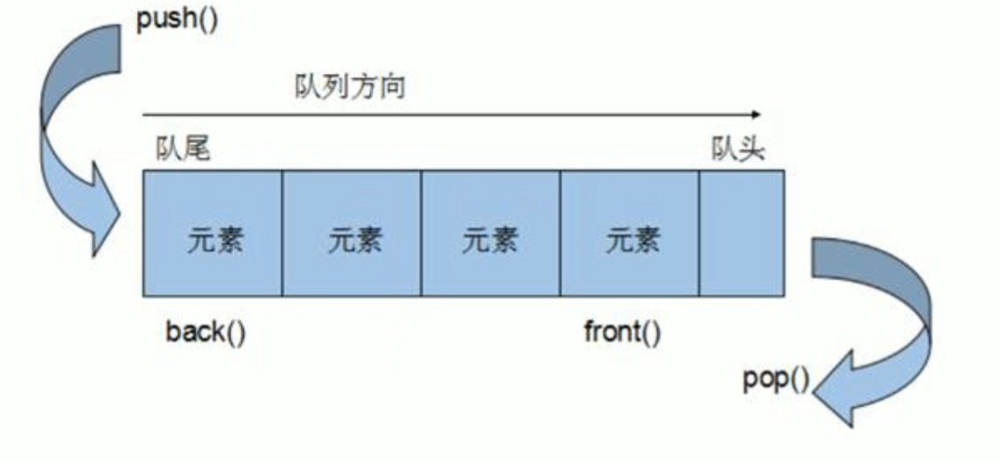
+ 入队——`push`
+ 出队——`pop`

#### 3.6.2 queue常用接口

功能描述:栈容器常用的对外接口
+ 构造函数:
  + ` queue<T> que;`	//queue采用模板类实现，queue对象的默认构造形式
  + `queue( const queue &que);` 	//拷贝构造函数
+ 赋值操作:
  + `queue& operator=( const queue &que) ;`		//重载等号操作符
+ 数据存取:
  + `push(elem ) ;`	//往队尾添加元素
  + `pop();` 	//从队头移除第一个元素
  + `back();`	//返回最后一个元素
  + `front();`	//返回第一个元素
+ 大小操作:
+ `empty();`           //判断堆栈是否为空
+  `size(); `          //返回栈的大小

### 3.7  list 容器

#### 3.7.1 list基本概念

**功能：**将数据进行链式存储

**链表：**是一种物理存储单元上非连续的存储结构，数据元素的逻辑顺序是通过链表中的指针链接来实现的

链表的组成：链表由一些列 **结点**组成

结点的组成：一个存储数据元素的 **数据域**，另一个是存储下一个结点地址的 **指针域**

STL中链表是一个双向循环链表

+ 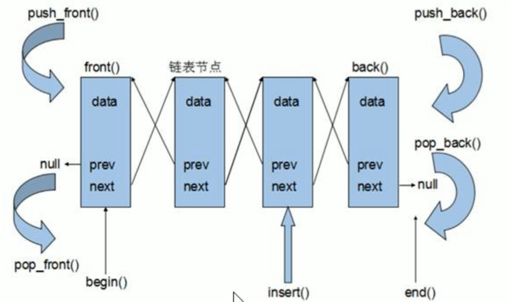

+ 由于链表的存储方式并不是连续的内存空间，因此链表list中的迭代器只支持前移和后移，属于**双向迭代器**

+ list的优点:

  + 采用动态存储分配，不会造成内存浪费和溢出
  + 链表执行插入和删除操作十分方便，修改指针即可，不需要移动大量元素

+ list的缺点:

  + 链表灵活，但是空间(指针域)和时间(遍历)额外耗费较大

+ List有一个重要的性质，插入操作和删除操作都不会造成原有list迭代器的失效，这在vector是不成立的。

  > 总结:STL中**List和vector是两个最常被使用的容器**，各有优缺点

#### 3.7.2 list构造函数

+ `list<T> lst;`                 //list采用采用模板类实现,对象的默认构造形式:
+ `list(beg,end) ; `           //构造函数将[beg, end)区间中的元素拷贝给本身。
+ `list(n,elem);`                //构造函数将n个elem拷贝给本身。
+ `list(const list &lst); `        //拷贝构造函数。

#### 3.7.3 list 赋值和交换

+ `assign( beg, end) ; `      //将[beg, end)区间中的数据拷贝赋值给本身。
+ `assign(n,elem);   `            //将n个elem拷贝赋值给本身。
+ `list& operator=(const list &lst);  `        //重载等号操作符
+ `swap( lst);      `   //将lst与本身的元素互换。

#### 3.7.4  list大小操作

+ `size();`			           //返回容器中元素的个数
+ `empty();`		             //判断容器是否为空
+ `resize( num ) ;`		  //重新指定容器的长度为num，若容器变长，则以默认值填充新位置。
​								      //如果容器变短，则末尾超出容器长度的元素被删除
+ `resize(num，elem);`	  //重新指定容器的长度为num，若容器变长，则以elem值填充新位置。
  										                                   //如果容器变短，则末尾超出容器长度的元素被删除

#### 3.7.5 list 插入和删除

+ `push_back(elem);`/l在容器尾部加入一个元素
+ `pop_back();`//删除容器中最后一个元素
+ `push_front(elem);`/l在容器开头插入一个元素
+ `pop_front();`/l从容器开头移除第一个元素
+ `insert(pos,elem);`//在pos位置插elem元素的拷贝，返回新数据的位置。
+ `insert(pos,n,elem);`/l在pos位置插入n个elem数据，无返回值。
+ `insert(pos,beg,end);`/l在pos位置插入[beg,end)区间的数据，无返回值。
+ `clear();`//移除容器的所有数据
+ `erase(beg,end);`//删除[beg,end)区间的数据，返回下一个数据的位置。
+ `erase(pos);`//删除pos位置的数据，返回下一个数据的位置。
+ `remove(elem);`//删除容器中所有与elem值匹配的元素。

#### 3.7.6 list 数据存取

+ `front();`	//返回第一个元素。
+ `back();`	 //返回最后一个元素。

#### 3.7.7 list 反转和排序

+ `reverse( );`	//反转链表

+ `sort();`			//链表排序

+ ```c++
  // 所有不支持随机访问迭代器的容器，不可以用标准算法
  //不支持随机访问迭代器的容器，内部会提供对应的一些算法
  L1.sort(); //默认从小到大
  
  //降序 
  bool myCompare(int v1, int v2)
  {
      return v1 > v2;
  }
  L1.sort(myCompare);
  ```

### 3.8 set/multiset 容器

#### 3.8.1 set基本概念

**简介：**

+ 所有元素都会在插入时自动排序

**本质：**

+ set/multiset 属于 **关联式容器**，底层结构是用 **二叉树**实现

**set/multiset 区别：**

+ set不允许容器中有重复的元素
+ multiset 运行容器中有重复的元素

#### 3.8.2 set 构造和赋值

**构造:**

+ `set<T> st;`	//默认构造函数:
+ `set( const set &st);`	 // 拷贝构造函数

**赋值:**
+ `set& operator=( const set &st);`	//重载等号操作符

```c++
// 插入数据   只有insert方式
s1.insert(10);

pair<set<int>: :iterator ,bool> ret = s.insert(10);
if (ret.second){
	cout <<"第一次插入成功"<< endl;
}
else{
	cout <<"第一次插入失败"<< endl;
}
```

#### 3.8.3 set 大小和交换

+ `size();`	//返回容器中元素的数目
+ `empty();`	//判断容器是否为空
+ `swap(st);`	//交换两个集合容器

#### 3.8.4 set 插入和删除

+ `insert( elem);`  //在容器中插入元素。
+ `clear();` //清除所有元素
+ `erase(pos ) ; `//删除pos迭代器所指的元素，返回下一个元素的迭代器
+ `erase( beg, end) ;` //删除区间[beg,end)的所有元素，返回下一个元素的迭代器。
+ `erase(elem ) ; `//删除容器中值为elem的元素。

#### 3.8.5 查找和统计

+ `find (key );` //查找key是否存在,若存在，**返回该键的元素的迭代器**;若不存在，返回`set.end();`
  + `set<int> : :iterator pos = s1.find(30) ;`
+ `count(key ) ;` //统计key的元素个数 (结果是0或者1)

#### 3.8.6 set 和 multiset 区别

**区别：**

+ set不可以插入重复数据，而multiset可以
+ set插入数据的同时会返回插入结果，表示插入是否成功
+ multiset 不会检测数据，因此可以插入重复数据

#### 3.8.7  pair 对组创建

**功能描述：**

+ 成对出现的数据，利用对组可以返回两个数据

**两种创建方式：**

+ `pair<type, type> p ( value1, value2 );`
+ `pair<type,type> p = make_pair( value1, value2 ) ;`

```c++
#include<iostream>
using namespace std;
#include<string>


// 对组创建
void test01()
{
	// 第一种方式
	pair<string, int>p("Tom", 20);
	cout << p.first << p.second << endl;
	// 第二种方式
	pair<string, int>p2 = make_pair("Jerry", 30);
	cout << p2.first << p2.second << endl;
}
int main()
{
	test01();
;	system("pause");
	return 0;
}
```

#### 3.8.8 set容器的排序

**主要技术点：**

+ 利用仿函数，可以改变排序规则

+ 示例一：set存放内置数据类型

```c++
#include<iostream>
using namespace std;
#include<set>
// set 容器排序
class MyCompare
{
public:
	// 仿函数
	bool operator()(int v1, int v2) const
	{
		return v1 > v2;
	}
};
void test()
{
	set<int>s1;
	s1.insert(10);
	s1.insert(20);
	s1.insert(30);
	s1.insert(50);
	s1.insert(40);
	for (set<int>::iterator it = s1.begin(); it != s1.end(); it++)
	{
		cout << *it << " ";
	}
	cout << endl;
	// 指定排序规则为从大到小
	set<int, MyCompare>s2;
	s2.insert(10);
	s2.insert(20);
	s2.insert(30);
	s2.insert(50);
	s2.insert(40);
	for (set<int, MyCompare>::iterator it = s2.begin(); it != s2.end(); it++)
	{
		cout << *it << " ";
	}
	cout << endl;
}

int main()
{
	test();
	system("pause");
	return 0;
}
```

> 总结：利用防函数可以指定set容器的排序规则

+ 示例二： set存放自定义数据类型

```c++
#include<iostream>
using namespace std;
#include<set>
#include<string>
// set存放自定义数据类型
class Person
{
public:
	// 自定义数据类型 都会指定排序规则
	Person(string name, int age)
	{
		this->m_Name = name;
		this->m_Age = age;
	}
	string m_Name;
	int m_Age;
};
class conparePerson
{
public:
	bool operator()(const Person& p1, const Person& p2) const
	{
		return p1.m_Age > p2.m_Age;
	}
};
void test01()
{
	set<Person, conparePerson>s;
	Person p1("刘备",24);
	Person p2("关羽",28);
	Person p3("张飞",25);
	Person p4("赵云",21);
	s.insert(p1);
	s.insert(p2);
	s.insert(p3);
	s.insert(p4);
	for (set<Person, conparePerson>::iterator it = s.begin(); it != s.end(); it++)
	{
		cout << it->m_Name << it->m_Age << endl;
	}

}
int main()
{
	test01();
	system("pause");
	return 0;
}
```

> 总结： 对于自定义数据类型，set必须指定排序规则才可以插入数据

### 3.8  map/multimap 容器

#### 3.8.1 map基本概念

**简介：**

+ map中所有元素都是pair

+ pair中第一个元素为key(键值)，起到索引作用，第二个元素为value(实值)·所有元素都会根据元素的**键值自动排序**

**本质:**

+ map/multimap属于**关联式容器**，底层结构是用二叉树实现。

**优点：**

+ 可以根据key值快速找到value值

**map和multimap区别：**

+ map 不允许容器中有**重复key**值元素
+ multimap 允许容器中有**重复key值**元素

#### 3.8.2 map构造和赋值

**构造：**

+ `map<T1，T2> mp;` 	//map默认构造函数:
+ `map(const map &mp) ; `	//拷贝构造函数

**赋值：**

+ `map& operator=( const map &mp ) ;`	//重载等号操作符

```c++
#include<iostream>
using namespace std;
#include<map>

// map构造和赋值

void printMap(map<int, int>& m)
{
	for (map<int, int>::iterator it = m.begin();it != m.end();it++)
	{
		cout << "key = " << (*it).first << " value = " << it->second << endl;
	}
	cout << endl;
}
void test01()
{
	// 创建map容器
	map<int, int>m;
	m.insert(pair<int, int>(1, 20));
	m.insert(pair<int, int>(3, 40));
	m.insert(pair<int, int>(2, 30));
	m.insert(pair<int, int>(4, 50));

	// 拷贝构造
	printMap(m);
	map<int, int>m2(m);
	printMap(m2);
}
int main()
{
	test01();
	system("pause");
	return 0;
}
```

> 总结: map中所有元素都是成对出现，插入数据时候要使用对组

#### 3.8.3 map 大小和交换

+ `size();`	//返回容器中元素的数目
+ `empty();`	//判断容器是否为空
+ `swap(st);`	//交换两个集合容器

#### 3.8.4 map 插入和删除

+ `insert( elem) ;`	//在容器中插入元素。

```c++
//插入//第一种
m.insert(pair<int，int>(1，10) ) ;
//第二种
m.insert(make_pair(2，20)) ;
//第三种
m.insert(map<int，int> : : value_type (3,30) ) ;
//第四种  （不建议使用）
// []不建议插入，用途：可以利用key访问到value
m[4] = 40;
```

+ `clear();`	//清除所有元素
+ `erase(pos );`	//删除pos迭代器所指的元素，返回下一个元素的迭代器
+ `erase( beg, end) ;`	//删除区间[beg,end)的所有元素，返回下一个元素的迭代器。
+ `erase(key ) ;`	//删除容器中值为key的元素。

#### 3.8.5 map 查找和统计

+ `find(key );`	//查找key是否存在,若存在，**返回该键的元素的迭代器**;若不存在，返回`set.end();`

```c++
map<int,int> : :iterator pos = m.find(3) ;
if (pos != m.end ())
{
    	cout<<"查到了元素 key = "<<(*pos).first〈< " value = " << pos->second << endl;
    }
    else{
        cout <<"未找到元素"<< endl;
}
```

+ `count(key ) ;`	//统计key的元素个数 (结果为0或者1)

#### 3.8.6 map 容器排序

+ 利用仿函数，可以改变排序规则
+ 示例

```c++
#include<iostream>
using namespace std;
#include<map>
class MyCompare
{
public:
	bool operator()(int v1, int v2) const
	{
		// 降序
		return v1 > v2;
	}
};
void test01()
{
	map<int, int, MyCompare>m;
	m.insert( make_pair(1,10));
	m.insert( make_pair(2,20));
	m.insert( make_pair(3,30));
	m.insert( make_pair(4,40));
	m.insert( make_pair(5,50));
	m.insert( make_pair(6,60));
	for (map<int, int, MyCompare>::iterator it = m.begin();it != m.end();it++)
	{
		cout << "key = " << (*it).first << " value = " << it->second << endl;
	}
	cout << endl;
}

int main()
{
	test01();
	system("pause");
	return 0;
}
```


## 4. STL-函数对象

### 4.1 函数对象

#### 4.1.1 函数对象概念

**概念：**

+ 重载 **函数调用操作符** 的类，其对象常称为 **函数对象**
+ **函数对象** 使用重载的（）时，行为类似函数调用，也叫  **仿函数**

**本质：**

函数对象（仿函数）是一个 **类** ，不是一个函数

#### 4.1.2 函数对象使用

**特点：**

+ 函数对象在使用时，可以像普通函数那样调用,可以有参数，可以有返回值
+ 函数对象超出普通函数的概念，函数对象可以有自己的状态
+ 函数对象可以作为参数传递
+ 示例：

```c++
#include<iostream>
using namespace std;
#include<string>

// 函数对象(仿函数)
class MyAdd
{
public:
	int operator()(int v1, int v2)
	{
		return v1 + v2;
	}
};
//1.函数对象在使用时，可以像普通函数那样调用, 可以有参数，可以有返回值
void test01()
{
	MyAdd myadd;
	cout << myadd(10, 10) << endl;
}
//函数对象超出普通函数的概念，函数对象可以有自己的状态
class MyPrint
{
public:
	MyPrint()
	{
		this->count = 0;
	}
	void operator()(string test)
	{
		cout << test << endl;
		this->count++;
	}
	int count; // 内部自己状态
};
void test02()
{
	MyPrint myPrint;
	myPrint("hello world");
	cout << myPrint.count << endl;
}
//函数对象可以作为参数传递
void doPrint(MyPrint & mp, string test)
{
	mp(test);
}
void test03()
{
	MyPrint myPrint;
	doPrint(myPrint, "hello c++");
}

int main()
{
	test01();
	test02();
	test03();
	system("pause");
	return 0;
}
```

### 4.2 谓词

#### 4.2.1 谓词概念

**概念：**

+ 返回bool类型的仿函数称为**谓词**
+ 如果operator()接受一个参数，那么叫做—元谓词
+ 如果operator()接受两个参数，那么叫做二元谓词

#### 4.2.2 一元谓词

```C++
#include<iostream>
using namespace std;
#include<vector>
#include<algorithm>
// 仿函数   返回值类型是bool数据类型，称为谓词
// 一元谓词
class GreaterFive
{
public:
	bool operator()(int val) const
	{
		return val > 5;
	}
};
void test01()
{
	vector<int>v;
	for (int i = 0; i < 10;i++)
	{
		v.push_back(i);
	}
	// 查找容器中有没有大于5的数字
	//GreaterFive() 匿名函数对象
	vector<int>::iterator it = find_if(v.begin(), v.end(), GreaterFive());
	if (it == v.end())
	{
		cout << "未找到" << endl;
	}
	else
	{
		cout << "找到了" << *it <<  endl;
	}
}
int main()
{
	test01();
	system("pause");
	return 0;
}
```

#### 4.2.3 二元谓词

```c++
#include<iostream>
using namespace std;
#include<vector>
#include<algorithm>
// 二元谓词
class MyCompare
{
public:
	bool operator()(int v1,int v2) const
	{
		return v1 > v2;
	}
};
void test01()
{
	vector<int>v;
	v.push_back(10);
	v.push_back(40);
	v.push_back(30);
	v.push_back(20);
	v.push_back(50);
	
	sort(v.begin(), v.end());
	for (vector<int>::iterator it = v.begin(); it != v.end(); it++) {
		cout << *it << " ";
	}
	cout << endl;
	// 使用函数对象改变算法策略，变为排序规则为从大到小
	sort(v.begin(), v.end(), MyCompare());
	for (vector<int>::iterator it = v.begin(); it != v.end(); it++) {
		cout << *it << " ";
	}
	cout << endl;
}
int main()
{
	test01();
	system("pause");
	return 0;
}
```

### 4.3 内建函数对象

#### 4.3.1 内建函数对象意义

**概念：**

+ STL内建了—些函数对象

**分类：**

+ 算术仿函数
+ 关系仿函
+ 数逻辑仿函数

**用法：**

+ 这些仿函数所产生的对象，用法和一般函数完全相同
+ **使用内建函数对象，需要引入头文件**`#include<functional>`

#### 4.3.2 算术仿函数

**功能描述：**

+ 实现四则运算
+ 其中**negate**是一元运算，其他都是二元运算

**仿函数原型：**

+ `template<class T> T plus<T>`	//加法仿函数
+ `template<class T> T minus<T>`	//减法仿函数
+ `template<class T> T multiplies<T>`	//乘法仿函数
+ `template<class T> T divides<T>`	//除法仿函数
+ `template<class T> T modulus<T>`	//取模仿函数
+ `template<class T> T negate<T>`	//取反仿函数

#### 4.3.3 关系仿函数

**仿函数原型：**

+ `template<class T> bool equal_to<T>`	//等于
+ `template<class T> bool not_equal_to<T>`	//不等于
+ `template<class T> bool greater<T>`	//大于
+ `template<class T> bool greater_equal<T>`	//大于等于
+ `template<class T> bool less<T>`	//小于
+ `template<class T> bool less_equal<T>`	//小于等于

#### 4.3.4 逻辑仿函数

**仿函数原型：**

+ `template<class T> bool logical_and<T>`	//逻辑与
+ `template<class T> bool logical_or<T>`	//逻辑或
+ `template<class T> bool logical_not<T>`	//逻辑非

## 5. STL-常用算法

**概述：**

+ 算法主要是由头文件`<algorithm>` `<functional>` `<numeric>`组成。
+ `<algorithm>`是所有 STL 头文件中最大的一个，范围涉及到比较、交换、查找遍历操作、复制、修改等等
+ `<numeric>`体积很小，只包括几个在序列上面进行简单数学运算的模板函数
+ `<functional>`定义了一些模板类,用以声明函数对象。

###  5.1 常用遍历算法

+ `for_each`  //遍历容器
+ `transform`  //搬运容器到另一个容器中

#### 5.1.1 for_each

**函数原型：**

+ `for_each(iterator beg, iterator end，_func) ;`
+ //遍历算法遍历容器元素
+ // beg开始迭代器
+ // end结束迭代器
+ //_func函数或者函数对象

#### 5.1.3 transform

**函数原型：**

+ `transform(iterator beg1， iterator end1，iterator beg2，_func);`
  
+ // beg1源容器开始迭代器
  
+ // end1源容器结束迭代器
  
+ // beg2目标容器开始迭代器
  
+ // _func函数或者函数对象
  
+ ```c++
  vector<int>vTarget;//目标容器
  vTarget.resize(v.size());//目标容器需要提前开辟空间
  transform(v.begin(), v.end()， vTarget.begin()，Transform());
  ```

  > 总结:搬运的目标容器必须要提前开辟空间，否则无法正常搬运

### 5.2  常用的查找算法

+ `find`	//查找元素
+ `find_if`	//按条件查找元素
+ `adjacent_find`	//查找相邻重复元素
+ `binary _search`	//二分查找法
+ `count` //统计元素个数
+ `count_if`	//按条件统计元素个数

### 5.2.1 find

**功能描述：**

+ 查找指定元素，找到返回指定元素的迭代器，找不到返回结束迭代器end()

**函数原型：**

+ `find(iterator beg,iterator end, value) ;`
+ //**按值查找元素，找到返回指定位置迭代器，找不到返回结束迭代器位置**
+ //beg 开始迭代器
+ //end结束迭代器
+ // value查找的元素

> 总结:利用find可以在容器中找指定的元素，返回值是迭代器

#### 5.2.2 find_if

**功能描述：**

+ 按条件查找元素

**函数原型：**

+ `find_if(iterator beg, iterator end，_Pred);`
+ //按值查找元素，找到返回指定位置迭代器，找不到返回结束迭代器位置
+ // beg 开始迭代器
+ // end结束迭代器
+ // **_Pred函数或者谓词(返回bool类型的仿函数)**

#### 5.2.3 adjacent_find

**功能描述：**

+ 查找相邻重复元素

**函数原型：**

+ `adjacent_find(iterator beg, iterator end) ;`
+ // 查找相邻**重复元素**,返回相邻元素的第一个位置的迭代器
+ //beg开始迭代器
+ // end结束迭代器

#### 5.2.4 binary _search

**功能描述：**

+ 查找指定元素是否存在

**函数原型：**

+ bool binary_search(iterator beg, iterator end，value);
+  //查找指定的元素，**查到返回true否则false**
  //注意:在**无序序列中不可用**
  // beg 开始迭代器
  // end结束迭代器
  // value查找的元素

#### 5.2.4 count 

**功能描述：**

+ 统计个数

**函数原型：**

+ `count(iterator beg, iterator end, value) ;`  
+ //统计元素出现次数
+ // beg开始迭代器
+ // end结束迭代器
+ // value统计的元素

> 总结:统计自定义数据类型时候，需要配合重载`operator==`

#### 5.2.5 count_if

**功能描述：**

+ 按条件统计元素个数

**函数原型：**

+ `count_if(iterator beg, iterator end，_Pred);`
  //按条件统计元素出现次数
  // beg开始迭代器
  // end结束迭代器
  // **_Pred谓词**

### 5.3 常用排序算法
+ `sort`	//对容器内元素进行排序
+ `random_shuffle`	//洗牌指定范围内的元素随机调整次序
+ `merge` // 容器元素合并，并存储到另一容器中
+ `reverse` //反转指定范围的元素

#### 5.3.1 sort

**功能描述**

+ 对容器内元素进行排序

**函数原型：**

+ `sort(iterator beg, iterator end，_Pred) ;`
+ //按值查找元素，找到返回指定位置迭代器，找不到返回结束迭代器位置
+ // beg开始迭代器
+ // end结束迭代器
+ // _Pred谓词

#### 5.3.2 random_shuffle

**功能描述：**

+ 洗牌 指定范围内的元素随机调整次序

**函数原型：**

+ `random_shuffle(iterator beg, iterator end) ；`
+ //指定范围内的元素随机调整次序
+ // beg开始迭代器
+ //end结束迭代器

```c++
#include<ctime>
void test()
{
    srand ( (unsigned int)time (NULL)) ;
    vector<int>v;
    for (int i = 0; i < 10; i++){
    v.push_back(i) ;
    //利用洗牌算法打乱顺序
    random_shuffle(v.begin(),v.end() ) ;
    for_each(v.begin()， v.end ()，myPrint) ;cout << endl;
}
```

#### 5.3.3 merge

**功能描述：**

+ 两个容器元素合并，并存储到另一个容器中

**函数原型：**

+ `merge(iterator beg1，iterator end1，iterator beg2，iterator end2，iterator dest);`
+ //容器元素合并，并存储到另一容器中
+ //注意:两个容器必须是**有序的**
+ //beg1容器1开始迭代器
+ // end1容器1结束迭代器
+ // beg2容器2开始迭代器
+ // end2容器2结束迭代器
+ // dest目标容器开始迭代器
```c++
#include<iostream>
using namespace std;
#include<vector>
#include<algorithm>
#include<functional>
void myPrint(int val)
{
	cout << val << "";
}

// 常用排序算法merge
void test01()
{
	vector<int>v1;
	vector<int>v2;
	for (int i = 0; i < 10; i++)
	{
		v1.push_back(i);
		v2.push_back(i+1);
	}
	// 目标容器
	vector<int>vTarget;
	
	// 提前给目标容器分配空间
	vTarget.resize(v1.size() + v2.size());
	merge(v1.begin(), v1.end(), v2.begin(), v2.end(), vTarget.begin());
	for_each(vTarget.begin(), vTarget.end(),myPrint);
}

int main()
{
	test01();
	system("pause");
	return 0;
}
```

#### 5.3.4 reverse

**功能描述：**

+ 将容器内元素进行反转

**函数模型：**

+ `reverse(iterator beg, iterator end) ;`
+ // 反转指定范围的元素
+ // beg开始迭代器
+ // end 结束迭代器

### 5.4 常用拷贝和替换算法

+ `copy`	//容器内指定范围的元素拷贝到另一容器中
+ `replace`	//将容器内指定范围的旧元素修改为新元素
+ `replace_if`	//容器内指定范围满足条件的元素替换为新元素
+ `swap`	//互换两个容器的元素

#### 5.4.1 copy

+ `copy(iterator beg, iterator end， iterator dest);`
+ //按值查找元素，找到返回指定位置迭代器，找不到返回结束迭代器位置
+ // beg 开始迭代器
+ // end 结束迭代器
+ // dest目标起始迭代器

> 注意：用 `resize()`开辟空间

#### 5.4.2 replace

+ 将容器内指定范围的旧元素修改为新元素
+ `replace(iterator beg, iterator end, oldvalue，newvalue) ;`
+ `replace(v.begin()， v.end()，20，2000) ;`

+ //将区间内旧元素替换成新元素
  
+ // beg开始迭代器
  
+ // end结束迭代器
  
+ // oldvalue 旧元素
  
+ // newvalue新元素

#### 5.4.3 replace_if

+ 将区间内满足条件的元素，替换成指定元素

+ `replace_if(iterator beg, iterator end，_pred，newvalue) ;`

+ `replace_if(v.begin(), v.end()，Greater30 (),3000) ;`

+ //按条件替换元素，满足条件的替换成指定元素
  
+ // beg开始迭代器
  
+ // end结束迭代器
  
+ // _pred谓词
  
+ // newvalue替换的新元素

> 总结: replace_if按条件查找，可以利用仿函数灵活筛选满足的条件

#### 5.4.4  swap

+ 互换两个容器的元素

+ `swap(container c1, container c2);`

+ `swap (v1，v2) ;`

+ //互换两个容器的元素
  
+ // c1容器1
  
+ // c2容器2
  
  > 总结: swap交换容器时，注意交换的容器要同种类型

### 5.5 常用算术生成算法

**注意：**

+ 算术生成算法属于小型算法，使用时包含的头文件为`#include<numeric>`

**算法简介：**

+ `accumulate`  //计算容器元素累计总和
+ `fill`	//向容器中添加元素

#### 5.5.1 accumulate 

**功能描述：**

+ 计算区间内 容器元素累计总和

**函数原型：**

+ `accumulate(iterator beg, iterator end, value) ;`

+ ```c++
  //参数3起始累加值
  int total = accumulate(v.begin(), v.end()，0) ;
  ```
  
+ //计算容器元素累计总和
  
+ // beg开始迭代器
  
+ // end结束迭代器
  
+ // value起始值

#### 5.5.2 fill

**功能描述：**

+ 向容器中填充指定的元素

**函数原型：**

+ `fill(iterator beg, iterator end, value) ;`

+ ```c++
  vector<int>v ;
  v.resize (10) ;
  //后期重新填充
  fil1(v.begin()， v.end()，100) ;
  ```
  
+  //向容器中填充元素
  
+  // beg开始迭代器
  
+  // end结束迭代器
  
+ // value填充的值

> 总结:利用fill可以将容器区间内元素填充为指定的值

### 5.6 常用集合算法

+ `set_intersection`	//求两个容器的交集
+ `set_union`	//求两个容器的并集
+ `set_difference`	//求两个容器的差集
+ 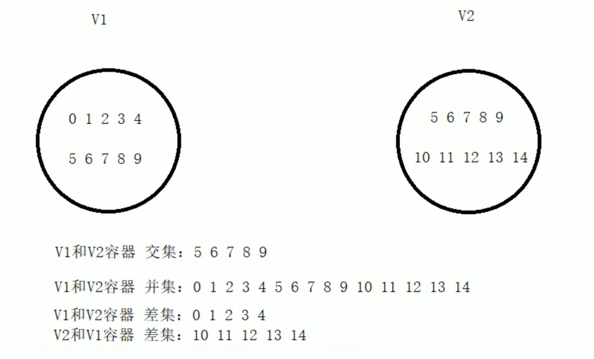

#### 5.6.1 set_intersection

**功能描述：**

+ 求两个容器的交集

**函数原型：**

+ `set_intersection(iterator beg1，iterator end1，iterator beg2，iterator end2，iterator dest);`

+ ```c++
  vector<int>vTarget;
  //目标容器需要提前开辟空间
  //最特殊情况大容器包含小容器开辟空间取小容器的size即可
  vTarget.resize(min(v1.size()， v2.size() ) ) ;
  //获取交集
  vector<int>::iterator itEnd = set_intersection(v1.begin(),v1.end()，v2.begin()， v2.end()，vTargert.begin();
  for_each(vTarget.begin()，itEnd，myPrint);
  ```
+ //求两个集合的交集
+ //注意:两个集合必须是有序序列
+ // beg1容器1开始迭代器
+ // end1容器1结束迭代器
+ // beg2容器2开始迭代器
+ // end2容器2结束迭代器
+ // dest目标容器开始迭代器

> 总结：
>
> +  求**交集的两个集合必须的有序序列**
> + 目标容器开辟空间需要从**两个容器中取小值**
> + et_intersection返回值既是交集中最后一个元素的位置

#### 5.6.2 set_union

+ 求两个容器的并集

+ `set_union(iterator beg1， iterator end1, iterator beg2，iterator end2,iterator dest);`
  
+ ```c++
  //目标容器提前开辟空间
  //最特殊情况两个容器没有交集，并集就是两个容器size相加
  vTarget.resize(v1.size() + v2.size()) ;
  vector<int>::iterator itEnd = set_union(v1.begin()，vl.end()，v2.begin()，v2.end()，vTarget.begin());
  ```
  
+ // 求两个集合的并集
  
+ //注意:两个集合**必须是有序序列**
  
+ // beg1容器1开始迭代器
  
+ // end1容器1结束迭代器
  
+ // beg2容器2开始迭代器
  
+ // end2容器2结束迭代器
  
+ // dest目标容器开始迭代器

> 总结：
>
> + 求并集的两个集合必须的**有序序列**
> + 目标容器开辟空间需要**两个容器相加**
> + set_union返回值既是并集中最后一个元素的位置

#### 5.6.4 set_difference

+ 求两个容器的差集(不属于另一个容器中除过交集的部分)

+ 比如

  + v1：0，1，2，3，4，5，6，7，8，9

  + v2: 5，6，7，8，9，10，11，12，13，14

  + v1和v2  差集：0，1，2，3，4

  + v2和v1 差集：10，11，12，13，14

+ `set_difference(iterator beg1， iterator end1， iterator beg2， iteratorend2, iterator dest) ;`

+ ```C++
  //给目标容器开辟空间
  //最特殊情况﹑两个容器没有交集取两个容器中大的size作为目标容器开辟空间
  vTarget.resize( max(v1.size(), v2.size()) );
  cout << "v1和v2的差集为:" << endl;
  vector<int>::iterator itEnd = set_difference(v1.begin()，v1.end()，v2.begin()，v2.end()，vTarget.begin());
  ```

+ //求两个集合的差集
  
+ //注意:两个集合必须是**有序序列**
  
+ // beg1容器1开始迭代器
  
+ // end1容器1结束迭代器
  
+ // beg2容器2开始迭代器
  
+ // end2容器2结束迭代器
  
+ // dest目标容器开始迭代器

> 总结：
>
> + 求差集的两个集合必须的有序序列
> + 目标容器开辟空间需要从**两个容器取较大值**
> + set_difference返回值既是差集中最后一个元素的位置

## 6.  优先队列

### 概述

[lettcode优先队列题目练习（可做一下，巩固优先队列的使用）](https://leetcode.cn/problems/merge-k-sorted-lists/description/?envType=study-plan-v2&envId=top-100-liked)

> + 普通的队列是一种先进先出的数据结构，元素在队列尾追加，而从队列头删除。
>
> + 在优先队列中，元素被赋予优先级。当访问元素时，具有最高优先级的元素最先删除。优先队列具有最高级先出 （first in, largest out）的行为特征。

+ **首先要包含头文件`#include<queue>`**, 他和`queue`不同的就在于*我们可以自定义其中数据的优先级*, 让优先级高的排在队列前面,优先出队。

+ 优先队列具有队列的所有特性，包括队列的基本操作，只是在这基础上添加了内部的一个排序，它本质是一个堆实现的。和队列基本操作相同:

  > - top 访问队头元素
  > - empty 队列是否为空
  > - size 返回队列内元素个数
  > - push 插入元素到队尾 (并排序)
  > - emplace 原地构造一个元素并插入队列
  > - pop 弹出队头元素
  > - swap 交换内容

### 应用

+ 定义：`priority_queue<Type, Container, Functional>`
+ `Type` 就是数据类型，`Container` 就是容器类型（`Container`必须是用数组实现的容器，比如`vector,deque`等等，但不能用 `list`。STL里面默认用的是`vector`），`Functional` 就是比较的方式。
+ 当需要用自定义的数据类型时才需要传入这三个参数，使用基本数据类型时，只需要传入数据类型，默认是**大顶堆**。

> 一般是：
>
> ```c++
> //升序队列，小顶堆
> priority_queue <int,vector<int>,greater<int> > q;
> //降序队列，大顶堆
> priority_queue <int,vector<int>,less<int> >q;
> 
> //greater和less是std实现的两个仿函数（就是使一个类的使用看上去像一个函数。其实现就是类中实现一个operator()，这个类就有了类似函数的行为，就是一个仿函数类了）
> ```

<!-- tabs:start -->

#### **1、基本类型优先队列的例子：**

```c++
#include<iostream>
#include <queue>
using namespace std;
int main()
{
    //对于基础类型 默认是大顶堆
    priority_queue<int> a;
    //等同于 priority_queue<int, vector<int>, less<int> > a;

    //      这里一定要有空格，不然成了右移运算符↓↓
    priority_queue<int, vector<int>, greater<int> > c;  //这样就是小顶堆
    priority_queue<string> b;

    for (int i = 0; i < 5; i++)
    {
        a.push(i);
        c.push(i);
    }
    while (!a.empty())
    {
        cout << a.top() << ' ';
        a.pop();
    }
    cout << endl;

    while (!c.empty())
    {
        cout << c.top() << ' ';
        c.pop();
    }
    cout << endl;

    b.push("abc");
    b.push("abcd");
    b.push("cbd");
    while (!b.empty())
    {
        cout << b.top() << ' ';
        b.pop();
    }
    cout << endl;
    return 0;
}
```

+ 运行结果：

```tex
4 3 2 1 0
0 1 2 3 4
cbd abcd abc
请按任意键继续. . .
```

#### **2、用pair做优先队列元素的例子：**

+ 规则：pair的比较，先比较第一个元素，第一个相等比较第二个。

```c++
#include <iostream>
#include <queue>
#include <vector>
using namespace std;
int main()
{
    priority_queue<pair<int, int> > a;
    pair<int, int> b(1, 2);
    pair<int, int> c(1, 3);
    pair<int, int> d(2, 5);
    a.push(d);
    a.push(c);
    a.push(b);
    while (!a.empty())
    {
        cout << a.top().first << ' ' << a.top().second << '\n';
        a.pop();
    }
}
```

```text
运行结果：
2 5
1 3
1 2
请按任意键继续. . .
```

#### **3、用自定义类型做优先队列元素的例子**

```c++
#include <iostream>
#include <queue>
using namespace std;

//方法1
struct tmp1 //运算符重载<
{
    int x;
    tmp1(int a) {x = a;}
    bool operator<(const tmp1& a) const
    {
        return x < a.x; //大顶堆
    }
};

//方法2
struct tmp2 //重写仿函数
{
    bool operator() (tmp1 a, tmp1 b)
    {
        return a.x < b.x; //大顶堆
    }
};

int main()
{
    tmp1 a(1);
    tmp1 b(2);
    tmp1 c(3);
    priority_queue<tmp1> d;
    d.push(b);
    d.push(c);
    d.push(a);
    while (!d.empty())
    {
        cout << d.top().x << '\n';
        d.pop();
    }
    cout << endl;

    priority_queue<tmp1, vector<tmp1>, tmp2> f;
    f.push(b);
    f.push(c);
    f.push(a);
    while (!f.empty())
    {
        cout << f.top().x << '\n';
        f.pop();
    }
}
```

```tex
运行结果：
3
2
1
 
3
2
1
请按任意键继续. . .
```
<!-- tabs:end -->


# C++11 新特性

### 1. 字符串原始字面量

+ 定义方式 `R"xxx(原始字符串)xxx"`，其中（）两边的字符串可以省略，原始字面量R可以直接表示字符串的实际含义，而不需要额外对字符串做转义或连接等操作。

### 2. 函数对象包装器

+ 为了函数提供一种容器（封装）

#### function与bind

```c++
#include <iostream>
#include<functional>

using namespace std;

int test(int n) {
	cout << n << endl;
	return n;
}

class CTest
{
public:
	CTest(){  }

	int Mytest(int n) {
		cout << n << endl;
		return n;
	}
	// 仿函数 
	int operator()(int n)
	{
		cout << n << endl;
		return n;
	}
private:

};

void test1(int a,int b,int c) {
	cout << a << b << c << endl;
}

int main()
{
	// 支持四种函数的封装
		//1. 普通函数
		// 2. 匿名函数	
		// 3. 类的成员函数
		// 4. 仿函数 （重载了() 运算符的函数）
	// <返回值(参数列表)>
	//普通函数
	function<int(int)> f = test; // 把函数当对象使用
	//f(123);

	//  匿名函数	
	// [ capture ] ( params ) opt -> ret { body; };
		// 其中 capture 是捕获列表，params 是参数表，opt 是函数选项，ret 是返回值类型，body是函数体。
	function<int(int)> f1 = [](int n) -> int {
		cout << n << endl;
		return n;
	};
	// f1(123);

	//类的成员函数 
	function<int(CTest*, int)> f2 = &CTest::Mytest;
	CTest t;
	//f2(&t, 123);

	//仿函数的调用 （重载了() 运算符的函数）
	//t(123);
	function<int(CTest*, int)> f3 = &CTest::operator();
	//f3(&t, 123);


	// bind机制
	auto a = bind(test1, 1, 2, 3);
	a();


	// placeholders::_1相当于占位符
	auto foo2 = bind(test1, 1, placeholders::_1, placeholders::_2);
	foo2(1,4);
	return 0;

```

## 6. 智能指针

> 使用智能指针需要包含头文件
>
> `#include<memory>`

+ 普通指针的不足
  + new和new[] 的内存需要用delete和delete[]释放
  + 程序员的主观不足，忘了或漏了释放
  + 程序员也不确定何时释放
+ 智能指针的设计思路
  + 智能指针是类模板，在栈上创建智能指针对象。
  + 把普通指针交给智能指针对象。
  + 智能指针对象过期时，调用析构函数释放普通指针的内存。

### 6.1 智能指针 unique_ptr(独享指针)

> 没有多余的内存开销，性能好。

+ `unique_ptr` 独享它指向的对象，也就是说，同时只有一个`unique_ptr` 指向同一个对象，当这个`unique_ptr`被销毁时，指向的对   象也随即被销毁。

+ 初始化

  + 方法一：

    + ```C++
      unique_ptr<AA> p0(new AA("西施")); //分配内存并初始化。
      ```

  + 方法二：

    + ```C++
      unique_ptr<AA> p0 = make_unique<AA>("西施");//C++14标准。
      ```

  + 方法三：

    + ```c++
      AA *p = new AA("西施");
      unique_ptr<AA> p0*(p);//用已存在的地址初始化
      ```

+ 使用方法

  + 智能指针重载了 `*` 和 `->`操作符，可以 像使用指针一样使用  `unique_ptr`

  + 不支持普通的拷贝和构造

    + ```C++
      AA* p = new AA("西施");
      unique_ptr<AA> pu2 = p;//错误,不能把普通指针直接赋给智能指针。
      unique_ptr<AA> pu3 = new AA("西施");//错误,不能把普通指针直接赋给智能指针。
      unique_ptr<AA> pu2 = pu1;//错误，不能用其它unique_ptr拷贝构造。
      unique_ptr<AA> pu3;
      pu3 = pu1;//错误，不能用=对unique_ptr进行赋值。
      ```

    + 不要用同一个裸指针初始化多个 `unique_ptr`

    + `get()` 方法返回裸指针。

    + 不要用 `unique_ptr` 管理不是 `new` 分配的内存。

  + 用于函数的参数

    + 传引用（不能传值，因为`unique_ptr`没有拷贝构造函数)。
    + 裸指针。

  + 不支持指针的运算`（+、-、++、-)` 

  + reset()；   reset(new Ball{});

  + 转移

    + ```c++
      unique_ptr<int> p1 = make_unique<int>(100);
      unique_ptr<int> p2(p1.release());
      // 也可以使用move来完成此效果
      unique_ptr<int> p2 = move(p1);
      ```

  + 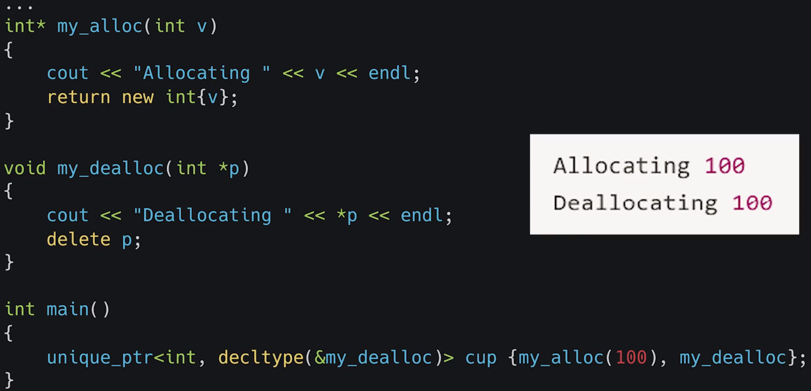

> **函数间传递unique_ptr**

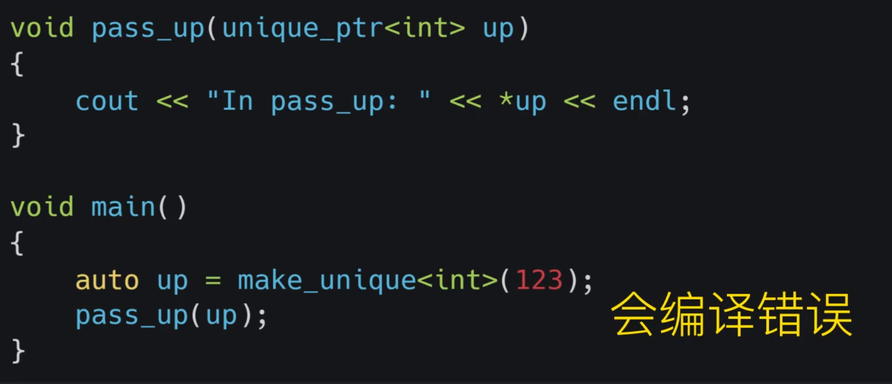

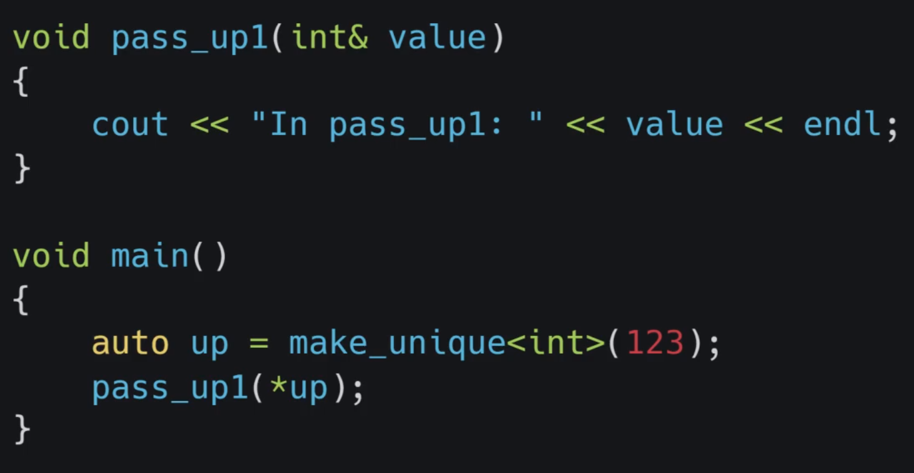

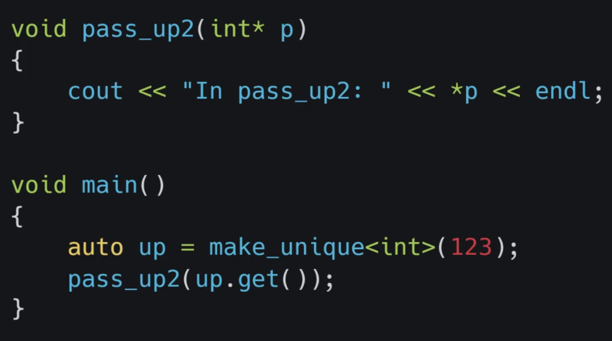

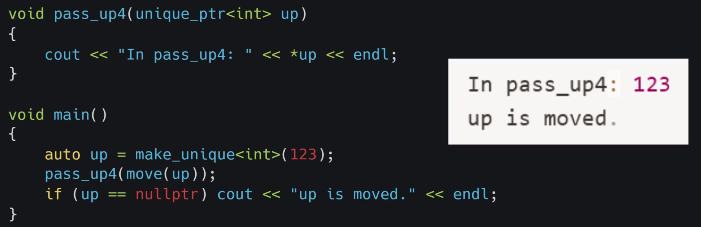

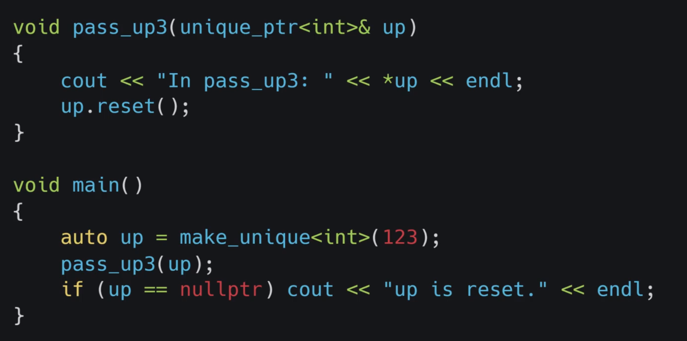

### 6.2 智能指针share_ptr（共享指针）

>  **共享指针会记录有多少个共享指针指向同一个物体。当这个记录的数字为0的时候就会自动delete释放。**

+ 定义

  + ```c++
    //第一种
    shared_ptr<int> p;
    p = make_shareed<int>(100);
    //推荐使用： shared_ptr<int> p{make_shareed<int>(100)}
    // 第二种
    shared_ptr<int> p {new  int(100)};
    ```

+ 自动管理内存的释放

  + ```C++
    int main()
    {
        shared_ptr<Ball> p = make_shared<Ball>();
        cout << p.use_count()<< endl;
        shared_ptr<Ball> p2 = p;
        cout << p.use_count() << " " << p2.use_count() <<endl;
        shared_ptr<Ball> p3 = p;
        cout << p.use_count() << " " << p2.use_count() <<p3.use_count() << endl;
        p.reset(); // 会被重置指向  delete p
        p2.reset();
        p3.reset();
    }
    ```

  + 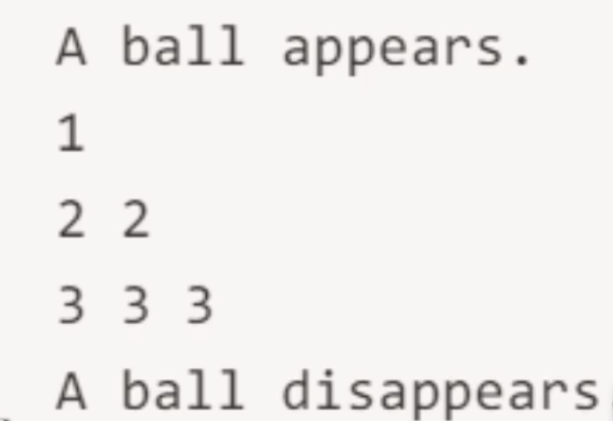

  + reset()   reset(new ball)

  + 起别名

    + ```c++
      struct Bar {int i = 123;};
      struct Foo { Bar bar;};
      int main() {
          shared_ptr<Foo> f = make_shared<Foo>();
          cout << f.use_count() << endl;// 1
          shared_ptr<Bar> b( f，&(f->bar));
          cout < f.use_coun() << endl; //2
          cout << b-> i << endl;// 123
      }
      
      ```

  + share_ptr 智能指针因为存在引用，所以会造成额外的性能开销。

### 6.3 智能指针 weak_ptr（弱指针）

>  没有资源的管理权限，对资源是非拥有式的。不能控制资源的释放，需要配合 share_ptr使用。可以检查资源是否存在。

+ share_ptr 在**环形依赖**的时候会造成内存泄漏。

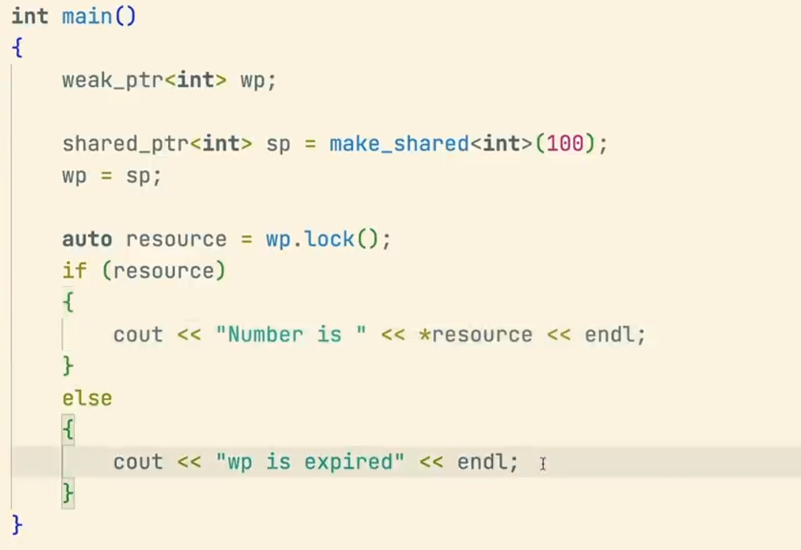

> lock() 方法会返回一个 share pointer

## C++在 vs中的常用调试方法

1. 打印数据来调试程序
   + 加入debug宏定义
2. 普通断点
3. 条件断点
4. 条件追踪
5. 单步调试
6. 添加监视

## svn版本控制管理工具
+ 核心功能： 文档版本管理系统

## C++的库有两种类型：静态库和动态库。

+ 静态库是一个包含预编译的函数和数据的二进制文件，它可以被链接到应用程序中，从而在程序运行时提供其功能。静态库的链接是在编译时期完成的，它通常是以.a或.lib文件的形式存在。

+ 动态库是一个共享库，它可以在程序运行时被加载和链接。与静态库不同，动态库的链接是在程序运行时期完成的，它允许程序在运行时动态地共享库的功能，而不必在编译时期链接所有需要的库。动态库通常是以.dll或.so文件的形式存在。

+ 在使用静态库和动态库时，需要注意以下几点：

  + 静态库和动态库都可以包含函数和数据，但是动态库还可以包含可执行代码，用于在运行时期动态地加载和链接库。
  + 静态库可以被完整地链接到应用程序中，因此它通常比动态库更大，但它在程序运行时不需要其他库的存在。
  + 动态库需要在程序运行时期动态地加载和链接，因此它通常比静态库更轻量级，但它在程序运行时需要其他库的存在。
  + 动态库可以通过在程序运行时期更新和替换来修改程序的行为，而静态库则需要重新编译和链接程序。
  + 在实际开发中，可以根据需要选择静态库或动态库来提供程序所需的功能。通常情况下，如果程序需要频繁地更新库的功能，或者需要在多个程序之间共享库的功能，则使用动态库更为合适。如果程序需要更高效地运行，或者需要更小的二进制文件大小，则使用静态库更为合适。


# C++ 多线程编程


## 1. 线程库的基本使用

### **创建线程**

要创建线程，我们需要一个可调用的函数或函数对象，作为线程的入口点。在C++11中，我们可以使用函数指针、函数对象或lambda表达式来实现。创建线程的基本语法如下：

```c++
#include <thread>
std::thread t(function_name, args...);
```

`function_name`是线程入口点的函数或可调用对象

`args...`是传递给函数的参数

创建线程后，我们可以使用`t.join()`等待线程完成，或者使用`t.detach()`分离线程，让它在后台运行。

例如，下面的代码创建了一个线程，输出一条消息：

```c++
#include <iostream>
#include <thread>
void print_message() {    
    std::cout << "Hello, world!" << std::endl;
}
int main() {    
    std::thread t(print_message);    
    t.join();    
    return 0;
}
```

在这个例子中，我们定义了一个名为`print_message`的函数，它输出一条消息。然后，我们创建了一个名为`t`的线程，将`print_message`函数作为入口点。最后，我们使用`t.join()`等待线程完成。

### **传递参数**

我们可以使用多种方式向线程传递参数，例如使用函数参数、全局变量、引用等。如：

```c++
#include <iostream>
#include <thread>
void print_message(const std::string& message) {
	std::cout << message << std::endl;
}
void increment(int& x) {    
    ++x;
}
int main() {    
    std::string message = "Hello, world!";    
    std::thread t(print_message, message);    
    t.join();    
    int x = 0;    
    std::thread t2(increment, std::ref(x));    
    t2.join();    
    std::cout << x << std::endl;    
    return 0;
}
```

在第一个例子中，我们使用了一个字符串作为函数参数，传递给线程。在第二个例子中，我们使用了一个引用来传递一个整数变量。需要注意的是，当我们使用引用传递参数时，我们需要使用`std::ref`来包装引用，否则编译器会报错。

### **等待线程完成**

当我们创建一个线程后，我们可能需要等待它完成，以便获取线程的执行结果或执行清理操作。我们可以使用`t.join()`方法来等待线程完成。例如，下面的代码创建了两个线程，等待它们完成后输出一条消息：

```c++
#include <iostream>
#include <thread>
void print_message(const std::string& message) {    
    std::cout << message << std::endl;
}
int main() {    
    std::thread t1(print_message, "Thread 1");    
    std::thread t2(print_message, "Thread 2");    
    t1.join();    
    t2.join();    
    std::cout << "All threads joined" << std::endl;    
    return 0;
}
```

在这个例子中，我们创建了两个线程`t1`和`t2`，它们都调用`print_message`函数输出一条消息。然后，我们使用`t1.join()`和`t2.join()`等待它们完成。最后，我们输出一条消息，表示所有线程都已经完成。

### **分离线程**

有时候我们可能不需要等待线程完成，而是希望它在后台运行。这时候我们可以使用`t.detach()`方法来分离线程。例如，下面的代码创建了一个线程，分离它后输出一条消息：

```c++
#include <iostream>
#include <thread>
void print_message(const std::string& message) {    
    std::cout << message << std::endl;
}
int main() {    
    std::thread t(print_message, "Thread 1");    
    t.detach();    
    std::cout << "Thread detached" << std::endl;    
    return 0;
}
```

在这个例子中，我们创建了一个名为`t`的线程，调用`print_message`函数输出一条消息。然后，我们使用`t.detach()`方法分离线程，让它在后台运行。最后，我们输出一条消息，表示线程已经被分离。

需要注意的是，一旦线程被分离，就不能再使用`t.join()`方法等待它完成。而且，我们需要确保线程不会在主线程结束前退出，否则可能会导致未定义行为。

### **joinable()**

joinable()方法返回一个布尔值，如果线程可以被join()或detach()，则返回true，否则返回false。如果我们试图对一个不可加入的线程调用join()或detach()，则会抛出一个std::system_error异常。

下面是一个使用joinable()方法的例子：

```c++
#include <iostream>
#include <thread>
void foo() {
    std::cout << "Thread started" << std::endl;
}
int main() {
    std::thread t(foo);
    if (t.joinable()) {
        t.join();
    }
    std::cout << "Thread joined" << std::endl;
    return 0;
}
```

**常见错误（将在后续文章中详解以下错误的****解决方案）**

在使用C++11线程库时，有一些常见的错误需要注意。例如：

+  忘记等待线程完成或分离线程：如果我们创建了一个线程，但没有等待它完成或分离它，那么在主线程结束时，可能会导致未定义行为。

+ 访问共享数据时没有同步：如果我们在多个线程中访问共享数据，但没有使用同步机制，那么可能会导致数据竞争、死锁等问题。

+  异常传递问题：如果在线程中发生了异常，但没有处理它，那么可能会导致程序崩溃。因此，我们应该在线程中使用try-catch块来捕获异常，并在适当的地方处理它。

```C++
#include<iostream>
#include<thread>
#include<string>

using namespace std;

void printHello(string msg)
{
	cout << msg;
}

int main()
{
	// 1. 创建线程
	thread thread1(printHello,"hello thread");

	// 因为主程序在执行的时候，是不会等待线程执行完毕，再去执行剩下的主程序，所以没有join()会报错
	// 主程序等待线程执行完毕 join() join函数值阻塞的
	//thread1.join();

	// 分离线程 detach()   (分离主线程和子线程)(子线程在后台继续运行)
	//thread1.detach();

	// 判断这个线程能否调用 join() 或者 detach() 返回一个bool值
	bool isJon  = thread1.joinable();
	if (isJon)
	{
		thread1.join();
	}
	return 0;
}
```

## 2. 线程函数中的数据未定义的错误

### 1. 传递临时变量的问题：

```c++
#include <iostream>
#include <thread>
void foo(int& x) {
    x += 1;
}
int main() {
    std::thread t(foo, 1); // 传递临时变量
    t.join();
    return 0;
}
```

+ 在这个例子中，我们定义了一个名为`foo`的函数，它接受一个整数引用作为参数，并将该引用加1。然后，我们创建了一个名为`t`的线程，将`foo`函数以及一个临时变量`1`作为参数传递给它。这样会导致在线程函数执行时，临时变量`1`被销毁，从而导致未定义行为。

+ 解决方案是将变量复制到一个持久的对象中，然后将该对象传递给线程。例如，我们可以将`1`复制到一个`int`类型的变量中，然后将该变量的引用传递给线程。

```c++
#include <iostream>
#include <thread>
void foo(int& x) {
    x += 1;
}
int main() {
    int x = 1; // 将变量复制到一个持久的对象中
    std::thread t(foo, std::ref(x)); // 将变量的引用传递给线程
    t.join();
    return 0;
}
```

### 2. 传递指针或引用指向局部变量的问题：

```c++
#include <iostream>
#include <thread>
void foo(int* ptr) {
    std::cout << *ptr << std::endl; // 访问已经被销毁的指针
}
int main() {
    int x = 1;
    std::thread t(foo, &x); // 传递指向局部变量的指针
    t.join();
    return 0;
}
```

+ 在这个例子中，我们定义了一个名为`foo`的函数，它接受一个整型指针作为参数，并输出该指针所指向的整数值。然后，我们创建了一个名为`t`的线程，将`foo`函数以及指向局部变量`x`的指针作为参数传递给它。这样会导致在线程函数执行时，指向局部变量`x`的指针已经被销毁，从而导致未定义行为。

+ 解决方案是将指针或引用指向堆上的变量，或使用`std::shared_ptr`等智能指针来管理对象的生命周期。例如，我们可以使用`new`运算符在堆上分配一个整数变量，并将指针指向该变量。

```c++
#include <iostream>
#include <thread>
void foo(int* ptr) {
    std::cout << *ptr << std::endl;
    delete ptr; // 在使用完指针后，需要手动释放内存
}
int main() {
    int* ptr = new int(1); // 在堆上分配一个整数变量
    std::thread t(foo, ptr); // 将指针传递给线程
    t.join();
    return 0;
}
```

### 3. 传递指针或引用指向已释放的内存的问题：

```c++
#include <iostream>
#include <thread>
void foo(int& x) {
    std::cout << x << std::endl; // 访问已经被释放的内存
}
int main() {
    int* ptr = new int(1);
    std::thread t(foo, *ptr); // 传递已经释放的内存
    delete ptr;
    t.join();
    return 0;
}
```

+ 在这个例子中，我们定义了一个名为`foo`的函数，它接受一个整数引用作为参数，并输出该引用的值。然后，我们创建了一个名为`t`的线程，将`foo`函数以及一个已经被释放的指针所指向的整数值作为参数传递给它解决方案是确保在线程函数执行期间，被传递的对象的生命周期是有效的。例如，在主线程中创建并初始化对象，然后将对象的引用传递给线程。

```c++
#include <iostream>
#include <thread>
void foo(int& x) {
    std::cout << x << std::endl;
}
int main() {
    int x = 1;
    std::thread t(foo, std::ref(x)); // 将变量的引用传递给线程
    t.join();
    return 0;
}
```

+ 在这个例子中，我们创建了一个名为`x`的整数变量，并初始化为`1`。然后，我们创建了一个名为`t`的线程，将`foo`函数以及变量`x`的引用作为参数传递给它。这样可以确保在线程函数执行期间，变量`x`的生命周期是有效的。


### 4. 类成员函数作为入口函数，类对象被提前释放

错误示例：

```c++
#include <iostream>
#include <thread>

class MyClass {
public:
    void func() {
        std::cout << "Thread " << std::this_thread::get_id() 
        << " started" << std::endl;
        // do some work
        std::cout << "Thread " << std::this_thread::get_id() 
        << " finished" << std::endl;
    }
};

int main() {
    MyClass obj;
    std::thread t(&MyClass::func, &obj);
    // obj 被提前销毁了，会导致未定义的行为
    return 0;
}
```

+ 上面的代码中，在创建线程之后，obj 对象立即被销毁了，这会导致在线程执行时无法访问 obj 对象，可能会导致程序崩溃或者产生未定义的行为。

+ 为了避免这个问题，可以使用 std::shared_ptr 来管理类对象的生命周期，确保在线程执行期间对象不会被销毁。具体来说，可以在创建线程之前，将类对象的指针封装在一个 std::shared_ptr 对象中，并将其作为参数传递给线程。这样，在线程执行期间，即使类对象的所有者释放了其所有权，std::shared_ptr 仍然会保持对象的生命周期，直到线程结束。

+ 以下是使用 std::shared_ptr 修复上面错误的示例：

```c++
#include <iostream>
#include <thread>
#include <memory>

class MyClass {
public:
    void func() {
        std::cout << "Thread " << std::this_thread::get_id() 
        << " started" << std::endl;
        // do some work
        std::cout << "Thread " << std::this_thread::get_id() 
        << " finished" << std::endl;
    }
};

int main() {
    std::shared_ptr<MyClass> obj = std::make_shared<MyClass>();
    std::thread t(&MyClass::func, obj);
    t.join();
    return 0;
}
```

+ 上面的代码中，使用 std::make_shared 创建了一个 MyClass 类对象，并将其封装在一个 std::shared_ptr 对象中。然后，将 std::shared_ptr 对象作为参数传递给线程。这样，在线程执行期间，即使 obj 对象的所有者释放了其所有权，std::shared_ptr 仍然会保持对象的生命周期，直到线程结束。

### 5.入口函数为类的私有成员函数

```c++
#include <iostream>
#include <thread>

class MyClass {
private:
friend void myThreadFunc(MyClass* obj);
void privateFunc(){
std::cout << "Thread " 
<< std::this_thread::get_id() << " privateFunc" << std::endl;
}
};

void myThreadFunc(MyClass* obj) {
obj->privateFunc();
}

int main() {
MyClass obj;
std::thread thread_1(myThreadFunc, &obj);
thread_1.join();
return 0;
}
```

+ 上面的代码中，将 `myThreadFunc` 定义为 `MyClass` 类的友元函数，并在函数中调用 `privateFunc` 函数。在创建线程时，需要将类对象的指针作为参数传递给线程。

## 3. 互斥量解决多线程数据共享问题

### 数据共享问题分析

>  在多个线程中共享数据时，需要注意线程安全问题。如果多个线程同时访问同一个变量，并且其中至少有一个线程对该变量进行了写操作，那么就会出现**数据竞争问题**。数据竞争可能会导致程序崩溃、产生未定义的结果，或者得到错误的结果。

+ 为了避免数据竞争问题，需要使用同步机制来确保多个线程之间对共享数据的访问是安全的。常见的**同步机制包括互斥量、条件变量、原子操作**等。

+ 以下是一个简单的数据共享问题的示例代码

```c++
#include <iostream>
#include <thread>
int shared_data = 0;
void func() {
    for (int i = 0; i < 100000; ++i) {
        shared_data++;
    }
}
int main() {
    std::thread t1(func);
    std::thread t2(func);
    t1.join();
    t2.join();
    std::cout << "shared_data = " << shared_data << std::endl;    
    return 0;
}
```

+ 上面的代码中，定义了一个名为 `shared_data` 的全局变量，并在两个线程中对其进行累加操作。在 `main` 函数中，创建了两个线程，并分别调用了 `func` 函数。在 `func` 函数中，对 `shared_data` 变量进行了累加操作。

+ 由于 `shared_data` 变量是全局变量，因此在两个线程中共享。对于这种共享的情况，需要使用互斥量等同步机制来确保多个线程之间对共享数据的访问是安全的。如果不使用同步机制，就会出现数据竞争问题，导致得到错误的结果。

***如果多线程程序每一次的运行结果和单线程运行的结果始终是一样的，那么你的线程就是安全的***

### 互斥量概念

+ 互斥量（`mutex`）是一种用于实现多线程同步的机制，用于确保多个线程之间对共享资源的访问互斥。互斥量通常用于保护共享数据的访问，以避免多个线程同时访问同一个变量或者数据结构而导致的数据竞争问题。

+ 互斥量提供了两个基本操作：`lock()` 和 `unlock()`。当一个线程调用 `lock()` 函数时，如果互斥量当前没有被其他线程占用，则该线程获得该互斥量的所有权，可以对共享资源进行访问。如果互斥量当前已经被其他线程占用，则调用 `lock()` 函数的线程会被阻塞，直到该互斥量被释放为止。

+ 上面的代码中，使用互斥量 `mtx` 来确保多个线程对 `shared_data` 变量的访问是安全的。在 `func` 函数中，先调用 `mtx.lock()` 来获取互斥量的所有权，然后对 `shared_data` 变量进行累加操作，最后再调用 `mtx.unlock()` 来释放互斥量的所有权。这样就可以确保多个线程之间对 `shared_data` 变量的访问是安全的。

### 案例代码

+ 以下是一个综合了创建多个线程和数据共享问题解决方案的示例代码：

```c++
#include <iostream>
#include <thread>
#include <mutex>
int shared_data = 0;
std::mutex mtx;
void func(int n) {
    for (int i = 0; i < 100000; ++i) {
        mtx.lock();
        shared_data++;        
        std::cout << "Thread " << n 
        << " increment shared_data to " << shared_data << std::endl;
        mtx.unlock();
    }
}
int main() {
    std::thread t1(func, 1);
    std::thread t2(func, 2);

    t1.join();
    t2.join();    
    std::cout << "Final shared_data = " << shared_data << std::endl;    
    return 0;
}
```

+ 上面的代码中，定义了一个名为 `shared_data` 的全局变量，并使用互斥量 `mtx` 来确保多个线程对其进行访问时的线程安全。在两个线程中，分别调用了 `func` 函数，并传递了不同的参数。在 `func` 函数中，先获取互斥量的所有权，然后对 `shared_data` 变量进行累加操作，并输出变量的当前值。最后再释放互斥量的所有权。

## 4. 互斥量死锁

+ 假设有两个线程 T1 和 T2，它们需要对两个互斥量 mtx1 和 mtx2 进行访问，而且需要按照以下顺序获取互斥量的所有权：

> T1 先获取 mtx1 的所有权，再获取 mtx2 的所有权。

>  T2 先获取 mtx2 的所有权，再获取 mtx1 的所有权。

+ 如果两个线程同时执行，就会出现死锁问题。因为 T1 获取了 mtx1 的所有权，但是无法获取 mtx2 的所有权，而 T2 获取了 mtx2 的所有权，但是无法获取 mtx1 的所有权，两个线程互相等待对方释放互斥量，导致死锁。

+ 为了解决这个问题，可以让两个线程按照相同的顺序获取互斥量的所有权。例如，都先获取 mtx1 的所有权，再获取 mtx2 的所有权，或者都先获取 mtx2 的所有权，再获取 mtx1 的所有权。这样就可以避免死锁问题。

以下是按照第二种方案修改后的代码：

```c++
#include <iostream>
#include <thread>
#include <mutex>
std::mutex mtx1, mtx2;
void func1() {    
    mtx2.lock();    
    std::cout << "Thread 1 locked mutex 2" << std::endl;    
    mtx1.lock();    
    std::cout << "Thread 1 locked mutex 1" << std::endl;    
    mtx1.unlock();    
    std::cout << "Thread 1 unlocked mutex 1" << std::endl;    
    mtx2.unlock();    
    std::cout << "Thread 1 unlocked mutex 2" << std::endl;
}
void func2() {    
    mtx2.lock();    
    std::cout << "Thread 2 locked mutex 2" << std::endl;    
    mtx1.lock();    
    std::cout << "Thread 2 locked mutex 1" << std::endl;    
    mtx1.unlock();    
    std::cout << "Thread 2 unlocked mutex 1" << std::endl;    
    mtx2.unlock();    
    std::cout << "Thread 2 unlocked mutex 2" << std::endl;
}
int main() {    
    std::thread t1(func1);    
    std::thread t2(func2);    
    t1.join();    
    t2.join();    
    return 0;
}
```

> 在上面的代码中，T1 先获取 mtx2 的所有权，再获取 mtx1 的所有权，而 T2 也是先获取 mtx2 的所有权，再获取 mtx1 的所有权，这样就避免了死锁问题。

## 5.lock_guard 与 std::unique_lock

### **`lock_guard`**

`std::lock_guard` 是 C++ 标准库中的一种互斥量封装类，用于保护共享数据，防止多个线程同时访问同一资源而导致的数据竞争问题。

`std::lock_guard` 的特点如下：

- 当构造函数被调用时，该互斥量会被自动锁定。
- 当析构函数被调用时，该互斥量会被自动解锁。
- `std::lock_guard` 对象不能复制或移动，因此它只能在局部作用域中使用。

### **std::unique_lock**

`std::unique_lock` 是 C++ 标准库中提供的一个互斥量封装类，用于在多线程程序中对互斥量进行加锁和解锁操作。**它的主要特点是可以对互斥量进行更加灵活的管理，包括延迟加锁、条件变量、超时等。**

`std::unique_lock` 提供了以下几个成员函数：

- `lock()`：尝试对互斥量进行加锁操作，如果当前互斥量已经被其他线程持有，则当前线程会被阻塞，直到互斥量被成功加锁。
- `try_lock()`：尝试对互斥量进行加锁操作，如果当前互斥量已经被其他线程持有，则函数立即返回 `false`，否则返回 `true`。
- `try_lock_for(const std::chrono::duration<Rep, Period>& rel_time)`：**尝试对互斥量进行加锁操作，如果当前互斥量已经被其他线程持有，则当前线程会被阻塞，直到互斥量被成功加锁，或者超过了指定的时间。**
- `try_lock_until(const std::chrono::time_point<Clock, Duration>& abs_time)`：尝试对互斥量进行加锁操作，如果当前互斥量已经被其他线程持有，则当前线程会被阻塞，直到互斥量被成功加锁，或者超过了指定的时间点。
- `unlock()`：对互斥量进行解锁操作。

除了上述成员函数外，`std::unique_lock` 还提供了以下几个构造函数：

- `unique_lock() noexcept = default`：默认构造函数，创建一个未关联任何互斥量的 `std::unique_lock` 对象。
- `explicit unique_lock(mutex_type& m)`：构造函数，使用给定的互斥量 `m` 进行初始化，并对该互斥量进行加锁操作。
- `unique_lock(mutex_type& m, defer_lock_t) noexcept`：构造函数，使用给定的互斥量 `m` 进行初始化，但不对该互斥量进行加锁操作。
- `unique_lock(mutex_type& m, try_to_lock_t) noexcept`：构造函数，使用给定的互斥量 `m` 进行初始化，并尝试对该互斥量进行加锁操作。如果加锁失败，则创建的 `std::unique_lock` 对象不与任何互斥量关联。
- `unique_lock(mutex_type& m, adopt_lock_t) noexcept`：构造函数，使用给定的互斥量 `m` 进行初始化，并假设该互斥量已经被当前线程成功加锁。

`std::unique_lock` 使用非常灵活方便，上述操作的使用方式将会在课程视频中作详细介绍。

```C++
#include <iostream>
#include <thread>
#include <mutex>
int shared_data = 0;
//std::mutex mtx;
std::timed_mutex mtx;
void func(int n) {
    for (int i = 0; i < 2; ++i) {
        //std::lock_guard < std::mutex > lg(mtx);
        std::unique_lock < std::timed_mutex > lg(mtx, std:: defer_lock);
        if (lg.try_lock_for(std::chrono::seconds(2))) {
            std::this_thread::sleep_for(std::chrono::seconds(1));
            shared_data++;
        }
        
    }
}
int main() {
    std::thread t1(func, 1);
    std::thread t2(func, 2);

    t1.join();
    t2.join();
    std::cout << "Final shared_data = " << shared_data << std::endl;
    return 0;
}
```

## 6.std::call_once与其使用场景

> 单例设计模式是一种常见的设计模式，用于确保某个类只能创建一个实例。由于单例实例是全局唯一的，因此在多线程环境中使用单例模式时，需要考虑线程安全的问题。

***call_once 只能在线程函数中使用***

下面是一个简单的单例模式的实现：

```c++
class Singleton {
public:
    static Singleton& getInstance() {
         static Singleton instance;
         return instance;
    }    
    void setData(int data) {
         m_data = data;
    }    
    int getData() const {
         return m_data;
    }private:
    Singleton() {}
    Singleton(const Singleton&) = delete;
    Singleton& operator=(const Singleton&) = delete;    
    int m_data = 0;
};
```

+ 在这个单例类中，我们使用了一个静态成员函数 `getInstance()` 来获取单例实例，该函数使用了一个静态局部变量 `instance` 来存储单例实例。由于静态局部变量只会被初始化一次，因此该实现可以确保单例实例只会被创建一次。

>  但是，该实现并不是线程安全的。如果多个线程同时调用 `getInstance()` 函数，可能会导致多个对象被创建，从而违反了单例模式的要求。此外，如果多个线程同时调用 `setData()` 函数来修改单例对象的数据成员 `m_data`，可能会导致数据不一致或不正确的结果。

+ 为了解决这些问题，我们可以使用 `std::call_once` 来实现一次性初始化，从而确保单例实例只会被创建一次。下面是一个使用 `std::call_once` 的单例实现：

```c++
class Singleton {
public:
    static Singleton& getInstance() {
            std::call_once(m_onceFlag, &Singleton::init);
            return *m_instance;
    }    
    void setData(int data) {
        m_data = data;
    }    
    int getData() const {        
    return m_data;
    }
private:
    Singleton() {}
    Singleton(const Singleton&) = delete;
    Singleton& operator=(const Singleton&) = delete;    
    static void init() {
        m_instance.reset(new Singleton);
    }    
    static std::unique_ptr<Singleton> m_instance;    
    static std::once_flag m_onceFlag;    
    int m_data = 0;
};
std::unique_ptr<Singleton> Singleton::m_instance;
std::once_flag Singleton::m_onceFlag;
```

+ 在这个实现中，我们使用了一个静态成员变量 `m_instance` 来存储单例实例，使用了一个静态成员变量 `m_onceFlag` 来标记初始化是否已经完成。在 `getInstance()` 函数中，我们使用 `std::call_once` 来调用 `init()` 函数，确保单例实例只会被创建一次。在 `init()` 函数中，我们使用了 `std::unique_ptr` 来创建单例实例。

+ 使用 `std::call_once` 可以确保单例实例只会被创建一次，从而避免了多个对象被创建的问题。此外，使用 `std::unique_ptr` 可以确保单例实例被正确地释放，避免了内存泄漏的问题。

+ `std::call_once` 是 C++11 标准库中的一个函数，用于确保某个函数只会被调用一次。其函数原型如下

```c++
template<class Callable, class... Args>

void call_once(std::once_flag& flag, Callable&& func, Args&&... args);
```

>  其中，`flag` 是一个 `std::once_flag` 类型的对象，用于标记函数是否已经被调用；`func` 是需要被调用的函数或可调用对象；`args` 是函数或可调用对象的参数。

+ `std::call_once` 的作用是，确保在多个线程中同时调用 `call_once` 时，只有一个线程能够成功执行 `func` 函数，而其他线程则会等待该函数执行完成。

+ 使用 `std::call_once` 的过程中，需要注意以下几点：

1. `flag` 参数必须是一个 `std::once_flag` 类型的对象，并且在多次调用 `call_once` 函数时需要使用同一个 `flag` 对象。

2. `func` 参数是需要被调用的函数或可调用对象。该函数只会被调用一次，因此应该确保该函数是幂等的。

3. `args` 参数是 `func` 函数或可调用对象的参数。如果 `func` 函数没有参数，则该参数可以省略。

4. `std::call_once` 函数会抛出 `std::system_error` 异常，如果在调用 `func` 函数时发生了异常，则该异常会被传递给调用者。

>  使用 `std::call_once` 可以在多线程环境中实现一次性初始化，避免了多个线程同时初始化的问题。例如，在单例模式中，可以使用 `std::call_once` 来保证单例实例只会被创建一次。

```C++
#include <iostream>
#include <thread>
#include <mutex>
#include<string>

using namespace std;

class Log {
public:
    Log() { };
    Log(const Log& log) = delete;
    Log& operator=(const Log& log) = delete;

    static Log& GetInstance() {
        //static Log log; // 懒汉模式
        //return log;

        // 饿汉模式  提前不声明对象，需要的时候在new
        static Log* log = nullptr;
        if (!log) log = new Log;
        return *log;
    }
    void PrintfLog(string msg)
    {
        cout << __TIME__ << "\t" << msg << endl;
    }
};

int main() {
    Log::GetInstance().PrintfLog("error");
    return 0;
}
```

call_once

```C++
#include <iostream>
#include <thread>
#include <mutex>
#include<string>

using namespace std;
static once_flag once;
static Log* log = nullptr;
class Log {
public:
    Log() { };
    Log(const Log& log) = delete;
    Log& operator=(const Log& log) = delete;
    static Log& GetInstance() {
        //static Log log; // 懒汉模式
        //return log;

        // 饿汉模式  提前不声明对象，需要的时候在new
        if (!log) log = new Log;
        call_once(once, init);
        return *log;
    }

    static void init() {
        if (!log) log = new Log;
    }
    void PrintfLog(string msg)
    {
        cout << __TIME__ << "\t" << msg << endl;
    }
};
void print_error() {
    Log::GetInstance().PrintfLog("error");
}
int main() {
    //因为t1和t2是并行的状态，会new两次log——解决方法：call_once
    thread t1(print_error);
    thread t2(print_error);
    t1.join();
    t2.join();
    return 0;
}
```

## 7.condition_variable 与其使用场景

`std::condition_variable` 的步骤如下：

1. 创建一个 `std::condition_variable` 对象。

2. 创建一个互斥锁 `std::mutex` 对象，用来保护共享资源的访问。

3. 在需要等待条件变量的地方

   使用 `std::unique_lock<std::mutex>` 对象锁定互斥锁

   并调用 `std::condition_variable::wait()`、`std::condition_variable::wait_for()` 或 `std::condition_variable::wait_until()` 函数等待条件变量。

4. 在其他线程中需要通知等待的线程时，调用 `std::condition_variable::notify_one()` 或 `std::condition_variable::notify_all()` 函数通知等待的线程。

### **生产者与消费者模型**

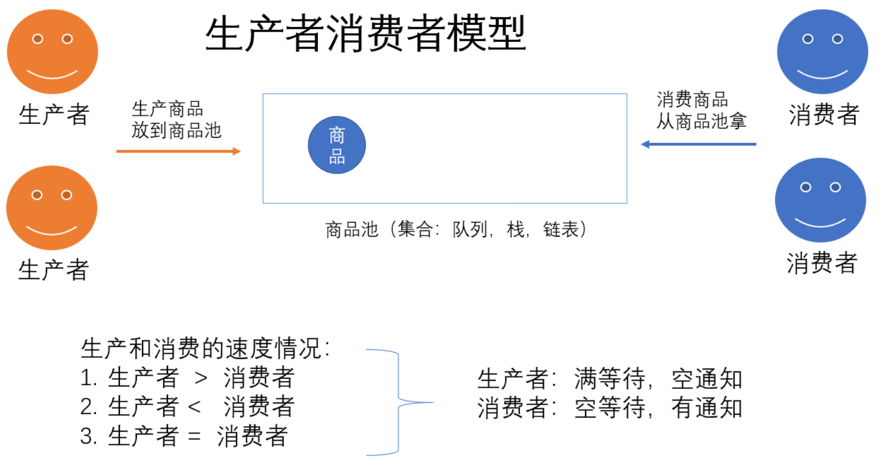

+ 下面是一个简单的生产者-消费者模型的案例，其中使用了 `std::condition_variable` 来实现线程的等待和通知机制：

```c++
#include <iostream>
#include <thread>
#include <mutex>
#include<string>
#include<condition_variable>
#include<queue>

using namespace std;

queue<int> g_queue;
condition_variable g_cv;
mutex mtx;
void Producer() {
	for (int i = 0; i < 10; i++){
		{
			unique_lock<mutex> lock(mtx);
			g_queue.push(i);
			// 通知消费者来取任务
			g_cv.notify_one();
			cout << "Producer: " << i << endl;
		}
		this_thread::sleep_for(chrono::microseconds(100));
	}
}

void Consumer() {
	while (1)
	{
		unique_lock<mutex> lock(mtx);
		// 如果队列为空  就要等待
		g_cv.wait(lock, []() {return !g_queue.empty(); });
		int value = g_queue.front();
		g_queue.pop();
		cout << "Consumer: " << value << endl;
	}
}

int main()
{
	thread producer_thread(Producer);
	thread consumer_thread(Consumer);
	producer_thread.join();
	consumer_thread.join();
	return 0;
}
```

> 使用 `std::condition_variable` 可以实现线程的等待和通知机制，从而在多线程环境中实现同步操作。在生产者-消费者模型中，使用 `std::condition_variable` 可以让消费者线程等待生产者线程生产数据后再进行消费，避免了数据丢失或者数据不一致的问题。

## 8. C++11 跨平台线程池

### **跨平台线程池实现**

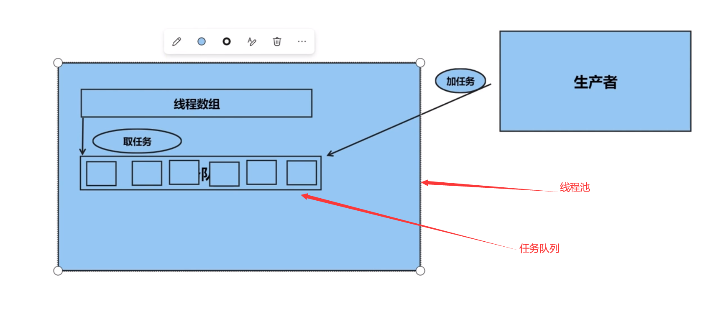

>  它使用 C++11 标准库中的 std::thread、std::mutex、std::condition_variable、std::function 和 std::queue 等组件实现。

```c++
#include <iostream>
#include <thread>
#include <mutex>
#include<string>
#include<condition_variable>
#include<queue>
#include<vector>
#include<functional>

using namespace std;

class ThreadPool
{
public:
	ThreadPool(int numThreads) :stop(false) {
		for (int i = 0; i < numThreads; i++)
		{
			threads.emplace_back([this] {
				while (true)
				{
					unique_lock<mutex> lock(mtx);
					condition.wait(lock, [this] {
						return !tasks.empty() || stop;
						});
					if (stop && tasks.empty()) {
						return;
					}
					// move移动语义
					function<void()> task(move(tasks.front())); // queue最左边的值
					tasks.pop();
					lock.unlock();
					task();
				}
				});
		}
	}
	~ThreadPool() {
		{
			unique_lock<mutex> lock(mtx);
			stop = true;
		}
		condition.notify_all();
		for (auto& t : threads) {
			t.join();
		}
	}
	template<class F,class... Args>
	// && 右值引用  &左值引用
	// 在函数模板加 && 是万能引用
	void enqueue(F &&f,Args&&... args) {
		// bind函数适配器(函数和参数绑定到一起)
		// forward 完美转发
		function<void()>task = bind(forward<F>(f), forward<Args>(args)...);
		{
			unique_lock<mutex> local(mtx);
			tasks.emplace(move(task));
		}
		condition.notify_one();
	}
private: 
	vector<thread> threads;
	queue<function<void()>> tasks;

	mutex mtx;
	condition_variable condition;

	bool stop;
};

int main()
{
	ThreadPool pool(4);
	for (int i = 0; i < 10; i++)
	{
		pool.enqueue([i] {
			cout << "task: " << i << " is running" << endl;
			this_thread::sleep_for(chrono::seconds(1));
			cout << "task: " << i << " is done" << endl;
			});
	}
	return 0;
}
```

+ 在这个示例中，我们同样定义了一个 ThreadPool 类，并且在构造函数中创建了指定数目的线程。在每个线程中，我们不断地从任务队列中获取任务并执行，直到线程池被停止。在 enqueue() 函数中，我们将任务封装成一个 std::function 对象，并将它添加到任务队列中。在 ThreadPool 的析构函数中，我们等待所有线程执行完成后再停止所有线程。

>  在主函数中，我们创建了一个 ThreadPool 对象，并向任务队列中添加了 8 个任务。每个任务会输出一些信息，并且在执行完后等待 1 秒钟。由于线程池中有 4 个线程，因此这 8 个任务会被分配到不同的线程中执行。在任务执行完成后，程序会退出。

## 9.异步并发—— async future packaged_task promise

**1. async 、 future**

>  是C++11引入的一个函数模板，用于异步执行一个函数，并返回一个std::future对象，表示异步操作的结果。使用std::async可以方便地进行异步编程，避免了手动创建线程和管理线程的麻烦。下面是一个使用std::async的案例：

```
#include <iostream>
#include <future>
int calculate() {
    // 模拟一个耗时的计算
    std::this_thread::sleep_for(std::chrono::seconds(1));
    return 42;
}
int main() {
    std::future<int> future_result 
    = std::async(std::launch::async, calculate);
    // 在这里可以做其他的事情
    int result = future_result.get(); // 获取异步操作的结果
    std::cout << result << std::endl; // 输出42
    return 0;
}
```


+ 这个例子中，我们使用std::async函数异步执行了一个耗时的计算，这个计算可以在另一个线程中执行，不会阻塞主线程。同时，我们也避免了手动创建线程和管理线程的麻烦。

**2. packaged_task**

+ 在C++中，packaged_task是一个类模板，用于将一个可调用对象（如函数、函数对象或Lambda表达式）封装成一个异步操作，并返回一个std::future对象，表示异步操作的结果。packaged_task可以方便地将一个函数或可调用对象转换成一个异步操作，供其他线程使用。

+ 以下是packaged_task的基本用法：

1. 定义可调用对象

```
int calculate(int x, int y) {
    return x + y;
}
```

> 这里定义了一个函数calculate，用于将两个整数相加。

2. 创建packaged_task对象

```
std::packaged_task<int(int, int)> task(calculate);
std::future<int> future_result = task.get_future();
```

>  这里创建了一个packaged_task对象，将函数calculate封装成异步操作，并返回一个std::future对象，表示异步操作的结果。

3. 在其他线程中执行异步操作

```
std::thread t(std::move(task), 1, 2);
t.join();
```

> 这里创建了一个新的线程，并在这个线程中执行异步操作。由于packaged_task对象是可移动的，因此需要使用std::move()函数将task对象转移至新线程中执行。

4. 获取异步操作的结果

```
int result = future_result.get();
std::cout << result << std::endl; // 输出3
```

+ 在主线程中，我们可以使用future_result.get()方法获取异步操作的结果，并输出到控制台。

  > 在这个例子中，我们成功地将一个函数calculate封装成了一个异步操作，并在其他线程中执行。通过packaged_task和future对象，我们可以方便地实现异步编程，使得代码更加简洁和易于维护。

**3. promise**

+ 在C++中，promise是一个类模板，用于在一个线程中产生一个值，并在另一个线程中获取这个值。promise通常与future和async一起使用，用于实现异步编程。

+ 以下是promise的基本用法：

1. 创建promise对象

```
std::promise<int> p;
```

>  这里创建了一个promise对象，用于产生一个整数值。

2. 获取future对象

```
std::future<int> f = p.get_future();
```

> 通过promise对象的get_future()方法，可以获取与之关联的future对象，用于在另一个线程中获取promise对象产生的值。

3. 在其他线程中设置值

```
std::thread t([&p]() {
    p.set_value(42);
});
t.join();
```

> 这里创建了一个新的线程，并在这个线程中，使用promise对象的set_value()方法设置一个整数值42。

4. 在主线程中获取值

```
int result = f.get();
std::cout << result << std::endl; // 输出42
```

+ 在主线程中，我们可以使用future对象的get()方法获取promise对象产生的值，并输出到控制台。

> 在这个例子中，我们成功地使用promise和future对象实现了跨线程的值传递。通过promise和future对象，我们可以方便地实现异步编程，避免了手动创建线程和管理线程的麻烦。

```c++
#include<iostream>
#include<future>
using namespace std;

void func(promise<int>& f) {
	f.set_value(1000);
}

int main() {
	//future<int> future_res = async(launch::async, func);// 相当于会[自动开启]一个现成进行运行这个函数

	//packaged_task<int()>  task(func);
	//auto future_res = task.get_future();
	//// 手动开辟线程
	//// move左值转换成右值
	//// 因为packaged_task是一个可移动对象
	//thread t1(move(task));

	//cout << func() << endl;// 在主线程中运行

	//t1.join();
	//cout << future_res.get() << endl;

	promise<int> f;
	auto future_res = f.get_future();

	thread t1(func, ref(f));
	t1.join();
	cout << future_res.get() << endl;

	return 0;
}
```

## 10. std::atomic 原子操作

+ `std::atomic` 是 C++11 标准库中的一个模板类，用于实现多线程环境下的原子操作。它提供了一种线程安全的方式来访问和修改共享变量，可以避免多线程环境中的数据竞争问题。

+ `std::atomic` 的使用方式类似于普通的 C++ 变量，但是它的操作是原子性的。也就是说，在多线程环境下，多个线程同时对同一个 `std::atomic` 变量进行操作时，不会出现数据竞争问题。

+ 以下是一些常用的 `std::atomic` 操作：

  1. `load()`：将 `std::atomic` 变量的值加载到当前线程的本地缓存中，并返回这个值。

  2. `store(val)`：将 `val` 的值存储到 `std::atomic` 变量中，并保证这个操作是原子性的。

  3. `exchange(val)`：将 `val` 的值存储到 `std::atomic` 变量中，并返回原先的值。

  4. `compare_exchange_weak(expected, val)` 和 `compare_exchange_strong(expected, val)`：比较 `std::atomic` 变量的值和 `expected` 的值是否相同，如果相同，则将 `val` 的值存储到 `std::atomic` 变量中，并返回 `true`；否则，将 `std::atomic` 变量的值存储到 `expected` 中，并返回 `false`。

> 以下是一个示例，演示了如何使用 `std::atomic` 进行原子操作：

```
#include <atomic>
#include <iostream>
#include <thread>
std::atomic<int> count = 0;
void increment() {
    for (int i = 0; i < 1000000; ++i) {
        count++;
    }
}
int main() {
    std::thread t1(increment);
    std::thread t2(increment);
    t1.join();
    t2.join();
    std::cout << count << std::endl;
    return 0;
}
```


> 在这个示例中，我们定义了一个 `std::atomic<int>` 类型的变量 `count`，并将其初始化为 0。然后，我们启动两个线程分别执行 `increment` 函数，这个函数的作用是将 `count` 变量的值加一，执行一百万次。最后，我们在主线程中输出 `count` 变量的值。由于 `count` 变量是一个 `std::atomic` 类型的变量，因此对它进行操作是原子性的，不会出现数据竞争问题。在这个示例中，最终输出的 `count` 变量的值应该是 2000000

```c++
#include <atomic>
#include <iostream>
#include <thread>
using namespace std;

std::atomic<int> share_data = 0;
void increment() {
    for (int i = 0; i < 1000000; ++i) {
        share_data++;
    }
}
int main() {
    auto last = chrono::duration_cast<chrono::microseconds>(
         chrono::system_clock::now().time_since_epoch()).count();
    std::thread t1(increment);
    std::thread t2(increment);
    t1.join();
    t2.join();
    share_data.store(1);// 赋值保证是原子性
    auto cur = chrono::duration_cast<chrono::microseconds>(
        chrono::system_clock::now().time_since_epoch()).count();
   cout << cur-last << std::endl;
   cout << share_data << endl;
    return 0;
}
```

