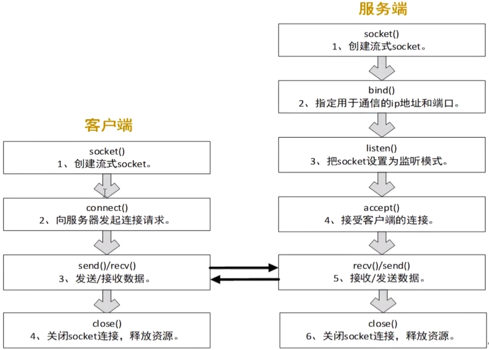
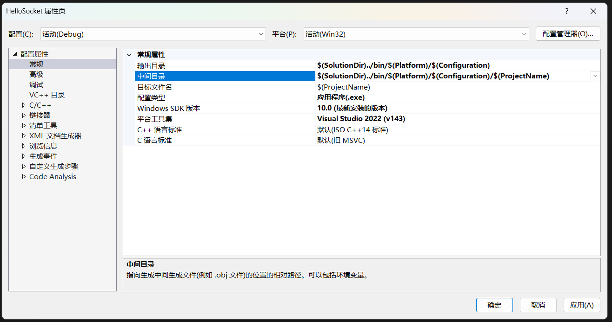
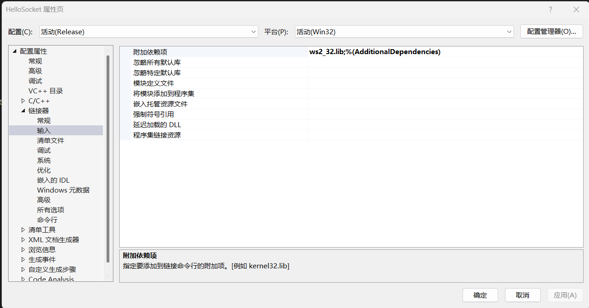
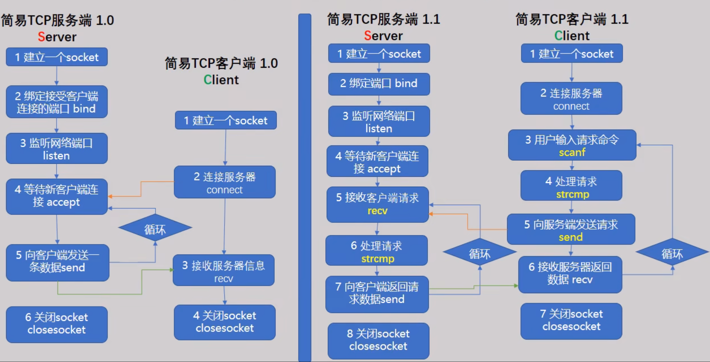
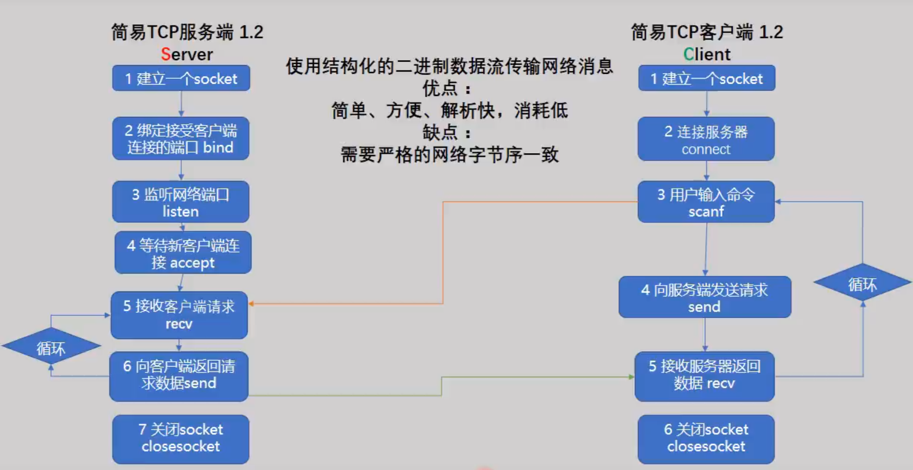

# C/C++网络编程

## 基础

+ 文件描述符的分配规则
  + `/proc/`进程`id/fd`目录中，存放了每个进程打开的`fd`
  + Linux进程默认打开了三个文牛描述符: 0-标准输入 (键盘)，1-标准输出 (显示器)，2-标准错误(显示器)。 `cin cout cer`
  + 文件描述符的分配规则是：找到最小的，没有被占用的文件描述符。

### 网络编程的细节

#### socket函数

##### 创建socket

```c++
int socket(int domain,int type.int protocol);
```

>  成功返回一个有效的 socket，失败返回-1，`errno` 被设置。
>
> 全部网络编程的函数，失败时基本上都是返回-1，`errno` 被设置。
>
> “只要参数没填错，基本上不会失败。“
> 不过，单个进程中创建的 `socket` 数量与受系统参数`open files` 的限制。(`ulimit -a` )
>
> ```shell
> ulimit -a   // 查看系统参数
> ```

1. domain 通讯的协议家族
   - `PE_INET`   		   `IPv4`互联网协议族
   - `PF_INET6`           `IPv6`互联网协议族。
   - `PF_LOCAL`          本地通信的协议族。
   - `PF_PACKET`        内核底层的协议族。
   - `PF_IPX`              `IPX Novell`协议族。
2. type数据传输的类型
   - `SOCK_STREAM` 面向连接的socket: 1）数据不会丢失;2）数据的顺序不会错乱;3）双向通道。
   - `SOCK_DGRAM`   无连接的socket: 1）数据可能会丢失;2）数据的顺序可能会错乱;3）传输的效率更高。
3. protocol最终使用的协议
   - 在`IPv4`网络协议家族中，数据传输方式为`SOCK_STREAM`的协议只有`IPPROTO_TCP`，数据传输方式为`SOCK_DGRAM`的协议只有`IPPROTO_UDP`。
   - 本参数也可以填0。

#### 网络字节序

+ 为了解决不同字节序的计算机之间传输数据的问题，约定采用网络字节序（大端序)。C语言提供了四个库函数，用于在主机字节序和网络字节序之间转换:

+ ```c++
  uint16_t htons(uint16_t hostshort);   // uint16_t2字节的整数unsigned short
  uint32_t htonl(uint32_t hostlong);    // uint32_t4字节的整数unsigned inte
  uint16_t ntohs(uint16_t netshort);    //
  uint32_t ntohl(uint32_t netlong);
  
  h  		host(主机) ;
  to 		转换;
  network (网络);
  short 	(2字节，16位的整数);
  long 	(4字节，32位的整数) ;
  
  ```

##### 如何处理大小端绪

+ 在网络编程中，数据收发的时候有自动转换机制，不需要程序员手动转换，只有向`sockaddr_in`结体成员变量填充数据时，才需要考虑字节序的问题。

#### 结构体



##### `sockaddr`结构体

+ 存放协议族、端口和地址信息，客户端和`connect()`函数和服务端的`bind()`函数需要这个结构体。

+ ```c++
  struct sockaddr {
  	unsigned short sa_family;	//协议族，与socket()函数的第一个参数相同，填AF_INET。
      unsigned char sa_data[14];//14字节的端口和地址。
  };
  ```

##### `sockaddr_in`结构体

+ `sockaddr`结构体是为了统一地址结构的表示方法,统一接口函数，但是，操作不方便，所以定义了等价的`sockaddr_in`结构体，它的大小与`sockaddr`相同，可以强制转换成`sockaddr`。'

+ ```c++
  struct sockaddr_in {
  	unsigned short sin_family;  //协议族，与socket()函数的第一个参数相同，填AF_INET。
      unsigned short sin_port; //16位端口号。 大端序。 用htons()把端口转换一下就可以了.
  	struct in_addr sin_addr;//32位的地址。
  	unsigned char sin_zero[8];//未使用，为了保持与struct sockaddr一样的长度而添加。
  };
  
  struct in_addr {	//IP地址的结构体。
  	unsigned int s_addr;  //32位的IP地址，大端序。
  };
  ```

#### `gethostbyname`函数

+ 根据域名/主机名/字符串IP获取大端序IP，用于网络通讯的客户端程序中。

+ ```c++
  struct hostent *gethostbyname(const char *name);
  struct hostent {
  	char *h_name;	//主机名。
  	char **h_aliases;	//主机所有别名构成的字符串数组，同一IP可绑定多个域名。
      short h_addrtype;	//主机IP地址的类型，例如IPV4 (AF_INET)）还是IPV6。
      short h_length; 	//主机IP地址长度，IPV4地址为4，IPV6地址则为16。
      char **h_addr_list;//主机的ip地址，以网络字节序存储。
  };
  #define h_addr h_addr_list[0] // for backward compatibility.
  ```

+ 转换后，用以下代码把大端序的地址复制到`sockadd_in`结构体的`sin_addr`成员中。

+ ```c++
  memcpy(&servaddr.sin_addr,h->h_addr,h->h_length);
  ```

#### 字符串IP与大端序IP的转换

+ C语言提供了几个库函数，用于字符串格式的IP和大端序IP的互相转换，用于网络通讯的服务端程序中。

```c++
typedef unsigned int in_addr_t;	//32位大端序的IP地址。

//把字符串格式的IP转换成大端序的IP，转换后的IP赋给sockaddr_in.in_addr.s_addr。
in_addr_t inet_addr(const char *cp);

//把字符串格式的IP转换成大端序的IP，转换后的IP将填充到sockaddr_in.in_addr成员。
int inet_aton(const char *cp, struct in_addr *inp);

//把大端序IP转换成字符串格式的IP，用于在服务端程序中解析客户端的IP地址。
char *inet_ntoa(struct in_addr in); 
```

> ```c++
> servaddr.sin_addr.s_addr=htonl(INADDR_ANY) ; //③如果操作系统有多个IP，全部的IP者
> servaddr.sin_addr.s_addr=inet_addr("192.168.101.138"); //③指定服务端用于通讯的IP(大端序)。
> ```

#### 封装socket


## socket 基础api介绍（tcp篇）


## socket基础实用版

### 1. 配置开发路径

+ 项目---- 鼠标右键 ----属性
+ 

### 2. 头文件的引入

```c++
# define WIN32_LEAN_AND_MEAN
#include<windows.h>
#include<WinSock2.h>
```

### 3. chatGPT示例（windows平台版）

+ 服务端代码：

```c++
#include <iostream>
#include <winsock2.h>

#pragma comment(lib, "ws2_32.lib")
#pragma warning(disable:4996)

int main() {
    WSADATA wsaData;
    WSAStartup(MAKEWORD(2, 2), &wsaData);

    // 创建 socket
    SOCKET serverSocket = socket(AF_INET, SOCK_STREAM, IPPROTO_TCP);

    // 绑定 IP 地址和端口号
    sockaddr_in serverAddr;
    serverAddr.sin_family = AF_INET;
    serverAddr.sin_port = htons(8080);
    serverAddr.sin_addr.S_un.S_addr = htonl(INADDR_ANY);
    bind(serverSocket, (sockaddr*)&serverAddr, sizeof(serverAddr));

    // 监听连接请求
    listen(serverSocket, SOMAXCONN);

    std::cout << "Server listening on port 8080..." << std::endl;

    // 等待客户端连接
    sockaddr_in clientAddr;
    int clientAddrSize = sizeof(clientAddr);
    SOCKET clientSocket = accept(serverSocket, (sockaddr*)&clientAddr, &clientAddrSize);

    std::cout << "Client connected from " << inet_ntoa(clientAddr.sin_addr) << std::endl;

    // 接收客户端发送的数据
    char buffer[1024];
    int recvSize = recv(clientSocket, buffer, sizeof(buffer), 0);

    std::cout << "Received " << recvSize << " bytes from client: " << buffer << std::endl;

    // 发送数据给客户端
    const char* msg = "Hello, client!";
    send(clientSocket, msg, strlen(msg), 0);

    // 关闭 socket
    closesocket(clientSocket);
    closesocket(serverSocket);
    WSACleanup();

    return 0;
}

```

+ 客户端代码

```c++
#include <iostream>
#include <winsock2.h>

#pragma comment(lib, "ws2_32.lib")

int main() {
    WSADATA wsaData;
    WSAStartup(MAKEWORD(2, 2), &wsaData);

    // 创建 socket
    SOCKET clientSocket = socket(AF_INET, SOCK_STREAM, IPPROTO_TCP);

    // 连接到服务器
    sockaddr_in serverAddr;
    serverAddr.sin_family = AF_INET;
    serverAddr.sin_port = htons(8080);
    serverAddr.sin_addr.S_un.S_addr = inet_addr("127.0.0.1");
    connect(clientSocket, (sockaddr*)&serverAddr, sizeof(serverAddr));

    std::cout << "Connected to server at 127.0.0.1:8080" << std::endl;

    // 发送数据给服务器
    const char* msg = "Hello, server!";
    send(clientSocket, msg, strlen(msg), 0);

    // 接收服务器发送的数据
    char buffer[1024];
    int recvSize = recv(clientSocket, buffer, sizeof(buffer), 0);

    std::cout << "Received " << recvSize << " bytes from server: " << buffer << std::endl;

    // 关闭 socket
    closesocket(clientSocket);
    WSACleanup();

    return 0;
}

```

### 4. 普通实现，实用版（windows）

+ 引入动态链接库的第二种方法
  + 
+ 示例代码

```c++
#define WIN32_LEAN_AND_MEAN  // 添加此处宏定义，或者切换WinSock2.h ，windows.h先后位置
#include<WinSock2.h>
#include<windows.h>

//动态链接库
//#pragma comment(lib,"ws2_32.lib") 只支持windos


using namespace std;
int main()
{
	WORD ver = MAKEWORD(2, 2);
	WSADATA dat;
	WSAStartup(ver,&dat);
	///
	///编写socket代码
	///
	WSACleanup();
	return 0;
}
```

### 5.  用socket API建立服务端和客户端

+ 用socket api建立简易tcp服务端
  1. 建立一个socket
  2. 绑定接受客户端连接的端口bind
  3. 监听网络端口listen
  4. 等待接受客户端连接 accept
  5. 向客户端发送一条数据send
  6. 关闭socket closesocket

```c++
#define WIN32_LEAN_AND_MEAN  // 添加此处宏定义，或者切换WinSock2.h ，windows.h先后位置
#define _WINSOCK_DEPRECATED_NO_WARNINGS
#include<WinSock2.h>
#include<windows.h>
#include<stdio.h>

//动态链接库
//#pragma comment(lib,"ws2_32.lib") 只支持windos


using namespace std;
int main()
{
	WORD ver = MAKEWORD(2, 2);
	WSADATA dat;
	WSAStartup(ver, &dat);
	//
		/*1. 建立一个socket
		2. 绑定接受客户端连接的端口bind
		3. 监听网络端口listen
		4. 等待接受客户端连接 accept
		5. 向客户端发送一条数据send
		6. 关闭socket closesocket*/
	//
	//1. 建立一个socket
	SOCKET _sock = socket(AF_INET, SOCK_STREAM, IPPROTO_TCP);
	// 2. 绑定接受客户端连接的端口bind
	sockaddr_in _sin = {};
	_sin.sin_family = AF_INET;
	_sin.sin_port = htons(4567);//host to net unsigned short
	_sin.sin_addr.S_un.S_addr = INADDR_ANY;// inet_addr("127.0.0.1")
	if (SOCKET_ERROR == bind(_sock, (sockaddr*)&_sin, sizeof(_sin)))
	{
		printf("ERROR,绑定用于接受客户端连接的网络端口失败\n");
	}
	else
	{
		printf("绑定网络端口成功 \n");
	}
	//3. 监听网络端口listen
	if (SOCKET_ERROR == listen(_sock, 5))
	{
		printf("ERROR,监听网络端口失败\n");
	}
	else
	{
		printf("监听网络端口成功 \n");
	}
	//4. 等待接受客户端连接 accept
	sockaddr_in clientAddr = {};
	int nAddrLen = sizeof(sockaddr_in);
	SOCKET _cSock = INVALID_SOCKET;
	char msgBuf[] = "hello, i'm server";
	while (true)
	{
		_cSock = accept(_sock, (sockaddr*)&clientAddr, &nAddrLen);
		if (INVALID_SOCKET == _cSock)
		{
			printf("无效\n");
		}
		printf("新客户端加入:IP = %s \n",inet_ntoa(clientAddr.sin_addr));
		//5. 向客户端发送一条数据send
		send(_cSock, msgBuf, strlen(msgBuf) + 1, 0);
	}
	
	//	6. 关闭socket closesocket
	closesocket(_sock);


	WSACleanup();
	return 0;
}

```

+ 用socket  api建立简易tcp客户端
  1. 建立一个socket
  2. 连接服务端connect
  3. 接受服务器信息 recv
  4. 关闭socket closesocket

```c++
#define _WINSOCK_DEPRECATED_NO_WARNINGS
#include<stdio.h>
#include<WinSock2.h>
#include<windows.h>


//动态链接库
#pragma comment(lib,"ws2_32.lib") //只支持windos


using namespace std;
int main()
{
	WORD ver = MAKEWORD(2, 2);
	WSADATA dat;
	WSAStartup(ver, &dat);
	/*1. 建立一个socket
	2. 连接服务端connect
	3. 接受服务器信息 recv
	4. 关闭socket closesocket*/

	//1. 建立一个socket
	SOCKET _sock = socket(AF_INET, SOCK_STREAM, 0);
	if (INVALID_SOCKET == _sock)
	{
		printf("失败");
	}
	else
	{
		printf("success");
	}
	//2. 连接服务端connect
	sockaddr_in _sin = {};
	_sin.sin_family = AF_INET;
	_sin.sin_port = htons(4567);
	_sin.sin_addr.S_un.S_addr = inet_addr("127.0.0.1");
	if (SOCKET_ERROR == connect(_sock, (sockaddr*)&_sin, sizeof(sockaddr_in)))
	{
		printf("connect失败");
	}
	else
	{
		printf("connect  success");
	}
	//3.接受服务器信息 recv
	char recvBuf[256] = {};
	if (recv(_sock, recvBuf, 256, 0) > 0)
	{
		printf("接受到数据：%s", recvBuf);
	}
	//4. 关闭socket closesocket
	closesocket(_sock);
	WSACleanup();
	return 0;
}
```

<<<<<<< HEAD
## 建立能持续处理请求的C/S网络程序



### 1. 服务端代码改造

```c++
#define WIN32_LEAN_AND_MEAN  // 添加此处宏定义，或者切换WinSock2.h ，windows.h先后位置
#define _WINSOCK_DEPRECATED_NO_WARNINGS
#include<WinSock2.h>
#include<windows.h>
#include<stdio.h>

//动态链接库
#pragma comment(lib,"ws2_32.lib") //只支持windos


using namespace std;
int main()
{
	WORD ver = MAKEWORD(2, 2);
	WSADATA dat;
	WSAStartup(ver, &dat);
	//
		/*1. 建立一个socket
		2. 绑定接受客户端连接的端口bind
		3. 监听网络端口listen
		4. 等待接受客户端连接 accept
		5. 向客户端发送一条数据send
		6. 关闭socket closesocket*/
	//
	//1. 建立一个socket
	SOCKET _sock = socket(AF_INET, SOCK_STREAM, IPPROTO_TCP);
	// 2. 绑定接受客户端连接的端口bind
	sockaddr_in _sin = {};
	_sin.sin_family = AF_INET;
	_sin.sin_port = htons(4567);//host to net unsigned short
	_sin.sin_addr.S_un.S_addr = INADDR_ANY;// inet_addr("127.0.0.1")
	if (SOCKET_ERROR == bind(_sock, (sockaddr*)&_sin, sizeof(_sin)))
	{
		printf("ERROR,绑定用于接受客户端连接的网络端口失败\n");
	}
	else
	{
		printf("绑定网络端口成功 \n");
	}
	//3. 监听网络端口listen
	if (SOCKET_ERROR == listen(_sock, 5))
	{
		printf("ERROR,监听网络端口失败\n");
	}
	else
	{
		printf("监听网络端口成功 \n");
	}
	//4. 等待接受客户端连接 accept
	sockaddr_in clientAddr = {};
	int nAddrLen = sizeof(sockaddr_in);
	SOCKET _cSock = INVALID_SOCKET;
	char msgBuf[] = "hello, i'm server";
	_cSock = accept(_sock, (sockaddr*)&clientAddr, &nAddrLen);
	if (INVALID_SOCKET == _cSock)
	{
		printf("无效\n");
	}
	printf("新客户端加入:Socket = %d，IP = %s \n",(int)_cSock, inet_ntoa(clientAddr.sin_addr));
	char _recvBuf[128] = {};
	while (true)
	{
		// 5. 接受客户端数据
		int nLen = recv(_cSock, _recvBuf,128,0);
		if (nLen <= 0) {
			printf("客户端已退出，任务结束");
			break;
		}
		// 6. 处理请求
		printf("%s \n", _recvBuf);
		if (0 == strcmp(_recvBuf, "getName"))
		{
			//7. 向客户端发送一条数据send
			char msgBuf[] = "Xiao Qiang";
			send(_cSock, msgBuf, strlen(msgBuf) + 1, 0);
		}
		else if (0 == strcmp(_recvBuf, "getAge"))
		{
			char msgBuf[] = "21";
			//7. 向客户端发送一条数据send
			send(_cSock, msgBuf, strlen(msgBuf) + 1, 0);
		}
		else 
		{
			char msgBuf[] = "???";
			//7. 向客户端发送一条数据send
			send(_cSock, msgBuf, strlen(msgBuf) + 1, 0);
		}
		//7. 向客户端发送一条数据send
		send(_cSock, msgBuf, strlen(msgBuf) + 1, 0);
	}
	
	//	6. 关闭socket closesocket
	closesocket(_sock);
	WSACleanup();
	printf("退出。任务结束");
	getchar();
	return 0;
}

```

### 2. 客户端代码改造

```C++
#define _WINSOCK_DEPRECATED_NO_WARNINGS
#include<stdio.h>
#include<WinSock2.h>
#include<windows.h>


//动态链接库
#pragma comment(lib,"ws2_32.lib") //只支持windos


using namespace std;
int main()
{
	WORD ver = MAKEWORD(2, 2);
	WSADATA dat;
	WSAStartup(ver, &dat);
	/*1. 建立一个socket
	2. 连接服务端connect
	3. 接受服务器信息 recv
	4. 关闭socket closesocket*/

	//1. 建立一个socket
	SOCKET _sock = socket(AF_INET, SOCK_STREAM, 0);
	if (INVALID_SOCKET == _sock)
	{
		printf("失败");
	}
	else
	{
		printf("success");
	}
	//2. 连接服务端connect
	sockaddr_in _sin = {};
	_sin.sin_family = AF_INET;
	_sin.sin_port = htons(4567);
	_sin.sin_addr.S_un.S_addr = inet_addr("127.0.0.1");
	if (SOCKET_ERROR == connect(_sock, (sockaddr*)&_sin, sizeof(sockaddr_in)))
	{
		printf("connect失败");
	}
	else
	{
		printf("connect  success");
	}
	char cmdBuf[128] = {};
	while (true)
	{
		// 3. 输入请求命令
		scanf("%s", cmdBuf);
		// 4. 处理请求
		if (0 == strcmp(cmdBuf, "exit")) 
		{
			printf("收到退出命令。任务结束");
			break;
		}
		else
		{
			// 5. 向服务器发送请求命令
			send(_sock, cmdBuf, strlen(cmdBuf) + 1, 0);
		}
		//6.接受服务器信息 recv
		char recvBuf[128] = {};
		if (recv(_sock, recvBuf, 128, 0) > 0)
		{
			printf("接受到数据：%s", recvBuf);
		}  
	}
	
	//7. 关闭socket closesocket
	closesocket(_sock);
	WSACleanup();
	printf("退出。任务结束");
	getchar();
	return 0;
}
```

## 发送结构化的网络消息数据



### 1. 服务端代码改造

```c++
#define WIN32_LEAN_AND_MEAN  // 添加此处宏定义，或者切换WinSock2.h ，windows.h先后位置
#define _WINSOCK_DEPRECATED_NO_WARNINGS
#include<WinSock2.h>
#include<windows.h>
#include<stdio.h>

//动态链接库
#pragma comment(lib,"ws2_32.lib") //只支持windos

struct DataPackage
{
	int age;
	char name[32];
};
int main()
{
	WORD ver = MAKEWORD(2, 2);
	WSADATA dat;
	WSAStartup(ver, &dat);
	//
		/*1. 建立一个socket
		2. 绑定接受客户端连接的端口bind
		3. 监听网络端口listen
		4. 等待接受客户端连接 accept
		5. 向客户端发送一条数据send
		6. 关闭socket closesocket*/
	//
	//1. 建立一个socket
	SOCKET _sock = socket(AF_INET, SOCK_STREAM, IPPROTO_TCP);
	// 2. 绑定接受客户端连接的端口bind
	sockaddr_in _sin = {};
	_sin.sin_family = AF_INET;
	_sin.sin_port = htons(4567);//host to net unsigned short
	_sin.sin_addr.S_un.S_addr = INADDR_ANY;// inet_addr("127.0.0.1")
	if (SOCKET_ERROR == bind(_sock, (sockaddr*)&_sin, sizeof(_sin)))
	{
		printf("ERROR,绑定用于接受客户端连接的网络端口失败\n");
	}
	else
	{
		printf("绑定网络端口成功 \n");
	}
	//3. 监听网络端口listen
	if (SOCKET_ERROR == listen(_sock, 5))
	{
		printf("ERROR,监听网络端口失败\n");
	}
	else
	{
		printf("监听网络端口成功 \n");
	}
	//4. 等待接受客户端连接 accept
	sockaddr_in clientAddr = {};
	int nAddrLen = sizeof(sockaddr_in);
	SOCKET _cSock = INVALID_SOCKET;
	char msgBuf[] = "hello, i'm server";
	_cSock = accept(_sock, (sockaddr*)&clientAddr, &nAddrLen);
	if (INVALID_SOCKET == _cSock)
	{
		printf("无效\n");
	}
	printf("新客户端加入:Socket = %d，IP = %s \n",(int)_cSock, inet_ntoa(clientAddr.sin_addr));
	char _recvBuf[128] = {};
	while (true)
	{
		// 5. 接受客户端数据
		int nLen = recv(_cSock, _recvBuf,128,0);
		if (nLen <= 0) {
			printf("客户端已退出，任务结束");
			break;
		}
		// 6. 处理请求
		printf("%s \n", _recvBuf);
		if (0 == strcmp(_recvBuf, "getInfo"))
		{
			DataPackage dp = {80,"pbxhx"};
			send(_cSock, (const char *) & dp, sizeof(DataPackage), 0);
		}
		else if (0 == strcmp(_recvBuf, "getAge"))
		{
			char msgBuf[] = "21";
			//7. 向客户端发送一条数据send
			send(_cSock, msgBuf, strlen(msgBuf) + 1, 0);
		}
		else 
		{
			char msgBuf[] = "???";
			//7. 向客户端发送一条数据send
			send(_cSock, msgBuf, strlen(msgBuf) + 1, 0);
		}
		//7. 向客户端发送一条数据send
		send(_cSock, msgBuf, strlen(msgBuf) + 1, 0);
	}
	
	//	8. 关闭socket closesocket
	closesocket(_sock);
	WSACleanup();
	printf("退出。任务结束");
	getchar();
	return 0;
}
```

### 2. 客户端代码改造

```C++
#define _WINSOCK_DEPRECATED_NO_WARNINGS
#include<stdio.h>
#include<WinSock2.h>
#include<windows.h>


//动态链接库
#pragma comment(lib,"ws2_32.lib") //只支持windos
struct DataPackage
{
	int age;
	char name[32];
};
int main()
{
	WORD ver = MAKEWORD(2, 2);
	WSADATA dat;
	WSAStartup(ver, &dat);
	/*1. 建立一个socket
	2. 连接服务端connect
	3. 接受服务器信息 recv
	4. 关闭socket closesocket*/

	//1. 建立一个socket
	SOCKET _sock = socket(AF_INET, SOCK_STREAM, 0);
	if (INVALID_SOCKET == _sock)
	{
		printf("失败");
	}
	else
	{
		printf("success");
	}
	//2. 连接服务端connect
	sockaddr_in _sin = {};
	_sin.sin_family = AF_INET;
	_sin.sin_port = htons(4567);
	_sin.sin_addr.S_un.S_addr = inet_addr("127.0.0.1");
	if (SOCKET_ERROR == connect(_sock, (sockaddr*)&_sin, sizeof(sockaddr_in)))
	{
		printf("connect失败");
	}
	else
	{
		printf("connect  success");
	}
	char cmdBuf[128] = {};
	while (true)
	{
		// 3. 输入请求命令
		scanf("%s", cmdBuf);
		// 4. 处理请求
		if (0 == strcmp(cmdBuf, "exit")) 
		{
			printf("收到退出命令。任务结束");
			break;
		}
		else
		{
			// 5. 向服务器发送请求命令
			send(_sock, cmdBuf, strlen(cmdBuf) + 1, 0);
		}
		//6.接受服务器信息 recv
		char recvBuf[128] = {};
		if (recv(_sock, recvBuf, 128, 0) > 0)
		{
			DataPackage* dp = (DataPackage*)recvBuf;
			printf("接受到数据：年龄= %d, 姓名= %s \n", dp->age,dp->name);
		}
	}
	
	//7. 关闭socket closesocket
	closesocket(_sock);
	WSACleanup();
	printf("退出。任务结束");
	getchar();
	return 0;
}
```

### 3. 网络数据报文的格式定义

+ 报文有两个部分，包头和包体，是网络消息的基本单元
+ 包头：描述本次消息包的大小，描述数据的作用
+ 包体：数据

#### 客户端代码：

```C++
#define _WINSOCK_DEPRECATED_NO_WARNINGS
#include<stdio.h>
#include<WinSock2.h>
#include<windows.h>


//动态链接库
#pragma comment(lib,"ws2_32.lib") //只支持windos
enum CMD
{
	CMD_LOGIN,
	CMD_LOGINOUT,
	CMD_ERROR
};
struct DataHeader
{
	short dataLength;
	short cmd;
};

struct LoginResult
{
	int result;
};

struct LoginOut
{
	char userName[32];
};

struct LoginOutResult
{
	int result;
};
//DataPackage
struct Login
{
	char userName[32];
	char PassWord[32];
};

int main()
{
	WORD ver = MAKEWORD(2, 2);
	WSADATA dat;
	WSAStartup(ver, &dat);
	/*1. 建立一个socket
	2. 连接服务端connect
	3. 接受服务器信息 recv
	4. 关闭socket closesocket*/

	//1. 建立一个socket
	SOCKET _sock = socket(AF_INET, SOCK_STREAM, 0);
	if (INVALID_SOCKET == _sock)
	{
		printf("失败");
	}
	else
	{
		printf("success");
	}
	//2. 连接服务端connect
	sockaddr_in _sin = {};
	_sin.sin_family = AF_INET;
	_sin.sin_port = htons(4567);
	_sin.sin_addr.S_un.S_addr = inet_addr("127.0.0.1");
	if (SOCKET_ERROR == connect(_sock, (sockaddr*)&_sin, sizeof(sockaddr_in)))
	{
		printf("connect失败");
	}
	else
	{
		printf("connect  success");
	}
	char cmdBuf[128] = {};
	while (true)
	{
		// 3. 输入请求命令
		scanf("%s", cmdBuf);
		// 4. 处理请求
		if (0 == strcmp(cmdBuf, "exit")) 
		{
			printf("收到退出命令。任务结束");
			break;
		}
		else if(0 == strcmp(cmdBuf, "login"))
		{
			Login login = { "lyd","ydmn" };
			DataHeader dh = { sizeof(login),CMD_LOGIN};
			// 5. 向服务器发送请求命令
			send(_sock, (const char*)&dh, sizeof(dh), 0);
			send(_sock, (const char*)&login, sizeof(login), 0);
			// 接受服务器返数据
			DataHeader retHeader = {};
			LoginResult loginret = {};
			recv(_sock, (char*)&retHeader, sizeof(retHeader), 0);
			recv(_sock, (char*)&loginret, sizeof(loginret), 0);
			printf("loginResult %d \n", loginret.result);
		}
		else if (0 == strcmp(cmdBuf, "loginout"))
		{
			// 5. 向服务器发送请求命令
			LoginOut logout = {"lyd"};
			DataHeader dh = { sizeof(logout),CMD_LOGINOUT };
			send(_sock, (const char*)&dh, sizeof(dh), 0);
			send(_sock, (const char*)&logout, sizeof(logout), 0);
			DataHeader retHeader = {};
			LoginOutResult logoutret = {};
			recv(_sock, (char*)&retHeader, sizeof(retHeader), 0);
			recv(_sock, (char*)&logoutret, sizeof(logoutret), 0);
			printf("LoginOutResult %d \n", logoutret.result);
		}
		else {
			printf("不支持命令。任务结束");
		}
		//6.接受服务器信息 recv
		/*char recvBuf[128] = {};
		if (recv(_sock, recvBuf, 128, 0) > 0)
		{
			DataPackage* dp = (DataPackage*)recvBuf;
			printf("接受到数据：年龄= %d, 姓名= %s \n", dp->age,dp->name);
		}*/
	}
	
	//7. 关闭socket closesocket
	closesocket(_sock);
	WSACleanup();
	printf("退出。任务结束");
	getchar();
	return 0;
}
```

#### 服务端代码

```C++
#define WIN32_LEAN_AND_MEAN  // 添加此处宏定义，或者切换WinSock2.h ，windows.h先后位置
#define _WINSOCK_DEPRECATED_NO_WARNINGS
#include<WinSock2.h>
#include<windows.h>
#include<stdio.h>

//动态链接库
#pragma comment(lib,"ws2_32.lib") //只支持windos

enum CMD
{
	CMD_LOGIN,
	CMD_LOGINOUT,
	CMD_ERROR
};

struct DataHeader
{
	short dataLength;
	short cmd;
};

struct LoginResult
{
	int result;
};

struct LoginOut
{
	char userName[32];
};

struct LoginOutResult
{
	int result;
};
//DataPackage
struct Login
{
	char userName[32];
	char PassWord[32];
};
int main()
{
	WORD ver = MAKEWORD(2, 2);
	WSADATA dat;
	WSAStartup(ver, &dat);
	//
		/*1. 建立一个socket
		2. 绑定接受客户端连接的端口bind
		3. 监听网络端口listen
		4. 等待接受客户端连接 accept
		5. 向客户端发送一条数据send
		6. 关闭socket closesocket*/
	//
	//1. 建立一个socket
	SOCKET _sock = socket(AF_INET, SOCK_STREAM, IPPROTO_TCP);
	// 2. 绑定接受客户端连接的端口bind
	sockaddr_in _sin = {};
	_sin.sin_family = AF_INET;
	_sin.sin_port = htons(4567);//host to net unsigned short
	_sin.sin_addr.S_un.S_addr = INADDR_ANY;// inet_addr("127.0.0.1")
	if (SOCKET_ERROR == bind(_sock, (sockaddr*)&_sin, sizeof(_sin)))
	{
		printf("ERROR,绑定用于接受客户端连接的网络端口失败\n");
	}
	else
	{
		printf("绑定网络端口成功 \n");
	}
	//3. 监听网络端口listen
	if (SOCKET_ERROR == listen(_sock, 5))
	{
		printf("ERROR,监听网络端口失败\n");
	}
	else
	{
		printf("监听网络端口成功 \n");
	}
	//4. 等待接受客户端连接 accept
	sockaddr_in clientAddr = {};
	int nAddrLen = sizeof(sockaddr_in);
	SOCKET _cSock = INVALID_SOCKET;
	char msgBuf[] = "hello, i'm server";
	_cSock = accept(_sock, (sockaddr*)&clientAddr, &nAddrLen);
	if (INVALID_SOCKET == _cSock)
	{
		printf("无效\n");
	}
	printf("新客户端加入:Socket = %d，IP = %s \n",(int)_cSock, inet_ntoa(clientAddr.sin_addr));
	char _recvBuf[128] = {};
	while (true)
	{
		DataHeader header = {};
		// 5. 接受客户端数据
		int nLen = recv(_cSock, (char*)&header, sizeof(DataHeader), 0);
		if (nLen <= 0) {
			printf("客户端已退出，任务结束");
			break;
		}
		// 6. 处理请求
		printf("收到命令%d  数据长度%d \n", header.cmd,header.dataLength);
		switch (header.cmd)
		{
			case CMD_LOGIN:
			{
				Login login = {};
				recv(_cSock, (char*)&login, sizeof(login), 0);
				// 忽略判断用户密码是否正确的过程
				LoginResult ret = {0};
				send(_cSock, (char*)&header, sizeof(DataHeader), 0);
				send(_cSock, (char*)&ret, sizeof(LoginResult), 0);
			}
			break;
			case CMD_LOGINOUT:
			{
				LoginOut logout = {};
				recv(_cSock, (char*)&logout, sizeof(logout), 0);
				// 忽略判断用户密码是否正确的过程
				LoginOutResult ret = { 1 };
				send(_cSock, (char*)&header, sizeof(DataHeader), 0);
				send(_cSock, (char*)&ret, sizeof(LoginOutResult), 0);
			}
			break;
			default:
				header.cmd = CMD_ERROR;
				header.dataLength = 0;
				send(_cSock, (char*)&header, sizeof(header), 0);
				break;
		}
		//if (0 == strcmp(_recvBuf, "getInfo"))
		//{
		//	DataPackage dp = {80,"pbxhx"};
		//	send(_cSock, (const char *) & dp, sizeof(DataPackage), 0);
		//}
		//else if (0 == strcmp(_recvBuf, "getAge"))
		//{
		//	char msgBuf[] = "21";
		//	//7. 向客户端发送一条数据send
		//	send(_cSock, msgBuf, strlen(msgBuf) + 1, 0);
		//}
		//else 
		//{
		//	char msgBuf[] = "???";
		//	//7. 向客户端发送一条数据send
		//	send(_cSock, msgBuf, strlen(msgBuf) + 1, 0);
		//}
		////7. 向客户端发送一条数据send
		//send(_cSock, msgBuf, strlen(msgBuf) + 1, 0);
	}
	
	//	6. 关闭socket closesocket
	closesocket(_sock);
	WSACleanup();
	printf("退出。任务结束");
	getchar();
	return 0;
}
```


### 4. 将多次收发报文数据升级为一次收发

#### 关于recv函数接受网络消息的疑问

```c++
struct DataHeader
{
	short dataLength;
    short cmd;
};
```

> 固长数据，变长数据、粘包/拆包、少包/组包

#### 服务端代码

```C++
#define WIN32_LEAN_AND_MEAN  // 添加此处宏定义，或者切换WinSock2.h ，windows.h先后位置
#define _WINSOCK_DEPRECATED_NO_WARNINGS
#include<WinSock2.h>
#include<windows.h>
#include<stdio.h>

//动态链接库
#pragma comment(lib,"ws2_32.lib") //只支持windos

enum CMD
{
	CMD_LOGIN,
	CMD_LOGIN_RESULT,
	CMD_LOGINOUT,
	CMD_LOGINOUT_RESULT,
	CMD_ERROR
};

struct DataHeader
{
	short dataLength;
	short cmd;
};
//DataPackage
struct Login : public DataHeader
{
	Login()
	{
		dataLength = sizeof(Login);
		cmd = CMD_LOGIN;
	}
	char userName[32];
	char PassWord[32];
};
struct LoginResult :public DataHeader
{
	LoginResult()
	{
		dataLength = sizeof(LoginResult);
		cmd = CMD_LOGIN_RESULT;
		result = 0;
	}
	int result;
};

struct LoginOut : public DataHeader
{
	LoginOut()
	{
		dataLength = sizeof(LoginOut);
		cmd = CMD_LOGINOUT;
	}
	char userName[32];
};

struct LoginOutResult : public DataHeader
{
	LoginOutResult()
	{
		dataLength = sizeof(LoginOutResult);
		cmd = CMD_LOGINOUT_RESULT;
		result = 0;
	}
	int result;
};
int main()
{
	WORD ver = MAKEWORD(2, 2);
	WSADATA dat;
	WSAStartup(ver, &dat);
	//
		/*1. 建立一个socket
		2. 绑定接受客户端连接的端口bind
		3. 监听网络端口listen
		4. 等待接受客户端连接 accept
		5. 向客户端发送一条数据send
		6. 关闭socket closesocket*/
	//
	//1. 建立一个socket
	SOCKET _sock = socket(AF_INET, SOCK_STREAM, IPPROTO_TCP);
	// 2. 绑定接受客户端连接的端口bind
	sockaddr_in _sin = {};
	_sin.sin_family = AF_INET;
	_sin.sin_port = htons(4567);//host to net unsigned short
	_sin.sin_addr.S_un.S_addr = INADDR_ANY;// inet_addr("127.0.0.1")
	if (SOCKET_ERROR == bind(_sock, (sockaddr*)&_sin, sizeof(_sin)))
	{
		printf("ERROR,绑定用于接受客户端连接的网络端口失败\n");
	}
	else
	{
		printf("绑定网络端口成功 \n");
	}
	//3. 监听网络端口listen
	if (SOCKET_ERROR == listen(_sock, 5))
	{
		printf("ERROR,监听网络端口失败\n");
	}
	else
	{
		printf("监听网络端口成功 \n");
	}
	//4. 等待接受客户端连接 accept
	sockaddr_in clientAddr = {};
	int nAddrLen = sizeof(sockaddr_in);
	SOCKET _cSock = INVALID_SOCKET;
	char msgBuf[] = "hello, i'm server";
	_cSock = accept(_sock, (sockaddr*)&clientAddr, &nAddrLen);
	if (INVALID_SOCKET == _cSock)
	{
		printf("无效\n");
	}
	printf("新客户端加入:Socket = %d，IP = %s \n",(int)_cSock, inet_ntoa(clientAddr.sin_addr));
	char _recvBuf[128] = {};
	while (true)
	{
		DataHeader header = {};
		// 5. 接受客户端数据
		int nLen = recv(_cSock, (char*)&header, sizeof(DataHeader), 0);
		if (nLen <= 0) {
			printf("客户端已退出，任务结束");
			break;
		}
		switch (header.cmd)
		{
			case CMD_LOGIN:
			{
				Login login = {};
				recv(_cSock, (char*)&login, sizeof(login), 0);
				printf("收到命令：CMD_LOGIN   数据长度  %d   userName = %s  passwrod = %s\n",  login.dataLength, login.userName, login.PassWord);
				// 忽略判断用户密码是否正确的过程
				LoginResult ret;
				send(_cSock, (char*)&ret, sizeof(LoginResult), 0);
			}
			break;
			case CMD_LOGINOUT:
			{
				LoginOut logout = {};
				recv(_cSock, (char*)&logout, sizeof(logout), 0);
				printf("收到命令：CMD_LOGIN   数据长度  %d   userName = %s \n", logout.dataLength, logout.userName);
				// 忽略判断用户密码是否正确的过程
				LoginOutResult ret;
				send(_cSock, (char*)&ret, sizeof(LoginOutResult), 0);
			}
			break;
			default:
				header.cmd = CMD_ERROR;
				header.dataLength = 0;
				send(_cSock, (char*)&header, sizeof(header), 0);
				break;
		}
		//if (0 == strcmp(_recvBuf, "getInfo"))
		//{
		//	DataPackage dp = {80,"pbxhx"};
		//	send(_cSock, (const char *) & dp, sizeof(DataPackage), 0);
		//}
		//else if (0 == strcmp(_recvBuf, "getAge"))
		//{
		//	char msgBuf[] = "21";
		//	//7. 向客户端发送一条数据send
		//	send(_cSock, msgBuf, strlen(msgBuf) + 1, 0);
		//}
		//else 
		//{
		//	char msgBuf[] = "???";
		//	//7. 向客户端发送一条数据send
		//	send(_cSock, msgBuf, strlen(msgBuf) + 1, 0);
		//}
		////7. 向客户端发送一条数据send
		//send(_cSock, msgBuf, strlen(msgBuf) + 1, 0);
	}
	
	//	6. 关闭socket closesocket
	closesocket(_sock);
	WSACleanup();
	printf("退出。任务结束");
	getchar();
	return 0;
}
```

