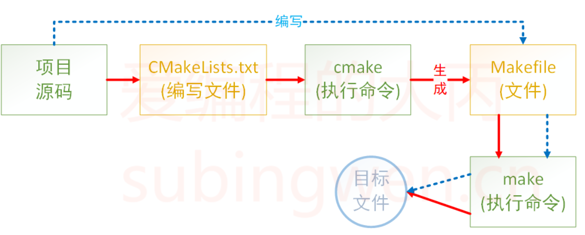

## 1. [Make概述](https://subingwen.cn/cmake/CMake-primer/#2-1-1-%E5%85%B1%E5%A4%84%E4%B8%80%E5%AE%A4)

+ CMake 是一个项目构建工具，并且是跨平台的。关于项目构建我们所熟知的还有Makefile（通过 make 命令进行项目的构建），大多是IDE软件都集成了make，比如：VS 的 nmake、linux 下的 GNU make、Qt 的 qmake等，如果自己动手写 makefile，会发现，makefile 通常依赖于当前的编译平台，而且编写 makefile 的工作量比较大，解决依赖关系时也容易出错。

+ 而 CMake 恰好能解决上述问题， 其允许开发者指定整个工程的编译流程，在根据编译平台，自动生成本地化的Makefile和工程文件，最后用户只需make编译即可，所以可以把CMake看成一款自动生成 Makefile的工具.
+ 
  + 蓝色虚线表示使用makefile构建项目的过程
  + 红色实线表示使用cmake构建项目的过程

+ 优点：

  + 跨平台
  + 能够管理大型项目
  + 简化编译构建过程和编译过程
  + 可扩展：可以为 cmake 编写特定功能的模块，扩充 cmake 功能

## 2. CMake 的使用

> CMake支持大写、小写、混合大小写的命令。如果在编写`CMakeLists.txt`文件时使用的工具有对应的命令提示，那么大小写随缘即可，不要太过在意。

### 2.1 注释

<!-- tabs:start -->

#### **注释行**

> `CMake` 使用 `#` 进行行注释，可以放在任何位置。

```cmake
# 这是一个 CMakeLists.txt 文件
cmake_minimum_required(VERSION 3.0.0)
```

#### **注释块**

> `CMake` 使用 #[[ ]] 形式进行块注释。

```cmake
#[[ 这是一个 CMakeLists.txt 文件。
这是一个 CMakeLists.txt 文件
这是一个 CMakeLists.txt 文件]]
cmake_minimum_required(VERSION 3.0.0)
```

<!-- tabs:end -->

### 2.2 测试用例

1. 准备工作，为了方便测试，在我本地电脑准备了这么几个测试文件

> `add.c`

```c
#include <stdio.h>
#include "head.h"

int add(int a, int b)
{
    return a+b;
}
```

> `sub.c`

```c
#include <stdio.h>
#include "head.h"

// 你好
int subtract(int a, int b)
{
    return a-b;
}
```

> `mult.c`

```c
#include <stdio.h>
#include "head.h"

int multiply(int a, int b)
{
    return a*b;
}
```

> `div.c`

```c
#include <stdio.h>
#include "head.h"

double divide(int a, int b)
{
    return (double)a/b;
}
```

> `head.h`

```c
#ifndef _HEAD_H
#define _HEAD_H
// 加法
int add(int a, int b);
// 减法
int subtract(int a, int b);
// 乘法
int multiply(int a, int b);
// 除法
double divide(int a, int b);
#endif
```

> `main.c`

```c
#include <stdio.h>
#include "head.h"

int main()
{
    int a = 20;
    int b = 12;
    printf("a = %d, b = %d\n", a, b);
    printf("a + b = %d\n", add(a, b));
    printf("a - b = %d\n", subtract(a, b));
    printf("a * b = %d\n", multiply(a, b));
    printf("a / b = %f\n", divide(a, b));
    return 0;
}
```

2. 上述文件的目录结构如下

```txt
$ tree
.
├── add.c
├── div.c
├── head.h
├── main.c
├── mult.c
└── sub.c
```

3. 添加 `CMakeLists.txt` 文件

> 在上述源文件所在目录下添加一个新文件 CMakeLists.txt，文件内容如下：

```cmake
cmake_minimum_required(VERSION 3.0)
project(CALC)
add_executable(app add.c div.c main.c mult.c sub.c)
```

>  接下来依次介绍一下在 CMakeLists.txt 文件中添加的三个命令:

+ `cmake_minimum_required`：指定使用的 `cmake` 的最低版本
  + 可选，非必须，如果不加可能会有警告

+ `project`：定义工程名称，并可指定工程的版本、工程描述、web主页地址、支持的语言（默认情况支持所有语言），如果不需要这些都是可以忽略的，只需要指定出工程名字即可。

```cmake
# PROJECT 指令的语法是：
project(<PROJECT-NAME> [<language-name>...])
project(<PROJECT-NAME>
       [VERSION <major>[.<minor>[.<patch>[.<tweak>]]]]
       [DESCRIPTION <project-description-string>]
       [HOMEPAGE_URL <url-string>]
       [LANGUAGES <language-name>...])
```

> `add_executable`：定义工程会生成一个可执行程序

+ 这里的可执行程序名和`project`中的项目名没有任何关系
+ 源文件名可以是一个也可以是多个，如有多个可用`空格`或`;`间隔

```cmake
# 样式1
add_executable(app add.c div.c main.c mult.c sub.c)
# 样式2
add_executable(app add.c;div.c;main.c;mult.c;sub.c)
```

4. 执行`CMake`命令

> 将 CMakeLists.txt 文件编辑好之后，就可以执行 cmake命令了。

```cmake
# cmake 命令原型
$ cmake CMakeLists.txt文件所在路径
```

```txt
$ tree
.
├── add.c
├── CMakeLists.txt
├── div.c
├── head.h
├── main.c
├── mult.c
└── sub.c

0 directories, 7 files
robin@OS:~/Linux/3Day/calc$ cmake .
```

+ 当执行`cmake`命令之后，`CMakeLists.txt` 中的命令就会被执行，所以一定要注意给`cmake` 命令指定路径的时候一定不能出错。

+ 执行命令之后，看一下源文件所在目录中是否多了一些文件：

```txt
$ tree -L 1
.
├── add.c
├── CMakeCache.txt         # new add file
├── CMakeFiles             # new add dir
├── cmake_install.cmake    # new add file
├── CMakeLists.txt
├── div.c
├── head.h
├── main.c
├── Makefile               # new add file
├── mult.c
└── sub.c
```

> 我们可以看到在对应的目录下生成了一个`makefile`文件，此时再执行`make`命令，就可以对项目进行构建得到所需的可执行程序了。

```cmake
$ make
Scanning dependencies of target app
[ 16%] Building C object CMakeFiles/app.dir/add.c.o
[ 33%] Building C object CMakeFiles/app.dir/div.c.o
[ 50%] Building C object CMakeFiles/app.dir/main.c.o
[ 66%] Building C object CMakeFiles/app.dir/mult.c.o
[ 83%] Building C object CMakeFiles/app.dir/sub.c.o
[100%] Linking C executable app
[100%] Built target app

# 查看可执行程序是否已经生成
$ tree -L 1
.
├── add.c
├── app					# 生成的可执行程序
├── CMakeCache.txt
├── CMakeFiles
├── cmake_install.cmake
├── CMakeLists.txt
├── div.c
├── head.h
├── main.c
├── Makefile
├── mult.c
└── sub.c
```

> 最终可执行程序`app`就被编译出来了（这个名字是在`CMakeLists.txt`中指定的）。

### 2.3 构建`build`目录

+ 如果在`CMakeLists.txt`文件所在目录执行了`cmake`命令之后就会生成一些目录和文件（包括 `makefile` 文件），如果再基于`makefile`文件执行make命令，程序在编译过程中还会生成一些中间文件和一个可执行文件，这样会导致整个项目目录看起来很混乱，不太容易管理和维护，此时我们就可以把生成的这些与项目源码无关的文件统一放到一个对应的目录里边，比如将这个目录命名为`build`:

  ```cmake
  $ mkdir build
  $ cd build
  $ cmake ..
  -- The C compiler identification is GNU 5.4.0
  -- The CXX compiler identification is GNU 5.4.0
  -- Check for working C compiler: /usr/bin/cc
  -- Check for working C compiler: /usr/bin/cc -- works
  -- Detecting C compiler ABI info
  -- Detecting C compiler ABI info - done
  -- Detecting C compile features
  -- Detecting C compile features - done
  -- Check for working CXX compiler: /usr/bin/c++
  -- Check for working CXX compiler: /usr/bin/c++ -- works
  -- Detecting CXX compiler ABI info
  -- Detecting CXX compiler ABI info - done
  -- Detecting CXX compile features
  -- Detecting CXX compile features - done
  -- Configuring done
  -- Generating done
  -- Build files have been written to: /home/robin/Linux/build
  ```

  + 现在`cmake`命令是在`build`目录中执行的，但是`CMakeLists.txt`文件是`build`目录的上一级目录中，所以`cmake` 命令后指定的路径为`..`，即当前目录的上一级目录。

  + 当命令执行完毕之后，在`build`目录中会生成一个`makefile`文件

    ```txt
    $ tree build -L 1
    build
    ├── CMakeCache.txt
    ├── CMakeFiles
    ├── cmake_install.cmake
    └── Makefile
    
    1 directory, 3 files
    ```

> 这样就可以在`build`目录中执行`make`命令编译项目，生成的相关文件自然也就被存储到`build`目录中了。这样通过`cmake`和`make`生成的所有文件就全部和项目源文件隔离开了

### 2.4 `CMake`相关语法

<!-- tabs:start -->

#### **定义变量**

> 在上面的例子中一共提供了5个源文件，假设这五个源文件需要反复被使用，每次都直接将它们的名字写出来确实是很麻烦，此时我们就需要定义一个变量，将文件名对应的字符串存储起来，在`cmake`里定义变量需要使用`set`。

```cmake
# SET 指令的语法是：
# [] 中的参数为可选项, 如不需要可以不写
SET(VAR [VALUE] [CACHE TYPE DOCSTRING [FORCE]])
```

> + VAR：变量名
> + VALUE：变量值

```cmake
# 方式1: 各个源文件之间使用空格间隔
# set(SRC_LIST add.c  div.c   main.c  mult.c  sub.c)

# 方式2: 各个源文件之间使用分号 ; 间隔
set(SRC_LIST add.c;div.c;main.c;mult.c;sub.c)
add_executable(app  ${SRC_LIST})
```

#### **指定使用的C++标准**

> 在编写C+`+`程序的时候，可能会用到`C++11、C++14、C++17、C++20`等新特性，那么就需要在编译的时候在编译命令中制定出要使用哪个标准：

```shell
$ g++ *.cpp -std=c++11 -o app
```

> 上面的例子中通过参数`-std=c++11`指定出要使用`c++11`标准编译程序，`C++`标准对应有一宏叫做`DCMAKE_CXX_STANDARD`。在`CMake`中想要指定`C++`标准有两种方式：

1. **在 `CMakeLists.txt` 中通过 `set` 命令指定**

```cmake
#增加-std=c++11
set(CMAKE_CXX_STANDARD 11)
#增加-std=c++14
set(CMAKE_CXX_STANDARD 14)
#增加-std=c++17
set(CMAKE_CXX_STANDARD 17)
```

2. 在执行 `cmake` 命令的时候指定出这个宏的值

```shell
#增加-std=c++11
cmake CMakeLists.txt文件路径 -DCMAKE_CXX_STANDARD=11
#增加-std=c++14
cmake CMakeLists.txt文件路径 -DCMAKE_CXX_STANDARD=14
#增加-std=c++17
cmake CMakeLists.txt文件路径 -DCMAKE_CXX_STANDARD=17
```

####  **指定输出的路径**

> 在`CMake`中指定可执行程序输出的路径，也对应一个宏，叫做`EXECUTABLE_OUTPUT_PATH`，它的值还是通过`set`命令进行设置:

```cmake
set(HOME /home/robin/Linux/Sort)
set(EXECUTABLE_OUTPUT_PATH ${HOME}/bin)
```

+ 第一行：定义一个变量用于存储一个绝对路径
+ 第二行：将拼接好的路径值设置给`EXECUTABLE_OUTPUT_PATH`宏
  + 如果这个路径中的**子目录不存在，会自动生成，无需自己手动创建**
+ **由于可执行程序是基于 `cmake` 命令生成的 `makefile` 文件然后再执行 `make` 命令得到的，所以如果此处指定可执行程序生成路径的时候使用的是相对路径 `./xxx/xxx`，那么这个路径中的 `./` 对应的就是 `makefile` 文件所在的那个目录。**

#### **搜索文件**

+ 如果一个项目里边的源文件很多，在编写`CMakeLists.txt`文件的时候不可能将项目目录的各个文件一一罗列出来，这样太麻烦也不现实。所以，在`CMake`中为我们提供了搜索文件的命令，可以使用`aux_source_directory`命令或者`file`命令。

1. ***方式一***

>  在 `CMake` 中使用`aux_source_directory` 命令可以查找某个路径下的**所有源文件**，命令格式为：

```cmake
aux_source_directory(< dir > < variable >)
```

+ `dir`：要搜索的目录
+ `variable`：将从`dir`目录下搜索到的源文件列表存储到该变量中

```cmake
cmake_minimum_required(VERSION 3.0)
project(CALC)
#[[默认情况下，include_directories命令会将目录添加到列表最后，可以通过命令设置CMAKE_INCLUDE_DIRECTORIES_BEFORE变量为ON来改变它默认行为，将目录添加到列表前面。也可以在每次调用include_directories命令时使用AFTER或BEFORE选项来指定是添加到列表的前面或者后面。如果使用SYSTEM选项，会把指定目录当成系统的搜索目录。该命令作用范围只在当前的CMakeLists.txt。]]
include_directories(${PROJECT_SOURCE_DIR}/include) #将指定目录添加到编译器的头文件搜索路径之下，指定的目录被解释成当前源码路径的相对路径。
# 搜索 src 目录下的源文件
aux_source_directory(${CMAKE_CURRENT_SOURCE_DIR}/src SRC_LIST)
add_executable(app  ${SRC_LIST})
```

2. ***方式二***’

+ 如果一个项目里边的源文件很多，在编写`CMakeLists.txt`文件的时候不可能将项目目录的各个文件一一罗列出来，这样太麻烦了。所以，在`CMake`中为我们提供了搜索文件的命令，他就是`file`（当然，除了搜索以外通过 `file` 还可以做其他事情）。

```cmake
file(GLOB/GLOB_RECURSE 变量名 要搜索的文件路径和文件类型)
```

> + `GLOB`: 将指定目录下搜索到的满足条件的所有文件名生成一个列表，并将其存储到变量中。
> + `GLOB_RECURSE`：递归搜索指定目录，将搜索到的满足条件的文件名生成一个列表，并将其存储到变量中。

**搜索当前目录的`src`目录下所有的源文件，并存储到变量中**

+ `CMAKE_CURRENT_SOURCE_DIR` 宏表示当前访问的 `CMakeLists.txt` 文件所在的路径。
+ 关于要搜索的文件路径和类型可加双引号，也可不加:

```cmake
file(GLOB MAIN_HEAD "${CMAKE_CURRENT_SOURCE_DIR}/src/*.h")
```

#### **包含`头`文件**

+ 在编译项目源文件的时候，很多时候都需要将源文件对应的头文件路径指定出来，这样才能保证在编译过程中编译器能够找到这些头文件，并顺利通过编译。在`CMake`中设置要包含的目录也很简单，通过一个命令就可以搞定了，他就是`include_directories`:

```cmake
include_directories(headpath)
```

> 举例说明，有源文件若干，其目录结构如下：

```c++
$ tree
.
├── build
├── CMakeLists.txt
├── include
│   └── head.h
└── src
    ├── add.cpp
    ├── div.cpp
    ├── main.cpp
    ├── mult.cpp
    └── sub.cpp

3 directories, 7 files
```

> `CMakeLists.txt`文件内容如下:

```cmake
cmake_minimum_required(VERSION 3.0)
project(CALC)
set(CMAKE_CXX_STANDARD 11)
set(HOME /home/robin/Linux/calc)
set(EXECUTABLE_OUTPUT_PATH ${HOME}/bin/)
include_directories(${PROJECT_SOURCE_DIR}/include)
file(GLOB SRC_LIST ${CMAKE_CURRENT_SOURCE_DIR}/src/*.cpp)
add_executable(app  ${SRC_LIST})
```

+ 其中，第六行指定就是头文件的路径，`PROJECT_SOURCE_DIR`宏对应的值就是我们在使用`cmake`命令时，后面紧跟的目录，一般是工程的根目录。

<!-- tabs:end -->

###  2.5 制作动态库或静态库

+ 有些时候我们编写的源代码并不需要将他们编译生成可执行程序，而是生成一些静态库或动态库提供给第三方使用

<!-- tabs:start -->

#### **制作静态库**

```cmake
add_library(库名称 STATIC 源文件1 [源文件2] ...) 
```

> + 在Linux中，静态库名字分为三部分：`lib`+库`名字`+`.a`，此处只需要指定出库的名字就可以了，另外两部分在生成该文件的时候会自动填充。
>
> + 在Windows中虽然库名和Linux格式不同，但也只需指定出名字即可。

+ 下面有一个目录，需要将`src`目录中的源文件编译成静态库，然后再使用：

```shell
.
├── build
├── CMakeLists.txt
├── include           # 头文件目录
│   └── head.h
├── main.cpp          # 用于测试的源文件
└── src               # 源文件目录
    ├── add.cpp
    ├── div.cpp
    ├── mult.cpp
    └── sub.cpp
```

> 根据上面的目录结构，可以这样编写`CMakeLists.txt`文件:

```cmake
cmake_minimum_required(VERSION 3.0)
project(CALC)
include_directories(${PROJECT_SOURCE_DIR}/include)
file(GLOB SRC_LIST "${CMAKE_CURRENT_SOURCE_DIR}/src/*.cpp")
add_library(calc STATIC ${SRC_LIST})
```

> 这样最终就会生成对应的静态库文件`libcalc.a`。

#### **制作动态库**

> 在`cmake`中，如果要制作动态库，需要使用的命令如下:

```cmake
add_library(库名称 SHARED 源文件1 [源文件2] ...) 
```

> + 在Linux中，动态库名字分为三部分：`lib`+`库名字`+`.so`，此处只需要指定出库的名字就可以了，另外两部分在生成该文件的时候会自动填充。
>
> 在Windows中虽然库名和Linux格式不同，但也只需指定出名字即可。

+ 根据上面的目录结构，可以这样编写`CMakeLists.txt`文件:

```cmake
cmake_minimum_required(VERSION 3.0)
project(CALC)
include_directories(${PROJECT_SOURCE_DIR}/include)
file(GLOB SRC_LIST "${CMAKE_CURRENT_SOURCE_DIR}/src/*.cpp")
add_library(calc SHARED ${SRC_LIST})
```

> 这样最终就会生成对应的动态库文件`libcalc.so`。

#### **指定输出的路径**

1.  ***方式1——适用于动态库***

+ 对于生成的库文件来说和可执行程序一样都可以指定输出路径。**由于在Linux下生成的动态库默认是有执行权限的，所以可以按照生成可执行程序的方式去指定它生成的目录**：

```cmake
cmake_minimum_required(VERSION 3.0)
project(CALC)
include_directories(${PROJECT_SOURCE_DIR}/include)
file(GLOB SRC_LIST "${CMAKE_CURRENT_SOURCE_DIR}/src/*.cpp")
# 设置动态库生成路径
set(EXECUTABLE_OUTPUT_PATH ${PROJECT_SOURCE_DIR}/lib)
add_library(calc SHARED ${SRC_LIST})
```

> 对于这种方式来说，其实就是通过`set`命令给`EXECUTABLE_OUTPUT_PATH`宏设置了一个路径，这个路径就是可执行文件生成的路径。

2. ***方式2 —— 都适用***

+ 由于在`Linux`下生成的静态库默认不具有可执行权限，所以在指定静态库生成的路径的时候就不能使用`EXECUTABLE_OUTPUT_PATH`宏了，而应该使用`LIBRARY_OUTPUT_PATH`，这个宏对应静态库文件和动态库文件都适用。

```cmake
cmake_minimum_required(VERSION 3.0)
project(CALC)
include_directories(${PROJECT_SOURCE_DIR}/include)
file(GLOB SRC_LIST "${CMAKE_CURRENT_SOURCE_DIR}/src/*.cpp")
# 设置动态库/静态库生成路径
set(LIBRARY_OUTPUT_PATH ${PROJECT_SOURCE_DIR}/lib)
# 生成动态库
#add_library(calc SHARED ${SRC_LIST})
# 生成静态库
add_library(calc STATIC ${SRC_LIST})
```

<!-- tabs:end -->

### 2.6 包含`库`文件

> 在编写程序的过程中，可能会用到一些系统提供的动态库或者自己制作出的动态库或者静态库文件，cmake中也为我们提供了相关的加载动态库的命令。

<!-- tabs:start -->

#### **链接静态库**

```shell
src
├── add.cpp
├── div.cpp
├── main.cpp
├── mult.cpp
└── sub.cpp
```

>  现在我们把上面src目录中的`add.cpp、div.cpp、mult.cpp、sub.cpp`编译成一个静态库文件libcalc.a。
>
> [通过命令制作并使用静态链接库](https://subingwen.cn/linux/library/#1-1-%E7%94%9F%E6%88%90%E9%9D%99%E6%80%81%E9%93%BE%E6%8E%A5%E5%BA%93)

+ 测试目录结构如下：

```shell
$ tree 
.
├── build
├── CMakeLists.txt
├── include
│   └── head.h
├── lib
│   └── libcalc.a     # 制作出的静态库的名字
└── src
    └── main.cpp

4 directories, 4 files
```

> 在cmake中，链接静态库的命令如下：

```cmake
link_libraries(<static lib> [<static lib>...])
```

+ 参数1：指定出要链接的静态库的名字
  + 可以是全名 `libxxx.a`
  + 也可以是掐头（`lib`）去尾（`.a`）之后的名字 `xxx`
+ 参数2-N：要链接的其它静态库的名字

> 如果该静态库不是系统提供的（自己制作或者使用第三方提供的静态库）可能出现静态库找不到的情况，此时可以将静态库的路径也指定出来：

```cmake
link_directories(<lib path>)
```

> 这样，修改之后的`CMakeLists.txt`文件内容如下:

```cmake
cmake_minimum_required(VERSION 3.0)
project(CALC)
# 搜索指定目录下源文件
file(GLOB SRC_LIST ${CMAKE_CURRENT_SOURCE_DIR}/src/*.cpp)
# 包含头文件路径
include_directories(${PROJECT_SOURCE_DIR}/include)
# 包含静态库路径
link_directories(${PROJECT_SOURCE_DIR}/lib)
# 链接静态库
link_libraries(calc)
add_executable(app ${SRC_LIST})
```

> 添加了第8行的代码，就可以根据参数指定的路径找到这个静态库了。

#### **链接动态库**

> 在程序编写过程中，除了在项目中引入静态库，好多时候也会使用一些标准的或者第三方提供的一些动态库，关于动态库的制作、使用以及在内存中的加载方式和静态库都是不同的，在此不再过多赘述，如有疑惑请参考

[Linux 静态库和动态库](https://subingwen.cn/linux/library/)

> 在`cmake`中链接动态库的命令如下:

```cmake
target_link_libraries(
    <target> 
    <PRIVATE|PUBLIC|INTERFACE> <item>... 
    [<PRIVATE|PUBLIC|INTERFACE> <item>...]...)
```

+ **target**：指定要加载动态库的文件的名字

  + 该文件可能是一个源文件
  + 该文件可能是一个动态库文件
  + 该文件可能是一个可执行文件

+ **PRIVATE|PUBLIC|INTERFACE**：动态库的访问权限，默认为`PUBLIC`

  + 如果各个动态库之间没有依赖关系，无需做任何设置，三者没有没有区别，**一般无需指定，使用默认的 `PUBLIC` 即可**。
  + **动态库的链接具有传递性**，如果动态库 A 链接了动态库B、C，动态库D链接了动态库A，此时动态库D相当于也链接了动态库B、C，并可以使用动态库B、C中定义的方法。

  ```cmake
  target_link_libraries(A B C)
  target_link_libraries(D A)
  ```

  + `PUBLIC`：在`public`后面的库会被`Link`到前面的`target`中，并且里面的符号也会被导出，提供给第三方使用。
  + `PRIVATE`：在`private`后面的库仅被`link`到前面的`target`中，并且终结掉，第三方不能感知你调了啥库
  + `INTERFACE`：在`interface`后面引入的库不会被链接到前面的`target`中，只会导出符号。

#### **链接系统动态库**

+ 动态库的链接和静态库是完全不同的：
  + **静态库会在生成可执行程序的链接阶段被打包到可执行程序中，所以可执行程序启动，静态库就被加载到内存中了。**
  + **动态库在生成可执行程序的链接阶段不会被打包到可执行程序中，当可执行程序被启动并且调用了动态库中的函数的时候，动态库才会被加载到内存**
+ 因此，***在`cmake`中指定要链接的动态库的时候，应该将命令写到生成了可执行文件之后***：

```cmake
cmake_minimum_required(VERSION 3.0)
project(TEST)
file(GLOB SRC_LIST ${CMAKE_CURRENT_SOURCE_DIR}/*.cpp)
# 添加并指定最终生成的可执行程序名
add_executable(app ${SRC_LIST})
# 指定可执行程序要链接的动态库名字
target_link_libraries(app pthread)
```

+ 在`target_link_libraries(app pthread)`中：
+ `app`: 对应的是最终生成的可执行程序的名字
+ `pthread`：这是可执行程序要加载的动态库，这个库是系统提供的线程库，全名为`libpthread.so`，在指定的时候一般会掐头（`lib`）去尾（`.so`）。

#### **链接第三方动态库**

> 现在，自己生成了一个动态库，对应的目录结构如下：

```shell
$ tree 
.
├── build
├── CMakeLists.txt
├── include
│   └── head.h            # 动态库对应的头文件
├── lib
│   └── libcalc.so        # 自己制作的动态库文件
└── main.cpp              # 测试用的源文件

3 directories, 4 files
```

+ 假设在测试文件`main.cpp`中既使用了自己制作的动态库`libcalc.so`又使用了系统提供的线程库，此时`CMakeLists.txt`文件可以这样写：

```cmake
cmake_minimum_required(VERSION 3.0)
project(TEST)
file(GLOB SRC_LIST ${CMAKE_CURRENT_SOURCE_DIR}/*.cpp)
include_directories(${PROJECT_SOURCE_DIR}/include)
add_executable(app ${SRC_LIST})
target_link_libraries(app pthread calc)
```

> 在**第六行**中，`pthread`、`calc`都是可执行程序app要链接的动态库的名字。当可执行程序`app`生成之后并执行该文件，会提示有如下错误信息：

```shell
$ ./app 
./app: error while loading shared libraries: libcalc.so: cannot open shared object file: No such file or directory
```

> + 这是因为可执行程序启动之后，去加载calc这个动态库，但是不知道这个动态库被放到了什么位置
> + [解决动态库无法加载的问题](https://subingwen.cn/linux/library/#2-4-1-%E5%BA%93%E7%9A%84%E5%B7%A5%E4%BD%9C%E5%8E%9F%E7%90%86)，
> + 所以就加载失败了，在 CMake 中可以在生成可执行程序之前，**通过命令指定出要链接的动态库的位置，指定静态库位置使用的也是这个命令：**

```cmake
link_directories(path)
```

> 所以修改之后的`CMakeLists.txt`文件应该是这样的：

```cmake
cmake_minimum_required(VERSION 3.0)
project(TEST)
file(GLOB SRC_LIST ${CMAKE_CURRENT_SOURCE_DIR}/*.cpp)
# 指定源文件或者动态库对应的头文件路径
include_directories(${PROJECT_SOURCE_DIR}/include)
# 指定要链接的动态库的路径
link_directories(${PROJECT_SOURCE_DIR}/lib)
# 添加并生成一个可执行程序
add_executable(app ${SRC_LIST})
# 指定要链接的动态库
target_link_libraries(app pthread calc)
```

+ 通过`link_directories`指定了动态库的路径之后，在执行生成的可执行程序的时候，就不会出现找不到动态库的问题了。

>  温馨提示：使用 `target_link_libraries` 命令就可以链接动态库，也可以链接静态库文件。

<!-- tabs:end -->

### 2.7 日志

+ 在`CMake`中可以用用户显示一条消息，该命令的名字为`message`：

```cmake
message([STATUS|WARNING|AUTHOR_WARNING|FATAL_ERROR|SEND_ERROR] "message to display" ...)
```

+ `(无)` ：重要消息
+ `STATUS` ：非重要消息
+ `WARNING：CMake` 警告, 会继续执行
+ `AUTHOR_WARNING：CMake` 警告 (`dev`), 会继续执行
+ `SEND_ERROR：CMake` 错误, 继续执行，但是会跳过生成的步骤
+ `FATAL_ERROR：CMake` 错误, 终止所有处理过程

> `CMake`的命令行工具会在`stdout`上显示`STATUS`消息，在`stderr`上显示其他所有消息。`CMake`的`GUI`会在它的`log`区域显示所有消息。

CMake警告和错误消息的文本显示使用的是一种简单的标记语言。文本没有缩进，超过长度的行会回卷，段落之间以新行做为分隔符。

```cmake
# 输出一般日志信息
message(STATUS "source path: ${PROJECT_SOURCE_DIR}")
# 输出警告信息
message(WARNING "source path: ${PROJECT_SOURCE_DIR}")
# 输出错误信息
message(FATAL_ERROR "source path: ${PROJECT_SOURCE_DIR}")
```

### 2.8 变量操作

#### 2.8.1 追加

+ 有时候项目中的源文件并不一定都在同一个目录中，但是这些源文件最终却需要一起进行编译来生成最终的可执行文件或者库文件。如果我们通过`file`命令对各个目录下的源文件进行搜索，最后还需要做一个字符串拼接的操作，关于字符串拼接可以使用`set`命令也可以使用`list`命令。


<!-- tabs:start -->

#### **使用 `set`拼接**

> 如果使用`set`进行字符串拼接，对应的命令格式如下：

```cmake
set(变量名1 ${变量名1} ${变量名2} ...)
```

+ 关于上面的命令其实就是将从第二个参数开始往后所有的字符串进行拼接，最后将结果存储到第一个参数中，如果第一个参数中原来有数据会对原数据就行覆盖。

```cmake
cmake_minimum_required(VERSION 3.0)
project(TEST)
set(TEMP "hello,world")
file(GLOB SRC_1 ${PROJECT_SOURCE_DIR}/src1/*.cpp)
file(GLOB SRC_2 ${PROJECT_SOURCE_DIR}/src2/*.cpp)
# 追加(拼接)
set(SRC_1 ${SRC_1} ${SRC_2} ${TEMP})
message(STATUS "message: ${SRC_1}")
```

#### **使用 `list`拼接**

> 如果使用`list`进行字符串拼接，对应的命令格式如下：

```cmake
list(APPEND <list> [<element> ...])
```

> `list`命令的功能比`set`要强大，字符串拼接只是它的其中一个功能，所以需要在它第一个参数的位置指定出我们要做的操作，`APPEND`表示进行数据`追加`，后边的参数和`set`就一样了。

```cmake
cmake_minimum_required(VERSION 3.0)
project(TEST)
set(TEMP "hello,world")
file(GLOB SRC_1 ${PROJECT_SOURCE_DIR}/src1/*.cpp)
file(GLOB SRC_2 ${PROJECT_SOURCE_DIR}/src2/*.cpp)
# 追加(拼接)
list(APPEND SRC_1 ${SRC_1} ${SRC_2} ${TEMP})
message(STATUS "message: ${SRC_1}")
```

> 在`CMake`中，使用`set`命令可以创建一个`list`。一个在`list`内部是一个由`分号;`分割的一组字符串。例如，`set(var a b c d e)`命令将会创建一个list:a;b;c;d;e，但是最终打印变量值的时候得到的是`abcde`。

```cmake
set(tmp1 a;b;c;d;e)
set(tmp2 a b c d e)
message(${tmp1})
message(${tmp2})
```

+ 输出的结果:

```shell
abcde
abcde
```

#### 2.8.2 字符串移除

+ 我们在通过`file`搜索某个目录就得到了该目录下所有的源文件，但是其中有些源文件并不是我们所需要的，比如

```shell
$ tree
.
├── add.cpp
├── div.cpp
├── main.cpp
├── mult.cpp
└── sub.cpp

0 directories, 5 files
```

+ 在当前这么目录有五个源文件，其中`main.cpp`是一个测试文件。如果我们想要把计算器相关的源文件生成一个动态库给别人使用，那么只需要`add.cpp、div.cp、mult.cpp、sub.cpp`这四个源文件就可以了。此时，就需要将`main.cpp`从搜索到的数据中剔除出去，想要实现这个功能，也可以使用`list`

```cmake
list(REMOVE_ITEM <list> <value> [<value> ...])
```

> 通过上面的命令原型可以看到删除和追加数据类似，只不过是第一个参数变成了`REMOVE_ITEM`。

```cmake
cmake_minimum_required(VERSION 3.0)
project(TEST)
set(TEMP "hello,world")
file(GLOB SRC_1 ${PROJECT_SOURCE_DIR}/*.cpp)
# 移除前日志
message(STATUS "message: ${SRC_1}")
# 移除 main.cpp
list(REMOVE_ITEM SRC_1 ${PROJECT_SOURCE_DIR}/main.cpp)
# 移除后日志
message(STATUS "message: ${SRC_1}")
```

+ 可以看到，在`第8行`把将要移除的文件的名字指定给`list`就可以了。但是一定要注意***通过 `file` 命令搜索源文件的时候得到的是文件的绝对路径（在`list`中每个文件对应的路径都是一个`item`，并且都是绝对路径），那么在移除的时候也要将该文件的绝对路径指定出来才可以，否是移除操作不会成功。***

关于`list`命令还有其它功能，但是并不常用，在此就不一一进行举例介绍了。

1. 获取 `list` 的长度

```cmake
list(LENGTH <list> <output variable>)
```

+ `LENGTH`：子命令`LENGTH`用于读取列表长度
+ `<list>`：当前操作的列表
+ `<output variable>`：新创建的变量，用于存储列表的长度。

2. 读取列表中指定索引的的元素，可以指定多个索引

```cmake
list(GET <list> <element index> [<element index> ...] <output variable>)
```

+ `<list>`：当前操作的列表
+ `<element index>`：列表元素的索引
  + 从0开始编号，索引0的元素为列表中的第一个元素；
  + 索引也可以是负数，-1表示列表的最后一个元素，-2表示列表倒数第二个元素，以此类推
  + 当索引（不管是正还是负）超过列表的长度，运行会报错
+ `<output variable>`：新创建的变量，存储指定索引元素的返回结果，也是一个列表。

3. 将列表中的元素用连接符（字符串）连接起来组成一个字符串

```cmake
list (JOIN <list> <glue> <output variable>)
```

+ `<list>`：当前操作的列表
+ `<glue>`：指定的连接符（字符串）
+ `<output variable>`：新创建的变量，存储返回的字符串

4. 查找列表是否存在指定的元素，若果未找到，返回-1

```cmake
list(FIND <list> <value> <output variable>)
```

+ `<list>`：当前操作的列表
+ `<value>`：需要再列表中搜索的元素
+ `<output variable>`：新创建的变量
  + 如果列表`<list>`中存在`<value>`，那么返回`<value>`在列表中的索引
  + 如果未找到则返回-1。

5. 将元素追加到列表中

```cmake
list (APPEND <list> [<element> ...])
```

6. 在list中指定的位置插入若干元素

```cm
list(INSERT <list> <element_index> <element> [<element> ...])
```

7. 将元素插入到列表的0索引位置

```cm
list (PREPEND <list> [<element> ...])
```

8. 将列表中最后元素移除

```cm
list (POP_BACK <list> [<out-var>...])
```

9. 将列表中第一个元素移除

```cm
list (POP_FRONT <list> [<out-var>...])
```

10. 将指定的元素从列表中移除

```cm
list (REMOVE_ITEM <list> <value> [<value> ...])
```

11. 将指定索引的元素从列表中移除

```cm
list (REMOVE_AT <list> <index> [<index> ...])
```

12. 移除列表中的重复元素

```cm
list (REMOVE_DUPLICATES <list>)
```

13. 列表翻转

```cm
list(REVERSE <list>)
```

14. 列表排序

```cm
list (SORT <list> [COMPARE <compare>] [CASE <case>] [ORDER <order>])
```

+ `COMPARE`：指定排序方法。有如下几种值可选：
  + `STRING`:按照字母顺序进行排序，为默认的排序方法
  + `FILE_BASENAME`：如果是一系列路径名，会使用`basename`进行排序
  + `NATURAL`：使用自然数顺序排序
+ `CASE`：指明是否大小写敏感。有如下几种值可选：
  + `SENSITIVE`: 按照大小写敏感的方式进行排序，为默认值
  + `INSENSITIVE`：按照大小写不敏感方式进行排序
+ `ORDER`：指明排序的顺序。有如下几种值可选：
  + `ASCENDING`:按照升序排列，为默认值
  + `DESCENDING`：按照降序排列

<!-- tabs:end -->

### 2.9 宏定义

> 在进行程序测试的时候，我们可以在代码中添加一些宏定义，通过这些宏来控制这些代码是否生效，如下所示：

```c++
#include <stdio.h>
#define NUMBER  3

int main()
{
    int a = 10;
#ifdef DEBUG
    printf("我是一个程序猿, 我不会爬树...\n");
#endif
    for(int i=0; i<NUMBER; ++i)
    {
        printf("hello, GCC!!!\n");
    }
    return 0;
}
```

+ 在程序的第七行对`DEBUG`宏进行了判断，如果该宏被定义了，那么第八行就会进行日志输出，如果没有定义这个宏，第八行就相当于被注释掉了，因此最终无法看到日志输入出（**上述代码中并没有定义这个宏**）。
+ 为了让测试更灵活，我们可以不在代码中定义这个宏，而是在测试的时候去把它定义出来，其中一种方式就是在`gcc/g++命令`中去指定，如下：

```shell
$ gcc test.c -DDEBUG -o app
```

+ 在`gcc/g++`命令中通过参数 `-D`指定出要定义的宏的名字，这样就相当于在代码中定义了一个宏，其名字为`DEBUG`。
+ 在CMake中我们也可以做类似的事情，对应的命令叫做`add_definitions`:

```cmake
add_definitions(-D宏名称)
```

> 针对于上面的源文件编写一个`CMakeLists.txt`，内容如下：

```cmake
cmake_minimum_required(VERSION 3.0)
project(TEST)
# 自定义 DEBUG 宏
add_definitions(-DDEBUG)
add_executable(app ./test.c)
```

> 通过这种方式，上述代码中的第八行日志就能够被输出出来了。

## 3. 预定义宏

|             宏             |                             功能                             |
| :------------------------: | :----------------------------------------------------------: |
|    `PROJECT_SOURCE_DIR`    |       使用`cmake`命令后紧跟的目录，一般是工程的根目录        |
|    `PROJECT_BINARY_DIR`    |                    执行`cmake`命令的目录                     |
| `CMAKE_CURRENT_SOURCE_DIR` |             当前处理的`CMakeLists.txt`所在的路径             |
| `CMAKE_CURRENT_BINARY_DIR` |                      `target` 编译目录                       |
|  `EXECUTABLE_OUTPUT_PATH`  |            重新定义目标二进制可执行文件的存放位置            |
|   `LIBRARY_OUTPUT_PATH`    |               重新定义目标链接库文件的存放位置               |
|       `PROJECT_NAME`       |             返回通过`PROJECT`指令定义的项目名称              |
|     `CMAKE_BINARY_DIR`     | 项目实际构建路径，假设在`build`目录进行的构建，那么得到的就是这个目录的路径 |

