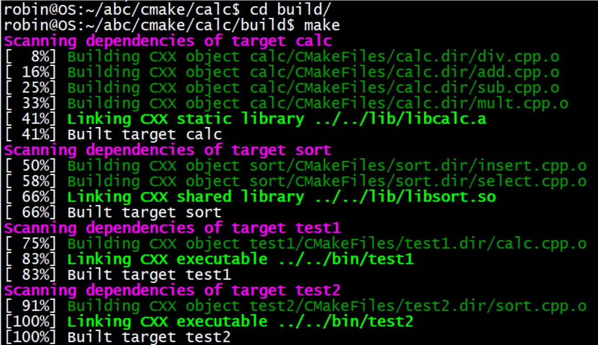

# [CMake入门](https://subingwen.cn/cmake/CMake-primer/#2-1-1-%E5%85%B1%E5%A4%84%E4%B8%80%E5%AE%A4) 

## 1. CMake概述

+ CMake 是一个项目构建工具，并且是跨平台的。关于项目构建我们所熟知的还有Makefile（通过 make 命令进行项目的构建），大多是IDE软件都集成了make，比如：VS 的 nmake、linux 下的 GNU make、Qt 的 qmake等，如果自己动手写 makefile，会发现，makefile 通常依赖于当前的编译平台，而且编写 makefile 的工作量比较大，解决依赖关系时也容易出错。

+ 而 CMake 恰好能解决上述问题， 其允许开发者指定整个工程的编译流程，在根据编译平台，自动生成本地化的Makefile和工程文件，最后用户只需make编译即可，所以可以把CMake看成一款自动生成 Makefile的工具.

  
  + 蓝色虚线表示使用makefile构建项目的过程
  + 红色实线表示使用cmake构建项目的过程

+ 优点：

  + 跨平台
  + 能够管理大型项目
  + 简化编译构建过程和编译过程
  + 可扩展：可以为 cmake 编写特定功能的模块，扩充 cmake 功能

## 2. CMake 的使用

> CMake支持大写、小写、混合大小写的命令。如果在编写`CMakeLists.txt`文件时使用的工具有对应的命令提示，那么大小写随缘即可，不要太过在意。

### 2.1 注释

<!-- tabs:start -->

#### **注释行**

> `CMake` 使用 `#` 进行行注释，可以放在任何位置。

```cmake
# 这是一个 CMakeLists.txt 文件
cmake_minimum_required(VERSION 3.0.0)
```

#### **注释块**

> `CMake` 使用 #[[ ]] 形式进行块注释。

```cmake
#[[ 这是一个 CMakeLists.txt 文件。
这是一个 CMakeLists.txt 文件
这是一个 CMakeLists.txt 文件]]
cmake_minimum_required(VERSION 3.0.0)
```

<!-- tabs:end -->

### 2.2 测试用例

1. 准备工作，为了方便测试，在我本地电脑准备了这么几个测试文件

> `add.c`

```c
#include <stdio.h>
#include "head.h"

int add(int a, int b)
{
    return a+b;
}
```

> `sub.c`

```c
#include <stdio.h>
#include "head.h"

// 你好
int subtract(int a, int b)
{
    return a-b;
}
```

> `mult.c`

```c
#include <stdio.h>
#include "head.h"

int multiply(int a, int b)
{
    return a*b;
}
```

> `div.c`

```c
#include <stdio.h>
#include "head.h"

double divide(int a, int b)
{
    return (double)a/b;
}
```

> `head.h`

```c
#ifndef _HEAD_H
#define _HEAD_H
// 加法
int add(int a, int b);
// 减法
int subtract(int a, int b);
// 乘法
int multiply(int a, int b);
// 除法
double divide(int a, int b);
#endif
```

> `main.c`

```c
#include <stdio.h>
#include "head.h"

int main()
{
    int a = 20;
    int b = 12;
    printf("a = %d, b = %d\n", a, b);
    printf("a + b = %d\n", add(a, b));
    printf("a - b = %d\n", subtract(a, b));
    printf("a * b = %d\n", multiply(a, b));
    printf("a / b = %f\n", divide(a, b));
    return 0;
}
```

2. 上述文件的目录结构如下

```txt
$ tree
.
├── add.c
├── div.c
├── head.h
├── main.c
├── mult.c
└── sub.c
```

3. 添加 `CMakeLists.txt` 文件

> 在上述源文件所在目录下添加一个新文件 CMakeLists.txt，文件内容如下：

```cmake
cmake_minimum_required(VERSION 3.0)
project(CALC)
add_executable(app add.c div.c main.c mult.c sub.c)
```

>  接下来依次介绍一下在 CMakeLists.txt 文件中添加的三个命令:

+ `cmake_minimum_required`：指定使用的 `cmake` 的最低版本
  + 可选，非必须，如果不加可能会有警告

+ `project`：定义工程名称，并可指定工程的版本、工程描述、web主页地址、支持的语言（默认情况支持所有语言），如果不需要这些都是可以忽略的，只需要指定出工程名字即可。

```cmake
# PROJECT 指令的语法是：
project(<PROJECT-NAME> [<language-name>...])
project(<PROJECT-NAME>
       [VERSION <major>[.<minor>[.<patch>[.<tweak>]]]]
       [DESCRIPTION <project-description-string>]
       [HOMEPAGE_URL <url-string>]
       [LANGUAGES <language-name>...])
```

> `add_executable`：定义工程会生成一个可执行程序

+ 这里的可执行程序名和`project`中的项目名没有任何关系
+ 源文件名可以是一个也可以是多个，如有多个可用`空格`或`;`间隔

```cmake
# 样式1
add_executable(app add.c div.c main.c mult.c sub.c)
# 样式2
add_executable(app add.c;div.c;main.c;mult.c;sub.c)
```

4. 执行`CMake`命令

> 将 CMakeLists.txt 文件编辑好之后，就可以执行 cmake命令了。

```cmake
# cmake 命令原型
$ cmake CMakeLists.txt文件所在路径
```

```txt
$ tree
.
├── add.c
├── CMakeLists.txt
├── div.c
├── head.h
├── main.c
├── mult.c
└── sub.c

0 directories, 7 files
robin@OS:~/Linux/3Day/calc$ cmake .
```

+ 当执行`cmake`命令之后，`CMakeLists.txt` 中的命令就会被执行，所以一定要注意给`cmake` 命令指定路径的时候一定不能出错。

+ 执行命令之后，看一下源文件所在目录中是否多了一些文件：

```txt
$ tree -L 1
.
├── add.c
├── CMakeCache.txt         # new add file
├── CMakeFiles             # new add dir
├── cmake_install.cmake    # new add file
├── CMakeLists.txt
├── div.c
├── head.h
├── main.c
├── Makefile               # new add file
├── mult.c
└── sub.c
```

> 我们可以看到在对应的目录下生成了一个`makefile`文件，此时再执行`make`命令，就可以对项目进行构建得到所需的可执行程序了。

```cmake
$ make
Scanning dependencies of target app
[ 16%] Building C object CMakeFiles/app.dir/add.c.o
[ 33%] Building C object CMakeFiles/app.dir/div.c.o
[ 50%] Building C object CMakeFiles/app.dir/main.c.o
[ 66%] Building C object CMakeFiles/app.dir/mult.c.o
[ 83%] Building C object CMakeFiles/app.dir/sub.c.o
[100%] Linking C executable app
[100%] Built target app

# 查看可执行程序是否已经生成
$ tree -L 1
.
├── add.c
├── app					# 生成的可执行程序
├── CMakeCache.txt
├── CMakeFiles
├── cmake_install.cmake
├── CMakeLists.txt
├── div.c
├── head.h
├── main.c
├── Makefile
├── mult.c
└── sub.c
```

> 最终可执行程序`app`就被编译出来了（这个名字是在`CMakeLists.txt`中指定的）。

### 2.3 构建`build`目录

+ 如果在`CMakeLists.txt`文件所在目录执行了`cmake`命令之后就会生成一些目录和文件（包括 `makefile` 文件），如果再基于`makefile`文件执行make命令，程序在编译过程中还会生成一些中间文件和一个可执行文件，这样会导致整个项目目录看起来很混乱，不太容易管理和维护，此时我们就可以把生成的这些与项目源码无关的文件统一放到一个对应的目录里边，比如将这个目录命名为`build`:

  ```cmake
  $ mkdir build
  $ cd build
  $ cmake ..
  -- The C compiler identification is GNU 5.4.0
  -- The CXX compiler identification is GNU 5.4.0
  -- Check for working C compiler: /usr/bin/cc
  -- Check for working C compiler: /usr/bin/cc -- works
  -- Detecting C compiler ABI info
  -- Detecting C compiler ABI info - done
  -- Detecting C compile features
  -- Detecting C compile features - done
  -- Check for working CXX compiler: /usr/bin/c++
  -- Check for working CXX compiler: /usr/bin/c++ -- works
  -- Detecting CXX compiler ABI info
  -- Detecting CXX compiler ABI info - done
  -- Detecting CXX compile features
  -- Detecting CXX compile features - done
  -- Configuring done
  -- Generating done
  -- Build files have been written to: /home/robin/Linux/build
  ```

  + 现在`cmake`命令是在`build`目录中执行的，但是`CMakeLists.txt`文件是`build`目录的上一级目录中，所以`cmake` 命令后指定的路径为`..`，即当前目录的上一级目录。

  + 当命令执行完毕之后，在`build`目录中会生成一个`makefile`文件

    ```txt
    $ tree build -L 1
    build
    ├── CMakeCache.txt
    ├── CMakeFiles
    ├── cmake_install.cmake
    └── Makefile
    
    1 directory, 3 files
    ```

> 这样就可以在`build`目录中执行`make`命令编译项目，生成的相关文件自然也就被存储到`build`目录中了。这样通过`cmake`和`make`生成的所有文件就全部和项目源文件隔离开了

### 2.4 `CMake`相关语法

<!-- tabs:start -->

#### **定义变量**

> 在上面的例子中一共提供了5个源文件，假设这五个源文件需要反复被使用，每次都直接将它们的名字写出来确实是很麻烦，此时我们就需要定义一个变量，将文件名对应的字符串存储起来，在`cmake`里定义变量需要使用`set`。

```cmake
# SET 指令的语法是：
# [] 中的参数为可选项, 如不需要可以不写
SET(VAR [VALUE] [CACHE TYPE DOCSTRING [FORCE]])
```

> + VAR：变量名
> + VALUE：变量值

```cmake
# 方式1: 各个源文件之间使用空格间隔
# set(SRC_LIST add.c  div.c   main.c  mult.c  sub.c)

# 方式2: 各个源文件之间使用分号 ; 间隔
set(SRC_LIST add.c;div.c;main.c;mult.c;sub.c)
add_executable(app  ${SRC_LIST})
```

#### **指定使用的C++标准**

> 在编写C+`+`程序的时候，可能会用到`C++11、C++14、C++17、C++20`等新特性，那么就需要在编译的时候在编译命令中制定出要使用哪个标准：

```shell
$ g++ *.cpp -std=c++11 -o app
```

> 上面的例子中通过参数`-std=c++11`指定出要使用`c++11`标准编译程序，`C++`标准对应有一宏叫做`DCMAKE_CXX_STANDARD`。在`CMake`中想要指定`C++`标准有两种方式：

1. **在 `CMakeLists.txt` 中通过 `set` 命令指定**

```cmake
#增加-std=c++11
set(CMAKE_CXX_STANDARD 11)
#增加-std=c++14
set(CMAKE_CXX_STANDARD 14)
#增加-std=c++17
set(CMAKE_CXX_STANDARD 17)
```

2. 在执行 `cmake` 命令的时候指定出这个宏的值

```shell
#增加-std=c++11
cmake CMakeLists.txt文件路径 -DCMAKE_CXX_STANDARD=11
#增加-std=c++14
cmake CMakeLists.txt文件路径 -DCMAKE_CXX_STANDARD=14
#增加-std=c++17
cmake CMakeLists.txt文件路径 -DCMAKE_CXX_STANDARD=17
```

####  **指定输出的路径**

> 在`CMake`中指定可执行程序输出的路径，也对应一个宏，叫做`EXECUTABLE_OUTPUT_PATH`，它的值还是通过`set`命令进行设置:

```cmake
set(HOME /home/robin/Linux/Sort)
set(EXECUTABLE_OUTPUT_PATH ${HOME}/bin)
```

+ 第一行：定义一个变量用于存储一个绝对路径
+ 第二行：将拼接好的路径值设置给`EXECUTABLE_OUTPUT_PATH`宏
  + 如果这个路径中的**子目录不存在，会自动生成，无需自己手动创建**
+ **由于可执行程序是基于 `cmake` 命令生成的 `makefile` 文件然后再执行 `make` 命令得到的，所以如果此处指定可执行程序生成路径的时候使用的是相对路径 `./xxx/xxx`，那么这个路径中的 `./` 对应的就是 `makefile` 文件所在的那个目录。**

#### **搜索文件**

+ 如果一个项目里边的源文件很多，在编写`CMakeLists.txt`文件的时候不可能将项目目录的各个文件一一罗列出来，这样太麻烦也不现实。所以，在`CMake`中为我们提供了搜索文件的命令，可以使用`aux_source_directory`命令或者`file`命令。

1. ***方式一***

>  在 `CMake` 中使用`aux_source_directory` 命令可以查找某个路径下的**所有源文件**，命令格式为：

```cmake
aux_source_directory(< dir > < variable >)
```

+ `dir`：要搜索的目录
+ `variable`：将从`dir`目录下搜索到的源文件列表存储到该变量中

```cmake
cmake_minimum_required(VERSION 3.0)
project(CALC)
#[[默认情况下，include_directories命令会将目录添加到列表最后，可以通过命令设置CMAKE_INCLUDE_DIRECTORIES_BEFORE变量为ON来改变它默认行为，将目录添加到列表前面。也可以在每次调用include_directories命令时使用AFTER或BEFORE选项来指定是添加到列表的前面或者后面。如果使用SYSTEM选项，会把指定目录当成系统的搜索目录。该命令作用范围只在当前的CMakeLists.txt。]]
include_directories(${PROJECT_SOURCE_DIR}/include) #将指定目录添加到编译器的头文件搜索路径之下，指定的目录被解释成当前源码路径的相对路径。
# 搜索 src 目录下的源文件
aux_source_directory(${CMAKE_CURRENT_SOURCE_DIR}/src SRC_LIST)
add_executable(app  ${SRC_LIST})
```

2. ***方式二***’

+ 如果一个项目里边的源文件很多，在编写`CMakeLists.txt`文件的时候不可能将项目目录的各个文件一一罗列出来，这样太麻烦了。所以，在`CMake`中为我们提供了搜索文件的命令，他就是`file`（当然，除了搜索以外通过 `file` 还可以做其他事情）。

```cmake
file(GLOB/GLOB_RECURSE 变量名 要搜索的文件路径和文件类型)
```

> + `GLOB`: 将指定目录下搜索到的满足条件的所有文件名生成一个列表，并将其存储到变量中。
> + `GLOB_RECURSE`：递归搜索指定目录，将搜索到的满足条件的文件名生成一个列表，并将其存储到变量中。

**搜索当前目录的`src`目录下所有的源文件，并存储到变量中**

+ `CMAKE_CURRENT_SOURCE_DIR` 宏表示当前访问的 `CMakeLists.txt` 文件所在的路径。
+ 关于要搜索的文件路径和类型可加双引号，也可不加:

```cmake
file(GLOB MAIN_HEAD "${CMAKE_CURRENT_SOURCE_DIR}/src/*.h")
```

#### **包含`头`文件**

+ 在编译项目源文件的时候，很多时候都需要将源文件对应的头文件路径指定出来，这样才能保证在编译过程中编译器能够找到这些头文件，并顺利通过编译。在`CMake`中设置要包含的目录也很简单，通过一个命令就可以搞定了，他就是`include_directories`:

```cmake
include_directories(headpath)
```

> 举例说明，有源文件若干，其目录结构如下：

```c++
$ tree
.
├── build
├── CMakeLists.txt
├── include
│   └── head.h
└── src
    ├── add.cpp
    ├── div.cpp
    ├── main.cpp
    ├── mult.cpp
    └── sub.cpp

3 directories, 7 files
```

> `CMakeLists.txt`文件内容如下:

```cmake
cmake_minimum_required(VERSION 3.0)
project(CALC)
set(CMAKE_CXX_STANDARD 11)
set(HOME /home/robin/Linux/calc)
set(EXECUTABLE_OUTPUT_PATH ${HOME}/bin/)
include_directories(${PROJECT_SOURCE_DIR}/include)
file(GLOB SRC_LIST ${CMAKE_CURRENT_SOURCE_DIR}/src/*.cpp)
add_executable(app  ${SRC_LIST})
```

+ 其中，第六行指定就是头文件的路径，`PROJECT_SOURCE_DIR`宏对应的值就是我们在使用`cmake`命令时，后面紧跟的目录，一般是工程的根目录。

<!-- tabs:end -->

###  2.5 制作动态库或静态库

+ 有些时候我们编写的源代码并不需要将他们编译生成可执行程序，而是生成一些静态库或动态库提供给第三方使用

<!-- tabs:start -->

#### **制作静态库**

```cmake
add_library(库名称 STATIC 源文件1 [源文件2] ...) 
```

> + 在Linux中，静态库名字分为三部分：`lib`+库`名字`+`.a`，此处只需要指定出库的名字就可以了，另外两部分在生成该文件的时候会自动填充。
>
> + 在Windows中虽然库名和Linux格式不同，但也只需指定出名字即可。

+ 下面有一个目录，需要将`src`目录中的源文件编译成静态库，然后再使用：

```shell
.
├── build
├── CMakeLists.txt
├── include           # 头文件目录
│   └── head.h
├── main.cpp          # 用于测试的源文件
└── src               # 源文件目录
    ├── add.cpp
    ├── div.cpp
    ├── mult.cpp
    └── sub.cpp
```

> 根据上面的目录结构，可以这样编写`CMakeLists.txt`文件:

```cmake
cmake_minimum_required(VERSION 3.0)
project(CALC)
include_directories(${PROJECT_SOURCE_DIR}/include)
file(GLOB SRC_LIST "${CMAKE_CURRENT_SOURCE_DIR}/src/*.cpp")
add_library(calc STATIC ${SRC_LIST})
```

> 这样最终就会生成对应的静态库文件`libcalc.a`。

#### **制作动态库**

> 在`cmake`中，如果要制作动态库，需要使用的命令如下:

```cmake
add_library(库名称 SHARED 源文件1 [源文件2] ...) 
```

> + 在Linux中，动态库名字分为三部分：`lib`+`库名字`+`.so`，此处只需要指定出库的名字就可以了，另外两部分在生成该文件的时候会自动填充。
>
> 在Windows中虽然库名和Linux格式不同，但也只需指定出名字即可。

+ 根据上面的目录结构，可以这样编写`CMakeLists.txt`文件:

```cmake
cmake_minimum_required(VERSION 3.0)
project(CALC)
include_directories(${PROJECT_SOURCE_DIR}/include)
file(GLOB SRC_LIST "${CMAKE_CURRENT_SOURCE_DIR}/src/*.cpp")
add_library(calc SHARED ${SRC_LIST})
```

> 这样最终就会生成对应的动态库文件`libcalc.so`。

#### **指定输出的路径**

1.  ***方式1——适用于动态库***

+ 对于生成的库文件来说和可执行程序一样都可以指定输出路径。**由于在Linux下生成的动态库默认是有执行权限的，所以可以按照生成可执行程序的方式去指定它生成的目录**：

```cmake
cmake_minimum_required(VERSION 3.0)
project(CALC)
include_directories(${PROJECT_SOURCE_DIR}/include)
file(GLOB SRC_LIST "${CMAKE_CURRENT_SOURCE_DIR}/src/*.cpp")
# 设置动态库生成路径
set(EXECUTABLE_OUTPUT_PATH ${PROJECT_SOURCE_DIR}/lib)
add_library(calc SHARED ${SRC_LIST})
```

> 对于这种方式来说，其实就是通过`set`命令给`EXECUTABLE_OUTPUT_PATH`宏设置了一个路径，这个路径就是可执行文件生成的路径。

2. ***方式2 —— 都适用***

+ 由于在`Linux`下生成的静态库默认不具有可执行权限，所以在指定静态库生成的路径的时候就不能使用`EXECUTABLE_OUTPUT_PATH`宏了，而应该使用`LIBRARY_OUTPUT_PATH`，这个宏对应静态库文件和动态库文件都适用。

```cmake
cmake_minimum_required(VERSION 3.0)
project(CALC)
include_directories(${PROJECT_SOURCE_DIR}/include)
file(GLOB SRC_LIST "${CMAKE_CURRENT_SOURCE_DIR}/src/*.cpp")
# 设置动态库/静态库生成路径
set(LIBRARY_OUTPUT_PATH ${PROJECT_SOURCE_DIR}/lib)
# 生成动态库
#add_library(calc SHARED ${SRC_LIST})
# 生成静态库
add_library(calc STATIC ${SRC_LIST})
```

<!-- tabs:end -->

### 2.6 包含`库`文件

> 在编写程序的过程中，可能会用到一些系统提供的动态库或者自己制作出的动态库或者静态库文件，cmake中也为我们提供了相关的加载动态库的命令。

<!-- tabs:start -->

#### **链接静态库**

```shell
src
├── add.cpp
├── div.cpp
├── main.cpp
├── mult.cpp
└── sub.cpp
```

>  现在我们把上面src目录中的`add.cpp、div.cpp、mult.cpp、sub.cpp`编译成一个静态库文件libcalc.a。
>
> [通过命令制作并使用静态链接库](https://subingwen.cn/linux/library/#1-1-%E7%94%9F%E6%88%90%E9%9D%99%E6%80%81%E9%93%BE%E6%8E%A5%E5%BA%93)

+ 测试目录结构如下：

```shell
$ tree 
.
├── build
├── CMakeLists.txt
├── include
│   └── head.h
├── lib
│   └── libcalc.a     # 制作出的静态库的名字
└── src
    └── main.cpp

4 directories, 4 files
```

> 在cmake中，链接静态库的命令如下：

```cmake
link_libraries(<static lib> [<static lib>...])
```

+ 参数1：指定出要链接的静态库的名字
  + 可以是全名 `libxxx.a`
  + 也可以是掐头（`lib`）去尾（`.a`）之后的名字 `xxx`
+ 参数2-N：要链接的其它静态库的名字

> 如果该静态库不是系统提供的（自己制作或者使用第三方提供的静态库）可能出现静态库找不到的情况，此时可以将静态库的路径也指定出来：

```cmake
link_directories(<lib path>)
```

> 这样，修改之后的`CMakeLists.txt`文件内容如下:

```cmake
cmake_minimum_required(VERSION 3.0)
project(CALC)
# 搜索指定目录下源文件
file(GLOB SRC_LIST ${CMAKE_CURRENT_SOURCE_DIR}/src/*.cpp)
# 包含头文件路径
include_directories(${PROJECT_SOURCE_DIR}/include)
# 包含静态库路径
link_directories(${PROJECT_SOURCE_DIR}/lib)
# 链接静态库
link_libraries(calc)
add_executable(app ${SRC_LIST})
```

> 添加了第8行的代码，就可以根据参数指定的路径找到这个静态库了。

#### **链接动态库**

> 在程序编写过程中，除了在项目中引入静态库，好多时候也会使用一些标准的或者第三方提供的一些动态库，关于动态库的制作、使用以及在内存中的加载方式和静态库都是不同的，在此不再过多赘述，如有疑惑请参考

[Linux 静态库和动态库](https://subingwen.cn/linux/library/)

> 在`cmake`中链接动态库的命令如下:

```cmake
target_link_libraries(
    <target> 
    <PRIVATE|PUBLIC|INTERFACE> <item>... 
    [<PRIVATE|PUBLIC|INTERFACE> <item>...]...)
```

+ **target**：指定要加载动态库的文件的名字

  + 该文件可能是一个源文件
  + 该文件可能是一个动态库文件
  + 该文件可能是一个可执行文件

+ **PRIVATE|PUBLIC|INTERFACE**：动态库的访问权限，默认为`PUBLIC`

  + 如果各个动态库之间没有依赖关系，无需做任何设置，三者没有没有区别，**一般无需指定，使用默认的 `PUBLIC` 即可**。
  + **动态库的链接具有传递性**，如果动态库 A 链接了动态库B、C，动态库D链接了动态库A，此时动态库D相当于也链接了动态库B、C，并可以使用动态库B、C中定义的方法。

  ```cmake
  target_link_libraries(A B C)
  target_link_libraries(D A)
  ```

  + `PUBLIC`：在`public`后面的库会被`Link`到前面的`target`中，并且里面的符号也会被导出，提供给第三方使用。
  + `PRIVATE`：在`private`后面的库仅被`link`到前面的`target`中，并且终结掉，第三方不能感知你调了啥库
  + `INTERFACE`：在`interface`后面引入的库不会被链接到前面的`target`中，只会导出符号。

#### **链接系统动态库**

+ 动态库的链接和静态库是完全不同的：
  + **静态库会在生成可执行程序的链接阶段被打包到可执行程序中，所以可执行程序启动，静态库就被加载到内存中了。**
  + **动态库在生成可执行程序的链接阶段不会被打包到可执行程序中，当可执行程序被启动并且调用了动态库中的函数的时候，动态库才会被加载到内存**
+ 因此，***在`cmake`中指定要链接的动态库的时候，应该将命令写到生成了可执行文件之后***：

```cmake
cmake_minimum_required(VERSION 3.0)
project(TEST)
file(GLOB SRC_LIST ${CMAKE_CURRENT_SOURCE_DIR}/*.cpp)
# 添加并指定最终生成的可执行程序名
add_executable(app ${SRC_LIST})
# 指定可执行程序要链接的动态库名字
target_link_libraries(app pthread)
```

+ 在`target_link_libraries(app pthread)`中：
+ `app`: 对应的是最终生成的可执行程序的名字
+ `pthread`：这是可执行程序要加载的动态库，这个库是系统提供的线程库，全名为`libpthread.so`，在指定的时候一般会掐头（`lib`）去尾（`.so`）。

#### **链接第三方动态库**

> 现在，自己生成了一个动态库，对应的目录结构如下：

```shell
$ tree 
.
├── build
├── CMakeLists.txt
├── include
│   └── head.h            # 动态库对应的头文件
├── lib
│   └── libcalc.so        # 自己制作的动态库文件
└── main.cpp              # 测试用的源文件

3 directories, 4 files
```

+ 假设在测试文件`main.cpp`中既使用了自己制作的动态库`libcalc.so`又使用了系统提供的线程库，此时`CMakeLists.txt`文件可以这样写：

```cmake
cmake_minimum_required(VERSION 3.0)
project(TEST)
file(GLOB SRC_LIST ${CMAKE_CURRENT_SOURCE_DIR}/*.cpp)
include_directories(${PROJECT_SOURCE_DIR}/include)
add_executable(app ${SRC_LIST})
target_link_libraries(app pthread calc)
```

> 在**第六行**中，`pthread`、`calc`都是可执行程序app要链接的动态库的名字。当可执行程序`app`生成之后并执行该文件，会提示有如下错误信息：

```shell
$ ./app 
./app: error while loading shared libraries: libcalc.so: cannot open shared object file: No such file or directory
```

> + 这是因为可执行程序启动之后，去加载calc这个动态库，但是不知道这个动态库被放到了什么位置
> + [解决动态库无法加载的问题](https://subingwen.cn/linux/library/#2-4-1-%E5%BA%93%E7%9A%84%E5%B7%A5%E4%BD%9C%E5%8E%9F%E7%90%86)，
> + 所以就加载失败了，在 CMake 中可以在生成可执行程序之前，**通过命令指定出要链接的动态库的位置，指定静态库位置使用的也是这个命令：**

```cmake
link_directories(path)
```

> 所以修改之后的`CMakeLists.txt`文件应该是这样的：

```cmake
cmake_minimum_required(VERSION 3.0)
project(TEST)
file(GLOB SRC_LIST ${CMAKE_CURRENT_SOURCE_DIR}/*.cpp)
# 指定源文件或者动态库对应的头文件路径
include_directories(${PROJECT_SOURCE_DIR}/include)
# 指定要链接的动态库的路径
link_directories(${PROJECT_SOURCE_DIR}/lib)
# 添加并生成一个可执行程序
add_executable(app ${SRC_LIST})
# 指定要链接的动态库
target_link_libraries(app pthread calc)
```

+ 通过`link_directories`指定了动态库的路径之后，在执行生成的可执行程序的时候，就不会出现找不到动态库的问题了。

>  温馨提示：使用 `target_link_libraries` 命令就可以链接动态库，也可以链接静态库文件。

<!-- tabs:end -->

### 2.7 日志

+ 在`CMake`中可以用用户显示一条消息，该命令的名字为`message`：

```cmake
message([STATUS|WARNING|AUTHOR_WARNING|FATAL_ERROR|SEND_ERROR] "message to display" ...)
```

+ `(无)` ：重要消息
+ `STATUS` ：非重要消息
+ `WARNING：CMake` 警告, 会继续执行
+ `AUTHOR_WARNING：CMake` 警告 (`dev`), 会继续执行
+ `SEND_ERROR：CMake` 错误, 继续执行，但是会跳过生成的步骤
+ `FATAL_ERROR：CMake` 错误, 终止所有处理过程

> `CMake`的命令行工具会在`stdout`上显示`STATUS`消息，在`stderr`上显示其他所有消息。`CMake`的`GUI`会在它的`log`区域显示所有消息。

CMake警告和错误消息的文本显示使用的是一种简单的标记语言。文本没有缩进，超过长度的行会回卷，段落之间以新行做为分隔符。

```cmake
# 输出一般日志信息
message(STATUS "source path: ${PROJECT_SOURCE_DIR}")
# 输出警告信息
message(WARNING "source path: ${PROJECT_SOURCE_DIR}")
# 输出错误信息
message(FATAL_ERROR "source path: ${PROJECT_SOURCE_DIR}")
```

### 2.8 变量操作

#### 2.8.1 追加

+ 有时候项目中的源文件并不一定都在同一个目录中，但是这些源文件最终却需要一起进行编译来生成最终的可执行文件或者库文件。如果我们通过`file`命令对各个目录下的源文件进行搜索，最后还需要做一个字符串拼接的操作，关于字符串拼接可以使用`set`命令也可以使用`list`命令。


<!-- tabs:start -->

#### **使用 `set`拼接**

> 如果使用`set`进行字符串拼接，对应的命令格式如下：

```cmake
set(变量名1 ${变量名1} ${变量名2} ...)
```

+ 关于上面的命令其实就是将从第二个参数开始往后所有的字符串进行拼接，最后将结果存储到第一个参数中，如果第一个参数中原来有数据会对原数据就行覆盖。

```cmake
cmake_minimum_required(VERSION 3.0)
project(TEST)
set(TEMP "hello,world")
file(GLOB SRC_1 ${PROJECT_SOURCE_DIR}/src1/*.cpp)
file(GLOB SRC_2 ${PROJECT_SOURCE_DIR}/src2/*.cpp)
# 追加(拼接)
set(SRC_1 ${SRC_1} ${SRC_2} ${TEMP})
message(STATUS "message: ${SRC_1}")
```

#### **使用 `list`拼接**

> 如果使用`list`进行字符串拼接，对应的命令格式如下：

```cmake
list(APPEND <list> [<element> ...])
```

> `list`命令的功能比`set`要强大，字符串拼接只是它的其中一个功能，所以需要在它第一个参数的位置指定出我们要做的操作，`APPEND`表示进行数据`追加`，后边的参数和`set`就一样了。

```cmake
cmake_minimum_required(VERSION 3.0)
project(TEST)
set(TEMP "hello,world")
file(GLOB SRC_1 ${PROJECT_SOURCE_DIR}/src1/*.cpp)
file(GLOB SRC_2 ${PROJECT_SOURCE_DIR}/src2/*.cpp)
# 追加(拼接)
list(APPEND SRC_1 ${SRC_1} ${SRC_2} ${TEMP})
message(STATUS "message: ${SRC_1}")
```

> 在`CMake`中，使用`set`命令可以创建一个`list`。一个在`list`内部是一个由`分号;`分割的一组字符串。例如，`set(var a b c d e)`命令将会创建一个list:a;b;c;d;e，但是最终打印变量值的时候得到的是`abcde`。

```cmake
set(tmp1 a;b;c;d;e)
set(tmp2 a b c d e)
message(${tmp1})
message(${tmp2})
```

+ 输出的结果:

```shell
abcde
abcde
```

#### 2.8.2 字符串移除

+ 我们在通过`file`搜索某个目录就得到了该目录下所有的源文件，但是其中有些源文件并不是我们所需要的，比如

```shell
$ tree
.
├── add.cpp
├── div.cpp
├── main.cpp
├── mult.cpp
└── sub.cpp

0 directories, 5 files
```

+ 在当前这么目录有五个源文件，其中`main.cpp`是一个测试文件。如果我们想要把计算器相关的源文件生成一个动态库给别人使用，那么只需要`add.cpp、div.cp、mult.cpp、sub.cpp`这四个源文件就可以了。此时，就需要将`main.cpp`从搜索到的数据中剔除出去，想要实现这个功能，也可以使用`list`

```cmake
list(REMOVE_ITEM <list> <value> [<value> ...])
```

> 通过上面的命令原型可以看到删除和追加数据类似，只不过是第一个参数变成了`REMOVE_ITEM`。

```cmake
cmake_minimum_required(VERSION 3.0)
project(TEST)
set(TEMP "hello,world")
file(GLOB SRC_1 ${PROJECT_SOURCE_DIR}/*.cpp)
# 移除前日志
message(STATUS "message: ${SRC_1}")
# 移除 main.cpp
list(REMOVE_ITEM SRC_1 ${PROJECT_SOURCE_DIR}/main.cpp)
# 移除后日志
message(STATUS "message: ${SRC_1}")
```

+ 可以看到，在`第8行`把将要移除的文件的名字指定给`list`就可以了。但是一定要注意***通过 `file` 命令搜索源文件的时候得到的是文件的绝对路径（在`list`中每个文件对应的路径都是一个`item`，并且都是绝对路径），那么在移除的时候也要将该文件的绝对路径指定出来才可以，否是移除操作不会成功。***

关于`list`命令还有其它功能，但是并不常用，在此就不一一进行举例介绍了。

1. 获取 `list` 的长度

```cmake
list(LENGTH <list> <output variable>)
```

+ `LENGTH`：子命令`LENGTH`用于读取列表长度
+ `<list>`：当前操作的列表
+ `<output variable>`：新创建的变量，用于存储列表的长度。

2. 读取列表中指定索引的的元素，可以指定多个索引

```cmake
list(GET <list> <element index> [<element index> ...] <output variable>)
```

+ `<list>`：当前操作的列表
+ `<element index>`：列表元素的索引
  + 从0开始编号，索引0的元素为列表中的第一个元素；
  + 索引也可以是负数，-1表示列表的最后一个元素，-2表示列表倒数第二个元素，以此类推
  + 当索引（不管是正还是负）超过列表的长度，运行会报错
+ `<output variable>`：新创建的变量，存储指定索引元素的返回结果，也是一个列表。

3. 将列表中的元素用连接符（字符串）连接起来组成一个字符串

```cmake
list (JOIN <list> <glue> <output variable>)
```

+ `<list>`：当前操作的列表
+ `<glue>`：指定的连接符（字符串）
+ `<output variable>`：新创建的变量，存储返回的字符串

4. 查找列表是否存在指定的元素，若果未找到，返回-1

```cmake
list(FIND <list> <value> <output variable>)
```

+ `<list>`：当前操作的列表
+ `<value>`：需要再列表中搜索的元素
+ `<output variable>`：新创建的变量
  + 如果列表`<list>`中存在`<value>`，那么返回`<value>`在列表中的索引
  + 如果未找到则返回-1。

5. 将元素追加到列表中

```cmake
list (APPEND <list> [<element> ...])
```

6. 在list中指定的位置插入若干元素

```cm
list(INSERT <list> <element_index> <element> [<element> ...])
```

7. 将元素插入到列表的0索引位置

```cm
list (PREPEND <list> [<element> ...])
```

8. 将列表中最后元素移除

```cm
list (POP_BACK <list> [<out-var>...])
```

9. 将列表中第一个元素移除

```cm
list (POP_FRONT <list> [<out-var>...])
```

10. 将指定的元素从列表中移除

```cm
list (REMOVE_ITEM <list> <value> [<value> ...])
```

11. 将指定索引的元素从列表中移除

```cm
list (REMOVE_AT <list> <index> [<index> ...])
```

12. 移除列表中的重复元素

```cm
list (REMOVE_DUPLICATES <list>)
```

13. 列表翻转

```cm
list(REVERSE <list>)
```

14. 列表排序

```cm
list (SORT <list> [COMPARE <compare>] [CASE <case>] [ORDER <order>])
```

+ `COMPARE`：指定排序方法。有如下几种值可选：
  + `STRING`:按照字母顺序进行排序，为默认的排序方法
  + `FILE_BASENAME`：如果是一系列路径名，会使用`basename`进行排序
  + `NATURAL`：使用自然数顺序排序
+ `CASE`：指明是否大小写敏感。有如下几种值可选：
  + `SENSITIVE`: 按照大小写敏感的方式进行排序，为默认值
  + `INSENSITIVE`：按照大小写不敏感方式进行排序
+ `ORDER`：指明排序的顺序。有如下几种值可选：
  + `ASCENDING`:按照升序排列，为默认值
  + `DESCENDING`：按照降序排列

<!-- tabs:end -->

### 2.9 宏定义

> 在进行程序测试的时候，我们可以在代码中添加一些宏定义，通过这些宏来控制这些代码是否生效，如下所示：

```c++
#include <stdio.h>
#define NUMBER  3

int main()
{
    int a = 10;
#ifdef DEBUG
    printf("我是一个程序猿, 我不会爬树...\n");
#endif
    for(int i=0; i<NUMBER; ++i)
    {
        printf("hello, GCC!!!\n");
    }
    return 0;
}
```

+ 在程序的第七行对`DEBUG`宏进行了判断，如果该宏被定义了，那么第八行就会进行日志输出，如果没有定义这个宏，第八行就相当于被注释掉了，因此最终无法看到日志输入出（**上述代码中并没有定义这个宏**）。
+ 为了让测试更灵活，我们可以不在代码中定义这个宏，而是在测试的时候去把它定义出来，其中一种方式就是在`gcc/g++命令`中去指定，如下：

```shell
$ gcc test.c -DDEBUG -o app
```

+ 在`gcc/g++`命令中通过参数 `-D`指定出要定义的宏的名字，这样就相当于在代码中定义了一个宏，其名字为`DEBUG`。
+ 在CMake中我们也可以做类似的事情，对应的命令叫做`add_definitions`:

```cmake
add_definitions(-D宏名称)
```

> 针对于上面的源文件编写一个`CMakeLists.txt`，内容如下：

```cmake
cmake_minimum_required(VERSION 3.0)
project(TEST)
# 自定义 DEBUG 宏
add_definitions(-DDEBUG)
add_executable(app ./test.c)
```

> 通过这种方式，上述代码中的第八行日志就能够被输出出来了。

## 3. 预定义宏

|             宏             |                             功能                             |
| :------------------------: | :----------------------------------------------------------: |
|    `PROJECT_SOURCE_DIR`    |       使用`cmake`命令后紧跟的目录，一般是工程的根目录        |
|    `PROJECT_BINARY_DIR`    |                    执行`cmake`命令的目录                     |
| `CMAKE_CURRENT_SOURCE_DIR` |             当前处理的`CMakeLists.txt`所在的路径             |
| `CMAKE_CURRENT_BINARY_DIR` |                      `target` 编译目录                       |
|  `EXECUTABLE_OUTPUT_PATH`  |            重新定义目标二进制可执行文件的存放位置            |
|   `LIBRARY_OUTPUT_PATH`    |               重新定义目标链接库文件的存放位置               |
|       `PROJECT_NAME`       |             返回通过`PROJECT`指令定义的项目名称              |
|     `CMAKE_BINARY_DIR`     | 项目实际构建路径，假设在`build`目录进行的构建，那么得到的就是这个目录的路径 |

# [CMake 进阶](https://subingwen.cn/cmake/CMake-advanced/)

## 1. 嵌套的CMake

+ 如果项目很大，或者项目中有很多的源码目录，在通过`CMake`管理项目的时候如果只使用一个`CMakeLists.txt`，那么这个文件相对会比较复杂，有一种化繁为简的方式就是给每个源码目录都添加一个`CMakeLists.txt`文件（头文件目录不需要），这样每个文件都不会太复杂，而且更灵活，更容易维护。
+ 先来看一下下面的这个的目录结构：

```shell
$ tree
.
├── build
├── calc
│   ├── add.cpp
│   ├── CMakeLists.txt
│   ├── div.cpp
│   ├── mult.cpp
│   └── sub.cpp
├── CMakeLists.txt
├── include
│   ├── calc.h
│   └── sort.h
├── sort
│   ├── CMakeLists.txt
│   ├── insert.cpp
│   └── select.cpp
├── test1
│   ├── calc.cpp
│   └── CMakeLists.txt
└── test2
    ├── CMakeLists.txt
    └── sort.cpp

6 directories, 15 files
```

+ `include` 目录：头文件目录

+ `calc` 目录：目录中的四个源文件对应的加、减、乘、除算法
  + 对应的头文件是`include`中的`calc.h`

+ `sort` 目录 ：目录中的两个源文件对应的是插入排序和选择排序算法
  + 对应的头文件是`include`中的sort.h

+ `test1` 目录：测试目录，对加、减、乘、除算法进行测试

+ `test2` 目录：测试目录，对排序算法进行测试

可以看到各个源文件目录所需要的`CMakeLists.txt`文件现在已经添加完毕了。接下来庖丁解牛，我们依次分析一下各个文件中需要添加的内容。

### 1.1 准备工作

#### 1.1.1 节点关系

>  众所周知，Linux的目录是树状结构，所以`嵌套的 CMake 也是一个树状结构，最顶层的 CMakeLists.txt 是根节点，其次都是子节点`。因此，我们需要了解一些关于 `CMakeLists.txt` 文件变量作用域的一些信息：

+ 根节点`CMakeLists.txt`中的变量全局有效
+ 父节点`CMakeLists.txt`中的变量可以在子节点中使用
+ 子节点CMakeLists.txt中的变量只能在当前节点中使用

#### 1.1.2 添加子目录

+ 接下来我们还需要知道在 `CMake` 中父子节点之间的关系是如何建立的，这里需要用到一个 `CMake` 命令：

```cm
add_subdirectory(source_dir [binary_dir] [EXCLUDE_FROM_ALL])
```

+ `source_dir`：指定了`CMakeLists.txt`源文件和代码文件的位置，其实就是指定**子目录**
+ `binary_dir`：指定了输出文件的路径，一般不需要指定，忽略即可。
+ `EXCLUDE_FROM_ALL`：在子路径下的目标默认不会被包含到父路径的`ALL`目标里，并且也会被排除在IDE工程文件之外。用户必须显式构建在子路径下的目标。

通过这种方式`CMakeLists.txt`文件之间的父子关系就被构建出来了。

### 1.2 解决问题

在上面的目录中我们要做如下事情：

1. 通过 `test1` 目录中的测试文件进行计算器相关的测试

2. 通过 `test2` 目录中的测试文件进行排序相关的测试

现在相当于是要进行模块化测试，对于`calc`和`sort`目录中的源文件来说，可以将它们先编译成库文件（可以是静态库也可以是动态库）然后在提供给测试文件使用即可。库文件的本质其实还是代码，只不过是从文本格式变成了二进制格式。

<!-- tabs:start -->

#### **根目录**

> 根目录中的 `CMakeLists.txt`文件内容如下：

```cmake
cmake_minimum_required(VERSION 3.0)
project(test)
# 定义变量
# 静态库生成的路径
set(LIB_PATH ${CMAKE_CURRENT_SOURCE_DIR}/lib)
# 测试程序生成的路径
set(EXEC_PATH ${CMAKE_CURRENT_SOURCE_DIR}/bin)
# 头文件目录
set(HEAD_PATH ${CMAKE_CURRENT_SOURCE_DIR}/include)
# 静态库的名字
set(CALC_LIB calc)
set(SORT_LIB sort)
# 可执行程序的名字
set(APP_NAME_1 test1)
set(APP_NAME_2 test2)
# 添加子目录
add_subdirectory(calc)
add_subdirectory(sort)
add_subdirectory(test1)
add_subdirectory(test2)
```

+ 在根节点对应的文件中主要做了两件事情：定义全局变量和添加子目录。
  + 定义的全局变量主要是给子节点使用，目的是为了提高子节点中的`CMakeLists.txt`文件的可读性和可维护性，避免冗余并降低出差的概率。
  + 一共添加了四个子目录，每个子目录中都有一个`CMakeLists.txt`文件，这样它们的父子关系就被确定下来了。\

#### **calc 目录**

> `calc` 目录中的 `CMakeLists.txt`文件内容如下：

```cmake
cmake_minimum_required(VERSION 3.0)
project(CALCLIB)
aux_source_directory(./ SRC)
include_directories(${HEAD_PATH})
set(LIBRARY_OUTPUT_PATH ${LIB_PATH})
add_library(${CALC_LIB} STATIC ${SRC})
```

+ 第3行`aux_source_directory`：搜索当前目录（`calc`目录）下的所有源文件
+ 第4行`include_directories`：包含头文件路径，`HEAD_PATH`是在根节点文件中定义的
+ 第5行`set`：设置库的生成的路径，`LIB_PATH`是在根节点文件中定义的
+ 第6行`add_library`：生成静态库，静态库名字`CALC_LIB`是在根节点文件中定义的

#### **sort目录**

> `sort` 目录中的 `CMakeLists.txt`文件内容如下：

```cmake
cmake_minimum_required(VERSION 3.0)
project(SORTLIB)
aux_source_directory(./ SRC)
include_directories(${HEAD_PATH})
set(LIBRARY_OUTPUT_PATH ${LIB_PATH})
add_library(${SORT_LIB} SHARED ${SRC})
```

+ 第6行`add_library`：生成动态库，动态库名字`SORT_LIB`是在根节点文件中定义的
+ 这个文件中的内容和`calc`节点文件中的内容类似，只不过这次生成的是动态库。

>  在生成库文件的时候，这个库可以是静态库也可以是动态库，一般需要根据实际情况来确定。如果生成的库比较大，建议将其制作成动态库。

#### **test1 目录**

+ `test1` 目录中的 `CMakeLists.txt`文件内容如下：

```cmake
cmake_minimum_required(VERSION 3.0)
project(CALCTEST)
aux_source_directory(./ SRC)
include_directories(${HEAD_PATH})
link_directories(${LIB_PATH})
link_libraries(${CALC_LIB})
set(EXECUTABLE_OUTPUT_PATH ${EXEC_PATH})
add_executable(${APP_NAME_1} ${SRC})
```

+ 第4行`include_directories`：指定头文件路径，`HEAD_PATH`变量是在根节点文件中定义的
+ 第6行`link_libraries`：指定可执行程序要链接的静态库，`CALC_LIB`变量是在根节点文件中定义的
+ 第7行`set`：指定可执行程序生成的路径，`EXEC_PATH`变量是在根节点文件中定义的
+ 第8行`add_executable`：生成可执行程序，`APP_NAME_1`变量是在根节点文件中定义的

> 此处的可执行程序链接的是静态库，最终静态库会被打包到可执行程序中，可执行程序启动之后，静态库也就随之被加载到内存中了。

#### **test2 目录**

+ `test2` 目录中的 `CMakeLists.txt`文件内容如下：

```cmake
cmake_minimum_required(VERSION 3.0)
project(SORTTEST)
aux_source_directory(./ SRC)
include_directories(${HEAD_PATH})
set(EXECUTABLE_OUTPUT_PATH ${EXEC_PATH})
link_directories(${LIB_PATH})
add_executable(${APP_NAME_2} ${SRC})
target_link_libraries(${APP_NAME_2} ${SORT_LIB})
```

+ 第四行`include_directories`：包含头文件路径，`HEAD_PATH`变量是在根节点文件中定义的

+ 第五行`set`：指定可执行程序生成的路径，`EXEC_PATH`变量是在根节点文件中定义的

+ 第六行`link_directories`：指定可执行程序要链接的动态库的路径，`LIB_PATH`变量是在根节点文件中定义的

+ 第七行`add_executable`：生成可执行程序，`APP_NAME_2`变量是在根节点文件中定义的

+ 第八行`target_link_libraries`：指定可执行程序要链接的动态库的名字

  > 在生成可执行程序的时候，动态库不会被打包到可执行程序内部。当可执行程序启动之后动态库也不会被加载到内存，**只有可执行程序调用了动态库中的函数的时候，动态库才会被加载到内存中**，且多个进程可以共用内存中的同一个动态库，所以动态库又叫共享库。

#### **构建项目**

+ 一切准备就绪之后，开始构建项目，进入到根节点目录的`build` 目录中，执行`cmake` 命令，如下:

```shell
$ cmake ..
-- The C compiler identification is GNU 5.4.0
-- The CXX compiler identification is GNU 5.4.0
-- Check for working C compiler: /usr/bin/cc
-- Check for working C compiler: /usr/bin/cc -- works
-- Detecting C compiler ABI info
-- Detecting C compiler ABI info - done
-- Detecting C compile features
-- Detecting C compile features - done
-- Check for working CXX compiler: /usr/bin/c++
-- Check for working CXX compiler: /usr/bin/c++ -- works
-- Detecting CXX compiler ABI info
-- Detecting CXX compiler ABI info - done
-- Detecting CXX compile features
-- Detecting CXX compile features - done
-- Configuring done
-- Generating done
-- Build files have been written to: /home/robin/abc/cmake/calc/build
```

> 可以看到在build目录中生成了一些文件和目录，如下所示：

```shell
$ tree build -L 1     
build
├── calc                  # 目录
├── CMakeCache.txt        # 文件
├── CMakeFiles            # 目录
├── cmake_install.cmake   # 文件
├── Makefile              # 文件
├── sort                  # 目录
├── test1                 # 目录
└── test2                 # 目录
```

> 然后在`build` 目录下执行`make` 命令:



> 通过上图可以得到如下信息：

1. 在项目根目录的`lib`目录中生成了静态库`libcalc.a`
2. 在项目根目录的`lib`目录中生成了动态库`libsort.so`
3. 在项目根目录的`bin`目录中生成了可执行程序`test1`
4. 在项目根目录的`bin`目录中生成了可执行程序`test2`

>  最后再来看一下上面提到的这些文件是否真的被生成到对应的目录中了:

```shell
$ tree bin/ lib/
bin/
├── test1
└── test2
lib/
├── libcalc.a
└── libsort.so
```

> 在项目中，如果将程序中的某个模块制作成了动态库或者静态库并且在`CMakeLists.txt` 中指定了库的输出目录，而后其它模块又需要加载这个生成的库文件，此时直接使用就可以了，如果没有指定库的输出路径或者需要直接加载外部提供的库文件，此时就需要使用 `link_directories` 将库文件路径指定出来.

<!-- tabs:end -->

## 2. 流程控制

> 在 `CMake` 的 `CMakeLists.txt` 中也可以进行流程控制，也就是说可以像写 `shell` 脚本那样进行条件判断和循环。

### 2.1 条件判断

> 关于条件判断其语法格式如下：

```cm
if(<condition>)
  <commands>
elseif(<condition>) # 可选快, 可以重复
  <commands>
else()              # 可选快
  <commands>
endif()
```

> 在进行条件判断的时候，如果有多个条件，那么可以写多个`elseif`，最后一个条件可以使用`else`，但是开始和结束是必须要成对出现的，分别为：`if`和`endif`。

<!-- tabs:start -->

#### **基本表达式**

```cm
if(<expression>)
```

> 如果是基本表达式，`expression` 有以下三种情况`：常量、变量、字符串。`

+ 如果是`1`, `ON, YES, TRUE, Y, 非零值，非空字符串`时，条件判断返回`True`
+ 如果是 `0`, `OFF, NO, FALSE, N, IGNORE, NOTFOUND`，`空字符串`时，条件判断返回`False`

#### **逻辑判断**

> `NOT`

```cm
if(NOT <condition>)
```

+  其实这就是一个取反操作，如果条件`condition`为`True`将返回`False`，如果条件`condition`为`False`将返回`True`

> `AND`

```cm
if(<cond1> AND <cond2>)
```

+ 如果`cond1`和`cond2`同时为`True`，返回`True`否则返回`False`。

> `OR`

```cm	
if(<cond1> OR <cond2>)
```

+ 如果`cond1`和`cond2`两个条件中至少有一个为`True`，返回`True`，如果两个条件都为False则返回`False`。

#### **比较**

> 基于数值的比较

```cm
if(<variable|string> LESS <variable|string>)
if(<variable|string> GREATER <variable|string>)
if(<variable|string> EQUAL <variable|string>)
if(<variable|string> LESS_EQUAL <variable|string>)
if(<variable|string> GREATER_EQUAL <variable|string>)
```

+ `LESS`：如果左侧数值`小于`右侧，返回`True`
+ `GREATER`：如果左侧数值`大于`右侧，返回`True`
+ `EQUAL`：如果左侧数值`等于`右侧，返回`True`
+ `LESS_EQUAL`：如果左侧数值`小于等于`右侧，返回`True`
+ `GREATER_EQUAL`：如果左侧数值`大于等于`右侧，返回`True`

> 基于字符串的比较

```cm
if(<variable|string> STRLESS <variable|string>)
if(<variable|string> STRGREATER <variable|string>)
if(<variable|string> STREQUAL <variable|string>)
if(<variable|string> STRLESS_EQUAL <variable|string>)
if(<variable|string> STRGREATER_EQUAL <variable|string>)
```

+ `STRLESS`：如果左侧字符串`小于`右侧，返回`True`
+ `STRGREATER`：如果左侧字符串`大于`右侧，返回`True`
+ `STREQUAL`：如果左侧字符串`等于`右侧，返回`True`
+ `STRLESS_EQUAL`：如果左侧字符串`小于等于`右侧，返回`True`
+ `STRGREATER_EQUAL`：如果左侧字符串`大于等于`右侧，返回`True`

#### **文件操作**

1. 判断文件或者目录是否存在

```cm
if(EXISTS path-to-file-or-directory)
```

> 如果文件或者目录存在返回`True`，否则返回`False`。

2. 判断是不是目录

```cm
if(IS_DIRECTORY path)
```

> + 此处目录的 `path 必须是绝对路径`
> + 如果目录存在返回`True`，目录不存在返回`False`。

3. 判断是不是软连接

```cm
if(IS_SYMLINK file-name)
```

> + 此处的 `file-name` 对应的`路径必须是绝对路径`
> + 如果软链接存在返回`True`，软链接不存在返回`False`。
> + 软链接相当于 `Windows` 里的快捷方式

4. 判断是不是绝对路径

```cm
if(IS_ABSOLUTE path)
```

+ 关于绝对路径:
  + 如果是`Linux`，该路径需要从根目录开始描述
  + 如果是`Windows`，该路径需要从盘符开始描述
+ 如果是绝对路径返回`True`，如果不是绝对路径返回`False`。

#### **其它**

> 判断某个元素是否在列表中

```cm
if(<variable|string> IN_LIST <variable>)
```

+ `CMake` `版本要求：大于等于3.3`
+ 如果这个元素在列表中返回`True`，否则返回`False`。

> 比较两个路径是否相等

```cm
if(<variable|string> PATH_EQUAL <variable|string>)
```

+ `CMake 版本要求：大于等于3.24`
+ 如果这个元素在列表中返回`True`，否则返回`False`。

关于路径的比较其实就是两个字符串的比较，如果路径格式书写没有问题也可以通过下面这种方式进行比较：

```cm
if(<variable|string> STREQUAL <variable|string>)
```

> 我们在书写某个路径的时候，可能由于误操作会多写几个分隔符，比如把`/a/b/c`写成`/a//b///c`，此时通过`STREQUAL`对这两个字符串进行比较肯定是`不相等`的，但是通过`PATH_EQUAL`去比较两个路径，得到的结果确实`相等`的，可以看下面的例子：

```cm
cmake_minimum_required(VERSION 3.26)
project(test)

if("/home//robin///Linux" PATH_EQUAL "/home/robin/Linux")
    message("路径相等")
else()
    message("路径不相等")
endif()

message(STATUS "@@@@@@@@@@@@@@@@@@@@@@@@@@@@@@@@@@@@@")

if("/home//robin///Linux" STREQUAL "/home/robin/Linux")
    message("路径相等")
else()
    message("路径不相等")
endif()
```

> 输出的日志信息如下:

```cm
路径相等
@@@@@@@@@@@@@@@@@@@@@@@@@@@@@@@@@@@@@
路径不相等
```

+ 通过得到的结果我们可以得到一个结论：在进行路径比较的时候，如果使用 `PATH_EQUAL` 可以自动剔除路径中多余的分割线然后再进行路径的对比，使用 `STREQUAL` 则只能进`行字符串比较`。

[关于if的更多条件判断，可以参考官方文档](https://cmake.org/cmake/help/latest/command/if.html)

<!-- tabs:end -->

### 2.2 循环

> 在 CMake 中循环有两种方式，分别是：`foreach`和`while`。

#### 2.2.1`foreach`

> 使用 `foreach` 进行循环，语法格式如下：

```cmake
foreach(<loop_var> <items>)
    <commands>
endforeach()
```

> 通过`foreach`我们就可以对`items`中的数据进行遍历，然后通过`loop_var`将遍历到的当前的值取出，在取值的时候有以下几种用法：

<!-- tabs:start -->

#### **方法1**

```cmake
foreach(<loop_var> RANGE <stop>)
```

+ `RANGE`：关键字，表示要遍历范围
+ `stop`：这是一个正整数，表示范围的结束值，在遍历的时候从 `0` 开始，最大值为 `stop`。
+ `loop_var`：存储每次循环取出的值

> 举例说明：

```cmake
cmake_minimum_required(VERSION 3.2)
project(test)
# 循环
foreach(item RANGE 10)
    message(STATUS "当前遍历的值为: ${item}" )
endforeach()
```

> 输出的日志信息是这样的：

```shell
$ cmake ..
-- 当前遍历的值为: 0
-- 当前遍历的值为: 1
-- 当前遍历的值为: 2
-- 当前遍历的值为: 3
-- 当前遍历的值为: 4
-- 当前遍历的值为: 5
-- 当前遍历的值为: 6
-- 当前遍历的值为: 7
-- 当前遍历的值为: 8
-- 当前遍历的值为: 9
-- 当前遍历的值为: 10
-- Configuring done
-- Generating done
-- Build files have been written to: /home/robin/abc/a/build
```

> `再次强调：在对一个整数区间进行遍历的时候，得到的范围是这样的 【0，stop】，右侧是闭区间包含 stop 这个值。`

#### **方法2**

```cmake
foreach(<loop_var> RANGE <start> <stop> [<step>])
```

这是上面`方法1`的加强版，我们在遍历一个整数区间的时候，除了可以指定起始范围，还可以指定`步长`。

+ `RANGE`：关键字，表示要遍历范围
+ `start`：这是一个正整数，表示范围的起始值，也就是说最小值为 `start`
+ `stop`：这是一个正整数，表示范围的结束值，也就是说最大值为 `stop`
+ `step`：控制每次遍历的时候以怎样的步长增长，默认为`1`，可以不设置
+ `loop_var`：存储每次循环取出的值

> 举例说明：

```cmake
cmake_minimum_required(VERSION 3.2)
project(test)

foreach(item RANGE 10 30 2)
    message(STATUS "当前遍历的值为: ${item}" )
endforeach()
```

> 输出的结果如下:

```shell
$ cmake ..
-- 当前遍历的值为: 10
-- 当前遍历的值为: 12
-- 当前遍历的值为: 14
-- 当前遍历的值为: 16
-- 当前遍历的值为: 18
-- 当前遍历的值为: 20
-- 当前遍历的值为: 22
-- 当前遍历的值为: 24
-- 当前遍历的值为: 26
-- 当前遍历的值为: 28
-- 当前遍历的值为: 30
-- Configuring done
-- Generating done
-- Build files have been written to: /home/robin/abc/a/build
```

>  再次强调：在使用上面的方式对一个整数区间进行遍历的时候，得到的范围是这样的 `【start，stop】`，左右两侧都是闭区间，包含 `start` 和 `stop` 这两个值，步长 `step` 默认为`1`，可以不设置。

#### **方法3**

```cmake
foreach(<loop_var> IN [LISTS [<lists>]] [ITEMS [<items>]])
```

这是`foreach`的另一个变体，通过这种方式我们可以对更加复杂的数据进行遍历，前两种方式只适用于对某个正整数范围内的遍历。

+ `IN`：关键字，表示在 `xxx` 里边
+ `LISTS`：关键字，对应的是列表`list`，通过`set`、`list`可以获得
+ `ITEMS`：关键字，对应的也是列表
+ `loop_var`：存储每次循环取出的值

```cmake
cmake_minimum_required(VERSION 3.2)
project(test)
# 创建 list
set(WORD a b c d)
set(NAME ace sabo luffy)
# 遍历 list
foreach(item IN LISTS WORD NAME)
    message(STATUS "当前遍历的值为: ${item}" )
endforeach()
```

> 在上面的例子中，创建了两个 `list` 列表，在遍历的时候对它们两个都进行了遍历（可以根据实际需求选择同时遍历多个或者只遍历一个）。输出的日志信息如下：

```shell
$ cd build/
$ cmake ..
-- 当前遍历的值为: a
-- 当前遍历的值为: b
-- 当前遍历的值为: c
-- 当前遍历的值为: d
-- 当前遍历的值为: ace
-- 当前遍历的值为: sabo
-- 当前遍历的值为: luffy
-- Configuring done
-- Generating done
-- Build files have been written to: /home/robin/abc/a/build
```

> 一共输出了7个字符串，说明遍历是没有问题的。接下来看另外一种方式：

```cmake
cmake_minimum_required(VERSION 3.2)
project(test)

set(WORD a b c "d e f")
set(NAME ace sabo luffy)
foreach(item IN ITEMS ${WORD} ${NAME})
    message(STATUS "当前遍历的值为: ${item}" )
endforeach()
```

> 在上面的例子中，遍历过程中将关键字`LISTS`改成了`ITEMS`，后边跟的还是一个或者多个列表，只不过此时需要通过`${}`将列表中的值取出。其输出的信息和上一个例子是一样的：

```shell
$ cd build/
$ cmake ..
-- 当前遍历的值为: a
-- 当前遍历的值为: b
-- 当前遍历的值为: c
-- 当前遍历的值为: d e f
-- 当前遍历的值为: ace
-- 当前遍历的值为: sabo
-- 当前遍历的值为: luffy
-- Configuring done
-- Generating done
-- Build files have been written to: /home/robin/abc/a/build
```

> `小细节：在通过 set 组织列表的时候，如果某个字符串中有空格，可以通过双引号将其包裹起来，具体的操作方法可以参考上面的例子。`

#### **方法4**

> **`注意事项：这种循环方式要求CMake的版本大于等于 3.17。`**

```cmake
foreach(<loop_var>... IN ZIP_LISTS <lists>)
```

> 通过这种方式，遍历的还是一个或多个列表，可以理解为是`方式3`的加强版。因为通过上面的方式遍历多个列表，但是又想`把指定列表中的元素取出来使用`是做不到的，在这个加强版中就可以轻松实现。

+ `loop_var`：存储每次循环取出的值，可以根据要遍历的列表的数量指定多个变量，用于存储对应的列表当前取出的那个值。
  + ***如果指定了多个变量名，它们的数量应该和列表的数量相等***
  + ***如果只给出了一个 `loop_var`，那么它将一系列的 `loop_var_N` 变量来存储对应列表中的当前项，也就是说 `loop_var_0` 对应第一个列表，`loop_var_1` 对应第二个列表，以此类推......***
  + ***如果遍历的多个列表中一个列表较短，当它遍历完成之后将不会再参与后续的遍历（因为其它列表还没有遍历完）。***
+ `IN`：关键字，表示在 `xxx` 里边
+ `ZIP_LISTS`：关键字，对应的是列表`list`，通过`set` 、`list`可以获得

```cmake
cmake_minimum_required(VERSION 3.17)
project(test)
# 通过list给列表添加数据
list(APPEND WORD hello world "hello world")
list(APPEND NAME ace sabo luffy zoro sanji)
# 遍历列表
foreach(item1 item2 IN ZIP_LISTS WORD NAME)
    message(STATUS "当前遍历的值为: item1 = ${item1}, item2=${item2}" )
endforeach()

message("=============================")
# 遍历列表
foreach(item  IN ZIP_LISTS WORD NAME)
    message(STATUS "当前遍历的值为: item1 = ${item_0}, item2=${item_1}" )
endforeach()
```

+ 在这个例子中关于列表数据的添加是通过`list`来实现的。在遍历列表的时候一共使用了两种方式，一种提供了多个变量来存储当前列表中的值，另一种只有一个变量，但是实际取值的时候需要通过`变量名_0、变量名_1、变量名_N` 的方式来操作，`注意事项：第一个列表对应的编号是0，第一个列表对应的编号是0，第一个列表对应的编号是0`。

>  上面的例子输出的结果如下：

```shell
$ cd build/
$ cmake ..
-- 当前遍历的值为: item1 = hello, item2=ace
-- 当前遍历的值为: item1 = world, item2=sabo
-- 当前遍历的值为: item1 = hello world, item2=luffy
-- 当前遍历的值为: item1 = , item2=zoro
-- 当前遍历的值为: item1 = , item2=sanji
=============================
-- 当前遍历的值为: item1 = hello, item2=ace
-- 当前遍历的值为: item1 = world, item2=sabo
-- 当前遍历的值为: item1 = hello world, item2=luffy
-- 当前遍历的值为: item1 = , item2=zoro
-- 当前遍历的值为: item1 = , item2=sanji
-- Configuring done (0.0s)
-- Generating done (0.0s)
-- Build files have been written to: /home/robin/abc/a/build
```

<!-- tabs:end -->

#### 2.2.2 `while`

> 除了使用`foreach`也可以使用 `while` 进行循环，关于循环结束对应的条件判断的书写格式和`if/elseif` 是一样的。`while`的语法格式如下：

```cmake
while(<condition>)
    <commands>
endwhile()
```

> while循环比较简单，只需要指定出循环结束的条件即可：

```cmake
cmake_minimum_required(VERSION 3.5)
project(test)
# 创建一个列表 NAME
set(NAME luffy sanji zoro nami robin)
# 得到列表长度
list(LENGTH NAME LEN)
# 循环
while(${LEN} GREATER  0) 
    message(STATUS "names = ${NAME}")
    # 弹出列表头部元素
    list(POP_FRONT NAME)
    # 更新列表长度
    list(LENGTH NAME LEN)
endwhile()
```

> 输出的结果如下:

```shell
$ cd build/
$ cmake ..
-- names = luffy;sanji;zoro;nami;robin
-- names = sanji;zoro;nami;robin
-- names = zoro;nami;robin
-- names = nami;robin
-- names = robin
-- Configuring done (0.0s)
-- Generating done (0.0s)
-- Build files have been written to: /home/robin/abc/a/build
```

> 可以看到当列表中的元素全部被弹出之后，列表的长度变成了`0`，此时`while`循环也就退出了。
