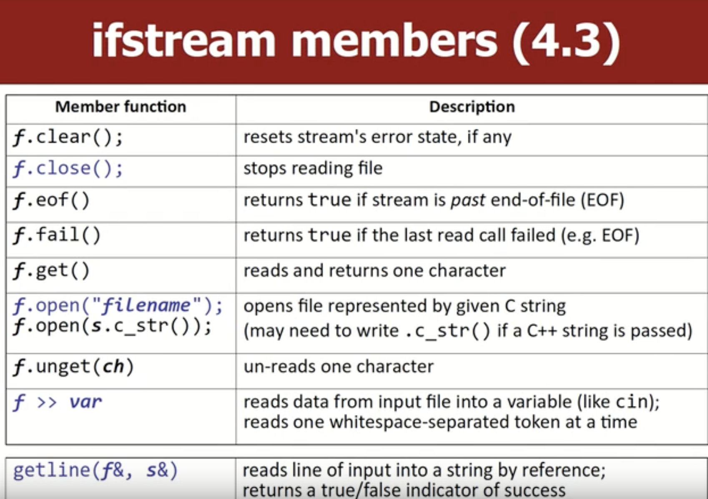
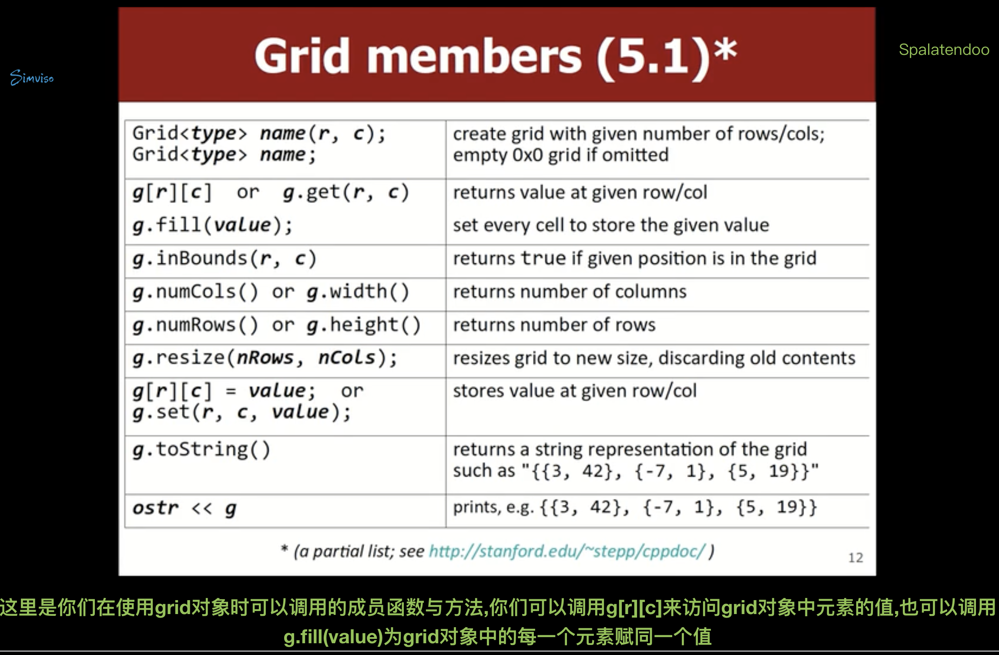
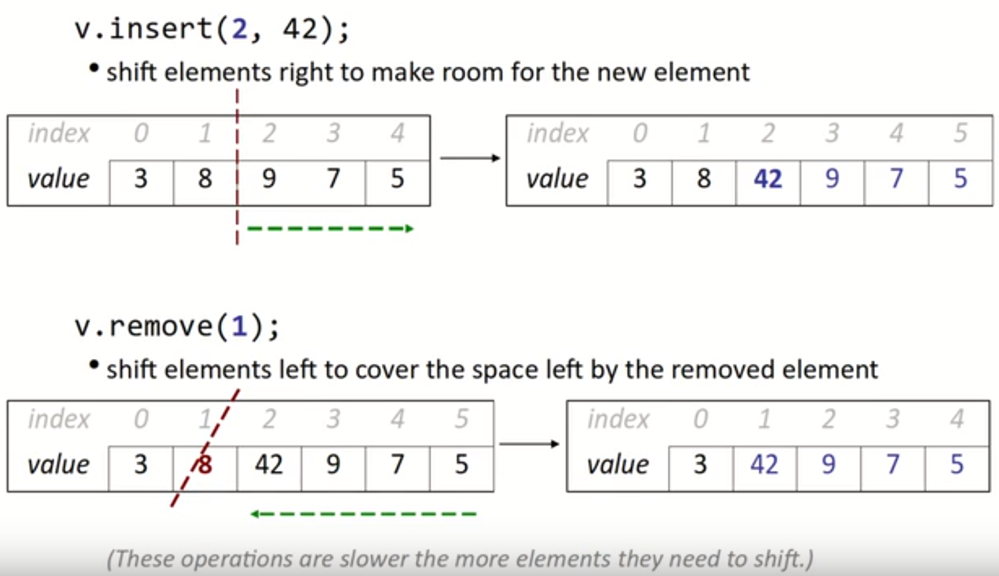

# *`CS106X：Programing Abstractions in C++`*

*资料网址：*

> *https://web.stanford.edu/dept/cs_edu/resources/qt/*
>
> *https://web.stanford.edu/class/cs106x/assignments.html*
>
> *https://stanford.edu/class/archive/cs/cs106x/cs106x.1162/lectures.html*
>
> *https://n0eb0mluamf.feishu.cn/docx/BAf1dLjTio7OfaxHzALcEHQonde*

## *Functions;String* 

### *Functions*

+ *值传递：会将其值拷贝过去**，这样会有空间的开销**，但是可以忽略不计。*
+ *引用传递：则不会有额外的空间开销，但是容易 造成滥用。*
  + *有时引用参数甚至会更慢，因为在使用引用参数时，程序还必须创建与之相关的内存指针和别的东西*

**


### *String*

**

**

**

**




> 注意：右下角红色的代码会报错。


> `Istringstream`会从string对象读取数据，而不是从文件中读取的

> `ifstream`对象读取文件中的其中一条`line`,再使用`istringstream`对象将该`line`中文本的`word`分开


## `SPL（Stanford collection Library）`

### `spl—collection-grid` 


> `SPL`中的 `collection` 拥有越界检测功能与内存错误检测功能

> 使用其它的来实现二维数组的话，一般不会报错，所以说grid来实现二维数组更容易debugger

> + 在没有输入`grid`对象中元素值时,`matrix`中每个元素都是0或与0类似的值,如果grid对象存储的是double,那么元素的默认值就是0.0,如果存储的是`bool`,那么元素的默认值就是`false`



> Grid不会自动扩容

> + `ostr`代表负责输出内容的stream,例如`cout ofstream`或`ostringstream`,你们可以将grid对象中的内容输出到`ostr`,它们会将grid对象中的内容以合理的方式输出

> **不使用引用传值**——复制出一整个grid对象的拷贝——降低程序的效率
>
> **引用传值**——grid对象会被其它对象所共享，会存在潜在的危险（需要加入`const` 来解决） 
>
> ```c++
> intfunction(const Grid<int>& g)
> ```

### `spl—vector`


> 空间是动态的。——list 
>
> 如果你使用array对象时发生了访问越界，那么程序会返回你无用的数据，
>
> 在vector中，则会有错误信息以帮助你debug




```C++
void removeAll(Vector<string>& v, string s){
    for(int i = v.size() - 1; i >= 0;i--){
        if(v[i] == s){
            v.remove(i);
        }
    }
}

// 或者
void removeAll(Vector<string>& v, string s){
    for(int i = 0; i < v.size(); i++){
        if(v[i] == s){
            v.remove(i);
            i--;
        }
    }
}
```

> 大O记法


### `Linkedlist 与 vector不同之处`

+ `Linkedlist` 中某些操作会比 `vector` 更快或者更慢（插入`insert，remove`操作`linkedlist`更快）
  + 

### `stacks and Queues`

<!-- tabs:start -->

#### **`stack（FILO）`**

> stack——迷宫求解；回文；翻转顺序；软件中的undo（撤销）功能；括号匹配；
>
> 你将你想前往目标位置所经过的点push到stack上,搜索到一个新位置时，首先将该位置的坐标存储在栈中，若该位置不合法(经过各种递归操作，发现通过它没办法到达目标位置)，则将该坐标出栈，它可以让你最终得到一个合理的路线

```c++
// 括号匹配(使用标准库的#include<stack>是注释的)
int checkBalance(string code){
    stack<char>parent;
    char top;
    for(int i = 0; i < code.length(); i++){
        if(code[i] == '(' || code[i] == '}'){
            parent.push(code[i]);
        }else if(code[i] == ')'){
            if(parent.empty()) return i;
            top = parent.pop();//先将栈顶元素赋值给top，然后在删除栈顶元素
            // peek() 是先删除栈顶元素，在将栈中的栈顶元素赋值
            //top = parent.top();
            //parent.pop();
            if(top != '('){
                return i;
            }
        }else if(code[i] == '}'){
            if(parent.empty()) return i;
            top = parent.pop();
            //top = parent.top();
            //parent.pop();
            if(top != '{'){
                return i;
            }
        }

    }
    if(parent.empty()) return -1;
    else return code.length();
}
```


> **`stack`内部一般是由 `vector`或者 `array`实现的**

#### **`queues（FIFO`**

> 打印任务；下载文件；
>
> `#include "queue.h"`


> **一般使用 `Linkedlist`(环形数组)去实现 `queue`**


```c++
// {"a","b","c"}
// {"a","b","c","c","b","a"}
void mirror(Queue<string>& queue){
	Stack<string> stack;
    int size = queue.size();
    for(int i = 0; i < size;i++){
        string s = queue.dequeue();
        stack.push(s);
        queue.enqueue(s);
    }
    while(!stack.isEmpty()){
        queue.enqueue(stack.pop);
    }
}
```

<!-- tabs:end -->

### `set and map`

<!-- tabs:start -->

#### **`set 唯一不重复`**


#### **`set`和 `hashset`内部实现的不同**

> + 大致不同就是内部实现的方法是不一样的
>   + `set`内部是由 `二叉搜索树（binary search tree）`的数据结构实现
>   + `hashset`内部是有一个 `array`实现，但是这个 `array`的用法很特殊，我们将其称为 `hash table（哈希表）`
>     + `hashset`的存储数据的顺序难以预测，但**其运行速度要比set更快**

#### **`Lecicon`存储string**


> `lexicon就像一本字典，但这本字典里只有单词而没有单词的解释`
>
> + 基本上，`Lexicon`和 `Set<string>`一样

#### **Maps**

> map负责存储pairs（键值对）


> ```c++
> ifstream input;
> string word;
> while(input >> word){// read one word
>     word = toLowerCase(word);
> }
> ```

<!-- tabs:end -->

## `Recursion(递归)`

> Writing a function that calls itself.("self-similar")

```c++
int fact(int n){
    int res = 1;
    for(int i = 2; i<= n;i++){
        res *= i;
    }
    return res;
}
// recursive version of factorial function
int fact(int n){
    if(n < 2 ){
        return 1;
	}else{
        return fact(n - 1) * n;
	}
}
```

> recursion 版本代码运行速度 回避 for 循环慢

 ```c++
 int mystery(int n){
     if(n < 10){
         return n;
     }else{
         int a = n / 10;
         int b = n % 10;
         return mystery(a + b);
     }
 }
 mystery(648); // 9
 ```

> 幂运算

```c++
int power(int base, int exp){
    if(exp < 0){
    	throw exp;   
    }else if(exp == 0){
        return 1;
    }else{
        return base * power(base,exp-1);
    }
}
```

> 输出二进制

```c++
void printsBinary(int n){
    if(n < 0){
        cout << "-";
        printsBinary(-n);
    }else if(n <= 1){
        cout << n;
    }else{
        int lastDigit = n % 2;
        int otherDigits = n / 2;
        printsBinary(otherDigits);
        cout << lastDigit;
    }
}
```

```c++
void reverseLines(ifstream& input){
    string line;
    if(getline(input,line)){
        // recursive case: reverse the file
        reverseLines(input);
        cout << line << endl;
    }else{
        //else,base case: no lines
    }
}
```

> `crawal()` 往其中传入一个文件名或目录名作为参数，然后程序就会打印其中包含的所有子文件名或子目录名（嵌套的情况）


```c++
void crawl(const string & filename,string& indentation{
    cout << indentation << getTail(filename) << endl;
    if(isFile(filename)){
        // base case : normal file
        cout << getTail(filename) << endl;
    }else {
        // recursive case : dircetory
        Vector<string>files = listDirectory(dilename);
        for(string file : files){
            cout << "     " ;
            crawl(filename + "/" + file,identation + "    ");
        }
    }
}
```

> 斐波那契数列（为前两个数之和）

```c++
int fib(int n){
    static HashMap<int,int> cache;// 记忆化搜素
    if(n  <= 2) return 1;
    else if( cache.containsKey(n)){
        return cache.get(n);
    }
    else {
        int re = fib(n - 1) + fib(n + 2);
        cache.put(n,res);
        return res;
    }
}
```

> 括号运算符计算


```c++
int evalHelper(const string & exp,int & index){
    if(isdigit(exp[index])){
        return exp[index++] - '0';
    }else if(exp[index] == '('){
        index++;
        int left = evalHelper(exp,index); // operand
        char op = exp[index++];             // operator
        int right = evalHelper(exp,index);   // operand
        index++; // skip
        if(op == "+"){
            return left + right;
        }else{ // op == '*'
            return left * right;
        }
    }
}

int evaluate(const string& exp){
    int index = 0;
    return evaluate(exp,index);
}
```

### Fractals（尾递归）


```c++
void cantorSet(GWindow& windows,int x,int y, int length, int lenvels){
    if(levels >= 1){
        pause(100);
        window.drawLine(x,y,x+length,y);
        window.drwLine(x,y+1,x+length,y+1);
        cantorSet(window,x,y+20,length/3,levels-1);
        cantorSet(window,x+2*length/3,y+20,length/3,levels-1);
    }
}
```

## backtracking(回溯)

### Exhaustive search(穷举搜索)

