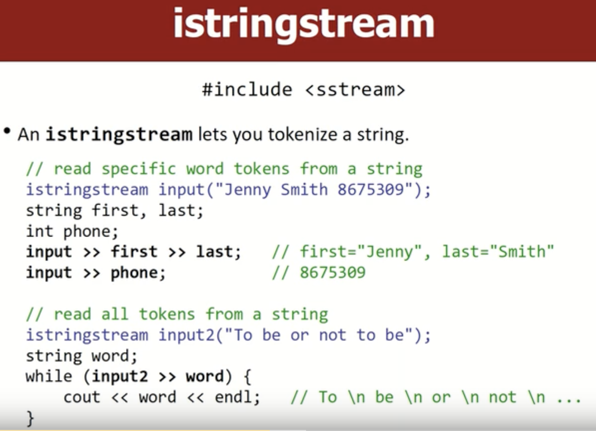
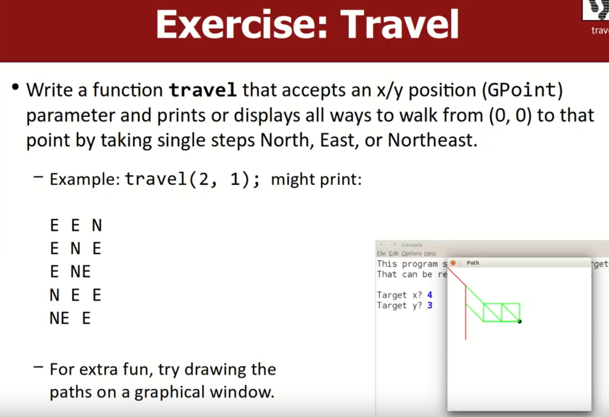

# *`CS106X：Programing Abstractions in C++`*

*资料网址：*

> *https://web.stanford.edu/dept/cs_edu/resources/qt/*
>
> *https://web.stanford.edu/class/cs106x/assignments.html*
>
> *https://stanford.edu/class/archive/cs/cs106x/cs106x.1162/lectures.html*
>
> *https://n0eb0mluamf.feishu.cn/docx/BAf1dLjTio7OfaxHzALcEHQonde*

## *Functions;String* 

### *Functions*

+ *值传递：会将其值拷贝过去**，这样会有空间的开销**，但是可以忽略不计。*
+ *引用传递：则不会有额外的空间开销，但是容易 造成滥用。*
  + *有时引用参数甚至会更慢，因为在使用引用参数时，程序还必须创建与之相关的内存指针和别的东西*

**


### *String*

**

**

**

**


> 注意：右下角红色的代码会报错。



> `Istringstream`会从string对象读取数据，而不是从文件中读取的

> `ifstream`对象读取文件中的其中一条`line`,再使用`istringstream`对象将该`line`中文本的`word`分开


## `SPL（Stanford collection Library）`

### `spl—collection-grid` 


> `SPL`中的 `collection` 拥有越界检测功能与内存错误检测功能

> 使用其它的来实现二维数组的话，一般不会报错，所以说grid来实现二维数组更容易debugger

> + 在没有输入`grid`对象中元素值时,`matrix`中每个元素都是0或与0类似的值,如果grid对象存储的是double,那么元素的默认值就是0.0,如果存储的是`bool`,那么元素的默认值就是`false`


> Grid不会自动扩容

> + `ostr`代表负责输出内容的stream,例如`cout ofstream`或`ostringstream`,你们可以将grid对象中的内容输出到`ostr`,它们会将grid对象中的内容以合理的方式输出

> **不使用引用传值**——复制出一整个grid对象的拷贝——降低程序的效率
>
> **引用传值**——grid对象会被其它对象所共享，会存在潜在的危险（需要加入`const` 来解决） 
>
> ```c++
> intfunction(const Grid<int>& g)
> ```

### `spl—vector`


> 空间是动态的。——list 
>
> 如果你使用array对象时发生了访问越界，那么程序会返回你无用的数据，
>
> 在vector中，则会有错误信息以帮助你debug


```C++
void removeAll(Vector<string>& v, string s){
    for(int i = v.size() - 1; i >= 0;i--){
        if(v[i] == s){
            v.remove(i);
        }
    }
}

// 或者
void removeAll(Vector<string>& v, string s){
    for(int i = 0; i < v.size(); i++){
        if(v[i] == s){
            v.remove(i);
            i--;
        }
    }
}
```

> 大O记法


### `Linkedlist 与 vector不同之处`

+ `Linkedlist` 中某些操作会比 `vector` 更快或者更慢（插入`insert，remove`操作`linkedlist`更快）
  + 

### `stacks and Queues`

<!-- tabs:start -->

#### **`stack（FILO）`**

> stack——迷宫求解；回文；翻转顺序；软件中的undo（撤销）功能；括号匹配；
>
> 你将你想前往目标位置所经过的点push到stack上,搜索到一个新位置时，首先将该位置的坐标存储在栈中，若该位置不合法(经过各种递归操作，发现通过它没办法到达目标位置)，则将该坐标出栈，它可以让你最终得到一个合理的路线

```c++
// 括号匹配(使用标准库的#include<stack>是注释的)
int checkBalance(string code){
    stack<char>parent;
    char top;
    for(int i = 0; i < code.length(); i++){
        if(code[i] == '(' || code[i] == '}'){
            parent.push(code[i]);
        }else if(code[i] == ')'){
            if(parent.empty()) return i;
            top = parent.pop();//先将栈顶元素赋值给top，然后在删除栈顶元素
            // peek() 是先删除栈顶元素，在将栈中的栈顶元素赋值
            //top = parent.top();
            //parent.pop();
            if(top != '('){
                return i;
            }
        }else if(code[i] == '}'){
            if(parent.empty()) return i;
            top = parent.pop();
            //top = parent.top();
            //parent.pop();
            if(top != '{'){
                return i;
            }
        }

    }
    if(parent.empty()) return -1;
    else return code.length();
}
```


> **`stack`内部一般是由 `vector`或者 `array`实现的**

#### **`queues（FIFO`**

> 打印任务；下载文件；
>
> `#include "queue.h"`


> **一般使用 `Linkedlist`(环形数组)去实现 `queue`**


```c++
// {"a","b","c"}
// {"a","b","c","c","b","a"}
void mirror(Queue<string>& queue){
	Stack<string> stack;
    int size = queue.size();
    for(int i = 0; i < size;i++){
        string s = queue.dequeue();
        stack.push(s);
        queue.enqueue(s);
    }
    while(!stack.isEmpty()){
        queue.enqueue(stack.pop);
    }
}
```

<!-- tabs:end -->

### `set and map`

<!-- tabs:start -->

#### **`set 唯一不重复`**


#### **`set`和 `hashset`内部实现的不同**

> + 大致不同就是内部实现的方法是不一样的
>   + `set`内部是由 `二叉搜索树（binary search tree）`的数据结构实现
>   + `hashset`内部是有一个 `array`实现，但是这个 `array`的用法很特殊，我们将其称为 `hash table（哈希表）`
>     + `hashset`的存储数据的顺序难以预测，但**其运行速度要比set更快**

#### **`Lecicon`存储string**


> `lexicon就像一本字典，但这本字典里只有单词而没有单词的解释`
>
> + 基本上，`Lexicon`和 `Set<string>`一样

#### **Maps**

> map负责存储pairs（键值对）


> ```c++
> ifstream input;
> string word;
> while(input >> word){// read one word
>     word = toLowerCase(word);
> }
> ```

<!-- tabs:end -->

## `Recursion(递归)`

> Writing a function that calls itself.("self-similar")

```c++
int fact(int n){
    int res = 1;
    for(int i = 2; i<= n;i++){
        res *= i;
    }
    return res;
}
// recursive version of factorial function
int fact(int n){
    if(n < 2 ){
        return 1;
	}else{
        return fact(n - 1) * n;
	}
}
```

> recursion 版本代码运行速度 回避 for 循环慢

 ```c++
 int mystery(int n){
     if(n < 10){
         return n;
     }else{
         int a = n / 10;
         int b = n % 10;
         return mystery(a + b);
     }
 }
 mystery(648); // 9
 ```

> 幂运算

```c++
int power(int base, int exp){
    if(exp < 0){
    	throw exp;   
    }else if(exp == 0){
        return 1;
    }else{
        return base * power(base,exp-1);
    }
}
```

> 输出二进制

```c++
void printsBinary(int n){
    if(n < 0){
        cout << "-";
        printsBinary(-n);
    }else if(n <= 1){
        cout << n;
    }else{
        int lastDigit = n % 2;
        int otherDigits = n / 2;
        printsBinary(otherDigits);
        cout << lastDigit;
    }
}
```

```c++
void reverseLines(ifstream& input){
    string line;
    if(getline(input,line)){
        // recursive case: reverse the file
        reverseLines(input);
        cout << line << endl;
    }else{
        //else,base case: no lines
    }
}
```

> `crawal()` 往其中传入一个文件名或目录名作为参数，然后程序就会打印其中包含的所有子文件名或子目录名（嵌套的情况）


```c++
void crawl(const string & filename,string& indentation{
    cout << indentation << getTail(filename) << endl;
    if(isFile(filename)){
        // base case : normal file
        cout << getTail(filename) << endl;
    }else {
        // recursive case : dircetory
        Vector<string>files = listDirectory(dilename);
        for(string file : files){
            cout << "     " ;
            crawl(filename + "/" + file,identation + "    ");
        }
    }
}
```

> 斐波那契数列（为前两个数之和）

```c++
int fib(int n){
    static HashMap<int,int> cache;// 记忆化搜素
    if(n  <= 2) return 1;
    else if( cache.containsKey(n)){
        return cache.get(n);
    }
    else {
        int re = fib(n - 1) + fib(n + 2);
        cache.put(n,res);
        return res;
    }
}
```

> 括号运算符计算


```c++
int evalHelper(const string & exp,int & index){
    if(isdigit(exp[index])){
        return exp[index++] - '0';
    }else if(exp[index] == '('){
        index++;
        int left = evalHelper(exp,index); // operand
        char op = exp[index++];             // operator
        int right = evalHelper(exp,index);   // operand
        index++; // skip
        if(op == "+"){
            return left + right;
        }else{ // op == '*'
            return left * right;
        }
    }
}

int evaluate(const string& exp){
    int index = 0;
    return evaluate(exp,index);
}
```

### Fractals（尾递归）


```c++
void cantorSet(GWindow& windows,int x,int y, int length, int lenvels){
    if(levels >= 1){
        pause(100);
        window.drawLine(x,y,x+length,y);
        window.drwLine(x,y+1,x+length,y+1);
        cantorSet(window,x,y+20,length/3,levels-1);
        cantorSet(window,x+2*length/3,y+20,length/3,levels-1);
    }
}
```

## backtracking(回溯)

### Exhaustive search(穷举搜索)


<!-- tabs:start -->

#### **输出二进制**


```c++
void printBinary(int digits, string prefix){
    if(digits == 0) {
        cout << prefix << endl;
    }else {
        printBinary(digits - 1, prefix + "0");
        printBinary(digits - 1, prefix + "1");
    }
}
```


#### **输出字母的不同组合顺序——排列**

```c++
void permute(string s, string prefix){
    if(s.length() == 0){
        cout << prefix << endl;
    }else{
        for(int i = 0; i < s.length(); i++){
            char ch = s[i];
            string s2 = substr(0,i) + s.substr(i + 1);
            permute(s2, prefix + ch);
        }
    }
}
```

> 改成组合

```c++
set<string>permuteHelper;
void permuteHelper(string s, string prefix,vector<string>&v){
    if(s.length() == 0){
        v.add(prefix);
        if(!aleradyPrinted.contains(prefix)){
        	cout << prefix << endl;
        	aleradyPrinted.add(prefix);
        }
    }else{
        for(int i = 0; i < s.length(); i++){
            char ch = s[i];
            string s2 = substr(0,i) + s.substr(i + 1);
            permuteHelper(s2, prefix + ch);
        }
    }
}
```

#### **掷骰子**

```c++
void diceRollsHelper(int dice,Vector<int>& chosen){
    //  此模板可以记一下
    // if there are choies to make:(所有的骰子选择完毕)
    if(dice == 0){
        /// base case:
        cout << chosen << endl;
    }else{
        // for each value for My choice
        for(int i = 0; i <= 6; i++){
            // choose
            chosen.add(i);
            // search/expore(递归部分)
            diceRollsHelper(dice - 1,chosen);
            // un-choose(自我清理)
            chosen.remove(chosen.size()-1);
        }
    }
}
void diceRolls(int dice){
    Vector<int> v;
    diceRollsHelper(dice,v);
}
```

#### **输出子序列**

```c++
// 选或者不选  包含和排除
void sublists(Vector<string>& v){
    if(v.isEmpty()){
        cout << chosen << endl;
    }else{
     	// choose
        string mine = v[0];
		v.remove(0);
        // expore / search
        // yes include them
		chosen.add(mine);
        sublistsHelps(v,chosen);
        // no exclude them   
        chosen.remove(chosen.size()-1);
        sublistsHelps(v,chosen);
        // un-choose
        v.insert(0,mine);
    }
}

// 辅助函数
void sublistsHelps(Vector<string>& v, Vector<string>&chosen){
    string mine = v[0];
    v.remove(0);
}
```

#### **八皇后**

+ 优化——根据已经放置的皇后的位置，限制其它皇后可以放置的位置。通过逐步缩小解的范围，我们可以更快地找到有效的解决方案。
+ 辅助函数


```c++
int main_queens(){
    Board board(8);
    solveQueens(board);
    return 0;
}
// pre : columns [0.. col-1] have legally placed quees
// if solution found, prints it,and returns true
// if no solution found,returns false
bool solveHelps(Board& board,int col){
     // 回溯 base case 选择 探索  撤销选择 传递参数
    // base case
    if(col.size() >= col){
       // 调用完毕之后 
        cout << board << endl;// 所有的解决方案
        //exit(0); // 不建议
        // return; // error
        return true;
    }else{
       for(int row = 0; row < board.size();row++){
            if(board.isSafe(row,col)){
            // choose
            board.place(row,col);
            // enpore
            bool res = solveHelps(board,col+1);
            if(res) return true;
            // un-choose
            board.remove(row,col);
        	}
       }
        return false;
    }
}
void solveQueens(Board& board){
    // 回溯 base case 选择 探索  撤销选择 传递参数
    
}
```

#### 多米诺骨牌



```cpp
void travelHelper(const GPoint& target,GPoint me,Vector<string>&chosen){
    if(target == me){
        // base case:  done
        cout << chosen << endl;
    }else if(me.getX() <= target.getX() && me.getY() <= target.getY() ){
        // 向前迈一步 take a step toward target
        // choose/expore/unchoose E
        // choose/expore/unchoose N
        // choose/expore/unchoose NE
        GPoint e(me.getX() + 1,me.getY());
        GPoint n(me.getX(),me.getY() + 1);
        GPoint ne(me.getX() + 1,me.getY() + 1);
        
        chosen.add("E");
        travelHelper(target,e,chosen);
        chosen.remove(chosen.size()-1);
        
        chosen.add("N");
        travelHelper(target,n,chosen);
        chosen.remove(chosen.size()-1);
        
        chosen.add("NE");
        travelHelper(target,ne,chosen);
        chosen.remove(chosen.size()-1);
    }
}
void traval(const GPoint& target){
    GPoint origin(0,0);
    travelHelper(target,origin);
}
```

<!-- tabs:end -->

## Pointers and Nodes

> 指针是引用的前身。

```cpp
#include <iostream>

using namespace std;

void mystert(int a,int& b,int* c){
    a++;
    (*c)--;
    b += *c;
    cout << a << " " << b << " " << c << endl;
}

int main(){
    int a = 4;
    int b = 8;
    int c = -3;
    cout << a << " " << b << " " << c << endl;
    mystert(c,a,&b);
    cout << a << " " << b << " " << c << endl;
    return 0;
}
```

> output

```shell
4 8 -3
-2 11 0xf6bd9ff7a4
11 7 -3
```

>  使用`nullptr` 表示空指针，编译器更擅长找出错误和进行检查
>
> + `NULL`其实就是 `0`的别名

```cpp
int* p = nullptr;
cout << p << endl; // 0
cout << &p << endl; //0xa0837ff8b8
cout << *p << endl; // Exception has occurred.  // KABOOM
```

```cpp
if(p == nullptr && p == NULL) // true
if(p) //false
```

> `虚拟地址`——使得每个程序都有属于自己的内存地址映射


> `箭头就是跟随这个指针`‘
>
> `（*p）.month`——你必须要写先去找这个指针指向的内存地址，找到它指向的 `data`，并获取它的 `month`


### Linked Lists

 ```cpp
 struct ListNode{
     int val;
     ListNode* next;
     ListNode() : val(0), next(nullptr) {}
     ListNode(int x) : val(x), next(nullptr) {}
     ListNode(int x, ListNode* next1) : val(x), next(next1) {}
 };
 
 int main(){
     ListNode *node1 = new ListNode(42);
     ListNode* node2 = new ListNode(13);
     node1->next = node2;
 }
 ```

> `&` 取内存地址


> `a-> next = p` 即如果我将p辅助给其它变量

```cpp
ListNode *a = new ListNode(10);
a-> next = new ListNode(20);
ListNode* b = new ListNode(30);
b->next = new ListNode(40);
a->next = b->next;
cout << a->next->val << endl; // 40
```


> `A`


> `指针——可以看作是告诉你如何找到那个隐蔽的抽屉的秘密地图。如果不小心弄丢了这张地图（也就是我们说的指针），那么你可能就在也找不到那个抽屉了，里面的宝贝也就无法取回了。这就是所谓的 内存泄漏`

```cpp
// Appends the given value to the end of the list
void add(ListNode*& node1,int value){
    ListNode* newNode = new ListNode(value);
    if(node1 == nullptr){
        node1 == newNode;
    }else{
        // walk to end of list
        ListNode* cur = node1;
        while(cur->next != nullptr){
            cur = cur->next;
        }
        cur->next = newNode;
    }
}
```

> 计算链表的长度

```cpp
int size(ListNode* front){
    if(front == nullptr){
        return 0;
    }else{
        ListNode* cur = front;
        int count = 0;
        while(cur != nullptr){
            count++;
            cur = cur->next;
        }
        return count;
    }
    
    //  // 递归实现
    if(front == nullptr){
        return 0;
    }else{
        return 1 + size(front->next);
    }
}
```

> returns value in list at given index

```cpp
int get(ListNode* front,int index){
    ListNode* cur = front;
    for(int i = 0; i < index; i++){
        cur = cur->next;
    }
    return cur->val;
}
```

> `*`是创建新的指针  `&`跟随指针


> ***在C++中，你不能定义一个指向引用的指针，这是不被允许的，所以pointer to a reference 这种说法在C++种是不成立的，你可以传递指针的引用，但不能传递指向引用的指针***

> `*` 是对指针所存地址进行解析操作，`&` 是对给出的对象取地址的操作。

>  Inserts the given value at the front of the list

```cpp
void addFirst(ListNode*& front,int value){
    //ListNode* newNode = new ListNode(value);
    //newNode->next = front;
    //front = newNode;
    
    front == new ListNode(value, front);
}
```

> remove 删除

```cpp
void removeFirst(ListNode*& front){
    if(front != nullptr){
        ListNode* trash = front;// 删除的元素指针
        front = front->next;
        delete trash;
    }
}
void remove(ListNode*& front,int index){
    if(front == nullptr){
        front = newNode;
    }else{
        ListNode * cur = front;
        for(int i = 0; i < index-1; i++){
            cur = cur->next;
        }
        ListNode* trash = cur->next;
        cur->next = cur->next->next;
        delete trash;
    }
}
```

## Classes and Objects

> 类是一种对象类型，一种对象模板


> 还有一种方式 `#pragma once` 兼容性不好

> 这些加 `#`的预编译指令，是防止多次加载

```cpp
ostream& operator <<(ostream& out ,const BankAccount& ba){
    return out << ba.name << " " << ba.balance;
}
```

### 双向链表（`doubly linkedlists`）和跳表（`skip litsts`）


> 维护一个指针数组
>
> + 跳表，又叫做跳跃表、跳跃列表，在有序链表的基础上增加了“跳跃”的功能
> + 跳表在原来的有序链表上加上了多级索引，通过索引来快速查找；可以支持快速的删除、插入和查找操作。
> + 跳表实际上是一种增加了前向指针的链表，是一种随机化的数据结构
> + `Redis`中 的 `SortedSet`、`LevelDB` 中的 `MemTable` 都用到了跳表
> + 对比平衡树, 跳表的实现和维护会更加简单, 跳表的搜索、删除、添加的平均时间复杂度是 `O(logn)`

## Arrays

> 将内存置为0，需要 O（N）的时间来清零N个元素

> ```cpp
> int a[3]; // 初始化数组为随机值
> int a[3]{}; // 初始化值为0
> int* a = new int[4](); // 在堆上开辟内存，初始化为0
> ```


> **浅拷贝——只拷贝了地址，没去拷贝地址指向的数据**


+ 如果使用 `new` 分配内存，需要在析构函数中清理内存

## Graphs

