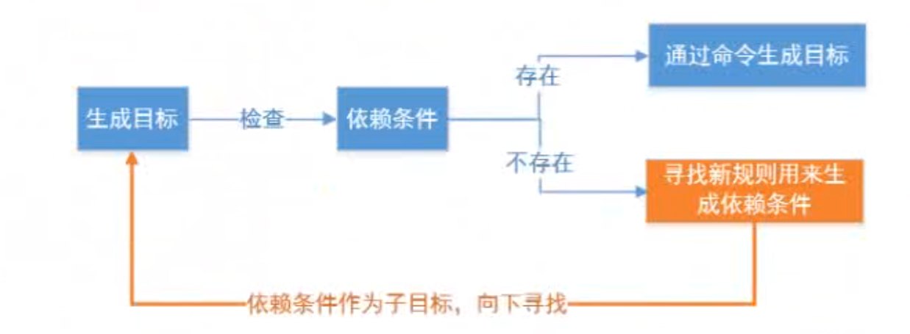
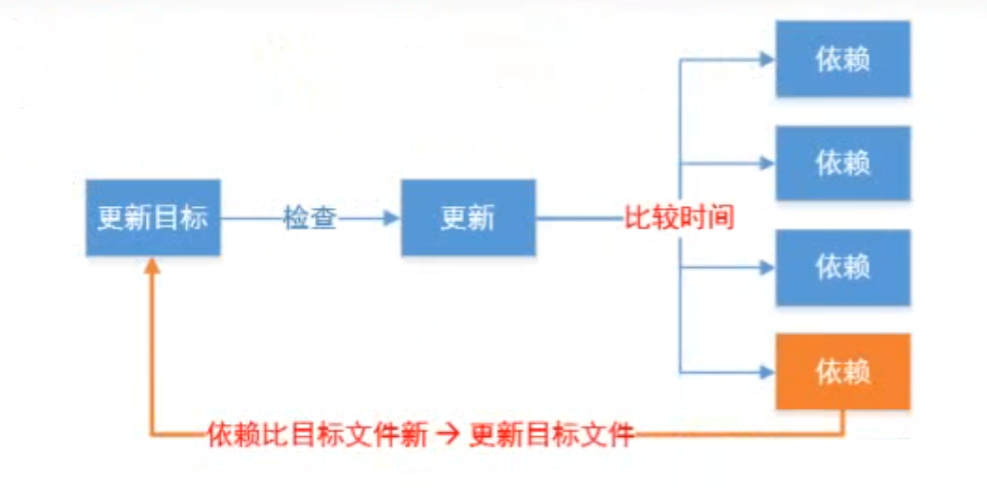
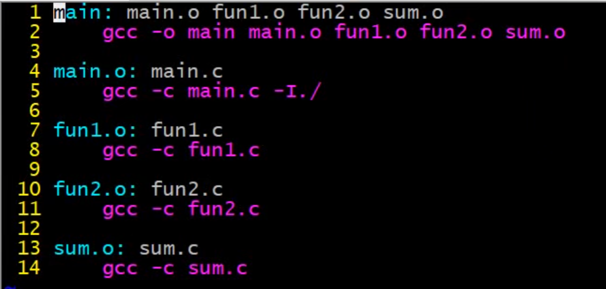
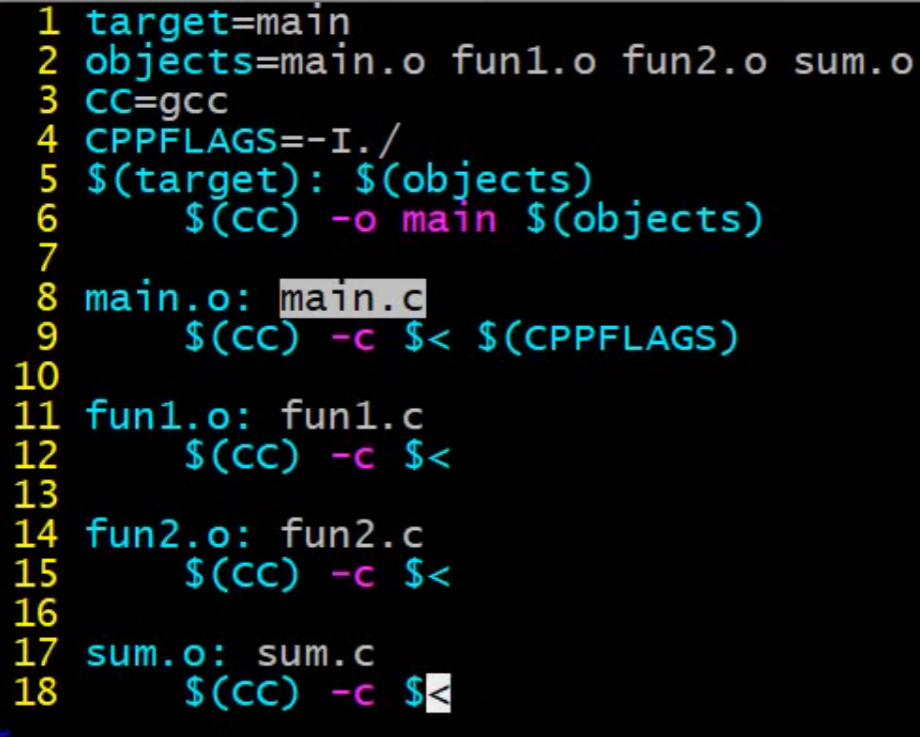
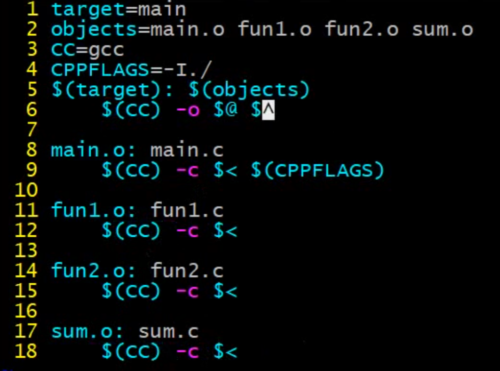
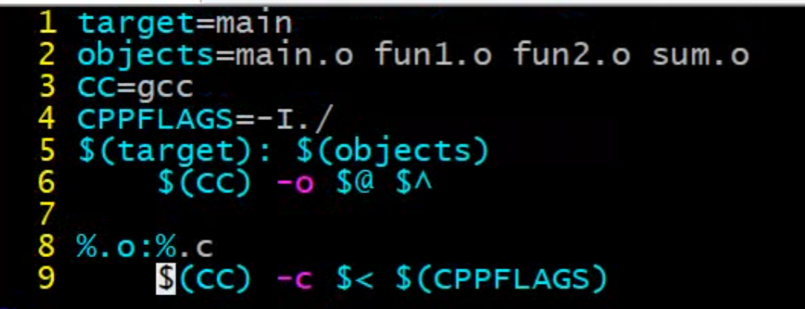
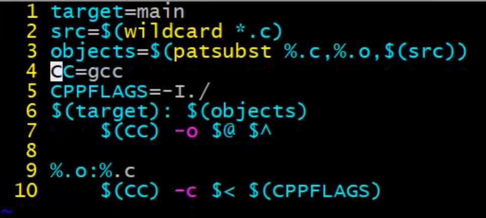

# Makefile必修之路

## 1 makefile

+ makefile文件中定义了一系列的规则来指定，哪些文件需要先编译,哪些文件需要后编译,哪些文件需要重新编译，甚至于进行更复杂的功能操作，因makefile .就像一个Shell脚本一样，其中也可以执行操作系统的命令。makefile.带来的好处就是——“自动化编译"，**一旦写好，只需要一个make命令**，整个工程完全自动编译,极大的提高了软件开发的效率
+ make是一个命令工具，是一个解释makefile中指令的命令工具，一般来说，大多数的`IDE`都有这个命令，比如:Visual CH+的`make`, Linux 下 GNU的make.可见, makefile,都成为了一种在工程方面的编译方法.
+ makefile文件中会使用`gcc`,编译器对源代码进行编译，最终生成可执行文件或者是库文件.
+ **makefile 文件的命名:makefile或者Makefile**

> makefile文件是用来管理项目工程文件，通过执行make命令，执行make就会解析并执行makefile文件

### 1.1 makefile的基本规则

+ makefile由一组规则组成，规则如下：

+ ```
  目标：依赖
  （tab）命令
  ```

+ makefile基本规则三要素：

  + 目标:要生成的目标文件
  + 依赖:目标文件由哪些文件生成
  + 命令:通过执行该命令由依赖文件生成目标

+ 例子：

  + 当前目录下有`main.c`  `fun1.c`  ` fun2.c`  ` sum.c`，根据这个基本规则编写一个简单的makefile,文件，生成可执行文件main.

##### **第一个版本的makefile**

  + ```makefile
    main: main.c fun1.c fun2.c sum.c
    	gcc -o main main.c fun1.c fun2.c sum. c
    ```

### 1.2 makefile 工作原理

+ 基本原则：
  + 若想生成目标，检测规则中的所有的依赖文件是否都存在：
    + **如果有的依赖文件不存在**，则向下搜索规则，看是否有生成该依赖文件的规则:
      + 如果有规则用来生成该依赖文件，则执行规则中的命令生成依赖文件，
      + 如果没有规则用来生成该依赖文件，则报错.
    + 
    + 如果所有依赖都存在，检查规则中的目标是否需要更新，必须先检查它的所有依赖,依赖中有任何一个被更新，则目标必须更新.(检查的规则是哪个时间大哪个最新)
      + 若目标的时间  > 依赖的时间   **不更新**
      + 若目标的时间  < 依赖的时间   **更新**
    + 

##### **第二个版本**
  + 检查规则
    + 要想生成目标文件，先要检查依赖条件是否都存在：
      + 若都存在，则比较目标时间和依赖的时间，如果依赖的时间比目标的时间新，则重新生成目标；否则不重新生成
      + 若不存在，则往下找有没有生成依赖的规则，有则生成，如果没有则报错



### 1.3 makefile中的 变量

+ 在makefile中使用变量有点类似于C语言中的**宏定义**,使用该变量相当于内容替换,使用变量可以使makefile,易于维护，修改起来变得简单。
+ makefile有三种类型的变量：
  + 普通变量
  + 自带变量
  + 自动变量

#### 普通变量

+ 变量定义直接用 = 
+ 使用变量值用 $(变量名)

> 如：下面是变量的定义和使用
>
> ```makefile
> foo = abc		//定义变量并赋值
> bar = $(foo)	//使用变量,$(变量名)
> ```

+ 定义了两个变量: foo、bar,其中bar的值是foo变量值的引用。
+ 除了使用用户自定义变量, makefile 中也提供了一些变量**(变量名大写)供用户直接使用**，我们可以直接对其进行赋值:

> ```makefile
> CC=gCC			#arm-linux-gcc
> CPPFLAGS:C预处理的选项-I
> CFLAGS: C编译器的选项-Wall-g-c
> DFLAGS:链接器选项-L -l
> ```

#### 自动变量—只能用在命令中

+ $@:表示规则中的目标
+ $<:表示规则中的**第一个条件**
+ $^:表示规则中的**所有条件**，组成一个列表，以空格隔开，如果这个列表中有重复的项则消除重复项。





#### 模式规则

+ 至少在规则的目标定义中要包含'%,%'表示一个或多个，在依赖条件中同样可以使用'%，依赖条件中的’%'的取值取决于其目标:
+ 比如: `main.o:main.c fun1.o: fun1.c fun2.o:fun2.c`，说的简单点就是:
  + `XXX.O:XXX.C`
  + `%.o:%.c--------------> 前后的%必须是相同的`


##### **makefile的第三个版本**



### 1.4 makefile函数

1. `wildcard`-查找指定目录下的指定类型的文件
   `src=$(wildcard*.c)`  	//找到当前目录下所有后缀为`.c` 的文件,赋值给`src`
2. `patsubst`—匹配替换
   `obj=$(patsubst %.c,%.o,$(src))`       //把`src`变量里所有后缀为 `.c`       的文件替换成  `.o`

+ 在makefile.中所有的函数**都是有返回值的**。
+ 当前目录下有`main.c fun1.c fun2.c sum.c`
  `src=$(wildcard *.c`)等价于`src=main.c fun1.c fun2.c sum.c`
  `obj=$(patsubst %.c,%.o,$(src))`等价于`obj=main.o fun1.o fun2.o sum.o`

##### makefile 的第四个版本



> 缺点：每次重新编译都需要手工清理中间.o文件和最终目标文件

### 1.5 makefile的清理操作

+ 用途:清除编译生成的中间.o文件和最终目标文件

+ make clean如果当前目录下有同名clean文件,则不执行clean对应的命令，解决方案:

  + 伪目标声明：

    + **`.PHONY:clean`**
      + ***声明目标为伪目标之后, makefile将不会检查该目标是否存在或者该目标是否需要更新***

  + clean命令中的特殊符号:

    + `-`此条命令出错.make也会继续执行后续的命令。如:`-rm main.o`

    `rm -f`:强制执行，比如若要删除的文件不存在使用`-f`不会报错

    + `@`不显示命令本身，只显示结果。如:`@echo clean done`

  + 其他

    + `make` 默认执行第一个出现的目标，可通过`make dest`,指定要执行的目标
    + `make -f` :-f执行一个makefile文件名称，使用make执行指定的`makefile: make -f mainmak`

##### makefile第五个版本


