##  简历技能点归纳总结

## C++基础知识【const左定向，右定值】

<!-- tabs:start -->

#### **菱形继承**


#### **动态库和静态库**


#### **Reactor 和 Proactor**


#### **多态**


`构造函数能否声明为虚函数或者纯虚函数，析构函数呢？`

>  析构函数：

+ 析构函数可以为虚函数，并且⼀般情况下基类析构函数要定义为虚函数。
+ 只有在基类析构函数定义为虚函数时，调⽤操作符delete销毁指向对象的基类指针时，才能准确调⽤派⽣类的析构函数（从该级向上按序调⽤虚函数），才能准确销毁数据。
+ **析构函数可以是纯虚函数**，含有纯虚函数的类是抽象类，此时不能被实例化。但派⽣类中可以根据⾃身需求᯿新改写基类中的纯虚函数。

> 构造函数

+ 构造函数不能定义为虚函数。在构造函数中可以调⽤虚函数，不过此时调⽤的是正在构造的类中的虚函数，⽽不是⼦类的虚函数，因为此时⼦类尚未构造好。
+ 虚函数对应⼀个vtable(虚函数表)，类中存储⼀个vptr指向这个vtable。如果构造函数是虚函数，就需要通过vtable调⽤，可是对象没有初始化就没有vptr，⽆法找到vtable，所以构造函数不能是虚函数。

#### **类型推导**


#### **fun/lam/bind关系**


#### **写线程安全的程序**

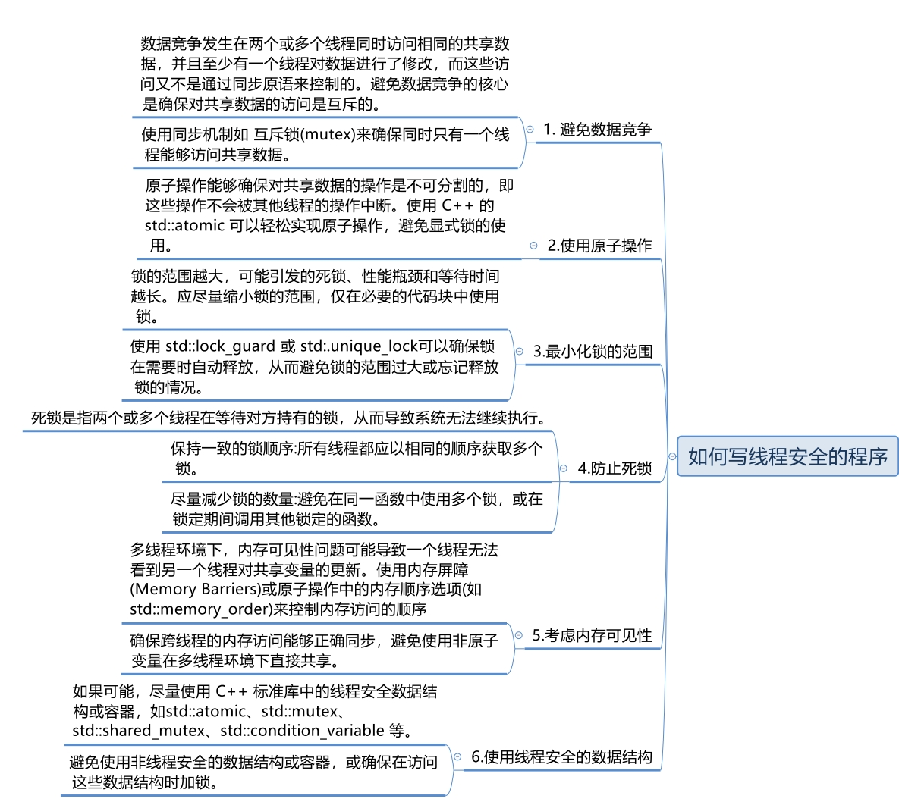

#### **this指针**


#### **智能ptr**


> 循环引用代码

```cpp
class B;
class A {
public:
	~A() {
		cout << "A::~A()" << endl;
	}
	//shared_ptr<B>spb;// 循环引用
	weak_ptr<B>spb;
};
class B {
public:
	~B() {
		cout << "B::~B()" << endl;
	}
	//shared_ptr<A>spa;// 循环引用
	weak_ptr<A>spa;
};
int main() {
	shared_ptr<A>sp1 = make_shared<A>();
	shared_ptr<B>sp2 = make_shared<B>();
	sp1->spb = sp2;
	sp2->spa = sp1;
	cout << "A.use_cout:" << sp1.use_count() << "  "
		<<"B.use_cout:" << sp2.use_count() << endl; // 循环引用 2 2  弱引用 1 1 ~B ~A
}
```

#### **select/poll/epoll**


#### **野指针和悬空指针**

+ 都是是指向⽆效内存区域(这⾥的⽆效指的是"不安全不可控")的指针，访问⾏为将会导致未定义⾏为。

> 野指针

+ 野指针，指的是没有被初始化过的指针

```cpp
int main(void){
    int* p;// 未初始化
    cout << *p << endl;// 未初始化就被使用
    return 0;
}
```

+ 因此，为了防⽌出错，对于指针初始化时都是赋值为 `nullptr` ，这样在使⽤时编译器就会直接报错，产⽣⾮法内存访问。

> 悬空指针

+ 悬空指针，指针最初指向的内存已经被释放了的⼀种指针。

```cpp
int mian(void){
    int * p = nullptr;
    int * p2 = new int;
    p = p2;
    delete p2;
}
```

+ 此时 p和p2就是悬空指针，指向的内存已经被释放。继续使⽤这两个指针，⾏为不可预料。需要设置为 `p=p2=nullptr` 。此时再使⽤，编译器会直接保错。
+ 避免野指针比较简单，但悬空指针比较麻烦。c++引⼊了智能指针，C++智能指针的本质就是避免悬空指针的产⽣。

> 解决方法

+ 野指针： 指针变量未及时初始化=> 定义指针变量及时初始化，要么置空；
+ 悬空指针：指针free或delete之后没有及时置空=>释放操作立即置空；

#### **内存模型**

>  内存四区模型主要包括代码区、全局区（或静态存储区）、栈区和堆区。以下是这四个区域的特性：

**代码区**：

- 内容：存放**函数体的二进制代码**，由操作系统进行管理。
- 特性
  - 共享性：代码区是共享的，对于频繁执行的程序，只需要在内存中有一份代码即可。
  - 只读性：代码区是只读的，以防止程序意外地修改了它的指令。
  - 初始化：在程序编译时确定，由编译器和链接器负责生成和放置

**全局区（或静态存储区）**.data/.bss/.rodata（只读区）：

- 内容

  - 存放**全局变量和静态变量**。
  - 存放**常量**，包括常量和字符串常量。

- 特性

  - 生命周期：全局区内的变量**在程序编译阶段就已经分配好了内存空间并初始化**，且在程序的整个运行期间都存在。

  - 不可修改性：静态存储区内的常量一经初始化，不可修改。全局常变量存放在静态常量区，不可以通过指针或引用间接修改。

    - 全局变量和函数的释放是由操作

      系统自动回收内存

      - 如果全局变量引用了动态分配的资源，那么需要确保在程序结束前适当地释放这些资源。

    - 全局作用域中的**类对象才会调用析构进行释放**

**栈区**：

- 内容：由编译器自动分配释放，存放函数的参数值、局部变量等。
- 特性
  - 生命周期：栈区的内容从函数左括号开始，到右括号为止。函数结束后，内存自动释放回收。
  - 生长方向：栈区向下生长，数值逐渐减小。
  - 栈区的内存会自动释放
  - **函数内的局部变量**（不包括静态局部变量）以及函**数调用的参数**通常存放在栈上

**堆区**：

- 内容：由程序员分配和释放。

- 特性

  - 管理：堆区的内容由程序员自己开辟，手动释放。如果程序员不释放，程序结束时由系统回收。
  - 生长方向：堆区向上生长，数值逐渐增大。
  - 由程序员分配和释放的内存区域，通常使用 `malloc`、`calloc`、`realloc` 和 `free` 等函数在C语言中管理。在高级语言中，如Python，垃圾回收机制负责自动管理堆上的内存。

  > 堆和栈都是程序运行时才分配的空间。

#### **写时拷贝**

+ 写时拷贝是浅拷贝解决浅拷贝析构冲突的一种解决方案，写时拷贝也叫延时拷贝，几个对象共用一块空间，当执行读操作时不会有影响，当你需要进行写操作改变一个对象的内容时，空间的值不能被修改，会互相影响，那么就需要单独开辟一块空间将对象拷贝过去然后改，不改变就不需要开辟。

+ 写时浅拷贝与深拷贝比较的优点：占用空间少（相同内容不开辟新空间），复制效率高

> 写时拷贝有两种方案

+ 1.写时拷贝（引用计数），一个对象第一次开辟空间存放字符串，再开辟一块新的空间存放引用计数。当它拷贝构造其他对象时，让其他对象的引用计数也都指向存放引用计数的同一块空间，引用计数加一。
+ 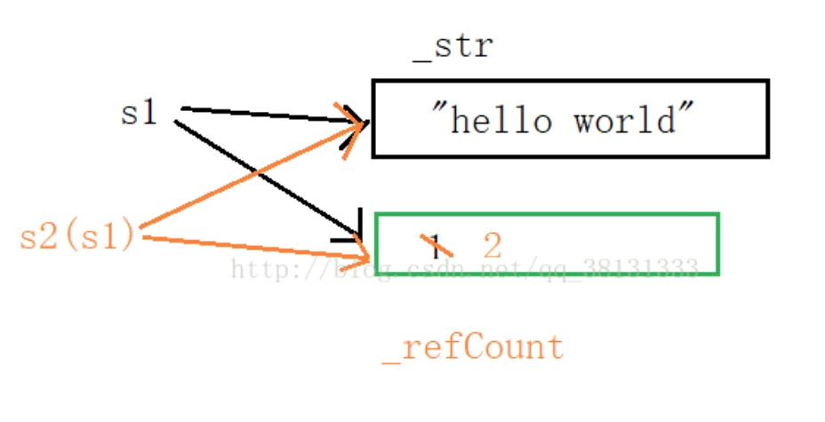
  + 缺陷：（1）每次new两块空间，创建多个对象的时候效率较低；
  + （2）它多次分配小块空间，容易造成内存碎片化，导致分配不出来大块内存。


+ 优化即第二种方案写时拷贝（指针），仿照new的底层实现，开辟一块空间，在其头四个字节计数，其思想就是在构造对象的时候多开辟四个字节用来存引用计数，这样就不需要变量了，要用引用计数的时候只需要把它取出来就可以了。

> string 的写时拷贝（维护一个指针）

```cpp
class String
{
public:
	//构造
	String(const char* str)
		:_str(new char[strlen(str) + 1])
		,_pCount(new int(1))
	{
		strcpy(_str, str);
	}

	//拷贝构造
	String(const String& s)
		:_str(s._str)
		,_pCount(s._pCount)
	{
		(*_pCount)++;
	}

	//赋值运算符重载
	String& operator=(const String& s)
	{
		if(_str != s._str)
		{
			if(--(*_pCount) == 0)
			{
				delete[] _str;
				delete _pCount;
			}
			_str = s._str;
			_pCount = s._pCount;
			(*_pCount)++;
		}
		return *this;
	}

	~String()
	{
		if(--(*_pCount) == 0)
		{
			delete[] _str;
			delete _pCount;
		}
	}

	char& operator[](size_t pos)
	{
		if(*_pCount > 1)
		{
			char* newstr = new char[strlen(_str) + 1];
			strcpy(newstr, _str);
			--(*_pCount);
			_str = newstr;
			_pCount = new int(1);
		}
		return _str[pos];
	}

	const char* c_str()
	{
		return _str;
	}
private:
	char* _str;
	int* _pCount;
};

```

#### **指针和引用**

> 指针：

- **定义**：指针是存储变量地址的变量。通过指针，我们可以直接访问和操作内存中的数据。指针变量本身存储的是一个地址值，该地址指向另一个变量的内存位置。
- **操作**：指针可以进行多种操作，包括赋值（指向不同的地址）、算术运算（如指针递增以访问数组中的下一个元素）、比较（比较两个指针是否指向同一位置）等。
- **特点**：指针具有灵活性，但也带来了复杂性，因为不当的指针操作可能会导致内存泄漏、野指针（dangling pointer）等问题。

> 引用：

- **定义**：引用是变量的别名。一旦引用被初始化为某个变量的别名，它就不能再被改变为另一个变量的别名（即引用必须被初始化，且一旦初始化后就不能再被重新绑定到另一个对象）。
- **操作**：对引用的操作就像是对它所引用的变量的直接操作一样。引用通常用于函数参数传递和返回值，以避免不必要的拷贝和提高性能。
- **特点**：引用提供了一种更安全、更简洁的方式来访问和操作变量，因为它在语法上表现得就像是直接访问变量本身一样。然而，引用也有限制，比如它必须在声明时被初始化，并且之后不能改变其绑定的对象。

> **指针和引用的主要区别**：

1. **初始化**：指针在声明时不必初始化（尽管这是一个好习惯），而引用必须在声明时被初始化。
2. **空值**：指针可以被设置为`nullptr`（或在C中为`NULL`），表示它不指向任何对象；而引用必须始终指向某个对象，不能为空。
3. **灵活性**：指针比引用更灵活，可以进行算术运算、比较等操作；而引用一旦绑定到某个对象后，就不能改变其指向。
4. **安全性**：引用在安全性上通常优于指针，因为它避免了空指针解引用、野指针等常见错误。
5. **存储**：sizeof指针得到的是指针的大小，sizeof引用得到的是引所指向变量的大小

>  传递参数时，什么时候使用指针，什么时候使用引用

- 返回函数内局部变量的内存的时候用**指针**，使用指针需要开辟内存，用完要记得释放指针，不然会内存泄漏。
- **类**对象作为参数传递使用**引用**。
- 对栈空间大小比较敏感（递归）时使用**引用**，引用作为别名传递时不需要创建临时变量，开销更小。

#### **初始化列表**

- 在构造函数的冒号后面使用初始化列表
- 初始化列表是**给数据成员分配内存空间时就进行初始化**
- 初始化顺序是由类的成员声明顺序决定的，而不是初始化列表顺序

**成员列表初始化：**

- 初始化一个**const成员**时
- 初始化一个**引用成员**时
- 当**调用一个基类的构造函数**，而它拥有一组参数
- 当调用一个成员类的构造函数，其拥有一组参数。
  - **成员对象**：对象作为类的成员，如果他有构造函数，且构造函数参数不为空，必须使用列表初始化

#### **左右值**

- **左值：**程序运行过程中，有持久的存储位置（表达式结束后仍旧存在），可以出现在赋值运算符的左边。（结构体/类的实例、++i）
- **右值：**临时性的、不再需要的表达式结果，不可以被取地址，不能出现在赋值运算符的左边。（常量值、函数返回值、i++)
- **左值引用：**可以理解为是**对左值的引用**。对于左值引用，等号右边的值必须可以取地址，也就是说必须是左值。
- **右值引用：**可以理解为是对右值的引用。**通过移动语义来避免无谓拷贝问题**，通过**move语义可以将临时生成的左值中的资源无代价的转移到另一个对象中去**，通过**完美转发**来解决不能按照参数实际类型来转发的问题。这样可以避免内存空间的释放和分配，能够延长变量值的声明周期。
- **移动语义：**转移所有权，转移资源而不进行深拷贝。移动语义通常用于那些比较大的对象，搭配移动构造函数或移动赋值运算符来使用。通过move实现，std:move 的作用只有一个，无论输入参数是左值还是右值，都强制转成右值。

#### **移动语义**

+ 移动语义很简单，方便大家区分你到底要移动还是复制罢了。

> 右值引用就是右值引用，它和左值引用一样，算是一种引用。

```cpp
struct X{
	X() = default;// 默认构造
    X(const X& x){
		// 拷贝构造  进行资源的复制
    }
    X(X&& x) noexcpt{
        // 移动构造  进行资源的移动
    }
}
```

+ 开发者们约定移动构造这些右值引用的函数，是“转移所有权”
+ 复制就是复制一份新的，但是移动呢，是把原对象的`指向资源的指针，赋给新的对象成员`，也就是所谓的转移所有权，通常的实现是转移指向数据的那个指针给新对象就行(当然了，这种移动是取决于你自己的移动构造移动赋值的实现的)，自然没有复制开销，举一个标准库例子:

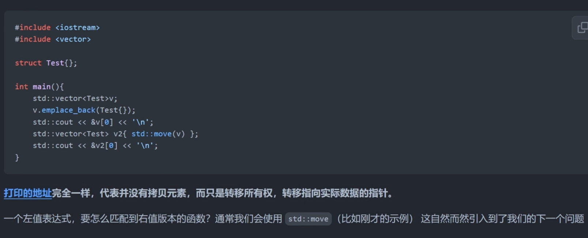

> `move到底是做什么的`

+ 让左值表达式转换为亡值表达式，用于匹配移动构造或移动赋值等函数。
  + 标志着“移动”，即转移了原对象的资源。

#### **完美转发**

```cpp
#include <iostream>
#include <type_traits>
using namespace  std;

struct Person
{
    Person(string&){ // 拷贝构造
        cout << "left value" << endl;
    }
    Person(string&&){ // 移动构造
        cout << "right value" << endl;
    }
};

/*
 *问题:
参数会导致对象发生拷贝、移动操作传递到构造函数，无法区分值的类别(左值、右值)
1.param
2.param
如何避免拷贝和移动?
使用引用参数
左值引用:就无法接收右值参数
右值引用:就无法接收左值参数
常量引用:万能引用，既可以引用左值、也可以引用右值原因:由于我们写的是常量引用，这样使得传递的参数增加const性
-- 希望参数“原封不动”传递到目标函数中
 */
//Person make_person(const string& param){
//    // 如果传递的参数 param 是左值
//    return Person(param);
//}


// C++支持泛型编程（模板计数），函数模板而言，很重要的特性，就是实现类型的自动推导
// T& 只能匹配左值
// T&& 可以
template<class  T>
Person make_person(T&& param){

    /*
     * 问题：区分左右值
     * T&& 引用折叠能够确定最终的类型：左右值
     * 左值引用：理解为对左值对象的一个别名
     * 右值引用：右值是即将被废弃的对象，右值引用目的就是未来给这些即将废弃的对象续命
     * 此时，无论左值对象、右值对象都变成具名对象(有名字的对象)，是一个左值对象了
     *
     * 解决方法：
     * 将param再转化为原来的类型，传递给Person构造函数里就可以了
     * */
    // 如果传递的参数 param 是左值
    cout << "是否左值:"<< is_lvalue_reference<T&&>::value << endl;
    cout<<  "是否右值:"<< is_rvalue_reference<T&&>::value << endl;
//    return Person((T&&)param); // c分格
    // C++
    //return Person(static_cast<T&&>(param));
    
    // 标准库----建议使用
    return Person(forward<T>(param);); 
 }

void test(){
    // 1. 传递左值
    string name = "zjx";
    make_person(name);

    //2. 传递右值
    make_person(move(name));
}

int main(){
    test();
    return 0;
}
```

#### **锁**

|              锁类型               |                  特点                  |                     优缺点                     |           使用场景            |
| :-------------------------------: | :------------------------------------: | :--------------------------------------------: | :---------------------------: |
|        **互斥锁 (Mutex)**         | 仅一个线程可以获取锁，其他线程必须等待 |       优点：简单易用；缺点：可能导致阻塞       |     常用于确保数据一致性      |
|       **自旋锁 (Spinlock)**       |       线程循环检查锁，直到获得锁       |     优点：减少上下文切换；缺点：高CPU占用      |   适用于锁等待时间短的情况    |
|   **读写锁 (Read-Write Lock)**    |      多线程可同时读，但写操作独占      |     优点：读性能高；缺点：写时会阻塞读操作     |  读多写少的场景，如缓存系统   |
|    **递归锁 (Recursive Lock)**    |         允许同一线程多次获得锁         |      优点：支持递归调用；缺点：增加锁开销      |   递归函数或嵌套锁使用场景    |
| **条件变量 (Condition Variable)** |            等待特定条件触发            |    优点：灵活控制线程同步；缺点：复杂度较高    |    线程需要等待某些条件时     |
|  **分布式锁 (Distributed Lock)**  |      多进程/线程跨系统间锁定资源       |     优点：适用于分布式环境；缺点：实现复杂     | 分布式系统资源锁定，如Redis锁 |
|     **偏向锁 (Biased Lock)**      |       锁偏向于第一次获取锁的线程       |   优点：降低竞争锁开销；缺点：有额外内存开销   |   同一线程频繁获取锁的场景    |
|  **轻量级锁 (Lightweight Lock)**  |        尝试避免操作系统层级的锁        | 优点：减少阻塞；缺点：性能较差时自动膨胀为重锁 |    无高并发需求的小型应用     |
|   **乐观锁 (Optimistic Lock)**    |        假设没有竞争，失败后重试        |      优点：减少锁开销；缺点：失败后需重试      |   无锁开销高或读多写少场景    |
|   **悲观锁 (Pessimistic Lock)**   |      假设有竞争，始终加锁保护资源      |      优点：确保数据一致性；缺点：影响性能      |    数据一致性要求高的场景     |

#### **死锁**

>  **死锁**是并发编程中常见的问题，指的是两个或多个进程或线程因为竞争资源而相互等待对方释放资源，从而陷入无限的等待状态。由于每个进程或线程都在等待其他进程或线程释放资源，而没有一个进程或线程能够释放资源，导致系统无法继续执行，这种状态被称为死锁。

+ **死锁的四个必要条件**

> 为了死锁的发生，必须同时满足以下四个条件（也称为“Coffman条件”）：

1. **互斥**：某种资源一次只允许一个进程访问，即该资源一旦分配给某个进程，其他进程就不能再访问，直到该进程访问结束。
2. **占有且等待**：一个进程本身占有资源（一种或多种），同时还有资源未得到满足，正在等待其他进程释放该资源。
3. **不可抢占**：别人已经占有了某项资源，你不能因为自己也需要该资源，就去把别人的资源抢过来。
4. **循环等待**：存在一个进程链，使得每个进程都占有下一个进程所需的至少一种资源。

+ **死锁的预防**

1. **破坏“不可抢占”条件**
   - 当一个已经持有了一些资源的`进程在提出新的资源请求没有得到满足时，它必须释放已经保持的所有资源`，待以后需要使用的时候再重新申请。这就意味着进程已占有的资源会被短暂地释放或者说是被抢占了。
   - 该种方法**实现起来比较复杂，且代价也比较大**。释放已经保持的资源很有可能会导致进程之前的工作实效等，反复的申请和释放资源会导致进程的执行被无限的推迟，这不仅会延长进程的周转周期，还会影响系统的吞吐量。
2. **破坏“占有且等待”条件**
   - 方法1：所有的进程在开始运行之前，必须一次性地申请其在整个运行过程中所需要的全部资源。
     - 优点：简单易实施且安全。
     - 缺点：因为某项资源不满足，进程无法启动，而其他已经满足了的资源也不会得到利用，严重降低了资源的利用率，造成资源浪费。
       - 使进程经常发生饥饿现象。
   - 方法2：该方法是对第一种方法的改进，**允许进程只获得运行初期需要的资源，便开始运行，在运行过程中逐步释放掉分配到的已经使用完毕的资源，然后再去请求新的资源**。这样的话，资源的利用率会得到提高，也会减少进程的饥饿问题。
3. **破坏“循环等待”条件**
   - 采用资源有序分配其基本思想是`将系统中的所有资源顺序编号`，将**紧缺的，稀少的采用较大的编号**，在申请资源时必须按照编号的顺序进行（**从小往大申请**），一个进程只有获得较小编号的进程才能申请较大编号的进程。

> **避免死锁**就是破坏造成死锁的，若干条件中的任意一个，常见的方法如下：

1. 加锁顺序
   + 当多个线程需要相同的一些锁，但是按照不同的顺序加锁，死锁就很容易发生。如果能确保所有的线程都是按照相同的顺序获得锁，那么死锁就不会发生，这是避免出现循环等待条件。

2. 加锁时限

   + 在尝试获取锁的时候加一个超时时间，这也就意味着在尝试获取锁的过程中若超过了这个时限该线程则放弃对该锁请求。若一个线程没有在给定的时限内成功获得所有需要的锁，则会进行回退并释放所有已经获得的锁，然后等待一段随机的时间再重试(对应条件2、3)。

   + 需要注意的是，由于存在锁的超时，所以我们不能认为这种场景就一定是出现了死锁。也可能是因为获得了锁的线程（导致其它线程超时）需要很长的时间去完成它的任务。

   + 此外，如果有非常多的线程同一时间去竞争同一批资源，就算有超时和回退机制，还是可能会导致这些线程重复地尝试但却始终得不到锁。

> 死锁检测

+ 死锁检测是一个更好的死锁预防机制，它主要是针对那些不可能实现按序加锁并且锁超时也不可行的场景。

+ 每当一个线程获得了锁，会在线程和锁相关的数据结构中（map、graph等等）将其记下。除此之外，每当有线程请求锁，也需要记录在这个数据结构中。

+ 当一个线程请求锁失败时，这个线程可以遍历锁的关系图看看是否有死锁发生。例如，线程A请求锁7，但是锁7这个时候被线程B持有，这时线程A就可以检查一下线程B是否已经请求了线程A当前所持有的锁。如果线程B确实有这样的请求，那么就是发生了死锁（线程A拥有锁1，请求锁7；线程B拥有锁7，请求锁1）。

+ 当然，死锁一般要比两个线程互相持有对方的锁这种情况要复杂的多。线程A等待线程B，线程B等待线程C，线程C等待线程D，线程D又在等待线程A。线程A为了检测死锁，它需要递进地检测所有被B请求的锁。从线程B所请求的锁开始，线程A找到了线程C，然后又找到了线程D，发现线程D请求的锁被线程A自己持有着。这是它就知道发生了死锁。
+ 一个可行的做法是释放所有锁，回退，并且等待一段随机的时间后重试。这个和简单的加锁超时类似，不一样的是只有死锁已经发生了才回退，而不会是因为加锁的请求超时了。虽然有回退和等待，但是如果有大量的线程竞争同一批锁，它们还是会重复地死锁。
+ 一个更好的方案是给这些线程设置优先级，让一个（或几个）线程回退，剩下的线程就像没发生死锁一样继续保持着它们需要的锁。如果赋予这些线程的优先级是固定不变的，同一批线程总是会拥有更高的优先级。为避免这个问题，可以在死锁发生的时候设置随机的优先级。


####  **`malloc,free`和 `new，delete`的区别**

> `malloc`,`free` c语言中库函数，`new`，`delete`是C++操作符

+ `new`是自动计算所需分配内存大小， `malloc`需要手动计算
+ `new` 返回的是**对象类型的指针**， `malloc`返回的是 `void*`之后进行类型转换 

```cpp
Task *ptask = (Task *) malloc(sizeof(*ptask));
```

+ `new` 分配失败会抛出异常，`malloc`分配失败返回的是 `NULL`
+ `new` 实在 `free store`【自由存储区：可能在堆上，也可以自定义】上分配内存，
  + `malloc`分配的是虚拟内存，是在堆上分配的
    + 小于 `128k`通过 `brk`系统调用——在堆上
    + 大于 `128k`是通过 `mmap`系统调用分配的——文件映射区
    + 如果分配的空间比较小，是在内存值当中分配的，内存值没有数据，通过系统调用 `brk`在堆上进行分配
  + `malloc` 调用后是否立即得到物理内存`malloc`最开始是没有初始化的，当前只是有一个具体的虚拟内存，如果映射到物理内存，我们通过缺页中断建立这一个映射关系。
+ `new`的实现过程
  + 首先调用 `operator new`的标准库函数，
  + 申请足够的空间
  + 调用构造函数 ——作用：初始化成员变量
  + 返回指向新分配并构造后的对象的指针
+ `delete`需要对象类型的指针，`free`是 `void*`类型的指针；
  + `delete`实现过程：
    + 先调用析构函数——释放资源
    + 调用 `operate delete`
    + 释放空间
  + `free（p）`怎么知道该释放多大的空间
    + `malloc`分配空间，多分配了 `16字节`的空间
    + 左偏移 `16字节`

##### 被 `free`回收的内存是立即返回还给操作系统吗？

+ 不是的
  + 被 `free`回收的内存会首先被 `ptmalloc`使用双链表保存起来，当用户下一次申请内存的时候，会尝试从这些内存中寻找合适的返回。这样就避免了频繁的系统调用，占用过多的系统资源。同时 `ptmalloc`也会尝试堆小块内存进行合并，避免过多的内存碎片。
+ `malloc`申请的空间小于`128k`，释放内存，不会还给操作系统由`malloc`内部管理起来
+ `malloc`申请的空间大于等于`128k`，释放内存，还给操作系统

#### **`const`和`static`**

+ `static`

  > 不考虑类的情况

  + 隐藏。所有不加 `static`的**全局变量**和函数具有全局可见性。可以在其它文件中使用，加了之后只能在该文件所在的编译模块中使用。
  + 默认初始化为0，包括未初始化的全局静态变量与局部静态变量，都存在全局未初始化区
  + 静态变量在函数内定义，始终存在，且只进行一次初始化，具有**记忆性**，其作用范围与局部变量相同，函数退出后仍然存在，但不能使用。

  > 考虑类的情况

  + `static`成员变量：只与类关联，不与类的对象关联。定义时要分配空间，不能在类声明中初始化，必须在类定义体外部初始化，初始化时不需要标示为 `static`；可以被非 `static`成员函数任意访问；【**类内声明，类外初始化**】
  + `static`成员函数：不具有`this`指针，无法访问类对象的非 `static`成员变量和非`static`成员函数； **不能被声明为`const`、虚函数和 `volatile`**；可以被非`static`成员函数任意访问；

+ `const`

  > 不考虑类的情况

  + `const`常量在定义时必须初始化，之后无法修改
  + `const`形参可以接收`const`和非`const`类型的实参

  > 考虑类的情况

  + `const`成员变量：不能在类定义外部初始化，只能通过构造函数初始化列表进行初始化，并且必须有构造函数；不同类对其`const`数据成员值可以不同，所以不能在类中声明时初始化；

  + ```cpp
    // 类中有一个const成员变量 const int a;
    Time::Time(int tmphour):a(00)// 初始化
    {
    	cout << "调用了Time::Time(int tmphour):a(00)构造函数" << endl;
    }
    ```

  + `const`成员函数： `const`对象不可以调用非`const`成员函数；非`const`对象都可以调用；不可以改变非`mutable`（用该关键字声明变量可以在`const`成员函数中修改）数据的值；

  > 总结：
  > 1、类中的`const`成员会被分配空间
  > 2、类中的`const`成员本质是只读变量
  > 3、类中的`const`成员只能在初始化列表中指定初始值。
  > 4、编译器无法直接得到`const`成员初始值，因此无法进入符号表成为真正意义上的常量
  > 5、类中的`const`成员可以使用`const_cast`去除只读属性后通过指针修改值
  > 6、初始化是对正在创建的对象进行初值设置，赋值是对已经存在的对象进行值设置

#### **重载和重写**

1.定义不同---重载是定义相同的方法名，参数不同;重写是子类重写父类的方法。

2.范围不同---重载是在一个类中，重写是子类与父类之间的。

3.多态不同---重载是编译时的多态性，重写是运行时的多态性。

4.返回不同---重载对返回类型没有要求，而重写要求返回类型必须相同。

5.参数不同---重载的参数个数、参数类型、参数顺序可以不同，而重写父子方法参数必须相同。

6.修饰不同---重载对访问修饰没有特殊要求，重写访问修饰符的限制一定要大于被重写方法的访问修饰符。

#### **`Union`**

- **联合体的定义：** Union是一种特殊的C语言数据结构，它可以存储多个类型的变量，但任意时刻只有一个成员有效。所有成员共享同一块内存。

- **特点：**

  1. Union 的大小等于最大成员的大小。
  2. 每个成员的值共享同一片内存，因此当你向某一成员赋值时，它会覆盖其他成员。

- **示例：**

  ```cpp
  union Data {
      int i;
      float f;
      char str[20];
  };
  ```

  如果 `i` 被赋值，存储空间被 `i` 占用；如果接着给 `f` 赋值，`i` 的值将被覆盖。

- **now同时赋值问题：** 联合体不允许多个成员同时存储值，只有一个成员有效。如果需要多个成员同时存储值，则需要使用结构体或其他机制。

#### **四种类型转换**

> `static_cast`

+ 特点：

  - 编译时检查，转换在编译时执行，性能开销低。

  - 适用于基本类型之间的转换、类层次结构中的上行转换（从派生类到基类）、非多态类型的转换等。

  - 不涉及运行时检查，如果类型不兼容，编译时就会报错，保证了一定的类型安全性。

  - 不能用于转换没有相关性的类型，例如指针之间的任意转换。

+ 使用场景：

  - **基本类型转换**：如 `int` 转 `double`、`char` 转 `int` 等。

  - **类层次结构的上行转换**：如派生类对象转换为基类指针或引用。

  - **显式调用非隐式转换的构造函数**。

示例：

```cpp
int i = 42;
double d = static_cast<double>(i);  // 将 int 转换为 double

class Base {};
class Derived : public Base {};
Derived d_obj;
Base* b_ptr = static_cast<Base*>(&d_obj);  // 派生类指针转换为基类指针
```

注意：

- `static_cast` 只能用于安全的类型转换，不能转换不相关类型的指针或引用。如果在类层次结构中进行向下转换（基类转换为派生类），这可能导致未定义行为，因为没有运行时类型检查。

> `dynamic_cast`

+ 特点：

  - 运行时类型检查，仅适用于多态类型（即包含虚函数的类）。

  - 用于安全地在类层次结构中进行**向下转换**，将基类指针或引用转换为派生类指针或引用。

  - 如果转换失败，指针会返回 `nullptr`，引用会抛出 `std::bad_cast` 异常。

  - 适合当你不确定基类对象的实际类型时使用，确保类型转换安全。

+ 使用场景：

  - **类层次结构的向下转换**：如将基类指针安全地转换为派生类指针。

  - **检查类型安全性**：需要在运行时判断类型转换是否成功。

示例：

```cpp
class Base {
public:
    virtual ~Base() {}  // 必须有虚函数才能使用 dynamic_cast
};
class Derived : public Base {};
class AnotherClass : public Base {};

Base* base = new Derived();
Derived* derived = dynamic_cast<Derived*>(base);  // 成功：base 实际指向 Derived
AnotherClass* another = dynamic_cast<AnotherClass*>(base);  // 失败，返回 nullptr
if (another == nullptr) {
    std::cout << "Conversion failed" << std::endl;
}
```

注意：

- 只有在多态类中才能使用 `dynamic_cast`，如果类中没有虚函数表，它将无法工作。
- 向下转换时，`dynamic_cast` 比 `static_cast` 更安全，但也带来运行时性能开销。

> `const_cast`

+ 特点：

  - 用于添加或移除对象的 `const` 或 `volatile` 限定符。

  - 只能改变 `const` 或 `volatile` 的性质，不改变对象的底层类型。

  - 经常用于需要绕过 `const` 修饰符来修改数据，但必须确保对象的原始定义不是 `const`，否则修改会导致未定义行为。

+ 使用场景：

  - **修改 `const` 参数**：例如函数参数被声明为 `const`，但需要修改该参数。

  - **将非 `const` 对象传递给需要 `const` 参数的函数**。

示例：

```cpp
void modify(int* p) {
    *p = 10;
}

const int i = 5;
modify(const_cast<int*>(&i));  // 移除 const 属性，但对原始 const 对象的修改会导致未定义行为

void print(const int& i) {
    std::cout << i << std::endl;
}
int j = 5;
print(const_cast<const int&>(j));  // 添加 const 属性，将非 const 对象传递给 const 参数
```

注意：

- **禁止修改真正的常量对象**，例如通过 `const_cast` 修改 `const` 变量将导致未定义行为。
- 通常在操作系统 API 或库接口需要非 `const` 参数时使用。

> `reinterpret_cast`

+ 特点：

  - 最危险、最强大的类型转换，允许几乎任意类型之间的转换。

  - 本质上是**位级别的转换**，直接转换指针、引用、整型等，不关心它们的真实类型。

  - 不进行任何类型检查或数据调整，可能导致未定义行为。

  - 适用于需要在位级别直接控制或访问底层数据的场景，例如低级系统编程或与硬件交互。

+ 使用场景：

  - **指针类型之间的转换**：如将 `int*` 转换为 `char*`，用于操作内存。

  - **指针与整数之间的转换**：例如从 `int` 转换为 `void*`，或将指针转为整数类型。

  - **硬件寄存器访问**：用于操作系统内核编程、驱动程序开发或嵌入式系统。

示例：

```cpp
int i = 42;
void* p = reinterpret_cast<void*>(&i);  // int* 转换为 void*
struct A { int a; };
struct B { int b; };
A a_obj;
B* b_ptr = reinterpret_cast<B*>(&a_obj);  // 将 A* 转换为 B*
```

注意：

- `reinterpret_cast` 仅在知道操作的类型转换是有意义的情况下使用。它跳过所有类型安全性检查，如果类型不兼容，可能导致程序崩溃或其他未定义行为。
- 一般避免在常规应用程序中使用，除非非常明确需要低级别的位操作。

| 类型转换           | 检查类型          | 执行时间 | 使用场景                                          | 是否安全                     |
| ------------------ | ----------------- | -------- | ------------------------------------------------- | ---------------------------- |
| `static_cast`      | 编译时检查        | 编译时   | 基本类型转换、上行转换                            | 类型安全                     |
| `dynamic_cast`     | 运行时类型检查    | 运行时   | 类层次结构中的向下转换，多态对象的类型安全转换    | 类型安全（运行时检查）       |
| `const_cast`       | 移除/添加 `const` | 编译时   | 添加或移除 `const`/`volatile` 限定符              | 需要小心使用                 |
| `reinterpret_cast` | 位级别转换        | 编译时   | 不相关指针/类型之间的转换，硬件编程，底层系统编程 | 不类型安全（可能未定义行为） |

#### **STL的常用容器**


+ **容器(`Containers`)**:各种数据结构，如`Vector`,`List`,`Deque`,`Set`,`Map`,用来存放数据，`STL`容器是一种`Class Template`,一句话 ，这货是用来组织数据 ，存放数据的。
+ **算法(`Algorithms`)**:各种常用算法如`Sort,Search,Copy,Erase`,从实现的角度来看，`STL`算法是一种`Function Templates`，一句话，这货是用来对数据进行加工处理的。
+ **迭代器(`Iterators`):**扮演**容器与算法之间的胶合剂**，是所谓的"泛型指针”，共有五种类型，以及其它衍生变化，从实现的角度来看，迭代器是一种将`:0perators*,0perator->,0perator++,Operator-`等相关操作予以重载的`Class Template`。可以把迭代器看成从容器中挖数据的勺子，是一个指针。
+ **仿函数(`Functors`)**:行为类似函数，可作为算法的某种策略(`Policy`),从实现的角度来看，仿函数是一种重载了“小括号”的`Class` 或 `Class Template`。一般函数指针可视为狭义的仿函数。
+ **适配器(配接器)(`Adapters`)**:一种用来修饰容器(`Containers`)或仿函数(`Functors`)或迭代器(`Iterators`)接口的东西，例如:`STL`提供的`Queue`和`Stack`，虽然看似容器，其实只能算是一种容器配接器因为 它们的底部完全借助`Deque`，所有操作有底层的`Deque`供应。改变`Functor`接口者，称为`Function Adapter`;改变`Container`接口者，称为`Container Adapter`;改变`Iterator`接口者，称为`Iterator Adapter`。配接器的实现技术很难一言蔽之，必须逐一分析。
+ **Allocator(分配器)** 负责空间配置与管理，从实现的角度来看，配置器是一个实现了动态空间配置、空间管理、空间释放的Class Template。

| 容器           | 底层数据结构     | 时间复杂度                                                | 有无序 | 可不可重复 | 其它                                                         |
| -------------- | ---------------- | --------------------------------------------------------- | ------ | ---------- | ------------------------------------------------------------ |
| array          | 数组             | 随机读改O(1)                                              | 无序   | 可重复     | 支撑快速随机访问                                             |
| vector         | 动态数组         | 随机读改、尾部插入、尾部删除O(1)、头部插入、头部删除 O(n) | 无序   | 可重复     | 支撑快速随机访问                                             |
| list           | 双向链表         | 插入、删除 O(1)、随机读改 O(n)                            | 无序   | 可重复     | 支撑快速增删                                                 |
| deque          | 双端队列         | 头尾插入、头尾删除 O(1)                                   | 无序   | 可重复     | 一个中央控制器+多个缓冲区，支持首尾快速增删，支持随机访问    |
| stack          | deque /list      | 顶部插入、顶部删除 O(1)                                   | 无序   | 可重复     | deque 或 list 封闭头端开口，不用 vector的原因应该是容量大小有限制，扩容耗时 |
| queue          | deque /list      | 顶部插入、顶部删除 O(1)                                   | 无序   | 可重复     | deque 或 list 封闭头端开口，不用 vector的原因应该是容量大小有限制，扩容耗时 |
| priority_queue | vector +maX-heap | 插入、删除 O(log2n)                                       | 有序   | 可重复     | vector容器+heap处理规则                                      |
| set            | 红黑树           | 插入、删除、查找 O(log2n)                                 | 有序   | 不可重复   |                                                              |
| multiset       | 红黑树           | 插入、删除、查找 O(log2n)                                 | 有序   | 可重复     |                                                              |
| map            | 红黑树           | 插入、删除、查找 O(log2n)                                 | 有序   | 不可重复   |                                                              |
| multimap       | 红黑树           | 插入、删除、查找 O(log2n)                                 | 有序   | 可重复     |                                                              |

> vector

+ **特点**

  - **连续内存分配**：元素在内存中连续存储，有利于快速访问。

  - **动态大小**：根据需要自动扩容，但扩容时可能会导致内存重新分配和元素复制。

  - **随机访问**：支持通过索引直接访问元素，时间复杂度为O(1)。

  - **迭代器**：提供随机访问迭代器，支持STL算法。

+ 原理

  + vector底层是一个动态数组，包含三个迭代器，start和finish之间是已经被使用的空间范围，end_of_storage是整块连续空间包括备用空间的尾部。
  + 当空间不够装下数据（vec.push_back(val)）时，**会自动申请另一片更大的空间（1.5倍或者2倍）**，然后把原来的数据拷贝到新的内存空间，接着释放原来的那片空间【vector内存增长机制】。
  + 当释放或者删除（vec.clear()）里面的数据时，其存储空间不释放，仅仅是清空了里面的数据。
  + 因此，对vector的任何操作一旦引起了空间的重新配置，指向原vector的所有迭代器会都失效了。

+ [**vector** **迭代器失效问题**](https://blog.csdn.net/2301_79551553/article/details/136960113)

  

  > 1️⃣：所有可能会引起扩容的操作都可能会导致迭代器失效。如：resize、reserve、insert、assign、push_back等  --------------  **野指针**引起的迭代器失效
  >
  > 2️⃣：指定位置的插入和删除都会都可能会导致迭代器失效。如: insert 、erase -----------------   迭代器指向的位置意义发生改变

  + 迭代器的主要作用就是让算法能够不用关心底层数据结构，其底层实际就是一个指针，或者是对指针进行了封装，比如：vector的迭代器就是原生态指针T* 。因此迭代器失效，**实际就是迭代器底层对应指针所指向的空间被销毁了**，而使用一块已经被释放的空间，造成的后果是程序崩溃(即如果继续使用已经失效的迭代器，程序可能会崩溃)。

> 对于vector可能会导致其迭代器失效的操作有： 

1. 会引起其底层空间改变的操作，都有可能是迭代器失效，比如：`resize、reserve、insert、assign、 push_back`、
2. `erase`删除`pos`位置元素后，`pos`位置之后的元素会往前搬移，没有导致底层空间的改变，理论上讲迭代器不应该会失效，但是：如果`pos`刚好是最后一个元素，删完之后`pos`刚好是`end`的位置，而`end`位置没有元素的，那么`pos`就失效了。因此删除`vector`中任意位置上元素时，`vs`就认为该位置迭代器失效了。
3. 注意：`Linux`下，`g++`编译器对迭代器失效的检测并不是非常严格，处理也没有vs下极端
4. 与`vector`类似，`string`在插入+扩容操作+`erase`之后，迭代器也会失效

> 解决方法

+ ‌**避免在遍历过程中进行插入或删除操作**‌：在进行插入或删除操作后，使用返回的新的迭代器进行遍历，或者及时更新迭代器的位置。
+ ‌**使用‌智能指针管理动态分配的内存**‌：使用智能指针（如`shared_ptr`、`unique_ptr`）可以帮助管理对象的生命周期，确保在迭代器使用期间对象不被提前销毁，从而避免迭代器失效。
+ ‌**使用容器提供的成员函数进行插入和删除操作**‌：使用容器提供的`erase`和`insert`等成员函数可以安全地处理元素的删除和插入操作，并确保迭代器的有效性。
+ ‌**检查迭代器的有效性**‌：在使用迭代器之前，检查其有效性，确保它指向一个合法的位置。如果迭代器失效，可以重新获取新的迭代器或更新迭代器的位置。
+ ‌**固定容器大小**‌：通过固定容器大小来规避迭代器失效的问题。例如，使用固定大小的数组或预分配的容器，避免发生重新分配内存的情况。

+ emplace_back()和push_back()的区别
  + emplace_back() 和 push_back() 的区别，就在于底层实现的机制不同。push_back() 向容器尾部添加元素时，首先会创建这个元素，然后再将这个元素拷贝或者移动到容器中（如果是拷贝的话，事后会自行销毁先前创建的这个元素）；而emplace_back() 在实现时，则是直接在容器尾部创建这个元素，省去了拷贝或移动元素的过程。

> unordered_map

+ std::unordered_map 是一个无序的关联容器。

+ `std:.unordered_map` 的底层实现基于**哈希表**。每个键值对通过哈希函数被映射到一个桶(bucket)中。桶实际上是一个链表，用于处理哈希冲突(即不同键具有相同哈希值的情况)。当插入一个键值对时，首先通过哈希函数计算出键的哈希值，然后定位到对应的桶，最后将这个键值对添加到桶的链表中。查找和删除操作也类似，首先通过哈希函数找到桶，然后在桶的链表中查找或删除相应的键值对。

#### **多线程多进程场景**

> 多线程的使用场景：

+ I/O密集型任务：当程序需要进行大量的I/O操作（如文件读写、网络通信等）时，可以使用多线程来提高效率，因为在I/O操作时，CPU大部分时间处于空闲状态，可以让其他线程继续执行。
+ GUI应用程序：在用户界面程序中，需要保持UI的响应性，而且有很多后台任务需要同时执行，这时可以使用多线程来处理后台任务，以免阻塞主线程导致UI无响应。
+ 异步编程：通过多线程可以很方便地实现异步编程，例如在Web开发中处理并发请求、消息处理等场景。

> 多进程的使用场景：

+ CPU密集型任务：当程序需要进行大量的CPU计算时，可以使用多进程来充分利用多核CPU，提高计算效率。
+ 并行计算：在需要进行并行计算的应用中，多进程可以实现真正的并行执行，每个进程独享一部分系统资源，不会受到GIL（全局解释器锁）的限制。
+ 服务端程序：在需要同时处理多个客户端连接的服务器程序中，可以使用多进程来处理每个客户端的请求，以提高并发处理能力。

>  在多线程中，如何避免出现死锁、竞争等问题

+ 在多线程编程中，避免死锁、竞争等问题是非常重要的。以下是一些常见的方法来避免这些问题：
  + 使用锁：使用锁（Lock）来保护临界资源，确保在同一时间只有一个线程可以访问共享资源。通过良好的加锁机制，可以避免竞争条件和数据竞争的问题。
  + 避免嵌套锁：在多线程编程中，应尽量避免在持有一个锁的情况下再去请求另一个锁，这样很容易导致死锁。如果确实需要多个锁，尽量按照相同的顺序获取锁，避免交叉获取造成死锁。
  + 使用条件变量：条件变量（Condition）是一种线程同步的工具，它允许线程在满足特定条件时才继续执行，可以用于线程间的通信和协调。
  + 使用原子操作：对于简单的原子操作（如加减操作），可以使用原子操作或者线程安全的数据结构来避免竞争条件。
  + 合理设计数据结构：合理的数据结构设计可以减少对共享资源的竞争，例如使用无锁的数据结构、immutable对象等。
  + 合理的线程通信：合理地利用线程间的通信机制，如队列、事件、信号量等，避免直接对共享资源进行读写操作。
  + 避免线程间的依赖关系：尽量设计独立的线程，避免线程间的复杂依赖关系，降低线程间竞争的可能性。
  + 使用线程安全的库和工具：在实际开发中，可以使用有线程安全保障的第三方库和工具，减少手动处理并发问题的复杂度。

#### **进程调度方法**

进程调度是操作系统中一项关键任务，负责按照一定的策略和算法从就绪态进程中为当前空闲的CPU选择要运行的进程。以下是几种常见的进程调度方法：

1.  ‌`先来先服务（FCFS）‌`：按照作业到达任务队列的顺序进行调度，这种算法简单直观，但可能导致长作业等待时间过长。它适用于批处理系统，其中作业的到达时间相对固定‌。
2. `短作业优先（SJF）`：将CPU时间片分配给已经运行时间最短的进程。这种算法可以最大程度地减少平均等待时间，但可能会导致长作业被饿死。它优先照顾短作业，适用于实时系统‌。
3.  ‌`轮转调度（RR）‌`：将所有进程按照到达顺序排成一个队列，每个进程执行一个时间片后，将CPU时间片分配给下一个进程。这种算法适用于时间片较短的情况，能够平衡长短作业的执行‌。
4. `优先级调度‌`：为每个进程分配一个优先级，优先级高的进程先获得CPU时间片。这种算法可以根据不同的情况调整优先级，但可能导致低优先级的进程长时间等待‌。
5.  ‌`多级反馈队列调度‌`：将进程分为多个队列，每个队列有不同的优先级和时间片大小。当进程在一个队列中执行完毕，可以进入下一个优先级较高的队列。这种算法能够兼顾不同类型的作业‌。
6. `时间片轮转`：系统将CPU处理时间划分为多个时间片，进程按照到达先后顺序排列。每次调度选择队首的进程，执行完一个时间片后，该进程移动至队尾。这种算法适用于分时系统，能够在规定时间内响应所有用户的请求‌。


#### **线程间的通信**

- 使用全局变量
  + 主要由于多个线程可能更改全局变量，因此全局变量最好声明为volatile
- 使用消息实现通信
  + 在Windows程序设计中，每一个线程都可以拥有自己的消息队列（UI线程默认自带消息队列和消息循环，工作线程需要手动实现消息循环），因此可以采用消息进行线程间通信`sendMessage`,`postMessage`。

    ```cpp
    1)定义消息#define WM_THREAD_SENDMSG=WM_USER+20;  
    
    2)添加消息函数声明afx_msg int OnTSendmsg(); 
    
    3)添加消息映射ON_MESSAGE(WM_THREAD_SENDMSG,OnTSM) 
        
    4)添加OnTSM()的实现函数；
        
    5)在线程函数中添加PostMessage消息Post函数
    ```

+ 使用事件CEvent类实现线程间通信
  + Event对象有两种状态：有信号和无信号，线程可以监视处于有信号状态的事件，以便在适当的时候执行对事件的操作。

    ```cpp
    1)创建一个CEvent类的对象：CEvent threadStart;它默认处在未通信状态； 
        
    2)threadStart.SetEvent();使其处于通信状态； 
        
    3)调用WaitForSingleObject()来监视CEvent对象
    ```

#### **线程间的同步**

+ 各个线程可以访问进程中的公共变量，资源，所以使用多线程的过程中需要注意的问题是如何防止两个或两个以上的线程同时访问同一个数据，以免破坏数据的完整性。数据之间的相互制约包括

  1. 直接制约关系，即一个线程的处理结果，为另一个线程的输入，因此线程之间直接制约着，这种关系可以称之为同步关系
  2. 间接制约关系，即两个线程需要访问同一资源，该资源在同一时刻只能被一个线程访问，这种关系称之为线程间对资源的互斥访问，某种意义上说互斥是一种制约关系更小的同步

+ 线程间的同步方式有四种

  - 临界区

    + 临界区对应着一个`CriticalSection`对象，当线程需要访问保护数据时，调用`EnterCriticalSection`函数；当对保护数据的操作完成之后，调用`LeaveCriticalSection`函数释放对临界区对象的拥有权，以使另一个线程可以夺取临界区对象并访问受保护的数据。

    > PS:关键段对象会记录拥有该对象的线程句柄即其具有“线程所有权”概念，即进入代码段的线程在leave之前，可以重复进入关键代码区域。所以关键段可以用于线程间的互斥，但不可以用于同步（同步需要在一个线程进入，在另一个线程leave）

  - 互斥量

    + 互斥与临界区很相似，但是使用时相对复杂一些（互斥量为内核对象），不仅可以在同一应用程序的线程间实现同步，还可以在不同的进程间实现同步，从而实现资源的安全共享。

    > PS:1、互斥量由于也有线程所有权的概念，故也只能进行线程间的资源互斥访问，不能由于线程同步；
    > 2、由于互斥量是内核对象，因此其可以进行进程间通信，同时还具有一个很好的特性，就是在进程间通信时完美的解决了"遗弃"问题

  - 信号量

    + 信号量的用法和互斥的用法很相似，不同的是它可以同一时刻允许多个线程访问同一个资源，`PV`操作

    > PS:事件可以完美解决线程间的同步问题，同时信号量也属于内核对象，可用于进程间的通信

  - 事件

    + 事件分为手动置位事件和自动置位事件。事件Event内部它包含一个使用计数（所有内核对象都有），一个布尔值表示是手动置位事件还是自动置位事件，另一个布尔值用来表示事件有无触发。由`SetEvent()`来触发，由`ResetEvent()`来设成未触发。

    > PS:事件是内核对象,可以解决线程间同步问题，因此也能解决互斥问题

#### **进程间通信**

+ 进程间通信又称`IPC(Inter-Process Communication),`指多个进程之间相互通信，交换信息的方法。根据进程通信时信息量大小的不同,可以将进程通信划分为两大类型:
  + 低级通信,控制信息的通信(主要用于进程之间的同步,互斥,终止和挂起等等控制信息的传递)

  + 高级通信,大批数据信息的通信(主要用于进程间数据块数据的交换和共享,常见的高级通信有管道,消息队列,共享内存等).

+ **管道( `pipe` )**：管道是一种半双工的通信方式，数据只能单向流动，而且只能在具有亲缘关系的进程间使用。进程的亲缘关系通常是指父子进程关系【匿名管道】。
  + `有名管道 (named pipe)` ： 有名管道也是半双工的通信方式，但是它允许无亲缘关系进程间的通信。
  
+ **信号量( `semophore` )** ： 信号量是一个计数器，可以用来控制多个进程对共享资源的访问。不是用于交换大批数据,而用于多线程之间的同步.常作为一种锁机制,防止某进程在访问资源时其它进程也访问该资源。因此，主要作为进程间以及同一进程内不同线程之间的同步手段。

+ **消息队列( `message queu`e )** ： 消息队列是由消息的链表，存放在内核中并由消息队列标识符标识。消息队列克服了信号传递信息少、管道只能承载无格式字节流以及缓冲区大小受限等缺点。

+ **信号 ( `signal` )** ： 信号是一种比较复杂的通信方式，用于通知接收进程某个事件已经发生。

+ **[共享内存( `shared memor`y )]** ：共享内存就是映射一段能被其他进程所访问的内存，这段共享内存由一个进程创建，但多个进程都可以访问。`共享内存是最快的` `IPC` 方式，它是针对其他进程间通信方式运行效率低而专门设计的。它往往与其他通信机制，如信号两，配合使用，来实现进程间的同步和通信。

+ **套接字( `socket` )** ： 套接字也是一种进程间通信机制，与其他通信机制不同的是，它可用于不同机器间的进程通信

#### **断点上传和下载**

### 2断点续传

### 2.1 什么是断点续传

断点续传是在下载或上传时，将下载或上传任务（一个文件或一个压缩包）人为的划分为几个部分，每一个部分采用一个线程进行上传或下载，如果碰到网络故障，可以从已经上传或下载的部分开始继续上传或者下载未完成的部分，而没有必要从头开始上传或者下载。

### 2.2 应用场景

断点续传可以看成是分片上传的一个衍生，因此可以使用分片上传的场景，都可以使用断点续传。

### 2.3 实现断点续传的核心逻辑

+ 在分片上传的过程中，如果因为系统崩溃或者网络中断等异常因素导致上传中断，这时候客户端需要记录上传的进度。在之后支持再次上传时，可以继续从上次上传中断的地方进行继续上传。

+ 为了避免客户端在上传之后的进度数据被删除而导致重新开始从头上传的问题，服务端也可以提供相应的接口便于客户端对已经上传的分片数据进行查询，从而使客户端知道已经上传的分片数据，从而从下一个分片数据开始继续上传。

>  整体的过程如下：

1.  前端将文件安装百分比进行计算,每次上传文件的百分之一(文件分片),给文件分片做上序号
2.  后端将前端每次上传的文件,放入到缓存目录
3.  等待前端将全部的文件内容都上传完毕后,发送一个合并请求
4.  后端使用RandomAccessFile进多线程读取所有的分片文件,一个线程一个分片
5.  后端每个线程按照序号将分片的文件写入到目标文件中
6.  在上传文件的过程中发生断网了或者手动暂停了,下次上传的时候发送续传请求,让后端删除最后一个分片
7.  前端重新发送上次的文件分片

#### **time_wait**

在TCP网络编程中，`TIME_WAIT`是一个常见的状态，它出现在主动关闭连接的一方完成关闭请求后，用于确保之前发送的数据包都被正确接收和处理。其主要作用有以下几点：

1. **防止旧数据包影响新连接**：TCP连接在关闭后，如果立即允许新的连接重用相同的端口号，可能会因为网络延迟导致旧连接的数据包（如重传包）影响到新连接。`TIME_WAIT`状态会持续一段时间（通常是2倍的最大段寿命，即`2*MSL`），确保旧数据包完全从网络中消失。
2. **确保可靠关闭**：`TIME_WAIT`状态使得主动关闭方能发送最终的`ACK`确认包，确保双方都已正确关闭连接，避免资源未释放导致的问题。

### 关闭或绕过`TIME_WAIT`

在某些高并发或服务器重启的场景中，大量处于`TIME_WAIT`状态的连接会占用系统资源。虽然`TIME_WAIT`的存在有其必要性，但在一些开发场景中可以采取措施优化。

1. **设置端口复用**：通过设置`SO_REUSEADDR`或`SO_REUSEPORT`选项，可以允许一个新的进程或线程立即绑定一个处于`TIME_WAIT`状态的端口。这是最常见的方法，不会立即关闭`TIME_WAIT`状态，但允许快速复用端口。

   ```
   cpp复制代码int reuse = 1;
   setsockopt(sockfd, SOL_SOCKET, SO_REUSEADDR, &reuse, sizeof(reuse));
   ```

2. **降低`TIME_WAIT`持续时间**：在某些操作系统中（如Linux），可以通过设置`tcp_tw_recycle`或`tcp_tw_reuse`参数缩短`TIME_WAIT`的持续时间。

   ```
   bash复制代码# 允许快速复用TIME_WAIT的连接
   echo 1 > /proc/sys/net/ipv4/tcp_tw_reuse
   ```

3. **避免短时间内大量关闭连接**：通过优化应用逻辑，减少主动关闭的频率，或者使用连接池来管理连接，避免频繁的连接关闭。

4. **避免主动关闭**：如果可能，让客户端而非服务器主动关闭连接，这样服务器端就不会进入`TIME_WAIT`状态。

需要注意的是，绕过或缩短`TIME_WAIT`会带来一定的风险，尤其是在数据传输对可靠性要求较高的场景下。

#### **排序算法**

<!-- tabs:start -->

#### **概述**

> [912. 排序数组](https://leetcode.cn/problems/sort-an-array/)


>注：下面对应方法的时间复杂度均代表平均时间复杂度
>稳定排序：如果 a 原本在 b 前面，且 a == b，排序之后 a 仍然在 b 前面。
>非稳定排序：如果 a 原本在 b 前面，且 a == b，排序之后 a 不一定在 b 前面。
>原地排序 / 非原地排序：区别在于是否 使用额外的数组 辅助排序

#### **冒泡排序**

> （Bubble Sort）（稳定排序）（超出时间限制）

+ 比较相邻元素，如果第一个比第二个大，则交换。

+ 时间复杂度`n^2`，空间复杂度1

代码：

```c++
class Solution {
public:
    vector<int> sortArray(vector<int>& nums) {
        // bubbleSort
        int n = n  2 1; ++i) {
            bool flag = false;
            for (int j = 0; j < n - 1 - i; ++j) {
                if (nums[j] > nums[j + 1]) {
                    swap(nums[j], nums[j + 1]);
                    flag = true;
                }                 
            }
            if (flag == false) break; //无交换，代表当前序列已经最优 
        }
        return nums;
    }
};
```

#### **选择排序**

>  （Select Sort）（非稳定排序）（超出时间限制）

+ 依次给每个位置选择当前位置及以后最小的元素（交换当前元素与之后最小元素的位置）。

> 不稳定举例：
> 排序前：5, 5*, 1, 7
> 排序后：1, 5*, 5, 7

+ 时间复杂度n^2，空间复杂度1

代码：

```c++
class Solution {
public:
    vector<int> sortArray(vector<int>& nums) {
        // selectSort 选择排序
        int minIndex;
        int n = nums.size();
        for (int i = 0; i < n - 1; ++i) {
            minIndex = i;
            for (int j = i + 1; j < n; ++j) {
                if (nums[j] < nums[minIndex]) {
                    minIndex = j;
                }
            }
            swap(nums[i], nums[minIndex]);
        }
        return nums;
    }
};
```

#### **插入排序**

> （Insect Sort）（稳定排序）（超出时间限制）
> 在前 0 ~ i - 1 元素有序的情况下，（依次）将第 i 个元素插入前面已经有序的小序列，使其有序。

+ 时间复杂度`n^2`，空间复杂度1

代码：

```c++
class Solution {
public:
    vector<int> sortArray(vector<int>& nums) {
        // insertSort 插入排序
        int n = nums.size();
        // 第一个元素被认为已经被排序
        for (int i = 1; i < n; ++i) {
            // 两元素递增排序，则直接插入
            if (nums[i] >= nums[i - 1]) continue;
            // nums[i] < nums[i - 1]
            // 二分查找，时间复杂度logn
            int l = 0, r = i - 1;
            while (l <= r) {
                int mid = l + (r - l) / 2;
                // r右侧元素均大于 nums[i]，即 r 及其左侧元素均小于等于nums[i]
                if (nums[i] < nums[mid]) r = mid - 1; 
                else l = mid + 1; 
            }
            int index = r + 1; // 稳定排序，依次排列
            // 将当前 i 元素插入在 index 位置，index ~ i - 1 元素依次后移，时间复杂度n
            int tmp = nums[i];
            for (int k = i; k >= index + 1; --k) {
                nums[k] = nums[k - 1]; // 依次后移一位
            }
            nums[index] = tmp;
        }
        return nums;
    }
};
```

#### **希尔排序**

> （Shell Sort）（非稳定排序）
> 改进的插入排序（优化：原数组的一个元素距离正确位置很远的情况）
> 先让间隔 h 的元素有序，在使得间隔为 h / 2，一直缩小，一直到 h = 1（此时数组有序）。

+ 时间复杂度介于nlogn和n^2之间，空间复杂度1

代码：

```c++
class Solution {
    void shellSort(vector<int>&nums, int gap, int i) {
        int j, tmp = nums[i];
        for (j = i - gap; j >= 0 && tmp < nums[j]; j -= gap) {
            // 依次后移
            nums[j + gap] = nums[j];
        }
        nums[j + gap] = tmp;
    }
public:
    vector<int> sortArray(vector<int>& nums) {
        int n = nums.size();
        // 分组，最开始时，间隔 gap 为数组的一半
        for (int gap = n / 2; gap >= 1 ; gap /= 2) {
            // 对各个分组进行插入分组
            for (int i = gap; i < n; ++i) {
                shellSort(nums, gap, i);
            }
        }
        return nums;
    }
};
```

#### **归并排序**

> （Merge Sort）（稳定排序）

+ 将无序数组拆分，排序后再合并成大的有序数组。

+ 时间复杂度nlogn，空间复杂度n

代码：

```C++
class Solution {
    vector<int> tmp;
    void mergeSort (vector<int>& nums, int l, int r) {
        if (l >= r) return; // 不需进行排列
        int mid = l + (r - l) / 2;
        // 自底向上
        mergeSort(nums, l, mid);
        mergeSort(nums, mid + 1, r);
        // 排序当前数组
        int i = l, j = mid + 1, pos = l;
        while (i <= mid && j <= r) {
            if (nums[i] <= nums[j]) {
                tmp[pos] = nums[i];
                ++i;
            } else {
                tmp[pos] = nums[j];
                ++j;
            }
            ++pos;
        }
        for (int k = i; k <= mid; ++k) {
            tmp[pos++] = nums[k];
        }
        for (int k = j; k <= r; ++k) {
            tmp[pos++] = nums[k];
        }
        copy(tmp.begin() + l, tmp.begin() + r + 1, nums.begin() + l);
    }
public:
    vector<int> sortArray(vector<int>& nums) {
        int n = nums.size();
        tmp = nums;
        surgeSort(nums, 0, n - 1);
        return nums;
    }
};

```

#### **快速排序**

> （Quick Sort）（非稳定排序）

+ 随机选取一个数（x = rand() % len + startIndex）作为基准；
+ 把比基准小的数交换到前面，比基准大的数交换到后面；
+ 对左右区间递归重复。

> 时间复杂度nlogn，空间复杂度logn

代码：

```C++
class Solution {
    void quickSort(vector<int>&nums, int startIndex, int endIndex) {
        if (startIndex >= endIndex) return;
        
        int x = rand() % (endIndex - startIndex + 1) + startIndex; // 基于随机的原则
        swap(nums[startIndex], nums[x]);
        int firstNum = nums[startIndex];
        
        int l = startIndex, r = endIndex;
        while (l < r) {
            // 从后往前走，将比第一个小的移到前面
            while (l < r && nums[r] >= firstNum) --r;
            if (l < r) {
                nums[l] = nums[r];
            }
            // 从前往后走，将比第一个大的移到后面
            while (l < r && nums[l] <= firstNum) ++l;
            if (l < r) {
                nums[r] = nums[l];
            }
        }
        nums[l] = firstNum;
        // 自顶向下
        quickSort(nums, startIndex, l - 1);
        quickSort(nums, l + 1, endIndex);
    }

public:
    vector<int> sortArray(vector<int>& nums) {
        int n = nums.size();
        quickSort(nums, 0, n - 1);
        return nums;
    }
};

```

#### **堆排序**

> （Heap Sort）（非稳定排序）

+ 先在原先数组的基础上构造大根堆（时间复杂度nlogn）；
+ 再依次弹出最大元素（每次弹出的时间复杂度为logk，k为当前大根堆中元素数目）。

>  时间复杂度nlogn，空间复杂度1

代码：

```C++
class Solution {
    void buildMaxHeap(vector<int>& nums) {
        int n = nums.size();
        for (int i = (n - 1) / 2; i >= 0; --i) {
            maxHeapify(nums, i, n);
        }
    }

    void maxHeapify(vector<int>& nums, int i, int n) {
        while (i * 2 + 1 < n) {
            // 代表当前 i 节点的左右儿子；
            // 超出数组大小则代表当前 i 节点为叶子节点，不需要移位
            int lSon = 2 * i + 1;
            int rSon = 2 * i + 2;
            int large = i;
            if (lSon < n && nums[lSon] > nums[i]) large = lSon;
            if (rSon < n && nums[rSon] > nums[large]) large = rSon;

            if (large != i) {
                swap(nums[i], nums[large]);
                // 迭代判断对应子节点及其儿子节点的大小关系
                i = large;
            } else {
                break;
            }
        }
    }

public:
    vector<int> sortArray(vector<int>& nums) {
        // heapSort 堆排序
        int n = nums.size();
        // 将数组整理成大根堆
        buildMaxHeap(nums);
        for (int i = n - 1; i >= 1; --i) {
            // 依次弹出最大元素，放到数组最后，当前排序对应数组大小 - 1
            swap(nums[0], nums[i]);
            --n;
            maxHeapify(nums, 0, n);
        }
        return nums;
    }
};
```

#### **计数排序**

> （Count Sort）（稳定排序）
>
> 创建数组 counts，用于统计原数组 nums 中各元素值的出现次数；
> 再依次将元素值赋值到 nums 中对应位置。

+ 计数排序，时间复杂度n + k，空间复杂度k（k = maxNum - minNum + 1）

代码：

```C++
class Solution {
public:
    vector<int> sortArray(vector<int>& nums) {
        // CountSort 计数排序
        int n = nums.size();
        int minNum = INT_MAX, maxNum = INT_MIN;
        // 找到数组中的最小和最大元素
        for (int i = 0; i < n; ++i) {
            if (nums[i] < minNum) minNum = nums[i];
            if (nums[i] > maxNum) maxNum = nums[i];
        }
        // 构造计数数组
        vector<int> counts(maxNum - minNum + 1, 0);
        for (int i = 0; i < n; ++i) {
            ++counts[nums[i] - minNum];
        }
        // 计数排序
        int index = 0;
        for (int i = 0; i < counts.size(); ++i) {
            while (counts[i] != 0) {
                nums[index++] = i + minNum;
                counts[i]--;
            }
        }
        return nums;
    }
};
```

#### **桶排序**

> （Bucket Sort）（稳定排序）

+ 将原数组的元素分到有限数量的桶里（大编号桶里的所有元素均大于小编号桶里的任意元素）；
+ 分别对每个桶进行排序；
+ 依次合并。

>  时间复杂度n + k，空间复杂度n + k（k为桶的数量）

代码：

```C++
class Solution {
public:
    vector<int> sortArray(vector<int>& nums) {
        // BucketSort 桶排序
        int n = nums.size();
        // 获取数组的最小值和最大值
        int maxNum = nums[0], minNum = nums[0];
        for (int i = 1; i < n; ++i) {
            if (nums[i] > maxNum) maxNum = nums[i];
            if (nums[i] < minNum) minNum = nums[i];
        }
        // 初始化桶
        int bucketNum = 5, bucketSize = (maxNum - minNum) / bucketNum + 1;
        vector<vector<int>> buckets(bucketNum, vector<int>(0));
        // 小至大分桶
        for (int num : nums) {
            int bucketIndex = (num - minNum) / bucketSize;
            buckets[bucketIndex].emplace_back(num);
        }
        // 桶内排序
        for (int i = 0; i < buckets.size(); ++i) {
            sort(buckets[i].begin(), buckets[i].end());
        }
        // 从桶中依次取数
        int index = 0;
        for (auto& bucket : buckets) {
            for (int num : bucket) {
                nums[index++] = num;
            }
        }

        return nums;
    }
};
```

#### **基数排序**

> （Radix Sort）（稳定排序）

+ 对数组中所有数依次按由低到高的位数进行多次排序；
+ 每次排序都基于上次排序的结果。
+ （相对位置顺序保持不变）

```tex
例：原始数组 1，23，21，11，32
第一次排序后 1，21，11，32，23
第二次排序后 1，11，21，23，32
```

>  时间复杂度n x k，空间复杂度k（k为最大元素的位数）

代码：

```C++
class Solution {
    vector<int> counts;
    void radixSort(vector<int>& nums, vector<int>& tmp, int divisor) {
        int n = nums.size();
        counts = vector<int>(10, 0);
        // 统计个、十、百、千、万上对应 0 ~ 9 的出现次数
        for (int i = 0; i < n; ++i) {
            int x = (nums[i] / divisor) % 10;
            if (x != 9) ++counts[x + 1];
        }
        // 前缀和
        for (int i = 1; i <= 9; ++i) {
            counts[i] += counts[i - 1];
        }
        // 从前向后赋值
        for (int i = 0; i < n; ++i) {
            int x = (nums[i] / divisor) % 10;
            tmp[counts[x]++] = nums[i];  
        }
    }

public:
    vector<int> sortArray(vector<int>& nums) {
        // RadixSort 基数排序
        int n = nums.size();
        // 预处理，让所有的数都大于等于0
        for (int i = 0; i < n; ++i) {
            nums[i] += 50000; // 50000为最小可能的数组大小
        }
        // 找出最大的数字，并获得其最大位数
        int maxNum = nums[0];
        for (int i = 0; i < n; ++i) {
            if (nums[i] > maxNum) {
                maxNum = nums[i];
            }
        }
        int num = maxNum, maxLen = 0;
        while (num) {
            ++maxLen;
            num /= 10;
        }
        // 基数排序，低位优先
        int divisor = 1;
        vector<int> tmp(n, 0);
        for (int i = 0; i < maxLen; ++i) {
            radixSort(nums, tmp, divisor);
            swap(tmp, nums);
            divisor *= 10;
        }
        // 减去预处理量
        for (int i = 0; i < n; ++i) {
            nums[i] -= 50000;
        }
        return nums;
    }
};
```

<!-- tabs:end -->

#### **三次握手四次挥手**

### 三次握手

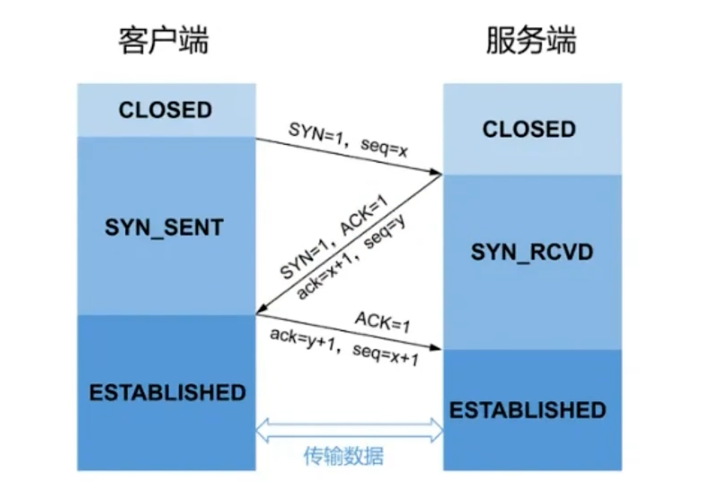


### 四次挥手


#### **TCP如何保证可靠性**


#### **htpp/https**

> http

| 特性             | HTTP/0.9            | HTTP/1.0                | HTTP/1.1                   | HTTP/2                   | HTTP/3               |
| ---------------- | ------------------- | ----------------------- | -------------------------- | ------------------------ | -------------------- |
| **发布年份**     | 1991                | 1996                    | 1997                       | 2015                     | 2020                 |
| **数据传输方式** | 仅支持简单的GET请求 | 支持GET、POST、HEAD请求 | 增加PUT、DELETE等请求      | 基于二进制帧传输         | 基于UDP协议          |
| **连接管理**     | 每次请求新建连接    | 每次请求新建连接        | 支持持久连接（Keep-Alive） | 多路复用，单连接多请求   | 多路复用，减少延迟   |
| **请求头压缩**   | 不支持              | 不支持                  | 不支持                     | 支持（HPACK算法）        | 支持（QPACK算法）    |
| **服务器推送**   | 不支持              | 不支持                  | 不支持                     | 支持                     | 支持                 |
| **安全性**       | 无                  | 无                      | 无                         | 支持TLS（不强制）        | 默认支持TLS          |
| **传输速度**     | 慢                  | 较慢                    | 较快（持久连接）           | 更快（多路复用，帧压缩） | 最快（基于UDP）      |
| **典型应用场景** | 早期简单网页传输    | 静态内容的请求/响应     | 动态内容与复杂网页加载     | 高效多资源网页加载       | 移动端和延迟敏感场景 |

> https

```tex
1. 客户端发起HTTPS请求连接到443端口，服务器端产生一个公钥和一个私钥
2. 服务器将非对称加密的公钥以证书的形式传递给客户端
3. 客户端接受到证书后进行验证，查看证书是否有问题，如果有问题HTTPS请求无法请求。如果没有问题客户端生成一个公钥ClinetKey结合加密算法进行对请求非对称加密，然后将请求和公钥ClinetKey发送到服务器端
4. 服务器端接受到客户端的请求使用私钥结合解密算法进行解密得到明文和ClinetKey然后服务器端给客户端做出响应
```

1 客户端发送：

- 在TCP三次握手之后，客户端会向服务器发送`Client Hello`消息。
  - 这个消息包含客户端支持的TLS版本（如TLS 1.2）
  - 支持的加密套件（加密算法和哈希算法的组合）
  - 客户端生成的**随机数**（Client Random，比如这里的571，但实际上这是一个更长的随机数）,后面用于**生成「会话秘钥」条件之一**，以及可能的会话ID（如果客户端希望重用之前的会话）。

2 服务端发送：

- 服务端收到`Client Hello`后，会响应`Server Hello`消息，告知客户端它**选择的TLS版本、加密套件，并生成一个服务端随机数**（Server Random）也是后面用于生产「会话秘钥」条件之一。
- 紧接着，服务端会发送自己的**证书**（Certificate）给客户端。客户端将使用数字证书认证机构（CA）的**公钥**（通常预装在客户端的受信任根证书列表中）来验证证书的合法性。验证通过后，客户端会从证书中提取服务器的公钥。
- 在某些情况下，如果服务器选择的密钥交换协议需要额外的参数（如DH或ECDH密钥交换），服务器会发送`Server Key Exchange`消息。然而，如果使用的是RSA密钥交换，这一步可能会省略，因为公钥已经在证书中发送了。
- 最后，服务器发送`Server Hello Done`消息，表示服务端的初始握手消息已全部发送完毕。

3 客户端处理：

- 客户端在验证完服务器证书并获取**公钥**后，会生成一个预主密钥（Pre-Master Secret）,用它**加密报文**。这个预主密钥是临时的，仅用于此次会话。
- 客户端使用服务器证书中的公钥对**一个随机数**进行加密，并将加密后的随机数发送给服务器（在`Client Key Exchange`消息中）。
- 客户端发送`Change Cipher Spec`消息，通知服务器后续的消息将使用协商好的加密套件和密钥进行加密。
- 客户端发送`Encrypted Handshake Message`，这是使用协商好的加密套件和之前生成的密钥（基于Client Random、Server Random和Pre-Master Secret）加密的第一个消息。它通常包含客户端的握手消息的MAC（消息认证码），用于验证消息的完整性和真实性。
- 服务器和客户端有了这**三个随机数**（Client Random、Server Random、pre-master key），接着就用双方协商的加密算法，**各自生成本次通信的「会话秘钥」**

4 服务器处理：

- 服务器收到`Client Key Exchange`消息后，使用自己的私钥解密出这三个随机数。
- 服务器和客户端都使用Client Random、Server Random和Pre-Master Secret作为输入，通过伪随机数生成器（PRF）生成会话密钥（Session Key），包括对称加密密钥、MAC密钥和IV（初始化向量）等。
- 服务器也发送`Change Cipher Spec`消息，通知客户端后续的消息将使用协商好的加密套件和密钥进行加密。
- 服务器发送`Encrypted Handshake Message`，这是服务器加密的握手消息的确认，包括服务器的握手消息的MAC。

至此，TLS握手过程完成，客户端和服务器都拥有了相同的会话密钥，并可以开始加密传输应用层数据了。

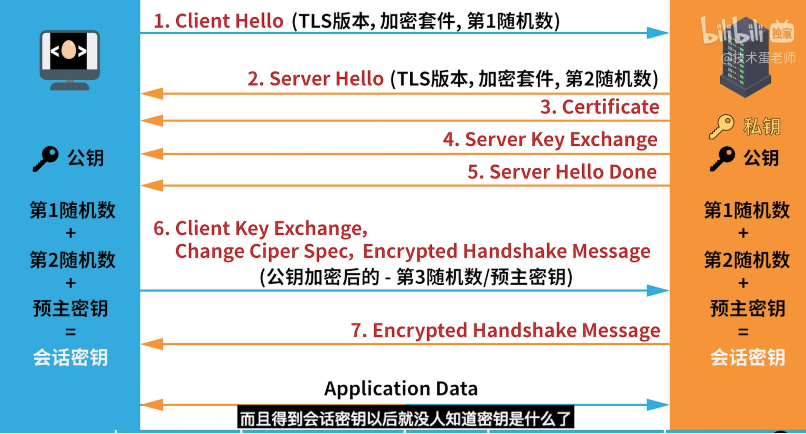

#### **Redis**

<!-- tabs:start -->

#### **数据结构**

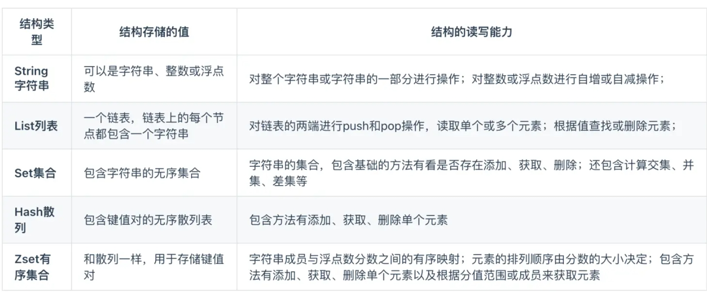

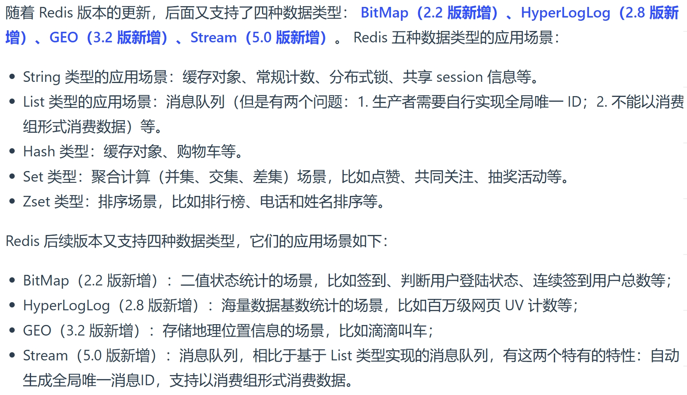

#### **缓存雪崩**


#### **缓存击穿**

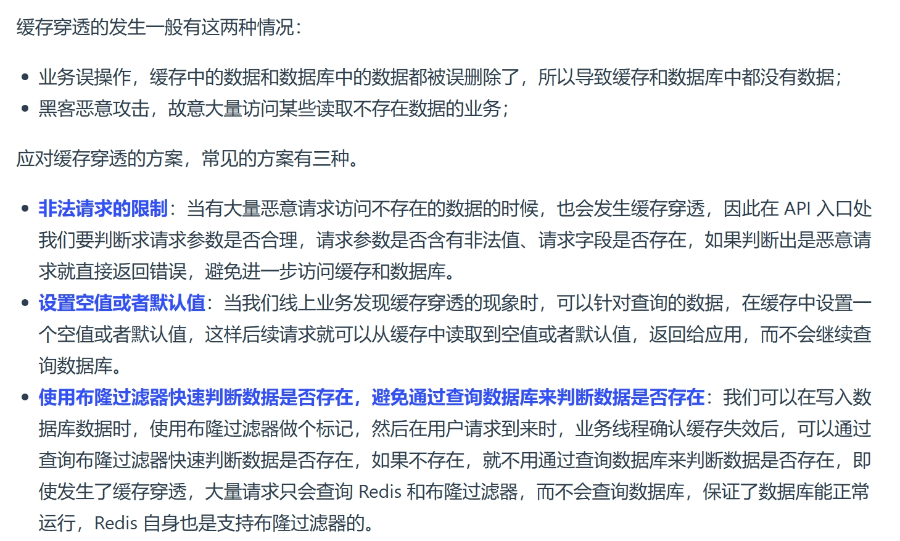

#### **持久化机制**


#### **内存淘汰策略**


<!-- tabs:end -->

<!-- tabs:end -->

## 数据库

<!-- tabs:start -->

#### **数据库隔离级别**

+ **未提交读**，事务中发⽣了修改，即使没有提交，其他事务也是可⻅的，⽐如对于⼀个数A原来50修改为100，但是我还没有提交修改，另⼀个事务看到这个修改，⽽这个时候原事务发⽣了回滚，这时候A还是50，但是另⼀个事务看到的A是100.**可能会导致脏读、幻读或不可᯿复读**
+ **提交读**，对于⼀个事务从开始直到提交之前，所做的任何修改是其他事务不可⻅的，举例就是对于⼀个数A原来是50，然后提交修改成100，这个时候另⼀个事务在A提交修改之前，读取的A是50，刚读取完，A就被修改成100，这个时候另⼀个事务再进⾏读取发现A就突然变成100了；**可以阻⽌脏读，但是幻读或不可᯿复读仍有可能发⽣**
+ **可重复读**，就是对⼀个记录读取多次的记录是相同的，⽐如对于⼀个数A读取的话⼀直是A，前后两次读取的A是⼀致的；**可以阻⽌脏读和不可᯿复读，但幻读仍有可能发⽣**

+ **可串⾏化读**，在并发情况下，和串⾏化的读取的结果是⼀致的，没有什么不同，⽐如不会发⽣脏读和幻读；**该级别可以防⽌脏读、不可᯿复读以及幻读**

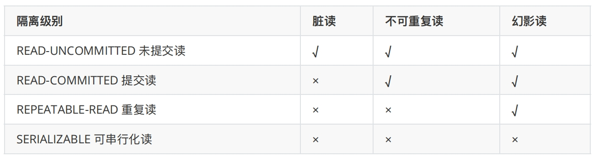

#### **mysql中innodb和myisam引擎区别及各自使用场景**

> 1.他们的区别分为五点：

```tex
(1).事务处理：
	MyISAM是非事务安全型的，而InnoDB是事务安全型的（支持事务处理等）
(2).锁机制不同:
	MyISAM是表锁，InnoDB是行级锁。
(3).增删改查操作:
	MyISAM：如果执行大量的查询操作，MyISAM是更好的选择
	InnoDB：如果你的数据执行大量的插入/更新，出于性能方面的考虑，应该使用InnoDB表
(4).查询表的行数不用:
	MyISAM: 执行select count() from table语句时 MyISAM只需要简单的查询出保存好的行数，当count()语句包含 where条件时，两种表的操作是一样的。
	InnoDB: InnoDB 中不保存表的具体行数，也就是说，执行select count(*) from table时，InnoDB要扫描一遍整个表来计算有多少行
(5).外键
	MyISAM不支持外键
	mysiam表不支持外键，而InnoDB支持
```

在选择存储引擎时，应该根据应用系统的特点选择合适的存储引擎。对于复杂的应用系统，还可以根据实际情况选择多种存储引擎进行组合。

- `InnoDB`: 如果应用对事物的完整性有比较高的要求，在并发条件下要求数据的一致性，数据操作除了插入和查询之外，还包含很多的更新、删除操作，则 `InnoDB` 是比较合适的选择
- `MyISAM`: 如果应用是以读操作和插入操作为主，只有很少的更新和删除操作，并且对事务的完整性、并发性要求不高，那这个存储引擎是非常合适的。
- Memory: 将所有数据保存在内存中，访问速度快，通常用于临时表及缓存。Memory 的缺陷是对表的大小有限制，太大的表无法缓存在内存中，而且无法保障数据的安全性

电商中的足迹和评论适合使用 `MyISAM` 引擎，缓存适合使用 `Memory` 引擎。

| 特点         | InnoDB              | MyISAM | Memory |
| ------------ | ------------------- | ------ | ------ |
| 存储限制     | 64TB                | 有     | 有     |
| 事务安全     | 支持                | -      | -      |
| 锁机制       | 行锁                | 表锁   | 表锁   |
| B+tree索引   | 支持                | 支持   | 支持   |
| Hash索引     | -                   | -      | 支持   |
| 全文索引     | 支持（5.6版本之后） | 支持   | -      |
| 空间使用     | 高                  | 低     | N/A    |
| 内存使用     | 高                  | 低     | 中等   |
| 批量插入速度 | 低                  | 高     | 高     |
| 支持外键     | 支持                | -      | -      |

#### **锁**

<!-- tabs:start -->

#### **概述**

+ 介绍
  + 锁是计算机协调多个进程或线程并发访问某一资源的机制。在数据库中除传统的计算资源(CPU、RAM、I/O）的争用以外，数据也是一种供许多用户共享的资源。如何保证**数据并发访问的一致性、有效性**是所有数据库必须解决的一个问题，**锁冲突也是影响数据库并发访问性能的一个重要因素**。从这个角度来说，锁对数据库而言显得尤其重要，也更加复杂。

+ 分类
  + `MySQL`中的锁，按照锁的粒度分，分为以下三类:
    1. 全局锁:锁定数据库中的所有表。
    2. 表级锁:每次操作锁住整张表。
    3. 行级锁:每次操作锁住对应的行数据。

#### **全局锁**

> 全局锁就是对整个数据库实例加锁，加锁后整个实例就处于只读状态，后续的`DML`的写语句，`DDL`语句，已经更新操作的事务提交语句都将被阻塞。

> 其典型的使用场景是做全库的逻辑备份，对所有的表进行锁定，从而获取一致性视图，保证数据的完整性。

+ 未加锁


+ 加锁


+ 特点

  + 数据库中加全局锁，是一个比较重的操作，存在以下问题:

  1. 如果在主库上备份，那么在备份期间都不能执行更新，业务基本上就得停摆。
  2. 如果在从库上备份，那么在备份期间从库不能执行主库同步过来的二进制日志(`binlog`)，会导致主从延迟。

  > 在`InnoDB`引擎中，我们可以在备份时加上参数`--single-transaction`参数来完成不加锁的一致性数据备份。
  >
  > ```sql
  > mysqldump --single-transaction -uroot -p123456 itcast > itcast.sql
  > ```

#### **表锁-表级锁**

+ 介绍
  + 表级锁，每次操作锁住整张表。锁定粒度大，发生锁冲突的概率最高，并发度最低。应用在`MyISAM`、`InnoDB`、`BDB`等存储引擎中。
  + 对于表级锁，主要分为以下三类:
    1. 表锁元
    2. 数据锁`( meta data lock,MDL)`
    3. 意向锁
+ 表锁
  + 对于表锁，分为两类:
    1. 表共享读锁( read lock )
    2. 表独占写锁（write lock)
+ 语法:
  1. 加锁:`lock tables 表名... read/write`。
  2. 释放锁:`unlock tables / 客户端断开连接`。
+ 读锁


+ 写锁


> `读锁不会阻塞其他客户端的读，但是会阻塞写。写锁既会阻塞其他客户端的读，又会阻塞其他客户端的写。`


#### **表锁-元数据锁`( meta data lock,MDL)`**

+ `MDL`加锁过程是系统自动控制，无需显式使用，在访问一张表的时候会自动加上。`MDL`锁主要作用是维护表元数据的数据一致性，在表上有活动事务的时候，不可以对元数据进行写入操作。`为了避免DML与DDL冲突，保证读写的正确性。`
+ 在`MySQL5.5`中引入了`MDL`，当对一张表进行增删改查的时候，加`MDL`读锁(共享);当对表结构进行变更操作的时候，加`MDL`写锁(排他)。

|                    对应`SQL`                     |                 锁类型                  |                       说明                       |
| :----------------------------------------------: | :-------------------------------------: | :----------------------------------------------: |
|          `lock tables xxx read / write`          | SHARED READ_ONLY / SHARED_NO_READ_WRITE |                                                  |
|    `select 、 select ... lock in share mode`     |               SHARED_READ               | 与SHARED_READ、SHARED_WRITE兼容，与EXCLUSIVE互斥 |
| `insert . update、delete、select ... for update` |              SHARED_WRITE               | 与SHARED READ、SHARED WRITE兼容，与EXCLUSIVE互斥 |
|                 `alter table...`                 |           EXCLUSIVE（排他锁）           | 与SHARED READ、SHARED WRITE兼容，与EXCLUSIVE互斥 |

查看元数据锁：

```sql
select object_type,object_schema,object_name,lock_type,lock_duration from performance_schema.metadata_locks;
```


#### **表锁-意向锁**

+ 为了避免`DML`在执行时，加的行锁与表锁的冲突，在`InnoDB`中引入了意向锁，使得表锁不用检查每行数据是否加锁，使用意向锁来减少表锁的检查。


1. 意向共享锁（`lS`):由语句`select ... lock in share mode`添加。
2. 意向排他锁（`lIX`)∶由`insert、update、delete、select ... for update`添加。

+ 兼容性
  1. 意向共享锁（`IS`)∶与表锁共享锁(`read`）兼容，与表锁排它锁(`write`）互斥。
  2. 意向排他锁（`IX`)︰与表锁共享锁（`read`)及排它锁（`write`）都互斥。意向锁之间不会互斥。
+ 可以通过以下SQL，查看意向锁及行锁的加锁情况:

```sql
select object_schema,object_name,index_name,lock_type,lock_mode,lock_data from performance_schema.data_locks;
```

> 意向共享锁


> 意向排他锁


#### **行级锁**

> `InnoDB`实现了以下两种类型的行锁：

1. 共享锁（S）：运行一个事务去读一行，阻止其他事务获得相同数据集的排它锁。
2. 排他锁（X）：运行获取排他锁的事务更新数据，组织其他事务获得相同数据集的共享锁合排他锁。

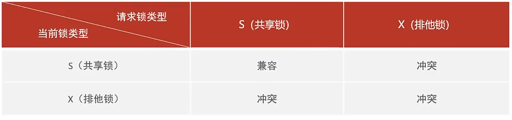

+ 行锁

| SQL                       |     行锁类型     | 说明                                     |
| :------------------------ | :--------------: | :--------------------------------------- |
| INSERT…                   |      排他锁      | 自动加锁                                 |
| UPDATE…                   |      排他锁      | 自动加锁                                 |
| DELETE…                   |      排他锁      | 自动加锁                                 |
| SELECT（正常）            | ***不加任何锁*** |                                          |
| SELECT…LOCK IN SHARE MODE |      共享锁      | 需要手动在SELECT之后加LOCK IN SHARE MODE |
| SELECT…FOR UPDATE         |      排他锁      | 需要手动在SELECT之后加FOR UPDATE         |

+ 案列：

> 默认情况下，`InnoDB`在`REPEATABLE READ`事务隔离级别运行，`InnoDB`使用`next-key`锁进行搜索和索引扫描，以防止幻读。

1. 针对唯一索引进行检索时，对已存在的记录进行等值匹配时，将会自动优化为行锁。
2. `InnoDB`的行锁是**针对于索引加的锁**，不通过索引条件检索数据，那么`InnoDB`将对表中的所有记录加锁，此时***就会升级为表锁***。

+ 可以通过以下SQL，查看意向锁及行锁的加锁情况:

```sql
select object_schema,object_name,index_name,lock_type,LOCK_MODE,lock_data from performance_schema.data_locks;
```

+ 间隙锁/临键锁-演示

> 默认情况下，`InnoDB`在REPEATABLEREAD事务隔离级别运行，`InnoDB`使用`next-key`锁进行搜索和索引扫描，以防止幻读。

1. 索引上的等值查询(唯一索引)，给不存在的记录加锁时,优化为间隙锁(GAP)。
2. 索引上的等值查询(普通索引)，向右遍历时最后一个值不满足查询需求时，`next-key lock`退化为间隙锁。
3. 索引上的范围查询(唯一索引)--会访问到不满足条件的第一个值为止。

> 注意:间隙锁唯一目的是防止其他事务插入间隙。间隙锁可以共存，一个事务采用的间隙锁不会阻止另一个事务在同一间隙上采用间隙锁。

+ 临键锁: 既会包含当前对应的数据记录，也会锁定该数据记录之前的间隙。
+ 间隙锁：锁的是间隙不包含对应的数据记录。

<!-- tabs:end -->

#### **索引**

<!-- tabs:start -->

#### **说明**

索引是帮助 MySQL **高效获取数据**的**数据结构（有序）**。在数据之外，数据库系统还维护着满足特定查找算法的数据结构，这些数据结构以某种方式引用（指向）数据，这样就可以在这些数据结构上实现高级查询算法，这种数据结构就是索引。

优缺点：

优点：

- 提高数据检索效率，降低数据库的IO成本
- 通过索引列对数据进行排序，降低数据排序的成本，降低CPU的消耗

缺点：

- 索引列也是要占用空间的
- 索引大大提高了查询效率，但降低了更新的速度，比如 INSERT、UPDATE、DELETE

#### **索引结构**

| 索引结构            | 描述                                                         |
| ------------------- | ------------------------------------------------------------ |
| B+Tree              | 最常见的索引类型，大部分引擎都支持B+树索引                   |
| Hash                | 底层数据结构是用哈希表实现，只有精确匹配索引列的查询才有效，不支持范围查询 |
| R-Tree(空间索引)    | 空间索引是 MyISAM 引擎的一个特殊索引类型，主要用于地理空间数据类型，通常使用较少 |
| Full-Text(全文索引) | 是一种通过建立倒排索引，快速匹配文档的方式，类似于 Lucene, Solr, ES |

| 索引       | InnoDB        | MyISAM | Memory |
| ---------- | ------------- | ------ | ------ |
| B+Tree索引 | 支持          | 支持   | 支持   |
| Hash索引   | 不支持        | 不支持 | 支持   |
| R-Tree索引 | 不支持        | 支持   | 不支持 |
| Full-text  | 5.6版本后支持 | 支持   | 不支持 |

>  **B-Tree**


二叉树的缺点可以用红黑树来解决：


+ 红黑树也存在大数据量情况下，层级较深，检索速度慢的问题。

+ 为了解决上述问题，可以使用 B-Tree 结构。

  > B-Tree (多路平衡查找树) 以一棵最大度数（max-degree，指一个节点的子节点个数）为5（5阶）的 b-tree 为例（每个节点最多存储4个key，5个指针）


> + B-Tree 的数据插入过程动画参照：https://www.bilibili.com/video/BV1Kr4y1i7ru?p=68
>
> 
>
> + 演示地址：https://www.cs.usfca.edu/~galles/visualization/BTree.html

>  B+Tree

结构图：


> 演示地址：https://www.cs.usfca.edu/~galles/visualization/BPlusTree.html

> 与 B-Tree 的区别：

- 所有的数据都会出现在叶子节点
- 叶子节点形成一个单向链表

MySQL 索引数据结构对经典的 B+Tree 进行了优化。在原 B+Tree 的基础上，增加一个指向相邻叶子节点的链表指针，就形成了带有顺序指针的 B+Tree，提高区间访问的性能。


#### **Hash**

哈希索引就是采用一定的hash算法，将键值换算成新的hash值，映射到对应的槽位上，然后存储在hash表中。
如果两个（或多个）键值，映射到一个相同的槽位上，他们就产生了hash冲突（也称为hash碰撞），可以通过链表来解决。

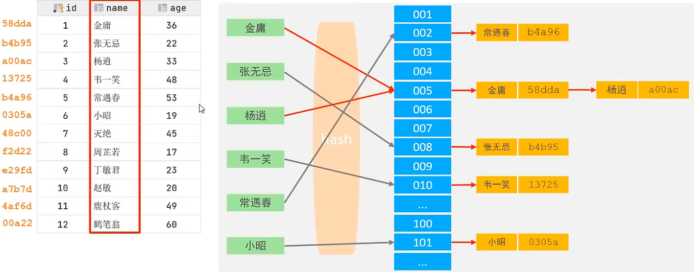

特点：

- Hash索引只能用于对等比较（=、in），不支持范围查询（betwwn、>、<、...）
- 无法利用索引完成排序操作
- 查询效率高，通常只需要一次检索就可以了，效率通常要高于 B+Tree 索引

存储引擎支持：

- Memory
- InnoDB: 具有自适应hash功能，hash索引是存储引擎根据 B+Tree 索引在指定条件下自动构建的

#### **面试题**

1. 为什么 InnoDB 存储引擎选择使用 B+Tree 索引结构？

- 相对于二叉树，层级更少，搜索效率高
- 对于 B-Tree，无论是叶子节点还是非叶子节点，都会保存数据，这样导致一页中存储的键值减少，指针也跟着减少，要同样保存大量数据，只能增加树的高度，导致性能降低
- 相对于 Hash 索引，B+Tree 支持范围匹配及排序操作

#### **索引分类**

| 分类     | 含义                                                 | 特点                     | 关键字   |
| -------- | ---------------------------------------------------- | ------------------------ | -------- |
| 主键索引 | 针对于表中主键创建的索引                             | 默认自动创建，只能有一个 | PRIMARY  |
| 唯一索引 | 避免同一个表中某数据列中的值重复                     | 可以有多个               | UNIQUE   |
| 常规索引 | 快速定位特定数据                                     | 可以有多个               |          |
| 全文索引 | 全文索引查找的是文本中的关键词，而不是比较索引中的值 | 可以有多个               | FULLTEXT |

在 InnoDB 存储引擎中，根据索引的存储形式，又可以分为以下两种：

| 分类                      | 含义                                                       | 特点                 |
| ------------------------- | ---------------------------------------------------------- | -------------------- |
| 聚集索引(Clustered Index) | 将数据存储与索引放一块，索引结构的叶子节点保存了行数据     | 必须有，而且只有一个 |
| 二级索引(Secondary Index) | 将数据与索引分开存储，索引结构的叶子节点关联的是对应的主键 | 可以存在多个         |

演示图：

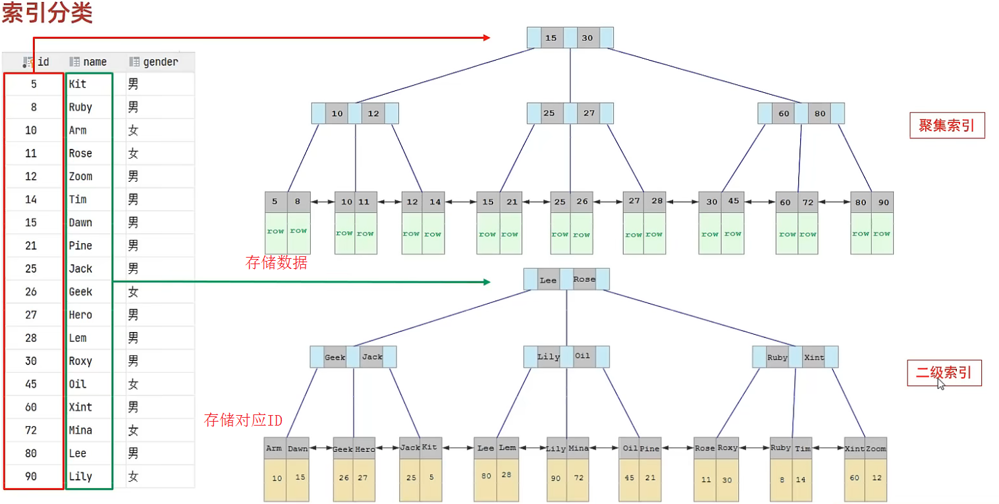


聚集索引选取规则：

- 如果存在主键，主键索引就是聚集索引
- 如果不存在主键，将使用第一个唯一(UNIQUE)索引作为聚集索引
- 如果表没有主键或没有合适的唯一索引，则 InnoDB 会自动生成一个 rowid 作为隐藏的聚集索引

#### **思考题**

1\. 以下 SQL 语句，哪个执行效率高？为什么？

```mysql
select * from user where id = 10;
select * from user where name = 'Arm';
-- 备注：id为主键，name字段创建的有索引
```

>  答：第一条语句，因为第二条需要回表查询，相当于两个步骤。

2\. InnoDB 主键索引的 B+Tree 高度为多少？

> 答：假设一行数据大小为1k，一页中可以存储16行这样的数据。InnoDB 的指针占用6个字节的空间，主键假设为bigint，占用字节数为8.
> 可得公式：`n * 8 + (n + 1) * 6 = 16 * 1024`，其中 8 表示 bigint 占用的字节数，n 表示当前节点存储的key的数量，(n + 1) 表示指针数量（比key多一个）。算出n约为1170。

+ 如果树的高度为2，那么他能存储的数据量大概为：`1171 * 16 = 18736`；
+ 如果树的高度为3，那么他能存储的数据量大概为：`1171 * 1171 * 16 = 21939856`。

> 另外，如果有成千上万的数据，那么就要考虑分表，涉及运维篇知识。

#### **语法**

+ 创建索引：
  + `CREATE [ UNIQUE | FULLTEXT ] INDEX index_name ON table_name (index_col_name, ...);`
  + 如果不加 CREATE 后面不加索引类型参数，则创建的是常规索引

+ 查看索引：
  + `SHOW INDEX FROM table_name;`

+ 删除索引：
  + `DROP INDEX index_name ON table_name;`

+ 案例：

```mysql
-- name字段为姓名字段，该字段的值可能会重复，为该字段创建索引
create index idx_user_name on tb_user(name);
-- phone手机号字段的值非空，且唯一，为该字段创建唯一索引
create unique index idx_user_phone on tb_user (phone);
-- 为profession, age, status创建联合索引
create index idx_user_pro_age_stat on tb_user(profession, age, status);
-- 为email建立合适的索引来提升查询效率
create index idx_user_email on tb_user(email);

-- 删除索引
drop index idx_user_email on tb_user;
```

#### **使用规则**

> 最左前缀法则

+ 如果索引关联了多列（联合索引），要遵守最左前缀法则，最左前缀法则指的是查询从索引的最左列开始，并且不跳过索引中的列。

+ 如果跳跃某一列，**索引将部分失效（后面的字段索引失效）。**

+ 联合索引中，出现范围查询（<, >），**范围查询右侧的列索引失效**。

  + 可以用>=或者<=来规避索引失效问题。

  


> 索引失效情况

1. **在索引列上进行运算操作，索引将失效。如：**

   + `explain select * from tb_user where substring(phone, 10, 2) = '15'\G;`
     + `\G`行显示格式好看一点。

2. **字符串类型字段使用时，不加引号，索引将失效。如：**

   + `explain select * from tb_user where phone = 17799990015;`，此处phone的值没有加引号

3. **模糊查询中，如果仅仅是尾部模糊匹配，索引不会是失效；如果是头部模糊匹配，索引失效。如：**

   + `explain select * from tb_user where profession like '%工程';`，前后都有 % 也会失效。

     

4. **用 or 分割开的条件，如果 or 其中一个条件的列没有索引，那么涉及的索引都不会被用到。**

   

5. **如果 `MySQL` 评估使用索引比全表更慢，则不使用索引。**


> SQL 提示

+ 是优化数据库的一个重要手段，简单来说，就是在SQL语句中加入一些人为的提示来达到优化操作的目的。

+ 例如，使用索引：
  + `explain select * from tb_user use index(idx_user_pro) where profession="软件工程";`
+ 不使用哪个索引：
  + `explain select * from tb_user ignore index(idx_user_pro) where profession="软件工程";`
+ 必须使用哪个索引：
  + `explain select * from tb_user force index(idx_user_pro) where profession="软件工程";`

- use 是建议，实际使用哪个索引 MySQL 还会自己权衡运行速度去更改，force就是无论如何都强制使用该索引。


> 覆盖索引&回表查询

+ 尽量使用覆盖索引（查询使用了索引，并且需要返回的列，在该索引中已经全部能找到），减少 `select *`。

+ explain 中 extra 字段含义：

  + `using index condition`：查找使用了索引，但是需要回表查询数据（**性能低**）
  + `using where; using index;`：查找使用了索引，但是需要的数据都在索引列中能找到，所以不需要回表查询（**性能高**）

+ 如果在聚集索引中直接能找到对应的行，则直接返回行数据，只需要一次查询，哪怕是select \*；如果在辅助索引中找聚集索引，如`select id, name from xxx where name='xxx';`，也只需要通过辅助索引(name)查找到对应的id，返回name和name索引对应的id即可，只需要一次查询；如果是通过辅助索引查找其他字段，则需要回表查询，如`select id, name, gender from xxx where name='xxx';`

+ 所以尽量不要用`select *`，容易出现回表查询，降低效率，除非有联合索引包含了所有字段

+ 面试题：一张表，有四个字段（id, username, password, status），由于数据量大，需要对以下SQL语句进行优化，该如何进行才是最优方案：
  `select id, username, password from tb_user where username='itcast';`

  + 解：给username和password字段建立联合索引，则不需要回表查询，直接覆盖索引

  

> 前缀索引

+ 当字段类型为字符串（varchar, text等）时，有时候需要索引很长的字符串，这会让索引变得很大，查询时，浪费大量的磁盘IO，影响查询效率，此时可以只降字符串的一部分前缀，建立索引，这样可以大大节约索引空间，从而提高索引效率。

+ 语法：`create index idx_xxxx on table_name(columnn(n));`
  + `n`的值不同则截取字符不同——截取前n个字符作为索引

+ 前缀长度：可以根据索引的选择性来决定，而选择性是指不重复的索引值（基数）和数据表的记录总数的比值，索引选择性越高则查询效率越高，唯一索引的选择性是1，这是最好的索引选择性，性能也是最好的。
+ **求选择性公式：**

```mysql
select count(distinct email) / count(*) from tb_user;
select count(distinct substring(email, 1, 5)) / count(*) from tb_user;
```

+ show index 里面的sub_part可以看到接取的长度


> 单列索引&联合索引

+ 单列索引：即一个索引只包含单个列
+ 联合索引：即一个索引包含了多个列
+ 在业务场景中，如果存在多个查询条件，考虑针对于查询字段建立索引时，建议建立联合索引，而非单列索引。

+ 单列索引情况：
  + `explain select id, phone, name from tb_user where phone = '17799990010' and name = '韩信';`
  + 这句只会用到phone索引字段

> 注意事项

- 多条件联合查询时，MySQL优化器会评估哪个字段的索引效率更高，会选择该索引完成本次查询

#### **设计原则**

1. 针对于**数据量较大（超百万），且查询比较频繁的表建立索引**
2. 针对于常作为**查询条件（where）、排序（order by）、分组（group by）操作的字段建立索引**
3. 尽量选择**区分度高的列作为索引**，**尽量建立唯一索引**，**区分度越高，使用索引的效率越高**
4. 如果是**字符串类型的字段，字段长度较长，可以针对于字段的特点，建立前缀索引**
5. 尽量使**用联合索引，减少单列索引**，查询时，联合索引很多时候可以覆盖索引，节省存储空间，避免回表，提高查询效率
6. 要控制索引的数量，索引并不是多多益善，索引越多，维护索引结构的代价就越大，会影响增删改的效率
7. 如果**索引列不能存储NULL值，请在创建表时使用NOT NULL约束它。**当优化器知道每列是否包含NULL值时，它可以更好地确定哪个索引最有效地用于查询

<!-- tabs:end -->

#### **SQL 优化**

<!-- tabs:start -->

#### **插入数据**

+ 普通插入：

1. 采用批量插入（一次插入的数据不建议超过1000条）
2. 手动提交事务
3. 主键顺序插入

+ 大批量插入：

> 如果一次性需要插入大批量数据 ，使用insert语句插入性能较低，此时可以使用MySQL数据库提供的load指令插入。

```mysql
# 客户端连接服务端时，加上参数 --local-infile（这一行在bash/cmd界面输入）
mysql --local-infile -u root -p
# 设置全局参数local_infile为1，开启从本地加载文件导入数据的开关
set global local_infile = 1;
select @@local_infile;
# 执行load指令将准备好的数据，加载到表结构中
load data local infile '/root/sql1.log' into table 'tb_user' fields terminated by ',' lines terminated by '\n';
```

####   **主键优化**

+ 数据组织方式：在`InnoDB`存储引擎中，表数据都是根据主键顺序组织存放的，这种存储方式的表称为索引组织表（Index organized table, IOT）

+ 页分裂(主键分裂)：页可以为空，也可以填充一般，也可以填充100%，每个页包含了2-N行数据（如果一行数据过大，会行溢出），根据主键排列。
+ 页合并：当删除一行记录时，实际上记录并没有被物理删除，只是记录被标记（`flaged`）为删除并且它的空间变得允许被其他记录声明使用。当页中删除的记录到达 MERGE_THRESHOLD（默认为页的50%），`InnoDB`会开始寻找最靠近的页（前后）看看是否可以将这两个页合并以优化空间使用。

MERGE_THRESHOLD：合并页的阈值，可以自己设置，在创建表或创建索引时指定

> 文字说明不够清晰明了，具体可以看视频里的PPT演示过程：https://www.bilibili.com/video/BV1Kr4y1i7ru?p=90

主键设计原则：

- 满足业务需求的情况下，尽量降低主键的长度
- 插入数据时，尽量选择顺序插入，选择使用 `AUTO_INCREMENT 自增主键`
- 尽量不要使用 `UUID` 做主键或者是其他的自然主键，如身份证号
- 业务操作时，避免对主键的修改

#### **order by优化**

1. `Using filesort`：通过表的索引或全表扫描，读取满足条件的数据行，然后在排序缓冲区 `sort buffer` 中完成排序操作，所有不是通过索引直接返回排序结果的排序都叫 `FileSort` 排序
2. `Using index`：通过有序索引顺序扫描直接返回有序数据，这种情况即为 `using index`，不需要额外排序，操作效率高

+ 如果`order by`字段全部使用升序排序或者降序排序，则都会走索引，但是如果一个字段升序排序，另一个字段降序排序，则不会走索引，explain的extra信息显示的是`Using index, Using filesort`，如果要优化掉`Using filesort`，则需要另外再创建一个索引，如：`create index idx_user_age_phone_ad on tb_user(age asc, phone desc);`，此时使用`select id, age, phone from tb_user order by age asc, phone desc;`会全部走索引

总结：

- 根据排序字段建立合适的索引，多字段排序时，也遵循最左前缀法则
- 尽量使用覆盖索引
- 多字段排序，一个升序一个降序，此时需要注意联合索引在创建时的规则`（ASC/DESC）`
- 如果不可避免出现`filesort`，大数据量排序时，可以适当增大排序缓冲区大小 sort_buffer_size（默认`256k`）

#### **group  by优化**

- 在分组操作时，可以通过索引来提高效率
- 分组操作时，索引的使用`也是满足最左前缀法则的`

如索引为`idx_user_pro_age_stat`，则句式可以是`select ... where profession order by age`，这样也符合最左前缀法则

#### **limit优化**

+ 常见的问题如`limit 2000000, 10`，此时需要 MySQL 排序前2000000条记录，但仅仅返回2000000 - 2000010的记录，其他记录丢弃，查询排序的代价非常大。
+ 优化方案：一般分页查询时，通过创建覆盖索引能够比较好地提高性能，可以通过`覆盖索引加子查询形式进行优化`

例如：

```mysql
-- 此语句耗时很长
select * from tb_sku limit 9000000, 10;
-- 通过覆盖索引加快速度，直接通过主键索引进行排序及查询
select id from tb_sku order by id limit 9000000, 10;
-- 下面的语句是错误的，因为 MySQL 不支持 in 里面使用 limit
-- select * from tb_sku where id in (select id from tb_sku order by id limit 9000000, 10);
-- 通过连表查询即可实现第一句的效果，并且能达到第二句的速度
select * from tb_sku as s, (select id from tb_sku order by id limit 9000000, 10) as a where s.id = a.id;
```

#### **count优化**

> `MyISAM` 引擎把一个表的总行数存在了磁盘上，因此执行 count(\*) 的时候会直接返回这个数，效率很高（前提是不适用where）；
>
> `InnoDB` 在执行 count(\*) 时，需要把数据一行一行地从引擎里面读出来，然后累计计数。
>
> 优化方案：自己计数，如创建key-value表存储在内存或硬盘，或者是用redis

count的几种用法：

- 如果count函数的参数（count里面写的那个字段）不是NULL（字段值不为NULL），累计值就加一，最后返回累计值
- 用法：`count(\*)、count(主键)、count(字段)、count(1)`
- count(主键)跟count(\*)一样，因为主键不能为空；count(字段)只计算字段值不为NULL的行；count(1)引擎会为每行添加一个1，然后就count这个1，返回结果也跟count(\*)一样；count(null)返回0

各种用法的性能：

- `count(主键)：`
  - `InnoDB`引擎会遍历整张表，把每行的主键id值都取出来，返回给服务层，服务层拿到主键后，直接按行进行累加（主键不可能为空）

- `count(字段)：`
  - 没有not null约束的话，`InnoDB`引擎会遍历整张表把每一行的字段值都取出来，返回给服务层，服务层判断是否为null，不为null，计数累加；
  - 有not null约束的话，`InnoDB`引擎会遍历整张表把每一行的字段值都取出来，返回给服务层，直接按行进行累加

- `count(1)：`
  - `InnoDB` 引擎遍历整张表，但不取值。服务层对于返回的每一层，放一个数字 1 进去，直接按行进行累加

- `count(*)：`
  - `InnoDB` 引擎并不会把全部字段取出来，而是专门做了优化，不取值，服务层直接按行进行累加


> 按效率排序：count(字段) < count(主键) < count(1) < count(\*)，所以尽量使用 count(\*)

#### **update优化（避免行锁升级为表锁）**

+ `InnoDB` 的行锁是针对索引加的锁，不是针对记录加的锁，并且该索引不能失效，否则会从行锁升级为表锁。

+ 如以下两条语句：
  + `update student set no = '123' where id = 1;`，这句由于id有主键索引，所以只会锁这一行；
  + `update student set no = '123' where name = 'test';`，这句由于name没有索引，所以会把整张表都锁住进行数据更新，解决方法是给name字段添加索引

<!-- tabs:end -->

#### **InnoDB引擎**

#### 逻辑存储结构


#### 架构

>  MySQL5.5版本开始，默认使用`InnoDB`存储引擎，它擅长事务处理，具有崩溃恢复特性，在日常开发中使用非常广泛。下面是`InnoDB`架构图，左侧为内存结构,右侧为磁盘结构。


<!-- tabs:start -->

#### **内存架构**


```sql
show variables like '%hash_index%';
```


```sql
show variables like '%log_buffer_size%';
show variables like '%flush_log%';
```

#### **磁盘结构**


```sql
create tablespace zjx_idb add datafile 'myzjx.ibd' engine = innodb;
use zjxweb;
create table a(id int  primary key auto_increment,name varchar(10)) engine = innodb tablespace zjx_idb;
```


#### **后台线程**


```sql
 show engine innodb status;
```

<!-- tabs:end -->

#### **事务原理**

<!-- tabs:start -->

#### **概述**

> 事务:是一组操作的集合，它是一个不可分割的工作单位，事务会把所有的操作作为一个整体一起向系统提交或撤销操作请求，即这些操作要么同时成功，要么同时失败。


#### **说明**

+ `事务`是一组操作的集合，事务会把所有操作作为一个整体一起向系统提交或撤销操作请求，即这些操作`要么同时成功，要么同时失败。`
+ **默认`MySQL`的事务是自动提交的，也就是说，当执行一条`DML`语句，`MySQL`会以及隐式的提交事务**

基本操作：

```mysql
-- 1. 查询张三账户余额
select * from account where name = '张三';
-- 2. 将张三账户余额-1000
update account set money = money - 1000 where name = '张三';
-- 此语句出错后张三钱减少但是李四钱没有增加
模拟sql语句错误
-- 3. 将李四账户余额+1000
update account set money = money + 1000 where name = '李四';

-- 查看事务提交方式
SELECT @@AUTOCOMMIT;
-- 设置事务提交方式，1为自动提交，0为手动提交，该设置只对当前会话有效
SET @@AUTOCOMMIT = 0;
-- 提交事务
COMMIT;
-- 回滚事务
ROLLBACK;

-- 设置手动提交后上面代码改为：
select * from account where name = '张三';
update account set money = money - 1000 where name = '张三';
update account set money = money + 1000 where name = '李四';
commit;
```

操作方式二：

+ 开启事务：
+ `START TRANSACTION 或 BEGIN TRANSACTION;`
+ 提交事务：
+ `COMMIT;`
+ 回滚事务：
+ `ROLLBACK;`

操作实例：

```mysql
start transaction;
select * from account where name = '张三';
update account set money = money - 1000 where name = '张三';
update account set money = money + 1000 where name = '李四';
commit;
```

#### **四大特性ACID**

- `原子性(Atomicity)`：事务是不可分割的最小操作但愿，要么全部成功，要么全部失败
- `一致性(Consistency)`：事务完成时，必须使所有数据都保持一致状态
- `隔离性(Isolation)`：数据库系统提供的隔离机制，保证事务在不受外部并发操作影响的独立环境下运行
- `持久性(Durability)`：事务一旦提交或回滚，它对数据库中的数据的改变就是永久的

#### **并发事务**

| 问题       | 描述                                                         |
| ---------- | ------------------------------------------------------------ |
| 脏读       | 一个事务读到另一个事务还没提交的数据                         |
| 不可重复读 | 一个事务先后读取同一条记录，但两次读取的数据不同             |
| 幻读       | 一个事务按照条件查询数据时，没有对应的数据行，但是再插入数据时，又发现这行数据已经存在 |


+ 并发事务隔离级别：

| 隔离级别                            | 脏读 | 不可重复读 | 幻读 |
| ----------------------------------- | ---- | ---------- | ---- |
| `Read uncommitted`(读未提交)        | √    | √          | √    |
| `Read committed`（读已提交）        | ×    | √          | √    |
| `Repeatable Read(默认)`（可重复读） | ×    | ×          | √    |
| `Serializable`（串行化）            | ×    | ×          | ×    |

>  **√表示在当前隔离级别下该问题会出现**

- `Serializable` 性能最低；`Read uncommitted` 性能最高，数据安全性最差

> + 查看事务隔离级别：
>
>   + `SELECT @@TRANSACTION_ISOLATION;`
>
> + 设置事务隔离级别：
>
>   + `SET [ SESSION | GLOBAL ] TRANSACTION ISOLATION LEVEL {READ UNCOMMITTED | READ COMMITTED | REPEATABLE READ | SERIALIZABLE };`
>   + SESSION 是会话级别，表示只针对当前会话有效，GLOBAL 表示对所有会话有效
>
>   ```sql
>   SELECT @@TRANSACTION_ISOLATION;
>                                     
>   set session transaction isolation level read uncommitted ;
>                                     
>   set session transaction isolation level repeatable read ;
>   ```


> `redo log`    持久性

+ 重做日志，记录的是事务提交时数据页的物理修改，是用来实现事务的持久性。
+ 该日志文件由两部分组成:重做日志缓冲 (`redo log buffer`)以及重做日志文件(`redo log file)`,前者是在内存中，后者在磁盘中。当事务提交之后会把所有修改信息都存到该日志文件中,用于在刷新脏页到磁盘,发生错误时，进行数据恢复使用。


> `undo log`  原子性

+ 回滚日志，用于记录数据被修改前的信息，作用包含两个： **提供回滚 和  MVCC（多版本并发控制）**；
+ `undo log`和 `redo log`记录物理日志不一样，它是**逻辑日志**。可以认为当`delete` 一条记录时， `undo  log`中会记录一条对应的 `insert`记录，反之依然，当 `update`一条记录时，它记录一条对应相反的 `update`记录。当执行 `rollback`时，就可以从 `undo log`中的逻辑记录读取到对应的内容并进行回滚。
+ `undo log销毁`： `undo log`在事务执行时产生，事务提交时，并不会立即删除 `undo log`，因为这些日志可能还可用于 `MVCC`。
+ `undo log存储`： `undo log`采用**段的方式进行管理和记录**，存放在前面介绍的 `rollback segment`回滚段中，内部包含 `1024个undo log segment`。

> 一致性 undo log + redo log

> 隔离性  锁+`MVCC`

<!-- tabs:end -->

#### **`MVCC`（多版本并发控制）**

<!-- tabs:start -->

#### **基本概念**

+ 当前读
  + **读取的是记录的最新版本**，读取时还要保证其他并发事务不能修改当前记录，会对读取的记录进行加锁。对于我们日常的操作，如:`select ...lock in share mode`(共享锁)， `select... for update、update、insert、delete`(排他锁)都是一种当前读。
+ 快照读

> 简单的`select`(不加锁)就是快照读，快照读，读取的是记录数据的可见版本，有可能是历史数据，不加锁，是非阻塞读。

+ `Read Committed`: 每次`select`，都生成一个快照读。
+ `Repeatable Read`:开启事务后第一个`select`语句才是快照读的地方
+ `Serializable`: 快照读会退化为当前读


♥ `MVCC`

+ 全称`Mult-Version Concurrency Control`，多版本并发控制。指维护一个数据的多个版本，使得读写操作没有冲突，快照读为`MySQL`实现`MVCC`提供了一个非阻塞读功能。`MVCC`的具体实现，还需要依赖于数据库记录中的`三个隐式字段`、`undo log日志`、`readView`。

#### **实现原理-隐藏字段**

>  记录中的隐藏字段


| 隐藏字段    | 含义                                                         |
| ----------- | ------------------------------------------------------------ |
| DB_TRX_ID   | 最近修改事务ID，记录插入这条记录或最后一次修改该记录的`事务ID` |
| DB_ROLL_PTR | `回滚指针`，指向这条记录的上一个版本，用于配合undo log，指向上一个版本。 |
| DB_ROW_ID   | `隐藏主键`，如果表结构没有指定主键，将会生成该隐藏字段       |

```shell
# 查看表空间文件
ibd2sdi student.ibd
```

#### **实现原理-undo log**

> `undo log`

👉 回滚日志，在`insert、update、delete`的时候产生的便于数据回滚的日志。

👉 当insert的时候，产生的`undo log`日志只在回滚时需要，在事务提交后，可被立即删除。

👉 而update、delete的时候，产生的`undo log`日志不仅在回滚时需要在快照读时也需要，不会立即被删除。

> `undo log版本链`


+ 不同事务或相同事务对同一条记录进行修改，会导致该记录的`undo log`生成一条记录版本链表，链表的头部是最新的旧记录，链表尾部是最早的旧记录。

#### **实现原理-`readview`**

> `ReadView`(读视图)是`快照读`SQL执行时MVCC提取数据的依据，记录并维护系统当前活跃的事务（未提交的) id。

+ `ReadView`中包含四个核心字段：

| 字段             | 含义                                                 |
| ---------------- | ---------------------------------------------------- |
| `m_ids`          | 当前活跃的事务ID集合                                 |
| `min_trx_id`     | 最小活跃事务ID                                       |
| `max_trx_id`     | 预分配事务ID，当前最大事务ID+1（因为事务ID是自增的） |
| `creator_trx_id` | `ReadView`创建者的事务ID                             |


+ 不同的隔离级别，生成`ReadView`的时机不同

  👉 `READ COMMITTED：` 在事务中每一次执行快照读时生成`ReadView`。

  👉 `REPEATABLE READ:`仅在事务中第一次执行快照读时生成`ReadView`，后续复用该`ReadView`。

♥ **RC隔离级别下，在事务中每一次执行快照读时生成`ReadView`.**


♥ **RR隔离级别下，仅在事务中第一次执行快照读时生成`ReadView`，后续复用该`ReadView`.**


<!-- tabs:end -->

<!-- tabs:end -->

## 算法

<!-- tabs:start -->

#### **memmove**

> `memmove`和`memcpy`一样都是C语言自带的函数，可实现内存数据的移动，不同的是，`memcpy`在使用时有可能会出现内存重叠现象，导致数据移动错误，而`memmove`就是为了解决内存重叠而存在的。

```cpp
#include <stdio.h>
#include <assert.h>
//memmove模拟实现

void * my_memmove(void* dest,const void * src,size_t num){
    assert(dest && src);
    if (dest < src){
        while (num--){
            *(char *)dest = *(char *)src;
            dest = (char*)dest + 1;
            src = (char*)src + 1;
        }

    }
    else{
        while (num--){
            *((char *)dest + num) = *((char *)src + num);
        }

    }
}

int main(){
    int arr1[] = {1,2,3,4,5,6,7,8,9};
    my_memmove(arr1+2,arr1,20);
    int i = 0;
    for (i = 0; i < 9;i++){
        printf("%d ",arr1[i]);
    }
    system("pause");
    return 0;
}

```

#### **memcpy**

```cpp
//模拟实现memcpy()函数 字节拷贝
#include <stdio.h>
#include <assert.h>
void * my_memcpy(void* dest,const void* src,size_t n){
    while (n--)
    {
        *(char*)dest = *(char *)src;
        dest = (char *)dest + 1;
        src = (char *)src + 1;
    }
}
int main(){
    int arr1[10] = {0};
    int arr2[10] = { 1, 2, 3, 4, 5, 6 };
    my_memcpy(arr1,arr2,12);
    int i = 0;
    for (i = 0; i < 10;i++){
        printf("%d ",arr1[i]);
    }
    system("pause");
    return 0;
}
```

#### **手撕-strcpy**

```cpp
#include <stdio.h>
#include <assert.h>
char* self_strcpy(char* dest, const char* src) {
  assert(dest != nullptr && src != nullptr);
  char* res = dest;
  while ((*res++ = *src++) != '\0');
  return res;
}
```

#### **层序排序**

```cpp
#include<iostream>
#include<vector>
#include<queue>
using namespace std;

struct TreeNode {
    int val;
    TreeNode* left;
    TreeNode* right;
    TreeNode() : val(0), left(nullptr), right(nullptr) {}
    TreeNode(int x) : val(x), left(nullptr), right(nullptr) {}
    TreeNode(int x, TreeNode* left, TreeNode* right) : val(x), left(left), right(right) {}
};
// 迭代法
class Solution {
public:
    vector<vector<int>> levelOrder(TreeNode* root) {
        vector<vector<int>>res;
        queue<TreeNode*>q;
        if (root != NULL) q.push(root);
        while (!q.empty()) {
            vector<int>count;
            int n = q.size();
            for (int i = 0; i < n; i++)
            {
                TreeNode* node = q.front();
                q.pop();
                count.push_back(node->val);
                if (node->left) q.push(node->left);
                if (node->right) q.push(node->right);
            }
            res.push_back(count);
        }
        return res;
    }
};
// 递归法
class Solution {
public:
    void order(TreeNode* cur, vector<vector<int>>& result, int depth)
    {
        if (cur == nullptr) return;
        if (result.size() == depth) result.push_back(vector<int>());
        result[depth].push_back(cur->val);
        order(cur->left, result, depth + 1);
        order(cur->right, result, depth + 1);
    }
    vector<vector<int>> levelOrder(TreeNode* root) {
        vector<vector<int>> result;
        int depth = 0;
        order(root, result, depth);
        return result;
    }
};
int main()
{
    Solution s;
    TreeNode* root = new TreeNode(1);
    root->left = new TreeNode(2);
    root->right = new TreeNode(3);
    root->left->left = new TreeNode(4);
    root->left->right = new TreeNode(5);
    for (auto el : s.levelOrder(root)) {
        for (auto e : el) {
            cout << e << endl;
        }
    }
}

```

```cpp
class Node {
public:
    int val;
    vector<Node*> children;
    Node() {}
    Node(int _val) {
        val = _val;
    }
    Node(int _val, vector<Node*> _children) {
        val = _val;
        children = _children;
    }
};
class Solution {
public:
    vector<vector<int>> levelOrder(Node *root) {
        if (root == nullptr) return {};
        vector<vector<int>> ans;
        queue<Node*> q;
        q.push(root);
        while (!q.empty()) {
            vector<int> vals;
            for (int n = q.size(); n--;) {
                auto node = q.front();
                q.pop();
                vals.push_back(node->val);
                for (auto c : node->children) {
                    q.push(c);
                }
            }
            ans.emplace_back(vals);
        }
        return ans;
    }
};
```

#### **前中后排序**

```cpp
struct TreeNode {
    int val;
    TreeNode* left;
    TreeNode* right;
    TreeNode() : val(0), left(nullptr), right(nullptr) {}
    TreeNode(int x) : val(x), left(nullptr), right(nullptr) {}
    TreeNode(int x, TreeNode* left, TreeNode* right) : val(x), left(left), right(right) {}
};

//// 前序遍历迭代
//class Solution {
//public:
//    vector<int> preorderTraversal(TreeNode* root) {
//        stack<TreeNode*>sta;
//        vector<int>res;
//        if (root == NULL) return res;
//        sta.push(root);
//        while (!sta.empty()) {
//            TreeNode* node = sta.top();
//            sta.pop();
//            res.push_back(node->val);
//            if (node->right) sta.push(node->right);
//            if (node->left) sta.push(node->left);
//        }
//        return res;
//    }
//};

// 中序遍历迭代
//class Solution {
//public:
//    vector<int> preorderTraversal(TreeNode* root) {
//        stack<TreeNode*>sta;
//        vector<int>res;
//        TreeNode* cur = root;
//        while (cur != NULL || !sta.empty()) {
//            if (cur != NULL) {
//                sta.push(cur);
//                cur = cur->left;
//            }
//            else
//            {
//                cur = sta.top();
//                sta.pop();
//                res.push_back(cur->val);
//                cur = cur->right;
//            }
//        }
//        return res;
//    }
//};

// 后序遍历(迭代)
class Solution {
public:
    vector<int> preorderTraversal(TreeNode* root) {
        stack<TreeNode*>sta;
        vector<int>res;
        if (root == NULL) return res;
        sta.push(root);
        while (!sta.empty()) {
            TreeNode* node = sta.top();
            sta.pop();
            res.push_back(node->val);
            if (node->left) sta.push(node->left); // 相对于前序遍历，这更改一下入栈顺序 （空节点不入栈）
            if (node->right) sta.push(node->right); // 空节点不入栈
        }
        reverse(res.begin(), res.end());
        return res;
    }
};
```

#### **快速排序**

```cpp
class Solution {
    void quickSort(vector<int>&nums, int startIndex, int endIndex) {
        if (startIndex >= endIndex) return;
        
        int x = rand() % (endIndex - startIndex + 1) + startIndex; // 基于随机的原则
        swap(nums[startIndex], nums[x]);
        int firstNum = nums[startIndex];
        
        int l = startIndex, r = endIndex;
        while (l < r) {
            // 从后往前走，将比第一个小的移到前面
            while (l < r && nums[r] >= firstNum) --r;
            if (l < r) {
                nums[l] = nums[r];
            }
            // 从前往后走，将比第一个大的移到后面
            while (l < r && nums[l] <= firstNum) ++l;
            if (l < r) {
                nums[r] = nums[l];
            }
        }
        nums[l] = firstNum;
        // 自顶向下
        quickSort(nums, startIndex, l - 1);
        quickSort(nums, l + 1, endIndex);
    }

public:
    vector<int> sortArray(vector<int>& nums) {
        int n = nums.size();
        quickSort(nums, 0, n - 1);
        return nums;
    }
};
```

#### **不引用新的数组的情况下 循环移位数组内的元素**

> 反转整个数组。
>
> 反转数组的前 kkk 个元素。
>
> 反转数组剩余的元素（从第 kkk 位到数组末尾）。

```cpp
#include <iostream>
#include <vector>
#include <algorithm>

void reverseArray(std::vector<int>& arr, int start, int end) {
    while (start < end) {
        std::swap(arr[start], arr[end]);
        start++;
        end--;
    }
}

void rotateArray(std::vector<int>& arr, int k) {
    int n = arr.size();
    k = k % n; // 防止 k 大于 n
    if (k == 0) return; // 如果 k 是 0，不需要旋转

    // 步骤 1: 反转整个数组
    reverseArray(arr, 0, n - 1);

    // 步骤 2: 反转前 k 个元素
    reverseArray(arr, 0, k - 1);

    // 步骤 3: 反转剩余的元素
    reverseArray(arr, k, n - 1);
}

int main() {
    std::vector<int> arr = {1, 2, 3, 4, 5, 6, 7};
    int k = 3;

    rotateArray(arr, k);

    for (int num : arr) {
        std::cout << num << " ";
    }

    return 0;
}
```

#### **生产者和消费者**

```cpp
#include <iostream>
#include <thread>
#include <mutex>
#include <condition_variable>
#include <queue>
#include <chrono>

std::mutex mtx;
std::condition_variable cv;
std::queue<int> queue;
const int maxQueueSize = 10; // 最大队列大小，用于限制生产者

// 生产者函数
void producer(int id) {
    int data = 0;
    while (true) {
        std::unique_lock<std::mutex> lock(mtx);
        cv.wait(lock, [] { return queue.size() < maxQueueSize; }); // 如果队列已满，生产者等待

        // 生产数据并添加到队列
        data++;
        queue.push(data);
        std::cout << "Producer " << id << " produced: " << data << std::endl;

        // 通知消费者队列不为空
        cv.notify_all();
        lock.unlock();

        std::this_thread::sleep_for(std::chrono::milliseconds(100)); // 模拟生产速度
    }
}

// 消费者函数
void consumer(int id) {
    while (true) {
        std::unique_lock<std::mutex> lock(mtx);
        cv.wait(lock, [] { return !queue.empty(); }); // 如果队列为空，消费者等待

        // 消费数据并从队列中移除
        int data = queue.front();
        queue.pop();
        std::cout << "Consumer " << id << " consumed: " << data << std::endl;

        // 通知生产者队列不满
        cv.notify_all();
        lock.unlock();

        std::this_thread::sleep_for(std::chrono::milliseconds(150)); // 模拟消费速度
    }
}

int main() {
    std::thread producers[2], consumers[3];

    // 启动生产者线程
    for (int i = 0; i < 2; ++i) {
        producers[i] = std::thread(producer, i + 1);
    }

    // 启动消费者线程
    for (int i = 0; i < 3; ++i) {
        consumers[i] = std::thread(consumer, i + 1);
    }

    // 等待所有线程完成
    for (auto& p : producers) {
        p.join();
    }
    for (auto& c : consumers) {
        c.join();
    }

    return 0;
}

```

#### **无重复字符的最长子串**

```cpp
// 滑动窗口+哈希表
class Solution {
public:
    int lengthOfLongestSubstring(string s) {
        int n = s.size();
        if(n <= 1) return n;
        int maxL = 0;
        int l = 0, r = 0;
        unordered_set<char>win;
        while(r < n){
            char cur = s[r];
            if(!win.count(cur)){
                maxL = max(maxL,r- l + 1);
                win.insert(cur);
                r++;
            }else{
                win.erase(s[l]);
                l++;
            }
        }
        return maxL;
    }
};
```

#### **实现一个share_ptr**

```cpp
#include <iostream>
#include <atomic>

template <typename T>
class SharedPtr {
private:
    T* ptr; // 指向对象的指针
    std::atomic<int>* ref_count; // 引用计数器

    void release() {
        if (ref_count) {
            // 引用计数减一
            if (--(*ref_count) == 0) {
                delete ptr;      // 释放对象内存
                delete ref_count; // 释放引用计数的内存
            }
        }
    }

public:
    // 构造函数
    explicit SharedPtr(T* p = nullptr) : ptr(p), ref_count(nullptr) {
        if (ptr) {
            ref_count = new std::atomic<int>(1); // 初始引用计数为1
        }
    }

    // 拷贝构造函数
    SharedPtr(const SharedPtr& other) {
        ptr = other.ptr;
        ref_count = other.ref_count;
        if (ref_count) {
            ++(*ref_count); // 增加引用计数
        }
    }

    // 移动构造函数
    SharedPtr(SharedPtr&& other) noexcept {
        ptr = other.ptr;
        ref_count = other.ref_count;
        other.ptr = nullptr;
        other.ref_count = nullptr;
    }

    // 拷贝赋值运算符
    SharedPtr& operator=(const SharedPtr& other) {
        if (this != &other) {
            release(); // 先释放当前对象的引用
            ptr = other.ptr;
            ref_count = other.ref_count;
            if (ref_count) {
                ++(*ref_count); // 增加引用计数
            }
        }
        return *this;
    }

    // 移动赋值运算符
    SharedPtr& operator=(SharedPtr&& other) noexcept {
        if (this != &other) {
            release(); // 先释放当前对象的引用
            ptr = other.ptr;
            ref_count = other.ref_count;
            other.ptr = nullptr;
            other.ref_count = nullptr;
        }
        return *this;
    }

    // 解引用运算符
    T& operator*() const { return *ptr; }

    // 成员访问运算符
    T* operator->() const { return ptr; }

    // 获取引用计数
    int use_count() const {
        return ref_count ? *ref_count : 0;
    }

    // 判断是否为唯一引用
    bool unique() const {
        return use_count() == 1;
    }

    // 析构函数
    ~SharedPtr() {
        release();
    }
};

int main() {
    SharedPtr<int> sp1(new int(10));
    std::cout << "sp1 count: " << sp1.use_count() << std::endl;

    {
        SharedPtr<int> sp2 = sp1;
        std::cout << "sp1 count after sp2 copy: " << sp1.use_count() << std::endl;
        std::cout << "sp2 count: " << sp2.use_count() << std::endl;
    } // sp2 超出作用域

    std::cout << "sp1 count after sp2 goes out of scope: " << sp1.use_count() << std::endl;

    return 0;
}
```

#### **寻找旋转排序数组中的最小值**

```cpp
class Solution {
public:
    int findMin(vector<int>& nums) {
        int n = nums.size();
        int l = 0,r = n - 1;
        while(l < r){
            int mid = l + ((r - l) >> 2);
            if(nums[mid] > nums[r]) l = mid + 1;
            else r = mid;
        }
        return nums[l];
    }
};
```

#### **回文数-不能采用额外空间**

```cpp
bool isPalindrome(int x) {
    // 负数或以0结尾的非零数不能为回文数
    if (x < 0 || (x % 10 == 0 && x != 0)) return false;

    int reversedHalf = 0;
    while (x > reversedHalf) {
        // 构造反转的后半部分
        reversedHalf = reversedHalf * 10 + x % 10;
        x /= 10;
    }

    // 当数字为奇数时，去掉中间一位的影响
    return x == reversedHalf || x == reversedHalf / 10;
}
```

#### **括号匹配**

```cpp
class Solution {
public:
    bool isValid(string s) {
        if (s.length() % 2) { // s 长度必须是偶数
            return false;
        }
        stack<char> st;
        for (char c : s) {
            if (c == '(') {
                st.push(')'); // 入栈对应的右括号
            } else if (c == '[') {
                st.push(']');
            } else if (c == '{') {
                st.push('}');
            } else { // c 是右括号
                if (st.empty() || st.top() != c) {
                    return false; // 没有左括号，或者左括号类型不对
                }
                st.pop(); // 出栈
            }
        }
        return st.empty(); // 所有左括号必须匹配完毕
    }
};
```

**两数之和**

```cpp
class Solution {
public:
    vector<int> twoSum(vector<int>& nums, int target) {
        // 第一种
//        int len=nums.size();
//        for(int i=0;i<len;i++)
//        {
//            for(int j=i+1;j<len;j++)
//            {
//                if(nums[i]+nums[j]==target){
//                    return {i,j};
//                }
//            }
//        }
//        return {};
//  第二种
//        map<int,int>index;
//        for(int i=0;i<nums.size();i++)  //存储每个元素的下标
//            index[nums[i]]=i;
//        for(int j=0;j<nums.size();j++)
//            //当target-nums[j]的差的下标存在，同时不是j的时候，输出相应的下标
//            if(index[target-nums[j]]!=0&&index[target-nums[j]]!=j)
//                return {j,index[target-nums[j]]};
//        return {};
//  第三种
        map<int,int>h;
        for (int i = 0; i < nums.size(); ++i) {
            int n = target - nums[i];
            if(h.find(n) != h.end())
            {
                return {h.at(n),i};
            }
            else
            {
                h[nums[i]] = i;
            }
        }
        return {};
    }
};
```

#### **LRU**

```cpp
class Node {
public:
	int key, value;
	Node* prev, *next;
	Node(int k = 0, int v = 0) :key(k), value(v) {}
};

class LRUCache {
public:
   LRUCache(int capacity) : capacity(capacity), dummy(new Node()) {
		dummy->next = dummy;
		dummy->prev = dummy;
	}
    
    int get(int key) {
        auto node = get_node(key);
        return node ? node->value : -1;
    }
    
    void put(int key, int value) {
        auto node = get_node(key);
        // 有这本书；
        if(node){
            node->value = value;
            return;
        }
        // 新书；
        key_to_node[key] = node = new Node(key,value);
        push_front(node);
        // 容量太大，去掉最后一本书
        // 获取最后一本书
        if(key_to_node.size() > capacity){
            auto back_node = dummy->prev;
            key_to_node.erase(back_node->key);
            remve(back_node);
            delete(back_node);
        }
    }
private:
    int capacity;
    Node *dummy;
    unordered_map<int,Node *>key_to_node;
    void remve(Node* x){
        x->prev->next = x->next;
		x->next->prev = x->prev;
    }
    void push_front(Node* x){
        x->prev = dummy;
        x->next = dummy->next;
        x->prev->next = x;
        x->next->prev = x;
    }
    Node* get_node(int key){
        auto it = key_to_node.find(key);
        if(it == key_to_node.end()) return nullptr;
        // 找到书了
        auto node = it->second;
        // 抽出来，放到最上面；
        remve(node);
        push_front(node);
        return node;
    }
};

/**
 * Your LRUCache object will be instantiated and called as such:
 * LRUCache* obj = new LRUCache(capacity);
 * int param_1 = obj->get(key);
 * obj->put(key,value);
 */
```

#### **线程池**

线程池的组成主要分为3个部分，这三部分配合工作就可以得到一个完整的线程池：

1. ```
   任务队列，存储需要处理的任务，由工作的线程来处理这些任务
   ```

   - 通过线程池提供的API函数，将一个待处理的任务添加到任务队列，或者从任务队列中删除
   - 已处理的任务会被从任务队列中删除
   - 线程池的使用者，也就是调用线程池函数往任务队列中添加任务的线程就是生产者线程

2. ```
   工作的线程（任务队列任务的消费者） ，N个
   ```

   - 线程池中维护了一定数量的工作线程, 他们的作用是是不停的读任务队列, 从里边取出任务并处理
   - 工作的线程相当于是任务队列的消费者角色，
   - 如果任务队列为空, 工作的线程将会被阻塞 (使用条件变量/信号量阻塞)
   - 如果阻塞之后有了新的任务, 由生产者将阻塞解除, 工作线程开始工作

3. ```
   管理者线程（不处理任务队列中的任务），1个
   ```

   - 它的任务是周期性的对任务队列中的任务数量以及处于忙状态的工作线程个数进行检测
   - 当任务过多的时候, 可以适当的创建一些新的工作线程
   - 当任务过少的时候, 可以适当的销毁一些工作的线程

#### **反转链表**

```cpp
/**
 * Definition for singly-linked list.
 * struct ListNode {
 *     int val;
 *     ListNode *next;
 *     ListNode() : val(0), next(nullptr) {}
 *     ListNode(int x) : val(x), next(nullptr) {}
 *     ListNode(int x, ListNode *next) : val(x), next(next) {}
 * };
 */
class Solution {
public:
    ListNode* reverseList(ListNode* head) {
        ListNode *pre = nullptr,* cur = head;
        while(cur){
            ListNode*nxt = cur->next;
            cur->next = pre;
            pre = cur;
            cur = nxt;
        }
        return pre;
    }
};
```

#### **相交链表**

```cpp
/**
 * Definition for singly-linked list.
 * struct ListNode {
 *     int val;
 *     ListNode *next;
 *     ListNode(int x) : val(x), next(NULL) {}
 * };
 */
class Solution {
public:
    ListNode *getIntersectionNode(ListNode *headA, ListNode *headB) {
        // 双指针
        if(headA==NULL || headB==NULL) return NULL;
        ListNode* nodea = headA,*nodeb = headB;
        while(nodea != nodeb){
            nodea = nodea==NULL ? headB : nodea->next;
            nodeb = nodeb==NULL ? headA : nodeb->next;
        }
        return nodea;
    }
};
```

#### **环形列表**

```cpp
/**
 * Definition for singly-linked list.
 * struct ListNode {
 *     int val;
 *     ListNode *next;
 *     ListNode(int x) : val(x), next(NULL) {}
 * };
 */
class Solution {
public:
    bool hasCycle(ListNode *head) {
        ListNode *s = head,* f = head;
        while(f && f->next){
            s = s->next;
            f = f->next->next;
            if(f == s) return true;
        }
        return false;
    }
};
```

#### **K个一组反转链表**

```cpp
class Solution {
public:
    ListNode* reverseKGroup(ListNode* head, int k) {
        // 统计节点个数
        int n = 0;
        for (ListNode* cur = head; cur; cur = cur->next) {
            n++;
        }

        ListNode dummy(0, head);
        ListNode* p0 = &dummy;
        ListNode* pre = nullptr;
        ListNode* cur = head;

        // k 个一组处理
        for (; n >= k; n -= k) {
            for (int i = 0; i < k; i++) {
                ListNode* nxt = cur->next;
                cur->next = pre; // 每次循环只修改一个 next
                pre = cur;
                cur = nxt;
            }
            ListNode* nxt = p0->next;
            p0->next->next = cur;
            p0->next = pre;
            p0 = nxt;
        }
        return dummy.next;
    }
};
```

<!-- tabs:end -->
