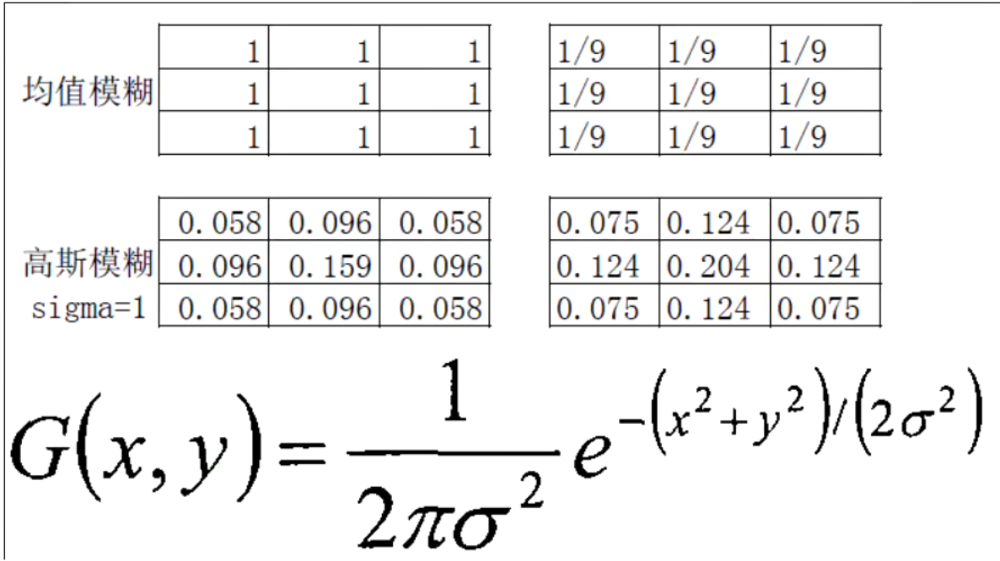

## 一. `openCV` C++（Visual studio 2017）配置

[open下载](https://opencv.org/releases/)

### 1. 配置包含目录


### 2. 配置库目录


### 3. 配置链接器


### 4. 配置环境变量并重启`vs2017`

> 将此 `E:\study\openCV\opencv-4.8.0\opencv\build\x64\vc16\bin`；路径配置到系统环境变量当中

```cpp
// 测试程序
#include <opencv2/opencv.hpp>

int main(int argc, char** argv) {
	cv::Mat src = cv::imread("E:/study/openCV/1.jpg");
	if (src.empty()) {
		printf("could not load image...");
		return -1;
	}
	cv::imshow("输入图像", src);
	cv::waitKey(0);
	return 0;
}
```

## 二. [`openCV`入门](https://blog.csdn.net/Aden422413/article/details/137361030)

### 1. 图像读取和显示

```cpp
#include <opencv2/opencv.hpp>
#include <iostream>

using namespace cv;
using namespace std;

int main(int argc, char** argv) {
	//imread 参数：路径；IMREAD_GRAYSCALE(灰度图)
	Mat src = cv::imread("E:/study/openCV/1.jpg");// 三通道，24位
	//namedWindow("输入窗口", WINDOW_FREERATIO);// 创建一个窗口，记住参数1要和imshow（）的参数1保持一直
	if (src.empty()) {
		printf("could not load image...");
		return -1;
	}
	cv::imshow("输入窗口", src);// 显示图片，默认是autosize和我们的图像大小保持一直
	cv::waitKey(0);// 程序阻塞 当为0的时候；为1的时候，表示停顿1毫秒
	destroyAllWindows(); // 销毁所有的窗口显示
	return 0;
}
```

### 2. 图片的转化和保存

#### `cvtColor`

+ `cvtColor`的功能是把图像从一个色彩空间转换到另外一个色彩空间，有三个参数，第一个参数表示源图像，第二个参数表示色彩空间转换之后的图像，第三个参数表示源和目标色彩空间如：`COLOR_BGR2HLS`、`COLOR_BGR2GRAY`等
+ `cvtColor(image,gray_image,COLOR_BGR2GRAY);`

原文链接：https://blog.csdn.net/m0_61427031/article/details/132325853

> `quickopencv.h`

```cpp
#pragma once
#include <opencv2/opencv.hpp>

using namespace cv;

class QuickDemo
{
public:
	void colorSpace_Demo(Mat &image);
};
```

> `quickopencv.cpp`

```cpp
#include <quickopencv.h>

void QuickDemo::colorSpace_Demo(Mat &image) {
	Mat gray, hsv;
	// hsv  H 0~180,s,v
	cvtColor(image, hsv, COLOR_BGR2HSV);
	cvtColor(image, gray, COLOR_BGR2GRAY);
	imshow("HSV", hsv);
	imshow("gray", gray);
	imwrite("E:/study/openCV/hsv.png", hsv);
	imwrite("E:/study/openCV/gray.png", gray);
}
```

> `main.cpp`

```cpp
#include <quickopencv.h>

using namespace std;

int main(int argc, char** argv) {
	//imread 参数：路径；IMREAD_GRAYSCALE(灰度图)
	Mat src = imread("E:/study/openCV/1.jpg");// 三通道，24位
	//namedWindow("输入窗口", WINDOW_FREERATIO);// 创建一个窗口，记住参数1要和imshow（）的参数1保持一直
	if (src.empty()) {
		printf("could not load image...");
		return -1;
	}
	imshow("输入窗口", src);// 显示图片，默认是autosize和我们的图像大小保持一直  src图像必须是8位
	QuickDemo pd;
	pd.colorSpace_Demo(src);
	waitKey(0);// 程序阻塞 当为0的时候；为1的时候，表示停顿1毫秒
	destroyAllWindows(); // 销毁所有的窗口显示
	return 0;
}
```

### 3. Mat基本结构

#### 显式创建Mat对象的七种方式

+ 【方法一】使用Mat（）`构造函数`

```cpp
Mat M(2,2,CV_8UC3,Scalar(0,0,255));
//CV_[位数][带符号与否][类型前缀]C[通道数]
//预先定义的通道数可以多达4个
```

+ 【方法二】在C/C++中通过构造函数进行初始化；

```cpp
int sz[3]={2,2,2};
Mat L(3,sz,cv_8UC,Scalar::all(0));
//上面的例子演示了如何创建一个超过两维的矩阵：指定维数，然后传递给一个指向数组的指针，这个数组包含每个维度的尺寸；后续两个参数与方法一中的相同
```

+ 【方法三】为已存在的`IplImage`指针创建信息头

```cpp
IplImage* img = cvLoadImage("1.jpg",1);
Mat mtx(img);//转换 IplImage*->Mat
```

+ 【方法四】利用Create（）函数

```cpp
M.create(4,4,CV_8UC(2));
//需要注意的是，此方法不能为矩阵设初值，只是在该百年尺寸时重新为矩阵数据开辟内存而已。
```

+ 【方法六】对小矩阵使用逗号分隔式初始化函数

```cpp
Mat C = (Mat_<double>(3,3)<<0,-1,0,-1,5,-1,0,-1,0);
cout<<"C = "<<endl<<" "<C<<endl<<endl;
```

+ 【方法七】为已存在的对象创建新信息头

```cpp
Mat RowClone = C.row(1).clone();
cout<<"RowClone = "<<endl<<" "<<RowClone<<endl<<endl;
//方法七为使用成员函数clone()或者copyTo()为一个已存在的Mat对象创建一个新的信息头
```


> `quickopencv.cpp`

```cpp
#include <quickopencv.h>

void QuickDemo::colorSpace_Demo(Mat &image) {
	Mat gray, hsv;
	// hsv  H 0~180,s,v
	cvtColor(image, hsv, COLOR_BGR2HSV);
	cvtColor(image, gray, COLOR_BGR2GRAY);
	imshow("HSV", hsv);
	imshow("gray", gray);
	imwrite("E:/study/openCV/hsv.png", hsv);
	imwrite("E:/study/openCV/gray.png", gray);
}

void QuickDemo::mat_creation_demo(Mat &image) {
	Mat m1, m2;
	m1 = image.clone();
	image.copyTo(m2);
	// 创建空白对象
	/*Mat m3 = Mat::zeros(Size(8, 8), CV_8UC3);*/
	Mat m3 = Mat::ones(Size(400, 400), CV_8UC3); // 注意是不是单通道，当为三通道的时候，只会初始化第一个通道为1
	// 给三通道赋值
	m3 = Scalar(127, 127, 127);
	// 获取宽度
	cout << "width " << m3.cols << " " << "height " << m3.rows << " " <<"channel " << m3.channels() << endl;
	cout << m3 << endl;

	//Mat m4 = m3;// 相同保持一直
	//Mat m4 = m3.clone();//不一样的自我
	Mat m4;
	m3.copyTo(m4); // 产生新的对象
	m4 = Scalar(26, 255, 26);
	imshow("show", m4);
}
```

### 4. 图像像素的读写操作

+ C++中的像素遍历与访问
  + 数组遍历
  + 指针遍历

#### `imwrite`

- 保存文件到指定的目录途径
- 只有8位，16位的`PNG/JPG/Tiff`文件格式而且是单通道或者三通道的`BGR`图像 才可以通过这种方式保存
- 保存`PNG`格式的时候可以保存透明通道的图片（`RGBA`）
- 可以指定压缩参数

> `quickopencv.cpp`

```cpp
void QuickDemo::pixel_visit_demo(Mat &image) {
	int w = image.cols;
	int h = image.rows;
	int dims = image.channels();
	// 数组下标遍历
	//for (int row = 0; row < h; row++) {
	//	for (int col = 0; col < w; col++) {
	//		if (dims == 1) {// 灰度图像
	//			int pv = image.at<uchar>(row, col);// 将uchar转为int
	//			image.at<uchar>(row, col) = 255 - pv;
	//		}
	//		if (dims == 3) {// 彩色图像
	//			Vec3b bgr = image.at<Vec3b>(row, col);
	//			image.at<Vec3b>(row, col)[0] = 255 - bgr[0];
	//			image.at<Vec3b>(row, col)[1] = 255 - bgr[1];
	//			image.at<Vec3b>(row, col)[2] = 255 - bgr[2];
	//		}
	//	}
	//}

	// 指针遍历(速度更快)
	for (int row = 0; row < h; row++) {
		uchar* current_row = image.ptr<uchar>(row);
		for (int col = 0; col < w; col++) {
			if (dims == 1) {// 灰度图像
				int pv = *current_row;
				*current_row++ = 255 - pv;
			}
			if (dims == 3) {// 彩色图像
				*current_row++ = 255 - *current_row;
				*current_row++ = 255 - *current_row;
				*current_row++ = 255 - *current_row;
			}
		}
	}

	imshow("像素读写", image);
}
```

### 5. 算术操作

+ **加法**运算（合并两张图片，注意图片格式大小要一致）
  + 特点：输出图像像素的灰度仅取决于两幅或两幅以上的输入图像的对应像素灰度值。算术运算结果和参与运算像素的邻域内像素的灰度值无关。算术运算不会改变像素的空间位置。  
+ **减法**运算：将同一景物在不同时间拍摄的图像或同一景物在不同坡段的图像相减，常称为差影法。
  + 差值图像提供了图像间的差值信息，能用于指导动态监测，运动目标的检测与跟踪，图像背景的消除及目标识别等。
  + 主要应用举例：差影法（检测同一场景两幅图像之间的变化），混合图像的分离  
+ **乘法**运算
  + 图像的乘法运算就是将两幅图像对应的灰度值或彩色分量进行相乘。
  + 乘运算的主要作用是抑制图像的某些区域，掩膜值置为1，否则置为0。乘运算有时也被用来实现卷积或相关的运算。
  + 主要应用： 1.图像的局部显示 2.改变图像的灰度级 
+ **除法**运算
  + 图像的乘法运算就是将两幅图像对应的灰度值或彩色分量进行相除。

```cpp
void QuickDemo::operator_demo(Mat &image) {
	Mat dst;
	dst = image + Scalar(50, 50, 50);
	Mat m = Mat::zeros(image.size(), image.type());
	m = Scalar(2, 2, 2);
	//multiply(image, m, dst);// 相乘计算
	add(image, m, dst); // 加
	subtract(image, m, dst); //减
	divide(image, m, dst); //除
	imshow("算术操作", image);

	// 加法
	/*
	Mat dst = Mat::zeros(image.size(), image.type());
	Mat m = Mat::zeros(image.size(), image.type());
	m = Scalar(50, 50, 50);
	int w = image.cols;
	int h = image.rows;
	int dims = image.channels();
	for (int row = 0; row < h; row++) {
		for (int col = 0; col < w; col++) {
			Vec3b p1 = image.at<Vec3b>(row, col);
			Vec3b p2 = image.at<Vec3b>(row, col);
			dst.at<Vec3b>(row, col)[0] = saturate_cast<uchar>(p1[0] - p2[0]);//saturate_cast 做范围的判定
			dst.at<Vec3b>(row, col)[1] = saturate_cast<uchar>(p1[1] - p2[1]);;
			dst.at<Vec3b>(row, col)[2] = saturate_cast<uchar>(p1[2] - p2[2]);
		}
	}
	imshow("算术操作", image);
	*/
}
```

### 6. 亮度调节demo

```cpp
Mat dst, m, src;
int lightness = 50;
static void on_track(int, void*) {
	m = Scalar(lightness, lightness, lightness);
	add(src, m, dst);
	imshow("亮度调节", dst);;
}
void QuickDemo::tracking_demo(Mat &image) {
	namedWindow("亮度调节", WINDOW_AUTOSIZE);
	dst = Mat::zeros(image.size(), image.type());
	m = Mat::zeros(image.size(), image.type());
	src = image;
	int max_value = 100;
	createTrackbar("value bar:", "亮度调节", &lightness, max_value, on_track);

}
```

+ 优化之后的程序

```cpp
static void on_track(int b, void* userdata) {
	Mat image = *((Mat*)userdata);
	Mat dst = Mat::zeros(image.size(), image.type());
	Mat m = Mat::zeros(image.size(), image.type());
	m = Scalar(b, b, b);
	subtract(image, m, dst);
	imshow("亮度调节", dst);;

}
void QuickDemo::tracking_demo(Mat &image) {
	namedWindow("亮度调节", WINDOW_AUTOSIZE);
	int lightness = 50;
	int max_value = 100;
	createTrackbar("value bar:", "亮度调节", &lightness, max_value, on_track,(void*)(&image));
	on_track(50, &image);
}
```


### 7. 参数传递与亮度调节与对比度

#### 改变图像的亮度和对比度

+ 理论：
+ 图像变换可以看作如下：
  + 像素变换——点操作
  + 邻域操作——区域
  + 调整图像亮度属于像素变换-点操作

$$
g ( i , j ) = α f ( i , j ) + β
$$

+ 其中*α*>0,*β*是增益变量

```cpp
static void on_light(int lightness, void* userdata) {
 
    Mat image = *((Mat*)(userdata));
    Mat dst = Mat::zeros(image.size(), image.type());
    Mat m = Mat::zeros(image.size(), image.type());
 
    double light = lightness-50;
    /*
        gamma范围变成[-50,50]
        这样我们就实现了增大/降低亮度，
        先 降低一半，不然只能提高
    */
 
    addWeighted(image, 1.0, m, 0, light, dst);
    /*
    由公式：dst = src1 * alpha + src2 * beta + gamma 可知
    设置第1个权重1，第二个权重0
        相当于图片融合时，只有第1个的成分
    设置要增加的标量为lightness
        可以实现亮度的调整
    */
    imshow("windows", dst);
 
}
 
static void on_contrast(int contrast, void* userdata) {
 
    Mat image = *((Mat*)(userdata));
    Mat dst = Mat::zeros(image.size(), image.type());
    Mat m = Mat::zeros(image.size(), image.type());
 
    double contra = contrast / 100.0;
    /*
    这里的contrast初始值1 是一个[0,2]范围的数, 实现 可以调高调小
    */
    addWeighted(image, contra, m, 0, 0, dst);// 利用 图片融合函数
    /*
    由公式：dst = src1 * alpha + src2 * beta + gamma 可知
    设置第1个权重cotrast，第二个权重0
        相当于图片融合时，只有第1个的成分
        同时可以实现对比度的调整
    */
 
    imshow("windows", dst);
 
}
 
 
int main(int argc, char *argv[])
{
    QApplication a(argc, argv);
    MainWindow w;
    //w.show();
 
    namedWindow("windows", WINDOW_NORMAL);
    resizeWindow("windows", 500, 500);
 
 
    Mat srcImage = imread("C:\\Users\\29492\\Desktop\\Qt +opencv\\project\\light contrast regulate\\car7.png");
//默认BGR
 
    if (srcImage.empty())
    {
        printf("could not load image……\n");
    }
 
        int lightness = 50; //当前值
        int max_light = 100;//最大值
 
        int contrast = 100; //当前值
        int max_contrast = 200;//最大值
 
    createTrackbar("Value_contrast:", "windows", &contrast, max_contrast, on_contrast,(void*)(&srcImage));
    createTrackbar("Value_light:", "windows", &lightness, max_light, on_light,(void*)(&srcImage));
 
    imshow("windows", srcImage);
 
    std::cout <<srcImage << std::endl;
 
}
```

> `quickopencv.cpp`

```cpp
static void on_lightness(int b, void* userdata) {
	Mat image = *((Mat*)userdata);
	Mat dst = Mat::zeros(image.size(), image.type());
	Mat m = Mat::zeros(image.size(), image.type());
	addWeighted(image, 1.0,m,0,b,dst);
	imshow("亮度调节", dst);

}

static void on_contrast(int b, void* userdata) {
	Mat image = *((Mat*)userdata);
	Mat dst = Mat::zeros(image.size(), image.type());
	Mat m = Mat::zeros(image.size(), image.type());
	double contrast = b / 100.0;
	addWeighted(image, contrast, m, 0.0, b, dst);
	imshow("亮度对比度调节", dst);
}
void  QuickDemo::tracking_demo(Mat &image) {
	namedWindow("亮度调节", WINDOW_AUTOSIZE);
	int lightness = 50;
	int max_value = 100;
	int contrast_value = 100;
	createTrackbar("value bar:", "亮度调节", &lightness, max_value, on_lightness,(void*)(&image));
	createTrackbar("contrast_value bar:", "亮度调节", &contrast_value, 200, on_contrast,(void*)(&image));
	on_lightness(50, &image);
}
```

### 8. `applyColorMap`

#### 1、函数原型

```cpp
cv::applyColorMap (InputArray src, OutputArray dst, int colormap)
cv::applyColorMap (InputArray src, OutputArray dst, InputArray userColor)
```

#### 2、参数详解

| `src`      | `CV_8UC1` 或 `CV_8UC3` 类型的源图像，灰度或彩色。            |
| ---------- | ------------------------------------------------------------ |
| `dst`      | 结果是颜色映射的源图像。 注意：在 `dst` 上调用 `Mat::create。` |
| `colormap` | `The colormap to apply, see ColormapTypes`                   |

```cpp
// 将灰度图或彩色图转换成opencv提供的20多种色彩值
void QuickDemo::color_style_demo(Mat &image) {
	// opencv提供的色彩值
	int colorMap[] = {
		COLORMAP_AUTUMN,
		COLORMAP_BONE,
		COLORMAP_JET,
		COLORMAP_WINTER,
		COLORMAP_RAINBOW,
		COLORMAP_OCEAN,
		COLORMAP_SUMMER,
		COLORMAP_SPRING,
		COLORMAP_COOL,
		COLORMAP_HSV,
		COLORMAP_PINK,
		COLORMAP_HOT,
		COLORMAP_PARULA,
		COLORMAP_MAGMA,
		COLORMAP_INFERNO,
		COLORMAP_PLASMA,
		COLORMAP_VIRIDIS,
		COLORMAP_CIVIDIS,
		COLORMAP_TWILIGHT,
		COLORMAP_TWILIGHT_SHIFTED
	};
	Mat dst;
	int index = 0;
	while (true) {
		int c = waitKey(1000);
		if (c == 27) {	// 退出
			break;
		}
		// index%19,index取模之后下标值在 0 - 19 之间循环，下标不会超过19
		applyColorMap(image, dst, colorMap[index % 19]);
		index++;
		namedWindow("colorStyle", WINDOW_NORMAL);
		imshow("colorStyle", dst);
	}
}
```

### 9. 逻辑运算（并集、差集、补集、异或）

```cpp
void QuickDemo::bitwise_Demo(Mat& image) {
	Mat m1 = Mat::zeros(Size(256, 256), CV_8UC3);
	Mat m2 = Mat::zeros(Size(256, 256), CV_8UC3);

	rectangle(m1, Rect(50, 50, 80, 80), Scalar(255, 255, 0), -1, LINE_8, 0);//LINE_8 反锯齿
	//rectangle(m2, Rect(100, 100, 80, 80), Scalar(0, 255, 255), -1, LINE_8, 0);
	circle(m2, Point(100, 100), 40, Scalar(0, 255, 255), -1, LINE_8, 0);

	imshow("m1", m1);
	imshow("m2", m2);
	Mat dst0, dst1, dst00, dst11, dst3;
	bitwise_and(m1.clone(), m2.clone(), dst0);
	bitwise_or(m1.clone(), m2.clone(), dst1);

	bitwise_not(dst0, dst00);
	dst11 = ~dst1;

	bitwise_xor(m1.clone(), m2.clone(), dst3);
	imshow("and_交集_dst", dst0);
	imshow("or_并集_dst", dst1);
	imshow("not_交集取反_dst", dst00);
	imshow("not_并集取反_dst", dst11);
	imshow("xor_异或集_dst", dst3);
}
```


### 10. 键盘响应

```cpp
void QuickDemo::keys_Demo(Mat& image) {
	Mat dst = Mat::zeros(image.size(),image.type());
	while (true) {
		int c = waitKey(200);
		if (c == 27) {
			break;
		}
		if (c == 49) {
			std::cout << "you enter key #" << c << std::endl;
			cvtColor(image, dst, COLOR_BGR2GRAY);
		}
		if (c == 50) {
			std::cout << "you enter key #" << c << std::endl;
			cvtColor(image, dst, COLOR_BGR2HSV);
		}
		if (c == 51) {
			std::cout << "you enter key #" << c << std::endl;
			add(image, Scalar(30, 30, 30), dst);
		}
		imshow("键盘响应",dst);
	}
}
```

### 11. 通道相关操作

> - `src`: 输入的矩阵数组。
> - `nsrcs`: 输入矩阵的数量。
> - `dst`: 输出的矩阵数组。
> - `ndsts`: 输出矩阵的数量。
> - `fromTo`: 一个整数数组，指定了如何从输入矩阵的通道复制到输出矩阵的通道。例如，`fromTo`数组 `{0,2,1,1,2,0}` 表示将`src`的第0个通道复制到`dst`的第2个通道，将`src`的第1个通道复制到`dst`的第1个通道，以此类推。
> - `npairs`: `fromTo`数组中索引对的数量。这个数字应该是`fromTo`数组长度的一半，因为每对索引占用两个位置。

```cpp
void mixChannels(
    const Mat* src,       // 输入数组或向量矩阵，所有矩阵的大小和深度必须相同
    size_t nsrcs,         // 输入矩阵的数量
    Mat* dst,             // 输出数组或矩阵向量，大小和深度必须与src[0]相同
    size_t ndsts,         // 输出矩阵的数量
    const int* fromTo,    // 指定被复制通道与要复制到的位置组成的索引对
    size_t npairs         // fromTo中索引对的数目
);

```

```cpp
void QuickDemo::channel_Demo(Mat& image) {
	vector<Mat>mv;
	split(image, mv);// 通道分离
	imshow("blue", mv[0]);
	imshow("green", mv[1]);
	imshow("red", mv[2]);

	Mat dst;
	mv[0] = 0;
	mv[1] = 0;
	merge(mv, dst);// 通道合并
	imshow("red", dst);

	int form_to[] = { 0,2,1,1,2,0 };
	mixChannels(&image,1, &dst, 1,form_to,3); // 通道混合
	imshow("mixChannels", dst);
}
```

### 12. 图像色彩空间变化

> ```cpp
>  inRange(src, lowerb, upperb, dst);
> ```

+ `src` 是源图像，`lowerb` 和 `upperb` 定义了颜色范围，`dst` 是输出的二值图像。

```cpp
void QuickDemo::inrange_demo(Mat &image) {

	//将输入图像从BGR色彩空间转换到HSV色彩空间。这是因为在HSV空间中，基于颜色的图像分割更加简单和直观。
	Mat hsv;
	cvtColor(image, hsv, COLOR_BGR2HSV);

	//通过inRange函数定义绿色的HSV范围，并生成一个二值掩码（mask），其中绿色区域为白色（值为255），非绿色区域为黑色（值为0）。
	Mat mask;
	inRange(hsv, Scalar(35, 43, 46), Scalar(77, 255, 255), mask);

	imshow("mask1", mask);

	//创建一个与原图同样大小和类型的纯红色背景图像redback。
	Mat redback = Mat::zeros(image.size(), image.type());
	redback = Scalar(40, 40, 200);// 红色背景

	//使用bitwise_not函数反转掩码，使得原来的绿色区域变为黑色（0），非绿色区域变为白色（255）。
	bitwise_not(mask, mask);
	imshow("mask2", mask);
	image.copyTo(redback, mask);
	imshow("roi", redback);
}
```

### 13. 像素值统计

```cpp
void QuickDemo::pixel_statistic_demo(Mat &image) {
	double minv, maxv;
	Point minLoc, maxLoc;
	vector<Mat>mv;
	split(image, mv);// 通道分离
	for (int i = 0; i < mv.size(); i++) {
		minMaxLoc(mv[i], &minv, &maxv, &minLoc, &maxLoc, Mat());// image需要是单通道的
		cout << "No.channels: " << i << "min value: " << minv << "max value: " << maxv << endl;
	}
	Mat mean, stddev;// 方差越大，图片的差异化越大
	meanStdDev(image, mean, stddev);
	cout << "means: " << mean  << endl;
	cout << "stddev: " << stddev << endl;
}
```

### 14. 几何形状绘制

<!-- tabs:start -->

#### **线**

> 绘制线，要给出两个点坐标

+ `img`：输入/输出图像，即要在其上绘制直线的图像。
+ `pt1`：直线的起始点坐标。
+ `pt2`：直线的结束点坐标。
+ `color`：直线的颜色，可以是 Scalar 类型表示的颜色值。
+ `thickness`：直线的厚度。默认值为1，表示单像素宽度。
+ `lineType`：线条类型，定义了边框的连接方式。默认值为LINE_8。
+ `shift`：坐标点的小数位数。默认值为0。

```cpp
void cv::line(InputOutputArray img, Point pt1, Point pt2, const Scalar& color, 
int thickness = 1, int lineType = LINE_8, int shift = 0);
```

#### **线圆**

> 绘制圆，要给出圆点和半径：

+ `img`: 在该图像上进行绘制操作。可以是单通道或多通道图像。
+ `center`: 圆心坐标，指定圆的中心点位置，类型为 `cv::Point` 或 `cv::Point2f。`
+ `radius`: 圆的半径，指定圆的大小。
+ `color`: 圆的颜色，类型为 `cv::Scalar`，表示 `BGR` 颜色值。例如，红色可表示为 (0, 0, 255)。
+ `thickness` (可选): 表示绘制圆的线条粗细。默认值为 1。如果设为-1，则绘制一个实心圆
+ `lineType` (可选): 指定绘制线条的样式。默认值为 LINE_8，表示8连通线条。
+ `shift` (可选): 像素坐标的小数位数。默认值为 0。

```cpp
void cv::circle(InputOutputArray img, Point center, int radius, const Scalar& color,
                int thickness = 1, int lineType = LINE_8, int shift = 0);
```

#### **线椭圆**

> 椭圆相比于圆，半径分成了半长轴和半短轴，并且有角度

+ `axes`：椭圆的主轴尺寸，以半长轴和半短轴的大小表示。 
+ `angle`：椭圆旋转角度（逆时针方向）。 
+ `startAngle`：椭圆起始角度（以逆时针方向测量）。 
+ `endAngle`：椭圆结束角度（以逆时针方向测量）。

```cpp
void cv::ellipse(InputOutputArray img, Point center, Size axes, double angle, double startAngle,
 double endAngle, const Scalar& color, int thickness = 1, int lineType = LINE_8, int shift = 0);
```

#### **矩形**

> 绘制矩形，要给出左上角坐标和右下角坐标或者是左上角坐标和宽、高

+ `pt1`：矩形的左上角点坐标。 
+ `pt2`：矩形的右下角点坐标 
  + 或者：`cv::Rect`(左上角点坐标,宽，高)

```cpp
rectangle(bg,rect,Scalar(0,0,255),-1,8,0);
```

> - 参数8：这是线型参数。在绘制图形时，可以选择不同的线型。数字8代表使用8连接线型，也就是说线条是8个方向连接的，这是默认值。还有其他选项，如抗锯齿线型 `cv::LINE_AA`。
> - 参数0：这是像素点的位移参数，它表示坐标点的小数位数。通常，这个参数用于高精度的坐标位置，当设置为0时，表示没有位移，即坐标值是整数。在大多数情况下，使用默认值0就足够了。

```cpp
第一种
void cv::rectangle(InputOutputArray img, Point pt1, Point pt2, const Scalar& color, 
int thickness = 1, int lineType = LINE_8, int shift = 0);

第二种
void cv::rectangle(InputOutputArray img, Rect rect, const Scalar& color, 
int thickness = 1, int lineType = LINE_8, int shift = 0);
```

```cpp
#include <opencv2/opencv.hpp>
#include<iostream>  

using namespace std;

int main()
{
    cv::Mat mask = cv::Mat::zeros(cv::Size(640, 400), CV_8UC3);

    cv::line(mask, cv::Point2f(300, 300), cv::Point2f(400, 400), cv::Scalar(255, 255, 255), 3);  // 宽度为3的直线

    cv::circle(mask, cv::Point(30, 30), 10, cv::Scalar(255, 255, 255), 1);  // 空心圆
    cv::circle(mask, cv::Point(100, 30), 15, cv::Scalar(0, 0, 255), -1);   // 实心圆

    cv::ellipse(mask, cv::Point(150, 30), cv::Size(30, 15), 30, 0, 360, cv::Scalar(255, 0, 0), -1);  // 实心椭圆
  
    cv::rectangle(mask, cv::Point(200, 200), cv::Point(300, 300), cv::Scalar(0, 255, 0), 2);  // 矩形
    // cv::rectangle(mask, cv::Rect(200,200,100,100), cv::Scalar(0, 255, 0), 2);  // 矩形

    cv::imshow("原图", mask);
    cv::waitKey(0);
    cv::destroyAllWindows();

    return 0;
}
```


#### **多边形**

+ 在[图像分割](https://so.csdn.net/so/search?q=图像分割&spm=1001.2101.3001.7020)中，目标对象往往是不规则的形状。根据目标对象的多个顶点坐标来绘制（进行分割标签标注的时候，不就是在目标周围点很多个坐标吗)。
+ 目前`OpenCV4`提供的绘制多边形的`fillPoly`有两种构造方式：

```cpp
第一种：
void cv::fillPoly(InputOutputArray img, const Point** pts, const int* npts, int ncontours,
 const Scalar& color, int lineType = LINE_8, int shift = 0, Point offset = Point());
 
第二种：
void fillPoly(InputOutputArray img, InputArrayOfArrays pts,
                           const Scalar& color, int lineType = LINE_8, int shift = 0,
                           Point offset = Point() );
                           
第一种：
pts：多边形顶点的数组指针，可以使用二维数组或vector来表示。每个多边形都由一组点组成。
npts：多边形顶点数目的整型数组指针，指定每个多边形的顶点数。
ncontours：多边形数量，即pts和npts数组中多边形的数量。

第二种：
上面三个参数统一为一个数组，存放所有多边形的坐标

color：填充的颜色，可以是 Scalar 类型表示的颜色值。
lineType：线条类型，定义了多边形轮廓的连接方式。默认值为LINE_8。
shift：坐标点的小数位数。默认值为0。
offset：偏移量，添加到所有顶点的坐标中。默认情况下为Point()，表示没有偏移。
```

+ **比较简单和常用的是第二种构造方式，只需要给出所有要绘制的坐标就行。在实际应用中，目标对象的坐标是通过一些方法来捕获的，如`findContours`函数，与之对应的绘制函数还有一个`drawContours()`，后面用实例再一起说明。**

```cpp
#include <opencv2/opencv.hpp>
#include <vector>
#include<iostream>  

using namespace std;

int main()
{
    cv::Mat image(400, 400, CV_8UC3, cv::Scalar(0, 0, 0));
    
    std::vector<cv::Point> points1 = { cv::Point(50, 50), cv::Point(200, 100), cv::Point(150, 200) };
    std::vector<cv::Point> points2 = { cv::Point(250, 250), cv::Point(350, 300), cv::Point(300, 150) };
    std::vector<cv::Point> points3 = { cv::Point(100, 200), cv::Point(200, 300), cv::Point(150, 350) };

    std::vector<std::vector<cv::Point>> polygons;
    polygons.push_back(points1);
    polygons.push_back(points2);
    polygons.push_back(points3);

    cv::fillPoly(image, polygons, cv::Scalar(255, 0, 0));

    cv::imshow("Image", image);
    cv::waitKey(0);
    cv::destroyAllWindows();

    return 0;
}

```


> 第二种方法绘制
>
> `drawContours`

```cpp
void drawContours(InputOutputArray image, InputOutputArray contours, InputOutputArray contourIdx, 
int contourColor, Scalar thickness=Scalar(), int lineType=LINE_8, 
InputArray hierarchy = noArray(), int maxLevel = INT_MAX, Point offset = Point() );
```

+ 参数说明：

  + `image`：输出图像，即绘制轮廓后的图像。

  + `contours`：轮廓集合，每个轮廓由一系列点组成。

  + `contourIdx`：轮廓索引数组，指定要绘制哪些轮廓。如果为NULL,则绘制所有轮廓。

  + `contourColor`：轮廓颜色，使用Scalar类型表示。

  + `thickness`：轮廓线宽，默认值为1。

  + `lineType`：轮廓线类型，默认值为LINE_8。

  + `hierarchy`：轮廓层次结构，用于绘制轮廓的父子关系。默认值为`noArray()。`只有在你想要绘制部分轮廓(参见`maxLevel`)时，才需要使用这个参数。

  + `maxLevel`：**表示绘制轮廓的最大层级。如果`maxLevel`为0，则只绘制指定的轮廓；如果`maxLevel`为1，则绘制轮廓及其所有嵌套廓；如果`maxLevel`为2,则绘制轮廓、所有嵌套轮廓、所有嵌套到嵌套的轮廓等。需要注意的是，当存在层次结构时，这个参数才会被考虑。**

  + offset：轮廓点的偏移量，默认值为(0,0)。

```cpp
#include <iostream>
#include <opencv2/opencv.hpp>
 
using namespace cv;
using namespace std;
 
int main()
{
    // 读取灰度图像
    Mat src = imread("./1.png", IMREAD_GRAYSCALE);
    if (src.empty())
    {
        cout << "无法读取图像" << endl;
        return -1;
    }
    imshow("原图", src);
    waitKey(0);
    // 二值化图像
    Mat binary;
    threshold(src, binary, 128, 255, THRESH_BINARY);
    imshow("二值化图", binary);
    waitKey(0);
 
    // 查找轮廓
    vector<vector<Point>> contours;
    vector<Vec4i> hierarchy;
    findContours(binary, contours, hierarchy, RETR_EXTERNAL, CHAIN_APPROX_SIMPLE);
 
    // 绘制轮廓
    Mat result(src.size(), CV_8UC3, Scalar(0, 0, 0));
    for (size_t i = 0; i < contours.size(); i++)
    {
        // 蓝色颜色
        Scalar color(255,0,0); 
        // 只绘制第一层的轮廓
        drawContours(result, contours, static_cast<int>(i), color, 2, LINE_8, hierarchy, 0);
    }
 
    // 显示结果
    imshow("轮廓图", result);
    waitKey(0);
 
    return 0;
}
```

<!-- tabs:end -->

### 15. 随机数和随机颜色

```cpp
void QuickDemo::random_drawing() {
	Mat canvas = Mat::zeros(Size(512, 512), CV_8UC3);
	int w = canvas.cols;
	int h = canvas.rows;
	RNG rng(12345);// 产生随机数，12345产生随机数的种子
	while (true) {
		int c = waitKey(10);
		if (c == 27) { // 退出
			break;
		}
		int x1 = rng.uniform(0, w);
		int y1 = rng.uniform(0, h);
		int x2 = rng.uniform(0, w);
		int y2 = rng.uniform(0, h);
		//canvas = Scalar(0, 0, 0);// 每次绘制一条线，每次绘制之后清屏，擦除画板
		line(canvas,Point(x1,y1),Point(x2,y2),Scalar(rng.uniform(0,255), rng.uniform(0, 255), rng.uniform(0, 255)),1,LINE_AA,0);
		imshow("随机绘制演示", canvas);
	}
}
```


### 16. 鼠标操作与响应(ROI区域绘制)

<!-- tabs:start -->

#### **API**

> opencv中使用鼠标事件使用的是鼠标操作相关的回调函数：

```cpp
cv::setMouseCallback(const string& windowname, MouseCallback onMouse, void* userdata=0)
// windowname: 要操作的窗口名称
// onMouse: 鼠标事件函数，鼠标事件发生以后，要执行的回调函数。函数原型是 
// void onMouse(int event, int x, int y, int flags, void * para)
// userdata: 回调函数的参数
```

> 下面是回调函数 " onMouse "

```cpp
void onMouse(int event, int x, int y, int flags, void *para)
// int event: 鼠标事件，见后续说明
// x, y 是鼠标在图像坐标系中的坐标
// flags :
// para： 是用户传递到回调函数中的参数
```

> 其他项目使用涉及到的函数代码：

```cpp
cv::selectROIs("MultiTracker", frame, bboxes_, showCrosshair, fromCenter);
// “MultiTracker” : windowsName
// frame: 当前画面；格式为cv::Mat
// bboxes： 要存储的框框格式为：std::vector<cv::Rect>
// showCrosshair:默认为True
// fromCenter:从中心点还是从对角点，默认为false，为true时，选框从中心点开始
```

#### **参数定义**

>  EVENT:

```cpp
// EVENT的参数定义
enum
{
	CV_EVENT_MOUSEMOVE =0,//滑动
	CV_EVENT_LBUTTONDOWN =1,//左键点击
	CV_EVENT_RBUTTONDOWN =2,//右键点击
	CV_EVENT_MBUTTONDOWN =3,//中键点击
	CV_EVENT_LBUTTONUP =4,//左键放开
	CV_EVENT_RBUTTONUP =5,//右键放开
	CV_EVENT_MBUTTONUP =6,//中键放开
	CV_EVENT_LBUTTONDBLCLK =7,//左键双击
	CV_EVENT_RBUTTONDBLCLK =8,//右键双击
	CV_EVENT_MBUTTONDBLCLK =9//中键双击
};
```

> flags:

```cpp
enum
{
    CV_EVENT_FLAG_LBUTTON =1,//左键拖拽
    CV_EVENT_FLAG_RBUTTON =2,//右键拖拽
    CV_EVENT_FLAG_MBUTTON =4,//中键拖拽
    CV_EVENT_FLAG_CTRLKEY =8,//按CTRL不放
    CV_EVENT_FLAG_SHIFTKEY =16,//按SHIFT不放
    CV_EVENT_FLAG_ALTKEY =32//按ALT不放
};
```

#### **案列**

```cpp
Point sp(-1,-1);// 开始的位置
Point ep(-1, -1); // 结束的位置
Mat temp;// 保存原图
static void on_draw(int event, int x, int y, int flags, void *userdata) {
	Mat image = *((Mat*)userdata);
	if (event == EVENT_LBUTTONDOWN) {
		sp.x = x;
		sp.y = y;
	}
	else if (event == EVENT_LBUTTONUP) {
		ep.x = x;
		ep.y = y;
		int dx = ep.x - sp.x;
		int dy = ep.y - sp.y;
		if (dx > 0 && dy > 0) {
			Rect box(sp.x, sp.y, dx, dy);
            temp.copyTo(image);
			imshow("ROI区域", image(box));
			rectangle(image, box, Scalar(0, 0, 255), 2, 8, 0);
			imshow("鼠标绘制", image);
			// 为下一次绘制做初始化
			sp.x = -1;
			sp.y = -1;
		}
	}
	else if (event == EVENT_MOUSEMOVE) {
		if (sp.x > 0 && sp.y > 0) {
			ep.x = x;
			ep.y = y;
			int dx = ep.x - sp.x;
			int dy = ep.y - sp.y;
			if (dx > 0 && dy > 0) {
				Rect box(sp.x, sp.y, dx, dy);
				temp.copyTo(image);
				rectangle(image, box, Scalar(0, 0, 255), 2, 8, 0);
				imshow("鼠标绘制", image);
			}
		}
	}
}
void QuickDemo::mouse_demo(Mat &image) {
	namedWindow("鼠标绘制", WINDOW_AUTOSIZE);
	setMouseCallback("鼠标绘制", on_draw,(void*)(&image));
	imshow("鼠标绘制", image);
	temp = image.clone();
}
```

<!-- tabs:end -->

### 17. 图像数据类型转化和归一化

> 像素类型转换

+ `image.convertTo(image, CV_32FC3);`
  + 将image(第一个)转换为CV_32FC3类型，最终输出为image(第二个)

+ 对于数据类型而言，其结构为：CV_<bit_depth>(S|U|F)C<number_of_channels>
+ _例如：CV_32FC3 细分：CV_ 32 F C3
  + 32表示每个像素点值所占32bit
  + F表示Float单精度浮点数
  + C3表示4通道图像，为啥呢？C表示通道数，C1是单通道、C2是三通道、C3是四通道，多了一个alpha透明度通道，PNG格式里面就有alpha通道
  + 当然也可以省略，默认为C1
+ 其实就三个参数而已，总结一下

| **参数一(CV_**`32`**FC3)**  | **参数二(CV_32**`F`**C3)**  | **参数三(CV_32F**`C3`**) 该参数可省略，默认为C1** |
| :-------------------------: | :-------------------------: | :-----------------------------------------------: |
|              8              |  S：signed int，有符号整形  |                    C1：单通道                     |
|             16              | U：unsigned int，无符号整形 |                    C2：三通道                     |
|             32              |   F：float，单精度浮点型    |           C3：四通道，多了一个alpha通道           |
|             64              |                             |                                                   |
| 表示每个像素点值所占的bit位 |                             |                                                   |

> 归一化

+ `normalize(image, result, 1.0, 0, NORM_MINMAX);`
  + 参数一：处理对象为image
  + 参数二：输出结果为result
  + 参数三：alpha
  + 参数四：beta
  + 参数五：不同归一化操作，包括：`NORM_L1、NORM_L2、NORM_INF、NORM_MINMAX`

+ `NORM_L1：`
  1. 求解image图片中所有像素点绝对值之和sum
  2. `result[0,0] = (alpha * image[0,0]) / sum`，得到result的第一个像素值，以此类推得到result图像

+ `NORM_L2：`
  1. 求解image图片中各像素点值的平方和的开方sum(也就是L2-范数)
  2. `result[0,0] = (alpha * image[0,0]) / sum`，得到result的第一个像素值，以此类推得到result图像

+ `NORM_INF：`
  1. 求解image图片中所有像素点值最大的那个max
  2. `result[0,0] = (alpha * image[0,0]) / max`，得到result的第一个像素值，以此类推得到result图像

+ `NORM_MINMAX：`【**常用**】
  1. alpha和beta系统会自动判断出最大值和最小值，分别赋值为max和min
  2. 根据公式计算出result的每个像素点的值


```cpp
void QuickDemo::norm_demo(Mat &image) {
	Mat dst;
	cout << image.type() << endl;
	image.convertTo(image, CV_32F);
	cout << image.type() << endl;
	normalize(image,dst,1.0,0,NORM_MINMAX);
	cout << dst.type() << endl;
	imshow("图像数据归一化", dst);
}
```

### 18. 图像的缩放和插值

<!-- tabs:start -->

#### **API**

>  1.resize 重设图像宽长 区别一下resizewindow改原图不输出，另一个输出可差值

```tex
  共6个参数
            第1个参数 输入
            第2个参数 输出
            
            第3个参数 输出图像的size
            第4个参数 fx 沿水平的比例因子
            第5个参数 fy 沿垂直的比例因子
                    可以使用size做放缩插值，也可以使用fx，fy卷积做放缩插值
            第6个参数 插值方法
```

resize的应用场景有很多，其中最常见的就是：

> 在做一些神经网络训练，深度网络训练，卷积网络训练等的时候，为了方便处理，会把图像resize到指定大小

#### **插值算法**

>  [插值算法详解](https://blog.csdn.net/jia20003/article/details/40020775)

+ 关于插值算法，这里简单介绍一下
+ 首先，图像放缩的时候为什么要用插值算法呢？

> 这是因为，图像放缩时，像素点的位置会发生变化

> 要想得到放缩后图像像素点的位置，就要经过某种算法计算得来

> 这种计算的算法就是插值算法。

+ 插值算法有很多相关的应用场景，比如：

> 几何变换

> 透视变换

> 插值计算新像素

> resize

+  而常见的插值算法有4种，其中前两种比较快，后两种比较慢

> `INTER_NEAREST =` 0 ——最近邻插值

> `INTER_LINEAR = 1` ——线性插值

> `INTER_CUBIC = 2` ——立方插值

> `INTER_LANCZOS4 = 4` ——`Lanczos`插值

#### **案列**

```cpp
void QuickDemo::resize_demo(Mat &image) {
	Mat zoomin, zoomout;//缩小，放大

	int w = image.cols;
	int h = image.rows;

	imshow("原图", image);

	//resize(image, zoomin, Size(w / 2, h / 2), 0, 0, INTER_LINEAR);
	//imshow("缩小", zoomin);

	resize(image, zoomout, Size(w * 2, h * 2), 0, 0, INTER_LINEAR);
	imshow("放大", zoomout);
}
```

<!-- tabs:end -->

### 19. 图像的反转

```cpp
void QuickDemo::flip_demo(Mat &image) {
	Mat dst;
	flip(image,dst,0);// 输入；输出；0—上下反转，1—左右，-1——180°旋转
	imshow("图像反转", dst);
}
```

### 20. [图像旋转](https://blog.csdn.net/weixin_46098612/article/details/127873093)


```cpp
void QuickDemo::rotate_demo(Mat& image) {

	Mat dst, M;//M为变换矩阵

	int w = image.cols;
	int h = image.rows;
	/*
	 共3个参数
		第1个参数 图像的旋转中心
		第2个参数 旋转角度（规定坐标原点左上角，正值表示逆时针旋转）
		第3个参数 各向同性比例因子（对图像本身大小的放缩）
	*/
	M = getRotationMatrix2D(Point2f(w / 2, h / 2), 45, 1.0);// 原来图像的中心位置；旋转角度；图片本省是否需要放缩

	//C++的abs则可以自然支持对整数和浮点数两个版本（实际上还能够支持复数）
	double cos = abs(M.at<double>(0, 0));
	double sin = abs(M.at<double>(0, 1));

	int nw = w * cos + h * sin;
	int nh = w * sin + h * cos;

	//新图像的旋转中心
	M.at<double>(0, 2) += (nw / 2 - w / 2);
	M.at<double>(1, 2) += (nh / 2 - h / 2);
	/*
	共7个参数
		第1个参数 输入
		第2个参数 输出
		第3个参数 输入的变换矩阵（2行3列）
		第4个参数 输出图像的size
		第5个参数 插值方法
		第6个参数 边界模式（暂且不学习。深入探讨的话，还会涉及很多的东西）
		第7个参数 边界颜色（暂且不学习。深入探讨的话，还会涉及很多的东西）
	*/
	warpAffine(image, dst, M, Size(nw, nh), INTER_LINEAR, 0, Scalar(0, 200, 0));

	imshow("旋转演示", dst);
}
```

### 21. 视频文件摄像头使用

```cpp
void QuickDemo::video_demo(Mat& image) {
	VideoCapture capture(0);// "参数也可以是具体的视频路径"
	Mat frame;
	while (true) {
		capture.read(frame);
		flip(frame, frame, 1);
		if (frame.empty()) {
			break;
		}
		imshow("frame", frame);
		int c = waitKey(1);
		if (c == 27) break;
	}
    capture.release();
}
```

### 22. [视频处理与保存](https://blog.csdn.net/qq_33867131/article/details/133344471)

> `SD`标准清晰度    `HD`高清   `UHD`蓝光

```cpp
void QuickDemo::video_demo(Mat& image) {
	VideoCapture capture("E:/study/openCV/1.mp4");
	int frame_width = capture.get(CAP_PROP_FRAME_WIDTH); //视频帧宽度
	int frame_heigh = capture.get(CAP_PROP_FRAME_HEIGHT);//视频帧高度
	int count = capture.get(CAP_PROP_FRAME_COUNT); // 总帧数
	double fps = capture.get(CAP_PROP_FPS);
	cout << "frame width:" << frame_width  << endl;
	cout << "frame_heigh" << frame_heigh << endl;
	cout << "fps" << fps << endl;
	cout << "Number of Frames:" << count << endl;
	VideoWriter writer("E:/study/openCV/test.mp4",capture.get(CAP_PROP_FOURCC),fps,Size(frame_width, frame_heigh),true);
	Mat frame;
	while (true) {
		capture.read(frame);
		flip(frame, frame, 1);
		if (frame.empty()) {
			break;
		}
		imshow("frame", frame);
		writer.write(frame);
		int c = waitKey(1);
		if (c == 27) break;
	}
	//relase
	capture.release();
	writer.release();
}
```

### 23. [图像直方图](https://blog.csdn.net/qq_43199575/article/details/133762252)

```cpp
void calcHist(const Mat* images,
              int nimages,
              const int* channels,
              InputArray mask,
              OutputArray hist,
              int dims,
              const int* histSize,
              const float** ranges,
              bool uniform = true,
              bool accumulate = false);

```

**images**:

- 类型：`const Mat*`
- 说明：输入图像的数组（通常只有一个图像）。该参数需要传入一个指向 `Mat` 类型的指针。

**nimages**:

- 类型：`int`
- 说明：输入图像的数量。通常为 1。

**channels**:

- 类型：`const int*`
- 说明：表示需要计算直方图的通道索引。例如，对于灰度图像，值通常为 `[0]`；对于彩色图像，值可以为 `[0]`（蓝色通道）、`[1]`（绿色通道）、`[2]`（红色通道）。

**mask**:

- 类型：`InputArray`
- 说明：可选的操作掩码，通常用于指定图像中感兴趣的区域。传 `noArray()` 表示不使用掩码。

**hist**:

- 类型：`OutputArray`
- 说明：输出的直方图，是一个 `Mat` 类型的数组。

**dims**:

- 类型：`int`
- 说明：直方图的维度。例如，对于一维直方图，值为 1；对于二维直方图，值为 2。

**histSize**:

- 类型：`const int*`
- 说明：表示每个维度直方图的大小（即每个维度的箱数 bin）。例如，对于一维直方图，`histSize` 可以是 `[256]`，表示将值划分为 256 个箱。

**ranges**:

- 类型：`const float**`
- 说明：表示每个维度的值范围。例如，对于灰度图像，范围可以是 `[[0, 256]]`。

**uniform**:

- 类型：`bool`
- 默认值：`true`
- 说明：指示直方图的 bin 是否具有相同的宽度。如果为 `true`，表示所有的 bin 具有相同的宽度；如果为 `false`，表示 bin 可以具有不同的宽度。

**accumulate**:

- 类型：`bool`
- 默认值：`false`
- 说明：指示是否要将直方图累积到先前的计算结果中。如果为 `true`，表示累积直方图；如果为 `false`，表示清除现有的直方图并重新计算。

```cpp
void QuickDemo::showHistogram(Mat& image) {

	//三通道分离
	vector <Mat> bgr_plane;
	split(image, bgr_plane);
	//定义参数变量
	const int channels[1] = { 0 };
	const int bins[1] = { 256 };
	float hranges[2] = { 0,255 };
	const float* ranges[1] = { hranges };
	Mat b_hist;
	Mat g_hist;
	Mat r_hist;
	//计算Blue、Green、Red通道直方图
	calcHist(&bgr_plane[0], 1, 0, Mat(), b_hist, 1, bins, ranges);
	calcHist(&bgr_plane[1], 1, 0, Mat(), g_hist, 1, bins, ranges);
	calcHist(&bgr_plane[2], 1, 0, Mat(), r_hist, 1, bins, ranges);
	//显示直方图
	int hist_w = 512;
	int hist_h = 400;
	int bin_w = cvRound((double)hist_w / bins[0]);
	Mat histImage = Mat::zeros(hist_h, hist_w, CV_8UC3);
	//归一化直方图数据-->将直方图的取值范围限制在画布高度中
	normalize(b_hist, b_hist, 0, histImage.rows, NORM_MINMAX, -1, Mat());
	normalize(g_hist, g_hist, 0, histImage.rows, NORM_MINMAX, -1, Mat());
	normalize(r_hist, r_hist, 0, histImage.rows, NORM_MINMAX, -1, Mat());

	//绘制直方图曲线
	for (int i = 1; i < bins[0]; i++)
	{
		line(histImage, Point(bin_w * (i - 1), hist_h - cvRound(b_hist.at<float>(i - 1))),
			Point(bin_w * (i), hist_h - cvRound(b_hist.at<float>(i))), Scalar(255, 0, 0), 2, 8, 0);
		line(histImage, Point(bin_w * (i - 1), hist_h - cvRound(g_hist.at<float>(i - 1))),
			Point(bin_w * (i), hist_h - cvRound(g_hist.at<float>(i))), Scalar(0, 255, 0), 2, 8, 0);
		line(histImage, Point(bin_w * (i - 1), hist_h - cvRound(r_hist.at<float>(i - 1))),
			Point(bin_w * (i), hist_h - cvRound(r_hist.at<float>(i))), Scalar(0, 0, 255), 2, 8, 0);
	}

	//显示直方图
	namedWindow("Histogram Demo", WINDOW_AUTOSIZE);
	imshow("Histogram Demo", histImage);
}
```

### 24. 二维直方图

`cv::minMaxLoc()` 是 OpenCV 中用于寻找数组中最小值和最大值及其位置的函数。以下是该函数的参数和用法介绍：

```cpp
void minMaxLoc(InputArray src,
               double* minVal,
               double* maxVal,
               Point* minLoc = nullptr,
               Point* maxLoc = nullptr,
               InputArray mask = noArray());
```

**src**:

- 类型：`InputArray`
- 说明：输入数组（可以是单通道的图像）。

**minVal**:

- 类型：`double*`
- 说明：指向双精度浮点数的指针，用于存储找到的最小值。如果不需要，可以传 `nullptr`。

**maxVal**:

- 类型：`double*`
- 说明：指向双精度浮点数的指针，用于存储找到的最大值。如果不需要，可以传 `nullptr`。

**minLoc**:

- 类型：`Point*`
- 说明：指向 `Point` 类型的指针，用于存储找到的最小值的位置。如果不需要，可以传 `nullptr`。

**maxLoc**:

- 类型：`Point*`
- 说明：指向 `Point` 类型的指针，用于存储找到的最大值的位置。如果不需要，可以传 `nullptr`。

**mask**:

- 类型：`InputArray`
- 默认值：`noArray()`
- 说明：可选的操作掩码。如果提供，则只在掩码不为零的元素中寻找最小值和最大值。

```cpp
void QuickDemo::histogram_2d_demo(Mat& image) {
	Mat hsv, hs_hist;
	cvtColor(image, hsv, COLOR_BGR2HSV);
	int hbins = 30, sbins = 32;
	int hist_bins[] = { hbins,sbins };
	float h_range[] = { 0,180 };
	float s_range[] = { 0,256 };
	const float* hs_ranges[] = { h_range,s_range };
	int hs_channels[] = { 0,1 };
	calcHist(&hsv, 1, hs_channels, Mat(), hs_hist, 2, hist_bins, hs_ranges, true, false);
	double maxVal = 0;
	minMaxLoc(hs_hist, 0, &maxVal, 0, 0);
	int scale = 10;
	Mat hist2d_image = Mat::zeros(sbins * scale, hbins * scale, CV_8UC3);
	for (int h = 0; h < hbins; h++)
	{
		for (int s = 0; s < sbins; s++)
		{
			float binVal = hs_hist.at<float>(h, s);
			int intensity = cvRound(binVal * 255 / maxVal);
			rectangle(hist2d_image, Point(h * scale, s * scale), Point((h + 1)*scale - 1, (s + 1)*scale - 1), Scalar::all(intensity), -1);
		}
	}
	//applyColorMap(hist2d_image, hist2d_image, COLORMAP_JET); // 将灰度图转为彩色图
	imshow("H_s", hist2d_image);
}
```

### 25. 直方图均衡化

> 直方图均衡化（Histogram Equalization）是一种图像处理技术，用于增强图像的对比度。它通过调整图像的灰度级直方图，使得输出图像的灰度级分布更加均匀，从而改善图像的整体对比度和视觉效果。以下是对直方图均衡化的详细解释：

#### 直方图均衡化的基本原理

1. **直方图的定义**：
   - 直方图是描述图像中每个灰度级出现频率的统计图。对于灰度图像，直方图的横轴表示灰度级（通常从0到255），纵轴表示该灰度级出现的像素数量。
2. **直方图均衡化的目标**：
   - 直方图均衡化的目标是重新分配图像的灰度级，使得图像的直方图尽可能平坦，即每个灰度级的像素数量大致相同，从而增强图像的对比度。


`cv::equalizeHist()` 是 OpenCV 中用于直方图均衡化的函数。直方图均衡化是一种图像处理技术，用于增强图像的对比度。以下是该函数的参数和用法介绍：

```cpp
void equalizeHist(InputArray src, OutputArray dst);
```

**src**:

- 类型：`InputArray`
- 说明：输入图像，**必须是单通道的灰度图像**。

**dst**:

- 类型：`OutputArray`
- 说明：输出图像，与输入图像具有相同的大小和类型。

```cpp
void QuickDemo::hisogram_eq_demo(Mat& image) {
	Mat gray;
	cvtColor(image, gray, COLOR_BGR2GRAY);
	imshow("灰度图像", gray);
	Mat dst;
	equalizeHist(gray, dst);
	imshow("直方图均衡化", dst);
}
```


### 26. 图像卷积操作

> `blur` 函数是用来对图像进行均值滤波的，它使用一个归一化的盒状内核进行模糊处理。以下是 `blur` 函数的一些关键参数及其说明：

1. **src**: 输入图像，即源图像。该函数对通道是独立处理的，且可以处理任意通道数的图片。待处理的图片深度应该为`CV_8U`, `CV_16U`, `CV_16S`, `CV_32F` 以及 `CV_64F`之一。
2. **ksize**: 表示模糊内核的大小。内核大小是以（宽度，高度）表示的元组形式。例如，`(1,15)`表示生成的模糊内核是一个`1*15`的矩阵。常见的形式包括`3*3`和`5*5`。
3. **dst**: 输出图像，与源图像 `src` 具有相同的尺寸和类型。
4. **anchor**: 表示锚点（即被平滑的那个点），它是一个整数类型的变量，其默认值是 `Point(-1, -1)`，意味着锚点位于内核的中心。
5. **borderType**: 描述边框的添加方式，定义了图像边界外像素的某种边界模式。它由一些标志定义，如`cv2.BORDER_CONSTANT,` `cv2.BORDER_REFLECT`等，具有默认值`BORDER_DEFAULT`。

> 卷积核越大，越模糊

```cpp
void QuickDemo::blur_demo(Mat& image) {
	Mat dst;
	//blur(image, dst, Size(3, 3), Point(-1, -1));
    blur(image, dst, Size(15, 1), Point(-1, -1));//一维卷积
	imshow("图像模糊", dst);
}
```

### 27. 高斯模糊

> 高斯模糊可以通过`cv2.GaussianBlur`函数实现，以下是该函数的一些关键参数：

1. **src**: 输入图像，即源图像。
2. **ksize**: 高斯内核的大小，以(width, height)的形式给出。这个值应该是正奇数，例如(3, 3)、(5, 5)等。内核大小越大，模糊效果越明显。
3. **sigmaX**: X方向上的高斯标准差。如果设置为0，OpenCV会根据内核大小自动计算。
4. **sigmaY**: Y方向上的高斯标准差。如果设置为0，将使用与X方向相同的值。如果sigmaY也指定了值，它将覆盖sigmaX的值。
5. **dst**: 输出图像，与源图像`src`具有相同的尺寸和类型。
6. **borderType**: 描述边框的添加方式，定义了图像边界外像素的某种边界模式。它由一些标志定义，如cv2.BORDER_CONSTANT, cv2.BORDER_REFLECT等。



```cpp
void  QuickDemo::gaussian_blur_demo(Mat& image)
{
	Mat dst;
	GaussianBlur(image, dst, Size(5, 5), 15);
	imshow("高斯模糊", dst);
}
```

## 28. [高斯双边模糊](https://blog.csdn.net/weixin_39682477/article/details/110299865)

+ 高斯双边模糊（Bilateral Gaussian Blur）是一种结合了空间域和强度域的图像滤波技术。与普通的高斯模糊不同，**它在平滑图像的同时，能够更好地保留边缘信息**。这是因为双边模糊不仅考虑像素在空间上的邻近程度，还考虑像素值的相似度。

+ 在OpenCV中，可以使用`cv2.bilateralFilter`函数来实现高斯双边模糊，以下是该函数的关键参数：

1. **src**: 输入图像，即源图像。
2. **d**: 过滤器直径，即周围邻域的直径，`必须是正奇数`。
3. **sigmaColor**: 颜色空间中的高斯标准差，用于像素强度值的比较。值越大，允许的像素强度差异越大。
4. **sigmaSpace**: 空间中的高斯标准差，用于确定邻域内像素的权重。值越大，邻域内像素的权重越接近。
5. **dst**: 输出图像，与源图像`src`具有相同的尺寸和类型。
6. **borderType**: 描述边框的添加方式，定义了图像边界外像素的某种边界模式。它由一些标志定义，如`cv2.BORDER_CONSTANT`, `cv2.BORDER_REFLECT`等。


>  **高斯双边模糊特别适合去除图像噪声的同时保留边缘信息，常用于图像去噪和细节增强**。

```cpp
void  QuickDemo::bifilter_demo(Mat& image)
{
	Mat dst;
	bilateralFilter(image, dst, 0, 100, 10);
	imshow("双边模糊", dst);
}
```

### 人脸检测

```cpp
#include <iostream>
#include <opencv2/opencv.hpp>
using namespace std;
using namespace cv;

int main(int argc,char** argv) {
	string pf_file_path = "E:/study/openCV/opencv_face_detector_uint8.pb";
	string pbtxt_file_path = "E:/study/openCV/opencv_face_detector.pbtxt";
	dnn::Net net = dnn::readNetFromTensorflow(pf_file_path, pbtxt_file_path);
	VideoCapture cap(0);
	Mat frame;
	while (true) {
		cap.read(frame);
		if (frame.empty()) {
			break;
		}
		Mat blob = dnn::blobFromImage(frame,1.0,Size(300,300),Scalar(104,177,123),false,false);
		net.setInput(blob);//输入
		Mat probs = net.forward();//推理
		// 1*1*n*7
		Mat detectMat(probs.size[2], probs.size[3], CV_32F, probs.ptr<float>());
		for (int row = 0; row < detectMat.rows; row++) {
			float conf = detectMat.at<float>(row, 2);
			if (conf > 0.5) {
				float x1 = detectMat.at<float>(row, 3) * frame.cols;
				float y1 = detectMat.at<float>(row, 4) * frame.rows;
				float x2 = detectMat.at<float>(row, 5) * frame.cols;
				float y2 = detectMat.at<float>(row, 6) * frame.rows;
				Rect box(x1, y1, x2 - x1, y2 - y1);
				rectangle(frame, box, Scalar(0, 0, 255), 2, 8);
			}
		}
		imshow("OpenCv DNN人脸检测", frame);
		char c = waitKey(1);
		if (c == 27) {// esc
			break;
		}
	}
	waitKey(0);
	destroyAllWindows();
	return 0;
}
```


