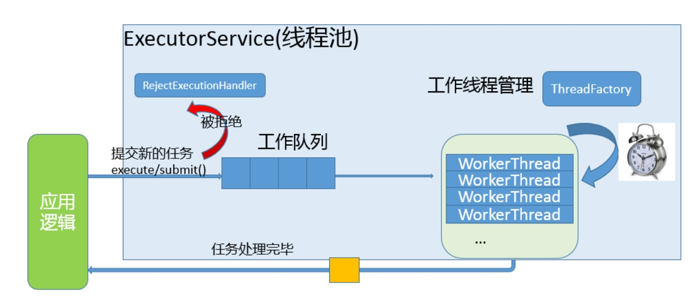
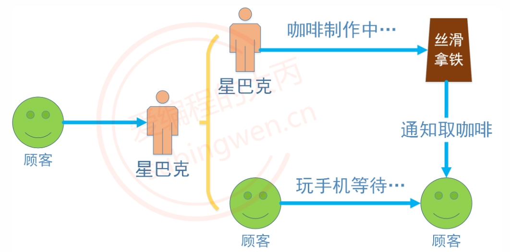

# 线程池的实现,及其相关知识点

> 详细内容可看 [爱编程的大丙](https://subingwen.cn/)

## 线程池的原理

+ 我们使用线程的时候就去创建一个线程，这样实现起来非常简便，但是就会有一个问题：如果并发的线程数量很多，并且每个线程都是执行一个时间很短的任务就结束了，这样频繁创建线程就会大大降低系统的效率，因为频繁创建线程和销毁线程需要时间。

+ 那么有没有一种办法使得线程可以复用，就是执行完一个任务，并不被销毁，而是可以继续执行其他的任务呢？

+ 线程池是一种多线程处理形式，处理过程中将任务添加到队列，然后在创建线程后自动启动这些任务。线程池线程都是后台线程。每个线程都使用默认的堆栈大小，以默认的优先级运行，并处于多线程单元中。如果某个线程在托管代码中空闲（如正在等待某个事件）,则线程池将插入另一个辅助线程来使所有处理器保持繁忙。如果所有线程池线程都始终保持繁忙，但队列中包含挂起的工作，则线程池将在一段时间后创建另一个辅助线程但线程的数目永远不会超过最大值。超过最大值的线程可以排队，但他们要等到其他线程完成后才启动。

+ 在各个编程语言的语种中都有线程池的概念，并且很多语言中直接提供了线程池，作为程序猿直接使用就可以了，下面给大家介绍一下线程池的实现原理：

+ 线程池的组成主要分为3个部分，这三部分配合工作就可以得到一个完整的线程池：

  1. `任务队列，存储需要处理的任务，由工作的线程来处理这些任务`
     + 通过线程池提供的API函数，将一个待处理的任务添加到任务队列，或者从任务队列中删除
     + 已处理的任务会被从任务队列中删除
     + 线程池的使用者，也就是调用线程池函数往任务队列中添加任务的线程就是生产者线程
  2. `工作的线程（任务队列任务的消费者） ，N个`
     + 线程池中维护了一定数量的工作线程, 他们的作用是是不停的读任务队列, 从里边取出任务并处理
     + 工作的线程相当于是任务队列的消费者角色，
     + 如果任务队列为空, 工作的线程将会被阻塞 (使用条件变量/信号量阻塞)
     + 如果阻塞之后有了新的任务, 由生产者将阻塞解除, 工作线程开始工作
  3. `管理者线程（不处理任务队列中的任务），1个`
     + 它的任务是周期性的对任务队列中的任务数量以及处于忙状态的工作线程个数进行检测
     + 当任务过多的时候, 可以适当的创建一些新的工作线程
     + 当任务过少的时候, 可以适当的销毁一些工作的线程

  

## C语言实现——线程池

> threadpool.h

```cpp
#ifndef _THREADPOOL_H
#define _THREADPOOL_H

typedef struct ThreadPool ThreadPool;
// 创建线程池并初始化
ThreadPool *threadPoolCreate(int min, int max, int queueSize);

// 销毁线程池
int threadPoolDestroy(ThreadPool* pool);

// 给线程池添加任务
void threadPoolAdd(ThreadPool* pool, void(*func)(void*), void* arg);

// 获取线程池中工作的线程的个数
int threadPoolBusyNum(ThreadPool* pool);

// 获取线程池中活着的线程的个数
int threadPoolAliveNum(ThreadPool* pool);

//////////////////////
// 工作的线程(消费者线程)任务函数
void* worker(void* arg);
// 管理者线程任务函数
void* manager(void* arg);
// 单个线程退出
void threadExit(ThreadPool* pool);
#endif  // _THREADPOOL_H
```

> threadpool.c

```cpp
#include "threadpool.h"
#include<pthread.h>
#include <stdlib.h>
#include <stdio.h>
#include <unistd.h>
#include <string.h>

const int NUMBER = 2;
// 任务结构体
typedef struct Task {
    void (*function)(void *arg); // 任务函数
    void *arg; // 参数
}Task;


// 线程池结构体
struct ThreadPool {
    // 任务队列
    Task *taskQ;
    int queueCapacity;// 队列容量
    int queueSize; // 队列中实际任务数
    int queueFront; // 队头  取数据
    int queueRear; // 队尾  放数据
    // 管理者线程
    pthread_t managerID; // 管理者线程ID
    // 工作者线程
    pthread_t *threadIDs; // 存放线程ID的数组
    // 线程范围
    int minNum; // 最小线程数
    int maxNum; // 最大线程数
    int busyNum;// 有多少工作的线程
    int liveNum;// 当前存活的线程
    int exitNum; // 要销毁的线程个数
    pthread_mutex_t mutexPool;// 锁整个线程池
    pthread_mutex_t mutexBusy; // 锁busyNum变量
    int shutdown; // 是不是要销毁线程池，销毁为1，不销毁为0
    // 条件变量
    pthread_cond_t notEmpty; // 任务队列是否为空
    pthread_cond_t notFull; // 任务队列是否满了
};

ThreadPool* threadPoolCreate(int min, int max, int queueSize)
{
    ThreadPool* pool = (ThreadPool*)malloc(sizeof(ThreadPool));
    do 
    {
        if (pool == NULL)
        {
            printf("malloc threadpool fail...\n");
            break;
        }

        pool->threadIDs = (pthread_t*)malloc(sizeof(pthread_t) * max);
        if (pool->threadIDs == NULL)
        {
            printf("malloc threadIDs fail...\n");
            break;
        }
        memset(pool->threadIDs, 0, sizeof(pthread_t) * max);
        pool->minNum = min;
        pool->maxNum = max;
        pool->busyNum = 0;
        pool->liveNum = min;    // 和最小个数相等
        pool->exitNum = 0;

        if (pthread_mutex_init(&pool->mutexPool, NULL) != 0 ||
            pthread_mutex_init(&pool->mutexBusy, NULL) != 0 ||
            pthread_cond_init(&pool->notEmpty, NULL) != 0 ||
            pthread_cond_init(&pool->notFull, NULL) != 0)
        {
            printf("mutex or condition init fail...\n");
            break;
        }

        // 任务队列
        pool->taskQ = (Task*)malloc(sizeof(Task) * queueSize);
        pool->queueCapacity = queueSize;
        pool->queueSize = 0;
        pool->queueFront = 0;
        pool->queueRear = 0;

        pool->shutdown = 0;

        // 创建线程
        pthread_create(&pool->managerID, NULL, manager, pool);
        for (int i = 0; i < min; ++i)
        {
            pthread_create(&pool->threadIDs[i], NULL, worker, pool);
        }
        return pool;
    } while (0);

    // 释放资源
    if (pool && pool->threadIDs) free(pool->threadIDs);
    if (pool && pool->taskQ) free(pool->taskQ);
    if (pool) free(pool);

    return NULL;
}

int threadPoolDestroy(ThreadPool* pool)
{
    if (pool == NULL)
    {
        return -1;
    }

    // 关闭线程池
    pool->shutdown = 1;
    // 阻塞回收管理者线程
    pthread_join(pool->managerID, NULL);
    // 唤醒阻塞的消费者线程
    for (int i = 0; i < pool->liveNum; ++i)
    {
        pthread_cond_signal(&pool->notEmpty);
    }
    // 释放堆内存
    if (pool->taskQ)
    {
        free(pool->taskQ);
    }
    if (pool->threadIDs)
    {
        free(pool->threadIDs);
    }

    pthread_mutex_destroy(&pool->mutexPool);
    pthread_mutex_destroy(&pool->mutexBusy);
    pthread_cond_destroy(&pool->notEmpty);
    pthread_cond_destroy(&pool->notFull);

    free(pool);
    pool = NULL;

    return 0;
}


void threadPoolAdd(ThreadPool* pool, void(*func)(void*), void* arg)
{
    pthread_mutex_lock(&pool->mutexPool);
    while (pool->queueSize == pool->queueCapacity && !pool->shutdown)
    {
        // 阻塞生产者线程
        pthread_cond_wait(&pool->notFull, &pool->mutexPool);
    }
    if (pool->shutdown)
    {
        pthread_mutex_unlock(&pool->mutexPool);
        return;
    }
    // 添加任务
    pool->taskQ[pool->queueRear].function = func;
    pool->taskQ[pool->queueRear].arg = arg;
    pool->queueRear = (pool->queueRear + 1) % pool->queueCapacity;
    pool->queueSize++;

    pthread_cond_signal(&pool->notEmpty);
    pthread_mutex_unlock(&pool->mutexPool);
}

int threadPoolBusyNum(ThreadPool* pool)
{
    pthread_mutex_lock(&pool->mutexBusy);
    int busyNum = pool->busyNum;
    pthread_mutex_unlock(&pool->mutexBusy);
    return busyNum;
}

int threadPoolAliveNum(ThreadPool* pool)
{
    pthread_mutex_lock(&pool->mutexPool);
    int aliveNum = pool->liveNum;
    pthread_mutex_unlock(&pool->mutexPool);
    return aliveNum;
}

void* worker(void* arg)
{
    ThreadPool* pool = (ThreadPool*)arg;

    while (1)
    {
        pthread_mutex_lock(&pool->mutexPool);
        // 当前任务队列是否为空
        while (pool->queueSize == 0 && !pool->shutdown)
        {
            // 阻塞工作线程
            pthread_cond_wait(&pool->notEmpty, &pool->mutexPool);

            // 判断是不是要销毁线程
            if (pool->exitNum > 0)
            {
                pool->exitNum--;
                if (pool->liveNum > pool->minNum)
                {
                    pool->liveNum--;
                    pthread_mutex_unlock(&pool->mutexPool);
                    threadExit(pool);
                }
            }
        }

        // 判断线程池是否被关闭了
        if (pool->shutdown)
        {
            pthread_mutex_unlock(&pool->mutexPool);
            threadExit(pool);
        }

        // 从任务队列中取出一个任务
        Task task;
        task.function = pool->taskQ[pool->queueFront].function;
        task.arg = pool->taskQ[pool->queueFront].arg;
        // 移动头结点
        pool->queueFront = (pool->queueFront + 1) % pool->queueCapacity;
        pool->queueSize--;
        // 解锁
        pthread_cond_signal(&pool->notFull);
        pthread_mutex_unlock(&pool->mutexPool);

        printf("thread %ld start working...\n", pthread_self());
        pthread_mutex_lock(&pool->mutexBusy);
        pool->busyNum++;
        pthread_mutex_unlock(&pool->mutexBusy);
        task.function(task.arg);
        free(task.arg);
        task.arg = NULL;

        printf("thread %ld end working...\n", pthread_self());
        pthread_mutex_lock(&pool->mutexBusy);
        pool->busyNum--;
        pthread_mutex_unlock(&pool->mutexBusy);
    }
    return NULL;
}

void* manager(void* arg)
{
    ThreadPool* pool = (ThreadPool*)arg;
    while (!pool->shutdown)
    {
        // 每隔3s检测一次
        sleep(3);

        // 取出线程池中任务的数量和当前线程的数量
        pthread_mutex_lock(&pool->mutexPool);
        int queueSize = pool->queueSize;
        int liveNum = pool->liveNum;
        pthread_mutex_unlock(&pool->mutexPool);

        // 取出忙的线程的数量
        pthread_mutex_lock(&pool->mutexBusy);
        int busyNum = pool->busyNum;
        pthread_mutex_unlock(&pool->mutexBusy);

        // 添加线程
        // 任务的个数>存活的线程个数 && 存活的线程数<最大线程数
        if (queueSize > liveNum && liveNum < pool->maxNum)
        {
            pthread_mutex_lock(&pool->mutexPool);
            int counter = 0;
            for (int i = 0; i < pool->maxNum && counter < NUMBER
                && pool->liveNum < pool->maxNum; ++i)
            {
                if (pool->threadIDs[i] == 0)
                {
                    pthread_create(&pool->threadIDs[i], NULL, worker, pool);
                    counter++;
                    pool->liveNum++;
                }
            }
            pthread_mutex_unlock(&pool->mutexPool);
        }
        // 销毁线程
        // 忙的线程*2 < 存活的线程数 && 存活的线程>最小线程数
        if (busyNum * 2 < liveNum && liveNum > pool->minNum)
        {
            pthread_mutex_lock(&pool->mutexPool);
            pool->exitNum = NUMBER;
            pthread_mutex_unlock(&pool->mutexPool);
            // 让工作的线程自杀
            for (int i = 0; i < NUMBER; ++i)
            {
                pthread_cond_signal(&pool->notEmpty);
            }
        }
    }
    return NULL;
}

void threadExit(ThreadPool* pool)
{
    pthread_t tid = pthread_self();
    for (int i = 0; i < pool->maxNum; ++i)
    {
        if (pool->threadIDs[i] == tid)
        {
            pool->threadIDs[i] = 0;
            printf("threadExit() called, %ld exiting...\n", tid);
            break;
        }
    }
    pthread_exit(NULL);
}
```

> main.c 测试

```cpp
#include "threadpool.h"
#include <stdio.h>
#include <unistd.h>
#include <stdlib.h>
#include <pthread.h>


void taskFunc(void* arg)
{
    int num = *(int*)arg;
    printf("thread %ld is working, number = %d\n",
        pthread_self(), num);
    sleep(1);
}

int main()
{
    // 创建线程池
    ThreadPool* pool = threadPoolCreate(3, 10, 100);
    for (int i = 0; i < 100; ++i)
    {
        int* num = (int*)malloc(sizeof(int));
        *num = i + 100;
        threadPoolAdd(pool, taskFunc, num);
    }

    sleep(30);

    threadPoolDestroy(pool);
    return 0;
}
```

## socket 通信——线程池

> server.c

```c
#include<stdio.h>
#include<stdlib.h>
#include<string.h>
#include<unistd.h>
#include<arpa/inet.h>
// 多线程
#include<pthread.h>
#include "threadpool.h"

// 信息结构体
struct SockInfo
{
    struct sockaddr_in cliaddr;
    int fd;
};

typedef struct PoolInfo
{
    ThreadPool* p;
    int fd;
}PoolInfo;
// struct SockInfo infos[512];

void working(void *arg);
void acceptConn(void* arg);

int main(){
    // 1. 创建监听的套接字
    int fd = socket(AF_INET, SOCK_STREAM, 0);
    if(fd == -1){
        perror("socket");
        return -1;
    }
    // 2. 绑定
    struct sockaddr_in saddr;
    saddr.sin_family = AF_INET;
    saddr.sin_port = htons(9999);
    saddr.sin_addr.s_addr = INADDR_ANY; // 0 = 0.0.0.0
    int ret = bind(fd, (struct sockaddr*)&saddr, sizeof(saddr));
    if( ret == -1){
        perror("bind");
        return -1;
    }
    // 3. 监听
    ret = listen(fd, 128);
    if(ret == -1){
        perror("listen");
        return -1;
    }

    // 初始化结构体数组
    // int max = sizeof(infos)/sizeof(infos[0]);
    // for(int i = 0; i < max; i++){
    //     bzero(&infos[i], sizeof(infos[i]));
    //     infos[i].fd = -1;// 空闲
    // }

    // 创建线程池
    ThreadPool* pool = threadPoolCreate(3, 8, 100);
    PoolInfo* info =  (PoolInfo*)malloc(sizeof(PoolInfo));
    info->fd = fd;
    info->p = pool;
    threadPoolAdd(pool, acceptConn, info);

    pthread_exit(NULL);
    return 0;
}
void acceptConn(void* arg){
    PoolInfo* poolInfo = (PoolInfo*)arg;
    // 4. 阻塞等待客户端的连接（主线程）
    // struct sockaddr_in cliaddr;
    int addelen = sizeof(struct sockaddr_in);
    while(1){
        struct SockInfo* pinfo;
        // for(int i = 0; i < max; i++){
        //     if(infos[i].fd == -1){
        //         pinfo = &infos[i];
        //         break;
        //     }
        // }
        pinfo = (struct SockInfo*)malloc(sizeof(struct SockInfo));
        // int cfd = accept(fd, (struct sockaddr*)&pinfo->cliaddr, &addelen);
        pinfo->fd = accept(poolInfo->fd, (struct sockaddr*)&pinfo->cliaddr, &addelen);
        // pinfo->fd = cfd;

        if(pinfo->fd == -1){
            perror("accept");
            break;
        }
        // 创建子线程
        // pthread_t tid;
        // pthread_create(&tid, NULL, working, pinfo);
        // pthread_detach(tid);//join是阻塞函数，主线程回收资源

        // 添加通信任务
        threadPoolAdd(poolInfo->p, working, pinfo);
    }
    close(poolInfo->fd);
}
void working(void* arg)
{
    struct SockInfo* pinfo = (struct SockInfo*)arg;
    // 连接成功，打印客户端的IP和端口信息
    char ip[32];
    printf("客户端的IP地址是：%s, 端口是：%d\n", inet_ntop(AF_INET, &pinfo->cliaddr.sin_addr.s_addr, ip, sizeof(ip)), ntohs(pinfo->cliaddr.sin_port));
    // 5. 通信（子线程）
    while(1){
        char recvbuf[1024];
        int len = recv(pinfo->fd, recvbuf, sizeof(recvbuf), 0);
        if(len > 0 ){
            printf("客户端说：%s\n", recvbuf);
            send(pinfo->fd, recvbuf, len, 0);
        }
        else if(len == 0){
            printf("客户端断开连接\n");
            break;
        }
        else{
            perror("recv");
            break;
        }
    }

    // 关闭文件描述符
    close(pinfo->fd);
    // pinfo->fd = -1;

    // return NULL;
}
```

> client.c

```c
#include<stdio.h>
#include<stdlib.h>
#include<string.h>
#include<unistd.h>
#include<arpa/inet.h>

int main(){
    // 1. 创建通信的套接字
    int fd = socket(AF_INET, SOCK_STREAM, 0);
    if(fd == -1){
        perror("socket");
        return -1;
    }
    // 2. 绑定
    struct sockaddr_in saddr;
    saddr.sin_family = AF_INET;
    saddr.sin_port = htons(9999);
    //saddr.sin_addr.s_addr = INADDR_ANY; // 0 = 0.0.0.0
    // 转大端
    inet_pton(AF_INET,"127.0.0.1",&saddr.sin_addr.s_addr);
    int ret = connect(fd, (struct sockaddr*)&saddr, sizeof(saddr));
    if( ret == -1){
        perror("connect");
        return -1;
    }

    int number = 0;
    // 3. 通信
    while(1){
        char recvbuf[1024];
        sprintf(recvbuf, "hello, I am client %d", number++);
        send(fd,recvbuf, strlen(recvbuf)+1, 0);

         // 清空缓存区，将接收到的数据存到buff
        memset(recvbuf, 0, sizeof(recvbuf));
        
        // 接收
        int len = recv(fd, recvbuf, sizeof(recvbuf), 0);
       
        if(len > 0 ){
            printf("server say%s\n", recvbuf);
        }
        else if(len == 0){ // 服务端断开连接
            printf("服务器断开连接\n");
            break;
        }
        else{
            perror("recv");
            break;
        }
        sleep(1);
    }

    // g关闭
    close(fd);
    return 0;
}
```

> threadpool.c 和 threadpool.h 参考上述线城市c语言实现版本

## C++ 实现线程池

> TaskQueue.h

```cpp
#pragma once
#include <queue>
#include <pthread.h>

// 定义任务结构体
using callback = void(*)(void*);

template <typename T>
struct Task
{
    Task()
    {
        function = nullptr;
        arg = nullptr;
    }
    Task(callback f, void* arg)
    {
        function = f;
        this->arg = (T*)arg;
    }
    callback function;
    T* arg;
};

template <typename T>
// 任务队列
class TaskQueue
{
public:
    TaskQueue();
    ~TaskQueue();

    // 添加任务
    void addTask(Task<T>& task);
    void addTask(callback func, void* arg);

    // 取出一个任务
    Task<T> takeTask();

    // 获取当前队列中任务个数
    inline int taskNumber()
    {
        return m_queue.size();
    }

private:
    pthread_mutex_t m_mutex;    // 互斥锁
    std::queue<Task<T>> m_queue;   // 任务队列
};
```

> TaskQueue.cpp

```cpp
#include "TaskQueue.h"

template <typename T>
TaskQueue<T>::TaskQueue()
{
    pthread_mutex_init(&m_mutex, NULL);
}
template <typename T>
TaskQueue<T>::~TaskQueue()
{
    pthread_mutex_destroy(&m_mutex);
}
template <typename T>
void TaskQueue<T>::addTask(Task<T>& task)
{
    pthread_mutex_lock(&m_mutex);
    m_queue.push(task);
    pthread_mutex_unlock(&m_mutex);
}
template <typename T>
void TaskQueue<T>::addTask(callback func, void* arg)
{
    pthread_mutex_lock(&m_mutex);
    // Task task;
    // task.function = func;
    // task.arg = arg;
    // m_queue.push(task);
    m_queue.push(Task<T>(func, arg));
    pthread_mutex_unlock(&m_mutex);
}
template <typename T>
Task<T> TaskQueue<T>::takeTask()
{
    Task<T> t;
    pthread_mutex_lock(&m_mutex);
    if (m_queue.size() > 0)
    {
        t = m_queue.front();
        m_queue.pop();
    }
    pthread_mutex_unlock(&m_mutex);
    return t;
}
```

> `ThreadPool.h`

```cpp
#pragma once
#include <pthread.h>
#include "TaskQueue.h"
#include "TaskQueue.cpp"

template <typename T>
class ThreadPool
{
public:
    ThreadPool(int min, int max);
    ~ThreadPool();

    // 添加任务
    void addTask(Task<T> task);
    // 获取忙线程的个数
    int getBusyNumber();
    // 获取活着的线程个数
    int getAliveNumber();

private:
    // 工作的线程的任务函数
    static void* worker(void* arg);
    // 管理者线程的任务函数
    static void* manager(void* arg);
    void threadExit();

private:
    pthread_mutex_t m_lock;
    pthread_cond_t m_notEmpty;
    pthread_t* m_threadIDs;
    pthread_t m_managerID;
    TaskQueue<T>* m_taskQ;
    int m_minNum;
    int m_maxNum;
    int m_busyNum;
    int m_aliveNum;
    int m_exitNum;
    bool m_shutdown = false;
};
```

> `ThreadPool.cpp`

```cpp
#include "ThreadPool.h"
#include <iostream>
#include <unistd.h>
#include <string.h>
using namespace std;

template <typename T>
ThreadPool<T>::ThreadPool(int minNum, int maxNum)
{
    // 实例化任务队列
    m_taskQ = new TaskQueue<T>;
    do {
        // 初始化线程池
        m_minNum = minNum;
        m_maxNum = maxNum;
        m_busyNum = 0;
        m_aliveNum = minNum;

        // 根据线程的最大上限给线程数组分配内存
        m_threadIDs = new pthread_t[maxNum];
        if (m_threadIDs == nullptr)
        {
            cout << "malloc thread_t[] 失败...." << endl;;
            break;
        }
        // 初始化
        memset(m_threadIDs, 0, sizeof(pthread_t) * maxNum);
        // 初始化互斥锁,条件变量
        if (pthread_mutex_init(&m_lock, NULL) != 0 ||
            pthread_cond_init(&m_notEmpty, NULL) != 0)
        {
            cout << "init mutex or condition fail..." << endl;
            break;
        }

        /////////////////// 创建线程 //////////////////
        // 根据最小线程个数, 创建线程
        for (int i = 0; i < minNum; ++i)
        {
            pthread_create(&m_threadIDs[i], NULL, worker, this);
            cout << "创建子线程, ID: " << to_string(m_threadIDs[i]) << endl;
        }
        // 创建管理者线程, 1个
        pthread_create(&m_managerID, NULL, manager, this);
    } while (0);
}

template <typename T>
ThreadPool<T>::~ThreadPool()
{
    m_shutdown = 1;
    // 销毁管理者线程
    pthread_join(m_managerID, NULL);
    // 唤醒所有消费者线程
    for (int i = 0; i < m_aliveNum; ++i)
    {
        pthread_cond_signal(&m_notEmpty);
    }

    if (m_taskQ) delete m_taskQ;
    if (m_threadIDs) delete[]m_threadIDs;
    pthread_mutex_destroy(&m_lock);
    pthread_cond_destroy(&m_notEmpty);
}

template <typename T>
void ThreadPool<T>::addTask(Task<T> task)
{
    if (m_shutdown)
    {
        return;
    }
    // 添加任务，不需要加锁，任务队列中有锁
    m_taskQ->addTask(task);
    // 唤醒工作的线程
    pthread_cond_signal(&m_notEmpty);
}

template <typename T>
int ThreadPool<T>::getAliveNumber()
{
    int threadNum = 0;
    pthread_mutex_lock(&m_lock);
    threadNum = m_aliveNum;
    pthread_mutex_unlock(&m_lock);
    return threadNum;
}

template <typename T>
int ThreadPool<T>::getBusyNumber()
{
    int busyNum = 0;
    pthread_mutex_lock(&m_lock);
    busyNum = m_busyNum;
    pthread_mutex_unlock(&m_lock);
    return busyNum;
}


// 工作线程任务函数
template <typename T>
void* ThreadPool<T>::worker(void* arg)
{
    ThreadPool* pool = static_cast<ThreadPool*>(arg);
    // 一直不停的工作
    while (true)
    {
        // 访问任务队列(共享资源)加锁
        pthread_mutex_lock(&pool->m_lock);
        // 判断任务队列是否为空, 如果为空工作线程阻塞
        while (pool->m_taskQ->taskNumber() == 0 && !pool->m_shutdown)
        {
            cout << "thread " << to_string(pthread_self()) << " waiting..." << endl;
            // 阻塞线程
            pthread_cond_wait(&pool->m_notEmpty, &pool->m_lock);

            // 解除阻塞之后, 判断是否要销毁线程
            if (pool->m_exitNum > 0)
            {
                pool->m_exitNum--;
                if (pool->m_aliveNum > pool->m_minNum)
                {
                    pool->m_aliveNum--;
                    pthread_mutex_unlock(&pool->m_lock);
                    pool->threadExit();
                }
            }
        }
        // 判断线程池是否被关闭了
        if (pool->m_shutdown)
        {
            pthread_mutex_unlock(&pool->m_lock);
            pool->threadExit();
        }

        // 从任务队列中取出一个任务
        Task<T> task = pool->m_taskQ->takeTask();
        // 工作的线程+1
        pool->m_busyNum++;
        // 线程池解锁
        pthread_mutex_unlock(&pool->m_lock);
        // 执行任务
        cout << "thread " << to_string(pthread_self()) << " start working..." << endl;
        task.function(task.arg);
        delete task.arg;
        task.arg = nullptr;

        // 任务处理结束
        cout << "thread " << to_string(pthread_self()) << " end working...";
        pthread_mutex_lock(&pool->m_lock);
        pool->m_busyNum--;
        pthread_mutex_unlock(&pool->m_lock);
    }

    return nullptr;
}


// 管理者线程任务函数
template <typename T>
void* ThreadPool<T>::manager(void* arg)
{
    ThreadPool* pool = static_cast<ThreadPool*>(arg);
    // 如果线程池没有关闭, 就一直检测
    while (!pool->m_shutdown)
    {
        // 每隔5s检测一次
        sleep(5);
        // 取出线程池中的任务数和线程数量
        //  取出工作的线程池数量
        pthread_mutex_lock(&pool->m_lock);
        int queueSize = pool->m_taskQ->taskNumber();
        int liveNum = pool->m_aliveNum;
        int busyNum = pool->m_busyNum;
        pthread_mutex_unlock(&pool->m_lock);

        // 创建线程
        const int NUMBER = 2;
        // 当前任务个数>存活的线程数 && 存活的线程数<最大线程个数
        if (queueSize > liveNum && liveNum < pool->m_maxNum)
        {
            // 线程池加锁
            pthread_mutex_lock(&pool->m_lock);
            int num = 0;
            for (int i = 0; i < pool->m_maxNum && num < NUMBER
                && pool->m_aliveNum < pool->m_maxNum; ++i)
            {
                if (pool->m_threadIDs[i] == 0)
                {
                    pthread_create(&pool->m_threadIDs[i], NULL, worker, pool);
                    num++;
                    pool->m_aliveNum++;
                }
            }
            pthread_mutex_unlock(&pool->m_lock);
        }

        // 销毁多余的线程
        // 忙线程*2 < 存活的线程数目 && 存活的线程数 > 最小线程数量
        if (busyNum * 2 < liveNum && liveNum > pool->m_minNum)
        {
            pthread_mutex_lock(&pool->m_lock);
            pool->m_exitNum = NUMBER;
            pthread_mutex_unlock(&pool->m_lock);
            for (int i = 0; i < NUMBER; ++i)
            {
                pthread_cond_signal(&pool->m_notEmpty);
            }
        }
    }
    return nullptr;
}

// 线程退出
template <typename T>
void ThreadPool<T>::threadExit()
{
    pthread_t tid = pthread_self();
    for (int i = 0; i < m_maxNum; ++i)
    {
        if (m_threadIDs[i] == tid)
        {
            cout << "threadExit() function: thread " 
                << to_string(pthread_self()) << " exiting..." << endl;
            m_threadIDs[i] = 0;
            break;
        }
    }
    pthread_exit(NULL);
}
```

> main.cpp

```cpp
#include "ThreadPool.h"
#include "ThreadPool.cpp"
#include <unistd.h>
#include <stdio.h>
void taskFunc(void* arg)
{
    int num = *(int*)arg;
    printf("thread %ld is working, number = %d\n",
        pthread_self(), num);
    sleep(1);
}

int main()
{
    // 创建线程池
    ThreadPool<int> pool(3,10);
    for (int i = 0; i < 100; ++i)
    {
        int* num = new int(i+100);
        pool.addTask(Task<int>(taskFunc, num));
    }

    sleep(20);
    return 0;
}
```

```shell
 g++ main.cpp ThreadPool.cpp TaskQueue.cpp -o app
```

## `C++11实现线程池`

>  `ThreadPool.h`

```cpp
#pragma once
#include <thread>
#include <mutex>
#include <vector>
#include <queue>
#include <atomic>
#include <functional>
#include <condition_variable>
#include <map>
#include <future>
using namespace std;

// 线程池类
class ThreadPool
{
public:
    ThreadPool(int min = 4, int max = thread::hardware_concurrency());
    ~ThreadPool();
    void addTask(function<void()> f);

private:
    void manager();
    void worker();
private:
    thread* m_manager;
    map<thread::id, thread> m_workers; 
    vector<thread::id> m_ids; 
    int m_minThreads;
    int m_maxThreads; 
    atomic<bool> m_stop; 
    atomic<int> m_curThreads;
    atomic<int> m_idleThreads;
    atomic<int> m_exitNumber; 
    queue<function<void()>> m_tasks;
    mutex m_idsMutex; 
    mutex m_queueMutex;
    condition_variable m_condition;
};
```

> `ThreadPool.cpp`

```cpp
#include "threadpool.h"
#include <iostream>

ThreadPool::ThreadPool(int min, int max) : m_maxThreads(max),
m_minThreads(min), m_stop(false), m_exitNumber(0)
{
    //m_idleThreads = m_curThreads = max / 2;
    m_idleThreads = m_curThreads = min;
    cout << "线程数量: " << m_curThreads << endl;
    m_manager = new thread(&ThreadPool::manager, this);
    for (int i = 0; i < m_curThreads; ++i)
    {
        thread t(&ThreadPool::worker, this);
        m_workers.insert(make_pair(t.get_id(), move(t)));
    }
}

ThreadPool::~ThreadPool()
{
    m_stop = true;
    m_condition.notify_all();
    for (auto& it : m_workers)
    {
        thread& t = it.second;
        if (t.joinable())
        {
            cout << "******** 线程 " << t.get_id() << " 将要退出了..." << endl;
            t.join();
        }
    }
    if (m_manager->joinable())
    {
        m_manager->join();
    }
    delete m_manager;
}

void ThreadPool::addTask(function<void()> f)
{
    {
        lock_guard<mutex> locker(m_queueMutex);
        m_tasks.emplace(f);
    }
    m_condition.notify_one();
}

void ThreadPool::manager()
{
    while (!m_stop.load())
    {
        this_thread::sleep_for(chrono::seconds(2));
        int idle = m_idleThreads.load();
        int current = m_curThreads.load();
        if (idle > current / 2 && current > m_minThreads)
        {
            m_exitNumber.store(2);
            m_condition.notify_all();
            unique_lock<mutex> lck(m_idsMutex);
            for (const auto& id : m_ids)
            {
                auto it = m_workers.find(id);
                if (it != m_workers.end())
                {
                    cout << "############## 线程 " << (*it).first << "被销毁了...." << endl;
                    (*it).second.join();
                    m_workers.erase(it);
                }
            }
            m_ids.clear();
        }
        else if (idle == 0 && current < m_maxThreads)
        {
            thread t(&ThreadPool::worker, this);
            cout << "+++++++++++++++ 添加了一个线程, id: " << t.get_id() << endl;
            m_workers.insert(make_pair(t.get_id(), move(t)));
            m_curThreads++;
            m_idleThreads++;
        }
    }
}

void ThreadPool::worker()
{
    while (!m_stop.load())
    {
        function<void()> task = nullptr;
        {
            unique_lock<mutex> locker(m_queueMutex);
            while (!m_stop && m_tasks.empty())
            {
                m_condition.wait(locker);
                if (m_exitNumber.load() > 0)
                {
                    cout << "----------------- 线程任务结束, ID: " << this_thread::get_id() << endl;
                    m_exitNumber--;
                    m_curThreads--;
                    unique_lock<mutex> lck(m_idsMutex);
                    m_ids.emplace_back(this_thread::get_id());
                    return;
                }
            }

            if (!m_tasks.empty())
            {
                cout << "取出一个任务..." << endl;
                task = move(m_tasks.front());
                m_tasks.pop();
            }
        }

        if (task)
        {
            m_idleThreads--;
            task();
            m_idleThreads++;
        }
    }
}

void calc(int x, int y)
{
    int res = x + y;
    cout << "res = " << res << endl;
    this_thread::sleep_for(chrono::seconds(2));
}

int main()
{
    ThreadPool pool(4);
    for (int i = 0; i < 10; ++i)
    {
        auto func = bind(calc, i, i * 2);
        pool.addTask(func);
    }
    getchar();
    return 0;
}
```

+ 通过添加任务的函数`addTask`可以得知任务函数返回值类型是void并且无参，但是测试程序中添加的任务函数是`void calc(int x, int y)`携带了两个参数，很显然和任务函数的参数是类型是不匹配的，程序中的解决方案是对函数和参数进行绑定：
  ```cpp
  auto func = bind(calc, i, i * 2);
  ```

  + 这样得到的可调用对象就是无参的。通过这种方式表面看起来只能存储无参函数的任务队列就可以存储带任意参数的有参函数了。

+ `getchar();`通过该函数阻塞主线程，程序运行完毕之后，按任意键解除阻塞，主线程执行完毕，程序（进程）也就退出了。

## 线程异步

[多线程异步操作](https://subingwen.cn/cpp/async/)

### 1. `std::future`

+ `C++11`中增加的线程类，使得我们能够非常方便的创建和使用线程，但有时会有些不方便，比如需要获取线程返回的结果，就不能通过`join()`得到结果，只能通过一些额外手段获得，比如：定义一个全局变量，在子线程中赋值，在主线程中读这个变量的值，整个过程比较繁琐。`C++`提供的线程库中提供了一些类用于访问异步操作的结果。
+ 那么，什么叫做异步呢？



+ 我们去星巴克买咖啡，因为都是现磨的，所以需要等待，但是我们付完账后不会站在柜台前死等，而是去找个座位坐下来玩玩手机打发一下时间，当店员把咖啡磨好之后，就会通知我们过去取，这就叫做异步。

  + 顾客（主线程）发起一个任务（子线程磨咖啡），磨咖啡的过程中顾客去做别的事情了，有两条时间线（异步）
  + 顾客（主线程）发起一个任务（子线程磨咖啡），磨咖啡的过程中顾客没去做别的事情而是死等，这时就只有一条时间线（同步），此时效率相对较低。

+ 因此多线程程序中的任务大都是异步的，主线程和子线程分别执行不同的任务，如果想要在主线中得到某个子线程任务函数返回的结果可以使用C++11提供的`std:future`类，这个类需要和其他类或函数搭配使用，先来介绍一下这个类的`API`函数：

<!-- tabs:start -->

#### **类的定义**

> 通过类的定义可以得知，future是一个模板类，也就是这个类可以存储任意指定类型的数据。

```cpp
// 定义于头文件 <future>
template< class T > class future;
template< class T > class future<T&>;
template<>          class future<void>;
```

#### **构造函数**

```cpp
// ①
future() noexcept;
// ②
future( future&& other ) noexcept;
// ③
future( const future& other ) = delete;
```

> + 构造函数①：默认无参构造函数
> + 构造函数②：移动构造函数，转移资源的所有权
> + 构造函数③：使用=delete显示删除拷贝构造函数, 不允许进行对象之间的拷贝

#### **常用成员函数（`public`)**

+ 一般情况下使用=进行赋值操作就进行对象的拷贝，但是`future`对象不可用复制，因此会根据实际情况进行处理：
  + 如果`other`是右值，那么转移资源的所有权
  + 如果`other`是非右值，不允许进行对象之间的拷贝（`该函数被显示删除禁止使用`）

```cpp
future& operator=( future&& other ) noexcept; //noexcept于指示一个函数是否可能抛出异常。在函数声明或定义时使用 noexcept 关键字，可以告诉编译器该函数不会抛出异常，或者该函数可能会抛出异常。
future& operator=( const future& other ) = delete;
```

+ 取出`future`对象内部保存的数据，其中`void get()`是为`future<void>`准备的，此时对象内部类型就是`void`，该函数是一个阻塞函数，当子线程的数据就绪后解除阻塞就能得到传出的数值了。

```cpp
T get();
T& get();
void get();
```

+ 因为`future`对象内部存储的是异步线程任务执行完毕后的结果，是在调用之后的将来得到的，因此可以通过调用`wait()`方法，阻塞当前线程，等待这个子线程的任务执行完毕，任务执行完毕当前线程的阻塞也就解除了

```cpp
void wait() const;
```

+ 如果当前线程`wait()`方法就会死等，直到子线程任务执行完毕将返回值写入到`future`对象中，调用`wait_for()`只会让线程阻塞一定的时长，但是这样并不能保证对应的那个子线程中的任务已经执行完毕了。

  + `wait_until()`和`wait_for()`函数功能是差不多，前者是`阻塞到某一指定的时间点`，后者是`阻塞一定的时长`。

```cpp
template< class Rep, class Period >
std::future_status wait_for( const std::chrono::duration<Rep,Period>& timeout_duration ) const;

template< class Clock, class Duration >
std::future_status wait_until( const std::chrono::time_point<Clock,Duration>& timeout_time ) const;
```

> `当wait_until()`和`wait_for()`函数返回之后，并不能确定子线程当前的状态，因此我们需要判断函数的返回值，这样就能知道子线程当前的状态了：

|           常量            |                     解释                     |
| :-----------------------: | :------------------------------------------: |
| `future_status::deferred` |           子线程中的任务函仍未启动           |
|  `future_status::ready`   |    子线程中的任务已经执行完毕，结果已就绪    |
| `future_status::timeout`  | 子线程中的任务正在执行中，指定等待时长已用完 |

<!-- tabs:end -->

### 2. `std::promise`

>  `std::promise`是一个协助线程赋值的类，它能够将数据和future对象绑定起来，为获取线程函数中的某个值提供便利。

#### 2.1 类成员函数

<!-- tabs:start -->

#### **类定义**

> 通过`std::promise`类的定义可以得知，这也是一个模板类，我们要在线程中传递什么类型的数据，模板参数就指定为什么类型。

```cpp
// 定义于头文件 <future>
template< class R > class promise;
template< class R > class promise<R&>;
template<>          class promise<void>;
```

#### **构造函数**

```cpp
// ①
promise();
// ②
promise( promise&& other ) noexcept;
// ③
promise( const promise& other ) = delete;
```

1. 构造函数①：默认构造函数，得到一个空对象
2. 构造函数②：移动构造函数
3. 构造函数③：使用`=delete`显示删除拷贝构造函数, 不允许进行对象之间的拷贝

#### **公共成员函数**

> 在`std::promise`类内部管理着一个`future`类对象，调用`get_future()`就可以得到这个`future`对象了

```cpp
std::future<T> get_future();
```

+ 存储要传出的 `value` 值，并立即让状态就绪，这样数据被传出其它线程就可以得到这个数据了。重载的第四个函数是
+ `promise<void>`类型的对象准备的。

```cpp
void set_value( const R& value );
void set_value( R&& value );
void set_value( R& value );
void set_value();
```

+ 存储要传出的 `value` 值，但是不立即令状态就绪。在当前线程退出时，子线程资源被销毁，再令状态就绪。

```cpp
void set_value_at_thread_exit( const R& value );
void set_value_at_thread_exit( R&& value );
void set_value_at_thread_exit( R& value );
void set_value_at_thread_exit();
```

<!-- tabs:end -->

#### 2.2 promise的使用

> 通过promise传递数据的过程一共分为5步：

1. 在主线程中创建`std::promise`对象
2. 将这个`std::promise`对象通过引用的方式传递给子线程的任务函数
3. 在子线程任务函数中给`std::promise`对象赋值
4. 在主线程中通过`std::promise`对象取出绑定的`future`实例对象
5. 通过得到的`future`对象取出子线程任务函数中返回的值。

<!-- tabs:start -->

#### **子线程任务函数执行期间，让状态就绪**

```cpp
#include <iostream>
#include <thread>
#include <future>
using namespace std;

int main()
{
    promise<int> pr;
    thread t1([](promise<int> &p) {
        p.set_value(100);
        this_thread::sleep_for(chrono::seconds(3));
        cout << "睡醒了...." << endl;
    }, ref(pr));

    future<int> f = pr.get_future();
    int value = f.get();
    cout << "value: " << value << endl;

    t1.join();
    return 0;
}
```

> 输出

```tex
value: 100
睡醒了....
```

+ 示例程序的中子线程的任务函数指定的是一个匿名函数，在这个匿名的任务函数执行期间通过`p.set_value(100);`传出了数据并且激活了状态，数据就绪后，外部主线程中的`int value = f.get();`解除阻塞，并将得到的数据打印出来，5秒钟之后子线程休眠结束，匿名的任务函数执行完毕。

#### **子线程任务函数执行结束，让状态就绪**

```cpp
#include <iostream>
#include <thread>
#include <future>
using namespace std;

int main()
{
    promise<int> pr;
    thread t1([](promise<int> &p) {
        p.set_value_at_thread_exit(100);
        this_thread::sleep_for(chrono::seconds(3));
        cout << "睡醒了...." << endl;
    }, ref(pr));

    future<int> f = pr.get_future();
    int value = f.get();
    cout << "value: " << value << endl;

    t1.join();
    return 0;
}
```

> 示例程序输出的结果：

```tex
睡醒了....
value: 100
```

+ 在示例程序中，子线程的这个匿名的任务函数中通过`p.set_value_at_thread_exit(100);`在执行完毕并退出之后才会传出数据并激活状态，数据就绪后，外部主线程中的`int value = f.get();`解除阻塞，并将得到的数据打印出来，因此子线程在休眠5秒钟之后主线程中才能得到传出的数据。

+ 另外，在这两个实例程序中有一个知识点需要强调，在外部主线程中创建的`promise`对象必须要通过引用的方式传递到子线程的任务函数中，在实例化子线程对象的时候，如果任务函数的参数是引用类型，那么实参一定要放到`std::ref()`函数中，表示要传递这个实参的引用到任务函数中。

<!-- tabs:end -->

### 3. std::packaged_task

+ `std::packaged_task`类包装了一个可调用对象包装器类对象（可调用对象包装器包装的是可调用对象，可调用对象都可以作为函数来使用），这个类可以将内部包装的函数和`future`类绑定到一起，以便进行后续的异步调用，它和std::promise有点类似，`std::promise`内部保存一个共享状态的值，而`std::packaged_task`保存的是一个函数

#### 3.1 类成员函数

<!-- tabs:start -->

> 通过类的定义可以看到这也是一个模板类，模板类型和要在线程中传出的数据类型是一致的。

```cpp
// 定义于头文件 <future>
template< class > class packaged_task;
template< class R, class ...Args >
class packaged_task<R(Args...)>;
```

#### **构造函数**

```cpp
// ①
packaged_task() noexcept;
// ②
template <class F>
explicit packaged_task( F&& f );
// ③
packaged_task( const packaged_task& ) = delete;
// ④
packaged_task( packaged_task&& rhs ) noexcept;
```

1. 构造函数①：无参构造，构造一个无任务的空对象
2. 构造函数②：通过一个可调用对象，构造一个任务对象
3. 构造函数③：显示删除，不允许通过拷贝构造函数进行对象的拷贝
4. 构造函数④：移动构造函数

#### **常用公共成员函数**

> 通过调用任务对象内部的`get_future()`方法就可以得到一个`future`对象，基于这个对象就可以得到传出的数据了。
>

```cpp
std::future<R> get_future();
```

<!-- tabs:end -->

#### 3.2 packaged_task的使用

> `packaged_task`其实就是对子线程要执行的任务函数进行了包装，和可调用对象包装器的使用方法相同，包装完毕之后直接将包装得到的任务对象传递给线程对象就可以了。

```cpp
#include <iostream>
#include <thread>
#include <future>
using namespace std;

int main()
{
    packaged_task<int(int)> task([](int x) {
        return x += 100;
    });

    thread t1(ref(task), 100);

    future<int> f = task.get_future();
    int value = f.get();
    cout << "value: " << value << endl;

    t1.join();
    return 0;
}
```

> 在上面的示例代码中，通过`packaged_task`类包装了一个匿名函数作为子线程的任务函数，最终的得到的这个任务对象需要通过引用的方式传递到子线程内部，这样才能在主线程的最后通过任务对象得到`future`对象，再通过这个`future`对象取出子线程通过返回值传递出的数据。

### 4. `std::async`

> `std::async`函数比前面提到的std::promise和`packaged_task更`高级一些，因为通过这函数可以直接启动一个子线程并在这个子线程中执行对应的任务函数，异步任务执行完成返回的结果也是存储到一个`future`对象中，当需要获取异步任务的结果时，只需要调用`future` 类的`get()`方法即可，如果不关注异步任务的结果，只是简单地等待任务完成的话，可以调用`future` 类的`wait()`或者`wait_for()`方法。该函数的函数原型如下：

```cpp
// 定义于头文件 <future>
// ①
template< class Function, class... Args>
std::future<std::result_of_t<std::decay_t<Function>(std::decay_t<Args>...)>>
    async( Function&& f, Args&&... args );

// ②
template< class Function, class... Args >
std::future<std::result_of_t<std::decay_t<Function>(std::decay_t<Args>...)>>
    async( std::launch policy, Function&& f, Args&&... args );
```

+ 可以看到这是一个模板函数，在C++11中这个函数有两种调用方式：
  + 函数①：直接调用传递到函数体内部的可调用对象，返回一个`future`对象
  + 函数②：通过指定的策略调用传递到函数内部的可调用对象，返回一个`future`对象

+ 函数参数:
  + `f`：可调用对象，这个对象在子线程中被作为任务函数使用
  + `Args`：传递给 `f` 的参数（实参）
  + `policy`：可调用对象·`f`的执行策略

|          策略           |                             说明                             |
| :---------------------: | :----------------------------------------------------------: |
|  `std::launch::async`   |          调用`async`函数时创建新的线程执行任务函数           |
| `std::launch::deferred` | 调用`async`函数时不执行任务函数，直到调用了`future`的`get()`或者`wait()`时才执行任务（这种方式不会创建新的线程） |

> 关于`std::async`()函数的使用，对应的示例代码如下：

#### 4.1 方式1

> 调用`async()`函数直接创建线程执行任务

```cpp
#include <iostream>
#include <thread>
#include <future>
using namespace std;

int main()
{
    cout << "主线程ID: " << this_thread::get_id() << endl;
    // 调用函数直接创建线程执行任务
    future<int> f = async([](int x) {
        cout << "子线程ID: " << this_thread::get_id() << endl;
        this_thread::sleep_for(chrono::seconds(5));
        return x += 100;
    }, 100);

    future_status status;
    do {
        status = f.wait_for(chrono::seconds(1));
        if (status == future_status::deferred)
        {
            cout << "线程还没有执行..." << endl;
            f.wait();
        }
        else if (status == future_status::ready)
        {
            cout << "子线程返回值: " << f.get() << endl;
        }
        else if (status == future_status::timeout)
        {
            cout << "任务还未执行完毕, 继续等待..." << endl;
        }
    } while (status != future_status::ready);

    return 0;
}
```

> 示例程序输出的结果为：

```tex
主线程ID: 8904
子线程ID: 25036
任务还未执行完毕, 继续等待...
任务还未执行完毕, 继续等待...
任务还未执行完毕, 继续等待...
任务还未执行完毕, 继续等待...
任务还未执行完毕, 继续等待...
子线程返回值: 200
```

> 调用`async()`函数时不指定策略就是直接创建线程并执行任务，示例代码的主线程中做了如下操作`status = f.wait_for(chrono::seconds(1));`其实直接调用`f.get()`就能得到子线程的返回值。这里为了给大家演示`wait_for()`的使用，所以写的复杂了些。

#### 4.2 方式2

> 调用`async()`函数不创建线程执行任务

```cpp
#include <iostream>
#include <thread>
#include <future>
using namespace std;

int main()
{
    cout << "主线程ID: " << this_thread::get_id() << endl;
    // 调用函数直接创建线程执行任务
    future<int> f = async(launch::deferred, [](int x) {
        cout << "子线程ID: " << this_thread::get_id() << endl;
        return x += 100;
    }, 100);

    this_thread::sleep_for(chrono::seconds(5));
    cout << f.get();

    return 0;
}
```

> 示例程序输出的结果：

```tex
主线程ID: 24760
主线程开始休眠5秒...
子线程ID: 24760
200
```

+ 由于指定了`launch::deferred` 策略，因此调用`async()`函数并不会创建新的线程执行任务，当使用`future`类对象调用了`get()`或者`wait()`方法后才开始执行任务（`此处一定要注意调用wait_for()函数是不行的`）。

+ 通过测试程序输出的结果可以看到，两次输出的线程ID是相同的，任务函数是在主线程中被延迟（主线程休眠了5秒）调用了。

> 最终总结：

1. `使用async()函数，是多线程操作中最简单的一种方式，不需要自己创建线程对象，并且可以得到子线程函数的返回值。`
2. `使用std::promise类，在子线程中可以传出返回值也可以传出其他数据，并且可选择在什么时机将数据从子线程中传递出来，使用起来更灵活。`
3. `使用std::packaged_task类，可以将子线程的任务函数进行包装，并且可以得到子线程的返回值。`

### 异步线程池实现

> 线程异步（Asynchronous Threading）是一种编程范式，用于执行任务或操作而不阻塞主线程或其他线程的执行。这种方法特别适用于需要同时处理多个操作或在后台执行长时间运行的任务的场景。线程异步的核心思想是将耗时的操作与主执行流程分离，使得系统能够继续处理其他任务，而无需等待耗时操作完成。

+ 异步执行：与同步操作不同，异步操作不要求调用者在任务完成之前等待结果。异步操作通常会在后台线程中执行，主线程或其他线程可以继续执行其他任务。
+ 线程：在多线程编程中，异步操作通常通过创建新的线程来实现。新线程会执行异步任务，而主线程则继续进行其他操作。
  在上面的线程池代码中，如果任务函数有返回值，我们就可以通过线程异步的方式，将子线程也就是工作的线程的返回值传递给主线程，核心操作就是修改添加任务的函数`addTask`。

> 为了让线程池添加任务的函数更加灵活和通过以及实现线程异步，我们需要将其修改成一个模板函数：

> `ThreadPool.h`

```cpp
#pragma once
#include <thread>
#include <mutex>
#include <vector>
#include <queue>
#include <atomic>
#include <functional>
#include <condition_variable>
#include <map>
#include <future>
#include <memory>
using namespace std;

/*
构成：
 1. 管理这者线程---> 子线程 1个
    - 控制工作线程的数量：增加或减少
 2. 若干工作线程 ---> 子线程n个
    -从任务队列中取任务，并处理
    -任务队列为空，被阻塞（被条件变量阻塞）
    -线程同步（互斥锁）
    -当前数量，空闲的线程数量
    -最小，最大线程数量
 3. 任务队列---> stl——>queue
    -互斥锁
    -条件变量
 4. 线程池开关——> bool
*/

// 线程池类
class ThreadPool
{
public:
    ThreadPool(int min = 4, int max = thread::hardware_concurrency());
    ~ThreadPool();
    // 添加任务  ---> 任务队列
    // void addTask(function<void()> f);

    template<typename F, typename... Args>
    auto addTask(F&& f,Args&&... args) -> future<typename result_of<F(Args...)>::type> {
        // 1. package_task
        using returnType = typename result_of<F(Args...)>::type;
        auto mytask = make_shared<packaged_task<returnType()>>(
            bind(forward<F>(f), forward<Args>(args)...) //forward 完美转发，保证数据的原始类型
        );
        // 2. 得到future
        future<returnType> res = mytask->get_future();
        // 3. 任务函数添加到任务队列

        m_queueMutex.lock();
        m_tasks.emplace([mytask](){
            (*mytask)();
        });// mytask是指针  避免内存泄漏   共享资源
        m_queueMutex.unlock();

        m_condition.notify_one();// 唤醒一个线程
        return res;
    }
private:
    void manager();
    void worker();
private:
    thread* m_manager;
    map<thread::id, thread> m_workers; 
    vector<thread::id> m_ids; 
    int m_minThreads;
    int m_maxThreads; 
    atomic<bool> m_stop; 
    atomic<int> m_curThreads;
    atomic<int> m_idleThreads;
    atomic<int> m_exitNumber; 
    queue<function<void()>> m_tasks;
    mutex m_idsMutex; 
    mutex m_queueMutex;
    condition_variable m_condition;
};
```

> `ThreadPool.cpp`

```cpp
#include "ThreadPool.h"
#include <iostream>

ThreadPool::ThreadPool(int min, int max) : m_maxThreads(max),
m_minThreads(min), m_stop(false), m_exitNumber(0)
{
    //m_idleThreads = m_curThreads = max / 2;
    m_idleThreads = m_curThreads = min;
    cout << "线程数量: " << m_curThreads << endl;
    m_manager = new thread(&ThreadPool::manager, this);
    for (int i = 0; i < m_curThreads; ++i)
    {
        thread t(&ThreadPool::worker, this);
        m_workers.insert(make_pair(t.get_id(), move(t)));
    }
}

ThreadPool::~ThreadPool()
{
    m_stop = true;
    m_condition.notify_all();
    for (auto& it : m_workers)
    {
        thread& t = it.second;
        if (t.joinable())
        {
            cout << "******** 线程 " << t.get_id() << " 将要退出了..." << endl;
            t.join();
        }
    }
    if (m_manager->joinable())
    {
        m_manager->join();
    }
    delete m_manager;
}

// void ThreadPool::addTask(function<void()> f)
// {
//     {
//         lock_guard<mutex> locker(m_queueMutex);
//         m_tasks.emplace(f);
//     }
//     m_condition.notify_one();
// }

void ThreadPool::manager()
{
    while (!m_stop.load())
    {
        this_thread::sleep_for(chrono::seconds(2));
        int idle = m_idleThreads.load();
        int current = m_curThreads.load();
        if (idle > current / 2 && current > m_minThreads)
        {
            m_exitNumber.store(2);
            m_condition.notify_all();
            unique_lock<mutex> lck(m_idsMutex);
            for (const auto& id : m_ids)
            {
                auto it = m_workers.find(id);
                if (it != m_workers.end())
                {
                    cout << "############## 线程 " << (*it).first << "被销毁了...." << endl;
                    (*it).second.join();
                    m_workers.erase(it);
                }
            }
            m_ids.clear();
        }
        else if (idle == 0 && current < m_maxThreads)
        {
            thread t(&ThreadPool::worker, this);
            cout << "+++++++++++++++ 添加了一个线程, id: " << t.get_id() << endl;
            m_workers.insert(make_pair(t.get_id(), move(t)));
            m_curThreads++;
            m_idleThreads++;
        }
    }
}

void ThreadPool::worker()
{
    while (!m_stop.load())
    {
        function<void()> task = nullptr;
        {
            unique_lock<mutex> locker(m_queueMutex);
            while (!m_stop && m_tasks.empty())
            {
                m_condition.wait(locker);
                if (m_exitNumber.load() > 0)
                {
                    cout << "----------------- 线程任务结束, ID: " << this_thread::get_id() << endl;
                    m_exitNumber--;
                    m_curThreads--;
                    unique_lock<mutex> lck(m_idsMutex);
                    m_ids.emplace_back(this_thread::get_id());
                    return;
                }
            }

            if (!m_tasks.empty())
            {
                cout << "取出一个任务..." << endl;
                task = move(m_tasks.front());
                m_tasks.pop();
            }
        }

        if (task)
        {
            m_idleThreads--;
            task();
            m_idleThreads++;
        }
    }
}

void calc(int x, int y)
{
    int res = x + y;
    cout << "res = " << res << endl;
    this_thread::sleep_for(chrono::seconds(2));
}

int calc1(int x,int y){
    int z = x + y;
    this_thread::sleep_for(chrono::seconds(2));
    return z;
}
int main()
{
    ThreadPool pool(4);
    vector<future<int>> results;
    for (int i = 0; i < 10; ++i)
    {
        // auto func = bind(calc, i, i * 2);
        results.emplace_back(pool.addTask(calc1,i,i*2));
    }
    for(auto& item : results){
        cout << "线程执行的结果：" << item.get() << endl;//get 是阻塞的
    }
    // getchar();
    return 0;
}
```

