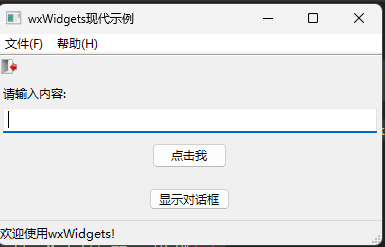
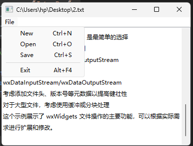

# wxWidgets

> [🖱️英文学习文档](https://wiki.wxwidgets.org/Hello_World)            [🖱️中文学习文档](https://wiki.wxwidgets.org/WxWidgets%E7%A8%8B%E5%BA%8F%E8%AE%BE%E8%AE%A1%E6%95%99%E7%A8%8B03:%E7%AC%AC%E4%B8%80%E4%B8%AA%E7%A8%8B%E5%BA%8F)            [🖱️中文学习书籍](https://wizardforcel.gitbooks.io/wxwidgets-book/content/index.html)

## 1. 环境配置

> 采用的是visual studio 2022 + wxWidgets-3.2.2.1

### 1.1 下载和编译

1. #### 下载wxWidgets

> [🖱️点击跳转下载](https://github.com/wxWidgets/wxWidgets/releases)具体下载那个可以参考下图（其他版本也可以，具体看自己的需要）


2. 编译wxWidgets源代码

> 打开目录`wxWidgets-3.1.4\build\msw`，找到与自己的Visual Studio版本最相近的`.sln`文件并用VS打开


3. 打开加载完成后，选择 `生成`——`批生成`


4. 选择 `全选`——`生成`，等待即可


### 1.2 visual studio 2022 配置

1. 创建一个空项目
2. 鼠标右键——> `属性`


3. 具体配置参考下图即可


### 1.3 错误集合及其解决方法

> 上述方法都是网上的步骤，自己也是用来参考，但是最终都会出现或多或少的问题，下面会附上对应的解决方法；

#### 1.3.1 错误一

> **错误提示：**
>
> * `fatal error C1083:无法打开包括文件: “wx/setup.h”: No such file or directory`

##### 解决方法：

> 到`C:\wxwidgets\include\wx`目录下， 找到`platform.h`文件，用`notepad++`打开

> 找到` #include "wx/setup.h" `一行

> 将 `"wx/setup.h" `改为` "wx/msw/setup.h"`, 然后保存修改后的`platform.h`文件即可，之后你再去编译工程，就不会出现这个错误了

+ 原来官方给的下载包里的wx.chm帮助文件有这个问题的解决办法，意思是说，wx/...目录里根本没有setup.h文件, 首先要在platform.h文件里进行配置， 格式大致是 #include "wx/XXX/setup.h", 而这里的XXX是根据你所用的操作系统的不同而改变的，例如WINDOW下就改成"wx/msw/setup.h", 而MacOS就改成"wx/mac/setup.h"

#### 1.3.2 错误二

> 错误大概形式如下

```tex
1>wxmsw32u_core.lib(app.obj) : error LNK2001: 无法解析的外部符号 __imp_InitCommonControls
1>wxmsw32u_core.lib(ownerdrw.obj) : error LNK2001: 无法解析的外部符号 __imp_ImageList_Create
1>wxmsw32u_core.lib(imaglist.obj) : error LNK2001: 无法解析的外部符号 __imp_ImageList_Create
1>wxmsw32u_core.lib(ownerdrw.obj) : error LNK2001: 无法解析的外部符号 __imp_ImageList_Destroy
1>wxmsw32u_core.lib(imaglist.obj) : error LNK2001: 无法解析的外部符号 __imp_ImageList_Destroy
1>wxmsw32u_core.lib(ownerdrw.obj) : error LNK2001: 无法解析的外部符号 __imp_ImageList_Add
1>wxmsw32u_core.lib(imaglist.obj) : error LNK2001: 无法解析的外部符号 __imp_ImageList_Add
1>wxmsw32u_core.lib(ownerdrw.obj) : error LNK2001: 无法解析的外部符号 __imp_ImageList_Draw
1>wxmsw32u_core.lib(imaglist.obj) : error LNK2001: 无法解析的外部符号 __imp_ImageList_Draw
1>wxmsw32u_core.lib(msw_listctrl.obj) : error LNK2001: 无法解析的外部符号 __imp_ImageList_Draw
1>wxmsw32u_core.lib(msw_spinbutt.obj) : error LNK2001: 无法解析的外部符号 __imp_CreateUpDownControl
1>wxmsw32u_core.lib(imaglist.obj) : error LNK2001: 无法解析的外部符号 __imp_ImageList_GetImageCount
1>wxmsw32u_core.lib(msw_listctrl.obj) : error LNK2001: 无法解析的外部符号 __imp_ImageList_GetImageCount
1>wxmsw32u_core.lib(imaglist.obj) : error LNK2001: 无法解析的外部符号 __imp_ImageList_SetBkColor
1>wxmsw32u_core.lib(imaglist.obj) : error LNK2001: 无法解析的外部符号 __imp_ImageList_Replace
1>wxmsw32u_core.lib(imaglist.obj) : error LNK2001: 无法解析的外部符号 __imp_ImageList_AddMasked
1>wxmsw32u_core.lib(imaglist.obj) : error LNK2001: 无法解析的外部符号 __imp_ImageList_Remove
1>wxmsw32u_core.lib(imaglist.obj) : error LNK2001: 无法解析的外部符号 __imp_ImageList_GetIcon
1>wxmsw32u_core.lib(imaglist.obj) : error LNK2001: 无法解析的外部符号 __imp_ImageList_GetIconSize
1>wxmsw32u_core.lib(msw_listctrl.obj) : error LNK2001: 无法解析的外部符号 __imp_ImageList_GetIconSize
1>wxmsw32u_core.lib(imaglist.obj) : error LNK2001: 无法解析的外部符号 __imp_ImageList_GetImageInfo
1>wxmsw32u_core.lib(uuid.obj) : error LNK2001: 无法解析的外部符号 __imp_RpcStringFreeW
1>wxmsw32u_core.lib(uuid.obj) : error LNK2001: 无法解析的外部符号 __imp_UuidCreate
1>wxmsw32u_core.lib(uuid.obj) : error LNK2001: 无法解析的外部符号 __imp_UuidToStringW
1>wxmsw32u_core.lib(uuid.obj) : error LNK2001: 无法解析的外部符号 __imp_UuidFromStringW
1>C:\study\wxWidgets\one\x64\Release\one.exe : fatal error LNK1120: 18 个无法解析的外部命令
```

> 当时很头疼尝试了很多方法，本文提供了一种方法，最后可以顺利进行，如果大家有什么好的方法可以随时交流；


> 相关的lib文件如下(仅供参考)

```latex
wxbase32u.lib
wxmsw32u_core.lib
wxmsw32u_richtext.lib
wxmsw32u_html.lib
wxmsw32u_gl.lib
wxmsw32u_adv.lib
wxpng.lib
wxzlib.lib
wxtiff.lib
wxjpeg.lib
wxregexu.lib
wxexpat.lib
comctl32.lib
rpcrt4.lib
```

> `comctl32.lib; rpcrt4.lib`并不是由 wxWidgets 编译产生的，而是随 Windows SDK（Windows Kits）一起提供的系统导入库（import libraries）。如果在您的 wxWidgets lib 目录中看不到这两个文件，很可能是因为尚未安装或配置 Windows SDK，导致 Visual Studio 无法找到这些系统库。

### 1.4 示例程序

```cpp
// wxWidgets "Hello World" Program
// For compilers that support precompilation, includes "wx/wx.h".
#include <wx/wxprec.h>
#ifndef WX_PRECOMP
#include <wx/wx.h>
#endif
class MyApp : public wxApp
{
public:
	virtual bool OnInit();
};
class MyFrame : public wxFrame
{
public:
	MyFrame();
private:
	void OnHello(wxCommandEvent& event);
	void OnExit(wxCommandEvent& event);
	void OnAbout(wxCommandEvent& event);
};
enum
{
	ID_Hello = 1
};
wxIMPLEMENT_APP(MyApp);
bool MyApp::OnInit()
{
	MyFrame* frame = new MyFrame();
	frame->Show(true);
	return true;
}
MyFrame::MyFrame()
	: wxFrame(NULL, wxID_ANY, "Hello World")
{
	wxMenu* menuFile = new wxMenu;
	menuFile->Append(ID_Hello, "&Hello...\tCtrl-H",
		"Help string shown in status bar for this menu item");
	menuFile->AppendSeparator();
	menuFile->Append(wxID_EXIT);
	wxMenu* menuHelp = new wxMenu;
	menuHelp->Append(wxID_ABOUT);
	wxMenuBar* menuBar = new wxMenuBar;
	menuBar->Append(menuFile, "&File");
	menuBar->Append(menuHelp, "&Help");
	SetMenuBar(menuBar);
	CreateStatusBar();
	SetStatusText("Welcome to wxWidgets!");
	Bind(wxEVT_MENU, &MyFrame::OnHello, this, ID_Hello);
	Bind(wxEVT_MENU, &MyFrame::OnAbout, this, wxID_ABOUT);
	Bind(wxEVT_MENU, &MyFrame::OnExit, this, wxID_EXIT);
}
void MyFrame::OnExit(wxCommandEvent& event)
{
	Close(true);
}
void MyFrame::OnAbout(wxCommandEvent& event)
{
	wxMessageBox("This is a wxWidgets Hello World example",
		"About Hello World", wxOK | wxICON_INFORMATION);
}
void MyFrame::OnHello(wxCommandEvent& event)
{
	wxLogMessage("Hello world from wxWidgets!");
}

```

> 运行结果


> 最后备注一下，每次修改`属性信息`，记得先`清理解决方案`，在重新生成；

## 2. 代码示例

### 2.1 wxWidgets 双向通信示例

```cpp
#include <wx/wx.h>  // 引入 wxWidgets 主头文件，包含所有基本控件和事件定义

// 定义两个自定义事件类型，用于 GroupA → GroupB，GroupB → GroupA 的通信
// wxDEFINE_EVENT(事件名, 事件类型)
wxDEFINE_EVENT(EVT_MSG_TO_B, wxCommandEvent);  // A → B 的消息事件
wxDEFINE_EVENT(EVT_MSG_TO_A, wxCommandEvent);  // B → A 的消息事件

// 前向声明两个面板类，方便在主窗口类中引用
class GroupAPanel;
class GroupBPanel;

// 主窗口类，继承自 wxFrame，是整个程序的主容器
class MyFrame : public wxFrame {
public:
	// 构造函数：用于创建窗口和初始化界面
	MyFrame(const wxString& title);

private:
	GroupAPanel* groupA;  // Group A 面板指针
	GroupBPanel* groupB;  // Group B 面板指针

	// 接收来自 Group A 的事件（发送给 B）
	void OnMsgToB(wxCommandEvent& event);

	// 接收来自 Group B 的事件（发送给 A）
	void OnMsgToA(wxCommandEvent& event);
};

// Group A 面板，继承自 wxPanel，包含按钮和显示消息的文本
class GroupAPanel : public wxPanel {
public:
	// 构造函数：构建 Group A 的 UI
	GroupAPanel(wxWindow* parent)
		: wxPanel(parent) {  // 父窗口是主窗口 MyFrame

		// 设置背景颜色：AliceBlue
		SetBackgroundColour(wxColour(240, 248, 255));

		// 创建一个带边框的垂直排列容器，标题为 "Group A"
		wxStaticBoxSizer* box = new wxStaticBoxSizer(wxVERTICAL, this, "Group A");

		// 创建一个按钮（wxID_ANY 表示自动分配 ID），标签为 "Send to B ➡️"
		btn = new wxButton(this, wxID_ANY, "Send to B ➡️");

		// 创建一个文本标签用于显示来自 B 的消息，初始文本为 "Msg from B: "
		msgDisplay = new wxStaticText(this, wxID_ANY, "Msg from B: ", wxDefaultPosition, wxDefaultSize, wxALIGN_LEFT);

		// 将按钮和文本添加到 box 布局中，设置边距和对齐方式
		box->Add(btn, 0, wxALL | wxEXPAND, 10);                      // 四周边距 10，填充
		box->Add(msgDisplay, 0, wxLEFT | wxRIGHT | wxBOTTOM, 10);   // 三边边距

		// 设置面板使用这个布局
		SetSizer(box);

		// 绑定按钮点击事件：点击按钮时调用 OnSend()
		btn->Bind(wxEVT_BUTTON, &GroupAPanel::OnSend, this);
	}

	// 点击按钮后调用的函数：发送自定义事件给主窗口（发给 B）
	void OnSend(wxCommandEvent& event) {
		wxCommandEvent customEvent(EVT_MSG_TO_B);  // 创建自定义事件，类型是 EVT_MSG_TO_B
		customEvent.SetString("👋 Hello from A!"); // 设置事件携带的字符串
		wxPostEvent(GetParent(), customEvent);     // 异步发送事件给父窗口（MyFrame）
	}

	// 用于更新文本内容（显示来自 B 的消息）
	void UpdateText(const wxString& msg) {
		msgDisplay->SetLabel("Msg from B: " + msg);
	}

private:
	wxButton* btn;              // 发送按钮
	wxStaticText* msgDisplay;   // 显示文本
};

// Group B 面板，与 Group A 结构几乎相同
class GroupBPanel : public wxPanel {
public:
	GroupBPanel(wxWindow* parent)
		: wxPanel(parent) {
		SetBackgroundColour(wxColour(255, 250, 240));  // 设置背景为 FloralWhite

		wxStaticBoxSizer* box = new wxStaticBoxSizer(wxVERTICAL, this, "Group B");

		btn = new wxButton(this, wxID_ANY, "⬅️ Send to A");
		msgDisplay = new wxStaticText(this, wxID_ANY, "Msg from A: ", wxDefaultPosition, wxDefaultSize, wxALIGN_LEFT);

		box->Add(btn, 0, wxALL | wxEXPAND, 10);
		box->Add(msgDisplay, 0, wxLEFT | wxRIGHT | wxBOTTOM, 10);
		SetSizer(box);

		// 绑定按钮事件：点击按钮后调用 OnSend()
		btn->Bind(wxEVT_BUTTON, &GroupBPanel::OnSend, this);
	}

	// 向 A 发送消息
	void OnSend(wxCommandEvent& event) {
		wxCommandEvent customEvent(EVT_MSG_TO_A);     // 创建类型为 EVT_MSG_TO_A 的事件
		customEvent.SetString("📨 Reply from B!");    // 设置事件的字符串内容
		wxPostEvent(GetParent(), customEvent);        // 发送给主窗口
	}

	// 更新显示内容（显示来自 A 的消息）
	void UpdateText(const wxString& msg) {
		msgDisplay->SetLabel("Msg from A: " + msg);
	}

private:
	wxButton* btn;
	wxStaticText* msgDisplay;
};

// 主窗口构造函数
MyFrame::MyFrame(const wxString& title)
	: wxFrame(NULL, wxID_ANY, title, wxDefaultPosition, wxSize(520, 300)) {

	wxBoxSizer* sizer = new wxBoxSizer(wxHORIZONTAL); // 创建水平布局容器

	groupA = new GroupAPanel(this);  // 创建 Group A，父窗口是当前 MyFrame
	groupB = new GroupBPanel(this);  // 创建 Group B

	// 把两个组分别加入布局中，设置为均等占用空间、可拉伸
	sizer->Add(groupA, 1, wxEXPAND | wxALL, 5);
	sizer->Add(groupB, 1, wxEXPAND | wxALL, 5);
	SetSizer(sizer);  // 设置窗口的主布局

	// 绑定两个自定义事件到主窗口
	// 当收到 EVT_MSG_TO_B 类型事件时，调用 OnMsgToB()
	Bind(EVT_MSG_TO_B, &MyFrame::OnMsgToB, this);

	// 当收到 EVT_MSG_TO_A 类型事件时，调用 OnMsgToA()
	Bind(EVT_MSG_TO_A, &MyFrame::OnMsgToA, this);

	SetBackgroundColour(wxColour(245, 245, 245)); // 设置主窗口背景色为浅灰
}

// 主窗口收到来自 A 的消息后，把内容传给 B 更新界面
void MyFrame::OnMsgToB(wxCommandEvent& event) {
	groupB->UpdateText(event.GetString());  // 将事件中的字符串交给 B 处理
}

// 主窗口收到来自 B 的消息后，把内容传给 A 更新界面
void MyFrame::OnMsgToA(wxCommandEvent& event) {
	groupA->UpdateText(event.GetString());  // 同上
}

// 应用程序类（wxApp），入口类
class MyApp : public wxApp {
public:
	// 重载 OnInit()，应用程序启动时调用
	virtual bool OnInit() {
		MyFrame* frame = new MyFrame("🌐 wxWidgets 双向通信"); // 创建主窗口
		frame->Centre();      // 居中显示
		frame->Show(true);    // 显示窗口
		return true;
	}
};

// 宏定义应用程序入口，生成 main 函数
wxIMPLEMENT_APP(MyApp);

```

### 2.2 进一步扩展通信

>  ✅ 使用 wxTextCtrl 显示多条聊天记录 ✅ 多个组广播（如 A、B、C、D 全连接） ✅ 加入线程通信示例（后台发消息） ✅ 改为支持消息携带结构体数据

```cpp
// wxWidgets 多组面板通信扩展示例
// 功能：
// ✅ 多个组（A/B/C/D）可以广播通信
// ✅ 每个面板使用 wxTextCtrl 显示多条聊天记录
// ✅ 后台线程定时发消息
// ✅ 消息中携带结构体数据（包含 sender, content）

#include <wx/wx.h>
#include <wx/thread.h>
#include <vector>
#include <random>
#include <ctime>

// 消息数据结构
struct ChatMessage {
	wxString sender;
	wxString content;
};

wxDEFINE_EVENT(EVT_CHAT_MESSAGE, wxCommandEvent);

// 转换结构体为字符串（简单方式）
wxString FormatChat(const ChatMessage& msg) {
	return msg.sender + ": " + msg.content;
}

// 所有组面板的基类
class GroupPanel : public wxPanel {
public:
	GroupPanel(wxWindow* parent, const wxString& name)
		: wxPanel(parent), groupName(name) {

		SetBackgroundColour(*wxWHITE);
		wxStaticBoxSizer* box = new wxStaticBoxSizer(wxVERTICAL, this, name);

		chatLog = new wxTextCtrl(this, wxID_ANY, "", wxDefaultPosition, wxSize(200, 200),
			wxTE_MULTILINE | wxTE_READONLY | wxTE_RICH2);
		sendBtn = new wxButton(this, wxID_ANY, "Broadcast from " + name);

		box->Add(chatLog, 1, wxALL | wxEXPAND, 5);
		box->Add(sendBtn, 0, wxALL | wxALIGN_CENTER, 5);
		SetSizer(box);

		sendBtn->Bind(wxEVT_BUTTON, &GroupPanel::OnSendClicked, this);
	}

	// 显示消息
	void AppendMessage(const ChatMessage& msg) {
		chatLog->AppendText(FormatChat(msg) + "\n");
	}

	wxString GetName() const { return groupName; }

	// 设置广播回调
	std::function<void(const ChatMessage&)> onSend;

private:
	void OnSendClicked(wxCommandEvent&) {
		if (onSend) {
			ChatMessage msg{ groupName, "👋 Hi from " + groupName };
			onSend(msg);
		}
	}

	wxTextCtrl* chatLog;
	wxButton* sendBtn;
	wxString groupName;
};

// 后台线程事件源
class MessageThread : public wxThread {
public:
	MessageThread(wxEvtHandler* handler, const std::vector<wxString>& senders)
		: wxThread(wxTHREAD_DETACHED), evtHandler(handler), groups(senders) {
		srand(time(nullptr));
	}

protected:
	ExitCode Entry() override {
		while (!TestDestroy()) {
			wxThread::Sleep(3000);  // 每 3 秒

			// 随机选择一个发送者
			int i = rand() % groups.size();
			ChatMessage msg{ groups[i], "🕒 Timed hello from " + groups[i] };

			wxCommandEvent evt(EVT_CHAT_MESSAGE);
			evt.SetClientData(new ChatMessage(msg));
			wxQueueEvent(evtHandler, evt.Clone());
		}
		return (wxThread::ExitCode)0;
	}

private:
	wxEvtHandler* evtHandler;
	std::vector<wxString> groups;
};

class MyFrame : public wxFrame {
public:
	MyFrame() : wxFrame(NULL, wxID_ANY, "🌐 Group Broadcast Chat", wxDefaultPosition, wxSize(850, 300)) {
		wxBoxSizer* sizer = new wxBoxSizer(wxHORIZONTAL);

		wxString names[] = { "Group A", "Group B", "Group C", "Group D" };

		for (const auto& name : names) {
			GroupPanel* panel = new GroupPanel(this, name);

			// 设置广播回调（转发给所有组）
			panel->onSend = [this](const ChatMessage& msg) {
				Broadcast(msg);
				};

			groups.push_back(panel);
			sizer->Add(panel, 1, wxEXPAND | wxALL, 5);
		}

		SetSizer(sizer);
		Bind(EVT_CHAT_MESSAGE, &MyFrame::OnThreadMessage, this);

		std::vector<wxString> groupNames;
		for (const auto& g : groups)
			groupNames.push_back(g->GetName());

		// 启动线程
		(new MessageThread(this, groupNames))->Run();
	}

	// 广播消息给所有组（除了自己）
	void Broadcast(const ChatMessage& msg) {
		for (auto* g : groups) {
			if (g->GetName() != msg.sender)
				g->AppendMessage(msg);
		}
	}

	void OnThreadMessage(wxCommandEvent& evt) {
		auto* msg = static_cast<ChatMessage*>(evt.GetClientData());
		Broadcast(*msg);
		delete msg;
	}

private:
	std::vector<GroupPanel*> groups;
};

class MyApp : public wxApp {
public:
	bool OnInit() override {
		MyFrame* frame = new MyFrame();
		frame->Centre();
		frame->Show(true);
		return true;
	}
};

wxIMPLEMENT_APP(MyApp);
```


### 2.3 对话小窗口

```cpp
// testd.h
#ifndef MYAPP_H
#define MYAPP_H

#include <wx/wx.h>

// 主应用程序类
class MyApp : public wxApp
{
public:
	virtual bool OnInit() override;
};

// 主窗口类
class MainFrame : public wxFrame
{
public:
	MainFrame(const wxString& title);

private:
	// 事件处理函数
	void OnHello(wxCommandEvent& event);
	void OnExit(wxCommandEvent& event);
	void OnAbout(wxCommandEvent& event);
	void OnShowDialog(wxCommandEvent& event);
	void OnButtonClicked(wxCommandEvent& event);
	void OnTextEnter(wxCommandEvent& event);

	// 控件指针
	wxTextCtrl* m_textCtrl;
	wxButton* m_button;
};

#endif // MYAPP_H
```

```cpp
// test.cpp
#include "test.h"
#include <wx/artprov.h>
#include <wx/toolbar.h>
#include <wx/aboutdlg.h>
// 实现应用程序入口点
wxIMPLEMENT_APP(MyApp);

bool MyApp::OnInit()
{
	// 创建主窗口
	MainFrame* frame = new MainFrame("wxWidgets现代示例");

	// 设置应用程序图标（可选）
#ifdef __WXMSW__
	frame->SetIcon(wxICON(app_icon)); // Windows使用资源文件中的图标
#endif

	// 显示主窗口
	frame->Show(true);

	return true;
}

// 主窗口构造函数
MainFrame::MainFrame(const wxString& title)
	: wxFrame(NULL, wxID_ANY, title)
{
	// 1. 创建菜单栏
	wxMenu* menuFile = new wxMenu;
	menuFile->Append(wxID_NEW, "&新建\tCtrl+N");
	menuFile->AppendSeparator();
	menuFile->Append(wxID_EXIT, "退出\tAlt+F4", "退出应用程序");

	wxMenu* menuHelp = new wxMenu;
	menuHelp->Append(wxID_ABOUT, "关于\tF1", "显示关于对话框");

	wxMenuBar* menuBar = new wxMenuBar;
	menuBar->Append(menuFile, "文件(&F)");
	menuBar->Append(menuHelp, "帮助(&H)");

	SetMenuBar(menuBar);

	// 2. 创建工具栏
	wxToolBar* toolBar = CreateToolBar();
	if (toolBar) {
		// 使用wxArtProvider获取系统图标
		wxBitmap exitBitmap = wxArtProvider::GetBitmap(wxART_QUIT, wxART_TOOLBAR, wxSize(16, 16));

		// 添加工具（使用wxID_EXIT以获得标准行为）
		toolBar->AddTool(wxID_EXIT, "退出", exitBitmap, "退出应用程序");

		// 对于其他平台可能需要添加此调用
#ifndef __WXMSW__
		toolBar->SetToolBitmapSize(wxSize(16, 16));
#endif

		toolBar->Realize();
	}

	// 3. 创建状态栏
	CreateStatusBar();
	SetStatusText("欢迎使用wxWidgets!");

	// 4. 创建主面板（作为所有控件的容器）
	wxPanel* panel = new wxPanel(this);

	// 5. 创建垂直布局管理器
	wxBoxSizer* mainSizer = new wxBoxSizer(wxVERTICAL);

	// 6. 添加控件
	// 6.1 添加静态文本
	mainSizer->Add(
		new wxStaticText(panel, wxID_ANY, "请输入内容:"),
		0, wxALL, 5);

	// 6.2 添加文本框（保存指针以便后续访问）
	m_textCtrl = new wxTextCtrl(panel, wxID_ANY, "",
		wxDefaultPosition, wxDefaultSize,
		wxTE_PROCESS_ENTER);
	mainSizer->Add(m_textCtrl, 0, wxEXPAND | wxLEFT | wxRIGHT, 5);

	// 6.3 添加按钮
	m_button = new wxButton(panel, wxID_ANY, "点击我");
	mainSizer->Add(m_button, 0, wxALIGN_CENTER | wxALL, 10);

	// 6.4 添加对话框按钮
	wxButton* dialogBtn = new wxButton(panel, wxID_ANY, "显示对话框");
	mainSizer->Add(dialogBtn, 0, wxALIGN_CENTER | wxALL, 10);

	// 7. 设置面板布局
	panel->SetSizerAndFit(mainSizer);

	// 8. 绑定事件处理（现代方式）

	// 8.1 菜单项事件
	Bind(wxEVT_MENU, &MainFrame::OnHello, this, wxID_NEW);
	Bind(wxEVT_MENU, &MainFrame::OnExit, this, wxID_EXIT);
	Bind(wxEVT_MENU, &MainFrame::OnAbout, this, wxID_ABOUT);

	// 8.2 工具栏事件
	Bind(wxEVT_MENU, &MainFrame::OnExit, this, wxID_EXIT);

	// 8.3 按钮点击事件
	m_button->Bind(wxEVT_BUTTON, &MainFrame::OnButtonClicked, this);

	// 8.4 文本框回车事件
	m_textCtrl->Bind(wxEVT_TEXT_ENTER, &MainFrame::OnTextEnter, this);

	// 8.5 对话框按钮事件
	dialogBtn->Bind(wxEVT_BUTTON, &MainFrame::OnShowDialog, this);
}

// 事件处理函数实现

void MainFrame::OnHello(wxCommandEvent& event)
{
	wxLogMessage("你点击了'新建'菜单项");
	SetStatusText("创建新文档...");
}

void MainFrame::OnExit(wxCommandEvent& event)
{
	Close(true); // 关闭窗口
}

void MainFrame::OnAbout(wxCommandEvent& event)
{
	wxAboutDialogInfo aboutInfo;
	aboutInfo.SetName("wxWidgets现代示例");
	aboutInfo.SetVersion("1.0");
	aboutInfo.SetDescription("这是一个展示现代wxWidgets用法的示例程序");
	aboutInfo.SetCopyright("(C) 2023");
	aboutInfo.AddDeveloper("开发者名称");

	wxAboutBox(aboutInfo);
}

void MainFrame::OnButtonClicked(wxCommandEvent& event)
{
	wxString text = m_textCtrl->GetValue();
	if (text.empty()) {
		wxMessageBox("请输入一些内容!", "提示", wxOK | wxICON_INFORMATION, this);
	}
	else {
		wxMessageBox("你输入了: " + text, "结果", wxOK | wxICON_INFORMATION, this);
	}
}

void MainFrame::OnTextEnter(wxCommandEvent& event)
{
	wxMessageBox("你按下了回车键!", "提示", wxOK | wxICON_INFORMATION, this);
}

void MainFrame::OnShowDialog(wxCommandEvent& event)
{
	// 创建自定义对话框
	wxDialog dialog(this, wxID_ANY, "示例对话框", wxDefaultPosition, wxSize(300, 200));

	// 对话框布局
	wxBoxSizer* dialogSizer = new wxBoxSizer(wxVERTICAL);

	// 添加控件
	dialogSizer->Add(new wxStaticText(&dialog, wxID_ANY, "这是一个自定义对话框"),
		0, wxALIGN_CENTER | wxTOP, 20);

	wxCheckBox* checkBox = new wxCheckBox(&dialog, wxID_ANY, "启用选项");
	dialogSizer->Add(checkBox, 0, wxALIGN_CENTER | wxTOP, 15);

	// 添加按钮行
	wxBoxSizer* btnSizer = new wxBoxSizer(wxHORIZONTAL);
	btnSizer->Add(new wxButton(&dialog, wxID_OK, "确定"), 0, wxRIGHT, 10);
	btnSizer->Add(new wxButton(&dialog, wxID_CANCEL, "取消"), 0);

	dialogSizer->Add(btnSizer, 0, wxALIGN_CENTER | wxTOP | wxBOTTOM, 20);

	// 设置对话框布局
	dialog.SetSizerAndFit(dialogSizer);

	// 显示对话框并处理结果
	if (dialog.ShowModal() == wxID_OK) {
		wxString msg = checkBox->IsChecked() ?
			"你选择了确定并启用了选项" : "你选择了确定但未启用选项";
		wxMessageBox(msg, "对话框结果", wxOK | wxICON_INFORMATION, this);
	}
}
```



### 2.4 文件操作对应的小安列——简单的记事本

```cpp
#include <wx/wx.h>
#include <wx/wfstream.h>  // 文件流类
#include <wx/datstrm.h>   // 数据流类
#include <wx/txtstrm.h>   // 文本流类
#include <wx/textfile.h>

// 自定义数据类，用于演示二进制读写
class PersonData {
public:
	wxString name;
	int age;
	double height;

	// 用于二进制写入
	void WriteTo(wxDataOutputStream& out) const {
		out << name << age << height;
	}

	// 用于二进制读取
	void ReadFrom(wxDataInputStream& in) {
		in >> name >> age >> height;
	}

	wxString ToString() const {
		return wxString::Format("Name: %s, Age: %d, Height: %.2f", name, age, height);
	}
};

// 主框架类
class MyFrame : public wxFrame {
public:
	MyFrame(const wxString& title)
		: wxFrame(NULL, wxID_ANY, title, wxDefaultPosition, wxSize(400, 300)) {

		// 创建菜单栏
		wxMenuBar* menuBar = new wxMenuBar;
		wxMenu* fileMenu = new wxMenu;

		fileMenu->Append(wxID_NEW, "&New\tCtrl+N", "Create a new file");
		fileMenu->Append(wxID_OPEN, "&Open\tCtrl+O", "Open an existing file");
		fileMenu->Append(wxID_SAVE, "&Save\tCtrl+S", "Save the current file");
		fileMenu->AppendSeparator();
		fileMenu->Append(wxID_EXIT, "E&xit\tAlt+F4", "Quit this program");

		menuBar->Append(fileMenu, "&File");
		SetMenuBar(menuBar);

		// 创建文本控件用于显示内容
		textCtrl = new wxTextCtrl(this, wxID_ANY, "",
			wxDefaultPosition, wxDefaultSize,
			wxTE_MULTILINE | wxTE_RICH);

		// 绑定事件
		Bind(wxEVT_MENU, &MyFrame::OnNew, this, wxID_NEW);
		Bind(wxEVT_MENU, &MyFrame::OnOpen, this, wxID_OPEN);
		Bind(wxEVT_MENU, &MyFrame::OnSave, this, wxID_SAVE);
		Bind(wxEVT_MENU, &MyFrame::OnExit, this, wxID_EXIT);
	}

private:
	wxTextCtrl* textCtrl;

	// 新建文件
	void OnNew(wxCommandEvent& event) {
		textCtrl->Clear();
		SetTitle("Untitled");
	}

	// 打开文件
	void OnOpen(wxCommandEvent& event) {
		// 创建文件选择对话框
		wxFileDialog openFileDialog(this, _("Open file"), "", "",
			"Text files (*.txt)|*.txt|Binary files (*.dat)|*.dat",
			wxFD_OPEN | wxFD_FILE_MUST_EXIST);

		if (openFileDialog.ShowModal() == wxID_CANCEL)
			return;

		wxString filename = openFileDialog.GetPath();
		wxString ext = openFileDialog.GetFilterIndex() == 0 ? "txt" : "dat";

		if (ext == "txt") {
			// 读取文本文件
			ReadTextFile(filename);
		}
		else {
			// 读取二进制文件
			ReadBinaryFile(filename);
		}

		SetTitle(filename);
	}

	// 保存文件
	void OnSave(wxCommandEvent& event) {
		wxFileDialog saveFileDialog(this, _("Save file"), "", "",
			"Text files (*.txt)|*.txt|Binary files (*.dat)|*.dat",
			wxFD_SAVE | wxFD_OVERWRITE_PROMPT);

		if (saveFileDialog.ShowModal() == wxID_CANCEL)
			return;

		wxString filename = saveFileDialog.GetPath();
		wxString ext = saveFileDialog.GetFilterIndex() == 0 ? "txt" : "dat";

		if (ext == "txt") {
			// 保存为文本文件
			WriteTextFile(filename);
		}
		else {
			// 保存为二进制文件
			WriteBinaryFile(filename);
		}

		SetTitle(filename);
	}

	// 退出程序
	void OnExit(wxCommandEvent& event) {
		Close(true);
	}

	// 读取文本文件
	void ReadTextFile(const wxString& filename) {
		// 使用wxTextFile类读取文本文件（逐行读取）
		wxTextFile textFile;
		if (!textFile.Open(filename)) {
			wxLogError("Cannot open file '%s'.", filename);
			return;
		}

		textCtrl->Clear();

		// 逐行读取并添加到文本控件
		for (wxString str = textFile.GetFirstLine(); !textFile.Eof(); str = textFile.GetNextLine()) {
			textCtrl->AppendText(str + "\n");
		}

		textFile.Close();

		// 另一种方法：使用wxFileInputStream和wxTextInputStream
		/*
		wxFileInputStream input(filename);
		if (!input.IsOk()) {
			wxLogError("Cannot open file '%s'.", filename);
			return;
		}

		wxTextInputStream textInput(input);
		textCtrl->Clear();

		while (!input.Eof()) {
			wxString line = textInput.ReadLine();
			textCtrl->AppendText(line + "\n");
		}
		*/
	}

	// 写入文本文件
	void WriteTextFile(const wxString& filename) {
		// 方法1：使用wxTextFile类
		wxTextFile textFile;
		if (!textFile.Create(filename)) {
			wxLogError("Cannot create file '%s'.", filename);
			return;
		}

		wxString content = textCtrl->GetValue();
		wxArrayString lines = wxSplit(content, '\n');

		for (const wxString& line : lines) {
			textFile.AddLine(line);
		}

		textFile.Write();
		textFile.Close();

		// 方法2：使用wxFileOutputStream和wxTextOutputStream
		/*
		wxFileOutputStream output(filename);
		if (!output.IsOk()) {
			wxLogError("Cannot create file '%s'.", filename);
			return;
		}

		wxTextOutputStream textOutput(output);
		wxString content = textCtrl->GetValue();
		textOutput.WriteString(content);
		*/
	}

	// 读取二进制文件
	void ReadBinaryFile(const wxString& filename) {
		wxFileInputStream input(filename);
		if (!input.IsOk()) {
			wxLogError("Cannot open file '%s'.", filename);
			return;
		}

		wxDataInputStream dataInput(input);
		textCtrl->Clear();

		try {
			// 读取文件头，验证文件类型
			wxUint32 magic;
			dataInput >> magic;
			if (magic != 0xDEADBEEF) {
				wxLogError("Invalid binary file format.");
				return;
			}

			// 读取版本号
			wxUint16 version;
			dataInput >> version;
			textCtrl->AppendText(wxString::Format("File version: %d\n", version));

			// 读取字符串
			wxString header;
			dataInput >> header;
			textCtrl->AppendText("Header: " + header + "\n\n");

			// 读取自定义数据
			PersonData person;
			person.ReadFrom(dataInput);
			textCtrl->AppendText("Person data:\n" + person.ToString() + "\n\n");

			// 读取数组数据
			wxUint32 count;
			dataInput >> count;
			textCtrl->AppendText(wxString::Format("Array count: %d\n", count));

			for (wxUint32 i = 0; i < count; ++i) {
				double value;
				dataInput >> value;
				textCtrl->AppendText(wxString::Format("%.2f ", value));
			}

		}
		catch (...) {
			wxLogError("Error reading binary file.");
		}
	}

	// 写入二进制文件
	void WriteBinaryFile(const wxString& filename) {
		wxFileOutputStream output(filename);
		if (!output.IsOk()) {
			wxLogError("Cannot create file '%s'.", filename);
			return;
		}

		wxDataOutputStream dataOutput(output);

		// 写入文件头（魔数）
		dataOutput.Write32(0xDEADBEEF);

		// 写入版本号
		dataOutput.Write16(1);

		// 写入字符串
		dataOutput.WriteString("This is a binary file example");

		// 写入自定义数据
		PersonData person;
		person.name = "John Doe";
		person.age = 30;
		person.height = 1.75;
		person.WriteTo(dataOutput);

		// 写入数组数据
		double values[] = { 1.1, 2.2, 3.3, 4.4, 5.5 };
		dataOutput.Write32(5); // 数组长度
		for (int i = 0; i < 5; ++i) {
			dataOutput.WriteDouble(values[i]);
		}
	}
};

// 应用程序类
class MyApp : public wxApp {
public:
	virtual bool OnInit() {
		MyFrame* frame = new MyFrame("wxWidgets File I/O Example");
		frame->Show(true);
		return true;
	}
};

wxIMPLEMENT_APP(MyApp);
```


