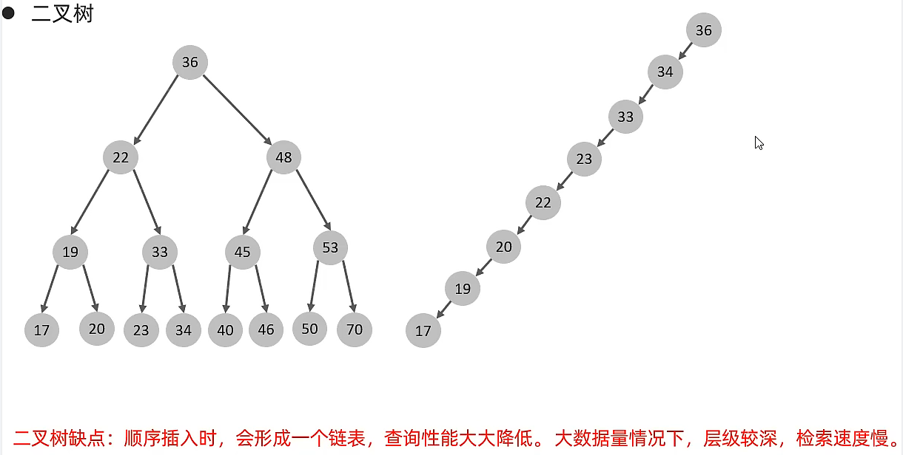
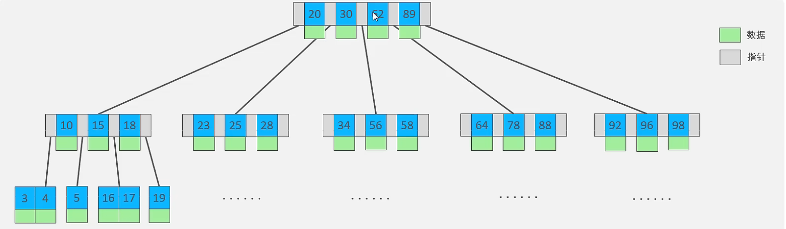
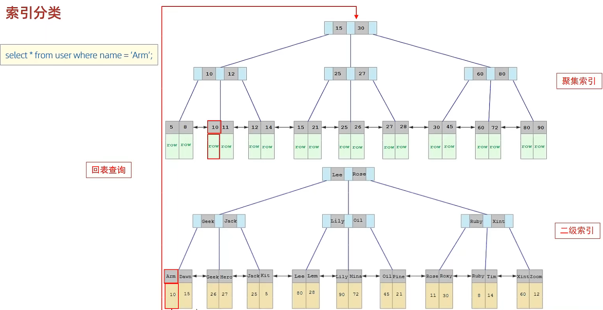

# 📃基础篇

## 通用语法及分类

- DDL: 数据定义语言，用来定义数据库对象（数据库、表、字段）
- DML: 数据操作语言，用来对数据库表中的数据进行增删改
- DQL: 数据查询语言，用来查询数据库中表的记录
- DCL: 数据控制语言，用来创建数据库用户、控制数据库的控制权限

<!-- tabs:start -->

####  **DDL（数据定义语言）（Data Definition Language）**

数据定义语言

> 数据库操作

查询所有数据库：
`SHOW DATABASES;`
查询当前数据库：
`SELECT DATABASE();`
创建数据库：
`CREATE DATABASE [ IF NOT EXISTS ] 数据库名 [ DEFAULT CHARSET 字符集] [COLLATE 排序规则 ];`
删除数据库：
`DROP DATABASE [ IF EXISTS ] 数据库名;`
使用数据库：
`USE 数据库名;`

> 注意事项

- UTF8字符集长度为3字节，有些符号占4字节，所以推荐用utf8mb4字符集

> 表操作

查询当前数据库所有表：
`SHOW TABLES;`
查询表结构：
`DESC 表名;`
查询指定表的建表语句：
`SHOW CREATE TABLE 表名;`

创建表：
```mysql
CREATE TABLE 表名(
	字段1 字段1类型 [COMMENT 字段1注释],
	字段2 字段2类型 [COMMENT 字段2注释],
	字段3 字段3类型 [COMMENT 字段3注释],
	...
	字段n 字段n类型 [COMMENT 字段n注释]
)[ COMMENT 表注释 ];
```
**最后一个字段后面没有逗号**

添加字段：
`ALTER TABLE 表名 ADD 字段名 类型(长度) [COMMENT 注释] [约束];`
例：`ALTER TABLE emp ADD nickname varchar(20) COMMENT '昵称';`

修改数据类型：
`ALTER TABLE 表名 MODIFY 字段名 新数据类型(长度);`
修改字段名和字段类型：
`ALTER TABLE 表名 CHANGE 旧字段名 新字段名 类型(长度) [COMMENT 注释] [约束];`
例：将emp表的nickname字段修改为username，类型为varchar(30)
`ALTER TABLE emp CHANGE nickname username varchar(30) COMMENT '昵称';`

删除字段：
`ALTER TABLE 表名 DROP 字段名;`

修改表名：
`ALTER TABLE 表名 RENAME TO 新表名`

删除表：
`DROP TABLE [IF EXISTS] 表名;`
删除表，并重新创建该表：
`TRUNCATE TABLE 表名;`

#### **DML（数据操作语言）（Data Manipulation Language）**

> 添加数据

指定字段：
`INSERT INTO 表名 (字段名1, 字段名2, ...) VALUES (值1, 值2, ...);`
全部字段：
`INSERT INTO 表名 VALUES (值1, 值2, ...);`

批量添加数据：
`INSERT INTO 表名 (字段名1, 字段名2, ...) VALUES (值1, 值2, ...), (值1, 值2, ...), (值1, 值2, ...);`
`INSERT INTO 表名 VALUES (值1, 值2, ...), (值1, 值2, ...), (值1, 值2, ...);`

注意事项

- 字符串和日期类型数据应该包含在引号中
- 插入的数据大小应该在字段的规定范围内

> 更新和删除数据

修改数据：
`UPDATE 表名 SET 字段名1 = 值1, 字段名2 = 值2, ... [ WHERE 条件 ];`
例：
`UPDATE emp SET name = 'Jack' WHERE id = 1;`

删除数据：
`DELETE FROM 表名 [ WHERE 条件 ];`

#### **DQL（数据查询语言）（Data Query Language）**

语法：
```mysql
SELECT
	字段列表
FROM
	表名字段
WHERE
	条件列表
GROUP BY
	分组字段列表
HAVING
	分组后的条件列表
ORDER BY
	排序字段列表
LIMIT
	分页参数
```


> 基础查询

查询多个字段：
`SELECT 字段1, 字段2, 字段3, ... FROM 表名;`
`SELECT * FROM 表名;`

设置别名：
`SELECT 字段1 [ AS 别名1 ], 字段2 [ AS 别名2 ], 字段3 [ AS 别名3 ], ... FROM 表名;`
`SELECT 字段1 [ 别名1 ], 字段2 [ 别名2 ], 字段3 [ 别名3 ], ... FROM 表名;`

去除重复记录：
`SELECT DISTINCT 字段列表 FROM 表名;`

转义：
`SELECT * FROM 表名 WHERE name LIKE '/_张三' ESCAPE '/'`
/ 之后的\_不作为通配符

> 条件查询

语法：
`SELECT 字段列表 FROM 表名 WHERE 条件列表;`

条件：

| 比较运算符          | 功能                                        |
| ------------------- | ------------------------------------------- |
| >                   | 大于                                        |
| >=                  | 大于等于                                    |
| <                   | 小于                                        |
| <=                  | 小于等于                                    |
| =                   | 等于                                        |
| <> 或 !=            | 不等于                                      |
| BETWEEN ... AND ... | 在某个范围内（含最小、最大值）              |
| IN(...)             | 在in之后的列表中的值，多选一                |
| LIKE 占位符         | 模糊匹配（\_匹配单个字符，%匹配任意个字符） |
| IS NULL             | 是NULL                                      |

| 逻辑运算符         | 功能                         |
| ------------------ | ---------------------------- |
| AND 或 &&          | 并且（多个条件同时成立）     |
| OR 或 &#124;&#124; | 或者（多个条件任意一个成立） |
| NOT 或 !           | 非，不是                     |

例子：
```mysql
-- 年龄等于30
select * from employee where age = 30;
-- 年龄小于30
select * from employee where age < 30;
-- 小于等于
select * from employee where age <= 30;
-- 没有身份证
select * from employee where idcard is null or idcard = '';
-- 有身份证
select * from employee where idcard;
select * from employee where idcard is not null;
-- 不等于
select * from employee where age != 30;
-- 年龄在20到30之间
select * from employee where age between 20 and 30;
select * from employee where age >= 20 and age <= 30;
-- 下面语句不报错，但查不到任何信息
select * from employee where age between 30 and 20;
-- 性别为女且年龄小于30
select * from employee where age < 30 and gender = '女';
-- 年龄等于25或30或35
select * from employee where age = 25 or age = 30 or age = 35;
select * from employee where age in (25, 30, 35);
-- 姓名为两个字
select * from employee where name like '__';
-- 身份证最后为X
select * from employee where idcard like '%X';
```

> 聚合查询（聚合函数）

常见聚合函数：

| 函数  | 功能     |
| ----- | -------- |
| count | 统计数量 |
| max   | 最大值   |
| min   | 最小值   |
| avg   | 平均值   |
| sum   | 求和     |

语法：
`SELECT 聚合函数(字段列表) FROM 表名;`
例：
`SELECT count(id) from employee where workaddress = "广东省";`

> 分组查询

语法：
`SELECT 字段列表 FROM 表名 [ WHERE 条件 ] GROUP BY 分组字段名 [ HAVING 分组后的过滤条件 ];`

where 和 having 的区别：

- 执行时机不同：where是分组之前进行过滤，不满足where条件不参与分组；having是分组后对结果进行过滤。
- 判断条件不同：where不能对聚合函数进行判断，而having可以。

例子：

```mysql
-- 根据性别分组，统计男性和女性数量（只显示分组数量，不显示哪个是男哪个是女）
select count(*) from employee group by gender;
-- 根据性别分组，统计男性和女性数量
select gender, count(*) from employee group by gender;
-- 根据性别分组，统计男性和女性的平均年龄
select gender, avg(age) from employee group by gender;
-- 年龄小于45，并根据工作地址分组
select workaddress, count(*) from employee where age < 45 group by workaddress;
-- 年龄小于45，并根据工作地址分组，获取员工数量大于等于3的工作地址
select workaddress, count(*) address_count from employee where age < 45 group by workaddress having address_count >= 3;
```

> 注意事项

- 执行顺序：where > 聚合函数 > having
- 分组之后，查询的字段一般为聚合函数和分组字段，查询其他字段无任何意义

> 排序查询

语法：
`SELECT 字段列表 FROM 表名 ORDER BY 字段1 排序方式1, 字段2 排序方式2;`

排序方式：

- ASC: 升序（默认）
- DESC: 降序

例子：

```mysql
-- 根据年龄升序排序
SELECT * FROM employee ORDER BY age ASC;
SELECT * FROM employee ORDER BY age;
-- 两字段排序，根据年龄升序排序，入职时间降序排序
SELECT * FROM employee ORDER BY age ASC, entrydate DESC;
```

> 注意事项

如果是多字段排序，当第一个字段值相同时，才会根据第二个字段进行排序

> 分页查询

语法：
`SELECT 字段列表 FROM 表名 LIMIT 起始索引, 查询记录数;`

例子：

```mysql
-- 查询第一页数据，展示10条
SELECT * FROM employee LIMIT 0, 10;
-- 查询第二页
SELECT * FROM employee LIMIT 10, 10;
```

> 注意事项

- 起始索引从0开始，起始索引 = （查询页码 - 1） * 每页显示记录数
- 分页查询是数据库的方言，不同数据库有不同实现，MySQL是LIMIT
- 如果查询的是第一页数据，起始索引可以省略，直接简写 LIMIT 10

> DQL执行顺序

FROM -> WHERE -> GROUP BY -> SELECT -> ORDER BY -> LIMIT

#### **DCL（数据控制语言）（Data Control Language）**

> 管理用户

查询用户：

```mysql
USE mysql;
SELECT * FROM user;
```

创建用户:
`CREATE USER '用户名'@'主机名' IDENTIFIED BY '密码';`

修改用户密码：
`ALTER USER '用户名'@'主机名' IDENTIFIED WITH mysql_native_password BY '新密码';`

删除用户：
`DROP USER '用户名'@'主机名';`

例子：

```mysql
-- 创建用户test，只能在当前主机localhost访问
create user 'test'@'localhost' identified by '123456';
-- 创建用户test，能在任意主机访问
create user 'test'@'%' identified by '123456';
create user 'test' identified by '123456';
-- 修改密码
alter user 'test'@'localhost' identified with mysql_native_password by '1234';
-- 删除用户
drop user 'test'@'localhost';
```

> 注意事项

- 主机名可以使用 % 通配

> 权限控制

常用权限：

| 权限                | 说明               |
| ------------------- | ------------------ |
| ALL, ALL PRIVILEGES | 所有权限           |
| SELECT              | 查询数据           |
| INSERT              | 插入数据           |
| UPDATE              | 修改数据           |
| DELETE              | 删除数据           |
| ALTER               | 修改表             |
| DROP                | 删除数据库/表/视图 |
| CREATE              | 创建数据库/表      |

更多权限请看[权限一览表](#权限一览表 "权限一览表")

查询权限：
`SHOW GRANTS FOR '用户名'@'主机名';`

授予权限：
`GRANT 权限列表 ON 数据库名.表名 TO '用户名'@'主机名';`

撤销权限：
`REVOKE 权限列表 ON 数据库名.表名 FROM '用户名'@'主机名';`

> 注意事项

- 多个权限用逗号分隔
- 授权时，数据库名和表名可以用 * 进行通配，代表所有

<!-- tabs:end -->

## 函数

- 字符串函数
- 数值函数
- 日期函数
- 流程函数

<!-- tabs:start -->

#### **字符串函数**

常用函数：

| 函数  | 功能  |
| ------------ | ------------ |
| CONCAT(s1, s2, ..., sn)  | 字符串拼接，将s1, s2, ..., sn拼接成一个字符串  |
| LOWER(str)  | 将字符串全部转为小写  |
| UPPER(str)  | 将字符串全部转为大写  |
| LPAD(str, n, pad)  | 左填充，用字符串pad对str的左边进行填充，达到n个字符串长度  |
| RPAD(str, n, pad)  | 右填充，用字符串pad对str的右边进行填充，达到n个字符串长度  |
| TRIM(str)  | 去掉字符串头部和尾部的空格  |
| SUBSTRING(str, start, len)  | 返回从字符串str从start位置起的len个长度的字符串  |
| REPLACE(column, source, replace)  | 替换字符串  |

使用示例：

```mysql
-- 拼接
SELECT CONCAT('Hello', 'World');
-- 小写
SELECT LOWER('Hello');
-- 大写
SELECT UPPER('Hello');
-- 左填充
SELECT LPAD('01', 5, '-');
-- 右填充
SELECT RPAD('01', 5, '-');
-- 去除空格
SELECT TRIM(' Hello World ');
-- 切片（起始索引为1）
SELECT SUBSTRING('Hello World', 1, 5);

update emp set workno = lpad(workno,5,0);
```

#### **数值函数**

常见函数：

| 函数  | 功能  |
| ------------ | ------------ |
| CEIL(x)  | 向上取整  |
| FLOOR(x)  | 向下取整  |
| MOD(x, y)  | 返回x/y的模  |
| RAND() | 返回0~1内的随机数 |
| ROUND(x, y) | 求参数x的四舍五入值，保留y位小数 |
```mysql
-- 随机生成一个六位数的随机验证码
select lpad(round(rand()*1000000,0),6,'0');
```

#### **日期函数**

常用函数：

| 函数  | 功能  |
| ------------ | ------------ |
| CURDATE()  | 返回当前日期  |
| CURTIME()  | 返回当前时间  |
| NOW()  | 返回当前日期和时间  |
| YEAR(date)  | 获取指定date的年份  |
| MONTH(date)  | 获取指定date的月份  |
| DAY(date)  | 获取指定date的日期  |
| DATE_ADD(date, INTERVAL expr type)  | 返回一个日期/时间值加上一个时间间隔expr后的时间值  |
| DATEDIFF(date1, date2)  | 返回起始时间date1和结束时间date2之间的天数  |

例子：

```mysql
-- DATE_ADD
SELECT DATE_ADD(NOW(), INTERVAL 70 YEAR);
```

#### **流程函数**

常用函数：

| 函数  | 功能  |
| ------------ | ------------ |
| IF(value, t, f)  | 如果value为true，则返回t，否则返回f  |
| IFNULL(value1, value2)  | 如果value1不为空，返回value1，否则返回value2  |
| CASE WHEN [ val1 ] THEN [ res1 ] ... ELSE [ default ] END  | 如果val1为true，返回res1，... 否则返回default默认值  |
| CASE [ expr ] WHEN [ val1 ] THEN [ res1 ] ... ELSE [ default ] END  | 如果expr的值等于val1，返回res1，... 否则返回default默认值  |

例子：

```mysql
select
	name,
	(case when age > 30 then '中年' else '青年' end)
from employee;
select
	name,
	(case workaddress when '北京市' then '一线城市' when '上海市' then '一线城市' else '二线城市' end) as '工作地址'
from employee;
```

<!-- tabs:end -->

## 约束

<!-- tabs:start -->

#### **说明**

分类：

| 约束  | 描述  | 关键字  |
| ------------ | ------------ | ------------ |
| 非空约束  | 限制该字段的数据不能为null  | NOT NULL  |
| 唯一约束  | 保证该字段的所有数据都是唯一、不重复的  | UNIQUE  |
| 主键约束  | 主键是一行数据的唯一标识，要求非空且唯一  | PRIMARY KEY  |
| 默认约束  | 保存数据时，如果未指定该字段的值，则采用默认值  | DEFAULT  |
| 检查约束（8.0.1版本后）  | 保证字段值满足某一个条件  | CHECK  |
| 外键约束  | 用来让两张图的数据之间建立连接，保证数据的一致性和完整性  | FOREIGN KEY  |

约束是作用于表中字段上的，可以再创建表/修改表的时候添加约束。

#### **常用约束**

| 约束条件  | 关键字  |
| ------------ | ------------ |
| 主键  | PRIMARY KEY  |
| 自动增长  | AUTO_INCREMENT  |
| 不为空  | NOT NULL  |
| 唯一  | UNIQUE  |
| 逻辑条件  | CHECK  |
| 默认值  | DEFAULT  |

例子：

```mysql
create table user(
	id int primary key auto_increment,
	name varchar(10) not null unique,
	age int check(age > 0 and age < 120),
	status char(1) default '1',
	gender char(1)
);
```

#### **外键约束**

> 有外键的是：子表
>
> 外键所关联的表：父表

添加外键：

```mysql
CREATE TABLE 表名(
	字段名 字段类型,
	...
	[CONSTRAINT] [外键名称] FOREIGN KEY(外键字段名) REFERENCES 主表(主表列名)
);
ALTER TABLE 表名 ADD CONSTRAINT 外键名称 FOREIGN KEY (外键字段名) REFERENCES 主表(主表列名);

-- 例子
alter table emp add constraint fk_emp_dept_id foreign key(dept_id) references dept(id);
```

删除外键：
`ALTER TABLE 表名 DROP FOREIGN KEY 外键名;`

>  删除/更新行为

| 行为  | 说明  |
| ------------ | ------------ |
| NO ACTION  | 当在父表中删除/更新对应记录时，首先检查该记录是否有对应外键，如果有则不允许删除/更新（与RESTRICT一致）  |
| RESTRICT  | 当在父表中删除/更新对应记录时，首先检查该记录是否有对应外键，如果有则不允许删除/更新（与NO ACTION一致）  |
| CASCADE  | 当在父表中删除/更新对应记录时，首先检查该记录是否有对应外键，如果有则也删除/更新外键在子表中的记录  |
| SET NULL  | 当在父表中删除/更新对应记录时，首先检查该记录是否有对应外键，如果有则设置子表中该外键值为null（要求该外键允许为null）  |
| SET DEFAULT  | 父表有变更时，子表将外键设为一个默认值（`Innodb`不支持） |

更改删除/更新行为：
`ALTER TABLE 表名 ADD CONSTRAINT 外键名称 FOREIGN KEY (外键字段) REFERENCES 主表名(主表字段名) ON UPDATE 行为 ON DELETE 行为;`

<!-- tabs:end -->

## 多表查询

<!-- tabs:start -->

#### **多表关系**

- 一对多（多对一）
- 多对多
- 一对一

> 一对多

+ 案例：部门与员工
+ 关系：一个部门对应多个员工，一个员工对应一个部门
+ 实现：**在多的一方建立外键，指向一的一方的主键**

> 多对多

+ 案例：学生与课程
+ 关系：一个学生可以选多门课程，一门课程也可以供多个学生选修
+ 实现：**建立第三张中间表，中间表至少包含两个外键，分别关联两方主键**

> 一对一

+ 案例：用户与用户详情
+ 关系：一对一关系，多用于单表拆分，将一张表的基础字段放在一张表中，其他详情字段放在另一张表中，以提升操作效率
+ 实现：**在任意一方加入外键，关联另外一方的主键，并且设置外键为唯一的（UNIQUE）**

#### **查询**

合并查询（笛卡尔积，会展示所有组合结果）：
`select * from employee, dept;`

> 笛卡尔积：两个集合A集合和B集合的所有组合情况（在多表查询时，需要消除无效的笛卡尔积）

消除无效笛卡尔积：
`select * from employee, dept where employee.dept = dept.id;`

#### **内连接查询**

内连接查询的是两张表交集的部分

隐式内连接：
`SELECT 字段列表 FROM 表1, 表2 WHERE 条件 ...;`

显式内连接：
`SELECT 字段列表 FROM 表1 [ INNER ] JOIN 表2 ON 连接条件 ...;`

显式性能比隐式高

例子：

```mysql
-- 查询员工姓名，及关联的部门的名称
-- 隐式
select e.name, d.name from employee as e, dept as d where e.dept = d.id;
-- 显式
select e.name, d.name from employee as e inner join dept as d on e.dept = d.id;
```

#### **外连接查询**

+ 左外连接：
  + 查询左表所有数据，以及两张表交集部分数据
  + `SELECT 字段列表 FROM 表1 LEFT [ OUTER ] JOIN 表2 ON 条件 ...;`
  + 相当于查询表1的所有数据，包含表1和表2交集部分数据

+ 右外连接：
  + 查询右表所有数据，以及两张表交集部分数据
  + `SELECT 字段列表 FROM 表1 RIGHT [ OUTER ] JOIN 表2 ON 条件 ...;`

例子：

```mysql
-- 左
select e.*, d.name from employee as e left outer join dept as d on e.dept = d.id;
select d.name, e.* from dept d left outer join emp e on e.dept = d.id;  -- 这条语句与下面的语句效果一样
-- 右
select d.name, e.* from employee as e right outer join dept as d on e.dept = d.id;
```

> 左连接可以查询到没有dept的employee，右连接可以查询到没有employee的dept

#### **自连接查询**

+ 当前表与自身的连接查询，自连接必须使用表别名
  + 语法：
    + `SELECT 字段列表 FROM 表A 别名A JOIN 表A 别名B ON 条件 ...;`

+ 自连接查询，可以是内连接查询，也可以是外连接查询

例子：

```mysql
-- 查询员工及其所属领导的名字
select a.name, b.name from employee a, employee b where a.manager = b.id;
-- 没有领导的也查询出来
select a.name, b.name from employee a left join employee b on a.manager = b.id;
```

#### **联合查询 union, union all**

+ 把多次查询的结果合并，形成一个新的查询集

语法：

```mysql
SELECT 字段列表 FROM 表A ...
UNION [ALL]
SELECT 字段列表 FROM 表B ...
```

> 注意事项

- UNION ALL 会有重复结果，UNION 不会
- 联合查询比使用or效率高，不会使索引失效

> ***对于联合查询的多张表的列数必须保持一致，字段类型也需要保持一致***

#### **子查询**

+ SQL语句中嵌套SELECT语句，称谓嵌套查询，又称子查询。
+ `SELECT * FROM t1 WHERE column1 = ( SELECT column1 FROM t2);`
+ **子查询外部的语句可以是 INSERT / UPDATE / DELETE / SELECT 的任何一个**

+ 根据子查询结果可以分为：

  - 标量子查询（子查询结果为单个值）

  - 列子查询（子查询结果为一列）

  - 行子查询（子查询结果为一行）

  - 表子查询（子查询结果为多行多列）


+ 根据子查询位置可分为：

  - WHERE 之后

  - FROM 之后

  - SELECT 之后


> 标量子查询

+ 子查询返回的结果是单个值（数字、字符串、日期等）。
+ 常用操作符：- < > > >= < <=

例子：

```mysql
-- 查询销售部所有员工
select id from dept where name = '销售部';
-- 根据销售部部门ID，查询员工信息
select * from employee where dept = 4;
-- 合并（子查询）
select * from employee where dept = (select id from dept where name = '销售部');

-- 查询xxx入职之后的员工信息
select * from employee where entrydate > (select entrydate from employee where name = 'xxx');
```

> 列子查询

+ 返回的结果是一列（可以是多行）。

+ 常用操作符：

| 操作符  | 描述  |
| ------------ | ------------ |
| IN  | 在指定的集合范围内，多选一  |
| NOT IN  | 不在指定的集合范围内  |
| ANY  | 子查询返回列表中，有任意一个满足即可  |
| SOME  | 与ANY等同，使用SOME的地方都可以使用ANY  |
| ALL  | 子查询返回列表的所有值都必须满足  |

例子：

```mysql
-- 查询销售部和市场部的所有员工信息
select * from employee where dept in (select id from dept where name = '销售部' or name = '市场部');
-- 查询比财务部所有人工资都高的员工信息
select * from employee where salary > all(select salary from employee where dept = (select id from dept where name = '财务部'));
-- 查询比研发部任意一人工资高的员工信息
select * from employee where salary > any (select salary from employee where dept = (select id from dept where name = '研发部'));
```

> 行子查询

+ 返回的结果是一行（可以是多列）。
+ 常用操作符：`=, <, >, IN, NOT IN`

例子：

```mysql
-- 查询与xxx的薪资及直属领导相同的员工信息
select * from employee where (salary, manager) = (12500, 1);
select * from employee where (salary, manager) = (select salary, manager from employee where name = 'xxx');
```

> 表子查询

+ 返回的结果是多行多列
+ 常用操作符：IN

例子：

```mysql
-- 查询与xxx1，xxx2的职位和薪资相同的员工
select * from employee where (job, salary) in (select job, salary from employee where name = 'xxx1' or name = 'xxx2');
-- 查询入职日期是2006-01-01之后的员工，及其部门信息
select e.*, d.* from (select * from employee where entrydate > '2006-01-01') as e left join dept as d on e.dept = d.id;
```

<!-- tabs:end -->

## 事务

<!-- tabs:start -->

#### **说明**

+ `事务`是一组操作的集合，事务会把所有操作作为一个整体一起向系统提交或撤销操作请求，即这些操作`要么同时成功，要么同时失败。`
+ **默认`MySQL`的事务是自动提交的，也就是说，当执行一条`DML`语句，`MySQL`会以及隐式的提交事务**

基本操作：

```mysql
-- 1. 查询张三账户余额
select * from account where name = '张三';
-- 2. 将张三账户余额-1000
update account set money = money - 1000 where name = '张三';
-- 此语句出错后张三钱减少但是李四钱没有增加
模拟sql语句错误
-- 3. 将李四账户余额+1000
update account set money = money + 1000 where name = '李四';

-- 查看事务提交方式
SELECT @@AUTOCOMMIT;
-- 设置事务提交方式，1为自动提交，0为手动提交，该设置只对当前会话有效
SET @@AUTOCOMMIT = 0;
-- 提交事务
COMMIT;
-- 回滚事务
ROLLBACK;

-- 设置手动提交后上面代码改为：
select * from account where name = '张三';
update account set money = money - 1000 where name = '张三';
update account set money = money + 1000 where name = '李四';
commit;
```

操作方式二：

+ 开启事务：
+ `START TRANSACTION 或 BEGIN TRANSACTION;`
+ 提交事务：
+ `COMMIT;`
+ 回滚事务：
+ `ROLLBACK;`

操作实例：

```mysql
start transaction;
select * from account where name = '张三';
update account set money = money - 1000 where name = '张三';
update account set money = money + 1000 where name = '李四';
commit;
```

#### **四大特性ACID**

- `原子性(Atomicity)`：事务是不可分割的最小操作但愿，要么全部成功，要么全部失败
- `一致性(Consistency)`：事务完成时，必须使所有数据都保持一致状态
- `隔离性(Isolation)`：数据库系统提供的隔离机制，保证事务在不受外部并发操作影响的独立环境下运行
- `持久性(Durability)`：事务一旦提交或回滚，它对数据库中的数据的改变就是永久的

#### **并发事务**

| 问题  | 描述  |
| ------------ | ------------ |
| 脏读  | 一个事务读到另一个事务还没提交的数据  |
| 不可重复读  | 一个事务先后读取同一条记录，但两次读取的数据不同  |
| 幻读  | 一个事务按照条件查询数据时，没有对应的数据行，但是再插入数据时，又发现这行数据已经存在  |


+ 并发事务隔离级别：

| 隔离级别  | 脏读  | 不可重复读  | 幻读  |
| ------------ | ------------ | ------------ | ------------ |
| `Read uncommitted`(读未提交) | √  | √  | √  |
| `Read committed`（读已提交） | ×  | √  | √  |
| `Repeatable Read(默认)`（可重复读） | ×  | ×  | √  |
| `Serializable`（串行化） | ×  | ×  | ×  |

>  **√表示在当前隔离级别下该问题会出现**

- `Serializable` 性能最低；`Read uncommitted` 性能最高，数据安全性最差

> + 查看事务隔离级别：
>
>   + `SELECT @@TRANSACTION_ISOLATION;`
>
> + 设置事务隔离级别：
>
>   + `SET [ SESSION | GLOBAL ] TRANSACTION ISOLATION LEVEL {READ UNCOMMITTED | READ COMMITTED | REPEATABLE READ | SERIALIZABLE };`
>   + SESSION 是会话级别，表示只针对当前会话有效，GLOBAL 表示对所有会话有效
>
>   ```sql
>   SELECT @@TRANSACTION_ISOLATION;
>                                                                   
>   set session transaction isolation level read uncommitted ;
>                                                                   
>   set session transaction isolation level repeatable read ;
>   ```

<!-- tabs:end -->

# 📃进阶篇

## 存储引擎

<!-- tabs:start -->

#### **MySQL体系结构：**


>  存储引擎就是存储数据、建立索引、更新/查询数据等技术的实现方式。存储引擎是基于表而不是基于库的，所以存储引擎也可以被称为表引擎。

> 版本5.5以后：**默认存储引擎是`InnoDB`。** 

相关操作：

```mysql
-- 查询建表语句
show create table account;
-- 建表时指定存储引擎
CREATE TABLE 表名(
	...
) ENGINE=INNODB;
-- 查看当前数据库支持的存储引擎
show engines;
```

#### **`InnoDB`**

> `InnoDB` 是一种兼顾高可靠性和高性能的通用存储引擎，在 `MySQL 5.5` 之后，`InnoDB` 是默认的 `MySQL` 引擎。

+ 特点：

  - `DML` 操作遵循 ACID 模型，支持**事务**

  -  **行级锁**，提高并发访问性能

  - 支持**外键**约束，保证数据的完整性和正确性


+ 文件：
  - xxx.ibd: xxx代表表名，`InnoDB` 引擎的每张表都会对应这样一个表空间文件，**存储该表的表结构（frm、sdi）、数据和索引。**


参数：innodb_file_per_table，决定多张表共享一个表空间还是每张表对应一个表空间

+ 知识点：

+ 查看 `Mysql` 变量：
  `show variables like 'innodb_file_per_table';`

+ 从idb文件提取表结构数据：
  + （在cmd运行）
    `ibd2sdi xxx.ibd`

> `InnoDB` 逻辑存储结构：
> 

#### **MyISAM**

+ MyISAM 是 MySQL 早期的默认存储引擎。

特点：

- 不支持事务，不支持外键
- 支持表锁，不支持行锁
- 访问速度快

文件：

- xxx.sdi: 存储表结构信息
- xxx.MYD: 存储数据
- xxx.MYI: 存储索引

#### **Memory**

+ Memory 引擎的表数据是存储在内存中的，受硬件问题、断电问题的影响，只能将这些表作为临时表或缓存使用。

特点：

- 存放在内存中，速度快
- hash索引（默认）

文件：

- xxx.sdi: 存储表结构信息

#### **存储引擎特点**

> 存储引擎就是存储数据、建立索引、更新/查询数据等技术的实现方式。**存储引擎是基于表的，而不是基于库的**，所以存储引擎也可被称为表类型。

| 特点  | InnoDB  | MyISAM  | Memory  |
| ------------ | ------------ | ------------ | ------------ |
| 存储限制  | 64TB  | 有  | 有  |
| 事务安全  | 支持  | -  | -  |
| 锁机制  | 行锁  | 表锁  | 表锁  |
| B+tree索引  | 支持  | 支持  | 支持  |
| Hash索引  | -  | -  | 支持  |
| 全文索引  | 支持（5.6版本之后）  | 支持  | -  |
| 空间使用  | 高  | 低  | N/A  |
| 内存使用  | 高  | 低  | 中等  |
| 批量插入速度  | 低  | 高  | 高  |
| 支持外键  | 支持  | -  | -  |

#### **存储引擎的选择**

在选择存储引擎时，应该根据应用系统的特点选择合适的存储引擎。对于复杂的应用系统，还可以根据实际情况选择多种存储引擎进行组合。

- `InnoDB`: 如果应用对事物的完整性有比较高的要求，在并发条件下要求数据的一致性，数据操作除了插入和查询之外，还包含很多的更新、删除操作，则 `InnoDB` 是比较合适的选择
- `MyISAM`: 如果应用是以读操作和插入操作为主，只有很少的更新和删除操作，并且对事务的完整性、并发性要求不高，那这个存储引擎是非常合适的。
- Memory: 将所有数据保存在内存中，访问速度快，通常用于临时表及缓存。Memory 的缺陷是对表的大小有限制，太大的表无法缓存在内存中，而且无法保障数据的安全性

电商中的足迹和评论适合使用 `MyISAM` 引擎，缓存适合使用 `Memory` 引擎。

<!-- tabs:end -->

## 性能分析

<!-- tabs:start -->

#### **查看执行频次**

+ 查看当前数据库的 INSERT, UPDATE, DELETE, SELECT 访问频次：
+ `SHOW GLOBAL STATUS LIKE 'Com_______';` 或者 `SHOW SESSION STATUS LIKE 'Com_______';`
  + 例：`show global status like 'Com_______'`

#### **慢查询日志**

+ 慢查询日志记录了所有执行时间超过指定参数（`long_query_time`，单位：秒，默认10秒）的所有`SQL`语句的日志。
+ `MySQL`的慢查询日志默认没有开启，需要在`MySQL`的配置文件`（/etc/my.cnf）`中配置如下信息：
  +  开启慢查询日志开关
    + `slow_query_log=1`
  + 设置慢查询日志的时间为2秒，SQL语句执行时间超过2秒，就会视为慢查询，记录慢查询日志
    + `long_query_time=2`
  + 更改后记得重启`MySQL`服务，日志文件位置：`/var/lib/mysql/localhost-slow.log`

+ 查看慢查询日志开关状态：
  + `show variables like 'slow_query_log';`

#### **profile**

+ show profile 能在做SQL优化时帮我们了解时间都耗费在哪里。通过 have_profiling 参数，能看到当前 MySQL 是否支持 profile 操作：
  + `SELECT @@have_profiling;`
+ profiling 默认关闭，可以通过set语句在session/global级别开启 profiling：
  + `SET profiling = 1;`
+ 查看所有语句的耗时：
  + `show profiles;`
+ 查看指定query_id的SQL语句各个阶段的耗时：
  + `show profile for query query_id;`
+ 查看指定query_id的SQL语句CPU的使用情况
  + `show profile cpu for query query_id;`

#### **explain**

+ `EXPLAIN` 或者 `DESC` 命令获取 `MySQL` 如何执行 `SELECT` 语句的信息，包括在 `SELECT` 语句执行过程中表如何连接和连接的顺序。
  语法：
  	
  +  直接在`select`语句之前加上关键字 `explain / desc`
  + ​	`EXPLAIN SELECT` 字段列表 FROM 表名 `HWERE` 条件;

+ `EXPLAIN` 各字段含义：

  - `id：select` 查询的序列号，表示查询中执行 `select` 子句或者操作表的顺序（**id相同，执行顺序从上到下；id不同，值越大越先执行**）

  - `select_type`：表示 `SELECT` 的类型，常见取值有 SIMPLE（简单表，即不适用表连接或者子查询）、`PRIMARY`（主查询，即外层的查询）、`UNION`（`UNION`中的第二个或者后面的查询语句）、`SUBQUERY`（SELECT/WHERE之后包含了子查询）等

  - `type`：表示连接类型，性能由好到差的连接类型为 `NULL、system、const、eq_ref、ref、range、index、all`

  - `possible_key`：可能应用在这张表上的索引，一个或多个

  - `Key`：实际使用的索引，如果为 `NULL`，则没有使用索引

  - `Key_len`：表示索引中使用的字节数，该值为索引字段最大可能长度，并非实际使用长度，在不损失精确性的前提下，长度越短越好

  - `rows：MySQL`认为必须要执行的行数，在`InnoDB`引擎的表中，是一个估计值，可能并不总是准确的

  - `filtered`：表示返回结果的行数占需读取行数的百分比，`filtered`的值越大越好


<!-- tabs:end -->

## 索引

<!-- tabs:start -->

#### **说明**

索引是帮助 MySQL **高效获取数据**的**数据结构（有序）**。在数据之外，数据库系统还维护着满足特定查找算法的数据结构，这些数据结构以某种方式引用（指向）数据，这样就可以在这些数据结构上实现高级查询算法，这种数据结构就是索引。

优缺点：

优点：

- 提高数据检索效率，降低数据库的IO成本
- 通过索引列对数据进行排序，降低数据排序的成本，降低CPU的消耗

缺点：

- 索引列也是要占用空间的
- 索引大大提高了查询效率，但降低了更新的速度，比如 INSERT、UPDATE、DELETE

#### **索引结构**

| 索引结构  | 描述  |
| ------------ | ------------ |
| B+Tree  | 最常见的索引类型，大部分引擎都支持B+树索引  |
| Hash  | 底层数据结构是用哈希表实现，只有精确匹配索引列的查询才有效，不支持范围查询  |
| R-Tree(空间索引)  | 空间索引是 MyISAM 引擎的一个特殊索引类型，主要用于地理空间数据类型，通常使用较少  |
| Full-Text(全文索引)  | 是一种通过建立倒排索引，快速匹配文档的方式，类似于 Lucene, Solr, ES  |

| 索引  | InnoDB  | MyISAM  | Memory  |
| ------------ | ------------ | ------------ | ------------ |
| B+Tree索引  | 支持  | 支持  | 支持  |
| Hash索引  | 不支持  | 不支持  | 支持  |
| R-Tree索引  | 不支持  | 支持  | 不支持  |
| Full-text  | 5.6版本后支持  | 支持  | 不支持  |

>  **B-Tree**



二叉树的缺点可以用红黑树来解决：


+ 红黑树也存在大数据量情况下，层级较深，检索速度慢的问题。

+ 为了解决上述问题，可以使用 B-Tree 结构。

  > B-Tree (多路平衡查找树) 以一棵最大度数（max-degree，指一个节点的子节点个数）为5（5阶）的 b-tree 为例（每个节点最多存储4个key，5个指针）



> + B-Tree 的数据插入过程动画参照：https://www.bilibili.com/video/BV1Kr4y1i7ru?p=68
>
>   
>
> + 演示地址：https://www.cs.usfca.edu/~galles/visualization/BTree.html

>  B+Tree

结构图：


> 演示地址：https://www.cs.usfca.edu/~galles/visualization/BPlusTree.html

> 与 B-Tree 的区别：

- 所有的数据都会出现在叶子节点
- 叶子节点形成一个单向链表

MySQL 索引数据结构对经典的 B+Tree 进行了优化。在原 B+Tree 的基础上，增加一个指向相邻叶子节点的链表指针，就形成了带有顺序指针的 B+Tree，提高区间访问的性能。


#### **Hash**

哈希索引就是采用一定的hash算法，将键值换算成新的hash值，映射到对应的槽位上，然后存储在hash表中。
如果两个（或多个）键值，映射到一个相同的槽位上，他们就产生了hash冲突（也称为hash碰撞），可以通过链表来解决。


特点：

- Hash索引只能用于对等比较（=、in），不支持范围查询（betwwn、>、<、...）
- 无法利用索引完成排序操作
- 查询效率高，通常只需要一次检索就可以了，效率通常要高于 B+Tree 索引

存储引擎支持：

- Memory
- InnoDB: 具有自适应hash功能，hash索引是存储引擎根据 B+Tree 索引在指定条件下自动构建的

#### **面试题**

1. 为什么 InnoDB 存储引擎选择使用 B+Tree 索引结构？

- 相对于二叉树，层级更少，搜索效率高
- 对于 B-Tree，无论是叶子节点还是非叶子节点，都会保存数据，这样导致一页中存储的键值减少，指针也跟着减少，要同样保存大量数据，只能增加树的高度，导致性能降低
- 相对于 Hash 索引，B+Tree 支持范围匹配及排序操作

#### **索引分类**

| 分类  | 含义  | 特点  | 关键字  |
| ------------ | ------------ | ------------ | ------------ |
| 主键索引  | 针对于表中主键创建的索引  | 默认自动创建，只能有一个  | PRIMARY  |
| 唯一索引  | 避免同一个表中某数据列中的值重复  | 可以有多个  | UNIQUE  |
| 常规索引  | 快速定位特定数据  | 可以有多个  |   |
| 全文索引  | 全文索引查找的是文本中的关键词，而不是比较索引中的值  | 可以有多个  | FULLTEXT  |

在 InnoDB 存储引擎中，根据索引的存储形式，又可以分为以下两种：

| 分类  | 含义  | 特点  |
| ------------ | ------------ | ------------ |
| 聚集索引(Clustered Index)  | 将数据存储与索引放一块，索引结构的叶子节点保存了行数据  | 必须有，而且只有一个  |
| 二级索引(Secondary Index)  | 将数据与索引分开存储，索引结构的叶子节点关联的是对应的主键  | 可以存在多个  |

演示图：




聚集索引选取规则：

- 如果存在主键，主键索引就是聚集索引
- 如果不存在主键，将使用第一个唯一(UNIQUE)索引作为聚集索引
- 如果表没有主键或没有合适的唯一索引，则 InnoDB 会自动生成一个 rowid 作为隐藏的聚集索引

#### **思考题**

1\. 以下 SQL 语句，哪个执行效率高？为什么？

```mysql
select * from user where id = 10;
select * from user where name = 'Arm';
-- 备注：id为主键，name字段创建的有索引
```

>  答：第一条语句，因为第二条需要回表查询，相当于两个步骤。

2\. InnoDB 主键索引的 B+Tree 高度为多少？

> 答：假设一行数据大小为1k，一页中可以存储16行这样的数据。InnoDB 的指针占用6个字节的空间，主键假设为bigint，占用字节数为8.
> 可得公式：`n * 8 + (n + 1) * 6 = 16 * 1024`，其中 8 表示 bigint 占用的字节数，n 表示当前节点存储的key的数量，(n + 1) 表示指针数量（比key多一个）。算出n约为1170。

+ 如果树的高度为2，那么他能存储的数据量大概为：`1171 * 16 = 18736`；
+ 如果树的高度为3，那么他能存储的数据量大概为：`1171 * 1171 * 16 = 21939856`。

> 另外，如果有成千上万的数据，那么就要考虑分表，涉及运维篇知识。

#### **语法**

+ 创建索引：
  + `CREATE [ UNIQUE | FULLTEXT ] INDEX index_name ON table_name (index_col_name, ...);`
  + 如果不加 CREATE 后面不加索引类型参数，则创建的是常规索引

+ 查看索引：
  + `SHOW INDEX FROM table_name;`

+ 删除索引：
  + `DROP INDEX index_name ON table_name;`

+ 案例：

```mysql
-- name字段为姓名字段，该字段的值可能会重复，为该字段创建索引
create index idx_user_name on tb_user(name);
-- phone手机号字段的值非空，且唯一，为该字段创建唯一索引
create unique index idx_user_phone on tb_user (phone);
-- 为profession, age, status创建联合索引
create index idx_user_pro_age_stat on tb_user(profession, age, status);
-- 为email建立合适的索引来提升查询效率
create index idx_user_email on tb_user(email);

-- 删除索引
drop index idx_user_email on tb_user;
```

#### **使用规则**

> 最左前缀法则

+ 如果索引关联了多列（联合索引），要遵守最左前缀法则，最左前缀法则指的是查询从索引的最左列开始，并且不跳过索引中的列。
  
+ 如果跳跃某一列，**索引将部分失效（后面的字段索引失效）。**
  
+ 联合索引中，出现范围查询（<, >），**范围查询右侧的列索引失效**。

  + 可以用>=或者<=来规避索引失效问题。

  


> 索引失效情况

1. **在索引列上进行运算操作，索引将失效。如：**

   + `explain select * from tb_user where substring(phone, 10, 2) = '15'\G;`
     + `\G`行显示格式好看一点。

2. **字符串类型字段使用时，不加引号，索引将失效。如：**

   + `explain select * from tb_user where phone = 17799990015;`，此处phone的值没有加引号

3. **模糊查询中，如果仅仅是尾部模糊匹配，索引不会是失效；如果是头部模糊匹配，索引失效。如：**

   + `explain select * from tb_user where profession like '%工程';`，前后都有 % 也会失效。

     

4. **用 or 分割开的条件，如果 or 其中一个条件的列没有索引，那么涉及的索引都不会被用到。**

   

5. **如果 `MySQL` 评估使用索引比全表更慢，则不使用索引。**


> SQL 提示

+ 是优化数据库的一个重要手段，简单来说，就是在SQL语句中加入一些人为的提示来达到优化操作的目的。

+ 例如，使用索引：
  + `explain select * from tb_user use index(idx_user_pro) where profession="软件工程";`
+ 不使用哪个索引：
  + `explain select * from tb_user ignore index(idx_user_pro) where profession="软件工程";`
+ 必须使用哪个索引：
  + `explain select * from tb_user force index(idx_user_pro) where profession="软件工程";`

- use 是建议，实际使用哪个索引 MySQL 还会自己权衡运行速度去更改，force就是无论如何都强制使用该索引。


> 覆盖索引&回表查询

+ 尽量使用覆盖索引（查询使用了索引，并且需要返回的列，在该索引中已经全部能找到），减少 `select *`。

+ explain 中 extra 字段含义：
  + `using index condition`：查找使用了索引，但是需要回表查询数据（**性能低**）
  + `using where; using index;`：查找使用了索引，但是需要的数据都在索引列中能找到，所以不需要回表查询（**性能高**）

+ 如果在聚集索引中直接能找到对应的行，则直接返回行数据，只需要一次查询，哪怕是select \*；如果在辅助索引中找聚集索引，如`select id, name from xxx where name='xxx';`，也只需要通过辅助索引(name)查找到对应的id，返回name和name索引对应的id即可，只需要一次查询；如果是通过辅助索引查找其他字段，则需要回表查询，如`select id, name, gender from xxx where name='xxx';`

+ 所以尽量不要用`select *`，容易出现回表查询，降低效率，除非有联合索引包含了所有字段

+ 面试题：一张表，有四个字段（id, username, password, status），由于数据量大，需要对以下SQL语句进行优化，该如何进行才是最优方案：
  `select id, username, password from tb_user where username='itcast';`
  + 解：给username和password字段建立联合索引，则不需要回表查询，直接覆盖索引
  
  

> 前缀索引

+ 当字段类型为字符串（varchar, text等）时，有时候需要索引很长的字符串，这会让索引变得很大，查询时，浪费大量的磁盘IO，影响查询效率，此时可以只降字符串的一部分前缀，建立索引，这样可以大大节约索引空间，从而提高索引效率。

+ 语法：`create index idx_xxxx on table_name(columnn(n));`
  + `n`的值不同则截取字符不同——截取前n个字符作为索引

+ 前缀长度：可以根据索引的选择性来决定，而选择性是指不重复的索引值（基数）和数据表的记录总数的比值，索引选择性越高则查询效率越高，唯一索引的选择性是1，这是最好的索引选择性，性能也是最好的。
+ **求选择性公式：**

```mysql
select count(distinct email) / count(*) from tb_user;
select count(distinct substring(email, 1, 5)) / count(*) from tb_user;
```

+ show index 里面的sub_part可以看到接取的长度


> 单列索引&联合索引

+ 单列索引：即一个索引只包含单个列
+ 联合索引：即一个索引包含了多个列
+ 在业务场景中，如果存在多个查询条件，考虑针对于查询字段建立索引时，建议建立联合索引，而非单列索引。

+ 单列索引情况：
  + `explain select id, phone, name from tb_user where phone = '17799990010' and name = '韩信';`
  + 这句只会用到phone索引字段

> 注意事项

- 多条件联合查询时，MySQL优化器会评估哪个字段的索引效率更高，会选择该索引完成本次查询

#### **设计原则**

1. 针对于**数据量较大（超百万），且查询比较频繁的表建立索引**
2. 针对于常作为**查询条件（where）、排序（order by）、分组（group by）操作的字段建立索引**
3. 尽量选择**区分度高的列作为索引**，**尽量建立唯一索引**，**区分度越高，使用索引的效率越高**
4. 如果是**字符串类型的字段，字段长度较长，可以针对于字段的特点，建立前缀索引**
5. 尽量使**用联合索引，减少单列索引**，查询时，联合索引很多时候可以覆盖索引，节省存储空间，避免回表，提高查询效率
6. 要控制索引的数量，索引并不是多多益善，索引越多，维护索引结构的代价就越大，会影响增删改的效率
7. 如果**索引列不能存储NULL值，请在创建表时使用NOT NULL约束它。**当优化器知道每列是否包含NULL值时，它可以更好地确定哪个索引最有效地用于查询

<!-- tabs:end -->

## SQL 优化

<!-- tabs:start -->

#### **插入数据**

+ 普通插入：

1. 采用批量插入（一次插入的数据不建议超过1000条）
2. 手动提交事务
3. 主键顺序插入

+ 大批量插入：

> 如果一次性需要插入大批量数据 ，使用insert语句插入性能较低，此时可以使用MySQL数据库提供的load指令插入。

```mysql
# 客户端连接服务端时，加上参数 --local-infile（这一行在bash/cmd界面输入）
mysql --local-infile -u root -p
# 设置全局参数local_infile为1，开启从本地加载文件导入数据的开关
set global local_infile = 1;
select @@local_infile;
# 执行load指令将准备好的数据，加载到表结构中
load data local infile '/root/sql1.log' into table 'tb_user' fields terminated by ',' lines terminated by '\n';
```

####   **主键优化**

+ 数据组织方式：在`InnoDB`存储引擎中，表数据都是根据主键顺序组织存放的，这种存储方式的表称为索引组织表（Index organized table, IOT）

+ 页分裂(主键分裂)：页可以为空，也可以填充一般，也可以填充100%，每个页包含了2-N行数据（如果一行数据过大，会行溢出），根据主键排列。
+ 页合并：当删除一行记录时，实际上记录并没有被物理删除，只是记录被标记（`flaged`）为删除并且它的空间变得允许被其他记录声明使用。当页中删除的记录到达 MERGE_THRESHOLD（默认为页的50%），`InnoDB`会开始寻找最靠近的页（前后）看看是否可以将这两个页合并以优化空间使用。

MERGE_THRESHOLD：合并页的阈值，可以自己设置，在创建表或创建索引时指定

> 文字说明不够清晰明了，具体可以看视频里的PPT演示过程：https://www.bilibili.com/video/BV1Kr4y1i7ru?p=90

主键设计原则：

- 满足业务需求的情况下，尽量降低主键的长度
- 插入数据时，尽量选择顺序插入，选择使用 `AUTO_INCREMENT 自增主键`
- 尽量不要使用 `UUID` 做主键或者是其他的自然主键，如身份证号
- 业务操作时，避免对主键的修改

#### **order by优化**

1. `Using filesort`：通过表的索引或全表扫描，读取满足条件的数据行，然后在排序缓冲区 `sort buffer` 中完成排序操作，所有不是通过索引直接返回排序结果的排序都叫 `FileSort` 排序
2. `Using index`：通过有序索引顺序扫描直接返回有序数据，这种情况即为 `using index`，不需要额外排序，操作效率高

+ 如果`order by`字段全部使用升序排序或者降序排序，则都会走索引，但是如果一个字段升序排序，另一个字段降序排序，则不会走索引，explain的extra信息显示的是`Using index, Using filesort`，如果要优化掉`Using filesort`，则需要另外再创建一个索引，如：`create index idx_user_age_phone_ad on tb_user(age asc, phone desc);`，此时使用`select id, age, phone from tb_user order by age asc, phone desc;`会全部走索引

总结：

- 根据排序字段建立合适的索引，多字段排序时，也遵循最左前缀法则
- 尽量使用覆盖索引
- 多字段排序，一个升序一个降序，此时需要注意联合索引在创建时的规则`（ASC/DESC）`
- 如果不可避免出现`filesort`，大数据量排序时，可以适当增大排序缓冲区大小 sort_buffer_size（默认`256k`）

#### **group  by优化**

- 在分组操作时，可以通过索引来提高效率
- 分组操作时，索引的使用`也是满足最左前缀法则的`

如索引为`idx_user_pro_age_stat`，则句式可以是`select ... where profession order by age`，这样也符合最左前缀法则

#### **limit优化**

+ 常见的问题如`limit 2000000, 10`，此时需要 MySQL 排序前2000000条记录，但仅仅返回2000000 - 2000010的记录，其他记录丢弃，查询排序的代价非常大。
+ 优化方案：一般分页查询时，通过创建覆盖索引能够比较好地提高性能，可以通过`覆盖索引加子查询形式进行优化`

例如：

```mysql
-- 此语句耗时很长
select * from tb_sku limit 9000000, 10;
-- 通过覆盖索引加快速度，直接通过主键索引进行排序及查询
select id from tb_sku order by id limit 9000000, 10;
-- 下面的语句是错误的，因为 MySQL 不支持 in 里面使用 limit
-- select * from tb_sku where id in (select id from tb_sku order by id limit 9000000, 10);
-- 通过连表查询即可实现第一句的效果，并且能达到第二句的速度
select * from tb_sku as s, (select id from tb_sku order by id limit 9000000, 10) as a where s.id = a.id;
```

#### **count优化**

> `MyISAM` 引擎把一个表的总行数存在了磁盘上，因此执行 count(\*) 的时候会直接返回这个数，效率很高（前提是不适用where）；
>
> `InnoDB` 在执行 count(\*) 时，需要把数据一行一行地从引擎里面读出来，然后累计计数。
>
> 优化方案：自己计数，如创建key-value表存储在内存或硬盘，或者是用redis

count的几种用法：

- 如果count函数的参数（count里面写的那个字段）不是NULL（字段值不为NULL），累计值就加一，最后返回累计值
- 用法：`count(\*)、count(主键)、count(字段)、count(1)`
- count(主键)跟count(\*)一样，因为主键不能为空；count(字段)只计算字段值不为NULL的行；count(1)引擎会为每行添加一个1，然后就count这个1，返回结果也跟count(\*)一样；count(null)返回0

各种用法的性能：

- `count(主键)：`
  - `InnoDB`引擎会遍历整张表，把每行的主键id值都取出来，返回给服务层，服务层拿到主键后，直接按行进行累加（主键不可能为空）

- `count(字段)：`
  - 没有not null约束的话，`InnoDB`引擎会遍历整张表把每一行的字段值都取出来，返回给服务层，服务层判断是否为null，不为null，计数累加；
  - 有not null约束的话，`InnoDB`引擎会遍历整张表把每一行的字段值都取出来，返回给服务层，直接按行进行累加

- `count(1)：`
  - `InnoDB` 引擎遍历整张表，但不取值。服务层对于返回的每一层，放一个数字 1 进去，直接按行进行累加

- `count(*)：`
  - `InnoDB` 引擎并不会把全部字段取出来，而是专门做了优化，不取值，服务层直接按行进行累加


> 按效率排序：count(字段) < count(主键) < count(1) < count(\*)，所以尽量使用 count(\*)

#### **update优化（避免行锁升级为表锁）**

+ `InnoDB` 的行锁是针对索引加的锁，不是针对记录加的锁，并且该索引不能失效，否则会从行锁升级为表锁。

+ 如以下两条语句：
  + `update student set no = '123' where id = 1;`，这句由于id有主键索引，所以只会锁这一行；
  + `update student set no = '123' where name = 'test';`，这句由于name没有索引，所以会把整张表都锁住进行数据更新，解决方法是给name字段添加索引

<!-- tabs:end -->

## 存储对象

### 视图

<!-- tabs:start -->

#### **介绍**

+ 视图（view）是一种虚拟存在的表。视图中的数据并不在数据库中实际存在，行和列数据来自定义视图的查询中使用的表，并且实在使用视图时动态生成的。

> 视图只保存了查询的SQL逻辑，不保存查询结果。所以我们在创建视图的时候，主要的工作就落在创建这条SQL查询语句上。

#### **视图的操作语法**

+ 创建：
  ```sql
    CREATE[OR REPLACE] VIEW 视图名称[(列名列表)] AS SELECT语句[WITH [ CASCADED|LOCAL] CHECK OPTION ]
    create or replace view stu_v_1 as select id,name from student where  id <= 10;
  ```

+ 查询

  ```sql
  查看创建视图语句:SHOW CREATE VIEW 视图名称;
  查看视图数据:SELECT *FROM 视图名称.......;
  show create view stu_v_1;
  select * from stu_v_1 where id=1;
  ```

+ 修改

  ```sql
  方式一: CREATE [OR REPLACE] VIEW视图名称[(列名列表)]AS SELECT语句[WITH [ CASCADED|LOCAL] CHECK OPTION]
  方式二:ALTER VIEW视图名称[(列名列表)]AS SELECT语句[WITH [ CASCADED|LOCAL] CHECK OPTION]
  -- 修改
  create or replace view stu_v_1 as select id,name,no from student where  id <= 10;
  alter view stu_v_1 as  select id,name from student where  id <= 10;
  ```
  
+ 删除

  ```sql
  DROP VIEW[IF EXISTS]视图名称[视图名称]..
  drop view if exists stu_v_1;
  ```

#### **视图检查选项**

+ 当使用`WITH CHECK OPTION`子句创建视图时，`MySQL`会通过视图检查正在更改的每个行，例如**插入，更新，删除，以使其符合视图的定义**。`MySQL`允许基于另一个视图创建视图，它还会检`查依赖视图中的规则以保持一致性`。为了确定检查的范围，`mysql`提供了两个选项:`CASCADED`和`LOCAL`，默认值为`CASCADED` 。

  + CASCADED

  

  ```sql
  -- cascaded
  create or replace view stu_v_1 as select id,name from student where  id <= 20;
  -- success
  insert into stu_v_1 values (4,'tom');
  -- success
  insert into stu_v_1 values (25,'tom');
  
  
  create or replace view stu_v_2 as select id,name from stu_v_1 where  id >= 10 with cascaded check option ;
  
  -- error
  insert into stu_v_2 values (5,'tom');
  -- error
  insert into stu_v_2 values (33,'tom');
  -- success
  insert into stu_v_2 values (15,'tom');
  
  create or replace view stu_v_3 as select id,name from stu_v_2 where  id <= 15;
  -- success
  insert into stu_v_3 values (11,'tom');
  -- success
  insert into stu_v_3 values (17,'tom');
  -- error
  insert into stu_v_3 values (28,'tom');
  ```

  + LOCAL

  

  ```sql
  -- local
  create or replace view stu_v_4 as select id,name from student where  id <=15;
  -- success
  insert into stu_v_4 values (4,'tom');
  -- success
  insert into stu_v_4 values (16,'tom');
  
  
  create or replace view stu_v_5 as select id,name from stu_v_4 where  id >= 10 with local check option ;
  
  -- success
  insert into stu_v_5 values (13,'tom');
  -- success
  insert into stu_v_5 values (17,'tom');
  
  create or replace view stu_v_6 as select id,name from stu_v_5 where  id <= 15;
  -- success
  insert into stu_v_6 values (14,'tom');
  ```

> local也会递归，但是对于local来说只有添加了 ` with local check option `才会去检查 `where的条件`否则不检查；而 `cascaded`是会的。

#### **视图的更新**

+ 要使视图可更新，**视图中的行与基础表中的行之间必须存在一对一的关系**。`如果视图包含以下任何一项，则该视图不可更新:`
  1. 聚合函数或窗口函数`（SUM()、MIN()、MAX()、COUNT()等)`
  2. `DISTINCT`
  3. `GROUP BY`
  4. `HAVING`
  5. `UNION或者UNION ALL`

#### **作用**

+ 简单
  + 视图不仅可以简化用户对数据的理解，也可以简化他们的操作。那些被经常使用的查询可以被定义为视图，从而使得用户不必为以后的操作每次指定全部的条件。

+ 安全
  + 数据库可以授权，但不能授权到数据库特定行和特定的列上。**通过视图用户只能查询和修改他们所能见到的数据**
+ 数据独立
  + 视图可帮助用户屏蔽真实表结构变化带来的影响。

<!-- tabs:end -->

### 存储过程

<!-- tabs:start -->

#### **介绍**

+ 存储过程是事先经过编译并存储在数据库中的一段SQL语句的集合，调用存储过程可以简化应用开发人员的很多工作，减少数据在数据库和应用服务器之间的传输，对于提高数据处理的效率是有好处的。
+ 存储过程思想上很简单，就是数据库SQL语言层面的代码封装与重用

+ 特点：
  + 封装，复用
  + 可以接收参数，也可以返回数据
  + 减少网络交互，效率提升

#### **操作语法**

+ 创建

```sql
CREATE PROCEDURE 存储过程名称([参数列表])
BEGIN
	-- SQL语句
END;
```

+ 调用

```sql
CALL 名称([参数]);
```

+ 查看

```sql
SELECT* FROM INFORMATION_SCHEMA.ROUTINES WHERE ROUTINE_SCHEMA='XXX'; --查询指定数据库的存储过程及状态信息
SHOW CREATE PROCEDURE 存储过程名称;--查询某个存储过程的定义
```

+ 删除

```sql
DROP PROCEDURE [IF EXISTS]存储过程名称;
```

  ```sql
  -- 存储过程基本语法
  -- 创建
  create procedure  p1()
  begin
      select  count(*) from student;
  end;
  
  -- 调用
  call p1();
  -- 查看
  select * from information_schema.ROUTINES where ROUTINE_SCHEMA = 'zjxweb';
  show create procedure p1;
  -- 删除
  drop procedure if exists p1;
  ```

> 注意:在命令行中，执行创建存储过程的SQL时，需要通过关键字`delimiter` 指定SQL语句的结束符。

```sql
delimiter $$
create procedure  p1()
begin
    select  count(*) from student;
end$$
```

#### **变量**

+ 系统变量是MySQL服务器提供，不是用户定义的，属于服务器层面。分为全局变量(`GLOBAL`)、会话变量(`SESSION`) 。
+ 查看系统变量

```sql
SHOW [ SESSION | GLOBAL ]VARIABLES;			--查看所有系统变量
SHOW [ SESSION | GLOBAL ] VARIABLES LIKE '...';--可以通过LIKE模糊匹配方式查找变量
SELECT @@[SESSION GLOBAL]系统变量名;				--查看指定变量的值

```

+ 设置系统变量

```sql
SET [SESSION | GLOBAL]系统变量名=值;
SET @@[SESSION | GLOBAL]系统变量名=值;
```

```sql
-- 变量：系统变量
-- 查看系统变量
show variables ; -- 默认session
show session variables ;
show session variables like 'auto%';
show global variables like 'auto%'; -- 全局的
select @@global.autocommit;
select @@session.autocommit;
-- 设置系统变量
set session autocommit  = 1;
set global autocommit  = 1;
```

> 注意:
>
> + 如果没有指定`SESSION/GLOBAL`，默认是`SESSION`，会话变量。
> + `mysql`服务重新启动之后，所设置的全局参数会失效，要想不失效，可以在`/etc/my.cnf` 中配置。

+ **用户定义变量**是用户根据需要自己定义的变量，用户变量不用提前声明，在用的时候直接用“@变量名”使用就可以。其作用域为当
  前连接。

  > @ --- 用户自定义变量
  >
  > @@--- 系统变量

  + 赋值

  ```sql
  SET @var_name = expr [, @var_name = expr ] ... ;
  SET @var_name := expr [, @var_name := expr] ...;
  ```

  ```sql
  SELECT @var_name := expr [, @var_name := expr] ... ;
  SELECT 字段名 INTO @var_name FROM表名;
  ```

  + 使用

  ```sql
  SELECT @var_name ;
  ```

  ```sql
  -- 变量：用户自定义变量
  -- 赋值 推荐使用 :=
  set @myname = 'zjxweb';
  set @myid := 10;
  set @myno := 12345678;
  
  select @mycolor := 'red';
  select count(*) into @mycount from  student;
  
  -- 使用
  select @myname,@myid,@myno;
  select @mycolor,@mycount;
  ```

  > 注意:
  >
  > + 用户定义的变量无需对其进行声明或初始化，只不过获取到的值为NULL.

+ 局部变量是根据需要定义的在局部生效的变量，访问之前，需要`DECLARE`声明。可用作存储过程内的局部变量和输入参数，局部变量的范围是在其内声明的`BEGIN` ... `END`块。

  + 声明

  ```sql
  DECLARE变量名变量类型[DEFAULT ...];
  ```

  > 变量类型就是数据库字段类型:`INT`、`BlGINT`、`CHAR`、`VARCHAR`、`DATE`、`TIME`等。

  + 赋值

  ```sql
  SET变量名=值;
  SET 变量名:=值;
  SELECT字段名 INTO变量名 FROM表名...;
  ```

  ```sql
  -- 变量：局部变量
  -- 声明 --declare
  -- 赋值
  create procedure p2()
  begin
      -- 声明
      declare stu_count int default 0;
      -- 赋值
      set stu_count := 10;
      select  count(*) into stu_count from student;
      select stu_count;
  end;
  call p2;
  ```

#### **if**

+ 语法

```sql
IF 条件1 THEN
	……
ELSEIF 条件2 THEN  --可选
	……
ELSE --可选
	……
END IF;
```

```sql
-- if
create procedure p3()
begin
    declare score int default 58;
    declare result varchar(10);
    if score >= 85 then
        set result := '优秀';
    elseif score >= 60 then
        set result := '及格';
    else
        set result := '不及格';
    end if;
    select  result;
end;
call p3;
```

#### **参数**

| `类型`  |                    `含义`                    | `备注` |
| :-----: | :------------------------------------------: | :----: |
|  `IN`   |   该类参数作为输入，也就是需要调用时传入值   | `默认` |
|  `OUT`  | 该类参数作为输出，也就是该参数可以作为返回值 |        |
| `INOUT` |    既可以作为输入参数,也可以作为输出参数     |        |

+ 用法

```sql
CREATE PROCEDURE 存储过程名称([ IN/OUT/INOUT 参数名参数类型)
BEGIN
	--SQL语句
END;
```

```sql
-- in/out/inout参数
-- 根据传入(in)参数score，判定当前分数对应的分数等级，并返回(out)。
-- score >= 85分，等级为优秀。
-- score >= 60分且 score < 85分，等级为及格。
-- score < 60分，等级为不及格。
create procedure p3(in score int,out result varchar(10))
begin
    if score >= 85 then
        set result := '优秀';
    elseif score >= 60 then
        set result := '及格';
    else
        set result := '不及格';
    end if;
end;
call p3(68,@result);
select @result;
```

```sql
-- 将传入的 200分制的分数，进行换算，换算成百分制，然后返回----> inout
create procedure p4(inout score double)
begin
    set score := score * 0.5;
end;
set @score = 78;
call p4(@score);
select  @score;
```

#### **case**

+ 语法一

```sql
CASE case_value
	WHEN when_value1 THEN statement_list1
	[WHEN when_value2 THEN statement_list 2] ...
	[ELSE statement_list ]
END CASE;
```

+ 语法二

```sql
CASE
	WHEN search_condition1 THEN statement_list1
	[WHEN search_condition2 THEN statement_list2] ...
	[ELSE statement_list]
END CASE;
```

```sql
-- case
-- 根据传入的月份，判定月份所属的季节（要求采用case结构)。
-- 1-3月份，为第一季度
-- 4-6月份，为第二季度
-- 7-9月份，为第三季度
-- 10-12月份，为第四季度
create procedure p5(in month int)
begin
    declare res varchar(10);
    case
        when month >= 1 and month <= 3 then
            set res := '第一季度';
        when month >= 4 and month <= 6 then
            set res := '第2季度';
        when month >= 7 and month <= 9 then
            set res := '第3季度';
        when month >= 10 and month <= 12 then
            set res := '第4季度';
        else
            set res := '非法参数';
     end case;
    select concat('您输入的月分为：',month,', ','所属的季度： ',res);
end;
call p5(4);
```

#### **循环结构**

> `while`


> while循环是有条件的循环控制语句。满足条件后，再**执行循环体中的SQL语句**。具体语法为:

```sql
#先判定条件，如果条件为true，则执行逻辑，否则，不执行逻辑
WHILE 条件 DO
	SQL逻辑...
END WHILE;
```

```sql
-- while
-- 计算从1累加到hn的值,n为传入的参数值。
-- A．定义局部变量，记录累加之后的值;
-- B．每循环一次，就会对n进行减1，如果n减到0，则退出循环
create procedure p6(in n int)
begin
    declare total int default 0;
    while n>0 do
        set total := total + n;
        set n := n - 1;
    end while;
    select  total;
end;
call p6(1000);
```

> `repeat`


> `repeat`是有条件的循环控制语句,当满足条件的时候**退出循环**。具体语法为:(do while)

```sql
#先执行一次逻辑，然后判定逻辑是否满足，如果满足，则退出。如果不满足，则继续下一次循环
REPEAT
	SQL逻辑
	UNTIL 条件
END REPEAT;
```

```sql
-- repeat
-- 计算从1累加到hn的值,n为传入的参数值。
-- A．定义局部变量，记录累加之后的值;
-- B．每循环一次，就会对n进行减1，如果n减到0，则退出循环
create procedure p7(in n int)
begin
    declare total int default 0;
    repeat
        set total := total + n;
        set n := n - 1;
    until n <= 0
    end repeat;
    select  total;
end;
call p7(100);
```

> **`loop`**


> `LOOP`实现简单的循环，如果不在sqL逻辑中增加退出循环的条件，可以用其来实现简单的死循环。`LOOP`可以配合一下两个语句使用:.
>
> + `LEAVE`:配合循环使用，退出循环。
> + `ITERATE`:必须用在循环中，作用是跳过当前循环剩下的语句，直接进入下一次循环。

```sql
[begin_label:] LOOP
	SQL逻辑...
END LOOP [end_label];
```

```sql
LEAVE label;--退出指定标记的循环体
ITERATE label;--直接进入下一次循环
```

```sql
-- loop计算从1累加到n 的值，n为传入的参数值。
-- A．定义局部变量，记录累加之后的值;
-- B．每循环一次，就会对n进行减1，如果n减到0，则退出循环 --->leave XX
create procedure p8(in n int)
begin
    declare total int default 0;
    sum:loop
        if n <= 0 then
            leave sum;
        end if;
        set total := total + n;
        set n := n - 1;
    end loop sum;
    select  total;
end;
call p8(10);
```

```sql
-- 计算从1到n之间的偶数累加的值，n为传入的参数值。
-- A．定义局部变量，记录累加之后的值;
-- B．每循环一次，就会对n进行减1，如果n减到0，则退出循环 --->leave XX
-- C. 如果当次累加的数据是奇数，则直接进入下一次循环. -----> iterate xx
create procedure p9(in n int)
begin
    declare total int default 0;
    sum:loop
        if n <= 0 then
            leave sum;
        end if;
        if n%2 = 1 then
            set n := n - 1;
            iterate sum;
        end if;
        set total := total + n;
        set n := n - 1;
    end loop sum;
    select  total;
end;
call p9(10);
```

#### **游标 `cursor`**

> 游标（CURSOR）是用来存储查询结果集的数据类型，在存储过程和函数中可以使用游标对结果集进行循环的处理。游标的使用包括游标的声明、`OPEN`、`FETCH`和`CLOSE`，其语法分别如下。

+ 声明游标

```sql
DECLARE 游标名称 CURSOR FOR查询语句;
```

+ 打开游标

```sql
OPEN 游标名称;
```

+ 获取游标记录

```sql
FETCH 游标名称 INTO 变量[,变量];
```

> 条件处理程序

+ 条件处理程序(`Handler`)可以用来定义在流程控制结构执行过程中遇到问题时相应的处理步骤。具体语法为:

```sql
DECLARE handler_action HANDLER FOR condition_value [, condition_value]... statement ;
handler_action
	CONTINUE:继续执行当前程序
	EXIT:终止执行当前程序
condition_value
	SQLSTATE sqlstate_value:状态码，如02000
	sQLWARNING:所有以01开头的SQLSTATE代码的简写
	NOT FOUND:所有以02开头的SQLSTATE代码的简写
	SQLEXCEPTION:所有没有被SQLWARNING或NOT FOUND捕获的SQLSTATE代码的简写
```

+ [状态码参考官网](https://dev.mysql.com/doc/mysql-errors/8.0/en/server-error-reference.html)

```sql
-- cursor
-- 根据传入的参数uage，来查询用户表tb_user中，所有的用户年龄小于等于uage的用户姓名(name）和专业l(profession),
-- 并将用户的姓名和专业插入到所创建的一张新表(id , name , profession)中。

-- 逻辑:
-- A．声明游标，存储查询结果集
-- B.准备:创建表结构
-- C．开启游标
-- D．获取游标中的记录
-- E．插入数据到新表中
-- F．关闭游标
create procedure p11(in uage int)
begin
    declare uname varchar(100);
    declare upro varchar(100);
    -- 先声明普通变量，在声明游标
    declare u_cursor cursor for select name,profession from tb_user where age <= uage;
    -- 条件处理程序 在满足条件关闭游标
    -- declare exit handler for sqlstate '02000' close u_cursor;
    declare exit handler for not found close u_cursor;
    drop table if exists tb_user_pro;
    create table if not exists tb_user_pro(
        id int primary key auto_increment,
        name varchar(100),
        profession varchar(100)
    );
    open u_cursor;
    while true do
        fetch u_cursor into   uname,upro;
        insert into tb_user_pro values (null,name,upro);
    end while;
    close u_cursor;
end;
call p11(40);
```

#### **存储函数**

> 存储函数是有返回值的存储过程，存储函数的参数只能是IN类型的。具体语法如下:

```sql
CREATE FUNCTION存储函数名称([参数列表])
RETURNS type [characteristic ...]
BEGIN
	--SQL语句
	RETURN ...;
END;

characteristic说明:
	DETERMINISTIC:相同的输入参数总是产生相同的结果
	NO SQL:不包含SQL语句。
	READS SQL DATA:包含读取数据的语句，但不包含写入数据的语句。
```

```sql
-- 存储函数
-- 从1到n的累加
create function fun1(n int)
returns int deterministic
begin
    declare total int default 0;
    while n>0 do
        set total := total + n;
        set n := n - 1;
    end while;
    return total;
end;
select  fun1(50);
```

<!-- tabs:end -->

### 触发器

<!-- tabs:start -->

#### **介绍**

> + 触发器是与表有关的数据库对象，指在insert/update/delete之前或之后，触发并执行触发器中定义的SQL语句集合。触发器的这种特性可以协助应用在数据库端确保`数据的完整性，日志记录，数据校验`等操作。
> + 使用别名`OLD`和`NEW`来引用触发器中发生变化的记录内容，这与其他的数据库是相似的。现在触发器还**只支持行级触发**，**不支持语句级触发。**

|    触发类型    |                       NEW和OLD                       |
| :------------: | :--------------------------------------------------: |
| INSERT型触发器 |            NEW表示将要或者已经新增的数据             |
| UPDATE型触发器 | OLD表示修改之前的数据，NEW表示将要或已经修改后的数据 |
| DELETE型触发器 |            OLD表示将要或者已经删除的数据             |

#### **语法**

+ 创建

```sql
CREATE TRIGGER trigger_name
BEFORE/AFTER INSERT/UPDATE/DELETE
ON tbl_name FOR EACH ROW  -- 行级触发器
BEGIN
	trigger_stmt;
END;
```

+ 查看

```sql
SHOW TRIGGERS ;
```

+ 删除

```sql
DROP TRIGGER[schema name.] trigger_name; -- 如果没有指定schema_name，默认为当前数据库。
```

```sql
-- 触发器
-- 通过触发器记录tb_user表的数据变更日志，将变更日志插入到日志表user_logs中,包含增加,修改，删除;
-- 日志表：user_logs
create table user_logs(
    id int(11) not null auto_increment primary key ,
    operation varchar(20) not null comment '操作类型, insert/update/delete',
    operate_time datetime not null comment '操作时间',
    operate_id int(11) not null comment '操作的ID',
    operate_params varchar(500) comment '操作参数'
)engine=innodb default charset=utf8;
-- 插入触发器
create trigger tb_user_insert_trigger
    after insert  on tb_user for each row
begin
    insert into  user_logs(id, operation, operate_time, operate_id, operate_params)  values
    (null,'insert',now(),new.id,concat('插入数据内容为：id=',new.id,'phone=',new.phone));
end;
-- 查看触发器
show triggers ;
-- 删除
drop trigger  tb_user_insert_trigger;

-- 插入数据
insert into tb_user VALUES(25,'二皇子','18809091212' , ' erhuangzi@163.com ' , '软件工程',23,'1', '1 ' , now());

-- 修改触发器
create trigger tb_user_update_trigger
    after update  on tb_user for each row
begin
    insert into  user_logs(id, operation, operate_time, operate_id, operate_params)  values
    (null,'update',now(),new.id,
     concat(
         '更新之前的数据内容为：id=',old.id,'phone=',old.phone,old.email,old.profession,
         '更新之后的数据内容为：id=',new.id,'phone=',new.phone,new.email,new.profession
         ));
end;
show triggers ;
-- 更新数据
update tb_user set age = 20 where id = 25;

-- 删除数据的触发器
create trigger tb_user_delete_trigger
    after delete  on tb_user for each row
begin
    insert into  user_logs(id, operation, operate_time, operate_id, operate_params)  values
    (null,'delete',now(),OLD.id,concat('插入数据内容为：id=',OLD.id,'phone=',OLD.phone));
end;

show triggers ;
delete  from tb_user where  id=25;
```

<!-- tabs:end -->

## 锁

<!-- tabs:start -->

#### **概述**

+ 介绍
  + 锁是计算机协调多个进程或线程并发访问某一资源的机制。在数据库中除传统的计算资源(CPU、RAM、I/O）的争用以外，数据也是一种供许多用户共享的资源。如何保证**数据并发访问的一致性、有效性**是所有数据库必须解决的一个问题，**锁冲突也是影响数据库并发访问性能的一个重要因素**。从这个角度来说，锁对数据库而言显得尤其重要，也更加复杂。

+ 分类
  + `MySQL`中的锁，按照锁的粒度分，分为以下三类:
    1. 全局锁:锁定数据库中的所有表。
    2. 表级锁:每次操作锁住整张表。
    3. 行级锁:每次操作锁住对应的行数据。

#### **全局锁**

> 全局锁就是对整个数据库实例加锁，加锁后整个实例就处于只读状态，后续的`DML`的写语句，`DDL`语句，已经更新操作的事务提交语句都将被阻塞。

> 其典型的使用场景是做全库的逻辑备份，对所有的表进行锁定，从而获取一致性视图，保证数据的完整性。

+ 未加锁


+ 加锁


+ 特点

  + 数据库中加全局锁，是一个比较重的操作，存在以下问题:

  1. 如果在主库上备份，那么在备份期间都不能执行更新，业务基本上就得停摆。
  2. 如果在从库上备份，那么在备份期间从库不能执行主库同步过来的二进制日志(`binlog`)，会导致主从延迟。

  > 在`InnoDB`引擎中，我们可以在备份时加上参数`--single-transaction`参数来完成不加锁的一致性数据备份。
  >
  > ```sql
  > mysqldump --single-transaction -uroot -p123456 itcast > itcast.sql
  > ```

#### **表锁-表级锁**

+ 介绍
  + 表级锁，每次操作锁住整张表。锁定粒度大，发生锁冲突的概率最高，并发度最低。应用在`MyISAM`、`InnoDB`、`BDB`等存储引擎中。
  + 对于表级锁，主要分为以下三类:
    1. 表锁元
    2. 数据锁`( meta data lock,MDL)`
    3. 意向锁
+ 表锁
  + 对于表锁，分为两类:
    1. 表共享读锁( read lock )
    2. 表独占写锁（write lock)
+ 语法:
  1. 加锁:`lock tables 表名... read/write`。
  2. 释放锁:`unlock tables / 客户端断开连接`。
+ 读锁


+ 写锁


> `读锁不会阻塞其他客户端的读，但是会阻塞写。写锁既会阻塞其他客户端的读，又会阻塞其他客户端的写。`


#### **表锁-元数据锁`( meta data lock,MDL)`**

+ `MDL`加锁过程是系统自动控制，无需显式使用，在访问一张表的时候会自动加上。`MDL`锁主要作用是维护表元数据的数据一致性，在表上有活动事务的时候，不可以对元数据进行写入操作。`为了避免DML与DDL冲突，保证读写的正确性。`
+ 在`MySQL5.5`中引入了`MDL`，当对一张表进行增删改查的时候，加`MDL`读锁(共享);当对表结构进行变更操作的时候，加`MDL`写锁(排他)。

|                    对应`SQL`                     |                 锁类型                  |                       说明                       |
| :----------------------------------------------: | :-------------------------------------: | :----------------------------------------------: |
|          `lock tables xxx read / write`          | SHARED READ_ONLY / SHARED_NO_READ_WRITE |                                                  |
|    `select 、 select ... lock in share mode`     |               SHARED_READ               | 与SHARED_READ、SHARED_WRITE兼容，与EXCLUSIVE互斥 |
| `insert . update、delete、select ... for update` |              SHARED_WRITE               | 与SHARED READ、SHARED WRITE兼容，与EXCLUSIVE互斥 |
|                 `alter table...`                 |           EXCLUSIVE（排他锁）           | 与SHARED READ、SHARED WRITE兼容，与EXCLUSIVE互斥 |

查看元数据锁：

```sql
select object_type,object_schema,object_name,lock_type,lock_duration from performance_schema.metadata_locks;
```


#### **表锁-意向锁**

+ 为了避免`DML`在执行时，加的行锁与表锁的冲突，在`InnoDB`中引入了意向锁，使得表锁不用检查每行数据是否加锁，使用意向锁来减少表锁的检查。


1. 意向共享锁（`lS`):由语句`select ... lock in share mode`添加。
2. 意向排他锁（`lIX`)∶由`insert、update、delete、select ... for update`添加。

+ 兼容性
  1. 意向共享锁（`IS`)∶与表锁共享锁(`read`）兼容，与表锁排它锁(`write`）互斥。
  2. 意向排他锁（`IX`)︰与表锁共享锁（`read`)及排它锁（`write`）都互斥。意向锁之间不会互斥。
+ 可以通过以下SQL，查看意向锁及行锁的加锁情况:

```sql
select object_schema,object_name,index_name,lock_type,lock_mode,lock_data from performance_schema.data_locks;
```

> 意向共享锁


> 意向排他锁


#### **行级锁**

> `InnoDB`实现了以下两种类型的行锁：

1. 共享锁（S）：运行一个事务去读一行，阻止其他事务获得相同数据集的排它锁。
2. 排他锁（X）：运行获取排他锁的事务更新数据，组织其他事务获得相同数据集的共享锁合排他锁。


+ 行锁

| SQL                       |     行锁类型     | 说明                                     |
| :------------------------ | :--------------: | :--------------------------------------- |
| INSERT…                   |      排他锁      | 自动加锁                                 |
| UPDATE…                   |      排他锁      | 自动加锁                                 |
| DELETE…                   |      排他锁      | 自动加锁                                 |
| SELECT（正常）            | ***不加任何锁*** |                                          |
| SELECT…LOCK IN SHARE MODE |      共享锁      | 需要手动在SELECT之后加LOCK IN SHARE MODE |
| SELECT…FOR UPDATE         |      排他锁      | 需要手动在SELECT之后加FOR UPDATE         |

+ 案列：

> 默认情况下，`InnoDB`在`REPEATABLE READ`事务隔离级别运行，`InnoDB`使用`next-key`锁进行搜索和索引扫描，以防止幻读。

1. 针对唯一索引进行检索时，对已存在的记录进行等值匹配时，将会自动优化为行锁。
2. `InnoDB`的行锁是**针对于索引加的锁**，不通过索引条件检索数据，那么`InnoDB`将对表中的所有记录加锁，此时***就会升级为表锁***。

+ 可以通过以下SQL，查看意向锁及行锁的加锁情况:

```sql
select object_schema,object_name,index_name,lock_type,LOCK_MODE,lock_data from performance_schema.data_locks;
```

+ 间隙锁/临键锁-演示
> 默认情况下，`InnoDB`在REPEATABLEREAD事务隔离级别运行，`InnoDB`使用`next-key`锁进行搜索和索引扫描，以防止幻读。

1. 索引上的等值查询(唯一索引)，给不存在的记录加锁时,优化为间隙锁(GAP)。
2. 索引上的等值查询(普通索引)，向右遍历时最后一个值不满足查询需求时，`next-key lock`退化为间隙锁。
3. 索引上的范围查询(唯一索引)--会访问到不满足条件的第一个值为止。

> 注意:间隙锁唯一目的是防止其他事务插入间隙。间隙锁可以共存，一个事务采用的间隙锁不会阻止另一个事务在同一间隙上采用间隙锁。

+ 临键锁: 既会包含当前对应的数据记录，也会锁定该数据记录之前的间隙。
+ 间隙锁：锁的是间隙不包含对应的数据记录。

<!-- tabs:end -->

## InnoDB引擎

### 逻辑存储结构


### 架构

>  MySQL5.5版本开始，默认使用`InnoDB`存储引擎，它擅长事务处理，具有崩溃恢复特性，在日常开发中使用非常广泛。下面是`InnoDB`架构图，左侧为内存结构,右侧为磁盘结构。


<!-- tabs:start -->

#### **内存架构**


```sql
show variables like '%hash_index%';
```


```sql
show variables like '%log_buffer_size%';
show variables like '%flush_log%';
```

#### **磁盘结构**


```sql
create tablespace zjx_idb add datafile 'myzjx.ibd' engine = innodb;
use zjxweb;
create table a(id int  primary key auto_increment,name varchar(10)) engine = innodb tablespace zjx_idb;
```


#### **后台线程**


```sql
 show engine innodb status;
```

<!-- tabs:end -->

### 事务原理

<!-- tabs:start -->

#### **概述**

> 事务:是一组操作的集合，它是一个不可分割的工作单位，事务会把所有的操作作为一个整体一起向系统提交或撤销操作请求，即这些操作要么同时成功，要么同时失败。


#### **事务原理**

> `redo log`    持久性

+ 重做日志，记录的是事务提交时数据页的物理修改，是用来实现事务的持久性。
+ 该日志文件由两部分组成:重做日志缓冲 (`redo log buffer`)以及重做日志文件(`redo log file)`,前者是在内存中，后者在磁盘中。当事务提交之后会把所有修改信息都存到该日志文件中,用于在刷新脏页到磁盘,发生错误时，进行数据恢复使用。


> `undo log`  原子性

+ 回滚日志，用于记录数据被修改前的信息，作用包含两个： **提供回滚 和  MVCC（多版本并发控制）**；
+ `undo log`和 `redo log`记录物理日志不一样，它是**逻辑日志**。可以认为当`delete` 一条记录时， `undo  log`中会记录一条对应的 `insert`记录，反之依然，当 `update`一条记录时，它记录一条对应相反的 `update`记录。当执行 `rollback`时，就可以从 `undo log`中的逻辑记录读取到对应的内容并进行回滚。
+ `undo log销毁`： `undo log`在事务执行时产生，事务提交时，并不会立即删除 `undo log`，因为这些日志可能还可用于 `MVCC`。
+ `undo log存储`： `undo log`采用**段的方式进行管理和记录**，存放在前面介绍的 `rollback segment`回滚段中，内部包含 `1024个undo log segment`。

> 一致性 undo log + redo log

> 隔离性  锁+MVCC

<!-- tabs:end -->

### MVCC（多版本并发控制）

<!-- tabs:start -->

#### **基本概念**

+ 当前读
  + **读取的是记录的最新版本**，读取时还要保证其他并发事务不能修改当前记录，会对读取的记录进行加锁。对于我们日常的操作，如:`select ...lock in share mode`(共享锁)， `select... for update、update、insert、delete`(排他锁)都是一种当前读。
+ 快照读

> 简单的`select`(不加锁)就是快照读，快照读，读取的是记录数据的可见版本，有可能是历史数据，不加锁，是非阻塞读。

+ `Read Committed`: 每次`select`，都生成一个快照读。
+ `Repeatable Read`:开启事务后第一个`select`语句才是快照读的地方
+ `Serializable`: 快照读会退化为当前读


♥ MVCC

+ 全称`Mult-Version Concurrency Control`，多版本并发控制。指维护一个数据的多个版本，使得读写操作没有冲突，快照读为MySQL实现MVCC提供了一个非阻塞读功能。MVCC的具体实现，还需要依赖于数据库记录中的`三个隐式字段`、`undo log日志`、`readView`。

#### **实现原理-隐藏字段**

>  记录中的隐藏字段


| 隐藏字段    | 含义                                                         |
| ----------- | ------------------------------------------------------------ |
| DB_TRX_ID   | 最近修改事务ID，记录插入这条记录或最后一次修改该记录的`事务ID` |
| DB_ROLL_PTR | `回滚指针`，指向这条记录的上一个版本，用于配合undo log，指向上一个版本。 |
| DB_ROW_ID   | `隐藏主键`，如果表结构没有指定主键，将会生成该隐藏字段       |

```shell
# 查看表空间文件
ibd2sdi student.ibd
```

#### **实现原理-undo log**

> `undo log`

👉 回滚日志，在`insert、update、delete`的时候产生的便于数据回滚的日志。

👉 当insert的时候，产生的`undo log`日志只在回滚时需要，在事务提交后，可被立即删除。

👉 而update、delete的时候，产生的`undo log`日志不仅在回滚时需要在快照读时也需要，不会立即被删除。

> `undo log版本链`


+ 不同事务或相同事务对同一条记录进行修改，会导致该记录的`undo log`生成一条记录版本链表，链表的头部是最新的旧记录，链表尾部是最早的旧记录。

#### **实现原理-`readview`**

> `ReadView`(读视图)是`快照读`SQL执行时MVCC提取数据的依据，记录并维护系统当前活跃的事务（未提交的) id。

+ `ReadView`中包含四个核心字段：

| 字段             | 含义                                                 |
| ---------------- | ---------------------------------------------------- |
| `m_ids`          | 当前活跃的事务ID集合                                 |
| `min_trx_id`     | 最小活跃事务ID                                       |
| `max_trx_id`     | 预分配事务ID，当前最大事务ID+1（因为事务ID是自增的） |
| `creator_trx_id` | `ReadView`创建者的事务ID                             |


+ 不同的隔离级别，生成`ReadView`的时机不同

  👉 `READ COMMITTED：` 在事务中每一次执行快照读时生成`ReadView`。

  👉 `REPEATABLE READ:`仅在事务中第一次执行快照读时生成`ReadView`，后续复用该`ReadView`。

♥ **RC隔离级别下，在事务中每一次执行快照读时生成`ReadView`.**


♥ **RR隔离级别下，仅在事务中第一次执行快照读时生成`ReadView`，后续复用该`ReadView`.**


<!-- tabs:end -->

## MySQL管理

### 系统数据库

+ `Mysql`数据库安装完成后，自带了一下四个数据库，具体作用如下:

| 数据库               | 含义                                                         |
| -------------------- | ------------------------------------------------------------ |
| `mysql`              | 存储`mysql`服务器正常运行所需要的各种信息（时区、主从、用户、权限等） |
| `information_schema` | 提供了访问数据库元数据的各种表和视图，包含数据库、表、字段类型及访问权限等 |
| `performance_schema` | 为MySQL服务器运行时状态提供了一个底层监控功能，主要用于手机数据库服务器性能参数 |
| `sys`                | 包含了一系列方便DBA和开发人员利用 `performance_schema`性能数据库进行性能调优和诊断的视图 |

### 常用工具

1. `mysql`
    Mysql客户端工具，-e执行SQL并退出
2.  `mysqladmin`
    Mysql管理工具
3.  `mysqlbinlog`
    二进制日志查看工具
4. `mysqlshow`
    查看数据库、表、字段的统计信息
5. `mysqldump`
    数据备份工具
6. `mysqlimport/source`
    数据导入工具

<!-- tabs:start -->

#### **`mysql`**

+ 该`mysql`不是指`mysql`服务而是`mysql`的客户端工具

```sql
语法:
	mysql [options][database]
选项：
    -u, --user=name 		#指定用户名
    -p,--password[=namel    #指定密码
    -h, --host=name         #指定服务器IP或域名
    -P,--port=port			#指定连接端口
    -e,--execute=name		#执行SQL语句并退出
```

> -e选项可以在Mysql客户端执行SQL语句，而不用连接到MySQL数据库再执行，**对于一些批处理脚本**，这种方式尤其方便。

```sql
示例:
mysql -uroot -p123456 db01 -e "select* from stu";
```


#### **`mysqladmin`**

+ mysaladmin 是一个执行管理操作的客户端程序。可以用它来检查服务器的配置和当前状态、创建并删除数据库等。

+ ```mysql
  mysqladmin -uroot -p123456 drop 'test01';
  mysqladmin -uroot -p123456 version;
  ```

#### **`mysqlbinlog`**

+ 由于服务器生成的二进制日志文件以二进制格式保存，所以如果想要检查这些文本的文本格式，就会使用到mysqbinlog日志管理工具。

```mysql
语法:
	mysqlbinlog [options] log-files1 log-files2 ...
选项:
	-d , --database=name	指定数据库名称，只列出指定的数据库相关操作。
	-o,--offset=#			忽略掉日志中的前n行命令。
	-r --result-file=name	将输出的文本格式日志输出到指定文件。
	-s, --short-form		显示简单格式，省略掉一些信息。
	--start-datatime=date1 --stop-datetime=date2	指定日期间隔内的所有日志。
	--start-position=pos1 --stop-position=pos2	指定位置间隔内的所有日志。
```

#### **`mysqlshow`**

+ `mysqlshow`客户端对象查找工具，用来很快地查找存在哪些数据库、数据库中的表、表中的列或者索引。

```mysql
语法:
mysqlshow[options] [db_name [table_name [col_name]]]
选项:
	--count		显示数据库及表的统计信息（数据库,表均可以不指定）
	-i			显示指定数据库或者指定表的状态信息
示例:
	#查询每个数据库的表的数量及表中记录的数量
	mysqlshow -uroot-p2143 --count
	#查询test库中每个表中的字段书，及行数
	mysqlshow -uroot -p2143 test --count
	#查询test库中book表的详细情况
	mysqlshow -uroot-p2143 test book --count
```

#### **`mysqldump`**

> `mysqldump`客户端工具用来备份数据库或在不同数据库之间进行数据迁移。备份内容包含创建表，及插入表的`SQL`语句。

```mysql
语法:
	mysqldump[options] db_name [tables]
	mysqldump [options] --database/-B db1 [db2 db3...]
	mysqldump [options] --all-databases/-A
连接选项:
	-u, --user=name				指定用户名
	-p, --password[=name]		指定密码
	-h, --host=name				指定服务器ip或域名
	-P,--port一#					指定连接端口
输出选项:
	--add-drop-database			在每个数据库创建语句前加上 drop database语句
	--add-drop-table			在每个表创建语句前加上drop table语句,默认开启;不开启(--skip-add-drop-table)
	-n,--no-create-db			不包含数据库的创建语句
	-t, --no-create-info		不包含数据表的创建语句
	-d --no-data				不包含数据
	-T, --tab=name				自动生成两个文件:一个.sql文件，创建表结构的语句;一个.txt文件，数据文件
```
+ 备份数据库

```mysql
mysqldump -uroot -p123456 student > student.sql
```

#### **`mysqlimport/source`**

> `mysqlimport`是客户端数据导入工具，用来导入`mysqldump`加-T参数后导出的文本文件。

```mysql
语法:
	mysqlimport [options] db_name textfile1 [textfile2...]
示例:
	mysqlimport -uroot -p2143 test /tmp/city.txt
```

> 如果需要导入`sql`文件,可以使用`mysql`中的source 指令

```mysqsl
语法:
	source /root/xxxxx.sql
```

<!-- tabs:end -->

# 📃运维篇

## 日志

<!-- tabs:start -->

#### **错误日志**

> 错误日志是`MySQL`中最重要的日志之一，它记录了当`mysqld`启动和停止时，以及服务器在运行过程中发生任何严重错误时的相关信息。当数据库出现任何故障导致无法正常使用时，建议首先查看此日志。

+ 该日志是默认开启的，默认存放目录`/var/log/`，默认的日志文件名为`mysqld.log`。查看日志位置:

```mysql
show variables like '%log_errgr%'
```

```shell
tail -50 /var/log/mysqld.log  # 尾部50行日志
tail -f /var/log/mysqld.log tail -f /var/log/mysqld.log  # 动态监控日志
```

#### **二进制日志**

> 二进制日志（BINLOG）记录了所有的DDL(数据定义语言）语句和DML（数据操纵语言）语句，但不包括数据查询（SELECT、SHOW)语句。

+ 作用:1.灾难时的数据恢复;2.MySQL的主从复制。在MySQL8版本中，默认二进制日志是开启着的，涉及到的参数如下:

```mysql
show variables like '%log_bin%'
```


+ 日志格式

`MySQL`服务器中提供了多种格式来记录二进制日志，具体格式及特点如下:

| 日志格式  | 含义                                                         |
| --------- | ------------------------------------------------------------ |
| STATEMENT | 基于SQL语句的日志记录，记录的是SQL语句，对数据进行修改的SQL都会记录在日志文件中。 |
| ROW       | 基于行的日志记录，记录的是每一行的数据变更。（默认）         |
| MIXED     | 混合STATEMENT和ROW两种格式，默认采用STATEMENT，在某些特殊情况下会自动切换为ROW进行记录。 |

```mysql
show variables like '%binlog_format%';
```

查看二进制文件：参考进阶篇

+ 日志删除

对于比较繁忙的业务系统，每天生成的binlog数据巨大，如果长时间不清除，将会占用大量磁盘空间。可以通过以下几种方式清理日志;

| 指令                                             | 含义                                                         |
| ------------------------------------------------ | ------------------------------------------------------------ |
| reset master                                     | 删除全部binlog日志，删除之后，日志编号，将从binlog.000001重新开始 |
| purge master logs to 'binlog.****`               | 删除\*\*\*\*\*\*编号之前的所有日志                           |
| purge master logs before 'yyyy-mm-dd hh24:mi:ss' | 删除日志为"yyyy-mm-dd hh24:mi:ss"之前产生的所有日志          |

> 删除日志为"yyyy-mm-dd hh24:mi:ss"之前产生的所有日志

```mysql
show variables like '%binlog_expire_logs_seconds%';
```

#### **查询日志**

> 查询日志中记录了客户端的所有操作语句，而二进制日志不包含查询数据的SQL语句。默认情况下，查询日志是未开启的。如果需要开启查询日志，可以设置以下配置:


> 修改MySQL的配置文件/etc/my.cnf文件，添加如下内容:

```mysql
#该选项用来开启查询日志，可选值:0或者1;0代表关闭，1代表开启
general_log=1
#设置日志的文件名，如果没有指定，默认的文件名为host_name.log
general_log_file=mysql_query.log
```

#### **慢查询日志**

> 慢查询日志记录了所有执行时间超过参数`long_query_time` 设置值并且扫描记录数不小于`min_examined_row_limit`的所有的SQL语句的日志，默认未开启。`long_query_time`默认为10秒，最小为0，精度可以到微秒。

```mysql
#慢查询日志
slow_query log=1
#执行时间参数
long_query_time=2
```

> 默认情况下，不会记录管理语句，也不会记录不使用索引进行查找的查询。可以使用`log_slow_admin_statements`和更改此行为`log_queries_not_using_indexes`，如下所述

```mysql
#记录执行较慢的管理语句
log_slow_admin_statements =1
#记录执行较慢的未使用索引的语句
log_queries_not_using_indexes =1s
```

<!-- tabs:end -->

## 主从复制

### 概述

> 主从复制是指将主数据库的DDL和DML操作通过二进制日志传到从库服务器中，然后在从库上对这些日志重新执行（也叫重做)，从而使得从库和主库的数据保持同步。

+ `MySQL`支持一台主库同时向多台从库进行复制，从库（`Slave`）同时也可以作为其他从服务器的主库（`Master`），实现**链状复制**。

+ `MySQL` 复制的有点主要包含以下三个方面:
  + 主库出现问题，可以快速切换到从库提供服务。
  + 实现读写分离，降低主库的访问压力。
  + 可以在从库中执行备份，以避免备份期间影响主库服务

### 原理


从上图来看，复制分成三步:
1.  Master主库在事务提交时，会把数据变更记录在二进制日志文件Binlog 中
1. 从库读取主库的二进制日志文件 Binlog，写入到从库的中继日志 Relay Log 。
1. slave重做中继日志中的事件，将改变反映它自己的数据。

### 搭建

<!-- tabs:start -->

#### **服务器准备**


#### **主库配置**

1. 修改配置文件 `/etc/my.cnf`

```shell
#mysql服务ID，保证整个集群环境中唯一，取值范围:1-2^32-1，默认为1
server-id=1
#是否只读,1代表只读,0代表读写
read-only=0
#忽略的数据,指不需要同步的数据库
#binlog-ignore-db=mysql
#指定同步的数据库
#binlog-do-db=db01
```

2. 重启mysql

````mysql
systemctl restart mysqld
````

3. 登录`mysql`，创建远程连接的账号，并授予主从复制权限

```mysql
#创建itcast用户，并设置密码，该用户可在任意主机连接该MySQL服务
CREATE USER 'itcast'@'%' IDENTIFIED WITH mysql_native_password BY 'Root@123456';
#为'itcast'@'%'用户分配主从复制权限
GRANT REPLICATION SLAVE ON *.* TO 'itcast'@'%';
```

4.通过指令，查看二进制日志坐标

```mysql
show master status ;
```

```tex
字段含义说明:
file:从哪个日志文件开始推送日志文件
position : 从哪个位置开始推送日志
binlog_ignore_db:指定不需要同步的数据库
```

#### **从库配置**

1. 修改配置文件 `/etc/my.cnf`

```shell
#mysql服务ID，保证整个集群环境中唯一，取值范围:1-2^32-1，默认为1
server-id=2
#是否只读,1代表只读,0代表读写
read-only=1
# 超级管理员也是只读的
#super-read-only=1
```

2. 重启mysql

````mysql
systemctl restart mysqld
````

3. 登录`mysql`，设置主库配置

```mysql
CHANGE REPLICATION SOURCE TO SOURCE_HOST='xxx.xXx', SOURCE_USER='xxx' SOURCE_PASSWORD='xxx', SOURCE_LOG_FILE='xxx',SOURCE_LOG_POS=xxx;
```

上述是8.0.23中的语法。如果mysql是8.0.23之前的版本，执行如下SQL:

```mysql
CHANGE MASTER TO MASTER. HOST='xxx.xXx',MASTER_USER='xxx', MASTER_PASSWORD='xxx',MASTER_LOG_FILE='xxx', MASTER_LOG_POS=xxx;
```

| 参数名          | 含义               | 8.0.23之前      |
| --------------- | ------------------ | --------------- |
| SOURCE_HOST     | 主库ip地址         | MASTER_HOST     |
| SOURCE_USER     | 连接主库的用户名   | MASTER_USER     |
| SOURCE_PASSWORD | 连接主库的密码     | MASTER_PASSWORD |
| SOURCE_LOG_FILE | binlog日志文件名   | MASTER_LOG_FILE |
| SOURCE_LOG_POS  | binlog日志文件位置 | MASTER_LOG_POS  |

4. 开启同步操作

```mysql
start replica;  #8.0.22之后
start slave;	#8.0.22之前
```

5. 查看主从同步状态

```mysql
show replica status; #8.0.22之后
show slave status; #8.0.22之前
```


<!-- tabs:end -->

## 分库分表

### 介绍

+ 问题分析
+ 随着互联网及移动互联网的发展，应用系统的数据量也是成指数式增长，若采用单数据库进行数据存储，存在以下性能瓶颈:
  1.  IO瓶颈:热点数据太多，数据库缓存不足，产生大量磁盘IO，效率较低。请求数据太多，带宽不够，网络IO瓶颈。
  2.  CPU瓶颈:排序、分组、连接查询、聚合统计等SQL会耗费大量的CPU资源，请求数太多，CPU出现瓶颈。

> 分库分表的中心思想都是将数据分散存储，使得单一数据库/表的数据量变小来缓解单一数据库的性能问题，从而达到提升数据库性能的目的。

### 拆分策略


+ 垂直拆分


+ 水平拆分


+ 实现技术

  

  + `shardingJDBC`∶基于`AOP`原理，在应用程序中对本地执行的`SQL`进行拦截，解析、改写、路由处理。需要自行编码配置实现，只支持`java`语言，性能较高。
  + `MyCat`:数据库分库分表中间件，不用调整代码即可实现分库分表，支持多种语言，性能不及前者。

### `Mycat`概述

+ 介绍
  + Mycat是开源的、活跃的、基于Java语言编写的MySQL数据库中间件可以像使用mysql一样来使用mycat，对于开发人员来说根本感觉不到mycat的存在。
+ 优势:
  + 性能可靠稳定
  + 强大的技术团队
  + 体系完善
  + 社区活跃
+ [下载地址](http: //dl.mycat.org.cn/)


### Mycat入门

由于tb_order表中数据量很大，磁盘to及容量都到达了瓶颈，现在需要对t_order表进行数据分片，分为三个数据节点，每一个节点主机位于不同的服务器上,具体的结构,参考下图:


> 环境准备


# 📃数据类型

<!-- tabs:start -->

#### **整型**

| 类型名称        | 取值范围                                  | 大小    |
| --------------- | ----------------------------------------- | ------- |
| `TINYINT`       | -128〜127                                 | 1个字节 |
| `SMALLINT`      | -32768〜32767                             | 2个宇节 |
| `MEDIUMINT`     | -8388608〜8388607                         | 3个字节 |
| `INT (INTEGHR)` | -2147483648〜2147483647                   | 4个字节 |
| `BIGINT`        | -9223372036854775808〜9223372036854775807 | 8个字节 |

无符号在数据类型后加 unsigned 关键字。

#### **浮点型**

| 类型名称            | 说明               | 存储需求   |
| ------------------- | ------------------ | ---------- |
| FLOAT               | 单精度浮点数       | 4 个字节   |
| DOUBLE              | 双精度浮点数       | 8 个字节   |
| DECIMAL (M, D)，DEC | 压缩的“严格”定点数 | M+2 个字节 |

#### **日期和时间**

| 类型名称  | 日期格式            | 日期范围                                          | 存储需求 |
| --------- | ------------------- | ------------------------------------------------- | -------- |
| YEAR      | YYYY                | 1901 ~ 2155                                       | 1 个字节 |
| TIME      | HH:MM:SS            | -838:59:59 ~ 838:59:59                            | 3 个字节 |
| DATE      | YYYY-MM-DD          | 1000-01-01 ~ 9999-12-3                            | 3 个字节 |
| DATETIME  | YYYY-MM-DD HH:MM:SS | 1000-01-01 00:00:00 ~ 9999-12-31 23:59:59         | 8 个字节 |
| TIMESTAMP | YYYY-MM-DD HH:MM:SS | 1980-01-01 00:00:01 UTC ~ 2040-01-19 03:14:07 UTC | 4 个字节 |

#### **字符串**

| 类型名称   | 说明                                         | 存储需求                                                   |
| ---------- | -------------------------------------------- | ---------------------------------------------------------- |
| CHAR(M)    | 固定长度非二进制字符串                       | M 字节，1<=M<=255                                          |
| VARCHAR(M) | 变长非二进制字符串                           | L+1字节，在此，L< = M和 1<=M<=255                          |
| TINYTEXT   | 非常小的非二进制字符串                       | L+1字节，在此，L<2^8                                       |
| TEXT       | 小的非二进制字符串                           | L+2字节，在此，L<2^16                                      |
| MEDIUMTEXT | 中等大小的非二进制字符串                     | L+3字节，在此，L<2^24                                      |
| LONGTEXT   | 大的非二进制字符串                           | L+4字节，在此，L<2^32                                      |
| ENUM       | 枚举类型，只能有一个枚举字符串值             | 1或2个字节，取决于枚举值的数目 (最大值为65535)             |
| SET        | 一个设置，字符串对象可以有零个或 多个SET成员 | 1、2、3、4或8个字节，取决于集合 成员的数量（最多64个成员） |

#### **二进制类型**

| 类型名称       | 说明                 | 存储需求               |
| -------------- | -------------------- | ---------------------- |
| BIT(M)         | 位字段类型           | 大约 (M+7)/8 字节      |
| BINARY(M)      | 固定长度二进制字符串 | M 字节                 |
| VARBINARY (M)  | 可变长度二进制字符串 | M+1 字节               |
| TINYBLOB (M)   | 非常小的BLOB         | L+1 字节，在此，L<2^8  |
| BLOB (M)       | 小 BLOB              | L+2 字节，在此，L<2^16 |
| MEDIUMBLOB (M) | 中等大小的BLOB       | L+3 字节，在此，L<2^24 |
| LONGBLOB (M)   | 非常大的BLOB         | L+4 字节，在此，L<2^32 |

<!-- tabs:end -->

# 📃权限一览表

> 具体权限的作用详见[官方文档](https://dev.mysql.com/doc/refman/8.0/en/privileges-provided.html "官方文档")

GRANT 和 REVOKE 允许的静态权限

| Privilege                                                    | Grant Table Column           | Context                               |
| :----------------------------------------------------------- | :--------------------------- | :------------------------------------ |
| [`ALL [PRIVILEGES]`](https://dev.mysql.com/doc/refman/8.0/en/privileges-provided.html#priv_all) | Synonym for “all privileges” | Server administration                 |
| [`ALTER`](https://dev.mysql.com/doc/refman/8.0/en/privileges-provided.html#priv_alter) | `Alter_priv`                 | Tables                                |
| [`ALTER ROUTINE`](https://dev.mysql.com/doc/refman/8.0/en/privileges-provided.html#priv_alter-routine) | `Alter_routine_priv`         | Stored routines                       |
| [`CREATE`](https://dev.mysql.com/doc/refman/8.0/en/privileges-provided.html#priv_create) | `Create_priv`                | Databases, tables, or indexes         |
| [`CREATE ROLE`](https://dev.mysql.com/doc/refman/8.0/en/privileges-provided.html#priv_create-role) | `Create_role_priv`           | Server administration                 |
| [`CREATE ROUTINE`](https://dev.mysql.com/doc/refman/8.0/en/privileges-provided.html#priv_create-routine) | `Create_routine_priv`        | Stored routines                       |
| [`CREATE TABLESPACE`](https://dev.mysql.com/doc/refman/8.0/en/privileges-provided.html#priv_create-tablespace) | `Create_tablespace_priv`     | Server administration                 |
| [`CREATE TEMPORARY TABLES`](https://dev.mysql.com/doc/refman/8.0/en/privileges-provided.html#priv_create-temporary-tables) | `Create_tmp_table_priv`      | Tables                                |
| [`CREATE USER`](https://dev.mysql.com/doc/refman/8.0/en/privileges-provided.html#priv_create-user) | `Create_user_priv`           | Server administration                 |
| [`CREATE VIEW`](https://dev.mysql.com/doc/refman/8.0/en/privileges-provided.html#priv_create-view) | `Create_view_priv`           | Views                                 |
| [`DELETE`](https://dev.mysql.com/doc/refman/8.0/en/privileges-provided.html#priv_delete) | `Delete_priv`                | Tables                                |
| [`DROP`](https://dev.mysql.com/doc/refman/8.0/en/privileges-provided.html#priv_drop) | `Drop_priv`                  | Databases, tables, or views           |
| [`DROP ROLE`](https://dev.mysql.com/doc/refman/8.0/en/privileges-provided.html#priv_drop-role) | `Drop_role_priv`             | Server administration                 |
| [`EVENT`](https://dev.mysql.com/doc/refman/8.0/en/privileges-provided.html#priv_event) | `Event_priv`                 | Databases                             |
| [`EXECUTE`](https://dev.mysql.com/doc/refman/8.0/en/privileges-provided.html#priv_execute) | `Execute_priv`               | Stored routines                       |
| [`FILE`](https://dev.mysql.com/doc/refman/8.0/en/privileges-provided.html#priv_file) | `File_priv`                  | File access on server host            |
| [`GRANT OPTION`](https://dev.mysql.com/doc/refman/8.0/en/privileges-provided.html#priv_grant-option) | `Grant_priv`                 | Databases, tables, or stored routines |
| [`INDEX`](https://dev.mysql.com/doc/refman/8.0/en/privileges-provided.html#priv_index) | `Index_priv`                 | Tables                                |
| [`INSERT`](https://dev.mysql.com/doc/refman/8.0/en/privileges-provided.html#priv_insert) | `Insert_priv`                | Tables or columns                     |
| [`LOCK TABLES`](https://dev.mysql.com/doc/refman/8.0/en/privileges-provided.html#priv_lock-tables) | `Lock_tables_priv`           | Databases                             |
| [`PROCESS`](https://dev.mysql.com/doc/refman/8.0/en/privileges-provided.html#priv_process) | `Process_priv`               | Server administration                 |
| [`PROXY`](https://dev.mysql.com/doc/refman/8.0/en/privileges-provided.html#priv_proxy) | See `proxies_priv` table     | Server administration                 |
| [`REFERENCES`](https://dev.mysql.com/doc/refman/8.0/en/privileges-provided.html#priv_references) | `References_priv`            | Databases or tables                   |
| [`RELOAD`](https://dev.mysql.com/doc/refman/8.0/en/privileges-provided.html#priv_reload) | `Reload_priv`                | Server administration                 |
| [`REPLICATION CLIENT`](https://dev.mysql.com/doc/refman/8.0/en/privileges-provided.html#priv_replication-client) | `Repl_client_priv`           | Server administration                 |
| [`REPLICATION SLAVE`](https://dev.mysql.com/doc/refman/8.0/en/privileges-provided.html#priv_replication-slave) | `Repl_slave_priv`            | Server administration                 |
| [`SELECT`](https://dev.mysql.com/doc/refman/8.0/en/privileges-provided.html#priv_select) | `Select_priv`                | Tables or columns                     |
| [`SHOW DATABASES`](https://dev.mysql.com/doc/refman/8.0/en/privileges-provided.html#priv_show-databases) | `Show_db_priv`               | Server administration                 |
| [`SHOW VIEW`](https://dev.mysql.com/doc/refman/8.0/en/privileges-provided.html#priv_show-view) | `Show_view_priv`             | Views                                 |
| [`SHUTDOWN`](https://dev.mysql.com/doc/refman/8.0/en/privileges-provided.html#priv_shutdown) | `Shutdown_priv`              | Server administration                 |
| [`SUPER`](https://dev.mysql.com/doc/refman/8.0/en/privileges-provided.html#priv_super) | `Super_priv`                 | Server administration                 |
| [`TRIGGER`](https://dev.mysql.com/doc/refman/8.0/en/privileges-provided.html#priv_trigger) | `Trigger_priv`               | Tables                                |
| [`UPDATE`](https://dev.mysql.com/doc/refman/8.0/en/privileges-provided.html#priv_update) | `Update_priv`                | Tables or columns                     |
| [`USAGE`](https://dev.mysql.com/doc/refman/8.0/en/privileges-provided.html#priv_usage) | Synonym for “no privileges”  | Server administration                 |

GRANT 和 REVOKE 允许的动态权限

| Privilege                                                    | Context                                           |
| :----------------------------------------------------------- | :------------------------------------------------ |
| [`APPLICATION_PASSWORD_ADMIN`](https://dev.mysql.com/doc/refman/8.0/en/privileges-provided.html#priv_application-password-admin) | Dual password administration                      |
| [`AUDIT_ABORT_EXEMPT`](https://dev.mysql.com/doc/refman/8.0/en/privileges-provided.html#priv_audit-abort-exempt) | Allow queries blocked by audit log filter         |
| [`AUDIT_ADMIN`](https://dev.mysql.com/doc/refman/8.0/en/privileges-provided.html#priv_audit-admin) | Audit log administration                          |
| [`AUTHENTICATION_POLICY_ADMIN`](https://dev.mysql.com/doc/refman/8.0/en/privileges-provided.html#priv_authentication-policy-admin) | Authentication administration                     |
| [`BACKUP_ADMIN`](https://dev.mysql.com/doc/refman/8.0/en/privileges-provided.html#priv_backup-admin) | Backup administration                             |
| [`BINLOG_ADMIN`](https://dev.mysql.com/doc/refman/8.0/en/privileges-provided.html#priv_binlog-admin) | Backup and Replication administration             |
| [`BINLOG_ENCRYPTION_ADMIN`](https://dev.mysql.com/doc/refman/8.0/en/privileges-provided.html#priv_binlog-encryption-admin) | Backup and Replication administration             |
| [`CLONE_ADMIN`](https://dev.mysql.com/doc/refman/8.0/en/privileges-provided.html#priv_clone-admin) | Clone administration                              |
| [`CONNECTION_ADMIN`](https://dev.mysql.com/doc/refman/8.0/en/privileges-provided.html#priv_connection-admin) | Server administration                             |
| [`ENCRYPTION_KEY_ADMIN`](https://dev.mysql.com/doc/refman/8.0/en/privileges-provided.html#priv_encryption-key-admin) | Server administration                             |
| [`FIREWALL_ADMIN`](https://dev.mysql.com/doc/refman/8.0/en/privileges-provided.html#priv_firewall-admin) | Firewall administration                           |
| [`FIREWALL_EXEMPT`](https://dev.mysql.com/doc/refman/8.0/en/privileges-provided.html#priv_firewall-exempt) | Firewall administration                           |
| [`FIREWALL_USER`](https://dev.mysql.com/doc/refman/8.0/en/privileges-provided.html#priv_firewall-user) | Firewall administration                           |
| [`FLUSH_OPTIMIZER_COSTS`](https://dev.mysql.com/doc/refman/8.0/en/privileges-provided.html#priv_flush-optimizer-costs) | Server administration                             |
| [`FLUSH_STATUS`](https://dev.mysql.com/doc/refman/8.0/en/privileges-provided.html#priv_flush-status) | Server administration                             |
| [`FLUSH_TABLES`](https://dev.mysql.com/doc/refman/8.0/en/privileges-provided.html#priv_flush-tables) | Server administration                             |
| [`FLUSH_USER_RESOURCES`](https://dev.mysql.com/doc/refman/8.0/en/privileges-provided.html#priv_flush-user-resources) | Server administration                             |
| [`GROUP_REPLICATION_ADMIN`](https://dev.mysql.com/doc/refman/8.0/en/privileges-provided.html#priv_group-replication-admin) | Replication administration                        |
| [`GROUP_REPLICATION_STREAM`](https://dev.mysql.com/doc/refman/8.0/en/privileges-provided.html#priv_group-replication-stream) | Replication administration                        |
| [`INNODB_REDO_LOG_ARCHIVE`](https://dev.mysql.com/doc/refman/8.0/en/privileges-provided.html#priv_innodb-redo-log-archive) | Redo log archiving administration                 |
| [`NDB_STORED_USER`](https://dev.mysql.com/doc/refman/8.0/en/privileges-provided.html#priv_ndb-stored-user) | NDB Cluster                                       |
| [`PASSWORDLESS_USER_ADMIN`](https://dev.mysql.com/doc/refman/8.0/en/privileges-provided.html#priv_passwordless-user-admin) | Authentication administration                     |
| [`PERSIST_RO_VARIABLES_ADMIN`](https://dev.mysql.com/doc/refman/8.0/en/privileges-provided.html#priv_persist-ro-variables-admin) | Server administration                             |
| [`REPLICATION_APPLIER`](https://dev.mysql.com/doc/refman/8.0/en/privileges-provided.html#priv_replication-applier) | `PRIVILEGE_CHECKS_USER` for a replication channel |
| [`REPLICATION_SLAVE_ADMIN`](https://dev.mysql.com/doc/refman/8.0/en/privileges-provided.html#priv_replication-slave-admin) | Replication administration                        |
| [`RESOURCE_GROUP_ADMIN`](https://dev.mysql.com/doc/refman/8.0/en/privileges-provided.html#priv_resource-group-admin) | Resource group administration                     |
| [`RESOURCE_GROUP_USER`](https://dev.mysql.com/doc/refman/8.0/en/privileges-provided.html#priv_resource-group-user) | Resource group administration                     |
| [`ROLE_ADMIN`](https://dev.mysql.com/doc/refman/8.0/en/privileges-provided.html#priv_role-admin) | Server administration                             |
| [`SESSION_VARIABLES_ADMIN`](https://dev.mysql.com/doc/refman/8.0/en/privileges-provided.html#priv_session-variables-admin) | Server administration                             |
| [`SET_USER_ID`](https://dev.mysql.com/doc/refman/8.0/en/privileges-provided.html#priv_set-user-id) | Server administration                             |
| [`SHOW_ROUTINE`](https://dev.mysql.com/doc/refman/8.0/en/privileges-provided.html#priv_show-routine) | Server administration                             |
| [`SYSTEM_USER`](https://dev.mysql.com/doc/refman/8.0/en/privileges-provided.html#priv_system-user) | Server administration                             |
| [`SYSTEM_VARIABLES_ADMIN`](https://dev.mysql.com/doc/refman/8.0/en/privileges-provided.html#priv_system-variables-admin) | Server administration                             |
| [`TABLE_ENCRYPTION_ADMIN`](https://dev.mysql.com/doc/refman/8.0/en/privileges-provided.html#priv_table-encryption-admin) | Server administration                             |
| [`VERSION_TOKEN_ADMIN`](https://dev.mysql.com/doc/refman/8.0/en/privileges-provided.html#priv_version-token-admin) | Server administration                             |
| [`XA_RECOVER_ADMIN`](https://dev.mysql.com/doc/refman/8.0/en/privileges-provided.html#priv_xa-recover-admin) | Server administration                             |

# 📃图形化界面工具

- Workbench(免费): http://dev.mysql.com/downloads/workbench/
- navicat(收费，试用版30天): https://www.navicat.com/en/download/navicat-for-mysql
- Sequel Pro(开源免费，仅支持Mac OS): http://www.sequelpro.com/
- HeidiSQL(免费): http://www.heidisql.com/
- phpMyAdmin(免费): https://www.phpmyadmin.net/
- SQLyog: https://sqlyog.en.softonic.com/

# 📃安装

# 📃小技巧

1. 在SQL语句之后加上`\G`会将结果的表格形式转换成行文本形式
2. 查看Mysql数据库占用空间：
```mysql
SELECT table_schema "Database Name"
     , SUM(data_length + index_length) / (1024 * 1024) "Database Size in MB"
FROM information_schema.TABLES
GROUP BY table_schema;
```


## MySQL操作命令
<!-- tabs:start -->

#### **启动和停止**

>  mysql服务的启动和停止（系统默认启动，通常不需要我们启动）

`net stop mysql`

`net start mysql`

#### **登录mysql**

语法如下： 
+ `mysql -u用户名 -p用户密码`
  
+ `键入命令mysql -uroot -p`， 回车后提示你输入密码，输入`12345`，然后回车即可进入到mysql中了，mysql的提示符是：
`mysql>`

> 注意：如果是连接到另外的机器上，则需要加入一个参数-h机器IP

#### **增加新用户**

> （通常我们用默认的root用户就可以了）

+ 格式：`grant 权限 on 数据库.* to 用户名@登录主机 identified by "密码"`
 + 如，增加一个用户user1密码为password1，让其可以在本机上登录， 并对所有数据库有查询、插入、修改、删除的权限。首先用以root用户连入mysql，然后键入以下命令：

`grant select,insert,update,delete on *.* to user1@localhost Identified by "password1";`


+ 如果希望该用户能够在任何机器上登陆mysql，则将localhost改为"%"。
+ 如果你不想user1有密码，可以再打一个命令将密码去掉。


`grant select,insert,update,delete on mydb.* to user1@localhost identified by "";`


#### **操作数据库**

+ 登录到mysql中，然后在mysql的提示符下运行下列命令，每个命令以分号结束。
  

> 显示数据库列表。

`show databases;`

+ 缺省有两个数据库：mysql和test。 mysql库存放着mysql的系统和用户权限信息，我们改密码和新增用户，实际上就是对这个库进行操作。
> 显示库中的数据表：

`use mysql;`

`show tables;`

> 显示数据表的结构：

`describe 表名;`
>  建库与删库：

`create database 库名;`

`drop database 库名;`
> 建表：

`use 库名;`

`create table 表名(字段列表);`

`drop table 表名;`
> 清空表中记录：

`delete from 表名;`
>  显示表中的记录：

`select * from 表名;`

#### **导出和导入数据**

>  一般我们不用，有能力者研究

+ 导出数据：
`mysqldump --opt test > mysql.test`

即将数据库test数据库导出到mysql.test文件，后者是一个文本文件

如：`mysqldump -u root -p123456 --databases dbname > mysql.dbname`
就是把数据库dbname导出到文件mysql.dbname中。
+  导入数据:
`mysqlimport -u root -p123456 < mysql.dbname。`
不用解释了吧。
+  将文本数据导入数据库:
+ 文本数据的字段数据之间用tab键隔开。
`use test;`

`load data local infile "文件名" into table 表名;`

<!-- tabs:end -->

## SQL server (oracle)语句练习案例

***！！！练习希望可以按顺序执行！！！***

<!-- tabs:start -->

#### **建表(一)：**

	```
	create table Teacher(
	Tno integer ,
	Tname char(6) ,
	Title char(6),
	Dept char(10));
	
	create table Teacher(
	Tno integer Primary Key,
	Tname char(6) not null,
	Title char(6),
	Dept char(10));
	```
#### **插入数据（一）：**

	```
	insert into Teacher
	values
	(101,'李华','讲师','计算机');
	insert into Teacher
	values
	(102,'张丽','讲师','通信');
	insert into Teacher
	values
	(103,'刘力伟','助教','计算机');
	insert into Teacher(Tno,Tname,Dept)
	values
	(104,'李春生','计算机');
	insert into Teacher(Tno,Tname,Dept)
	values
	(105,'王华英','自动化');
	```

#### **查询（一）：**

	```
	/*select * from teacher;*/
	/*select * from teacher where dept='通信';*/
	/*select distinct dept from teacher;*/
	/*select count(*) from teacher;*/
	/*select count(distinct dept) from teacher;*/
	/*select * from teacher aa,teacher bb where aa.tno=bb.tno;*/
	```
#### **建表（二）：**

	```
	create Table Course(
	Cno integer not null,
	Tno integer not null,
	Cname char(10) not null,
	credit numeric(3,1) not null,
	Primary key(cno,tno));
	```
#### **插入数据（二）：**

	```
	insert into Course
	values(1,101,'数据库',3.5);
	insert into Course
	values(1,103,'数据库',3.5);
	insert into Course
	values(2,102,'网络',3);
	insert into Course
	values(2,101,'网络',3);
	insert into Course
	values(3,103,'操作系统',3);
	```
#### **查询（二）：**

	```
	select * 
	from teacher,course;
	
	select * 
	from teacher,course
	where teacher.tno=course.tno;
	```
#### **查询（三）：**

	```
	//select cname from course ;
	//select distinct cname from course;
	select * from teacher;
	```
#### **更新数据**

	```
		//update teacher
		//set dept='通信工程'
		//where dept='通信';
	```
#### **删除数据**

	```
	//delete from teacher where dept='计算机';
	```
#### **查询（四）：**

	```
	//select * from course where credit >3;
	
	//select * from course where credit between 2 and 3;
	
	//select * from teacher where dept in('计算机','自动化' ) ;
	
	//select * from teacher where dept not in('计算机') ;
	
	//select * from teacher where tname like '李%' ;
	
	//select * from teacher where title is null ;
	
	//select * from teacher order by tno desc ;
	
	//select * from teacher order by title ;
	
	//select count(*) from teacher;
	
	//select count(distinct cname) from course;
	
	select * from course aa, course bb
	where aa.tno=bb.tno;
	```
#### **查询（五）：**

	```
	//select * from course
	//    where Tno in ( select Tno 
	//                    from Teacher
	//                     where Tname='李华');
	//
	//
	//select * from teacher,course
	//   where (teacher.tno=course.tno) and Tname='李华';
	//
	
	//select * from course
	//    where Tno in ( select Tno 
	//                    from Teacher
	//                     where Title='讲师');


​	
​	select * from teacher,course
​	   where (teacher.tno=course.tno) and Title='讲师';
​	
​	```
#### **查询（六）：**

	```
	select Distinct Tno from course
	  where 2<=(select count(*) from Course aa
	                where aa.Tno=course.tno);
	
	//select count(*) from Course aa
	//                where Tno=102;
	//
	```
#### **新建视图**

	```
	create view v_t_c
	   as 
	      select Teacher.Tno,Tname,Title,Dept,Cno,Cname
	        from Teacher,course
	          where Teacher.Tno=course.Tno;
	```
#### **视图查询**

	```
	Select * from v_t_c;
	
	Select * from v_t_c where Tno=101;
	```
#### **认识NUll：**

	```
	create table Teacher(
	Tno integer Primary Key,
	Tname char(6) not null,
	Title char(6),
	Dept char(10));
	
	insert into Teacher
	values
	(901,'李华','讲师','计算机');
	insert into Teacher
	values
	(902,'张丽','讲师','通信');
	insert into Teacher
	values
	(903,'刘力伟','助教','计算机');
	
	insert into Teacher
	values
	(904,'赵莺',null,'计算机');
	insert into Teacher
	values
	(905,'张大军',null,null);


​	
​	select * from teacher;
​	
​	Select * from teacher where title is null;
​	
​	select * from teacher where dept is not null;
​	```
#### **外键1：**

	```
	create table father_t
	(Cno integer primary key,
	 Cname char(10) not null,
	 Credit numeric(3,1) );
	
	insert into father_t
	values
	(1,'数据库',2);
	
	insert into father_t
	values
	(2,'网络',3);
	
	```
#### **外键2：**

	```
	create table son_t
	(st_no integer primary key,
	 fk_cno integer,
	 grade integer,
	 foreign key(fk_cno)
	 references father_t(Cno));
	
	insert into son_t
	values
	(101,2,86);
	
	insert into son_t
	values
	(102,5,78);
	```
#### **查询（七）：**

	```
	select * from teacher;
	
	select title,count(*) from teacher group by title ;
	
	select title,count(*) from teacher group by title having count(*)>1;
	```
#### **触发器**

> 建表

	```
	create table Teacher(
	Tno integer Primary Key,
	Tname char(6) not null,
	Title char(6),
	Dept char(10));
	
	insert into Teacher
	values
	(101,'李华','讲师','计算机');
	insert into Teacher
	values
	(102,'张丽','讲师','通信');
	insert into Teacher
	values
	(103,'刘力伟','助教','计算机');
	insert into Teacher(Tno,Tname,Dept)
	values
	(104,'李春生','计算机');
	insert into Teacher(Tno,Tname,Dept)
	values
	(105,'王华英','自动化');


​	
​	create Table Course(
​	Cno integer not null,
​	Tno integer not null,
​	Cname char(10) not null,
​	credit numeric(3,1) not null,
​	Primary key(cno,tno));
​	
​	insert into Course
​	values(1,101,'数据库',3.5);
​	insert into Course
​	values(1,103,'数据库',3.5);
​	insert into Course
​	values(2,102,'网络',3);
​	insert into Course
​	values(2,101,'网络',3);
​	insert into Course
​	values(3,103,'操作系统',3);
​	```
> 测试

	```
	delete from teacher where tno=101; 
	select * from teacher;
	select * from course;
	```
> 触发器2-oracle

	```
	create trigger trig_demo1
	after delete on teacher
	for each row
	begin
	  delete course
	     where course.tno=:old.tno;
	end;
	
	```
>  触发器2-SQL Server 2000:

	```
	create trigger trig_demo1
	  on teacher
	   for delete
	as
	  delete course
	    from course,deleted
	        where course.tno=deleted.tno
	
	```
> 触发器3(测试):

	```
	select * from teacher;
	select * from course; 
	update teacher
	  set tno=110
	where tno=103;
	select * from teacher;
	select * from course; 
	```
> 触发器3-oracle:

	```
	create trigger trig_demo2
	   after update on teacher
	   for each row
	  
	   begin
	        update course
	        set course.Tno=:new.Tno
	     where course.Tno=:old.Tno;
	   end;
	
	```
> 触发器3-SQL Server 2000

	```
	create trigger trig_demo2
	   on teacher
	   for update
	   as
	   if update(Tno)
	   begin
	      Declare @old_Tno integer,@new_Tno integer
	      select @old_Tno=Tno
	         from deleted;
	      select @new_Tno=Tno
	         from inserted;
	       update course
	        set course.Tno=@new_Tno
	     where course.Tno=@old_Tno;
	   end;
	
	```
#### **事务(SQL Server 2000)**

	```
	begin transaction
	
	select * from teacher;
	
	update teacher
	  set title=null
	     where tno=101;
	
	select * from teacher;
	
	rollback;
	
	select * from teacher;
	```

<!-- tabs:end -->
