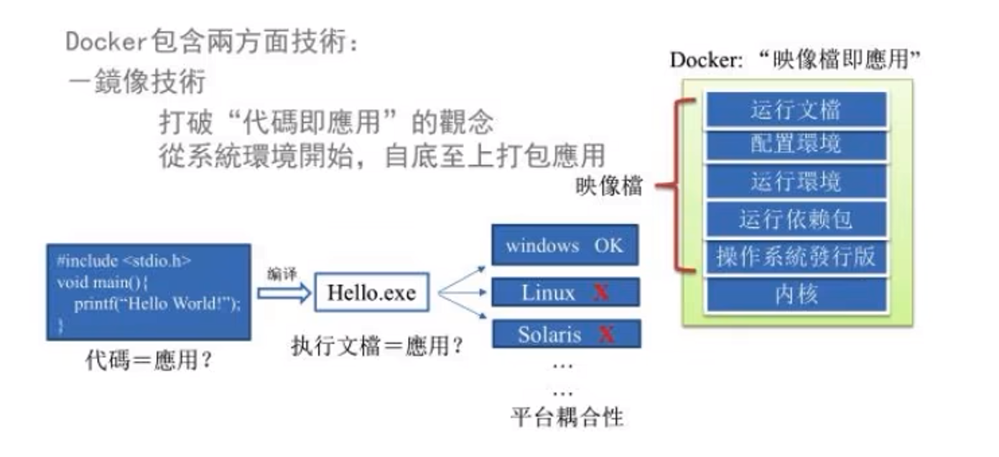
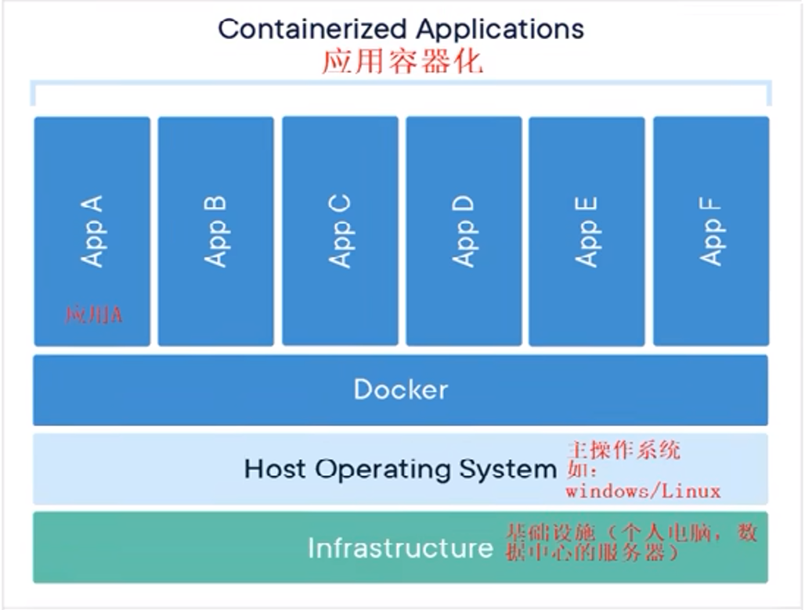
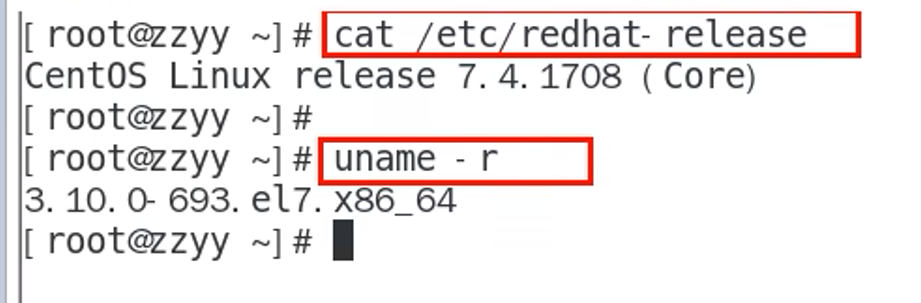

# docker

## 1. Docker简介

[Docker官网](https://www.docker.com/)

+ 

> 解决了 **运行环境和配置问题** 的 **软件容器**  方便做持续集成并有助于整体发布的容器虚拟化技术

### 1.1. 容器与虚拟机比较

#### 1.1.1 传统虚拟机

+ 传统虚拟机技术基于安装在主操作系统上的虚拟机管理系统(如: `VirtualBox`和`VMWare`等)，创建虚拟机(虚拟出各种硬件)，在虚拟机上安装从操作系统，在从操作系统中安装部署各种应用。
+ 缺点
  + 资源占用多
  + 冗余步骤多
  + 启动慢

#### 1.1.2 `linux`容器(`Linux Containers`，缩写为`LXC`)

+ `Linux`容器是与系统其他部分隔离开的一系列进程，从另一个镜像运行，并由该镜像提供支持进程所需的全部文件。容
  器提供的镜像包含了应用的所有依赖项，因而在从开发到测试再到生产的整个过程中，它都具有可移植性和一致性。
+ `Linux`**容器不是模拟一个完整的操作系统而是对进程进行隔离**。有了容器，就可以将软件运行所需的所有资源打包到一个隔离的容器中。**容器与虚拟机不同，不需要捆绑一整套操作系统，**只需要软件工作所需的库资源和设置。系统因此而变得高效轻
  量并保证部署在任何环境中的软件都能始终如一地运行。

> Docker容器是在操作系统层面上实现虚拟化，直接复用本地主机的操作系统，而传统虚拟机则是在硬件层面实现虚拟化。与传统的虚拟机相比，Docker优势体现为启动速度快、占用体积小。

+ 比较了Docker和传统虚拟化方式的不同之处:
  + 传统虚拟机技术是虚拟出一套硬件后，在其上运行一个完整操作系统，在该系统上再运行所需应用进程;
  + 容器内的应用进程直接运行于宿主的内核，容器内没有自己的内核**且也没有进行硬件虚拟**。因此容器要比传统虚拟机更
    为轻便。
  + 每个容器之间互相隔离，每个容器有自己的文件系统，容器之间进程不会相互影响，能区分计算资源。

## 2. `Docker`安装（`CentOS`）

> `Docker`并非是一个通用的容器工具，它依赖于已存在并运行的`Linux`内核环境。
>
> `Docker`实质上是在已经运行的`Linux`下制造了一个隔离的文件环境，因此它执行的效率几乎等同于所部署的`Linux`主机。
>
> 因此,Docker必须部署在`Linux`内核的系统上。如果其他系统想部署`Docke`就必须安装一个虚拟`Linux`环境。

+ 查看自己的内核
+ `uname`命令用于打印当前系统相关信息（内核版本号、硬件架构、主机名称和操作系统类型等）。

### 2.1 Docker的基本组成

1. 镜像（`image`）

   + Docker镜像（`lmage`）就是一个**只读**的模板。镜像可以用来创建Docker容器，**一个镜像可以创建很多容器。**

   + 它也相当于是一个`root`文件系统。比如官方镜像`centos:7`就包含了完整的一套`centos:7`最小系统的 root文件系统。

   + 相当于容器的“源代码”，**`docker`镜像文件类似于Java的类模板，而docker容器实例类似于`java`中new出来的实例对象。**

     + 容器与镜像的关系类似与面向对象编程的中的对象和类

     + | Docker | 面向对象 |
       | ------ | -------- |
       | 容器   | 对象     |
       | 镜像   | 类       |

2. 容器（`container`）

   1. 从面对对象角度
      + Docker利用容器（Container）独立运行的一个或一组应用,应用程序或服务运行在容器里面，容器就类似于一个虚拟化的运行环境，**容器是用镜像创建的运行实例**。就像是Java中的类和实例对象一样，镜像是静态的定义，容器是镜像运行时的实体
        。容器为镜像提供了一个标准的和隔离的运行环境,它可以被启动、开始、停止、删除。每个容器都是相互隔离的、保证安全的平台
   2. 从镜像容器角度
      + **可以把容器看做是一个简易版的Linux环境**(包括root用户权限、进程空间、用户空间和网络空间等）和运行在其中的应用程序。

3. 仓库（`repository`）

   + 是 **集中存放镜像**文件的场所
   + 仓库分为**公开仓库（Public）和私有仓库（Private）**两种形式。
   + 最大的公开仓库是 [Docker Hub](https://hub.docker.com/)，
   + 存放了数量庞大的镜像供用户下载。国内的公开仓库包括阿里云、网易云等

### 2.2 安装过程

+ `yum -y install docker-io`
+ 可使用以下命令，查看 Docker 是否安装成功：
  + `docker version`
+ 若输出了 Docker 的版本号，则说明安装成功了，可通过以下命令启动 Docker 服务：
  + `service docker start`
+ 一旦 Docker 服务启动完毕，我们下面就可以开始使用 Docker 了。

## 3. Docker常用操作

+ 以下是Docker常用操作：

1. 检查Docker版本：`docker version`
2. 查找Docker镜像：`docker search image_name`
3. 下载Docker镜像：`docker pull image_name:tag`
4. 列出本地的Docker镜像：`docker images`
5. 删除本地的Docker镜像：`docker rmi image_name:tag`
6. 运行Docker容器：`docker run [OPTIONS] image_name:tag [COMMAND] [ARG...]` （例如：`docker run -it ubuntu:latest /bin/bash`）
7. 列出正在运行的Docker容器：`docker ps`，列出所有Docker容器：`docker ps -a`
8. 停止Docker容器：`docker stop container_id/container_name`
9. 启动Docker容器：`docker start container_id/container_name`
10. 重启Docker容器：`docker restart container_id/container_name`
11. 进入Docker容器内部：`docker exec -it container_id/container_name /bin/bash`
12. 删除已停止的Docker容器：`docker rm container_id/container_name`
13. 查看Docker容器日志：`docker logs container_id/container_name`
14. 查看Docker容器统计信息：`docker stats container_id/container_name`
15. 导入/导出Docker镜像：`docker save -o image_name.tar image_name:tag` 和 `docker load -i image_name.tar`
16. 在终端中运行以下命令以列出您的容器: `docker ps`

>  以上是Docker常用操作，通过这些命令可以方便地运行和管理Docker容器，并操作Docker镜像。

## 4. Docker 进阶操作

1. 构建自己的镜像：可以使用Dockerfile编写自己的镜像构建文件，然后使用`docker build`命令构建镜像。例如：`docker build -t image_name:tag .`
2. 用Docker Compose管理应用：Docker Compose是Docker提供的一个工具，允许用户在单个文件中定义将运行的多个容器。可以使用Docker Compose创建、启动、停止、重启多个容器。例如：`docker-compose up`。
3. Docker网络管理：可以使用Docker的网络功能来创建和管理网络，允许容器之间进行通信。例如：`docker network create network_name`。
4. Docker数据卷：Docker的数据卷可以实现在容器之间共享数据，通过共享文件来实现容器间通信，且数据卷的数据可持久化保存。例如：`docker run -v host_dir:container_dir image_name`。
5. Docker Swarm集群：Docker Swarm是Docker提供的一个工具，提供自己的容器编排功能，可以在多台主机上执行标准Docker容器的镜像，创建分布式应用。例如：`docker swarm init`。
6. Docker安装和使用应用程序：在Docker容器内安装和使用应用程序，类似于在主机上安装和使用应用程序。例如：`docker run -it --rm -v $PWD:/app -w /app node:latest npm install`。

>  以上是Docker的一些高级操作，可以方便地构建、管理和部署多个容器，实现分布式系统的管理和应用程序集成。
