# go基础学习

## go的相关说明

[go环境下载](https://go.dev/dl/)

### 路径说明

+ GOROOT  表示当前所在源码包所在路径
+ GOPATH  开发者go的项目默认路径

```shell
export GOROOT=/usr/local/go
export GOPATH=/home/go
export PATH=$PATH:$GOROOT/bin:$GOPATG/bin
```

+ 通过 `go version`来检查是否安装成功，和go的版本号。

### go的优势

1. 极 **简单的部署** 方式
   + 可直接编译成机器码
   + 不依赖其他库
   + 直接运行即可部署
2. 静态类型语言
   + 编译的时候检查出来隐藏的大多数问题
3. 语言层面的**并发**
   + 天生的基因支持
   + 充分的利用多核
4. 强大的标准库
   + runtime 系统调度机制（垃圾回收，平均调度……）
   + 高效的GC垃圾回收
   + 丰富的标准库

### 第一个go程序

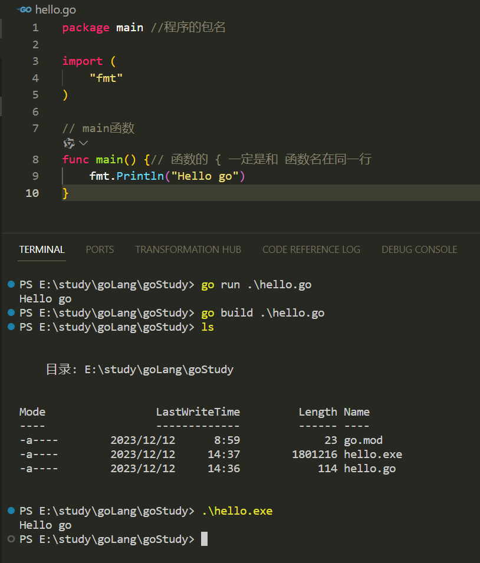

## 基本语法

### 四种变量的声明方式

```go
// 方法一：声明一个变量，默认值是0
var a int
fmt.Println("a = ",a)
fmt.Printf( "type of a = %T\n", a)

// 方法二：声明一个变量，初始化一个值
var a int = 100

// 方法三：在初始化的时候，可以省去数据类型，通过自动匹配当前的变量的数据类型
var c = 100

// 方法四：（常用的方法）省去var关键字，直接自动匹配
e := 100  // 此方法不能声明全局变量

var(
    vv int = 100
    vv bool = true
)
```

### 常量与iota

```go
// 常量（只读属性）
const length int = 10

// const 来定义枚举类型
const(
    // 可以在const（）添加一个关键字 iota ，每行的iota都会累加1，第一行的iota的默认值是0
    // iota只能配合const（）一起使用，iota只有在const进行累加效果
    BEIJIN = iota // iota = 0
    SHNAGHAI	// iota = 1
    SHENZHEN	// iota = 2
)
```

### 函数

#### 函数多返回值

```go
// 返回多个返回值，匿名的
func foo2(a string,b int) (int,int){
    return 666,777
}
// 返回多个返回值，有形参名称的
func foo3(a string,b int)(r1 int,r2 int){
    //给有名称的返回值变量赋值
    r1 = 100
    r2 = 300
    return 
}

func foo4(a string,b int)(r1,r2 int){
    //给有名称的返回值变量赋值
    r1 = 100
    r2 = 300
    return 
}
```

#### import导包路径问题与init方法调用流程

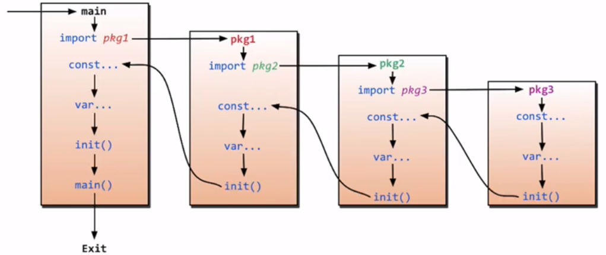

#### import匿名及别名导包方式

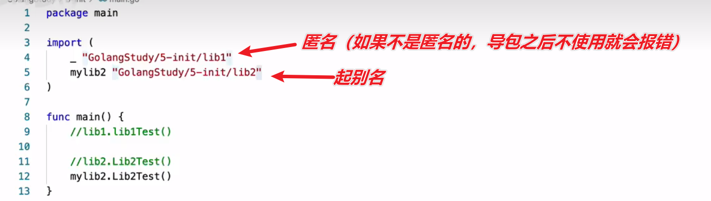

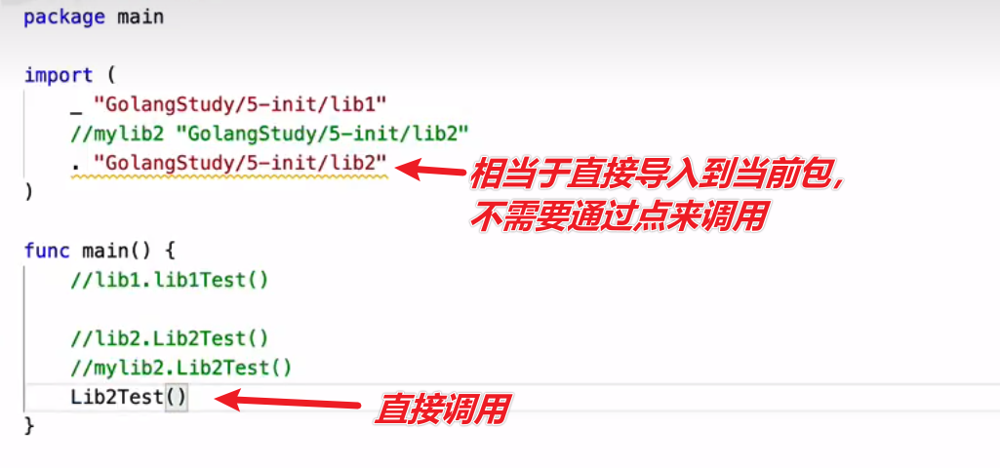

> `.`的这种形式不推荐

### defer 语句的调用顺序

> 在函数结束之前触发，和C++里面的析构函数比较类似

```go
fun main(){
    // 写入defer关键字
    // 按栈的形式入栈，打印的时候是先进后出
    defer fmt.println("main end1")
    defer fmt.println("main end1")
}
```

> defer 和 return——**return先执行，defer后执行**

### 数组和动态数组

> 固定长度数组（值传递）
>
> **属于值拷贝（赋值的时候）**

```go
func main() {// 函数的 { 一定是和 函数名在同一行
	// 固定长度的数组
	var myArray [10]int
	myArray2 := [10]int{1,2,3,4}
	for i := 0; i < 10; i++ {
		fmt.Println(myArray[i])
	}

	for index,value := range myArray2 {
		fmt.Println("index=", index,"value =", value)
	}
	// 查看数组的数据类型
	fmt.Printf("%T\n", myArray)
	fmt.Printf("%T\n", myArray2)
}
```

> 动态数组（引用传递）

```go
func printArry(myArry []int){
	// _表示匿名变量
	for _,value := range myArry {
		fmt.Println(value)
	}

	myArry[0] = 100 // 引用传递可以改变之前的数组的值
}

// main函数
func main() {// 函数的 { 一定是和 函数名在同一行
	myArry := []int{1, 2, 3, 4, 5} //动态数组，切片slice
	printArry(myArry)
	fmt.Println("-------------------")
	for _,value := range myArry {
		fmt.Println(value)
	}
}
```

#### slice的声明方式

```go
func main() {// 函数的 { 一定是和 函数名在同一行
	// 声明slice是一个切片，默认值是1，2，3 长度是3
	slice := []int{1, 2, 3}

	// 声明slice1 是一个切片，但是并没有给slice分配空间
	var slice1 []int
	// 开辟3空间
	slice1 = make([]int, 3)
	slice1[0] = 100

	// 声明slice是一个切片。同时给slice分配空间，3个空间，初始化是0
	var slice2 []int = make([]int, 3)

	// 声明slice是一个切片。同时给slice分配空间，3个空间，初始化是0，通过 ：=  推到slice是一个切片（常用）
	slcie3 := make([]int, 3)

	// 判断一个slice是否为0
	if slice1 == nil {
		fmt.Println("slice1 is nil")
	}
}
```

#### slice切片追加与截取

##### slice追加

```go
func main() {// 函数的 { 一定是和 函数名在同一行
	var number = make([]int,3,5)

	fmt.Printf("len = %d,cap = %d,slice = %v\n",len(number),cap(number),number)
}
```


```go
package main //程序的包名

import (
	"fmt"
)


// main函数
func main() {// 函数的 { 一定是和 函数名在同一行
	var number = make([]int,3,5)

	fmt.Printf("len = %d,cap = %d,slice = %v\n",len(number),cap(number),number) //len = 3,cap = 5,slice = [0 0 0]

	// 向numbers切片追加一个元素1 number len = 4，[0,0,0,1]  cap = 5

	number = append(number,1)

	fmt.Printf("len = %d,cap = %d,slice = %v\n",len(number),cap(number),number) //len = 4,cap = 5,slice = [0 0 0 1]

	// 向numbers切片追加一个元素1 number len = 4，[0,0,0,1,2]  cap = 5
	number = append(number,2)

	fmt.Printf("len = %d,cap = %d,slice = %v\n",len(number),cap(number),number) //len = 5,cap = 5,slice = [0 0 0 1 2]

	// 向一个容量已经满的切片追加一个元素  会开发一个和之前一样的空间
	number = append(number,2)

	fmt.Printf("len = %d,cap = %d,slice = %v\n",len(number),cap(number),number) //len = 6,cap = 12,slice = [0 0 0 1 2 2]

	var number2 = make([]int,3)
	fmt.Printf("len = %d,cap = %d,slice = %v\n",len(number2),cap(number2),number2) //len = 3,cap = 3,slice = [0 0 0]

	number2 = append(number2,1)
	fmt.Printf("len = %d,cap = %d,slice = %v\n",len(number2),cap(number2),number2) //len = 4,cap = 6,slice = [0 0 0 1]
}
```

> 切片的扩容机制，append的时候，如果长度增加后超过容量，则将容量增加2倍

##### slice截取

```go
func main() {
	s := []int{1,2,3}
	s1 := s[0:2] //[1 2]
	fmt.Println(s1)
	s1[0] = 100
	fmt.Println(s1) //[100 2]

	//copy 深拷贝
	s2 := make([]int, 3)
	copy(s2, s)
	fmt.Println(s2) //[100 2 3]
}
```

### map

#### 声明方式

```go
func main() {
	// 声明myMap事一种map类型 key是string value是string 
	var myMap map[string]string
	if myMap == nil {
		fmt.Println("myMap is nil")
	}
	myMap = make(map[string]string,10)

	myMap["name"] = "tom"
	myMap["age"] = "18"
	
	fmt.Println(myMap)

	// 2 声明方式
	map2 := make(map[string]string)
	map2["name"] = "tom"
	map2["age"] = "18"
	fmt.Println(map2)

	// 3 声明方式
	map3 := map[string]string{
		"name":"tom",
		"age":"18",
	}
	fmt.Println(map3)
}
```

#### 使用方式

```go
package main

import "fmt"

func printMap(cityMap map[string]string){
	// cityMap是一个引用传递
	for key, value := range cityMap {
		fmt.Println(key, value)
	}
}

func ChangeMap(cityMap map[string]string){
	cityMap["London"] = "U"
}
func main() {
	cityMap := make(map[string]string)
	// 添加
	cityMap["New York"] = "USA"
	cityMap["London"] = "UK"
	cityMap["Paris"] = "France"

	// 删除
	delete(cityMap, "London")

	//修改
	cityMap["London"] = "UK"
	ChangeMap(cityMap)
	printMap(cityMap)
}
```

### struct 定义和使用

#### 结构体的定义

```go
package main

import "fmt"

// 声明一种新的数据类型myint 是int的别名
type myint int

// 定义一个结构体
type Book struct {
	Title string
	Author string
	Price float64
}

func ChangeBook(book Book) {
	// 传递一个book的副本
	book.Price = 100
}
func changeBook2(book *Book){
	// 指针传递
	book.Price = 200
}

func main(){
	var book1 Book
	book1.Title = "The Go Programming Language"
	book1.Author = "Addison-Wesley"
	book1.Price = 128.95

	ChangeBook(book1)
	fmt.Println(book1)
	//{The Go Programming Language Addison-Wesley 128.95}
	changeBook2(&book1)
	//{The Go Programming Language Addison-Wesley 200}
	fmt.Println(book1)
}
```

## go面向对象

### 面向对象的表示和封装

```go
// 如果类名首字母大写，表示其他也能够访问
type Hero struct {
    // 如果说类的属性首字母大学，表示该属性对外能够访问的，否则的话只能够类的内部访问
    Name string
    Age int
    Weapon string
}
```

> `如果类名首字母大写，表示其他也能够访问`

> `如果说类的属性首字母大学，表示该属性对外能够访问的，否则的话只能够类的内部访问`  (**一定要注意首字母的大小写，因为涉及到你的属性和方法是public还是private**)

```go
package main

import "fmt"

// 如果类名首字母大写，表示其他也能够访问
type Hero struct {
    // 如果说类的属性首字母大学，表示该属性对外能够访问的，否则的话只能够类的内部访问
    Name string
    Age int
    Weapon string
}
// func (this Hero) Show() {
//     fmt.Println("this.Name:", this.Name)
//     fmt.Println("this.Age:", this.Age)
//     fmt.Println("this.Weapon:", this.Weapon)
// }

// func (this Hero) GetName() string {
//     return this.Name
// }

// func (this Hero) setName(name string) {
//     // this是调用该方法的对象的一个副本（浅拷贝）
//     this.Name = name
// }

func (this *Hero) Show() {
    fmt.Println("this.Name:", this.Name)
    fmt.Println("this.Age:", this.Age)
    fmt.Println("this.Weapon:", this.Weapon)
}

func (this *Hero) GetName() string {
    return this.Name
}

func (this *Hero) setName(name string) {
    this.Name = name
}

func main(){
    // 创建一个对象
	hero := Hero{Name: "孙悟空", Age: 18, Weapon: "剑"}

    hero.Show()

    hero.setName("孙悟能")
    hero.Show()
}
```

### 面向对象的继承

```go
package main

import "fmt"

type Human struct {
    Name string
    Age int
}

func (this *Human) Eat() {
    fmt.Println("Human eat")
}

func (this *Human) Walk() {
    fmt.Println("Human walk")
}

type SuperMan struct {
    Human // SuperMan类继承了Human类的方法
    SuperPower string
}
//=====================================
// 重定义父类的方法Eat
func (this *SuperMan) Eat() {
    fmt.Println("SuperMan eat")
}

// 子类的新方法
func (this *SuperMan) Say() {
    fmt.Println("SuperMan say")
}
func (this *SuperMan) Print() {
    fmt.Println(this.Name)
    fmt.Println(this.Age)   
    fmt.Println(this.SuperPower)

}

func main() {
    h := Human{
        Name: "Tom",
        Age: 18,
    }
    h.Eat()
    h.Walk()

    fmt.Println("==========================")
    // 定义一个子类的对象
    // s := SuperMan{Human{"SuperMan",20,},"fly",}
    var s SuperMan 
    s.Name = "SuperMan"
    s.Age = 20
    s.SuperPower = "fly"
    s.Eat() //父类的方法
    s.Walk() // 父类的方法
    s.Say() // 子类的方法
    s.Print()
}
```

### 多态的实现和基本要素

> 基本要素：有一个父类（有接口）；有子类（实现了父类的全部接口）；父类类型的变量（指针）指向（引用）子类的具体数据变量

```go
package main
import "fmt"

// 本质是一个指针
type AnimalIF interface{
    Sleep()
    GetColr() string
    GetType() string
}

// 具体的类  实现了接口（要全部实现）
type Dog struct {
    color string
}
func (this *Dog) Sleep() {
    fmt.Println("dog sleep")
}

func (this *Dog) GetColr() string {
    return this.color
}

func (this *Dog) GetType() string {
    return "dog"
}

// 具体的类
type Cat struct {
    color string
}
func (this *Cat) Sleep() {
    fmt.Println("cat sleep")
}
func (this *Cat) GetColr() string {
    return this.color
}
func (this *Cat) GetType() string {
    return "cat"
}

func showAnimal(animal AnimalIF) {
    fmt.Println(animal.GetType())
    fmt.Println(animal.GetColr())
    animal.Sleep()
}

func main() {
    /*
        var animal AnimalIF // 接口的数据类型，父类指针
        animal = &Dog{"red"}
        animal.Sleep() // 调用的就是Dog的Sleep（）方法   多态现象

        animal = &Cat{"white"}
        animal.Sleep() // 调用的就是Cat的Sleep（）方法  多态现象
    */
    cat := Cat{"white"}
    dog := Dog{"black"}
    showAnimal(&cat)
    showAnimal(&dog)
}
```

#### Interface 空接口万能类型与类型断言机制

> 通用万能类型： `interface{}` 空接口

```go
package main

import "fmt"

// interface{} 是万能数据类型
func myFunc(arg interface{}){
    fmt.Println(arg)
    // interface{} 改如何区分 此时引用的底层数据类型是什么嘛

    // 给 interface{} 提供 “类型断言” 机制
    switch arg.(type) {
    case int:
        fmt.Println("int")
    case string:
        fmt.Println("string")
    case float64:
        fmt.Println("float64")
    default:
        fmt.Println("default")
    }
}

type Book struct {
    Title string
    Author string
    Price float64
}
func main() {
    book := Book{Title: "Go语言", Author: "astaxie", Price: 49.99}
    myFunc(book)
    myFunc(100)
    myFunc("Hello World")
}
```

### 反射

#### 变量内置pair结构详细说明


+ 例一

```go
package main

import (
    "fmt"
    "io"
    "os"
)

func main() {
    var a string
    // pair<statictype:string,value:"aceld">
    a = "aceld"

    // pair<type:string,value:"aceld">
    var allType interface{}
    allType = a

    str,_ := allType.(string)
    fmt.Println(str)

    fmt.Println("=================")

    // tty:pair<type:*os.File,value:"/dev/tty" 文件描述符>
    tty,err := os.OpenFile("/dev/tty",os.O_RDWR,0)
    if err!= nil {
        fmt.Println(err)
        return
    }

    // r:pair<type:,value:>
    var r io.Reader
    // r:pair<type:*os.File,value:"/dev/tty" 文件描述符>
    r = tty
    
    // w:pair<type:,value:>
    var w io.Writer
    // w:pair<type:*os.File,value:"/dev/tty" 文件描述符>
    w  = r.(io.Writer)

    w.Write([]byte("hello world"))
}
```

+ 例二

```go
package main
import "fmt"

type Reader interface {
    ReadBook()
}

type Writer interface {
    WriteBook()
}

// 具体类型
type Book struct{

}
func (this *Book) ReadBook() {
    fmt.Println("read book")
}
func (this *Book) WriteBook() {
    fmt.Println("write book")
}
func main() {
    // b:pair<type:Book,value:book{}地址>
    b := &Book{}
    // r:pair<type,value>
    var r Reader
    // r:pair<type:Book,value:book{}地址>
    r = b
    r.ReadBook()

    var w Writer
    // r:pair<type:Book,value:book{}地址>
    w = r.(Writer)// 此处的断言为什么会成功——因为w r具体的类型type是一致

    w.WriteBook()
}
```

#### 反射reflect机制用法

> ValueOf 用来获取输入参数接口的数据的值，如果接口为空则返回0

> TypeOf 用来动态获取输入参数接口中的值类型，如果接口为空则返回nil

```go
package main 

import (
	"fmt"
	"reflect"
)

func reflectNum(arg interface{}) {
	fmt.Println(reflect.TypeOf(arg))
	fmt.Println(reflect.ValueOf(arg))
}
func main()  {
	var num = float64(100.1234)
	reflectNum(num)
}
```

```go
package main 

import (
	"fmt"
	"reflect"
)

type User struct{
	Id int
	Name string
	Age int
}

func (this User) Call(){
	fmt.Println("this is a method")
	fmt.Println(this)
}

func main(){
	user := User{1,"aceld",18}
	DoFileAndMethod(user)
}


func DoFileAndMethod(input interface{}){
	// 获取input的type
	t := reflect.TypeOf(input)
	fmt.Println(t.Name())
	// 获取input的value
	v := reflect.ValueOf(input)
	fmt.Println(v)
	// 通过type获取里面的字段
	// 1.获取interface的 reflect.Type 通过type得到NumField() 进行遍历
	// 2. 得到每个filed，数据类型
	// 3. 通过filed有一个interface（）方法 得到对应的value

	for i:=0; i<t.NumField(); i++ {
		field := t.Field(i)
		value := v.Field(i).Interface()
		fmt.Println(field.Name, field.Type,value)
	}
	// 通过type获取里面的方法，调用
	fmt.Println(t.NumMethod())
	for i:=0; i<t.NumMethod(); i++ {
		fmt.Println("method")
		m := t.Method(i)
		fmt.Printf("%s:%v\n",m.Name,m.Type)
	}
}
```

#### 结构体标签

```go
package main

import (
    "fmt"
    "reflect"
)

type resum struct {
    Name string `info:"name" doc:"我的名字"`
    Age int `info:"age" doc:"我的年龄"`
}

func findTag(str interface{}){
	t := reflect.TypeOf(str).Elem() //获取所有的元素

	for i:=0; i<t.NumField(); i++ {
		tagInfo := t.Field(i).Tag.Get("info") //第i行
		tagDoc := t.Field(i).Tag.Get("doc")
		fmt.Println("info:",tagInfo,"doc:",tagDoc)
	}
}

func main() {
    var re resum
	findTag(&re)
}
```

#### 结构体标签在json中的应用

> json和结构体的解码和编码的过程

```go
package main

import (
    "fmt"
	"encoding/json"
)

type Movie struct {
	Name string `json:"title`
	Year int `json:"year"`
	Actors []string `json:"actors"`
	Director string `json:"director"`
}

func main() {
	movie := Movie{"xjzhiw",2000,[]string{"张艺谋","李宗盛","王宝强"},"罗伯特·西奥迪尼"}
	// 编码的过程 结构体——》 json
	jsonStr, err := json.Marshal(movie)
	if err != nil {
		fmt.Println("json.Marshal err:", err)
	} else {
		fmt.Println("json.Marshal result:", string(jsonStr))
	}

	// 解码的过程 json——》结构体
	my_movie := Movie{}
	err = json.Unmarshal(jsonStr, &my_movie)
	if err!= nil {
		fmt.Println("json.Unmarshal err:", err)
	} else {
		fmt.Println("json.Unmarshal result:", my_movie)
	}
}
```

## goroutine基本模型和调度设计策略

> 进程/线程的 **数量越多**，切换的 **成本就越大** ，也就越  **浪费**

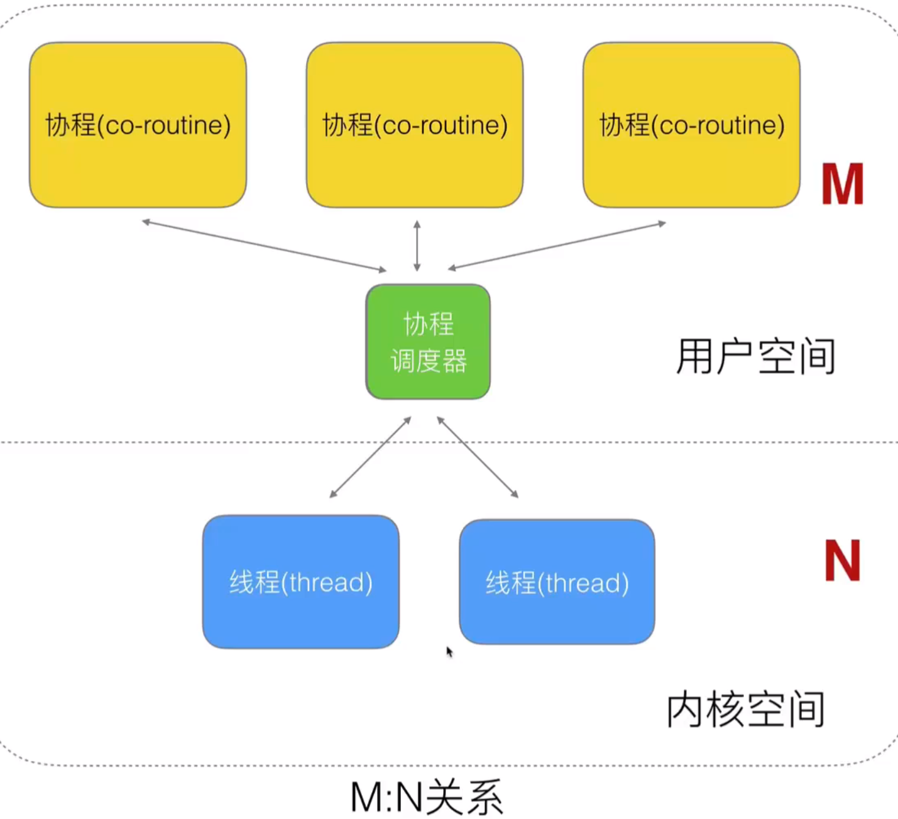

### Golang对协程的处理

+ Golang对早期调度器的处理

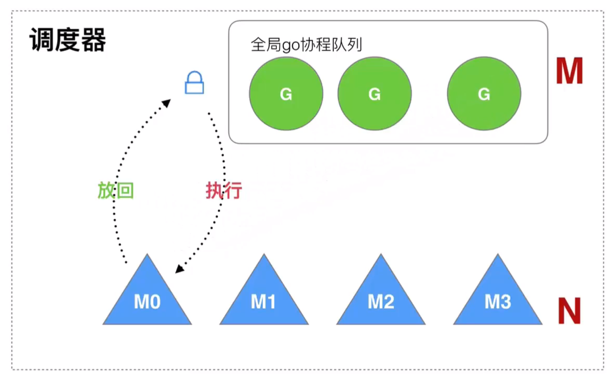

+ 老调度器的几个缺点
  + 创建、销毁、调度G都需要每个M获取锁，这就形成了**激烈的锁竞争**。
  + M转移G会造成**延迟和额外的系统负载**。
  + 系统调用(CPU在M之间的切换)导致频繁的线程阻塞和取消阻塞操作**增加了系统开销**。

#### GMP


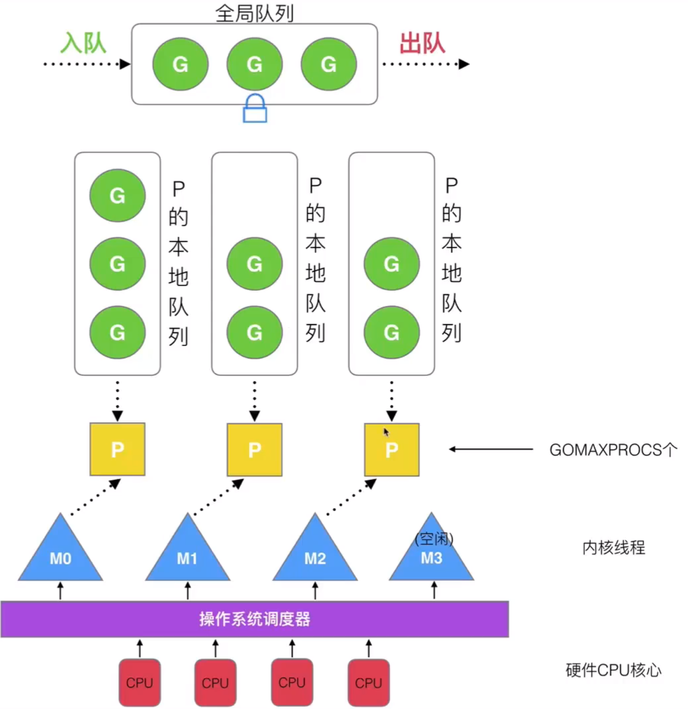

#### 调度器的设计策略

+ 复用线程

  + `work stealing机制`                                                     `hand off机制`

   

+ 利用并行
  + DOMAXPROCS 限定P的个数
  + = CPU核数/2
+ 抢占
  + 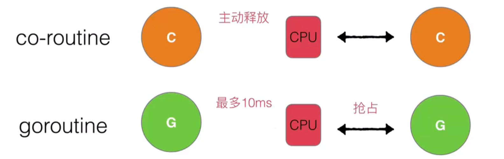
+ 全局G队列
  + 首先去其他
  + 队列去偷如果没有则从全局队列获取

### 创建 `goroutine`

```go
package main
import (
    "fmt"
	"time"
)
// 子goroutine
func newTask(){
	i := 0
	for{
		i++
		fmt.Printf("new Goroutine : i = %d\n",i)
		time.Sleep(1 * time.Second)
	}
}
// 主goroutine
func main() {
	// 创建一个构成，去执行 newTask（）流程
	go newTask()
	i := 0
	for{
		i++
		fmt.Printf("main Goroutine : i = %d\n",i)
		time.Sleep(1 * time.Second)
	}
}
```

```go
package main

import (
    "fmt"
	"time"
	// "runtime"
)

func main() {
	/*
	// 用go创建承载一个形参为空，返回值为空的一个函数
	go func() {
		defer fmt.Println("A.defer")
		func(){ // 匿名函数
			defer fmt.Println("B.defer")
			// 退出当前goroutine
			runtime.Goexit()
			fmt.Println("B")
		}()
		fmt.Println("A")
	}()
	*/

	// 有参数的
	go func(a int,b int) bool{
		fmt.Println("a=",a,"b=",b)
		return true
	}(10,20)
	
	// 死循环
	for {
		time.Sleep(time.Second * 1)
	}
}
```

### `channel` 的基本定义与使用（管道）

+ channel是Go语言中的一个**核心类型**，可以把它看成管道。并发核心单元通过它就可以发送或者接收数据进行通讯，这在一定程度上又进一步降低了编程的难度。

+ channel是一个数据类型，主要用来解决go程的同步问题以及go程之间数据共享（数据传递）的问题。

+ goroutine运行在相同的地址空间，因此访问共享内存必须做好同步。goroutine 奉行通过通信来共享内存，而不是共享内存来通信。

+ 引⽤类型 channel可用于多个 goroutine 通讯。其内部实现了同步，确保并发安全。


#### 定义channel变量

+ 和map类似，channel也一个对应make创建的底层数据结构的**引用**。
+ 当我们复制一个channel或用于函数参数传递时，我们只是拷贝了一个channel引用，因此调用者和被调用者将引用同一个channel对象。和其它的引用类型一样，channel的零值也是`nil`。
+ 定义一个channel时，也需要定义发送到channel的值的类型。channel可以使用内置的make()函数来创建：
+ **chan**是创建channel所需使用的关键字。Type 代表指定channel收发数据的类型。

```go
    make(chan Type)  //等价于make(chan Type, 0)
    make(chan Type, capacity)
```

+ 当我们复制一个channel或用于函数参数传递时，我们只是拷贝了一个channel引用，因此调用者和被调用者将引用同一个channel对象。和其它的引用类型一样，channel的零值也是nil。
+ 当 参数capacity= 0 时，channel 是无缓冲阻塞读写的；当capacity > 0 时，channel 有缓冲、是非阻塞的，直到写满 capacity个元素才阻塞写入。
+ channel非常像生活中的管道，一边可以存放东西，另一边可以取出东西。channel通过操作符 <- 来接收和发送数据，发送和接收数据语法：

```go
    channel <- value      //发送value到channel
    <-channel             //接收并将其丢弃
    x := <-channel        //从channel中接收数据，并赋值给x
    x, ok := <-channel    //功能同上，同时检查通道是否已关闭或者是否为空
```

+ **默认情况下，channel接收和发送数据都是阻塞的，**除非另一端已经准备好，这样就使得goroutine同步变的更加的简单，而**不需要显式的lock。**

```go
package main
 
import (
    "fmt"
)
func main() {
    c := make(chan int)
 
    go func() {
        defer fmt.Println("子go程结束")
 
        fmt.Println("子go程正在运行……")
 
        c <- 666 //666发送到c
    }()
 
    num := <-c //从c中接收数据，并赋值给num
 
    fmt.Println("num = ", num)
    fmt.Println("main go程结束")
}
```

+ 程序运行结果：

```txt
goroutine开始
goroutine结束
100
main函数结束
```

#### 无缓冲的channel

+ 无缓冲的通道（unbuffered channel）是指在接收前没有能力保存任何数据值的通道。

+ 这种类型的通道要求发送goroutine和接收goroutine同时准备好，才能完成发送和接收操作。否则，通道会导致先执行发送或接收操作的 goroutine 阻塞等待。

+ 这种对通道进行发送和接收的交互行为本身就是同步的。其中任意一个操作都无法离开另一个操作单独存在。

+ **阻塞：**由于某种原因数据没有到达，当前go程（线程）持续处于等待状态，直到条件满足，才解除阻塞。

+ **同步：**在两个或多个go程（线程）间，保持数据内容一致性的机制。

+ 下图展示两个 goroutine 如何利用无缓冲的通道来共享一个值：

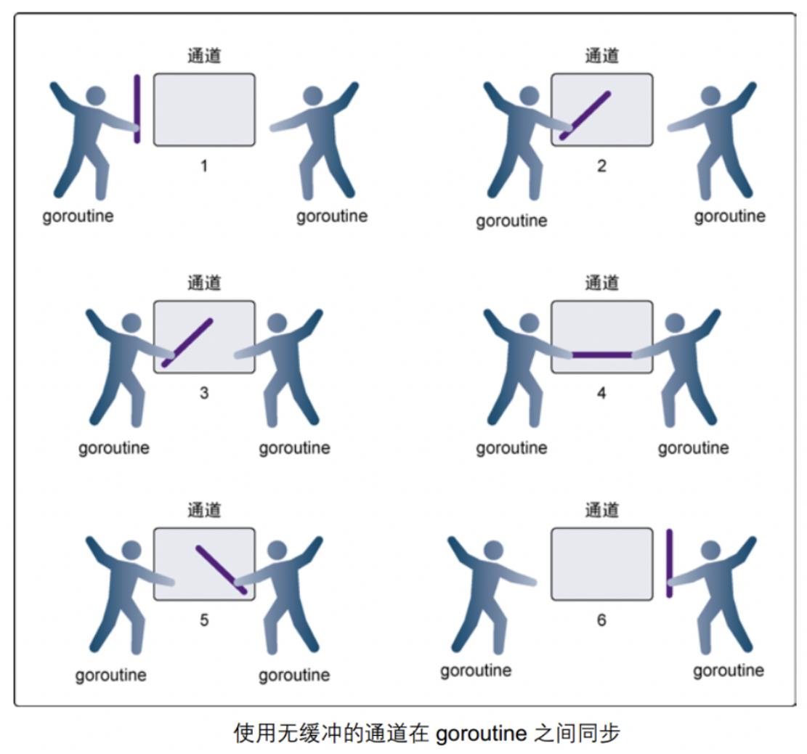

-  在第 1 步，两个 goroutine 都到达通道，但哪个都没有开始执行发送或者接收。 
-  在第 2 步，左侧的 goroutine 将它的手伸进了通道，这模拟了向通道发送数据的行为。这时，这个 goroutine 会在通道中被锁住，直到交换完成。 
-  在第 3 步，右侧的 goroutine 将它的手放入通道，这模拟了从通道里接收数据。这个 goroutine 一样也会在通道中被锁住，直到交换完成。 
-  在第 4 步和第 5 步，进行交换，并最终，在第 6 步，两个 goroutine 都将它们的手从通道里拿出来，这模拟了被锁住的 goroutine 得到释放。两个 goroutine 现在都可以去做其他事情了。 

无缓冲的channel创建格式：

```go
    make(chan Type)   //等价于make(chan Type, 0)
```

> 如果没有指定缓冲区容量，那么该通道就是同步的，因此会阻塞到发送者准备好发送和接收者准备好接收。

```go
package main
 
import (
    "fmt"
    "time"
)
 
func main() {
    c := make(chan int, 0) //创建无缓冲的通道 c 
 
    //内置函数 len 返回未被读取的缓冲元素数量，cap 返回缓冲区大小
    fmt.Printf("len(c)=%d, cap(c)=%d\n", len(c), cap(c))
 
    go func() {
        defer fmt.Println("子go程结束")
 
        for i := 0; i < 3; i++ {
            c <- i
            fmt.Printf("子go程正在运行[%d]: len(c)=%d, cap(c)=%d\n", i, len(c), cap(c))
        }
    }()
 
    time.Sleep(2 * time.Second) //延时2s
 
    for i := 0; i < 3; i++ {
        num := <-c //从c中接收数据，并赋值给num
        fmt.Println("num = ", num)
    }
 
    fmt.Println("main进程结束")
}
```

程序运行结果：

```txt
len(c)=0, cap(c)=0
子go程正在运行[0]: len(c)=0, cap(c)=0
num =  0
num =  1
子go程正在运行[1]: len(c)=0, cap(c)=0
子go程正在运行[2]: len(c)=0, cap(c)=0
子go程结束
num =  2
main进程结束
```

#### 有缓冲的channel

+ 有缓冲的通道（buffered channel）是一种在被接收前能存储一个或者多个数据值的通道。

+ 这种类型的通道并不强制要求 goroutine 之间必须同时完成发送和接收。通道会阻塞发送和接收动作的条件也不同。

+ 只有通道中没有要接收的值时，接收动作才会阻塞。

+ 只有通道没有可用缓冲区容纳被发送的值时，发送动作才会阻塞。

+ 这导致有缓冲的通道和无缓冲的通道之间的一个很大的不同：无缓冲的通道保证进行发送和接收的 goroutine 会在同一时间进行数据交换；有缓冲的通道没有这种保证。

示例图如下：

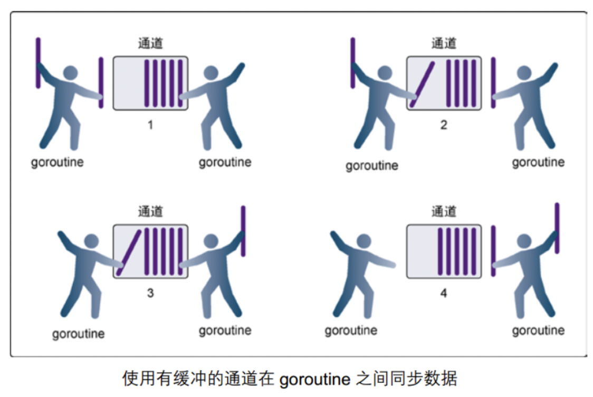

-  在第 1 步，右侧的 goroutine 正在从通道接收一个值。 
-  在第 2 步，右侧的这个 goroutine独立完成了接收值的动作，而左侧的 goroutine 正在发送一个新值到通道里。 
-  在第 3 步，左侧的goroutine 还在向通道发送新值，而右侧的 goroutine 正在从通道接收另外一个值。这个步骤里的两个操作既不是同步的，也不会互相阻塞。 
-  最后，在第 4 步，所有的发送和接收都完成，而通道里还有几个值，也有一些空间可以存更多的值。 

> + 特点
>   + 当channel已经满，再向里面写数据，就会阻塞
>   + 当channel为空，从里面取数据也会阻塞

有缓冲的channel创建格式：

```go
    make(chan Type, capacity)
```

+ 如果给定了一个缓冲区容量，通道就是异步的。只要缓冲区有未使用空间用于发送数据，或还包含可以接收的数据，那么其通信就会无阻塞地进行。

+ 借助函数 **len(ch)** 求取缓冲区中剩余元素个数， **cap(ch)** 求取缓冲区元素容量大小。

```go
func main() {
    c := make(chan int, 3) //带缓冲的通道
 
    //内置函数 len 返回未被读取的缓冲元素数量， cap 返回缓冲区大小
    fmt.Printf("len(c)=%d, cap(c)=%d\n", len(c), cap(c))
 
    go func() {
        defer fmt.Println("子go程结束")
 
        for i := 0; i < 3; i++ {
            c <- i
            fmt.Printf("子go程正在运行[%d]: len(c)=%d, cap(c)=%d\n", i, len(c), cap(c))
        }
    }()
 
    time.Sleep(2 * time.Second) //延时2s
    for i := 0; i < 3; i++ {
        num := <-c //从c中接收数据，并赋值给num
        fmt.Println("num = ", num)
    }
    fmt.Println("main进程结束")
}
```

程序运行结果：

```txt
len(c)=0, cap(c)=3
子go程正在运行[0]: len(c)=1, cap(c)=3
子go程正在运行[1]: len(c)=2, cap(c)=3
子go程正在运行[2]: len(c)=3, cap(c)=3
子go程结束
num =  0
num =  1
num =  2
main进程结束
```

#### 关闭channel

> 如果发送者知道，没有更多的值需要发送到channel的话，那么让接收者也能及时知道没有多余的值可接收将是有用的，因为接收者可以停止不必要的接收等待。这可以通过内置的close函数来关闭channel实现。

```go
package main
 
import (
    "fmt"
)
 
func main() {
    c := make(chan int)
 
    go func() {
        for i := 0; i < 5; i++ {
            c <- i
        }
        close(c)
    }()
 
    for {
        //ok为true说明channel没有关闭，为false说明管道已经关闭
        if data, ok := <-c; ok {
            fmt.Println(data)
        } else {
            break
        }
    }
 
    fmt.Println("Finished")
}
```

程序运行结果：

```txt
0
1
2
3
4
Finished
```

**注意：**

+  channel不像文件一样需要经常去关闭，只有当你确实没有任何发送数据了，或者你想显式的结束range循环之类的，才去关闭channel；

+ 关闭channel后，无法向channel 再发送数据(引发 panic 错误后导致接收立即返回零值)；

+ 关闭channel后，可以继续从channel接收数据；

+ 对于nil channel，无论收发都会被阻塞。

>  可以使用 **range** 来迭代不断操作channel：

```go
package main
 
import (
    "fmt"
)
 
func main() {
    c := make(chan int)
 
    go func() {
        for i := 0; i < 5; i++ {
            c <- i
        }
        close(c)
    }()
 
    for data := range c {
        fmt.Println(data)
    }
    fmt.Println("Finished")
}
```

运行结果：

```txt
0
1
2
3
4
Finished
```

#### 单向channel及应用

+ 默认情况下，`通道channel是双向的`，也就是，既可以往里面发送数据也可以同里面接收数据。

+ 但是，我们经常见一个通道作为参数进行传递而只希望对方是单向使用的，要么只让它发送数据，要么只让它接收数据，这时候我们可以指定通道的方向。

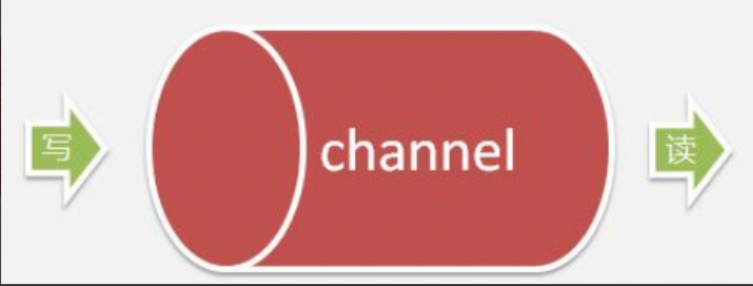

> 单向channel变量的声明非常简单，如下：

```go
var ch1 chan int       // ch1是一个正常的channel，是双向的
var ch2 chan<- float64 // ch2是单向channel，只用于写float64数据
var ch3 <-chan int     // ch3是单向channel，只用于读int数据
```

+ `chan<-` 表示数据进入管道，要把数据写进管道，对于调用者就是输出。

+ `<-chan` 表示数据从管道出来，对于调用者就是得到管道的数据，当然就是输入。

+ 可以将 channel 隐式转换为单向队列，只收或只发，不能将单向 channel 转换为普通 channel：

```go
    c := make(chan int, 3)
    var send chan<- int = c // send-only
    var recv <-chan int = c // receive-only
    send <- 1
    //<-send //invalid operation: <-send (receive from send-only type chan<- int)
    <-recv
    //recv <- 2 //invalid operation: recv <- 2 (send to receive-only type <-chan int)
 
    //不能将单向 channel 转换为普通 channel
    d1 := (chan int)(send) //cannot convert send (type chan<- int) to type chan int
    d2 := (chan int)(recv) //cannot convert recv (type <-chan int) to type chan int
```

```go
//   chan<- //只写
func counter(out chan<- int) {
    defer close(out)
    for i := 0; i < 5; i++ {
        out <- i //如果对方不读 会阻塞
    }
}
 
//   <-chan //只读
func printer(in <-chan int) {
    for num := range in {
        fmt.Println(num)
    }
}
 
func main() {
    c := make(chan int) //   chan   //读写
 
    go counter(c) //生产者
    printer(c)    //消费者
 
    fmt.Println("done")
}
```

