# 多线程

### 1 线程创建

> 1.1 继承Thread类

+ 自定义线程类继承Thread类
+ 重写run( )方法，编写线程执行体
+ 创建线程对象，调用start( )方法启动线程

```java
//创建线程方式1 ：继承Thread类，重写run()方法，调用start开启线程
// 总结：  线程开启不一定立即执行，由CPU调度执行
public class TestThread01 extends Thread{
    @Override
    public void run() {
        //run方法线程体
        for (int i = 0; i < 20 ; i++){
            System.out.println("我在看代码" + i);
        }
    }

    public static void main(String[] args) {
        //main 线程，主线程

        //创建一个线程对象
        TestThread01 testThread01 = new TestThread01();

        //调用start()方法开启线程
        testThread01.start();

        for (int i = 0; i < 2000 ; i++){
            System.out.println("我在学习多线程" + i);
        }
    }

}
```

+ 网图下载实例

```java
//练习Thread, 实现多线程同步下载图片
public class TestThread2 extends Thread{
    private String url;  //网络图片地址
    private String name;  //保存的文件名

    public TestThread2(String url,String name){
        this.url = url;
        this.name = name;

    }

//下载图片线程的执行体
    @Override
    public void run() {
        WebDownLoader webDownLoader = new WebDownLoader();
        webDownLoader.downloader(url,name);
        System.out.println("下载了文件名为" + name);
    }

    public static void main(String[] args) {
        TestThread2 t1 = new TestThread2("https://img1.baidu.com/it/u=1734138103,3403884663&fm=253&fmt=auto?w=801&h=800","约克夏1.jpg");
        TestThread2 t2 = new TestThread2("https://img0.baidu.com/it/u=154291885,270874090&fm=253&fmt=auto&app=138&f=JPEG?w=500&h=500","约克夏2.jpg");
        TestThread2 t3 = new TestThread2("https://img1.baidu.com/it/u=1574610124,2792721127&fm=253&fmt=auto&app=138&f=JPEG?w=500&h=750","约克夏3.jpg");
        //先下载t1
        t1.start();
        //然后是t2
        t2.start();
        //最后是t3
        t3.start();
        //实际是无序的
    }
}

//下载器
class WebDownLoader{
    //下载方法
    public void downloader(String url,String name){
        try {
            FileUtils.copyURLToFile(new URL(url),new File(name));
        } catch (IOException e) {
            e.printStackTrace();
            System.out.println("IO异常，downloader方法出现问题");
        }
    }
}
```


> 1.2 实现Runnable接口

+ 定义MyRunnable类实现Runnable接口
+ 实现run( )方法，编写线程执行体
+ 创建线程对象，调用start( )方法启动线程

```java
//创建线程方式2： 实现runnable接口，重写run方法，执行线程需要丢入runnable接口实现类，调用start方法
public class TestThread3 implements Runnable{
    @Override
    public void run() {
        //run方法线程体
        for (int i = 0; i < 20 ; i++){
            System.out.println("我在看代码" + i);
        }
    }

    public static void main(String[] args) {
        //创建runnable接口得实现类对象
        TestThread3 testThread3 = new TestThread3();

        //创建线程对象，通过线程对象来开启我们得线程，代理
        Thread thread = new Thread(testThread3);
        thread.start();
       // new Thread(testThread3).start();


        for (int i = 0; i < 2000 ; i++){
            System.out.println("我在学习多线程" + i);
        }

    }
}
```


+ **`继承Thread类和实现Runnable接口 二者区别`**

  + 继承Thread类

    + 子类继承Thread类具有多线程能力
    + **启动线程**：子类对象.start( )
    + 不建议使用：避免OOP单继承局限性

  + 实现Runnable接口

    + 实现接口Runnable具有多线程能力

    + 启动线程：传入目标对象+Thread对象.start( )

    + 推荐使用：避免单继承局限性，灵活方便，方便同一个对象被多个线程使用

      如下图

      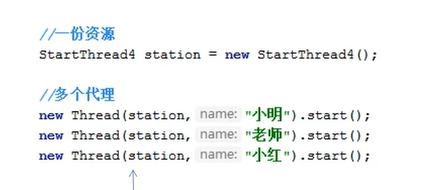

> 1.3 实现Callable接口（了解）

+ 实现Callable接口，需要返回时类型
+ 重写call方法，需要抛出异常
+ 创建目标对象
+ 创建执行服务：

```java
 ExecutorService ser = Executors.newFixedThreadPool(3);
```

+ 提交执行

```java
// t1 t2 t3 为创建的3个线程
Future<Boolean> R1 = ser.submit(t1);
Future<Boolean> R2 = ser.submit(t2);
Future<Boolean> R3 = ser.submit(t3);
```

+ 获取结果

```java
boolean rs1 = R1.get();
boolean rs2 = R2.get();
boolean rs3 = R3.get();
System.out.println(rs1);
System.out.println(rs2);
System.out.println(rs3);
```

+ 关闭服务

```java
ser.shutdownNow();
```

Callable 的好处：

1 可以定义返回值

2 可以抛出异常

### 2 案例：多线程操作同一个对象

```java
//多个线程同时操作同一个对象
//买火车票例子

//发现问题：多个线程操作同一个对象资源情况下，线程不安全，数据紊乱
public class TestThread05 implements Runnable{
    private int ticketNums = 10;

    @Override
    public void run() {
        while (true){

            if (ticketNums<=0){
                break;
            }
            //模拟延时
            try {
                Thread.sleep(200);
            } catch (InterruptedException e) {
                throw new RuntimeException(e);
            }
            System.out.println(Thread.currentThread().getName()+"拿到了第"+ ticketNums-- +"张票");
        }
    }

    public static void main(String[] args) {
        TestThread05 testThread05 = new TestThread05();
        new Thread(testThread05,"小米").start();
        new Thread(testThread05,"大周").start();
        new Thread(testThread05,"小刘").start();
    }
}
```

运行结果显示不同人抢到了同一张票，这是不合理的，执行结果如下

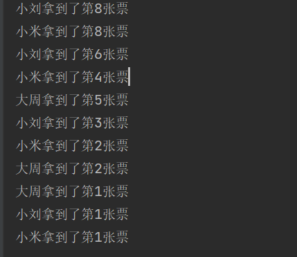

==多个线程操作同一个对象资源情况下，线程不安全，数据紊乱==

也就是并发需要解决的问题

### 3 案例：龟兔赛跑

```java
//龟兔赛跑
public class TestThread06 implements Runnable{
    //胜利者
    private static String winner;

    @Override
    public void run() {
        for (int i = 1; i <= 100; i ++){

            //模拟兔子休息
            if (Thread.currentThread().getName().equals("兔子")&&i%10==0){
                try {
                    Thread.sleep(10);
                } catch (InterruptedException e) {
                    throw new RuntimeException(e);
                }
            }
            //判断比赛是否结束
            boolean flag = gameOver(i);
            if (flag){
                break;
            }
            System.out.println(Thread.currentThread().getName()+"-->跑了"+i+"步");
        }
    }

    //判断是否完成比赛
    private boolean gameOver(int steps){
        //判断是否有胜利者
        if(winner != null){ //已经存在胜利者了
            return true;
        }{
            if (steps==100){
                winner = Thread.currentThread().getName();
                System.out.println("winner is "+ winner);
                return true;
            }
        }
        return false;
    }

    public static void main(String[] args) {
        TestThread06 race = new TestThread06();

        new Thread(race,"兔子").start();
        new Thread(race,"乌龟").start();
    }
}
```

### 4 静态代理模式

> 婚庆公司代理案例

```java
//总结 ：静态代理模式中  真实对象和代理对象都要实现同一个接口
//代理对象要代理真实角色(You)


//好处：代理对象可以做很多真实对象做不了的事情
//真实对象专注做自己的事情
public class StaticProxy {
    public static void main(String[] args) {
        //new Thread(()-> System.out.println("我爱你")).start();
        //Thread代理了Runnable接口，线程中的start()就相当于下面的HappyMary()

        //new WeddingCompany(new You()).HappyMary();   //等于下面代码
        /*You you = new You();
        you.HappyMary();*/
        WeddingCompany weddingCompany = new WeddingCompany(new You());
        weddingCompany.HappyMary();

    }

}

interface Marry{
    void HappyMary();
}

//真实角色
class You implements Marry{
    @Override
    public void HappyMary() {
        System.out.println("秦老师要结婚，开心");
    }
}

//代理角色
class WeddingCompany implements Marry{
    //代理谁 --》》真实目标角色
    private Marry target;

    public WeddingCompany(Marry target){
        this.target = target;
    }
    @Override
    public void HappyMary() {
        before();
        this.target.HappyMary();  //这里是真实对象You
        after();

    }

    private void after() {
        System.out.println("结婚之后收尾款");
    }

    private void before() {
        System.out.println("结婚之前，布置现场");
    }
}
```

YOU是真实角色，婚庆公司代理角色，代理对象可以做很多真实对象做不了的事情，真实对象可以专注做自己的事情，如代码中体现的，办婚礼HappyMary()交给婚庆公司，结婚主体YOU真实对象。

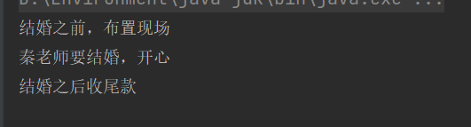

而在线程中，Thread就是代理，实现了（Runnable接口），调用的start（）方法，好比婚庆帮忙举办HappyMary（）。

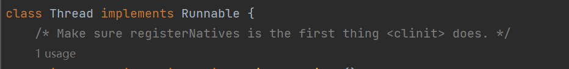

### 5 Lamda表达式

> 为什么要用Lamda表达式

+ 避免匿名内部类定义过多
+ 代码简介
+ 去掉无意义代码，只留下核心逻辑 （习惯就好）


==函数式接口==：任何接口，如果只包含唯一一个抽象方法，那么它就是一个函数式接口

```java
public interface Runnable{
		public abstract void run();
}
```

​					对于函数式接口，可以通过lambda表达式来创建该接口对象


```java
//推导lambda表达式
public class TestLambda1 {

    //3 静态内部类
    static class Like2 implements ILike{
        @Override
        public void lambda() {
            System.out.println("I Like lambda2");
        }
    }

    public static void main(String[] args) {
        ILike like = new Like();
        like.lambda();

        like = new Like2();
        like.lambda();


        //4 局部内部类
        class Like3 implements ILike{
            @Override
            public void lambda() {
                System.out.println("I Like lambda3");
            }
        }
        like = new Like3();
        like.lambda();

        //5 匿名内部类，没有类的名称，必须借助接口或者父类
        like = new ILike() {
            @Override
            public void lambda() {
                System.out.println("I like lambda4");
            }
        };
        like.lambda();

        //6 用lambda简化(只有一个方法)
        like = ()->{
                System.out.println("I like lambda5");
            };
        like.lambda();

    }
}
//1 定义一个函数式接口
interface ILike{
    void lambda();
}

//2 实现类
class Like implements ILike{
    @Override
    public void lambda() {
        System.out.println("I Like lambda");
    }
}
```

==NOTE==：带参数的方法用lambda简化方法，还可以再简化：1.简化类型（int String...不用写明） 2.简化括号 3.简化花括号

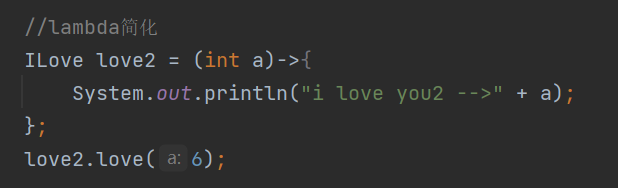

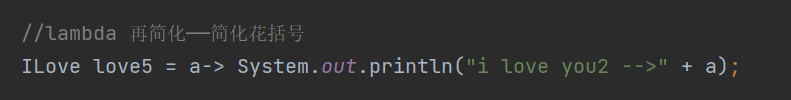

==总结==

`lambda表达式只能有一行代码的情况下才能简化为一行，如果有多行，就用代码块包裹——花括号不能省`

`lambda表达式前提是接口为函数式接口`

`多个参数也可以去掉参数类型，要去掉就都去掉，多个参数必须加上括号`


### 6 线程状态


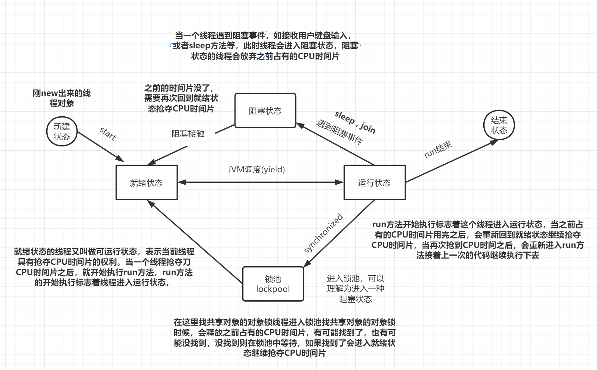

### 7 停止线程

+ 不推荐使用jdk提供的stop( ) destroy( ) 方法 ——已废弃
+ 推荐线程自己停下来 ——标志位
+ 建议使用一个标志位进行终止变量，当flag = false，则终止线程运行。

```java
//建议线程正常停止——》利用次数，不建议死循环
//建议使用标志位————》设置一个标志位
//不使用stop或者destroy等过时或者jdk不建议使用的方法
public class TestStop implements Runnable{

    //1 设置一个标志位
    private boolean flag = true;
    @Override
    public void run() {
        int i = 0 ;
        while (flag){
            System.out.println("run ... Thread" + i++);
        }

    }

    //设置一个公开的方法停止线程，转换标志位
    public void stop(){
        this.flag = false;
    }

    public static void main(String[] args) {
        TestStop testStop = new TestStop();
        new Thread(testStop).start();

        for (int i = 0;i < 1000;i++){
            System.out.println("main" + i);
            if (i==900){
                //调用stop方法，切换标志位，让线程停止
                testStop.stop();
                System.out.println("线程该停止了");
            }
        }

    }
}
```

### 8 线程休眠

|             方法名             |          作用           |
| :----------------------------: | :---------------------: |
| static void sleep(long millis) | 让当前线程休眠millins秒 |

+ sleep(时间)，参数时间指定当前线程阻塞的毫秒数，让当前线程进入“阻塞状态”，**放弃占有CPU时间片**，让给其他线程使用
+ sleep存在异常InterruptedException
+ sleep时间达到后线程进入就绪状态
+ sleep可以模拟网络延时，倒计时等
+ 每一个对象都有一个锁，sleep不会释放锁

> 买火车票实例——模拟延时

```java
public class TestSleep implements Runnable{
    //票数
    private int ticketNums = 10;

    @Override
    public void run() {
        while (true){

            if (ticketNums<=0){
                break;
            }
            //模拟延时
            try {
                Thread.sleep(200);
            } catch (InterruptedException e) {
                e.printStackTrace();
            }
            System.out.println(Thread.currentThread().getName()+"拿到了第"+ ticketNums-- +"张票");
        }
    }

    public static void main(String[] args) {
        TestSleep ticket = new TestSleep();
        new Thread(ticket,"小米").start();
        new Thread(ticket,"大周").start();
        new Thread(ticket,"小刘").start();
    }
}
```


+ ==不模拟延时效果==

  

+ ==模拟延时效果==


​	模拟网络延时 可以放大问题的发生性

+ ==模拟倒计时==

```java
public class TestSleep2 {
    public static void main(String[] args) {
        try {
            tenDown();
        } catch (InterruptedException e) {
            e.printStackTrace();
        }
    }
    //模拟倒计时
    public static void tenDown() throws InterruptedException {
        int num = 10;
        while(true){
            Thread.sleep(1000);
            System.out.println(num--);
            if (num < 0 ){
                break;
            }
        }
    }
}
```

+ ==打印系统当前时间==

```java
public class TestSleep3 {
    public static void main(String[] args) {
        //打印当前系统时间
        Date startTime = new Date(System.currentTimeMillis()); //获取系统当前时间

        while (true){
            try {
                Thread.sleep(1000);
            } catch (InterruptedException e) {
                e.printStackTrace();
            }
            System.out.println(new SimpleDateFormat("HH:mm:ss").format(startTime));
            startTime = new Date(System.currentTimeMillis()); //更新当前时间
        }

    }
    //模拟倒计时
    public static void tenDown() throws InterruptedException {
        int num = 10;
        while(true){
            Thread.sleep(1000);
            System.out.println(num--);
            if (num < 0 ){
                break;
            }
        }
    }
}
```

### 9 线程礼让

| 方法名               | 作用                                               |
| -------------------- | -------------------------------------------------- |
| static void yield( ) | 让位方法，当前线程暂停，回到就绪状态，让给其它线程 |

+ yield（）方法不是阻塞方法，让当前线程让位，让给其它线程使用
+ 会让当前线程从“运行状态”回到“就绪状态”
+ 让CPU重新调度，当前线程仍有可能抢到时间片到运行状态

```java
//礼让不一定成功，看CPU心情
public class TestYield {
    public static void main(String[] args) {
        MyYield myYield = new MyYield();
        new Thread(myYield,"a").start();
        new Thread(myYield,"b").start();
    }
}

class MyYield implements Runnable{
    @Override
    public void run() {
        System.out.println(Thread.currentThread().getName()+"线程开始执行");
        Thread.yield();
        System.out.println(Thread.currentThread().getName()+"线程停止执行");
    }
}
```


### 10 JOIN 线程强制执行

| 方法         | 作用                                                         |
| ------------ | ------------------------------------------------------------ |
| void join( ) | 将一个线程合并到当前线程中，当前线程受阻塞，加入的线程执行直到结束 |

```java
//测试join方法，想象成插队
public class TestJoin implements Runnable{
    @Override
    public void run() {
        for (int i = 0;i<1000;i++){
            System.out.println("线程vip来了"+ i);
        }
    }

    public static void main(String[] args) throws InterruptedException {
        TestJoin testJoin = new TestJoin();
        Thread thread = new Thread(testJoin);
        thread.start();

        //主线程
        for (int i = 0; i<500; i++){
            if(i == 200){
                thread.join(); //插队
            }
            System.out.println("main" + i);
        }

    }
}
```

### 11 线程状态观测

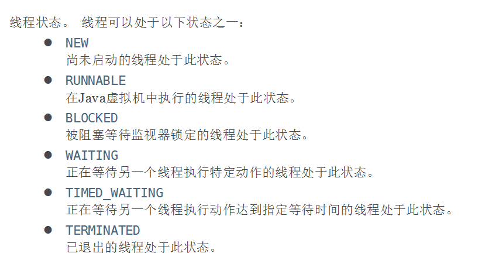

>  如何检测？

```java
//观察测试线程的状态
public class TestState {
    public static void main(String[] args) throws InterruptedException {
        Thread thread = new Thread(() ->{
            for (int i = 0; i < 5; i++) {
                try {
                    Thread.sleep(1000);
                } catch (InterruptedException e) {
                    e.printStackTrace();
                }
            }
            System.out.println("/////");
        });

        //观察状态
        Thread.State state = thread.getState();
        System.out.println(state); //NEW

        //观察启动后
        thread.start();  //启动线程、
        state = thread.getState();
        System.out.println(state);   //Run

        while (state!= Thread.State.TERMINATED){ //只要线程不终止，就一直输出状态
            Thread.sleep(100);
            state = thread.getState(); //更新线程状态
            System.out.println(state); //输出状态

        }
        // thread.start();  此行代码报错，死亡后的线程不能再启动了

    }
}
```

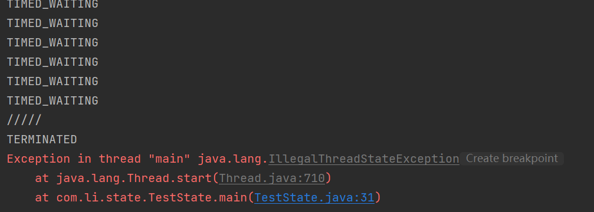

==NOTE==：进程死亡“TERMINATED”后，不能再启动，否则会报错


### 12 线程的优先级

Java提供一个线程调度器来监控程序中启动后进入就绪状态的所有线程，线程调度器**按照优先级**决定应该调度哪个线程来执行。

线程的优先级用数字表示，范围从**1—10**

| Thread.MIN_PRIORITY = 1      | 最低优先级1      |
| ---------------------------- | ---------------- |
| **Thread.MAX_PRIORITY = 10** | **最高优先级10** |
| **Thread.NORM_PRIORITY = 5** | **默认优先级5**  |

| 方法                              | 作用           |
| --------------------------------- | -------------- |
| int getPriority( )                | 获得线程优先级 |
| void setPriority(int newPriority) | 设置线程优先级 |

```java
public class TestPriority {
    public static void main(String[] args) {
        //主线程默认优先级
        System.out.println(Thread.currentThread().getName()+"-->"+Thread.currentThread().getPriority());
        MyPriority myPriority = new MyPriority();
        Thread t1 = new Thread(myPriority);
        Thread t2 = new Thread(myPriority);
        Thread t3 = new Thread(myPriority);
        Thread t4 = new Thread(myPriority);
        Thread t5 = new Thread(myPriority);
        Thread t6 = new Thread(myPriority);

        //先设置优先级，再启动


        t2.setPriority(1);
        t3.setPriority(4);
        t4.setPriority(Thread.MAX_PRIORITY);  //Max_PRIORITY = 10
        t5.setPriority(8);
        t6.setPriority(7);
        t1.start();
        t2.start();
        t3.start();
        t4.start();
        t5.start();
        t6.start();

    }

}
class MyPriority implements Runnable{
    @Override
    public void run() {
        System.out.println(Thread.currentThread().getName()+"-->"+Thread.currentThread().getPriority());
    }
}
```

==优先级较高的，只是抢到的CPU时间片相对多一些，大概率方向更偏向于优先级比较高的，所以并不是优先级低就不会被调用了==


### 13 守护线程 (daemon)

Java中线程分为两大类：

+ 用户线程
+ 守护线程（后台线程）
  + 最具代表性的就是 **垃圾回收线程**

> 守护线程特点

一般守护线程是一个死循环，所有的用户线程只要结束，守护线程自动结束

==NOTE==：main主线程是一个用户线程

+ 虚拟机必须确保用户线程执行完毕
+ 虚拟机不用等待守护线程执行完毕

| 方法名                     | 作用                             |
| -------------------------- | -------------------------------- |
| void setDaemon(boolean on) | on为true表示把线程设置为守护线程 |


```java
public class TestDaemon2 {
    public static void main(String[] args) {
        Thread t = new BakDataThread();
        t.setName("备份数据的线程");

        // 启动线程之前，将线程设置为守护线程
        t.setDaemon(true);

        t.start();

        // 主线程：主线程是用户线程
        for(int i = 0; i < 10; i++){
            System.out.println(Thread.currentThread().getName() + "--->" + i);
            try {
                Thread.sleep(1000);
            } catch (InterruptedException e) {
                e.printStackTrace();
            }
        }
    }
}

class BakDataThread extends Thread {
    public void run(){
        int i = 0;
        // 即使是死循环，但由于该线程是守护者，当用户线程结束，守护线程自动终止。
        while(true){
            System.out.println(Thread.currentThread().getName() + "--->" + (++i));
            try {
                Thread.sleep(1000);
            } catch (InterruptedException e) {
                e.printStackTrace();
            }
        }
    }
}
```


### 14 线程同步

==并发==：同一个对象被多个线程同时操作，如——上万人同时抢100张票，两个银行同时取钱

处理多线程问题时，多个线程访问同一个对象，并且某些线程还想修改这个对象。这时我们就需要线程同步。

线程同步就是一种**等待机制**，多个需要同时访问此对象的线程进入这个对象的等待池，形成队列，等待前面线程使用完毕，下一个线程再使用。

线程同步的形成条件：**队列+锁**。在java中，任何一个对象都有一把锁。

**实现线程同步重点在于找共享对象**

由于同一进程的多个线程共享同一块存储空间，在带来方便的同时，也带来了访问冲突问题，为了保证数据在方法中被访问时的正确性，在访问时加入**锁机制**(synchronized)，当一个线程获得对象的排他锁，独占资源，其他线程必须等待，使用后释放锁即可，存在以下问题：

+ 一个线程持有锁会 导致其他所有需要此锁的线程挂起
+ 在多线程竞争下，加锁，释放锁会导致比较多的上下文切换和调度延时，引起性能问题
+ 如果一个优先级高的线程等待一个优先级低的线程释放锁，会导致优先级倒置，引起性能问题

### 15 不安全案例——买票

```java
//不安全线程，买票
//线程不安全，有负数
public class UnsafeBuyTicket {
    public static void main(String[] args) {
        BuyTicket station = new BuyTicket();

        new Thread(station,"胡晓飞").start();
        new Thread(station,"马晓楠").start();
        new Thread(station,"张晓明").start();

    }

}

class BuyTicket implements Runnable{

    //票
    int ticketNums = 10;
    boolean flag =true; //外部停止方式
    @Override
    public void run() {
        //买票
        while(flag){
            buy();
        }

    }

    private void buy(){
        //判断是否有票
        if (ticketNums <= 0){
            return;
        }
        //模拟延时
        try {
            Thread.sleep(100);
        } catch (InterruptedException e) {
            e.printStackTrace();
        }
        //买票
        System.out.println(Thread.currentThread().getName()+"拿到"+ticketNums--);

    }

}
```

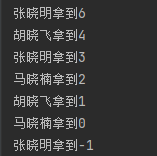

造成原因：==每个线程在自己得工作内交互，内存控制不当会造成数据不一致==

​					上述程序造成三个人同时都看到还有票，同时去拿，而并没有实现一个拿过再接着下一个去拿

### 16 不安全案例——银行取钱

```java
//不安全得取钱
//两个人去银行取钱，账户
public class UnsafeBank {
    public static void main(String[] args) {
        //账户
        Account account = new Account(100,"结婚基金");
        Drawing you = new Drawing(account,50,"你");
        Drawing girlFriend = new Drawing(account,100,"对象");
        you.start();
        girlFriend.start();
    }

}

//账户
class Account {
    int money; //余额
    String name; //卡名

    public Account(int money,String name){
        this.money = money;
        this.name = name;
    }
}

//银行：模拟取款
class Drawing extends Thread{
    Account account; //账户
    //取了多少钱
    int drawingMoney;
    //现在手里有多少钱
    int nowMoney;

    public Drawing(Account account,int drawingMoney,String name){
        super(name);
        this.account = account;
        this.drawingMoney = drawingMoney;
        this.nowMoney = nowMoney;
    }

    //取钱

    @Override
    public void run() {
        //判断有没有钱
        if (account.money - drawingMoney < 0 ){
            System.out.println(Thread.currentThread().getName()+"余额不足");
            return;
        }
        //sleep 可以放大问题的发生性
        try {
            Thread.sleep(1000);
        } catch (InterruptedException e) {
            e.printStackTrace();
        }

        //卡内余额更新
        account.money = account.money-drawingMoney;

        //当前手里得钱
        nowMoney = nowMoney + drawingMoney;
        System.out.println(account.name + "余额为"+account.money);
        //Thread.currentThread().getName() = this.getName()
        System.out.println(this.getName() + "手里的钱" +nowMoney);
    }
}
```


### 17 不安全案例——线程

```java
//线程不安全的集合
public class UnsafeList {
    public static void main(String[] args) {
        List<String> list = new ArrayList<>();
        for (int i = 0; i < 10000; i++) {
            new Thread(()->{
                list.add(Thread.currentThread().getName());
            }).start();
        }
        try {
            Thread.sleep(3000);
        } catch (InterruptedException e) {
            e.printStackTrace();
        }
        System.out.println(list.size());
    }
}
```


本应是10000

### 18 同步方法和同步块

+ 之前可以通过private关键字来保证数据对象只能被方法访问，所以可以借助此方法提出一套机制——synchronized关键字，包括两种用法：synchronized方法和synchronized块

**1 synchronized方法**

```java
//同步方法：
public synchronized void method(int args){}
```

+ synchronized方法控制对“对象”的访问，每个对象对应一把锁，每个synchronized方法都必须获得调用该方法的对象的锁才能执行，否则线程会阻塞，方法一旦执行，就独占该锁，直到该方法返回才释放锁，后面被阻塞的线程才能获得这个锁，继续执行

  **缺陷**：若将一个大的方法申明为synchronized将会影响效率

在不安全的买票案例中，将buy( )方法加入synchronized关键字即可实现，

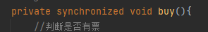

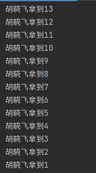

***这里结果有问题，待解决，按理应该是三人随机依次拿票***

通过synchronized关键字实现了排队按序拿票

**2 synchronized块**

==同步块==：synchronized(Obj){ }

+ Obj称之为同步监视器

  Obj可以是任何对象，但是推荐使用共享资源作为同步监视器（锁的对象就是变化的量，需要增删改的对象）

  同步方法中无需指定同步监视器，因为同步方法的同步监视器就是this，就是这个对象本身，或者是class

+ 同步监视器的执行过程

  1 第一个线程访问，锁定同步监视器，执行其中代码

  2 第二个线程访问，发现同步监视器被锁定，无法访问

  3 第一个线程访问完毕，解锁同步监视器

  4 第二个线程访问，发现同步监视器没有锁，然后锁定并访问

### 19  CopyOnWriteArrayList

```java
import java.util.concurrent.CopyOnWriteArrayList;

//测试JUC安全类型的集合
public class TestJUC {
    public static void main(String[] args) {
        CopyOnWriteArrayList<String> list = new CopyOnWriteArrayList<String>();
        for (int i = 0; i < 10000; i++) {
            new Thread(()->{
                list.add(Thread.currentThread().getName());
            }).start();
        }
        try {
            Thread.sleep(3000);
        } catch (InterruptedException e) {
            e.printStackTrace();
        }
        System.out.println(list.size());
    }
}
```


### 20 死锁

多个线程各自占有一些共享资源，并且互相等待其他线程占有的资源才能运行，如此导致两个或者多个线程都在等待对方释放资源都停止执行的情况，某一个同步块同时拥有“两个以上对象的锁”时，就可能会发生“死锁”问题。

```java
//死锁：多个线程互相抱着对方需要的资源，形成僵持
public class DeadLock {
    public static void main(String[] args) {
        Makeup g1 = new Makeup(0,"胡晓飞");
        Makeup g2 = new Makeup(1,"马晓楠");

        g1.start();
        g2.start();
    }

}
//口红
class Lipstick{

}

//镜子
class Mirror{

}
class Makeup extends Thread{
    //需要的资源只有一份，用static来保证只有一份
    static Lipstick lipstick = new Lipstick();
    static Mirror mirror = new Mirror();

    int choice;//选择
    String girlName;//使用化妆品的人

    Makeup(int choice,String girlName){
        this.choice = choice;
        this.girlName = girlName;
    }
    @Override
    public void run() {
    //化妆
        try {
            makeup();
        } catch (InterruptedException e) {
            e.printStackTrace();
        }
    }

    //化妆，互相持有对方的资源
    private void makeup() throws InterruptedException {
        if (choice == 0){
            synchronized (lipstick) {  //获得口红的锁
                System.out.println(this.girlName + "获得口红的锁");

                Thread.sleep(1000);


                synchronized (mirror) {  //1s后想获得镜子
                    System.out.println(this.girlName + "获得镜子的锁");
                }
            }
        }
        else {
            synchronized (mirror){//获得镜子的锁
                System.out.println(this.girlName + "获得镜子的锁");

                Thread.sleep(2000);

                    synchronized (lipstick){  // 1s后想获得镜子
                        System.out.println(this.girlName + "获得口红的锁");
                    }
            }
        }
    }

}
```

两人互相争夺等待对方释放手中资源而导致了死锁，此时两人想同时拥有两个对象的锁


二人不去想着同时拥有两个资源的锁即可正常运行

造成死锁情况：

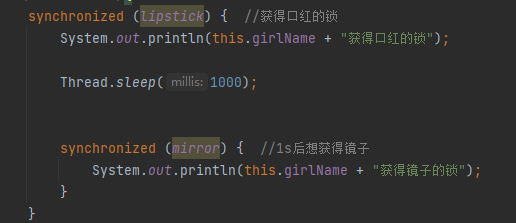

以下程序不会造成死锁

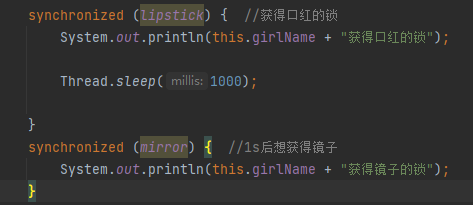


==产生死锁的四个必要条件==

1 互斥条件：一个资源每次只能被一个进程使用

2 请求与保持条件： 一个进程因请求资源而阻塞时，对已获得的资源保持不妨

3 不剥夺条件：进程已获得的资源，在未使用完之前，不能强行剥夺

4 循环等待条件：若干进程之间形成一种头尾相接的循环等待资源关系


### 21 LOCK锁

+ 从JDK5.0开始，Java提供了更强大的线程同步机制——通过显示定义同步锁对象来实现同步，同步锁使用Lock对象充当

+ java.util.concurrent.locks.Lock接口是控制多个线程对共享资源进行访问的工具。锁提供了对共享资源的独占访问，每次只能有一个线程对lock对象加锁，线程开始访问共享资源之前应先获得Lock对象
+ ReentrantLock 类实现了Lock，它拥有与synchronized相同的并发性和内存语义，在实现线程安全的控制中，比较常用的是ReentrantLock，可以显示加锁、释放锁

```java
class A{
    private final ReentrantLock lock = new ReentrantLock();
    public void m(){
        lock.lock;
        try{
            //保证线程安全的代码
        }finally{
            lock.unlock();
            //如果同步代码有异常，要将unlock()写入finally语句块
        }
    }
}
```


```java
//测试Lock锁
public class TestLock {
    public static void main(String[] args) {
        TestLock2 testLock2 = new TestLock2();

        new Thread(testLock2).start();
        new Thread(testLock2).start();
        new Thread(testLock2).start();

    }

}
class TestLock2 implements Runnable{
    int ticketnums = 10;
    //定义lock锁
    private ReentrantLock lock = new ReentrantLock();

    @Override
    public void run() {
        while (true){

            try{
                lock.lock(); //加锁
                if (ticketnums>0){
                    try {
                        Thread.sleep(1000);
                    } catch (InterruptedException e) {
                        e.printStackTrace();
                    }
                    System.out.println(ticketnums--);
                }else {
                    break;
                }

            }finally {
                //解锁
                lock.unlock();
            }
 /*           lock.lock(); //加锁
            if (ticketnums>0){
                try {
                    Thread.sleep(1000);
                } catch (InterruptedException e) {
                    e.printStackTrace();
                }
                System.out.println(ticketnums--);
            }else {
                break;
            }*/
        }

    }
}
```

==synchronized与lock对比==

+ Lock是显式锁（手动开启和关闭锁，关闭锁是必须的），synchronized是隐式锁，出了作用域自动释放
+ Lock只有代码块锁，synchronized有代码块锁和方法锁
+ 使用lock锁，JVM花费较少时间来调度线程，性能更好。并且具有更好的扩展性
+ 使用优先顺序
  + lock>同步代码块（已经放入了方法体，分配了相应资源）>同步方法（在方法体之外）

### 22 生产者消费者问题

线程同步问题，生产者消费者共享同一个资源，并且生产者和消费者之间相互依赖，互为条件

+ 对于生产者，没有生产产品之前，要通知消费者等待，生产了产品之后，又需要马上通知消费者消费
+ 对于消费者，在消费之后，要通知生产者已经结束消费，需要生产新的产品以供消费
+ 在生产者消费者问题中，仅有synchronized是不够的
  + synchronized可阻止并发更新一个共享资源，实现了同步
  + synchronized不能实现不同线程之间的消息传递（通信）

| 方法名             | 作用                                                         |
| ------------------ | ------------------------------------------------------------ |
| `wait()`           | 导致当前线程等待，直到另一个线程调用该对象的 [`notify()`](../../java/lang/Object.html#notify--)方法或 [`notifyAll()`](../../java/lang/Object.html#notifyAll--)方法。和sleep不同，会释放锁 |
| wait(long timeout) | 导致当前线程等待，直到另一个线程调用 [`notify()`](../../java/lang/Object.html#notify--)方法或该对象的 [`notifyAll()`](../../java/lang/Object.html#notifyAll--)方法，或者指定的时间已过 |
| `notify()`         | 唤醒正在等待对象监视器的单个线程。                           |
| `notifyAll()`      | 唤醒正在等待对象监视器的所有线程。                           |

==解决这一问题的两种方法==：1、管程法 2、信号灯法


**解决方式1**  管程法

生产者：负责生产数据的模块（可以是方法、对象、线程、进程）

消费者：负责处理数据的模块（同上）

缓冲区：消费者不能直接使用生产者的数据，他们之间有个缓冲区


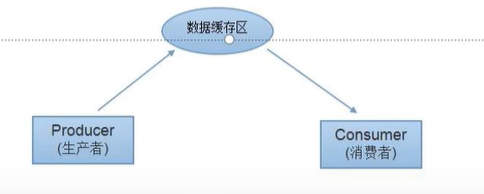

```java
//测试生产者消费者模型 ——利用缓冲区解决，管程法
public class TestPC {
    public static void main(String[] args) {
        SynContainer container = new SynContainer();
        new Productor(container).start();
        new Consumer(container).start();
    }
}

//生产者
class Productor extends Thread{
    SynContainer container;
    public Productor (SynContainer container){
        this.container = container;
    }
    //生产


    @Override
    public void run() {
        for (int i = 0; i < 100; i++) {
            container.push(new Chicken(i));
            System.out.println("生产了" + i + "只鸡");

        }
    }
}

//消费者
class Consumer extends Thread{
    SynContainer container;
    public Consumer (SynContainer container){
        this.container=container;
    }
    //消费

    @Override
    public void run() {
        for (int i = 0; i < 100; i++) {
            System.out.println("消费了"+container.pop().id+"只鸡");
        }
    }
}

//产品
class Chicken {
    int id; //产品编号

    public Chicken(int id) {
        this.id = id;
    }
}

//缓冲区
class SynContainer{
    //需要一个容器大小
    Chicken[] chickens = new Chicken[10];
    //容器计数器
    int count = 0;

    //生产者放入产品
    public  synchronized void push(Chicken chicken){
        //如果容器满了，就需要等待消费者消费
        if (count ==chickens.length){
            //通知消费者消费，生产等待
        }
        //如果没有满，就要丢入产品
        chickens[count] = chicken;
        count++;

        //可以通知消费者消费了
    }


    //消费者消费产品
    public synchronized Chicken pop(){
        //判断能否消费
        if (count==0){
            //等待生产者生产，消费者等待
        }
        //如果可以消费
        count--;
        Chicken chicken = chickens[count];
        //吃完了，通知生产者生产
        return chicken;
    }
}
```

解决方法2 信号灯法

设立标志位 ，两个线程共享同一个资源，生产者生产时，消费者标志位为false，生产一个将标志位变为true，消费者开始消费，消费完后，标志位改变，从而生产者能够再次进行。

```java
//测试生产者消费者问题2：信号灯法，标志位解决
public class TestPC2 {
    public static void main(String[] args) {
        TV tv = new TV();
        new Player(tv).start();
        new Watcher(tv).start();
    }

}

//生产者--》演员
class Player extends Thread{
    TV tv;
    public Player (TV tv){
        this.tv = tv;
    }

    @Override
    public void run() {
        for (int i = 0; i < 20; i++) {
            if (i%2 == 0){
                this.tv.play("斗鱼");
            }else{
                this.tv.play("虎牙");
            }
        }
    }
}

//消费者--》观众
class Watcher extends Thread{
    TV tv;
    public Watcher(TV tv){
        this.tv = tv;
    }

    @Override
    public void run() {
        for (int i = 0; i < 20; i++) {
            tv.watch();
        }
    }
}

//产品--》节目
class TV{
    //演员表演，观众等待
    //观众观看，演员等待
    String voice; //表演的节目
    boolean flag = true;

    //表演
    public  synchronized void play(String voice){
        if (!flag){
            try {
                this.wait();
            } catch (InterruptedException e) {
                e.printStackTrace();
            }
        }
        System.out.println("演员表演了"+voice);
        //通知观众观看
        this.notifyAll(); //通知幻想
        this.voice = voice;
        this.flag = !this.flag;
    }

    //观看
    public synchronized void watch(){
        if (flag){
            try {
                this.wait();
            } catch (InterruptedException e) {
                e.printStackTrace();
            }
        }
        System.out.println("观看了："+voice);
        //通知演员表演
        this.notifyAll();
        this.flag = !this.flag;
    }
}
```


### 23 线程池

+ 背景：经常创建和销毁、使用量特别大的资源，比如并发情况下的线程，对性能影响很大。

+ 思路：提前创建好多个线程，放入线程池中，使用时直接获取，使用完放回池中。可以避免频繁创建销毁、实现重复利用

+ 好处：1、提高响应速度（减少创建新线程的时间）

  ​           2、降低资源消耗（重复利用线程池中线程，不用每次都创建）

  ​			3、便于线程管理

  ​					**corePoolSize**:核心池的大小

  ​					**maximumPoolSize**:最大线程数

  ​					**keepAliveTime**:线程没有任务时最多保持多长时间后会终止

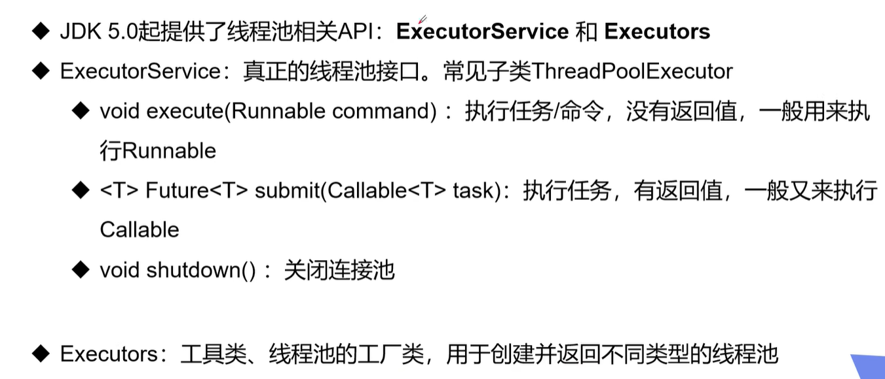
