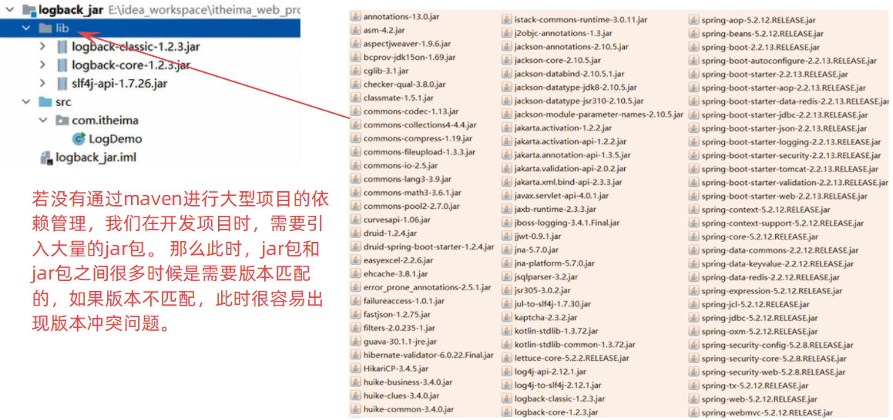
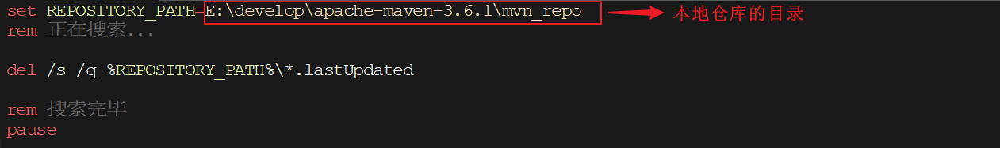
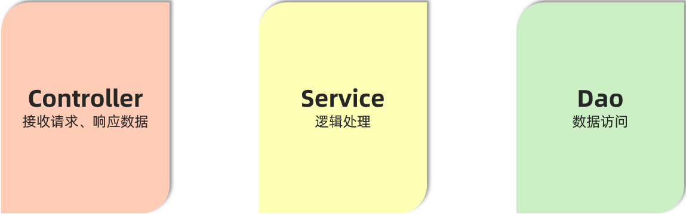
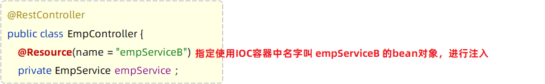
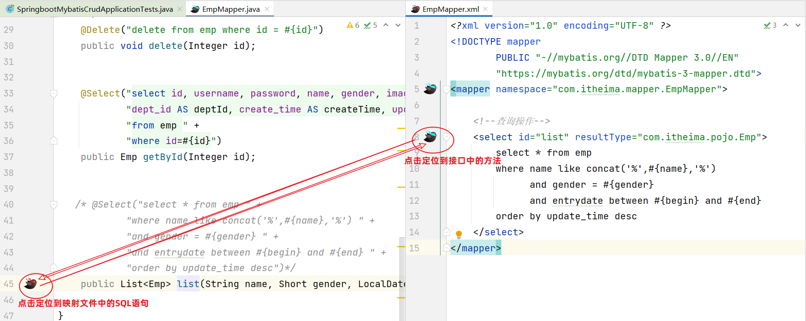
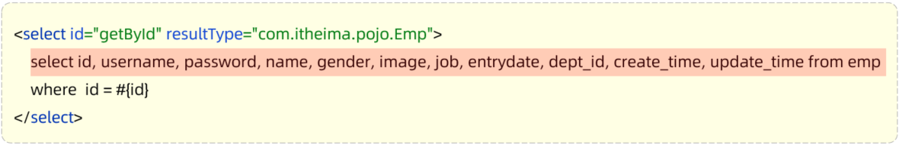
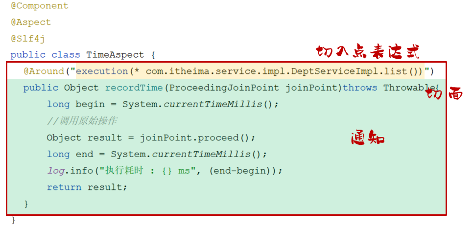

# JAVAWEB

[练习项目地址](https://github.com/zjxWeb/javaProject)

# Maven

## 01. Maven介绍

### 1.1 介绍

学习完前端Web开发技术后，我们即将开始学习后端Web开发技术。做为一名Java开发工程师，**后端Web开发技术是我们学习的重点**。

后端Web开发技术的学习，我们会先学习Java项目的构建工具：Maven

### 1.2 初识Maven

#### 1.2.1 什么是Maven

Maven是Apache旗下的一个开源项目，是一款用于管理和构建java项目的工具。

官网：https://maven.apache.org/

> Apache 软件基金会，成立于1999年7月，是目前世界上最大的最受欢迎的开源软件基金会，也是一个专门为支持开源项目而生的非盈利性组织。
>
> 开源项目：https://www.apache.org/index.html#projects-list

#### 1.2.2 Maven的作用

使用Maven能够做什么呢？

1. 依赖管理
2. 统一项目结构
3. 项目构建

**依赖管理**：

- 方便快捷的管理项目依赖的资源(jar包)，避免版本冲突问题



当使用maven进行项目依赖(jar包)管理，则很方便的可以解决这个问题。 我们只需要在maven项目的pom.xml文件中，添加一段如下图所示的配置即可实现。

  

**统一项目结构 : **

- 提供标准、统一的项目结构

在项目开发中，当你使用不同的开发工具 (如：Eclipse、Idea)，创建项目工程时：

 

若我们创建的是一个maven工程，是可以帮我们自动生成统一、标准的项目目录结构：


具体的统一结构如下：


> 目录说明： 
>
> - src/main/java: java源代码目录
> - src/main/resources:  配置文件信息
> - src/test/java: 测试代码
> - src/test/resources: 测试配置文件信息


**项目构建 :** 

- maven提供了标准的、跨平台(Linux、Windows、MacOS) 的自动化项目构建方式

 

如上图所示我们开发了一套系统，代码需要进行编译、测试、打包、发布，这些操作如果需要反复进行就显得特别麻烦，而Maven提供了一套简单的命令来完成项目构建。


综上所述，可以得到一个结论：**Maven是一款管理和构建java项目的工具**

## 02. Maven概述

### 2.1 Maven介绍

Apache Maven是一个项目管理和构建工具，它基于项目对象模型(Project Object Model , 简称: POM)的概念，通过一小段描述信息来管理项目的构建、报告和文档。

官网：https://maven.apache.org/

Maven的作用： 

1. 方便的依赖管理
2. 统一的项目结构
3. 标准的项目构建流程

### 2.2 Maven模型

* 项目对象模型 (Project Object Model)
* 依赖管理模型(Dependency)
* 构建生命周期/阶段(Build lifecycle & phases)

1). 构建生命周期/阶段(Build lifecycle & phases)


以上图中紫色框起来的部分，就是用来完成标准化构建流程 。当我们需要编译，Maven提供了一个编译插件供我们使用；当我们需要打包，Maven就提供了一个打包插件供我们使用等。 

2). 项目对象模型 (Project Object Model)


以上图中紫色框起来的部分属于项目对象模型，就是将我们自己的项目抽象成一个对象模型，有自己专属的坐标，如下图所示是一个Maven项目：


> 坐标，就是资源(jar包)的唯一标识，通过坐标可以定位到所需资源(jar包)位置
>
> 


3). 依赖管理模型(Dependency)


以上图中紫色框起来的部分属于依赖管理模型，是使用坐标来描述当前项目依赖哪些第三方jar包


之前我们项目中需要jar包时，直接就把jar包复制到项目下的lib目录，而现在书写在pom.xml文件中的坐标又是怎么能找到所要的jar包文件的呢？

> 答案：Maven仓库

### 2.3 Maven仓库 

仓库：用于存储资源，管理各种jar包

> 仓库的本质就是一个目录(文件夹)，这个目录被用来存储开发中所有依赖(就是jar包)和插件

Maven仓库分为：

- 本地仓库：自己计算机上的一个目录(用来存储jar包)
- 中央仓库：由Maven团队维护的全球唯一的。仓库地址：https://repo1.maven.org/maven2/
- 远程仓库(私服)：一般由公司团队搭建的私有仓库


当项目中使用坐标引入对应依赖jar包后，首先会查找本地仓库中是否有对应的jar包

* 如果有，则在项目直接引用

* 如果没有，则去中央仓库中下载对应的jar包到本地仓库

如果还可以搭建远程仓库(私服)，将来jar包的查找顺序则变为： 本地仓库 --> 远程仓库--> 中央仓库

### 2.4 Maven安装

认识了Maven后，我们就要开始使用Maven了，那么首先我们要进行Maven的下载与安装。

#### 2.4.1 下载

下载地址：https://maven.apache.org/download.cgi

在提供的资料中，已经提供了下载好的安装包。如下： 

 

#### 2.4.2 安装步骤

Maven安装配置步骤：

1. 解压安装
2. 配置仓库
3. 配置Maven环境变量


**1、解压 apache-maven-3.6.1-bin.zip（解压即安装）**

> 建议解压到没有中文、特殊字符的路径下。如课程中解压到 `E:\develop` 下。

 

解压缩后的目录结构如下：

 

* bin目录 ： 存放的是可执行命令。（mvn 命令重点关注）
* conf目录 ：存放Maven的配置文件。（settings.xml配置文件后期需要修改）
* lib目录 ：存放Maven依赖的jar包。（Maven也是使用java开发的，所以它也依赖其他的jar包）

**2、配置本地仓库**

2.1、在自己计算机上新一个目录（本地仓库，用来存储jar包）

 

2.2、进入到conf目录下修改settings.xml配置文件 

1). 使用超级记事本软件，打开settings.xml文件，定位到53行

2). 复制<localRepository>标签，粘贴到注释的外面（55行）

3). 复制之前新建的用来存储jar包的路径，替换掉<localRepository>标签体内容

 


**3、配置阿里云私服**

由于中央仓库在国外，所以下载jar包速度可能比较慢，而阿里公司提供了一个远程仓库，里面基本也都有开源项目的jar包。

进入到conf目录下修改settings.xml配置文件：

1). 使用超级记事本软件，打开settings.xml文件，定位到160行左右

2). 在<mirrors>标签下为其添加子标签<mirror>，内容如下：

```xml
<mirror>  
    <id>alimaven</id>  
    <name>aliyun maven</name>  
    <url>http://maven.aliyun.com/nexus/content/groups/public/</url>
    <mirrorOf>central</mirrorOf>          
</mirror>
```


注意配置的位置，在<mirrors> ... </mirrors> 中间添加配置。如下图所示：


==注:  只可配置一个<mirror>(另一个要注释!) ，不然两个可能发生冲突，导致jar包无法下载!!!!!!!==


**4、配置环境变量**

> Maven环境变量的配置类似于JDK环境变量配置一样

1). 在系统变量处新建一个变量MAVEN_HOME

- MAVEN_HOME环境变量的值，设置为maven的解压安装目录


2). 在Path中进行配置

- PATH环境变量的值，设置为：%MAVEN_HOME%\bin

 

3). 打开DOS命令提示符进行验证，出现如图所示表示安装成功

```
mvn -v
```

 

## 03. IDEA集成Maven

我们要想在IDEA中使用Maven进行项目构建，就需要在IDEA中集成Maven

### 3.1 配置Maven环境 

#### 3.1.1 当前工程设置 

1、选择 IDEA中 File  =>  Settings  =>  Build,Execution,Deployment  =>  Build Tools  =>  Maven

 


2、设置IDEA使用本地安装的Maven，并修改配置文件及本地仓库路径


> Maven home path ：指定当前Maven的安装目录
>
> User settings file ：指定当前Maven的settings.xml配置文件的存放路径
>
> Local repository ：指定Maven的本地仓库的路径 (如果指定了settings.xml, 这个目录会自动读取出来, 可以不用手动指定)


3、配置工程的编译版本为11

- Maven默认使用的编译版本为5（版本过低）

 

上述配置的maven环境，只是针对于当前工程的，如果我们再创建一个project，又恢复成默认的配置了。 要解决这个问题， 我们就需要配置全局的maven环境。

  

#### 3.1.2 全局设置 

1、进入到IDEA欢迎页面

- 选择 IDEA中 File  =>  close project


2、打开 All settings , 选择 Build,Execution,Deployment  =>  Build Tools  =>  Maven


3、配置工程的编译版本为11


这里所设置的maven的环境信息，并未指定任何一个project，此时设置的信息就属于全局配置信息。 以后，我们再创建project，默认就是使用我们全局配置的信息。

### 3.2 Maven项目

#### 3.2.1 创建Maven项目 

1、创建一个空项目 


2、创建模块，选择Maven，点击Next


3、填写模块名称，坐标信息，点击finish，创建完成

 


4、在Maven工程下，创建HelloWorld类


> - Maven项目的目录结构:
>
>   maven-project01
>   	|---  src  (源代码目录和测试代码目录)
>   		    |---  main (源代码目录)
>   			           |--- java (源代码java文件目录)
>   			           |--- resources (源代码配置文件目录)
>   		    |---  test (测试代码目录)
>   			           |--- java (测试代码java目录)
>   			           |--- resources (测试代码配置文件目录)
>   	|--- target (编译、打包生成文件存放目录)


5、编写 HelloWorld，并运行

```java
public class HelloWorld {
    public static void main(String[] args) {
        System.out.println("Hello Maven ...");
    }
}
```

#### 3.2.2 POM配置详解

POM (Project Object Model) ：指的是项目对象模型，用来描述当前的maven项目。

- 使用pom.xml文件来实现

pom.xml文件：

~~~xml
<?xml version="1.0" encoding="UTF-8"?>
<project xmlns="http://maven.apache.org/POM/4.0.0"
         xmlns:xsi="http://www.w3.org/2001/XMLSchema-instance"
         xsi:schemaLocation="http://maven.apache.org/POM/4.0.0 http://maven.apache.org/xsd/maven-4.0.0.xsd">
    <!-- POM模型版本 -->
    <modelVersion>4.0.0</modelVersion>

    <!-- 当前项目坐标 -->
    <groupId>com.itheima</groupId>
    <artifactId>maven_project1</artifactId>
    <version>1.0-SNAPSHOT</version>
    
    <!-- 打包方式 -->
    <packaging>jar</packaging>
 
</project>
~~~

pom文件详解：

- <project> ：pom文件的根标签，表示当前maven项目
- <modelVersion> ：声明项目描述遵循哪一个POM模型版本
  - 虽然模型本身的版本很少改变，但它仍然是必不可少的。目前POM模型版本是4.0.0
- 坐标 ：<groupId>、<artifactId>、<version>
  - 定位项目在本地仓库中的位置，由以上三个标签组成一个坐标
- <packaging> ：maven项目的打包方式，通常设置为jar或war（默认值：jar）

#### 3.2.3 Maven坐标详解

什么是坐标？

* Maven中的坐标是==资源的唯一标识== , 通过该坐标可以唯一定位资源位置
* 使用坐标来定义项目或引入项目中需要的依赖

Maven坐标主要组成

* groupId：定义当前Maven项目隶属组织名称（通常是域名反写，例如：com.itheima）
* artifactId：定义当前Maven项目名称（通常是模块名称，例如 order-service、goods-service）
* version：定义当前项目版本号

如下图就是使用坐标表示一个项目：

 

> **注意：**
>
> * 上面所说的资源可以是插件、依赖、当前项目。
> * 我们的项目如果被其他的项目依赖时，也是需要坐标来引入的。

### 3.3 导入Maven项目

- **方式1：使用Maven面板，快速导入项目**

打开IDEA，选择右侧Maven面板，点击 + 号，选中对应项目的pom.xml文件，双击即可


 

> 说明：如果没有Maven面板，选择 View  =>  Appearance  =>  Tool Window Bars
>
>  


- **方式2：使用idea导入模块项目**

File  =>  Project Structure  =>  Modules  =>  +  =>  Import Module


找到要导入工程的pom.xml


## 04. 依赖管理

### 4.1 依赖配置

依赖：指当前项目运行所需要的jar包。一个项目中可以引入多个依赖：

例如：在当前工程中，我们需要用到logback来记录日志，此时就可以在maven工程的pom.xml文件中，引入logback的依赖。具体步骤如下：

1. 在pom.xml中编写<dependencies>标签

2. 在<dependencies>标签中使用<dependency>引入坐标

3. 定义坐标的 groupId、artifactId、version

```xml
<dependencies>
    <!-- 第1个依赖 : logback -->
    <dependency>
        <groupId>ch.qos.logback</groupId>
        <artifactId>logback-classic</artifactId>
        <version>1.2.11</version>
    </dependency>
    <!-- 第2个依赖 : junit -->
    <dependency>
        <groupId>junit</groupId>
        <artifactId>junit</artifactId>
        <version>4.12</version>
    </dependency>
</dependencies>
```

4. 点击刷新按钮，引入最新加入的坐标
   - 刷新依赖：保证每一次引入新的依赖，或者修改现有的依赖配置，都可以加入最新的坐标

  

> 注意事项：
>
> 1. 如果引入的依赖，在本地仓库中不存在，将会连接远程仓库 / 中央仓库，然后下载依赖（这个过程会比较耗时，耐心等待）
> 2. 如果不知道依赖的坐标信息，可以到mvn的中央仓库（https://mvnrepository.com/）中搜索


**添加依赖的几种方式：**

1. 利用中央仓库搜索的依赖坐标

   


2. 利用IDEA工具搜索依赖


3. 熟练上手maven后，快速导入依赖

   

### 4.2 依赖传递

#### 4.2.1 依赖具有传递性

早期我们没有使用maven时，向项目中添加依赖的jar包，需要把所有的jar包都复制到项目工程下。如下图所示，需要logback-classic时，由于logback-classic又依赖了logback-core和slf4j，所以必须把这3个jar包全部复制到项目工程下


我们现在使用了maven，当项目中需要使用logback-classic时，只需要在pom.xml配置文件中，添加logback-classic的依赖坐标即可。


在pom.xml文件中只添加了logback-classic依赖，但由于maven的依赖具有传递性，所以会自动把所依赖的其他jar包也一起导入。


依赖传递可以分为：

1. 直接依赖：在当前项目中通过依赖配置建立的依赖关系

2. 间接依赖：被依赖的资源如果依赖其他资源，当前项目间接依赖其他资源

 

比如以上图中：

- projectA依赖了projectB。对于projectA 来说，projectB 就是直接依赖。
- 而projectB依赖了projectC及其他jar包。 那么此时，在projectA中也会将projectC的依赖传递下来。对于projectA 来说，projectC就是间接依赖。


#### 4.2.2 排除依赖

问题：之前我们讲了依赖具有传递性。那么A依赖B，B依赖C，如果A不想将C依赖进来，是否可以做到？ 

答案：在maven项目中，我们可以通过排除依赖来实现。


什么是排除依赖？

- 排除依赖：指主动断开依赖的资源。（被排除的资源无需指定版本）

```xml
<dependency>
    <groupId>com.itheima</groupId>
    <artifactId>maven-projectB</artifactId>
    <version>1.0-SNAPSHOT</version>
   
    <!--排除依赖, 主动断开依赖的资源-->
    <exclusions>
    	<exclusion>
            <groupId>junit</groupId>
            <artifactId>junit</artifactId>
        </exclusion>
    </exclusions>
</dependency>
```


依赖排除示例：

- maven-projectA依赖了maven-projectB，maven-projectB依赖了Junit。基于依赖的传递性，所以maven-projectA也依赖了Junit


- 使用排除依赖后


 


### 4.3 依赖范围

在项目中导入依赖的jar包后，默认情况下，可以在任何地方使用。


如果希望限制依赖的使用范围，可以通过<scope>标签设置其作用范围。

 

作用范围：

1. 主程序范围有效（main文件夹范围内）

2. 测试程序范围有效（test文件夹范围内）

3. 是否参与打包运行（package指令范围内）


如上图所示，给junit依赖通过scope标签指定依赖的作用范围。 那么这个依赖就只能作用在测试环境，其他环境下不能使用。

scope标签的取值范围：

| **scope**值     | **主程序** | **测试程序** | **打包（运行）** | **范例**    |
| --------------- | ---------- | ------------ | ---------------- | ----------- |
| compile（默认） | Y          | Y            | Y                | log4j       |
| test            | -          | Y            | -                | junit       |
| provided        | Y          | Y            | -                | servlet-api |
| runtime         | -          | Y            | Y                | jdbc驱动    |


### 4.4 生命周期

#### 4.4.1 介绍

Maven的生命周期就是为了对所有的构建过程进行抽象和统一。 描述了一次项目构建，经历哪些阶段。

在Maven出现之前，项目构建的生命周期就已经存在，软件开发人员每天都在对项目进行清理，编译，测试及部署。虽然大家都在不停地做构建工作，但公司和公司间、项目和项目间，往往使用不同的方式做类似的工作。

Maven从大量项目和构建工具中学习和反思，然后总结了一套高度完美的，易扩展的项目构建生命周期。这个生命周期包含了项目的清理，初始化，编译，测试，打包，集成测试，验证，部署和站点生成等几乎所有构建步骤。

Maven对项目构建的生命周期划分为3套（相互独立）：


- clean：清理工作。

- default：核心工作。如：编译、测试、打包、安装、部署等。

- site：生成报告、发布站点等。

三套生命周期又包含哪些具体的阶段呢, 我们来看下面这幅图:

 

我们看到这三套生命周期，里面有很多很多的阶段，这么多生命周期阶段，其实我们常用的并不多，主要关注以下几个：

• clean：移除上一次构建生成的文件

• compile：编译项目源代码

• test：使用合适的单元测试框架运行测试(junit)

• package：将编译后的文件打包，如：jar、war等

• install：安装项目到本地仓库


Maven的生命周期是抽象的，这意味着生命周期本身不做任何实际工作。**在Maven的设计中，实际任务（如源代码编译）都交由插件来完成。**


IDEA工具为了方便程序员使用maven生命周期，在右侧的maven工具栏中，已给出快速访问通道


生命周期的顺序是：clean --> validate --> compile --> test --> package --> verify --> install --> site --> deploy 

我们需要关注的就是：clean -->  compile --> test --> package  --> install 

> 说明：在同一套生命周期中，我们在执行后面的生命周期时，前面的生命周期都会执行。

>  思考：当运行package生命周期时，clean、compile生命周期会不会运行？
>
>  ​		clean不会运行，compile会运行。  因为compile与package属于同一套生命周期，而clean与package不属于同一套生命周期。


#### 4.4.2 执行

在日常开发中，当我们要执行指定的生命周期时，有两种执行方式：

1. 在idea工具右侧的maven工具栏中，选择对应的生命周期，双击执行
2. 在DOS命令行中，通过maven命令执行


**方式一：在idea中执行生命周期**

- 选择对应的生命周期，双击执行

 


compile：


test：


package：


install：


clean：


**方式二：在命令行中执行生命周期**

1. 进入到DOS命令行


 


 

## 05. 附录

### 5.1 更新依赖索引

有时候给idea配置完maven仓库信息后，在idea中依然搜索不到仓库中的jar包。这是因为仓库中的jar包索引尚未更新到idea中。这个时候我们就需要更新idea中maven的索引了，具体做法如下：

 打开设置----搜索maven----Repositories----选中本地仓库-----点击Update


### 5.2 清理maven仓库

初始情况下，我们的本地仓库是没有任何jar包的，此时会从私服去下载（如果没有配置，就直接从中央仓库去下载），可能由于网络的原因，jar包下载不完全，这些不完整的jar包都是以lastUpdated结尾。此时，maven不会再重新帮你下载，需要你删除这些以lastUpdated结尾的文件，然后maven才会再次自动下载这些jar包。


如果本地仓库中有很多这样的以lastUpadted结尾的文件，可以定义一个批处理文件，在其中编写如下脚本来删除： 

~~~
set REPOSITORY_PATH=E:\develop\apache-maven-3.6.1\mvn_repo
rem 正在搜索...

del /s /q %REPOSITORY_PATH%\*.lastUpdated

rem 搜索完毕
pause
~~~

操作步骤如下：

1). 定义批处理文件del_lastUpdated.bat  (直接创建一个文本文件，命名为del_lastUpdated，后缀名直接改为bat即可 )

 

2). 在上面的bat文件上**右键---》编辑** 。修改文件：

 

修改完毕后，双击运行即可删除maven仓库中的残留文件。

# SpringBoot基础 

## 前言

我们可以打开Spring的官网(https://spring.io)，去看一下Spring的简介：Spring makes Java simple。


Spring的官方提供很多开源的项目，我们可以点击上面的projects，看到spring家族旗下的项目，按照流行程度排序为：


Spring发展到今天已经形成了一种开发生态圈，Spring提供了若干个子项目，每个项目用于完成特定的功能。而我们在项目开发时，一般会偏向于选择这一套spring家族的技术，来解决对应领域的问题，那我们称这一套技术为**spring全家桶**。


而Spring家族旗下这么多的技术，最基础、最核心的是 SpringFramework。其他的spring家族的技术，都是基于SpringFramework的，SpringFramework中提供很多实用功能，如：依赖注入、事务管理、web开发支持、数据访问、消息服务等等。


而如果我们在项目中，直接基于SpringFramework进行开发，存在两个问题：配置繁琐、入门难度大。 


所以基于此呢，spring官方推荐我们从另外一个项目开始学习，那就是目前最火爆的SpringBoot。 

通过springboot就可以快速的帮我们构建应用程序，所以springboot呢，最大的特点有两个 ：

- 简化配置
- 快速开发

**Spring Boot 可以帮助我们非常快速的构建应用程序、简化开发、提高效率 。**


接下来，我们就直接通过一个SpringBoot的web入门程序，让大家快速感受一下，基于SpringBoot进行Web开发的便捷性。


## 1. SpringBootWeb快速入门

### 1.1 需求

需求：基于SpringBoot的方式开发一个web应用，浏览器发起请求/hello后，给浏览器返回字符串 “Hello World ~”。


 

### 1.2 开发步骤

第1步：创建SpringBoot工程项目

第2步：定义HelloController类，添加方法hello，并添加注解

第3步：测试运行


#### 1.2.1 创建SpringBoot工程（需要联网）

基于Spring官方骨架，创建SpringBoot工程。


基本信息描述完毕之后，勾选web开发相关依赖。


点击Finish之后，就会联网创建这个SpringBoot工程，创建好之后，结构如下：

- ==注意：在联网创建过程中，会下载相关资源(请耐心等待)==

 


#### 1.2.2 定义请求处理类

在com.itheima这个包下创建一个子包controller


然后在controller包下新建一个类：HelloController


```java
package com.itheima.controller;
import org.springframework.web.bind.annotation.*;

@RestController
public class HelloController {

    @RequestMapping("/hello")
    public String hello(){
        System.out.println("Hello World ~");
        return "Hello World ~";
    }
    
}    
```


#### 1.2.3 运行测试

运行SpringBoot自动生成的引导类

 

 

打开浏览器，输入 `http://localhost:8080/hello`


### 1.3 Web分析


浏览器：

- 输入网址：`http://192.168.100.11:8080/hello`

  - 通过IP地址192.168.100.11定位到网络上的一台计算机

    > 我们之前在浏览器中输入的localhost，就是127.0.0.1（本机）

  - 通过端口号8080找到计算机上运行的程序

    > `localhost:8080`  , 意思是在本地计算机中找到正在运行的8080端口的程序

  - /hello是请求资源位置

    - 资源：对计算机而言资源就是数据
      - web资源：通过网络可以访问到的资源（通常是指存放在服务器上的数据）

    > `localhost:8080/hello` ，意思是向本地计算机中的8080端口程序，获取资源位置是/hello的数据
    >
    > - 8080端口程序，在服务器找/hello位置的资源数据，发给浏览器

服务器：（可以理解为ServerSocket）

- 接收到浏览器发送的信息（如：/hello）
- 在服务器上找到/hello的资源
- 把资源发送给浏览器

> 我们在JavaSE阶段学习网络编程时，有讲过网络三要素：
>
> - IP  ：网络中计算机的唯一标识
> - 端口 ：计算机中运行程序的唯一标识
> - 协议 ：网络中计算机之间交互的规则
>
> **问题：浏览器和服务器两端进行数据交互，使用什么协议？**
>
> **答案：http协议**

## 2. HTTP协议

### 2.1 HTTP-概述

#### 2.1.1 介绍


HTTP：Hyper Text Transfer Protocol(超文本传输协议)，规定了浏览器与服务器之间数据传输的规则。

- http是互联网上应用最为广泛的一种网络协议 
- http协议要求：浏览器在向服务器发送请求数据时，或是服务器在向浏览器发送响应数据时，都必须按照固定的格式进行数据传输


如果想知道http协议的数据传输格式有哪些，可以打开浏览器，点击`F12`打开开发者工具，点击`Network`来查看


浏览器向服务器进行请求时：

- 服务器按照固定的格式进行解析


服务器向浏览器进行响应时：

- 浏览器按照固定的格式进行解析


**所以，我们学习HTTP主要就是学习请求和响应数据的具体格式内容。**


#### 2.2.2 特点

我们刚才初步认识了HTTP协议，那么我们在看看HTTP协议有哪些特点：

* **基于TCP协议: **   面向连接，安全

  > TCP是一种面向连接的(建立连接之前是需要经过三次握手)、可靠的、基于字节流的传输层通信协议，在数据传输方面更安全

* **基于请求-响应模型:**   一次请求对应一次响应（先请求后响应）

  > 请求和响应是一一对应关系，没有请求，就没有响应

* **HTTP协议是无状态协议:**  对于数据没有记忆能力。每次请求-响应都是独立的

  > 无状态指的是客户端发送HTTP请求给服务端之后，服务端根据请求响应数据，响应完后，不会记录任何信息。
  >
  > - 缺点:  多次请求间不能共享数据
  > - 优点:  速度快
  >
  > 请求之间无法共享数据会引发的问题：
  >
  > - 如：京东购物。加入购物车和去购物车结算是两次请求
  > - 由于HTTP协议的无状态特性，加入购物车请求响应结束后，并未记录加入购物车是何商品
  > - 发起去购物车结算的请求后，因为无法获取哪些商品加入了购物车，会导致此次请求无法正确展示数据
  >
  > 具体使用的时候，我们发现京东是可以正常展示数据的，原因是Java早已考虑到这个问题，并提出了使用会话技术(Cookie、Session)来解决这个问题。具体如何来做，我们后面课程中会讲到。

  刚才提到HTTP协议是规定了请求和响应数据的格式，那具体的格式是什么呢?


### 2.2 HTTP-请求协议

浏览器和服务器是按照HTTP协议进行数据通信的。

HTTP协议又分为：请求协议和响应协议

- 请求协议：浏览器将数据以请求格式发送到服务器
  - 包括：**请求行**、**请求头** 、**请求体** 
- 响应协议：服务器将数据以响应格式返回给浏览器
  - 包括：**响应行** 、**响应头** 、**响应体** 


在HTTP1.1版本中，浏览器访问服务器的几种方式： 

| 请求方式 | 请求说明                                                     |
| :------: | :----------------------------------------------------------- |
| **GET**  | 获取资源。<br/>向特定的资源发出请求。例：http://www.baidu.com/s?wd=itheima |
| **POST** | 传输实体主体。<br/>向指定资源提交数据进行处理请求（例：上传文件），数据被包含在请求体中。 |
| OPTIONS  | 返回服务器针对特定资源所支持的HTTP请求方式。<br/>因为并不是所有的服务器都支持规定的方法，为了安全有些服务器可能会禁止掉一些方法，例如：DELETE、PUT等。那么OPTIONS就是用来询问服务器支持的方法。 |
|   HEAD   | 获得报文首部。<br/>HEAD方法类似GET方法，但是不同的是HEAD方法不要求返回数据。通常用于确认URI的有效性及资源更新时间等。 |
|   PUT    | 传输文件。<br/>PUT方法用来传输文件。类似FTP协议，文件内容包含在请求报文的实体中，然后请求保存到URL指定的服务器位置。 |
|  DELETE  | 删除文件。<br/>请求服务器删除Request-URI所标识的资源         |
|  TRACE   | 追踪路径。<br/>回显服务器收到的请求，主要用于测试或诊断      |
| CONNECT  | 要求用隧道协议连接代理。<br/>HTTP/1.1协议中预留给能够将连接改为管道方式的代理服务器 |

在我们实际应用中常用的也就是 ：**GET、POST**


**GET方式的请求协议：**

 

* 请求行 ：HTTP请求中的第一行数据。由：`请求方式`、`资源路径`、`协议/版本`组成（之间使用空格分隔）

  * 请求方式：GET  
  * 资源路径：/brand/findAll?name=OPPO&status=1
    * 请求路径：/brand/findAll
    * 请求参数：name=OPPO&status=1
      * 请求参数是以key=value形式出现
      * 多个请求参数之间使用`&`连接
    * 请求路径和请求参数之间使用`?`连接 			 
  * 协议/版本：HTTP/1.1  

* 请求头 ：第二行开始，上图黄色部分内容就是请求头。格式为key: value形式 

  - http是个无状态的协议，所以在请求头设置浏览器的一些自身信息和想要响应的形式。这样服务器在收到信息后，就可以知道是谁，想干什么了

  常见的HTTP请求头有:

  ~~~
  Host: 表示请求的主机名
  
  User-Agent: 浏览器版本。 例如：Chrome浏览器的标识类似Mozilla/5.0 ...Chrome/79 ，IE浏览器的标识类似Mozilla/5.0 (Windows NT ...)like Gecko
  
  Accept：表示浏览器能接收的资源类型，如text/*，image/*或者*/*表示所有；
  
  Accept-Language：表示浏览器偏好的语言，服务器可以据此返回不同语言的网页；
  
  Accept-Encoding：表示浏览器可以支持的压缩类型，例如gzip, deflate等。
  
  Content-Type：请求主体的数据类型
  
  Content-Length：数据主体的大小（单位：字节）
  ~~~

> 举例说明：服务端可以根据请求头中的内容来获取客户端的相关信息，有了这些信息服务端就可以处理不同的业务需求。
>
> 比如:
>
> - 不同浏览器解析HTML和CSS标签的结果会有不一致，所以就会导致相同的代码在不同的浏览器会出现不同的效果
> - 服务端根据客户端请求头中的数据获取到客户端的浏览器类型，就可以根据不同的浏览器设置不同的代码来达到一致的效果（这就是我们常说的浏览器兼容问题）

- 请求体 ：存储请求参数
  - GET请求的请求参数在请求行中，故不需要设置请求体


**POST方式的请求协议：**	


- 请求行(以上图中红色部分)：包含请求方式、资源路径、协议/版本
  - 请求方式：POST
  - 资源路径：/brand
  - 协议/版本：HTTP/1.1
- 请求头(以上图中黄色部分)   
- 请求体(以上图中绿色部分) ：存储请求参数 
  - 请求体和请求头之间是有一个空行隔开（作用：用于标记请求头结束）


GET请求和POST请求的区别：

| 区别方式     | GET请求                                                      | POST请求             |
| ------------ | ------------------------------------------------------------ | -------------------- |
| 请求参数     | 请求参数在请求行中。<br/>例：/brand/findAll?name=OPPO&status=1 | 请求参数在请求体中   |
| 请求参数长度 | 请求参数长度有限制(浏览器不同限制也不同)                     | 请求参数长度没有限制 |
| 安全性       | 安全性低。原因：请求参数暴露在浏览器地址栏中。               | 安全性相对高         |


### 2.3 HTTP-响应协议

#### 2.3.1 格式介绍

与HTTP的请求一样，HTTP响应的数据也分为3部分：**响应行**、**响应头** 、**响应体** 

 

* 响应行(以上图中红色部分)：响应数据的第一行。响应行由`协议及版本`、`响应状态码`、`状态码描述`组成

  * 协议/版本：HTTP/1.1
  * 响应状态码：200
  * 状态码描述：OK

* 响应头(以上图中黄色部分)：响应数据的第二行开始。格式为key：value形式

  * http是个无状态的协议，所以可以在请求头和响应头中设置一些信息和想要执行的动作，这样，对方在收到信息后，就可以知道你是谁，你想干什么

  常见的HTTP响应头有:

  ~~~
  Content-Type：表示该响应内容的类型，例如text/html，image/jpeg ；
  
  Content-Length：表示该响应内容的长度（字节数）；
  
  Content-Encoding：表示该响应压缩算法，例如gzip ；
  
  Cache-Control：指示客户端应如何缓存，例如max-age=300表示可以最多缓存300秒 ;
  
  Set-Cookie: 告诉浏览器为当前页面所在的域设置cookie ;
  ~~~

- 响应体(以上图中绿色部分)： 响应数据的最后一部分。存储响应的数据
  - 响应体和响应头之间有一个空行隔开（作用：用于标记响应头结束）


#### 2.3.2 响应状态码

| 状态码分类 | 说明                                                         |
| ---------- | ------------------------------------------------------------ |
| 1xx        | **响应中** --- 临时状态码。表示请求已经接受，告诉客户端应该继续请求或者如果已经完成则忽略 |
| 2xx        | **成功** --- 表示请求已经被成功接收，处理已完成              |
| 3xx        | **重定向** --- 重定向到其它地方，让客户端再发起一个请求以完成整个处理 |
| 4xx        | **客户端错误** --- 处理发生错误，责任在客户端，如：客户端的请求一个不存在的资源，客户端未被授权，禁止访问等 |
| 5xx        | **服务器端错误** --- 处理发生错误，责任在服务端，如：服务端抛出异常，路由出错，HTTP版本不支持等 |

参考: 资料/SpringbootWeb/响应状态码.md

关于响应状态码，我们先主要认识三个状态码，其余的等后期用到了再去掌握：

* 200    ok   客户端请求成功
* 404  Not Found  请求资源不存在
* 500  Internal Server Error  服务端发生不可预期的错误


### 2.4 HTTP-协议解析

将资料中准备好的Demo工程，导入到我们的IDEA中，有一个Server.java类，这里面就是自定义的一个服务器代码，主要使用到的是`ServerSocket`和`Socket`

> ==说明：以下代码大家不需要自己写，我们主要是通过代码，让大家了解到服务器针对HTTP协议的解析机制==

```java
package com.itheima;

import java.io.*;
import java.net.ServerSocket;
import java.net.Socket;
import java.nio.charset.StandardCharsets;

/*
 * 自定义web服务器
 */
public class Server {
    public static void main(String[] args) throws IOException {
        ServerSocket ss = new ServerSocket(8080); // 监听指定端口
        System.out.println("server is running...");

        while (true){
            Socket sock = ss.accept();
            System.out.println("connected from " + sock.getRemoteSocketAddress());
            Thread t = new Handler(sock);
            t.start();
        }
    }
}

class Handler extends Thread {
    Socket sock;

    public Handler(Socket sock) {
        this.sock = sock;
    }

    public void run() {
        try (InputStream input = this.sock.getInputStream();
             OutputStream output = this.sock.getOutputStream()) {
                handle(input, output);
        } catch (Exception e) {
            try {
                this.sock.close();
            } catch (IOException ioe) {
            }
            System.out.println("client disconnected.");
        }
    }

    private void handle(InputStream input, OutputStream output) throws IOException {
        BufferedReader reader = new BufferedReader(new InputStreamReader(input, StandardCharsets.UTF_8));
        BufferedWriter writer = new BufferedWriter(new OutputStreamWriter(output, StandardCharsets.UTF_8));
        // 读取HTTP请求:
        boolean requestOk = false;
        String first = reader.readLine();
        if (first.startsWith("GET / HTTP/1.")) {
            requestOk = true;
        }
        for (;;) {
            String header = reader.readLine();
            if (header.isEmpty()) { // 读取到空行时, HTTP Header读取完毕
                break;
            }
            System.out.println(header);
        }
        System.out.println(requestOk ? "Response OK" : "Response Error");

        if (!requestOk) {// 发送错误响应:
            writer.write("HTTP/1.0 404 Not Found\r\n");
            writer.write("Content-Length: 0\r\n");
            writer.write("\r\n");
            writer.flush();
        } else {// 发送成功响应:
            //读取html文件，转换为字符串
            InputStream is = Server.class.getClassLoader().getResourceAsStream("html/a.html");
            BufferedReader br = new BufferedReader(new InputStreamReader(is));
            StringBuilder data = new StringBuilder();
            String line = null;
            while ((line = br.readLine()) != null){
                data.append(line);
            }
            br.close();
            int length = data.toString().getBytes(StandardCharsets.UTF_8).length;

            writer.write("HTTP/1.1 200 OK\r\n");
            writer.write("Connection: keep-alive\r\n");
            writer.write("Content-Type: text/html\r\n");
            writer.write("Content-Length: " + length + "\r\n");
            writer.write("\r\n"); // 空行标识Header和Body的分隔
            writer.write(data.toString());
            writer.flush();
        }
    }
}

```

启动ServerSocket程序：


浏览器输入：`http://localhost:8080`  就会访问到ServerSocket程序 

- ServerSocket程序，会读取服务器上`html/a.html`文件，并把文件数据发送给浏览器
- 浏览器接收到a.html文件中的数据后进行解析，显示以下内容

 


现在大家知道了服务器是可以使用java完成编写，是可以接受页面发送的请求和响应数据给前端浏览器的，而在开发中真正用到的Web服务器，我们不会自己写的，都是使用目前比较流行的web服务器。如：**Tomcat**

 


## 3. WEB服务器-Tomcat

### 3.1 简介

#### 3.1.1 服务器概述

**服务器硬件**

- 指的也是计算机，只不过服务器要比我们日常使用的计算机大很多。

 

服务器，也称伺服器。是提供计算服务的设备。由于服务器需要响应服务请求，并进行处理，因此一般来说服务器应具备承担服务并且保障服务的能力。

服务器的构成包括处理器、硬盘、内存、系统总线等，和通用的计算机架构类似，但是由于需要提供高可靠的服务，因此在处理能力、稳定性、可靠性、安全性、可扩展性、可管理性等方面要求较高。

在网络环境下，根据服务器提供的服务类型不同，可分为：文件服务器，数据库服务器，应用程序服务器，WEB服务器等。

服务器只是一台设备，必须安装服务器软件才能提供相应的服务。

**服务器软件**

服务器软件：基于ServerSocket编写的程序

- 服务器软件本质是一个运行在服务器设备上的应用程序
- 能够接收客户端请求，并根据请求给客户端响应数据


#### 3.1.2 Web服务器

Web服务器是一个应用程序(软件)，对HTTP协议的操作进行封装，使得程序员不必直接对协议进行操作(不用程序员自己写代码去解析http协议规则)，让Web开发更加便捷。主要功能是"提供网上信息浏览服务"。


Web服务器是安装在服务器端的一款软件，将来我们把自己写的Web项目部署到Tomcat服务器软件中，当Web服务器软件启动后，部署在Web服务器软件中的页面就可以直接通过浏览器来访问了。


**Web服务器软件使用步骤**

* 准备静态资源
* 下载安装Web服务器软件
* 将静态资源部署到Web服务器上
* 启动Web服务器使用浏览器访问对应的资源

第1步：准备静态资源

- 在提供的资料中找到静态资源文件

 

第2步：下载安装Web服务器软件


第3步：将静态资源部署到Web服务器上


第4步：启动Web服务器使用浏览器访问对应的资源


浏览器输入：`http://localhost:8080/demo/index.html`


上述内容在演示的时候，使用的是Apache下的Tomcat软件，至于Tomcat软件如何使用，后面会详细的讲到。而对于Web服务器来说，实现的方案有很多，Tomcat只是其中的一种，而除了Tomcat以外，还有很多优秀的Web服务器，比如:

 

Tomcat就是一款软件，我们主要是以学习如何去使用为主。具体我们会从以下这些方向去学习:

1. 简介：初步认识下Tomcat

2. 基本使用: 安装、卸载、启动、关闭、配置和项目部署，这些都是对Tomcat的基本操作

3. IDEA中如何创建Maven Web项目

4. IDEA中如何使用Tomcat,后面这两个都是我们以后开发经常会用到的方式

首选我们来认识下Tomcat。

#### 3.1.3 Tomcat

Tomcat服务器软件是一个免费的开源的web应用服务器。是Apache软件基金会的一个核心项目。由Apache，Sun和其他一些公司及个人共同开发而成。

由于Tomcat只支持Servlet/JSP少量JavaEE规范，所以是一个开源免费的轻量级Web服务器。

> JavaEE规范：   JavaEE => Java Enterprise Edition(Java企业版)
>
> avaEE规范就是指Java企业级开发的技术规范总和。包含13项技术规范：JDBC、JNDI、EJB、RMI、JSP、Servlet、XML、JMS、Java IDL、JTS、JTA、JavaMail、JAF

因为Tomcat支持Servlet/JSP规范，所以Tomcat也被称为Web容器、Servlet容器。JavaWeb程序需要依赖Tomcat才能运行。

Tomcat的官网: https://tomcat.apache.org/ 

 

### 3.2 基本使用

#### 3.2.1 下载

直接从官方网站下载：https://tomcat.apache.org/download-90.cgi


> Tomcat软件类型说明：
>
> - tar.gz文件，是linux和mac操作系统下的压缩版本
> - zip文件，是window操作系统下压缩版本（我们选择zip文件）

大家可以自行下载，也可以直接使用资料中已经下载好的资源，

Tomcat的软件程序  ：/资料/SpringbootWeb/apache-tomcat-9.0.27-windows-x64.zip

 

#### 3.2.2 安装与卸载

**安装:** Tomcat是绿色版，直接解压即安装

> 在E盘的develop目录下，将`apache-tomcat-9.0.27-windows-x64.zip`进行解压缩，会得到一个`apache-tomcat-9.0.27`的目录，Tomcat就已经安装成功。


==注意，Tomcat在解压缩的时候，解压所在的目录可以任意，但最好解压到一个不包含中文和空格的目录，因为后期在部署项目的时候，如果路径有中文或者空格可能会导致程序部署失败。==

打开`apache-tomcat-9.0.27`目录就能看到如下目录结构，每个目录中包含的内容需要认识下

  

bin：目录下有两类文件，一种是以`.bat`结尾的，是Windows系统的可执行文件，一种是以`.sh`结尾的，是Linux系统的可执行文件。

webapps：就是以后项目部署的目录

**卸载：**卸载比较简单，可以直接删除目录即可

#### 3.2.3 启动与关闭

**启动Tomcat** 

- 双击tomcat解压目录/bin/**startup.bat**文件即可启动tomcat


==注意: tomcat服务器启动后,黑窗口不会关闭,只要黑窗口不关闭,就证明tomcat服务器正在运行==


Tomcat的默认端口为8080，所以在浏览器的地址栏输入：`http://127.0.0.1:8080` 即可访问tomcat服务器

> 127.0.0.1 也可以使用localhost代替。如：`http://localhost:8080`


- 能看到以上图片中Apache Tomcat的内容就说明Tomcat已经启动成功

==注意事项== ：Tomcat启动的过程中，遇到控制台有中文乱码时，可以通常修改conf/logging.prooperties文件解决

 

**关闭:**  关闭有三种方式 

1、强制关闭：直接x掉Tomcat窗口（不建议）


2、正常关闭：bin\shutdown.bat


3、正常关闭：在Tomcat启动窗口中按下 Ctrl+C

- 说明：如果按下Ctrl+C没有反映，可以多按几次

#### 3.2.4 常见问题

**问题1：Tomcat启动时，窗口一闪而过**

- 检查JAVA_HOME环境变量是否正确配置


**问题2：端口号冲突**


- 发生问题的原因：Tomcat使用的端口被占用了。

- 解决方案：换Tomcat端口号
  - 要想修改Tomcat启动的端口号，需要修改 conf/server.xml文件
  
> 注: HTTP协议默认端口号为80，如果将Tomcat端口号改为80，则将来访问Tomcat时，将不用输入端口号。

### 3.3 入门程序解析

关于web开发的基础知识，我们可以告一段落了。下面呢，我们在基于今天的核心技术点SpringBoot快速入门案例进行分析。

#### 3.3.1 Spring官方骨架

之前我们创建的SpringBoot入门案例，是基于Spring官方提供的骨架实现的。

Spring官方骨架，可以理解为Spring官方为程序员提供一个搭建项目的模板。


我们可以通过访问：https://start.spring.io/ ，进入到官方骨架页面


Spring官方生成的SpringBoot项目，怎么使用呢？

- 解压缩后，就会得到一个SpringBoot项目工程


打开pom.xml文件，我们可以看到springboot项目中引入了web依赖和test依赖


> **结论：不论使用IDEA创建SpringBoot项目，还是直接在官方网站利用骨架生成SpringBoot项目，项目的结构和pom.xml文件中内容是相似的。**

#### 3.3.2 起步依赖

在我们之前讲解的SpringBoot快速入门案例中，同样也引用了：web依赖和test依赖


spring-boot-starter-web和spring-boot-starter-test，在SpringBoot中又称为：起步依赖

而在SpringBoot的项目中，有很多的起步依赖，他们有一个共同的特征：就是以`spring-boot-starter-`作为开头。在以后大家遇到spring-boot-starter-xxx这类的依赖，都为起步依赖。

起步依赖有什么特殊之处呢，这里我们以入门案例中引入的起步依赖做为讲解：

- spring-boot-starter-web：包含了web应用开发所需要的常见依赖
- spring-boot-starter-test：包含了单元测试所需要的常见依赖

> **spring-boot-starter-web**内部把关于Web开发所有的依赖都已经导入并且指定了版本，只需引入 `spring-boot-starter-web` 依赖就可以实现Web开发的需要的功能
>
> 

Spring的官方提供了很多现成的starter(起步依赖)，我们在开发相关应用时，只需要引入对应的starter即可。

官方地址：https://docs.spring.io/spring-boot/docs/2.7.2/reference/htmlsingle/#using.build-systems.starters


每一个起步依赖，都用于开发一个特定的功能。

> 举例：当我们开发中需要使用redis数据库时，只需要在SpringBoot项目中，引入：spring-boot-starter-redis ，即可导入redis开发所需要的依赖。

#### 3.3.2 SpringBoot父工程

在我们之前开发的SpringBoot入门案例中，我们通过maven引入的依赖，是没有指定具体的依赖版本号的。


为什么没有指定<version>版本号，可以正常使用呢？

- 因为每一个SpringBoot工程，都有一个父工程。依赖的版本号，在父工程中统一管理。


#### 3.3.3 内嵌Tomcat

问题：为什么我们之前书写的SpringBoot入门程序中，并没有把程序部署到Tomcat的webapps目录下，也可以运行呢？

原因呢，是因为在我们的SpringBoot中，引入了web运行环境(也就是引入spring-boot-starter-web起步依赖)，其内部已经集成了内置的Tomcat服务器。

我们可以通过IDEA开发工具右侧的maven面板中，就可以看到当前工程引入的依赖。其中已经将Tomcat的相关依赖传递下来了，也就是说在SpringBoot中可以直接使用Tomcat服务器。

 

当我们运行SpringBoot的引导类时(运行main方法)，就会看到命令行输出的日志，其中占用8080端口的就是Tomcat。


# SpringBoot项目-手动构建

## 1. 创建maven项目

在idea中创建一个maven项目，正常填写项目的坐标信息。如下图所示：

 

输入项目的基本信息之后，点击finish，就可以创建一个maven项目。

 

但是这个maven项目目前并不是springboot项目，我们还需要做如下两步操作。

## 2. pom.xml配置

1). 在pom.xml中指定springboot的父工程

```xml
<!-- springboot父工程-->
<parent>
    <groupId>org.springframework.boot</groupId>
    <artifactId>spring-boot-starter-parent</artifactId>
    <version>2.7.4</version>
    <relativePath/> <!-- lookup parent from repository -->
</parent>
```

2). 添加springboot项目的起步依赖以及maven插件

```xml
<dependencies>
    <dependency>
        <groupId>org.springframework.boot</groupId>
        <artifactId>spring-boot-starter-web</artifactId>
    </dependency>
	
    <dependency>
        <groupId>org.springframework.boot</groupId>
        <artifactId>spring-boot-starter-test</artifactId>
        <scope>test</scope>
    </dependency>
</dependencies>

<build>
    <plugins>
        <plugin>
            <groupId>org.springframework.boot</groupId>
            <artifactId>spring-boot-maven-plugin</artifactId>
        </plugin>
    </plugins>
</build>
```

## 3. 基本结构

1). 创建基本的包结构 com.itheima，并创建启动类 SpringBootDemoApplication

2). 并在resources目录下准备一份配置文件，application.properties (创建一个新的file文件，命名为application.properties)

 

到此呢，我们就手动创建好了这样一个springboot项目~ 

# SpringBootWeb请求响应

[项目地址](https://github.com/zjxWeb/javaProject/tree/main/springboot-web-req-resp)

## 前言

在上一次的课程中，我们开发了springbootweb的入门程序。 基于SpringBoot的方式开发一个web应用，浏览器发起请求 /hello 后 ，给浏览器返回字符串 “Hello World ~”。


+ 其实呢，是我们在浏览器发起请求，请求了我们的后端web服务器(也就是内置的Tomcat)。而我们在开发web程序时呢，定义了一个控制器类Controller，请求会被部署在Tomcat中的Controller接收，然后Controller再给浏览器一个响应，响应一个字符串 “Hello World”。 而在请求响应的过程中是遵循HTTP协议的。

+ 但是呢，这里要告诉大家的时，其实在Tomcat这类Web服务器中，是不识别我们自己定义的Controller的。但是我们前面讲到过Tomcat是一个Servlet容器，是支持Serlvet规范的，所以呢，在tomcat中是可以识别 Servlet程序的。 那我们所编写的XxxController 是如何处理请求的，又与Servlet之间有什么联系呢？

+ 其实呢，在SpringBoot进行web程序开发时，它内置了一个核心的Servlet程序 DispatcherServlet，称之为 核心控制器。 DispatcherServlet 负责接收页面发送的请求，然后根据执行的规则，将请求再转发给后面的请求处理器Controller，请求处理器处理完请求之后，最终再由DispatcherServlet给浏览器响应数据。


> 那将来浏览器发送请求，会携带请求数据，包括：请求行、请求头；请求到达tomcat之后，tomcat会负责解析这些请求数据，然后呢将解析后的请求数据会传递给Servlet程序的HttpServletRequest对象，那也就意味着 HttpServletRequest 对象就可以获取到请求数据。 而Tomcat，还给Servlet程序传递了一个参数 HttpServletResponse，通过这个对象，我们就可以给浏览器设置响应数据 。

 

>  那上述所描述的这种浏览器/服务器的架构模式呢，我们称之为：BS架构。

 

• BS架构：Browser/Server，浏览器/服务器架构模式。客户端只需要浏览器，应用程序的逻辑和数据都存储在服务端。

那今天呢，我们的课程内容主要就围绕着：请求、响应进行。 今天课程内容，主要包含三个部分：

> - 请求
> - 响应
> - 分层解耦

## 1. 请求

在本章节呢，我们主要讲解，如何接收页面传递过来的请求数据。

### 1.1 Postman

之前我们课程中有提到当前最为主流的开发模式：前后端分离


+ 在这种模式下，前端技术人员基于"接口文档"，开发前端程序；后端技术人员也基于"接口文档"，开发后端程序。

由于前后端分离，对我们后端技术人员来讲，在开发过程中，是没有前端页面的，那我们怎么测试自己所开发的程序呢？

- 方式1：像之前SpringBoot入门案例中一样，直接使用浏览器。在浏览器中输入地址，测试后端程序。

- 弊端：在浏览器地址栏中输入地址这种方式都是GET请求，如何我们要用到POST请求怎么办呢？
  - 要解决POST请求，需要程序员自己编写前端代码（比较麻烦）

- 方式2：使用专业的接口测试工具（课程中我们使用Postman工具）

#### 1.1.1 介绍

 

- Postman是一款功能强大的网页调试与发送网页HTTP请求的Chrome插件。

  > Postman原是Chrome浏览器的插件，可以模拟浏览器向后端服务器发起任何形式(如:get、post)的HTTP请求
  >
  > 使用Postman还可以在发起请求时，携带一些请求参数、请求头等信息

- 作用：常用于进行接口测试

- 特征

  - 简单
  - 实用
  - 美观
  - 大方

#### 1.1.2 安装

 

双击资料中提供的`Postman-win64-8.3.1-Setup.exe`即可自动安装。

 

安装完成之后，进入页面中会提示有新版本可以升级（无需升级）


界面介绍:

 


**如果我们需要将测试的请求信息保存下来，就需要创建一个postman的账号，然后登录之后才可以。**


 

 

登录完成之后，可以创建工作空间：


创建请求：


点击"Save"，保存当前请求


### 1.2 简单参数

简单参数：在向服务器发起请求时，向服务器传递的是一些普通的请求数据。


那么在后端程序中，如何接收传递过来的普通参数数据呢？

我们在这里讲解两种方式：

1. 原始方式   
2. SpringBoot方式

#### 1.2.1 原始方式

在原始的Web程序当中，需要通过Servlet中提供的API：HttpServletRequest（请求对象），获取请求的相关信息。比如获取请求参数：

> Tomcat接收到http请求时：把请求的相关信息封装到HttpServletRequest对象中

在Controller中，我们要想获取Request对象，可以直接在方法的形参中声明 HttpServletRequest 对象。然后就可以通过该对象来获取请求信息：

```json
//根据指定的参数名获取请求参数的数据值
String  request.getParameter("参数名")
```

```java
@RestController
public class RequestController {
    //原始方式
    @RequestMapping("/simpleParam")
    public String simpleParam(HttpServletRequest request){
        // http://localhost:8080/simpleParam?name=Tom&age=10
        // 请求参数： name=Tom&age=10   （有2个请求参数）
        // 第1个请求参数： name=Tom   参数名:name，参数值:Tom
        // 第2个请求参数： age=10     参数名:age , 参数值:10

        String name = request.getParameter("name");//name就是请求参数名
        String ageStr = request.getParameter("age");//age就是请求参数名

        int age = Integer.parseInt(ageStr);//需要手动进行类型转换
        System.out.println(name+"  :  "+age);
        return "OK";
    }
}
```

> 以上这种方式，我们仅做了解。（在以后的开发中不会使用到）


#### 1.2.2 SpringBoot方式

在Springboot的环境中，对原始的API进行了封装，接收参数的形式更加简单。 如果是简单参数，参数名与形参变量名相同，定义同名的形参即可接收参数。

~~~java
@RestController
public class RequestController {
    // http://localhost:8080/simpleParam?name=Tom&age=10
    // 第1个请求参数： name=Tom   参数名:name，参数值:Tom
    // 第2个请求参数： age=10     参数名:age , 参数值:10
    
    //springboot方式
    @RequestMapping("/simpleParam")
    public String simpleParam(String name , Integer age ){//形参名和请求参数名保持一致
        System.out.println(name+"  :  "+age);
        return "OK";
    }
}
~~~

**postman测试( GET 请求)：**

 

**postman测试( POST请求 )：**


> **结论：不论是GET请求还是POST请求，对于简单参数来讲，只要保证==请求参数名和Controller方法中的形参名保持一致==，就可以获取到请求参数中的数据值。**


#### 1.2.3 参数名不一致

如果方法形参名称与请求参数名称不一致，controller方法中的形参还能接收到请求参数值吗？

~~~java
@RestController
public class RequestController {
    // http://localhost:8080/simpleParam?name=Tom&age=20
    // 请求参数名：name

    //springboot方式
    @RequestMapping("/simpleParam")
    public String simpleParam(String username , Integer age ){//请求参数名和形参名不相同
        System.out.println(username+"  :  "+age);
        return "OK";
    }
}
~~~

答案：运行没有报错。 controller方法中的username值为：null，age值为20

- 结论：对于简单参数来讲，请求参数名和controller方法中的形参名不一致时，无法接收到请求数据

那么如果我们开发中，遇到了这种请求参数名和controller方法中的形参名不相同，怎么办？

解决方案：可以使用Spring提供的@RequestParam注解完成映射

在方法形参前面加上 @RequestParam 然后通过value属性执行请求参数名，从而完成映射。代码如下：

```java
@RestController
public class RequestController {
    // http://localhost:8080/simpleParam?name=Tom&age=20
    // 请求参数名：name

    //springboot方式
    @RequestMapping("/simpleParam")
    public String simpleParam(@RequestParam("name") String username , Integer age ){
        System.out.println(username+"  :  "+age);
        return "OK";
    }
}
```

> **注意事项：**
>
> @RequestParam中的required属性默认为true（默认值也是true），代表该请求参数必须传递，如果不传递将报错
>
> 
>
> 如果该参数是可选的，可以将required属性设置为false
>
> ~~~java
> @RequestMapping("/simpleParam")
> public String simpleParam(@RequestParam(name = "name", required = false) String username, Integer age){
> System.out.println(username+ ":" + age);
> return "OK";
> }
> ~~~

### 1.3 实体参数

在使用简单参数做为数据传递方式时，前端传递了多少个请求参数，后端controller方法中的形参就要书写多少个。如果请求参数比较多，通过上述的方式一个参数一个参数的接收，会比较繁琐。 

此时，我们可以考虑将请求参数封装到一个实体类对象中。 要想完成数据封装，需要遵守如下规则：**请求参数名与实体类的属性名相同**


#### 1.3.1 简单实体对象

定义POJO实体类：

```java
public class User {
    private String name;
    private Integer age;

    public String getName() {
        return name;
    }

    public void setName(String name) {
        this.name = name;
    }

    public Integer getAge() {
        return age;
    }

    public void setAge(Integer age) {
        this.age = age;
    }

    @Override
    public String toString() {
        return "User{" +
                "name='" + name + '\'' +
                ", age=" + age +
                '}';
    }
}

```

Controller方法：

```java
@RestController
public class RequestController {
    //实体参数：简单实体对象
    @RequestMapping("/simplePojo")
    public String simplePojo(User user){
        System.out.println(user);
        return "OK";
    }
}
```

Postman测试：

- 参数名和实体类属性名一致时

 

- 参数名和实体类属性名不一致时


#### 1.3.2 复杂实体对象

上面我们讲的呢是简单的实体对象，下面我们在来学习下复杂的实体对象。

复杂实体对象指的是，在实体类中有一个或多个属性，也是实体对象类型的。如下：

- User类中有一个Address类型的属性（Address是一个实体类）


复杂实体对象的封装，需要遵守如下规则：

- **请求参数名与形参对象属性名相同，按照对象层次结构关系即可接收嵌套实体类属性参数。**

定义POJO实体类：

- Address实体类

```java
public class Address {
    private String province;
    private String city;

    public String getProvince() {
        return province;
    }

    public void setProvince(String province) {
        this.province = province;
    }

    public String getCity() {
        return city;
    }

    public void setCity(String city) {
        this.city = city;
    }

    @Override
    public String toString() {
        return "Address{" +
                "province='" + province + '\'' +
                ", city='" + city + '\'' +
                '}';
    }
}
```

- User实体类

```java
public class User {
    private String name;
    private Integer age;
    private Address address; //地址对象

    public String getName() {
        return name;
    }

    public void setName(String name) {
        this.name = name;
    }

    public Integer getAge() {
        return age;
    }

    public void setAge(Integer age) {
        this.age = age;
    }

    public Address getAddress() {
        return address;
    }

    public void setAddress(Address address) {
        this.address = address;
    }

    @Override
    public String toString() {
        return "User{" +
                "name='" + name + '\'' +
                ", age=" + age +
                ", address=" + address +
                '}';
    }
}
```

Controller方法：

```java
@RestController
public class RequestController {
    //实体参数：复杂实体对象
    @RequestMapping("/complexPojo")
    public String complexPojo(User user){
        System.out.println(user);
        return "OK";
    }
}
```

Postman测试：

 

### 1.4 数组集合参数

数组集合参数的使用场景：在HTML的表单中，有一个表单项是支持多选的(复选框)，可以提交选择的多个值。

 

多个值是怎么提交的呢？其实多个值也是一个一个的提交。

 

后端程序接收上述多个值的方式有两种：

1. 数组
2. 集合


#### 1.4.1 数组

数组参数：**请求参数名与形参数组名称相同且请求参数为多个，定义数组类型形参即可接收参数**


Controller方法：

```java
@RestController
public class RequestController {
    //数组集合参数
    @RequestMapping("/arrayParam")
    public String arrayParam(String[] hobby){
        System.out.println(Arrays.toString(hobby));
        return "OK";
    }
}
```

Postman测试：

在前端请求时，有两种传递形式：

方式一： xxxxxxxxxx?hobby=game&hobby=java

 

方式二：xxxxxxxxxxxxx?hobby=game,java


 

#### 1.4.2 集合

集合参数：**请求参数名与形参集合对象名相同且请求参数为多个，@RequestParam 绑定参数关系**

> 默认情况下，请求中参数名相同的多个值，是封装到数组。如果要封装到集合，要使用@RequestParam绑定参数关系


Controller方法：

```java
@RestController
public class RequestController {
    //数组集合参数
    @RequestMapping("/listParam")
    public String listParam(@RequestParam List<String> hobby){
        System.out.println(hobby);
        return "OK";
    }
}
```

Postman测试：

方式一： xxxxxxxxxx?hobby=game&hobby=java

 

方式二：xxxxxxxxxxxxx?hobby=game,java


### 1.5 日期参数

上述演示的都是一些普通的参数，在一些特殊的需求中，可能会涉及到日期类型数据的封装。比如，如下需求：

 

因为日期的格式多种多样（如：2022-12-12 10:05:45 、2022/12/12 10:05:45），那么对于日期类型的参数在进行封装的时候，需要通过@DateTimeFormat注解，以及其pattern属性来设置日期的格式。


- @DateTimeFormat注解的pattern属性中指定了哪种日期格式，前端的日期参数就必须按照指定的格式传递。
- 后端controller方法中，需要使用Date类型或LocalDateTime类型，来封装传递的参数。

Controller方法：

```java
@RestController
public class RequestController {
    //日期时间参数
   @RequestMapping("/dateParam")
    public String dateParam(@DateTimeFormat(pattern = "yyyy-MM-dd HH:mm:ss") LocalDateTime updateTime){
        System.out.println(updateTime);
        return "OK";
    }
}
```

Postman测试：


### 1.6 JSON参数

在学习前端技术时，我们有讲到过JSON，而在前后端进行交互时，如果是比较复杂的参数，前后端通过会使用JSON格式的数据进行传输。 （JSON是开发中最常用的前后端数据交互方式）

我们学习JSON格式参数，主要从以下两个方面着手：

1. Postman在发送请求时，如何传递json格式的请求参数
2. 在服务端的controller方法中，如何接收json格式的请求参数

Postman发送JSON格式数据：


服务端Controller方法接收JSON格式数据：

- 传递json格式的参数，在Controller中会使用实体类进行封装。 
- 封装规则：**JSON数据键名与形参对象属性名相同，定义POJO类型形参即可接收参数。需要使用 @RequestBody标识。**


- @RequestBody注解：将JSON数据映射到形参的实体类对象中（JSON中的key和实体类中的属性名保持一致）

实体类：Address

```java
public class Address {
    private String province;
    private String city;
    
	//省略GET , SET 方法
}
```

实体类：User

```java
public class User {
    private String name;
    private Integer age;
    private Address address;
    
    //省略GET , SET 方法
}    
```

Controller方法：

```java
@RestController
public class RequestController {
    //JSON参数
    @RequestMapping("/jsonParam")
    public String jsonParam(@RequestBody User user){
        System.out.println(user);
        return "OK";
    }
}
```

Postman测试：

 


### 1.7 路径参数

传统的开发中请求参数是放在请求体(POST请求)传递或跟在URL后面通过?key=value的形式传递(GET请求)。


在现在的开发中，经常还会直接在请求的URL中传递参数。例如：

~~~
http://localhost:8080/user/1		
http://localhost:880/user/1/0
~~~

上述的这种传递请求参数的形式呢，我们称之为：路径参数。

学习路径参数呢，主要掌握在后端的controller方法中，如何接收路径参数。

路径参数：

- 前端：通过请求URL直接传递参数
- 后端：使用{…}来标识该路径参数，需要使用@PathVariable获取路径参数


Controller方法：

```java
@RestController
public class RequestController {
    //路径参数
    @RequestMapping("/path/{id}")
    public String pathParam(@PathVariable Integer id){
        System.out.println(id);
        return "OK";
    }
}
```

Postman测试：


 

**传递多个路径参数：**

Postman：


Controller方法：

~~~java
@RestController
public class RequestController {
    //路径参数
    @RequestMapping("/path/{id}/{name}")
    public String pathParam2(@PathVariable Integer id, @PathVariable String name){
        System.out.println(id+ " : " +name);
        return "OK";
    }
}
~~~


## 2. 响应

前面我们学习过HTTL协议的交互方式：请求响应模式（有请求就有响应）

那么Controller程序呢，除了接收请求外，还可以进行响应。

### 2.1 @ResponseBody

在我们前面所编写的controller方法中，都已经设置了响应数据。


controller方法中的return的结果，怎么就可以响应给浏览器呢？

答案：使用@ResponseBody注解

**@ResponseBody注解：**

- 类型：方法注解、类注解
- 位置：书写在Controller方法上或类上
- 作用：将方法返回值直接响应给浏览器
  - 如果返回值类型是实体对象/集合，将会转换为JSON格式后在响应给浏览器

但是在我们所书写的Controller中，只在类上添加了@RestController注解、方法添加了@RequestMapping注解，并没有使用@ResponseBody注解，怎么给浏览器响应呢？

~~~java
@RestController
public class HelloController {
    @RequestMapping("/hello")
    public String hello(){
        System.out.println("Hello World ~");
        return "Hello World ~";
    }
}
~~~

原因：在类上添加的@RestController注解，是一个组合注解。

- @RestController = @Controller + @ResponseBody 

@RestController源码：

~~~java
@Target({ElementType.TYPE})   //元注解（修饰注解的注解）
@Retention(RetentionPolicy.RUNTIME)  //元注解
@Documented    //元注解
@Controller   
@ResponseBody 
public @interface RestController {
    @AliasFor(
        annotation = Controller.class
    )
    String value() default "";
}
~~~

结论：在类上添加@RestController就相当于添加了@ResponseBody注解。

- 类上有@RestController注解或@ResponseBody注解时：表示当前类下所有的方法返回值做为响应数据
  - 方法的返回值，如果是一个POJO对象或集合时，会先转换为JSON格式，在响应给浏览器

下面我们来测试下响应数据：

~~~java
@RestController
public class ResponseController {
    //响应字符串
    @RequestMapping("/hello")
    public String hello(){
        System.out.println("Hello World ~");
        return "Hello World ~";
    }
    //响应实体对象
    @RequestMapping("/getAddr")
    public Address getAddr(){
        Address addr = new Address();//创建实体类对象
        addr.setProvince("广东");
        addr.setCity("深圳");
        return addr;
    }
    //响应集合数据
    @RequestMapping("/listAddr")
    public List<Address> listAddr(){
        List<Address> list = new ArrayList<>();//集合对象
        
        Address addr = new Address();
        addr.setProvince("广东");
        addr.setCity("深圳");

        Address addr2 = new Address();
        addr2.setProvince("陕西");
        addr2.setCity("西安");

        list.add(addr);
        list.add(addr2);
        return list;
    }
}
~~~

在服务端响应了一个对象或者集合，那私前端获取到的数据是什么样子的呢？我们使用postman发送请求来测试下。测试效果如下：


### 2.2 统一响应结果

大家有没有发现一个问题，我们在前面所编写的这些Controller方法中，返回值各种各样，没有任何的规范。


如果我们开发一个大型项目，项目中controller方法将成千上万，使用上述方式将造成整个项目难以维护。那在真实的项目开发中是什么样子的呢？

在真实的项目开发中，无论是哪种方法，我们都会定义一个统一的返回结果。方案如下：


> 前端：只需要按照统一格式的返回结果进行解析(仅一种解析方案)，就可以拿到数据。

统一的返回结果使用类来描述，在这个结果中包含：

- 响应状态码：当前请求是成功，还是失败

- 状态码信息：给页面的提示信息

- 返回的数据：给前端响应的数据（字符串、对象、集合）

定义在一个实体类Result来包含以上信息。代码如下：

```java
public class Result {
    private Integer code;//响应码，1 代表成功; 0 代表失败
    private String msg;  //响应码 描述字符串
    private Object data; //返回的数据

    public Result() { }
    public Result(Integer code, String msg, Object data) {
        this.code = code;
        this.msg = msg;
        this.data = data;
    }

    public Integer getCode() {
        return code;
    }

    public void setCode(Integer code) {
        this.code = code;
    }

    public String getMsg() {
        return msg;
    }

    public void setMsg(String msg) {
        this.msg = msg;
    }

    public Object getData() {
        return data;
    }

    public void setData(Object data) {
        this.data = data;
    }

    //增删改 成功响应(不需要给前端返回数据)
    public static Result success(){
        return new Result(1,"success",null);
    }
    //查询 成功响应(把查询结果做为返回数据响应给前端)
    public static Result success(Object data){
        return new Result(1,"success",data);
    }
    //失败响应
    public static Result error(String msg){
        return new Result(0,msg,null);
    }
}
```

改造Controller：

~~~java
@RestController
public class ResponseController { 
    //响应统一格式的结果
    @RequestMapping("/hello")
    public Result hello(){
        System.out.println("Hello World ~");
        //return new Result(1,"success","Hello World ~");
        return Result.success("Hello World ~");
    }

    //响应统一格式的结果
    @RequestMapping("/getAddr")
    public Result getAddr(){
        Address addr = new Address();
        addr.setProvince("广东");
        addr.setCity("深圳");
        return Result.success(addr);
    }

    //响应统一格式的结果
    @RequestMapping("/listAddr")
    public Result listAddr(){
        List<Address> list = new ArrayList<>();

        Address addr = new Address();
        addr.setProvince("广东");
        addr.setCity("深圳");

        Address addr2 = new Address();
        addr2.setProvince("陕西");
        addr2.setCity("西安");

        list.add(addr);
        list.add(addr2);
        return Result.success(list);
    }
}
~~~

使用Postman测试：


### 2.3 案例

下面我们通过一个案例，来加强对请求响应的学习。

#### 2.3.1 需求说明

需求：加载并解析xml文件中的数据，完成数据处理，并在页面展示

  

- 获取员工数据，返回统一响应结果，在页面渲染展示

#### 2.3.2 准备工作

案例准备：

1. XML文件
   - 已经准备好(emp.xml)，直接导入进来，放在 src/main/resources目录下
2. 工具类
   - 已经准备好解析XML文件的工具类，无需自己实现
   - 直接在创建一个包 com.itheima.utils ，然后将工具类拷贝进来

3. 前端页面资源
   - 已经准备好，直接拷贝进来，放在src/main/resources下的static目录下

+ Springboot项目的静态资源(html，css，js等前端资源)默认存放目录为：classpath:/static 、 classpath:/public、 classpath:/resources

> 在SpringBoot项目中，静态资源默认可以存放的目录：
>
> - classpath:/static/
> - classpath:/public/
> - classpath:/resources/
> - classpath:/META-INF/resources/
>
> classpath：
>
> - 代表的是类路径，在maven的项目中，其实指的就是 src/main/resources 或者 src/main/java，但是java目录是存放java代码的，所以相关的配置文件及静态资源文档，就放在 src/main/resources下。

#### 2.3.3 实现步骤

1. 在pom.xml文件中引入dom4j的依赖，用于解析XML文件

   ~~~xml
   <dependency>
       <groupId>org.dom4j</groupId>
       <artifactId>dom4j</artifactId>
       <version>2.1.3</version>
   </dependency>
   ~~~

2. 引入资料中提供的：解析XML的工具类XMLParserUtils、实体类Emp、XML文件emp.xml

    

3. 引入资料中提供的静态页面文件，放在resources下的static目录下

    

4. 创建EmpController类，编写Controller程序，处理请求，响应数据

    

#### 2.3.4 代码实现

Contriller代码：

```java
@RestController
public class EmpController {
    @RequestMapping("/listEmp")
    public Result list(){
        //1. 加载并解析emp.xml
        String file = this.getClass().getClassLoader().getResource("emp.xml").getFile();
        //System.out.println(file);
        List<Emp> empList = XmlParserUtils.parse(file, Emp.class);

        //2. 对数据进行转换处理 - gender, job
        empList.stream().forEach(emp -> {
            //处理 gender 1: 男, 2: 女
            String gender = emp.getGender();
            if("1".equals(gender)){
                emp.setGender("男");
            }else if("2".equals(gender)){
                emp.setGender("女");
            }

            //处理job - 1: 讲师, 2: 班主任 , 3: 就业指导
            String job = emp.getJob();
            if("1".equals(job)){
                emp.setJob("讲师");
            }else if("2".equals(job)){
                emp.setJob("班主任");
            }else if("3".equals(job)){
                emp.setJob("就业指导");
            }
        });
        //3. 响应数据
        return Result.success(empList);
    }
}
```

统一返回结果实体类：

~~~java
public class Result {
    private Integer code ;//1 成功 , 0 失败
    private String msg; //提示信息
    private Object data; //数据 date

    public Result() {
    }
    public Result(Integer code, String msg, Object data) {
        this.code = code;
        this.msg = msg;
        this.data = data;
    }
    public Integer getCode() {
        return code;
    }
    public void setCode(Integer code) {
        this.code = code;
    }
    public String getMsg() {
        return msg;
    }
    public void setMsg(String msg) {
        this.msg = msg;
    }
    public Object getData() {
        return data;
    }
    public void setData(Object data) {
        this.data = data;
    }
    public static Result success(Object data){
        return new Result(1, "success", data);
    }
    public static Result success(){
        return new Result(1, "success", null);
    }
    public static Result error(String msg){
        return new Result(0, msg, null);
    }
}
~~~

#### 2.3.5 测试

代码编写完毕之后，我们就可以运行引导类，启动服务进行测试了。 

使用Postman测试：


打开浏览器，在浏览器地址栏输入： http://localhost:8080/emp.html

 

#### 2.3.6 问题分析

上述案例的功能，我们虽然已经实现，但是呢，我们会发现案例中：解析XML数据，获取数据的代码，处理数据的逻辑的代码，给页面响应的代码全部都堆积在一起了，全部都写在controller方法中了。


当前程序的这个业务逻辑还是比较简单的，如果业务逻辑再稍微复杂一点，我们会看到Controller方法的代码量就很大了。

- 当我们要修改操作数据部分的代码，需要改动Controller

- 当我们要完善逻辑处理部分的代码，需要改动Controller

- 当我们需要修改数据响应的代码，还是需要改动Controller

这样呢，就会造成我们整个工程代码的复用性比较差，而且代码难以维护。 那如何解决这个问题呢？其实在现在的开发中，有非常成熟的解决思路，那就是分层开发。

## 3. 分层解耦

### 3.1 三层架构

#### 3.1.1 介绍

在我们进行程序设计以及程序开发时，尽可能让每一个接口、类、方法的职责更单一些（单一职责原则）。

> 单一职责原则：一个类或一个方法，就只做一件事情，只管一块功能。
>
> 这样就可以让类、接口、方法的复杂度更低，可读性更强，扩展性更好，也更利用后期的维护。

我们之前开发的程序呢，并不满足单一职责原则。下面我们来分析下之前的程序：

 

那其实我们上述案例的处理逻辑呢，从组成上看可以分为三个部分：

- 数据访问：负责业务数据的维护操作，包括增、删、改、查等操作。
- 逻辑处理：负责业务逻辑处理的代码。
- 请求处理、响应数据：负责，接收页面的请求，给页面响应数据。

按照上述的三个组成部分，在我们项目开发中呢，可以将代码分为三层：



- Controller：控制层。接收前端发送的请求，对请求进行处理，并响应数据。
- Service：业务逻辑层。处理具体的业务逻辑。
- Dao：数据访问层(Data Access Object)，也称为持久层。负责数据访问操作，包括数据的增、删、改、查。


基于三层架构的程序执行流程：


- 前端发起的请求，由Controller层接收（Controller响应数据给前端）
- Controller层调用Service层来进行逻辑处理（Service层处理完后，把处理结果返回给Controller层）
- Serivce层调用Dao层（逻辑处理过程中需要用到的一些数据要从Dao层获取）
- Dao层操作文件中的数据（Dao拿到的数据会返回给Service层）

> 思考：按照三层架构的思想，如何要对业务逻辑(Service层)进行变更，会影响到Controller层和Dao层吗？ 
>
> 答案：不会影响。 （程序的扩展性、维护性变得更好了）

#### 3.1.2 代码拆分

我们使用三层架构思想，来改造下之前的程序：

- 控制层包名：xxxx.controller
- 业务逻辑层包名：xxxx.service
- 数据访问层包名：xxxx.dao


**控制层：**接收前端发送的请求，对请求进行处理，并响应数据

```java
@RestController
public class EmpController {
    //业务层对象
    private EmpService empService = new EmpServiceA();

    @RequestMapping("/listEmp")
    public Result list(){
        //1. 调用service层, 获取数据
        List<Emp> empList = empService.listEmp();

        //3. 响应数据
        return Result.success(empList);
    }
}
```

**业务逻辑层：**处理具体的业务逻辑

- 业务接口

~~~java
//业务逻辑接口（制定业务标准）
public interface EmpService {
    //获取员工列表
    public List<Emp> listEmp();
}
~~~

- 业务实现类

```java
//业务逻辑实现类（按照业务标准实现）
public class EmpServiceA implements EmpService {
    //dao层对象
    private EmpDao empDao = new EmpDaoA();

    @Override
    public List<Emp> listEmp() {
        //1. 调用dao, 获取数据
        List<Emp> empList = empDao.listEmp();

        //2. 对数据进行转换处理 - gender, job
        empList.stream().forEach(emp -> {
            //处理 gender 1: 男, 2: 女
            String gender = emp.getGender();
            if("1".equals(gender)){
                emp.setGender("男");
            }else if("2".equals(gender)){
                emp.setGender("女");
            }

            //处理job - 1: 讲师, 2: 班主任 , 3: 就业指导
            String job = emp.getJob();
            if("1".equals(job)){
                emp.setJob("讲师");
            }else if("2".equals(job)){
                emp.setJob("班主任");
            }else if("3".equals(job)){
                emp.setJob("就业指导");
            }
        });
        return empList;
    }
}
```

**数据访问层：**负责数据的访问操作，包含数据的增、删、改、查

- 数据访问接口

~~~java
//数据访问层接口（制定标准）
public interface EmpDao {
    //获取员工列表数据
    public List<Emp> listEmp();
}
~~~

- 数据访问实现类

```java
//数据访问实现类
public class EmpDaoA implements EmpDao {
    @Override
    public List<Emp> listEmp() {
        //1. 加载并解析emp.xml
        String file = this.getClass().getClassLoader().getResource("emp.xml").getFile();
        System.out.println(file);
        List<Emp> empList = XmlParserUtils.parse(file, Emp.class);
        return empList;
    }
}
```


三层架构的好处：

1. 复用性强
2. 便于维护
3. 利用扩展

### 3.2 分层解耦

刚才我们学习过程序分层思想了，接下来呢，我们来学习下程序的解耦思想。

解耦：解除耦合。

#### 3.2.1 耦合问题

首先需要了解软件开发涉及到的两个概念：内聚和耦合。

- 内聚：软件中各个功能模块内部的功能联系。

- 耦合：衡量软件中各个层/模块之间的依赖、关联的程度。

**软件设计原则：高内聚低耦合。**

> 高内聚指的是：一个模块中各个元素之间的联系的紧密程度，如果各个元素(语句、程序段)之间的联系程度越高，则内聚性越高，即 "高内聚"。
>
> 低耦合指的是：软件中各个层、模块之间的依赖关联程序越低越好。

程序中高内聚的体现：

- EmpServiceA类中只编写了和员工相关的逻辑处理代码

 

程序中耦合代码的体现：

- 把业务类变为EmpServiceB时，需要修改controller层中的代码


高内聚、低耦合的目的是使程序模块的可重用性、移植性大大增强。


#### 3.2.2  解耦思路

之前我们在编写代码时，需要什么对象，就直接new一个就可以了。 这种做法呢，层与层之间代码就耦合了，当service层的实现变了之后， 我们还需要修改controller层的代码。


 那应该怎么解耦呢？

- 首先不能在EmpController中使用new对象。代码如下：


- 此时，就存在另一个问题了，不能new，就意味着没有业务层对象（程序运行就报错），怎么办呢？
  - 我们的解决思路是：
    - 提供一个容器，容器中存储一些对象(例：EmpService对象)
    - controller程序从容器中获取EmpService类型的对象

我们想要实现上述解耦操作，就涉及到Spring中的两个核心概念：

- **控制反转：** Inversion Of Control，简称IOC。对象的创建控制权由程序自身转移到外部（容器），这种思想称为控制反转。

  > 对象的创建权由程序员主动创建转移到容器(由容器创建、管理对象)。这个容器称为：IOC容器或Spring容器

- **依赖注入：** Dependency Injection，简称DI。容器为应用程序提供运行时，所依赖的资源，称之为依赖注入。

  > 程序运行时需要某个资源，此时容器就为其提供这个资源。
  >
  > 例：EmpController程序运行时需要EmpService对象，Spring容器就为其提供并注入EmpService对象

IOC容器中创建、管理的对象，称之为：bean对象

### 3.3 IOC&DI

上面我们引出了Spring中IOC和DI的基本概念，下面我们就来具体学习下IOC和DI的代码实现。

#### 3.3.1 IOC&DI入门

任务：完成Controller层、Service层、Dao层的代码解耦

- 思路：
  1. 删除Controller层、Service层中new对象的代码
  2. Service层及Dao层的实现类，交给IOC容器管理
  3. 为Controller及Service注入运行时依赖的对象
     - Controller程序中注入依赖的Service层对象
     - Service程序中注入依赖的Dao层对象

第1步：删除Controller层、Service层中new对象的代码


第2步：Service层及Dao层的实现类，交给IOC容器管理

- 使用Spring提供的注解：@Component ，就可以实现类交给IOC容器管理


第3步：为Controller及Service注入运行时依赖的对象

- 使用Spring提供的注解：@Autowired ，就可以实现程序运行时IOC容器自动注入需要的依赖对象


完整的三层代码：

- **Controller层：**

~~~java
@RestController
public class EmpController {

    @Autowired //运行时,从IOC容器中获取该类型对象,赋值给该变量
    private EmpService empService ;

    @RequestMapping("/listEmp")
    public Result list(){
        //1. 调用service, 获取数据
        List<Emp> empList = empService.listEmp();

        //3. 响应数据
        return Result.success(empList);
    }
}
~~~

- **Service层：**

~~~java
@Component //将当前对象交给IOC容器管理,成为IOC容器的bean
public class EmpServiceA implements EmpService {

    @Autowired //运行时,从IOC容器中获取该类型对象,赋值给该变量
    private EmpDao empDao ;

    @Override
    public List<Emp> listEmp() {
        //1. 调用dao, 获取数据
        List<Emp> empList = empDao.listEmp();

        //2. 对数据进行转换处理 - gender, job
        empList.stream().forEach(emp -> {
            //处理 gender 1: 男, 2: 女
            String gender = emp.getGender();
            if("1".equals(gender)){
                emp.setGender("男");
            }else if("2".equals(gender)){
                emp.setGender("女");
            }

            //处理job - 1: 讲师, 2: 班主任 , 3: 就业指导
            String job = emp.getJob();
            if("1".equals(job)){
                emp.setJob("讲师");
            }else if("2".equals(job)){
                emp.setJob("班主任");
            }else if("3".equals(job)){
                emp.setJob("就业指导");
            }
        });
        return empList;
    }
}
~~~

**Dao层：**

~~~java
@Component //将当前对象交给IOC容器管理,成为IOC容器的bean
public class EmpDaoA implements EmpDao {
    @Override
    public List<Emp> listEmp() {
        //1. 加载并解析emp.xml
        String file = this.getClass().getClassLoader().getResource("emp.xml").getFile();
        System.out.println(file);
        List<Emp> empList = XmlParserUtils.parse(file, Emp.class);
        return empList;
    }
}
~~~


运行测试：

- 启动SpringBoot引导类，打开浏览器，输入：http://localhost:8080/emp.html


#### 3.3.2 IOC详解

通过IOC和DI的入门程序呢，我们已经基本了解了IOC和DI的基础操作。接下来呢，我们学习下IOC控制反转和DI依赖注入的细节。

##### 3.3.2.1 bean的声明

> 前面我们提到IOC控制反转，就是将对象的控制权交给Spring的IOC容器，由IOC容器创建及管理对象。IOC容器创建的对象称为bean对象。

在之前的入门案例中，要把某个对象交给IOC容器管理，需要在类上添加一个注解：@Component 

而Spring框架为了更好的标识web应用程序开发当中，bean对象到底归属于哪一层，又提供了@Component的衍生注解：

- @Controller    （标注在控制层类上）
- @Service          （标注在业务层类上）
- @Repository    （标注在数据访问层类上）

修改入门案例代码：

- **Controller层：**

~~~java
@RestController  //@RestController = @Controller + @ResponseBody
public class EmpController {

    @Autowired //运行时,从IOC容器中获取该类型对象,赋值给该变量
    private EmpService empService ;

    @RequestMapping("/listEmp")
    public Result list(){
        //1. 调用service, 获取数据
        List<Emp> empList = empService.listEmp();

        //3. 响应数据
        return Result.success(empList);
    }
}
~~~

- **Service层：**

~~~java
@Service
public class EmpServiceA implements EmpService {

    @Autowired //运行时,从IOC容器中获取该类型对象,赋值给该变量
    private EmpDao empDao ;

    @Override
    public List<Emp> listEmp() {
        //1. 调用dao, 获取数据
        List<Emp> empList = empDao.listEmp();

        //2. 对数据进行转换处理 - gender, job
        empList.stream().forEach(emp -> {
            //处理 gender 1: 男, 2: 女
            String gender = emp.getGender();
            if("1".equals(gender)){
                emp.setGender("男");
            }else if("2".equals(gender)){
                emp.setGender("女");
            }

            //处理job - 1: 讲师, 2: 班主任 , 3: 就业指导
            String job = emp.getJob();
            if("1".equals(job)){
                emp.setJob("讲师");
            }else if("2".equals(job)){
                emp.setJob("班主任");
            }else if("3".equals(job)){
                emp.setJob("就业指导");
            }
        });
        return empList;
    }
}
~~~

**Dao层：**

~~~java
@Repository
public class EmpDaoA implements EmpDao {
    @Override
    public List<Emp> listEmp() {
        //1. 加载并解析emp.xml
        String file = this.getClass().getClassLoader().getResource("emp.xml").getFile();
        System.out.println(file);
        List<Emp> empList = XmlParserUtils.parse(file, Emp.class);
        return empList;
    }
}
~~~

要把某个对象交给IOC容器管理，需要在对应的类上加上如下注解之一：

| 注解        | 说明                 | 位置                                            |
| :---------- | -------------------- | ----------------------------------------------- |
| @Controller | @Component的衍生注解 | 标注在控制器类上                                |
| @Service    | @Component的衍生注解 | 标注在业务类上                                  |
| @Repository | @Component的衍生注解 | 标注在数据访问类上（由于与mybatis整合，用的少） |
| @Component  | 声明bean的基础注解   | 不属于以上三类时，用此注解                      |

> 查看源码：

在IOC容器中，每一个Bean都有一个属于自己的名字，可以通过注解的value属性指定bean的名字。如果没有指定，默认为类名首字母小写。


> 注意事项: 
>
> - 声明bean的时候，可以通过value属性指定bean的名字，如果没有指定，默认为类名首字母小写。
> - 使用以上四个注解都可以声明bean，但是在springboot集成web开发中，声明控制器bean只能用@Controller。

##### 3.3.2.2 组件扫描

问题：使用前面学习的四个注解声明的bean，一定会生效吗？

答案：不一定。（原因：bean想要生效，还需要被组件扫描）

 下面我们通过修改项目工程的目录结构，来测试bean对象是否生效：


运行程序后，报错：


为什么没有找到bean对象呢？

- 使用四大注解声明的bean，要想生效，还需要被组件扫描注解@ComponentScan扫描

> @ComponentScan注解虽然没有显式配置，但是实际上已经包含在了引导类声明注解 @SpringBootApplication 中，==**默认扫描的范围是SpringBoot启动类所在包及其子包**==。
>
>  

- 解决方案：手动添加@ComponentScan注解，指定要扫描的包   （==仅做了解，不推荐==）


推荐做法（如下图）：

- 将我们定义的controller，service，dao这些包呢，都放在引导类所在包com.itheima的子包下，这样我们定义的bean就会被自动的扫描到


#### 3.3.3 DI详解

上一小节我们讲解了控制反转IOC的细节，接下来呢，我们学习依赖注解DI的细节。

依赖注入，是指IOC容器要为应用程序去提供运行时所依赖的资源，而资源指的就是对象。

在入门程序案例中，我们使用了@Autowired这个注解，完成了依赖注入的操作，而这个Autowired翻译过来叫：自动装配。

@Autowired注解，默认是按照**类型**进行自动装配的（去IOC容器中找某个类型的对象，然后完成注入操作）

> 入门程序举例：在EmpController运行的时候，就要到IOC容器当中去查找EmpService这个类型的对象，而我们的IOC容器中刚好有一个EmpService这个类型的对象，所以就找到了这个类型的对象完成注入操作。


那如果在IOC容器中，存在多个相同类型的bean对象，会出现什么情况呢？


- 程序运行会报错


如何解决上述问题呢？Spring提供了以下几种解决方案：

- @Primary

- @Qualifier

- @Resource

使用@Primary注解：当存在多个相同类型的Bean注入时，加上@Primary注解，来确定默认的实现。

 

使用@Qualifier注解：指定当前要注入的bean对象。 在@Qualifier的value属性中，指定注入的bean的名称。

- @Qualifier注解不能单独使用，必须配合@Autowired使用


使用@Resource注解：是按照bean的名称进行注入。通过name属性指定要注入的bean的名称。



> 面试题 ： @Autowird 与 @Resource的区别
>
> - @Autowired 是spring框架提供的注解，而@Resource是JDK提供的注解
> - @Autowired 默认是按照类型注入，而@Resource是按照名称注入

# Mybatis入门

## 前言

在前面我们学习MySQL数据库时，都是利用图形化客户端工具(如：idea、datagrip)，来操作数据库的。

> 在客户端工具中，编写增删改查的SQL语句，发给MySQL数据库管理系统，由数据库管理系统执行SQL语句并返回执行结果。
>
> 增删改操作：返回受影响行数
>
> 查询操作：返回结果集(查询的结果)

+ Java程序操作数据库，现在主流的方式是：Mybatis。

什么是MyBatis?

- MyBatis是一款优秀的 **持久层** **框架**，用于简化JDBC的开发。

- MyBatis本是 Apache的一个开源项目iBatis，2010年这个项目由apache迁移到了google code，并且改名为MyBatis 。2013年11月迁移到Github。

- 官网：https://mybatis.org/mybatis-3/zh/index.html 

在上面我们提到了两个词：一个是持久层，另一个是框架。

- 持久层：指的是就是数据访问层(dao)，是用来操作数据库的。

 

- 框架：是一个半成品软件，是一套可重用的、通用的、软件基础代码模型。在框架的基础上进行软件开发更加高效、规范、通用、可拓展。

## 1. 快速入门

需求：使用Mybatis查询所有用户数据。

### 1.1 入门程序分析

以前我们是在图形化客户端工具中编写SQL查询代码，发送给数据库执行，数据库执行后返回操作结果。

 


图形化工具会把数据库执行的查询结果，使用表格的形式展现出来

 


现在使用Mybatis操作数据库，就是在Mybatis中编写SQL查询代码，发送给数据库执行，数据库执行后返回结果。


 Mybatis会把数据库执行的查询结果，使用实体类封装起来（一行记录对应一个实体类对象）


Mybatis操作数据库的步骤：

1. 准备工作(创建springboot工程、数据库表user、实体类User)

2. 引入Mybatis的相关依赖，配置Mybatis(数据库连接信息)

3. 编写SQL语句(注解/XML)

### 1.2 入门程序实现

#### 1.2.1 准备工作

##### 1.2.1.1 创建springboot工程

创建springboot工程，并导入 mybatis的起步依赖、mysql的驱动包。


> 项目工程创建完成后，自动在pom.xml文件中，导入Mybatis依赖和MySQL驱动依赖

~~~xml
<!-- 仅供参考：只粘贴了pom.xml中部分内容 -->
<dependencies>
        <!-- mybatis起步依赖 -->
        <dependency>
            <groupId>org.mybatis.spring.boot</groupId>
            <artifactId>mybatis-spring-boot-starter</artifactId>
            <version>2.3.0</version>
        </dependency>

        <!-- mysql驱动包依赖 -->
        <dependency>
            <groupId>com.mysql</groupId>
            <artifactId>mysql-connector-j</artifactId>
            <scope>runtime</scope>
        </dependency>
        
        <!-- spring单元测试 (集成了junit) -->
        <dependency>
            <groupId>org.springframework.boot</groupId>
            <artifactId>spring-boot-starter-test</artifactId>
            <scope>test</scope>
        </dependency>
</dependencies>
~~~

##### 1.2.1.2 数据准备

创建用户表user，并创建对应的实体类User。

- 用户表：

```sql
-- 用户表
create table user(
    id int unsigned primary key auto_increment comment 'ID',
    name varchar(100) comment '姓名',
    age tinyint unsigned comment '年龄',
    gender tinyint unsigned comment '性别, 1:男, 2:女',
    phone varchar(11) comment '手机号'
) comment '用户表';

-- 测试数据
insert into user(id, name, age, gender, phone) VALUES (null,'白眉鹰王',55,'1','18800000000');
insert into user(id, name, age, gender, phone) VALUES (null,'金毛狮王',45,'1','18800000001');
insert into user(id, name, age, gender, phone) VALUES (null,'青翼蝠王',38,'1','18800000002');
insert into user(id, name, age, gender, phone) VALUES (null,'紫衫龙王',42,'2','18800000003');
insert into user(id, name, age, gender, phone) VALUES (null,'光明左使',37,'1','18800000004');
insert into user(id, name, age, gender, phone) VALUES (null,'光明右使',48,'1','18800000005');
```

 

- 实体类

  - 实体类的属性名与表中的字段名一一对应。

```java
public class User {
    private Integer id;   //id（主键）
    private String name;  //姓名
    private Short age;    //年龄
    private Short gender; //性别
    private String phone; //手机号
    
    //省略GET, SET方法
}
```


#### 1.2.2 配置Mybatis

> 在之前使用图形化客户端工具，连接MySQL数据库时，需要配置：
>
> 
>
> 连接数据库的四大参数：
>
> - MySQL驱动类 
> - 登录名
> - 密码
> - 数据库连接字符串

基于上述分析，在Mybatis中要连接数据库，同样也需要以上4个参数配置。

在springboot项目中，可以编写application.properties文件，配置数据库连接信息。我们要连接数据库，就需要配置数据库连接的基本信息，包括：driver-class-name、url 、username，password。

> 在入门程序中，大家可以直接这么配置，后面会介绍什么是驱动。


application.properties:

```properties
#驱动类名称
spring.datasource.driver-class-name=com.mysql.cj.jdbc.Driver
#数据库连接的url
spring.datasource.url=jdbc:mysql://localhost:3306/mybatis
#连接数据库的用户名
spring.datasource.username=root
#连接数据库的密码
spring.datasource.password=1234
```

> 上述的配置，可以直接复制过去，不要敲错了。 全部都是 spring.datasource.xxxx 开头。

#### 1.2.3 编写SQL语句

在创建出来的springboot工程中，在引导类所在包下，在创建一个包 mapper。在mapper包下创建一个接口 UserMapper ，这是一个持久层接口（Mybatis的持久层接口规范一般都叫 XxxMapper）。


UserMapper：

~~~java
import com.itheima.pojo.User;
import org.apache.ibatis.annotations.Mapper;
import org.apache.ibatis.annotations.Select;
import java.util.List;

@Mapper
public interface UserMapper {
    
    //查询所有用户数据
    @Select("select id, name, age, gender, phone from user")
    public List<User> list();
    
}
~~~

> @Mapper注解：表示是mybatis中的Mapper接口
>
> - 程序运行时：框架会自动生成接口的实现类对象(代理对象)，并给交Spring的IOC容器管理
>
>  @Select注解：代表的就是select查询，用于书写select查询语句

#### 1.2.4 单元测试

在创建出来的SpringBoot工程中，在src下的test目录下，已经自动帮我们创建好了测试类 ，并且在测试类上已经添加了注解 @SpringBootTest，代表该测试类已经与SpringBoot整合。 

该测试类在运行时，会自动通过引导类加载Spring的环境（IOC容器）。我们要测试那个bean对象，就可以直接通过@Autowired注解直接将其注入进行，然后就可以测试了。 

测试类代码如下： 

```java
@SpringBootTest
public class MybatisQuickstartApplicationTests {
	
    @Autowired
    private UserMapper userMapper;
	
    @Test
    public void testList(){
        List<User> userList = userMapper.list();
        for (User user : userList) {
            System.out.println(user);
        }
    }

}
```

> 运行结果：
>
> ~~~
> User{id=1, name='白眉鹰王', age=55, gender=1, phone='18800000000'}
> User{id=2, name='金毛狮王', age=45, gender=1, phone='18800000001'}
> User{id=3, name='青翼蝠王', age=38, gender=1, phone='18800000002'}
> User{id=4, name='紫衫龙王', age=42, gender=2, phone='18800000003'}
> User{id=5, name='光明左使', age=37, gender=1, phone='18800000004'}
> User{id=6, name='光明右使', age=48, gender=1, phone='18800000005'}
> ~~~


### 1.3 解决SQL警告与提示

默认我们在UserMapper接口上加的@Select注解中编写SQL语句是没有提示的。 如果想让idea给我们提示对应的SQL语句，我们需要在IDEA中配置与MySQL数据库的链接。 

默认我们在UserMapper接口上的@Select注解中编写SQL语句是没有提示的。如果想让idea给出提示，可以做如下配置：


配置完成之后，发现SQL语句中的关键字有提示了，但还存在不识别表名(列名)的情况：


> 产生原因：Idea和数据库没有建立连接，不识别表信息
>
> 解决方案：在Idea中配置MySQL数据库连接

 

> 在配置的时候指定连接那个数据库，如上图所示连接的就是mybatis数据库。

## 2. JDBC介绍(了解)

### 2.1 介绍

通过Mybatis的快速入门，我们明白了，通过Mybatis可以很方便的进行数据库的访问操作。但是大家要明白，其实java语言操作数据库呢，只能通过一种方式：使用sun公司提供的 JDBC 规范。

> Mybatis框架，就是对原始的JDBC程序的封装。 

那到底什么是JDBC呢，接下来，我们就来介绍一下。

JDBC： ( Java DataBase Connectivity )，就是使用Java语言操作关系型数据库的一套API。

 


> 本质：
>
> - sun公司官方定义的一套操作所有关系型数据库的规范，即接口。
>
> - 各个数据库厂商去实现这套接口，提供数据库驱动jar包。
>
> - 我们可以使用这套接口(JDBC)编程，真正执行的代码是驱动jar包中的实现类。


### 2.2 代码

下面我们看看原始的JDBC程序是如何操作数据库的。操作步骤如下：

1. 注册驱动
2. 获取连接对象
3. 执行SQL语句，返回执行结果
4. 处理执行结果
5. 释放资源

> 在pom.xml文件中已引入MySQL驱动依赖，我们直接编写JDBC代码即可

JDBC具体代码实现：

```java
import com.itheima.pojo.User;
import org.junit.jupiter.api.Test;
import java.sql.Connection;
import java.sql.DriverManager;
import java.sql.ResultSet;
import java.sql.Statement;
import java.util.ArrayList;
import java.util.List;

public class JdbcTest {
    @Test
    public void testJdbc() throws Exception {
        //1. 注册驱动
        Class.forName("com.mysql.cj.jdbc.Driver");

        //2. 获取数据库连接
        String url="jdbc:mysql://127.0.0.1:3306/mybatis";
        String username = "root";
        String password = "1234";
        Connection connection = DriverManager.getConnection(url, username, password);

        //3. 执行SQL
        Statement statement = connection.createStatement(); //操作SQL的对象
        String sql="select id,name,age,gender,phone from user";
        ResultSet rs = statement.executeQuery(sql);//SQL查询结果会封装在ResultSet对象中

        List<User> userList = new ArrayList<>();//集合对象（用于存储User对象）
        //4. 处理SQL执行结果
        while (rs.next()){
            //取出一行记录中id、name、age、gender、phone下的数据
            int id = rs.getInt("id");
            String name = rs.getString("name");
            short age = rs.getShort("age");
            short gender = rs.getShort("gender");
            String phone = rs.getString("phone");
            //把一行记录中的数据，封装到User对象中
            User user = new User(id,name,age,gender,phone);
            userList.add(user);//User对象添加到集合
        }
        //5. 释放资源
        statement.close();
        connection.close();
        rs.close();

        //遍历集合
        for (User user : userList) {
            System.out.println(user);
        }
    }
}
```

> DriverManager(类)：数据库驱动管理类。
>
> - 作用：
>
>   1. 注册驱动
>
>   2. 创建java代码和数据库之间的连接，即获取Connection对象
>
> Connection(接口)：建立数据库连接的对象
>
> - 作用：用于建立java程序和数据库之间的连接
>
> Statement(接口)： 数据库操作对象(执行SQL语句的对象)。
>
> - 作用：用于向数据库发送sql语句
>
> ResultSet(接口)：结果集对象（一张虚拟表）
>
> - 作用：sql查询语句的执行结果会封装在ResultSet中

通过上述代码，我们看到直接基于JDBC程序来操作数据库，代码实现非常繁琐，所以在项目开发中，我们很少使用。  在项目开发中，通常会使用Mybatis这类的高级技术来操作数据库，从而简化数据库操作、提高开发效率。


### 2.3 问题分析

原始的JDBC程序，存在以下几点问题：

1. 数据库链接的四要素(驱动、链接、用户名、密码)全部硬编码在java代码中
2. 查询结果的解析及封装非常繁琐
3. 每一次查询数据库都需要获取连接,操作完毕后释放连接, 资源浪费, 性能降低


### 2.4 技术对比

分析了JDBC的缺点之后，我们再来看一下在mybatis中，是如何解决这些问题的：

1. 数据库连接四要素(驱动、链接、用户名、密码)，都配置在springboot默认的配置文件 application.properties中

2. 查询结果的解析及封装，由mybatis自动完成映射封装，我们无需关注

3. 在mybatis中使用了数据库连接池技术，从而避免了频繁的创建连接、销毁连接而带来的资源浪费。


> 使用SpringBoot+Mybatis的方式操作数据库，能够提升开发效率、降低资源浪费

而对于Mybatis来说，我们在开发持久层程序操作数据库时，需要重点关注以下两个方面：

1. application.properties

   ~~~properties
   #驱动类名称
   spring.datasource.driver-class-name=com.mysql.cj.jdbc.Driver
   #数据库连接的url
   spring.datasource.url=jdbc:mysql://localhost:3306/mybatis
   #连接数据库的用户名
   spring.datasource.username=root
   #连接数据库的密码
   spring.datasource.password=1234
   ~~~

2. Mapper接口（编写SQL语句）

   ~~~java
   @Mapper
   public interface UserMapper {
       @Select("select id, name, age, gender, phone from user")
       public List<User> list();
   }
   ~~~

   

 


## 3. 数据库连接池

在前面我们所讲解的mybatis中，使用了数据库连接池技术，避免频繁的创建连接、销毁连接而带来的资源浪费。

下面我们就具体的了解下数据库连接池。

### 3.1 介绍


> 没有使用数据库连接池：
>
> - 客户端执行SQL语句：要先创建一个新的连接对象，然后执行SQL语句，SQL语句执行后又需要关闭连接对象从而释放资源，每次执行SQL时都需要创建连接、销毁链接，这种频繁的重复创建销毁的过程是比较耗费计算机的性能。


数据库连接池是个容器，负责分配、管理数据库连接(Connection)

- 程序在启动时，会在数据库连接池(容器)中，创建一定数量的Connection对象

允许应用程序重复使用一个现有的数据库连接，而不是再重新建立一个

- 客户端在执行SQL时，先从连接池中获取一个Connection对象，然后在执行SQL语句，SQL语句执行完之后，释放Connection时就会把Connection对象归还给连接池（Connection对象可以复用）

释放空闲时间超过最大空闲时间的连接，来避免因为没有释放连接而引起的数据库连接遗漏

- 客户端获取到Connection对象了，但是Connection对象并没有去访问数据库(处于空闲)，数据库连接池发现Connection对象的空闲时间 > 连接池中预设的最大空闲时间，此时数据库连接池就会自动释放掉这个连接对象

数据库连接池的好处：

1. 资源重用
2. 提升系统响应速度
3. 避免数据库连接遗漏

### 3.2 产品

要怎么样实现数据库连接池呢？

- 官方(sun)提供了数据库连接池标准（javax.sql.DataSource接口）

  - 功能：获取连接 

    ~~~java
    public Connection getConnection() throws SQLException;
    ~~~

  - 第三方组织必须按照DataSource接口实现

常见的数据库连接池：

* C3P0
* DBCP
* Druid
* Hikari (springboot默认)

现在使用更多的是：Hikari、Druid  （性能更优越）

- Hikari（追光者） [默认的连接池] 

 

* Druid（德鲁伊）

  * Druid连接池是阿里巴巴开源的数据库连接池项目 

  * 功能强大，性能优秀，是Java语言最好的数据库连接池之一

如果我们想把默认的数据库连接池切换为Druid数据库连接池，只需要完成以下两步操作即可：

> 参考官方地址：https://github.com/alibaba/druid/tree/master/druid-spring-boot-starter

1. 在pom.xml文件中引入依赖

```xml
<dependency>
    <!-- Druid连接池依赖 -->
    <groupId>com.alibaba</groupId>
    <artifactId>druid-spring-boot-starter</artifactId>
    <version>1.2.8</version>
</dependency>
```

2. 在application.properties中引入数据库连接配置

方式1：

~~~properties
spring.datasource.druid.driver-class-name=com.mysql.cj.jdbc.Driver
spring.datasource.druid.url=jdbc:mysql://localhost:3306/mybatis
spring.datasource.druid.username=root
spring.datasource.druid.password=1234
~~~

方式2：

~~~properties
spring.datasource.driver-class-name=com.mysql.cj.jdbc.Driver
spring.datasource.url=jdbc:mysql://localhost:3306/mybatis
spring.datasource.username=root
spring.datasource.password=1234
~~~

## 4. lombok

### 4.1 介绍

Lombok是一个实用的Java类库，**可以通过简单的注解来简化和消除一些必须有但显得很臃肿的Java代码**。


> 通过注解的形式自动生成构造器、getter/setter、equals、hashcode、toString等方法，并可以自动化生成日志变量，简化java开发、提高效率。

| **注解**            | **作用**                                                     |
| ------------------- | ------------------------------------------------------------ |
| @Getter/@Setter     | 为所有的属性提供get/set方法                                  |
| @ToString           | 会给类自动生成易阅读的  toString 方法                        |
| @EqualsAndHashCode  | 根据类所拥有的非静态字段自动重写 equals 方法和  hashCode 方法 |
| @Data               | 提供了更综合的生成代码功能（@Getter  + @Setter + @ToString + @EqualsAndHashCode） |
| @NoArgsConstructor  | 为实体类生成无参的构造器方法                                 |
| @AllArgsConstructor | 为实体类生成除了static修饰的字段之外带有各参数的构造器方法。 |


### 4.2 使用

第1步：在pom.xml文件中引入依赖

```xml
<!-- 在springboot的父工程中，已经集成了lombok并指定了版本号，故当前引入依赖时不需要指定version -->
<dependency>
    <groupId>org.projectlombok</groupId>
    <artifactId>lombok</artifactId>
</dependency>
```

第2步：在实体类上添加注解

```java
import lombok.Data;

@Data
public class User {
    private Integer id;
    private String name;
    private Short age;
    private Short gender;
    private String phone;
}
```

> 在实体类上添加了@Data注解，那么这个类在编译时期，就会生成getter/setter、equals、hashcode、toString等方法。
>
> 

说明：@Data注解中不包含全参构造方法，通常在实体类上，还会添加上：全参构造、无参构造

~~~java
import lombok.Data;

@Data //getter方法、setter方法、toString方法、hashCode方法、equals方法
@NoArgsConstructor //无参构造
@AllArgsConstructor//全参构造
public class User {
    private Integer id;
    private String name;
    private Short age;
    private Short gender;
    private String phone;
}
~~~


Lombok的注意事项：

- Lombok会在编译时，会自动生成对应的java代码
- 在使用lombok时，还需要安装一个lombok的插件（新版本的IDEA中自带）


# 1. Mybatis基础操作

学习完mybatis入门后，我们继续学习mybatis基础操作。

## 1.1 需求

需求说明：

- 根据资料中提供的《tlias智能学习辅助系统》页面原型及需求，完成员工管理的需求开发。

 


通过分析以上的页面原型和需求，我们确定了功能列表：

1. 查询
   - 根据主键ID查询
   - 条件查询

2. 新增
3. 更新
4. 删除
   - 根据主键ID删除
   - 根据主键ID批量删除

## 1.2 准备

实施前的准备工作：

1. 准备数据库表
2. 创建一个新的springboot工程，选择引入对应的起步依赖（mybatis、mysql驱动、lombok）
3. application.properties中引入数据库连接信息
4. 创建对应的实体类 Emp（实体类属性采用驼峰命名）
5. 准备Mapper接口 EmpMapper

**准备数据库表**

~~~mysql
-- 部门管理
create table dept
(
    id          int unsigned primary key auto_increment comment '主键ID',
    name        varchar(10) not null unique comment '部门名称',
    create_time datetime    not null comment '创建时间',
    update_time datetime    not null comment '修改时间'
) comment '部门表';
-- 部门表测试数据
insert into dept (id, name, create_time, update_time)
values (1, '学工部', now(), now()),
       (2, '教研部', now(), now()),
       (3, '咨询部', now(), now()),
       (4, '就业部', now(), now()),
       (5, '人事部', now(), now());


-- 员工管理
create table emp
(
    id          int unsigned primary key auto_increment comment 'ID',
    username    varchar(20)      not null unique comment '用户名',
    password    varchar(32) default '123456' comment '密码',
    name        varchar(10)      not null comment '姓名',
    gender      tinyint unsigned not null comment '性别, 说明: 1 男, 2 女',
    image       varchar(300) comment '图像',
    job         tinyint unsigned comment '职位, 说明: 1 班主任,2 讲师, 3 学工主管, 4 教研主管, 5 咨询师',
    entrydate   date comment '入职时间',
    dept_id     int unsigned comment '部门ID',
    create_time datetime         not null comment '创建时间',
    update_time datetime         not null comment '修改时间'
) comment '员工表';
-- 员工表测试数据
INSERT INTO emp (id, username, password, name, gender, image, job, entrydate, dept_id, create_time, update_time)
VALUES 
(1, 'jinyong', '123456', '金庸', 1, '1.jpg', 4, '2000-01-01', 2, now(), now()),
(2, 'zhangwuji', '123456', '张无忌', 1, '2.jpg', 2, '2015-01-01', 2, now(), now()),
(3, 'yangxiao', '123456', '杨逍', 1, '3.jpg', 2, '2008-05-01', 2, now(), now()),
(4, 'weiyixiao', '123456', '韦一笑', 1, '4.jpg', 2, '2007-01-01', 2, now(), now()),
(5, 'changyuchun', '123456', '常遇春', 1, '5.jpg', 2, '2012-12-05', 2, now(), now()),
(6, 'xiaozhao', '123456', '小昭', 2, '6.jpg', 3, '2013-09-05', 1, now(), now()),
(7, 'jixiaofu', '123456', '纪晓芙', 2, '7.jpg', 1, '2005-08-01', 1, now(), now()),
(8, 'zhouzhiruo', '123456', '周芷若', 2, '8.jpg', 1, '2014-11-09', 1, now(), now()),
(9, 'dingminjun', '123456', '丁敏君', 2, '9.jpg', 1, '2011-03-11', 1, now(), now()),
(10, 'zhaomin', '123456', '赵敏', 2, '10.jpg', 1, '2013-09-05', 1, now(), now()),
(11, 'luzhangke', '123456', '鹿杖客', 1, '11.jpg', 5, '2007-02-01', 3, now(), now()),
(12, 'hebiweng', '123456', '鹤笔翁', 1, '12.jpg', 5, '2008-08-18', 3, now(), now()),
(13, 'fangdongbai', '123456', '方东白', 1, '13.jpg', 5, '2012-11-01', 3, now(), now()),
(14, 'zhangsanfeng', '123456', '张三丰', 1, '14.jpg', 2, '2002-08-01', 2, now(), now()),
(15, 'yulianzhou', '123456', '俞莲舟', 1, '15.jpg', 2, '2011-05-01', 2, now(), now()),
(16, 'songyuanqiao', '123456', '宋远桥', 1, '16.jpg', 2, '2010-01-01', 2, now(), now()),
(17, 'chenyouliang', '123456', '陈友谅', 1, '17.jpg', NULL, '2015-03-21', NULL, now(), now());
~~~

**创建一个新的springboot工程，选择引入对应的起步依赖（mybatis、mysql驱动、lombok）**


**application.properties中引入数据库连接信息**

> 提示：可以把之前项目中已有的配置信息复制过来即可

~~~properties
#驱动类名称
spring.datasource.driver-class-name=com.mysql.cj.jdbc.Driver
#数据库连接的url
spring.datasource.url=jdbc:mysql://localhost:3306/mybatis
#连接数据库的用户名
spring.datasource.username=root
#连接数据库的密码
spring.datasource.password=1234
~~~

**创建对应的实体类Emp（实体类属性采用驼峰命名）**

~~~java
@Data
@NoArgsConstructor
@AllArgsConstructor
public class Emp {
    private Integer id;
    private String username;
    private String password;
    private String name;
    private Short gender;
    private String image;
    private Short job;
    private LocalDate entrydate;     //LocalDate类型对应数据表中的date类型
    private Integer deptId;
    private LocalDateTime createTime;//LocalDateTime类型对应数据表中的datetime类型
    private LocalDateTime updateTime;
}
~~~

**准备Mapper接口：EmpMapper**

~~~java
/*@Mapper注解：表示当前接口为mybatis中的Mapper接口
  程序运行时会自动创建接口的实现类对象(代理对象)，并交给Spring的IOC容器管理
*/
@Mapper
public interface EmpMapper {

}
~~~

完成以上操作后，项目工程结构目录如下：


## 1.3 删除

### 1.3.1 功能实现

页面原型：


> 当我们点击后面的"删除"按钮时，前端页面会给服务端传递一个参数，也就是该行数据的ID。 我们接收到ID后，根据ID删除数据即可。

**功能：根据主键删除数据**

- SQL语句

~~~mysql
-- 删除id=17的数据
delete from emp where id = 17;
~~~

> Mybatis框架让程序员更关注于SQL语句

- 接口方法

~~~java
@Mapper
public interface EmpMapper {
    
    //@Delete("delete from emp where id = 17")
    //public void delete();
    //以上delete操作的SQL语句中的id值写成固定的17，就表示只能删除id=17的用户数据
    //SQL语句中的id值不能写成固定数值，需要变为动态的数值
    //解决方案：在delete方法中添加一个参数(用户id)，将方法中的参数，传给SQL语句
    
    /**
     * 根据id删除数据
     * @param id    用户id
     */
    @Delete("delete from emp where id = #{id}")//使用#{key}方式获取方法中的参数值
    public void delete(Integer id);
    
}
~~~

> @Delete注解：用于编写delete操作的SQL语句

> 如果mapper接口方法形参只有一个普通类型的参数，#{…} 里面的属性名可以随便写，如：#{id}、#{value}。但是建议保持名字一致。

- 测试
  - 在单元测试类中通过@Autowired注解注入EmpMapper类型对象

~~~java
@SpringBootTest
class SpringbootMybatisCrudApplicationTests {
    @Autowired //从Spring的IOC容器中，获取类型是EmpMapper的对象并注入
    private EmpMapper empMapper;

    @Test
    public void testDel(){
        //调用删除方法
        empMapper.delete(16);
    }

}
~~~

### 1.3.2 日志输入

在Mybatis当中我们可以借助日志，查看到sql语句的执行、执行传递的参数以及执行结果。具体操作如下：

1. 打开application.properties文件

2. 开启mybatis的日志，并指定输出到控制台

```properties
#指定mybatis输出日志的位置, 输出控制台
mybatis.configuration.log-impl=org.apache.ibatis.logging.stdout.StdOutImpl
```

开启日志之后，我们再次运行单元测试，可以看到在控制台中，输出了以下的SQL语句信息：

 

> 但是我们发现输出的SQL语句：delete from emp where id = ?，我们输入的参数16并没有在后面拼接，id的值是使用?进行占位。那这种SQL语句我们称为预编译SQL。

### 1.3.3 预编译SQL

#### 1.3.3.1 介绍

预编译SQL有两个优势：

1. 性能更高
2. 更安全(防止SQL注入)


> 性能更高：预编译SQL，编译一次之后会将编译后的SQL语句缓存起来，后面再次执行这条语句时，不会再次编译。（只是输入的参数不同）
>
> 更安全(防止SQL注入)：将敏感字进行转义，保障SQL的安全性。

#### 1.3.3.2 SQL注入

SQL注入：是通过操作输入的数据来修改事先定义好的SQL语句，以达到执行代码对服务器进行攻击的方法。

> 由于没有对用户输入进行充分检查，而SQL又是拼接而成，在用户输入参数时，在参数中添加一些SQL关键字，达到改变SQL运行结果的目的，也可以完成恶意攻击。

**测试1：使用资料中提供的程序，来验证SQL注入问题**


第1步：进入到DOS


第2步：执行以下命令，启动程序

~~~powershell
#启动存在SQL注入的程序
java -jar sql_Injection_demo-0.0.1-SNAPSHOT.jar 
~~~


第3步：打开浏览器输入`http://localhost:9090/login.html`


发现竟然能够登录成功：


以上操作为什么能够登录成功呢？

- 由于没有对用户输入内容进行充分检查，而SQL又是字符串拼接方式而成，在用户输入参数时，在参数中添加一些SQL关键字，达到改变SQL运行结果的目的，从而完成恶意攻击。


> 
>
> 用户在页面提交数据的时候人为的添加一些特殊字符，使得sql语句的结构发生了变化，最终可以在没有用户名或者密码的情况下进行登录。

**测试2：使用资料中提供的程序，来验证SQL注入问题**

第1步：进入到DOS

第2步：执行以下命令，启动程序：

~~~powershell
#启动解决了SQL注入的程序
java -jar sql_prepared_demo-0.0.1-SNAPSHOT.jar
~~~

第3步：打开浏览器输入`http://localhost:9090/login.html`


发现无法登录：


以上操作SQL语句的执行：


> 把整个`' or '1'='1`作为一个完整的参数，赋值给第2个问号（`' or '1'='1`进行了转义，只当做字符串使用）

#### 1.3.3.3 参数占位符

**在Mybatis中提供的参数占位符有两种：${...} 、#{...}**

- #{...}
  - 执行SQL时，会将#{…}替换为?，生成预编译SQL，会自动设置参数值
  - 使用时机：参数传递，都使用#{…}

- ${...}
  - 拼接SQL。直接将参数拼接在SQL语句中，存在SQL注入问题
  - 使用时机：如果对表名、列表进行动态设置时使用

> 注意事项：在项目开发中，建议使用#{...}，生成预编译SQL，防止SQL注入安全。

## 1.4 新增

功能：新增员工信息


### 1.4.1 基本新增

员工表结构：


SQL语句：

```sql
insert into emp(username, name, gender, image, job, entrydate, dept_id, create_time, update_time) values ('songyuanqiao','宋远桥',1,'1.jpg',2,'2012-10-09',2,'2022-10-01 10:00:00','2022-10-01 10:00:00');
```

接口方法：

```java
@Mapper
public interface EmpMapper {

    @Insert("insert into emp(username, name, gender, image, job, entrydate, dept_id, create_time, update_time) values (#{username}, #{name}, #{gender}, #{image}, #{job}, #{entrydate}, #{deptId}, #{createTime}, #{updateTime})")
    public void insert(Emp emp);

}
```

> 说明：#{...} 里面写的名称是对象的属性名

测试类：

```java
import com.itheima.mapper.EmpMapper;
import com.itheima.pojo.Emp;
import org.junit.jupiter.api.Test;
import org.springframework.beans.factory.annotation.Autowired;
import org.springframework.boot.test.context.SpringBootTest;
import java.time.LocalDate;
import java.time.LocalDateTime;

@SpringBootTest
class SpringbootMybatisCrudApplicationTests {
    @Autowired
    private EmpMapper empMapper;

    @Test
    public void testInsert(){
        //创建员工对象
        Emp emp = new Emp();
        emp.setUsername("tom");
        emp.setName("汤姆");
        emp.setImage("1.jpg");
        emp.setGender((short)1);
        emp.setJob((short)1);
        emp.setEntrydate(LocalDate.of(2000,1,1));
        emp.setCreateTime(LocalDateTime.now());
        emp.setUpdateTime(LocalDateTime.now());
        emp.setDeptId(1);
        //调用添加方法
        empMapper.insert(emp);
    }
}

```

> 日志输出：
>
> 


### 1.4.2 主键返回

概念：在数据添加成功后，需要获取插入数据库数据的主键。

> 如：添加套餐数据时，还需要维护套餐菜品关系表数据。
>
> 
>
> 业务场景：在前面讲解到的苍穹外卖菜品与套餐模块的表结构，菜品与套餐是多对多的关系，一个套餐对应多个菜品。既然是多对多的关系，是不是有一张套餐菜品中间表来维护它们之间的关系。
>
> 
>
> 在添加套餐的时候，我们需要在界面当中来录入套餐的基本信息，还需要来录入套餐与菜品的关联信息。这些信息录入完毕之后，我们一点保存，就需要将套餐的信息以及套餐与菜品的关联信息都需要保存到数据库当中。其实具体的过程包括两步，首先第一步先需要将套餐的基本信息保存了，接下来第二步再来保存套餐与菜品的关联信息。套餐与菜品的关联信息就是往中间表当中来插入数据，来维护它们之间的关系。而中间表当中有两个外键字段，一个是菜品的ID，就是当前菜品的ID，还有一个就是套餐的ID，而这个套餐的 ID 指的就是此次我所添加的套餐的ID，所以我们在第一步保存完套餐的基本信息之后，就需要将套餐的主键值返回来供第二步进行使用。这个时候就需要用到主键返回功能。

那要如何实现在插入数据之后返回所插入行的主键值呢？

- 默认情况下，执行插入操作时，是不会主键值返回的。如果我们想要拿到主键值，需要在Mapper接口中的方法上添加一个Options注解，并在注解中指定属性useGeneratedKeys=true和keyProperty="实体类属性名"


主键返回代码实现：

~~~java
@Mapper
public interface EmpMapper {
    
    //会自动将生成的主键值，赋值给emp对象的id属性
    @Options(useGeneratedKeys = true,keyProperty = "id")
    @Insert("insert into emp(username, name, gender, image, job, entrydate, dept_id, create_time, update_time) values (#{username}, #{name}, #{gender}, #{image}, #{job}, #{entrydate}, #{deptId}, #{createTime}, #{updateTime})")
    public void insert(Emp emp);

}
~~~

测试：

~~~java
@SpringBootTest
class SpringbootMybatisCrudApplicationTests {
    @Autowired
    private EmpMapper empMapper;

    @Test
    public void testInsert(){
        //创建员工对象
        Emp emp = new Emp();
        emp.setUsername("jack");
        emp.setName("杰克");
        emp.setImage("1.jpg");
        emp.setGender((short)1);
        emp.setJob((short)1);
        emp.setEntrydate(LocalDate.of(2000,1,1));
        emp.setCreateTime(LocalDateTime.now());
        emp.setUpdateTime(LocalDateTime.now());
        emp.setDeptId(1);
        //调用添加方法
        empMapper.insert(emp);

        System.out.println(emp.getDeptId());
    }
}
~~~


## 1.5 更新

功能：修改员工信息


> 点击"编辑"按钮后，会查询所在行记录的员工信息，并把员工信息回显在修改员工的窗体上(下个知识点学习)
>
> 在修改员工的窗体上，可以修改的员工数据：用户名、员工姓名、性别、图像、职位、入职日期、归属部门
>
> 思考：在修改员工数据时，要以什么做为条件呢？
>
> 答案：员工id

SQL语句：

```sql
update emp set username = 'linghushaoxia', name = '令狐少侠', gender = 1 , image = '1.jpg' , job = 2, entrydate = '2012-01-01', dept_id = 2, update_time = '2022-10-01 12:12:12' where id = 18;
```

接口方法：

```java
@Mapper
public interface EmpMapper {
    /**
     * 根据id修改员工信息
     * @param emp
     */
    @Update("update emp set username=#{username}, name=#{name}, gender=#{gender}, image=#{image}, job=#{job}, entrydate=#{entrydate}, dept_id=#{deptId}, update_time=#{updateTime} where id=#{id}")
    public void update(Emp emp);
    
}
```

测试类：

```java
@SpringBootTest
class SpringbootMybatisCrudApplicationTests {
    @Autowired
    private EmpMapper empMapper;

    @Test
    public void testUpdate(){
        //要修改的员工信息
        Emp emp = new Emp();
        emp.setId(23);
        emp.setUsername("songdaxia");
        emp.setPassword(null);
        emp.setName("老宋");
        emp.setImage("2.jpg");
        emp.setGender((short)1);
        emp.setJob((short)2);
        emp.setEntrydate(LocalDate.of(2012,1,1));
        emp.setCreateTime(null);
        emp.setUpdateTime(LocalDateTime.now());
        emp.setDeptId(2);
        //调用方法，修改员工数据
        empMapper.update(emp);
    }
}
```


## 1.6 查询

### 1.6.1 根据ID查询

在员工管理的页面中，当我们进行更新数据时，会点击 “编辑” 按钮，然后此时会发送一个请求到服务端，会根据Id查询该员工信息，并将员工数据回显在页面上。

 

SQL语句：

~~~mysql
select id, username, password, name, gender, image, job, entrydate, dept_id, create_time, update_time from emp;
~~~

接口方法：

~~~java
@Mapper
public interface EmpMapper {
    @Select("select id, username, password, name, gender, image, job, entrydate, dept_id, create_time, update_time from emp where id=#{id}")
    public Emp getById(Integer id);
}
~~~

测试类：

~~~java
@SpringBootTest
class SpringbootMybatisCrudApplicationTests {
    @Autowired
    private EmpMapper empMapper;

    @Test
    public void testGetById(){
        Emp emp = empMapper.getById(1);
        System.out.println(emp);
    }
}
~~~

> 执行结果：
>
> 
>
> 而在测试的过程中，我们会发现有几个字段(deptId、createTime、updateTime)是没有数据值的


### 1.6.2 数据封装

我们看到查询返回的结果中大部分字段是有值的，但是deptId，createTime，updateTime这几个字段是没有值的，而数据库中是有对应的字段值的，这是为什么呢？


原因如下： 

- 实体类属性名和数据库表查询返回的字段名一致，mybatis会自动封装。
- 如果实体类属性名和数据库表查询返回的字段名不一致，不能自动封装。


 解决方案：

1. 起别名
2. 结果映射
3. 开启驼峰命名


**起别名**：在SQL语句中，对不一样的列名起别名，别名和实体类属性名一样

```java
@Select("select id, username, password, name, gender, image, job, entrydate, " +
        "dept_id AS deptId, create_time AS createTime, update_time AS updateTime " +
        "from emp " +
        "where id=#{id}")
public Emp getById(Integer id);
```

> 再次执行测试类：
>
> 


**手动结果映射**：通过 @Results及@Result 进行手动结果映射

```java
@Results({@Result(column = "dept_id", property = "deptId"),
          @Result(column = "create_time", property = "createTime"),
          @Result(column = "update_time", property = "updateTime")})
@Select("select id, username, password, name, gender, image, job, entrydate, dept_id, create_time, update_time from emp where id=#{id}")
public Emp getById(Integer id);
```

> @Results源代码：
>
> ~~~java
> @Documented
> @Retention(RetentionPolicy.RUNTIME)
> @Target({ElementType.METHOD})
> public @interface Results {
> String id() default "";
> 
> Result[] value() default {};  //Result类型的数组
> }
> ~~~
>
> @Result源代码：
>
> ~~~java
> @Documented
> @Retention(RetentionPolicy.RUNTIME)
> @Target({ElementType.METHOD})
> @Repeatable(Results.class)
> public @interface Result {
> boolean id() default false;//表示当前列是否为主键（true:是主键）
> 
> String column() default "";//指定表中字段名
> 
> String property() default "";//指定类中属性名
> 
> Class<?> javaType() default void.class;
> 
> JdbcType jdbcType() default JdbcType.UNDEFINED;
> 
> Class<? extends TypeHandler> typeHandler() default UnknownTypeHandler.class;
> 
> One one() default @One;
> 
> Many many() default @Many;
> }
> ~~~


**开启驼峰命名(推荐)**：如果字段名与属性名符合驼峰命名规则，mybatis会自动通过驼峰命名规则映射

> 驼峰命名规则：   abc_xyz    =>   abcXyz
>
> - 表中字段名：abc_xyz
> - 类中属性名：abcXyz

```properties
# 在application.properties中添加：
mybatis.configuration.map-underscore-to-camel-case=true
```

> 要使用驼峰命名前提是 实体类的属性 与 数据库表中的字段名严格遵守驼峰命名。


### 1.6.3 条件查询

在员工管理的列表页面中，我们需要根据条件查询员工信息，查询条件包括：姓名、性别、入职时间。 


通过页面原型以及需求描述我们要实现的查询：

- 姓名：要求支持模糊匹配
- 性别：要求精确匹配
- 入职时间：要求进行范围查询
- 根据最后修改时间进行降序排序


SQL语句：

```sql
select id, username, password, name, gender, image, job, entrydate, dept_id, create_time, update_time 
from emp 
where name like '%张%' 
      and gender = 1 
      and entrydate between '2010-01-01' and '2020-01-01 ' 
order by update_time desc;
```

接口方法：

- 方式一

```java
@Mapper
public interface EmpMapper {
    @Select("select * from emp " +
            "where name like '%${name}%' " +
            "and gender = #{gender} " +
            "and entrydate between #{begin} and #{end} " +
            "order by update_time desc")
    public List<Emp> list(String name, Short gender, LocalDate begin, LocalDate end);
}
```

> 
>
> 以上方式注意事项：
>
> 1. 方法中的形参名和SQL语句中的参数占位符名保持一致
>
> 2. 模糊查询使用${...}进行字符串拼接，这种方式呢，由于是字符串拼接，并不是预编译的形式，所以效率不高、且存在sql注入风险。

- 方式二（解决SQL注入风险）
  - 使用MySQL提供的字符串拼接函数：concat('%' , '关键字' , '%')

~~~java
@Mapper
public interface EmpMapper {

    @Select("select * from emp " +
            "where name like concat('%',#{name},'%') " +
            "and gender = #{gender} " +
            "and entrydate between #{begin} and #{end} " +
            "order by update_time desc")
    public List<Emp> list(String name, Short gender, LocalDate begin, LocalDate end);

}

~~~

> 执行结果：生成的SQL都是预编译的SQL语句（性能高、安全）
>
> 

### 1.6.4 参数名说明

在上面我们所编写的条件查询功能中，我们需要保证接口中方法的形参名和SQL语句中的参数占位符名相同。

> 当方法中的形参名和SQL语句中的占位符参数名不相同时，就会出现以下问题：
>
> 

参数名在不同的SpringBoot版本中，处理方案还不同：

- 在springBoot的2.x版本（保证参数名一致）


> springBoot的父工程对compiler编译插件进行了默认的参数parameters配置，使得在编译时，会在生成的字节码文件中保留原方法形参的名称，所以#{…}里面可以直接通过形参名获取对应的值
>
> 

- 在springBoot的1.x版本/单独使用mybatis（使用@Param注解来指定SQL语句中的参数名）


> 在编译时，生成的字节码文件当中，不会保留Mapper接口中方法的形参名称，而是使用var1、var2、...这样的形参名字，此时要获取参数值时，就要通过@Param注解来指定SQL语句中的参数名
>
> 

# 2. Mybatis的XML配置文件

Mybatis的开发有两种方式：

1. 注解
2. XML

## 2.1 XML配置文件规范

使用Mybatis的注解方式，主要是来完成一些简单的增删改查功能。如果需要实现复杂的SQL功能，建议使用XML来配置映射语句，也就是将SQL语句写在XML配置文件中。

在Mybatis中使用XML映射文件方式开发，需要符合一定的规范：

1. **XML映射文件的名称与Mapper接口名称一致**，并且将XML映射文件和Mapper接口放置在相同包下（同包同名）

2. XML映射文件的namespace属性为Mapper接口全限定名一致

3. XML映射文件中sql语句的id与Mapper接口中的方法名一致，并保持返回类型一致。


> \<select>标签：就是用于编写select查询语句的。
>
> - resultType属性，指的是查询返回的单条记录所封装的类型。

## 2.2 XML配置文件实现

第1步：创建XML映射文件


第2步：编写XML映射文件

> xml映射文件中的dtd约束，直接从mybatis官网复制即可

~~~xml
<?xml version="1.0" encoding="UTF-8" ?>
<!DOCTYPE mapper
  PUBLIC "-//mybatis.org//DTD Mapper 3.0//EN"
  "https://mybatis.org/dtd/mybatis-3-mapper.dtd">
<mapper namespace="">
 
</mapper>
~~~

配置：XML映射文件的namespace属性为Mapper接口全限定名


~~~xml
<?xml version="1.0" encoding="UTF-8" ?>
<!DOCTYPE mapper
        PUBLIC "-//mybatis.org//DTD Mapper 3.0//EN"
        "https://mybatis.org/dtd/mybatis-3-mapper.dtd">
<mapper namespace="com.itheima.mapper.EmpMapper">

</mapper>
~~~

配置：XML映射文件中sql语句的id与Mapper接口中的方法名一致，并保持返回类型一致


~~~xml
<?xml version="1.0" encoding="UTF-8" ?>
<!DOCTYPE mapper
        PUBLIC "-//mybatis.org//DTD Mapper 3.0//EN"
        "https://mybatis.org/dtd/mybatis-3-mapper.dtd">
<mapper namespace="com.itheima.mapper.EmpMapper">

    <!--查询操作-->
    <select id="list" resultType="com.itheima.pojo.Emp">
        select * from emp
        where name like concat('%',#{name},'%')
              and gender = #{gender}
              and entrydate between #{begin} and #{end}
        order by update_time desc
    </select>
</mapper>
~~~

> 运行测试类，执行结果：
>
> 


## 2.3 MybatisX的使用

MybatisX是一款基于IDEA的快速开发Mybatis的插件，为效率而生。

MybatisX的安装：


可以通过MybatisX快速定位：



> MybatisX的使用在后续学习中会继续分享


学习了Mybatis中XML配置文件的开发方式了，大家可能会存在一个疑问：到底是使用注解方式开发还是使用XML方式开发？

> 官方说明：https://mybatis.net.cn/getting-started.html
>
>  

**结论：**使用Mybatis的注解，主要是来完成一些简单的增删改查功能。如果需要实现复杂的SQL功能，建议使用XML来配置映射语句。


# 3. Mybatis动态SQL

## 3.1 什么是动态SQL

在页面原型中，列表上方的条件是动态的，是可以不传递的，也可以只传递其中的1个或者2个或者全部。


而在我们刚才编写的SQL语句中，我们会看到，我们将三个条件直接写死了。 如果页面只传递了参数姓名name 字段，其他两个字段 性别 和 入职时间没有传递，那么这两个参数的值就是null。

此时，执行的SQL语句为：

 


这个查询结果是不正确的。正确的做法应该是：传递了参数，再组装这个查询条件；如果没有传递参数，就不应该组装这个查询条件。


比如：如果姓名输入了"张", 对应的SQL为:

```sql
select *  from emp where name like '%张%' order by update_time desc;
```


如果姓名输入了"张",，性别选择了"男"，则对应的SQL为:

```sql
select *  from emp where name like '%张%' and gender = 1 order by update_time desc;
```


SQL语句会随着用户的输入或外部条件的变化而变化，我们称为：**动态SQL**。


在Mybatis中提供了很多实现动态SQL的标签，我们学习Mybatis中的动态SQL就是掌握这些动态SQL标签。


## 3.2 动态SQL-if

`<if>`：用于判断条件是否成立。使用test属性进行条件判断，如果条件为true，则拼接SQL。

~~~xml
<if test="条件表达式">
   要拼接的sql语句
</if>
~~~

接下来，我们就通过`<if>`标签来改造之前条件查询的案例。

### 3.2.1 条件查询

示例：把SQL语句改造为动态SQL方式

- 原有的SQL语句

~~~xml
<select id="list" resultType="com.itheima.pojo.Emp">
        select * from emp
        where name like concat('%',#{name},'%')
              and gender = #{gender}
              and entrydate between #{begin} and #{end}
        order by update_time desc
</select>
~~~

- 动态SQL语句

~~~xml
<select id="list" resultType="com.itheima.pojo.Emp">
        select * from emp
        where
    
             <if test="name != null">
                 name like concat('%',#{name},'%')
             </if>
             <if test="gender != null">
                 and gender = #{gender}
             </if>
             <if test="begin != null and end != null">
                 and entrydate between #{begin} and #{end}
             </if>
    
        order by update_time desc
</select>
~~~

测试方法：

~~~java
@Test
public void testList(){
    //性别数据为null、开始时间和结束时间也为null
    List<Emp> list = empMapper.list("张", null, null, null);
    for(Emp emp : list){
        System.out.println(emp);
    }
}
~~~

> 执行的SQL语句： 
>
> 


下面呢，我们修改测试方法中的代码，再次进行测试，观察执行情况：

~~~java
@Test
public void testList(){
    //姓名为null
    List<Emp> list = empMapper.list(null, (short)1, null, null);
    for(Emp emp : list){
        System.out.println(emp);
    }
}
~~~

执行结果：

 

 


再次修改测试方法中的代码，再次进行测试：

~~~java
@Test
public void testList(){
    //传递的数据全部为null
    List<Emp> list = empMapper.list(null, null, null, null);
    for(Emp emp : list){
        System.out.println(emp);
    }
}
~~~

执行的SQL语句：


以上问题的解决方案：使用`<where>`标签代替SQL语句中的where关键字

- `<where>`只会在子元素有内容的情况下才插入where子句，而且会自动去除子句的开头的AND或OR

~~~xml
<select id="list" resultType="com.itheima.pojo.Emp">
        select * from emp
        <where>
             <!-- if做为where标签的子元素 -->
             <if test="name != null">
                 and name like concat('%',#{name},'%')
             </if>
             <if test="gender != null">
                 and gender = #{gender}
             </if>
             <if test="begin != null and end != null">
                 and entrydate between #{begin} and #{end}
             </if>
        </where>
        order by update_time desc
</select>
~~~

测试方法：

~~~java
@Test
public void testList(){
    //只有性别
    List<Emp> list = empMapper.list(null, (short)1, null, null);
    for(Emp emp : list){
        System.out.println(emp);
    }
}
~~~

> 执行的SQL语句：
>
> 


### 3.2.2 更新员工

案例：完善更新员工功能，修改为动态更新员工数据信息

- 动态更新员工信息，如果更新时传递有值，则更新；如果更新时没有传递值，则不更新
- 解决方案：动态SQL

修改Mapper接口：

~~~java
@Mapper
public interface EmpMapper {
    //删除@Update注解编写的SQL语句
    //update操作的SQL语句编写在Mapper映射文件中
    public void update(Emp emp);
}
~~~

修改Mapper映射文件：

~~~xml
<?xml version="1.0" encoding="UTF-8" ?>
<!DOCTYPE mapper
        PUBLIC "-//mybatis.org//DTD Mapper 3.0//EN"
        "https://mybatis.org/dtd/mybatis-3-mapper.dtd">
<mapper namespace="com.itheima.mapper.EmpMapper">

    <!--更新操作-->
    <update id="update">
        update emp
        set
            <if test="username != null">
                username=#{username},
            </if>
            <if test="name != null">
                name=#{name},
            </if>
            <if test="gender != null">
                gender=#{gender},
            </if>
            <if test="image != null">
                image=#{image},
            </if>
            <if test="job != null">
                job=#{job},
            </if>
            <if test="entrydate != null">
                entrydate=#{entrydate},
            </if>
            <if test="deptId != null">
                dept_id=#{deptId},
            </if>
            <if test="updateTime != null">
                update_time=#{updateTime}
            </if>
        where id=#{id}
    </update>

</mapper>
~~~

测试方法：

~~~java
@Test
public void testUpdate2(){
        //要修改的员工信息
        Emp emp = new Emp();
        emp.setId(20);
        emp.setUsername("Tom111");
        emp.setName("汤姆111");

        emp.setUpdateTime(LocalDateTime.now());

        //调用方法，修改员工数据
        empMapper.update(emp);
}
~~~

> 执行的SQL语句：
>
> 


再次修改测试方法，观察SQL语句执行情况：

~~~java
@Test
public void testUpdate2(){
        //要修改的员工信息
        Emp emp = new Emp();
        emp.setId(20);
        emp.setUsername("Tom222");
      
        //调用方法，修改员工数据
        empMapper.update(emp);
}
~~~

> 执行的SQL语句：
>
> 

以上问题的解决方案：使用`<set>`标签代替SQL语句中的set关键字

- `<set>`：动态的在SQL语句中插入set关键字，并会删掉额外的逗号。（用于update语句中）

~~~xml
<?xml version="1.0" encoding="UTF-8" ?>
<!DOCTYPE mapper
        PUBLIC "-//mybatis.org//DTD Mapper 3.0//EN"
        "https://mybatis.org/dtd/mybatis-3-mapper.dtd">
<mapper namespace="com.itheima.mapper.EmpMapper">

    <!--更新操作-->
    <update id="update">
        update emp
        <!-- 使用set标签，代替update语句中的set关键字 -->
        <set>
            <if test="username != null">
                username=#{username},
            </if>
            <if test="name != null">
                name=#{name},
            </if>
            <if test="gender != null">
                gender=#{gender},
            </if>
            <if test="image != null">
                image=#{image},
            </if>
            <if test="job != null">
                job=#{job},
            </if>
            <if test="entrydate != null">
                entrydate=#{entrydate},
            </if>
            <if test="deptId != null">
                dept_id=#{deptId},
            </if>
            <if test="updateTime != null">
                update_time=#{updateTime}
            </if>
        </set>
        where id=#{id}
    </update>
</mapper>
~~~

> 再次执行测试方法，执行的SQL语句：
>
> 


**小结**

- `<if>`

  - 用于判断条件是否成立，如果条件为true，则拼接SQL

  - 形式：

    ~~~xml
    <if test="name != null"> … </if>
    ~~~

- `<where>`

  - where元素只会在子元素有内容的情况下才插入where子句，而且会自动去除子句的开头的AND或OR

- `<set>`

  - 动态地在行首插入 SET 关键字，并会删掉额外的逗号。（用在update语句中）

## 3.3 动态SQL-foreach

案例：员工删除功能（既支持删除单条记录，又支持批量删除）

 

SQL语句：

~~~mysql
delete from emp where id in (1,2,3);
~~~

Mapper接口：

~~~java
@Mapper
public interface EmpMapper {
    //批量删除
    public void deleteByIds(List<Integer> ids);
}
~~~

XML映射文件：

- 使用`<foreach>`遍历deleteByIds方法中传递的参数ids集合

~~~xml
<foreach collection="集合名称" item="集合遍历出来的元素/项" separator="每一次遍历使用的分隔符" 
         open="遍历开始前拼接的片段" close="遍历结束后拼接的片段">
</foreach>
~~~

~~~xml
<?xml version="1.0" encoding="UTF-8" ?>
<!DOCTYPE mapper
        PUBLIC "-//mybatis.org//DTD Mapper 3.0//EN"
        "https://mybatis.org/dtd/mybatis-3-mapper.dtd">
<mapper namespace="com.itheima.mapper.EmpMapper">
    <!--删除操作-->
    <delete id="deleteByIds">
        delete from emp where id in
        <foreach collection="ids" item="id" separator="," open="(" close=")">
            #{id}
        </foreach>
    </delete>
</mapper> 
~~~

> 

> 执行的SQL语句：
>
> 


## 3.4 动态SQL-sql&include

问题分析：

- 在xml映射文件中配置的SQL，有时可能会存在很多重复的片段，此时就会存在很多冗余的代码




我们可以对重复的代码片段进行抽取，将其通过`<sql>`标签封装到一个SQL片段，然后再通过`<include>`标签进行引用。

- `<sql>`：定义可重用的SQL片段

- `<include>`：通过属性refid，指定包含的SQL片段


SQL片段： 抽取重复的代码

```xml
<sql id="commonSelect">
 	select id, username, password, name, gender, image, job, entrydate, dept_id, create_time, update_time from emp
</sql>
```

然后通过`<include>` 标签在原来抽取的地方进行引用。操作如下：

```xml
<select id="list" resultType="com.itheima.pojo.Emp">
    <include refid="commonSelect"/>
    <where>
        <if test="name != null">
            name like concat('%',#{name},'%')
        </if>
        <if test="gender != null">
            and gender = #{gender}
        </if>
        <if test="begin != null and end != null">
            and entrydate between #{begin} and #{end}
        </if>
    </where>
    order by update_time desc
</select>
```


# 事务&AOP

## 1. 事务管理

### 1.1 事务回顾

+ **事务**是一组操作的集合，它是一个不可分割的工作单位。事务会把所有的操作作为一个整体，一起向数据库提交或者是撤销操作请求。所以这组操作要么同时成功，要么同时失败。
+ 怎么样来控制这组操作，让这组操作同时成功或同时失败呢？此时就要涉及到事务的具体操作了。

>  事务的操作主要有三步：

1. 开启事务（一组操作开始前，开启事务）：`start transaction / begin` ;
2. 提交事务（这组操作全部成功后，提交事务）：`commit` ;
3. 回滚事务（中间任何一个操作出现异常，回滚事务）：`rollback` ;

### 1.2 Spring事务管理

#### 1.2.1 案例

+ 简单的回顾了事务的概念以及事务的基本操作之后，接下来我们看一个事务管理案例：解散部门 （解散部门就是删除部门）

+ 需求：当部门解散了不仅需要把部门信息删除了，还需要把该部门下的员工数据也删除了。

>  步骤：

- 根据ID删除部门数据
- 根据部门ID删除该部门下的员工

>  代码实现：

1. DeptServiceImpl

~~~java
@Slf4j
@Service
public class DeptServiceImpl implements DeptService {
    @Autowired
    private DeptMapper deptMapper;

    @Autowired
    private EmpMapper empMapper;


    //根据部门id，删除部门信息及部门下的所有员工
    @Override
    public void delete(Integer id){
        //根据部门id删除部门信息
        deptMapper.deleteById(id);

        //删除部门下的所有员工信息
        empMapper.deleteByDeptId(id);   
    }
}
~~~

2. DeptMapper

~~~java
@Mapper
public interface DeptMapper {
    /**
     * 根据id删除部门信息
     * @param id   部门id
     */
    @Delete("delete from dept where id = #{id}")
    void deleteById(Integer id);
}
~~~

3. EmpMapper

~~~java
@Mapper
public interface EmpMapper {

    //根据部门id删除部门下所有员工
    @Delete("delete from emp where dept_id=#{deptId}")
    public int deleteByDeptId(Integer deptId);
    
}
~~~

重启SpringBoot服务，使用postman测试部门删除：


代码正常情况下，dept表和Em表中的数据已删除


修改DeptServiceImpl类中代码，添加可能出现异常的代码：

~~~java
@Slf4j
@Service
public class DeptServiceImpl implements DeptService {
    @Autowired
    private DeptMapper deptMapper;

    @Autowired
    private EmpMapper empMapper;


    //根据部门id，删除部门信息及部门下的所有员工
    @Override
    public void delete(Integer id){
        //根据部门id删除部门信息
        deptMapper.deleteById(id);
        
        //模拟：异常发生
        int i = 1/0;

        //删除部门下的所有员工信息
        empMapper.deleteByDeptId(id);   
    }
}
~~~

重启SpringBoot服务，使用postman测试部门删除：


查看数据库表：

- 删除了2号部门


- 2号部门下的员工数据没有删除


**以上程序出现的问题：即使程序运行抛出了异常，部门依然删除了，但是部门下的员工却没有删除，造成了数据的不一致。**

#### 1.22 原因分析

原因：

- 先执行根据id删除部门的操作，这步执行完毕，数据库表 dept 中的数据就已经删除了。
- 执行 1/0 操作，抛出异常
- 抛出异常之前，下面所有的代码都不会执行了，根据部门ID删除该部门下的员工，这个操作也不会执行 。

+ 此时就出现问题了，部门删除了，部门下的员工还在，业务操作前后数据不一致。

+ 而要想保证操作前后，数据的一致性，就需要让解散部门中涉及到的两个业务操作，要么全部成功，要么全部失败 。 那我们如何，让这两个操作要么全部成功，要么全部失败呢 ？

+ 那就可以通过事务来实现，因为一个事务中的多个业务操作，要么全部成功，要么全部失败。

>  此时，我们就需要在delete删除业务功能中添加事务。


+ 在方法运行之前，开启事务，如果方法成功执行，就提交事务，如果方法执行的过程当中出现异常了，就回滚事务。

> 思考：开发中所有的业务操作，一旦我们要进行控制事务，是不是都是这样的套路？

答案：是的。

+ 所以在spring框架当中就已经把事务控制的代码都已经封装好了，并不需要我们手动实现。我们使用了spring框架，我们只需要通过一个简单的注解@Transactional就搞定了。

#### 1.2.3 Transactional注解

> @Transactional作用：就是在当前这个方法执行开始之前来开启事务，方法执行完毕之后提交事务。如果在这个方法执行的过程当中出现了异常，就会进行事务的回滚操作。
>
> @Transactional注解：我们一般会在业务层当中来控制事务，因为在业务层当中，一个业务功能可能会包含多个数据访问的操作。在业务层来控制事务，我们就可以将多个数据访问操作控制在一个事务范围内。

`@Transactional`注解书写位置：

- 方法
  - 当前方法交给spring进行事务管理
- 类
  - 当前类中所有的方法都交由spring进行事务管理
- 接口
  - 接口下所有的实现类当中所有的方法都交给spring 进行事务管理

> 接下来，我们就可以在业务方法`delete`上加上 `@Transactional` 来控制事务 。

```java
@Slf4j
@Service
public class DeptServiceImpl implements DeptService {
    @Autowired
    private DeptMapper deptMapper;

    @Autowired
    private EmpMapper empMapper;

    
    @Override
    @Transactional  //当前方法添加了事务管理
    public void delete(Integer id){
        //根据部门id删除部门信息
        deptMapper.deleteById(id);
        
        //模拟：异常发生
        int i = 1/0;

        //删除部门下的所有员工信息
        empMapper.deleteByDeptId(id);   
    }
}
```


在业务功能上添加@Transactional注解进行事务管理后，我们重启SpringBoot服务，使用postman测试：


添加Spring事务管理后，由于服务端程序引发了异常，所以事务进行回滚。


> 说明：可以在`application.yml`配置文件中开启事务管理日志，这样就可以在控制看到和事务相关的日志信息了

~~~yaml
#spring事务管理日志
logging:
  level:
    org.springframework.jdbc.support.JdbcTransactionManager: debug
~~~

### 1.3 事务进阶

前面我们通过spring事务管理注解@Transactional已经控制了业务层方法的事务。接下来我们要来详细的介绍一下@Transactional事务管理注解的使用细节。我们这里主要介绍@Transactional注解当中的两个常见的属性：

1. 异常回滚的属性：`rollbackFor` 
2. 事务传播行为：`propagation`

我们先来学习下`rollbackFor`属性。

#### 1.3.1 rollbackFor

我们在之前编写的业务方法上添加了@Transactional注解，来实现事务管理。

~~~java
@Transactional
public void delete(Integer id){
        //根据部门id删除部门信息
        deptMapper.deleteById(id);
        
        //模拟：异常发生
        int i = 1/0;

        //删除部门下的所有员工信息
        empMapper.deleteByDeptId(id);   
}
~~~

+ 以上业务功能delete()方法在运行时，会引发除0的算数运算异常(运行时异常)，出现异常之后，由于我们在方法上加了@Transactional注解进行事务管理，所以发生异常会执行rollback回滚操作，从而保证事务操作前后数据是一致的。

+ 下面我们在做一个测试，我们修改业务功能代码，在模拟异常的位置上直接抛出Exception异常（编译时异常）

~~~java
@Transactional
public void delete(Integer id) throws Exception {
        //根据部门id删除部门信息
        deptMapper.deleteById(id);
        
        //模拟：异常发生
        if(true){
            throw new Exception("出现异常了~~~");
        }

        //删除部门下的所有员工信息
        empMapper.deleteByDeptId(id);   
}
~~~

> 说明：在service中向上抛出一个Exception编译时异常之后，由于是controller调用service，所以在controller中要有异常处理代码，此时我们选择在controller中继续把异常向上抛。
>
> ~~~java
> @DeleteMapping("/depts/{id}")
> public Result delete(@PathVariable Integer id) throws Exception {
>   //日志记录
>   log.info("根据id删除部门");
>   //调用service层功能
>   deptService.delete(id);
>   //响应
>   return Result.success();
> }
> ~~~

重新启动服务后测试：

抛出异常之后事务会不会回滚

> 现有表中数据：
>
> 


使用postman测试，删除5号部门


发生了Exception异常，但事务依然提交了


> dept表中数据：
>
> 

+ 通过以上测试可以得出一个结论：默认情况下，只有出现RuntimeException(运行时异常)才会回滚事务。

+ 假如我们想让所有的异常都回滚，需要来配置@Transactional注解当中的rollbackFor属性，通过rollbackFor这个属性可以指定出现何种异常类型回滚事务。

~~~java
@Slf4j
@Service
public class DeptServiceImpl implements DeptService {
    @Autowired
    private DeptMapper deptMapper;

    @Autowired
    private EmpMapper empMapper;

    
    @Override
    @Transactional(rollbackFor=Exception.class)
    public void delete(Integer id){
        //根据部门id删除部门信息
        deptMapper.deleteById(id);
        
        //模拟：异常发生
        int num = id/0;

        //删除部门下的所有员工信息
        empMapper.deleteByDeptId(id);   
    }
}
~~~

接下来我们重新启动服务，测试删除部门的操作：


控制台日志：执行了删除3号部门的操作， 因为异常又进行了事务回滚


数据表：3号部门没有删除


> 结论：
>
> - 在Spring的事务管理中，默认只有运行时异常 RuntimeException才会回滚。
> - 如果还需要回滚指定类型的异常，可以通过rollbackFor属性来指定。

#### 1.3.3 propagation

##### 1.3.3.1 介绍

我们接着继续学习@Transactional注解当中的第二个属性propagation，这个属性是用来配置事务的传播行为的。

什么是事务的传播行为呢？

- 就是当一个事务方法被另一个事务方法调用时，这个事务方法应该如何进行事务控制。

> 例如：两个事务方法，一个A方法，一个B方法。在这两个方法上都添加了@Transactional注解，就代表这两个方法都具有事务，而在A方法当中又去调用了B方法。

 

+ 所谓事务的传播行为，指的就是在A方法运行的时候，首先会开启一个事务，在A方法当中又调用了B方法， B方法自身也具有事务，那么B方法在运行的时候，到底是加入到A方法的事务当中来，还是B方法在运行的时候新建一个事务？这个就涉及到了事务的传播行为。

+ 我们要想控制事务的传播行为，在@Transactional注解的后面指定一个属性propagation，通过 propagation 属性来指定传播行为。接下来我们就来介绍一下常见的事务传播行为。

| **属性值**    | **含义**                                                     |
| ------------- | ------------------------------------------------------------ |
| REQUIRED      | 【默认值】需要事务，有则加入，无则创建新事务                 |
| REQUIRES_NEW  | 需要新事务，无论有无，总是创建新事务                         |
| SUPPORTS      | 支持事务，有则加入，无则在无事务状态中运行                   |
| NOT_SUPPORTED | 不支持事务，在无事务状态下运行,如果当前存在已有事务,则挂起当前事务 |
| MANDATORY     | 必须有事务，否则抛异常                                       |
| NEVER         | 必须没事务，否则抛异常                                       |
| …             |                                                              |

> 对于这些事务传播行为，我们只需要关注以下两个就可以了：
>
> 1. REQUIRED（默认值）
> 2. REQUIRES_NEW

##### 1.3.3.2 案例

+ 接下来我们就通过一个案例来演示下事务传播行为propagation属性的使用。
+ **需求：**解散部门时需要记录操作日志
  + 由于解散部门是一个非常重要而且非常危险的操作，所以在业务当中要求每一次执行解散部门的操作都需要留下痕迹，就是要记录操作日志。而且还要求无论是执行成功了还是执行失败了，都需要留下痕迹。

>  **步骤：**

1. 执行解散部门的业务：先删除部门，再删除部门下的员工（前面已实现）
2. 记录解散部门的日志，到日志表（未实现）

**准备工作：**

1. 创建数据库表 dept_log 日志表：

~~~mysql
create table dept_log(
   	id int auto_increment comment '主键ID' primary key,
    create_time datetime null comment '操作时间',
    description varchar(300) null comment '操作描述'
)comment '部门操作日志表';
~~~

2. 引入资料中提供的实体类：DeptLog

~~~java
@Data
@NoArgsConstructor
@AllArgsConstructor
public class DeptLog {
    private Integer id;
    private LocalDateTime createTime;
    private String description;
}
~~~

3. 引入资料中提供的Mapper接口：DeptLogMapper

~~~java
@Mapper
public interface DeptLogMapper {

    @Insert("insert into dept_log(create_time,description) values(#{createTime},#{description})")
    void insert(DeptLog log);

}
~~~

4. 引入资料中提供的业务接口：DeptLogService

~~~java
public interface DeptLogService {
    void insert(DeptLog deptLog);
}
~~~

5. 引入资料中提供的业务实现类：DeptLogServiceImpl

~~~java
@Service
public class DeptLogServiceImpl implements DeptLogService {

    @Autowired
    private DeptLogMapper deptLogMapper;

    @Transactional //事务传播行为：有事务就加入、没有事务就新建事务
    @Override
    public void insert(DeptLog deptLog) {
        deptLogMapper.insert(deptLog);
    }
}

~~~

**代码实现:**

业务实现类：DeptServiceImpl

~~~java
@Slf4j
@Service
//@Transactional //当前业务实现类中的所有的方法，都添加了spring事务管理机制
public class DeptServiceImpl implements DeptService {
    @Autowired
    private DeptMapper deptMapper;
    
    @Autowired
    private EmpMapper empMapper;

    @Autowired
    private DeptLogService deptLogService;


    //根据部门id，删除部门信息及部门下的所有员工
    @Override
    @Log
    @Transactional(rollbackFor = Exception.class) 
    public void delete(Integer id) throws Exception {
        try {
            //根据部门id删除部门信息
            deptMapper.deleteById(id);
            //模拟：异常
            if(true){
                throw new Exception("出现异常了~~~");
            }
            //删除部门下的所有员工信息
            empMapper.deleteByDeptId(id);
        }finally {
            //不论是否有异常，最终都要执行的代码：记录日志
            DeptLog deptLog = new DeptLog();
            deptLog.setCreateTime(LocalDateTime.now());
            deptLog.setDescription("执行了解散部门的操作，此时解散的是"+id+"号部门");
            //调用其他业务类中的方法
            deptLogService.insert(deptLog);
        }
    }
    
    //省略其他代码...
}
~~~

**测试:**

重新启动SpringBoot服务，测试删除3号部门后会发生什么？

- 执行了删除3号部门操作
- 执行了插入部门日志操作
- 程序发生Exception异常
- 执行事务回滚（删除、插入操作因为在一个事务范围内，两个操作都会被回滚）


然后在dept_log表中没有记录日志数据

 

**原因分析:**

接下来我们就需要来分析一下具体是什么原因导致的日志没有成功的记录。

- 在执行delete操作时开启了一个事务

- 当执行insert操作时，insert设置的事务传播行是默认值REQUIRED，表示有事务就加入，没有则新建事务

- 此时：delete和insert操作使用了同一个事务，同一个事务中的多个操作，要么同时成功，要么同时失败，所以当异常发生时进行事务回滚，就会回滚delete和insert操作


**解决方案：**

在DeptLogServiceImpl类中insert方法上，添加@Transactional(propagation = Propagation.REQUIRES_NEW)

> Propagation.REQUIRES_NEW  ：不论是否有事务，都创建新事务  ，运行在一个独立的事务中。

~~~java
@Service
public class DeptLogServiceImpl implements DeptLogService {

    @Autowired
    private DeptLogMapper deptLogMapper;

    @Transactional(propagation = Propagation.REQUIRES_NEW)//事务传播行为：不论是否有事务，都新建事务
    @Override
    public void insert(DeptLog deptLog) {
        deptLogMapper.insert(deptLog);
    }
}
~~~


重启SpringBoot服务，再次测试删除3号部门：


+ 那此时，DeptServiceImpl中的delete方法运行时，会开启一个事务。 当调用  deptLogService.insert(deptLog)  时，也会创建一个新的事务，那此时，当insert方法运行完毕之后，事务就已经提交了。 即使外部的事务出现异常，内部已经提交的事务，也不会回滚了，因为是两个独立的事务。
+ 到此事务传播行为已演示完成，事务的传播行为我们只需要掌握两个：REQUIRED、REQUIRES_NEW。

> - REQUIRED ：大部分情况下都是用该传播行为即可。
>
> - REQUIRES_NEW ：当我们不希望事务之间相互影响时，可以使用该传播行为。比如：下订单前需要记录日志，不论订单保存成功与否，都需要保证日志记录能够记录成功。

## 2. AOP基础

+ 学习完spring的事务管理之后，接下来我们进入到AOP的学习。 AOP也是spring框架的第二大核心，我们先来学习AOP的基础。
+ 在AOP基础这个阶段，我们首先介绍一下什么是AOP，再通过一个快速入门程序，让大家快速体验AOP程序的开发。最后再介绍AOP当中所涉及到的一些核心的概念。

### 2.1 AOP概述

什么是AOP？

- AOP英文全称：Aspect Oriented Programming（面向切面编程、面向方面编程），其实说白了，面向切面编程就是面向特定方法编程。 

+ 那什么又是面向方法编程呢，为什么又需要面向方法编程呢？来我们举个例子做一个说明：

>  比如，我们这里有一个项目，项目中开发了很多的业务功能。

 


+ 然而有一些业务功能执行效率比较低，执行耗时较长，我们需要针对于这些业务方法进行优化。 那首先第一步就需要定位出执行耗时比较长的业务方法，再针对于业务方法再来进行优化。

+ 此时我们就需要统计当前这个项目当中每一个业务方法的执行耗时。那么统计每一个业务方法的执行耗时该怎么实现？

+ 可能多数人首先想到的就是在每一个业务方法运行之前，记录这个方法运行的开始时间。在这个方法运行完毕之后，再来记录这个方法运行的结束时间。拿结束时间减去开始时间，不就是这个方法的执行耗时吗？

 


以上分析的实现方式是可以解决需求问题的。但是对于一个项目来讲，里面会包含很多的业务模块，每个业务模块又包含很多增删改查的方法，如果我们要在每一个模块下的业务方法中，添加记录开始时间、结束时间、计算执行耗时的代码，就会让程序员的工作变得非常繁琐。

 


而AOP面向方法编程，就可以做到在不改动这些原始方法的基础上，针对特定的方法进行功能的增强。

> AOP的作用：在程序运行期间在不修改源代码的基础上对已有方法进行增强（无侵入性: 解耦）

我们要想完成统计各个业务方法执行耗时的需求，我们只需要定义一个模板方法，将记录方法执行耗时这一部分公共的逻辑代码，定义在模板方法当中，在这个方法开始运行之前，来记录这个方法运行的开始时间，在方法结束运行的时候，再来记录方法运行的结束时间，中间就来运行原始的业务方法。

 


+ 而中间运行的原始业务方法，可能是其中的一个业务方法，比如：我们只想通过 部门管理的 list 方法的执行耗时，那就只有这一个方法是原始业务方法。  而如果，我们是先想统计所有部门管理的业务方法执行耗时，那此时，所有的部门管理的业务方法都是 原始业务方法。 **那面向这样的指定的一个或多个方法进行编程，我们就称之为 面向切面编程。**

>  那此时，当我们再调用部门管理的 list 业务方法时啊，并不会直接执行 list 方法的逻辑，而是会执行我们所定义的 模板方法 ， 然后再模板方法中：

- 记录方法运行开始时间
- 运行原始的业务方法（那此时原始的业务方法，就是 list 方法）
- 记录方法运行结束时间，计算方法执行耗时

 

+ 不论，我们运行的是那个业务方法，最后其实运行的就是我们定义的模板方法，而在模板方法中，就完成了原始方法执行耗时的统计操作 。(那这样呢，我们就通过一个模板方法就完成了指定的一个或多个业务方法执行耗时的统计)

>  而大家会发现，这个流程，我们是不是似曾相识啊？ 

+ 对了，就是和我们之前所学习的动态代理技术是非常类似的。 我们所说的模板方法，其实就是代理对象中所定义的方法，那代理对象中的方法以及根据对应的业务需要， 完成了对应的业务功能，当运行原始业务方法时，就会运行代理对象中的方法，从而实现统计业务方法执行耗时的操作。

+ 其实，AOP面向切面编程和OOP面向对象编程一样，它们都仅仅是一种编程思想，而动态代理技术是这种思想最主流的实现方式。而Spring的AOP是Spring框架的高级技术，旨在管理bean对象的过程中底层使用动态代理机制，对特定的方法进行编程(功能增强)。


> AOP的优势：
>
> 1. 减少重复代码
> 2. 提高开发效率
> 3. 维护方便

### 2.2 AOP快速入门

在了解了什么是AOP后，我们下面通过一个快速入门程序，体验下AOP的开发，并掌握Spring中AOP的开发步骤。

**需求：**统计各个业务层方法执行耗时。

**实现步骤：**

1. 导入依赖：在pom.xml中导入AOP的依赖
2. 编写AOP程序：针对于特定方法根据业务需要进行编程

> 为演示方便，可以自建新项目或导入提供的`springboot-aop-quickstart`项目工程

**pom.xml**

~~~xml
<dependency>
    <groupId>org.springframework.boot</groupId>
    <artifactId>spring-boot-starter-aop</artifactId>
</dependency>
~~~

**AOP程序：TimeAspect**

~~~java
@Component
@Aspect //当前类为切面类
@Slf4j
public class TimeAspect {

    @Around("execution(* com.itheima.service.*.*(..))") 
    public Object recordTime(ProceedingJoinPoint pjp) throws Throwable {
        //记录方法执行开始时间
        long begin = System.currentTimeMillis();

        //执行原始方法
        Object result = pjp.proceed();

        //记录方法执行结束时间
        long end = System.currentTimeMillis();

        //计算方法执行耗时
        log.info(pjp.getSignature()+"执行耗时: {}毫秒",end-begin);

        return result;
    }
}
~~~

重新启动SpringBoot服务测试程序：

- 查询3号部门信息


> 我们可以再测试下：查询所有部门信息（同样执行AOP程序）
>
> 

我们通过AOP入门程序完成了业务方法执行耗时的统计，那其实AOP的功能远不止于此，常见的应用场景如下：

- 记录系统的操作日志
- 权限控制
- 事务管理：我们前面所讲解的Spring事务管理，底层其实也是通过AOP来实现的，只要添加@Transactional注解之后，AOP程序自动会在原始方法运行前先来开启事务，在原始方法运行完毕之后提交或回滚事务

这些都是AOP应用的典型场景。

通过入门程序，我们也应该感受到了AOP面向切面编程的一些优势：

- 代码无侵入：没有修改原始的业务方法，就已经对原始的业务方法进行了功能的增强或者是功能的改变

- 减少了重复代码
- 提高开发效率

- 维护方便

### 2.3 AOP核心概念

通过SpringAOP的快速入门，感受了一下AOP面向切面编程的开发方式。下面我们再来学习AOP当中涉及到的一些核心概念。

**1. 连接点：JoinPoint**，可以被AOP控制的方法（暗含方法执行时的相关信息）

​	连接点指的是可以被aop控制的方法。例如：入门程序当中所有的业务方法都是可以被aop控制的方法。

​	 

​	在SpringAOP提供的JoinPoint当中，封装了连接点方法在执行时的相关信息。（后面会有具体的讲解）

**2. 通知：Advice**，指哪些重复的逻辑，也就是共性功能（最终体现为一个方法）

​	在入门程序中是需要统计各个业务方法的执行耗时的，此时我们就需要在这些业务方法运行开始之前，先记录这个方法运行的开始时间，在每一个业务方法运行结束的时候，再来记录这个方法运行的结束时间。

​	但是在AOP面向切面编程当中，我们只需要将这部分重复的代码逻辑抽取出来单独定义。抽取出来的这一部分重复的逻辑，也就是共性的功能。

​	 

**3. 切入点：PointCut**，匹配连接点的条件，通知仅会在切入点方法执行时被应用

+ 在通知当中，我们所定义的共性功能到底要应用在哪些方法上？此时就涉及到了切入点pointcut概念。切入点指的是匹配连接点的条件。通知仅会在切入点方法运行时才会被应用。
+ ​	在aop的开发当中，我们通常会通过一个切入点表达式来描述切入点(后面会有详解)。

​	 

​	假如：切入点表达式改为DeptServiceImpl.list()，此时就代表仅仅只有list这一个方法是切入点。只有list()方法在运行的时候才会应用通知。	

**4. 切面：Aspect**，描述通知与切入点的对应关系（通知+切入点）

​	当通知和切入点结合在一起，就形成了一个切面。通过切面就能够描述当前aop程序需要针对于哪个原始方法，在什么时候执行什么样的操作。

​	 

​	切面所在的类，我们一般称为**切面类**（被@Aspect注解标识的类）

**5. 目标对象：Target**，通知所应用的对象

​	目标对象指的就是通知所应用的对象，我们就称之为目标对象。

​	 

AOP的核心概念我们介绍完毕之后，接下来我们再来分析一下我们所定义的通知是如何与目标对象结合在一起，对目标对象当中的方法进行功能增强的。

 

Spring的AOP底层是基于动态代理技术来实现的，也就是说在程序运行的时候，会自动的基于动态代理技术为目标对象生成一个对应的代理对象。在代理对象当中就会对目标对象当中的原始方法进行功能的增强。

## 3. AOP进阶

AOP的基础知识学习完之后，下面我们对AOP当中的各个细节进行详细的学习。主要分为4个部分：

1. 通知类型
2. 通知顺序
3. 切入点表达式
4. 连接点

我们先来学习第一部分通知类型。

### 3.1 通知类型

在入门程序当中，我们已经使用了一种功能最为强大的通知类型：`Around环绕通知`。

~~~java
@Around("execution(* com.itheima.service.*.*(..))")
public Object recordTime(ProceedingJoinPoint pjp) throws Throwable {
    //记录方法执行开始时间
    long begin = System.currentTimeMillis();
    //执行原始方法
    Object result = pjp.proceed();
    //记录方法执行结束时间
    long end = System.currentTimeMillis();
    //计算方法执行耗时
    log.info(pjp.getSignature()+"执行耗时: {}毫秒",end-begin);
    return result;
}
~~~

> 只要我们在通知方法上加上了@Around注解，就代表当前通知是一个环绕通知。

Spring中AOP的通知类型：

- `@Around：环绕通知`，此注解标注的通知方法在目标方法前、后都被执行
- `@Before：前置通知`，此注解标注的通知方法在目标方法前被执行
- `@After ：后置通知`，此注解标注的通知方法在目标方法后被执行，无论是否有异常都会执行
- `@AfterReturning` ： 返回后通知，此注解标注的通知方法在目标方法后被执行，有异常不会执行
- `@AfterThrowing` ： 异常后通知，此注解标注的通知方法发生异常后执行

下面我们通过代码演示，来加深对于不同通知类型的理解：

~~~java
@Slf4j
@Component
@Aspect
public class MyAspect1 {
    //前置通知
    @Before("execution(* com.itheima.service.*.*(..))")
    public void before(JoinPoint joinPoint){
        log.info("before ...");

    }

    //环绕通知
    @Around("execution(* com.itheima.service.*.*(..))")
    public Object around(ProceedingJoinPoint proceedingJoinPoint) throws Throwable {
        log.info("around before ...");

        //调用目标对象的原始方法执行
        Object result = proceedingJoinPoint.proceed();
        
        //原始方法如果执行时有异常，环绕通知中的后置代码不会在执行了
        
        log.info("around after ...");
        return result;
    }

    //后置通知
    @After("execution(* com.itheima.service.*.*(..))")
    public void after(JoinPoint joinPoint){
        log.info("after ...");
    }

    //返回后通知（程序在正常执行的情况下，会执行的后置通知）
    @AfterReturning("execution(* com.itheima.service.*.*(..))")
    public void afterReturning(JoinPoint joinPoint){
        log.info("afterReturning ...");
    }

    //异常通知（程序在出现异常的情况下，执行的后置通知）
    @AfterThrowing("execution(* com.itheima.service.*.*(..))")
    public void afterThrowing(JoinPoint joinPoint){
        log.info("afterThrowing ...");
    }
}

~~~

重新启动SpringBoot服务，进行测试：

**1. 没有异常情况下：**

- 使用postman测试查询所有部门数据


- 查看idea中控制台日志输出


> 程序没有发生异常的情况下，@AfterThrowing标识的通知方法不会执行。

**2. 出现异常情况下：**

修改DeptServiceImpl业务实现类中的代码： 添加异常

~~~java
@Slf4j
@Service
public class DeptServiceImpl implements DeptService {
    @Autowired
    private DeptMapper deptMapper;

    @Override
    public List<Dept> list() {

        List<Dept> deptList = deptMapper.list();

        //模拟异常
        int num = 10/0;

        return deptList;
    }
    
    //省略其他代码...
}
~~~

重新启动SpringBoot服务，测试发生异常情况下通知的执行：

- 查看idea中控制台日志输出


> 程序发生异常的情况下：
>
> - @AfterReturning标识的通知方法不会执行，@AfterThrowing标识的通知方法执行了
>
> - @Around环绕通知中原始方法调用时有异常，通知中的环绕后的代码逻辑也不会在执行了 （因为原始方法调用已经出异常了）

在使用通知时的注意事项：

- @Around环绕通知需要自己调用 ProceedingJoinPoint.proceed() 来让原始方法执行，其他通知不需要考虑目标方法执行
- @Around环绕通知方法的返回值，必须指定为Object，来接收原始方法的返回值，否则原始方法执行完毕，是获取不到返回值的。

五种常见的通知类型，我们已经测试完毕了，此时我们再来看一下刚才所编写的代码，有什么问题吗？

~~~java
//前置通知
@Before("execution(* com.itheima.service.*.*(..))")

//环绕通知
@Around("execution(* com.itheima.service.*.*(..))")
  
//后置通知
@After("execution(* com.itheima.service.*.*(..))")

//返回后通知（程序在正常执行的情况下，会执行的后置通知）
@AfterReturning("execution(* com.itheima.service.*.*(..))")

//异常通知（程序在出现异常的情况下，执行的后置通知）
@AfterThrowing("execution(* com.itheima.service.*.*(..))")
~~~

+ 我们发现啊，每一个注解里面都指定了切入点表达式，而且这些切入点表达式都一模一样。此时我们的代码当中就存在了大量的重复性的切入点表达式，假如此时切入点表达式需要变动，就需要将所有的切入点表达式一个一个的来改动，就变得非常繁琐了。
+ 怎么来解决这个切入点表达式重复的问题？ 答案就是：**抽取**
+ Spring提供了@PointCut注解，该注解的作用是将公共的切入点表达式抽取出来，需要用到时引用该切入点表达式即可。

~~~java
@Slf4j
@Component
@Aspect
public class MyAspect1 {

    //切入点方法（公共的切入点表达式）
    @Pointcut("execution(* com.itheima.service.*.*(..))")
    private void pt(){

    }

    //前置通知（引用切入点）
    @Before("pt()")
    public void before(JoinPoint joinPoint){
        log.info("before ...");

    }

    //环绕通知
    @Around("pt()")
    public Object around(ProceedingJoinPoint proceedingJoinPoint) throws Throwable {
        log.info("around before ...");

        //调用目标对象的原始方法执行
        Object result = proceedingJoinPoint.proceed();
        //原始方法在执行时：发生异常
        //后续代码不在执行

        log.info("around after ...");
        return result;
    }

    //后置通知
    @After("pt()")
    public void after(JoinPoint joinPoint){
        log.info("after ...");
    }

    //返回后通知（程序在正常执行的情况下，会执行的后置通知）
    @AfterReturning("pt()")
    public void afterReturning(JoinPoint joinPoint){
        log.info("afterReturning ...");
    }

    //异常通知（程序在出现异常的情况下，执行的后置通知）
    @AfterThrowing("pt()")
    public void afterThrowing(JoinPoint joinPoint){
        log.info("afterThrowing ...");
    }
}
~~~

需要注意的是：当切入点方法使用private修饰时，仅能在当前切面类中引用该表达式， 当外部其他切面类中也要引用当前类中的切入点表达式，就需要把private改为public，而在引用的时候，具体的语法为：

全类名.方法名()，具体形式如下：

~~~java
@Slf4j
@Component
@Aspect
public class MyAspect2 {
    //引用MyAspect1切面类中的切入点表达式
    @Before("com.itheima.aspect.MyAspect1.pt()")
    public void before(){
        log.info("MyAspect2 -> before ...");
    }
}
~~~

### 3.2 通知顺序

+ 讲解完了Spring中AOP所支持的5种通知类型之后，接下来我们再来研究通知的执行顺序。
+ 当在项目开发当中，我们定义了多个切面类，而多个切面类中多个切入点都匹配到了同一个目标方法。此时当目标方法在运行的时候，这多个切面类当中的这些通知方法都会运行。
+ 此时我们就有一个疑问，这多个通知方法到底哪个先运行，哪个后运行？ 下面我们通过程序来验证（这里呢，我们就定义两种类型的通知进行测试，一种是前置通知@Before，一种是后置通知@After）

>  定义多个切面类：

~~~java
@Slf4j
@Component
@Aspect
public class MyAspect2 {
    //前置通知
    @Before("execution(* com.itheima.service.*.*(..))")
    public void before(){
        log.info("MyAspect2 -> before ...");
    }

    //后置通知
    @After("execution(* com.itheima.service.*.*(..))")
    public void after(){
        log.info("MyAspect2 -> after ...");
    }
}

~~~

~~~java
@Slf4j
@Component
@Aspect
public class MyAspect3 {
    //前置通知
    @Before("execution(* com.itheima.service.*.*(..))")
    public void before(){
        log.info("MyAspect3 -> before ...");
    }

    //后置通知
    @After("execution(* com.itheima.service.*.*(..))")
    public void after(){
        log.info("MyAspect3 ->  after ...");
    }
}
~~~

~~~java
@Slf4j
@Component
@Aspect
public class MyAspect4 {
    //前置通知
    @Before("execution(* com.itheima.service.*.*(..))")
    public void before(){
        log.info("MyAspect4 -> before ...");
    }

    //后置通知
    @After("execution(* com.itheima.service.*.*(..))")
    public void after(){
        log.info("MyAspect4 -> after ...");
    }
}

~~~

重新启动SpringBoot服务，测试通知的执行顺序：

> 备注：
>
> 1.  把DeptServiceImpl实现类中模拟异常的代码删除或注释掉。
>
> 2.  注释掉其他切面类(把@Aspect注释即可)，仅保留MyAspect2、MyAspect3、MyAspect4 ，这样就可以清晰看到执行的结果，而不被其他切面类干扰。

- 使用postman测试查询所有部门数据


- 查看idea中控制台日志输出


通过以上程序运行可以看出在不同切面类中，默认按照切面类的类名字母排序：

- 目标方法前的通知方法：字母排名靠前的先执行
- 目标方法后的通知方法：字母排名靠前的后执行

如果我们想控制通知的执行顺序有两种方式：

1. 修改切面类的类名（这种方式非常繁琐、而且不便管理）
2. 使用Spring提供的@Order注解

使用@Order注解，控制通知的执行顺序：

~~~java
@Slf4j
@Component
@Aspect
@Order(2)  //切面类的执行顺序（前置通知：数字越小先执行; 后置通知：数字越小越后执行）
public class MyAspect2 {
    //前置通知
    @Before("execution(* com.itheima.service.*.*(..))")
    public void before(){
        log.info("MyAspect2 -> before ...");
    }

    //后置通知 
    @After("execution(* com.itheima.service.*.*(..))")
    public void after(){
        log.info("MyAspect2 -> after ...");
    }
}
~~~

~~~java
@Slf4j
@Component
@Aspect
@Order(3)  //切面类的执行顺序（前置通知：数字越小先执行; 后置通知：数字越小越后执行）
public class MyAspect3 {
    //前置通知
    @Before("execution(* com.itheima.service.*.*(..))")
    public void before(){
        log.info("MyAspect3 -> before ...");
    }

    //后置通知
    @After("execution(* com.itheima.service.*.*(..))")
    public void after(){
        log.info("MyAspect3 ->  after ...");
    }
}
~~~

~~~java
@Slf4j
@Component
@Aspect
@Order(1) //切面类的执行顺序（前置通知：数字越小先执行; 后置通知：数字越小越后执行）
public class MyAspect4 {
    //前置通知
    @Before("execution(* com.itheima.service.*.*(..))")
    public void before(){
        log.info("MyAspect4 -> before ...");
    }

    //后置通知
    @After("execution(* com.itheima.service.*.*(..))")
    public void after(){
        log.info("MyAspect4 -> after ...");
    }
}
~~~

重新启动SpringBoot服务，测试通知执行顺序：


> 通知的执行顺序大家主要知道两点即可：
>
> 1. 不同的切面类当中，默认情况下通知的执行顺序是与切面类的类名字母排序是有关系的
> 2. 可以在切面类上面加上@Order注解，来控制不同的切面类通知的执行顺序

### 3.3 切入点表达式

从AOP的入门程序到现在，我们一直都在使用切入点表达式来描述切入点。下面我们就来详细的介绍一下切入点表达式的具体写法。

切入点表达式：

- 描述切入点方法的一种表达式

- 作用：主要用来决定项目中的哪些方法需要加入通知

- 常见形式：

  1. execution(……)：根据方法的签名来匹配

  

  2. @annotation(……) ：根据注解匹配

  

首先我们先学习第一种最为常见的execution切入点表达式。

#### 3.3.1 execution

>  execution主要根据方法的返回值、包名、类名、方法名、方法参数等信息来匹配，语法为：

~~~
execution(访问修饰符?  返回值  包名.类名.?方法名(方法参数) throws 异常?)
~~~

其中带`?`的表示可以省略的部分

- 访问修饰符：可省略（比如: public、protected）

- 包名.类名： 可省略

- throws 异常：可省略（注意是方法上声明抛出的异常，不是实际抛出的异常）

示例：

~~~java
@Before("execution(void com.itheima.service.impl.DeptServiceImpl.delete(java.lang.Integer))")
~~~

可以使用通配符描述切入点

- `*` ：单个独立的任意符号，可以通配任意返回值、包名、类名、方法名、任意类型的一个参数，也可以通配包、类、方法名的一部分

- `..` ：多个连续的任意符号，可以通配任意层级的包，或任意类型、任意个数的参数

切入点表达式的语法规则：

1. 方法的访问修饰符可以省略
2. 返回值可以使用`*`号代替（任意返回值类型）
3. 包名可以使用`*`号代替，代表任意包（一层包使用一个`*`）
4. 使用`..`配置包名，标识此包以及此包下的所有子包
5. 类名可以使用`*`号代替，标识任意类
6. 方法名可以使用`*`号代替，表示任意方法
7. 可以使用 `*`  配置参数，一个任意类型的参数
8. 可以使用`..` 配置参数，任意个任意类型的参数

**切入点表达式示例**

- 省略方法的修饰符号 

  ~~~java
  execution(void com.itheima.service.impl.DeptServiceImpl.delete(java.lang.Integer))
  ~~~

- 使用`*`代替返回值类型

  ~~~java
  execution(* com.itheima.service.impl.DeptServiceImpl.delete(java.lang.Integer))
  ~~~

- 使用`*`代替包名（一层包使用一个`*`）

  ~~~java
  execution(* com.itheima.*.*.DeptServiceImpl.delete(java.lang.Integer))
  ~~~

- 使用`..`省略包名

  ~~~java
  execution(* com..DeptServiceImpl.delete(java.lang.Integer))    
  ~~~

- 使用`*`代替类名

  ~~~java
  execution(* com..*.delete(java.lang.Integer))   
  ~~~

- 使用`*`代替方法名

  ~~~java
  execution(* com..*.*(java.lang.Integer))   
  ~~~

- 使用 `*` 代替参数

  ```java
  execution(* com.itheima.service.impl.DeptServiceImpl.delete(*))
  ```

- 使用`..`省略参数

  ~~~java
  execution(* com..*.*(..))
  ~~~

注意事项：

- 根据业务需要，可以使用 且（&&）、或（||）、非（!） 来组合比较复杂的切入点表达式。

  ```java
  execution(* com.itheima.service.DeptService.list(..)) || execution(* com.itheima.service.DeptService.delete(..))
  ```


切入点表达式的书写建议：

- 所有业务方法名在命名时尽量规范，方便切入点表达式快速匹配。如：查询类方法都是 find 开头，更新类方法都是update开头

  ~~~java
  //业务类
  @Service
  public class DeptServiceImpl implements DeptService {
      
      public List<Dept> findAllDept() {
         //省略代码...
      }
      
      public Dept findDeptById(Integer id) {
         //省略代码...
      }
      
      public void updateDeptById(Integer id) {
         //省略代码...
      }
      
      public void updateDeptByMoreCondition(Dept dept) {
         //省略代码...
      }
      //其他代码...
  }
  ~~~

  ~~~java
  //匹配DeptServiceImpl类中以find开头的方法
  execution(* com.itheima.service.impl.DeptServiceImpl.find*(..))
  ~~~

- 描述切入点方法通常基于接口描述，而不是直接描述实现类，增强拓展性

  ~~~java
  execution(* com.itheima.service.DeptService.*(..))
  ~~~

- 在满足业务需要的前提下，尽量缩小切入点的匹配范围。如：包名匹配尽量不使用 ..，使用 * 匹配单个包

  ~~~java
  execution(* com.itheima.*.*.DeptServiceImpl.find*(..))
  ~~~


#### 3.3.2 @annotation

+ 已经学习了execution切入点表达式的语法。那么如果我们要匹配多个无规则的方法，比如：list()和 delete()这两个方法。这个时候我们基于execution这种切入点表达式来描述就不是很方便了。而在之前我们是将两个切入点表达式组合在了一起完成的需求，这个是比较繁琐的。
+ 我们可以借助于另一种切入点表达式annotation来描述这一类的切入点，从而来简化切入点表达式的书写。

实现步骤：

1. 编写自定义注解

2. 在业务类要做为连接点的方法上添加自定义注解


**自定义注解**：MyLog

~~~java
@Target(ElementType.METHOD)
@Retention(RetentionPolicy.RUNTIME)
public @interface MyLog {
}
~~~

**业务类**：DeptServiceImpl

~~~java
@Slf4j
@Service
public class DeptServiceImpl implements DeptService {
    @Autowired
    private DeptMapper deptMapper;

    @Override
    @MyLog //自定义注解（表示：当前方法属于目标方法）
    public List<Dept> list() {
        List<Dept> deptList = deptMapper.list();
        //模拟异常
        //int num = 10/0;
        return deptList;
    }

    @Override
    @MyLog  //自定义注解（表示：当前方法属于目标方法）
    public void delete(Integer id) {
        //1. 删除部门
        deptMapper.delete(id);
    }


    @Override
    public void save(Dept dept) {
        dept.setCreateTime(LocalDateTime.now());
        dept.setUpdateTime(LocalDateTime.now());
        deptMapper.save(dept);
    }

    @Override
    public Dept getById(Integer id) {
        return deptMapper.getById(id);
    }

    @Override
    public void update(Dept dept) {
        dept.setUpdateTime(LocalDateTime.now());
        deptMapper.update(dept);
    }
}
~~~

**切面类**

~~~java
@Slf4j
@Component
@Aspect
public class MyAspect6 {
    //针对list方法、delete方法进行前置通知和后置通知

    //前置通知
    @Before("@annotation(com.itheima.anno.MyLog)")
    public void before(){
        log.info("MyAspect6 -> before ...");
    }

    //后置通知
    @After("@annotation(com.itheima.anno.MyLog)")
    public void after(){
        log.info("MyAspect6 -> after ...");
    }
}
~~~

重启SpringBoot服务，测试查询所有部门数据，查看控制台日志：


到此我们两种常见的切入点表达式我已经介绍完了。

- execution切入点表达式
  - 根据我们所指定的方法的描述信息来匹配切入点方法，这种方式也是最为常用的一种方式
  - 如果我们要匹配的切入点方法的方法名不规则，或者有一些比较特殊的需求，通过execution切入点表达式描述比较繁琐
- annotation 切入点表达式
  - 基于注解的方式来匹配切入点方法。这种方式虽然多一步操作，我们需要自定义一个注解，但是相对来比较灵活。我们需要匹配哪个方法，就在方法上加上对应的注解就可以了

### 3.4 连接点

+ 讲解完了切入点表达式之后，接下来我们再来讲解最后一个部分连接点。我们前面在讲解AOP核心概念的时候，我们提到过什么是连接点，连接点可以简单理解为可以被AOP控制的方法。
+ 我们目标对象当中所有的方法是不是都是可以被AOP控制的方法。而在SpringAOP当中，连接点又特指方法的执行。

在Spring中用JoinPoint抽象了连接点，用它可以获得方法执行时的相关信息，如目标类名、方法名、方法参数等。

- 对于@Around通知，获取连接点信息只能使用ProceedingJoinPoint类型

- 对于其他四种通知，获取连接点信息只能使用JoinPoint，它是ProceedingJoinPoint的父类型

示例代码：

~~~java
@Slf4j
@Component
@Aspect
public class MyAspect7 {

    @Pointcut("@annotation(com.itheima.anno.MyLog)")
    private void pt(){}
   
    //前置通知
    @Before("pt()")
    public void before(JoinPoint joinPoint){
        log.info(joinPoint.getSignature().getName() + " MyAspect7 -> before ...");
    }
    
    //后置通知
    @Before("pt()")
    public void after(JoinPoint joinPoint){
        log.info(joinPoint.getSignature().getName() + " MyAspect7 -> after ...");
    }

    //环绕通知
    @Around("pt()")
    public Object around(ProceedingJoinPoint pjp) throws Throwable {
        //获取目标类名
        String name = pjp.getTarget().getClass().getName();
        log.info("目标类名：{}",name);

        //目标方法名
        String methodName = pjp.getSignature().getName();
        log.info("目标方法名：{}",methodName);

        //获取方法执行时需要的参数
        Object[] args = pjp.getArgs();
        log.info("目标方法参数：{}", Arrays.toString(args));

        //执行原始方法
        Object returnValue = pjp.proceed();

        return returnValue;
    }
}

~~~

重新启动SpringBoot服务，执行查询部门数据的功能：


## 4. AOP案例

SpringAOP的相关知识我们就已经全部学习完毕了。最后我们要通过一个案例来对AOP进行一个综合的应用。

### 4.1 需求

需求：将案例中增、删、改相关接口的操作日志记录到数据库表中

- 就是当访问部门管理和员工管理当中的增、删、改相关功能接口时，需要详细的操作日志，并保存在数据表中，便于后期数据追踪。

操作日志信息包含：

- 操作人、操作时间、执行方法的全类名、执行方法名、方法运行时参数、返回值、方法执行时长

> 所记录的日志信息包括当前接口的操作人是谁操作的，什么时间点操作的，以及访问的是哪个类当中的哪个方法，在访问这个方法的时候传入进来的参数是什么，访问这个方法最终拿到的返回值是什么，以及整个接口方法的运行时长是多长时间。

### 4.2 分析

问题1：项目当中增删改相关的方法是不是有很多？

- 很多

问题2：我们需要针对每一个功能接口方法进行修改，在每一个功能接口当中都来记录这些操作日志吗？

- 这种做法比较繁琐

以上两个问题的解决方案：可以使用AOP解决(每一个增删改功能接口中要实现的记录操作日志的逻辑代码是相同)。

> 可以把这部分记录操作日志的通用的、重复性的逻辑代码抽取出来定义在一个通知方法当中，我们通过AOP面向切面编程的方式，在不改动原始功能的基础上来对原始的功能进行增强。目前我们所增强的功能就是来记录操作日志，所以也可以使用AOP的技术来实现。使用AOP的技术来实现也是最为简单，最为方便的。


问题3：既然要基于AOP面向切面编程的方式来完成的功能，那么我们要使用 AOP五种通知类型当中的哪种通知类型？

- 答案：环绕通知

> 所记录的操作日志当中包括：操作人、操作时间，访问的是哪个类、哪个方法、方法运行时参数、方法的返回值、方法的运行时长。
>
> 方法返回值，是在原始方法执行后才能获取到的。
>
> 方法的运行时长，需要原始方法运行之前记录开始时间，原始方法运行之后记录结束时间。通过计算获得方法的执行耗时。
>
> 
>
> 基于以上的分析我们确定要使用Around环绕通知。


问题4：最后一个问题，切入点表达式我们该怎么写？

- 答案：使用annotation来描述表达式

> 要匹配业务接口当中所有的增删改的方法，而增删改方法在命名上没有共同的前缀或后缀。此时如果使用execution切入点表达式也可以，但是会比较繁琐。 当遇到增删改的方法名没有规律时，就可以使用 annotation切入点表达式


### 4.3 步骤

简单分析了一下大概的实现思路后，接下来我们就要来完成案例了。案例的实现步骤其实就两步：

- 准备工作
  1. 引入AOP的起步依赖
  2. 导入资料中准备好的数据库表结构，并引入对应的实体类
- 编码实现
  1. 自定义注解@Log
  2. 定义切面类，完成记录操作日志的逻辑

### 4.4 实现

#### 4.4.1 准备工作

1. AOP起步依赖

~~~xml
<!--AOP起步依赖-->
<dependency>
    <groupId>org.springframework.boot</groupId>
    <artifactId>spring-boot-starter-aop</artifactId>
</dependency>
~~~

2. 导入资料中准备好的数据库表结构，并引入对应的实体类

数据表

~~~mysql
-- 操作日志表
create table operate_log(
    id int unsigned primary key auto_increment comment 'ID',
    operate_user int unsigned comment '操作人',
    operate_time datetime comment '操作时间',
    class_name varchar(100) comment '操作的类名',
    method_name varchar(100) comment '操作的方法名',
    method_params varchar(1000) comment '方法参数',
    return_value varchar(2000) comment '返回值',
    cost_time bigint comment '方法执行耗时, 单位:ms'
) comment '操作日志表';
~~~

实体类

~~~java
//操作日志实体类
@Data
@NoArgsConstructor
@AllArgsConstructor
public class OperateLog {
    private Integer id; //主键ID
    private Integer operateUser; //操作人ID
    private LocalDateTime operateTime; //操作时间
    private String className; //操作类名
    private String methodName; //操作方法名
    private String methodParams; //操作方法参数
    private String returnValue; //操作方法返回值
    private Long costTime; //操作耗时
}
~~~

Mapper接口

~~~java
@Mapper
public interface OperateLogMapper {

    //插入日志数据
    @Insert("insert into operate_log (operate_user, operate_time, class_name, method_name, method_params, return_value, cost_time) " +
            "values (#{operateUser}, #{operateTime}, #{className}, #{methodName}, #{methodParams}, #{returnValue}, #{costTime});")
    public void insert(OperateLog log);

}
~~~


#### 4.4.2 编码实现

- 自定义注解@Log

~~~java
/**
 * 自定义Log注解
 */
@Target({ElementType.METHOD})
@Documented
@Retention(RetentionPolicy.RUNTIME)
public @interface Log {
}
~~~


- 修改业务实现类，在增删改业务方法上添加@Log注解

~~~java
@Slf4j
@Service
public class EmpServiceImpl implements EmpService {
    @Autowired
    private EmpMapper empMapper;

    @Override
    @Log
    public void update(Emp emp) {
        emp.setUpdateTime(LocalDateTime.now()); //更新修改时间为当前时间

        empMapper.update(emp);
    }

    @Override
    @Log
    public void save(Emp emp) {
        //补全数据
        emp.setCreateTime(LocalDateTime.now());
        emp.setUpdateTime(LocalDateTime.now());
        //调用添加方法
        empMapper.insert(emp);
    }

    @Override
    @Log
    public void delete(List<Integer> ids) {
        empMapper.delete(ids);
    }

    //省略其他代码...
}
~~~

以同样的方式，修改EmpServiceImpl业务类


- 定义切面类，完成记录操作日志的逻辑

~~~java
@Slf4j
@Component
@Aspect //切面类
public class LogAspect {

    @Autowired
    private HttpServletRequest request;

    @Autowired
    private OperateLogMapper operateLogMapper;

    @Around("@annotation(com.itheima.anno.Log)")
    public Object recordLog(ProceedingJoinPoint joinPoint) throws Throwable {
        //操作人ID - 当前登录员工ID
        //获取请求头中的jwt令牌, 解析令牌
        String jwt = request.getHeader("token");
        Claims claims = JwtUtils.parseJWT(jwt);
        Integer operateUser = (Integer) claims.get("id");

        //操作时间
        LocalDateTime operateTime = LocalDateTime.now();

        //操作类名
        String className = joinPoint.getTarget().getClass().getName();

        //操作方法名
        String methodName = joinPoint.getSignature().getName();

        //操作方法参数
        Object[] args = joinPoint.getArgs();
        String methodParams = Arrays.toString(args);

        long begin = System.currentTimeMillis();
        //调用原始目标方法运行
        Object result = joinPoint.proceed();
        long end = System.currentTimeMillis();

        //方法返回值
        String returnValue = JSONObject.toJSONString(result);

        //操作耗时
        Long costTime = end - begin;


        //记录操作日志
        OperateLog operateLog = new OperateLog(null,operateUser,operateTime,className,methodName,methodParams,returnValue,costTime);
        operateLogMapper.insert(operateLog);

        log.info("AOP记录操作日志: {}" , operateLog);

        return result;
    }

}
~~~

> 代码实现细节： 获取request对象，从请求头中获取到jwt令牌，解析令牌获取出当前用户的id。

重启SpringBoot服务，测试操作日志记录功能：

- 添加一个新的部门


- 数据表


