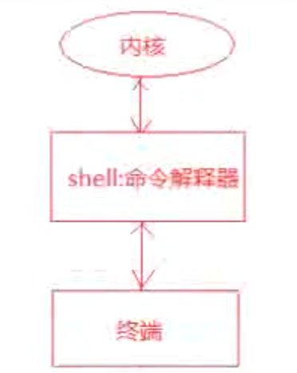
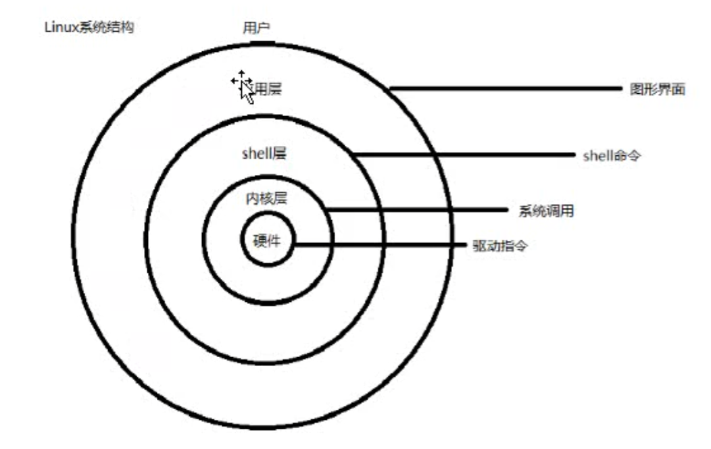
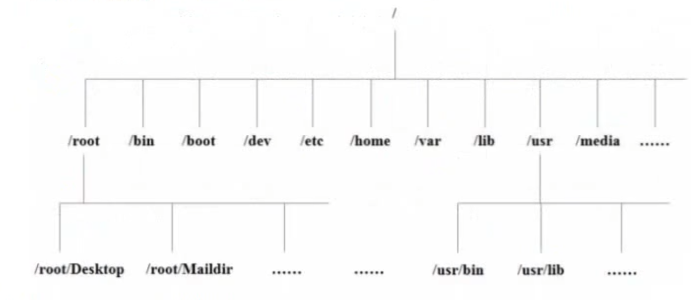

## linux基础命令和使用
1. 通常用全部大写的变量名表示常量
2. 动态变量的申明不用指定变量类型 a = 123 静态变量一般指定变量类型 int a = 123
3. Python还允许用r''表示''内部的字符串默认不转义 '' 里面的东西原样输出
4. ssh -keygen 即可生成ssh 钥匙，一路回车即可
	非对称加密算法
		使用 公钥 加密数据，需要 私钥 解密
		使用私钥 加密数据，血药使用 公钥 解密
5. 执行 ssh-copy-id -p port user@remote可以让远程的服务器记住我们的公钥  
6. ssh -p port22 user@remote 连接远程计算机
7. scp -P port22 user@remote  拷贝文件到远程服务器 加上-r 是拷贝文件夹 scp  -r ~/Desktop zjx:Desktop/demo
8. 配置别名 ssh zjx 即可
   
	```
		建立 ~/.ssh/config 文件
		 Host 别名
		 	HostName 远程ip地址
		 	User 远程用户名
		 	Port 22
	```

9. 用户和权限 的基本概念
	序号		权限		英文	  	 缩写	   数字代号
	01		读		read		  r		4
	02		写		write	 	  w		2
	03		执行		excute		  e		1
	- 表示文件 d 表示目录
	 硬链接数：通俗的讲，就是有多少种方式，可以访问到当亲目录 / 文件

		 chmod 可以修改用户/组 对文件/目录 的权限
		 	chmod +/— rwx文件名|目录名
		 	eg： chmod -rw 01.py 去掉文件的可读可写的文件权限
         	./01.py 表示执行这个文件

10. 创建组/删除组 的的终端命令都是要通过 sudo 执行
	groupadd 组名  					    添加组
	groupdel 组名							删除组
	cat/etc/group						确认组信息
	chgrp -R组名 文件/目录名				递归修改文件/目录的所属组
		eg：sudo droupdel dev
11. 创建用户/设置密码/删除用户
	useradd -m -g 组 新建用户名		添加用户		-m 自动建立用户家目录   -g 指定用户所在的组，否则会建立一个和同名的组
	passwd 用户名		设置用户密码		如果是普通用户，直接用passed 				可以修改自己的账户密码
	userdel -r 用户名	删除用户		-r选项会自动删除用户家目录
	cat/etc/passwd|grep 用户名		确认用户信息 新建用户后，用户信息会保存在 /etc		/passwd文件中  cat -n显示行号
12. 查看用户信息
	id【用户名】			查看用户的 UID和GID 信息	UID：用户标识 /etc/passed	GID：组标识/etc/group
	who					查看当前所有登陆的用户列表	
	whoami				查看当前登陆用户的账号名

	1.用户名 2.密码（x：表示的是加密的密码） 3. UID（用户标识） 4.GID（组标识） 5.用户全名或本地账号 6.加目录 
	7.登陆使用的Shell，就是登陆之后，使用的终端命令，ubuntu默认的是dash
13. usermod 可以用来设置 用户 的 主组/附加组 和登陆shell 
		主组：通常在新建用户时指定，在 etc/passwd 的第四列 GID对应的组
		附加组： 在etc/group 中最后一列标识改组的用户列表，用于指定 用户的附加权限
		提示：设置了用户的附加组之后，需要重新登陆才可以生效

		修改用户中的主组（passwd 中的 GID）
		usermod -g 组 用户名
		修改用户中的附加组
		usermod -G 组 用户名
		修改用户登陆shell 
		uermod -s /bin/bash 修改shell dash——>bash
		-- 
			注意：默认使用useradd 添加用户是没有权限使用 sudo 以 root 身份执行命令的，可以使用一下命令，将用户添加到sudo 附加组中        
			usermod -G sudo 用户名
		--
14. which 
		提示 /etc/passwd 是用于保存用户信息的文件  /usr/bin/passwd 是用于修改用户密码的程序
		which 命令可以查看执行命令所在位置
			eg： which ls 输出 /bin/ls
				 which useradd 输出 /usr/bin/useradd

15. bin/sbin
		在 linux 中，绝大多数可执行文件都保存在 /bin，/sbin，/usr/bin，/usr/sbin
		/bin （binary） 是二进制执行文件的目录，主要用于具体应用
		/sbin （system binary） 是系统管理员专用的二进制代码存放目录，主要用于系统管理
		/usr/bin （user commands for applicarions） 后期安装的一些软件
		/usr/sbin （super user commands for applications）超级用户的一些管理程序
16. su - 用户名 		切换用户  加上 - 直接切换到它的家目录
17. chown 修改拥有者  chgrp 修改组	 chmod 修改权限
		chown 用户名 文件名 | 目录名 			修改文件|目录的拥有者
		chgrp -R  组名 用户名 | 目录名    	递归修改文件|目录的组
		chmod -R 755 文件名|目录名   			递归修改文件权限  三个数字分别代表这  拥有者|组|其他  -rwxr-xr-x
		拥有者 r：4 w：2 X：1  	组 r：4 w：2 x：1 	其他 r:4 w：2 x：1

18. cal 查看日历，-y 选项可以查看一年的日历
	date 查看系统时间
	df -h   disk free 显示磁盘剩余空间
	du -h 【目录名】 disk usage显示目录下的文件大小  -h以人性化的显示文件大小
19. 进程信息 所谓进程，通俗的来说 当前正在执行的一个程序
	ps aux				process status 查看进程的详细状况
	top					动态显示运行中的进程并且排序 		退出输入	q
	kill[-9]进程代号		终止指定代号的进程，	-9表示强行终止
		ps 默认只会显示当前用户通过终端启动的应用程序  
		ps选项说明	a 显示终端上的所有进程，包括其他用户的进程
					u 显示进程的详细状态
					x 显示没有控制终端的进程	
		提示：使用 kill 命令时，最后值终止当前用户开启的过程，而不要终止 root 身份开启的过程，否则可能导致系统崩溃 
20. find [路径] -name “*.py” 查找指定路径下扩展名是.py 的文件，包括子目录 eg：`find -name “*1*”`
21. 软连接	ls -s被连接的源文件 链接文件		建立文件的软连接，用通俗的方式讲 类似于 windows下的快捷方式
		eg：` ln -s /home/python/Desktop/demo/b/c/01.py 01_jueduilujin`
		1. 没有-s 选项建立的是一个硬链接  
		2. 两个文件占用相同大小的磁盘空间，工作中几乎不会建立文件的硬链接
		3. 源文件要使用绝对路径，不能使用相对路径，这样可以方便移动链接文件后，仍然能够正常使用
		在 linux中，文件名 和 文件数据 是分开储存的
22.  打包/压缩
		`tar -cvf 打包文件.tar 被打包的文件 /路径    	打包文件	eg：tar -cvf py.tar 01.py 02.py 03.py`
		`tar -xvf 打包文件.tar `						
		解包文件`eg: tar -xvf py.tar`
		c：生产档案文件，创建打包文件		X:解开档案文件		v：列出归档的详细过程，显示进度		f： 指定档案文件名称，f后面一定是.tar文件，所以必须放选项最后  注意：f必须放在最后，其他选项顺序可以随意
23. 压缩和解压
		`tar：只负责打包文件，但是不压缩`
		`gzip压缩 tar 打包后文件，其扩展名一般为 xxx.tar.gz`
		`在linux 中，最常见的压缩文件格式就是 xxx.tar.gz`
		在tar 命令中有一个选项 -z 可以调用 gzip ，从而可以方便的实现压缩和解压缩的功能

		tar -zcvf 打包文件.tar.gz 被打包的文件 /路径 ... 		压缩文件
		tar -zxvf 打包文件.tar.gz  							解压缩文件
		tar -xvf 打包文件.tar.gz -C 目标文件				解压缩到指定路径
		-C 解压缩到指定目录，注意：要解压缩的目录必须存在
24. bzip2(two)
		tar 与 bzip2 命令结合可以使用实现文件 打包和压缩(用法和 gzip 一样)
		tar 只负责打包文件，但不压缩
		用bzip2 压缩 tar 打包文件后，其扩展名一般用 xxx.tar.bz2
		在tar 命令中有一个选项中 -j 可以调用 bzip2 ，从而可以方便的实现压缩 和 解压的功能
		`tar -jcvf 打包文件.tar.bz2 被打包的文件 /路径 ... `		压缩文件
		`tar -jxvf 打包文件.tar.bz2 `							解压缩文件
25. 通过apt 安装/卸载软件
		apt 是Advanced Packaging Tool，是linux 下的一款安装包管理工具
		`sudo apt install 软件包 `		安装软件
		`sudo apt remove 软件名`		卸载软件按
		`sudo apt upgrade` 			更新已安装的包	
		`sl，htop更加漂亮的显示`
26. gedit 编写文件 
	+ 安装 `apt-get install gedit`

## shell操作相关快捷键

### 1. shell相关概念

+ shell 就是 **命令解析器**
+ 命令解析器的作用：对用户输入到终端的命令进行解析，调用对应的执行程序
+ 
+ 用户在终端输入命令，由shell命令解释器对命令进行解析(按照$PATH环境变量搜索命令)，解析成内核能够识别的指令，然后由内核执行命令，最后由终端显示命令执行的结果给用户.

> 注意: shell在寻找命令的时候是按照$PATH环境变量去查找的，如果找到了就执行对应的命令，若找不到就报错，执行**echo $PATH**可以查看PATH环境变量的值.

+ 
+ 
+ 常用的命令解析器
  + shell --Bourne Shell
    + /bin/sh
  + bash -- Bourne Again Shell
    + /bin/bash
  + 当前系统所使用的shell
    + echo $SHELL
  + 当前系统下有哪些shell
    + cat /etc/shells

### 2. Linux下常用的快捷键
#### 2.1 tab键的使用

  + 补齐命令
    + 如:在终端输入 his然后按tab键，会补齐history命令;如:输入l然后按tab键，会显示所有以l开头的命令.
  + 补齐文件(包括目录和文件)
    + 例如:如果在执行ls，然后按tab键，会显示当前目录下所有的文件

  > 使用tab键的优点:减少用户输入，加快输入速度减少出错的机会.

#### 2.2 主键盘快捷键

+ 遍历输入的命令

  + 从当前位置向上遍历:ctrl+p (↑)
  + 从当前位置向下遍历:ctrl +n(↓)

  > 注意:使用history命令可以显示用户输入的所有命令。

+ 光标位置移动

  + 光标左移:ctrl+ b (←)
  + 坐标右移:ctrl +f (→)
  + 移动到头部:ctrl+ a (home)
  + 移动到尾部:ctIr +e (end)

+ 字符删除

  + 删除光标前边的字符:ctrl+h(Backspace)
  + 删除光标后边的字符:ctrl+d
    + 光标后边的字符即光标覆盖的字符
  + 删除光标前所有内容:ctrl+u
  + 删除光标后所有内容: ctrl+ k

### 3. Linux下的目录结构

#### 3.1 linux系统的目录结构

+ Linux系统的目录结构是一个倒立的树状结构，根目录用`/`表示，对比windows目录结构理解linux,的目录结构。
+ 

#### 3.2 Linux下主要目录介绍

+ `/bin: binary`，二进制文件，可执行程序，`shell`命令
  + 如: `ls` , `rm` , `mv`, `cp`等常用命令
+ `/sbin`: s是Super User的意思，这里存放的是系统管理员使用的系统管理程序。
  + 如`ifconfig`, `halt`, `shutdown`, `reboot`等系统命令
+ `/dev: device`，在 linux 下一切皆文件
  + 硬盘，显卡，显示器
  + 字符设备文件、块设备文件
    + 如:在input目录下执行: `sudo cat mouse0`，移动鼠标会显示有输入.
+ `/lib: linux`运行的时候需要加载的一些动态库
  + 如: `libc.so`、`libpthread.so`等
+ 
