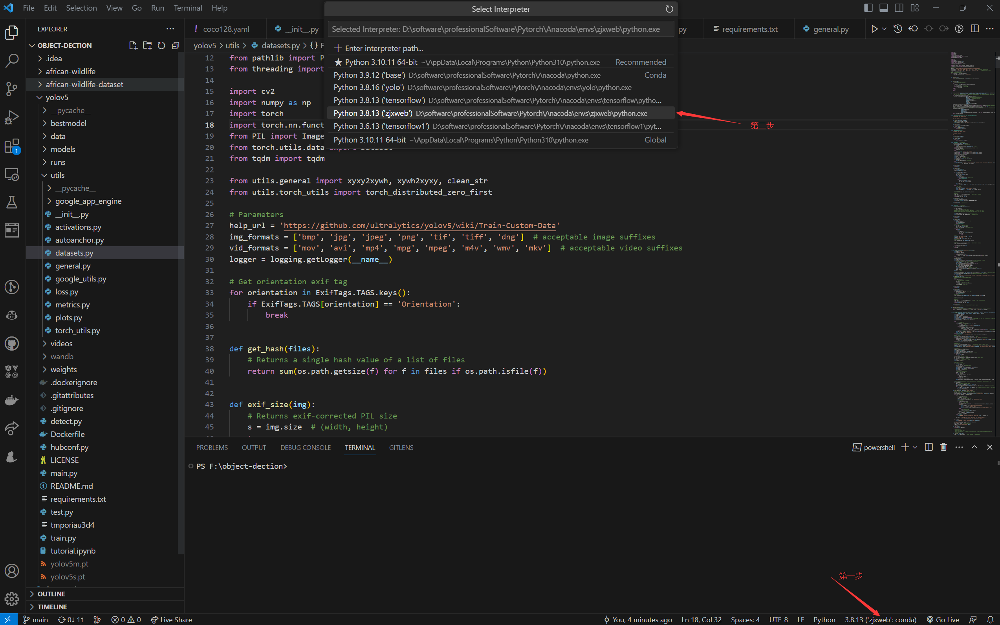
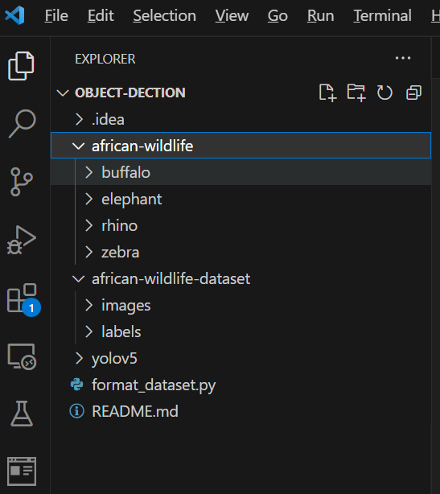
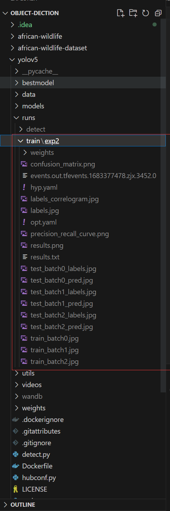
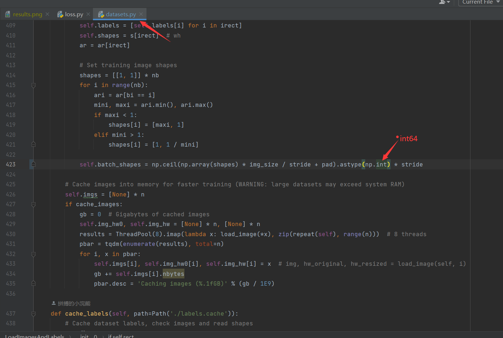
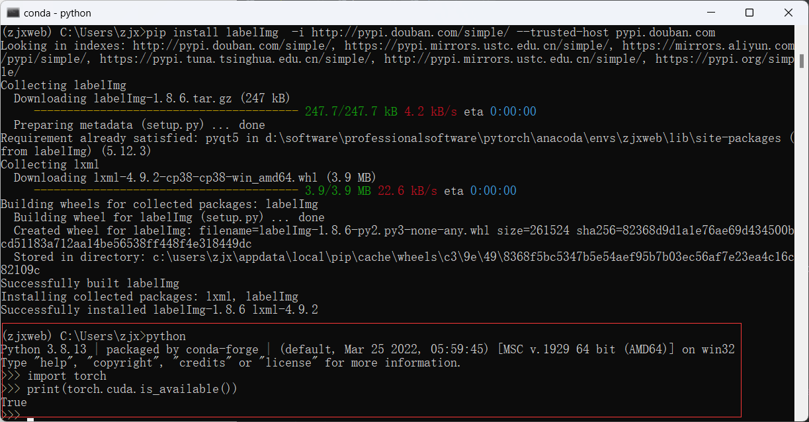
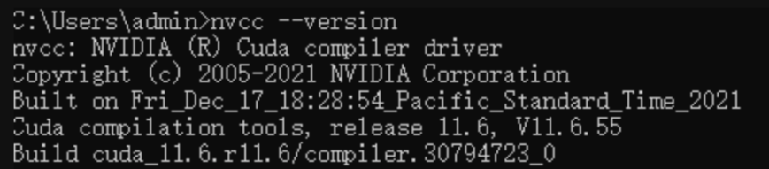
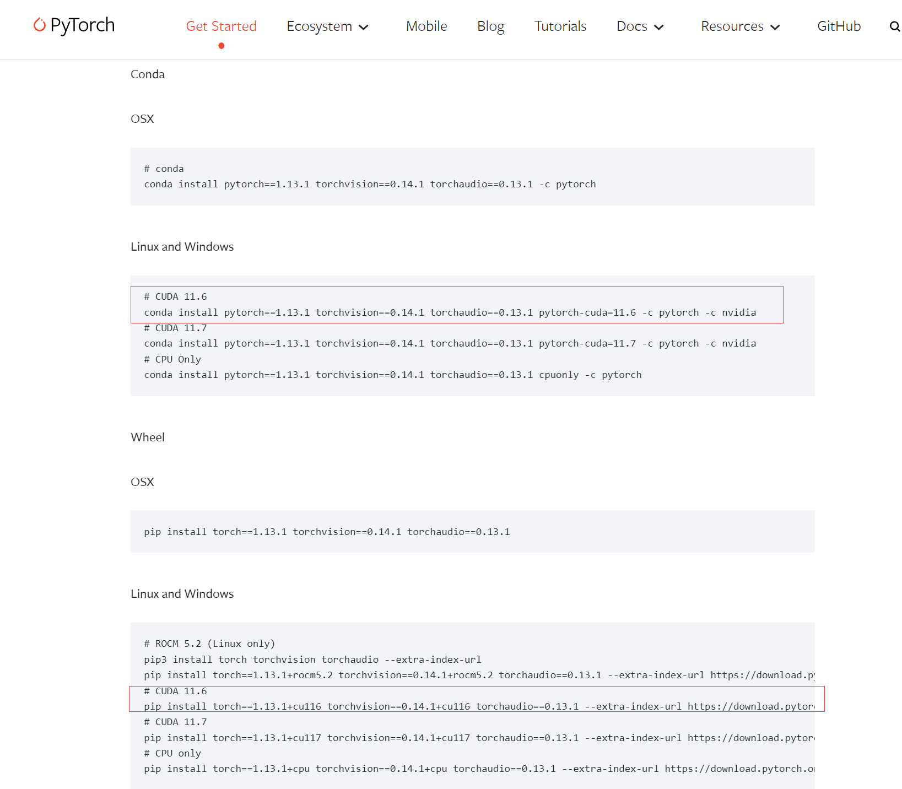
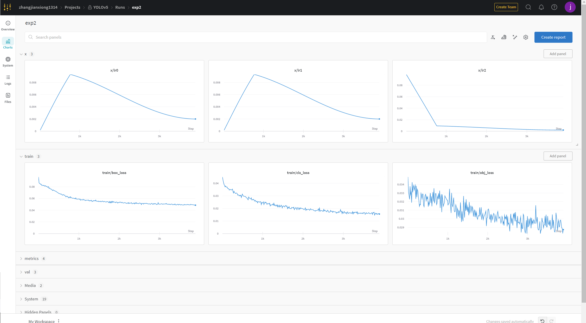
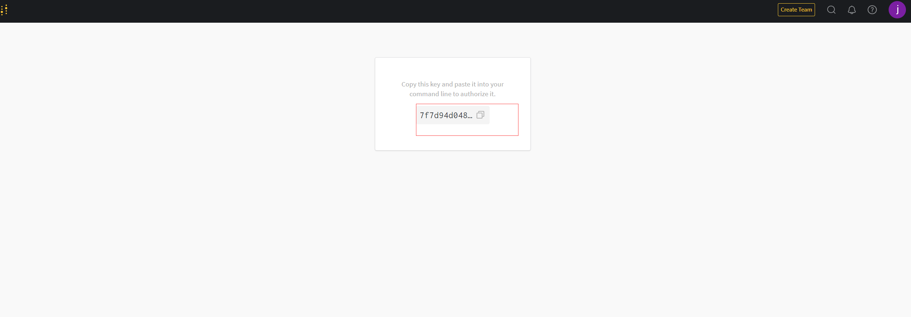

# `yolo`目标识别以及跟踪还是很强的嘞！

## 一. `YOLO V5`我来啦

### 1. 前期准备

#### `yolo V5`项目下载
+ [项目的github地址](https://github.com/zjxWeb/YOLOV5_animal)
+ [项目的gitee地址](https://gitee.com/chuangdu/yolov5_animal)
    + 使用git 克隆下来到项目目录下面就好

####  环境配置

   - 在`yolov5`的文件下面有一个 `requirements.txt`文件,这里就是环境依赖的说明。
   - 这里我以 `vscode` 为例（选择自己使用 `conda` 创建的虚拟环境）
     - 
   - 在 `vscode` 打开终端 输入  `pip install -r requirements.txt` 下载安装依赖包

####  创建数据集

   - 自己去找训练的图片啦

   - 接下来就是漫长的标注过程了！奥里给！

   - 我们使用的工具是`labelImg`

   - 继续我们在 `conda`终端输入以下命令进行安装

     > `pip install labelImg`

   - 等待下载完毕后再接着输入命令

     > `labelImg`

   - 然后我们就可以进行标注过程啦！

     - 
     > （1）是打开相应的图片文件
     > （2）首先在这里设定好保存的路径地址，这样待会直接“save”就很方便
     > （3）**这里一定！！！！要记得先设好形式！！！！**
     > （4）创建标记框
     > （5）删除标记框
     >
     > **注：同时注意保存的文件夹的形式。**
     
   - 然后在我们项目的根目录下面创建我们的数据目录用来存放我们的数据

     - `african-wildlife` 未分类之前的
     - `african-wildlife-dataset` 已经分类
       - 未分类到已分类，可执行程序 `format_dataset.py`
       - 命令 `python format_dataset.py`
     - 

     > 其中labels中的txt文件里面代表的是：每一行代表标注的一个目标，第一个数字代表着这个数的类别，后面的四个数字是归一化后的的标注的中心点坐标(x,y)和归一化标注框的宽和高(w,h)。

     > 注：这里文件夹名尽量是images和labels，不然会有各种报错，懒得去找哪里的原因，先让他跑起来吧（label也会报错，加了个s后他就乖了）

#### 更改配置

1. `coco128.yaml`

   + 可以参考我的改一下哦

   + ```python
     # COCO 2017 dataset http://cocodataset.org - first 128 training images
     # Train command: python train.py --data coco128.yaml
     # Default dataset location is next to /yolov5:
     #   /parent_folder
     #     /coco128
     #     /yolov5
     
     
     # download command/URL (optional)
     # download: https://github.com/ultralytics/yolov5/releases/download/v1.0/coco128.zip
     
     # train and val data as 1) directory: path/images/, 2) file: path/images.txt, or 3) list: [path1/images/, path2/images/]
     train: ../african-wildlife-dataset/images/train/  # 128 images
     val: ../african-wildlife-dataset/images/train/  # 128 images
     
     # number of classes
     nc: 4
     
     # class names
     names: [ 'buffalo', 'elephant', 'rhino', 'zebra' ]
     ```

   + nc：是你要检测有多少类

   + names是这些类的名字

2. `train.py`

   + ```python
     if __name__ == '__main__':
         parser = argparse.ArgumentParser()
         parser.add_argument('--weights', type=str, default='yolov5s.pt', help='initial weights path')
         parser.add_argument('--cfg', type=str, default='', help='model.yaml path')
         parser.add_argument('--data', type=str, default='data/coco128.yaml', help='data.yaml path')
         parser.add_argument('--hyp', type=str, default='data/hyp.scratch.yaml', help='hyperparameters path')
         parser.add_argument('--epochs', type=int, default=300)
         parser.add_argument('--batch-size', type=int, default=16, help='total batch size for all GPUs')
         parser.add_argument('--img-size', nargs='+', type=int, default=[640, 640], help='[train, test] image sizes')
         parser.add_argument('--rect', action='store_true', help='rectangular training')
         parser.add_argument('--resume', nargs='?', const=True, default=False, help='resume most recent training')
         parser.add_argument('--nosave', action='store_true', help='only save final checkpoint')
         parser.add_argument('--notest', action='store_true', help='only test final epoch')
         parser.add_argument('--noautoanchor', action='store_true', help='disable autoanchor check')
         parser.add_argument('--evolve', action='store_true', help='evolve hyperparameters')
         parser.add_argument('--bucket', type=str, default='', help='gsutil bucket')
         parser.add_argument('--cache-images', action='store_true', help='cache images for faster training')
         parser.add_argument('--image-weights', action='store_true', help='use weighted image selection for training')
         parser.add_argument('--device', default='0', help='cuda device, i.e. 0 or 0,1,2,3 or cpu')
         parser.add_argument('--multi-scale', action='store_true', help='vary img-size +/- 50%%')
         parser.add_argument('--single-cls', action='store_true', help='train multi-class data as single-class')
         parser.add_argument('--adam', action='store_true', help='use torch.optim.Adam() optimizer')
         parser.add_argument('--sync-bn', action='store_true', help='use SyncBatchNorm, only available in DDP mode')
         parser.add_argument('--local_rank', type=int, default=-1, help='DDP parameter, do not modify')
         parser.add_argument('--log-imgs', type=int, default=16, help='number of images for W&B logging, max 100')
         parser.add_argument('--log-artifacts', action='store_true', help='log artifacts, i.e. final trained model')
         parser.add_argument('--workers', type=int, default=0, help='maximum number of dataloader workers')
         parser.add_argument('--project', default='runs/train', help='save to project/name')
         parser.add_argument('--name', default='exp', help='save to project/name')
         parser.add_argument('--exist-ok', action='store_true', help='existing project/name ok, do not increment')
         parser.add_argument('--quad', action='store_true', help='quad dataloader')
         opt = parser.parse_args()
     ```

   + 以上代码可以根据自己的需求更改

     + weights是你选择的模型
     + data：因为我用的是`coco128.yaml`本身，所以我不用改~
     + epochs和batch-size你看着办吧
     + epochs是训练过程中整个数据集将被迭代多少次,显卡不行就调小些
     + batch-size：一次看完多少张图片才进行权重更新，同样的显卡不行就调小些
     + `device`使用显卡跑就将 `default`值调成和自己显卡对应的值，我的是 0

### 2. 是时候跑一下了

> 执行 ` python train.py --data coco128.yaml --cfg yolov5s.yaml --weights ' ' --batch-size 64`

+ 此时就是漫长的训练过程了等吧！，等吧！慢慢的等吧！
+ 哇哦！成功了！看截图！
  + 
  + 以上便是成功之后生成的文件图啦

### 3. 对结果进行验证

> 执行命令 `python detect.py --source .\videos\elephant-rhino2.mp4 --weights runs/train/exp2/weights/best.pt`

+ `--source`后面跟的是要识别的路径
+ `--weights` 就是你训练好的模型啦
+ source 0指的是电脑摄像头为源

### 4. 踩坑集结大部队啦！（报错是真的多啊）

#### `output type __int64报错`

+ 错误：`RuntimeError: result type Float can‘t be cast to the desired output type __int64报错`

+ 解决方法

  + 在 `yolov5\utils\loos.py`替换如下代码

  + ```python
    def build_targets(p, targets, model):
        # Build targets for compute_loss(), input targets(image,class,x,y,w,h)
        det = model.module.model[-1] if is_parallel(model) else model.model[-1]  # Detect() module
        na, nt = det.na, targets.shape[0]  # number of anchors, targets
        tcls, tbox, indices, anch = [], [], [], []
        gain = torch.ones(7, device=targets.device)  # normalized to gridspace gain
        ai = torch.arange(na, device=targets.device).float().view(na, 1).repeat(1, nt)  # same as .repeat_interleave(nt)
        targets = torch.cat((targets.repeat(na, 1, 1), ai[:, :, None]), 2)  # append anchor indices
    
        g = 0.5  # bias
        off = torch.tensor([[0, 0],
                            [1, 0], [0, 1], [-1, 0], [0, -1],  # j,k,l,m
                            # [1, 1], [1, -1], [-1, 1], [-1, -1],  # jk,jm,lk,lm
                            ], device=targets.device).float() * g  # offsets
    
        for i in range(det.nl):
            anchors, shape = det.anchors[i], p[i].shape
            gain[2:6] = torch.tensor(p[i].shape)[[3, 2, 3, 2]]  # xyxy gain
    
            # Match targets to anchors
            t = targets * gain
            if nt:
                # Matches
                r = t[:, :, 4:6] / anchors[:, None]  # wh ratio
                j = torch.max(r, 1. / r).max(2)[0] < model.hyp['anchor_t']  # compare
                # j = wh_iou(anchors, t[:, 4:6]) > model.hyp['iou_t']  # iou(3,n)=wh_iou(anchors(3,2), gwh(n,2))
                t = t[j]  # filter
    
                # Offsets
                gxy = t[:, 2:4]  # grid xy
                gxi = gain[[2, 3]] - gxy  # inverse
                j, k = ((gxy % 1. < g) & (gxy > 1.)).T
                l, m = ((gxi % 1. < g) & (gxi > 1.)).T
                j = torch.stack((torch.ones_like(j), j, k, l, m))
                t = t.repeat((5, 1, 1))[j]
                offsets = (torch.zeros_like(gxy)[None] + off[:, None])[j]
            else:
                t = targets[0]
                offsets = 0
    
            # Define
            bc, gxy, gwh, a = t.chunk(4, 1)  # (image, class), grid xy, grid wh, anchors
            a, (b, c) = a.long().view(-1), bc.long().T  # anchors, image, class
            gij = (gxy - offsets).long()
            gi, gj = gij.T  # grid indices
    
            # Append
            indices.append((b, a, gj.clamp_(0, shape[2] - 1), gi.clamp_(0, shape[3] - 1)))  # image, anchor, grid
            tbox.append(torch.cat((gxy - gij, gwh), 1))  # box
            anch.append(anchors[a])  # anchors
            tcls.append(c)  # class
    ```

#### `No loop matching the specified signature and casting was found for ufunc gre`

+ 解决方案：
  + 将此代码 `\# cum_counts = np.cumsum(np.greater(counts, 0, dtype=np.int32))`
    + 在终端点击报错信息就可到需要替换的位置
  + 替换成此代码 `cum_counts = np.cumsum(np.greater(counts, 0))`

#### module 'numpy' has no attribute 'int'

+ 报错信息 

  + ```tex
    `AttributeError: module 'numpy' has no attribute 'int'.
    `np.int` was a deprecated alias for the builtin `int`. To avoid this error in existing code, use `int` by itself. Doing this will not modify any behavior and is safe. When replacing `np.int`, you may wish to use e.g. `np.int64` or `np.int32` to specify the precision. If you wish to review your current use, check the release note link for additional information.
    ```

+ 解决方案：

  + 点击报错跳转， **只点击包含`datasets.py`的错误信息，跳转按如图进行修改**
  + 

#### 将device默认值改为0，使用GPU训练报错，修改方法如下

+ 报错信息：暂时找不到了 一般会出现 `device 0 `invalid等问题

+ 按如下输入

  + 

  + 如果返回False，请在conda内连接当前虚拟环境，**分别输入**

    + `pip uninstall torch`
    + `pip uninstall torchverison`

  + 完成后在cmd中输入`nvcc --version`

    + 

  + 或者参考

    + [pytorch安装](study/machineLearning/pytorch/)

  + 随后在pytorch官网查看对应的下面命令

    + **建议选择pip命令**
    + 
    + 等待安装完成应该就ok了，

    > 以上便是我遇到的所有报错，欢迎大家一起交流，指正！

### wand快速生成报告

+ 
+ 看到这样的图就问你心动不心动，所有的图标都可以下载哦
+ 第一步在 `conda`终端安装
  + `pip install wandb`
+ 第二步 注册并获取key
  + [wandb官网](https://wandb.ai/)
  + 
+ 第三步执行训练命令
  + 会弹出选择
    + 选择第二个，黏贴刚才复制的key
    + 回车大功告成
