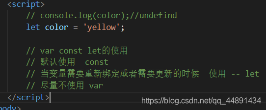

## 前端基础知识

### 1. 介绍一下CSS盒模型

+ content + padding + border + margin
+ 正常盒模型： box-sizing：content-box
  + width：width + 左右padding + 左右border
+ 怪异盒模型：box-sizing：borde-box

### 2. display：none 和 visibility：hidden的区别

+ 共同点：元素不可见
+ 不同点：
  + display：none 不会占据原来的空间
  + visibility：hidden 会占据原来的空间，类似于透明度为0

### 3. js事件循环机制

+ https://www.jianshu.com/p/51f7304a9344
+ https://blog.csdn.net/qq_45332221/article/details/114885833

### 4. this

+ https://www.cnblogs.com/pssp/p/5216085.html
+ 函数中直接使用
  + this指向windows
+ 函数作为对象的方法被调用（谁调用我 我就指向谁）

### 箭头函数的this

+ 箭头函数中的this是定义函数的时候绑定，而不是在执行函数的时候绑定的。
+ 箭头函数中，this指向的固定化，并不是因为箭头内部有绑定this的机制，实际原因是箭头函数根本没有自己的this，导致内部的this就是外层代码（继承自父执行上下文中的this）的this。正是因为它没有this，所以也就不能用作构造函数。

### 5.预编译

+ 作用域的创建阶段 预编译的阶段
+ 预编译的时候做了那些事情
+ js的变量对象 AO对象、供js引擎自己去访问的
+ 1. 创建了AO对象 
  2. 找形参和变量的声明 作为AO对象的属性名 指是undefined 
  3. 实参和形参相统一 
  4. 找函数声明 会覆盖变量的声明

### 6. call和apply的说明

+ call，apply都属于Function.prototype的一个方法，它是JavaScript引擎内在实现的，因为属于Function.prototype，所以每个Function对象实例(就是每个方法)都有call，apply属性。既然作为方法的属性，那它们的使用就当然是针对方法的了，这两个方法是容易混淆的，因为它们的作用一样，只是使用方式不同。
+ 语法：foo.call(this, arg1,arg2,arg3) == foo.apply(this, arguments) == this.foo(arg1, arg2, arg3);
+ 相同点：两个方法产生的作用是完全一样的。
+ 不同点：方法传递的参数不同。

### 7. 深拷贝与浅拷贝在其它语言中也经常被提及到，因为它们分别对应着值拷贝与引用拷贝。

+ 深拷贝：从字面上的意思理解，是指很深的拷贝，到底有多深呢？深到不仅拷贝值，而且还独立开辟了一个空间。我的理解是：拷贝的过程中，独立地开辟了一个空间，这个对象指向这个地址，与原来的对象互不干扰。深拷贝也被称为值拷贝。
+ 浅拷贝：从字面上的意思理解，是指比较浅的拷贝，它与原来的变量仍然指向同一个地址，两者之间相互影响，即其中一个改变会影响另一个的改变。浅拷贝也被称为引用拷贝，引用的意思就是取了个别名，例如张三是大名，狗蛋是他的引用，即为小名，张三变了，狗蛋自然也变了，因为他们本质上就是指同一个人

#### js中的深拷贝（值拷贝）

+ js中的基本数据类型：String Number Boolean Null Undefined，在赋值的过程中都是值拷贝.
  例如，let a = 10 ; b = a , 修改其中一个变量的值，不会影响到另一个变量的值

#### js中的浅拷贝（引用拷贝）

+ js中的对象数据类型：Object Array Function Map Set，在赋值过程中都是引用拷贝

```
  let obj = {
      name: '静如秋叶',
      age: 3,
      height: 100
  }
  let obj2 = obj
  obj2.name = '小花'
  console.log(obj)    // {name: '小花‘, age: 3, height: 100}
  console.log(obj2)   // {name: '小花‘, age: 3, height: 100}
```

+ 当修改obj2的name属性时，也会修改obj的name,因为它们指向同一块地址。

#### 将浅拷贝转换成深拷贝

+ 在实际的项目开发过程中，我们在多数情况下不希望将对象进行浅拷贝，因为值会相互影响，容易出错。这里主要讲js中的Array和Object类型从浅拷贝转换成深拷贝。

#### Array的深拷贝

##### 通过slice方法

+ slice()操作数组时，不会对原数组有影响，会产出一个新的数组。

 ```
 let arr1 = [1, 42, 5, 6]
 let arr2 = arr1.slice()
 arr2[0] = 100
 console.log(arr1) // [1, 42, 5, 6]
 console.log(arr2) // [100, 42, 5, 6]
 ```

+ 数组arr2的改变未引起arr1的变化

##### 通过concat方法

+ 数组的concat()方法，能够连接两个数组，同样不会改变原来的数组。用一个空数组连接另一个数组，即可实现深拷贝。

```
  let arr3 = ['cat', 'dog', 'pig']
  let arr4 = [].concat(arr3)
  arr3[2] = 'big pig'
  console.log(arr3) // ['cat', 'dog', 'big pig']
  console.log(arr4) // ['cat', 'dog', 'pig']
```

##### 通过ES6语法中 …

+ ES6语法中的 …， 我经常在数组的深拷贝中用到。

```
  let arr5 = [0, 0, 1]
  let arr6 = [...arr5]
  arr5[0] = 10000
  console.log(arr5) // [10000, 0, 1]
  console.log(arr6) // [0, 0, 1]
```

#####  通过Array.from方法

+ Array.from()方法能从一个类似数组或可迭代对象中返回一个新的数组实例。通过Array.from()方法能获取到一个数组的深拷贝。

```
  let arr7 = [1, 2, 3]
  let arr8 = Array.from(arr7)
  arr7[1] = 1000
  console.log(arr7) // [1, 1000, 3]
  console.log(arr8) // [1, 2, 3]
```

#### Object的深拷贝

#####  通过Object.assign()方法

+ ES6的Object.assign() Object.assign(target, …sources)用于对象的合并，将源对象中的所有可枚举属性，复制到目标对象中，并返回合并后的目标对象。后来的源对象的属性值，将会覆盖它之前的对象的属性。

```
 let person = {
     name: 'xia',
     age: 25,
     height: 160
 }
 let otherPerson = Object.assign({}, person)
 person.age = 30

 console.log(person)
 console.log(otherPerson)
```

#### 万能转换器（对Array和Object等都适用）

+ 前面讲解了 Array和Object的深拷贝方法，但是对于有更深层次的结构关系（数组套数组 数组套对象 对象套对象等），上面的方法就失灵了，可以看下面的例子。

```
  let personArr = [{name: 'xia'}, {name: 'zhang'}]
  let otherPersonArr2 = [...personArr]
  personArr[0].name = 'xia xia'
  console.log(personArr)
  console.log(otherPersonArr2)
```

+ 万能转换器 JSON.parse(JSON.stringify(obj))深拷贝已有对象，它可以深拷贝多层级的，不用担心嵌套问题。

```
  JSON.stringfy() 将对象序列化成json对象
  JSON.parse() 反序列化——将json对象反序列化成js对象
  JSON.stingify(obj)将js中的对象转换成JSON字符串
  let jack = {
      name: 'jack'
  }
  console.log(jack)
  console.log(JSON.stringify(jack))
```

+ 它们在格式上有区别。下图中的第一个是对象，name没有双引号括起来。第二个是json字符串，其中，name用双引号括起来了

```
JSON.parse()将json字符串解析成对象
 let obj = {
     name: '静茹秋叶'
 }
 console.log('obj: ', obj)
 console.log('json string: ', JSON.stringify(obj))

 let str = JSON.stringify(obj)
 console.log('--------------')
 console.log(str)
 console.log('str to obj: ', JSON.parse(str))
```

#### Vue中的浅拷贝与深拷贝

两个button-counter共用同一个jack对象，用同一块地址，当其中一个实例改变时，会影响另一个实例的值。(浅拷贝)

```
<!DOCTYPE html>
<html lang="en">
<head>
    <meta charset="UTF-8">
    <title>vue的data选项</title>
    <script src="https://cdn.jsdelivr.net/npm/vue/dist/vue.js"></script>
</head>
<body>
    <div id="app">
        <button-counter></button-counter>
        <button-counter></button-counter>
    </div>

    <script>
        let jack = {
            counter: 0
        }
        // 子组件
        Vue.component('button-counter', {
            data() {
                // 函数类型
                return jack
            },
            template: `<button @click="counter++">click {{counter}} times</button>`
        })
        let vm = new Vue({
            el: '#app' // mount到DOM上
        })
    </script>
</body>
</html>
```

+ 采用深拷贝，重新创建一块内存。这样，vue的button-counter组件中的counter值互不影响。

```
<!DOCTYPE html>
<html lang="en">
<head>
    <meta charset="UTF-8">
    <title>vue的data选项</title>
    <script src="https://cdn.jsdelivr.net/npm/vue/dist/vue.js"></script>
</head>
<body>
    <div id="app">
        <button-counter></button-counter>
        <button-counter></button-counter>
    </div>

    <script>
        let jack = {
            counter: 0
        }
        // 子组件
        Vue.component('button-counter', {
            data() {
                // 函数类型
                return JSON.parse(JSON.stringify(jack))
            },
            template: `<button @click="counter++">click {{counter}} times</button>`
        })
        let vm = new Vue({
            el: '#app' // mount到DOM上
        })
    </script>
</body>
</html>
```

## 什么是闭包，闭包有什么作用？

+ 闭包就是能够读取其他函数内部的变量的函数，本质上就是将函数内部和函数外部连接起来的一座桥梁
  用途：1：可以读取函数内部的变量2：可以让这些变量始终保存在内存中
  最简单的列子 for中添加延时器 打印下标：（会一直打印最后一个下标）
  解决方案就是通过闭包把变量i给存起来 详情看这https://blog.csdn.net/qq_46124502/article/details/106353007

## es6新特性（es6语法糖）

+ Let和const，两者都是块级作用域，let声明的变量，const声明的常量
+ const 生明的不可被修改 let 不可以声明前置 var 可以
+ 箭头函数，不需要function关键字来创建函数，继承上下文的this
+ 函数的参数默认值
+ 解构赋值，（这里具体的实现可以自行去了解下）从数组和对象中提取值，给变量赋值
+ For of遍历数组 for in遍历对象中的属性

## Es6规范：

+ 建议不使用var，使用let和const，优先使用const
+ Var定义的变量可以修改，如果不初始化会输出undefined
+ Let是块级作用域，在函数内部使用let定义，对函数外部没影响
+ Const定义的变量不可修改，而且必须初始化
+ 优先使用解构赋值
+ 使用import取代report
+ 静态字符一律使用单引号或反引号，不建议使用双引号

## h5新特性

+ 语义化标签-footer
+ 增强型表单-input多个type
+ 新增表单元素out put
+ 新增表单属性-placehoder min max
+ 音频、视频
+ Canvas和svg
+ 地理定位
+ Websocket

## css3新特性

+ 选择器
+ 背景和边框
+ 文本效果
+ 动画和过渡
+ 多列布局

## w3c标准

+ 是一系类标准的集合，结构标准html，表现标准css，动作标准javascrip，除此之外还有xml，dom标准。例如：所有标签都使用小写，同一页面同一id会冲突

## 响应式布局和自适应布局

+ 响应式布局“meta viewport”核心是媒体查询来设置样式media queries
+ 自适应布局：自动识别屏幕宽度，rem，百分比
+ 弹性布局（flex）：（https://blog.csdn.net/qq_46124502/article/details/106518826）

## js继承原理

+ 如果继承父类的属性和方法用call和apply (详情：https://blog.csdn.net/qq_46124502/article/details/106670773)
+ 如果继承父类原型直接将子类prototype指向父类prototype(详情：https://blog.csdn.net/qq_46124502/article/details/106708371)

## cookie，sessionstorage和localstorage的区别

```Cookie存储大小4kb，请求时会先发送到服务器，然后回传给浏览器，可以在同源页面中共享
sessionStorage和localStorage不会自动把数据发送给服务器，仅在本地保存。
cookie：只在设置的cookie过期时间之前有效，即使窗口关闭或浏览器关闭
sessionStorage：仅在当前浏览器窗口关闭之前有效；（存储大小再5MB）
localStorage：始终有效，窗口或浏览器关闭也一直保存，本地存储，因此用作持久数据；（存储大小再5MB）
sessionStorage：不在不同的浏览器窗口中共享，即使是同一个页面
localstorage和Cookie：在所有同源窗口中都是共享的；也就是说只要浏览器不关闭，数据仍然存在
```

## ajax请求原理

+ Ajax的原理简单来说通过XmlHttpRequest对象来向服务器发送异步请求，从服务器获得数据，
  然后用javascript来操作DOM而更新页面（XMLHttpRequest是ajax的核心机制）
+ 简单的说，也就是JavaScript可以及时的向服务器提出请求并及时响应。而不阻塞用户。达到无刷新效果。由事件触发，创建一个XMLHttpRequest对象，把HTTP方法 （POST/GET）和目标URL以及请求返回后的回调函数设置到XMLHttpRequest对象，通过XMLHttpRequest向服务器发送请求，请求发送后继续响应用户的界面交互，只有等到请求真正从服务器返回的时候才调用callback()函数，对响应数据进行处理。
+ 补充：Ajax的工作原理相当于在用户和服务器之间加了—个中间层(AJAX引擎)，使用户操作与服务器响应异步化。并不是所有的用户请求都提交给服务器

## 同源策略(jsonp)

+ 由于浏览器同源策略的限制，同一域名，同一协议，同一端口号，有一个不满足请求就会发生跨域问题
+ Jsonp可以突破同源策略的限制实现跨域
+ Jsonp执行过程：先在客户端注册一个callback，然后把callback的名字传给服务器，然后服务器返回数据会将这个callback参数作为函数名来包裹json数据这样客户端就可以随意定制自己的函数来自动处理返回的数据了（当然最简单的跨域解决方案就是后台操作 ，允许你进行跨域请求）

## 如何实现下拉刷新上拉加载

+ 下拉刷新：监听touchstart事件，记录初始值的值
+ 监听touchmove事件，记录计算当前滑动的值和初始值的距离，大于0表示向下拉动，并借助CSS3的translateY属性使元素跟随手势向下滑动对应的差值，并设置一个最大距离
+ 监听touchend事件，此时滑到最大值，触发callback，同时将距离设置为0，元素回到初始状态
  当滑动距离大于0时，提示正在下拉刷新，当滑到最大距离并松手时，执行回调函数，提示正在更新操作DropDownRefresh.vue
+ 上拉加载：获取当前滚动条的scrolltop值、当前可视范围的高度、文档的总高度，当滚动条和可视范围的高度大于文档总高度的时候，触发callback（考虑函数节流）PullUpReload.vue

## 移动端组件库有哪些

+ Mint-UI
+ vant

## 什么是vuex，为什么要使用vuex，vuex的属性

+ Vuex是vue的状态管理管理系统
+ 当我们遇到多个组件共享状态的时候，多层组件的传值非繁琐，不利于维护，因此我们把组件的共享状态抽取出来，以一个单例模式进行管理，在这种模式下，不管在哪个组件都可以获取状态或触发行为
+ 属性：state==》基本数据；getters==》从基本数据派生的数据；mutations==》提交更改数据的方法actions==》像一个装饰器，包裹着mutations，使之可以异步；modules==》模块化vuex

## vuex在页面刷新的时候会有什么问题？

+ Vuex在页面刷新后state数据会初始化（由于刷新后组件重新创建，生命周期重新执行）
+ Vuex中的数据保存在运行内存中，一旦刷新，运行内存的数据释放
+ 解决方法：在页面刷新前将vuex的数据先保存至sessionStorage（以防请求数据量过大页面加载时拿不到返回的数据）

## 什么是websocket，在哪些地方使用？

+ Upgrade: websocket Connection: Upgrade是核心(Websocket是一个持久化的协议)
  服务端就可以主动推送信息给客户端，因为ajax轮询的原理非常简单，让浏览器隔个几秒就发送一次请求，询问服务器是否有新信息。是非常消耗资源，ajax轮询 需要服务器有很快的处理速度和资源。long poll 需要有很高的并发，也就是说同时接待客户的能力。

## vue双向数据绑定原理及实现

+ 实现mvvm的双向绑定，采用数据劫持结合发布者-订阅者模式的方式，通过Object.defineProperty()来劫持各个属性的setter和getter(也就是说数据和视图同步，数据发生变化，视图跟着变化，视图变化，数据也随之发生改变；在数据变动时发布消息给订阅者，触发相应监听回调。)

## 块元素和行内元素有什么区别？

+ 块元素可以设置宽高，并且设置的宽度独占一行
+ 块元素：div，h1-6，img，hr，form
+ 行内元素：a，br，input，em，span
+ display：block设为块级元素

## 盒模型有几种，以及区别

+ 标准盒模型：设置的width或height是对实际内容（content）的width或height进行设置，内容周围的border和padding另外设置，即盒子模型的width（height）=设置的content的宽高+padding+border+margin
+ 怪异盒模型: 设置的width或height是对实际内容（content）+内边距（padding）+边框（border）之和的width和height进行设置的，其盒模型的width（height）=设置的width（height）+外边距margin.
  解决两者的兼容：可尝试对父元素使用内边距，对子元素使用外边距

## 定位

+ 相对定位：相对于自己原来的位置定位
+ 绝对定位的参照物是相对于该元素最近的已定位的祖先元素，如果没有一个祖先元素设置定位，那么 参照物是body。
+ 固定定位:相对于整个文档

## js的基础数据类型

+ js中有5种数据类型:Undefined、Null、Boolean、Number和String。

## 对数组遍历的几种方式

+ Foreach，map，for of （详细看这https://blog.csdn.net/qq_46124502/article/details/106438128）

## vue插槽

+ 插槽就是Vue实现的一套内容分发的API，将元素作为承载分发内容的出口。（没有插槽的情况下在组件标签内写一些内容是不起任何作用的，当我在组件中声明了slot元素后，在组件元素内写的内容就会跑到它这里了）具名插槽，就是给这个插槽起个名字

## vue实现页面跳转的几种方式

+ Router-link，this.r o u t e r . p u s h （ / 页 面 名 ） 、 t h i s . router.push（/页面名）、this.router.push（/页面名）、this.router.go（1）

## 小程序开发与vue开发有什么区别

+ 小程序开发路由放在app.json文件中，能在里面定义每一个路由，定义之后，可以自动创建wxss，js，wxml三个文件
+ Vue需要先创建组建之后，再在router.js里面引入这个路由
+ 微信小程序生命周期更多
  （还有就是数据渲染类，条件判断。赋值啊。需要自己大致的去看一下）

## CSS — flaot浮动的原因与副作用以及清除浮动

+ flaot浮动的原因：使用浮动之后，元素会脱离标准的文档流。（标准的文档流就是按照不同的元素种类，如块元素，行元素按照各自的特点去排列显示，虽然属性不同，但都是按照从上到下，从左到右的顺序进行排列）
+ 副作用：一个块元素，一个行内元素。行内元素如文字会浮动在浮动元素的周围，为浮动元素留出空间。
+ 副作用：两个块级元素浮动，出现父元素塌缩
+ 清除浮动产生的副作用：1.通过clear属性进行浮动消除（clear他不允许自己的周围有浮动这个属性主要是为了解决元素异位的问题，不能解决父元素塌陷的问题；针对异位的问题，我们只需要给发生异位的元素设置一个clear属性就行，如果是左浮动，clear的值就取left，其他的相应的去取。）
+ 清除浮动产生的副作用：2.手动给父元素加高度
+ 清除浮动产生的副作用：3.给父元素添加浮动
+ 清除浮动产生的副作用：4，给父元素添加overflow结合zoom:1一起使用（父元素样式里面加上overflow:hidden;和zoom:1，overflow主要是处理溢出问题的，我们这里就是子元素相对于父元素出现了溢出现象，zoom:1;的作用是为了兼容，大家都知道IE浏览器一直都是一个让人很头疼的东西，这个语句就是为了兼容IE浏览器的问题。）主要用来清除高度塌陷的问题

## web前端性能优化方法

+ html语义化
+ 语义化的html是让标签做自己该做的事，便于其他开发者阅读以及使代码规范，优雅整洁。 也是为了网络爬虫更好的解析。
+ 减少重复代码，压缩css，js代码大小
+ 你的背景图片保证不超过3个以上，你的css文件不超过2个，js文件不超过3个。而且良好的遵守web标准的一些规定，css放到head中，js文件放到之前或者之后。
+ 背景图片大小及数量1. 图片的大小可以压缩，尽量选择比较小的图片。2. 可将多张图片用css精灵之城 css sprites
+ 减少http请求，合理设置缓存1. 合并css，js文件，减少css，js重复代码，合并图片等都是为了减少http请求，应为每次http请求的代价都是非常昂过的，所以减少http请求能有效优化访问性能。　+ 缓存能缓存得更多，缓存得更久，也是可以大大减少http请求，就优化了访问性能。
  图片懒加载（lazyout images）(vue中插件lazyload)
+ 减少cookie传输
+ 一方面，cookie包含在每次请求和响应中，太大的cookie会严重影响数据传输，因此哪些数据需要写入cookie需要慎重考虑，尽量减少cookie中传输的数据量。另一方面，对于某些静态资源的访问，如CSS、script等，发送cookie没有意义，可以考虑静态资源使用独立域名访问，避免请求静态资源时发送cookie，减少cookie传输次数。
+ js中减少DOM操作，避免使用eval和 Function，减少作用域链查找（尽量把变量设为局部变量）。

## es6

### 新增的数据类型

+ Symbol保证每个属性的名字都是独一无二的
+ Set对象里面只要有重复的值就会只保留一个
+ Map可以允许任何类型作为对象的键，弥补了object只能使用字符串作为键的问题

### es6:for,foreach,for...in循环区别
```
<!DOCTYPE html>
<html lang="en">
<head>
    <meta charset="UTF-8">
    <meta name="viewport" content="width=device-width, initial-scale=1.0">
    <meta http-equiv="X-UA-Compatible" content="ie=edge">
    <title>Document</title>
</head>
<body>
    <script>
        const names = ['zhang','li','deng','mongodb'];

        // for(let i = 0;i < names.length;i++){
        //     console.log(names[i]);
        // }

        // names.forEach(name => {
        //     console.log(name)
        // })//不可以终止这个循环

        // for (let index in names) {//遍历对象中的可枚举的属性
        //    console.log(names[index])
        // }


        for(let name of names){//他循环的事数组对象的属性，可以终止循环
            console.log(name);
        }
    </script>
</body>
</html>
```

### es6：proxy
1. Proxy 是 ES6 中新增的功能，它可以用来自定义对象中的操作。
2. **target** 代表需要添加代理的对象，handler 用来自定义对象中的操作，比如可以用来自定义 **set** 或者 **get** 函数。
3. 使用演示：
 ```
 <!DOCTYPE html>
<html lang="en">
<head>
    <meta charset="UTF-8">
    <meta name="viewport" content="width=device-width, initial-scale=1.0">
    <meta http-equiv="X-UA-Compatible" content="ie=edge">
    <title>proxy</title>
</head>
<body>
    <script>
        const person  = { name:'zhang',age:22};
        const personProxy = new Proxy(person,{
            get(target,key){
                console.log(target,key);
                return target[key].toUpperCase();
            },
            set(target,key,value){
                if(typeof value === 'string'){
                    target[key] = value.trim();
                }
            }
        });//target:要代理的目标对象；handler：对象，包含了我们重写的一些操作

        personProxy.name = 'codecasts'
    </script>
</body>
</html>
 ```
 4. 实例代码
 ```
 <!DOCTYPE html>
<html lang="en">
<head>
    <meta charset="UTF-8">
    <meta name="viewport" content="width=device-width, initial-scale=1.0">
    <meta http-equiv="X-UA-Compatible" content="ie=edge">
    <title>实例</title>
</head>
<body>
   <script>
       const phonerHandler = {
        set(target,key,value){
            target[key] = value.match(/[0-9]/g).join('');
        },
        get(target,key){
            return target[key].replace(/(\d{3})(\d{4})(\d{4})/,'$1-$2-$3');
        }
       }

       const phoneNumber = new Proxy({},phonerHandler);

        // phoneNumber.home = '181 9803 1039'
        // "181 9803 1039"
        // phoneNumber.work = '191 9252 1039'
        // "191 9252 1039"
        // phoneNumber
        // Proxy {home: "18198031039", work: "19192521039"}
        // phoneNumber.work
        // "191-9252-1039"
        // phoneNumber.home
        // "181-9803-1039"
    </script>

</body>
</html>
 ```

### es6:for...of循环遍历迭代对象
```
<!DOCTYPE html>
<html lang="en">
<head>
    <meta charset="UTF-8">
    <meta name="viewport" content="width=device-width, initial-scale=1.0">
    <meta http-equiv="X-UA-Compatible" content="ie=edge">
    <title>Document</title>
</head>
<body>
    <script>
        const names = ['zhang','li','deng','mongodb'];


        // for(let name of names.entries()){//.entries()得到数组中的索引值和值  不适用与对象
        //     console.log(name);
        // }


        // function sum() {
        //    let total = 0;
        //    for(let num of arguments){
        //        total = total + num;
        //    }
        //    console.log(total)
        //    return total;
        // }

        // sum(10,20,10,10,120);

        let name = 'ugfuishdihs';
        for(let  nam of name){
            console.log(nam)
        }


        // for...of.. 也可以用于 NODElist
    </script>
</body>
</html>
```

### es6 原型继承
```
<!DOCTYPE html>
<html lang="en">
<head>
    <meta charset="UTF-8">
    <meta name="viewport" content="width=device-width, initial-scale=1.0">
    <meta http-equiv="X-UA-Compatible" content="ie=edge">
    <title>Document</title>
</head>
<body>
    <script>
        function User (name,email){
            this.name = name;
            this.email = email;
        }

        User.prototype.info = function(){
            console.log(`hi,I'm ${this.name}`)
        }
    
        const codecasts = new User('codecasts','ie@codecasts.com')

        User.prototype.info = function(){
            console.log(`hi,I'm ${this.name} ，my email is ${this.email}`)
        }
        User.prototype.decription = function(){
            console.log(`I'm a user of codecasts.com`)
        }
        

    </script>
</body>
</html>
```

### es6:数据类型 symbol
```
<!DOCTYPE html>
<html lang="en">
<head>
    <meta charset="UTF-8">
    <meta name="viewport" content="width=device-width, initial-scale=1.0">
    <meta http-equiv="X-UA-Compatible" content="ie=edge">
    <title>数据类型 symbol</title>
</head>
<body>
    <script>
        const peter = Symbol('peter');//创建唯一标志符
        const calssRoom = {
            [Symbol('a')]:{age:12},
            [Symbol('b')]:{age:142},
            [Symbol('b')]:{age:13}
        }

        const  syms = Object.getOwnPropertySymbols(calssRoom).map(sym => calssRoom[sym]);
        console.log(syms)
    </script>
</body>
</html>
```

### es6 使用 cure53/DOMPurify 来防止xss 攻击
```
	<!DOCTYPE html>
<html lang="en">
<head>
    <meta charset="UTF-8">
    <meta name="viewport" content="width=device-width, initial-scale=1.0">
    <meta http-equiv="X-UA-Compatible" content="ie=edge">
    <title>
        使用 cure53/DOMPurify 来防止xss 攻击
    </title>
</head>
<body>
     <div class="container">
         <form action="" class="add-comment">
             <textarea name="" id="" cols="30" rows="10" class="comment-text"></textarea>
             <button>Post Comment</button>
         </form>
         <div class="comment"></div>
     </div>
     <script>
         const addCommentForm = document.querySelector('add-comment');
         const textarea = document.querySelector('.comment-text');
         const commentDiv = document.querySelector('.comment')
         const user = 'zhang';
        function sanitize(string,...values){
            const dirty = strings.reduce((pre,curr,i) => `${pre} ${curr} ${values[i] || ' '},' '`)
        }


         addCommentForm.addEventListener('sumbit',function(event){
             event.preventDefault();//Event 接口的 preventDefault()方法，告诉user agent：如果此事件没有被显式处理，那么它默认的动作也不要做
             //（因为默认是要做的）。此事件还是继续传播，除非碰到事件侦听器调用stopPropagation() 或stopImmediatePropagation()，才停止传播。
             const newComment = textarea.value.trim();//去除字符串的头尾空格:
             if(newComment){
                 commentDiv.innerHTML = sanitize`
                    <div class="comment-header">${user}</div>
                    <div class="comment-body">${textarea}</div>
                 `
             }
             textarea.value = newComment;
         })
     </script>
</body>
</html>
```

## ES6中 var，const，let的使用规则
1.  var const let的使用

 	+  默认使用  const	
 	+  当变量需要重新绑定或者需要更新的时候  使用 -- let
 	+ 尽量不使用 var
2. var定义的变量，作用域是整个封闭函数，是全域的；
3. let定义的变量，作用域是在块级或者字块中；
4. 变量提升：不论通过var声明的变量处于当前作用于的第几行，都会提升到作用域的最顶部。
5. 而let声明的变量不会在顶部初始化，凡是在let声明之前使用该变量都会报错（引用错误ReferenceError）；
6. 只要块级作用域内存在let，它所声明的变量就会绑定在这个区域；
7. let不允许在相同作用域内重复声明（报错同时使用var和let，两个let）。
	- **报错的情况有：**
		- 同时使用var，let；
		- 两个 let 
8. const用来专门声明一个常量，它跟let一样作用于块级作用域；
	- 没有变量提升，重复声明会报错;
	- 不同的是const声明的常量不可改变，声明时必须初始化（赋值）;
9. 
10.测试和运行代码
```
<!DOCTYPE html>
<html lang="en">
<head>
    <meta charset="UTF-8">
    <meta name="viewport" content="width=device-width, initial-scale=1.0">
    <meta http-equiv="X-UA-Compatible" content="ie=edge">
    <title>Document</title>
</head>
<body>
    <script>
        // var 是函数的作用域，而且可以重新赋值
        // const 是块级作用域的，不可以重新赋值
        // let 块级作用域，可以重新赋值
        let count = 10;
        let discount = 0.9;
        const key = 'a,b,x';
        const person = {
            name: "zhang",
            age : 10
        } // 可以改变对象的属性
        const Jelly = Object.freeze(person);//不允许改变对象的属性
        (function(){
            var name = 'jelly';
            console.log(name);
        })();//立即执行函数Z

        {
            const name = "jelly";//使其不覆盖 window 下的name
        }
        for(let i = 0 ; i < 10;i++ ){
            console.log(i)
            setTimeout(function(){
                console.log(`i:${i}`);
            },1000)
        }
        //0
        //1
        //2
        //3
        //4
        //5
        //6
        //7
        //8
        //9
        //i:0
        //i:1
        //i:2
        //i:3
        //i:4
        //i:5
        //i:6
        //i:7
        //i:8
        //i:9
        for(var i = 0 ; i < 10;i++ ){
            console.log(i)
            setTimeout(function(){
                console.log(`i:${i}`);
            },1000)
        }
        //0
        //1
        //2
        //3
        //4
        //5
        //6
        //7
        //8
        //9
        // 10vsr,const,let.html:65 i:10
    </script>
</body>
</html>
```