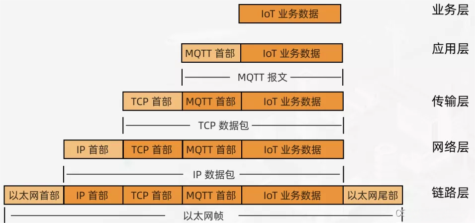

# 
# 数字孪生技术学习

+ 问题概述

<span style="color:red;font-weight:550;">实时问题1：某物体，1000m/s的速度，怎么实现映射、预测和VR展示？</span>

<span style="color:red;font-weight:550;">可控问题2: 某物体一旦点火就不能退回，如何实现可控或反馈？</span>

## 1. 概述

### 1.1 概念

+ 数字孪生体是现有或将有的**物理实体对象**的数字模型，
+ 通过**实测、仿真和数据分析**来实时**感知、诊断、预测物理实体对象的状态**，
+ 通过优化和指令来调控物理实体对象的行为，
+ 通过相关数字模型间的**相互学习**来进化自身，
+ 同时改进利益相关方在物理实体对象生命周期内的决策。

### 1.2 数字孪生的模型

+ 概念模型、参考框架、应用框架、成熟度模型之间的关系


+ 下图**粗实线**代表继承和泛化关系，细实线代表属性关系，虚线代表可选属性关系。左下角深蓝色是实体相关概念，左上角绿色是实体所在域的相关概念，右半边棕色是数字孪生体的相关概念，右上角红色是数字线程相关概念，其余分布在中间、左边、和底边的紫色是用于数字孪生体应用场景扩展的相关概念。


### 1.3 数字孪生系统参考架构


### 1.4 数字孪生体成熟模型

+ **数字孪生体的生长发育将经历：**<span style="color:red;font-weight:550;">数化、互动、先知、先觉、共智</span>
+ 
+ 
+ 

### 1.5 技术说明

+ <span style="color:red;font-weight:550;">建模、仿真和基于数据融合的数字线程</span>是数字孪生体的三项核心技术；

+ 统领建模、仿真和数字线程的系统工程和MBSE（基于模型的系统工程是一种形式化的方法，用于支持与复杂系统的开发相关的需求，设计，分析，验证和确认。与以文档为中心的工程，MBSE将模型放在系统设计的中心。），则成为数字孪生体的顶层架构技术；

+ 物联网是数字孪生体的底层伴生技术；

+ 云计算、机器学习、大数据、区块链是数字孪生体的外围使能技术；

  + 实现数字线程有如下需求

    + 能区分类型和实例。
    + 支持需求及其分配、追踪、验证和确认。
    + 支持系统跨时间尺度各模型视图间的实际状态记实、关联和追踪。
    + 支持系统跨时间尺度各模型视图间的关联和及其时间尺度模型视图的关联。
    + 记录各种属性及其值随时间和不同的视图的变化。
    + 记录作用于系统以及由系统完成的过程或动作。
    + 记录使能系统的用途和属性。
    + 记录与系统及其使能系统相关的文档和信息。

  + 云计算系统由云平台、云存储、云终端、云安全四个基本部分组成。

    + 用户角度：私有云、公有云、混合云。
    + 提供服务层次：基础设施即服务（laas）、平台即服务（Pass）和软件即服务（Saas）。
  
  + 构建单元级数字孪生体时需要满足的基本要求包括：
  
    1. 状态感知；
    2. 计算和处理数据；
    3. 物理实体控制；
  
  + 体系级数字孪生体需要满足的要求包括：
  
    1. 分布式数据存储和处理；
    2. 为企业协作提供数据和智能服务；
  
  + 区块链技术包括
  
    1. 分布式账本
    2. 共识机制
    3. 智能合约
    4. 密码学
  
    + 
	
### 1.6 NewIt与数字孪生的关系

+  **数字孪生与物联网**
  + 对物理世界的全面感知是实现数字孪生的重要基础和前提，物联网通过<span style="color:blue;font-weight:550;">**射频识别、二维码、传感器**</span >等数据采集方式为物理世界的整体感知提供了技术支持。
+ **数字孪生与3R**
  + 实现可视化与虚实融合是使虚拟模型真实呈现物理实体以及增强物理实体功能的关键。VR/AR/MR技术为此提供支持：
  + VR技术利用计算机图形学、细节渲染、动态环境建模等实现虚拟模型对物理实体属性、行为、规则等方面层次细节的可视化动态逼真显示；

  + AR与MR技术利用实时数据采集，场景捕捉，实时跟踪及注册等实现虚拟模型与物理实体在时空上的同步与融合，通过虚拟模型补充增强物理实体在检测、验证及引导等方面的功能。
+ **数字孪生与边缘计算**

  + 边缘计算技术可将部分从物理世界采集到的数据在边缘侧进行实时过滤、规约与处理，从而实现了用户本地的即时决策、快速响应与及时执行。

  + 结合云计算技术，复杂的孪生数据可被传送到云端进行进一步的处理，从而实现了针对不同需求的云-边数据协同处理，进而提高数据处理效率、减少云端数据负荷、降低数据传输时延，为数字孪生的实时性提供保障。
+ **数字孪生与云计算**
  + 数字孪生的规模弹性很大，单元级数字孪生可能在本地服务器即可满足计算与运行需求，而系统级和复杂系统级数字孪生则需要<span style="color:blue;font-weight:550;">**更大的计算与存储能力**</span>。
  + 云计算按需使用与分布式共享的模式可使数字孪生使用庞大的云计算资源与数据中心，从而动态地满足数字孪生的不同计算、存储与运行需求。
+ **数字孪生与5G**
  + 虚拟模型的精准映射与物理实体的快速反馈控制是实现数字孪生的关键。虚拟模型的精准程度、物理实体的快速反馈控制能力、海量物理设备的互联对数字孪生的数据**传输容量、传输速率、传输响应时间**提出了更高的要求。
  + 5G通信技术具有**高速率、大容量、低时延、高可靠**的特点，能够契合数字孪生的数据传输要求，满足虚拟模型与物理实体的海量数据低延迟传输、大量设备的互通互联，从而更好的推进数字孪生的应用落地。
+ **数字孪生与大数据**
  + 数字孪生中的孪生数据集成了**物理感知数据、模型生成数据、虚实融合数据**等高速产生的**多来源、多种类、多结构的全要素/全业务/全流程**的海量数据。
  + 大数据能够从数字孪生高速产生的海量数据中提取更多有价值的信息，以解释和预测现实事件的结果和过程。
+ **数字孪生与区块链**
  + 区块链可对数字孪生的安全性提供可靠保证，可确保孪生数据<span style="color:blue;font-weight:550;">**不可篡改、全程留痕、可跟踪、可追溯**</span>等。独立性、不可变和安全性的区块链技术，可防止数字孪生被篡改而出现错误和偏差，以保持数字孪生的安全，从而鼓励更好的创新。
  + 此外，通过区块链建立起的信任机制可以确保服务交易的安全，从而让用户安心使用数字孪生提供的各种服务。
+ **数字孪生与人工智能**
  + 数字孪生凭借其准**确、可靠、高保真的虚拟模型，多源、海量、可信的**孪生数据，以及实时动态的虚实交互为用户提供了**仿真模拟、诊断预测、可视监控、优化控制**等应用服务。
  + AI通过智能匹配最佳算法，可在无需数据专家的参与下，自动执行**数据准备、分析、融合**对孪生数据进行深度知识挖掘，从而生成各类型服务。
  + 数字孪生有了AI的加持，可<span style="color:blue;font-weight:550;">**大幅提升数据的价值以及各项服务的响应能力和服务准确性**</span>。

### 问题概述

+ **unity是否可以商用**
  + 游戏开发为例：开发的产品只是供娱乐为主则可以免费。如果开发的产品以盈利为主要目的，是需要在正版软件付费开发的。
+ **数字孪生相关的实例**
  + https://github.com/hawk86104/vue3-ts-cesium-map-show
    + 前端： http://map.217dan.com/addons/cesiummapv
    +  后端： http://map.217dan.com/aeSAZtOfuN.php 
      + 用户名:test 密码:12345678
  + https://forge-digital-twin.autodesk.io/
  + autodesk forge 平台演示视频 https://www.bilibili.com/video/av380813036?vd_source=97f1d2f43cfb254aee6535dca8f8f4ee
+ 数字孪生体案列总结
  + 国内关于数字孪生体相关的项目主要是以基于浏览器的形式的系统为主流，借助webGL、three.js、autodesk forge等来进行建模总后借助大数据分析将数据实时动态的传送给建模的模型中进行展示，最后通过浏览器进行呈现。

##  2.模型技术架构

### 2.1  硬件部分

#### 2.1.1 通信协议

+ **背景**
+ 在物联网场景开发中，大多数通信模组都支持**TCP、UDP、MQTT、CoAP、HTTP、LwM2M**等网络[通信协议](https://so.csdn.net/so/search?q=通信协议&spm=1001.2101.3001.7020)，其中既有负责**传输层协议**，也有**应用层协议，**不同协议适用的场景也不尽相同。
  
+ **协议分层**
+ 
  
+ 上图中举例了网络分层中最常见的几种协议：

  + **应用层**：应用程序负责将数据以相应规则(协议)进行包装，发给传输层
- MQTT：消息队列遥测传输
    - CoAP：受限应用协议
    - HTTP：超文本传输协议
    
+ **传输层**：负责将应用层传输过来的数组进行分组，为确保终端接收数据的顺序和完整性，会对每个分组进行标记，交给网络层
  - TCP：传输控制协议
  - UDP：用户数据协议
    
  + **网络层**：负责将传输层发过来的数据分组发送到目标终端
- IP：网际协议
  
+ **链路层**：为网络层发送和接收数据单元
  - Ethernet：以太网传输协议

+ **MQTT VS TCP**
  + 
  + 
  + **传输层协议**
    + 负责传输数据，好比一辆物流配送的火车。但我们想让货物去完好运到目的地，就需要做打包、装车、验货、入库、签回单等工作。这些工作也就是应用层协议要做的工作。所以物联网终端设备想要对数据进行稳定、可靠、高效的交互，就需要使用应用层协议，而不是直接使用传输层协议。

###  2.2 建模

####  2.2.1 建模方式一（unity + C# ||  JavaScript）

+ [中文官网](https://learn.unity.com/)
+ [英文官网](https://learn.unity.cn/)
+ [中文文档](https://docs.unity.cn/cn/current/Manual/index.html)
+ [C#教程](https://www.runoob.com/csharp/csharp-tutorial.html)

### 2.3 项目“数字孪生城市——兰州”

#### 2.3.1 开发架构

+ windows 可能会出现80端口占用，使用命令`net stop w3svc`来解决

+ GIS数据处理软件

  + QGIS
  + Blender

+ 材质填充，UV处理软件

  + C4D

+ 模型完善，脚本编写，交互编写

  + unity
  + C#编写
    + VS2019
      + http请求（UnityWebRequest）
        + https://docs.unity3d.com/cn/2019.4/Manual/UnityWebRequest-RetrievingTextBinaryData.html

+ web开发

  + VScode

  + web 框架

    + Vue全家桶

      1.vue-cli 项目构建工具
      2.vue-router 路由管理工具
      3.vuex 全局变量状态管理工具
      4.axios http请求工具
      5.element-ui / iview Ui组件库

    + 图标搭建

      + Echarts
      + Xcharts
  
  + 后端开发
  
    + NodeJS
      + 框架
        + express
  
  + 数据库
  
    + 关系型数据库：Mysql
    
  + 项目启动
  
    + 先打开 **小皮面板启动** **mysql** **web服务**
    + 在对应unity生成的webGL的文件根目录下使用命令`http-server`
    + 启动后台服务：`node index.js`
    + 启动前台服务： `npm run serve`

### 小结

+ 项目demo小节 	
  + 优点
    + 打通了从硬件、unity、web、服务端、数据库之间的数据交互。
    + 实现了数字孪生的一小部分
    + 了解了数字孪生的学习基本架构
  + 缺点
    + 项目完整度不够
    + 没有接入数据分析、机器学习、计算机视觉等技术并且在仿真这一块还有待进一步完善。
    + 数据分散，所有的数据没有统一上云。
    + 物联网端的数据走了，第三方的云平台，有一下缺陷：
      + 数据延迟高
      + 访问受限
      + 数据安全性较差
+ 数字孪生学习小结
  + 数字孪生的自我认识（数据的**分析、进化、预测和决策**  **仿真和人工智能**）
    + 数据分析、智慧分析、仿真模拟、终端数据采集、未来预测、高算力等为数字孪生的核心。
      + 数据分析：数据集中化管理，最好同一上云，有助于后面的数据分析。
      + 智慧分析：能够基于现有数据对存在的未知风险进行预测，并提供解决方案（如：无监督学习）。
      + 仿真模拟：对模型进行详细的仿真模型，使其可以和实物更为接近，为实验提供高精度的数据。
      + 终端数据采集：终端数据采集也可以被称为数字孪生的眼睛、耳朵、鼻子、皮肤来为整个系统提供数据来源。终端采集的数据是具有实时性，因此对主机的性能和存储都是十分依赖（此处可以利用算法来进行优化）。一般情况下此处会采用边缘计算的方法，来实现高速的数据传输，具体可以参考下图：
        + 
      + 未来预测：一方面可以根据已有的数据进行分析并结合深度学习相关的算法进行未知预测。
      + 高算力：由于数据是海量的所以说高算力也是数字孪生的挑战，在算法层面进行优化升级。

# Unity3d（webGL）构建数字孪生小案例
先来看看概念吧：

数字孪生体是现有或将有的物理实体对象的数字模型，

通过实测、仿真和数据分析来实时感知、诊断、预测物理实体对象的状态，

通过优化和指令来调控物理实体对象的行为，

通过相关数字模型间的相互学习来进化自身，

同时改进利益相关方在物理实体对象生命周期内的决策。

项目介绍：

重点来了！重点来了！重点来了！

    本项目是一个小的demo但是项目是一个完整的系统，设计到硬件、建模、前端、后端、数据库的开发，有点可惜的是——没有加入机器学习和计算机视觉相关的东西，自己正在学，希望后面可以更加完善，主要解决问题就是硬件、软件、数据库、建模的模型之间的数据交互，以及unity3d建模完成后如何在web上运行等一系列问题。

  


>  
> 本demo具有完整的代码，有简化的代码已上传到csdn上：已上传到CSDN：https://download.csdn.net/download/qq_44891434/86543456，可以自行提取，为简化版的，把多余的模块去掉了，如果想要完整版的可以关注微信公众号：“拼搏的小浣熊”，里面有我的联系方式，私聊我，私发。

 


构思：unity3d建模之后生成webGL格式，然后利用vue来进行二次开发，并在web端继续展示，模型可以和后端以及硬件之间可以做到实施的数据交互，彻底打通 硬件<--->模型<--->前端<----> 后端 <---> 数据库。

技术选型：

```
1. 建模：unity3d+C#

2. 前端：webGL，Vue全家桶

3. 服务端：Node.js(express.js)

4. 数据库：关系型数据库MySQL

5. 硬件：NodeMCU
```

界面截图：

登录界面：


主页面：


就业界面：


其余界面暂不展示。

使用到的工具和软件：

    建模使用的软件：QGIS、Blender、C4D、unity
    
    开发工具：VsCode、VS2020
    
    环境配置软件：小皮面板
# unity 3d与服务器以及数据库进行数据交互！！！（UnityWebRequest）
+ 数字孪生最重要的一步便是数据的通信，这里的数据通信包含了，数字模型和物理模型之间的通信。而对于数字模型在前面的介绍（[跳转前面介绍的](https://mp.weixin.qq.com/s?__biz=Mzg5MDU5ODk2OQ==&mid=2247484300&idx=1&sn=dffe183e5258ed6d607e2fd34b19e168&chksm=cfdb60daf8ace9cc8b378bd22c8cc5411d16e5254e395a0c50cbfdcc78f5d4020a684c9f12c7#rd)），我们采用的是unity3d来完成的，当然这里介绍的数据交互，重要也是以unity3d来介绍，但是大致的思想和原理都是一样的。下面简单做个介绍： 
+ 这里是我的理解，如果有错误的地方还请大家指出来，一起交流，学习。在unity 3d中自己采用的是C#脚本来完成。采用的是API的方式，类似与web的数据交互，也是通过搭建后端服务，然后后端服务将从数据库取出来的数据进行处理，在以API的形式，发送到前端，这时候前端只需要请求这个地址，并传对应的参数，即可完成数据的交互。
+ **这里是代码，大家参考一下，过程比较简单，就不画图了，如果需要可以在评论区，回复，根据情况在画！**
```
using UnityEngine;
using System.Collections;
using System.Collections.Generic;
using UnityEngine.Networking;
using Newtonsoft.Json;
using Newtonsoft.Json.Linq;

public class http : MonoBehaviour
{
    public float speed = 0.1f;

    //private int degree;
    public string rssTitle;
    public GameObject LightObj;
    public Light LightCon;
    void Start()
    {
        //StartCoroutine(GetTexture());
        LightCon = LightObj.GetComponent<Light>();
        InvokeRepeating("doSomething", 0, 2);
    }
    void doSomething()
    {
       StartCoroutine(GetTexture());
    }
    IEnumerator GetTexture()
    {
       
        UnityWebRequest www = UnityWebRequest.Get("http://127.0.0.1:3000/day");
        yield return www.SendWebRequest();
        if (www.isNetworkError || www.isHttpError)
        {
            Debug.Log(www.error);
        }
        else
        {
            // 将结果显示为文本
            string product = www.downloadHandler.text;
            JObject rss = JObject.Parse(product);
            rssTitle = (string)rss["result"][0]["day"];
            if (rssTitle == "1")
            {
                LightCon.enabled = false;
                 Debug.Log("1");
            }
            if (rssTitle == "0")
            {
                LightCon.enabled = true;
                Debug.Log("0");
            }
            // 或者以二进制数据格式检索结果
            byte[ ] results = www.downloadHandler.data;
        }
    }}

