# 分布式服务器编程

# 一. 项目概述及FastDFS
## 1. 项目架构图

### 1.1 一些概念

1. 什么是服务器
   - 硬件: 一台配置高的电脑
   - 软件: 电脑必须有一个能够解析http协议的软件
2. 常见的Web服务器

   - tomcat服务器

     - apache组织产品, 开源的免费服务器
   - weblogic 服务器
       - bea公司, 收费的服务器
       - 不交费, 访问量受限制

   - IIS服务器

     - Internet Information Server

     - 微软公司主推的服务器

   - nginx

     - 小巧且高效的HTTP服务器
     - 也可以做一个高效的负载均衡反向代理
     - 邮件服务器
       - pop3/smtp/imap

### 1.2 项目架构图


1. 客户端
   - 网络架构:
     - b/s
       - 必须使用http协议
     - c/s
       - 协议可以随意选择
       - Qt -> http
2. 服务器
   - Nginx
     - 能处理静态请求 -> html, jpg
     - 动态请求无法处理
     - 服务器集群之后, 每台服务器上部署的内容必须相同
   - fastCGI
     - 帮助服务器处理动态请求
3. 反向代理服务器
   - 客户端并不能直接访问web服务器, 直接访问到的是反向代理服务器
   - 客户端静请求发送给反向代理服务器, 反向代理将客户端请求转发给web服务器
4. 关系型数据库
   - 存储文件属性信息
   - 用户的属性信息
5. redis - 非关系型数据库 (内存数据库)
   - 作用提出程序效率
   - 存储是服务器经常要从关系型数据中读取的数据
6. FASTDFS - 分布式文件系统
   - 存储文件内容
   - 供用户下载

## 2. 分布式文件系统

### 2.1 传统文件系统

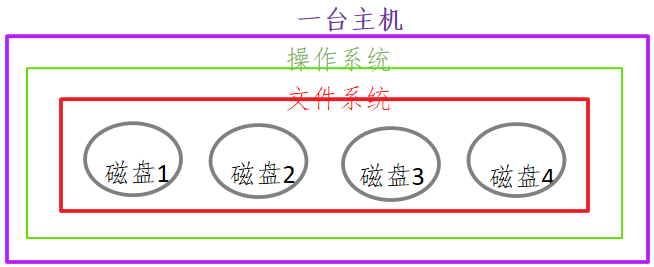

- 传统的文件系统格式:
  - ntfs / fat32 / ext3 / ext4
- 可以被挂载和卸载

### 2.2 分布式文件系统

> 文件系统的全部, 不在同一台主机上，而是在很多台主机上，多个分散的文件系统组合在一起，形成了一个完整的文件系统。 

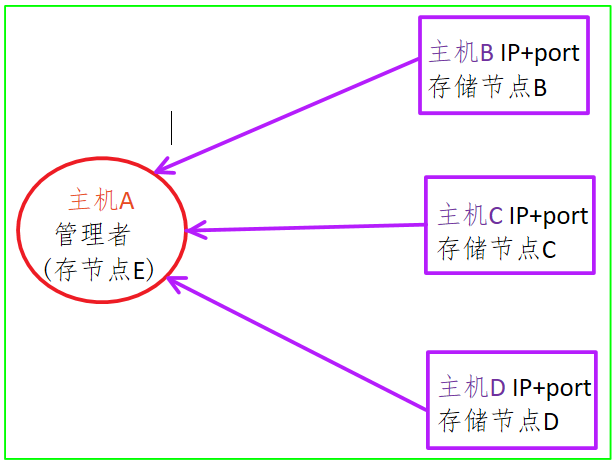

> 分布式文件系统:
>
> 1. 需要有网络
> 2. 多台主机
>    - 不需要在同一地点
> 3. 需要管理者
> 4. 编写应用层的管理程序
>    - 不需要编写

## 3. FastDFS

### 3.1 fastDFS介绍

1. fastDFS概述

   > - 是用**c语言**编写的一款开源的分布式文件系统。
   >   - 余庆 - 淘宝的架构师
   > - 为互联网量身定制，充分考虑了冗余备份、负载均衡、线性扩容等机制，注重高可用、高性能等指标
   >   - 冗余备份: 纵向扩容
   >   - 线性扩容: 横向扩容
   > - 可以很容易搭建一套高性能的文件服务器集群提供文件==**上传、下载**==等服务。
   >   - 图床
   >   - 网盘

2. fastDFS框架中的三个角色

   - 追踪器 ( Tracker ) - 管理者 - 守护进程
     - 管理存储节点
   - 存储节点 - storage - 守护进程
     - 存储节点是有多个的
   - 客户端 - 不是守护进程, 这是程序猿编写的程序
     - 文件上传
     - 文件下载

3. fastDFS三个角色之间的关系 

   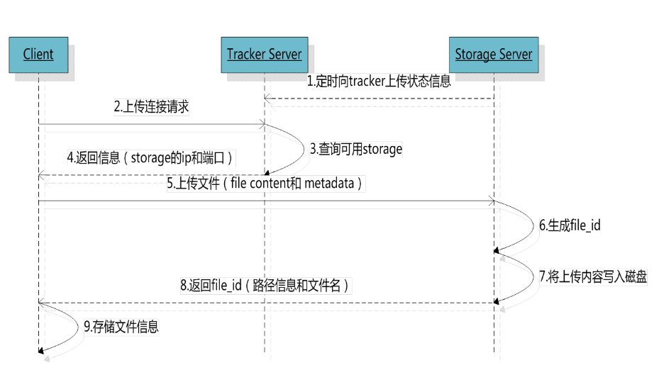

   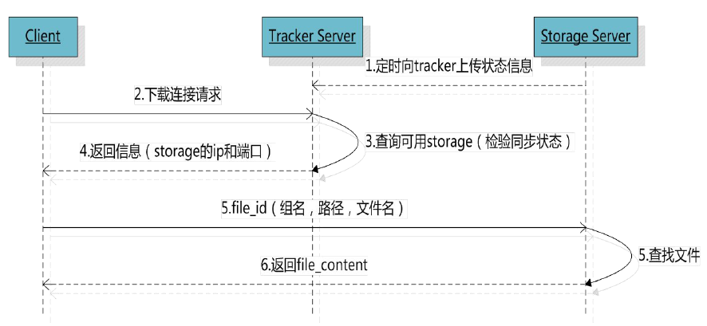

   1. 追踪器
      - 最先启动追踪器
   2. 存储节点
      - 第二个启动的角色
      - 存储节点启动之后, 会单独开一个线程
        - 汇报当前存储节点的容量, 和剩余容量
        - 汇报数据的同步情况
        - 汇报数据被下载的次数
   3. 客户端
      - 最后启动
        - 上传
          - 连接追踪器, 询问存储节点的信息
            - 我要上传1G的文件, 询问那个存储节点有足够的容量
            - 追踪器查询, 得到结果
            - 追踪器将查到的存储节点的IP+端口发送给客户端
            - 通过得到IP和端口连接存储节点
            - 将文件内容发送给存储节点
        - 下载
          - 连接追踪器, 询问存储节点的信息
            - 问一下, 要下载的文件在哪一个存储节点
            - 追踪器查询, 得到结果
            - 追踪器将查到的存储节点的IP+端口发送给客户端
            - 通过得到IP和端口连接存储节点
            - 下载文件

4. fastDFS集群 - （了解即可）

   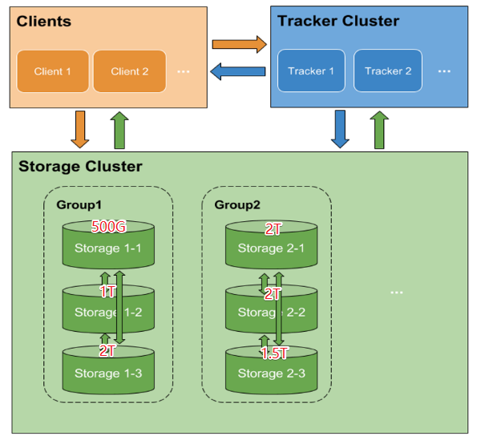

   1. 追踪器集群
      - 为什么集群？
        - 避免单点故障
      - 多个Tracker如何工作？
        - 轮询工作
      - 如何实现集群？
        - 修改配置文件
   2. 存储节点集群
      - fastDFS管理存储节点的方式？
        - 通过分组的方式完成的
      - 集群方式（扩容方式）
        - 横向扩容 - 增加容量
          - 添加一台新的主机 -> 容量增加了
          - 假设当前有两个组: group1, group2
            - 需要添加一个新的分组 -> group3
              - 新主机属于第三组
          - 不同组的主机之间不需要通信
        - 纵向扩容 - 数据备份
          - 假设当前有两个组: group1, group2
            - 将新的主机放到现有的组中
            - 每个组的主机数量从1 -> N
              - 这n台主机的关系就是相互备份的关系
              - 同一个组中的主机需要通信
              - 每组的容量 == 容量最小的这台主机
      - 如何实现?
        - 通过修改配置文件可实现

### 3.2 fastDFS安装

1. fastDFS安装

   - libfastcommon-1.36.zip
     - fastdfs的基础库包
     - unzip xxx.zip
     - ./make.sh
     - ./make.sh install
   - fastdfs-5.10.tar.gz
     - tar zxvf xxx.tar.gz
     - ./make.sh
     - ./make.sh install

2. 测试

   ```shell
   #fastDFS安装的所有的可执行程序: 
   /usr/bin/fdfs_*
   fdfs_test
   ```

### 3.3 fastDFS配置文件

> 配置文件默认位置:  /etc/fdfs
>
> client.conf.sample  storage.conf.sample  storage_ids.conf.sample  tracker.conf.sample

1. tracker 配置文件

   ```shell
   # 将追踪器和部署的主机的IP地址进程绑定, 也可以不指定
   # 如果不指定, 会自动绑定当前主机IP, 如果是云服务器建议不要写
   bind_addr=192.168.247.135
   # 追踪器监听的端口
   port=22122
   # 追踪器存储日志信息的目录, xxx.pid文件, 必须是一个存在的目录
   base_path=/home/yuqing/fastdfs
   ```

2. storage 配置文件

   ```shell
   # 当前存储节点对应的主机属于哪一个组
   group_name=group1
   # 当前存储节点和所应该的主机进行IP地址的绑定, 如果不写, 有fastdfs自动绑定
   bind_addr=
   # 存储节点绑定的端口
   port=23000
   # 存储节点写log日志的路径
   base_path=/home/yuqing/fastdfs
   # 存储节点提供的存储文件的路径个数
   store_path_count=2
   # 具体的存储路径
   store_path0=/home/yuqing/fastdfs
   store_path1=/home/yuqing/fastdfs1
   # 追踪器的地址信息
   tracker_server=192.168.247.135:22122 
   tracker_server=192.168.247.136:22122 
   ```

3. 客户端配置文件

   ```shell
   # 客户端写log日志的目录
   # 该路径必须存在
   # 当前的用户对于该路径中的文件有读写权限
   # 当前用户robin
   # 指定的路径属于root
   base_path=/home/yuqing/fastdfs
   # 要连接的追踪器的地址信息
   tracker_server=192.168.247.135:22122 
   tracker_server=192.168.247.136:22122 
   ```


   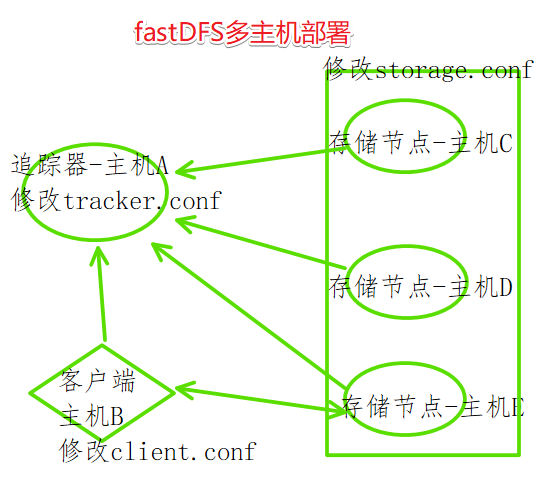

   1. 安装fastDFS安装包

### 3.4 fastDFS的启动

1. 第一个启动追踪器  - 守护进程

   ```shell
   # 启动程序在 /usr/bin/fdfs_*
   # 启动
   fdfs_trackerd 追踪器的配置文件(/etc/fdfs/tracker.conf) 
   # 关闭
   fdfs_trackerd 追踪器的配置文件(/etc/fdfs/tracker.conf)  stop
   # 重启
   fdfs_trackerd 追踪器的配置文件(/etc/fdfs/tracker.conf) restart
   ```

2. 第二个启动存储节点 - 守护进程

   ```shell
   # 启动
   fdfs_storaged 存储节点的配置文件(/etc/fdfs/stroga.conf)
   # 关闭
   fdfs_storaged 存储节点的配置文件(/etc/fdfs/stroga.conf) stop
   # 重启
   fdfs_storaged 存储节点的配置文件(/etc/fdfs/stroga.conf) restart
   ```

3. 最后启动客户端 - 普通进程

   ```shell
   # 上传
   fdfs_upload_file 客户端的配置文件(/etc/fdfs/client.conf) 要上传的文件
   # 得到的结果字符串: group1/M00/00/00/wKj3h1vC-PuAJ09iAAAHT1YnUNE31352.c
   # 下载
   fdfs_download_file 客户端的配置文件(/etc/fdfs/client.conf) 上传成功之后得到的字符串(fileID)
   ```

4. fastDFS状态检测

    - 命令

      ```shell
      fdfs_monitor /etc/fdfs/client.conf
      ```

    - [Storage Server的7种状态](./src/https://blog.csdn.net/u014723529/article/details/46048411)

      https://blog.csdn.net/u014723529/article/details/46048411

      ```shell
      # FDFS_STORAGE_STATUS：INIT      :初始化，尚未得到同步已有数据的源服务器
      # FDFS_STORAGE_STATUS：WAIT_SYNC :等待同步，已得到同步已有数据的源服务器
      # FDFS_STORAGE_STATUS：SYNCING   :同步中
      # FDFS_STORAGE_STATUS：DELETED   :已删除，该服务器从本组中摘除
      # FDFS_STORAGE_STATUS：OFFLINE   :离线
      # FDFS_STORAGE_STATUS：ONLINE    :在线，尚不能提供服务
      # FDFS_STORAGE_STATUS：ACTIVE    :在线，可以提供服务
      ```

### 3.5 对file_id的解释


- group1
  - 文件上传到了存储节点的哪一个组
  - 如果有多个组这个组名可变的
- M00 - 虚拟目录
  - 和存储节点的配置项有映射
    - store_path0=/home/yuqing/fastdfs/data    ->  M00
      store_path1=/home/yuqing/fastdfs1/data   -> M01
- 00/00
  - 实际的路径
  - 可变的
- wKhS_VlrEfOAdIZyAAAJTOwCGr43848.md
  - 文件名包含的信息
  - 采用Base64编码
    - 包含的字段包括

      - 源storage server Ip 地址  
      - 文件创建时间  

      - 文件大小  

      - 文件CRC32效验码 

        - 循环冗余校验  

      - 随机数

## 4. 上传下载代码实现

1. 使用多进程方式实现

   - exec函数族函数

     - execl
     - execlp

   - 父进程

     - 子进程 -> 执行

       execlp("fdfs_upload_file" , "xx", arg, NULL), 有结果输出, 输出到终端

       - 不让它写到终端 -> 重定向dup2(old, new)
         - old-> 标准输出
         - new -> 管道的写端
         - 文件描述符
         - 数据块读到内存 -> 子进程
           - 数据最终要给到父进程
       - pipe -> 读端, 写端
         - 在子进程创建之前创建就行了

     - 父进程

       - 读管道 -> 内存
       - 内存数据写数据库

   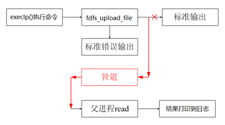

2. 使用fastDFS API实现

   - 

## 5. 源码安装 - 回顾

安装流程:

1. 以下文件, 里边有安装步骤
   - readme 
   - readme.md 
   - INSTALL
2. 找 可执行文件 <font color=green>configure</font>
   - 执行这个可执行文件
     - 检测安装环境
     - 生成 makefile
3. 执行**make**命令
   - 编译源代码
     - 生成了动态库
     - 静态库
     - 可执行程序
4. 安装 **make install** (需要管理员权限)
   - 将第三步生成的动态库/动态库/可执行程序拷贝到对应的系统目录

## 6. 复习

1. fastDFS

   - 是什么?

     - 分布式文件系统

   - 干什么?

     - 提供文件上传
     - 提供文件下载

   - 怎么使用?

     - 根据主机的角色 -> 修改对应的配置文件

     - 启动各个角色

       ```shell
       fdfs_trackerd /etc/fdfs/tracker.conf
       fdfs_storaged /etc/fdfs/storage.conf
       ```


     客户端编写
    
     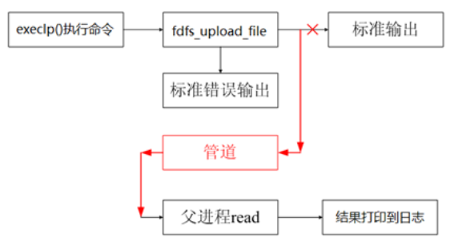
    
     - 操作步骤
    
       1. 创建管道 - pipe
       2. 创建子进程
       3. 子进程干什么?
    
          - 写管道, 关闭读端
            - 将标准输出 -> 管道的写端
          - 重定向
          - 执行execl命令, 调用另外的进程fdfs_upload_file
          - 子进程退出
       4. 父进程？
          - 读管道， 关闭写端
          - 释放子进程资源 - pcb
            - wait()/ waitpid()


# 二. 数据库概述及Redis
## 1. 数据库类型

### 1.1 基本概念

1. 关系型数据库 - sql
   - 操作数据必须要使用sql语句
   - 数据存储在磁盘
   - 存储的数据量大
   - 举例:
     - mysql
     - oracle
     - sqlite - 文件数据库
     - sql server
2. 非关系数据库 - nosql
   - 操作不使用sql语句
     - 命令
   - 数据默认存储在内存
     - 速度快, 效率高
     - 存储的数据量小
   - 不需要数据库表
     - 以键值对的方式存储的

### 1.2 关系/非关系型数据库搭配使用

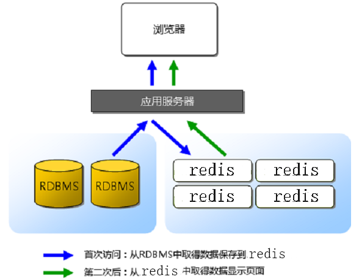

> ==RDBMS: Relational Database Management System==
>
> 1. 所有的数据默认存储在关系型数据库中
> 2. 客户端访问服务器, 有一些数据, 服务器需要频繁的查询数据
>    - 服务器首先将数据从关系型数据库中读出 -> 第一次
>      - 将数据写入到redis中
>    - 客户端第二次包含以后访问服务器
>      - 服务器从redis中直接读数据

## 2. Redis

> 1. 知道redis是什么?
>    - 非关系型数据库 也可以叫 内存数据库
> 2. 能干什么?
>    - 存储访问频率高的数据
>    - 共享内存
>      - 服务器端 -> redis
> 3. 怎么使用?
>    - 常用的操作命令
>      - 各种数据类型 -> 会查
>    - redis的配置文件
>    - redis的数据持久化
>    - 写程序的时候如何对redis进行操作
>      - 客户端 -> 服务器

### 2.1 基本知识点

1. 安装包下载
   - 英文官方： <https://redis.io/>
   - 中文官方： <http://redis.cn/>

2. Redis安装

   - make
   - make install

3. redis中的两个角色

   ```shell
   # 服务器 - 启动
   redis-server	# 默认启动
   redis-server confFileName # 根据配置文件的设置启动
   # 客户端
   redis-cli	# 默认连接本地, 绑定了6379默认端口的服务器
   redis-cli -p 端口号
   redis-cli -h IP地址 -p 端口 # 连接远程主机的指定端口的redis
   # 通过客户端关闭服务器
   shutdown
   # 客户端的测试命令
   ping [MSG]
   ```

4. redis中数据的组织格式

   - 键值对
     - key: 必须是字符串 - "hello"
     - value: 可选的
       - String类型
       - List类型
       - Set类型
       - SortedSet类型
       - Hash类型

5. redis中常用数据类型
   - String类型
     - 字符串
   - List类型
     - 存储多个string字符串的
   - Set类型
     - 集合
       - stl集合
         - 默认是排序的, 元素不重复
       - redis集合
         - 元素不重复, 数据是无序的
   - SortedSet类型
     - 排序集合, 集合中的每个元素分为两部分
       - [分数, 成员] -> [66, ''tom'']
   - Hash类型
     - 跟map数据组织方式一样: key:value
       - Qt -> QHash, QMap
       - Map -> 红黑树
       - hash -> 数组
         - a[index] = xx

### 2.2 redis常用命令

- String类型

  ```shell
  key -> string
  value -> string
  # 设置一个键值对->string:string
  SET key value
  # 通过key得到value
  GET key
  # 同时设置一个或多个 key-value 对
  MSET key value [key value ...]
  # 同时查看过个key
  MGET key [key ...]
  # 如果 key 已经存在并且是一个字符串， APPEND 命令将 value 追加到 key 原来的值的末尾
  # key: hello, value: world, append: 12345
  APPEND key value
  # 返回 key 所储存的字符串值的长度
  STRLEN key
  # 将 key 中储存的数字值减一。
  # 前提, value必须是数字字符串 -"12345"
  DECR key
  ```

- List类型 - 存储多个字符串

  ```shell
  key -> string
  value -> list
  # 将一个或多个值 value 插入到列表 key 的表头
  LPUSH key value [value ...]
  # 将一个或多个值 value 插入到列表 key 的表尾 (最右边)。
  RPUSH key value [value ...]
  # list中删除元素
  LPOP key # 删除最左侧元素
  RPOP key # 删除最右侧元素
  # 遍历
  LRANGE key start stop
  	start: 起始位置, 0
  	stop: 结束位置, -1
  # 通过下标得到对应位置的字符串
  LINDEX key index
  # list中字符串的个数
  LLEN key
  ```

- Set类型

  ```shell
  key -> string
  value -> set类型 ("string", "string1")
  # 添加元素
  # 将一个或多个 member 元素加入到集合 key 当中，已经存在于集合的 member 元素将被忽略
  SADD key member [member ...]
  # 遍历
  SMEMBERS key
  # 差集
  SDIFF key [key ...]
  # 交集
  SINTER key [key ...]
  # 并集
  SUNION key [key ...]
  ```

- SortedSet 类型

  ```shell
  key -> string
  value -> sorted ([socre, member], [socre, member], ...)
  # 添加元素
  ZADD key score member [[score member] [score member] ...]
  # 遍历
  ZRANGE key start stop [WITHSCORES] # -> 升序集合
  ZREVRANGE key start stop [WITHSCORES] # -> 降序集合
  # 指定分数区间内元素的个数
  ZCOUNT key min max
  ```

- Hash类型

  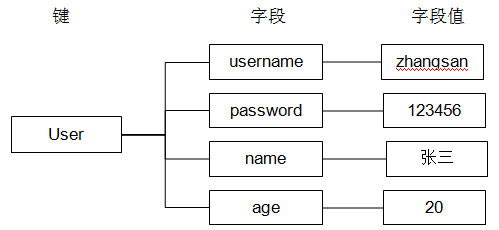

  ```shell
  key ->string
  value -> hash ([key:value], [key:value], [key:value], ...)
  # 添加数据
  HSET key field value
  # 取数据
  HGET key field
  # 批量插入键值对
  HMSET key field value [field value ...]
  # 批量取数据
  HMGET key field [field ...]
  # 删除键值对
  HDEL key field [field ...]
  ```

- Key 相关的命令

  ```shell
  # 删除键值对
  DEL key [key ...]
  # 查看key值
  KEYS pattern
  查找所有符合给定模式 pattern 的 key 。
  KEYS * 匹配数据库中所有 key 。
  KEYS h?llo 匹配 hello ， hallo 和 hxllo 等。
  KEYS h*llo 匹配 hllo 和 heeeeello 等。
  KEYS h[ae]llo 匹配 hello 和 hallo ，但不匹配 hillo
  # 给key设置生存时长
  EXPIRE key seconds
  # 取消生存时长
  PERSIST key
  # key对应的valued类型
  TYPE key
  ```


### 2.3 redis配置文件

> 配置文件是给**redis服务器**使用 的

1. 配置文件位置

   - 从源码安装目录中找 -> redis.conf

2. 配置文件配置项

   ```shell
   # redis服务器绑定谁之后, 谁就能访问redis服务器
   # 任何客户端都能访问服务器, 需要注释该选项
   bind 127.0.0.1 192.168.1.100 
   # 保护模式, 如果要远程客户端访问服务器, 该模式要关闭
   protected-mode yes
   # reids服务器启动时候绑定的端口, 默认为6379
   port 6379
   # 超时时长, 0位关闭该选项, >0则开启
   timeout 0
   # 服务器启动之后不是守护进程
   daemonize no
   # 如果服务器是守护进程, 就会生成一个pid文件
   # ./ -> reids服务器启动时候对应的目录
   pidfile ./redis.pid
   # 日志级别
    loglevel notice
   # 如果服务器是守护进程, 才会写日志文件
    logfile "" -> 这是没写
    logfile ./redis.log
    # redis中数据库的个数
    databases 16 
    	- 切换 select dbID [dbID == 0 ~ 16-1]
   ```

### 2.4 redis数据持久化

> 持久化: 数据从内存到磁盘的过程

持久化的两种方式:

- rdb方式
  - 这是一种默认的持久化方式, 默认打开
  - 磁盘的持久化文件xxx.rdb
  - 将内存数据以二进制的方式直接写入磁盘文件
  - 文件比较小, 恢复时间短, 效率高
  - 以用户设定的频率 -> 容易丢失数据
  - 数据完整性相对较低
- aof方式
  - 默认是关闭的
  - 磁盘的持久化文件xxx.aof
  - 直接将生成数据的命令写入磁盘文件
  - 文件比较大, 恢复时间长, 效率低
  - 以某种频率 -> 1sec
  - 数据完整性高

```shell
# rdb的同步频率, 任意一个满足都可以
save 900 1
save 300 10
save 60 10000
# rdb文件的名字
dbfilename dump.rdb
# 生成的持久化文件保存的那个目录下, rdb和aof
dir ./ 
# 是不是要打开aof模式
appendonly no
 -> 打开: yes
# 设置aof文件的名字
appendfilename "appendonly.aof"
# aof更新的频率
# appendfsync always
appendfsync everysec
# appendfsync no
```

1. aof和rdb能不能同时打开?

   - 可以

2. aof和rdb能不能同时关闭?

   - 可以

   - rdb如何关闭?

     ```shell
     save ""
     ```

3. 两种模式同时开启, 如果要进行数据恢复, 如何选择?

   - 效率上考虑:  rdb模式
   - 数据的完整性: aof模式

## 3 hiredis的使用

1. hiredis的安装

   - 下载地址: <http://redis.cn/clients.html#c> 
   - 安装
     - make
     - make 

2. hiredis API接口的使用

   - 连接数据库

     ```c
     // 连接数据库
     redisContext *redisConnect(const char *ip, int port);
     redisContext *redisConnectWithTimeout(const char *ip, 
                                           int port, const struct timeval tv);
     ```

   - 执行redis命令函数

     ```c
     // 执行redis命令
     void *redisCommand(redisContext *c, const char *format, ...);
     // redisCommand 函数实际的返回值类型
     typedef struct redisReply {
         /* 命令执行结果的返回类型 */
         int type; 
         /* 存储执行结果返回为整数 */
         long long integer;
         /* str变量的字符串值长度 */
         size_t len;
         /* 存储命令执行结果返回是字符串, 或者错误信息 */
         char *str;
         /* 返回结果是数组, 代表数据的大小 */
         size_t elements;
         /* 存储执行结果返回是数组*/
         struct redisReply **element;
     } redisReply;
     redisReply a[100];
     element[i]->str
     ```

     | 状态表示                 | 含义                                                         |
     | ------------------------ | ------------------------------------------------------------ |
     | REDIS_REPLY_STRING==1    | 返回值是字符串,字符串储存在redis->str当中,字符串长度为redi   |
     | REDIS_REPLY_ARRAY== 2    | 返回值是数组，数组大小存在redis->elements里面，数组值存储在redis->element[i]里面。数组里面存储的是指向redisReply的指针，数组里面的返回值可以通过redis->element[i]->str来访问，数组的结果里全是type==REDIS_REPLY_STRING的redisReply对象指针。 |
     | REDIS_REPLY_INTEGER == 3 | 返回整数long long，从integer字段获取值                       |
     | REDIS_REPLY_NIL==4       | 返回值为空表示执行结果为空                                   |
     | REDIS_REPLY_STATUS ==5   | 返回命令执行的状态，比如set foo bar 返回的状态为OK，存储在str当中 reply->str == "OK" 。 |
     | REDIS_REPLY_ERROR ==6    | 命令执行错误,错误信息存放在 reply->str当中。                 |

   - 释放资源

     ```c
     // 释放资源
     void freeReplyObject(void *reply);
     void redisFree(redisContext *c);
     ```

# 三. Nginx初试牛刀

## 1. 一些基本概念

###1.1 Nginx初步认识

1. Nginx介绍

   - engine x

   - 俄罗斯
   - 开源的框架
   - c语言
   - Tengine - 淘宝基于nginx修改的

2. Nginx能干什么?

   - 作为web服务器
     - 解析http协议
   - 反向代理服务器
     - 了解反向代理的概念
   - 邮件服务器
     - 解析邮件相关的协议: pop3/smtp/imap

3. Nginx的优势?

   > - 更快
   >
   >   - 高峰期(数以万计的并发时)nginx可以比其它web服务器更快的响应请求
   >
   > - 高扩展
   >
   >   - **低耦合**设计的模块组成,丰富的第三方模块支持
   >
   > - 高可靠
   >
   >   - 经过大批网站检验
   >     - www.sina.com.cn
   >     - www.xunlei.com
   >     - www.163.com
   >   - 每个worker进程相对独立, 出错之后可以快速开启新的worker
   >     - worker进程的个数是可以控制的
   >     - 在后台干活的进程
   >
   > - 低内存消耗
   >
   >   - 一般情况下,10000个非活跃的HTTP  Keep-Alive连接在nginx中仅消耗 2.5M内存
   >
   > - 单机支持10万以上的并发连接
   >
   >   - 取决于内存,10万远未封顶
   >
   > - 热部署
   >
   >   - master和worker的分离设计,可实现7x24小时不间断服务的前提下升级nginx可执行文件
   >
   > - 最自由的BSD许可协议
   >
   >   - BSD许可协议允许用户免费使用nginx, 修改nginx源码,然后再发布
   >     - 淘宝: tengine
   >

### 1.2 正向/反向代理

1. 正向代理

   > 正向代理是位于客户端和原始服务器之间的服务器，为了能够从原始服务器获取请求的内容，客户端需要将请求发送给代理服务器，然后再由代理服务器将请求转发给原始服务器，原始服务器接受到代理服务器的请求并处理，然后将处理好的数据转发给代理服务器，之后再由代理服务器转发发给客户端，完成整个请求过程。 
   >
   > ==**正向代理的典型用途就是为在防火墙内的局域网客户端提供访问Internet的途径**==, 比如: 
   >
   > - 学校的局域网
   > - 单位局域网访问外部资源 

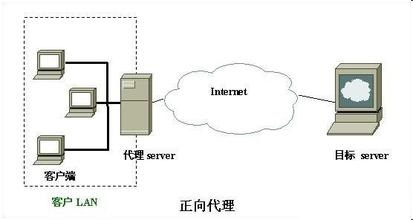

正向代理服务器是为用户服务的

2. 反向代理

   > 反向代理方式是指代理原始服务器来接受来自Internet的链接请求，然后将请求转发给内部网络上的原始服务器，并将从原始服务器上得到的结果转发给Internet上请求数据的客户端。那么顾名思义，反向代理就是位于Internet和原始服务器之间的服务器，对于客户端来说就表现为一台服务器，客户端所发送的请求都是直接发送给反向代理服务器，然后由反向代理服务器统一调配。 

   

   

   


   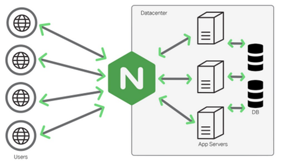

1. 客户端给服务器发送请求, 连接服务器, 用户不知道服务器地址, 只有反向代理服务器的地址是公开的
2. 请求直接发给反向代理服务器
3. 反向代理服务器将请求转发给后边的web服务器
   - web服务器 N 台
   - 反向代理服务器转发请求会轮询进行
4. web服务器收到请求进行处理, 得到结果
5. web服务器将处理结果发送给反向代理服务器
6. 反向代理服务器将拿到的结果转发给客户端

### 1.3 域名和IP

1. 什么是域名？
   - www.baidu.com
   - jd.com
   - taobao.com
2. 什么是IP地址？
   - 点分十进制的字符串
     - 11.22.34.45
3. 域名和IP地址的关系？
   - 域名绑定IP
     - 一个域名只能绑定一个IP
     - 一个IP地址被多个域名绑定

## 2. Nginx 安装和配置

###2.1 安装

1. 下载

   > 1. 官方地址: <http://nginx.org/>
   > 2. Nginx相关依赖:
   >    - OpenSSL: <http://www.openssl.org/> 
   >      - 密码库
   >      - 使用https进行通信的时候使用
   >    - ZLib下载: <http://www.zlib.net/> 
   >      - 数据压缩
   >      - 安装:
   >        - ./configure
   >        - make
   >        - sudo make install
   >    - PCRE下载:  <http://www.pcre.org/> 
   >      - 解析正则表达式
   >      - 安装
   >        - ./configure
   >        - make
   >        - sudo make install
   >

2. 安装

   - nginx的安装

     ```shell
     # nginx工作时候需要依赖三个库
     # 三个参数=这三个库对应的源码安装目录
     # 根据自己的电脑的库安装包的位置进行指定
     ./configure --with-openssl=../openssl-1.0.1t --with-pcre=../pcre-8.40 --with-zlib=../zlib-1.2.11
     make
     sudo make install
     ```


   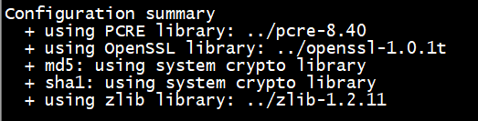

3. Nginx 相关的指令

   - Nginx的默认安装目录

     ```shell
     /usr/local/nginx
      conf -> 存储配置文件的目录
      html -> 默认的存储网站(服务器)静态资源的目录 [图片, html, js, css]
      logs -> 存储log日志
      sbin -> 启动nginx的可执行程序
     ```

   - Nginx可执行程序的路径

     ```shell
     /usr/local/nginx/sbin/nginx
     # 快速启动的方式
     # 1. 将/usr/local/nginx/sbin/添加到环境变量PATH中
     # 2. /usr/local/nginx/sbin/nginx创建软连接, 放到PATH对应的路径中, 比如: /usr/bin
     ln -s /usr/local/nginx/sbin/nginx /usr/bin/nginx
     ```

   - 启动Nginx - 需要管理器权限

     ```shell
     # 假设软连接已经创建完毕
     sudo nginx # 启动
     ```

   - 关闭Nginx

     ```shell
     # 第一种, 马上关闭
     sudo nginx -s stop
     # 第二种, 等nginx作为当前操作之后关闭
     sudo nginx -s quit
     ```

   - 重新加载Nginx

     ```shell
     sudo nginx -s reload  # 修改了nginx的配置文件之后, 需要执行该命令
     ```

   - 测试是否安装成功

     - 知道nginx对应的主机的IP地址 - > 192.168.1.100
     - 在浏览器中访问该IP地址
       - 看到一个welcom nginx的欢迎界面


### 2.2 配置

1. Nginx配置文件的位置

   ```shell
   /usr/local/nginx/conf/nginx.conf
   ```

2. Nginx配置文件的组织格式

   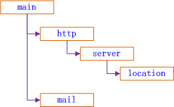

   - http -> 模块, http相关的通信设置
     - server模块 -> 每个server对应的是一台web服务器
       - location 模块
         - 处理的是客户端的请求
   - mail -> 模块, 处理邮件相关的动作

3. 常用配置项介绍

   ```nginx
   user  nobody; # 启动之后的worker进程属于谁
   	- 错误提示: nginx操作xxx文件时候失败, 原因: Permission denied  
   	- 将nobody -> root
   worker_processes  1; # 设置worker进程的个数, 最大 == cpu的核数 (推荐)
   error_log  logs/error.log; # 错误日志, /usr/local/nginx
   pid        logs/nginx.pid; # pid文件, 里边是nginx的进程ID
   # nginx的事件处理
   events {
    	use epoll;	# 多路IO转接模型使用epoll
    	worker_connections  1024;	// 每个工作的进程的最大连接数
   }
   http->server -> 每个server模块可以看做一台web服务器
   server{
   	listen       80;  # web服务器监听的端口, http协议的默认端口
       server_name  localhost; # 对应一个域名, 客户端通过该域名访问服务器
       charset utf8; 	# 字符串编码
       location {	// 模块, 处理客户端的请求
   }
   
   # 客户端 (浏览器), 请求:
     http://192.168.10.100:80/login.html
   # 服务器处理客户端的请求
     服务器要处理的指令如何从url中提取?
     - 去掉协议: http
     - 去掉IP/域名+端口: 192.168.10.100:80
     - 最后如果是文件名, 去掉该名字: login.html
     - 剩下的: /
     服务器要处理的location指令: 
     location /
     {
           处理动作
     }
   ```

## 3. Nginx的使用

### 3.1 部署静态网页

1. 静态网页存储目录

   - 默认的存储目录: 

     ```shell
     /usr/local/nginx/html
     ```

   - 自己创建新的目录:

     ```shell
     应该在 /usr/local/nginx/
     mkdir /usr/local/nginx/mydir
     ```

2. 练习

   > 在Nginx服务器上进行网页部署, 实现如下访问:
   >
   > 在/usr/local/nginx/创建新的目录, yundisk用来存储静态网页
   >

   - 访问地址: <http://192.168.80.254/login.html> 

     - login.html放到什么位置?

       ```shell
       / -> 服务器的资源根目录, /usr/local/nginx/yundisk
       login.htm-> 放到yundisk中
       ```

     - 服务器要处理的动作

       ```nginx
       # 对应这个请求服务器要添加一个location
       location 指令(/)
       {
           # 找一个静态网页
           root yundisk;  # 相对于/usr/local/nginx/来找
           # 客户端的请求是一个目录, nginx需要找一默认显示的网页
           index index.html index.htm;
       }
       # 配置之后重启nginx
       sudo nginx -s reload
       ```

   - 访问地址: <http://192.168.80.254/hello/reg.html> 

     - hello是什么?

       - 目录

     - reg.html放到哪儿?

       - hello目录中

     - 如何添加location

       ```nginx
       location /hello/
       {
           root yundisk;
           index xx.html;
       }
       ```

   - 访问地址: <http://192.168.80.254/upload/> 浏览器显示upload.html 

     - 直接访问一个目录, 得到一默认网页

       - upload是一个目录, uplaod.html应该再upload目录中

         ```nginx
         location /upload/
         {
             root yundisk;
             index upload.html;
         }
         ```

### 3.2 反向代理和负载均衡

> 反向代理和负载均衡是两码事儿
>

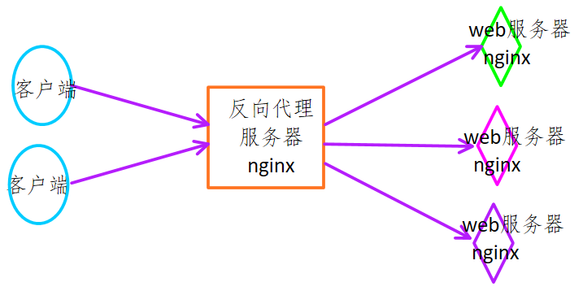

准备工作:

> 1. 需要客户端 - 1个
>    - Window中的浏览器作为客户端 
> 2. 反向代理服务器 -> 1个
>    - window作为反向代理服务器
> 3. web服务器 -> 2个
>    - ubuntu - robin: 192.168.247.135
>    - ubuntu - luffy : 192.168.26.250

1. 反向代理设置

   

   ```nginx
   找window上对应的nginx的配置文件
   	- conf/nginx.conf
   # 代理几台服务器就需要几个server模块
       # 客户端访问的url: http://192.168.1.100/login.html
       server {
           listen       80;        # 客户端访问反向代理服务器, 代理服务器监听的端口
           server_name  ubuntu.com; # 客户端访问反向代理服务器, 需要一个域名
           location / {
               # 反向代理服务器转发指令, http:// 固定
               proxy_pass http://robin.test.com;
           }
   
       }
       # 添加一个代理模块
       upstream robin.test.com
       {
           server 192.168.247.135:80;
       }
       # luffy
       server {
           listen       80;        # 客户端访问反向代理服务器, 代理服务器监听的端口
           server_name  hello.com; # 客户端访问反向代理服务器, 需要一个域名
           location / {
               # 反向代理服务器转发指令, http:// 固定
               proxy_pass http://luffy.test.com;
           }
   
       }
       # 添加一个代理模块
       upstream luffy.test.com
       {
           server 192.168.26.250:80;
       }
   }
   
   ```

2. 负载均衡设置

   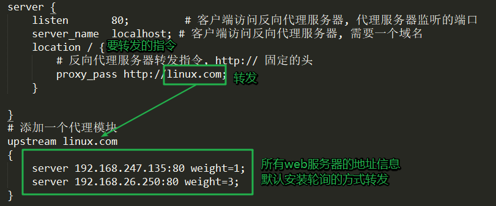

   ```nginx
       server {
           listen       80;         # 客户端访问反向代理服务器, 代理服务器监听的端口
           server_name  localhost; # 客户端访问反向代理服务器, 需要一个域名
           location / {
               # 反向代理服务器转发指令, http:// 固定的头
               proxy_pass http://linux.com;
           }
           location /hello/ {
               # 反向代理服务器转发指令, http:// 固定的头
               proxy_pass http://linux.com;
           }
       	location /upload/ {
               # 反向代理服务器转发指令, http:// 固定的头
               proxy_pass http://linux.com;
           }
   
       }
       # 添加一个代理模块
       upstream linux.com
       {
           server 192.168.247.135:80 weight=1;
           server 192.168.26.250:80 weight=3;
       }
   
   ## =====================================
   web服务器需要做什么?
   # 192.168.247.135
   location /
   {
       root xxx;
       index xxx;
   }
   location /hello/ 
   {
       root xx;
       index xxx;
   }
   location /upload/ 
   {
       root xxx;
       index xx;
   }
   # 192.168.26.250
   location /
   {
       root xxx;
       index xxx;
   }
   location /hello/ 
   {
       root xx;
       index xxx;
   }
   location /upload/ 
   {
       root xxx;
       index xx;
   }
   ```


## 课外知识导读

### 1. URL和URI


   1. 概念:

      > - URL（Uniform Resource  Locator）: 统一资源定位符
      >
      > - 表示资源位置的字符串
      >   - 基本格式: "==协议://IP地址/路径和文件名=="
      >      - <ftp://ftp.is.co.za/rfc/rfc1808.txt>
      >      - <http://www.ietf.org/rfc/rfc2396.txt>
      >      - <telnet://192.0.2.16:80/>
      >
      > - URN（Uniform Resource  Name）: 统一资源名称
      >   - P2P下载中使用的磁力链接
      >
      > - URI（Uniform Resource  Identifier）: 统一资源标识符
      >   - 是一个紧凑的字符串用来标示抽象或物理资源, ==**URL是URI的一种**== 
      >   - 让URI能成为URL的当然就是那个“访问机制”，“网络位置”。e.g. `http://` or `ftp://`。
      >     - files.hp.com 
      >     - <tel:+1-816-555-1212>
      >     - <ftp://ftp.is.co.za/rfc/rfc1808.txt>               （also a URL）
      >     - <http://www.ietf.org/rfc/rfc2396.txt>         （also a URL）
      >     - <telnet://192.0.2.16:80/>                              （also a URL）
      >

   2. 经验式理解:

      

      从包含关系上说: URI包含URL

      字符串长度上说: URL包含URI

      	UIRI可以没有协议, 没有地址(IP/域名)

| URL  | 红色字体部分+绿色字体部分 |
| ---- | ------------------------- |
| URI  | 绿色字体部分              |

### 2. DNS解析过程

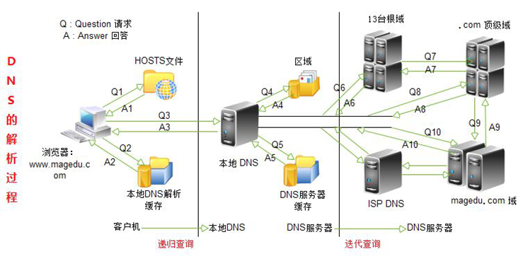

1. DNS解析的过程

    > 1. 在浏览器中输入www.magedu.com域名，操作系统会先检查自己本地的hosts文件是否有这个网址映射关系，如果有，就先调用这个IP地址映射，完成域名解析。
    > 2. 如果hosts里没有这个域名的映射，则查找本地DNS解析器缓存，是否有这个网址映射关系，如果有，直接返回，完成域名解析。
    >    - Windows和Linux系统都会在本地缓存dns解析的记录，提高速度。 
    > 3. 如果hosts与本地DNS解析器缓存都没有相应的网址映射关系，首先会找`TCP/IP`参数中设置的首选DNS服务器，在此我们叫它本地DNS服务器，此服务器收到查询时，如果要查询的域名，包含在本地配置区域资源中，则返回解析结果给客户机，完成域名解析，此解析具有权威性。
    > 4. 如果要查询的域名，不由本地DNS服务器区域解析，但该DNS服务器已缓存了此网址映射关系，则调用这个IP地址映射，完成域名解析，此解析不具有权威性。
    > 5. 如果本地DNS服务器本地区域文件与缓存解析都失效，则根据本地DNS服务器的设置（没有设置转发器）进行查询，如果未用转发模式，本地DNS就把请求发至13台根DNS，根DNS服务器收到请求后会判断这个域名(.com)是谁来授权管理，并会返回一个负责该顶级域名服务器的一个IP。本地DNS服务器收到IP信息后，将会联系负责 .com域的这台服务器。这台负责 .com域的服务器收到请求后，如果自己无法解析，它就会找一个管理 .com域的下一级DNS服务器地址(magedu.com)给本地DNS服务器。当本地DNS服务器收到这个地址后，就会找magedu.com域服务器，重复上面的动作进行查询，直至找到www.magedu.com主机。
    > 6. 如果用的是转发模式（设置转发器），此DNS服务器就会把请求转发至上一级ISP DNS服务器，由上一级服务器进行解析，上一级服务器如果不能解析，或找根DNS或把转请求转至上上级，以此循环。不管是本地DNS服务器用是是转发，还是根提示，最后都是把结果返回给本地DNS服务器，由此DNS服务器再返回给客户机。

2. 域名解析服务器

   > - Pod DNS+:
   >   - 首选：119.29.29.29
   >   - 备选：182.254.116.116 
   >
   > - 114DNS:
   >
   >   - 首选：114.114.114.114
   >   - 备选：114.114.114.115
   >
   > - 阿里 AliDNS:
   >
   >   - 首选：223.5.5.5
   >
   >   - 备选：223.6.6.6

3. hosts文件

   ```shell
   # 存储的是域名和IP的对应关系
   -windows目录: "C:\Windows\System32\drivers\etc\hosts"
   ```

   ## 复习

   redis

   1. 是什么?

      - 非关系型数据库 - nosql
        - 数据存储在内存里边

   2. 能干什么?

      - 提高程序效率
      - 程序中频繁访问的数据, 可以存储到redis中

   3. 我们需要干什么?

      - 会安装

      - 掌握启动redis服务器和客户端的启动命令

        ```shell
        # 服务器
        redis-server (配置文件名)
        # 客户端
        redis-cli (-h redis服务器IP -p 端口)
        ```

      - redis中支持的数据类型 - value

        - 键值对方式存储数据

          - key - 字符串
          - value
            - 字符串 - string
            - 列表 - list
            - 集合 - set
            - 排序集合 - sortedSet
            - 哈希 - hash
        - 关于服务器使用的配置文件的修改
        - redis中持久化
          - rdb
          - aof

   4. 能够在程序中操作redis服务器

      - 需要使用以下函数接口
      - 官方地址 - > 客户端 -> 选择语言


