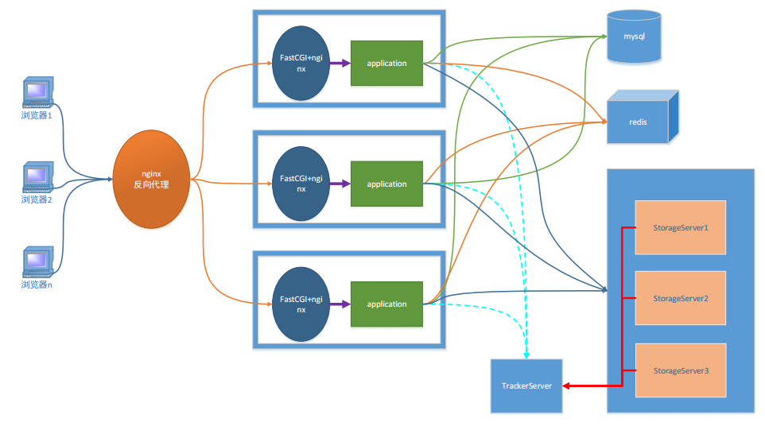

# 分布式服务器编程

## 1. 项目架构图

### 1.1 一些概念

1. 什么是服务器
   - 硬件: 一台配置高的电脑
   - 软件: 电脑必须有一个能够解析http协议的软件
2. 常见的Web服务器

   - tomcat服务器

     - apache组织产品, 开源的免费服务器
   - weblogic 服务器
       - bea公司, 收费的服务器
       - 不交费, 访问量受限制

   - IIS服务器

     - Internet Information Server

     - 微软公司主推的服务器

   - nginx

     - 小巧且高效的HTTP服务器
     - 也可以做一个高效的负载均衡反向代理
     - 邮件服务器
       - pop3/smtp/imap

### 1.2 项目架构图



1. 客户端
   - 网络架构:
     - b/s
       - 必须使用http协议
     - c/s
       - 协议可以随意选择
       - Qt -> http
2. 服务器
   - Nginx
     - 能处理静态请求 -> html, jpg
     - 动态请求无法处理
     - 服务器集群之后, 每台服务器上部署的内容必须相同
   - fastCGI
     - 帮助服务器处理动态请求
3. 反向代理服务器
   - 客户端并不能直接访问web服务器, 直接访问到的是反向代理服务器
   - 客户端静请求发送给反向代理服务器, 反向代理将客户端请求转发给web服务器
4. 关系型数据库
   - 存储文件属性信息
   - 用户的属性信息
5. redis - 非关系型数据库 (内存数据库)
   - 作用提出程序效率
   - 存储是服务器经常要从关系型数据中读取的数据
6. FASTDFS - 分布式文件系统
   - 存储文件内容
   - 供用户下载

## 2. 分布式文件系统

### 2.1 传统文件系统


- 传统的文件系统格式:
  - ntfs / fat32 / ext3 / ext4
- 可以被挂载和卸载

### 2.2 分布式文件系统

> 文件系统的全部, 不在同一台主机上，而是在很多台主机上，多个分散的文件系统组合在一起，形成了一个完整的文件系统。 


> 分布式文件系统:
>
> 1. 需要有网络
> 2. 多台主机
>    - 不需要在同一地点
> 3. 需要管理者
> 4. 编写应用层的管理程序
>    - 不需要编写

## 3. FastDFS

### 3.1 fastDFS介绍

1. fastDFS概述

   > - 是用**c语言**编写的一款开源的分布式文件系统。
   >   - 余庆 - 淘宝的架构师
   > - 为互联网量身定制，充分考虑了冗余备份、负载均衡、线性扩容等机制，注重高可用、高性能等指标
   >   - 冗余备份: 纵向扩容
   >   - 线性扩容: 横向扩容
   > - 可以很容易搭建一套高性能的文件服务器集群提供文件==**上传、下载**==等服务。
   >   - 图床
   >   - 网盘

2. fastDFS框架中的三个角色

   - 追踪器 ( Tracker ) - 管理者 - 守护进程
     - 管理存储节点
   - 存储节点 - storage - 守护进程
     - 存储节点是有多个的
   - 客户端 - 不是守护进程, 这是程序猿编写的程序
     - 文件上传
     - 文件下载

3. fastDFS三个角色之间的关系 

   

   

   1. 追踪器
      - 最先启动追踪器
   2. 存储节点
      - 第二个启动的角色
      - 存储节点启动之后, 会单独开一个线程
        - 汇报当前存储节点的容量, 和剩余容量
        - 汇报数据的同步情况
        - 汇报数据被下载的次数
   3. 客户端
      - 最后启动
        - 上传
          - 连接追踪器, 询问存储节点的信息
            - 我要上传1G的文件, 询问那个存储节点有足够的容量
            - 追踪器查询, 得到结果
            - 追踪器将查到的存储节点的IP+端口发送给客户端
            - 通过得到IP和端口连接存储节点
            - 将文件内容发送给存储节点
        - 下载
          - 连接追踪器, 询问存储节点的信息
            - 问一下, 要下载的文件在哪一个存储节点
            - 追踪器查询, 得到结果
            - 追踪器将查到的存储节点的IP+端口发送给客户端
            - 通过得到IP和端口连接存储节点
            - 下载文件

4. fastDFS集群 - （了解即可）

   

   1. 追踪器集群
      - 为什么集群？
        - 避免单点故障
      - 多个Tracker如何工作？
        - 轮询工作
      - 如何实现集群？
        - 修改配置文件
   2. 存储节点集群
      - fastDFS管理存储节点的方式？
        - 通过分组的方式完成的
      - 集群方式（扩容方式）
        - 横向扩容 - 增加容量
          - 添加一台新的主机 -> 容量增加了
          - 假设当前有两个组: group1, group2
            - 需要添加一个新的分组 -> group3
              - 新主机属于第三组
          - 不同组的主机之间不需要通信
        - 纵向扩容 - 数据备份
          - 假设当前有两个组: group1, group2
            - 将新的主机放到现有的组中
            - 每个组的主机数量从1 -> N
              - 这n台主机的关系就是相互备份的关系
              - 同一个组中的主机需要通信
              - 每组的容量 == 容量最小的这台主机
      - 如何实现?
        - 通过修改配置文件可实现

### 3.2 fastDFS安装

1. fastDFS安装

   - libfastcommon-1.36.zip
     - fastdfs的基础库包
     - unzip xxx.zip
     - ./make.sh
     - ./make.sh install
   - fastdfs-5.10.tar.gz
     - tar zxvf xxx.tar.gz
     - ./make.sh
     - ./make.sh install

2. 测试

   ```shell
   #fastDFS安装的所有的可执行程序: 
   /usr/bin/fdfs_*
   fdfs_test
   ```

### 3.3 fastDFS配置文件

> 配置文件默认位置:  /etc/fdfs
>
> client.conf.sample  storage.conf.sample  storage_ids.conf.sample  tracker.conf.sample

1. tracker 配置文件

   ```shell
   # 将追踪器和部署的主机的IP地址进程绑定, 也可以不指定
   # 如果不指定, 会自动绑定当前主机IP, 如果是云服务器建议不要写
   bind_addr=192.168.247.135
   # 追踪器监听的端口
   port=22122
   # 追踪器存储日志信息的目录, xxx.pid文件, 必须是一个存在的目录
   base_path=/home/yuqing/fastdfs
   ```

2. storage 配置文件

   ```shell
   # 当前存储节点对应的主机属于哪一个组
   group_name=group1
   # 当前存储节点和所应该的主机进行IP地址的绑定, 如果不写, 有fastdfs自动绑定
   bind_addr=
   # 存储节点绑定的端口
   port=23000
   # 存储节点写log日志的路径
   base_path=/home/yuqing/fastdfs
   # 存储节点提供的存储文件的路径个数
   store_path_count=2
   # 具体的存储路径
   store_path0=/home/yuqing/fastdfs
   store_path1=/home/yuqing/fastdfs1
   # 追踪器的地址信息
   tracker_server=192.168.247.135:22122 
   tracker_server=192.168.247.136:22122 
   ```

3. 客户端配置文件

   ```shell
   # 客户端写log日志的目录
   # 该路径必须存在
   # 当前的用户对于该路径中的文件有读写权限
   # 当前用户robin
   # 指定的路径属于root
   base_path=/home/yuqing/fastdfs
   # 要连接的追踪器的地址信息
   tracker_server=192.168.247.135:22122 
   tracker_server=192.168.247.136:22122 
   ```


   

   1. 安装fastDFS安装包

### 3.4 fastDFS的启动

1. 第一个启动追踪器  - 守护进程

   ```shell
   # 启动程序在 /usr/bin/fdfs_*
   # 启动
   fdfs_trackerd 追踪器的配置文件(/etc/fdfs/tracker.conf) 
   # 关闭
   fdfs_trackerd 追踪器的配置文件(/etc/fdfs/tracker.conf)  stop
   # 重启
   fdfs_trackerd 追踪器的配置文件(/etc/fdfs/tracker.conf) restart
   ```

2. 第二个启动存储节点 - 守护进程

   ```shell
   # 启动
   fdfs_storaged 存储节点的配置文件(/etc/fdfs/stroga.conf)
   # 关闭
   fdfs_storaged 存储节点的配置文件(/etc/fdfs/stroga.conf) stop
   # 重启
   fdfs_storaged 存储节点的配置文件(/etc/fdfs/stroga.conf) restart
   ```

3. 最后启动客户端 - 普通进程

   ```shell
   # 上传
   fdfs_upload_file 客户端的配置文件(/etc/fdfs/client.conf) 要上传的文件
   # 得到的结果字符串: group1/M00/00/00/wKj3h1vC-PuAJ09iAAAHT1YnUNE31352.c
   # 下载
   fdfs_download_file 客户端的配置文件(/etc/fdfs/client.conf) 上传成功之后得到的字符串(fileID)
   ```

4. fastDFS状态检测

    - 命令

      ```shell
      fdfs_monitor /etc/fdfs/client.conf
      ```

    - [Storage Server的7种状态](./src/https://blog.csdn.net/u014723529/article/details/46048411)

      https://blog.csdn.net/u014723529/article/details/46048411

      ```shell
      # FDFS_STORAGE_STATUS：INIT      :初始化，尚未得到同步已有数据的源服务器
      # FDFS_STORAGE_STATUS：WAIT_SYNC :等待同步，已得到同步已有数据的源服务器
      # FDFS_STORAGE_STATUS：SYNCING   :同步中
      # FDFS_STORAGE_STATUS：DELETED   :已删除，该服务器从本组中摘除
      # FDFS_STORAGE_STATUS：OFFLINE   :离线
      # FDFS_STORAGE_STATUS：ONLINE    :在线，尚不能提供服务
      # FDFS_STORAGE_STATUS：ACTIVE    :在线，可以提供服务
      ```

### 3.5 对file_id的解释


- group1
  - 文件上传到了存储节点的哪一个组
  - 如果有多个组这个组名可变的
- M00 - 虚拟目录
  - 和存储节点的配置项有映射
    - store_path0=/home/yuqing/fastdfs/data    ->  M00
      store_path1=/home/yuqing/fastdfs1/data   -> M01
- 00/00
  - 实际的路径
  - 可变的
- wKhS_VlrEfOAdIZyAAAJTOwCGr43848.md
  - 文件名包含的信息
  - 采用Base64编码
    - 包含的字段包括

      - 源storage server Ip 地址  
      - 文件创建时间  

      - 文件大小  

      - 文件CRC32效验码 

        - 循环冗余校验  

      - 随机数

## 4. 上传下载代码实现

1. 使用多进程方式实现

   - exec函数族函数

     - execl
     - execlp

   - 父进程

     - 子进程 -> 执行

       execlp("fdfs_upload_file" , "xx", arg, NULL), 有结果输出, 输出到终端

       - 不让它写到终端 -> 重定向dup2(old, new)
         - old-> 标准输出
         - new -> 管道的写端
         - 文件描述符
         - 数据块读到内存 -> 子进程
           - 数据最终要给到父进程
       - pipe -> 读端, 写端
         - 在子进程创建之前创建就行了

     - 父进程

       - 读管道 -> 内存
       - 内存数据写数据库

   

2. 使用fastDFS API实现

   - 

## 5. 源码安装 - 回顾

安装流程:

1. 以下文件, 里边有安装步骤
   - readme 
   - readme.md 
   - INSTALL
2. 找 可执行文件 <font color=green>configure</font>
   - 执行这个可执行文件
     - 检测安装环境
     - 生成 makefile
3. 执行**make**命令
   - 编译源代码
     - 生成了动态库
     - 静态库
     - 可执行程序
4. 安装 **make install** (需要管理员权限)
   - 将第三步生成的动态库/动态库/可执行程序拷贝到对应的系统目录


