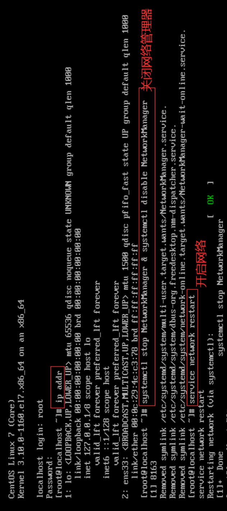
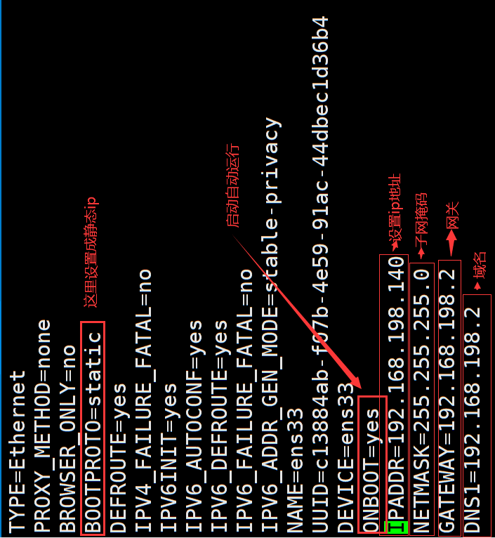
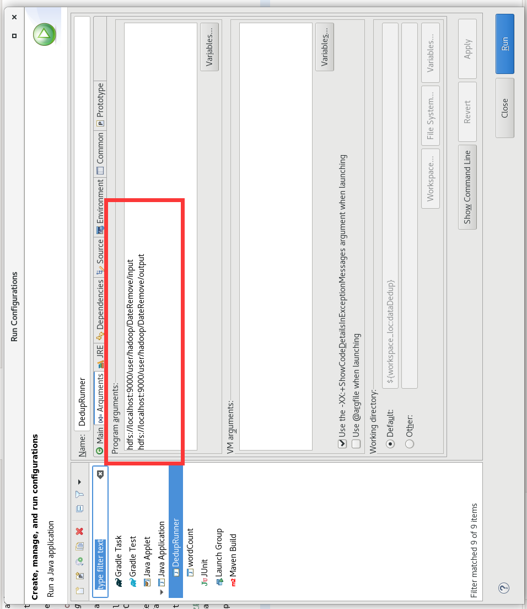
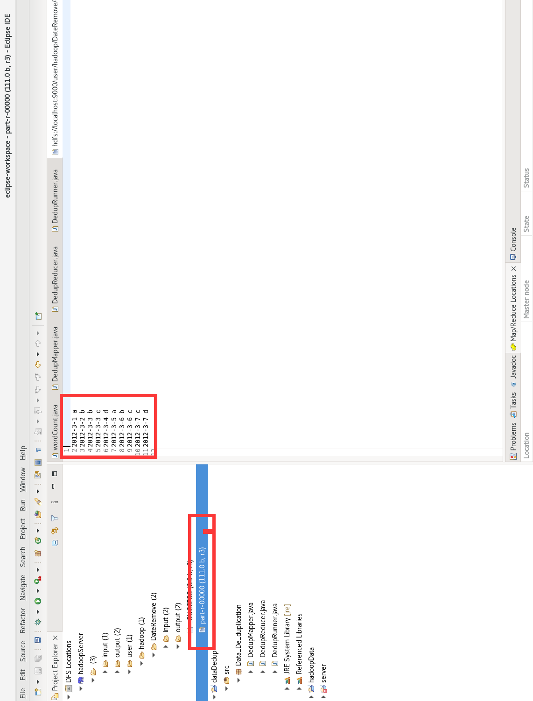

### Hadoop（CentOS）安装及MapReduce实现数据去重

## 1. JDK安装
### 1.1 资源下载：
+ 下载地址：https://pan.quark.cn/s/17d7266205f9

    + hadoop的安装 包

    + java  jdk安装包

    + eclipse连接hadoop工具

+ 所学其他工具可自行在官网下载

  + centos下载地址：https://www.centos.org/centos-linux/
  + Vmware虚拟机官网下载地址：
    + Vmware下载：https://www.vmware.com/products/workstation-pro.html
    + 下载之后安装完成，到输入密钥的地方时候，可以直接在百度上搜一个，超简单的啦！

### 1.2 虚拟机网络配置

> Vmware配置及 xshell连接：https://zjxweb.github.io/#/techBlog/vmware/

1. 先输入`ip addr` 查看ip的内容，发现没有ip 地址，所以进行ip的配置。需要先关闭网络管理器，之后要开启网络。
2. 在编辑中找到虚拟网络编辑器，查看ip 地址的范围，查看子网掩码以及网关。


3. 输入命令，修改相关配置

   + ```shell
     vim /etc/sysconfig/network-scripts/ifcfg-ens33 
     ```

   + 

     > 上面图片由于截图时间问题，有些对不上，各位按照自己的配置来！！！！

   + 设置完成之后，开启网络，输入`ip addr`查看ip地址，发现ip地址已经有了，之后`ping www.baidu.com` 查看是否可以连接外网。（暂停 Ctrl+Z）

#### 1.2.1 防火墙关闭

+ ```shell
  [zjx@localhost ~] systemctl stop firewalld
  [zjx@localhost ~] systemctl disable firewalld.service
  ```

### 1.3 JDK安装

#### 1.3.1 **卸载虚拟机自带的JDK** 

  + 注意：如果你的虚拟机是最小化安装不需要执行这一步。

  + ```shell
    [zjx@localhost ~] rpm -qa | grep -i java | xargs -n1 rpm -e --nodeps 
    ```

    + rpm -qa：查询所安装的所有rpm软件包
    + grep -i：忽略大小写
    + xargs -n1：表示每次只传递一个参数
    + rpm -e –nodeps：强制卸载软件

  + 如果没有`rpm`请安装

    + ```shell
      [zjx@localhost ~] yum install rpm
      ```

+ 重启虚拟机

  + ```shell
    [zjx@localhost ~] reboot
    ```

#### 1.3.2 使用 `rz`从xshell上传所需的包

```shell
lrzsz这个软件，可以让我们直接从linux上，下载和上传文件的操作
yum install -y lrzsz
```

#### 1.3.3 JDK安装过程

1. 新建目录（按自己的来）

   ```shell
   cd /home
   mkdir software && cd software
   rz
   上传包到此目录下
   ```

2. 解压

   ```shell
   [zjx@localhost software]$ tar zxvf jdk-8u171-linux-x64.tar.gz 
   ```

3. .新建`/etc/profile.d/my_env.sh`文件

   ```shell
   sudo vim /etc/profile.d/my_env.sh
   ```

4. 添加如下内容

   ```shell
   #JAVA_HOME
   export JAVA_HOME=/home/software/jdk1.8.0_171
   export PATH=$PATH:$JAVA_HOME/bin
   ```

5. source一下/etc/profile文件，让新的环境变量PATH生效

   ```shell
   source /etc/profile
   ```

6. **测试JDK是否安装成功**

   ```shell
   java -version
   ```

   

## 2. Hadoop安装

```shell
# 切换到software目录
cd /home/software
rz #上传hadoop
[root@localhost software]# tar zxvf hadoop-2.7.7.tar.gz
```

+ **将Hadoop添加到环境变量**

  1. **将Hadoop添加到环境变量**

     ```shell
     sudo vim /etc/profile.d/my_env.sh
     ```

  2. 在my_env.sh文件末尾添加如下内容

     ```shell
     export HADOOP_HOME=/home/software/hadoop-2.7.7
     export PATH=$PATH:$HADOOP_HOME/bin
     export PATH=$PATH:$HADOOP_HOME/sbin
     ```

  3. source一下/etc/profile文件，让新的环境变量PATH生效

      ```shell
      source /etc/profile
      ```
  
  4. 测试是否安装成功
  
     ```shell
     [root@localhost software]# hadoop version
     Hadoop 2.7.7
     ```
  
  5. hadoop 目录介绍
  
     + bin目录：存放对Hadoop相关服务（hdfs，yarn，mapred）进行操作的脚本
     + etc目录：Hadoop的配置文件目录，存放Hadoop的配置文件
     + lib目录：存放Hadoop的本地库（对数据进行压缩解压缩功能）
     + sbin目录：存放启动或停止Hadoop相关服务的脚本
     + share目录：存放Hadoop的依赖jar包、文档、和官方案例
  

## 3. Hadoop运行模式

+ Hadoop官方网站：http://hadoop.apache.org
+ Hadoop运行模式包括：本地模式、伪分布式模式以及完全分布式模式。
  + 本地模式：单机运行，只是用来演示一下官方案例。生产环境不用。
  + 伪分布式模式：也是单机运行，但是具备Hadoop集群的所有功能，一台服务器模拟一个分布式的环境。个别缺钱的公司用来测试，生产环境不用。
  + 完全分布式模式：多台服务器组成分布式环境。生产环境使用。

## 4. hadoop伪分布式配置

+ 接下来是hadoop伪分布式配置。Hadoop 可以在单节点上以伪分布式的方式运行，Hadoop 进程以分离的 Java 进程来运行，节点既作为 NameNode 也作为 DataNode，同时，读取的是 HDFS 中的文件。

+ Hadoop 的配置文件位于 /usr/local/hadoop/etc/hadoop/ 中，伪分布式需要修改2个配置文件 core-site.xml 和 hdfs-site.xml 。Hadoop的配置文件是 xml 格式，每个配置以声明 property 的 name 和 value 的方式来实现。

```shell
cd /home/software/hadoop-2.7.7/etc/hadoop
vim core-site.xml
```

```shell
<configuration>
    <property>
        <name>hadoop.tmp.dir</name>
        <value>file:/usr/local/hadoop/tmp</value>
        <description>Abase for other temporary directories.</description>
    </property>
    <property>
        <name>fs.defaultFS</name>
        <value>hdfs://localhost:9000</value>
    </property>
</configuration>
```

> 注意：这里可能会报权限错误的问题，所以说我们要分配权限
>
> ```shell
> cd /home/software/hadoop-2.7.7/etc/hadoop
> chmod +w core-site.xml
> ```

+ 接着配置hdfs文件

```shell
cd /home/software/hadoop-2.7.7/etc/hadoop
vim hdfs-site.xml
chmod +w core-site.xml
```

```
<configuration>
        <property>
                <name>dfs.replication</name>
                <value>1</value>
        </property>
        <property>
                <name>dfs.namenode.name.dir</name>
                <value>file:/usr/local/hadoop/tmp/dfs/name</value>
        </property>
        <property>
                <name>dfs.datanode.data.dir</name>
                <value>file:/usr/local/hadoop/tmp/dfs/data</value>
        </property>
</configuration>
```

+ Hadoop 的运行方式是由配置文件决定的（运行 Hadoop 时会读取配置文件），因此如果需要从伪分布式模式切换回非分布式模式，

+ 需要删除 core-site.xml 中的配置项。
+ 配置完成后，执行 NameNode 的格式化:

  ```shell
  cd /home/software/hadoop-2.7.7
  ./bin/hdfs namenode -format
  
+ 接着开启 NameNode 和 DataNode 守护进程。
 ```shell
 cd /home/software/hadoop-2.7.7
 ./sbin/start-dfs.sh
 ```
+ 或者使用all来开启/结束hadoop全部进程
  
  ```shell
  cd /home/software/hadoop-2.7.7
  ./sbin/start-all.sh
  ./sbin/stop-all.sh
  ```
+ 启动完成后，可以通过命令 jps 来判断是否成功启动
  
  ```shell
  jps
  ```
  
  
  
## 5. Linux系统下eclipse中配置Hadoop插件

  + 用`rz`工具将下载好的 hadoop-eclipse-plugin-2.7.3 传输到eclipse目录下的plugins文件夹下即可.

### 5.1 开始配置

1. cd到eclipse目录下，输入命令`./eclipse` 打开eclipse

   + eclipse安装简单说明一下吧

     > 下载-> 解压-> cd 进去解压的目录 -> `./eclipse`

2. 依次点击：顶部菜单栏的`Window → Open Perspective → Other…→ Map/Reduce → OK` 出现如下界面即说明操作正确


3. 如果打开eclipse是该界面，点击图中指向的按钮即可


4. 接着点击`Map/Reduce Locations`，在下方空白处单击右键 → 点击New Hadoop location…


> 自定义一个Location name，接着将Host中的内容修改为你的master节点的IP地址，右边的Port改为9000 (这是因为在你的core-site.xml配置文件中配置的端口号为9000)

5. 然后点击上图中黑色箭头指向的Advanced parameters，出现如下界面，滚动鼠标滚轮下拉找到 hadoop.tmp.dir，修改后面的路径


> 找hadoop.tmp.dir路径的方法：
> 打开一个新的终端，cd到（以笔者为例）cd /home/software/hadoop-2.7.7/etc/hadoop/ 路径下面，输入命令vim core-site.xml 打开配置文件，就可以找到你的hadoop.tmp.dir相应的路径

+ 完成后点击finish即可，若出现类似如下界面，则说明成功了


> **：在这之前要先将Hadoop集群启动，否则将会失败**

## 6. MapReduce实现数组去重

+ ```shell
  [root@localhost zjx]# cd /home/software/hadoop-2.7.7/
  vim file1.txt
  vim file2.txt
  ```

+ `file1.txt`

  + ```txt
    2012-3-1 a
    2012-3-2 b
    2012-3-3 c
    2012-3-4 d
    2012-3-5 a
    2012-3-6 b
    2012-3-7 c
    2012-3-3 c
    ```

+ `file2.txt`

  + ```txt
    2012-3-3 b
    2012-3-4 d
    2012-3-5 a
    2012-3-6 c
    2012-3-7 d
    2012-3-3 c
    ```

### 6.1 开始啦

+ 先在HDFS创建DateRemove文件夹

+ ```shell
  cd /home/software/hadoop-2.7.7/
  ./bin/hdfs dfs -mkdir /user/hadoop/DateRemove # 如果报错请运行这个 ./bin/hdfs dfs -mkdir -p /user/hadoop/DateRemove
  ```

+ 用ls查看文件是否创建成功

```shell
./bin/hdfs dfs -ls /user/hadoop
```

+ 

+ 在HDFS下创建一个名称为DateRemove/input的目录

  + ```shell
    ./bin/hdfs dfs -mkdir /user/hadoop/DateRemove/input
    ```

+ 将file1.txt和file2.txt传到hdfs的/user/hadoop/DateRemove/input文件夹中

  + ```shell
    ./bin/hdfs dfs -put ./file1.txt  /user/hadoop/DateRemove/input
    ./bin/hdfs dfs -put ./file2.txt  /user/hadoop/DateRemove/input
    ./bin/hdfs dfs -ls  /user/hadoop/DateRemove/input
    ```

  + 

### 6.2 在Linux下的eclipse中创建一个MapReduce工程

#### 6.2.1 开始创建MapReduce

1. 配置Hadoop路径

   + 依次点击：顶部菜单栏的Window → Preferences，出现如下界面：

   

> 选择左边的 Hadoop Map/Reduce，点击右边Browse…，选择Hadoop文件夹的路径即可

2. 创建工程
   依次点击：顶部菜单栏的File → New → Project，出现如下界面：

​	

> 选择Map/Reduce Project，点击右下方 Next> 然后输入项目名称wordcount，点击右下方 Next>，再点击Finish，创建项目。此时插件会把hadoop根目录和lib目录下的所有jar包自动导入

3. 按照如下目录创建你自己的目录


4. `DedupMapper.java`

```java
package Data_De_duplication;

import java.io.IOException;

import org.apache.hadoop.io.LongWritable;
import org.apache.hadoop.io.NullWritable;
import org.apache.hadoop.io.Text;
import org.apache.hadoop.mapreduce.Mapper;

public class DedupMapper extends Mapper<LongWritable, Text, Text, NullWritable> {

    private static Text field = new Text();  

    @Override  
    protected void map(LongWritable key, Text value, Context context)  
            throws IOException, InterruptedException {  

        field = value;  
        context.write(field, NullWritable.get());  

    }  

}
```

5. `DedupReducer.java`

```java
package Data_De_duplication;

import java.io.IOException;

import org.apache.hadoop.io.NullWritable;
import org.apache.hadoop.io.Text;
import org.apache.hadoop.mapreduce.Reducer;

public class DedupReducer extends Reducer<Text, NullWritable, Text, NullWritable>{
    @Override  
    protected void reduce(Text key, Iterable<NullWritable> values,  
            Context context) throws IOException, InterruptedException {  

        context.write(key, NullWritable.get());  

    }  

}
```

6. `DedupRunner.java`

```java
package Data_De_duplication;

import java.io.IOException;

import org.apache.hadoop.conf.Configuration;
import org.apache.hadoop.fs.Path;
import org.apache.hadoop.io.NullWritable;
import org.apache.hadoop.io.Text;
import org.apache.hadoop.mapreduce.Job;
import org.apache.hadoop.mapreduce.lib.input.FileInputFormat;
import org.apache.hadoop.mapreduce.lib.output.FileOutputFormat;

public class DedupRunner {
    public static void main(String[] args) throws IOException, ClassNotFoundException, InterruptedException {
        Configuration conf = new Configuration();
        Job job = Job.getInstance(conf);

        job.setJarByClass(DedupRunner.class);

        job.setMapperClass(DedupMapper.class);
        job.setReducerClass(DedupReducer.class);

        job.setOutputKeyClass(Text.class);
        job.setOutputValueClass(NullWritable.class);

        FileInputFormat.setInputPaths(job, new Path("hdfs://localhost:9000/user/hadoop/DateRemove/input"));
        
        // 指定处理完成之后的结果所保存的位置
        FileOutputFormat.setOutputPath(job, new Path("hdfs://localhost:9000/user/hadoop/DateRemove/output"));

        job.waitForCompletion(true);

    }
}

```

7. 点击刚创建的DedupRunner.java，选择Run As -> Run Configurations，设置运行时的相关参数如下


8. run起来吧




```txt
hdfs://localhost:9000/user/hadoop/DateRemove/input
hdfs://localhost:9000/user/hadoop/DateRemove/output
```

9. 结果



## 参考链接（感谢各位大佬的博客）

1. Hadoop集群的配置：https://blog.csdn.net/qq_54542910/article/details/127366061

2. 虚拟机安装Hadoop https://blog.csdn.net/qq_54542910/article/details/127364777?spm=1001.2014.3001.5501
3. Hadoop 安装与配置：https://blog.csdn.net/weixin_43571612/article/details/129168659
4. 大数据之Hadoop3.x 运行环境搭建（手把手搭建集群）：https://blog.csdn.net/yuan2019035055/article/details/120901871
5. 大数据之Hadoop学习（十二）对数据文件中的数据进行去重基于（MapReduce编程）：https://blog.csdn.net/qq_42585108/article/details/105982486?utm_medium=distribute.pc_relevant.none-task-blog-2~default~baidujs_baidulandingword~default-0-105982486-blog-40559781.235^v38^pc_relevant_anti_vip&spm=1001.2101.3001.4242.1&utm_relevant_index=3
6. Linux系统下eclipse中配置Hadoop插件：https://blog.csdn.net/hxhRxz/article/details/105030871?utm_medium=distribute.pc_relevant.none-task-blog-2~default~baidujs_baidulandingword~default-0-105030871-blog-49561361.235^v38^pc_relevant_anti_vip&spm=1001.2101.3001.4242.1&utm_relevant_index=3
7. 在Linux下的eclipse中创建一个MapReduce工程：https://blog.csdn.net/hxhRxz/article/details/105053119?spm=1001.2014.3001.5502
8. Centos之上传下载命令rz和sz-yellowcong：https://dandelioncloud.cn/article/details/1530902039366483969

