#  (一)git的基本操作，大文件上传（码云和GitHub）和出现error处理

### git的基本操作

### 1. 建立仓库（码云和GitHub）

+ 可以在`码云`和`github`进行仓库的建立

### 2. 基本操作代码

+ git 的全局设置

  + ```
    git config --global user.name "用户名"
    git config --global user.email "邮箱"
    ```

+ 本地创建仓库，并执行以下的代码命令。

+ **记得安装git**

+ [git下载链接](https://git-scm.com/downloads)

  + ```
    mkdir digital-twins-all
    cd digital-twins-all
    git init 
    touch README.md
    git add README.md
    git commit -m "first commit"
    git remote add origin 你创建仓库的URL
    git push -u origin "master"
    ```

+ 如果已有仓库可以执行以下代码

  + ```
    cd existing_git_repo
    git remote add origin 你创建仓库的URL
    git push -u origin "master"
    ```

### 3. 大文件的上传

+ 安装 git lfs（一个仓库里面执行一次就好了）

  + `git lfs install`

+ 将需要上传的文件放置test3文件夹中，跟踪一下你要上传（push）的文件或指定文件类型（以指定文件model.h5为例）

  ```bash
  git lfs track "*.zip" 或者 git lfs track "serverYyz.zip"
  ```

+ 添加.gitattributes（配置文件，缺少它执行其他git操作可能会有问题，具体作用不详述）

  ```bash
  git add .gitattributes
  ```

+ 、添加要上传（push）的文件

  ```bash
  git add 文件名
  ```

+ error

  + 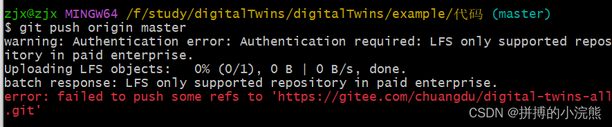


  + `$ rm .git/hooks/pre-push `

  + `$ git push -u origin "master"`

+ **其余步骤同上**

### 4. ssh 配置

#### 生成密钥

  ```
  ssh-keygen -t rsa -C “email”
  ```

  + 输入之间按三下回车，直到出现image,就是虚线的方框,红色部分

  +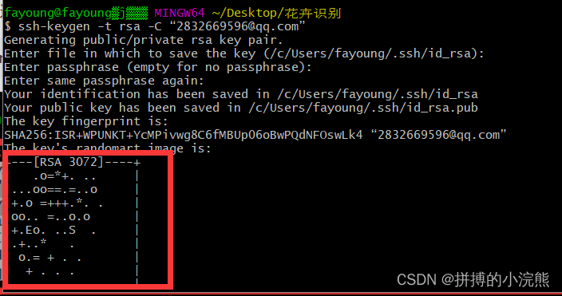

  + 可以使用下面的命令进行查看密钥：

    ```bash
    cat ~/.ssh/id_rsa.pub
    ```

    + 此处不做展示，自己查看即可

+ 下面就到码云或者github上配置，这里以gitee（码云）为例
  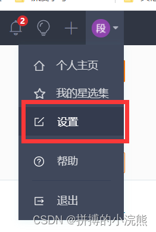
  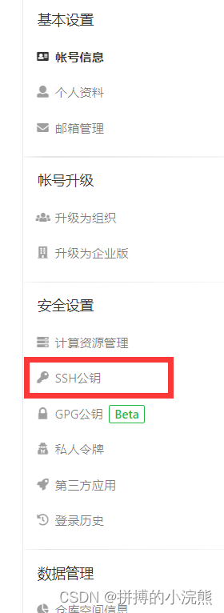
  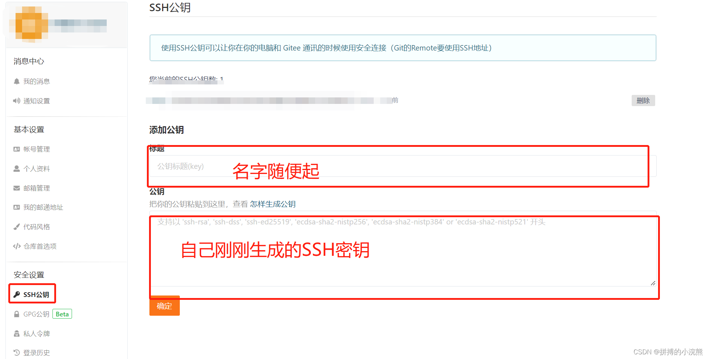

### 5. 大文件下载（1K）

> 问题描述：在之前我们通过 ` git lfs`进行大文件上传，但是我们在本地进行 `clone`的时候，就会发现使用 `git clone + url` 克隆下来的压缩包只有 `只有 1K的大小`，如果要下载源文件我们就必须继续使用  `lfs`

#### 怎么检查是否已正确配置`Git LFS`

要检查是否已正确配置Git LFS，您可以使用以下命令：

1. 检查是否已安装Git LFS：

   ```
   git lfs version
   ```

   如果已成功安装Git LFS，则应该显示LFS版本和Git LFS指针锁定器版本。

2. 查看已跟踪大文件列表：

   ```
   git lfs track
   ```

   这将列出所有当前被Git LFS跟踪的大文件。此命令列出的所有大文件都应该在上传时使用Git LFS指针锁定器上传。

3. 检查LFS文件的指针：

   ```
   git cat-file -p HEAD~1:path/to/largefile.dat
   ```

   这将显示大文件的Git LFS指针。如果该文件已成功上传到Git LFS，应该会显示锁定器文件的OID和文件大小等信息。

4. 检查文件是否正确下载：

   ```
   git lfs fetch --all
   git lfs checkout
   ```

   这将确保在正确配置Git LFS且已正确上传文件到Git LFS时，文件可以正确地下载回来。

如果您在执行上述步骤时遇到任何错误，建议检查是否已在GIT配置文件中正确定义了LFS存储库，例如：

```
$ cat ~/.gitconfig
[user]
    name = Your name
    email = your@mail.com
[filter "lfs"]
    required = true
    clean = git-lfs clean -- %f
    smudge = git-lfs smudge -- %f
    process = git-lfs filter-process
```

#### 已安装 `git lfs`操作

+ 在本地已经克隆的根目录下面执行如下命令

+ ```
  cd 项目目录
  ```

+ ```
   git lfs fetch --all
  ```

+ ```
  git lfs checkout
  ```

+ 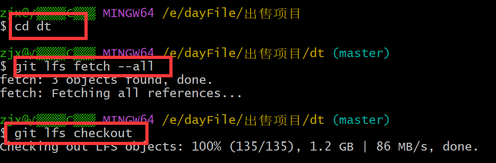

## 5. git报错

> 如果出现权限相关的错误可以按照如下步骤进行

1. `ping github.com`

   - 如果成功则不需要管

   - 如果不成功

   - 在 `hosts`文件中添加如下

   - ```
     ip   github.com
     ```

     - ip获取工具
     - https://sites.ipaddress.com/github.com/

2. 检查防火墙是否运行

3. 检查windows凭证是否存在

4. 重新配置ssh密钥

# (二)怎么访问云服务器上的图片

## 1. 准备工作

- 你需要在阿里云或者腾讯云购买云服务器。
- 配置宝塔面板。
- 安装Tomcat

## 2. 具体操作步骤

### 1. 安装好Tomcat

### 2. 在宝塔界面开启相应的端口，端口为 8080

### 3. ip+8080，访问一下，看是否出现如下图的界面，如果出现则成功。

- 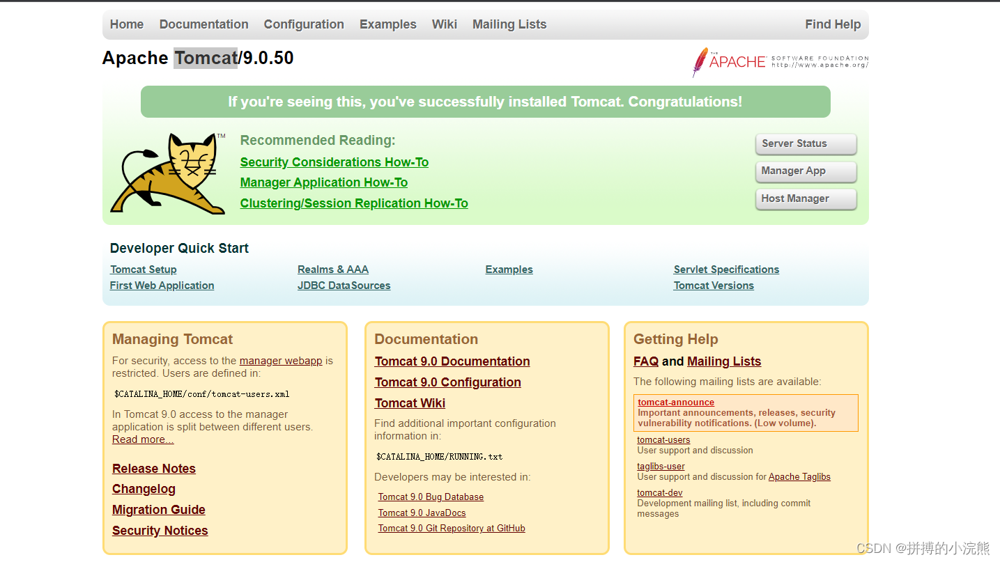


### 4. 进入Tomcat目录，打开配置文件：server.xml

```
# docBase: 要访问图片所在的路径
# path: 虚拟路径
<Context docBase="/home/class_program/upload" path="/upload" debug="0" reloadable="true" />
```

### 5. 用浏览器打开url（ip+8080:upload/图片名）


### 使用场景

1. 可以利用这个做一个简单的云相册。
2. 处理头像上传的功能。

# (三) #1045 无法登录 MySQL 服务器

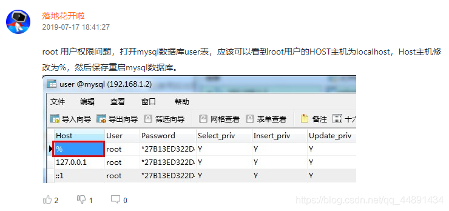

1. 在本地无法连接服务器
2. phpMyAdmin无法登录
3. 修改root密码
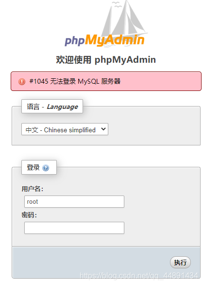
1.停止mysql数据库
`/etc/init.d/mysqld stop`
 （或者直接 kill -9 [PID]  杀进程！)

2.执行如下命令
`mysqld_safe --user=mysql --skip-grant-tables --skip-networking &`

3.使用root登录mysql数据库
`mysql -u root mysql`

4.更新root密码
`mysql>GRANT ALL PRIVILEGES ON *.* TO 'root'@'%' IDENTIFIED BY '123456' WITH GRANT OPTION;`
`mysql> UPDATE user SET Password=PASSWORD('newpassword') where USER='root';`

最新版MySQL请采用如下SQL：
`mysql> UPDATE user SET authentication_string=PASSWORD('newpassword') where USER='root';`

5.刷新权限
`mysql> FLUSH PRIVILEGES;`

6.退出mysql
`mysql> quit`

7.重启mysql
`/etc/init.d/mysqld restart`

8.使用root用户重新登录mysql
`mysql -uroot -p
 Enter password: <输入新设的密码newpassword>`
 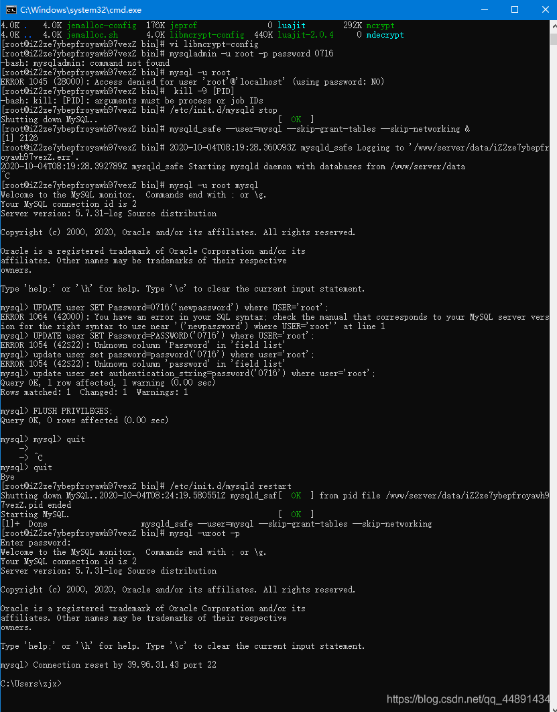

# (四)code-server详细安装

## 首先， 我们应该有一个属于自己的服务器（阿里云学生优惠版即可）

## 安装步骤如下：

### 1. 下载包；

#### 方法一

`wget https://github.com/cdr/code-server/releases/download/3.4.1/code-server-3.4.1-linux-x86_64.tar.gz`

#### 方法二

使用FileZilla软件，将下好的包直接传到服务器上，具体步骤看视频：https://www.bilibili.com/video/BV1vt411P7zm/

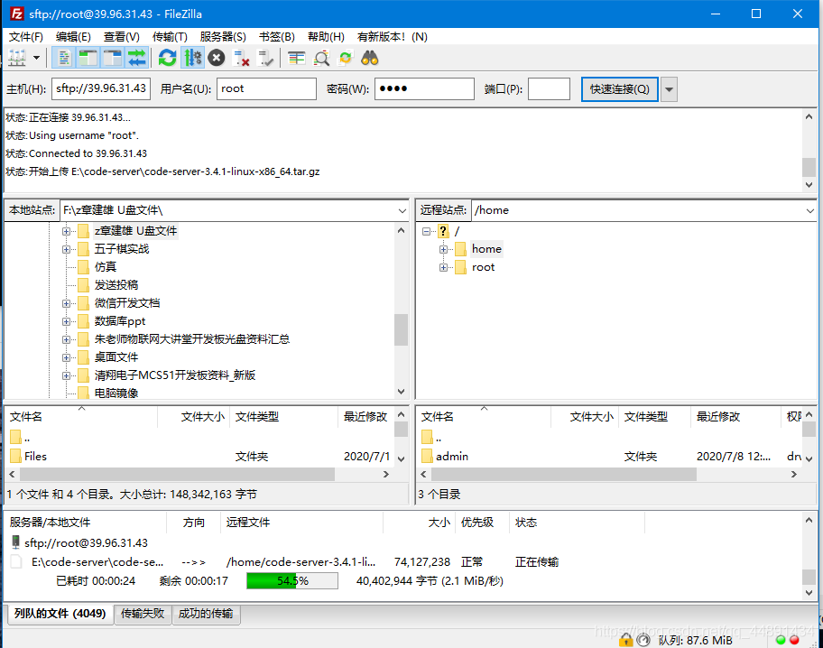


### 2. 查看压缩包

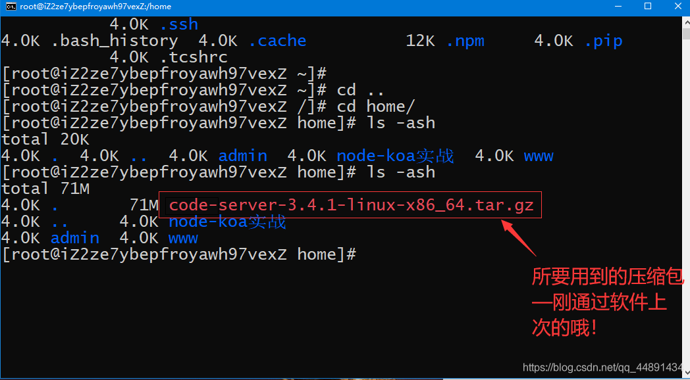


### 3. 解压缩

##### 命 令：`tar -zxvf code-server-3.4.1-linux-x86_64.tar.gz`

### 4.查看解压之后文件

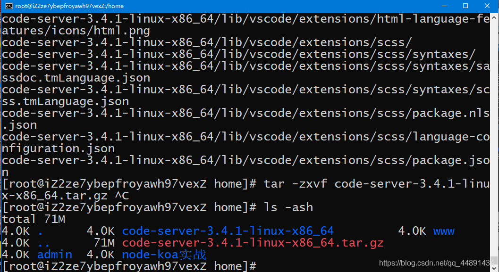

### 5. 切到code-server-3.4.1-linux-x86_64目录下

#### 命令： `cd code-server-3.4.1-linux-x86_64`

### 6. 运行命令

### 命令：`export PASSWORD="你的密码" && ./code-server --host 0.0.0.0 --port 8080`

### 成功登陆界面

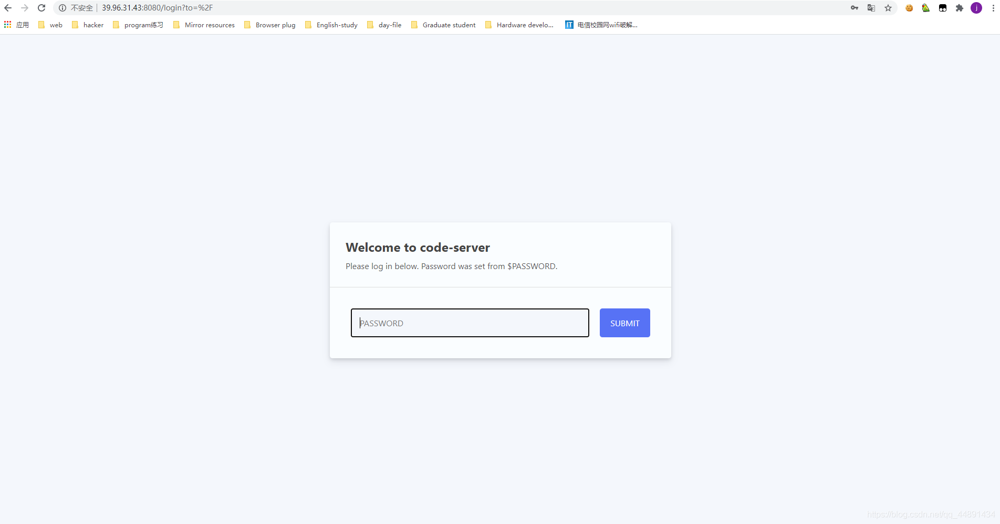

### 主界面

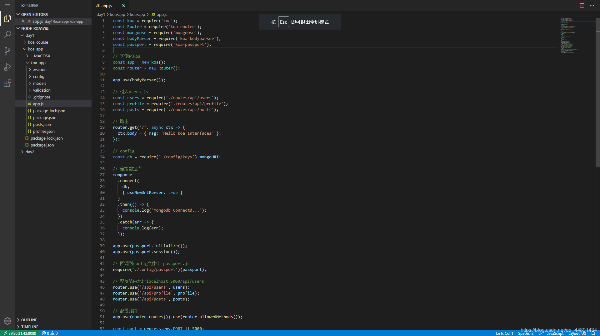

# (五) nodeJS+express+mysql模块封装之服务器渲染小demo

### 创建一个小项目

`npm init`

### 下载相关中间件（根据package.js来下载）

### package.js

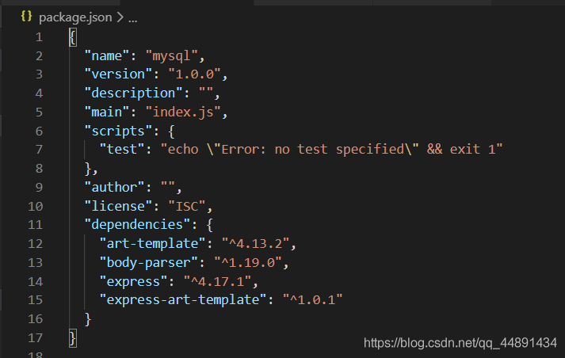

### 目录结构

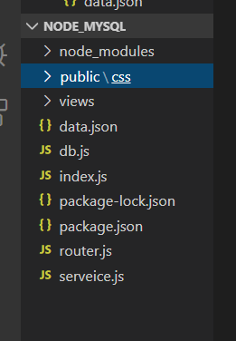

### index.js代码

```
const express = require('express');
const path = require('path');
const template = require('art-template');
const bodyParser = require('body-parser');
const router = require('./router.js')
const app = new express();


// 启动静态
app.use('/static', express.static(path.join(__dirname, 'public')))

// 设置模板引擎
// 设置模板 引擎的路径
app.set('views',path.join(__dirname,'views'));
// 设置模板引擎
app.set('view engine','art');

// 使express 兼容 art-template 模引擎

app.engine('art',require('express-art-template'));

app.use(bodyParser.urlencoded({ extended: false}));
app.use(bodyParser.json());


// 配置路由
app.use(router);

// 监听端口

const server = app.listen(8081,  ()=> {

    const host = server.address().address
    const port = server.address().port
    console.log("应用实例，访问地址为 http://%s:%s", host, port)
  
  })
```
### 利用回调函数的性质完成db.js:

```
const mysql  = require('mysql');

exports.base = (sql,data,callback) => {
    const connection = mysql.createConnection({
        host:'主机地址',
        user:'root',
        password:'你的mysql密码',
        database:'book'
    });
    connection.connect();

    connection.query(sql,data,function(error,results,fields){
        if(error) throw error;
        callback(results);
    })
    connection.end();
}
```
### 建立router.js路由模块（这里以图书管理为例）：

```
/**
 * 路由模块
 */

 const express = require('express');
 const router = express.Router();
 const service = require('./serveice.js')

//  路由处理
 router.get('/',service.showIndex);
 
 router.get('/toBook',service.toAddBook);

 router.post('/addBook',service.addBook);

 router.get('/toEditBook',service.toEditBook);
 router.post('/editBook',service.editBook);

 router.get('/deleteBook',service.deleteBook)
//  router.get('/dBook',service.deleteBook)
 module.exports = router;
```
### 业务层抽离，专心业务的书写，建立serveice.js业务模块

```
/**
 * 业务模块(处理具体的业务)
 */

const data = require('./data.json');
const path = require('path');
const db = require('./db.js')
const fs = require('fs');

// 自动生成图书编号
let maxBookCode = ()=>{
    let arr= [];
    data.forEach((item) => {
        arr.push(item.id);
    });
    return Math.max.apply(null,arr);
}

//  渲染主页面
exports.showIndex = (req,res) => {
    let sql = 'select * from book';
    db.base(sql,null,(result) => {
        res.render('index',{list:result})
    });
}


exports.toAddBook = (req,res)=>{
    res.render('addbook',{})
}

exports.addBook = (req,res)=>{
    // 获取表单数据
    let info = req.body;
    console.log(info)
    let book = {};
    for(let key in info){
        book[key] = info[key];
    }
    let sql = 'insert into book set ?';
    db.base(sql,book,(result) => {
        // console.log(result);
        if(result.affectedRows >= 1){
            res.redirect('/');
        }
    })
}

exports.toEditBook= (req,res)=>{
    let id = req.query.id;
    let sql = "select * from book where id = ?";
    let data = [id];
    db.base(sql,data,(result) => {
        res.render('editBook',result[0]);
    })
    
}


exports.editBook= (req,res) => {
    let info = req.body;
    console.log(info.description);
    let sql = "update book set name=?,author=?,category=?,description=? where id=?";
    let data = [info.name,info.author,info.category,info.description,info.id];
    db.base(sql,data,(result) => {
        if(result.affectedRows >= 1){
            res.redirect('/');
        }
    });

}

exports.deleteBook = (req,res) => {
    let id = req.query.id;
    let sql = `
            delete from book where id = ?; 
            `;
    let data = [id];
    db.base(sql,data,(result)=>{
        if(result.affectedRows >= 1){
            res.redirect('/');
        }
    })
}
// exports.dBook = (req,res) => {
//     let id = req.query.id;
//     let sql = "ALTER TABLE book ADD id INT NOT NULL PRIMARY KEY AUTO_INCREMENT FIRST;"
// }

```
### 数据交互采用的art-template

- 目录结构
-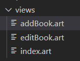

### 主页面，index.art:

```
<!DOCTYPE html>
<html lang="en">
<head>
    <meta charset="UTF-8">
    <meta name="viewport" content="width=device-width, initial-scale=1.0">
    <meta http-equiv="X-UA-Compatible" content="ie=edge">
    <title>图书馆里系统</title>
    <link rel="stylesheet" type="text/css" href="/static/css/style.css">
</head>
<body>
    <div class="title">图书馆里系统 <a href="/toBook">添加图书</a></div>
    <div class="content">
        <table cellpadding = "0" cellsapcing = "0">
            <thead>
                <tr>
                    <th>编号</th>
                    <th>名称</th>
                    <th>作者</th>
                    <th>类别</th>
                    <th>描述</th>
                    <th>操作</th>
                </tr>
            </thead>
            <tbody>
               {{ each list}}
                    <tr>
                        <td>{{ $value.id }}</td>
                        <td>{{ $value.name }}</td>
                        <td>{{ $value.author }}</td>
                        <td>{{ $value.category }}</td>
                        <td>{{ $value.description }}</td>
                        <td><a href="/toEditBook?id={{$value.id}}">修改</a>|<a class='del' href="/deleteBook?id={{$value.id}}">删除</a></td>
                    </tr>
               {{ /each}}
            </tbody>
        </table>
    </div>
</body>
</html>
```
### 添加图书个管理图书界面（addBook.art,editBook.art）：

```
// addBook 添加图书
<!DOCTYPE html>
<html lang="en">
<head>
    <meta charset="UTF-8">
    <meta name="viewport" content="width=device-width, initial-scale=1.0">
    <meta http-equiv="X-UA-Compatible" content="ie=edge">
    <title>添加图书</title>
</head>
<body>
    <div>添加图书</div>
    <form action="/addBook" method="post">
        编号： <input type="text" name="id" id=""><br>
        名称： <input type="text" name="name" id=""><br>
        作者： <input type="text" name="author" id=""><br>
        类别： <input type="text" name="category" id=""><br>
        描述： <input type="text" name="description" id=""><br>
        <input type="submit" value="提交">
    </form>
</body>
</html>
```
```
// editBook编辑图书
<!DOCTYPE html>
<html lang="en">
<head>
    <meta charset="UTF-8">
    <meta name="viewport" content="width=device-width, initial-scale=1.0">
    <meta http-equiv="X-UA-Compatible" content="ie=edge">
    <title>编辑图书</title>
</head>
<body>
    <div>编辑图书</div>
    <form action="/editBook" method="post">
        编号： <input type="text" name="id" value = "{{id}}"><br>
        名称： <input type="text" name="name" value = "{{ name }}"><br>
        作者： <input type="text" name="author" value = "{{ author }}"><br>
        类别： <input type="text" name="category" value = "{{ category }}"><br>
        描述： <input type="text" name="description" value = "{{ description }}"><br>
        <input type="submit" value="提交">
    </form>
</body>
</html>
```
### 输入命令`nodemon index.js`来跑自己的程序吧！体验喜悦的时刻到了！

# (六)git文件回滚
## 1. 查看提交日志
+ ` git reflog`
## 2. 回滚
+ `git reset --hard 8f3d055`(此处的‘8f3d055’为id，在日志中有的，可以依照自己的日志确定要恢复的版本)


# (七)apt下载无法获得锁

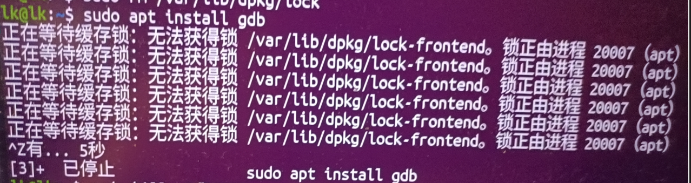

如果在使用`apt`命令时出现“无法获得/ var / lib / dpkg / lock-frontend - open（11：资源临时不可用）”或“无法获得/ var / lib / dpkg / lock -open（11：资源临时不可用）”等错误消息，则表示系统中已存在一个APT进程正在运行，该进程可能在更新或安装软件包。在这种情况下，您可以执行以下操作：

1. 确定哪个程序正在使用APT：

   ```
   ps aux | grep apt
   ```

   这将为您提供正在运行的APT进程的列表。从中找到ID号（PID）的进程，确认是否是您可以关闭其并释放APT锁的程序。

2. 杀死APT进程：

   如果找到了整在使用APT的进程，请尝试使用以下命令来杀死进程：

   ```
   sudo kill -9 <PID>
   ```

   其中， `<PID>` 是上一步找到的APT进程的PID号。这将中止进程并释放APT锁。

3. 清除APT锁：

   在完成上述操作之后，您需要清除APT锁文件。可以使用以下命令清除APT锁：

   ```
   sudo rm /var/lib/{dpkg,apt}/lock
   sudo dpkg --configure -a
   ```

   第一条命令将删除APT锁文件。第二个命令将配置缺失的程序包并重新配置APT。

4. 更新APT：

   在执行完上述步骤后，使用以下命令更新APT缓存：

   ```
   sudo apt update
   ```

这些步骤可能与您使用的Linux发行版或系统环境略有不同，但这些步骤通常适用于处理APT访问权限问题及其他APT错误。如果问题仍然存在，则可以尝试使用其他包管理器或执行更广泛的系统诊断以解决问题。
