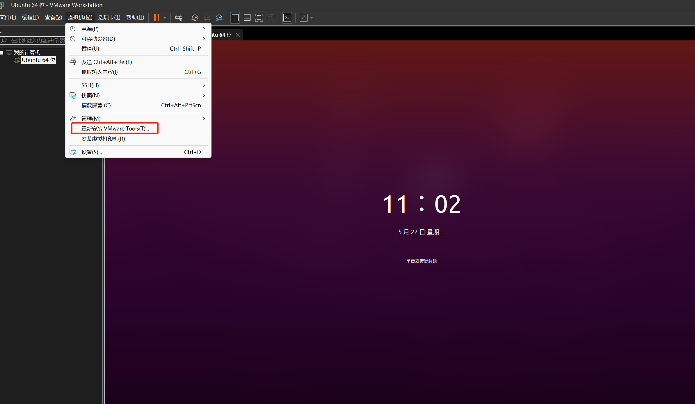
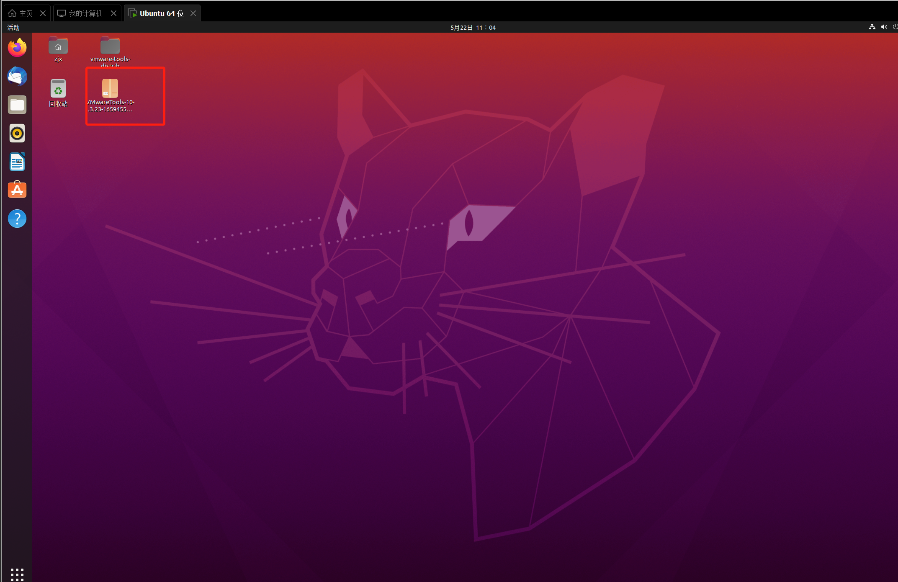
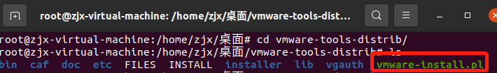
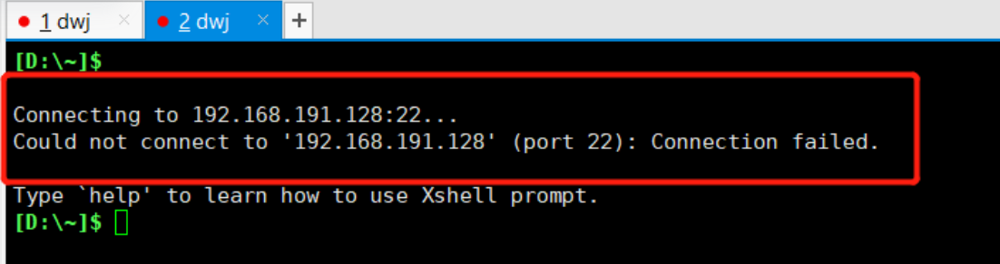
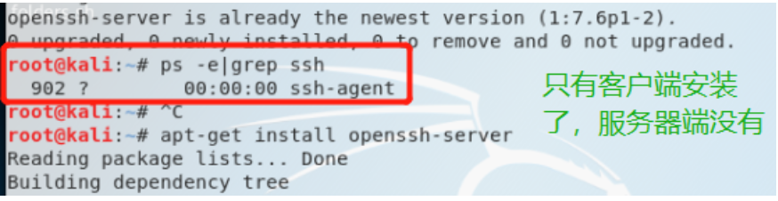
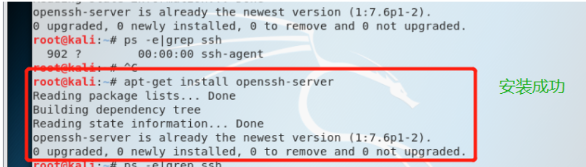
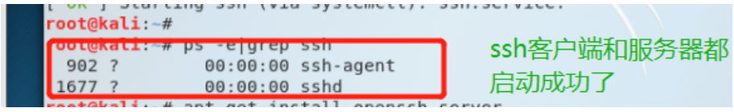

# VMware 走过的分和雨

## 一. VMware-tools安装

> 我们在VMware安装好系统之后，进入就会发现，系统界面并没有占满我们的屏幕，整个的分辨率也不合适，这时候我们就需要安装Vmware-tools了

+ 安装之后的好处有那些那
  1. 分辨率恢复正常
  2. 屏幕占比恢复正常
  3. 物理机和虚拟机复制内容可同步
  4. 直接可以将物理机上的文件拖至虚拟机安装VMware-tools的目录之下
  5. ……

### 开始安装VMware-tools！走起！



+ 点击安装完之后会在下面这个目录，我们**需要复制到其他目录，我这里选择的是桌面目录**



+ 随后我们打开终端执行如下命令
+ 解压压缩包
  + `tar -xvf 压缩包的名字`
+ 随后目录如下



+ 最后一步啦
  + `./vmware-install.pl`
  + 随后一路 `enter` 加 `yes`

>  起飞中！太爽了！是不是一下子就舒服啦！

## 二. xshell 远程连接VMware系统

> 不想总是在Vmware中搞，就想在windows下，搞好全部的任务，切来切去太麻烦了！终于解决了！

> 刚装好系统后，我们连接可能会报错，需要按如下进行操作一下下！

### 1. ssh服务错误



+ 此时我们就需要打开我们的vmware中的终端，来搞事情了

  + 通过`ps -e|grep ssh`命令判断是否安装ssh服务
  + 
  + 如果只有客户端安装了，服务器没有安装，则需要安装ssh服务器，命令：`apt-get install openssh-server`
  + 
  + 安装成功之后，启动ssh服务，命令：`/etc/init.d/ssh start`
  + 
  + 通过`ps -e|grep ssh`命令再次判断是否正确启动
  + 

### 2. 端口开放 

+ 首先，确保 `ufw` 已经安装。如果尚未安装，可以使用以下命令进行安装：
  + `sudo apt-get install ufw`
+ 然后，使用以下命令开启 `ufw` 防火墙：
  + `sudo ufw enable`
+ 现在，可以使用以下命令开放端口：
  + `sudo ufw allow [端口号]/[协议]`
+ 例如，如果要开放 HTTP 端口(即端口 80)，可以使用以下命令：
  + `sudo ufw allow 80/tcp`
+ 重启防火墙使其生效即可。
  + `sudo ufw reload`

#### 2.1 常用命令总结

```tex
sudo apt-get install openssh-server
 
sudo apt-get install ufw
 
sudo ufw enable
 
sudo ufw allow 22
 
ps -e |grep ssh
 
sudo apt-get install openssh-server
```

