#   

# (一) uni-app头像上传（完善个人信息功能），后端NodeJs+MySQL

### 1. uni-app代码

```vue
<template>
	<view class="page-main">
		<view class="upload">
			<text>头像：</text>
			<!-- <view class="box" @click="chooseUploads">
				<image class="box-img" src="../../static/index/jia.png"></image>
			</view> -->
			<view class="box" @click="upload">
				<image class="box-img" :src="avatar" mode=""></image>
			</view>
		</view>
		<view class="user-info">
			<view class="form">
				<uni-forms ref="form" :modelValue="formData" label-position="left">
					<!-- :rules="rules" name="iphone"name="password"   avatar-->
					<uni-forms-item label="姓名：" label-width="20px">
						<input class="input" type="text" value="" v-model="formData.Susername" placeholder="请输入姓名" />
					</uni-forms-item>
					<uni-forms-item label="性别：" label-width="0px">
						<input class="input" type="text" value="" v-model="formData.Ssex" placeholder="请输入性别" />
					</uni-forms-item>
					<uni-forms-item label="年龄：" label-width="0px">
						<input class="input" type="text" value="" v-model="formData.Sage" placeholder="请输入年龄" />
					</uni-forms-item>
					<uni-forms-item label="个人简介：" label-width="0px">
						<textarea class="input-textarea" type="textarea" value="" v-model="formData.direction"
							placeholder="请输入" />
					</uni-forms-item>

				</uni-forms>

				<button class="loginBtn" type="primary" @click="submit"><text class="btnValue">提交</text></button>

			</view>
		</view>

	</view>
</template>

<script>
	export default {
		data() {
			return {
				 iconcheck:0, //头像是否改变
				avatar:"", //默认头像
				formData: {
					direction: '',
					Sage: '',
					Ssex: '',
					Susername: '',
				},

			}
		},
		
		methods: {
			upload(){
				uni.chooseImage({
					count:1,
					success: (res)=>{
						this.avatar=res.tempFilePaths[0]
					}
				})
			},
			submit(){
				console.log(this.avatar)
				var _this = this;
				uni.uploadFile({
				    url: 'http://47.107.93.173:3000/avatar', //仅为示例，并非真实接口地址。
					filePath: _this.avatar,
					name: 'avatar',
				    formData: {
						'direction':_this.formData.direction,
						'Sage':_this.formData.Sage,
						'Ssex':_this.formData.Ssex,
						'Susername':_this.formData.Susername,
				    },
				    success: (res) => {
				        console.log(res);
				    }
				});
			}
		}
	}
</script>


```

### 2. 后端代码

```javascript
exports.avatar = (req,res)=>{
    const avatar ={
        avatar:req.file.filename
    }
    const info = req.body;
    Object.assign(info,avatar)
    let sql = 'update users  set avatar=?,Ssex=?,Sage=?,direction=? where Susername=?;';
    let data = [info.avatar,info.Ssex,info.Sage,info.direction,info.Susername]
    db.base(sql,data,(result) => {
        if(result.affectedRows >= 1){
           res.send({
               flag:1,
               data:data
           })
        }else{
            return res.send({flag:2});
        }
    })
    }
```

# (二)vue前后端分离项目各种请求封装+应用

## 目录
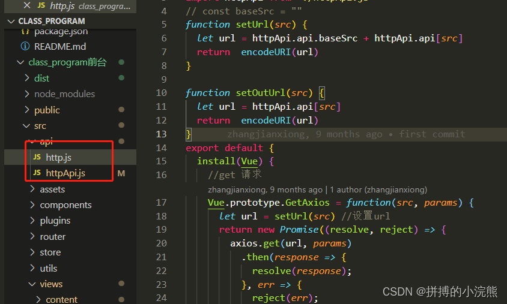
## http.js

```
import axios from 'axios'
import qs from 'qs'
import httpApi from './httpApi.js'
// const baseSrc = ""
function setUrl(src) {
  let url = httpApi.api.baseSrc + httpApi.api[src]
  return  encodeURI(url)
}

function setOutUrl(src) {
  let url = httpApi.api[src]
  return  encodeURI(url)
}
export default {
  install(Vue) {
    //get 请求
    Vue.prototype.GetAxios = function(src, params) {
      let url = setUrl(src) //设置url
      return new Promise((resolve, reject) => {
        axios.get(url, params)
          .then(response => {
            resolve(response);
          }, err => {
            reject(err);
          })
          .catch((error) => {
            reject(error)
          })
      })
    }
    Vue.prototype.GetJson = function(src, params){
      let url = setUrl(src) //设置url
      return new Promise((resolve,reject)=>{
        axios.request({
              url: url,
              method:"get",
              params: params,
              headers: {
                'Content-Type': "application/json; charset=utf-8"
              }
          }).then((ok)=>{
              resolve(ok)
          }).catch((err)=>{
              reject(err)
          })
      })
  }
    // formdata格式 post
    Vue.prototype.PostAxios = function(src, params) {
      let url = setUrl(src) //设置url
      return new Promise((resolve, reject) => {
        axios.post(url, qs.stringify(params))
          .then(response => {
            resolve(response);
          }, err => {
            reject(err);
          })
          .catch((error) => {
            reject(error)
          })
      })
    }
    // json格式 post
    Vue.prototype.PostJsonAxios = function(src, params) {
      let obj = setUrl(src) //设置url
      return new Promise((resolve, reject) => {
        axios({
            url: obj,
            method: 'post',
            data:params,
            headers: {
              'Content-Type': "application/json; charset=utf-8"
            },
          }).then(response => {
            resolve(response);
          }, err => {
            reject(err);
          })
          .catch((error) => {
            reject(error)
          })
      })
    }
    //接入第三方时的请求
    //get 请求
    Vue.prototype.GetOutAxios = function(src, params) {
      let url = setOutUrl(src) //设置url
      return new Promise((resolve, reject) => {
        axios.get(url, params)
          .then(response => {
            resolve(response);
          }, err => {
            reject(err);
          })
          .catch((error) => {
            reject(error)
          })
      })
    }
    Vue.prototype.GetOutJson = function(src, params){
      let url = setOutUrl(src) //设置url
      return new Promise((resolve,reject)=>{
        axios.request({
              url: url,
              method:"get",
              params: params,
              headers: {
                'Content-Type': "application/json; charset=utf-8"
              }
          }).then((ok)=>{
              resolve(ok)
          }).catch((err)=>{
              reject(err)
          })
      })
  }
    // formdata格式 post
    Vue.prototype.PostOutAxios = function(src, params) {
      let url = setOutUrl(src) //设置url
      return new Promise((resolve, reject) => {
        axios.post(url, qs.stringify(params))
          .then(response => {
            resolve(response);
          }, err => {
            reject(err);
          })
          .catch((error) => {
            reject(error)
          })
      })
    }
    // json格式 post
    Vue.prototype.PostOutJsonAxios = function(src, params) {
      let obj = setOutUrl(src) //设置url
      return new Promise((resolve, reject) => {
        axios({
            url: obj,
            method: 'post',
            data:params,
            headers: {
              'Content-Type': "application/json; charset=utf-8"
            },
          }).then(response => {
            resolve(response);
          }, err => {
            reject(err);
          })
          .catch((error) => {
            reject(error)
          })
      })
    }

  }
}


/* 请求拦截器 */
// let comloading = ''
// axios.interceptors.request.use(function(config) { // 每次请求时会从localStorage中获取token
//   var token = sessionStorage.getItem('token');
//   if (token) {
//     config.headers.common['token'] = [token];
//   }
//   return config
// }, function(error) {
//   return Promise.reject(error)
// })
// // 响应
// axios.interceptors.response.use(response => {
//   // if (response.status == 401) {
//   //   if (vm.$route.path != '/login') {
//   //     vm.$alert('登录异常，请重新登录', '提示', {
//   //       confirmButtonText: '确定',
//   //       callback: action => {
//   //         vm.$router.push('/login')
//   //       }
//   //     });
//   //   }
//   // }
//   console.log(response)
//   let data = response.data
//   if(data.data) {
//     data.data = JSON.parse(decrypt(data.data))
//   }
//   if(data.code !== 0) {
//     console.log(decrypt(data.message))
//     vm.$message.error(decrypt(data.message))
//     return
//   }else {
//     return data
//   }
// }, error => {
//   vm.$message.error('连接错误,请稍后再试')
//   console.log(error)
//   return Promise.resolve(error.response)
// },data => {
//   console.log(data)
// })

```
### httpAPI.js
```javascript
export default {
  api: {
    baseSrc : 'http://127.0.0.1:3000',
    weather: '/weather', //天气
  }
}
```

### main.js

```javascript
import Vue from 'vue'
import App from './App.vue'
import router from './router'
import store from './store'
import ElementUI from 'element-ui'
import http from '../src/api/http.js'
import rightMenu from "rightmenu"
import httpApi from './api/httpApi'
// 漂浮的小星星
import particles from 'particles.js'

// 导入字体图标
import './assets/fonts/iconfont.css'

// 引入echarts
import echarts from 'echarts'
// echarts 动画
import '../static/chartChange/echarts-tooltip-carousel.js'
import scroll from 'vue-seamless-scroll'//无缝滚动

// 导入全局css文件
import '../src/assets/css/global.scss'
import '../src/assets/css/element.css'
import '../src/assets/css/index.scss'

import axios from 'axios'
import './plugins/element.js'

import '../static/data'

import 'babel-polyfill'
import Es6Promise from 'es6-promise'
import VueCookies from 'vue-cookies'


Es6Promise.polyfill()
// cookie过期时间
window.$cookies.config('6000s')

// 配置请求的根路径
axios.defaults.baseURL = httpApi.api.baseSrc
axios.interceptors.request.use(config => {
  config.headers.Authorization = window.sessionStorage.getItem('token')
  // 在最后必须return config
  return config
})

Vue.use(scroll)
Vue.use(rightMenu)
Vue.use(particles)
Vue.use(ElementUI)
Vue.use(http);
Vue.use(VueCookies)

Vue.config.productionTip = false
Vue.prototype.echarts = echarts
Vue.prototype.$http = axios
new Vue({
  router,
  store,
  render: h => h(App)
}).$mount('#app')

```
### 登录引用案例

```javascript
login() {
      this.$refs.loginFormRef.validate((valid) => {
        // console.log(valid)
        // eslint-disable-next-line
        if (!valid) return;
        this.PostAxios("Login", this.loginForm).then((res)=>{
          console.log(res.data)
        if (res.data.flag != 1) {
          return this.$message.error(res.data.msg);
        } else {
          this.$message.success("登陆成功");
          // 1. 将登录成功之后的Token，保存到客户端的 sessionStorage中
          // 1.1 项目中出现了登录之外的其他API接口，必须的登录之后才能访问
          // 1.2 token只应在当前网站打开期间生效，所以将token 保存到sessionStorage中
          window.sessionStorage.setItem("token", res.data.token);
          window.sessionStorage.setItem("Sphone",this.loginForm.Sphone);
          // 2. 通过编程式导航跳转到后台主页，路由地址是 /home
          this.$router.push("/home");
        }
         })
      });
    },
```

# (三)web视频播放组件（easyplayer）和音频组件播放封装（vue-aplayer）

***

## web视频播放组件（easyplayer）和音频组件播放封装（vue-aplayer）
### 使用只需要传相应的参数就可以使用，比较方便快捷。
## easyplay使用教程：https://blog.csdn.net/qq_44891434/article/details/118525941
## vue-aplayer使用教程：https://aplayer.netlify.app/docs/guide/options.html#autoplay

***
## 视频子组件编写
```vue
<template>
  <!-- 采用easyplayer.js -->
  <div :style="esayvideowidth">
    <easy-player :video-url="videoUrl" :poster="videoImg" :autoplay="false" />
  </div>
</template>

<script>
import EasyPlayer from '@easydarwin/easyplayer'
import 'videojs-contrib-hls'
export default {
  components: {
    // eslint-disable-next-line vue/no-unused-components
    EasyPlayer
  },
  // eslint-disable-next-line vue/require-prop-types
  props: ['esayurl', 'esayvideowidth'],
  data() {
    return {
      videoUrl: this.esayurl,
      videoImg: require('@/assets/3.jpg')
    }
  }
}
</script>


```
## 音频子组件封装
```vue
<template>
  <div :style="audiowidth">
    <!--music：当前播放的音乐。 list：播放列表 ：showlrc：是否显示歌词-->
    <aplayer :music="videoUpload.music" />
  </div>
</template>

<script>
import aplayer from 'vue-aplayer'
export default {
  components: {
    aplayer
  },
  // eslint-disable-next-line vue/require-prop-types
  props: ['audiourl', 'audiowidth'],
  data() {
    return {
      videoUpload: {
        progress: false,
        progressPercent: 0,
        successPercent: 0,
        music: {
          title: '音乐播放器',
          author: ' ',
          // eslint-disable-next-line no-undef
          url: this.audiourl,
          pic: require('@/assets/music/audioBg.png')
          // lrc: '[00:00.00] (,,•́ . •̀,,) 抱歉，当前歌曲暂无歌词'
        }
      }
    }
  },
  mounted() {
  }
}
</script>

<style lang="scss" scoped>

</style>

```
## 父组件调用
```vue
<template>
  <!-- vue-video-player -->
  <div class="videoBox">
    <videoDisplay />
    <EsayVideo :esayurl="'/api/manager/file/materail/2021/0710/210710153208424119054.mp4'" :esayvideowidth="'width:800px;margin:1%;'" />
    <AudioPlay :audiourl="'/api/manager/file/materail/2021/0715/210715171331958135001.mp3'" :audiowidth="'width:300px;margin:1%;'" />
  </div>
</template>

<script>
import videoDisplay from '@/components/video/index'
import EsayVideo from '@/components/video/esayVideo'
import AudioPlay from './audio.vue'
// import { manager } from '@/api/base'
// const URL = process.env.VUE_APP_BASE_API + manager
export default {
  components: {
    // eslint-disable-next-line vue/no-unused-components
    videoDisplay,
    // eslint-disable-next-line vue/no-unused-components
    AudioPlay,
    // eslint-disable-next-line vue/no-unused-components
    EsayVideo

  },
  data() {
    return {
      // audiourl: URL + '/file/materail/2021/0715/210715171331958135001.mp3',
      // esayurl: URL + '/file/materail/2021/0710/210710153208424119054.mp4'
    }
  },
  mounted() {
    console.log(this.audiourl)
  }
}
</script>


```
## 效果图展示
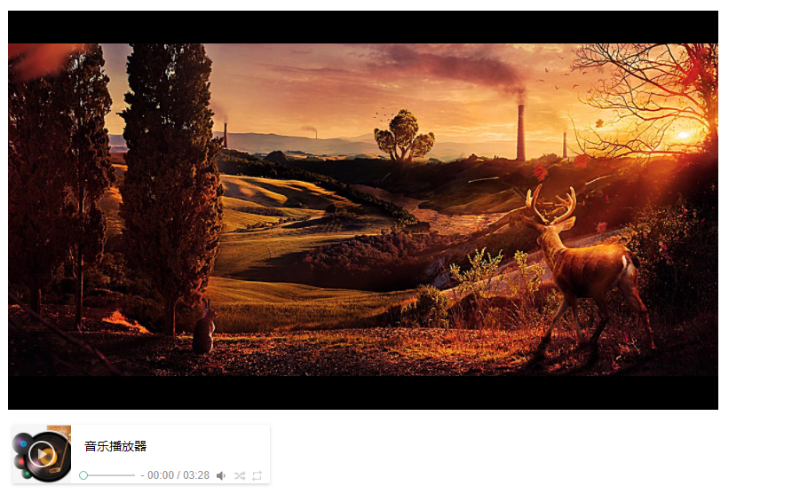

#  (四)Echarts-饼图

***
## 代码
```js 
const colors = ['#2EC7C9', '#B6A2DE', '#D87A80', '#FFB980', '#00c6ff', '#2EC7C9'].reverse()
var data = [{
      name: '户外大屏',
      value: 10
    },
    {
      name: '广告条屏',
      value: 20
    },
    {
      name: '其他',
      value: 30
    },
    {
      name: '公共交通',
      value: 40
    },
    {
      name: '广播',
      value: 50
    }
]
var total = data.reduce((prev, curr) => prev + curr.value, 0);
option ={
    backgroundColor: "#0f375f",
        color: colors,
        legend: {
            orient: 'horizontal',
            top: "91%",
            // right: "20%",
            itemGap: 50,
            itemWidth: 16,
            itemHeight: 16,
            textStyle: {
                color: "#",
                fontSize: 16
            },
            data: data,
        },
        tooltip: {
          trigger: 'item',
          formatter: '{a} <br/>{b} : {c} ({d}%)'
        },
        series: [{
          name: '半径模式',
          type: 'pie',
          radius: ['30%', '65%'],
          center: ['50%', '55%'],
          roseType: 'radius',
          minShowLabelAngle: 1,
          label: {
            show: true,
            normal: {
              position: 'outside',
              fontSize: 14,
              formatter: (params) => {
                return params.name + '    ' + params.value + '%'
              }
            }
          },
          labelLine: {
            length: 10,
            length2: 30,
            smooth: true
          },
          data: data
        }]
      }
```
## 效果图
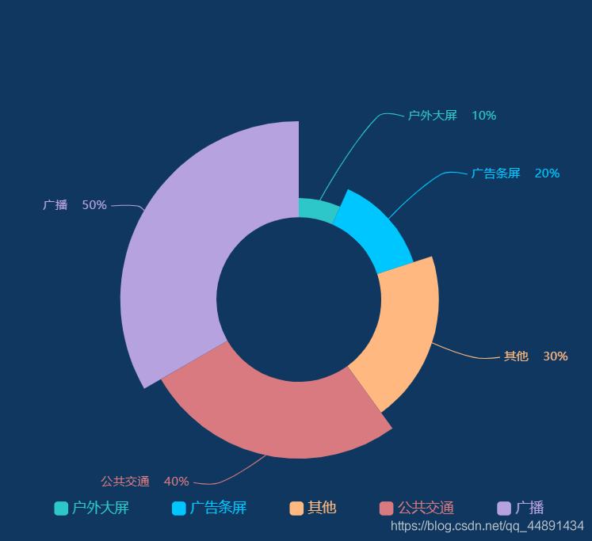

# (五) vue（父子组件）使用element弹窗功能

##  注意点
1.	注意使用父子组件传值的时候，props的值是单项的。
2.	所以说在做弹窗的时候我们需要先，父组件向子组件传值，然后子组件向父组件传值。
## 父组件
```vue
<template>
  <div>
    <div class="displayVideo">
      <template>
        <ul v-infinite-scroll="load"  class="personalDiaplayLine infinite-list" style="overflow:auto">
          <li v-for=" ( item,index ) in personalDiaplayLine" :key="index">
            <ul>
              <li v-for="( ite,ind ) in personalDiaplay" :key="ind ">
                
                <i class="videospanclose" />
                <p>{{ ite.title }}</p>
              </li>
            </ul>
          </li>
        </ul>
      </template>
    </div>
    <VideoFrame :display="display" @sendFVideo="getMsgVideoSon" />
    <!-- <el-dialog
      :visible.sync="dialogVisible"
      width="55%"
    >
      <div class="boxDisplay">
        <easy-player :video-url="videoUrl" :poster="videoImg" />
      </div>
    </el-dialog> -->
  </div>
</template>

<script>
import EasyPlayer from '@easydarwin/easyplayer'
import 'videojs-contrib-hls'
import VideoFrame from '@/components/file/video/videoFrame'
export default {
  name: 'File',
  // eslint-disable-next-line vue/no-unused-components
  components: { EasyPlayer, VideoFrame },
  data() {
    return {
      display: false,
      personalDiaplayLine: 0,
      videoUrl: require('@/assets/video/DPlayer.webm'),
      videoImg: require('@/assets/3.jpg'),
      personalDiaplay: [
        { title: '江户时代那时的撒娇', url: require('@/assets/avatar.jpg') },
        { title: '江户时代那时的撒娇', url: require('@/assets/avatar.jpg') },
        { title: '江户时代那时的撒娇', url: require('@/assets/avatar.jpg') },
        { title: '江户时代那时的撒娇', url: require('@/assets/avatar.jpg') },
        { title: '江户时代那时的撒娇', url: require('@/assets/avatar.jpg') }
      ]
    }
  },
  mounted() {
    // this.baseAddr = process.env.VUE_APP_SER_ADDR + manager
  },
  created() {
    this.sumLine()
  },
  methods: {
    videoSpring() {
      this.display = true
    },
    getMsgVideoSon(data) {
      this.display = data
    },
    sumLine() {
      if (parseInt(this.personalDiaplay.length / 3) > 3) {
        this.personalDiaplayLine = parseInt(this.personalDiaplay.length / 3)
      } else {
        this.personalDiaplayLine = 1
      }
    },
    load() {
      this.personalDiaplayLine += 2
    }
  }
}
</script>

<style lang="scss" scoped>
*{
  list-style: none;
}
  .type-icon{
    display: inline-block;
    width: 12px;
    height: 12px;
  }
.displayVideo {
  width: 100%;
  height: 70vh;
  overflow: auto;
  // overflow-x: hidden;
  // overflow-y: auto;
  .personalDiaplayLine{
  display: block;
  width: 100%;
  height:100%;
  padding: 0 !important;
  margin-left: -1%;
  li:nth-of-type(1){
    margin-top: -1%;
    padding: 0 !important;
  }
  li{
    width: 100%;
    height: 30%;
    margin-top: 2.5%;
    ul{
      width: 100%;
      height: 100%;
       li:nth-of-type(1){
          margin-top: 2.5%;
        }
      li{
        width: 30%;
        margin-left: 2%;
        height: 100%;
        float: left;
        position: relative;
        top: -7.5%;
        overflow: hidden;
        display: flex;
        justify-content: center;
        cursor: pointer;
        img{
          position: relative;
        }
        .play{
          width: 30px;
          height: 30px;
          position: absolute;
          top: 88%;
          left: 86%;
          cursor: pointer;
          z-index: 100;
        }
       p{
          margin: 0;
          width: 100%;
          height: 25px;
          line-height: 25px;
          color: #fdfbfb;
          background-color: rgb(42, 37, 37);
          text-align: left;
          overflow:hidden;
          text-overflow:ellipsis;
          white-space:nowrap;
          position: absolute;
          top: calc(100% - 25px);
          left: 0;
          font-size: 14px;
          padding-left: 3%;
        }
      }
    }
  }
  }
}
.videospanclose:after {
  font-family: 'element-icons';
  position: absolute;
  top: 1vh;
  left: 90%;
  font-size: 20px;
  content: "\E6DB";
  cursor: pointer;
}

</style>
```
## 子组件
```vue
<template>
  <div>
    display:{{display}}
    <el-dialog
      :visible.sync="display"
      width="55%"
      @close="videoDisplayClose"
    >
      <div class="boxDisplay">
        <easy-player :video-url="videoUrl" :poster="videoImg" />
      </div>
    </el-dialog>
  </div>
</template>
<script>
import EasyPlayer from '@easydarwin/easyplayer'
import 'videojs-contrib-hls'
export default {
  components: { EasyPlayer },
  // eslint-disable-next-line vue/require-prop-types
  props: {
    display: {
      type: Boolean,
      required: true
    }
  },
  data() {
    return {
      CountTo: 0,
      videoUrl: require('@/assets/video/DPlayer.webm'),
      videoImg: require('@/assets/3.jpg')
    }
  },
  methods: {
    // 关闭事件
    videoDisplayClose() {
      // eslint-disable-next-line eqeqeq
      this.$emit('sendFVideo', false)
    }
  }
}
</script>
<style lang="scss" scoped>
/deep/ .el-dialog{
color: white;
height: 60vh !important;
margin-top: 20vh !important;
position: relative;
}
.boxDisplay{
width: 100%;
height: 100%;
position: absolute;
top: 0;
left: 0;
}.test{
  width: 20px;
  height: 30px;
  background-color: antiquewhite;
  font-size: 20px;
  color: red;
}
</style>
```

# (六)vue实现弹窗卡片表单变标签功能

## 功能描述
1. 在主页面点击按钮显示弹窗（采用的是element）
2. 在弹窗中，点击左上的添加会添加一个表单，每次只能添加一个表单。
3. 填写表单会自动变成标签。
## card.vue
```vue
<template>
  <div>
    <el-button type="text" @click="centerDialogVisible = true">点击打开 Dialog</el-button>

    <el-dialog
      title="添加标签"
      :visible.sync="centerDialogVisible"
      width="46%"
      top="20vh"
      center
    >
      <div class="butBox">
        <div class="addCard" @click="addcCard()" />
        <div v-for="(item, index) in labelarr" :key="index" class="addCardCenter">
          <div class="cardCenter">
            <div class="title">
              {{ item[0].cars }}
            </div>
            <div class="Ftitle">
              <label>姓名:</label>
              {{ item[0].one }}
            </div>
            <div class="Ftitle">
              <label>姓名:</label>
              {{ item[0].two }}
            </div>
            <div class="Ftitle">
              <label>姓名:</label>
              {{ item[0].tree }}
            </div>
            <div class="Ftitle">
              <label>姓名:</label>
              {{ item[0].five }}
            </div>
          </div>
          <div class="spanclose" @click="removeitem(index, item)" />
        </div>
        <div v-if="fromClose" key="index" class="addCardCenter">
          <form id="addCardCenter" action="#">
            <label for="">姓名:</label>
            <select name="cars" class="valueCare">
              <option value="volvo">Volvo</option>
              <option value="saab">Saab</option>
              <option value="fiat">Fiat</option>
              <option value="audi">Audi</option>
            </select>
            <label for="">姓名:</label>
            <input type="text" name="one" class="valueCare">
            <label for="">简介:</label>
            <input type="text" name="two" class="valueCare">
            <label for="">简介:</label>
            <input type="text" name="tree" class="valueCare">
            <label for="">简介:</label>
            <input type="text" name="five" class="valueCare">
          </form>
          <div class="but">
            <div class="butSum" @click="butSum">提交</div>
            <div class="butExit" @click="butExit">取消</div>
          </div>
        </div>
      </div>
      <span slot="footer" class="dialog-footer">
        <el-button @click="centerDialogVisible = false">取 消</el-button>
        <el-button type="primary" @click="centerDialogVisible = false">确 定</el-button>
      </span>
    </el-dialog>
  </div>
</template>
<script>
export default {
  props: {
    parentarr: {
      type: Array,
      default() {
        return []
      }
    }
  },
  data() {
    return {
      centerDialogVisible: false,
      card: 0,
      fromData: null,
      fromClose: false,
      labelarr: [],
      sumCard: null
    }
  },
  watch: {
    labelarr(old, cur) {
      this.$emit('on-change', this.labelarr)
    },
    parentarr() {
      if (this.parentarr.length > 0) {
        this.labelarr = []
        for (let i = 0; i < this.parentarr.length; i++) {
          this.labelarr.push(this.parentarr[i])
        }
      } else {
        this.labelarr = []
      }
    }
  },
  mounted() {

  },
  methods: {
    addcCard() {
      console.log(this.labelarr.length)
      // eslint-disable-next-line eqeqeq
      // eslint-disable-next-line no-undef
      if (this.labelarr.length < 5) {
        // eslint-disable-next-line no-undef
        this.fromClose = true
        // eslint-disable-next-line eqeqeq
      } else {
        this.$message.error('只能添加5个哦')
      }
    },
    removeitem(index, item) {
      this.labelarr.splice(index, 1)
    },
    addlabel() {
      const count = this.labelarr.indexOf(this.fromData)
      if (count === -1) {
        this.labelarr.push(this.fromData)
      }
      this.fromData = ''
      this.fromClose = false
    },
    butSum() {
      const from = document.getElementById('addCardCenter')
      const tagElements = from.getElementsByClassName('valueCare') // 这里我把所有我要获取值得属性都使用了同一个类来标识；
      const json = {}
      const formData = []
      // eslint-disable-next-line no-const-assign
      for (let j = 0; j < tagElements.length; j++) {
        const name = tagElements[j].name // 这里就是要获取得name属性，将此name属性作为json对象得key；
        const value = tagElements[j].value
        json[name] = value 	// 注意这里必须要使用这种方式给json赋值。如果使用json.name=value得话你会发现你所有的key都是一个字符串name，而不是name代表的值
      }
      if (json != null) {
        formData.push(json)
      }
      this.fromData = formData
      if (this.card > 5) {
        this.$message.error('只能添加5个哦')
      // eslint-disable-next-line no-empty
      } else {
        this.addlabel()
        // this.sumCard = this.card
        // console.log(this.sumCard)
      }
    },
    butExit() {
      this.fromClose = false
      // this.card--
      console.log('已取消')
    }
  }
}
</script>

<style lang="scss" scoped>
/deep/ .el-dialog{
  height: 58vh;
}
.butBox{
  width: 100%;
  height: 46vh;
  border: 1px solid #DCDFE6;
  .addCard{
    width: 32%;
    height: 21vh;
    border: 1px solid #DCDFE6;
    margin-left: 1%;
    margin-top: 1%;
    float: left;
    display: flex;
    justify-content: center;
    align-items: center;
  }
  .cardCenter{
    width: 100%;
    height: 20vh;
    margin-top: 1vh;
    .title{
      width: 100%;
      height: 3.5vh;
      text-align: center;
      line-height: 3.5vh;
    }
    .Ftitle{
      width: 65%;
      height: 3.5vh;
      line-height: 3.5vh;
      margin-left: 20%;
      margin-top: 0.5vh;
    }
  }
  .addCard:after {
    font-family: 'element-icons';
    font-size: 9vw;
    color: #DCDFE6;
    content: "\E6D9";
  }
  .addCardCenter{
  width: 32%;
  height: 21vh;
  border: 1px solid #DCDFE6;
  margin-left: 1%;
  margin-top: 1%;
  float: left;
  .but{
    width: 100%;
    height: 3vh;
    display: flex;
    justify-content: center;
    div{
      width: 25%;
      height: 2.5vh;
      border: 1px solid #DCDFE6;
      border-radius: 3px;
      line-height: 2.5vh;
      text-align: center;
      margin-left: 1%;
      cursor: pointer;
    }
    .butSum{
      color: white;
      background-color: #1890FF;
    }
  }
  form{
    display: block;
    width: 100%;
    height: 18vh;
    label{
      margin-left: 2%;
    }
    select{
      width: 80%;
      margin-top: 1vh;
      margin-left: 2%;
    }
    input{
      width: 80%;
      margin-top: 1vh;
      margin-left: 2%;
    }
  }
}
}
.dialog-footer{
  display: flex;
  justify-content: center;
  margin-top: 10px;
  /deep/ .el-button:nth-of-type(2){
    margin-left: 2vw !important;
  }
}

.spanclose:after {
  font-family: 'element-icons';
  position: relative;
  top: -20vh;
  left: 86%;
  font-size: 20px;
  content: "\E6DB";
  cursor: pointer;
}
</style>
```
## 效果图

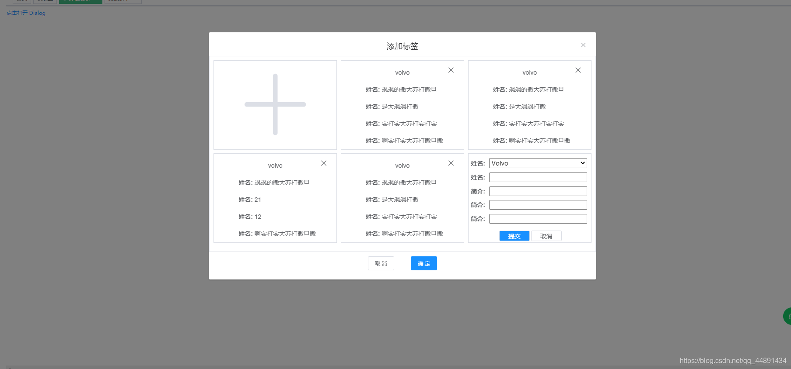

# (七)vue实现人员展示页面

## 功能描述
1. 实现人员展示
2. 实现无限滚动添加 
## display.vue
```vue
<template>
  <div class="display">
    <div class="displayBox">
      <header>
        <span>人员展示页面</span>
      </header>
      <div class="displayL">
        <ul class="personalDiaplayLine">
          <li v-for=" ( item,index ) in personalDiaplayLine" :key="index">
            <ul>
              <li v-for="( ite,ind ) in personalDiaplay" :key="ind ">
                
                <span>{{ ite.title }}</span>
              </li>
            </ul>
          </li>
        </ul>
      </div>
    </div>
  </div>
</template>
<script>
export default {
  data() {
    return {
      personalDiaplayLine: null,
      personalDiaplay: [
        { title: '江户时代那时的撒娇', url: require('@/assets/avatar.jpg') },
        { title: '是中国时代好青年', url: require('@/assets/avatar.jpg') },
        { title: '是中国时代好青年', url: require('@/assets/avatar.jpg') },
        { title: '是中国时代好青年', url: require('@/assets/avatar.jpg') },
        { title: '是中国时代好青年', url: require('@/assets/avatar.jpg') },
        { title: '是中国时代好青年', url: require('@/assets/avatar.jpg') },
        { title: '是中国时代好青年', url: require('@/assets/avatar.jpg') },
        { title: '是中国时代好青年', url: require('@/assets/avatar.jpg') },
        { title: '是中国时代好青年', url: require('@/assets/avatar.jpg') },
        { title: '是中国时代好青年', url: require('@/assets/avatar.jpg') },
        { title: '是中国时代好青年', url: require('@/assets/avatar.jpg') },
        { title: '为人正直，乐于助人是中国时代好青年', url: require('@/assets/avatar.jpg') },
        { title: '为人正直，乐于助人是中国时代好青年', url: require('@/assets/avatar.jpg') },
        { title: '为人正直，乐于助人是中国时代好青年', url: require('@/assets/avatar.jpg') },
        { title: '为人正直，乐于助人是中国时代好青年', url: require('@/assets/avatar.jpg') },
        { title: '为人正直，乐于助人是中国时代好青年', url: require('@/assets/avatar.jpg') },
        { title: '是中国时代好青年', url: require('@/assets/avatar.jpg') },
        { title: '是中国时代好青年', url: require('@/assets/avatar.jpg') },
        { title: '是中国时代好青年', url: require('@/assets/avatar.jpg') },
        { title: '是中国时代好青年', url: require('@/assets/avatar.jpg') },
        { title: '是中国时代好青年', url: require('@/assets/avatar.jpg') },
        { title: '是中国时代好青年', url: require('@/assets/avatar.jpg') },
        { title: '是中国时代好青年', url: require('@/assets/avatar.jpg') },
        { title: '是中国时代好青年', url: require('@/assets/avatar.jpg') },
        { title: '是中国时代好青年', url: require('@/assets/avatar.jpg') },
        { title: '是中国时代好青年', url: require('@/assets/avatar.jpg') },
        { title: '为人正直，乐于助人是中国时代好青年', url: require('@/assets/avatar.jpg') },
        { title: '为人正直，乐于助人是中国时代好青年', url: require('@/assets/avatar.jpg') },
        { title: '为人正直，乐于助人是中国时代好青年', url: require('@/assets/avatar.jpg') },
        { title: '为人正直，乐于助人是中国时代好青年', url: require('@/assets/avatar.jpg') },
        { title: '为人正直，乐于助人是中国时代好青年', url: require('@/assets/avatar.jpg') },
        { title: '是中国时代好青年', url: require('@/assets/avatar.jpg') }
      ]
    }
  },
  mounted() {
    this.sumLine()
  },
  methods: {
    sumLine() {
      if (parseInt(this.personalDiaplay.length / 9) < 1) {
        this.personalDiaplayLine = 1
      } else {
        this.personalDiaplayLine = parseInt(this.personalDiaplay.length / 9)
      }
    }
  }
}
</script>
<style lang="scss" scoped >
*{
  margin: 0;
  padding: 0;
  list-style: none;
}
.display {
  width: 100%;
  height: 100%;
  background-color: salmon;
  display: flex;
  align-items: center;
  justify-content: center;
  background-color: #eff1f4;
}
header {
  width: 100%;
  height: 60px;
  line-height: 60px;
  border-bottom: 1px solid #f0f0f0;
}
header span {
  font-size: 20px;
  letter-spacing: 1px;
  margin-left: 2%;
}
.displayBox {
  width: 98%;
  height: 98%;
  background-color: white;
}
.displayL {
  width: 96%;
  height: calc(100% - 60px);
  margin-left: 2%;
  .personalDiaplayLine{
  width: 100%;
  height:100%;
  overflow: auto;
  overflow-x: hidden;
  overflow-y: auto;
  li{
    width: 100%;
    height: 30%;
    margin-top: 1%;
    ul{
      width: 100%;
      height: 100%;
      li{
        width: 10%;
        height: 100%;
        border: 1px solid #97A8BE;
        margin-left: 1%;
        float: left;
        position: relative;
        top: -7.5%;
        overflow: hidden;
        img{
          position: relative;
        }
        span{
          width: 100%;
          height: 10%;
          text-align: center;
          line-height: -5%;
          overflow: hidden;
          display: inline-block;
          overflow:hidden;
          text-overflow:ellipsis;
          white-space:nowrap;
          position: absolute;
          top: 90%;
          left: 0;
          font-size: 15px;
        }
      }
    }
  }
  }
}

</style>
```
+ 效果图


# (九) 校验电话号码自动生成标签（包含多个粘体复制生成标签）

***校验电话号码自动生成标签***

```vue
<template>
  <div>
    <!-- <label class="labelname">{{labelname}}</label> -->
    <div class="inputbox">
      <div class="arrbox">
        <div v-for="(item, index) in labelarr" :key="index" class="spanbox">
          <span>{{ item }}</span>
          <i class="spanclose" @click="removeitem(index, item)"></i>
        </div>
        <input
          placeholder="输入后回车"
          size="5"
          v-model="currentval"
          @keyup.enter="addlabel"
          @mouseleave="addlabel"
          maxlength="11"
          class="input"
          type="text"
        />
      </div>
    </div>

    <!-- 常用label展示 -->
    <div></div>
  </div>
</template>

<script>
export default {
  name: "enterlabel",
  props: {
    parentarr: {
      type: Array,
      default() {
        return [];
      },
    },
  },
  data() {
    return {
      currentval: "",
      labelarr: [],
    };
  },
  watch: {
    labelarr(old, cur) {
      this.$emit("on-change", this.labelarr);
    },
    parentarr() {
      if (this.parentarr.length > 0) {
        this.labelarr = [];
        for (let i = 0; i < this.parentarr.length; i++) {
          this.labelarr.push(this.parentarr[i]);
        }
      } else {
        this.labelarr = [];
      }
    },
  },
  methods: {
    // 移除标签
    removeitem(index, item) {
      this.labelarr.splice(index, 1);
    },
    // input回车加入labelarr中
    addlabel() {
      let count = this.labelarr.indexOf(this.currentval);
      var re =/^((\+|00)86)?((134\d{4})|((13[0-3|5-9]|14[1|5-9]|15[0-9]|16[2|5|6|7]|17[0-8]|18[0-9]|19[0-2|5-9])\d{8}))$/;
      let str = this.currentval;
      if (count === -1 && re.test(str)) {
        this.labelarr.push(this.currentval);
      }
      else{
        this.$message.error("你输入的电话号码不正确")
      }
      this.currentval = "";
    },
  },
};
</script>

<style>
.inputbox {
  background-color: white;
  font-size: 12px;
  border: 1px solid #dcdee2;
  border-radius: 6px;
  margin-bottom: 18px;
  padding: 6px 1px 1px 6px;
  text-align: left;
  font-size: 0;
  margin-bottom: 0;
}
.input {
  font-size: 14px;
  border: none;
  box-shadow: none;
  outline: none;
  background-color: transparent;
  padding: 0;
  margin: 0;
  width: 200px;
  max-width: inherit;
  min-width: 80px;
  vertical-align: top;
  height: 30px;
  color: #34495e;
  margin: 2px;
  line-height: 30px;
}
.arrbox {
  border-radius: 6px;
  margin-bottom: 10px;
  padding: 6px 1px 1px 6px;
  text-align: left;
  font-size: 0;
}
.spanbox {
  line-height: 30px;
  margin: 2px;
  padding: 0 10px;
  background-color: #1abc9c;
  color: white;
  border-radius: 4px;
  font-size: 13px;
  cursor: pointer;
  display: inline-block;
  position: relative;
  vertical-align: middle;
  overflow: hidden;
  transition: 0.25s linear;
}
.spanbox:hover {
  padding: 0px 17px 0 3px;
}
.spanclose {
  color: white;
  padding: 0 10px 0 0;
  cursor: pointer;
  font-size: 12px;
  position: absolute;
  right: -3px;
  text-align: right;
  text-decoration: none;
  top: 0;
  width: 100%;
  bottom: 0;
  z-index: 2;
  opacity: 0;
  filter: "alpha(opacity=0)";
  transition: opacity 0.25s linear;
  font-style: normal;
}
.spanbox:hover .spanclose {
  padding: 0 10px 5px 0;
  opacity: 1;
  -webkit-filter: none;
  filter: none;
}
.spanclose:after {
  content: "x";
  -webkit-font-smoothing: antialiased;
  -moz-osx-font-smoothing: grayscale;
  line-height: 27px;
}
</style>
```
+ 效果图

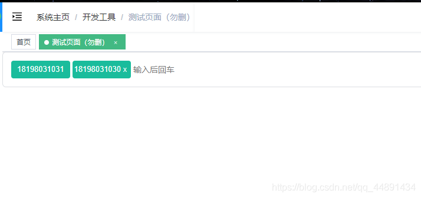
## 当要一次性添加多个电话号码（粘贴复制）生成标签，可以参考下方代码改动。
```js
  addlabel() {
      let count = this.labelarr.indexOf(this.currentval);
      var re = /^((\+|00)86)?((134\d{4})|((13[0-3|5-9]|14[1|5-9]|15[0-9]|16[2|5|6|7]|17[0-8]|18[0-9]|19[0-2|5-9])\d{8}))$/;
      let str = this.currentval.replace(/\s*/g,"");
      // str.prototype.notempty = function(){
      //     return this.filter(t => t!=undefined && t!==null);
      // }
      console.log(str)
      for ( let i = 0; i < (str.length-1) ;){
         if( count === -1 && re.test( str.slice(i,i+11))){
           this.phoneData.push(str.slice(i,i+11))
          for(let j = 0;j < ( this.phoneData.length-1) ;j++){
            const Datas = [...new Set(this.phoneData)];
            this.labelarr = Datas;
          }
        }else{
          this.$message.error("你输入的电话号码不正确");
        }
        i+=11
      }
      console.log(this.labelarr)
      this.currentval = "";
    },
   
```

# (十)vue动态时间显示

### 1. 封装date.js
```js
function showDate() {
    const date = new Date();
    const year=date.getFullYear();
    const month=date.getMonth()+1;
    const day=date.getDate();
    const hour=date.getHours();
    const min=date.getMinutes();
    const sec=date.getSeconds();
    document.getElementById("clock").innerText=year+"-"+month+"-"+day + "                 "+hour+":"+min+":"+sec;
    return {
        year,month,day,hour,min,sec
    }
};
export function showDateClick (){
    let a ={}
    setInterval(()=>{
        a = showDate()
        window.localStorage.setItem('date',JSON.stringify(a))
    },1000)
};

```
### 2.导入date.js
`import { showDateClick } from "../../../static/data";`
### 3.应用

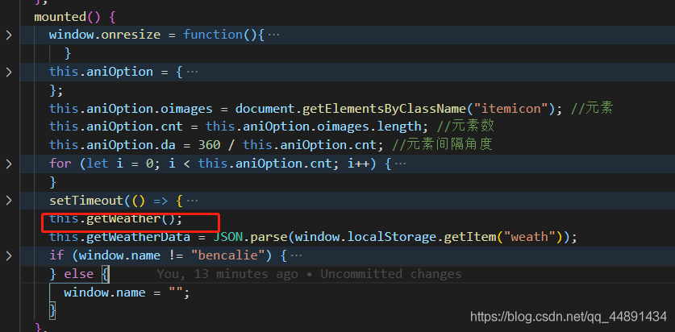

### 4.简单说一下这里我使用的思想。
+ 这个函数会将具体的时候返回，我将页面当作数据要处理的存入到localStorage，在页面调用的时候使用`JSON.parse`方法。如果页面需要动态展示可以直接设置id，来渲染进去。
### 5.效果展示
+ 动态渲染时钟展示
	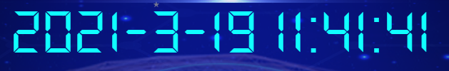

# (十一) vue中鼠标右击菜单（rightmenu），以及回调处理

***
### 安装和引用
+ `npm install rightmenu --save-dev`
+ `import rightMenu from "rightmenu"`
+ `Vue.use(rightMenu)`
###  使用案例
```vue
<template>
    <div>
        <h3>24324</h3>
        <button v-rightMenu = "menudata"  @contextmenu.prevent="get(index)" v-for="(item,index) in 10">
            <p>{{text}}</p>
        </button>
    </div>
</template>
<script>
    export default {
        name:"demo",
        data(){
            return {
                text:'asdas',
                getindex:'1',
                menudata:{
                    // 菜单box的样式   Menu box style
                    boxStyle:"width:150px;background:#f55;",
                    // 菜单选项的样式 Style of menu options
                    optionStyle:"color:#fff;line-height:30px;font-size:15px;",
                    menus:[
                        {
                        /**
                         * content 菜单显示的文字 <支持html> 
                         * callback：菜单点击要触发函数  需要在methods定义 
                         * style ： 本项菜单的单独样式 可以覆盖掉optionStyle  
                         * icon : icon图片地址
                         * iconStyle: icon 图片的样式（例如大小等 直接作用于图片）
                         * iconPosition : 支持left / right (其余全部按照left处理);
                         * content The text displayed on the menu(can use html)
                         * callback: Menu clicks to trigger functions need to be defined in methods
                         * style :  The single style of this menu can override option Style
                         * icon : your icon's url
                         * iconStyle : you icon's style ,is image's style
                         * iconPosition :you can use left or right ;The rest are all processed according to left
                         */
                        /**
                         * 字段(field)           类型(type)                 是否可以为空(is can null)    默认值
                         * content            [ html | text ]                       Y                   ""
                         * callback           [  methods function ]                 Y                   return false
                         * style                   [ css ]                          Y                   ""
                         * icon                   [ url ]                           Y                   ""
                         * iconStyle              [ css ]                           Y                   ""
                         * iconPosition           [string]                          Y                   "left"
                        */
                        content:"menu content",
                        callback:"callbackMethods",
                        style:"border-bottom:1px solid #fff;background:#333;line-height:30px;",
                        icon:"https://ss0.bdstatic.com/70cFuHSh_Q1YnxGkpoWK1HF6hhy/it/u=2310514390,3580363630&fm=27&gp=0.jpg",
                        iconStyle:"width:20px;height:20px;",
                        iconPosition:"left",
                        },
                        {
                        content:"右键菜单二",
                        callback:"otherMethods"
                        }
                    ],
                },
            }
        },
        mounted() {
        },
        watch:{

        },
        methods:{
            get(index){
                this.getindex = index
            },
            callbackMethods(){
                // do something
                console.log(this.getindex)
            },
            otherMethods(){
                // do something
            }
        }
    }
</script>
```
#### 效果展示
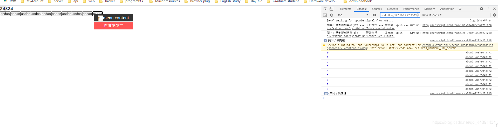

# (十二)vue中使用echarts，自动切换选中目标动画

### 第一步新建`js`文件，将一下代码复制进去
```js
(function (global) {
    global.tools = global.tools || {};


    /**
     * echarts tooltip轮播
     * @param chart ECharts实例
     * @param chartOption echarts的配置信息
     * @param options object 选项
     * {
     *  interval    轮播时间间隔，单位毫秒，默认为2000
*  loopSeries  boolean类型，默认为false。
*              true表示循环所有series的tooltip，false则显示指定seriesIndex的tooltip
* seriesIndex 默认为0，指定某个系列（option中的series索引）循环显示tooltip，
*             当loopSeries为true时，从seriesIndex系列开始执行。
*  updateData  自定义更新数据的函数，默认为null；
*              用于类似于分页的效果，比如总数据有20条，chart一次只显示5条，全部数据可以分4次显示。
* }
     * @returns {{clearLoop: clearLoop}}
     */
    tools.loopShowTooltip = function (chart, chartOption, options) {
        var defaultOptions = {
            interval: 2000,
            loopSeries: false,
            seriesIndex: 0,
            updateData: null
        };


        if (!chart || !chartOption) {
            return {};
        }


        var dataIndex = 0; // 数据索引，初始化为-1，是为了判断是否是第一次执行
        var seriesIndex = 0; // 系列索引
        var timeTicket = 0;
        var seriesLen = chartOption.series.length; // 系列个数
        var dataLen = 0; // 某个系列数据个数
        var chartType; // 系列类型
        var first = true;


        //不循环series时seriesIndex指定显示tooltip的系列，不指定默认为0，指定多个则默认为第一个
        //循环series时seriesIndex指定循环的series，不指定则从0开始循环所有series，指定单个则相当于不循环，指定多个
        //要不要添加开始series索引和开始的data索引？


        if (options) {
            options.interval = options.interval || defaultOptions.interval;
            options.loopSeries =  options.loopSeries || defaultOptions.loopSeries;
            options.seriesIndex = options.seriesIndex || defaultOptions.seriesIndex;
            options.updateData = options.updateData || defaultOptions.updateData;
        } else {
            options = defaultOptions;
        }


        //如果设置的seriesIndex无效，则默认为0
        if (options.seriesIndex < 0 || options.seriesIndex >= seriesLen) {
            seriesIndex = 0;
        } else {
            seriesIndex = options.seriesIndex;
        }


        function autoShowTip() {
            function showTip(){
                //判断是否更新数据
                if(dataIndex === 0 && !first && typeof options.updateData === "function") {
                    options.updateData();
                    chart.setOption(chartOption);
                    document.getElementById('pie1Word').innerHTML = dataIndex;
                }


                var series = chartOption.series;
                chartType = series[seriesIndex].type; // 系列类型
                dataLen = series[seriesIndex].data.length; // 某个系列的数据个数
                var tipParams = {seriesIndex: seriesIndex};
                switch(chartType) {
                    case 'map':
                    case 'pie':
                    case 'chord':
                        tipParams.name = series[seriesIndex].data[dataIndex].name;
                        break;
                    case 'radar': // 雷达图
                        tipParams.seriesIndex = seriesIndex;
                        tipParams.dataIndex = dataIndex;
                        break;
                    default:
                        tipParams.dataIndex = dataIndex;
                        break;
                }


                if(chartType === 'pie' || chartType === 'radar') {
                    // 取消之前高亮的图形
                    chart.dispatchAction({
                        type: 'downplay',
                        seriesIndex: options.loopSeries ? (seriesIndex === 0 ? seriesLen - 1 : seriesIndex - 1) : seriesIndex,
                        dataIndex: dataIndex === 0 ? dataLen - 1 : dataIndex - 1
                    });


                    // 高亮当前图形
                    chart.dispatchAction({
                        type: 'highlight',
                        seriesIndex: seriesIndex,
                        dataIndex: dataIndex,
                    });
                }


                // 显示 tooltip
                tipParams.type = 'showTip';
                chart.dispatchAction(tipParams);


                dataIndex = (dataIndex + 1) % dataLen;
                if (options.loopSeries && dataIndex === 0 && !first) { // 数据索引归0表示当前系列数据已经循环完
                    seriesIndex = (seriesIndex + 1) % seriesLen;
                }


                first = false;
            }


            showTip();
            timeTicket = setInterval(showTip, options.interval);
        }


        // 关闭轮播
        function stopAutoShow() {
            if (timeTicket) {
                clearInterval(timeTicket);
                timeTicket = 0;


                if(chartType === 'pie' || chartType === 'radar') {
                    // 取消高亮的图形
                    chart.dispatchAction({
                        type: 'downplay',
                        seriesIndex: options.loopSeries ? (seriesIndex === 0 ? seriesLen - 1 : seriesIndex - 1) : seriesIndex,
                        dataIndex: dataIndex === 0 ? dataLen - 1 : dataIndex - 1
                    });
                }
            }
        }


        var zRender = chart.getZr();
        function zRenderMouseMove(param) {
            if (param.event) {
                //阻止canvas上的鼠标移动事件冒泡
                param.event.cancelBubble = true;
            }


            stopAutoShow();
        }
        // 离开echarts图时恢复自动轮播
        function zRenderGlobalOut() {
            if (!timeTicket) {
                autoShowTip();
            }
        }


        // 鼠标在echarts图上时停止轮播
        chart.on('mousemove', stopAutoShow);
        zRender.on('mousemove', zRenderMouseMove);
        zRender.on('globalout', zRenderGlobalOut);


        autoShowTip();


        return {
            clearLoop: function() {
                if (timeTicket) {
                    clearInterval(timeTicket);
                    timeTicket = 0;
                }


                chart.off('mousemove', stopAutoShow);
                zRender.off('mousemove', zRenderMouseMove);
                zRender.off('globalout', zRenderGlobalOut);
            }
        };
    };
})(window);

```
### 第二步 在main.js中引入（此处为全局引入，因为自己用的比较多）
### 第三步 项目引用
```vue
<template>
  <div style="width: 100%; height: 100%" id="chartsL"></div>
</template>

<script>
import echarts from "echarts";
export default {
  mounted() {
    this.drawLine();
  },
  methods: {
    drawLine() {
      let img = require("@/assets/img/zjx/analysisTypesChart.png");
      let myChart = echarts.init(document.getElementById("chartsL"));
      var trafficWay = [
        {
          name: "视频",
          value: 200,
          fontSize: 10,
        },
        {
          name: "图片",
          value: 100,
          fontSize: 10,
        },
        {
          name: "文字",
          value: 300,
          fontSize: 10,
        },
        {
          name: "音频",
          value: 400,
          fontSize: 10,
        },
      ];

      var dataTs = ["视频", "图片", "文字", "音频"];

      var data = [];
      var color = [
        "#00ffff",
        "#00cfff",
        "#006ced",
        "#ffe000",
        "#ffa800",
        "#ff5b00",
        "#ff3000",
      ];
      for (var i = 0; i < trafficWay.length; i++) {
        data.push(
          {
            value: trafficWay[i].value,
            name: trafficWay[i].name,
            itemStyle: {
              normal: {
                borderWidth: 5,
                shadowBlur: 5, //圆环阴影
                borderColor: color[i],
                shadowColor: color[i],
              },
            },
          },
          {
            value: 20, //间隙
            name: "",
            itemStyle: {
              normal: {
                label: {
                  show: false,
                },
                labelLine: {
                  show: false,
                },
                color: "rgba(0, 0, 0, 0)",
                borderColor: "rgba(0, 0, 0, 0)",
                borderWidth: 0,
              },
            },
          }
        );
      }
      var seriesOption = [
        {
          name: "",
          type: "pie",
          clockWise: false,
          radius: [50, 52],
          hoverAnimation: true,
          itemStyle: {
            normal: {
              label: {
                // normal:{},
                show: true,
                position: "outside",
                // color: '#fff',//指示字体颜色

                formatter: ["{b|{b}}", "{c|{c}} {f|条}{d|{d}}{e|%}"].join("\n"),
                // formatter: ['{a|{a}}', '{c|{c}}'].join('\n'),
                rich: {
                  b: {
                    color: "#fff",
                    fontSize: 10,
                  },
                  c: {
                    fontSize: 10,
                  },
                  d: {
                    fontSize: 10,
                  },
                  e: {
                    // color: '#fff',
                    fontSize: 8,
                  },
                  f: {
                    fontSize: 10,
                  },
                },

                padding: [-40, -60], //牵引线调整字体距离
              },
              labelLine: {
                length: 20, //角度长度
                length2: 50, //水平长度
                show: true,
                color: "#00ffff",
              },
            },
          },
          data: data,
        },
      ];
      var option = {
        color: color,

        title: {
          text: "素材总条目",
          subtext: "6514684",
          left: "center",
          top: "40%",
          // top: "center",
          textStyle: {
            fontSize: 10,
            color: "#fff",
          },
          subtextStyle: {
            fontSize: 11,
            color: "#fff",
          },
        },

        graphic: {
          elements: [
            //内圆环样式
            {
              type: "image",
              z: 3,
              style: {
                image: img,
                width: 78,
                height: 78,
              },
              left: "center",
              top: "center",
              position: [100, 100],
            },
          ],
        },
        tooltip: {
          show: false,
        },
        legend: {
          //标尺那一块样式
          icon: "roundRect",
          orient: "vertical",
          itemWidth: 13,
          itemHeight: 10,
          // x: 'left',
          data: dataTs,
          left: 200, //调整标尺的位置
          bottom: 20,
          align: "left",
          textStyle: {
            color: "#fff",
            fontSize: 8,
          },
          style: {
            width: 10,
            height: 10,
          },
          itemGap: 4, //标识字体行间距
        },
        toolbox: {
          show: false,
        },
        series: seriesOption,
      }

      //使用制定的配置项和数据显示图表
      myChart.setOption(option);
      function createExample(option, tooltipOption) {
        // 基于准备好的dom，初始化echarts图表
        // 为echarts对象加载数据
        myChart.setOption(option);
        tools.loopShowTooltip(myChart, option, tooltipOption); //第一个参数需要改一下
      }
      createExample(option, {
        loopSeries: true,
        // 间隔时间
         interval: 2000,
      });
    },
  },
};
</script>
```
### 注意点
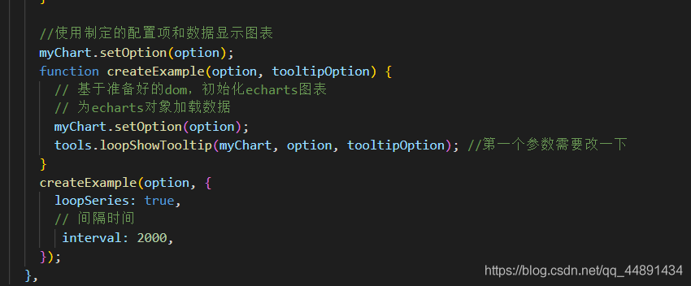

# (十三)Vue项目中particles的使用，来实现屏幕飘浮小星星动画（满天星）

1. 下载包可采用npm/cnpm

   +  ` npm/cnpm install particles.js --save`
   + 这里附上git地址：`https://github.com/VincentGarreau/particles.js`
   + +  版本：	
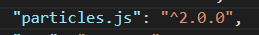

2.  在main.js 中引包，注册

   + ```js
     import particles from 'particles.js'
     
     Vue.use(particles)
     ```

3.  在所要使用的界面引用如下代码

   + ```html
     <div id="particles-js">
           <canvas class="particles-js-canvas-el" width="1920" height="1080" style="width: 100%; height: 100%;"></canvas>
     </div>
     ```

   + ```js
      mounted(){
           particlesJS('particles-js',
           {
           "particles": {
             "number": {
               "value": 40,//数量
               "density": {
                 "enable": true, //启用粒子的稀密程度
                 "value_area": 800 //区域散布密度大小
               }
             },
             "color": {
               "value": "#f3eaa1" //原子的颜色
             },
             "shape": {
               "type": "star", //原子的形状 "circle" ,"edge" ,"triangle" ,"polygon" ,"star" ,"image" ,["circle", "triangle", "image"]
               "stroke": {
                 "width": 0, //原子的宽度
                 "color": "#f3eaa1" //原子颜色
               },
               "polygon": {
                 "nb_sides": 5 // 原子的多边形边数
               },
               "image": {
                 "src": "img/github.svg", // 原子的图片可以使用自定义图片 "assets/img/yop.svg" , "http://mywebsite.com/assets/img/yop.png"
                 "width": 100, //图片宽度
                 "height": 100 //图片高度
               }
             },
             "opacity": {
               "value": 1, //不透明度
               "random": true, //随机不透明度
               "anim": {
                 "enable": true, //渐变动画
                 "speed": 1, // 渐变动画速度
                 "opacity_min": 0, //渐变动画不透明度
                 "sync": true
               }
             },
             "size": {
               "value": 3, //原子大小
               "random": true, // 原子大小随机
               "anim": {
                 "enable": false, // 原子渐变
                 "speed": 4, //原子渐变速度
                 "size_min": 0.3,
                 "sync": false
               }
             },
             "line_linked": {
               "enable": false, //连接线
               "distance": 150, //连接线距离
               "color": "#ffffff", //连接线颜色
               "opacity": 0.4, //连接线不透明度
               "width": 1 //连接线的宽度
             },
             "move": {
               "enable": true, //原子移动
               "speed": 1, //原子移动速度
               "direction": "none", //原子移动方向   "none" ,"top" ,"top-right" ,"right" ,"bottom-right" ,"bottom" ,"bottom-left" ,"left" ,"top-left"
               "random": true, //移动随机方向
               "straight": false, //直接移动
               "out_mode": "out", //是否移动出画布
               "bounce": false, //是否跳动移动
               "attract": {
                 "enable": false, // 原子之间吸引
                 "rotateX": 600, //原子之间吸引X水平距离
                 "rotateY": 600  //原子之间吸引Y水平距离
               }
             }
           },
           "interactivity": {
             "detect_on": "canvas", //原子之间互动检测 "canvas", "window"
             "events": {
               "onhover": {
                 "enable": true, //悬停
                 "mode": "bubble" //悬停模式      "grab"抓取临近的,"bubble"泡沫球效果,"repulse"击退效果,["grab", "bubble"]
               },
               "onclick": {
                 "enable": false,  //点击效果
                 "mode": "repulse"  //点击效果模式   "push" ,"remove" ,"bubble" ,"repulse" ,["push", "repulse"]
               },
               "resize": true // 互动事件调整
             },
             "modes": {
               "grab": {
                 "distance": 100, //原子互动抓取距离
                 "line_linked": {
                   "opacity": 0.8  //原子互动抓取距离连线不透明度
                 }
               },
               "bubble": {
                 "distance": 250, //原子抓取泡沫效果之间的距离
                 "size": 4, // 原子抓取泡沫效果之间的大小
                 "duration": 2, //原子抓取泡沫效果之间的持续事件
                 "opacity": 1, //原子抓取泡沫效果透明度
                 "speed": 3
               },
               "repulse": {
                 "distance": 400, //击退效果距离
                 "duration": 0.4 //击退效果持续事件
               },
               "push": {
                 "particles_nb": 4 //粒子推出的数量
               },
               "remove": {
                 "particles_nb": 2
               }
             }
           },
           "retina_detect": true
         }
       
         );
      }
     ```

   ### 之所以这么写，是遇到了一些问题，自己将data数据抽离出去，就会报错（传的是相对路径），不知道为什么，还请各位小伙伴赐教。

   ### 效果图如下
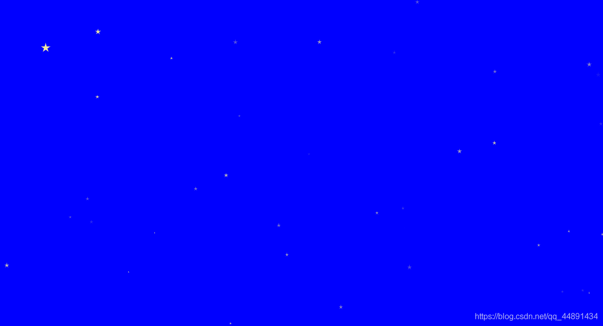## 组件封装(可以直接拿过去使用哦！！)
```vue
<template>
  <div>
    <div id="particles-js">
      <canvas
        class="particles-js-canvas-el"
        width="1920"
        height="1080"
        style="width: 100%; height: 100%"
      ></canvas>
    </div>
  </div>
</template>

<script>
export default {
  mounted() {
    particlesJS("particles-js", {
      particles: {
        number: {
          value: 40, //数量
          density: {
            enable: true, //启用粒子的稀密程度
            value_area: 800, //区域散布密度大小
          },
        },
        color: {
          value: "#f3eaa1", //原子的颜色
        },
        shape: {
          type: "star", //原子的形状 "circle" ,"edge" ,"triangle" ,"polygon" ,"star" ,"image" ,["circle", "triangle", "image"]
          stroke: {
            width: 0, //原子的宽度
            color: "#f3eaa1", //原子颜色
          },
          polygon: {
            nb_sides: 5, // 原子的多边形边数
          },
          image: {
            src: "img/github.svg", // 原子的图片可以使用自定义图片 "assets/img/yop.svg" , "http://mywebsite.com/assets/img/yop.png"
            width: 100, //图片宽度
            height: 100, //图片高度
          },
        },
        opacity: {
          value: 1, //不透明度
          random: true, //随机不透明度
          anim: {
            enable: true, //渐变动画
            speed: 1, // 渐变动画速度
            opacity_min: 0, //渐变动画不透明度
            sync: true,
          },
        },
        size: {
          value: 3, //原子大小
          random: true, // 原子大小随机
          anim: {
            enable: false, // 原子渐变
            speed: 4, //原子渐变速度
            size_min: 0.3,
            sync: false,
          },
        },
        line_linked: {
          enable: false, //连接线
          distance: 150, //连接线距离
          color: "#ffffff", //连接线颜色
          opacity: 0.4, //连接线不透明度
          width: 1, //连接线的宽度
        },
        move: {
          enable: true, //原子移动
          speed: 1, //原子移动速度
          direction: "none", //原子移动方向   "none" ,"top" ,"top-right" ,"right" ,"bottom-right" ,"bottom" ,"bottom-left" ,"left" ,"top-left"
          random: true, //移动随机方向
          straight: false, //直接移动
          out_mode: "out", //是否移动出画布
          bounce: false, //是否跳动移动
          attract: {
            enable: false, // 原子之间吸引
            rotateX: 600, //原子之间吸引X水平距离
            rotateY: 600, //原子之间吸引Y水平距离
          },
        },
      },
      interactivity: {
        detect_on: "canvas", //原子之间互动检测 "canvas", "window"
        events: {
          onhover: {
            enable: true, //悬停
            mode: "bubble", //悬停模式      "grab"抓取临近的,"bubble"泡沫球效果,"repulse"击退效果,["grab", "bubble"]
          },
          onclick: {
            enable: false, //点击效果
            mode: "repulse", //点击效果模式   "push" ,"remove" ,"bubble" ,"repulse" ,["push", "repulse"]
          },
          resize: true, // 互动事件调整
        },
        modes: {
          grab: {
            distance: 100, //原子互动抓取距离
            line_linked: {
              opacity: 0.8, //原子互动抓取距离连线不透明度
            },
          },
          bubble: {
            distance: 250, //原子抓取泡沫效果之间的距离
            size: 4, // 原子抓取泡沫效果之间的大小
            duration: 2, //原子抓取泡沫效果之间的持续事件
            opacity: 1, //原子抓取泡沫效果透明度
            speed: 3,
          },
          repulse: {
            distance: 400, //击退效果距离
            duration: 0.4, //击退效果持续事件
          },
          push: {
            particles_nb: 4, //粒子推出的数量
          },
          remove: {
            particles_nb: 2,
          },
        },
      },
      retina_detect: true,
    });
  },
};
</script>
<style lang="scss" scoped>
#particles-js {
  position: fixed;
  width: 100vw;
  height: 100vh;
  top: 0;
  left: 0;
}
</style>
```

# (十四)HTML5使用Geoloacation API检测浏览器的支持性

+ 在调用HTML5 Deolocation API函数前，需要确保浏览器支持此功能。当浏览器不支持时，可以提供一些替代文本，以提示用户升级浏览器或安装插件（如 Gears）来增强现有浏览器功能。
+ 检测浏览器支持性，代码：

```javascript
	function testSupport() {
		if(navigator.geolocation){
			document.getElementById("support").innerHTML = " 支持  HTML5 Geolocation";
		}else{
			document.getElementById("support").innerHTML= "该浏览器不支持 HTML5 Geolocation ！建议升级浏览器或安装插件（如：Gears）"
		}
	}
```

# (十五)HTML5实现头像的上传

+ 这是利用form-data给后台传输数据，来实现头像的上传加载！

1. html代码
```
<!DOCTYPE html>
<html lang="en">
<head>
    <meta charset="UTF-8">
    <meta name="viewport" content="width=, initial-scale=1.0">
    <meta http-equiv="X-UA-Compatible" content="ie=edge">
    <title>Document</title>
    </head>
<body>
    <div class="container">
        <input enctype="multipart/form-data" type="file">
        <input id="Susername"  type="text" placeholder="用户名">
        <input id="Ssex" type="number" placeholder="年龄">
        <input id="Sage" type="text" placeholder="专业">
        <input id="Smajor" type="text" placeholder="学校">
        <input id="Sschool" type="text" placeholder="QQ">
        <input id="Sqq" type="text" placeholder="地址">
        <input id="Saddress" type="text" placeholder="座右铭">
        <input id="Smotto" type="button" value="上传">
       
        <div style="clear: both;"></div>
             <progress value="0" max="100"></progress>
    </div>
    <div class="showarea">
        <h3>显示区域</h3>
    </div>
    </body>
</html>
```
2. 样式代码
```
 .container{
            box-sizing: border-box;
            width: 404px;
            height: 100px;
            border: 1px solid #ccc;
            border-radius: 5px;
            padding-top: 20px;
            background: linear-gradient(to bottom,#0ff,#0ff 20px,transparent 0);
            margin: 0 auto;
        }
        input{
            padding: 0;
            margin: 0;
          
        }
        .container input[type=file]{
            width: 300px;
            height: 30px;
            border: 1px solid #ccc;
            background: #7FFFD4;
            color: #133131;
            float: left;
        }
        .container input[typr=button]{
            width: 100px;
            height: 32px;
            float: left;
            border: 1px solid #ccc;
            color:  #133131;
        }
        progress{
            display: none;
            width: 400px;
            height: 30px;
            margin-top: 7px;
        }
        .showarea{
            width: 600px;
            min-height: 200px;
            border: 1px solid #ccc;
            margin: 30px auto;
        }
        .showarea h3{
            widows: 100px;
            margin: 0 auto;
            line-height: 60px;
            text-align: center;
            border-bottom: 1px solid #cccc;
            color: #133131;
            
        }
        .showareaimg{
            max-width: 1000%;
        }
```
3. javescript代码
```
  var file = document.querySelector('[type=file]');
        var sub = document.querySelector('[type=button]');
        var show = document.querySelector('.showarea');
        var progress = document.querySelector('progress');
        var Susername = document.getElementById('Susername');
        var Ssex = document.getElementById('Ssex');
        var Sage = document.getElementById('Sage');
        var Smajor = document.getElementById('Smajor');
        var Sschool = document.getElementById('Sschool');
        var Sqq = document.getElementById('Sqq');
        var Saddress = document.getElementById('Saddress');
        var Smotto = document.getElementById('Smotto');
        
        sub.onclick = function(e){
            var fileobje = file.files[0];
            var formdata = new FormData();
            formdata.append('upload',fileobje);
            formdata.append('upload',Susername.value);
            formdata.append('upload',Ssex.value);
            formdata.append('upload',Sage.value);
            formdata.append('upload',Smajor.value);
            formdata.append('upload',Sschool.value);
            formdata.append('upload',Sqq.value);
            formdata.append('upload',Saddress.value);
            formdata.append('upload',Smotto.value);
            var xhr = new XMLHttpRequest();
            var fr = new FileReader();
            fr.readAsDataURL(fileobje)
            fr.onload=function(e){
                // console.log(e);
                var img = document.createElement('img');
                img.src = this.result;
                // console.log( img.src);
                show.appendChild(img)
            }
            xhr.upload.onprogress = function(e){
                progress.value= parseInt(e.loaded/e.total*100)
            }
          xhr.open("POST","http://127.0.0.1:3000/avatar")
        //   console.log(formdata)
          xhr.send(formdata);
          console.log(formdata)
        console.log(formdata.getAll("upload"))
        }
```

# (十六)mui结合tomdJS实现前后端数据分离以及数据的渲染

+ mui结合tomdJS实现前后端数据分离以及数据的渲染

1. 下载安装nodeJS
2. 安装tmodJS

	`npm install -g tmodjs`
3. 后端就口地址

	`http://39.96.31.43:3000/books`
4. 创建 template文件夹，下一级目录在创建build文件夹，
5. 根目录下创建 **index.html**
6. template下创建**header.html**
7. CMD 执行<kbd>tmod</kbd>

	+ bulid下会生成**template.js**
	+ 在template下会生成**package.json**文件
8. 目录：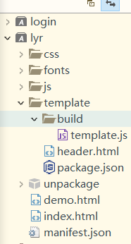
9. index.js下的代码

	<!DOCTYPE html>
	<html lang="utf-8">
	    <head>
	        <meta http-equiv="Content-Type" content="text/html; charset=utf-8" />
	       
	    </head>
	
	    <body>
	        <!-- 头部-start -->
	        <div id="headerDIV"></div>
	        <!-- 头部-end -->
	        <!-- header.html 编译后的 template.js -->
	        <script src="js/mui.min.js"></script>
	        <script type="text/javascript" src="./template/build/template.js"></script>
			<script>
				 mui.init();
				 var headerDIV = document.getElementById('headerDIV');
				 mui.plusReady(function(){
				 	mui.get('http://39.96.31.43:3000/books',{category:'news'},function(success){
				 			var data ={menu1:success[0].id,menu2:success[1].id,menu3:success[2].id};
							var headerHTML = template('header',data); 
								console.log(headerHTML)
								headerDIV.innerHTML = headerHTML;
						},'json'
					);
				 })
			</script>
	
	    </body>
	
	</html>
10. 如果 报<kbd>...is null</kbd>,解决方法，调整**script标签**中的所有东西放在**body中**就可以解决
11. header.html下的代码：
    ```
    	<ul>
    <!--通过artTemplate引擎{{}}语法解析，-->
        <li>{{menu1}}</li>
        <li>{{menu2}}</li>
        <li>{{menu3}}</li>
    </ul>
    ```
12. 渲染结果
    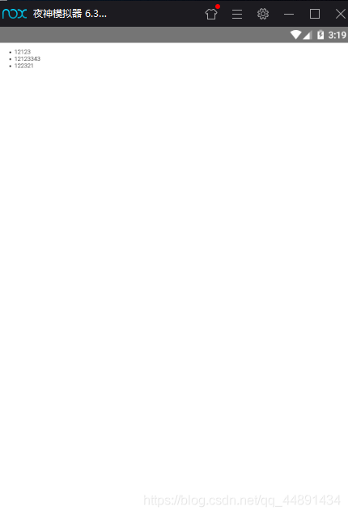
13. tmod运行结果
    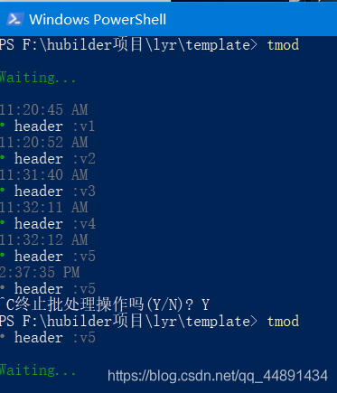
