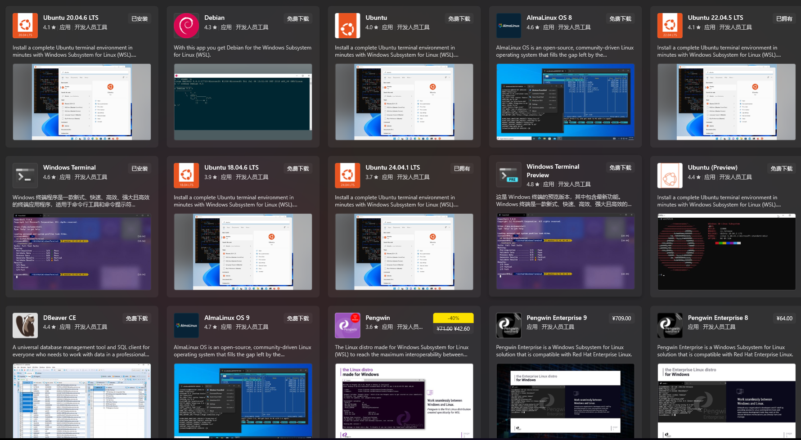
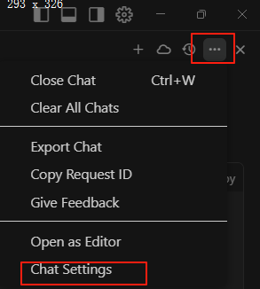
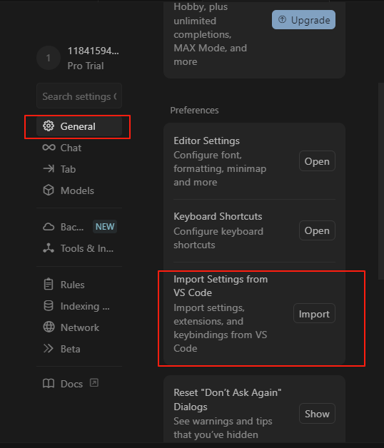
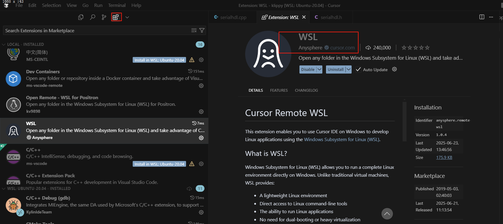
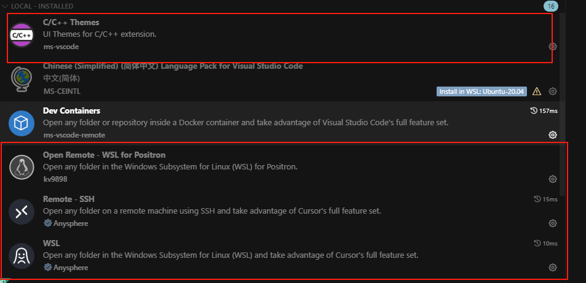
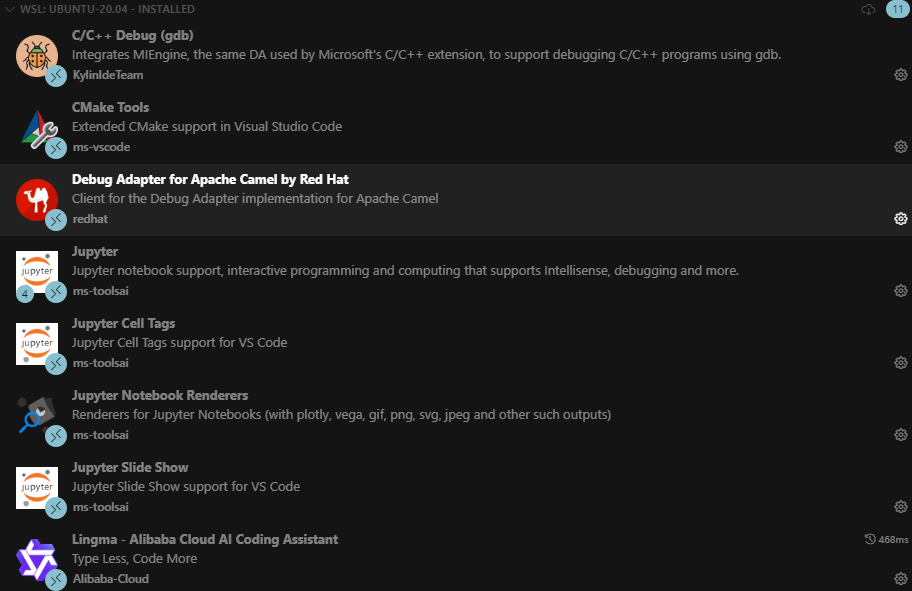
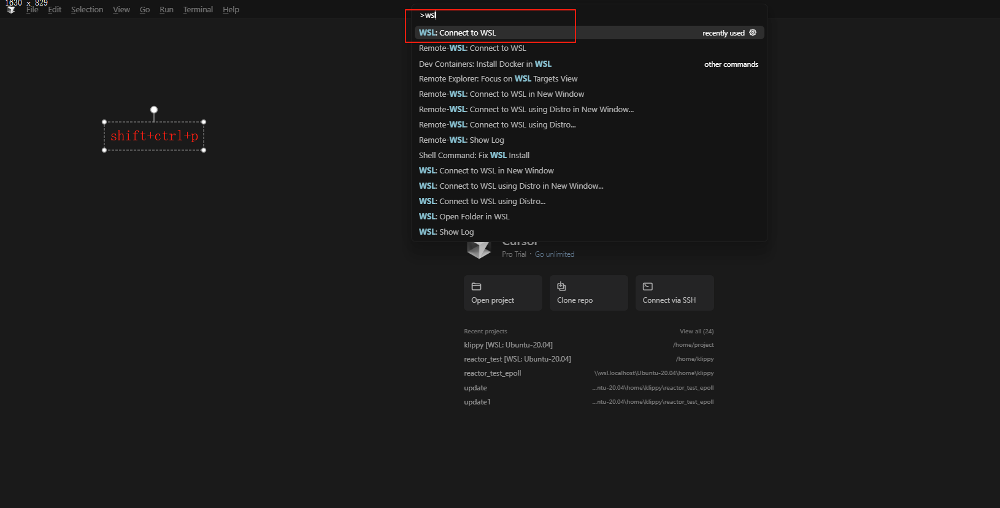
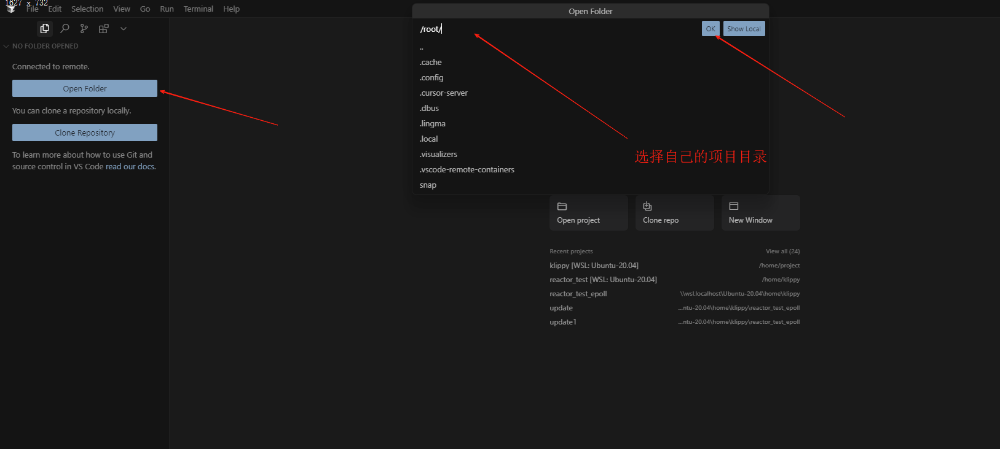
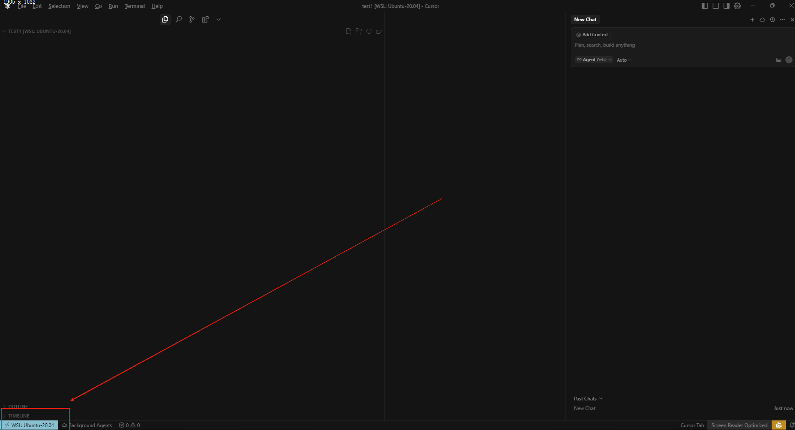

## wsl+cursor嵌入式开发
<!-- tabs:start -->
#### **1. 下载cursor**
1. 下载cursor，[下载地址](https://www.cursor.com/cn)【有可能需要科学上网】
2. 下载wsl，直接在微软商店搜索`wsl`下载就好(微软提供了多种，大家只需要选择自己要用的就好，我选择的是ubuntu)；

> 此时基本配置就已经完成了：如果关于wsl安装和使用遇到问题（安装出错，或者磁盘不够，做迁移），可以参考靠[此链接](https://zjxweb.github.io/#/projectPractice/cppProject/automatedTestingPlatform/)
3. 默认安装位于 C 盘，如果你的磁盘空间不够，可以修改迁移下已经安装的 Ubuntu 的位置。
```powershell
 # 先看下自己安装的 WSL 名字是什么，下面是我的名字是 Ubuntu-22.04，你要做替换
 wsl -l
 # 进入 D 盘，然后新建 wslubuntu 文件夹，你可以叫其他名字，用来承载新迁移的目录
 mkdir D:\wslubuntu
 cd D:\wslubuntu
 # 接着开始迁移
 wsl --export Ubuntu-22.04 d://wslubuntu//ubuntu-22.04.tar
 wsl --unregister Ubuntu-22.04
 wsl --export Ubuntu-22.04 d://wslubuntu//ubuntu-22.04.tar
 # 再次使用 wsl -l 命令查看，然后启动 Ubuntu-22.04 看下是否迁移正常。

```
4. 在cmd输入`wsl`进入linux环境，在项目目录下执行`code .`打开项目;

#### **2. 配置cursor **
1. cursor的配置可以通过直接导入vscode的配置，操作方法如下


2. 安装配置 cursor 插件
+ 这里我们着重需要给 cursor 安装 WSL 插件，打开 cursor，点击左下角插件图标，搜索 WSL，安装插件。

> 下面是一些插件推荐安装
+ 在windows下的插件

+ 在WSL下的插件

> python相关的大家自行安装，这里就不多赘述了。
3. 在 cursor 中打开 WSL 的项目。
> 通过使用 cursor 快捷方式 `CTRL+SHIFT+P` 调出命令面板，键入 `WSL`，你将看到可用的选项列表，你可以在 WSL 会话中重新打开文件夹等。


> 完成后如图


<!-- tabs:end -->
