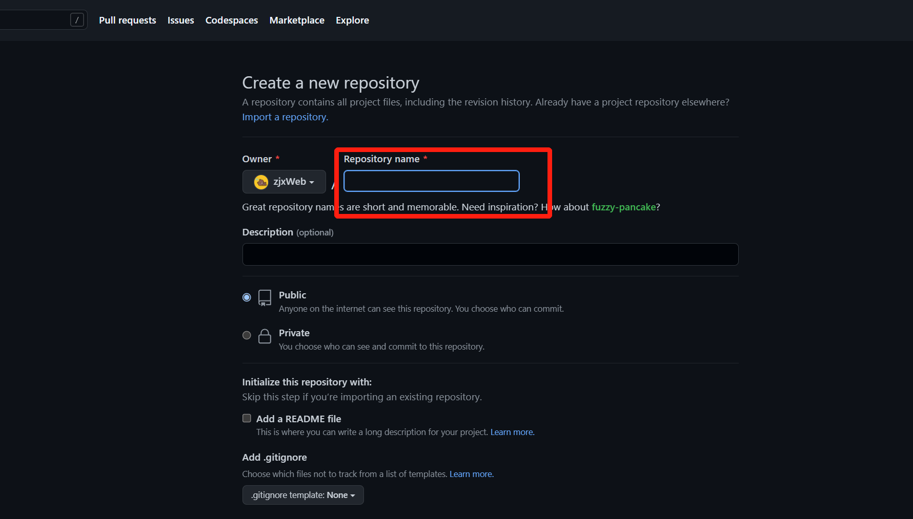
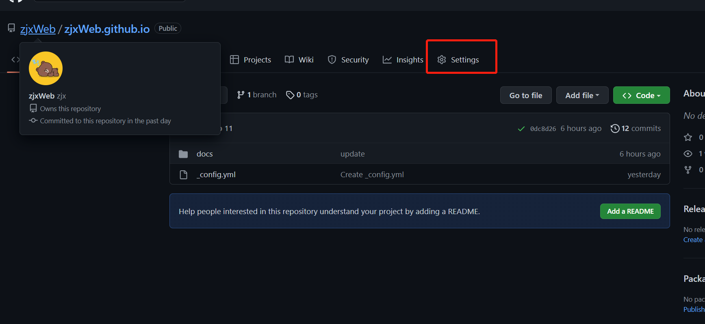
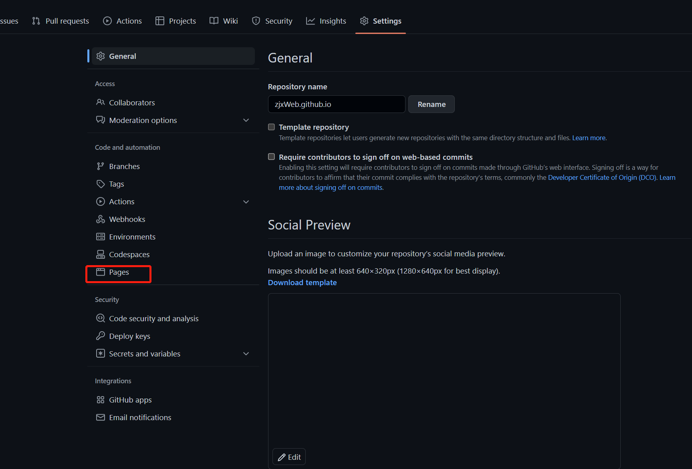
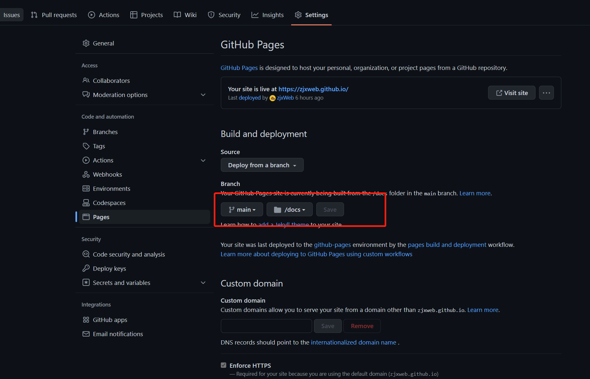
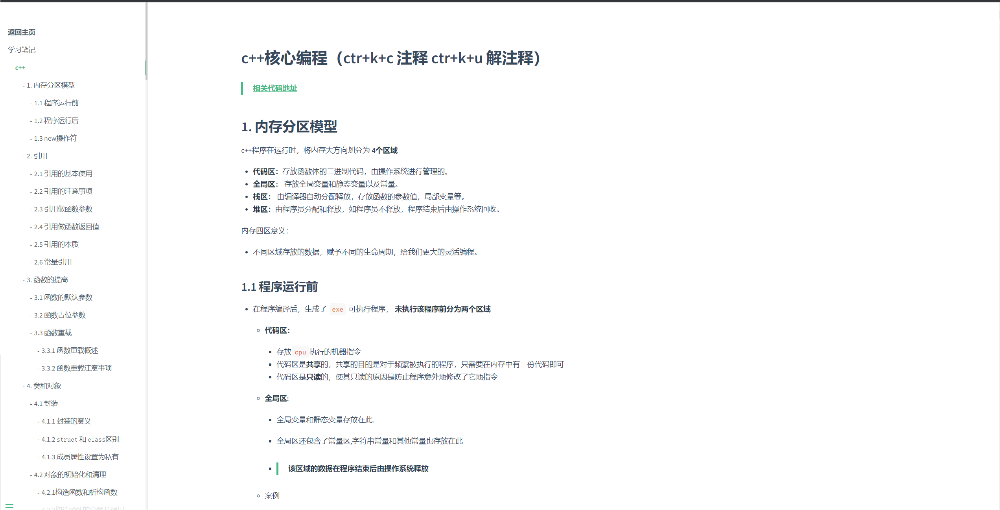
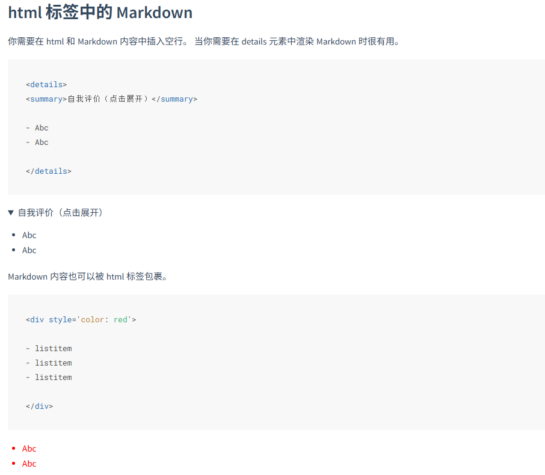

# docsify搭建个人博客

+ [拼搏的小浣熊博客地址](https://zjxweb.github.io/)
+ [docsify官网](https://docsify.js.org/#/zh-cn/)

## 1. 流程

1. 先找个免费建站的玩意——github pages
   + [github pages官网](https://pages.github.com/)
2. 在github建立仓库，不会的自行百度一下，太简单了，就不写啦。
   + 注意点！要注意！别粗心啊！一步错，可就步步错了！
     + 
     + 红框的命名规则一定要注意哦
     + **你的github用户名.github.io**    例如我的：`zjxWeb.github.io`
3. 恭喜你这里你就已经完成了很大的一步了。接下来，继续搞起来！爽！爽！爽！
4. 按照图片的标注，你点就好，网上的都是老版本的，你看我的就对了。别乱看！答应我！
   + 
5. 继续点就完了。别放弃！
   + 
6. 666快啦，继续点！
   + 
   + 这里大家安装好docsify之后就会有`/doc`选项了。小事，这里有问题，随时联系哈！多多交流，相互学习吗？
7. 这里好像就完了啊！简单吧！后面就只需要`push`起来就是个人的博客啦！开心吗？简简单单，我就拥有自己的博客啦！

## 2. 接下来我们看看如何做内容吧

+ [docsify官网](https://docsify.js.org/#/zh-cn/)
+ 写的有点详细啊，完全没必要看其他的，其他的都是废物！
+ 但是有个小注意点哦！
  + 就是引入的时候，注意一下，要不然会有多页的时候，没有滚动功能，那叫一个惨，一看网上的解决方法，每一个靠谱的，关键时候还是要靠自己，可能这东西有点小众 吧（大佬别碰我啊）！

## 3.看看我的吧！有点丑，答应我，别笑！

+ 再来一张吧！
+ 太心急分享了，做的让人难以言表啊！

## 4. 功能

<!-- tabs:start -->

#### **三角折叠**

<!-- tabs:end -->
