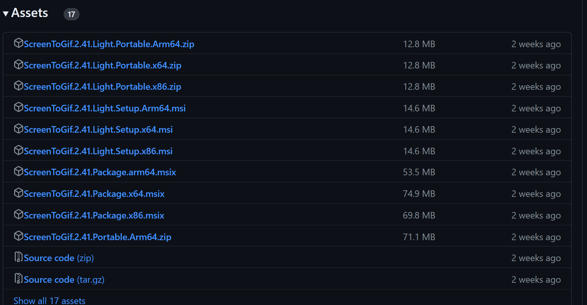

## `ScreenToGif`

> 这是一款可以将屏幕录制成`GIF`格式的开源小工具

> **对应的链接** https://github.com/NickeManarin/ScreenToGif

+ 下载链接：https://github.com/NickeManarin/ScreenToGif/releases
+ 

> 依赖下载

> `.NET下载`：https://dotnet.microsoft.com/zh-cn/download/dotnet/thank-you/runtime-desktop-8.0.3-windows-x64-installer?cid=getdotnetcore